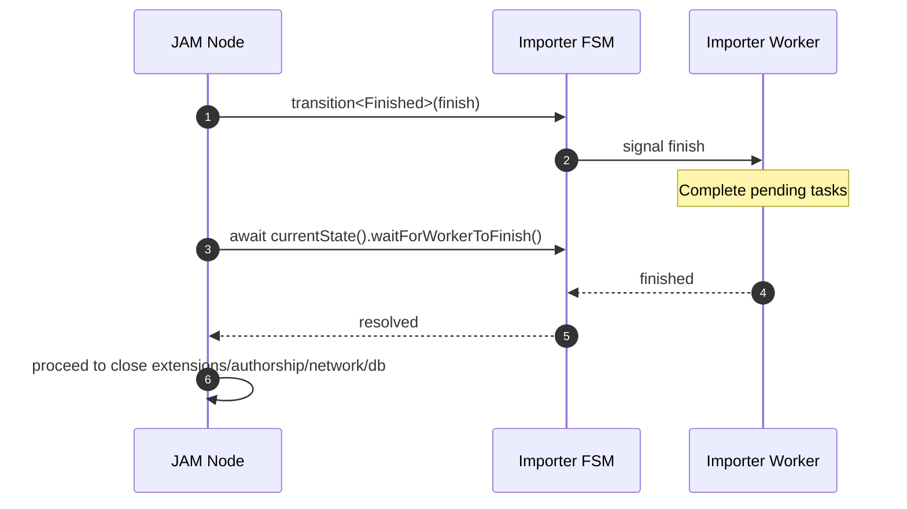
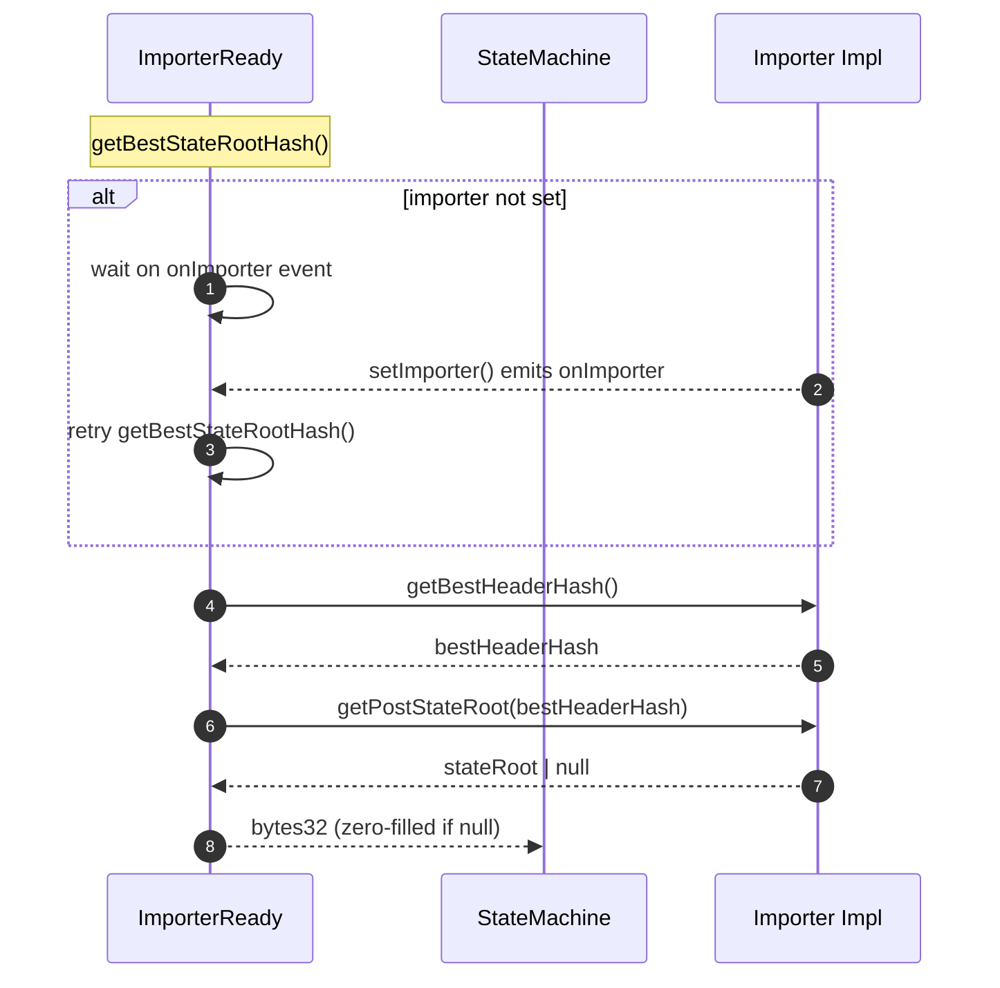

# Fuzzer improvements

## Pull Request by @tomusdrw

- [x] Fixed race condition when accessing genesis state root (importer worker not ready)
- [x] env variable to disable lookup anchor checks.
- [x] GP version parsing and fuzz identification


## Comment by @coderabbitai[bot]

<!-- This is an auto-generated comment: summarize by coderabbit.ai -->
<!-- This is an auto-generated comment: skip review by coderabbit.ai -->

> [!IMPORTANT]
> ## Review skipped
> 
> Auto incremental reviews are disabled on this repository.
> 
> Please check the settings in the CodeRabbit UI or the `.coderabbit.yaml` file in this repository. To trigger a single review, invoke the `@coderabbitai review` command.
> 
> You can disable this status message by setting the `reviews.review_status` to `false` in the CodeRabbit configuration file.

<!-- end of auto-generated comment: skip review by coderabbit.ai -->
<!-- walkthrough_start -->

<details>
<summary>📝 Walkthrough</summary>

<!-- This is an auto-generated comment: release notes by coderabbit.ai -->

## Summary by CodeRabbit

- New Features
  - Added environment variable to bypass lookup-anchor validation with a warning, aiding controlled operations.
- Bug Fixes
  - Graceful shutdown now waits for the importer worker to finish, reducing shutdown race conditions.
  - Importer readiness is coordinated to avoid null access and ensure accurate state root retrieval.
  - Adjusted Unix IPC socket path on POSIX systems for more reliable connections.
- Tests
  - Added fuzzing config test and compatibility lifecycle fixtures.
- Refactor
  - Minor internal cleanups and log timing adjustments.
- Chores
  - Added dependency: @typeberry/numbers.

<!-- end of auto-generated comment: release notes by coderabbit.ai -->
## Walkthrough
Changes adjust IPC socket paths on POSIX, add a CURRENT_VERSION export and related tests, introduce fuzzing metadata helper and tests, modify JAM node shutdown to await importer completion, add an env-gated bypass in contextual verification, refine importer readiness with event-driven waiting, reorder a log, and make a minor refactor.

## Changes
| Cohort / File(s) | Summary of changes |
|---|---|
| **IPC socket path**<br>`extensions/ipc/server.ts` | POSIX socket path now uses `path.join(os.tmpdir(), name)` instead of `…/${name}.ipc`; Windows pipe path unchanged. Unlink and listen targets updated accordingly. |
| **Compatibility version fixture**<br>`packages/core/utils/compatibility.test.ts`, `packages/core/utils/compatibility.js` | Tests now preserve/restore version using beforeEach/afterEach and new `CURRENT_VERSION`. Public constant `CURRENT_VERSION` exported from compatibility module. |
| **Fuzzing details + tests**<br>`packages/jam/node/main-fuzz.ts`, `packages/jam/node/main-fuzz.test.ts`, `packages/jam/node/package.json` | Added `getFuzzDetails()` and used its spread in `startFuzzTarget`. Node name set to "@typeberry/jam"; `gpVersion` parsed from `CURRENT_VERSION` (pre-release trimmed). Added unit test for fuzz config and dependency `@typeberry/numbers@0.0.1`. |
| **Graceful shutdown sequencing**<br>`packages/jam/node/main.ts` | On shutdown, now awaits importer worker completion (`waitForWorkerToFinish()`) after transitioning to Finished before closing other subsystems. |
| **Importer lifecycle readiness**<br>`workers/importer/state-machine.ts`, `workers/importer/index.ts`, `workers/importer/importer.ts` | Added internal onImporter readiness signal; `getBestStateRootHash()` now waits for importer availability before computing. Moved “Importer waiting” log after `worker.setImporter(importer)`. Minor refactor splitting best-header/root retrieval into variables. |
| **Contextual verification override**<br>`packages/jam/transition/reports/verify-contextual.ts` | Added logger and an env-controlled bypass (`SKIP_LOOKUP_ANCHOR_CHECK`) for missing lookup anchor; logs a warning when bypassing; otherwise returns the original error. |

## Sequence Diagram(s)




## Estimated code review effort
🎯 4 (Complex) | ⏱️ ~60 minutes

## Poem
> I twitch my ears at sockets new,  
> Await the importer, patient too—  
> A gentle hush before shutdown’s art,  
> While fuzzing learns each versioned part.  
> If anchors hide, we log and tread,  
> Then hop ahead with cautious thread.  
> Thump-thump: the warren’s green light spread.

</details>

<!-- walkthrough_end -->
<!-- internal state start -->


<!-- DwQgtGAEAqAWCWBnSTIEMB26CuAXA9mAOYCmGJATmriQCaQDG+Ats2bgFyQAOFk+AIwBWJBrngA3EsgEBPRvlqU0AgfFwA6NPEgQAfACgjoCEYDEZyAAUASpETZWaCrKPR1AGxJcAYtgBe/pQozLz4UmwYuMiQBgByjgKUXACsAJwADJCxAKo2ADJcsLi43IgcAPQVROqw2AIaTMwVPh7YAGbtsvkqiBW4stwkSRQuFdzYHh4V6Vm5iMmQBMzYiLQUAO7ZBgDK+NgUDCSQAlQYDLBcuLRg7QH+YPChFOHb0M6kuCdnF1zM2lhYjtcNRVlx8ENAQYbCQJPASBtKOV7ABrfCIfx4NAAGkg/xoq38iHgaKo2x6SQ8yIAFBh8OQAJTbADCFBI1Do6E4kAATBkeSkwBk0kKABzQACMEo4/I4EoA7AAtIwAEWkDAo8G44npHAMUB88AAHpyqEcFBhaOp4PTIBtYGR0AwjohiRgiJBSORichECCaJAXvgvtSntx8BQaHwNhGUcE6V82WhaLImbEoABBWhKehkOEvDCRL4SZzwFReJb4SBWxDl44efD4FHYbjoc6wCOMB0MFExfWQADiVkgUgoxNt3Gcbo9mHod0CKCUUXg7XgDGoNqwYa8RboRn0xnAUDI9Hw7RwBGIZGUNHoTSLXF4/GEonEUhk8iYSioqnUWh0B4mFAcCoKgmAXoQXo3py97sFwVBbA4TguCcn6KMov6aNouhgIYh6mAYJBGjQGDjqRFRagwFQLBQo4aNEeoAETMQYFiQBmACSV7kFQt72I4/woWeXaYKQiD7pAcT0mAADq8CWvgGzIDkGDGmAtAsAC9j4D2JBfJOuCwCJ7p0I+bJwvsiAePIBmwBoQj4PJ1LovRoRWhQ1IMriAAGAAkADeGBoGwAC+GiUd5DIANyQHSWy2fZjkYM5iCudw7meT5AVBaFkUaJAckKUpPDUEZbL/PJyDeQAOrV1UaLV3BaiQtXZcFJAhd5+UgcgFyidISwOtpulfKuFarJy7SdhxVjMvwWBWAA8jsHEABr2LIfokMwiC4vJDBtFa7qDccIIUJ8kBTXw7SpdgGAePJKI7LI5xtvQNF0Q9W0YPlVj1A9DDsVYHFvZARHhpGdDjP9a7VqIHjOBu9LIM4xx3X1Jm0DF9LWW2KBRJQQUeCVhn2LgmrHagzCKCu8K0PlUnGWJlZg6MnawLOD3HZ24TKFMFrk/gxPtA2WxJLI9L0IZxyIDpcb6aV9gkF4YibhoRjmJYGYeFGSOkSz0twwdiM6vrwngxGfGdhMAgA2Dy7iNIEmMxjzMEGDRoQ7e0O27D7DqPIxJEEFuAHANSg0GIdDqwYACifpPByd7oYGsLwlsJCdJbXAALJ0PAjgGMxjH7gRk49mgYkVEwbIVHg8BUtXLAGfAagPQM9HSJoDFFyxbGcdx0HvQJzjyMJrtO/2HGhJbyBESROYs/th31iuoiyAdxwdk2yDUkkV0kLHaAXLiaDtFGR8XEys7oLFCI8DDgOILIzACELkDMnkNix3E0AAPoADVY42BWotOIl0XjMAUKEDcbcA72VSlPKILxaDYBdLfWsUhaAAKRJuEcpY6z42tGgB6QQpZVk/jYb+v9AHANAXEdWmZswyEzhGQ+x8jLuxbLQDk9g0BYJwWOPBGxagfy/j/f+QCQEcTAScVhbIwYcKWF3Rh7FmHoHPpQS+nCqxsj9Gwk6PBzI2lWCOXBto5CMBIVzD0zJm6wIbvA3mox4BKGpJguggiyLX00XwdkFxlF+lUQAaRICQMoHskDiGOjQP0yB5IgjEDFQ2Sh2hoEmF8WJXwmDLgwNgAa7tnGaiUJAO6qT5KcndhcUQKJDGpPSTrMxQj6S4hEaTQ2yZF6rmImHe2DgKYej9Lw1Aei9JyNwIiR0WTEEa37jrG8m5kDuxSfDE2iz+DngtpDU8fAbZ239o7cS/Y/q+0Blsr4nTTKQG8pQ6hki6EyLiN5C0Qyogey9pNSB1zy4okrtIJutd66NyaC3OBHchCIC6kYeO4h8QwRTsY++mcrrcjzlaQuxdS5gCMD8v5fQhDBQqHSJQFQKoYFuPcTuQSe6Yv7lxKCvFORIUEmPc8E8jlZloCjO+Ww7rqECaNBuxxqAlQrlXAlzRiUkFJQCClgQqXdyWRzYsJDXEcmQPOfwFpVxEAOHrT015eJqxgENLJ/F1DHEYpq+SHock6sYgLAE3LpwVjNYxRAHZJh3iTAGO18APTtC+QwA4bI3mjjIg6+0a5LgSRsHdZAON5Arg/vY8QYLZDhUQNSAc3AvFqwARkP+8o/4ZCZKgcm+TVHMmscgT4fhAhqhBA3LN19LToFdJQaIuI4RoDhuE2OABHbAJC7SiP9XSNkXAADajEpV5vpBoAyFxGIAF1cSGRFYbTVjbtBUmfCIMQYMh0kPKAYbIUApVxHalwRiAABAYQwRhjAlSXc9sV0LzowFwfyeI0AOQoFwDIuJmDyQjIB3ES7LiQAlJAEKkBqTWItKOPibTOEuAzIgHIooGRnt0J6XN5iv2QB/f8f94G8SgYA5AeUEHqC/EgFkODCH+Y5OQ5yVDSx0OYew0YaeXtkATXoMvbAJTyayAw1h3EdiYFpscQMXEObP24iUP249HhT5trrfcHdzbuqmq7n0sOyBL3tVBkQAjzSsCrmVly9ACiiLHy+FGis1jFI2vfUoT9i66M6OrCudolAY6a3YvMo1yMDZDSUMbMLZtNme0tpya2j97biEOc7ekJBoUJzhcnEpiKM5Z0jLnfOGKWL6jLsfX54rCVSplfJOV/h6KntpVrelhqk78WQqypmk8mGL17eQDO8XtmQAdB4IYfAtMNr0rultg0RVslDhQfWva2Agh4SCfdr5R2k2sx4WzJm2C4jnYRjT9BzNeY8yQK9bAUDIA5hQG4X5KlVjvQ+4YlBn3BUYjFE7lm7tw01FgkcZZIBebEz4SBwIBnUlxaQAAUrLH64bNzRXw5+gH35JCch7WDwj9EXCQ5YNDm11JbkSNodIsBGhEDcHbtSRiYBGIMinRkFdDJVEcSwGS+t/hcRDMjLz9450xlxVTkcbHSqZa8HZKec8U3/A6apJ5fGW1kwbJKq6dzh2SDHY/adszFmyL4ytHCVB1iM2QB2EMBgtN1xTFkOuoaMuLKmPBgDfle3bO0nQjd7woqqskERwunKuurufq4ODwnUPyak7h0HpHGgUf0i8ujwjkf8cQ5jzD8nNCpH0IZNfBRbI6fH05JYjQleFdK5baogAQiQDmFk+DssXAc+QJY2gDUE6hQxmqlgfD0lwKSJTQ9yKaANXtOTXlfDe4MD7oxZAVBfYbjHE0pe/v/TwS2eDhK5/uVTuIv39f/fKk6wH2O5xfPj8H5HBuBB4HfVsQQTbyD0Fx4bQbo3lYTfyotaWfADYNQgM1IfU8k1uoge0M8kYdeDYPY/O/oxw/wQUpARYTIZ+lUpS7Y/U9MGsrEWsoWesSyVYKy0WRBGu5yiWuyyWBy8IRyBo6Mps6A2YVy3k5yl0jBeC1eM2zankzy8k3ylWeKy+NW6EdW5KmqTW3kWWsKHWz2qccISKhWqKJWzAvcJc5W2KBg8e+KohJKZKTWTEfcrWg8jKw8XWGu7KEkXOv68kTWTuxwB06IxwtkT+do2g0Ql0nYhsYYCW0YsYwQ7sq4qkHqciB8As8k2A7mHqeAGkGwP0JqLhxilkCgJS9uXgQm0BUYMIyYGa5MmAxIpswAhoIRDotAeg1IoYWRlAEGlsTIAAvHoCEB8hQBoMEUgLALDnUUyKhvsBchsB4TanpscF/vIfonooYvkaRNaLaHohkvjLfKMcjCCG8r4ZDBQCUR0ZyDfGgAMeoPEtURsfJFsfTMGqMOwMCByJ5BoHsbgD4BGDJAERQNAPgJsR6irvvAYmEEcPnDElWE4QsB7CRGRLtBeB2GOAgNwMdnpDGBQCiDamdnUtQCoGgAsHpqgK3obDkoLMLKLBAiwJdPAGyGALOLcBGBdO7OBLsR4UynUNcIpFgAsEOmQEcEFvgSFrrKbMQXUqsjFgmnFh8jsg/KciltaL1pJFWJQbQD7HbEHCHL0q3hHK+NHDIYnHxPIflmDMocVuimoZipoTikIdVpKmIfHggrqOoeyQPAyh1syqPJYRzCZByiwfQANvfEoJCEuAwPIOwC4DevevPk+kvnkq/EiIxDehkBoJGRKA6sspFuEieCyXQQsToSISaSSmaRCguhKfwAARwecKbCOuykFnMpyesnGccFFgjHyRQcNlbNQSKbQeKWqJ6SyfIJcrQFwN5AGY+p9sGYkEiPwVgN5KmRKkSqaUaSQOaRgM8h6YmecMmbSEisgvIN5HPr2YvkSgOWOOGZAIxJGdGYxHlKqTlqkccJqcitnJAPkIpJaQadoZOboc0FMYUZuBUCXrPBUKOCuLIGANifPMOh4IYZaXSqYbaSPEJGyo6WJNYcgooGgpPjypWNwGAF4FIMTEAaQHwNSJhZQEyJYmsdEh6DeUQFhfiVAj2QvmMLhXwDfBqOyERdefgKRYFoNlUV7BoGtmgG0UKqHriO6rgO0BwB+ZGIgMzqopytynIJOK6CTEZFdIYg2E2C2G2BcJ2J3mqkwQId+V0DCMESQHYgTMRMiPaI6FPvSDQMRIAJgEKM7YnYqACYXhZSCxbIRwbytscsCafAhsDoyYwQYBGADhZ5bh1SPYyA3x0gqUeYGgOwwSM0f8+Qi0i0wSOQVgf8GYcQzIAAEotDYH/NlbHMyMEvlBxOeOUm/ntF8EAdygMctu5h/kNF/jRaDNiZEQNL0Y/otgcKpMdOBJ9hGNjAASIoCfyotufobC7iYiwk3jaLRW2l1ctrZazC8NhTCPxrHGzK0TsCQEQEWDYI2LgDecpdwFzhpbQBzv2HAMcLVT1R6GwK6H8mDCBiUOxg6FgNJaifEijKrFIHdjekdc2K2JgGpS3t2LUgpQFP+cRBoEpYDRmHZRQHBjGF6pdLuriA/l8EUq4scGBD9VOSXFAC7NBQUlWHcAWXgnKaCBMZ2FKTKbDBmMDNjPdEmgTMtiOphe5nRZLDMUTMtezJzJzQoh2WyaWQsuFhWUbNWeQebHWVQcKfsg7HQeluQCeXIQimnEoSijqQXHqWVhAFobCXGGOBRIcSbS0cBS1uxG1jxOBRYePMTUcldQargA3n6JcTQPtcGFlaiZ0UyGth2PQAMcgGyGkmIGwlfgSb2i6iQKhRUqnEtlgBul8O5K+LjPJFzJyJ8K7bgFlbLpQN7e8WWlEFWJ8FYOiLgO7SQJ7bgJlCzL2hMoQFtK2EyfkucP7iCngMcEkH6LnX5RQAXUZLjr2nASOiWJqHWA4VgOkc7WXW7YgdXXvF3L3d+APa2u9AQLXAtYnUNHMY0gIUMh7QdQzFWMGA6IAcxbDJ2NiS8LiYpD1ogMkkNIIB9IQlvfgl3qnGShvrWGwCLQQWWeLSQfGWQVybWYKfwA2Qralkrf2FJOQPBnSPLfTcDPfRdXHNlmrXlhrQVlrZAGijrXefrUYIbUiGbX4RRJaERBbcYVbWBXxHaZBffRJDnLzFLENEAZABnXuYALwbgApzuQB8Z+HuHWjHQKUeVhUaAOqBoEmGwECtjCQpL4AqTiDEzpECCVZ12+KGKEXBCVQrHmgYnLEUBoJ8Q3xvzOUS0kPYVWM056SCPrHsV+GF7DGpx+ga4+GqTiCqr+D6o3wRVa6iN4kYH6zozE1Yzvr30sz9V8COm0A2IQMCw32XR4monY3kWTFPDuYKMIDIAcPEhKBgDIqvh/0cli36wS1VlrLhYy3gNJaNmK2TwwpqnwpYOKE4NXk3kbCEMERWN9A6MUDUSIFgD/AXAVLUMlygU2n0MQXdZWFIKCyoLoJunxRA68JJhHSRX2DjojoKU+GHGcNrzemby96dKc1GKSC8L0j2NRgHPfS6NYDXOUA5EpiqIyRvVKy4CPN8AYnWJ0BBX9MA5i6U0ZHtqpy5G97bTqCMVXOHG4hkDlic0YDyC3FIgswRUqlQBZ1dyV3V0D0LFfPPPyBi63EareFDQAvuxJDvrkp5L8yfEKLotHREBcDJp7MtGAvBiQCyBjILC4CVXCOeG7NP0YBfNgxSBRCT3i4HALDckBa4ABI+U+2qKLRt3aP7NgQlgNwT3O3Z04sHV4uLaaiwgFI70HWjY+3pNstCM+78DaibhFkczHHuhr3x3dXcpBAvC3ANwgscyhGsumucsOWTDqZGLSCUBwjHSTUpFv0epoBDDKujiIZJAzVX0O3pMDbSTiPwmiPWLqM9h2jvNWvrF3YYBWWJiy7yCUkKAQgLJSBwviu4DqRA6Oi3FYEqNqvsugSeNlikLl7yKOHNz1wxJDQH3nlmu+t2TBbBbawAPlNAOVm8nS0CkJZCl7J+wNP0E5mYlViU1LYDQ1Mrt01nIbsxxNOnkanYNam4NZX+qwDdN4RAT2xy4QR0PwqsBwSBi7GdYsq97PY/hqBYQAS4QGCPv3jqB/yuKIB/z5Z0B/wC5fAHggdHiQAABsooEo7Q8oAALOuBKLQCkDwihwAMwZDCgpBYcZCYeiiZBodSiZwZAkCiiigpBoBoDHCIegcsDPUQdcrQfYOwcng4R6BAA== -->

<!-- internal state end -->
<!-- tips_start -->

---


<sub>Comment `@coderabbitai help` to get the list of available commands and usage tips.</sub>

<!-- tips_end -->


## Comment by @github-actions[bot]


<details>
<summary>View all</summary>

| File | Benchmark | Ops |  |
|------|-----------|-----|--|
| [bytes/hex-to.ts[0]](../blob/9b7cddcec954835559f1bda834ab150d40d6b5af//_work/typeberry-runner-5/typeberry/typeberry/benchmarks/bytes/hex-to.ts) | number toString + padding | 291143.7 ±0.71% | fastest ✅ |
| [bytes/hex-to.ts[1]](../blob/9b7cddcec954835559f1bda834ab150d40d6b5af//_work/typeberry-runner-5/typeberry/typeberry/benchmarks/bytes/hex-to.ts) | manual | 13797.53 ±1.39% | 95.26% slower |
| [codec/bigint.compare.ts[0]](../blob/9b7cddcec954835559f1bda834ab150d40d6b5af//_work/typeberry-runner-5/typeberry/typeberry/benchmarks/codec/bigint.compare.ts) | compare custom | 219782273.88 ±5.09% | 2.42% slower |
| [codec/bigint.compare.ts[1]](../blob/9b7cddcec954835559f1bda834ab150d40d6b5af//_work/typeberry-runner-5/typeberry/typeberry/benchmarks/codec/bigint.compare.ts) | compare bigint | 225232014.53 ±6.78% | fastest ✅ |
| [bytes/hex-from.ts[0]](../blob/9b7cddcec954835559f1bda834ab150d40d6b5af//_work/typeberry-runner-5/typeberry/typeberry/benchmarks/bytes/hex-from.ts) | parse hex using `Number` with NaN checking | 133788.65 ±0.66% | 84.89% slower |
| [bytes/hex-from.ts[1]](../blob/9b7cddcec954835559f1bda834ab150d40d6b5af//_work/typeberry-runner-5/typeberry/typeberry/benchmarks/bytes/hex-from.ts) | parse hex from char codes | 885343.27 ±0.13% | fastest ✅ |
| [bytes/hex-from.ts[2]](../blob/9b7cddcec954835559f1bda834ab150d40d6b5af//_work/typeberry-runner-5/typeberry/typeberry/benchmarks/bytes/hex-from.ts) | parse hex from string nibbles | 541981.27 ±0.77% | 38.78% slower |
| [collections/map-set.ts[0]](../blob/9b7cddcec954835559f1bda834ab150d40d6b5af//_work/typeberry-runner-5/typeberry/typeberry/benchmarks/collections/map-set.ts) | 2 gets + conditional set | 66452.68 ±1.15% | fastest ✅ |
| [collections/map-set.ts[1]](../blob/9b7cddcec954835559f1bda834ab150d40d6b5af//_work/typeberry-runner-5/typeberry/typeberry/benchmarks/collections/map-set.ts) | 1 get 1 set | 40881.44 ±0.84% | 38.48% slower |
| [codec/bigint.decode.ts[0]](../blob/9b7cddcec954835559f1bda834ab150d40d6b5af//_work/typeberry-runner-5/typeberry/typeberry/benchmarks/codec/bigint.decode.ts) | decode custom | 169604159.76 ±2.32% | fastest ✅ |
| [codec/bigint.decode.ts[1]](../blob/9b7cddcec954835559f1bda834ab150d40d6b5af//_work/typeberry-runner-5/typeberry/typeberry/benchmarks/codec/bigint.decode.ts) | decode bigint | 103358671.75 ±2.66% | 39.06% slower |
| [hash/index.ts[0]](../blob/9b7cddcec954835559f1bda834ab150d40d6b5af//_work/typeberry-runner-5/typeberry/typeberry/benchmarks/hash/index.ts) | hash with numeric representation | 189.1 ±0.12% | 25.32% slower |
| [hash/index.ts[1]](../blob/9b7cddcec954835559f1bda834ab150d40d6b5af//_work/typeberry-runner-5/typeberry/typeberry/benchmarks/hash/index.ts) | hash with string representation | 113.01 ±1.33% | 55.37% slower |
| [hash/index.ts[2]](../blob/9b7cddcec954835559f1bda834ab150d40d6b5af//_work/typeberry-runner-5/typeberry/typeberry/benchmarks/hash/index.ts) | hash with symbol representation | 177.35 ±1% | 29.96% slower |
| [hash/index.ts[3]](../blob/9b7cddcec954835559f1bda834ab150d40d6b5af//_work/typeberry-runner-5/typeberry/typeberry/benchmarks/hash/index.ts) | hash with uint8 representation | 151.34 ±1.41% | 40.24% slower |
| [hash/index.ts[4]](../blob/9b7cddcec954835559f1bda834ab150d40d6b5af//_work/typeberry-runner-5/typeberry/typeberry/benchmarks/hash/index.ts) | hash with packed representation | 253.23 ±0.94% | fastest ✅ |
| [hash/index.ts[5]](../blob/9b7cddcec954835559f1bda834ab150d40d6b5af//_work/typeberry-runner-5/typeberry/typeberry/benchmarks/hash/index.ts) | hash with bigint representation | 186.89 ±0.34% | 26.2% slower |
| [hash/index.ts[6]](../blob/9b7cddcec954835559f1bda834ab150d40d6b5af//_work/typeberry-runner-5/typeberry/typeberry/benchmarks/hash/index.ts) | hash with uint32 representation | 182.74 ±1.01% | 27.84% slower |
| [math/add_one_overflow.ts[0]](../blob/9b7cddcec954835559f1bda834ab150d40d6b5af//_work/typeberry-runner-5/typeberry/typeberry/benchmarks/math/add_one_overflow.ts) | add and take modulus | 250165519.78 ±5.71% | fastest ✅ |
| [math/add_one_overflow.ts[1]](../blob/9b7cddcec954835559f1bda834ab150d40d6b5af//_work/typeberry-runner-5/typeberry/typeberry/benchmarks/math/add_one_overflow.ts) | condition before calculation | 249711463.12 ±4.96% | 0.18% slower |
| [math/count-bits-u32.ts[0]](../blob/9b7cddcec954835559f1bda834ab150d40d6b5af//_work/typeberry-runner-5/typeberry/typeberry/benchmarks/math/count-bits-u32.ts) | standard method | 77407920.2 ±1.92% | 66.23% slower |
| [math/count-bits-u32.ts[1]](../blob/9b7cddcec954835559f1bda834ab150d40d6b5af//_work/typeberry-runner-5/typeberry/typeberry/benchmarks/math/count-bits-u32.ts) | magic | 229218574.59 ±5.82% | fastest ✅ |
| [math/count-bits-u64.ts[0]](../blob/9b7cddcec954835559f1bda834ab150d40d6b5af//_work/typeberry-runner-5/typeberry/typeberry/benchmarks/math/count-bits-u64.ts) | standard method | 1504676.85 ±1.51% | 86.92% slower |
| [math/count-bits-u64.ts[1]](../blob/9b7cddcec954835559f1bda834ab150d40d6b5af//_work/typeberry-runner-5/typeberry/typeberry/benchmarks/math/count-bits-u64.ts) | magic | 11500315.7 ±1.38% | fastest ✅ |
| [math/mul_overflow.ts[0]](../blob/9b7cddcec954835559f1bda834ab150d40d6b5af//_work/typeberry-runner-5/typeberry/typeberry/benchmarks/math/mul_overflow.ts) | multiply and bring back to u32 | 246613626.76 ±6.48% | 5.21% slower |
| [math/mul_overflow.ts[1]](../blob/9b7cddcec954835559f1bda834ab150d40d6b5af//_work/typeberry-runner-5/typeberry/typeberry/benchmarks/math/mul_overflow.ts) | multiply and take modulus | 260160056.47 ±5.63% | fastest ✅ |
| [math/switch.ts[0]](../blob/9b7cddcec954835559f1bda834ab150d40d6b5af//_work/typeberry-runner-5/typeberry/typeberry/benchmarks/math/switch.ts) | switch | 251334356.59 ±5.09% | 0.73% slower |
| [math/switch.ts[1]](../blob/9b7cddcec954835559f1bda834ab150d40d6b5af//_work/typeberry-runner-5/typeberry/typeberry/benchmarks/math/switch.ts) | if | 253182047.56 ±4.98% | fastest ✅ |
| [codec/decoding.ts[0]](../blob/9b7cddcec954835559f1bda834ab150d40d6b5af//_work/typeberry-runner-5/typeberry/typeberry/benchmarks/codec/decoding.ts) | manual decode | 21789915.29 ±1.35% | 85.87% slower |
| [codec/decoding.ts[1]](../blob/9b7cddcec954835559f1bda834ab150d40d6b5af//_work/typeberry-runner-5/typeberry/typeberry/benchmarks/codec/decoding.ts) | int32array decode | 154169789.71 ±2.75% | fastest ✅ |
| [codec/decoding.ts[2]](../blob/9b7cddcec954835559f1bda834ab150d40d6b5af//_work/typeberry-runner-5/typeberry/typeberry/benchmarks/codec/decoding.ts) | dataview decode | 153373722.34 ±3.3% | 0.52% slower |
| [codec/encoding.ts[0]](../blob/9b7cddcec954835559f1bda834ab150d40d6b5af//_work/typeberry-runner-5/typeberry/typeberry/benchmarks/codec/encoding.ts) | manual encode | 3313057.62 ±0.34% | 18.97% slower |
| [codec/encoding.ts[1]](../blob/9b7cddcec954835559f1bda834ab150d40d6b5af//_work/typeberry-runner-5/typeberry/typeberry/benchmarks/codec/encoding.ts) | int32array encode | 4088611.51 ±0.23% | fastest ✅ |
| [codec/encoding.ts[2]](../blob/9b7cddcec954835559f1bda834ab150d40d6b5af//_work/typeberry-runner-5/typeberry/typeberry/benchmarks/codec/encoding.ts) | dataview encode | 3758808.23 ±1.49% | 8.07% slower |
| [logger/index.ts[0]](../blob/9b7cddcec954835559f1bda834ab150d40d6b5af//_work/typeberry-runner-5/typeberry/typeberry/benchmarks/logger/index.ts) | console.log with string concat | 5752133.93 ±56.62% | fastest ✅ |
| [logger/index.ts[1]](../blob/9b7cddcec954835559f1bda834ab150d40d6b5af//_work/typeberry-runner-5/typeberry/typeberry/benchmarks/logger/index.ts) | console.log with args | 879611.5 ±91.12% | 84.71% slower |
| [codec/view_vs_collection.ts[0]](../blob/9b7cddcec954835559f1bda834ab150d40d6b5af//_work/typeberry-runner-5/typeberry/typeberry/benchmarks/codec/view_vs_collection.ts) | Get first element from Decoded | 26593.63 ±5.87% | 60.83% slower |
| [codec/view_vs_collection.ts[1]](../blob/9b7cddcec954835559f1bda834ab150d40d6b5af//_work/typeberry-runner-5/typeberry/typeberry/benchmarks/codec/view_vs_collection.ts) | Get first element from View | 67895.37 ±0.21% | fastest ✅ |
| [codec/view_vs_collection.ts[2]](../blob/9b7cddcec954835559f1bda834ab150d40d6b5af//_work/typeberry-runner-5/typeberry/typeberry/benchmarks/codec/view_vs_collection.ts) | Get 50th element from Decoded | 25522.72 ±3.13% | 62.41% slower |
| [codec/view_vs_collection.ts[3]](../blob/9b7cddcec954835559f1bda834ab150d40d6b5af//_work/typeberry-runner-5/typeberry/typeberry/benchmarks/codec/view_vs_collection.ts) | Get 50th element from View | 26660.19 ±1.93% | 60.73% slower |
| [codec/view_vs_collection.ts[4]](../blob/9b7cddcec954835559f1bda834ab150d40d6b5af//_work/typeberry-runner-5/typeberry/typeberry/benchmarks/codec/view_vs_collection.ts) | Get last element from Decoded | 18563.32 ±3.1% | 72.66% slower |
| [codec/view_vs_collection.ts[5]](../blob/9b7cddcec954835559f1bda834ab150d40d6b5af//_work/typeberry-runner-5/typeberry/typeberry/benchmarks/codec/view_vs_collection.ts) | Get last element from View | 26887.58 ±0.76% | 60.4% slower |
| [codec/view_vs_object.ts[0]](../blob/9b7cddcec954835559f1bda834ab150d40d6b5af//_work/typeberry-runner-5/typeberry/typeberry/benchmarks/codec/view_vs_object.ts) | Get the first field from Decoded | 448737.69 ±0.27% | fastest ✅ |
| [codec/view_vs_object.ts[1]](../blob/9b7cddcec954835559f1bda834ab150d40d6b5af//_work/typeberry-runner-5/typeberry/typeberry/benchmarks/codec/view_vs_object.ts) | Get the first field from View | 103944.76 ±0.13% | 76.84% slower |
| [codec/view_vs_object.ts[2]](../blob/9b7cddcec954835559f1bda834ab150d40d6b5af//_work/typeberry-runner-5/typeberry/typeberry/benchmarks/codec/view_vs_object.ts) | Get the first field as view from View | 90084.19 ±2.76% | 79.92% slower |
| [codec/view_vs_object.ts[3]](../blob/9b7cddcec954835559f1bda834ab150d40d6b5af//_work/typeberry-runner-5/typeberry/typeberry/benchmarks/codec/view_vs_object.ts) | Get two fields from Decoded | 329523.46 ±2.92% | 26.57% slower |
| [codec/view_vs_object.ts[4]](../blob/9b7cddcec954835559f1bda834ab150d40d6b5af//_work/typeberry-runner-5/typeberry/typeberry/benchmarks/codec/view_vs_object.ts) | Get two fields from View | 68350.49 ±2.61% | 84.77% slower |
| [codec/view_vs_object.ts[5]](../blob/9b7cddcec954835559f1bda834ab150d40d6b5af//_work/typeberry-runner-5/typeberry/typeberry/benchmarks/codec/view_vs_object.ts) | Get two fields from materialized from View | 170949.06 ±0.63% | 61.9% slower |
| [codec/view_vs_object.ts[6]](../blob/9b7cddcec954835559f1bda834ab150d40d6b5af//_work/typeberry-runner-5/typeberry/typeberry/benchmarks/codec/view_vs_object.ts) | Get two fields as views from View | 83558.28 ±0.23% | 81.38% slower |
| [codec/view_vs_object.ts[7]](../blob/9b7cddcec954835559f1bda834ab150d40d6b5af//_work/typeberry-runner-5/typeberry/typeberry/benchmarks/codec/view_vs_object.ts) | Get only third field from Decoded | 447754.73 ±0.22% | 0.22% slower |
| [codec/view_vs_object.ts[8]](../blob/9b7cddcec954835559f1bda834ab150d40d6b5af//_work/typeberry-runner-5/typeberry/typeberry/benchmarks/codec/view_vs_object.ts) | Get only third field from View | 92612.21 ±1.96% | 79.36% slower |
| [codec/view_vs_object.ts[9]](../blob/9b7cddcec954835559f1bda834ab150d40d6b5af//_work/typeberry-runner-5/typeberry/typeberry/benchmarks/codec/view_vs_object.ts) | Get only third field as view from View | 84661.42 ±1.02% | 81.13% slower |
| [bytes/compare.ts[0]](../blob/9b7cddcec954835559f1bda834ab150d40d6b5af//_work/typeberry-runner-5/typeberry/typeberry/benchmarks/bytes/compare.ts) | Comparing Uint32 bytes | 21221.26 ±0.26% | 4.04% slower |
| [bytes/compare.ts[1]](../blob/9b7cddcec954835559f1bda834ab150d40d6b5af//_work/typeberry-runner-5/typeberry/typeberry/benchmarks/bytes/compare.ts) | Comparing raw bytes | 22114.21 ±0.27% | fastest ✅ |
| [hash/blake2b.ts[0]](../blob/9b7cddcec954835559f1bda834ab150d40d6b5af//_work/typeberry-runner-5/typeberry/typeberry/benchmarks/hash/blake2b.ts) | hasher with simple allocator | 0.046 ±0.8% | fastest ✅ |
| [hash/blake2b.ts[1]](../blob/9b7cddcec954835559f1bda834ab150d40d6b5af//_work/typeberry-runner-5/typeberry/typeberry/benchmarks/hash/blake2b.ts) | hasher with page allocator | 0.0459 ±0.71% | 0.22% slower |
| [collections/map_vs_sorted.ts[0]](../blob/9b7cddcec954835559f1bda834ab150d40d6b5af//_work/typeberry-runner-5/typeberry/typeberry/benchmarks/collections/map_vs_sorted.ts) | Map | 289368.92 ±0.04% | fastest ✅ |
| [collections/map_vs_sorted.ts[1]](../blob/9b7cddcec954835559f1bda834ab150d40d6b5af//_work/typeberry-runner-5/typeberry/typeberry/benchmarks/collections/map_vs_sorted.ts) | Map-array | 103731.96 ±0.04% | 64.15% slower |
| [collections/map_vs_sorted.ts[2]](../blob/9b7cddcec954835559f1bda834ab150d40d6b5af//_work/typeberry-runner-5/typeberry/typeberry/benchmarks/collections/map_vs_sorted.ts) | Array | 66937.52 ±2.62% | 76.87% slower |
| [collections/map_vs_sorted.ts[3]](../blob/9b7cddcec954835559f1bda834ab150d40d6b5af//_work/typeberry-runner-5/typeberry/typeberry/benchmarks/collections/map_vs_sorted.ts) | SortedArray | 200498.79 ±0.29% | 30.71% slower |
| [crypto/ed25519.ts[0]](../blob/9b7cddcec954835559f1bda834ab150d40d6b5af//_work/typeberry-runner-5/typeberry/typeberry/benchmarks/crypto/ed25519.ts) | native crypto | 5.66 ±17.95% | 81.01% slower |
| [crypto/ed25519.ts[1]](../blob/9b7cddcec954835559f1bda834ab150d40d6b5af//_work/typeberry-runner-5/typeberry/typeberry/benchmarks/crypto/ed25519.ts) | wasm lib | 10.64 ±0.03% | 64.3% slower |
| [crypto/ed25519.ts[2]](../blob/9b7cddcec954835559f1bda834ab150d40d6b5af//_work/typeberry-runner-5/typeberry/typeberry/benchmarks/crypto/ed25519.ts) | wasm lib batch | 29.8 ±0.58% | fastest ✅ |
</details>


### Benchmarks summary: 63/63 OK ✅

<!-- thollander/actions-comment-pull-request "benchmarks" -->


## Comment by @coderabbitai[bot]

_🛠️ Refactor suggestion_

**Sanitize socket/pipe name; avoid path traversal and normalize across platforms.**

Basing the path directly on `name` can lead to unintended paths. Sanitize and constrain to a safe basename.


```diff
-  const socketPath = isWindows ? `\\\\.\\pipe\\${name}` : path.join(os.tmpdir(), `${name}`);
+  const base = path.basename(name);
+  const safeName = base.replace(/[^a-zA-Z0-9._-]/g, "_");
+  const socketPath = isWindows ? `\\\\.\\pipe\\${safeName}` : path.join(os.tmpdir(), safeName);
```

<!-- suggestion_start -->

<details>
<summary>📝 Committable suggestion</summary>

> ‼️ **IMPORTANT**
> Carefully review the code before committing. Ensure that it accurately replaces the highlighted code, contains no missing lines, and has no issues with indentation. Thoroughly test & benchmark the code to ensure it meets the requirements.

```suggestion
  const base = path.basename(name);
  const safeName = base.replace(/[^a-zA-Z0-9._-]/g, "_");
  const socketPath = isWindows
    ? `\\\\.\\pipe\\${safeName}`
    : path.join(os.tmpdir(), safeName);
```

</details>

<!-- suggestion_end -->

<details>
<summary>🤖 Prompt for AI Agents</summary>

```
In extensions/ipc/server.ts around line 37, the socket/pipe path is built
directly from the provided `name`, which allows path traversal or unintended
paths; sanitize the input by deriving a safe basename and normalizing characters
(e.g., strip any directory separators, drive letters, null bytes, and control
chars), restrict to a whitelist of safe characters (alphanumerics, hyphen,
underscore), enforce a reasonable max length, and fall back to a generated safe
id if empty; then build the path using that sanitized name (for Windows use
`\\\\.\\pipe\\<sanitized>` and for POSIX use path.join(os.tmpdir(), sanitized))
so the socket/pipe cannot escape the intended temp directory.
```

</details>

<!-- fingerprinting:phantom:poseidon:chinchilla -->

<!-- This is an auto-generated comment by CodeRabbit -->


## Comment by @coderabbitai[bot]

_🛠️ Refactor suggestion_

**Gate the bypass behind a clearly named, explicit boolean env flag.**

Use an explicit “dangerous” flag name, parse boolean values, and read it once. Keeps the footgun contained.


```diff
-    const isInChain = recentBlocks.has(context.lookupAnchor) || headerChain.isInChain(context.lookupAnchor);
-    if (!isInChain) {
-      if (process.env.SKIP_LOOKUP_ANCHOR_CHECK !== undefined) {
-        logger.warn(`Lookup anchor check for ${context.lookupAnchor} would fail, but override is active.`);
-      } else {
-        return Result.error(
-          ReportsError.SegmentRootLookupInvalid,
-          `Lookup anchor is not found in chain. Hash: ${context.lookupAnchor} (slot: ${context.lookupAnchorSlot})`,
-        );
-      }
-    }
+    const isInChain = recentBlocks.has(context.lookupAnchor) || headerChain.isInChain(context.lookupAnchor);
+    if (!isInChain) {
+      if (SKIP_LOOKUP_ANCHOR_CHECK) {
+        logger.warn(`Lookup anchor check for ${context.lookupAnchor} would fail, but override is active.`);
+      } else {
+        return Result.error(
+          ReportsError.SegmentRootLookupInvalid,
+          `Lookup anchor is not found in chain. Hash: ${context.lookupAnchor} (slot: ${context.lookupAnchorSlot})`,
+        );
+      }
+    }
```

Add once at module top (after logger):

```ts
const SKIP_LOOKUP_ANCHOR_CHECK =
  (process.env.JAM_SKIP_LOOKUP_ANCHOR_CHECK ?? "").toLowerCase() === "true" ||
  process.env.JAM_SKIP_LOOKUP_ANCHOR_CHECK === "1";
```

Also consider ignoring the flag in production builds or requiring an additional “I_KNOW_WHAT_I_AM_DOING” style flag.

<details>
<summary>🤖 Prompt for AI Agents</summary>

```
In packages/jam/transition/reports/verify-contextual.ts around lines 210-219,
replace the inline process.env check with a single explicit boolean constant
read once at module top (immediately after the logger) named
JAM_SKIP_LOOKUP_ANCHOR_CHECK that parses "true" or "1" to true; then use that
constant in the conditional instead of process.env.SKIP_LOOKUP_ANCHOR_CHECK;
optionally consider ignoring this flag in production builds or requiring an
additional I_KNOW_WHAT_I_AM_DOING-style env flag for extra safety.
```

</details>

<!-- fingerprinting:phantom:poseidon:chinchilla -->

<!-- This is an auto-generated comment by CodeRabbit -->


## Comment by @coderabbitai[bot]

_🛠️ Refactor suggestion_

**Potential stack overflow risk with recursive call.**

While the event-driven waiting pattern is good, the recursive call to `getBestStateRootHash()` on line 179 could potentially cause a stack overflow if the importer takes a long time to initialize and multiple concurrent requests pile up.


Consider refactoring to use a loop instead of recursion:

```diff
 private async getBestStateRootHash(): Promise<RespondAndTransitionTo<Uint8Array, Finished>> {
-  // importer not ready yet, so wait for it.
-  if (this.importer === null) {
-    await new Promise((resolve) => {
-      this.onImporter.once(resolve);
-    });
-    return this.getBestStateRootHash();
-  }
+  // importer not ready yet, so wait for it.
+  while (this.importer === null) {
+    await new Promise((resolve) => {
+      this.onImporter.once(resolve);
+    });
+  }

   const rootHash = this.importer.getBestStateRootHash();
   return {
     response: rootHash === null ? Bytes.zero(HASH_SIZE).raw : rootHash.raw,
   };
 }
```

<!-- suggestion_start -->

<details>
<summary>📝 Committable suggestion</summary>

> ‼️ **IMPORTANT**
> Carefully review the code before committing. Ensure that it accurately replaces the highlighted code, contains no missing lines, and has no issues with indentation. Thoroughly test & benchmark the code to ensure it meets the requirements.

```suggestion
 private async getBestStateRootHash(): Promise<RespondAndTransitionTo<Uint8Array, Finished>> {
-  // importer not ready yet, so wait for it.
-  if (this.importer === null) {
-    await new Promise((resolve) => {
-      this.onImporter.once(resolve);
-    });
-    return this.getBestStateRootHash();
  // importer not ready yet, so wait for it.
  while (this.importer === null) {
    await new Promise((resolve) => {
      this.onImporter.once(resolve);
    });
  }

   const rootHash = this.importer.getBestStateRootHash();
   return {
     response: rootHash === null ? Bytes.zero(HASH_SIZE).raw : rootHash.raw,
   };
 }
```

</details>

<!-- suggestion_end -->

<details>
<summary>🤖 Prompt for AI Agents</summary>

```
In workers/importer/state-machine.ts around lines 174-180, the current code
awaits this.onImporter and then recursively calls getBestStateRootHash(), which
risks stack growth if many callers wait; refactor to a loop: instead of
returning a recursive call, await the importer-ready event in a loop (or await a
Promise that resolves when importer is non-null) and only proceed to compute and
return the result once this.importer is set; ensure the waiting logic only
yields to the event and does not re-enter the call stack (e.g., while
(!this.importer) await oncePromise), then break and continue normal execution.
```

</details>

<!-- fingerprinting:phantom:medusa:armadillo -->

<!-- This is an auto-generated comment by CodeRabbit -->
