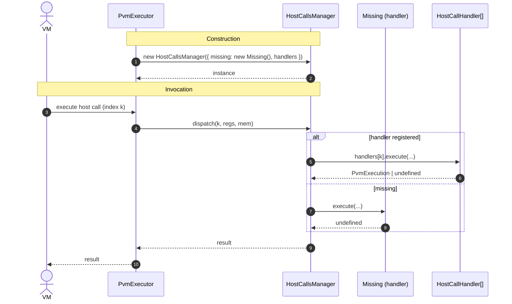
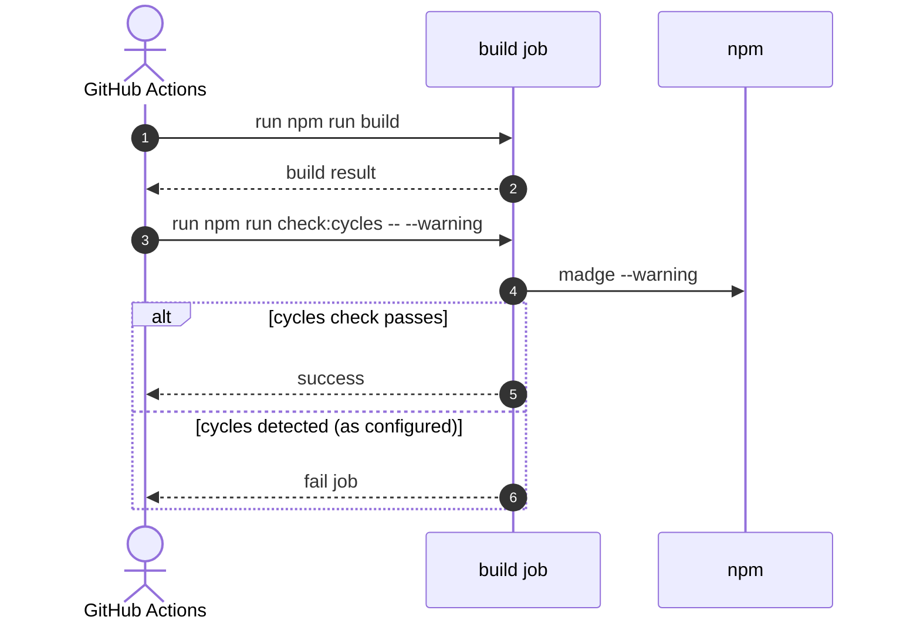

# Untangle deps

## Pull Request by @tomusdrw

Fixes #374 #372


## Comment by @coderabbitai[bot]

<!-- This is an auto-generated comment: summarize by coderabbit.ai -->
<!-- This is an auto-generated comment: skip review by coderabbit.ai -->

> [!IMPORTANT]
> ## Review skipped
> 
> Auto incremental reviews are disabled on this repository.
> 
> Please check the settings in the CodeRabbit UI or the `.coderabbit.yaml` file in this repository. To trigger a single review, invoke the `@coderabbitai review` command.
> 
> You can disable this status message by setting the `reviews.review_status` to `false` in the CodeRabbit configuration file.

<!-- end of auto-generated comment: skip review by coderabbit.ai -->
<!-- walkthrough_start -->

<details>
<summary>📝 Walkthrough</summary>

<!-- This is an auto-generated comment: release notes by coderabbit.ai -->

## Summary by CodeRabbit

- New Features
  - Centralized, type-safe codec Descriptor API.
  - New Accumulation state module and exports (including GAS_TO_INVOKE_WORK_REPORT).
  - Introduced ReportsInput type and expanded barrel exports.
  - Host-calls now support a configurable “missing” handler; added a default Missing handler.

- Refactor
  - Consolidated hashes and WorkPackageInfo under refine-context; widespread import realignments.
  - Updated host-calls manager usage and constructor shape.
  - Broadened public re-exports for codec/view and accumulate/report modules.

- Chores
  - CI now fails on circular dependencies (check:cycles).
  - Workspace path updated; removed an unused dependency.

<!-- end of auto-generated comment: release notes by coderabbit.ai -->
## Walkthrough
Introduces a centralized codec Descriptor module, relocates WorkPackage* types and WorkPackageInfo to refine-context, adds ReportsInput and Accumulate*-state types, refactors HostCalls to use HostCallsManager with a configurable Missing/NoopMissing handler, updates numerous imports, broadens barrel exports, and adds a CI circular-deps check.

## Changes
| Cohort / File(s) | Summary |
|---|---|
| **CI and workspaces**<br>`\.github/workflows/src-build.yml`, `package.json` | Add npm run check:cycles to CI; update check:cycles to pass --warning; move workspace entry from packages/jam/pvm-host-calls to packages/core/pvm-host-calls. |
| **Core codec centralization**<br>`packages/core/codec/descriptor.ts`, `packages/core/codec/descriptors.ts`, `packages/core/codec/index.ts`, `packages/core/codec/view.ts`, `packages/core/codec/descriptors.test.ts`, `packages/core/codec/index.test.ts` | New descriptor.ts defines Descriptor class and related types; descriptors.ts now consumes imported Descriptor; index.ts re-exports descriptor and all of view; tests and view updated to import types from descriptor.ts. |
| **Core pvm-host-calls API changes**<br>`packages/core/pvm-host-calls/host-calls-manager.ts`, `packages/core/pvm-host-calls/host-call-handler.ts`, `packages/core/pvm-host-calls/bin.ts`, `packages/core/pvm-host-calls/package.json` | Rename/simplify Missing to NoopMissing and export it; HostCallHandler.currentServiceId type to U32; HostCallsManager now constructed with options { missing, handlers }; remove dependency @typeberry/jam-host-calls. |
| **Jam host-calls integration**<br>`packages/jam/jam-host-calls/missing.ts`, `packages/jam/transition/accumulate/pvm-executor.ts`, `packages/jam/transition/work-packages.ts` | Add jam Missing handler; instantiate HostCalls/HostCallsManager with config including Missing; update imports accordingly. |
| **Accumulate state extraction**<br>`packages/jam/transition/accumulate/accumulate-state.ts`, `packages/jam/transition/accumulate/accumulate.ts`, `packages/jam/transition/accumulate/index.ts`, `packages/jam/transition/externalities/fetch-externalities.ts`, `packages/jam/transition/chain-stf.ts` | Move GAS_TO_INVOKE_WORK_REPORT and Accumulate* types to new accumulate-state.ts; adjust imports/exports; chain-stf consolidates accumulate imports; fetch-externalities imports GAS from new module. |
| **Reports input modularization**<br>`packages/jam/transition/reports/input.ts`, `packages/jam/transition/reports/index.ts`, `packages/jam/transition/reports/reports.ts`, `packages/jam/transition/reports/index.test.ts` | Add ReportsInput type in input.ts; barrel re-exports input; remove inline ReportsInput from reports.ts and import it; tests import ReportsInput from input.ts. |
| **Type relocation to refine-context**<br>`packages/jam/block/refine-context.ts`, `packages/jam/block/work-report.ts`, `packages/jam/block-json/refine-context.ts`, `packages/jam/block-json/work-report.ts`, `packages/jam/jamnp-s/protocol/ce-134-work-package-sharing.*`, `packages/jam/state-*/*`, `packages/jam/transition/*(authorization|hasher|recent-history|accumulate/*).*`, `packages/jam/transition/reports/*`, `bin/test-runner/w3f/*` | Define and export AuthorizerHash, WorkPackageHash, ExportsRootHash, and WorkPackageInfo in refine-context; remove these from work-report; update many files to import these types/classes from refine-context; adjust WorkPackageInfo usage. |
| **Externalities barrel update**<br>`packages/jam/transition/externalities/index.ts`, `packages/jam/transition/externalities/accumulate-externalities.ts` | Barrel now re-exports accumulate-externalities; its AuthorizerHash import path updated to refine-context. |

## Sequence Diagram(s)




## Estimated code review effort
🎯 4 (Complex) | ⏱️ ~60 minutes

## Poem
> A rabbit taps the build and grins,  
> New Descriptors hop in tidy bins.  
> Host calls find a Missing friend,  
> With gentle paws, the edges mend.  
> Types burrow to refine-context burrow,  
> Accumulate stars align in furrow—  
> CI sniffs cycles: onward, no sorrow! 🐇✨

</details>

<!-- walkthrough_end -->
<!-- internal state start -->


<!-- DwQgtGAEAqAWCWBnSTIEMB26CuAXA9mAOYCmGJATmriQCaQDG+Ats2bgFyQAOFk+AIwBWJBrngA3EsgEBPRvlqU0AgfFwA6NPEgQAfACgjoCEYDEZyAAUASpETZWaCrKPR1AGxJcAqhlyYRF6QStzIkAYAco4ClFwArACcAMyQET42ADJcsLi4YRwA9IVE6rDYAhpMzIUAYh7YAGaNspkqiIW4stwksRQuhdzYHh6FSanpiHGQBMzYiLQUAO5pBgDK+NgUDCSQAlQYDLBcuLRg2P6BXmCh4QbQzqS4ewdHXMzaWBFrAbjzXPgel8DDYSBJ4CQlpREO9qCR5gAvRDwADW+CoqzasQ8MMgAAoMPhyJAPEgaLQAJSrADCFBIcPo1C4ACYAAzM+JgVmJLkADmgAEZkhwBQAWDjJeIALSMABFpAwKPBuOIiVxavAAB7SFCIBw6szJADsovQGHohqNzI05ksAHlhKJxFJkI0KCwSfAMCi6Lr9YgjABJPXYXaW02AFAJIBrNTx3QIvMxIEsyox4Nths4QiQwigsLB8Ihngw0CMAwYoABBWiLaTIBjphiZvihMhKQ7yXiCRPIL2QAtFxilnH48EOUuQOmNShkHZ5hgNJSUjSrKC0+k0M15mgURpoOcESckZj4KTZoHthjyImQAAShdw1OHiAAspg0KQ+G6Pfei0+yyuERQC+p67L+j7Pm+GAfpQ274DMsC7EIaDMGAA64GAJZljw+4ojBNoVmAhgGCYUBtvwjQ4AQxBkMo5IKKw7BcLw/COmIkg6nIChKFQqjqFoOj6CR4BQHAqCoJgVGEKQ5BUPR1RsP4XBUCsDhOC4ezyEwPEqGomjaLoRFGMJpgGBopS4OUAiFEs6Ioo0Hj4EsHSINsYACNg8AeLQGiyMwHgcAYABEIUGBYkCVoGNGyQy9iOB8Gn4JRRyBNIRhVjWvpoJA5ArNSgb2DQ3B5ghuweV59BCIIMzwRQFw5dwSZ1VgRyiCiHBXguOpoI0O6lZAJCamSXpEA1TX1eV3mFTmiA2qJCC9v47q0NgOzINlnVePWiEMCicH9ZN9AOU5ADcKCUZZuytbtkB7l5iAADQHZ5U1VQIt3aDiT2ljuI39UwS34B4t2OSsXFENQf2XXsL30DelmoNdKJzZAkTwSlGCkMgh6Ddw6L0eiPAVKSDADf46jyEoC7OJDRKIGdRIePI2W2RQ9mg9NxVoDW6jwESBG2hFHg7rTGDY/B0NUx4NOqmLFEDZqeMUATfBDAm8Ck+wvNpRWqPo7AqXiwrSsq0T6ua+T4jSARACiRbwB88mKLsdLgpCA3NPjXAvnQ8COMFoWEWARhqBgnTSBhzWyTZySNIU+5NnM0s0BouAwgHQVhZYkXRXRvpqQl17JQbmM66Ce5iOi2PdLsDsm4texeuHRZgFHlAx3HCeOJmKdpyciEMaHvp1/j8sAOp2VYuEwbeaCILAZr0BPbOgibt3ukmAACXQ9H0AwJvgu02XZrc5vjGhCL2yB0tw0s7PQKaWTMtn2DmMu18w9cRsvKJT7tM9zwXoSFY34t4716JQfejkj5Ti9CQTCRIaCak0JfRekAf6r1HnSD4XpXQb0gNvGue9ZCFAPkfVmKJT4mwvrNGAC1GAlyxvwDATN+qIE2NsXYJ4VrBCSv1H+f88KkFnvPGYNczqEknBccQbAST4FKKTQmANcDumBsdFYqBuHwEaBCHyxks5CxFrLI2ktRDSzknzOWfDcb419ITNWJMybiCtuWKAaNIBaJ0SWYxNV7DwCINBP4dJkDWMVrY2ggxiYaycdrWaRg7YyNitpF2YIIQrBIJ7ZW3tfb+xCpnIOIcm40Bbm3CgHd454ALEqBEotZp9wzgYnOMk870ALs4IuDDDbpTobscBKBP6j0aITSslT0TwARJQERC8+yh2bpHC40clixwqZZMZNTjGp2QCeKQR18FBUIbvSBJCyEomPmzKh59L5BV8fs8BxDSHQNObA8gCD/CDRQYgIKK5KwjH4JdPgyS0GOQUUeHBWALgY1ILQBmLD5DQx3n9dhWw5zcGoNM5A2BuC0AZALRpws6KWJMQPKWMtCXyxscrOxqsokW2cRCVxMAa79LXpCugXARmrOqZMwBOUnLMvCevD0ByIH9GOY8wozz4HKPeTQvMRZ6Rw0osK+5JyzmUJvpchuszinzIwIs5ZaBRnVNqZs229tHa+kBa7NJHshlZMgD7WgftmANIKQYbVEdW4LPbksuOdIdj+DQmSdEshNmBTyY0qKzS5L53iu0+WrKGVwF2Iza8AgpgUAkCoYIrLdT9RHsrewHC5x2v4ZPaepBAwYCGWInoXB1B5uAfyyluyhV3KOQ8w+TyMlwNeUgj5cqaDc3lsqjtqqKEXOVjQlc7j8D/M6aXIluwdE5sQewXF4UflGLJYeUx1MLF03JWElt/BqXmxiS47paNyDxPNUk52R43bpMyZwB1OSXURrdR6kp3qym+olWfZWdT04Rs3VG2iMbWlxsSsXLp9wB59ILWnW6wyjXjO5fPJ6AiK0kCmd9c06Dy3/0rdW+CUI6QeNAq2sBRCx3ionRqqdqDDyjtFZ2mBPaXnSuQdOvWUjyayMBYmmFrDoZIs4ZRnhy7CaXSmGbRxfSSUHrlksOekBMXYvJBu7O+LlNLuzPu2pR6TZUvk9ErWl7dbQCZUhvxATqBbF2BphkXAAAGHKqnoYoFM1zT1XPYeI7hwBvnID+aI0IkgVahmuZKq579ur9V+sA2nTZMXWXUck8MXYrnWNQK7WqydHyYuHhy+2tjqrJV9plZfVzZrElOyUI+m1GS7Wvsdc611EBg4GFRYFmhaoGlgdzpBuK6kOmJu6SBHZ6AcKBaPNOOkhxl17N6xFjoyEajcAkKhdCmFnzXMPEFVbMEOhMDpIMbbaEHx7bLNcvs0MKGIF691foaBZBPS9E67xf1srHdIEeaBotBVJg274s7JAUY+CxbFaGSMOqyC6sgRAiplTPEPKivUM3cqGVUxQDAf0HIfl8R8WgpAnqQr+gWFYDYMzmJuDmNss4tI7RROtCjjGtP6M3bpozu7iVmNJYe0JJm4ZnscRZ+lV6iS7AJPBCl5JInnqU0ZzxuiKS3vq5ah91r3Yta9m+p1uTA5daMH96QhRwcW+dgwQoShkdKhVOiMNg3s7gZivRNpMGF1YyMNWWg60GK3xIDQJ64CwCIB6rsO3KPHd8EQLIeVSZS2zkUCNW3ohU+Y1YiIMQcSDAAGkSDyBIImdg6c3HuyGRcTTliJx9LwF5WJgU0hQHlPb+AsRaAACFZDAGgHoJ61JregjO7QPvA/IB2hVLXjwI/0Rj/709NvMeCAUDnxQBfE+1h1y8Mvh3q/1+b6elYd0PRlayELwn8fg/pZ6iH2LFRq1V/X8gEPqm4+UaRHdnv1H6I+9PQADVIAABeGAPQRgW/XsT+UvcmLPG2Q4Z2QoeUQFTAegNYFEZUZvXQawGlI8bmVNSAAAtJLgH/WPYAAAvQG0FvSAH4SGUmR+WAIgyEf/QgvQAkFCEgJ6ZECZW8L0XAJ6FPJQJ6KmZ2LgjA7gJ6J9KkIiSAUg5/aAQAyggwag2g8QUmXKcfdgtgLg9DXg/wAQhAoQgzUQ+wcQ6Q8AuQv/fvKg7Ak/SQOEBQB/OqSuCgLQzgvxHgvggw5JYQjPIwxAcQyQtJKkBgyAJ9fgafIkYceQDAYYDwM6L0XmUsdDZAJglYdHd0cEJcMIm1GTeCbKKYDwRoPbeVegSwigcgpQ6ggI5UeA5JWgPEEQniEgvwygcwyAHvYpLvRyAQZSDPDfRaJI4GOQYpAQ7UJsYpUw5UfDegOkIJOWaGeYX0QQ/OEmXYNTbKTo6QbowQGwqAAGKQZWYAWoNgr0IYV9PEeAdUKkYA8AhQ/gPAc4rgS4rgaAG48A2oCkFo9vMg2oRQvo+YgPbHco5MKgbgbgP6A46ESxOREFZPQwkgdPZJPY9ARAKfNAAAR1DGABsDYK+NkIVH3z/3RKxJIBYOgHwB9AwDtEaBxKen7wnwoIBK2DlmymjyJL4CWDBIhKz3hSZTU0BExNDHU2RCzymBIDgHdGwCIFgHjjRNRVJOsx6BRhBNQHlyygD2jQ1ielCOgDQQAJ1MQgoyAKUD3GGGQ0PGgASLeSIBjWQFCMGmGjgIRLKWQOdj4FQJoPEPQHTRUX3GMTOiWOQC2MQB2PelLRGPgUQDWIVj9PYhvE9IcHBPxgDzSJQw9M9BlJ3Hjl00CQ4iPF4GkHYFFhRkDAGSAwB2vCwBDLDKehJNDHpMpLIBpK4JIAlNgClJlO+nlKFIlJrienQOVEKEHPBMoBmP6jqMQLdKUGHN0L4NrWtjcHoRXV2C7CyO6gUEQmRDPErCsAKlLXZI70pz5WqCD1jHATZ12BWIiSaLoA+0OEXD+gb1JBcXTNrRGielRWVngAnCfUehmAOEQDtUdksXHMFNJJKPEExm00MQJUPT5yjwFz02MwFXsVwIlx1lEn5MyloDcx/07x73Hxi1ANcz1PeTbGQHKOAC9AW1YMgAAH5CDIAuByBDiYs+xXMzdTt0RETkkbdDzY9UsrNsKlw3M39RBD8iKQDQsABvSAAAbXzxKhP0BEoC6Ev0QHHwAF1XjFKtKzoABfdirATinDbi87Pi9PH41fISrCnodAHCtzKfWWUsSS/vYi2ShSpSvsFSs/dSovTS/vLS+i3S/PfSyAIy2LLiq3Cy63KylfJ3NOVzYS+y7mUS0LcotyvQDy1zOSxS5S0/NSi/AK7S74hKio6APSp6C4FEYBDAPQQy4y0LaKy3SygSmypKlK9Yxy0LbfaAkgTK/ozfHKvK7yrAH0WQPhaAHSgk6yqwqq9Tb0OqhqiKpq0ywLcy3iuK9qxKxAZKuy7q9K1zXyoqjSqSki0akqG2ZBKgMQYACaqarglREaPQGayqsK2Mii6MCFWWBinKMEWCLgfPQy+S66uM3Ae6ovR6wqJUTGV6talqniq3KmeKjk2yxlVKnq1zakSA+/IsZw+Q7K6S3KnKDgrgfGkaM6RUDcbwfEfALgcShgLK94mARqqKsymKralGnaigdGpUw6tlULRm860LScpQcfSAAAMgJOSSko4sRtiu5sJN/15s6rXEgIcqOqovuKANAPcuZRgOQ2xutyIr8xHIRo5tau2uVsEs6uoKsFwLpHwNhVughG8jczSLKo5MqOSpUN+GiTYFWVwtCwYLSJYIoLcPJuesxh0M8KUhoLnP0LJmSS9pVvDr0HkoAHIVjM6tLfCU7Zryr06s7bzc6xDMDC7vadaM7M6ajuAy6cjIRU6yCKD8TtbFDfbsDVCA7g8Cxg7XMND+9I6YaPyPDcM+CuBt847+Dk7nZm7Cas6c687jClB56rCa7S7l66616Kqa667c626bbCbO6oA7Cs1NwAZ8an9CZkR7MglabOKlRz6ro6ZH8XDh6KaY6x69DX0p7x6k6Vid7x9F6ESG7bygH+8S7WiG7t7K607IHa7xCG6n0gGKDIAAAfHKOIikE+nA89J22gAgnREvf3NzaCNgKO2GogELVzbg/+3+xO3AGhwB/EWmsWscgaRMV4lmiQfAeAWgGh8B/EYO6ctokAu4mh2BvEXEEcs/HhvhgR3WH2IOzWwW2h8Q9hho28igFo5JCgHB5hDKo+9EGLPEOYlkgPVzGsno4yosTAOcGiyBX0UBNhGMvhMTYtFJYdFaKhqY7gdXYCXuxQVR/uqEo4k4y4jAJ4/EK46MFm+4zYfIPAZ42Jt48RuJoBv41gmLG8Vzco/at9FRtKtRueessk3EvEQ+uaiosp8kps6k2kmwekvQRkom3J/JjXB2e9RrHXZ9VrLgXgmUzrUyBWrm0QVGlWupCOZ3UDV3YbWKT3cbRhTCmg2+BtaGQs8ETYesFgIeegJDfuXpJlRmw/RtPlJDDUmbPpFxnmmhQ0ryXpAeZqGRXYLNBoF+qmUFT4KAkXYHbMap2aS+FcZNZtZ4UkYkdLP5pDP6OSvpE5oa8na3CKv5nmwFo2WzPpOS+F0fZFm54x3m1BT02zOSvi3F/BVF3jMSK+GbIYOkVhJDcPY8TANQ7aVKfESRZ5h2MqEgA2LZj03TOgCkAicKQWLdOChYiWfnQzHxYXVCsXczS2SXLqyjHZQodU4O7F+fZQ2w61bZpmBm4fIa5MNTC5xkAPa5/BDQCZ2PNF/ET0pYxkRyTGZERraGTl2ReXbiUQIV7VtxJyA1qmU51AJTOgNV49eiFxq125wlgjU11Eq5plcEbKDFplLFw1nFgyv5r5a1myq5YFp56RLl42UeUl7Bb5v5qN/FtFurLphrFJcIvXe1drI3fJE3HrS2pGtqqtmZ0KIbaNBZ6DJZuDEF1FXAI4ebf0qufqHm+wBPGgJMLibBU8KGAeQHEYSmTjX0EE6mTHT0ulmHfk0kOeaQcc7ZFd48faAog2OkegGd7hLLfN5dB53lDRcs5DEEvEPdkvWKHm0+ZOX0C8qkSNnNp3GN+gIMlAZDOxtQjxIJ/3Vh8yDQJffFjQXKZD6pjQUO4IwdBVeWbKNd1hU0uBegHd2hPGkgUk/wJmUPAeXGEmBtBxDWToJlZXHxfCugHvQfdN+fdD8qw/AcnfAa/F/j6wQq8/DSm/OeRAPGt+1fcc5ymfU55wFJbZZx/BBGLZRQLLfES6ZmCjJtNc/h30LiaNxAIVnpV/E2/vdAI95APEdhpA1o9yY9ykNBaGLWCjduui0jg248Ys365Tzhh2L0WKPFgF01SAMsteaDvz/wS89TaHeiBOefEafVmWxA8C0MP92KJDeLpdnZcc0RvgcSN9y57KMPIhy1pE90ylgtgTRC6pj6Fw+lfESM/87AAANlFGquSGZCeqoaej0gANEAAConpAQXKPBWzKOdgxuQgNYXKXBPztAKBxu2IZ6capOBCx2NAqQy2vRBu8BSp5A6Wqz/p2AqBSQJkyj8WFyUWUOgXJ9Djhwnp3XuXeW+Y+B9uxZ7nghTFGuaKqAr6xBHM806XD5YpEyd9tFdFXu6BVo/o127uBA+GvAKBb4HDEyEBeooYa4wAvApBgZWOd1JXdh55lP6B72vAYKxXkKEKDNzEjNZWT00Lz0MKGVQRVP6BPW4WrPwDQD2GJbpbRGJaXGNPMtqfdZOeqNi3C0fOvPdawDIANAVedPaPyZPPbufPBPFJ/aiQgP1P6EqeIcpfjwZfGPSY+lkjj3kBNm+Z5hCPN36AjTvBfW4GCLe9+83fNWN9x83fBrR8/eVDBOA/58g+dXVLxOSqvfqDNu79X6Cb17Teue5EsJJ9IjoJZ8hqJarfbP2W+VDPsiTOHuzPSy33vdpAsCoBV474t3WjChMv4F936JcvkxUxsohkmwph9ny++EkY/ncsSFny4lqCovR5MX0ueIyWPRs3tGaFrk8RVNbfdWHfmYnWiAXXdhRGfXR/y+QSv3/36Bc+fypg8EZ/K2MOrl8Q4/pOE/r7VvLPA2EW4HY8ROFOois/R8BP+rQ+N8d/sCx+haWFkynYYP8+kf9H+t9BrAQC+CyATNi42zYrECWnyfEOw1BRUYfWreW7vMBggqsAO6MC7skWu4S9Xe1BcosgCbRLEX+NlbHJ6XKKYcygaZMXgPDjYftcEQ6RVDNgI4bsdE5AG7o11I6YC8GjiBwLuH3C7Am0dLFrjeFM5vlf2zfADjXHWgEYZBJfN8tDG3aQFfujzFJIOHcYDxjeXzXBLdB+oz5RMA8CPLIjMYKpU0lYV7O9nm7xloIS3HCOmDW454NuWg9MjbH3CwByi23BgLtxrYWoSO2uVJLrhfQDN/EsAYZt1lGbI1xmn2QaKnGmb1JZmEUN3C0lGyFwE0yzJNAPBBKIZy+miGXmF3Kq2tDwsgxMms2eDMCXYhbWREhkfYzAI4L7UFpRVu4bE7uZQtGmB0gA+gZoXrUmHGx6GTNeM7iWIB93RAThhMzCelm+0KCGCUe1eeNImhp484fE9PYnkLkojqtT0ZmWlLEm6SFCmUnrcHt4kFrlFAAmATVx7KnrFPi40MEUtmM8EWQdIw4J3db6gSRzCJjhS0dw2fiC+ss2XDdJABzwL4Q5gozOYW+WAHVLiCrSzY1snNBITbiSGagUhRYTZDR12DgtHm1AOMKkj1byA42wA+yv4KGHT8kws/btlf1QA3xa+9AOQFX1BZ3c5KIJeAXsgv7lV5+J0N3sSwpEcjz+IHCgGiyCi8iDACSWtlrh6bhC+m+uZth+mNwjMO2itRIeaGSFpDe2czfth7kHa5C4MfuLKP9RWAW9ZetQ8lmoM9L7B8A3MWiEfwHimjRBFcFNJRAbbhtaEawHoA2C8TRFvoxoz0MSHlzrRfkowwSpfHHIbMV+SOEvE6HzKes+EDoDwWmU9JrAKOoYJbEwPwRPpZUdInMAyLb5PwWYFUEsBvjNF4dfkQYv5tmMe6zp50xveLj1GnBiA6A6w7dPBVJ4M9BcViXYeG1Mymj2eV6XXACOKb91PWI3LNlyN6GfILaG1ZEZZTRHo0Ha56XcgVFZRcAER61JEVbRRoLikqcPDHnOFcyes5KiYp0GkQHJpjZwJANMoKKpFWtqx04gsQvCPEAjxxCA+8Wknn7JUJRd6Otk1giH9MDcHWT9G23iGWVsxmozOH2wgwDsxs+oxdKCPL6jsF4pacotl3oh9JKxkLYDs8KNiTiVatXCSM0CdAhIXa0MQwYXz+g38ZOifB/j71oC8cOShXYTkNTOhvc9gPLNAHy0RaAw1EoMccpAkJglxaA4LUaN90WrpYZ08EU0SuLszfDgk6ACjKrhbFc4dMbYiVtOyQpM8exvzVnuLkVYrNr0JvH8ZrlCEyiG2kQoCS23SjKjZxluLbDtmuxYQcQpCL0D2ygnaiYJuouCX3zyFS5AQL4JAKKVGioAm0ewlxrtmcmIAwAHwaCJ+FlREtSujrIkBvyM53gHw/4HEFBBgjFcsAocU1LrHAiZTXw74T8I4WB6/VUA0I/AegAYA7AVQM2AGDoiIBbAgcggDwYcy9ZtCMcp/SAHJWYBBSRoLFd2GjACmDTMYlTJ6MJLR64h5KWlZFuwNw58Jfs0sPsJfVk5KJhwKMKlhX2xgOjcCskp0eIM0jbhloCPXkgPFGncBApeoP6J6y/ZYl0waeFPK1NKBZ4NoRIZqdnidBvkipkEUqZQFbHit9M2w7sWaL7HoUDJDKa6r8wszMwsaV0m6cFJizhT8Em4k7MiIclXYW4UUwoJFOfAxSAZyAgpjRPv5yTIRTmRLmoz+llhspn4GcVuKRpYz8ZZYPGU5IJmxScpNCGLE2gTg5hkMkkCbmSnak/TQi5PeyiTQGm3TMYXARGeNKIBnRpp0ILgJgFkBzS2aeIO3kSLzC8MfQD8MoIkwQioAhZQudbj6xMlSizJ9bZrJZIVGxDTcKoxEszPZmsyWZHgNCKgTR7uTI08zbyTkN8lwZq+ZvabNDFTGZoNYkWHvmvETKPxWo9osCBlOHCzxzQXspsP0HYBhzwQOwQMEfyZQuNM5EcnOb4h8C9cBCxE9iIT3kAfAMCWeNOYtlwAFzs5jISAL13cgNoLgXw4eDaUBl8Y50RpA4RFD3K7TWIGaHZEDLp4djQZISHSXKwHkDjdY2+O+qD2qn90CGBBOuRnMoBZzI5k9LeYXOhQxZAASYShY15LtDef4Ebk7zIAJc5kCdDWqes+ClAZ0elL/BJzPZlABmRjPsmXY3ZHQN2R7JTmAzOqFskIV1N6a2p5R76e2e2zslMyf5Lslyb/MJlxSgFIGLURkN9mxofJsGBCfBlXKZEjOt7bRJRFdj0gRw2UKcJO18b6DssNMrKUTLSwa17sA8TivApxnPg2Z7CssMgq5lJVXa1PCzomh1lAwzwbrYOROBoVC0MgNgG2JEGgAAB9NYDbBsAAFAw1IG2PIsDCygaGdC0EA4GFghZPSrmAAOJzwh80iD+e0O7LJgS8wMNTNDFcxxkSAoIUoPKhFExZGgpg/mBFB5iTdqO/UVzEjJGiMKpO/YNTLEDIBHhyGNU1zHLOlnUM0E6gH5obSBwGwZAbZLAMiGgIw87y6A8EBdOywQxb+RYGLEYqcW0AXFZIaEDFi7B+V6U45aEee1CyDRRAeAEgDFkDp91fE5jPHKFmrxO8cmfAY6ttmuqtLZYtjDgXh1Cy6LpA5pWrKpNgoTzNJ0rYWTPJZ7ytDhlmQJiowhH30EummNRi0omIkA8Q8iopVwFMW38LFD/OkBv3XEzLXFO4f8vIrYAngXA9yxOSMB9hvLZA+JFSlLLJJWARl4xBvDeEwb9LeBdAImmtI1qBL5ZCNNhRhFxlILOZ8UvhcfNcxzxZAhwBWGMpOV/KN4SAMkhCuI4YNrAwKsZZYmhUtRYVcS5GVFURU3ZEFCC6KaitQUkyNai2Dgv3SCWYwEVjkrhcysFWsqiZqWSABirpXBKGVAqpFRwpRWirgFko0BVallEQKm2UCkCbZMZnnZnZwqwYDhn6wYBw06CppF5KwX+ycFPuEEMHIA784LwTOJxBpFuS0Y2MG2bGbKtuxcAgorIDQD6oFDXI6h54RnIcBa4nJ5Y8Q3VR6pclm5DVUkv5P3NbDqiQ1OoG+ivntIzgK+eiYyNznUkgytJMrNZabH7FQzjhDOJNVeDyVqNB+hQN1b/JiyhFDiyIXJj6r9UeK0ZEaxlbjJjWXwiQMWRNZeHpTBDum1sgCZAsNyKjW2WqjGRtnYyUIe1YcSrNxk0CQSfZOo81fGgDm4K1wdMIGPwxy5vtcQ9I8QUfxfhTAvyDhVvniD2F9Iu8bZFoFMjQRvNhS5cOBPfn7RZtq1FWTdlVh4xXIzonpPpAFgiwPqEBn6+jCfA5zz8Qi7fPxJjGCAHMWRpI3YLeoySyA8MkAF9eQDfXvJQ8TKIDQAlES3jIAzqw5OVnFSLq10v6z5CjFTGxSYOLWJ0FwHw3CIeUoU85klL+YUa3kVGu1uaxrhUhFpw6PhC4wYzJYaEZ0FDfetY0/MBUXQq3gRkw0kBsNyCIwayTCKlhhSTQvjLmkPDsTgU0SQmB8HBJ/Q+wkqZTbgFqAbwAAUuwgwBnRoYVmtYHaEiBgBqIim8zQBUwBAV0QIFG8N9wxSHBgRwrNScDN8R7pGeBa8GaLjnklrdY7iIRTjF7ERJi1zieQLsscxxJNVcQjmjOpORgB51BWSDSuugnu511XuCbKb0eztCSo0VXLY8ny22bCtYmvuG0Nb4eY1kGGBeJ6Xc2Ubng9ipQQPzKx5YOMkKn9R8nHKt9mNkWUjPG2yhPrlsHoMTB8ON4rgptno0QGggwTJZFJZPcQL8hGH4IwN+WUTdQke47SyA2aHUPMD+hTaos+AKoE7U3D4i3u2giKGhgmTeYeU3Wzdh5sC4Ot42F5ZoTZqJBba14fSSQRkhnBLZkA7WrlJ9tESlpDUnKLzPIrSVdaCMt20jHNLfJTAiAuveRe6DnTyLHIlJTFOOVx268bA+AOdJkGp0ohMUgYedpZpYDA6sATadaQTV7DztkASbQjGzEEQwQ7tD2mmuPN5yTz81qyqLfsJS1HDdYS48XACPOGiwmN4WQXTNq55u9MdNaNjekiS2DaXVw27tKNqXU5iH8S0pVENrFTHaINYmoFt0nl3RI+kSu2WOyne2da8BtAN3rDq8wPqddoLMrt0MO2W7Z1AGY3b1tlSRN5UQmyiLEBM0caRNNu07aX3t24EndJeCHi7ow0/betLIosLIC8Bu8et3G54CV1+Zya85Qeg3VbpG29oTdqCXnbDl2akqENSGt7cjo+3oa+kRe/tFhlV0kYa0BlAiKfVwI4D/sa4vnb/Bwx3aRSMETXX3um3a6ZNJ6LofNs43fq69yg8Dt33QDPB2JV6xDr3v51T7SMwuuEAJsyUkA8d7AAndTtwDE66dmKOMIfDrAjQh9wg6JLJNH1XQ8hXAVnaDtHjiySAbvP/XZEwSFoIdpIFNVgCR2eYPtqOwBK7vb3u7Eyl+/HYTrv0k76d3AFXUfsCx3bsdU4LwOxAKX+ikMYbNeIDg2Qp7lxQ8uxmoBfKyAcDk+wLOttJiel/9haXLnPtwMRZWDm20A9tvEkHa20VekPSds1T2bEI6YTschT+2BbUoWapVcOv/Fyj7UtOpYNAtq0oQQ9XG/tN7JK1ZDFm8Eq1RlHg7Y5TRaOu7tb1P6IHYDnWw/cweA2AJxyMMlMlTrnS+6sAuhmVCllXCRdAYK0NaFjndimifOWuyVviKM0B4ptD6w8JJFcNAZ3DuAB9dI1QPsBoAdIZxbfqpBEsHy2AO3DNkZo47KAP5K7iWT8PhH5wi4DcrwHsIX07+LhJ8QcNYR8zbpCYLxoQxdrENvI9pefSkZiOAIcjBGCnekcyNJHUB7opI1MnM5AQfF8HAov7VJjU0HCFcVfPIFLSVHPSCxugo/w23wltIaeJoqPS6B/QKEAuljaIkPADHREKBq/f4AyNtlxjh4BI2nCmOAJAIpvVY4ZrQA+hkA1x2AJ+SjHzCRcT0JtERz4Gp9oiJUciVpy8DfRdMTS43jcIHmHStgz8riPLnPZyZscgOhZbTzF3LKItkuvYXpIVZ0oVmho4OjzyZTe6O9PKUArUzKboagotJzrUFHAJ9gtDNQL9WHuL2bJdYlJrgNSfsr/HpKjJhUqGGZP/H2TNWnLdoZ5O17w9acAUz1WFO7AXjiAN46IgZMSmySTJ5w8Ro1NanYAMpzk3Ke5Pkb19SpgMKYcFqeswj8+6feRXNB/Gyg8oDyCFKwBcmdDVpvk8qdH55G7cUdHY0UdAJ8UNAN/PEOEaehyUzjOGKZFwHDNtc8Qt4SsGsFvCKLAwUoG2EK1Ka6ngA/xvEq2TuO4AHjWRudImetwaBkzqZ9M5mezO5meypJYAEadv1TI8SEVdXPbSfoOEOd9/ZiD2fqNOF7+1g52qwjjOBYEzE+840Fkwx4FOjrCEY/cbGO36uArZjw4Mbd7d0ljj2k5bGb6MGmlzpZlc3OgioBsJK2fcI3oCpByUVeK4Aym7wd2kxT5rCWpWpXpRcAJzTh+eEwZnMPrbjuvMs0kbXOTG2zgCOLXOlpqim/d4JruUbM05SZWGSWvbmilgiWRJIwhu8U1qT35IlDf48BY2zawaqlR2W2cXVut3nIitaCjyRgrXVQZsFu07pNL2mxI9TRimCXYehcbenx0ie8+PUmoKsn4dC8K9QCL6SCWH1Op3ssAH1NzmWTbuoS+ya7PYFRTIlsHXhoPPan0+UlmSwCeI3Snrzbvdc8kZ5SqXx+IA0Cxuc0vineyzJoy1MkUvJ8ZerF3Ag6Z4Nq6a0kTBcPkZM1QdFjuxtgwRj7MuEDeHobi+BsovNa4kUAKHAcqjkplfEQwX5DJKHkuNvDVG5kWCLu7iWDTfSOyzlfUtuWLjul6M2gm73vIK2oexU3ybt3UFmLH8NeAmN1P67SNAwYfvnzkSlw+A5AOgL6Bd5CDKj/25hagBXJnN0iLAjjfHmYAo81E+CNKwOkuLIYij/m7MJCvjl0gKQ45cIxGaRZVTt9zC3YBwcfBItwTvMOmCjDtDPdfk+mgK1bNJgVTQe4kzxYcD8V/CyeHBX4Wwk8bhrcCU8zNTqVTDQwijGxx0zNud01S5rBU7NSFqWXhaux08qXaSc2VKsoALxxQalTz75c1G2V+eJ/Kxg1r5T4V9VJFdMZL9mlolmk/JYktaXmzOlp6HJaQMKWGqrmczmjBWCwX9mJlCGzVhRio3c56Nk/pWv7r/Hcb5uci+Ql4tTo+Fi/NTC+LUsimNLC8SSzTd1NSmFb7Ju+Szb5Ts3YsXNvajzb13H81MmN/unlZxvs0yLBNii0TeoRS3Sbstsy/ZVNuK3qb2JWm4aYsvGX546t5m1JLZtO8dbvpvQ9zd1i82ICoS4225nCNtqPQ6MvG2LdOTiHJbe1GJoGZ8vIAijnpIK6vk1smiCFRfeQK5l1umM42MtqO0IKfODyCozuyxOuIPVtD9gf0dzJTeCx+YnbNDYW35ijvjlXMZV5BNHaTC1ZKrXGcPTVhw7R7ITRPDi2LCHX4XVVhF7JOOs0Pmn8bMqplR0HIp45kiLiQoDF3OBUz9Dnk0rfRYtWMWF5scxCPHNz1fXS02NlCZXpavV6E7EtgdCxmD0Knh71V2hCC0mvTXSasiZa7fcSXIYv9KdiKHVO7jJxLEqhEgDFbhBaB3tosAAIqhhQwZnPNBCiC18ZrrPElREDBBhORxuGyyu+TPvrxdlJWa0VhsJJ6Em4bKFdZTFvJMMojJnTZVWEIsmAS7ZWWh2RbZqC1qWViw+WQfdotmrj7G6y1TrD9xAl3YbssJYAoBQa1eVo0UtHw+FXNDte/VXXsgDoXJyRJsET0rBfThy7cCb578pXz5HqjYwiRcQEQN9ChEVEsgSsIgDoVVolAmoPEMyEgAjdxxvXbAgKCUtQAilQ+QcFY9KPoZ9ZT8ex447WAfARglyvEAKFZD+PGAWweuZfKLkhObHGWakNItkUKKlFKitRRoq0Vu9yllStxYMWsdXdbHAN26s4sv1VKRReII0OriMfnpOligZkUcraWnLzlkAS5eYreQ3LL98Ih5Q0+eWvKQ0Hy1+V8rN4uACVLAIlcACBXMBRlExGEuCvVGrXwCSwBAOOymDIZblDTyAEaF8QzL9FmgMeKmb1JftASi1dm0uSuhMLkAqM0K8vZUdRqOgUs4KZskSU2k7STRx0vbCzwyPAec8WTqDy4jXaSDdjc0M4D5vdQCMiEDwGfiX0Rt77IqAYJGrXtoJq1WMx+ejzmI9zGdIQfADqEJDPAqB5E2Z52BpiB0e5ILLp79XUS6h60+OSp+hlke6O+AgdbmNQDQDjcsAjLsnsHiPCPLYIJzq41c4jGUABpgSXYKERJUQnGXliUXZsPF0rKdhCNoh/PNtMasFH8s3zpo5fkQQRgOjtHiVBGven3na9gR/Ev5PD62nx4PoCEwHOR8ugoWNEcZSGJhOmjjilwI4+ccWP3Hnj7xx46gB+OmqPnRR608cSvLnXI41135QLuBOHwXr9l8QNCJ+uHHiAaJ8ODicJODGMK0JdG4dexunXejnqiY/deuZz5DcveU3LTehOM3qYbGjk7kWKLlFqi9RZou0UlQo38smNz3SmsVv0qVbgu6U/qflPG3mT3104rKdPKmnhbmlcW4Helue6RTLGkK56dzwLlZizYIM7h53LIuoz8p09BeXUupnJrjwN8pDTzOAVSzilWs7BV3One1KsO5jmjcgLlDBF22cRcnWkWkRM6jbFE3DyDB3QBAJgKMB2BgAhQooMABOjNzh5r2r+nVEI9NVH3shYj0+/NBTQu1BAo8y7RXzzTQxbM4mOcJIpl3uutrkXEvRQPY2/MXGR2mvR/aDuLQo9nApj0/YitJ7mhwSZ4JIp1Swloky1jBwofxAvg7Q1IfPB2+MUvhcnaweRTYDtB2gFFL4XcnuUiDGK1gjAR7TCXtYR4ycbnCwVvPbgLgIQ/gbcMoCcGl9tNeQ3xFTmnPH7F9IpUzFnbgvwppmgsag44lkmgzfzTn/AP7ynuQnfq6WLgI8NhO7BOP2FzVMTki8EI37lp3k6x5Yffu57v7xe1w5gWAftDwH7gKB67AQegYFueBLB/g8nxEP5PKhmh8yEjYjDm6kw5F3L5kfpMfASo9hL2TRfE7HyA7PBBI0YvH7Q9qVCPeo29z50QmPIYGQM8ujHPeBk/UtaZbGDRPpcCh3ilzVhapWRJzVySe1exa/WUWxXI4l+vkYuEqeYhood/HSiR1qhoi5l5IvcOcvNQXewVpWifwavmC0R+Vr8kGBqQwI/qEUOi7X2ZML8a9QNrxCAP2DCtkK1SK6/P35+NyaL7rbuxenl7z3xra9+4ARd3Eem+RNqUcK4O+JBD/YZpgWME1QeswggiR6Qlop1BLHKe/aTUwrzvkvyL/Zvrij9B93TqMUr8HgQY+hPz5xb+CnkMrfVX1D2G8hWZ5FrIZjDowMw6/ez32HY64Cfd+y/TrtDaPokABgDQYQFoax973Rcw9fe4MCI70xr4XWiB2AQaIsCGixH5o67paSyJkYHkXkbFSkqjCBfrjGmHDf5g05D8KsL78i+nejwKkY+Jf8sutsexx7D/i3uPmqONX3NgiApCYkwriZ912mi/2xNDiX4Wohls89vTXteKDP2UuZIATt73/Gd98Y6QbNaQLk2kwsJfRD794b5/cj8jpo/XH627F7NM8Od7PPhrZr/9SW/dfNvlLKl4V82yOHf7myQB7V9Pe+/bANmF4HGSiwd7JRmx/r5EeG+h2W61/Ms1sMdahL/B/3/+aD+vsGP6LlVEl6qusfW/fCWH7H6Yxf36EEkBcmAAIK2ZWUEiWqA0JxG4+GAOD1RHwclgQhxCA+XGGifwMtHbUkwclHyCFhgYBPwBQwhMFAC1JJPEyodM/cX20ktXBh1l19vBLXgh0tBSUl9Q2Sj0HUx/K7xUM1VW72V9/3B71n9e/OEEKAvQGKWpdw8Hnw38MPer3EcOedPQuE9pI5nspW+G+2bsbjKv2P8eUQNUMF7/Tv0f9fERH0DtqsBuFN8efJgIwAWAn5TYC4HXwxBY+PeWCp964VTQklMHHaRf9aWEvGJE32MAGQkiPUtDYsBtfR1Jc6PPrV0x+MF5n599hZREAD1EDPw0lMAyLR28cArZQL9R4IvxXl1xFHx78YuVQPUCQ0TQN7h/yCHzEDHDAjWmQ67B4Qv86MK20KxZUV+0b8r/Fj0UDmhQgJTULoBDAG1LoZgEKIXQKAOW8oUGewoCf3QCXUMl7SIJUDyXMAFkBg8MAC7gk4HFGK1D7Qwz1EGvHWBHZqAcdkoUXCVFyUDUfNoLnQOgroJ6Ce4FsWQwGCQ2R+gSjLPHYkU/PlhXBiXVTn4C7uWzGBtxAy43yJswL7APZBA8vlD88g8PwUCeNFA3PVJiaGEOsWRPgnggklfgCWAsAXEWasBvMQzh8ztS6TnQAATWDxKwcB16DyQMA2LAvBT4MZoJtZDCzsb6fxHkkdQcSVqC6AD6w8ZkUGbxeCFbO7kGtYRAeEZpkTPMyktCzSpnT9tNRBC8COYQmEEk+AaaUhI7PQLj4Izpe+B8C81DVzBkAg0gMMlpccgKtlKA+e0gBmgrL2UDGAwf0DQTkYDGNUaLdD0GCGLCrSgBKjP3Xr95A5L0UDb/C3VuCY/GQIHRu/R7wYCaALX0t9ZQiLh+R4A+dGSsCoI6SCMMQ4XzqC0A9by2F6fOhyl88/GX11hMrFrzfI7A+W399p9ML1lNWgqUIt8ZQx5GAxy/ObxrR2dFgB1Abgh+x9MtQnjUE0o/PUI79sgu3Xl8Gg9L0n87vWgNV847dXxUCYuDgKVCT7CrV9CgfPgESCl4AkPSCZ+aQOzCUBQ7E1Dr/RQOR9ERegKiDyw7QOf8+NHoDf8XaD/2WY0EQhjJdTzTxBO4f/fny5CNvRCh5D4bPkOl9cA4IMLQ/QvhADCdQEMKbsGbHzDQQwsE4NgAeZYPxPQXGUrEzChvMbW5kdQ0LBbDINUe3loZgxgP7C9bIULAV8wpX2sk3USUNNDUPYfgrC6vIYO4CHnHCDHYF4BLXGtAfXEPUEX4HcI9EvRGHmckHBQB0/YhwkgCGMGwoMJm1a/c8LRcRDZMKb9bw1BHTC2/a8O69TdHsJLC5/RgMAi9tYDDjUcfEFCURaQvB2ZcKfMiQMF4vawId8tyVchpRmOeyl+sqpKmVW8c1ULTdDlwj0Nz99Jb0LwC7PQ8GKCVwpLUO8yTWJHqDhQxoJ/CJ1afzoDaIzoEApTrMOEWD/2eOEhClgsAFJJQwDEWXVqLVdU38uA0+ztBRwywJa9hIlJAWwrxdNQoxuYIQHmAYRWqUTgrImyIhxUPXw1FM/fZIP71A/CQQIjLmCrhdpKxJMP+CSIjfTQRJEdflggNQ9vxi9H/XjznDrrVTRQCgtF0Kkj1XLb15C9dRGwvRkbDcPBFUQimWL9yQcIJojRbbQz9IxYEyIsiQo8yLMi4QayJQdwo1IX/JoYX4Lr867Xu2eA7HPHgIIoopIJnM7tLAn5Fpo3DUDCYo2c2Ktq/eCCI1+vS/zuDUwnr3FEoAX0Kai9lMIIs4jgjILI0sgp8Lo8OrMqS9AvLAo1FNCYcIwSJngJtHf9AzHUDW0vRI/xRAYQlaPL45Kf6NEAHDGEMpFiNR8Nt1PkE6Pf0bcdixkjq7NUFm9vzdHRwjNo6fXwj0iXczNZX/AghSjZre4Pms42WaJ6AULedHQtoDKYL+YqInMLws8wxX3VVCw/SOLCOomoC6jkQWWF6iIHRgIGiaAIaPhBwohyIMMQI5UO+8oAT0RfI0EMG0OD7fRG08j04aglFMmwpMEb0prZvXL59ozIP1DWw3rxmwlwDWH3U14UDTyikfFEleD1Y/6Cb0ITDFjOCz1d+BZFzYyiMBDqNL3Usj/2aBxZFrAjr3P4rWQWMRIFxK/kOxA4r2MGjywvNggtXAotgm9DYbELmi3IteGQlfI7qgCjSiFcDfU6QvlE9JGQzl1ElDAzEKzURWLOGhsCTPwOJMao3bwUi+MYoOHlEtEXHUikbRclzDtI78LUMnIFoONDuYnqKDi+YqEKjJ2A/oOEdOA0CNPtKwf0X5o1gFfBIEd9dqPWxOo4yN5j+4oOLiDRY06S04gjaGEFjLEdeMkwS8dQQHgrNFCE81uo2WF2DngIMUChdYYxTTN5FaADtBNFSIAAI7QfPA0Ux4O0BsBpPGRSsAv46ABVlG4N6WLBX6ZlnxAEneRVZAoEyBKgSMAPbhzBgkLWCzwilXxC9BdZdYmTBn7MkIjjfqa6xRgIQvqLhBgLGzgFtS0HS3wScE6bWiYRZMQCaNoyU8zxB3ANgDWBHIXAA2sCyeKyjMBDE2Dml2Ei7kBB5AezkBhuANDUGMmjdqnzIFIMvAoTCEmgGgdyaCoH2d5YH2MKInQX0F50rADWD2gDyaQHOjnGN2ng46WMEDAS4jHBJhJGiXRLvo6AAAmSJNMdEFlA+XUPC5Z6EmehgNkHEWP/IngS+Th5tfJmAIT+Y8kG+gzEokHcSGyOMEkAHmKFEvlk9KsEoToHWBxoBKzAZB5iBAl+i1j8cXkmcTWE0cB/JrALRPYSTZTPlYRpQ3AD8TKExkAIxd4kJOGick7KCnhvyUsCWctE4ADvMWmdhJTF63EgHiT97AU0oS9Fc0koYIAijGURPgP6HQMnqOEAST3CKpIwBu6e2AYA7ON8G4BgANJwYlLOaRErBzQS5R8Bu+a80/I2wEaAyMvNBbDs4rAA5MxgjksWAWxeE8chmS7QR4jwBadUaHB9gk6kgeTcAXhIIgQWJ4TLV4OG8CThxAIPE+pN7YGHYteBEyP/IS7W4XgR3/A9VDx4IbhEPid415MwS2YZl1WCjuHXiQSxJIqL/8Fw6SKqjVI3SRrj1wmTjASE3Pp3vjH45+Nfj34+RU/jv4xTxtg/4mwD1IXwnv17iV4yhIHirI98IKZ+aF1zAdZE8s2eAlbSU1Y0TKb005TLEHlP6jKE9eL5oRKQWn8TB4qtHOImjbo3g5aGVhNeIuWFhLnQaGDnFxBDrOaWYZhExg1L9zUw8PZSe45eJlTV4+VL5TlWClJVSlgn2K6FNEm6FAg+AH2OejHyLPFcw7cPRNoAbE0kDsSKABxICAaGF5hcSaGNxOGi9qPzC8TOkw1IjDSkhx3KS4015NCT2lPzFqNwQLwCiTOk5OxtT6A6VM18HU4VIVS1aDGgFpg6V1O9iefKZPjZjqZpOgc6bGNNYT2TYyieU1E8J2fF6kypyaTdoFZJ586bEpLKThU2gGuRMGIKBmSc09kyJojFS+W6SDlEW0XiuYu1IrTuUteKdSDqQVIbSiE2ZWFgNUgxOQBC7W/UkYm0qmSzTZEqB39p5kxNOapzkogEuSgKapT8w7k95KeT10leyMivNPuJ3THU4eL2pPwlVRZjqA38NAll7ctNMigMqtKAiIosWIGCJYqsO+8psW1VSSyxY4M2iQNG6MN18ol+3ggOwgoKo1mhQTxGs14xDNGjWtKaOz1i9IzywzRTVK1Ji7mQGJ99RENjUeico+PXwQGY2hGx9cUkFDWFyomG029aHYgOi1+QpNCZQueSOwVsUZA2yZQwbDLCvDiIwm1bDiseCDUy0o/IOb9WPeZVOjmvc6OXlxItqNjtOY/9PPj7U+DICT4EajMxE9xO3wMC6/X6NCxpo0pQIxHFAq1wzgsP5h0yDo5j30zFAkLB2dn2Y8M2jWDTzPoAIsmENKUKMe2H21eMmO1hik9eZTbivwiDIXsaA9mKlSt0uDOFTZUwaMQzkM0eMrCsPCrRBZcAWyFc0bMa4M688o/jLuwkcGoX2hqsggLfgY0doX89JzaTVozz/ZsItjWMq/miioY5a3r9dY26P1j7or5DoREYJSJ4jELFr1dAZMASIXJ6YXlFjjZEYqLYjeJIALzRGxPtIjEnmVoUkURrETydCVJKG0WUK48TOz9sA6TKlwb0DLPAyJ/XSO7iy0/LKKzTQoOLsjgI2CTQzA5RGLu5oLOjzP9ZNTCL+DAso3U7C0ws3XHtY9LPChSE2eylSjocwjN4wT8f0hNj12GjlzFKDHUD5I7hAEUoMYSDFOLBGENOxn1DPLYxrBoUkcOBNR4fayz1IVDzVxFtpAeG69c9NKUTROpLWXmAWRdxh8yOM7aP99WDTa24TBkfDMG9+M9B3EjUE3vhdpwYm6wn0oYvEHxCTww4M04Q5DsTms54xKV+YnYmNBaNMIoQUPSaANVKO5PSc3K6SefGQyMxAuFTL+Zfsl4SNjfYC4UZBgMuB1QQVtCzkE9JogwJtzLcvrQIwbc91MhyXGXdPYDwxZMAQA/uAeBtz33alnr8Xc9aADxV9eXHOtLrYGAY0xAZSDnDtgtPyqlLs6FDmE4UGuEWF4vZYVhcNIOkHRAIYfHHWRhZcBwf5Ds4g1GhTyB5lc0i2NPXYQGgX6nJybOX6CzxlXG8G8DRM27KXDCU2SKky1woIIFS5M9GJSCyxUnJvB0sN3mZ1mALgFSzNUN3gpJt8obKOiaELqmvheAkvyDyomPACegw8u3JT44jf0WN4N8jeBVlKE4/OoJ984KLsyFUy+EHdNYAEWLj2UShKTySoqXUuJkspMFTyWnJmPbissqyT0i/wmDK+zK0uzP+y/ZCrO+9y4KhXeAZeYcCFSv8hQXoAdw+3J8QANAeDviFPalMDAX4t+I/iv4n+OZT/48qQCALPSPNfzkMd4OCMVgKPK0CELB9k/zB4n5wDz4rG3KSNr8yhODyxC4VPbS8CweNXS4QSQrsz+k4WHHJyCh+KfiqC2lNoLGU3+MYLWCqtPfDxyTG0Whfgk6x8R+IosnWzGMpguZYVwOq2QAkeVvj4Qzk80EOTAKWig6Tw5HYDkLNwcBHHJFgQEAOCdLFkRAc+wPcF4Y+APvkIEqneFyf96herncCXk4VKTynodRHHIngY03gTkAkwWeszBV63sB3rMvLu5frUgpIBpDP0MMFHckgHrzMAMJ2aFbQ9n2fl7sGVyJSBUF3zVJy5Z0HMDGAKIp9c+wbgviD/rQsTYLkAftT+h4YAcHwVeff2xd9edXLlxQ22SSLEyp8iTJz9Z8r0PXDQ7MSz6Tb9D3Wdzhi3xH6LRYkOyUz7KC/PVSbY37ItJ8iL3PiDji35i2KpC2/NKF8ES4qNhDi+11L8Ti3YBvzJkqmV2K9ClAquL+C3lJAy7i1oppM+k49OeALi/YtMT9C0EpRs9ddaTATVCyguoK6UhlPoKWUvUhhLhUn5zhKv898LAy2HN7PtRBmGIQlDECgDK5TCs3cVKzFQ1DPQLh2faTZ4ARe0NrgIg21OpKbM2koscfnUmz48yfG9mdzYNIIAkFuVbDJeLX813IBTlQYIBTBvIEsVmJ4ESsX3B3QTHEd82yEgSQjRAFCN9F+ofnOecAROShtz1o74vELL8megeLFC2/TNKZCt1Lty9o8OLxKr+AUrzFj1J8UCgyIV8QnFvsoeO9z4Y3WDHFfS1PLFEgyn0vfF08BbBvZXNNwuhAeRJclQBrRW0QWIB4AQGcA6WXxBsQ5MXAuJiPQd4pjzU8vwsh105M4G5iTktjLkh+5GmJmwdEbUCgx00EVwBKBCnMModXQyqJWKHsufPqiK7T1nriV5C1weZmIKkuszt03ktcd+TagjtB3aMsRNLKEu0rOKr8rK22K50BcriTHSkMulLPkN3i/wlgIUwjLORP0u/z4YssTfFDy0MrOhgyyMtNInGMsrjKRRefmJLzJUksgz4C6DI5SkC7lMj5UCVArK1t/Rr35oGciwIMC+EW+yegy/djIr9REG2MmyCMprIR9D82HJ69QwrktHKCsuzIb4z8H8t8NBM+IsLzCYWqMOkTMhSUC5UA67PxM1XLPywDVw9YqCCawuCOwkZMOn2XC2oy1xHKeYnkowrvy80Ft8icmFOTjR4UCpEDdLCCtFMIdbyOh0G/dTMOikK03XY8KI6Sumy4YrSMyyXy7LKgyp1QyNgy/Si7FQhGXXanlDHIseMligcyRwdQDXGRyTI14LiHZCt4n7HMr4lAuL0cCMFMF8Y6FI2FiAmCgmmqdCxRwi+kaEkBMuBEiLPBR4n4L5x+xEXd+QfK5s1lkXR+odysHRmWH8iZcXi+wELJx7JWRFEDirAACrhpFYHcq8QfqXlk8qhyuClJpJypFEcgT5Q8AzXaEE7NvkLACODCYRRwOycKfFI7L7smivkj1w5Ri6V+yszONdipLyrJk+wXF07VnwTNT2L6pKClGgCidKs4FtHKKsUkWpI1zxA7zdCEylaqkUSpA4S/mXsrgpXhAz4Qkdbj6kPEYqtKrR6TKtxBFquR2x1M2I0M+zuSscowqsZfStVpywaAtUrR1VmJyyECj8qerTIhBwvikMwyvFiAcpkp38QWUjy+sKPVPQpsDwnlH9iaMRSqzD7ouQMQrSMj5EviQC8riTjGcwtDAK5bLCK4JSeCjC4ytgziT5YK+f9V+RBPYqIuzIWOeDSlA1PpDGQ3pdqqor/A6uMCD6ouX0+rXs76tfRxQlXzyyAalZFgMSyEeIZLwao31wVfvMTxxCJMQwXMKsrYSo/VGs92MNjYKwb0tixvfuWwd1skAJ85TCslBO9oA872xCYI0eGsCBPJlDIq2yiqM5qq44lJ5qBQhuIIDiKkoIO9pM821QqOKitKBqVXJKhUqBam73Uq3yzSssztKlKGYCiwRoF/LPvf8pWYMMuK0LQ+I1DARqEdBrLdiH/ZCvbCMa4LKo0vkXWDxpd1WK2BL/2dCWHg67DgoKJUuXYFtJNgHoFTrzRIUX7iQ4z5EG4qGEzSNUSnGk2pBsnF8B8BMgSsGgBAwZzXkVlFJTxsBPY4VL7rTi9ct+KDlIL2jK6AN9JOT56rfhLKb2deuhAbYDnwoBxKbVh2kj1beIdEoxNKtli1SwsGQBs2ZApbLO64jWdKMKm8tLLYy45PjKrkccjvruUjuuLr9vfDy3lCPfAK2z3uVPwIqiHWSViBJqWNma9PGSvMQtq87FA0h/IwKM0cOayuO29uax7JjiQGlSJnzm4uqNbj+akksFrw6j7K0qvsje0z5YkI8uoat7QdSlravGWqTr8hXD1YRc0VAEVryPUoO+K1agH31wG0eMLYAz+ZGt0yZKzGrkrJlO/w1rc68YXggEAr1iegDa3bIJ99s2YQpqphL7kF8DgywWMkHapYuILna2eRwajM6Lk9qWowWhN92KnqPoaXyelDobkESgBoaXEXirKCrgs2Izq7DQ/yEU0cvWNRq4Y9GuvDdbEOtIaw6uAooao6qhqcaQU2hunBIIsADsbNIpho+8t/YwxGCB4deXHCuGq2s3DawylIoL1C9Eq0KsS/+K4Jz7AnEtZn6weL9Kcg+CBV4dKgsoEyFG+dANr845kK/pCK2g09r4uAgFWgL7DBruzqK7Bu7KBQ4kFlxvan63dD0sKAsu8YCtSrFCu4ykv+q0KsNh3AXGhxrpLQalDJYb0mhlDMrsobHDpBEm8Nk6k6StoTzKsLNeKSbXG2kWgNfFGEjDjCgeJqOATm9ZoYbrYPNhirjYVAgOD6i9kpOljmzExINscY3lrozRZptAb+fAQgPqC40elUac46nDyFBm5Ys6qRm2ivqiXjIxoTJN3A8rbr5Um5sHUrkX9JnVtKwlvNw6S78RIbnyshoiblmv2p6i0dIBVGjtmsrMZLZaq1RBYCCQBszRgG7JoDwJg1fHlgdnDNTVCjSgbOYAVwJltVoaMoQorJpoyCtjD4IPxqmyYcyRsLLhjAgFzBoWLPEqMVWuCvdis4umEvEqOBwWVzAYsbMF9/dDLB3yCovjBYiDNPgEE8pOd80PRAudYJvYPrQwXlwmA8viQbnAFrndbaADOK0wIgcivQDfAoZq5qXa0xuBz7hd31Cwo7C5r11LwkjMLqise8ICz/GjHODsXssJqoDyG+lserVm6VoTq0m4YPLB5alb0+s4I1fJyreGpfKKsFY6hCujy+GCtta86vrzTbSIlAQJB3YWzBHEGYKaFsxjbTW3jVE/B9BRCl5BSTNryHNiSEzhPHRrYQOCQYoXhKfPHmCQgYUFSwAlAAIHuhLGiSPLjKKzBuqiY20ZqYd9YQ2F8R8GyTMIb2eUJppbwmzhxFqbG3mJKSrfPXxBqXcNlt2aK28CKya2WHJqwzoauCJwyRcxVoixlo9WpzqDQ+H3zrgm4bJQFmc99uH8XAP7ItJWhFcmYiF2xREQC9sziMm8bOa0P7lW+cSSW02AfNiIkmxZDHXb7KTdv7yYSZnIoyHmFFuxbT2kxvPansoAzzbH2gtrpaX2lZv9rzfbXw/aR/ekuYa0Cjlp1gq2qFH+88a4CoAN8mhaKxilombX1aZc92KCaUam8I31mfYGFZ9DA8jplwvzE7AGZAEWUAW5a8FwALMFbGMMg7SMa8y/8oW/CoiK8OtRoI7DYVjt+tJM6XU46Y4i3nIMBUX63wbZ2s710QH267z47n2osNFrVmo1NUCJyr9vSFpayTtYbukEFnji4qgglQbBwARrybcQjbP+R1iIPyhaEWoGDAAPOxdBXBWDPUvXZmRZTsbaA/KALlbCIsRvRyI/ciJkaYO1sJRIYQxAGDzRra1oqsziPACkbzdZXgAx64adAnzj2qNuMb6HWNrOjp2ymVit5Mk8Pbsdos8PByLwtGW7aN9CZXG6s21VpzaS0yVNfaZU+Lt3FRowzIaiSHUzNW73M5LH67LSrbqG7Lwq1hG6M2zrsohB7I1LvDS0yhrFrLuvkqQz0s6lsi7RQ6Ltyzzugfye6EujUXE7Um5yIq0Dm/0SBaARUtE+7ZUQNXTL05NRGfZ8RWLqE7JulMnh70RNODGIaAFwpIN6iw8D9T8jK8ndEoWS0oSl1+TfgGgD6hKQIw/umsUva4qxLSdJRoSsWT9Kaz7i873QnztqidXT4ujlcWteDPKhRLHuJbfa4tuJ7gexLtAyeOiHoy9fq98oZa32uHqx6Umg32R7vvVHuxxQfeyj66Buh6sB64uw3pZ6BwrhqZRR5bqAOCiQTCANg+wT7vx9PgWCER0J9LPRNhvoIgFtJL9SGBIMhkEYCcgCcM9K4AWpGmDeQdQPEGMVsARPpoBpAMGlhpkQBgDSJ2ElxPxAmErpNYT2E3KHgJcHERPxA1gHqFURbcperhB5KIKH4SREoKC0p2EkpJ2JdoRAEHTSjZtLxAR8dgF4JrfFwG8KSARvo76ow1vvaSQwV4GkBKwLNC8hHHL4V158QJftalodUfsb6uJT6BUBG8LoCX7UQ3Xin6wKYiXVEsqlM0ARUxCGhthaADkHiABQRIEvxrzZoRGsIOKYEutCYgSorJcjF6I3JCGBgDDVDyUOFGgHPbKB/gg+pnOX4iyN5Dhg1AmOqwAGCPsFT70+tskQAs+3BDx9lAUQWG8lwccl4YCYPKXkA3mPdVXx/yUIjxgqeypwLJa+Ffu0QZgLljhhRuizjSoTIzeMCMEXKXT6RB8h1sCEZusXzm6sGs9oxaVmAVIpSe7J7uDySWpeKB6He84jFUIgNIEXk0QrAlcxVB7VjVMIBoDAG7QCGSm1Y0gBPoOAM+3EGQHDB1AfQHuo3PrSReRNIDSAXE3VOYTWE6wZsGy+81Mnoa+oGDr6aAKZMb7m+2QFb6nBtIAn6u0bvucBKnKZK4AB+/wCH61jTfqCgghrvv8G9B1ElEF7GOfoX6PAA/oCRdedlBn7UhnN2vSDlLfvSHd+hg0yGMAI/v0okhpKGnAz+66sv7g8Fs1v74ge/sf6i8Bqm1YDKJwdUGqWuZq+qn2qfz+r9ei7rh6/u43qcjx4lUN39AO2ERd7PGHrIxiIO9yzij+skP2lyUw2SrIj4cjMO07+MlGArtZJcfRHYgTHgVJVrey0uR5HkaE2XJn2N0q557yF6Kpz/+xwH84VXAUyHlUYo1Qs4zh9VMQwwct7tSqjchwmN4noD7pZ6Y877o4k/obWy9Bfgl3hRg6rW9l+TZwD8waiVsusNyGN+goZWMqmuUhSHodLnvoBIh5I2DQR+rEc3BI2K1hQ6SR0NFQQza42xRhApfHBicOJLRonA64f0leIEMfLPcDlrRYA4hCBmbG+GjuXwphgS9ZDCL862sJW1ysQzbJAb2JTwI4j6QvgHabPZH7DJqAjVaHc96EJ1GaBxemSMl6SUoIM2LlMm1X7ohRphhV67etXpGGnusVXVy0yy4ZOsLpZ3p6B7h/1JClxRw+GeHLgWWB1I1MJQC8ByQczmJc/dQvmM4C7UEbkHR7A3IFR0wiLpFCdejSpn8rRnqPi6GI+6DLbTeoHNcj8a8ER58jXM2r6a45VbQJDoo1TprQ8ulYIzUbYjXKBjttQwXp4FW33JBYFW2zD9066uDRxE4EBCHxF6egowVbb4AXMA1SxgjGHHcIoZCNaxYE1vTTsRVXO21roxbQHhrY+L2+iv+5DFeCJmysZs9cKtwOKj0sezTqyDAyouqLG8rKEVAb67Ur1Hp8g0ddqGUDUC8BhywTtTG4e9MZxBJygAWMzlug9oiH6M99Ra6fKheDHHfM0QPhdGu6fXU71h9Vrs5SwFKXZ7po8/Xkq+EHVtGgCCaaJRIlutEO/HGu/80WiAvZrvghso4rnAKpK8RqUqk9SQ0iN4vWzFXHWEBu2dYSoQ63jGdIn6qTGDIqJpkH64QoEOJtEWQDG00+jwHQ7Eek3omGpYizm5bGy3lvaMiPIDqvs4I2Gtor5ANUM5LVe58c4nuJloD4nSwQSfrQvogiNEaSJ9rsQ77wjtvkbsipwQkU+AFzpmElIiWAjhCuiwQ+FKjWSV2srsgxsny2OlooW6/OsxsU65JyiEo9FJnaMzVwvbOp2HNahCoQ6j8u5oXi/07Svi71J3iaXV+JwSafLtegsN17I6jdKszrRtSZKMNJpKa0mxh4ysByd/UurDS4QLZHNI5S4Dprr/AR2PrqXYtYfSiRvD3zcMwLOczWjsJyvxU6AvWwptU/mi+sBHNwWzD4RRK2zrAm1OpqY0z7oyHCpkDg80d9iafYDh568JVQKjG88Nydm7UW4ZqEHuqoIL5reh0Oqi6BhvXpUneYhDzMpMxkSdMqcKUgwPVvYA1wgnrXXGXCroKPoXcq6Zf3rWGsXZFRZUeFeKTt0g5FPhGnKIBKogmfp58DOgfQBqWWc6FMGjIAm1aAwIxlnKtBhcdgT6d5pTeA8S7lvXJvJvBJFDaomrNU5Skfc8AQmBcZscAqp2r4ISmeqqSpFBVcIiq+JRKrFHKkIMohBG2A6KOIfxRkcOm0aEoFepD6aJkmjbKBarMqvMA8FclU+qaVDSwaomqv9T/GkkDpPch3sLGkTPDb2yp2sEGOO4QYvb3ayZqVx6fJiY7jXy4ZmIhSIMmE4EkdaSE38pE+OhUg0mriD0ZdIfiAMghIC2YUh1AeRX4ZEAAnVlE6AeRTsZC0ISBMgoANACNBEgUUBIBEgRIAFAOuXkGSABAZIGjnb+hgGZB05kgA5BkgZIA64OudMqNAE5gUAAGK4d6BDmPZlgAGk79H2b9mn0AOfIh9AIAA== -->

<!-- internal state end -->
<!-- tips_start -->

---


<sub>Comment `@coderabbitai help` to get the list of available commands and usage tips.</sub>

<!-- tips_end -->


## Comment by @github-actions[bot]


<details>
<summary>View all</summary>

| File | Benchmark | Ops |  |
|------|-----------|-----|--|
| [bytes/hex-from.ts[0]](../blob/5314d8d847f836738f428fec4480c4ed7209028f//_work/typeberry-runner-2/typeberry/typeberry/benchmarks/bytes/hex-from.ts) | parse hex using `Number` with NaN checking | 125129.68 ±1.37% | 83.69% slower |
| [bytes/hex-from.ts[1]](../blob/5314d8d847f836738f428fec4480c4ed7209028f//_work/typeberry-runner-2/typeberry/typeberry/benchmarks/bytes/hex-from.ts) | parse hex from char codes | 767385.78 ±2.06% | fastest ✅ |
| [bytes/hex-from.ts[2]](../blob/5314d8d847f836738f428fec4480c4ed7209028f//_work/typeberry-runner-2/typeberry/typeberry/benchmarks/bytes/hex-from.ts) | parse hex from string nibbles | 529440.23 ±0.31% | 31.01% slower |
| [math/mul_overflow.ts[0]](../blob/5314d8d847f836738f428fec4480c4ed7209028f//_work/typeberry-runner-2/typeberry/typeberry/benchmarks/math/mul_overflow.ts) | multiply and bring back to u32 | 255709248.99 ±6.24% | fastest ✅ |
| [math/mul_overflow.ts[1]](../blob/5314d8d847f836738f428fec4480c4ed7209028f//_work/typeberry-runner-2/typeberry/typeberry/benchmarks/math/mul_overflow.ts) | multiply and take modulus | 248945461.25 ±7.51% | 2.65% slower |
| [math/switch.ts[0]](../blob/5314d8d847f836738f428fec4480c4ed7209028f//_work/typeberry-runner-2/typeberry/typeberry/benchmarks/math/switch.ts) | switch | 248314311 ±6.92% | 5.94% slower |
| [math/switch.ts[1]](../blob/5314d8d847f836738f428fec4480c4ed7209028f//_work/typeberry-runner-2/typeberry/typeberry/benchmarks/math/switch.ts) | if | 263989589.18 ±6.51% | fastest ✅ |
| [hash/index.ts[0]](../blob/5314d8d847f836738f428fec4480c4ed7209028f//_work/typeberry-runner-2/typeberry/typeberry/benchmarks/hash/index.ts) | hash with numeric representation | 188.34 ±0.78% | 17.72% slower |
| [hash/index.ts[1]](../blob/5314d8d847f836738f428fec4480c4ed7209028f//_work/typeberry-runner-2/typeberry/typeberry/benchmarks/hash/index.ts) | hash with string representation | 112.88 ±0.38% | 50.69% slower |
| [hash/index.ts[2]](../blob/5314d8d847f836738f428fec4480c4ed7209028f//_work/typeberry-runner-2/typeberry/typeberry/benchmarks/hash/index.ts) | hash with symbol representation | 173.74 ±1.95% | 24.1% slower |
| [hash/index.ts[3]](../blob/5314d8d847f836738f428fec4480c4ed7209028f//_work/typeberry-runner-2/typeberry/typeberry/benchmarks/hash/index.ts) | hash with uint8 representation | 150.68 ±0.66% | 34.17% slower |
| [hash/index.ts[4]](../blob/5314d8d847f836738f428fec4480c4ed7209028f//_work/typeberry-runner-2/typeberry/typeberry/benchmarks/hash/index.ts) | hash with packed representation | 228.9 ±0.46% | fastest ✅ |
| [hash/index.ts[5]](../blob/5314d8d847f836738f428fec4480c4ed7209028f//_work/typeberry-runner-2/typeberry/typeberry/benchmarks/hash/index.ts) | hash with bigint representation | 192.09 ±0.42% | 16.08% slower |
| [hash/index.ts[6]](../blob/5314d8d847f836738f428fec4480c4ed7209028f//_work/typeberry-runner-2/typeberry/typeberry/benchmarks/hash/index.ts) | hash with uint32 representation | 201.97 ±0.4% | 11.76% slower |
| [math/add_one_overflow.ts[0]](../blob/5314d8d847f836738f428fec4480c4ed7209028f//_work/typeberry-runner-2/typeberry/typeberry/benchmarks/math/add_one_overflow.ts) | add and take modulus | 266284149.96 ±7.28% | fastest ✅ |
| [math/add_one_overflow.ts[1]](../blob/5314d8d847f836738f428fec4480c4ed7209028f//_work/typeberry-runner-2/typeberry/typeberry/benchmarks/math/add_one_overflow.ts) | condition before calculation | 257611405.23 ±6.26% | 3.26% slower |
| [math/count-bits-u32.ts[0]](../blob/5314d8d847f836738f428fec4480c4ed7209028f//_work/typeberry-runner-2/typeberry/typeberry/benchmarks/math/count-bits-u32.ts) | standard method | 91734199.91 ±2.31% | 63.38% slower |
| [math/count-bits-u32.ts[1]](../blob/5314d8d847f836738f428fec4480c4ed7209028f//_work/typeberry-runner-2/typeberry/typeberry/benchmarks/math/count-bits-u32.ts) | magic | 250498727.53 ±7.15% | fastest ✅ |
| [math/count-bits-u64.ts[0]](../blob/5314d8d847f836738f428fec4480c4ed7209028f//_work/typeberry-runner-2/typeberry/typeberry/benchmarks/math/count-bits-u64.ts) | standard method | 1513671.04 ±0.29% | 86.06% slower |
| [math/count-bits-u64.ts[1]](../blob/5314d8d847f836738f428fec4480c4ed7209028f//_work/typeberry-runner-2/typeberry/typeberry/benchmarks/math/count-bits-u64.ts) | magic | 10859796.77 ±0.59% | fastest ✅ |
| [collections/map-set.ts[0]](../blob/5314d8d847f836738f428fec4480c4ed7209028f//_work/typeberry-runner-2/typeberry/typeberry/benchmarks/collections/map-set.ts) | 2 gets + conditional set | 107308.21 ±0.34% | fastest ✅ |
| [collections/map-set.ts[1]](../blob/5314d8d847f836738f428fec4480c4ed7209028f//_work/typeberry-runner-2/typeberry/typeberry/benchmarks/collections/map-set.ts) | 1 get 1 set | 59529.97 ±0.34% | 44.52% slower |
| [codec/bigint.decode.ts[0]](../blob/5314d8d847f836738f428fec4480c4ed7209028f//_work/typeberry-runner-2/typeberry/typeberry/benchmarks/codec/bigint.decode.ts) | decode custom | 204910710.09 ±5.56% | fastest ✅ |
| [codec/bigint.decode.ts[1]](../blob/5314d8d847f836738f428fec4480c4ed7209028f//_work/typeberry-runner-2/typeberry/typeberry/benchmarks/codec/bigint.decode.ts) | decode bigint | 105719728.22 ±2.6% | 48.41% slower |
| [bytes/hex-to.ts[0]](../blob/5314d8d847f836738f428fec4480c4ed7209028f//_work/typeberry-runner-2/typeberry/typeberry/benchmarks/bytes/hex-to.ts) | number toString + padding | 314464.55 ±0.25% | fastest ✅ |
| [bytes/hex-to.ts[1]](../blob/5314d8d847f836738f428fec4480c4ed7209028f//_work/typeberry-runner-2/typeberry/typeberry/benchmarks/bytes/hex-to.ts) | manual | 16251.78 ±0.42% | 94.83% slower |
| [codec/bigint.compare.ts[0]](../blob/5314d8d847f836738f428fec4480c4ed7209028f//_work/typeberry-runner-2/typeberry/typeberry/benchmarks/codec/bigint.compare.ts) | compare custom | 246534869.23 ±7.78% | 1.7% slower |
| [codec/bigint.compare.ts[1]](../blob/5314d8d847f836738f428fec4480c4ed7209028f//_work/typeberry-runner-2/typeberry/typeberry/benchmarks/codec/bigint.compare.ts) | compare bigint | 250810016.6 ±6.89% | fastest ✅ |
| [logger/index.ts[0]](../blob/5314d8d847f836738f428fec4480c4ed7209028f//_work/typeberry-runner-2/typeberry/typeberry/benchmarks/logger/index.ts) | console.log with string concat | 6890941.66 ±47.3% | fastest ✅ |
| [logger/index.ts[1]](../blob/5314d8d847f836738f428fec4480c4ed7209028f//_work/typeberry-runner-2/typeberry/typeberry/benchmarks/logger/index.ts) | console.log with args | 130828.39 ±80.11% | 98.1% slower |
| [codec/encoding.ts[0]](../blob/5314d8d847f836738f428fec4480c4ed7209028f//_work/typeberry-runner-2/typeberry/typeberry/benchmarks/codec/encoding.ts) | manual encode | 2112743.53 ±0.78% | 17.82% slower |
| [codec/encoding.ts[1]](../blob/5314d8d847f836738f428fec4480c4ed7209028f//_work/typeberry-runner-2/typeberry/typeberry/benchmarks/codec/encoding.ts) | int32array encode | 2145713.45 ±5.02% | 16.54% slower |
| [codec/encoding.ts[2]](../blob/5314d8d847f836738f428fec4480c4ed7209028f//_work/typeberry-runner-2/typeberry/typeberry/benchmarks/codec/encoding.ts) | dataview encode | 2570841.94 ±2.38% | fastest ✅ |
| [codec/decoding.ts[0]](../blob/5314d8d847f836738f428fec4480c4ed7209028f//_work/typeberry-runner-2/typeberry/typeberry/benchmarks/codec/decoding.ts) | manual decode | 14731114.13 ±1.7% | 92.84% slower |
| [codec/decoding.ts[1]](../blob/5314d8d847f836738f428fec4480c4ed7209028f//_work/typeberry-runner-2/typeberry/typeberry/benchmarks/codec/decoding.ts) | int32array decode | 205750607.75 ±4.24% | fastest ✅ |
| [codec/decoding.ts[2]](../blob/5314d8d847f836738f428fec4480c4ed7209028f//_work/typeberry-runner-2/typeberry/typeberry/benchmarks/codec/decoding.ts) | dataview decode | 190624195.51 ±5.47% | 7.35% slower |
| [codec/view_vs_collection.ts[0]](../blob/5314d8d847f836738f428fec4480c4ed7209028f//_work/typeberry-runner-2/typeberry/typeberry/benchmarks/codec/view_vs_collection.ts) | Get first element from Decoded | 22655.31 ±1.13% | 54.78% slower |
| [codec/view_vs_collection.ts[1]](../blob/5314d8d847f836738f428fec4480c4ed7209028f//_work/typeberry-runner-2/typeberry/typeberry/benchmarks/codec/view_vs_collection.ts) | Get first element from View | 50102.44 ±0.98% | fastest ✅ |
| [codec/view_vs_collection.ts[2]](../blob/5314d8d847f836738f428fec4480c4ed7209028f//_work/typeberry-runner-2/typeberry/typeberry/benchmarks/codec/view_vs_collection.ts) | Get 50th element from Decoded | 19424.75 ±1.55% | 61.23% slower |
| [codec/view_vs_collection.ts[3]](../blob/5314d8d847f836738f428fec4480c4ed7209028f//_work/typeberry-runner-2/typeberry/typeberry/benchmarks/codec/view_vs_collection.ts) | Get 50th element from View | 30146.52 ±2.38% | 39.83% slower |
| [codec/view_vs_collection.ts[4]](../blob/5314d8d847f836738f428fec4480c4ed7209028f//_work/typeberry-runner-2/typeberry/typeberry/benchmarks/codec/view_vs_collection.ts) | Get last element from Decoded | 27150.34 ±0.51% | 45.81% slower |
| [codec/view_vs_collection.ts[5]](../blob/5314d8d847f836738f428fec4480c4ed7209028f//_work/typeberry-runner-2/typeberry/typeberry/benchmarks/codec/view_vs_collection.ts) | Get last element from View | 25305.27 ±1.78% | 49.49% slower |
| [codec/view_vs_object.ts[0]](../blob/5314d8d847f836738f428fec4480c4ed7209028f//_work/typeberry-runner-2/typeberry/typeberry/benchmarks/codec/view_vs_object.ts) | Get the first field from Decoded | 390815.95 ±1.33% | 10.12% slower |
| [codec/view_vs_object.ts[1]](../blob/5314d8d847f836738f428fec4480c4ed7209028f//_work/typeberry-runner-2/typeberry/typeberry/benchmarks/codec/view_vs_object.ts) | Get the first field from View | 90005.81 ±2.36% | 79.3% slower |
| [codec/view_vs_object.ts[2]](../blob/5314d8d847f836738f428fec4480c4ed7209028f//_work/typeberry-runner-2/typeberry/typeberry/benchmarks/codec/view_vs_object.ts) | Get the first field as view from View | 97290.13 ±0.82% | 77.62% slower |
| [codec/view_vs_object.ts[3]](../blob/5314d8d847f836738f428fec4480c4ed7209028f//_work/typeberry-runner-2/typeberry/typeberry/benchmarks/codec/view_vs_object.ts) | Get two fields from Decoded | 434799.12 ±1.57% | fastest ✅ |
| [codec/view_vs_object.ts[4]](../blob/5314d8d847f836738f428fec4480c4ed7209028f//_work/typeberry-runner-2/typeberry/typeberry/benchmarks/codec/view_vs_object.ts) | Get two fields from View | 82558.69 ±0.35% | 81.01% slower |
| [codec/view_vs_object.ts[5]](../blob/5314d8d847f836738f428fec4480c4ed7209028f//_work/typeberry-runner-2/typeberry/typeberry/benchmarks/codec/view_vs_object.ts) | Get two fields from materialized from View | 159948.87 ±1.44% | 63.21% slower |
| [codec/view_vs_object.ts[6]](../blob/5314d8d847f836738f428fec4480c4ed7209028f//_work/typeberry-runner-2/typeberry/typeberry/benchmarks/codec/view_vs_object.ts) | Get two fields as views from View | 74268.59 ±0.77% | 82.92% slower |
| [codec/view_vs_object.ts[7]](../blob/5314d8d847f836738f428fec4480c4ed7209028f//_work/typeberry-runner-2/typeberry/typeberry/benchmarks/codec/view_vs_object.ts) | Get only third field from Decoded | 425471.74 ±2% | 2.15% slower |
| [codec/view_vs_object.ts[8]](../blob/5314d8d847f836738f428fec4480c4ed7209028f//_work/typeberry-runner-2/typeberry/typeberry/benchmarks/codec/view_vs_object.ts) | Get only third field from View | 101432.33 ±0.72% | 76.67% slower |
| [codec/view_vs_object.ts[9]](../blob/5314d8d847f836738f428fec4480c4ed7209028f//_work/typeberry-runner-2/typeberry/typeberry/benchmarks/codec/view_vs_object.ts) | Get only third field as view from View | 98963.13 ±1.38% | 77.24% slower |
| [bytes/compare.ts[0]](../blob/5314d8d847f836738f428fec4480c4ed7209028f//_work/typeberry-runner-2/typeberry/typeberry/benchmarks/bytes/compare.ts) | Comparing Uint32 bytes | 19966.41 ±1.03% | 5.85% slower |
| [bytes/compare.ts[1]](../blob/5314d8d847f836738f428fec4480c4ed7209028f//_work/typeberry-runner-2/typeberry/typeberry/benchmarks/bytes/compare.ts) | Comparing raw bytes | 21207.83 ±0.62% | fastest ✅ |
| [hash/blake2b.ts[0]](../blob/5314d8d847f836738f428fec4480c4ed7209028f//_work/typeberry-runner-2/typeberry/typeberry/benchmarks/hash/blake2b.ts) | hasher with simple allocator | 0.044 ±1.61% | fastest ✅ |
| [hash/blake2b.ts[1]](../blob/5314d8d847f836738f428fec4480c4ed7209028f//_work/typeberry-runner-2/typeberry/typeberry/benchmarks/hash/blake2b.ts) | hasher with page allocator | 0.041 ±5.75% | 6.82% slower |
| [collections/map_vs_sorted.ts[0]](../blob/5314d8d847f836738f428fec4480c4ed7209028f//_work/typeberry-runner-2/typeberry/typeberry/benchmarks/collections/map_vs_sorted.ts) | Map | 264544.26 ±0.22% | fastest ✅ |
| [collections/map_vs_sorted.ts[1]](../blob/5314d8d847f836738f428fec4480c4ed7209028f//_work/typeberry-runner-2/typeberry/typeberry/benchmarks/collections/map_vs_sorted.ts) | Map-array | 84799.24 ±0.97% | 67.95% slower |
| [collections/map_vs_sorted.ts[2]](../blob/5314d8d847f836738f428fec4480c4ed7209028f//_work/typeberry-runner-2/typeberry/typeberry/benchmarks/collections/map_vs_sorted.ts) | Array | 35945.21 ±4.52% | 86.41% slower |
| [collections/map_vs_sorted.ts[3]](../blob/5314d8d847f836738f428fec4480c4ed7209028f//_work/typeberry-runner-2/typeberry/typeberry/benchmarks/collections/map_vs_sorted.ts) | SortedArray | 166588.81 ±0.63% | 37.03% slower |
| [crypto/ed25519.ts[0]](../blob/5314d8d847f836738f428fec4480c4ed7209028f//_work/typeberry-runner-2/typeberry/typeberry/benchmarks/crypto/ed25519.ts) | native crypto | 3.58 ±18.98% | 85.93% slower |
| [crypto/ed25519.ts[1]](../blob/5314d8d847f836738f428fec4480c4ed7209028f//_work/typeberry-runner-2/typeberry/typeberry/benchmarks/crypto/ed25519.ts) | wasm lib | 9.37 ±2.04% | 63.17% slower |
| [crypto/ed25519.ts[2]](../blob/5314d8d847f836738f428fec4480c4ed7209028f//_work/typeberry-runner-2/typeberry/typeberry/benchmarks/crypto/ed25519.ts) | wasm lib batch | 25.44 ±2.7% | fastest ✅ |
</details>


### Benchmarks summary: 63/63 OK ✅

<!-- thollander/actions-comment-pull-request "benchmarks" -->


## Comment by @coderabbitai[bot]

_💡 Verification agent_

<details>
<summary>🧩 Analysis chain</summary>

**Confirm madge exit behavior with `--warning`**

Double-check that `npx madge --circular --warning` still exits non‑zero on cycles; some madge versions only warn (exit 0).

Run:


If it doesn’t fail on cycles, drop `--warning` or add an explicit non‑zero assertion when output contains cycles.

---

🏁 Script executed:

```shell
#!/bin/bash
set -e
# Show exit code for the cycles check
npm run -s check:cycles >/dev/null; echo "exit=$?"
# Also show madge help line (sanity)
npx madge --help | rg -n 'circular|warn|warning' -n -C1 || true
```

Length of output: 576

---

🏁 Script executed:

```shell
#!/bin/bash
# Simulate a circular dependency and check exit code with --warning
mkdir -p tmp-madge-test
cat > tmp-madge-test/a.ts << 'EOF'
import './b';
EOF
cat > tmp-madge-test/b.ts << 'EOF'
import './a';
EOF

npx madge --circular --warning --extensions ts tmp-madge-test || true
echo "exit=$?"
rm -rf tmp-madge-test
```

Length of output: 98

---


</details>

**Remove `--warning` from the cycle check script**  
`--warning` suppresses non-zero exit codes on detected cycles (we confirmed it exits 0 even when a cycle is present). Drop this flag so `npx madge --circular` fails on cycles.  
Location: package.json line 75

<details>
<summary>🤖 Prompt for AI Agents</summary>

```
In package.json around line 75, the madge cycle check currently includes the
--warning flag which causes a zero exit code even when cycles exist; remove the
--warning flag so the script becomes npx madge --circular --extensions ts
./packages, ensuring madge exits non-zero on detected cycles and CI will fail
appropriately.
```

</details>

<!-- fingerprinting:phantom:poseidon:chinchilla -->

<!-- This is an auto-generated comment by CodeRabbit -->


## Comment by @coderabbitai[bot]

_💡 Verification agent_

<details>
<summary>🧩 Analysis chain</summary>

**NoopMissing.execute signature mismatches HostCallHandler.**

HostCallHandler.execute expects (gas, regs, memory); this implementation has no params and will fail type-checks/call sites.

Apply this diff:

```diff
-import { type Gas, tryAsSmallGas } from "@typeberry/pvm-interpreter/gas.js";
+import { type Gas, type GasCounter, tryAsSmallGas } from "@typeberry/pvm-interpreter/gas.js";
 import type { IHostCallRegisters } from "./host-call-registers.js";
+import type { IHostCallMemory } from "./host-call-memory.js";
@@
 export class NoopMissing implements HostCallHandler {
@@
-  async execute(): Promise<undefined | PvmExecution> {
+  async execute(
+    _gas: GasCounter,
+    _regs: IHostCallRegisters,
+    _memory: IHostCallMemory,
+  ): Promise<undefined | PvmExecution> {
     return;
   }
 }
```


Run to confirm interface vs implementation alignment and call sites:

---

🏁 Script executed:

```shell
#!/bin/bash
set -euo pipefail

echo "HostCallHandler.execute signature:"
rg -nC2 -P 'interface\s+HostCallHandler\b[\s\S]*?execute\s*\(' packages/core/pvm-host-calls/host-call-handler.ts

echo "NoopMissing.execute declaration:"
rg -nC2 -P 'class\s+NoopMissing[\s\S]*?execute\s*\(' packages/core/pvm-host-calls/host-calls-manager.ts

echo "Call sites using .execute(...):"
rg -nP -C2 '\.execute\s*\(' packages | sed -n '1,200p'
```

Length of output: 34

---

🏁 Script executed:

```shell
#!/bin/bash
set -euo pipefail

# Locate HostCallHandler interface and its execute signature
rg -nP 'interface\s+HostCallHandler\b' -n packages/core/pvm-host-calls -C3 || true
rg -nP 'execute\s*\(' -n packages/core/pvm-host-calls/host-call-handler.ts -C2 || true

# Locate NoopMissing class and its execute signature
rg -nP 'class\s+NoopMissing\b' -n packages/core/pvm-host-calls -C3 || true
rg -nP 'execute\s*\(' -n packages/core/pvm-host-calls/host-calls-manager.ts -C2 || true

# Find all .execute( call sites in core/pvm-host-calls
rg -nP '\.execute\s*\(' -n packages/core/pvm-host-calls -C2 || true
```

Length of output: 2372

---


</details>

**Ensure NoopMissing.execute matches HostCallHandler signature**  
Change in packages/core/pvm-host-calls/host-calls-manager.ts:  
- Update `async execute(): …` to  
  `async execute(  
     _gas: GasCounter,  
     _regs: IHostCallRegisters,  
     _memory: IHostCallMemory,  
   ): Promise<undefined | PvmExecution> { … }`  
- Add imports:  
  `type GasCounter` from `"@typeberry/pvm-interpreter/gas.js"` and `IHostCallMemory` from `"./host-call-memory.js"`

<details>
<summary>🤖 Prompt for AI Agents</summary>

```
In packages/core/pvm-host-calls/host-calls-manager.ts around lines 61 to 69, the
NoopMissing.execute method signature doesn't match HostCallHandler; change it to
async execute(_gas: GasCounter, _regs: IHostCallRegisters, _memory:
IHostCallMemory): Promise<undefined | PvmExecution> { return; } and add the
missing type imports: import type { GasCounter } from
"@typeberry/pvm-interpreter/gas.js" and import type { IHostCallMemory } from
"./host-call-memory.js"; keep the body returning undefined as before and retain
existing members.
```

</details>

<!-- fingerprinting:phantom:medusa:chinchilla -->

<!-- This is an auto-generated comment by CodeRabbit -->


## Comment by @coderabbitai[bot]

_💡 Verification agent_

<details>
<summary>🧩 Analysis chain</summary>

**Correct switch to new HostCalls(options) API with Missing handler**

Instantiation now uses the options object and a concrete Missing. Looks consistent with the core API change. 


Also applies to: 81-85

---

🏁 Script executed:

```shell
#!/bin/bash
# Find any remaining usages of the old HostCalls(...) varargs constructor
rg -nP -g 'packages/**' 'new\s+HostCalls\s*\(' | rg -v '{'
```

Length of output: 76

---

🏁 Script executed:

```shell
#!/bin/bash
# Find any remaining usages of the old HostCalls(...) varargs constructor
rg -nP -g 'packages/**' 'new\s+HostCalls\s*\(' --no-heading -n | rg -v '\{'
```

Length of output: 112

---


</details>

**Fix remaining varargs HostCalls instantiation in core**  
In packages/core/pvm-host-calls/bin.ts (line 9), `new HostCalls(pvmInstanceManager, hostCalls)` still uses the old varargs signature—switch it to the new options-based API and include the `Missing` handler.

<details>
<summary>🤖 Prompt for AI Agents</summary>

```
In packages/jam/transition/accumulate/pvm-executor.ts around line 27, update the
remaining old varargs-style HostCalls instantiation (found in
packages/core/pvm-host-calls/bin.ts at line 9) to the new options-based API and
pass the Missing handler: replace the call that constructs HostCalls with one
that accepts a single options object containing pvmInstanceManager and hostCalls
properties and include Missing as the missing handler (i.e. add missing: Missing
to the options). Ensure you import Missing where required and remove the old
positional-argument usage so the new options object is used.
```

</details>

<!-- fingerprinting:phantom:poseidon:chinchilla -->

<!-- This is an auto-generated comment by CodeRabbit -->
