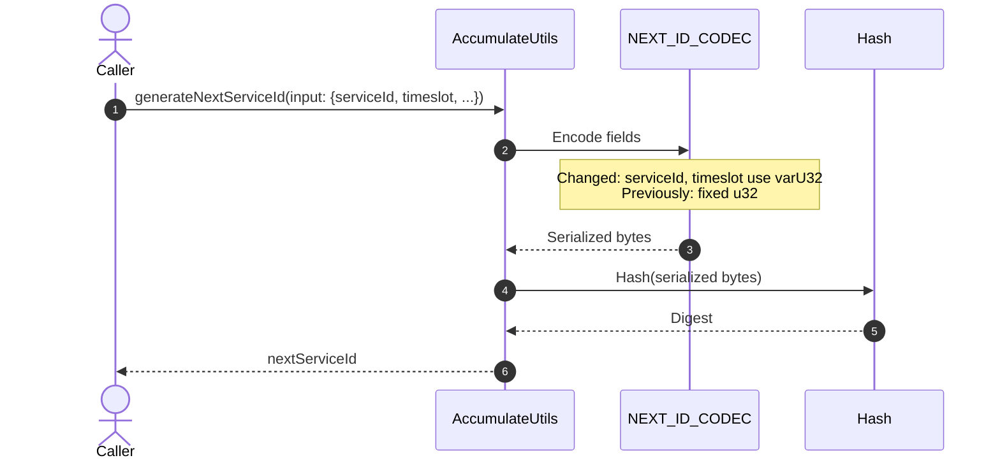

# Fix an issue where incorrect service ids are generated in some cases

## Pull Request by @skoszuta

this should fix issues with the following 0.7.0 conformance vectors:
traces/1756548796/00000004.json
traces/1756548767/00000005.json
traces/1756548767/00000006.json
traces/1756548667/00000004.json
traces/1756548583/00000008.json

## Comment by @coderabbitai[bot]

<!-- This is an auto-generated comment: summarize by coderabbit.ai -->
<!-- This is an auto-generated comment: skip review by coderabbit.ai -->

> [!IMPORTANT]
> ## Review skipped
> 
> Auto incremental reviews are disabled on this repository.
> 
> Please check the settings in the CodeRabbit UI or the `.coderabbit.yaml` file in this repository. To trigger a single review, invoke the `@coderabbitai review` command.
> 
> You can disable this status message by setting the `reviews.review_status` to `false` in the CodeRabbit configuration file.

<!-- end of auto-generated comment: skip review by coderabbit.ai -->
<!-- walkthrough_start -->

📝 Walkthrough

<!-- This is an auto-generated comment: release notes by coderabbit.ai -->

## Summary by CodeRabbit

- Refactor
  - Updated encoding to a variable-length format, which may alter derived identifiers while preserving existing behavior and compatibility. No API changes.

- Tests
  - Expanded conformance coverage by including additional traces in the jam-conformance-070 run.
  - Adjusted a test expectation to align with the new encoding output.

- Chores
  - General maintenance to improve reliability of internal processes without impacting user-facing functionality.

<!-- end of auto-generated comment: release notes by coderabbit.ai -->
## Walkthrough
The conformance test runner now includes five previously ignored trace JSON files. The accumulate utils switched serviceId and timeslot encodings from fixed u32 to variable-length varU32. Corresponding tests updated the expected generateNextServiceId value to reflect the new serialization.

## Changes
| Cohort / File(s) | Summary |
| --- | --- |
| **Conformance runner traces** `bin/test-runner/jam-conformance-070.ts` | Removed five trace files from the ignore list so they are included in the jam-conformance-070 run. |
| **Accumulate utils encoding** `packages/jam/transition/accumulate/accumulate-utils.ts` | Changed NEXT_ID_CODEC to encode serviceId and timeslot using codec.varU32.asOpaque\<...\> instead of codec.u32.asOpaque\<...\>. This alters serialized bytes and downstream hash input. |
| **Accumulate utils test update** `packages/jam/transition/accumulate/accumulate-utils.test.ts` | Updated expected generateNextServiceId from 3570515081 to 2596189433 to match new encoding. |

## Sequence Diagram(s)

## Estimated code review effort
🎯 2 (Simple) | ⏱️ ~10 minutes

## Poem
> I nibbled on bytes in a meadow of code,  
> Swapped stout u32s for varU seeds I sowed.  
> Hash winds shifted, IDs realigned—  
> Five traces rejoined the conformance grind.  
> Thump goes my paw: tests agree!  
> Another hop toward spec harmony. 🐇✨

<!-- walkthrough_end -->
<!-- internal state start -->

<!-- DwQgtGAEAqAWCWBnSTIEMB26CuAXA9mAOYCmGJATmriQCaQDG+Ats2bgFyQAOFk+AIwBWJBrngA3EsgEBPRvlqU0AgfFwA6NPEgQAfACgjoCEYDEZyAAUASpETZWaCrKPR1AGxJcAYvAAe6FhIDiSQAO6wlGHwGEwUFKK49pQS8AwxtMjOYaTkVDT0sfYsYQxoiNKQkAYAco4ClFwArACcACzVBgCqNgAyXLC4uNyIHAD040TqsNgCGkzM4z4e2ABma7J9KojjuLLcJI0JsuPc2B4e422dNd2VFFyIANb4iABeeGhdAMr42BQMpABFQ4rAns8wA80hkwPBaGA1gEutBnKRkiDMAxwZBmNosDUfrhqNgxvxDgSDABhRLUOjoTiQABMAAYmc0wCzWpzWtAAIx8jisjjtAAcAC0jAARaQMCjwbjifAYDgGXAIZCIWD/Dz0JGBELYKrhGaQdVhNb4S74E0YIiQFkaADsGhZCgwlooeLiYSkYnwFDGaqoGV2fKdzQAbM0xU7WpHxiyk8mWe0NEJEMrg2hQ+Nw1GY6KnZGnYmU0nmunMxhs7n89HYyWy+XI1Ws7gQ9I8xGG6LI03y0m0xn252wz3C81RQBmZsp0VtmsGCyQKksNgYXCaxx4lxGF5vT7EhSsdh0LgAIkdreakD9BED6ESkDW2g8sXtAjwKGYKCIGADD8UAxUQ0FJMJzVkZ9lTNKJ4D4cI0Hkf5cAvIx9GMcAoDIeh8DWHACGIMhlEKE8N0ZXh+GEJJJCqOQFCUKhVHULQdAwkwoDgVBUEwAjCDyEj6UWciuCocJ7B3Zx5HophGJUNRNG0XQwEMTDTAMNQMD2aRcDAChsAwfJxiENBmDAJgPQDb1YRZJ1HS3VULyc5dLAAQQASSI/I6XoBwnBcfh8OxTBSEQdDIBsEhmHwKQ9QoFhYJif8A3pd9EGSYpNO09K9IMoyTLMizPWskhOTsjQHIMaooA7HMu3rQs4wTQdU0XKrdDNMduwLRtSxaysRxrarOrq8ceqLAdB1bQb2pqrqGrFfs+sHYdq1mka6wnMUp1nFqFxmqAAFENiSLg4GkCCxwieBLkgADxMaFA4lWJQiiwc1IAK8zlWKrFStst0iqsv7IH0jAAG47vwfhzT4RpYDQNIA0YBG7WkDQjHMNyPBoAp4GVZACESyAlAYDxnGofGMGQPDIBIfxuADUjkfOAR3wYOnN3UeBpHC2poeCtHCeh+nGYoQozjmdnOfEfZ7Hgf8SUSRAMYMQ70vgPFSNksJEjSEhxJIDYma4ABZOh4EcAwnLQgwIDAIxuBzZ40FC4zTL2UFEG55VxhzBhHAuOk/YYAPmCDmgwDwG6VZodKKqDG2XMgDyvME3zJIC2nBdC8Lum4WgfOJ0WknpCQ0FWGJ3qiSABIKEhanp3AflSdISHc+g4+SNZ4t/admjs5o+WaFlRT5M1ofZeM+VFDpp2nDQU9u/BYbNHTIA8fBpgYAAaJ7zi3PfMHoHXQai/FIAMnO6Eh9VuOyEnqG+a+nuJru6YZpJKZg4+SfwKoALJGirQeAmwfzcC8ORb+GA96UHinwVGtB3x2j3sjCyHYrQvk3uEVWWMl642gcLYmpNyZ4wJoFD+YtmZ8FZtLdg3NeZ20gPzcgRh1biC1kJRQusSD60NsbcWZsLZWyTnbdSTsGAuzdgVT2mBvZKi0v7QO5MaAhzDhHUq0cPCx0Ts5Fcqc65Fz8ruZCQVUa5yYfnQupFaiHQABrQAAPruSlI4qkAB5KUh0qQT0vpUO8zh4AqC8GALwdp1Sc1kkBT0PApbpBfDzXUZJoRtw7kETumtpCb2SDkKGhs4jcPoCaCJOsGAaHLhQbo04mRaEQO4p2ABHI0wANCtL0AACgAJRPXSiQNAuEgrcLKdgaptT6loCaSQFpbSumLy4sga+hMa4PCCe+d49I5BxxfPSWIRMPqHQKYxdJl8caazpB4eQH0EZan3t+YohiaCN38M3VuGQO570iDdCCNc1hXwUfLRWuAARhF/rEA+yBEh4mKFfcxdBcHJ1cjjEiVMiEfRIRTBRNN8KiyZvSFmcSOb0PEIwqA/MUYhSqETHF4s6CSzZvEol8hvaAuBSrNhGtOEn24WfPhdMBGMnNiAkRzkxGqQ4pzAZfE071y5aeTcok0DiWMVJYE8gdZMQUqxZShhxXCXUI4+EiBHF6x5uEOgjj0rOGSBhAw4qSCihIO0FkAhIztDWNODYSg+TlCZJGPkJYWS0AYJGUQkZVBMgYMWGMrQ0DfBtbq9c+rDXGt4aa81OFtVAA== -->

<!-- internal state end -->
<!-- tips_start -->

---

Comment `@coderabbitai help` to get the list of available commands and usage tips.

<!-- tips_end -->

## Comment by @skoszuta

0.6.5 vectors are failing but im ignoring it because theyre on their way out

## Comment by @github-actions[bot]

View all

| File | Benchmark | Ops |  |
|------|-----------|-----|--|
| [bytes/hex-from.ts[0]](../blob/2d545abc66fa5ea309ecc869fa1371b149d1584b//_work/typeberry-1/typeberry/typeberry/benchmarks/bytes/hex-from.ts) | parse hex using `Number` with NaN checking | 142497.15 ±0.3% | 83.5% slower |
| [bytes/hex-from.ts[1]](../blob/2d545abc66fa5ea309ecc869fa1371b149d1584b//_work/typeberry-1/typeberry/typeberry/benchmarks/bytes/hex-from.ts) | parse hex from char codes | 863772.82 ±1.64% | fastest ✅ |
| [bytes/hex-from.ts[2]](../blob/2d545abc66fa5ea309ecc869fa1371b149d1584b//_work/typeberry-1/typeberry/typeberry/benchmarks/bytes/hex-from.ts) | parse hex from string nibbles | 555663.22 ±0.43% | 35.67% slower |
| [math/mul_overflow.ts[0]](../blob/2d545abc66fa5ea309ecc869fa1371b149d1584b//_work/typeberry-1/typeberry/typeberry/benchmarks/math/mul_overflow.ts) | multiply and bring back to u32 | 250251567.93 ±5.37% | 4.07% slower |
| [math/mul_overflow.ts[1]](../blob/2d545abc66fa5ea309ecc869fa1371b149d1584b//_work/typeberry-1/typeberry/typeberry/benchmarks/math/mul_overflow.ts) | multiply and take modulus | 260869332.62 ±5.35% | fastest ✅ |
| [math/switch.ts[0]](../blob/2d545abc66fa5ea309ecc869fa1371b149d1584b//_work/typeberry-1/typeberry/typeberry/benchmarks/math/switch.ts) | switch | 258858237.81 ±5.1% | fastest ✅ |
| [math/switch.ts[1]](../blob/2d545abc66fa5ea309ecc869fa1371b149d1584b//_work/typeberry-1/typeberry/typeberry/benchmarks/math/switch.ts) | if | 252649168.92 ±5.93% | 2.4% slower |
| [codec/bigint.decode.ts[0]](../blob/2d545abc66fa5ea309ecc869fa1371b149d1584b//_work/typeberry-1/typeberry/typeberry/benchmarks/codec/bigint.decode.ts) | decode custom | 174209552.76 ±2.55% | fastest ✅ |
| [codec/bigint.decode.ts[1]](../blob/2d545abc66fa5ea309ecc869fa1371b149d1584b//_work/typeberry-1/typeberry/typeberry/benchmarks/codec/bigint.decode.ts) | decode bigint | 100641693.92 ±2.76% | 42.23% slower |
| [codec/encoding.ts[0]](../blob/2d545abc66fa5ea309ecc869fa1371b149d1584b//_work/typeberry-1/typeberry/typeberry/benchmarks/codec/encoding.ts) | manual encode | 2877476.67 ±0.57% | 18.37% slower |
| [codec/encoding.ts[1]](../blob/2d545abc66fa5ea309ecc869fa1371b149d1584b//_work/typeberry-1/typeberry/typeberry/benchmarks/codec/encoding.ts) | int32array encode | 3525095.94 ±0.42% | fastest ✅ |
| [codec/encoding.ts[2]](../blob/2d545abc66fa5ea309ecc869fa1371b149d1584b//_work/typeberry-1/typeberry/typeberry/benchmarks/codec/encoding.ts) | dataview encode | 3484479.27 ±0.34% | 1.15% slower |
| [codec/decoding.ts[0]](../blob/2d545abc66fa5ea309ecc869fa1371b149d1584b//_work/typeberry-1/typeberry/typeberry/benchmarks/codec/decoding.ts) | manual decode | 22569029.49 ±0.62% | 85.65% slower |
| [codec/decoding.ts[1]](../blob/2d545abc66fa5ea309ecc869fa1371b149d1584b//_work/typeberry-1/typeberry/typeberry/benchmarks/codec/decoding.ts) | int32array decode | 157285380.33 ±2.96% | fastest ✅ |
| [codec/decoding.ts[2]](../blob/2d545abc66fa5ea309ecc869fa1371b149d1584b//_work/typeberry-1/typeberry/typeberry/benchmarks/codec/decoding.ts) | dataview decode | 156698592.68 ±3.12% | 0.37% slower |
| [codec/bigint.compare.ts[0]](../blob/2d545abc66fa5ea309ecc869fa1371b149d1584b//_work/typeberry-1/typeberry/typeberry/benchmarks/codec/bigint.compare.ts) | compare custom | 208229348.36 ±5.31% | fastest ✅ |
| [codec/bigint.compare.ts[1]](../blob/2d545abc66fa5ea309ecc869fa1371b149d1584b//_work/typeberry-1/typeberry/typeberry/benchmarks/codec/bigint.compare.ts) | compare bigint | 198496235.78 ±7.67% | 4.67% slower |
| [collections/map-set.ts[0]](../blob/2d545abc66fa5ea309ecc869fa1371b149d1584b//_work/typeberry-1/typeberry/typeberry/benchmarks/collections/map-set.ts) | 2 gets + conditional set | 104518.18 ±0.64% | fastest ✅ |
| [collections/map-set.ts[1]](../blob/2d545abc66fa5ea309ecc869fa1371b149d1584b//_work/typeberry-1/typeberry/typeberry/benchmarks/collections/map-set.ts) | 1 get 1 set | 53764.86 ±0.91% | 48.56% slower |
| [bytes/hex-to.ts[0]](../blob/2d545abc66fa5ea309ecc869fa1371b149d1584b//_work/typeberry-1/typeberry/typeberry/benchmarks/bytes/hex-to.ts) | number toString + padding | 272541.47 ±1.16% | fastest ✅ |
| [bytes/hex-to.ts[1]](../blob/2d545abc66fa5ea309ecc869fa1371b149d1584b//_work/typeberry-1/typeberry/typeberry/benchmarks/bytes/hex-to.ts) | manual | 12924.52 ±3.3% | 95.26% slower |
| [math/count-bits-u64.ts[0]](../blob/2d545abc66fa5ea309ecc869fa1371b149d1584b//_work/typeberry-1/typeberry/typeberry/benchmarks/math/count-bits-u64.ts) | standard method | 1200775.65 ±2.71% | 88.17% slower |
| [math/count-bits-u64.ts[1]](../blob/2d545abc66fa5ea309ecc869fa1371b149d1584b//_work/typeberry-1/typeberry/typeberry/benchmarks/math/count-bits-u64.ts) | magic | 10147384.2 ±1.9% | fastest ✅ |
| [hash/index.ts[0]](../blob/2d545abc66fa5ea309ecc869fa1371b149d1584b//_work/typeberry-1/typeberry/typeberry/benchmarks/hash/index.ts) | hash with numeric representation | 179.15 ±0.44% | 26.35% slower |
| [hash/index.ts[1]](../blob/2d545abc66fa5ea309ecc869fa1371b149d1584b//_work/typeberry-1/typeberry/typeberry/benchmarks/hash/index.ts) | hash with string representation | 97.21 ±1.74% | 60.03% slower |
| [hash/index.ts[2]](../blob/2d545abc66fa5ea309ecc869fa1371b149d1584b//_work/typeberry-1/typeberry/typeberry/benchmarks/hash/index.ts) | hash with symbol representation | 154.82 ±1.85% | 36.35% slower |
| [hash/index.ts[3]](../blob/2d545abc66fa5ea309ecc869fa1371b149d1584b//_work/typeberry-1/typeberry/typeberry/benchmarks/hash/index.ts) | hash with uint8 representation | 146.04 ±1.51% | 39.96% slower |
| [hash/index.ts[4]](../blob/2d545abc66fa5ea309ecc869fa1371b149d1584b//_work/typeberry-1/typeberry/typeberry/benchmarks/hash/index.ts) | hash with packed representation | 243.23 ±0.2% | fastest ✅ |
| [hash/index.ts[5]](../blob/2d545abc66fa5ea309ecc869fa1371b149d1584b//_work/typeberry-1/typeberry/typeberry/benchmarks/hash/index.ts) | hash with bigint representation | 168.99 ±0.26% | 30.52% slower |
| [hash/index.ts[6]](../blob/2d545abc66fa5ea309ecc869fa1371b149d1584b//_work/typeberry-1/typeberry/typeberry/benchmarks/hash/index.ts) | hash with uint32 representation | 173.78 ±1.54% | 28.55% slower |
| [math/add_one_overflow.ts[0]](../blob/2d545abc66fa5ea309ecc869fa1371b149d1584b//_work/typeberry-1/typeberry/typeberry/benchmarks/math/add_one_overflow.ts) | add and take modulus | 212974289.98 ±7.99% | 10.53% slower |
| [math/add_one_overflow.ts[1]](../blob/2d545abc66fa5ea309ecc869fa1371b149d1584b//_work/typeberry-1/typeberry/typeberry/benchmarks/math/add_one_overflow.ts) | condition before calculation | 238042459.62 ±7.12% | fastest ✅ |
| [math/count-bits-u32.ts[0]](../blob/2d545abc66fa5ea309ecc869fa1371b149d1584b//_work/typeberry-1/typeberry/typeberry/benchmarks/math/count-bits-u32.ts) | standard method | 84142079.13 ±2% | 67.05% slower |
| [math/count-bits-u32.ts[1]](../blob/2d545abc66fa5ea309ecc869fa1371b149d1584b//_work/typeberry-1/typeberry/typeberry/benchmarks/math/count-bits-u32.ts) | magic | 255336838.13 ±4.56% | fastest ✅ |
| [logger/index.ts[0]](../blob/2d545abc66fa5ea309ecc869fa1371b149d1584b//_work/typeberry-1/typeberry/typeberry/benchmarks/logger/index.ts) | console.log with string concat | 6472160.75 ±73.66% | fastest ✅ |
| [logger/index.ts[1]](../blob/2d545abc66fa5ea309ecc869fa1371b149d1584b//_work/typeberry-1/typeberry/typeberry/benchmarks/logger/index.ts) | console.log with args | 1690472.3 ±77.51% | 73.88% slower |
| [codec/view_vs_object.ts[0]](../blob/2d545abc66fa5ea309ecc869fa1371b149d1584b//_work/typeberry-1/typeberry/typeberry/benchmarks/codec/view_vs_object.ts) | Get the first field from Decoded | 305627.29 ±1.98% | 23.45% slower |
| [codec/view_vs_object.ts[1]](../blob/2d545abc66fa5ea309ecc869fa1371b149d1584b//_work/typeberry-1/typeberry/typeberry/benchmarks/codec/view_vs_object.ts) | Get the first field from View | 68976.48 ±4.03% | 82.72% slower |
| [codec/view_vs_object.ts[2]](../blob/2d545abc66fa5ea309ecc869fa1371b149d1584b//_work/typeberry-1/typeberry/typeberry/benchmarks/codec/view_vs_object.ts) | Get the first field as view from View | 84631.15 ±2.81% | 78.8% slower |
| [codec/view_vs_object.ts[3]](../blob/2d545abc66fa5ea309ecc869fa1371b149d1584b//_work/typeberry-1/typeberry/typeberry/benchmarks/codec/view_vs_object.ts) | Get two fields from Decoded | 399235.05 ±2.23% | fastest ✅ |
| [codec/view_vs_object.ts[4]](../blob/2d545abc66fa5ea309ecc869fa1371b149d1584b//_work/typeberry-1/typeberry/typeberry/benchmarks/codec/view_vs_object.ts) | Get two fields from View | 75556.23 ±0.81% | 81.07% slower |
| [codec/view_vs_object.ts[5]](../blob/2d545abc66fa5ea309ecc869fa1371b149d1584b//_work/typeberry-1/typeberry/typeberry/benchmarks/codec/view_vs_object.ts) | Get two fields from materialized from View | 149454.78 ±2.39% | 62.56% slower |
| [codec/view_vs_object.ts[6]](../blob/2d545abc66fa5ea309ecc869fa1371b149d1584b//_work/typeberry-1/typeberry/typeberry/benchmarks/codec/view_vs_object.ts) | Get two fields as views from View | 67457.78 ±1.43% | 83.1% slower |
| [codec/view_vs_object.ts[7]](../blob/2d545abc66fa5ea309ecc869fa1371b149d1584b//_work/typeberry-1/typeberry/typeberry/benchmarks/codec/view_vs_object.ts) | Get only third field from Decoded | 305444.58 ±2.91% | 23.49% slower |
| [codec/view_vs_object.ts[8]](../blob/2d545abc66fa5ea309ecc869fa1371b149d1584b//_work/typeberry-1/typeberry/typeberry/benchmarks/codec/view_vs_object.ts) | Get only third field from View | 74879.02 ±1.5% | 81.24% slower |
| [codec/view_vs_object.ts[9]](../blob/2d545abc66fa5ea309ecc869fa1371b149d1584b//_work/typeberry-1/typeberry/typeberry/benchmarks/codec/view_vs_object.ts) | Get only third field as view from View | 77917.57 ±1.17% | 80.48% slower |
| [codec/view_vs_collection.ts[0]](../blob/2d545abc66fa5ea309ecc869fa1371b149d1584b//_work/typeberry-1/typeberry/typeberry/benchmarks/codec/view_vs_collection.ts) | Get first element from Decoded | 21569.59 ±4.03% | 62.8% slower |
| [codec/view_vs_collection.ts[1]](../blob/2d545abc66fa5ea309ecc869fa1371b149d1584b//_work/typeberry-1/typeberry/typeberry/benchmarks/codec/view_vs_collection.ts) | Get first element from View | 57977.59 ±1.75% | fastest ✅ |
| [codec/view_vs_collection.ts[2]](../blob/2d545abc66fa5ea309ecc869fa1371b149d1584b//_work/typeberry-1/typeberry/typeberry/benchmarks/codec/view_vs_collection.ts) | Get 50th element from Decoded | 24973.95 ±2.11% | 56.92% slower |
| [codec/view_vs_collection.ts[3]](../blob/2d545abc66fa5ea309ecc869fa1371b149d1584b//_work/typeberry-1/typeberry/typeberry/benchmarks/codec/view_vs_collection.ts) | Get 50th element from View | 29805.14 ±2.41% | 48.59% slower |
| [codec/view_vs_collection.ts[4]](../blob/2d545abc66fa5ea309ecc869fa1371b149d1584b//_work/typeberry-1/typeberry/typeberry/benchmarks/codec/view_vs_collection.ts) | Get last element from Decoded | 20145.32 ±3.28% | 65.25% slower |
| [codec/view_vs_collection.ts[5]](../blob/2d545abc66fa5ea309ecc869fa1371b149d1584b//_work/typeberry-1/typeberry/typeberry/benchmarks/codec/view_vs_collection.ts) | Get last element from View | 16399.01 ±2.98% | 71.71% slower |
| [bytes/compare.ts[0]](../blob/2d545abc66fa5ea309ecc869fa1371b149d1584b//_work/typeberry-1/typeberry/typeberry/benchmarks/bytes/compare.ts) | Comparing Uint32 bytes | 18396.8 ±1.43% | fastest ✅ |
| [bytes/compare.ts[1]](../blob/2d545abc66fa5ea309ecc869fa1371b149d1584b//_work/typeberry-1/typeberry/typeberry/benchmarks/bytes/compare.ts) | Comparing raw bytes | 16882.13 ±3.41% | 8.23% slower |
| [hash/blake2b.ts[0]](../blob/2d545abc66fa5ea309ecc869fa1371b149d1584b//_work/typeberry-1/typeberry/typeberry/benchmarks/hash/blake2b.ts) | hasher with simple allocator | 0.04 ±2.17% | 20% slower |
| [hash/blake2b.ts[1]](../blob/2d545abc66fa5ea309ecc869fa1371b149d1584b//_work/typeberry-1/typeberry/typeberry/benchmarks/hash/blake2b.ts) | hasher with page allocator | 0.05 ±0.85% | fastest ✅ |
| [collections/map_vs_sorted.ts[0]](../blob/2d545abc66fa5ea309ecc869fa1371b149d1584b//_work/typeberry-1/typeberry/typeberry/benchmarks/collections/map_vs_sorted.ts) | Map | 306999.77 ±0.04% | fastest ✅ |
| [collections/map_vs_sorted.ts[1]](../blob/2d545abc66fa5ea309ecc869fa1371b149d1584b//_work/typeberry-1/typeberry/typeberry/benchmarks/collections/map_vs_sorted.ts) | Map-array | 103713.09 ±0.03% | 66.22% slower |
| [collections/map_vs_sorted.ts[2]](../blob/2d545abc66fa5ea309ecc869fa1371b149d1584b//_work/typeberry-1/typeberry/typeberry/benchmarks/collections/map_vs_sorted.ts) | Array | 68280.87 ±2.32% | 77.76% slower |
| [collections/map_vs_sorted.ts[3]](../blob/2d545abc66fa5ea309ecc869fa1371b149d1584b//_work/typeberry-1/typeberry/typeberry/benchmarks/collections/map_vs_sorted.ts) | SortedArray | 197274.26 ±0.24% | 35.74% slower |
| [crypto/ed25519.ts[0]](../blob/2d545abc66fa5ea309ecc869fa1371b149d1584b//_work/typeberry-1/typeberry/typeberry/benchmarks/crypto/ed25519.ts) | native crypto | 5.95 ±16.45% | 80.05% slower |
| [crypto/ed25519.ts[1]](../blob/2d545abc66fa5ea309ecc869fa1371b149d1584b//_work/typeberry-1/typeberry/typeberry/benchmarks/crypto/ed25519.ts) | wasm lib | 10.64 ±0.02% | 64.32% slower |
| [crypto/ed25519.ts[2]](../blob/2d545abc66fa5ea309ecc869fa1371b149d1584b//_work/typeberry-1/typeberry/typeberry/benchmarks/crypto/ed25519.ts) | wasm lib batch | 29.82 ±0.6% | fastest ✅ |

### Benchmarks summary: 63/63 OK ✅

<!-- thollander/actions-comment-pull-request "benchmarks" -->
