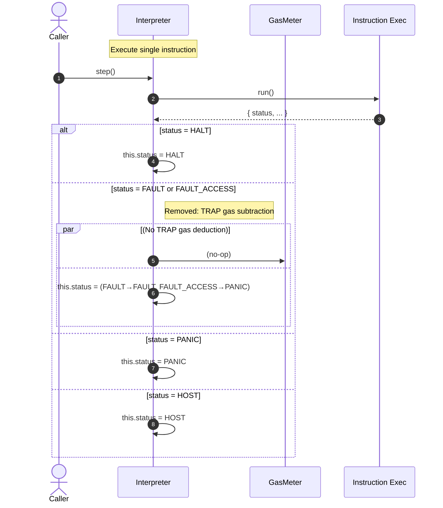
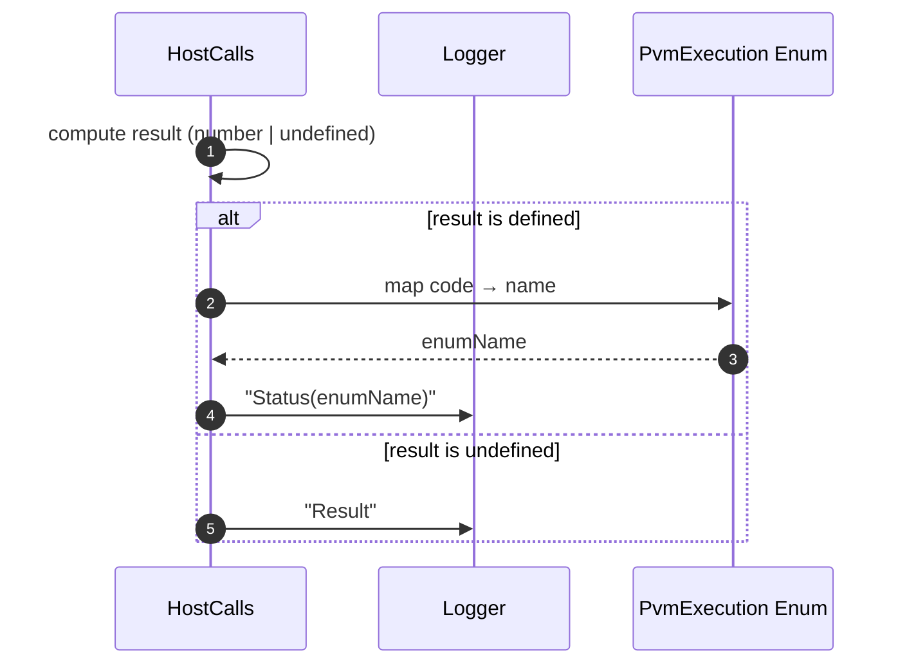

# Fix gas calculation

## Pull Request by @mateuszsikora

It looks we don't need to subtract 1 more gas anymore in case of page fault 


## Comment by @coderabbitai[bot]

<!-- This is an auto-generated comment: summarize by coderabbit.ai -->
<!-- This is an auto-generated comment: skip review by coderabbit.ai -->

> [!IMPORTANT]
> ## Review skipped
> 
> Auto incremental reviews are disabled on this repository.
> 
> Please check the settings in the CodeRabbit UI or the `.coderabbit.yaml` file in this repository. To trigger a single review, invoke the `@coderabbitai review` command.
> 
> You can disable this status message by setting the `reviews.review_status` to `false` in the CodeRabbit configuration file.

<!-- end of auto-generated comment: skip review by coderabbit.ai -->
<!-- walkthrough_start -->

<details>
<summary>📝 Walkthrough</summary>

<!-- This is an auto-generated comment: release notes by coderabbit.ai -->

## Summary by CodeRabbit

* **Bug Fixes**
  * Corrected gas handling when instructions end abnormally, ensuring accurate execution outcomes.
* **Tests**
  * Re-enabled previously ignored trace cases to run in the test suite.
* **Chores**
  * Improved host call logs to display readable status names instead of numeric codes.

<!-- end of auto-generated comment: release notes by coderabbit.ai -->
## Walkthrough
Test runner stops ignoring three trace files. Host call logging now prints enum names for result codes. Interpreter removes TRAP gas subtraction on abnormal instruction termination while keeping status mapping unchanged.

## Changes
| Cohort / File(s) | Summary of changes |
| --- | --- |
| **Test runner config**<br>`bin/test-runner/jam-conformance-067.ts` | Removed three trace entries from the ignored list; those traces will now execute in tests. No logic changes. |
| **Interpreter and host calls**<br>`packages/core/pvm-interpreter/interpreter.ts`, `packages/core/pvm-host-calls/host-calls.ts` | Interpreter: eliminated TRAP gas deduction on FAULT/FAULT_ACCESS; status mapping logic remains. Host calls: log result using enum name (`PvmExecution[result]`) instead of numeric code when defined. |

## Sequence Diagram(s)




## Estimated code review effort
🎯 3 (Moderate) | ⏱️ ~20–30 minutes

## Poem
> I hop through traces once ignored,  
> Three doors now open, tests restored.  
> Logs speak names, not numbers cold,  
> The TRAP gas gone, a tale retold.  
> Ears up high, I stamp and cheer—  
> Clean little steps, the path is clear! 🐇✨

</details>

<!-- walkthrough_end -->
<!-- internal state start -->


<!-- DwQgtGAEAqAWCWBnSTIEMB26CuAXA9mAOYCmGJATmriQCaQDG+Ats2bgFyQAOFk+AIwBWJBrngA3EsgEBPRvlqU0AgfFwA6NPEgQAfACgjoCEYDEZyAAUASpETZWaCrI5Ho6gDYkuAMXgAHpBEaMgMaJ4M2J7U8PhYkAYAco4ClFwArACcAOyQiQCqNgAyXLC4uNyIHAD0NUTqsNgCGkzMNb6e2ABm3bLFKog1uLLcJGkULjXc0Z412XmFiOmQzNQk2IgAXojwANb4VPkGAMr42BQMJJACVBgMsFzMiGDdgcShYOGR0bHxx9BnKRcDc7g8ntoEqdcNRNlx8GMoTYSBJ4CQAO6UaqQAjMTa0CjogA09gO2zwaGOAzSnmxAAoMPESABKY4AYQoJHW9GoXAATAAGPkZMACrJgACMAugUo4GQAbBwACxKgBaRgAItIGBR4NxxPEuHBrrZ7DCaMhcLBqCgQWhuGNnMhsBhyFdEIhnPICPZmrgqGJ0Fg0LRaOo4hgIpAJcFQigsFbruFlvxuugeGhSJBumhopojPpjOAoGR6Pg07mCMQyMoaPQ2mwMJweHxBCIxJJpDd5EwlFRVOotDpCyYoHBUKhMDgq6RyFQ6wpWOwuFR0b6nC5uwo+yo1JptLowIYi6YDGoMMNpLgwBQXXOakI0MwvvFuoc1vcSKL5TkNLhqgYABEwEGBYkAAIIAJLVnO3Lrmsm7low1oYKQiBGMizD4FI9BWpy1zsLqXbdBQLA4rA1zwEQjKcjykxoPI8BYOel6INet6upQD5Pi+GBvhQH5XN+v7/iSETxEQkDoo05EkPAfC8KIdBMZJDbsABUD+mg7o1BKOQZAZADMAo5HyAAcNQClZ1kCmZGhCIg8QGJpAbSLp+lGbZWTypZNlWXZDlOS52luXpBnyoKhk5BKvl+QFjkYO4FEplp7roJykCMpAngSZQKDUYcdBBvQ0meJ4NyUfcXRKPQTGyTiV6QBxGgQWV/CJnwVE0UV6gkM8TV9ZCkAug8mCkLQLVJPgyFjV2PozAInjwAwEFWJBADc/AYJ43qNUwfFURcfxYLQ1BoBoRjmJY4GeDQ84Rpa02JpASgMDE93xMgSEkAE3CHAuhw8M0S0rew4bSAWkBTeQRgAKJsfAawLr21ycqiGKQCQvT/VwACyymOEBIHOae3DaXsmZuUwnLTBIz6wPgbFfBEtI1AzTPfLSf4AcBgGgdd0GzrWRUOBu8hIaNqEQ85MAUdl+BEA0qEZla2aA+zIKcwNDi3cgqCMmuZAoVcuHTWGiDcDE3pyzQAS4NgUZkI4mVPpVbFcmWabPRgjiUMt24kC1JxjAw8BvJzsgkuiFHBtreYoMgShvOQtAks9OWSZsXYnOamx0lYdOwwEoh4BGADanI67gAC6rJMe7IappAOewogdKV3mzKbS6SdMUVHe6woTZMdg1w+hn6DIIByJV4Bk3TZLaE4gv8T+vg5XdDlxIDfbFBYBIESj4gJKA2x6w4ncuwGhgiCbfEO31RPbG6srk69KIdYXZdYE3Xdx2PfVV671/5Nx+n9CgAMFLA39mDcQ0soBTUxr9f6dBpjQJWkA5wICsJhjeHQL+8NxBIyKijAa6NDbYwgVwYo+B0REz5iTMARgyYMApmhGo1MSC02fExO6ik7o1F4ZQfhlBuZuF5vzCCgsazzhFo4BC4s0yL2lphbCRVnqLXwKw8iNoHACFSguaANhwJWFjMgaOZAgzxmftgDs/xSxFRUDRNYZV5B0l8OBAoxRoD8D4B4rx0AAD64E2RslhicE4zIWrGgDplWhpI9TID0QYlS1j/S2OvgAcVCLje0ZcjEmOrvGHRmtQgkDEhgegYZORiAfrwLRJA6DmJks9H6SBxDKzPvbJJ0lcAPGiXLTkawmKpLSNaVEgN+KrHtNwVJ9d0l2IwDPPMGgumbGXuRJAqzc562dPcFC41IDuM8d4yAgAkwmbjsjQ/jvEkgABLgVORclu3SNAPNudYcCSRIJsg6CcoJISwkRPOZc1uGgrBfJ+fcgA8icHxzyrl3NhdAKJl1JG/1rA9DZz1MEfRvqA5BECiqAwWiDTGw84HoRlogsBKDaBoMWv7XY1FYQZWUYgAhCNiH1kUKjFEaIKH8WbPjMMhMJEk2PKOclntpyECFrInlS4mwrjQGuUWCitwo37HuIch5DBSobOoQJ8BaCIECWjAVdBAlnwgXqk8UAcjyjMt0AUSp9ICAYHyEghlzK0CFPKeUaQrIZD5PKXotAchZGyFkJUAhuhmTyIWAwBqWDMCNSas1FqMRWtLHqoAA -->

<!-- internal state end -->
<!-- tips_start -->

---


<sub>Comment `@coderabbitai help` to get the list of available commands and usage tips.</sub>

<!-- tips_end -->


## Comment by @github-actions[bot]


<details>
<summary>View all</summary>

| File | Benchmark | Ops |  |
|------|-----------|-----|--|
| [bytes/hex-to.ts[0]](../blob/d75f2d4f4d0005f51ea53d844a9a02d634c9eaaf//_work/typeberry-runner-4/typeberry/typeberry/benchmarks/bytes/hex-to.ts) | number toString + padding | 323577.47 ±0.72% | fastest ✅ |
| [bytes/hex-to.ts[1]](../blob/d75f2d4f4d0005f51ea53d844a9a02d634c9eaaf//_work/typeberry-runner-4/typeberry/typeberry/benchmarks/bytes/hex-to.ts) | manual | 16372.12 ±0.6% | 94.94% slower |
| [codec/bigint.compare.ts[0]](../blob/d75f2d4f4d0005f51ea53d844a9a02d634c9eaaf//_work/typeberry-runner-4/typeberry/typeberry/benchmarks/codec/bigint.compare.ts) | compare custom | 247263641.95 ±6.14% | 5.05% slower |
| [codec/bigint.compare.ts[1]](../blob/d75f2d4f4d0005f51ea53d844a9a02d634c9eaaf//_work/typeberry-runner-4/typeberry/typeberry/benchmarks/codec/bigint.compare.ts) | compare bigint | 260417337.8 ±4.55% | fastest ✅ |
| [bytes/hex-from.ts[0]](../blob/d75f2d4f4d0005f51ea53d844a9a02d634c9eaaf//_work/typeberry-runner-4/typeberry/typeberry/benchmarks/bytes/hex-from.ts) | parse hex using `Number` with NaN checking | 136109.51 ±0.76% | 84.65% slower |
| [bytes/hex-from.ts[1]](../blob/d75f2d4f4d0005f51ea53d844a9a02d634c9eaaf//_work/typeberry-runner-4/typeberry/typeberry/benchmarks/bytes/hex-from.ts) | parse hex from char codes | 886674.86 ±0.37% | fastest ✅ |
| [bytes/hex-from.ts[2]](../blob/d75f2d4f4d0005f51ea53d844a9a02d634c9eaaf//_work/typeberry-runner-4/typeberry/typeberry/benchmarks/bytes/hex-from.ts) | parse hex from string nibbles | 550329.7 ±0.4% | 37.93% slower |
| [codec/bigint.decode.ts[0]](../blob/d75f2d4f4d0005f51ea53d844a9a02d634c9eaaf//_work/typeberry-runner-4/typeberry/typeberry/benchmarks/codec/bigint.decode.ts) | decode custom | 168967642.27 ±2.44% | fastest ✅ |
| [codec/bigint.decode.ts[1]](../blob/d75f2d4f4d0005f51ea53d844a9a02d634c9eaaf//_work/typeberry-runner-4/typeberry/typeberry/benchmarks/codec/bigint.decode.ts) | decode bigint | 103534638.21 ±2.24% | 38.73% slower |
| [math/add_one_overflow.ts[0]](../blob/d75f2d4f4d0005f51ea53d844a9a02d634c9eaaf//_work/typeberry-runner-4/typeberry/typeberry/benchmarks/math/add_one_overflow.ts) | add and take modulus | 235736861.93 ±6.59% | 7.49% slower |
| [math/add_one_overflow.ts[1]](../blob/d75f2d4f4d0005f51ea53d844a9a02d634c9eaaf//_work/typeberry-runner-4/typeberry/typeberry/benchmarks/math/add_one_overflow.ts) | condition before calculation | 254815777.98 ±6.19% | fastest ✅ |
| [logger/index.ts[0]](../blob/d75f2d4f4d0005f51ea53d844a9a02d634c9eaaf//_work/typeberry-runner-4/typeberry/typeberry/benchmarks/logger/index.ts) | console.log with string concat | 8068145.46 ±31.34% | fastest ✅ |
| [logger/index.ts[1]](../blob/d75f2d4f4d0005f51ea53d844a9a02d634c9eaaf//_work/typeberry-runner-4/typeberry/typeberry/benchmarks/logger/index.ts) | console.log with args | 847723.36 ±104.59% | 89.49% slower |
| [codec/decoding.ts[0]](../blob/d75f2d4f4d0005f51ea53d844a9a02d634c9eaaf//_work/typeberry-runner-4/typeberry/typeberry/benchmarks/codec/decoding.ts) | manual decode | 9949139.13 ±1.58% | 93.12% slower |
| [codec/decoding.ts[1]](../blob/d75f2d4f4d0005f51ea53d844a9a02d634c9eaaf//_work/typeberry-runner-4/typeberry/typeberry/benchmarks/codec/decoding.ts) | int32array decode | 142442312.66 ±4.39% | 1.53% slower |
| [codec/decoding.ts[2]](../blob/d75f2d4f4d0005f51ea53d844a9a02d634c9eaaf//_work/typeberry-runner-4/typeberry/typeberry/benchmarks/codec/decoding.ts) | dataview decode | 144653426.28 ±3.42% | fastest ✅ |
| [codec/encoding.ts[0]](../blob/d75f2d4f4d0005f51ea53d844a9a02d634c9eaaf//_work/typeberry-runner-4/typeberry/typeberry/benchmarks/codec/encoding.ts) | manual encode | 1735588.33 ±2.71% | 32.98% slower |
| [codec/encoding.ts[1]](../blob/d75f2d4f4d0005f51ea53d844a9a02d634c9eaaf//_work/typeberry-runner-4/typeberry/typeberry/benchmarks/codec/encoding.ts) | int32array encode | 2420591.37 ±1.65% | 6.53% slower |
| [codec/encoding.ts[2]](../blob/d75f2d4f4d0005f51ea53d844a9a02d634c9eaaf//_work/typeberry-runner-4/typeberry/typeberry/benchmarks/codec/encoding.ts) | dataview encode | 2589561.41 ±1.57% | fastest ✅ |
| [hash/index.ts[0]](../blob/d75f2d4f4d0005f51ea53d844a9a02d634c9eaaf//_work/typeberry-runner-4/typeberry/typeberry/benchmarks/hash/index.ts) | hash with numeric representation | 172.97 ±1.28% | 31.97% slower |
| [hash/index.ts[1]](../blob/d75f2d4f4d0005f51ea53d844a9a02d634c9eaaf//_work/typeberry-runner-4/typeberry/typeberry/benchmarks/hash/index.ts) | hash with string representation | 100.26 ±1.94% | 60.56% slower |
| [hash/index.ts[2]](../blob/d75f2d4f4d0005f51ea53d844a9a02d634c9eaaf//_work/typeberry-runner-4/typeberry/typeberry/benchmarks/hash/index.ts) | hash with symbol representation | 166.13 ±0.94% | 34.66% slower |
| [hash/index.ts[3]](../blob/d75f2d4f4d0005f51ea53d844a9a02d634c9eaaf//_work/typeberry-runner-4/typeberry/typeberry/benchmarks/hash/index.ts) | hash with uint8 representation | 152.56 ±1.16% | 39.99% slower |
| [hash/index.ts[4]](../blob/d75f2d4f4d0005f51ea53d844a9a02d634c9eaaf//_work/typeberry-runner-4/typeberry/typeberry/benchmarks/hash/index.ts) | hash with packed representation | 254.24 ±0.56% | fastest ✅ |
| [hash/index.ts[5]](../blob/d75f2d4f4d0005f51ea53d844a9a02d634c9eaaf//_work/typeberry-runner-4/typeberry/typeberry/benchmarks/hash/index.ts) | hash with bigint representation | 174.81 ±0.91% | 31.24% slower |
| [hash/index.ts[6]](../blob/d75f2d4f4d0005f51ea53d844a9a02d634c9eaaf//_work/typeberry-runner-4/typeberry/typeberry/benchmarks/hash/index.ts) | hash with uint32 representation | 193.38 ±1.43% | 23.94% slower |
| [math/count-bits-u32.ts[0]](../blob/d75f2d4f4d0005f51ea53d844a9a02d634c9eaaf//_work/typeberry-runner-4/typeberry/typeberry/benchmarks/math/count-bits-u32.ts) | standard method | 128253750.8 ±2.59% | 45.51% slower |
| [math/count-bits-u32.ts[1]](../blob/d75f2d4f4d0005f51ea53d844a9a02d634c9eaaf//_work/typeberry-runner-4/typeberry/typeberry/benchmarks/math/count-bits-u32.ts) | magic | 235383266.54 ±5.35% | fastest ✅ |
| [math/count-bits-u64.ts[0]](../blob/d75f2d4f4d0005f51ea53d844a9a02d634c9eaaf//_work/typeberry-runner-4/typeberry/typeberry/benchmarks/math/count-bits-u64.ts) | standard method | 1197859.38 ±1.14% | 82.63% slower |
| [math/count-bits-u64.ts[1]](../blob/d75f2d4f4d0005f51ea53d844a9a02d634c9eaaf//_work/typeberry-runner-4/typeberry/typeberry/benchmarks/math/count-bits-u64.ts) | magic | 6894635.46 ±2.52% | fastest ✅ |
| [math/mul_overflow.ts[0]](../blob/d75f2d4f4d0005f51ea53d844a9a02d634c9eaaf//_work/typeberry-runner-4/typeberry/typeberry/benchmarks/math/mul_overflow.ts) | multiply and bring back to u32 | 242912654.43 ±6% | fastest ✅ |
| [math/mul_overflow.ts[1]](../blob/d75f2d4f4d0005f51ea53d844a9a02d634c9eaaf//_work/typeberry-runner-4/typeberry/typeberry/benchmarks/math/mul_overflow.ts) | multiply and take modulus | 209852766.45 ±9.07% | 13.61% slower |
| [math/switch.ts[0]](../blob/d75f2d4f4d0005f51ea53d844a9a02d634c9eaaf//_work/typeberry-runner-4/typeberry/typeberry/benchmarks/math/switch.ts) | switch | 244564688.78 ±5.34% | fastest ✅ |
| [math/switch.ts[1]](../blob/d75f2d4f4d0005f51ea53d844a9a02d634c9eaaf//_work/typeberry-runner-4/typeberry/typeberry/benchmarks/math/switch.ts) | if | 230071327.58 ±5.8% | 5.93% slower |
| [collections/map-set.ts[0]](../blob/d75f2d4f4d0005f51ea53d844a9a02d634c9eaaf//_work/typeberry-runner-4/typeberry/typeberry/benchmarks/collections/map-set.ts) | 2 gets + conditional set | 118571.51 ±0.25% | fastest ✅ |
| [collections/map-set.ts[1]](../blob/d75f2d4f4d0005f51ea53d844a9a02d634c9eaaf//_work/typeberry-runner-4/typeberry/typeberry/benchmarks/collections/map-set.ts) | 1 get 1 set | 59698.53 ±0.32% | 49.65% slower |
| [bytes/compare.ts[0]](../blob/d75f2d4f4d0005f51ea53d844a9a02d634c9eaaf//_work/typeberry-runner-4/typeberry/typeberry/benchmarks/bytes/compare.ts) | Comparing Uint32 bytes | 14931.14 ±3.49% | 15.44% slower |
| [bytes/compare.ts[1]](../blob/d75f2d4f4d0005f51ea53d844a9a02d634c9eaaf//_work/typeberry-runner-4/typeberry/typeberry/benchmarks/bytes/compare.ts) | Comparing raw bytes | 17657.5 ±1.01% | fastest ✅ |
| [hash/blake2b.ts[0]](../blob/d75f2d4f4d0005f51ea53d844a9a02d634c9eaaf//_work/typeberry-runner-4/typeberry/typeberry/benchmarks/hash/blake2b.ts) | hasher with simple allocator | 0.04 ±3.14% | 20% slower |
| [hash/blake2b.ts[1]](../blob/d75f2d4f4d0005f51ea53d844a9a02d634c9eaaf//_work/typeberry-runner-4/typeberry/typeberry/benchmarks/hash/blake2b.ts) | hasher with page allocator | 0.05 ±0.99% | fastest ✅ |
| [codec/view_vs_object.ts[0]](../blob/d75f2d4f4d0005f51ea53d844a9a02d634c9eaaf//_work/typeberry-runner-4/typeberry/typeberry/benchmarks/codec/view_vs_object.ts) | Get the first field from Decoded | 259970.81 ±6.2% | 42.93% slower |
| [codec/view_vs_object.ts[1]](../blob/d75f2d4f4d0005f51ea53d844a9a02d634c9eaaf//_work/typeberry-runner-4/typeberry/typeberry/benchmarks/codec/view_vs_object.ts) | Get the first field from View | 91563.91 ±1.52% | 79.9% slower |
| [codec/view_vs_object.ts[2]](../blob/d75f2d4f4d0005f51ea53d844a9a02d634c9eaaf//_work/typeberry-runner-4/typeberry/typeberry/benchmarks/codec/view_vs_object.ts) | Get the first field as view from View | 96420.49 ±1.13% | 78.84% slower |
| [codec/view_vs_object.ts[3]](../blob/d75f2d4f4d0005f51ea53d844a9a02d634c9eaaf//_work/typeberry-runner-4/typeberry/typeberry/benchmarks/codec/view_vs_object.ts) | Get two fields from Decoded | 452842.54 ±0.36% | 0.6% slower |
| [codec/view_vs_object.ts[4]](../blob/d75f2d4f4d0005f51ea53d844a9a02d634c9eaaf//_work/typeberry-runner-4/typeberry/typeberry/benchmarks/codec/view_vs_object.ts) | Get two fields from View | 84459.41 ±0.09% | 81.46% slower |
| [codec/view_vs_object.ts[5]](../blob/d75f2d4f4d0005f51ea53d844a9a02d634c9eaaf//_work/typeberry-runner-4/typeberry/typeberry/benchmarks/codec/view_vs_object.ts) | Get two fields from materialized from View | 175729.89 ±0.23% | 61.43% slower |
| [codec/view_vs_object.ts[6]](../blob/d75f2d4f4d0005f51ea53d844a9a02d634c9eaaf//_work/typeberry-runner-4/typeberry/typeberry/benchmarks/codec/view_vs_object.ts) | Get two fields as views from View | 84493.11 ±0.11% | 81.45% slower |
| [codec/view_vs_object.ts[7]](../blob/d75f2d4f4d0005f51ea53d844a9a02d634c9eaaf//_work/typeberry-runner-4/typeberry/typeberry/benchmarks/codec/view_vs_object.ts) | Get only third field from Decoded | 455569.35 ±0.32% | fastest ✅ |
| [codec/view_vs_object.ts[8]](../blob/d75f2d4f4d0005f51ea53d844a9a02d634c9eaaf//_work/typeberry-runner-4/typeberry/typeberry/benchmarks/codec/view_vs_object.ts) | Get only third field from View | 105347.24 ±0.15% | 76.88% slower |
| [codec/view_vs_object.ts[9]](../blob/d75f2d4f4d0005f51ea53d844a9a02d634c9eaaf//_work/typeberry-runner-4/typeberry/typeberry/benchmarks/codec/view_vs_object.ts) | Get only third field as view from View | 104896.93 ±0.15% | 76.97% slower |
| [codec/view_vs_collection.ts[0]](../blob/d75f2d4f4d0005f51ea53d844a9a02d634c9eaaf//_work/typeberry-runner-4/typeberry/typeberry/benchmarks/codec/view_vs_collection.ts) | Get first element from Decoded | 28281.32 ±0.16% | 59.22% slower |
| [codec/view_vs_collection.ts[1]](../blob/d75f2d4f4d0005f51ea53d844a9a02d634c9eaaf//_work/typeberry-runner-4/typeberry/typeberry/benchmarks/codec/view_vs_collection.ts) | Get first element from View | 69345.1 ±0.14% | fastest ✅ |
| [codec/view_vs_collection.ts[2]](../blob/d75f2d4f4d0005f51ea53d844a9a02d634c9eaaf//_work/typeberry-runner-4/typeberry/typeberry/benchmarks/codec/view_vs_collection.ts) | Get 50th element from Decoded | 28269.39 ±0.28% | 59.23% slower |
| [codec/view_vs_collection.ts[3]](../blob/d75f2d4f4d0005f51ea53d844a9a02d634c9eaaf//_work/typeberry-runner-4/typeberry/typeberry/benchmarks/codec/view_vs_collection.ts) | Get 50th element from View | 39070.3 ±0.51% | 43.66% slower |
| [codec/view_vs_collection.ts[4]](../blob/d75f2d4f4d0005f51ea53d844a9a02d634c9eaaf//_work/typeberry-runner-4/typeberry/typeberry/benchmarks/codec/view_vs_collection.ts) | Get last element from Decoded | 27885.07 ±0.69% | 59.79% slower |
| [codec/view_vs_collection.ts[5]](../blob/d75f2d4f4d0005f51ea53d844a9a02d634c9eaaf//_work/typeberry-runner-4/typeberry/typeberry/benchmarks/codec/view_vs_collection.ts) | Get last element from View | 27718.54 ±0.26% | 60.03% slower |
| [collections/map_vs_sorted.ts[0]](../blob/d75f2d4f4d0005f51ea53d844a9a02d634c9eaaf//_work/typeberry-runner-4/typeberry/typeberry/benchmarks/collections/map_vs_sorted.ts) | Map | 289788.31 ±0.04% | fastest ✅ |
| [collections/map_vs_sorted.ts[1]](../blob/d75f2d4f4d0005f51ea53d844a9a02d634c9eaaf//_work/typeberry-runner-4/typeberry/typeberry/benchmarks/collections/map_vs_sorted.ts) | Map-array | 103641.18 ±0.03% | 64.24% slower |
| [collections/map_vs_sorted.ts[2]](../blob/d75f2d4f4d0005f51ea53d844a9a02d634c9eaaf//_work/typeberry-runner-4/typeberry/typeberry/benchmarks/collections/map_vs_sorted.ts) | Array | 91028.86 ±0.28% | 68.59% slower |
| [collections/map_vs_sorted.ts[3]](../blob/d75f2d4f4d0005f51ea53d844a9a02d634c9eaaf//_work/typeberry-runner-4/typeberry/typeberry/benchmarks/collections/map_vs_sorted.ts) | SortedArray | 199194.72 ±0.25% | 31.26% slower |
| [crypto/ed25519.ts[0]](../blob/d75f2d4f4d0005f51ea53d844a9a02d634c9eaaf//_work/typeberry-runner-4/typeberry/typeberry/benchmarks/crypto/ed25519.ts) | native crypto | 6.43 ±11.57% | 78.49% slower |
| [crypto/ed25519.ts[1]](../blob/d75f2d4f4d0005f51ea53d844a9a02d634c9eaaf//_work/typeberry-runner-4/typeberry/typeberry/benchmarks/crypto/ed25519.ts) | wasm lib | 10.61 ±0.04% | 64.5% slower |
| [crypto/ed25519.ts[2]](../blob/d75f2d4f4d0005f51ea53d844a9a02d634c9eaaf//_work/typeberry-runner-4/typeberry/typeberry/benchmarks/crypto/ed25519.ts) | wasm lib batch | 29.89 ±0.58% | fastest ✅ |
</details>


### Benchmarks summary: 63/63 OK ✅

<!-- thollander/actions-comment-pull-request "benchmarks" -->


## Comment by @tomusdrw

```suggestion
    // Ignored due to incorrect expected gas
    // https://paritytech.github.io/matrix-archiver/archive/_21ddsEwXlCWnreEGuqXZ_3Apolkadot.io/index.html#$qvS25IbmiyGNWR0kuxhZpukDWP5H7d_5rmUiEJ7KTUI
```
