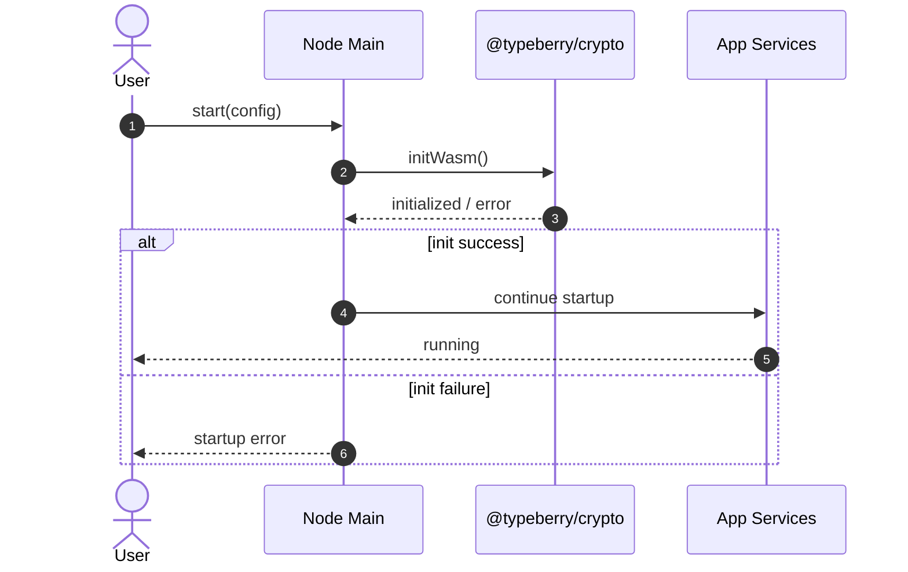
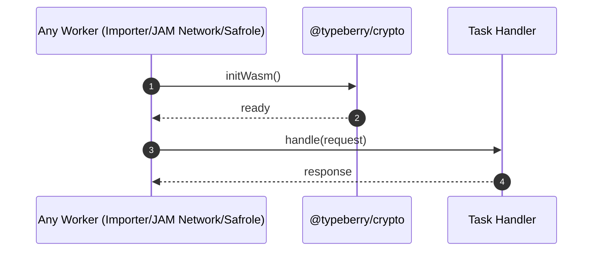
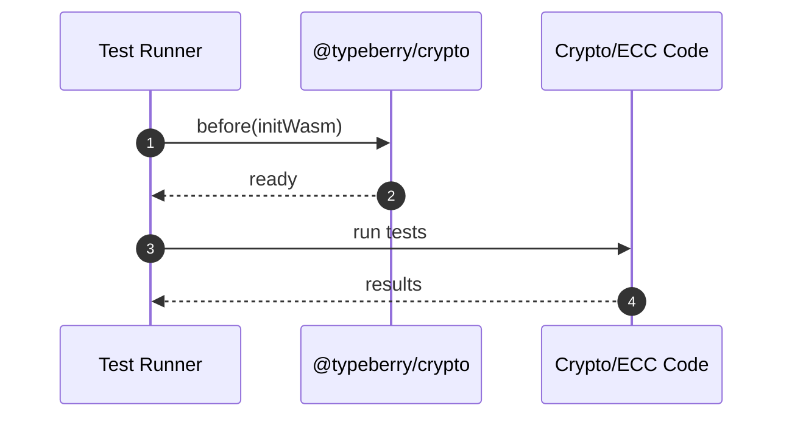
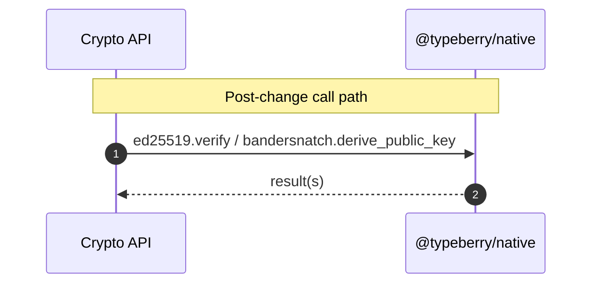

# Inline WASM files and fix @typeberry/lib build.

## Pull Request by @tomusdrw

Our current approach did not work in the browser, since the WASM modules were using `fs.readFileSync` to load wasm files.

Producing `--target bundler` from `wasm-pack` did work for web build, but didn't work natively in nodejs :)

So the final solution now is:
- [x] use a shared `@typeberry/native` package (shared monorepo as well)
- [x] initialize all wasm libs in the same way
- [x] produce `--target web` which allows manual initialization (instead of relying on `readFileSync` (nodejs) or importing a `wasm` file (bundler)).
- [x] asynchronously initialize native modules by inlining them (via rolldown build in `@typeberry/native`) and exposing proper functions and types.

The drawback is that we need to `await initWasm()` at some point in our application. We could do that in some top-level crate, but that doesn't work well in commonjs build (since it does not support top-level await). Instead I've opted for manual initialisation before tests or when running the node.


## Comment by @coderabbitai[bot]

<!-- This is an auto-generated comment: summarize by coderabbit.ai -->
<!-- This is an auto-generated comment: skip review by coderabbit.ai -->

> [!IMPORTANT]
> ## Review skipped
> 
> Auto incremental reviews are disabled on this repository.
> 
> Please check the settings in the CodeRabbit UI or the `.coderabbit.yaml` file in this repository. To trigger a single review, invoke the `@coderabbitai review` command.
> 
> You can disable this status message by setting the `reviews.review_status` to `false` in the CodeRabbit configuration file.

<!-- end of auto-generated comment: skip review by coderabbit.ai -->
<!-- walkthrough_start -->

<details>
<summary>📝 Walkthrough</summary>

<!-- This is an auto-generated comment: release notes by coderabbit.ai -->

## Summary by CodeRabbit

- New Features
  - Automatic environment detection sets the default node name to “browser” when running in the browser.
  - Centralized configuration profiles for default and development environments.

- Refactor
  - Migrated cryptography and erasure coding to a native backend for improved reliability.
  - Standardized WebAssembly initialization across app startup and workers.

- Tests
  - Added pre-test WebAssembly initialization to stabilize test runs.

- Chores
  - Updated dependencies to new crypto/native libraries and added build support for WebAssembly.

<!-- end of auto-generated comment: release notes by coderabbit.ai -->
## Walkthrough
Switches crypto and erasure-coding from legacy wasm packages to @typeberry/native/@typeberry/crypto, adds async WASM initialization across node, workers, and tests, introduces a centralized configs aggregator, updates build tooling for WASM, adds a browser env helper, and adjusts a test timing tick.

## Changes
| Cohort / File(s) | Summary |
|---|---|
| **Config Aggregation**<br>`configs/index.ts`, `packages/jam/config-node/node-config.ts` | New configs aggregator exports { default, dev }. Node config now consumes it; adds isBrowser-based NODE_DEFAULTS.name logic. |
| **Core Crypto → Native**<br>`packages/core/crypto/index.ts`, `packages/core/crypto/ed25519.ts`, `packages/core/crypto/bandersnatch.ts` | Replace wasm/legacy imports with @typeberry/native; export initWasm/initAll and bandersnatch namespace; route calls via native APIs. |
| **Core Crypto Tests Init**<br>`packages/core/crypto/*.test.ts` | Add before(initWasm) pre-test hooks; no logic changes. |
| **Core Crypto Package Updates**<br>`packages/core/crypto/package.json` | Remove ed25519-wasm/@fluffylabs deps; add @noble/ed25519 and @typeberry/native. |
| **Erasure Coding → Native**<br>`packages/core/erasure-coding/erasure-coding.ts`, `packages/core/erasure-coding/erasure-coding.test.ts` | Replace reed-solomon wasm imports with @typeberry/native namespace; add async init in tests. |
| **Erasure Coding Package Update**<br>`packages/core/erasure-coding/package.json` | Remove reed-solomon-wasm; add @typeberry/native. |
| **Env Utility**<br>`packages/core/utils/debug.ts` | Add isBrowser(); refactor measure() to use it. |
| **Node/Workers WASM Init**<br>`packages/jam/node/main.ts`, `workers/importer/index.ts`, `workers/jam-network/index.ts` | Import and await initWasm at startup entrypoints. |
| **Node/Workers Dependencies**<br>`packages/jam/node/package.json`, `workers/importer/package.json` | Add @typeberry/crypto dependency. |
| **Safrole Worker Init & Deps**<br>`packages/jam/safrole/bandersnatch-wasm/worker.ts`, `packages/jam/safrole/package.json` | Make worker handler async; await initWasm; remove @fluffylabs/bandersnatch dependency. |
| **Jam Transition Tests Init**<br>`packages/jam/transition/assurances.test.ts`, `packages/jam/transition/disputes/*.test.ts` | Add (top-level/before) initWasm initialization before tests. |
| **Builder WASM Support**<br>`tools/builder/rollup.config.js`, `tools/builder/package.json` | Add @rollup/plugin-wasm, include wasm() in plugins, expand externals. |
| **Sync Test Timing**<br>`packages/jam/jamnp-s/tasks/sync.test.ts` | Insert extra await tick() in one test to allow async processing. |

## Sequence Diagram(s)








## Estimated code review effort
🎯 3 (Moderate) | ⏱️ ~25 minutes

## Poem
> A rabbit taps the wasm drum,  
> Init first—then functions hum.  
> Native winds through crypto lanes,  
> Reed and shards in tidy chains.  
> Configs bundle, tools go “whirr!”,  
> Tests await—no race to stir.  
> Hop, hop—shipping with a purr. 🐇✨

</details>

<!-- walkthrough_end -->
<!-- internal state start -->


<!-- DwQgtGAEAqAWCWBnSTIEMB26CuAXA9mAOYCmGJATmriQCaQDG+Ats2bgFyQAOFk+AIwBWJBrngA3EsgEBPRvlqU0AgfFwA6NPEgQAfACgjoCEejqANiS4BJDBfjlIAdQCCAZQCykAGbwryJj0fgAekAACuLLcJAKUFLIA9A4CkALY/rQaBgBy2MxxFFwArACcpQYAqgBKADJcsLi43IgciYlE6rDYAhpMzIkAYhbYPj6ytSqIiVExhQmJ3NgWFollFZWIlFwEzNiItBQA7gbu+NgUDCRpVBgMsDu0YOkYtFYUYEdoiMwG0GgUUi4G6Ye5cZjaDCnXDUfZcfAxKHVEgSeAkI6UVqQCE0fYAL0Q8AA1vgqAZJnELFiDABhCgkah0dCcSAAJgADKzimB2aUwABGdnQfkAZg4ItKHGKxQAWkZ9MZwFAyPR8D4cARiGRlDR6P02BgWbx+MJROIpDJ5EwlFRVOotDoFSYoHBUKhMBrCKRyFRdQpWOwuFQjpBEPkIQk0lbFMo7ZptLowIZFaYDEwMH4iNNHEoQhpcK0DAAiEsGADEZcgrhsWp9jPoYdYAPkasYsEwpEQRjsuAoimwV0CkHIIeY/aszIUGfgWcSOZIeYLkFw7eBaCIRHpREZyFwR3wkAAUu4API5KeZi7UeD4LB+AIaSA2YHwZjcUlL2axeKyMBKHxoMsmhCIgt7oMg/6ARYuA0remboK8y7RN+FAJH+KIaCBYHfJASgSLB05EJA+yOERx5nti47XK+74UAWAA0CH0AutFLmgoakRO6aIDChoXjOu6rtiaAtLhJAAUBy4HpBQEEfBQRiRIUmKXJM7ZEY5aVq40E6jeGC7geK7XEoDAWAC163sgrYsR+TKkjwPQOAwkDsOoaJdgYUAAKIhKxTLcbxa60EotBcAABummaIGFKBYBFcECXOrwLvm0WQJABjpe4M4YLC9KQAAFI4PjxHQACU4U2XRU48fxWaQAAvJAADeYkSdBXAydBqlEIxeGdSiPWQAAvmFRheTxr71goSiQPSqLoi5Ywflwnh0PA+TFqWnmptwaAMES67SIkTD0idCTcAQiQCEEmK5bg9z5tImgFhwW1FppVY1t6OpMo2EYtuq9wdtI8pPm+H6QA4tXYNwtDTQQsWmdgs1GTw9JgDQtWwPg+BElwaDBWk4mktcPh9sww4xhwWOaJ5VbBUyNGQ62jjqM43yU+TLCQBoSW5phgSIexvAkJjz2xW5aAOHiFlYAw0sWMTPik8uz1YnEKv0kVGDs5zZXZC6EsWPgnTOfSEKOIJ1yIGgbAANz8PY8i05A7YUOQiDIFsuCw22IP0IjbPiNL8B4tcbheOjN58IjFDYBgusYERtOIOpRgVlWOm+npBnLrAxmiGZOeWfw6pVX69lLAITkuYabmg/TOQHsDyfSMpFd0IsjnwM5JnF3LafjZNOL+TGc0omiIbiVrLJrbQG2/CWH07WARh7QdR3TKdJDndEV03clFCIPdj2ve9n3VrWv0NuGzZl/7bceVAyLcGZVz0Av9JiCgEPVQp+wjoPxtJIEgAB9auTkwFEhIPII4XR0DDjttIDeYsbpbD1IrR87gYgMHgH4BWKxZCMQtvgKQ9BmbVVaiAqQECe4MGgbAkavgKaQCLOEHwIwxiyDMgIaYh8bQn2oPcIsjsFKExCr/ViLU0i3WPqfWAzDuaU3YV+eYSR7qgNEYbSAlQ4YIwLowRWHEaAsJ5jQ8BkDe6MNkAVLY5VlICLusI2AGgLF0JrtYmBtj7G0DKrFfO1wrEMAANJMJ8AnMQekdFwGuPSWqrY0YmzNoVCQod4biDAvcUQRImIT19h7cCCF+B7QAI7YGuAAITkUIh6sAwmyH8RbSEyBIntjbrQR2wSGkAHJvY5TytcBS9IzJ+i/N7GELtDG2zYOnS+2dB7KTRv3cymT9IP07qqPgwS67iHEI3KAzcnBQAwC3dpnYO6+VsrQbunjnKuSiBxIg90LjSEfLEhydzfCRLWRPS2+kuAV2+XcX53TYF2JIHQLglRHC4AAByuFQmgRpXBqlH1qfcBp6kJriFHnqce80p5LVnqtdam1l7yl2vtQ6nYTqkz3pdfAiQ6BcmKPyUoT0eKpTehSzOV8fq+j+nfSMrZW6djBq4YKQ5Rbi1qsHeAodZa/J4iQbgUYpEflIsrVWyiqZKBphLBSwcOY/DMZTNGDBBWxVzIxIy8tFZas1qTHWesfj+KDrrEOMsI4eG8E6/KqcdF6Iye3Shn4DyOGRrNY1nNCosulOylAEz/BKzDQ4o1ho+y0AHO3D08rFVyzdrjXJvAY5LIlguUQeBolNzOSDPOrtkm93AvAWauq0b5ploWzh+AjiOziO2VE9lEmGNTn8lpgTQzILmXyhZayG2GJWSXdZ1krl0Tsts+huyG7P0gIMH5el0CM1CpAMKMafgxU2Wa09G8aXHR3gyq6848wgTGgYHFU0/TWjiZPRaM8VqQHnovC+q917Uq3nSs6lr95MvjWyjl59eVaW+tqQVt8mwiqBucg5kBX7vyZF8H4zxvh/QGQU64UgKD4N7oWwhVJIDwJXEg801w4OJoiSC3OXBKP4NkGAtjpQ8k8fGPx2grL2VgJunU9A+VTkhkcBIPGTJUTsQExoYTfGBMFQyWgfxCk1MadE+J0okmXHaeoLpkhKCzSgIsLIHRyIxzkNwvAb+L4/7AlbIZgTQnKC8aMwmkzUn7jXoE58Tmgs8kSKZh5mRPnhrXsiMhdRiRNFSB0WEy6uELPgS2AUOzeT4mSQhNwbgWrYX7WBAVdMlHgT8l0HoZc8cSBlUYqLLYFBUTJ3yRcLAiB2wxCxBpnrHsZC4ysJgAA2gAXV81R8Y1TpP0gKesgQ42GRYAKgABQpkgFrRT/UkB0dlZ5gyrLqh2a4LbNhiJ3Gw50p2BXYWUFyqmt8VgDQwmVecS41wxV0BnVpOduclmLqLqskHq6/JbM+bXB57kwbN0fhcxGhJTvkfOy5Ndupblw/rvs5Ajgb3gdpQ+6DjLmVicC6lMK2KR7TW/RPBa09lp0VJQvcl20IBrwMLeiDZOLpPuSouQsSGvrXzQ6GYVgNkc4bw/tJkaN4EWFoArCg9AMZAtbE4+RLiTVc1YRwrh4xeH8JqQohjCC9wHlymwZi2PkC6qS3MH8qXrxSC4DrjFsB9eFS9wovTiFz2UxdbgbSFgDYwAQMgf71tQw/auJRbNE4FJoyvbb9uWsXC+rACM6aHGom3lDlER2aN4mefVGjHZFdkDNKJ20gOgOs40GXQuwupkIelyh9c/gm6vnw5wz5aRpDyGVWx5AAAVAd83evY26vYZw0YJupjXRn3U0RY1vLj+iyesKQLWr+5cdP9FCjfcJfn87lCCw0skA3/TIfkMd9j+ka1YO4einB6Uaw1RyXXc37v++vTl+gSr+iziSoBmSkvFzlSpvKTvSuTldN4uhFRmkmspyi9KLqWHyihnWH6P9PfKKthrupKrQLuBLO7J7ITp6gql2mslwGGjICTPlLqqcvqrTIxAwZLLgL7rqnzM+oLIxBmopjAowVrCQKHvrv4odpOoGlHqgGQGGPEgxrGp2mHIWvHOsqWvZIjGjK7GGOoCQI7KcvwEZLHMbKbM2rHk3tpC3osjoWDh3q3hstjhurDs2gPrukjpdtdsyi4U8EurRkQXTrigziAczsSgBkBpzivNzmBrAfevAYLkynzqQILLeDylgchhLtNPgZhrLrugACKqoqhkAMDyCwwhoBIpEJFQZJGLAk5HZYQYBvTpRQAkFMhKCIhKB3DuRcDhCnI1y7wCbhCsgaCjEih5KX4pY37hDsgaBzH8hgAADsDAIocKAgPgWQmUuguGJATmHRxRyUPR0ggKVO8G4WpqBUnQK4PQHAi+3CpulOxmFxzAZYaAAAbKUPDPyO8ZyMUGgGgBKAwPyAIO8WsQACysj8hwqlAlRwrgn8jFBwoihQkigMDshLECCB70BG5L48Ir6H51LZCtG7Gkg2hdyExCD7B+gLhIA0B3DXCthTGu7Vr0YFTtbsABJ+CvatZSJ2ZarsSIBfBqqtiEbMDEYYKQBeRnGJo8TUrKTNyDFSkymCaMaKLsQ35pA5ikSMRHAIATgwKqpapqI/jETiAOAE7oBpL+AqBWA6JI4F5rLSwzR/ZEG95uHORXY3ax4ybUSZr9gfyOy3gFadElF3DyCKEASJ4+lE4WpJE8ANHWHA6lz2Ht4DzzrOHQ7unV744I61rkDDwhHAGzSEp/qs5zyQEgaxG84NHbz0rKCKFizWikTMpUCNlgDNnJzoHcoXzYHZF4HS4Pyx5gw2Cxax4EzHrarMGsKsHWCuxGqxasyeqJYmmoQaLu5Hb0x2BSy0GHo4x4z0H+nZofyIKHYFTfCyB3CFT+INSNZoBfDqBcEaD0h0BnAmxjgYAFRlTuoRrUGKo+pRzSGBr0zQDkEAiUH5FcA1aUB+h7DQTwBvyFyICWrwBxBpAmwHR5wXlXl0Y3SYWFQCrSyMQRIrC2qODEKhhvzqCMRCD4COCMQJx4gIWMT4Y/noAMD6iKCMjgSXn3B9inL7ChgkC+zcAxISw9pHA7CGLSH7m5IaHIBaGxyGSjoSz6FYyMRkC2kCmIC8WwD8XnBUE7lqG/JqnnBrjZzlavCSCtrYDOmNoWEMA6KwQBiGgTmSKnKmIsRmRszdZ6lwKxoKyJz4DAhoWqHhzBCsJXB0SQhiRdGlHuQ6IniUbGIzxmg7DqxUwhgjIthYAejYV8W3gGVCUiWhg0DcCl7mEpJ14rqmHwJbC3b/ZbEaSzq2EZmpliSOGLLd7row45l7J5mHJ1pPzKRo4vJKHdU447IBHzrBGfpjwlmgERFs4QEc5QExEwF3p1lnQNmvIdmKAtk7UYydlEA9li78qoY5GDmEH1pgzy4nnLKuZmgTx0BgCgTvlgRilVjXYap0TIAFTuDuykGwQrA2a3h9SiAxgaV3Axj+K6ovlPBvUsC3gvGRZqmIKalelIJsCICoL0Gxbw1vlI13iG6rnX4bl5KAKkCQAqbPW0CE0fk6J2B1zfpbZ0WGiIBWZvwK70AjiQAA0AhA34Ag2F6fkaBi3+Jo280E1C1E0aD83q6IDA1WAi0FRi0aC8nDKqr4bMTQ1KCq3i2W5MbS3vUYAaClExj63q2M1YAmQxhbZohXCc3a3DiLTy2C3C1rKW0S0IJS2Qp00y0M1u2K1C3K2e1q0a2IT0hc0nm2163h2G2KLG2y2x3iHh0OZ7FkKK6GJC30BikSkxbSLiKTloy80Y3fVhpJmtUg7tXTWQ7lx+HZlboeGI5DUo4HijVnaZnXK47uG5lvKFlzX4oLXhH/rLVRFrWUo87VFbVDFtm7XHX1HxFpHNG9lZGEUDkYYy7DkGCOaZ2ByGIADi6gAAEj0PnZ/Icd0WUU7LTa9QHcjZ9UXZIsyWuW7ixoVHMQscsasesZsf4kTtPZBrPd8PPftcnIvXesvY7C/QsKybXnsROukC+PA2SZQIrgeCrCsL2pOqXeTewJGAVJ/RoPyJHkjsFQXHwI6XpM6VYRpPMlXSmcpWmZ3iuvXVmVXE3X3Z4e3WRq8kntRgrG1QeJsj3X3ODq3rNXii6UzkSqPSyLUL2lWRtfzvSnA4kEoOkCdYhpkeLuvUKpvUOUQSOUeTmkOLzVegXBYDEHwEgJUn2EcB1l+fnNQGJDQGIEOAIPYx1mAA4DAnXKiPxZ9uqstr1sac1gxgXFgKYdRMgMYbwPgIOFZHwHqWQOjAk9IGnCoJDKgAnP+I4ADvTGwCA/lKgPSFGQQPSIHAeNlTfbY145QE41nmQAE7eEE0oG42sk7ftMaYYqLEOoJY4A4E4F+K2PE4k41A1E1EWLk+JPk7QEWG2DkjonY72h1gmUbQg1bLIpKWBNY1rBCAyRoHJr4Noa+KREYcjZ46s5QIVM3EoP4ntBs/8jICRqqFgGMxkxoHpbikdmoJ0HxFnriqRO8oYlQ2BJNCsCNusoKb2FqkWMAK2o1gQHjJAMANmsunoMwIgAs9Y+s7AG1vEpQF1inNnclZC0U42UEwOmgEOhQPaQeOQzc94d6W6d8K2mTKwiXYtHU9cxQE4xXJXbpIw5OrXV3mwz3hw/3lw2DPupxthMes/pDGC1gDyw4w02VDFETmFIAw+moxo9gFo9FAPVI4zqWWAZEZWRSqBjWfEdMEIHbHSoRGALOaljGHtYRKdTo+dbgfowDIYzdfTHdUyNY2APeNcOROeJwVnl1LgOoyiHVMgGjexFcJmv+fioRFZKaD/GGoIYhBUdNHtMfFqnRnnPsH9glFmG4uJFBMCIkAm1WxIDou0RrgnD8/465q05ye06DZtqqx1tiUelSSqvQDkCeAUV5GAuO4MK4JULUNAO4Ec8go4tcEWFc2qxQAs0Tmu2s80x2xgJ9hzSYRQ3VdcGjCeO4EWjxBnkGvon6CbITENIjIW/VZFDOCaCIO49eq+5WzG3kt+2nHhLFCqoTA/GGlqjGz1IeKBLlYhHhJB9B+nfsRQh5pjhBxW1B9hLB4NOh9B2IpOVG/ZP+3kn25QIK04TXeI11eKz1Y3VK/1Thkjj6ajrw+NdR5NZw/R0PIAUWfNT+iPeWezsBla9WYA/awMGJxgNwK9TMN8ESNMDpXcN2dox9H2Xo+hn69dU/N2FgO4Lxf8IgLkq7IADgE/W5wKuoYvFCdTsQSkKFA9EgAuATFILi9jsT3naDAjiAHROOEZAcwVMhoA+At6Tp+DHzAgxCUCACYBMgM3DkOiJUhhXJxPGGNBHktIQpnjFqlsBYD4BoApwwPp0SBoP8jCI4Lp3cF+SC26CY4OMUhIm5EXkrPlXpYVYJWUaZKeweIrNg3hUSJuOcIhB817Fqkuf0OBzlopaDtcOQCEMCHl817rEqoetkgdI+F4VmgOL8ozj6ZK7XJjT6ftP0HtBgFMqgAvGMGR3YUwx1emXXVjuw33njpxy3fkZctDqI9dywxBMJWaEzFE9Hi5ud8a6EcPbIwJytUJ9AVPbWYkGJ660oIkP8p6yp2vRdRvRp1hgG20fh7Flns4LEK4F7HsTXL+Ogv5PGWFXLHjS/lwWftej/i7q/QgfgEWNbb2AGUyAyBQE9n+bueC2VQEv8gTA+S+J6vrk49Hf54Fzcx2ogJ4JCHAPSCB0QLZeroxNIZgPIMkv80RPZBEnRBQ6VQCCVU2o5SBf9xCCIYwOTzz8ZYek1/pYJQpIWxXob3RH7FsOUvFcnI7PgjT3PtoFSIxP8pbpC/SB+2uIhHKW72qu2NBEPINS94jMq08mNe3Dt82l6eCJCNVhW7qV0MiBYFttQLAAO3cyQK4GVuOvXndo3vTElcoJC9S7S1BfGZHN4GOMnjE1wTQWHEyNIR8+tL5T7ePFHyJY7NVVZLVXtsCiLYrPICQOUpINLJyWy22qwhT78kC91k78Fa5M6aP37ABP4Hw03zHBd0IyK5RxmRNa4X1Tus90xzw+jq8pjleun/clw5I8D3x6D+AePUo1D1tYw8HWLraosvQyLI9dGqPX1gQQx5acDAzbdGotFDJHFr69PK/EkCZ5FguARYIhvyAWYUc4qxxb2D2wfiicQBMYCBkdGXqrcGWphRPtJEvrxU0+lDfwOW0NDsAuOGcIHAw3WQUdOq1/Njrfw4739a0DAu7t3SmpX9c4X/Ysj/zLJ/9LWkPOIptWAEDBbY3MKwKvhPwuIXiiQfcBQBgR0tlOl8HAjfClwGNNO4qM3tcAMFGCjEKwHrkmllwRUeYgpXSg70dwHowIiMPKnN08HWc8kxzNzuoCHBt9u+BaZVPzxcZoxR+D8dpG8C1QMgQs9IT3lyhsHSNOCeVYKPV1ex+9TUyfJ3KTUwHxkFIJbdAML3yHMAnG/fPsIky1SFtkELeePlHmMhIBHmIWE3icz4DVBSIzlZgOoE+yMRFs9wAAGp+Zxg5gA6MJUPYKRxh82WQO4AZBKwJ+M/J0kQknQzISAVmFbFqmRA41LIYsI4FQFKxMgiscfUvIYgThEg5MGAMAGwBXCKA8WpVFNMRC2CBBCedEWLpRgKgPCcYfiGJIYjsE3NLUDIX5Mcz2iE8hYPFHCorCcGIwCIDAC4PSENDOBSQRgo5uiB2GQgemNsJdgKmbSNCHhmIPJJnSoCQseI8cMQK8nP7V0ruorVhhIJo7v9t0BOMGGtEeENgWO1wfNrqEVbVQAoDGdETcyaiIjkR7ANEYYNI4jhgARfKgFi0Yj7D3w+kbYcOGWAWA9ABUdklwDlF2xEAN5RrM1BiiAAkwlPRApBRwIvgKKNvBIjUIEo4UXSxlG6iFRuxA4SqMYgYB1Rmo/KoVG4A6jzIWLA0S1FpxA85BMjBQRa1WoACVBEGWHhoL7BaCwBTRCAaYP7IwC8i29Xes5mWRMDwyuySMAvmNz4k+E2gwRAomwFsIFi8xDsu8SWKlA4UxQHwAs3bRg4iBeCNPhdmh5xiAuCY3eEmIQ5ZwlYjLVgSQBVzwNg+DeDpLSOFY5iBBt3N/g917pPd6YRRNsfIBHxQpT0uJB4gSTXz3AYolGQkGBDChVj2QNYusQ2J8AxRdU2rLsQ63jFC0+xiZJojFBQFX08yH6E1mEV/6RiIe61QAaoNh4ud9IuQxIN8EUKgg3ktMJHqmLU4WD0e+RMGB8ldhhtMqP1JcJ/iKG/5GepQ4WFKkQQEApOVgKQI10qHB4nGdGKcqexUq1Q1Kqo2FOtzwTb9lCpqDfoehVRqoJuccBOEnCIjgSrwDJMgjxDTitCkuLvXQpVWbSrDJxpAJqtwObxCs+B9I6QWKyZGVxFxH/ZcQn0f5qSu4d/R5B3QxyyDeO4Y81mPSUH/iYxtKICbcEJBrJ1G7QvAMdAXg40nJacaCSYNU7QD1OsAxCfTBILSoMYehYSn7A9RGVw4LgfHoT3yzyA5ADgoZkRE/xAUMqGhVnoxNzRUSi0KLOKWB26zSEWC1MecnhIXjMSzyPopxreRkQhCRerqaoWVEdjDR6p6FBJiWiozaEruBRRyVjDVi0SMgNAHRD5HpKkFJ0nBD1FGj9K1SVy2EhYEz1zb0BeR7cCSbVFQmIwy2ODRaDJWLT0txBS04EF0PsjgSYKucIMs7HRhixXYbEzDhrlHHTROCGIfKDvmnFKTL+c41SQuI9KsiBqkAI5EdlaEPTZMrdRaVd0Mkv8u6PVd7h4RBaul60vpKGGczGSGRVKIUtVFkOFhnTZUNUr1LbyyRYJQxJks1ktQrJRjhOyjayQ62Al2S9IDk1yVjESDCYaMayMAHAyU6YFIB3rcwbkS3pGMEB+E9iMFJKocTnGmMnvuHGQC+5kpwkuaAnGwS4IBGc/N6FAFHKsQ48m0lFgVLYKGog8ovOfCTWmklCYMhUKOu/AaGEoiqo0oSO/BgT71pALWNKezzMYbSmC4hcqUGNajVSqhX5BqU1JrgtSO4+kPhr7kulYAEmtohSm1KUpY4q04gbrMBVyCAyG0kk5yAdM+HzoTpBWV2BQQybFU/YC5ZWbDIWlyT6GiktvB9ycI39eqIgtkfmRIB4yh68gsyUTL/GT0jAyLKkNdAyAq5KAVA1IsmNXpQCfWPkjMdzMQEalkBuYtAeEATEjBuAiwEYP8xeILM0ah4w9O8TGJjElk42fhB3JtDdzGi0HWKmGXbGHtNKnibrHjwEAE88sxPN2EEASkBI0Y1QEOn7HSCZA0miTWgUexubKsaGQROhi1WLmTdS5VHXSRXLo6iDtJbpZjs/1Y4gL3uDIrjp+O/6mTCZgnaIs3IMCtyt5mQLuVPNhh9AK2gsFMV5IHnwTfJ29LHpIjDTdCWJzAKnpDE+oX5cFM8t+Aa0cALyb2IaegCwv+ZCVPeDJZSJGhGCzQxSX5LgNwq2bHNJs8SIWlIC/K6lOYci/0B+RAhONEgU+YMvICzw1w0AMCVkAIAAD8k+RILamQjIUqMl0RRU0S/LTYBpvkW6Pbhbx5C3xzArEM5xew/yA416SbEWAsDMBaAAgIsIxHYQ4gqMIQbQIkEX4MAiws2RGN4t8X+LAlbCcICEvgBhL4AESjIFEqCWzk7i2LbJdTEOl0RElRYHJfgGxY2K/5PAgBfwJu5vSG6LI5utXNrnSMCZcjVBRPWtaWjswHmLufwU8ko8SFnM/1vAICmRSL50U6+UHPvmGI00yTB0eqlymJTtZBQ3WQzxmm4T6A1U8rGuA87TIYQ1UVsIjzkLIAFCoMvOqT3xQQxyA7NONBoBOqMQwkHFHRcfW+AUM9M+URXrQFilOzAksgCLvlDLZZBRJOyZPiDI+WbN1kMkzcUCh9HJ9/k1WdpOQAsCkovYR0GkIitHHuAvsJAOXvcHybAAlZtkCgNuVwCMRCV66CgFip3B6ADYlShSeR2UmvTGR70/SV9MY6QLhGfhd7mCv7rcdB6LSxam0vB5oLOlDo7pX5AoC7zwBfc9mZLiGVWDG4oy0eSGGcV5j0BKWLAVZ2XlgRcB8xYhgQOUltj3ID8LpXOB6WSr+xt4KGUegXi/IRIMQAEImy6CxlWxh841YIHD4XNP5fAHSaqqPnulGcAIG2DjCOCm06VNhapYytqXMr6lGkz6ThlXGHz5AT+LccUMfT4AYoiMMKKatmVSqXxB81AcaoKjaqsAuqhYkWFpV8qvxIPCMeZOJnKCDApqsTs62Ep2D+YKUfpf3I5lXU4B1gxWR5jcpVDlIGee3HnKwlrL9ZjKBzK21fATSsZi3dIgL2z68l0ufjd2eRL0y7KKMlACMvstJWZSteApRCOr2F5apPl+TL2BwWq4CkaFEQ3nn1n57ostUlo13iJSeklz4FYM9SR9MaUQKYZUC1Pq/y5WsreViCsMa0rB7/8SZyYZ0HXFVDqhAImoOCfqEDBzR7ypCyMHFO/S2g1A8YR0EmAMCwb9Q6gMBK2kQBgIzWdAMBHEIVCEalQuEEUAIFVxMafAIJaUB8X5CIk0AJAJYnWJ8Aigli7IEUEiWhLspgS7xYoKyBFDsRaNRGlgAMNwCkbSCFG0AlRpVCJg9AQAA=== -->

<!-- internal state end -->
<!-- tips_start -->

---


<sub>Comment `@coderabbitai help` to get the list of available commands and usage tips.</sub>

<!-- tips_end -->


## Comment by @coderabbitai[bot]

_💡 Verification agent_

<details>
<summary>❓ Verification inconclusive</summary>

**Avoid direct `process.hrtime` reference (breaks browser bundling) and BigInt→Number cast**

- Referencing `process.hrtime` even behind a runtime check can still trip bundlers (per prior incidents). Remove the static property access from module scope.
- Replace `Number(...)` on `bigint` (project rule requires justification) by formatting without narrowing.

Apply:
```diff
-export const measure = isBrowser()
-  ? (id: string) => {
-      const start = performance.now();
-      return () => `${id} took ${performance.now() - start}ms`;
-    }
-  : (id: string) => {
-      const start = process.hrtime.bigint();
-      return () => {
-        const tookNano = process.hrtime.bigint() - start;
-        const tookMilli = Number(tookNano / 1_000_000n).toFixed(2);
-        return `${id} took ${tookMilli}ms`;
-      };
-    };
+export const measure =
+  // Choose impl at module init; avoid static `process.hrtime` access so browser bundles don't choke.
+  isBrowser()
+    ? (id: string) => {
+        const start = performance.now();
+        return () => `${id} took ${performance.now() - start}ms`;
+      }
+    : (() => {
+        // Lazy-bind hrtime.bigint without direct property access (helps bundlers and tree-shaking).
+        let hrtimeBigint: (() => bigint) | undefined;
+        try {
+          // eslint-disable-next-line no-new-func
+          hrtimeBigint = new Function("return process && process.hrtime && process.hrtime.bigint")();
+        } catch {
+          hrtimeBigint = undefined;
+        }
+        if (!hrtimeBigint) {
+          // Fallback for unusual environments: use performance.
+          return (id: string) => {
+            const start = performance.now();
+            return () => `${id} took ${performance.now() - start}ms`;
+          };
+        }
+        return (id: string) => {
+          const start = hrtimeBigint!();
+          return () => {
+            const tookNano = hrtimeBigint!() - start;
+            // Format milliseconds with two decimals without BigInt→Number narrowing.
+            const msInt = tookNano / 1_000_000n;
+            const twoDecimals = Number((tookNano % 1_000_000n) / 10_000n); // 0..99 safe as Number
+            const tookMilli = `${msInt}.${String(twoDecimals).padStart(2, "0")}`;
+            return `${id} took ${tookMilli}ms`;
+          };
+        };
+      })();
```

---


</details>

**Avoid static `process.hrtime` and BigInt→Number cast in measure**  
- Lazily bind `hrtime.bigint` at module init (e.g. via `new Function`) or fallback to `performance.now()` to prevent bundlers from pulling in Node-specific APIs.  
- Compute milliseconds from the BigInt diff manually to two decimals (e.g. split into integer and fractional parts) instead of using `Number(...)`.

<details>
<summary>🤖 Prompt for AI Agents</summary>

```
In packages/core/utils/debug.ts around lines 122 to 136, the current Node branch
statically references process.hrtime.bigint and converts BigInt→Number which can
force Node APIs into bundles and lose precision; change to lazily resolve
hrtime.bigint only when running in Node (e.g. detect existence at runtime via a
safe accessor or Function constructor) or fall back to performance.now() in
environments without it, and compute milliseconds from the BigInt diff without
casting to Number by splitting the nanosecond BigInt into integer milliseconds
and fractional parts (formatting two decimal places from the fractional
nanoseconds) and returning a string like "<id> took <ms>.<xx>ms". Ensure no
top-level use of process.hrtime.bigint so bundlers won’t include Node-only APIs.
```

</details>

<!-- fingerprinting:phantom:poseidon:chinchilla -->

<!-- This is an auto-generated comment by CodeRabbit -->


## Comment by @coderabbitai[bot]

_🛠️ Refactor suggestion_

**Importing the WASM plugin is fine; configure it to truly inline large .wasm.**

Default maxFileSize (~14KB) may emit assets instead of inlining. Align with “Inline WASM files” objective by increasing it.

Apply:

```diff
-import wasm from "@rollup/plugin-wasm";
+import wasm from "@rollup/plugin-wasm";
```

And at plugin use:

```diff
-plugins: [resolve(), wasm(), commonjs() /* only for blake2b? */, typescript(), json()],
+plugins: [resolve(), wasm({ maxFileSize: Infinity }), commonjs() /* only for blake2b? */, typescript(), json()],
```

<!-- suggestion_start -->

<details>
<summary>📝 Committable suggestion</summary>

> ‼️ **IMPORTANT**
> Carefully review the code before committing. Ensure that it accurately replaces the highlighted code, contains no missing lines, and has no issues with indentation. Thoroughly test & benchmark the code to ensure it meets the requirements.

```suggestion
// tools/builder/rollup.config.js

import resolve from "@rollup/plugin-node-resolve";
import wasm from "@rollup/plugin-wasm";
import commonjs from "@rollup/plugin-commonjs";
import typescript from "@rollup/plugin-typescript";
import json from "@rollup/plugin-json";

export default {
  // …other Rollup config…
  plugins: [
    resolve(),
   wasm({ maxFileSize: Infinity }),
    commonjs() /* only for blake2b? */,
    typescript(),
    json()
  ]
};
```

</details>

<!-- suggestion_end -->

<details>
<summary>🤖 Prompt for AI Agents</summary>

```
In tools/builder/rollup.config.js around line 4, the @rollup/plugin-wasm import
is present but not configured to inline larger .wasm files; update the plugin
invocation in the Rollup plugins array to pass a larger maxFileSize (e.g.,
1000000 or Infinity) so WASM artifacts are inlined rather than emitted as
separate assets, and ensure the configured wasm(...) call replaces the plain
plugin reference in the plugins list.
```

</details>

<!-- fingerprinting:phantom:poseidon:chinchilla -->

<!-- This is an auto-generated comment by CodeRabbit -->
