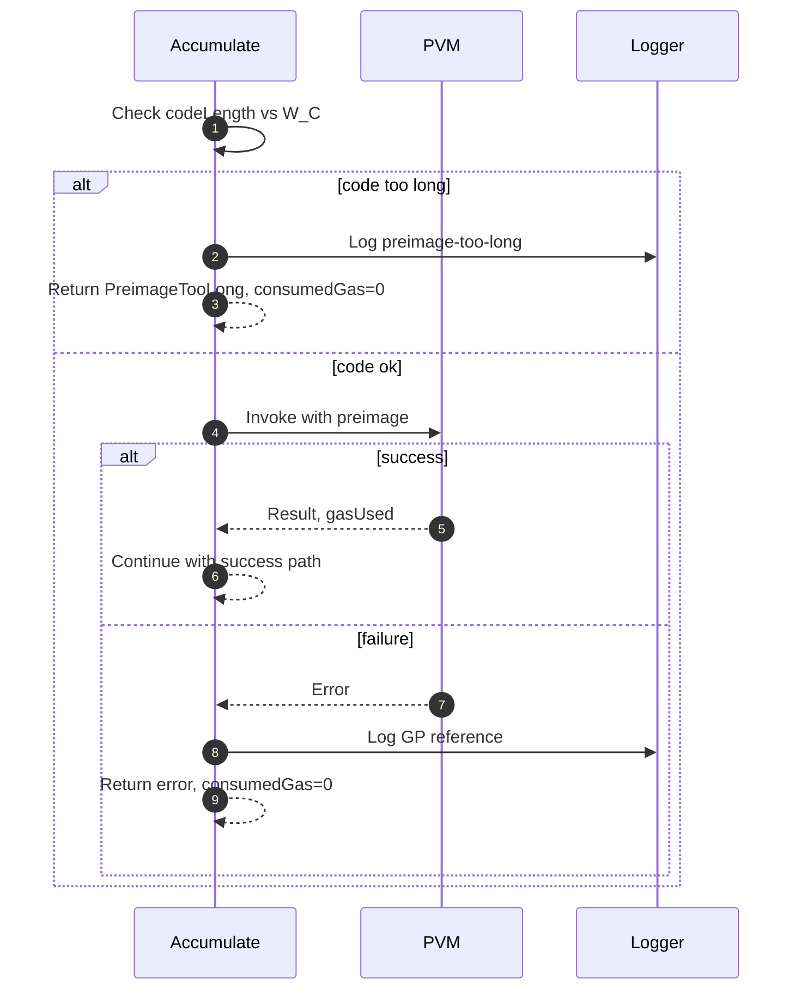
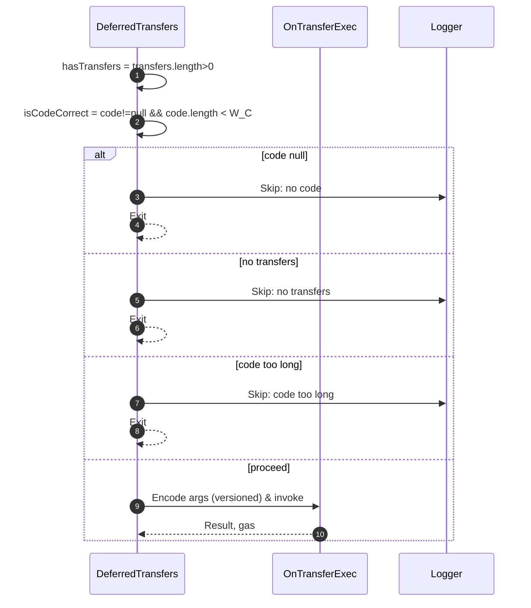

# Fix statistics

## Pull Request by @mateuszsikora

At the beginning I thought that there is something wrong with state serialisation (our state tool couldn't decode statistics) so I started from checking it and bumped a few links to the reader. Then I realised that there is a problem with gas counting in case of invocation error. Also I notice that we don't have one condition (`code.length > W_C`) so I added it and improved logging a bit.


## Comment by @coderabbitai[bot]

<!-- This is an auto-generated comment: summarize by coderabbit.ai -->
<!-- This is an auto-generated comment: skip review by coderabbit.ai -->

> [!IMPORTANT]
> ## Review skipped
> 
> Auto incremental reviews are disabled on this repository.
> 
> Please check the settings in the CodeRabbit UI or the `.coderabbit.yaml` file in this repository. To trigger a single review, invoke the `@coderabbitai review` command.
> 
> You can disable this status message by setting the `reviews.review_status` to `false` in the CodeRabbit configuration file.

<!-- end of auto-generated comment: skip review by coderabbit.ai -->
<!-- walkthrough_start -->

<details>
<summary>📝 Walkthrough</summary>

<!-- This is an auto-generated comment: release notes by coderabbit.ai -->

## Summary by CodeRabbit

- New Features
  - None
- Bug Fixes
  - Enforced maximum preimage size during accumulation and deferred transfers; oversized code is skipped with clear, specific logs.
  - Improved failure handling for single-service invocations with more accurate gas accounting and guidance in logs.
- Refactor
  - Simplified service account state encoding by removing version-dependent logic.
- Documentation
  - Updated comments to reference spec version 0.6.7.
- Tests
  - Re-enabled a previously ignored trace, expanding test coverage.

<!-- end of auto-generated comment: release notes by coderabbit.ai -->
## Walkthrough
This PR updates a conformance test to include a previously ignored trace, refreshes spec anchors in serialization comments to 0.6.7, unifies the ServiceAccountInfo codec by removing GP-version gating, and adds preimage-size validation plus refined skip/error handling and logging in accumulation and deferred-transfer flows.

## Changes
| Cohort / File(s) | Summary |
|---|---|
| **Conformance test inclusion**<br>`bin/test-runner/jam-conformance-067.ts` | Removed one ignore entry so the specified trace is now executed in tests. |
| **Spec comment anchors update**<br>`packages/jam/state-merkleization/serialize.ts` | Updated documentation comments to reference spec 0.6.7 anchors; no code changes. |
| **ServiceAccountInfo codec unification**<br>`packages/jam/state/service.ts` | Replaced GP-version-conditional Codec with a single unconditional codec including all fields without default-wrapping. |
| **Accumulate validations and control-flow tweaks**<br>`packages/jam/transition/accumulate/accumulate.ts`, `packages/jam/transition/accumulate/deferred-transfers.ts` | Added W_C-based preimage/code-size checks, introduced PreimageTooLong error, refined early-exit conditions and logging; on failure path in single-service invocation now returns consumedGas=0n. |

## Sequence Diagram(s)




## Estimated code review effort
🎯 3 (Moderate) | ⏱️ ~20 minutes

## Poem
> A nibble of bytes, a hop and a check,  
> I measure preimages—no longer a wreck.  
> The codec stands single, the anchors align,  
> Tests wake a trace that once toed the line.  
> With whiskers of logs and carrots of gas,  
> I thump: “067—let’s pass!” 🥕🐇

</details>

<!-- walkthrough_end -->
<!-- internal state start -->


<!-- DwQgtGAEAqAWCWBnSTIEMB26CuAXA9mAOYCmGJATmriQCaQDG+Ats2bgFyQAOFk+AIwBWJBrngA3EsgEBPRvlqU0AgfFwA6NPEgQAfACgjoCEYDEZyAAUASpETZWaCrKNXsAGw+QKJAI7Y0riQZgBsAAwAjJAAFABi8AAe9rjUSOIMiACUkABmFCyQzNQk2IgAXojwANb4VLECVBgMsEWIYLlJYIip4j3wmbp6RdoYWQA0/NxkdJAATOFzAKxg4QCcYJGR0OscAMyhHAAsoQBak2i0tL6IiNIot4HI8Fg9af2DsJi0Hi9EGjBYCQcLhYHUUBh1PA0F55C8pP0iCV6G8aPZKNDfuU0vgsAJRGgysDQcDUcT8PhvExPPQMPhgkomEoUu8MshvpBsNxaMj0VIqN5fhhqsgCJAST4SJdKACACLYCh/cVfYIAdzq1WVJHktCQTH5szQPAKAg8JGYkFV6laSOQ1Iw4gwREtQKwmAhEnwDBxWBunlwzzdWEoBQoALg2vQHkQ+HQV0NRSQVSdCgwuvEuNiAAMmSQNGanaDIMMAOoAfQAwlmchzisyPPgiEQlfBmLx8FI2A7EOGgdY7Kh8NMg/QGArfA6PPI0Ld4ERyPRfBJ4CRVZRRSwytdVeg0/ZahU8GgAQBVGwAGS4sFwuG4iA4AHoH83QdgBBomMwH3EPNhcrlZHPFREAfXBZGmfEKBcB9uE8DwHwiSIjH0YxwCgMh6HwXIQUIUhyCoGhRxYLtOGNfhhFEcQEUgOQFCUKhVHULQdBQkwoDgVBUHdQkCGIGYCNmT8SK4KgdwcJwXBo+RcwYtRNG0XQwEMVDTAMNQMFAoIwAobAMHwh8hDQZgwCYDBcjqYpmhIVZQgAdg0AMOAMAAiVyDAsSAAEEAEk+Pw3lxOKSSsMYL4nWkIwbHNDtZglOc6V8SB2Ek8y+FwKgGGkB9IlspYjjWAAOOZQj2cIH3CCrKvWDQhBjLAYg5dRkF4UQ6CVIT2ByfJCji+c6kNKC0DhPEXk0nptN0/TDOM0zUsszKbPsgNe1QFpMFIUUghokgvmXcFaLpSAG3CvhEGqeBuG4JVQWocUMuBTozQAbi1O60Eyy14C8SA6R3fEIQYX8lHoF5xS2khElEPB4FxAFPO++kgT4eL+voZKV2QXxilB3S1vC2gNCMcxLHhmgCJhjAN1exkPGcH1kBCiHuDqQj+D4WDTQGJKHShCKDCgAA5XESCMABRfpilZ3NJWXVckv/FmuAAWTaxwXLc/nVO4d7qjQDaDKMh8yTANgKGqM14GxDMNLuRUYUtvNHPV5z3JJ3y8OUVnAuceQQrxjbkMgAB5DAp0gWgvUcdgfQUVh2GQVLXttzEHZRXpgVzQY10SrkeVZsVfFySgyA+iVyGz+xpgYSB+SqTNwg0UINHsrzvorGIxljkiaIbBgRXsK1cBaWZuotSl6MgBum72XcWjqKmp+b2ewQoRAXsT9u9hyCVF5ns9zweSVmBi+gOVxMOd8bpf96P0Ye0BYF3rHZhPB9ABFQJAlidvIiOLIaz3L4TKk5ZCeQYM/V+rMYg/yWP/Lu7Bl7z0tMXTk3JeRPzqLqJ0U4ARCzyLja2MJQrrXuGKaW4JTLpUpHkBsqpCZEw8qTT2FMqYShpnTa2DNsJMxZrMcEHNfjV3YLzRAgchbkDFhLXk0slwrh3CQBWFBSIq11GrVyLtNZgCMNrPuessrTSNunI2lBlyZQcveZ2rsvLu34gFRwQVfbYX9nzCMLIMiQArIoUQeRwQAGUTEDBIGA+0uBvJmVjF8GQJAyD2FbNwX4nQR4FAtEaAA4lYMAtcKaQCRKzWg2AYRgCUJ0SE1txSxiNMmIgZpJi41xOmCmRDM4aArLTW4AIrCyPwGUKckxPGMnRGaMQsx8S4DXDEsZsZ+neOKS8KEuJkBKGHFg50mZUncAAGrrmyTERetkshcGFp9UE3Tggo18BsmEgQSzWllAowkHg1RUEuuuHxfBMpKNGHkFcHhaCIAuHuI5g9WiqmedMVexoOzwBWeHe5/oa5XPuInIg5NEC+IIFQUgkwGC+GRJMNpuBgmOEgRTAF9BtYTlwP4igpi8wPx+nLLJmYsYxVFH2JlWBh5913PQIkDNyAeK8dXWZpTsk3QZPAIBuAw4vEBtgJQ7JvqJN+cgGIuYAASM5YCTAEDCTAmULjgOJbTGgSsXipJnJMXE0AmiICLhQM1GALX/JSHUPRJ5xC/EQD6AAQrIGgLqUXvHRW6rFrrMUkA9V9JAPpPG6VwNi3FhF8UzkJUal+JrSU8GcOwaltKcjAtObC3IDzlr0puMEEKEpAYzkxuaO+nJmhhVIATImVimHkwWeU6mohaadspvwbhiRmZKL4ezN8gjubiHEHzKA6K0jV3bOCsCqC850C4FmaZDAswQkYG05AWY82BOCd0h0YTzI7tBlmHRut9YGLJMYmlgTzE7sAEmExoSB7R6fIIkp9IDpMydszMpkGm4hhE5SAuhIDeWwukmuQGsB6AALyTyvrZDdzTWm1piEezKJ743nvwJMAA3nREgmrEDaponqqyhqIEmpII651VqMA2swHaygTHLXhvdZ6mN1s/UBsmEGvoIaI2TB6KGyNfHvXWzjQ6RNUpk1HVTUSjNPpJgUtzQEj6ABfLIWYDCQagKLaMJAMNCpafunDOmgngNPaE8JJGyMUao7q2mtH0DpsgYx813HrW2vtVxl1kmI1Rq9b6/10gJMYt49G2TFN5MJpyaisTeiuDnJIJc38JAbmgjuSW/0uyJiMCTeulAfULmIry7AArpbispp6GpkluIMuVay9V25cLHkNezZS3D5mKsJQ6zlmrdWivhByPpwzgt8Cqi4JUv4ZpG0gfmRgIhJdFB/Ag1BrMqIuZbsgChzD1mBv4bPU5yApGNVaq4Boe7OqaOZTuw9rz9GSjBZexoFjbHKZBb8/eSA93vs8dIOF/jFNBPSC+8J1LsXSAw9B9J+LsaHOI5xUp8rwPGtpve9bRHWmHQDa+5AabkjxCS0El4mWcj5apWUarZgljNHaJ1nokCBj0rsbWw+J+xqSi8+8wx8xTl1Htpsf5L29ifaDuIeFUR/NoNthZnGYGXBywVjyMknJ3ATILNSN2btZAVDLZaq2PRsTygZyBH3HsiuBZyxeGTdb3gQzggkM4aEDouCdJIOb0g0AKTnlxM6S4wNu1WAkMwMJnpvTW1FlBOohMoC+/96SB2OSCkUFoFwH1Cj+oenwOdFMEorAbKVti6nBYiBFlWiwLTp8kQvB6JADXL14DYQILGY6RB8WNh5ZKXACosCp+KAHoPIfk+QFFhgMKmU0aJ74GFH4LZXhLesrbWl2bQRcBDoXuP2SS1fQVCQPvof/1UHkFYNA4LJT2pLo/QBJAh8UCwMC1M4k6DOqO5PLAzeaCXCy62ieI9AvQtSb73AtRfpRK7Qwx8CJwODgLSAyB4BxhCBlABivRH6/iJTayghT7B5NgthtgFCdjxxcCeTxj0BKCpBfSzANirJYBm5j7WRd5gA972DAKe4VJ7hGgdQOhHQvDF7OhigSipKX7WA36UC7oSjYEn7b6wD0LEytxkz0zdpsK9ocIsKy48KjqYTjqcxCI8wzoK6zZy4bRG7Dq8K0AwQTpcxVDzjUAn524GDiwU7SLU6yJywKL07KyM7M4QBaIGA3rs4Gxfhc6Uw8587qY0APjFIhh0BgAREcarwi6WKMIS6eyzDezBROLNqzpeRUEoDK5KKy4a5a6FBEC66mRvDdg1RUzG6mgZxV5kA16tAe6/B5wUxT5RTxLvSxR9hQEwxlBJTOBTjdDnTcCpigb1TSxIbzE/RwSQAAA+yxb0f264+YrRRY8xKGk2xyrQRo2skqsuAgFIZo7GV4M4v2KRqqyR9qPY1eRYww+xjUiA0yniUElEsQ0sIACxGASxAAZICWRlsYWK0MAK3pWFkFPmElQvkvPilpgK/KdJMUdI2M2CmInKCL4BnDONDmRofACV4JMCSIlDmj9LGPceuFau8tTqgF3uiU6D0f4NgJKvcGcUWJEjcQ8QPkgB8XUFKt2v9OlF/GKO2JlLMO/riEkYFtIRDFDNbC9IjJQFaHcJMOoOiUQGyqSFXB3lzLinVAPmdBdDqUlJDGOBigoVPq4jKdSXwAqZaeCPCF6BpugBQEQFHAIZtjCjEBykUiQMsp1GSjkjOIwDCGOJmsyvWjjE2iQvQKqK6NMWts1LWlPkHPyDCFSLiFQt4LkLQrfM3knEZI/FUMyKPK9MfIlIgHqZ0EImMbIGABDJqbko/vQAwZif8G2owo8swl2qIX2Owv2lwuaSOqzPwnYUYdOhjGIsLOTublLJ4Z+rTj4YrJACovAGohrChAYGxNzJhNhDxLhLYouXHN7j4GgGJNLpJLRDJCoHJMxIpIYHuUJOoGWNCogGWF4WuLQGWG8KUTuXubZEcKVLkAIGBUcHMCQCBUcJBQIAVAojlEsHMLlLZJEGgLZCQHsEsHsHMAILZLZGsOEE+SpFAK+bgO+X8l+cuauHQGWBhE+UAA=== -->

<!-- internal state end -->
<!-- tips_start -->

---


<sub>Comment `@coderabbitai help` to get the list of available commands and usage tips.</sub>

<!-- tips_end -->


## Comment by @github-actions[bot]


| File | Benchmark | Error |
|------|-----------|-------|
| [codec/view_vs_collection.ts[6]](../blob/fefd3525e735291c0e85c48367b67d08589ac976//_work/typeberry-1/typeberry/typeberry/benchmarks/codec/view_vs_collection.ts) | Get 50th element from View |  Fastest result changed to (current) "Get 50th element from View[3]" from "Get first element from View[1]" (expected) ❌ |


<details>
<summary>View all</summary>

| File | Benchmark | Ops |  |
|------|-----------|-----|--|
| [bytes/hex-from.ts[0]](../blob/fefd3525e735291c0e85c48367b67d08589ac976//_work/typeberry-1/typeberry/typeberry/benchmarks/bytes/hex-from.ts) | parse hex using `Number` with NaN checking | 118032.32 ±1.22% | 83.01% slower |
| [bytes/hex-from.ts[1]](../blob/fefd3525e735291c0e85c48367b67d08589ac976//_work/typeberry-1/typeberry/typeberry/benchmarks/bytes/hex-from.ts) | parse hex from char codes | 694613.64 ±0.98% | fastest ✅ |
| [bytes/hex-from.ts[2]](../blob/fefd3525e735291c0e85c48367b67d08589ac976//_work/typeberry-1/typeberry/typeberry/benchmarks/bytes/hex-from.ts) | parse hex from string nibbles | 466617.81 ±2.41% | 32.82% slower |
| [bytes/hex-to.ts[0]](../blob/fefd3525e735291c0e85c48367b67d08589ac976//_work/typeberry-1/typeberry/typeberry/benchmarks/bytes/hex-to.ts) | number toString + padding | 277979.83 ±0.65% | fastest ✅ |
| [bytes/hex-to.ts[1]](../blob/fefd3525e735291c0e85c48367b67d08589ac976//_work/typeberry-1/typeberry/typeberry/benchmarks/bytes/hex-to.ts) | manual | 14608.34 ±0.17% | 94.74% slower |
| [codec/bigint.decode.ts[0]](../blob/fefd3525e735291c0e85c48367b67d08589ac976//_work/typeberry-1/typeberry/typeberry/benchmarks/codec/bigint.decode.ts) | decode custom | 153393830.46 ±3.11% | fastest ✅ |
| [codec/bigint.decode.ts[1]](../blob/fefd3525e735291c0e85c48367b67d08589ac976//_work/typeberry-1/typeberry/typeberry/benchmarks/codec/bigint.decode.ts) | decode bigint | 93986227.71 ±2.5% | 38.73% slower |
| [collections/map-set.ts[0]](../blob/fefd3525e735291c0e85c48367b67d08589ac976//_work/typeberry-1/typeberry/typeberry/benchmarks/collections/map-set.ts) | 2 gets + conditional set | 109120.43 ±1.34% | fastest ✅ |
| [collections/map-set.ts[1]](../blob/fefd3525e735291c0e85c48367b67d08589ac976//_work/typeberry-1/typeberry/typeberry/benchmarks/collections/map-set.ts) | 1 get 1 set | 56819.4 ±1.11% | 47.93% slower |
| [codec/bigint.compare.ts[0]](../blob/fefd3525e735291c0e85c48367b67d08589ac976//_work/typeberry-1/typeberry/typeberry/benchmarks/codec/bigint.compare.ts) | compare custom | 225322966.65 ±6.47% | 8.36% slower |
| [codec/bigint.compare.ts[1]](../blob/fefd3525e735291c0e85c48367b67d08589ac976//_work/typeberry-1/typeberry/typeberry/benchmarks/codec/bigint.compare.ts) | compare bigint | 245869620.97 ±5.39% | fastest ✅ |
| [codec/decoding.ts[0]](../blob/fefd3525e735291c0e85c48367b67d08589ac976//_work/typeberry-1/typeberry/typeberry/benchmarks/codec/decoding.ts) | manual decode | 21614277.66 ±0.62% | 86.15% slower |
| [codec/decoding.ts[1]](../blob/fefd3525e735291c0e85c48367b67d08589ac976//_work/typeberry-1/typeberry/typeberry/benchmarks/codec/decoding.ts) | int32array decode | 156037161.73 ±3.57% | fastest ✅ |
| [codec/decoding.ts[2]](../blob/fefd3525e735291c0e85c48367b67d08589ac976//_work/typeberry-1/typeberry/typeberry/benchmarks/codec/decoding.ts) | dataview decode | 143045962.08 ±5% | 8.33% slower |
| [math/count-bits-u64.ts[0]](../blob/fefd3525e735291c0e85c48367b67d08589ac976//_work/typeberry-1/typeberry/typeberry/benchmarks/math/count-bits-u64.ts) | standard method | 7468818.87 ±2.23% | 91.02% slower |
| [math/count-bits-u64.ts[1]](../blob/fefd3525e735291c0e85c48367b67d08589ac976//_work/typeberry-1/typeberry/typeberry/benchmarks/math/count-bits-u64.ts) | magic | 83214114.57 ±2.09% | fastest ✅ |
| [math/mul_overflow.ts[0]](../blob/fefd3525e735291c0e85c48367b67d08589ac976//_work/typeberry-1/typeberry/typeberry/benchmarks/math/mul_overflow.ts) | multiply and bring back to u32 | 240591734.4 ±6.69% | fastest ✅ |
| [math/mul_overflow.ts[1]](../blob/fefd3525e735291c0e85c48367b67d08589ac976//_work/typeberry-1/typeberry/typeberry/benchmarks/math/mul_overflow.ts) | multiply and take modulus | 230825953.02 ±6.75% | 4.06% slower |
| [hash/index.ts[0]](../blob/fefd3525e735291c0e85c48367b67d08589ac976//_work/typeberry-1/typeberry/typeberry/benchmarks/hash/index.ts) | hash with numeric representation | 167.39 ±1.71% | 35.52% slower |
| [hash/index.ts[1]](../blob/fefd3525e735291c0e85c48367b67d08589ac976//_work/typeberry-1/typeberry/typeberry/benchmarks/hash/index.ts) | hash with string representation | 111.53 ±0.68% | 57.04% slower |
| [hash/index.ts[2]](../blob/fefd3525e735291c0e85c48367b67d08589ac976//_work/typeberry-1/typeberry/typeberry/benchmarks/hash/index.ts) | hash with symbol representation | 171.94 ±0.22% | 33.77% slower |
| [hash/index.ts[3]](../blob/fefd3525e735291c0e85c48367b67d08589ac976//_work/typeberry-1/typeberry/typeberry/benchmarks/hash/index.ts) | hash with uint8 representation | 154.3 ±0.67% | 40.56% slower |
| [hash/index.ts[4]](../blob/fefd3525e735291c0e85c48367b67d08589ac976//_work/typeberry-1/typeberry/typeberry/benchmarks/hash/index.ts) | hash with packed representation | 259.61 ±0.19% | fastest ✅ |
| [hash/index.ts[5]](../blob/fefd3525e735291c0e85c48367b67d08589ac976//_work/typeberry-1/typeberry/typeberry/benchmarks/hash/index.ts) | hash with bigint representation | 181.69 ±0.83% | 30.01% slower |
| [hash/index.ts[6]](../blob/fefd3525e735291c0e85c48367b67d08589ac976//_work/typeberry-1/typeberry/typeberry/benchmarks/hash/index.ts) | hash with uint32 representation | 197.34 ±0.62% | 23.99% slower |
| [codec/encoding.ts[0]](../blob/fefd3525e735291c0e85c48367b67d08589ac976//_work/typeberry-1/typeberry/typeberry/benchmarks/codec/encoding.ts) | manual encode | 2903481.56 ±0.51% | 17.1% slower |
| [codec/encoding.ts[1]](../blob/fefd3525e735291c0e85c48367b67d08589ac976//_work/typeberry-1/typeberry/typeberry/benchmarks/codec/encoding.ts) | int32array encode | 3461556.55 ±1.63% | 1.17% slower |
| [codec/encoding.ts[2]](../blob/fefd3525e735291c0e85c48367b67d08589ac976//_work/typeberry-1/typeberry/typeberry/benchmarks/codec/encoding.ts) | dataview encode | 3502561.56 ±0.58% | fastest ✅ |
| [math/add_one_overflow.ts[0]](../blob/fefd3525e735291c0e85c48367b67d08589ac976//_work/typeberry-1/typeberry/typeberry/benchmarks/math/add_one_overflow.ts) | add and take modulus | 236533779.91 ±5.19% | fastest ✅ |
| [math/add_one_overflow.ts[1]](../blob/fefd3525e735291c0e85c48367b67d08589ac976//_work/typeberry-1/typeberry/typeberry/benchmarks/math/add_one_overflow.ts) | condition before calculation | 235200642.11 ±6.35% | 0.56% slower |
| [math/count-bits-u32.ts[0]](../blob/fefd3525e735291c0e85c48367b67d08589ac976//_work/typeberry-1/typeberry/typeberry/benchmarks/math/count-bits-u32.ts) | standard method | 74070022.75 ±1.71% | 66.11% slower |
| [math/count-bits-u32.ts[1]](../blob/fefd3525e735291c0e85c48367b67d08589ac976//_work/typeberry-1/typeberry/typeberry/benchmarks/math/count-bits-u32.ts) | magic | 218550920.3 ±6.46% | fastest ✅ |
| [math/switch.ts[0]](../blob/fefd3525e735291c0e85c48367b67d08589ac976//_work/typeberry-1/typeberry/typeberry/benchmarks/math/switch.ts) | switch | 220026830.68 ±6.45% | 4.29% slower |
| [math/switch.ts[1]](../blob/fefd3525e735291c0e85c48367b67d08589ac976//_work/typeberry-1/typeberry/typeberry/benchmarks/math/switch.ts) | if | 229888803.56 ±6.07% | fastest ✅ |
| [logger/index.ts[0]](../blob/fefd3525e735291c0e85c48367b67d08589ac976//_work/typeberry-1/typeberry/typeberry/benchmarks/logger/index.ts) | console.log with string concat | 8388985.82 ±38.95% | fastest ✅ |
| [logger/index.ts[1]](../blob/fefd3525e735291c0e85c48367b67d08589ac976//_work/typeberry-1/typeberry/typeberry/benchmarks/logger/index.ts) | console.log with args | 903446.55 ±88.04% | 89.23% slower |
| [codec/view_vs_collection.ts[0]](../blob/fefd3525e735291c0e85c48367b67d08589ac976//_work/typeberry-1/typeberry/typeberry/benchmarks/codec/view_vs_collection.ts) | Get first element from Decoded | 20287.25 ±1.35% | 35.18% slower |
| [codec/view_vs_collection.ts[1]](../blob/fefd3525e735291c0e85c48367b67d08589ac976//_work/typeberry-1/typeberry/typeberry/benchmarks/codec/view_vs_collection.ts) | Get first element from View | 23291.2 ±114.24% | 25.58% slower |
| [codec/view_vs_collection.ts[2]](../blob/fefd3525e735291c0e85c48367b67d08589ac976//_work/typeberry-1/typeberry/typeberry/benchmarks/codec/view_vs_collection.ts) | Get 50th element from Decoded | 21573.52 ±3.01% | 31.07% slower |
| [codec/view_vs_collection.ts[3]](../blob/fefd3525e735291c0e85c48367b67d08589ac976//_work/typeberry-1/typeberry/typeberry/benchmarks/codec/view_vs_collection.ts) | Get 50th element from View | 31297.69 ±2.53% | fastest ✅ |
| [codec/view_vs_collection.ts[4]](../blob/fefd3525e735291c0e85c48367b67d08589ac976//_work/typeberry-1/typeberry/typeberry/benchmarks/codec/view_vs_collection.ts) | Get last element from Decoded | 19773.74 ±2.08% | 36.82% slower |
| [codec/view_vs_collection.ts[5]](../blob/fefd3525e735291c0e85c48367b67d08589ac976//_work/typeberry-1/typeberry/typeberry/benchmarks/codec/view_vs_collection.ts) | Get last element from View | 18602.71 ±1.31% | 40.56% slower |
| [codec/view_vs_object.ts[0]](../blob/fefd3525e735291c0e85c48367b67d08589ac976//_work/typeberry-1/typeberry/typeberry/benchmarks/codec/view_vs_object.ts) | Get the first field from Decoded | 330187.87 ±1.61% | 17.16% slower |
| [codec/view_vs_object.ts[1]](../blob/fefd3525e735291c0e85c48367b67d08589ac976//_work/typeberry-1/typeberry/typeberry/benchmarks/codec/view_vs_object.ts) | Get the first field from View | 81310.62 ±1.67% | 79.6% slower |
| [codec/view_vs_object.ts[2]](../blob/fefd3525e735291c0e85c48367b67d08589ac976//_work/typeberry-1/typeberry/typeberry/benchmarks/codec/view_vs_object.ts) | Get the first field as view from View | 83122.62 ±0.7% | 79.15% slower |
| [codec/view_vs_object.ts[3]](../blob/fefd3525e735291c0e85c48367b67d08589ac976//_work/typeberry-1/typeberry/typeberry/benchmarks/codec/view_vs_object.ts) | Get two fields from Decoded | 310620.98 ±2.3% | 22.07% slower |
| [codec/view_vs_object.ts[4]](../blob/fefd3525e735291c0e85c48367b67d08589ac976//_work/typeberry-1/typeberry/typeberry/benchmarks/codec/view_vs_object.ts) | Get two fields from View | 65414.96 ±0.84% | 83.59% slower |
| [codec/view_vs_object.ts[5]](../blob/fefd3525e735291c0e85c48367b67d08589ac976//_work/typeberry-1/typeberry/typeberry/benchmarks/codec/view_vs_object.ts) | Get two fields from materialized from View | 132483.09 ±2.5% | 66.76% slower |
| [codec/view_vs_object.ts[6]](../blob/fefd3525e735291c0e85c48367b67d08589ac976//_work/typeberry-1/typeberry/typeberry/benchmarks/codec/view_vs_object.ts) | Get two fields as views from View | 73469.57 ±2.54% | 81.57% slower |
| [codec/view_vs_object.ts[7]](../blob/fefd3525e735291c0e85c48367b67d08589ac976//_work/typeberry-1/typeberry/typeberry/benchmarks/codec/view_vs_object.ts) | Get only third field from Decoded | 398607.34 ±2.23% | fastest ✅ |
| [codec/view_vs_object.ts[8]](../blob/fefd3525e735291c0e85c48367b67d08589ac976//_work/typeberry-1/typeberry/typeberry/benchmarks/codec/view_vs_object.ts) | Get only third field from View | 97961.62 ±1.92% | 75.42% slower |
| [codec/view_vs_object.ts[9]](../blob/fefd3525e735291c0e85c48367b67d08589ac976//_work/typeberry-1/typeberry/typeberry/benchmarks/codec/view_vs_object.ts) | Get only third field as view from View | 89098.03 ±1.95% | 77.65% slower |
| [bytes/compare.ts[0]](../blob/fefd3525e735291c0e85c48367b67d08589ac976//_work/typeberry-1/typeberry/typeberry/benchmarks/bytes/compare.ts) | Comparing Uint32 bytes | 17063.6 ±3.04% | fastest ✅ |
| [bytes/compare.ts[1]](../blob/fefd3525e735291c0e85c48367b67d08589ac976//_work/typeberry-1/typeberry/typeberry/benchmarks/bytes/compare.ts) | Comparing raw bytes | 16584.73 ±3.45% | 2.81% slower |
| [hash/blake2b.ts[0]](../blob/fefd3525e735291c0e85c48367b67d08589ac976//_work/typeberry-1/typeberry/typeberry/benchmarks/hash/blake2b.ts) | hasher with simple allocator | 0.04 ±2.98% | 4.76% slower |
| [hash/blake2b.ts[1]](../blob/fefd3525e735291c0e85c48367b67d08589ac976//_work/typeberry-1/typeberry/typeberry/benchmarks/hash/blake2b.ts) | hasher with page allocator | 0.042 ±4.37% | fastest ✅ |
| [collections/map_vs_sorted.ts[0]](../blob/fefd3525e735291c0e85c48367b67d08589ac976//_work/typeberry-1/typeberry/typeberry/benchmarks/collections/map_vs_sorted.ts) | Map | 281926.86 ±1.32% | fastest ✅ |
| [collections/map_vs_sorted.ts[1]](../blob/fefd3525e735291c0e85c48367b67d08589ac976//_work/typeberry-1/typeberry/typeberry/benchmarks/collections/map_vs_sorted.ts) | Map-array | 90685.97 ±1.2% | 67.83% slower |
| [collections/map_vs_sorted.ts[2]](../blob/fefd3525e735291c0e85c48367b67d08589ac976//_work/typeberry-1/typeberry/typeberry/benchmarks/collections/map_vs_sorted.ts) | Array | 60112.43 ±1.35% | 78.68% slower |
| [collections/map_vs_sorted.ts[3]](../blob/fefd3525e735291c0e85c48367b67d08589ac976//_work/typeberry-1/typeberry/typeberry/benchmarks/collections/map_vs_sorted.ts) | SortedArray | 192333.35 ±0.42% | 31.78% slower |
| [crypto/ed25519.ts[0]](../blob/fefd3525e735291c0e85c48367b67d08589ac976//_work/typeberry-1/typeberry/typeberry/benchmarks/crypto/ed25519.ts) | native crypto | 4.7 ±18.81% | 83.34% slower |
| [crypto/ed25519.ts[1]](../blob/fefd3525e735291c0e85c48367b67d08589ac976//_work/typeberry-1/typeberry/typeberry/benchmarks/crypto/ed25519.ts) | wasm lib | 9.88 ±2.99% | 64.98% slower |
| [crypto/ed25519.ts[2]](../blob/fefd3525e735291c0e85c48367b67d08589ac976//_work/typeberry-1/typeberry/typeberry/benchmarks/crypto/ed25519.ts) | wasm lib batch | 28.21 ±1.61% | fastest ✅ |
</details>


### Benchmarks summary: 63/63 OK ✅

<!-- thollander/actions-comment-pull-request "benchmarks" -->


## Comment by @coderabbitai[bot]

_⚠️ Potential issue_

**W_C boundary mismatch vs deferred-transfers — unify inclusive/exclusive check.**

Here “too long” is length > W_C (allowing exactly W_C). In deferred-transfers it’s length < W_C (disallowing exactly W_C). Pick one rule (spec usually treats limits as inclusive) and apply everywhere.

Suggested change in deferred-transfers (make limit inclusive):
```diff
-      const isCodeCorrect = code !== null && code.length < W_C;
+      const isCodeCorrect = code !== null && code.length <= W_C;
```
Or, if exclusive is desired, switch this file to `>= W_C` and keep deferred as `< W_C`.


> Committable suggestion skipped: line range outside the PR's diff.

<details>
<summary>🤖 Prompt for AI Agents</summary>

```
In packages/jam/transition/accumulate/accumulate.ts around lines 142-146, the
length check uses > W_C (allowing exactly W_C) but deferred-transfers uses < W_C
(disallowing exactly W_C); make the checks consistent by treating the limit as
inclusive per spec: update the deferred-transfers comparison to allow length ===
W_C (i.e., change its strict `< W_C` check to a non-strict comparison that
permits W_C), and add a short comment noting the boundary is inclusive so future
changes remain consistent.
```

</details>

<!-- fingerprinting:phantom:poseidon:chinchilla -->

<!-- This is an auto-generated reply by CodeRabbit -->


## Comment by @coderabbitai[bot]

_🛠️ Refactor suggestion_

**Make W_C boundary consistent with accumulate path.**

Current check disallows code length === W_C. Accumulate allows it. Recommend inclusive check and shared helper to avoid drift.

```diff
-      const isCodeCorrect = code !== null && code.length < W_C;
+      const isCodeCorrect = code !== null && code.length <= W_C;
```

Optionally extract to a shared util:
```ts
export const isCodeWithinLimit = (len: number) => len <= W_C;
```

<details>
<summary>🤖 Prompt for AI Agents</summary>

```
In packages/jam/transition/accumulate/deferred-transfers.ts around lines 106-115
the code currently treats code length < W_C as valid while the accumulate path
allows length === W_C; update the boundary to be inclusive (use <= W_C) and
replace the inline check with a shared helper to avoid future drift (e.g., add a
util isCodeWithinLimit(len) that returns len <= W_C, import and use it here and
in the accumulate path), and update the three trace branches to use the
helper-based boolean so messages remain accurate.
```

</details>

<!-- fingerprinting:phantom:poseidon:chinchilla -->

<!-- This is an auto-generated reply by CodeRabbit -->


## Comment by @mateuszsikora

fixed


## Comment by @mateuszsikora

fixed


## Comment by @coderabbitai[bot]

<details>
<summary>🧩 Analysis chain</summary>

@mateuszsikora Thank you for the fix! Let me verify that both files now use consistent W_C boundary conditions.

---

🏁 Script executed:
```
#!/bin/bash
# Check the W_C boundary condition in both files to verify the fix
echo "=== Checking accumulate.ts W_C condition ==="
rg -n "code\.length.*W_C" packages/jam/transition/accumulate/accumulate.ts

echo -e "\n=== Checking deferred-transfers.ts W_C condition ==="
rg -n "code\.length.*W_C" packages/jam/transition/accumulate/deferred-transfers.ts
```

Length of output: 200

---


</details>

Perfect! ✅ The fix looks good. Both files now consistently treat the W_C limit as inclusive:

- **accumulate.ts**: `code.length > W_C` (allows exactly W_C bytes)
- **deferred-transfers.ts**: `code.length <= W_C` (allows exactly W_C bytes)

The boundary condition is now unified across both files, which eliminates the potential inconsistency. Thank you for addressing this issue promptly!

<!-- This is an auto-generated reply by CodeRabbit -->


## Comment by @coderabbitai[bot]

<details>
<summary>🧩 Analysis chain</summary>

🏁 Script executed:
```
#!/bin/bash
# Check the current boundary condition in deferred-transfers.ts
echo "=== Current boundary check in deferred-transfers.ts ==="
rg -n -A2 -B2 "isCodeCorrect.*W_C" packages/jam/transition/accumulate/deferred-transfers.ts

# Check the boundary condition in accumulate.ts for comparison
echo "=== Current boundary check in accumulate.ts ==="
rg -n -A2 -B2 "code\.length.*W_C" packages/jam/transition/accumulate/accumulate.ts

# Look for any shared utility functions that might have been created
echo "=== Looking for shared helper functions ==="
rg -n "isCodeWithinLimit" --type=ts
```

Length of output: 561

---


</details>

@mateuszsikora Perfect! I can confirm the fix has been applied correctly. 

The boundary condition in `deferred-transfers.ts` has been updated from `code.length < W_C` to `code.length <= W_C` (line 107), which now matches the logic in `accumulate.ts` that rejects when `code.length > W_C`. Both paths are now consistent in allowing code up to and including the `W_C` limit.

The core issue is resolved. While the optional shared helper function wasn't implemented, the boundary consistency between both code paths has been fixed, which was the main concern. ✅

<!-- This is an auto-generated reply by CodeRabbit -->
