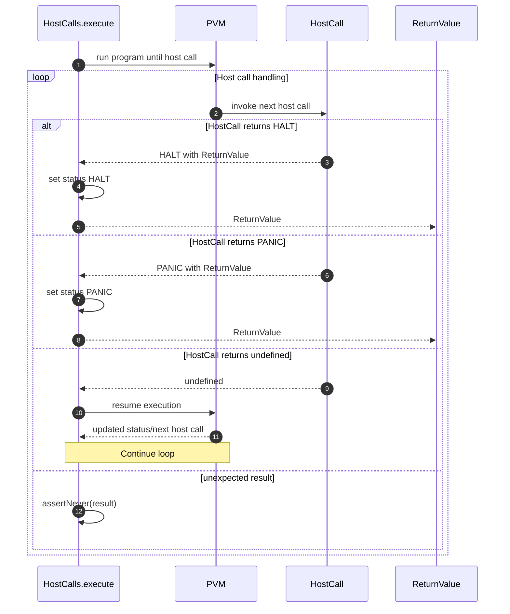

# Handle host call panic and improve HC logging.

## Pull Request by @tomusdrw

Fixes case *059.json from jam conformance.

## Comment by @coderabbitai[bot]

<!-- This is an auto-generated comment: summarize by coderabbit.ai -->
<!-- This is an auto-generated comment: skip review by coderabbit.ai -->

> [!IMPORTANT]
> ## Review skipped
> 
> Auto incremental reviews are disabled on this repository.
> 
> Please check the settings in the CodeRabbit UI or the `.coderabbit.yaml` file in this repository. To trigger a single review, invoke the `@coderabbitai review` command.
> 
> You can disable this status message by setting the `reviews.review_status` to `false` in the CodeRabbit configuration file.

<!-- end of auto-generated comment: skip review by coderabbit.ai -->
<!-- walkthrough_start -->

📝 Walkthrough

<!-- This is an auto-generated comment: release notes by coderabbit.ai -->

## Summary by CodeRabbit

- Bug Fixes
  - Improved VM behavior on host-call outcomes: PANIC is now surfaced as a distinct status, and pending results resume execution to avoid stalls.

- Chores
  - Expanded and refined trace logging across host calls: added contextual PANIC/OK/HUH/NONE messages, moved some logs to post-write, and removed noisy pre-write logs for clearer diagnostics.

- Tests
  - Updated ignored traces list to reduce noise and reflect current expectations.

<!-- end of auto-generated comment: release notes by coderabbit.ai -->
## Walkthrough
Updates add structured trace logging across JAM host calls, adjust a test ignore list, and modify the HostCalls executor to handle PANIC results and to resume execution when a host call returns undefined. No public API signatures change.

## Changes
| Cohort / File(s) | Summary |
|---|---|
| **Test runner ignore list** `bin/test-runner/jam-conformance-070.ts` | Reordered ignore entries; added note for 1757092821/00000156.json; removed 1756548741/00000059.json. |
| **Core VM host-calls executor** `packages/core/pvm-host-calls/host-calls.ts` | Added handling for PvmExecution.Panic (set PANIC, return). If result is undefined, rerun program and continue loop. Added `assertNever` to exhaust results. |
| **JAM accumulate host calls — logging** `packages/jam/jam-host-calls/accumulate/*` (assign.ts, bless.ts, designate.ts, eject.ts, forget.ts, new.ts, provide.ts, query.ts, solicit.ts, transfer.ts, upgrade.ts, yield.ts) | Added/reshaped trace logs for PANIC/HUH/OK paths and contextual parameters; no control-flow changes. |
| **JAM refine host calls — logging** `packages/jam/jam-host-calls/refine/*` (export.ts, historical-lookup.ts, invoke.ts, machine.ts) | Added trace logs on memory read/write/code load error paths before returning Panic; no logic changes. |
| **JAM host calls — misc logging** `packages/jam/jam-host-calls/{fetch.ts,info.ts,lookup.ts,read.ts,write.ts}` | Moved/added trace logs around memory store/read errors and post-store states; no behavioral changes. |
| **Transition accumulate logging** `packages/jam/transition/accumulate/accumulate.ts` | Added status-finished trace logs, including special-case for OOG/PANIC; behavior unchanged. |

## Sequence Diagram(s)

## Estimated code review effort
🎯 3 (Moderate) | ⏱️ ~25 minutes

## Poem
> I thump my paws—logs bloom and grow,  
> PANICs traced where bytes won’t flow.  
> The VM loops, resumes its run,  
> Undefined? We’re not yet done.  
> With tidy notes and quieter noise,  
> I nose the code—contented joys. 🐇✨

<!-- walkthrough_end -->
<!-- internal state start -->

<!-- DwQgtGAEAqAWCWBnSTIEMB26CuAXA9mAOYCmGJATmriQCaQDG+Ats2bgFyQAOFk+AIwBWJBrngA3EsgEBPRvlqU0AgfFwA6NPEgQAfACgjoCEYDEZyAAUASpETZWaCrI5Ho6gDYkuACUy03pCw+Ii4jGienjyY8AzoGPTwzLz4UsGh4QyR0dyx8Z74RETwGEQakJAGAHKOApRcAGwADABMlQYAqjYAMlywuLjciBwA9KMluLDYAhpMzKMAYp7YAGarsj0qiKO4stwk9RQuo9zYUaMt7VWdiA2QBMzYiLQUAO4dAMr42BQMJJABFQMAxYFxcLQwLAAt4oZkwNkomA8hg4h1oM5SOEgZhQVxmNosFVPrhqM8uPgDkSDDYSBJ4CQ3pQRpACTRngAvRDwADW+CoHS29U8LIAFBh8OQAJQdADCFBI1Do6E4kFabQArGBmgBOMAARn10H1zQ4+oA7BwAMz6gBaRgAItIGBR4NxxJK3It4AAPaQRO6QABUzQ1Oo0QkQksgqwoLEgQjQzAUGFW/IJIJIGiM+mM4CgZHo+FWOAIxDIyho9HmbAwqt4/GEonEUhk8iYSioqnUWh0uZMUDgqFQmFLhFI5CoVYUrHYXCoHwcThcgPbimU3c02l0YEMedMBjUGF20lwYAo2Awk9GieYCMlaYoGf+2vNzQ0uBGBgARL+DBZIAAQQASXLSclXoJcCRXYtGGhMppBzGBYABeAiAlBV6FwKh/mQTwkHCUpAVKE8wnPS9r1ve9U3TXESFfd9P0gN40GQbBuFoCC3EqKBANoJR6AtDU3x1VoAA5Wn1UZmhkmT9Q1RoIyjLACAeFCHkpfgSymVD0P5AFnCoeQ3nUWA1IBGt2DgzBSCw/BIG/CUaEgABtO4+QAXXsAgqFIexKHpf4UBoyBaHgdZKDIf5v0gUUSAisRJBITx5AVQpsnEMo1NQdgV1jeN1GQXg6XgH4itCdRSowKVsx4yBaWYNJlSExoNQAFjE802qk2TZLDJTo3y5MdJQPSFXQY40HkcV7MKBC+DQjC6Bqgw6rgAEFTCLTzNGpb6FyhlkAVAkiMvUEbLoABuHbyHCeLVmbFBkDQewCSiSAFX5TtSiIHgVmeyBbo+uhsES6MiMW/SsJw6RswMKBqns86EOQVSzgEfD4kAqxgOQflIBIH1uH5aclAYTxnGoKrEDh8xLEAzwaCnamNJ2smKeZyU8ZLQniYoad8fRzGCbrSrEPhyBEfICpEfsRayU27beZJ5VBZmYX2DF5AmXGxqwtWBlaDhgBRMJkgghQlGB+lGQJ9YSa4ABZOh4EcH8/3hg88gYHk0FIHYmAVU4JDvEIyMREVRjDs8I5pz83F/b9/3p0CJ0rZUoOceRYOR/2kL4gT0EQO5+eqOlKFZka8HgEUUBSEm4agYCsF8TJZRyGnCdEPAAUKSluN0SBm+wxRQeVeDAh+mN8asEPjb9Bhq8lDQrHyLg7nCMIyVR+yrEA6pgNlBJ6AVXBfhU9TA824nEin2kz4oDAADVImwLNVsH4e41oMf6An/CsqPmBg4RmkAAC8EDICXiUAbcgtB5zSEcACLui8PRYDkB9CiU8RqpCIFQZMftCQABpgaxmkGZLeZ9EAkICCmTKb8dp924LVQeBdlSsRLrgMuUgKCik2ucXAMpVKE2hM8FsyU1w8PQO9Ymxd4AYw2ogxmNMP5QCsJtAKypCYESnv/KeQDZ7MHnt3NBGh/CgNFGdeCtkVoSwAPI8JyICEg0J6T8n6JkCIURkDZBUq6YoFcXp7wPkfShzxrrQPiqUZU/DlERGeACEaT9HasyYKLDADCUHVzKCQqcKE+BTFHKkf4LssqqRGuQH04Ro5eM8NdfAOk+A/FwPMf0zgATFSkHWZUGCOGUC4eXCgjch7135pEayCEuBoH4uw4u/TuEV3KepZIfNwj4S2pESURBuRW1BKIHktNk5AUZpWFmSyATs0pmg7mBMiYqyLHwIWaJNbiHFgjJG1j/SqW5OhBW/pYLK35nQU46tnmi1eSogwptxBsmVB2RRNsPj3QdpAZ2YU3aJxzF7NAPs/bSBvEmAlod4Sx1GDixeTwKY0DJXI9CH4vyYoAiBMC6dIKOGgtnEsuc3lAX4gDFEaJCi/TeChLAbBGorgVNMmM2gRRcCFaQIZ2EcUkFFN+QCnxPjAQAOLVFFDKYAaj96H2/DKeoj5FEP1RFlQxxjUFVRXvkbMUBaTcAprhHa3IyjeBIWnV08QOGLVrGsoozFTJ0MJmef1ZkhWo2hIREEKxdn6WbkoH0x8Yy+joJ8eAHISCATwLAAAim/N+A8oB2KwA4BguEWQKsoB+GGooAAGGqtW6tFAAEgAN6BxIKmwmABfEhPaDZ+loDmvNBapglpIG/QdBqK0AGlm0yj4SQN1OLsHqU6aVZ4kA/WCqKCtOqlbICdAwLwSQNcSC2U+AFOIPhID1qVU21tmqdV6p7X2gdPph2QFHVmidub82FtnfOxdkBfCdF8Ku2KCpN0MG3R0hUbj93qo/bq4BAi/AwdNSwitWBm4SEiPACdD7/jAXgc+ooirG0qpbW2z9Xbe0psSEOkd3ax3ZpA9O4tpaSALsgIaqDMG4PrsQ8hngqG93IAw+26o2HGZcAAOq+Dsd+a6TlEnqViZvUkzljqEmQGpuxJCRU3sYaGxAIQ3jIGg74FaLqSCNVbDtRUFB8IVyFWpag0nSjTiYx279bG03/sA+OydoGZ0CaEyZKYzT0BKdwCQtJUZ8KcUyr9WNrNSjk2wFbUoZwmK0Oaa0yFdNjlMyplzSu6lLmcwwDcwFAtHmgviC8w6SFZbcp3rc1ZwKnlYxxnLX5D9YZGGhebac8LrYMiRfbfmTsXYYo9hAMARhva+39kSolcJw4dzJTWxw5wlSjAUcXelCc/xMtThWKcGd2VZ22r1/OMzqyShoFU88cQzLKqQ1lIiAAhbwl2snOSAZQOMFBTj5BiFML8dVAKrCZjKmu2DZr4GlaONAeBCDkpO1S5BdYVzqBc/K0N34gc9GNpqljGY8UUHC92kjGXqD8iEyJ4JJqCNARRxXVYsqMc0ex4W/kIGKDIHFfyVwNHfpU5p3TntDPFXM9Z2R9nTPOO44IIBY7lKlTGxJ4dTnRqQnfmdfVDd7r2HeQCJs8gDwYb8CwOxTLiiQFMXi2ZPI+CSBMxA/QWN5bIBnurbWin8vqe08+PTzAjPmc65CK6PNku1ekcyxz7XeO9cUtOzQI32ETeQbsUumKEmbdFRk2VBy0fNXJa4KX/DEtXU28gkXsoYBJQpTl8gIBV76TeD8m7pUBNjj8m1uGtJX2o2/dZNIRAeLEeDwvQPm9d6KNPotxoCoImHMW9UUPDA6vyMUECv26j2/d9QFMwf5zrnlQjQ815vgh6CihoAQCc1+kdql8BMCUEEhHkEgDdKebveQCpW2afSNH7UEUPJdOXQ5JlE5RrPrEaBrGrJrJWO5IFB5HgdrEWcQCFbrD5C6PrFrQbAgn5DAP5SFKbWFD7K2GTW2ZFJbVFFbZgd2JOT2DbAwLbJfXbKiaOBEQ7AnA3alJQagpUK7Lgo5ZlP1C2TOGCLlT5RAN7QuF6AVd/X6f7VCC+AEaXFwc8RUfacfR5agMyUUB0WnT9QCaAY2fVYTM3Q+KUa6afOMaIVYQoD4KxC6egddK1ZAW1BeJeDAR1VEBgJzK3B/LCHdavfdHzQpcIK9bpWIgEVYc4aIE/TXRAB0agF6NAfnPgMmRQH6S3ZudzMw+HMyQo1HEfGgF+NnHyXI/I3Ja3FVNIg9e7NEMJPCUNb3JLCVCyT7SNbAcZHzPLJNKTA2SXcIXAN4eybInyQg10f0Kwmw3VOwhwlyCQZoEhCQfUEhHfDQDySDBzGUWhY6JqTo/ATwegb8awhTLYhvUTXwGKIVco/Q+wUGWtao9AIoqBDiJURojXZovI0kNoxDR/dSN/O3KhOXMNKYJLaAqpMY6ICYxNAraY+AWYh4BYyAJY/GA6NYx42w+w0UHYvYgkw4yAY404pw+Ai4xIYGGInaW4+40kzY+wl4pvRA+xRxd6eoVxUqPgIzUoONAERfNga6BVKeNgYuJfCaD3bCUGcbegWhXHIgYNZUAY33cQcZTLNAEhAQPANkgQEuEjBRfgPAcrWKbnWUUYBzUYUvJk+gQw2QUYQkvgeo9I7wpUqBEET5I2IwSrBmara5OrC5UQDmTA5rHA1rfAjGMFIgrrCWKWEgSbM2Bgy2BFebO2R8VUHofAN4WQngzbHFbbfFW8PbYQ0lMQ/PEgUYEgEQMQGQxlFOFlB7NlZcTlCZPOCWNhLCfE3QhEyhFzdgZAIiY2FszQcHHwQ/Cokad04w6VKHfGHEQMkhHLb8Y2AAKWNllGgFFAtMfSo0g3tJim/3GlPnPinmCJMQdVXgiN50XMvkwCcgJhnP8k8BLA3MAN7wcj3IPKPJPMo1oBIV3TKllHXH8Bs0g1v2cQtWBitTKIlnWkDF62ChHh/iCllKyh2WQQSi91MkS0iADyyncNuJjD9PxhvMfgJNfmkGuiFLQDcVFJc2M09STAMgIpjDjAIXeydxVQqzkJQNjMjNCmjKuRZgBXjNVjayTI63BVTPeT7K+XsgoNoBBUUskvJmkq5hNizItlm2YIWwLK4CLJLMxTLL4IrIEOrKEJJVEP1wbNGEfCxDbJuw7IUOnCUN7NewHMEpehHLwt+jHODWCkqOhz+NgkWH5A8rnK4BFTIHnwlVkFpGmVpE9w0CQGNjMK3KKABhHIGMWDsRsG1WNiPOhBsy3LICICmHPONSPivMtVvJtTnhCNMSfLiBlnsgaXyWcWFPxl6yQPpjEojPOV0pjIjNkoGzwKG0IK1hIMd0ABQCQGUglGVmTS7SjWcFeQKQ8bOgoymbdcObFgxbVUNFV2Tg6y9bcs3FHbBypMfbGOZyvPInUYcgN4TypOW7TsxQp7ZQtStQgwM9d04GVcqooiEaaoY2FTDIA7KIGhIS3C0NVACUJFZgdQE6usQkKeeFWC2AVLdcHoOqqYX1ViGhKIYsuiGhZkvBKmRAEkfkPFEhIQMRRCn/Oi61X6bqhgXqtS1JT7Dw6i4s/gdiq1BilYEga6KYYcZ6LAQQC0lQdHPYEWeCf4YNUaqrU5WrSajAmanmOS+aggzrHlHrVQra42na5M9QeQA26mQymFYy060y/MlFK61bbgu62yh6qswlRyxGyOesj61IekJQH6uQu7cCXywG/y1QowAuIqmGMAbwKQdEtGr45cqVUw6KvIJE2CdRNIMjLMOcioFTUVVKmXDK2gLKgRHKxAPK6K1AFUkgEhEaWbDGgC2wOxJ+YCaw48zfKjCChUc2UgD8fAEkV0MoaAC8EECCfVC4uY53NO5KTm68/3Nq3mjqh85ePmgW/qiuFiti8WuhEWrwsW3rWWndOHfOsyMUrAkaKUtuwEU0pWgKFW/CNW4cFIOMKQegDBFzbGqTL6hEz/bWsM3Wx++ydAqS1A7Aua0+has2kG1SzC4Ra2hah2gyzM52k6pgkqc68y9g9FG6tbbFP2nYJ64lIOnYEOs7AARzfhcEjr+p8sex7JewToMCToSGCjCAvGDUwIROjCXJcxlwhtzsFgsMitnRYbLsgE+AOCQwNgjlkHM0rvdI0EKGmWHnwFFGOJlG5oVrH2h3bsvlOq7pyxfXo3+BbSLU6GNhsAAE0WNqrYBmdvAygphTdrAmq4MWrkKt7rAd77U96nVJYNq/JVJuapaGFhrhaqKL63h6kMAe9Qqnp0BBLRH1I1zzCpgIHxqzkYH6s4HxLZr7kkHTblLxZ6CXaCHEV3a2DLLSyfb+DHqA7nray3rCczt0s4gex45ZC2H7sAbOGc5uHByksQrM6orpGC6SxvhMYew5zp4+BwadH6BBca5fhYZFHlHwo4gch1HmJNHxGWHNm9HktJysBRw8nzHhirYrHCrFG7EehD5gIjzu13H/1u0vH6qPHGqQkoEvVstaMG0RzAnua7zQnQjwierIngahaSckmaKmlGlBrWKRTr7lTtoRo9EsoH62JAy/DCnwzim2YynDb+tKm1YdKUGSDRsaDxskWMG5qbalKUz/QiJm12n/aFhA7XrvEjt3q+nbiBnNBPxm0nbps4VXbCGzKPaODWmKHKyqHOmaGhXg6XKPrlUmsHolUGUvKgJo7WVvjxmVCyDE6+VpmV7ZmxG0qVypH8mzJYIRpZ7MBEADWNBVm2AEs7JgZA56BJDMpMCaFGpLwUsXcPX9XKBtVKaM1pd16Ol8geQyjkJhiUXPC/TLjN76LWcGEH6AzuVaBUmq7JUTDTH8YO7TqzZ3pjGQmjFOrHz8hzNw1ICPgfMgHBhlQr1q2SnqAyWoG0DSm9L4GKncCqn6WanUHInpYM3xp2l1qmW/lWWNLMGCDsGsDoaEBkB9ZVgZXsyTKFWmnLrlXbrVX7KNWXqRDhX6HqV2IGaI6hn2yTX/rY6LXgb1Dk6VUESiJOhuAn3S7Oq9DeKHXq6TC67GYG6m71yADYAKh1pAZbZP8ALOgrBtUbBAIB6CbWIiaD0E2cgabMwgXD5k2gnH4YWm3d6wj97jlohD6+Bj6RSWTOLfCEJqNNC4c62GPjtJcXdy3UpK37mM0n6Zg7gmGrJH2qArY76M0Mmi3WJk2h34H9aqWZKjbEG6XdquXZ3ZZtqFqDrdngbD36ncyiGlXSGVXeC+X1WBWumnK72dWztZAGQ7jWHvLRmP2OUuGrXAqNCsBxSVShG0E/2vjnHgJjYegHQEatWq2XWkqzm0rtGsdaArntna4YnK38W8OHmcz1rO2XnvwIuouHRHCucmqYo/MQry5ogoW82ebG27U4W6OLaLpkWR5s2xbtO0RsZgIVPxK1Ox3ynNPaWFKdOlq0yon1KV3DqEH7kOXFqIVTP8HzPFW2DPayHvbL2On7PNXb3I4HoWkEOX3jX5CvOOGfOJm/P79ridpiowAwgf8Ryki5dbIdoju9l6AC2v94of83hXQstWYtH7ExVznZANAnuFRFh+K0cVgFQSFnntkkt7SUaAQW1FhKrZRfAWM03EhfH7SAm/uN6UKyhhlkdUdqAaAUggen6fIX7pkNCeB4QofEk7Xihpj/cvu4n0fm1MfoBsfcfShaBfGe0fuAB+Ceqen6Wes6BeqUQdODZKrAD8rQvH8oJCBxZQQUlxLF2iji8UritgIuEuvi+MMgDW4FNKfADKZUUKrTeyPrkzkM0S8lvWkpqM4b6lzSqdib4gqb8gXB2Vxgtb095bKzi9mzuy3bmsxzyOUoNMDzt99h7sq7y1lGJCBqO7kaYCaoUqhEwJgHyqMpeycG0UGx3QltXP0qljUCi/UX7tKKdcNLmiRXqUV01kbP9SRIvqvj/41HcDlcIvmgCoYCEsLR1nmH+MDL6hArgCoJJq2KCvt9avuxWvoekX0j2UVdDvht+8sJ2jiJsPH4hfAq5Hp/EEZv5uNMfvxZdSYf9H5fhjZtVf9fs/U8zfhkntJvgSa//ANvmqBm34ACloglFLrh8CJZG8eKpvIaFZg55ZQvogSZkiNEZ7KhUePmaMHkwG4TUPeU1fSlgQnYJlkGM7ZaujwlA0tcCi3IzuNF6y2I6mq3M6utzPYR9yGUfShoIQc60NRgfcHkOxCT7ncY6l3Z7Ndwz48MbWwVdnpFRwS30ZGsEIsvgF4HMJEqpzFKu6RrpQdNAuVKGqjAvAv11Ac/HLD0DsSl50Og9d/mBRHr9oCQpAQmlv3I7Qt2q1HA/vC35pACwBotD4LQm0RmwsoWhTFifSLbsd3urEGAbDw7Zvcp44VdgNgIpawMveGnCgUQOqa6dGW6DdduyywbqccGUKY6nKwaZ5lWCzA66tZ3upqsOB+3UlDnX4Gmsuy5rNPl+386P4cI+iIklUTvoK1g2+RZxFPGH40BAuXxGurF1qQh4wa4PSRnD12Zn9kANgY2NhzMHn5h6H0NAG8CXQkBZAW/XnKMLSrMRAe6RWVJMIAozC5hdfRYQuFWHrCGS9pXnBXRSojQc6PPTJhkiRqHDZhZXE4eBSWErC1hkGaoHYlhrkcpCACX6BKGMLZVD8Nw25utQwBgAnhWRRipk16FkAph9UV4fMI/65Jlh5wyDMAFBCXgeQRcJ3HL18od4iAegW/nwGH6oVbu/9CIQgO0jqQfuEaOsHXDYBhQlQPeWohXBzpTxRQkFfdEcLK6GMv+LORipLwIDS8Z6c9W3rQH1QLpLcWvKgO9HcHJMM0sTH7kdAN6u4SWHHVJuk1oxTxmO+MHKFUkLBW8PMwIWyDEPd6Ut4htWQgfJUTJ+8VKiLNIbN12ZxkMhyQrWCtzyGh9Ch4fYoZH1KFXs9uN7SoVEnIBNl4y1Q99kIKBoBUthEje4Xk0irzxVkPrEDjQiCpo85ckeOjJX2bTGwAAGlYDKpHke0dwLUtEPFEkjZe89KsLKK35E8kKDg7ek4Ja4RM2uCECStzWVCMj8YTURUaAMSbgDnEsgSUJ0VQFB4igVo6BjaOmoJCfePXTlpN3eSO4ZoiQygjpWoEWRVCdA3ISH0YFh8SGgY1gcGJj6CsDuOwBULAkbK7sfIRzTwKnXwAKC+Bp3X6p50EGp9hB6ffsoRmCB4cRcYUQBPsPGhERfABEcXIiHkGKCMxJiBnjmImLIBu204erqT15oRMkOoDHzKh1QC+BgInwaAGVUPiAQegAAfSMEmCrAb/BYSL04w/Mt+dND7Fmw8GsdDeQQ2ZKEPjAoDBKHxF3sgTd5zi4hC4u0aN0nbLiluzorsf7FZg7iPRC3Ygbpx9GHi3a/ok8V7SxRsCyh1DMMYdhvHRJRgpQCQAoKzDvio6sY78fGO4ZNwviyYtobIJLDEYTJcE1BC/W7Y/tUav0XPk/FLwOFlcOKBAOQF/QE9F+66aZGamJ6tVKOjg5rl1XyD1JzSH9K0oaL4DcpMmjPSqJKHGL6iyeEsV8gCAf7xcYqjk4/M5LnIkJ3JtrX9j5m8m+S48oIaJMFLsGigH+EUlsQ1yo6xSW2ERBKcrWSm68T6aUkcPxEyk0EM68AjXmg0tpZdJa6o0+sqL9L1BxxyA9SFONpEa8QyAk4dhJS3byTxJ43W2v71UoGcqC8sFliNSD5Ht5WjTNSZtxKG+1tJ17bpsK30mRiCQDU6WGZJGZfi6hP4hobwwkHVT7WuTeyUiSASbMp4uCfBPlwCyl9weFQJRqIEOZqMNGKVeFEWUypKJNBjdbQYSJfojQMiIIULkjwlKsgAp0SfLqKBVL1jloGaXKPsHwABZESNRByBeWChhQMo65SKRR0a778Oxz5RFoxzlxogEmLElUVfR2ixM5OkAp+txUORTSyCrMXafN32mOjDph0ZSfl1UkXUAxGkmyrZ3KG6ThWD/GMSn1+lWSbuvKQuDMwmmRUUx7QvFupBUy7ChhEcEPBCMgDAF5AEMkCTXDrRFcVMNgT5g4S36XluZrYprs23CbPlwRldRkT7N+gz9I8cmQOcHNr4+Q8U5whdCFPNz2COpMUqOYfxjlQBHYpQfGI+DZBA9uUXAcUv0gBgYxMA+I1DpyIKTd9Q0brXTFjMR72RCZYMMaXXG9iaApua7M+qi264HThswEZigNJY4yz1Iz9E3lbFgEZS0E2U7ZLOJHae8RJBAsSUkOnYpDh5J07cWdPdFqVgyOQvBr6KPG3Tz2Z4h6SGN2DAhuQaCEVr02pT3tTJRrD8cnwu6WT46lsiornjflZhuAIcIBeIX7SlSMoVUduviWwngtX0v7WOMxEihZNC44pU3ncKxkaBqqJIbeI4T/JggFyJYXopk2MHapT69pZGiOVQD1oAG4c/OToUvgoQfYxMALFwEAA4BG5A35eQP5maVEDZh1Lhoe0eCqhG5AMzPAPIg6a2P0mFx7JWFjMusBoEAC4BIfgp4VwCWTCyUhIuQCiggETiIWb0WkBShqFzuWheC2oxcL3hvC5zhDlKBIAUI9AAYiIp0XiLt4Ui5RZbiHA3NsKY8Z6CNNXnjSSgWUb3KRRQL40RxHgtorNMYqz8uZQ1IZMPNdFyTT6R8p0RNk2ljVBJm8vAeO13kOjFJq4udhmQvnB8tZJ7NSS0wvZ7gBwIsIsCWB1zjhf5M4YNPOGWHmz5AGCeFF2DUBbg+wu4AwLUprDqAyJZGRAGRNMp0AyJW8fmDuBqX5h0AbUNqAwH4gagwwYkfUB1B1BoAdQOoZoA9AehvgrQqwVqJJFaCNBzQAgK0AIFkgAhcwgyhZcMtwCjLaA4yyZbQDImFg5lQAA=== -->

<!-- internal state end -->
<!-- tips_start -->

---

Comment `@coderabbitai help` to get the list of available commands and usage tips.

<!-- tips_end -->
