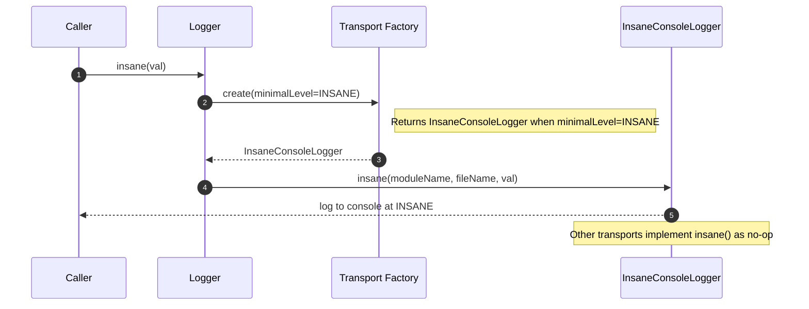
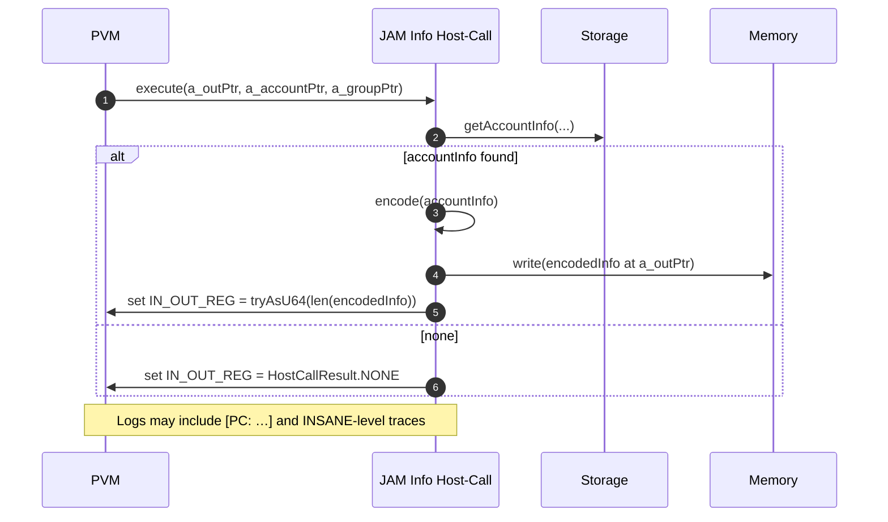

# `INFO` host call to 0.6.7+

## Pull Request by @tomusdrw

- [x] Added `INSANE` logging target to print out PVM low-level info.
- [x] Remove filname from logger output (the module name and some partial string is just enough for this and the log is way more compact).


## Comment by @coderabbitai[bot]

<!-- This is an auto-generated comment: summarize by coderabbit.ai -->
<!-- This is an auto-generated comment: skip review by coderabbit.ai -->

> [!IMPORTANT]
> ## Review skipped
> 
> Auto incremental reviews are disabled on this repository.
> 
> Please check the settings in the CodeRabbit UI or the `.coderabbit.yaml` file in this repository. To trigger a single review, invoke the `@coderabbitai review` command.
> 
> You can disable this status message by setting the `reviews.review_status` to `false` in the CodeRabbit configuration file.

<!-- end of auto-generated comment: skip review by coderabbit.ai -->
<!-- walkthrough_start -->

<details>
<summary>📝 Walkthrough</summary>

<!-- This is an auto-generated comment: release notes by coderabbit.ai -->

## Summary by CodeRabbit

- New Features
  - Added an ultra-verbose INSANE logging level for deeper diagnostics.
  - Enhanced runtime visibility: logs now include program counter context, per-instruction traces, and memory read/write details.

- Changes
  - Info host call now returns the byte length of the encoded account info on success (instead of an OK code), while NONE remains unchanged.

- Chores
  - Ignored additional trace artifacts in version control.
  - Updated internal test cases and ignore configurations to align with the new logging and host-call behavior.

<!-- end of auto-generated comment: release notes by coderabbit.ai -->
## Walkthrough
Adds a new INSANE log level across the logger, routes it via a dedicated console transport, and instruments PVM interpreter, memory, and host calls with INSANE-level logs (including PC context). Updates JAM info host-call to return encoded length (u64) in IN_OUT_REG. Minor ignore and test-runner list tweaks.

## Changes
| Cohort / File(s) | Summary |
| --- | --- |
| **VCS Ignore Rules**<br>`.gitignore` | Add “*.trace” to ignored logs. |
| **Test Runner Ignore List**<br>`bin/test-runner/jam-conformance-070.ts` | Adjust ignored traces list; reformat concatenation; add `genesis.json`; remove inline comments. |
| **Logger Core: Level + Transport + API**<br>`packages/core/logger/options.ts`, `packages/core/logger/console.ts`, `packages/core/logger/index.ts` | Add Level.INSANE (value 1); shift other level values up by one; add ConsoleTransport.insane(..) no-op; add InsaneConsoleLogger and factory path; expose Logger.insane(val: string). |
| **PVM Interpreter Instrumentation**<br>`packages/core/pvm-interpreter/interpreter.ts`, `packages/core/pvm-interpreter/memory/memory.ts`, `packages/core/pvm-interpreter/ops/store-ops.ts` | Add INSANE logs for each instruction (with PC) and memory read/write payloads; insert a no-op boundary check in store-ops. |
| **PVM Host Calls Logging**<br>`packages/core/pvm-host-calls/host-calls.ts` | Prefix host-call logs with current PC: “[PC: …] …”. |
| **JAM Info Host-Call Behavior + Test**<br>`packages/jam/jam-host-calls/info.ts`, `packages/jam/jam-host-calls/info.test.ts` | On success, write encoded account-info length (u64) to IN_OUT_REG instead of HostCallResult.OK; update test to expect 96n. Update docs/comments and imports. |

## Sequence Diagram(s)




## Estimated code review effort
🎯 3 (Moderate) | ⏱️ ~25 minutes

## Poem
> I thump to the beat of an INSANE log,  
> Trails of PC footprints in the fog.  
> Memory whispers: bytes in, bytes out—  
> “Ninety-six!” the info call shouts.  
> Git hides traces, tests realign—  
> Carrot-scented commits, crisp and fine. 🥕

</details>

<!-- walkthrough_end -->
<!-- internal state start -->


<!-- DwQgtGAEAqAWCWBnSTIEMB26CuAXA9mAOYCmGJATmriQCaQDG+Ats2bgFyQAOFk+AIwBWJBrngA3EsgEBPRvlqU0AgfFwA6NPEgQAfACgjoCEYDEZyAAUASpETZWaCrKPR1AGxJcABgEkAOQAxAHkfSFh8RFxGNA8Pe0jsD3oKElxsCixcWBJILwwiHP4AM0gcvNpqNA1ISAMAxwFKLgA2AAZWyEAUAn5uMh7IEooWSAEqDAZYSB9cWjAS+AAPMHgMEvxwtYIZ5m0McLlIbERKGYJmE9oKAHdwgAoGNOo6SAAmdreAVjB2gE4wABGQHQQFvDgAZkBHDerQAWgBKWr1AAi0ie8G44nwGC4AEFaLRkJgZoEAMp4gIAUXCHnwRCIayI5WcpBiO14234eGsADUALL5fA3MBeKQJNYbWpwPK2Ri5BgAaw8SBia1o8AYL2QFVJAQp1Np9MZhRZFDZ6EJ6ngOJQyCYzG4XhotQAqjYADJcWC4XDcRAcAD0gcZOWwAg0DsDQQ82BKJVkHpUiEDuFk/WaFBcge4yQ8gY6rSM+mM4CgZHo+DKaDwhFI5CoNHoDrYGE4PD4ghEYkk0jG8iYSioqnUWh0JZMUDgqFQJJrBGIZGUTYUrHYXCoN3sjj2Ln7CiHKjUmm0ujAhlLpgMGlD8CIGHwaQ4BgARG+DBZIHi/IuGy96A4Th7lW8qYKQiBGHikDkFud4PmkkAUMkeQvgAVBouBUAwJAvpANxoMShKvNgGBDuUuSQB69LIKcPa2ms5F5De1r3o+JAADSxCcTLlFheSLF4Or4GMeRwWx9BHAA4qOkABMJ+AVHwUxgX2OwkEsqo8dw1A0FkiAaEY5iWHiHi6dQNoYEJjGQEoDAeM45k4sgIHqdwj4ro+PDhiqDCQOw1rSMWsk4nk9wPn5SxuRQTY5t5mp+W26jyLZ9mNhZyDMIo8CLHQSJGFS0TwHsK6DnkaQSPAJBbiQ8buVwVE3K+74GBAYBGGoGCptIuBgEhGANoGQhoMwYBMOsj57JMJC/AA7O0GEBk1L4fsZP71suryAbu8ggcphSBS1kCutwVQrrqQ0jWNGwUJN2GzfNuDIGJCFXXemSORgtRkv0DDZZqcQeLIz51FANgkJlUj0JhaDYSmgIzV8c1/G8AAcbyAoG7RY1jgJfK0GhCIgtrDKMuoENwookOKKCsWk9DOFQsgGSDkBgxDrzQ7Dgbw4jnQQq0AAsGPYzjKPzYTxMjMw1nk5T1MM2g8iYKk01oER9DqJAFVoOg+QvHwkY4lquD3AA2hoFsALoImMdJKszuhfurkDrYgSAE0T2TCc0NPwa82vWWg3D9KRrwCHbioO6D4P4JD9hU8oEoYCq5BCkQYBsIgiBoKQiEkPZJUsK2j1DFL1nPXk4f4Pbh0ytB6R+fGohqsgrvuxLWDNA6fYV7QADc1lpHsaw8b3vEw32zh5Lw0iUHHNzqNMOKA7raTXcVpQRMKkA83NrT80LmMi4CYse/RT2TLGSi0LUcmgftVl9eIbAKG2IwJCUdJbp5lAjHwsDKxTkQAyhlPwmTMtiSy5RhK6hSg5SBzkyiuXcq8TyuZw7xX8uIA6UA77IOinQWKGDfJYPkG7e81BMh5D2uBEBBVn7/gPGVKmlVqq1WilwfkdB4COCWsWK82klQ52kIGJgaRAx0gZJQURTl8BeAWs+N8y0wFrSXI2TaO5nA7TKDQnBkA/Bv0UNgWGusYL6P1JSKkad8gJwSNpHIXAADCsivDQAmIgKKmgngkBeNBbeaQMh6VMVVfRllMAkGcZZORJAqJSL4DcXIWBmAjz2B4D0ti7SUVsRockljOJkBUEAtOJpmQgTWNncgct86QEztnWhh0CREmCVuAxFSIkuJicaM4dkCLIDCjiMA+Cmw23UjQUiPFIlE1ce4zxnEipOnBv5U05TwnQK8ogaY6TxQ5IsdSdApEalB24DxTmJAJH0kDJKGBMDcjwD4GkDxzdew2PFPpBphJiReWISgMJ5B7gAH1Mq0GQgEYa3h7CYSZJxf5AkSCgrYFwaIFAoWQH+RIOIiLIWFBtmwHIig1mTOiW4zAHj3LoE+Q+MA+BuA2RqjWUy+ToiFKQAgU0OsWz0TbJQEoE8hieRWanSRJT0BPCiDqGZ7k3lQGOqdPs6lNKmmhpZTxVk4EIRJAKvIuLIj0HuARUxhBqU2x2NncQiAEzWQEARUSXKKA8uwsDR2xLsKEumSSzxXBNUAqBSCsFmLkWFGhbC+F4KkUorRRiiFAaiA2wALx6D8VS7gBgWaxNdSQYlyq6o/Lad6oxXgQ3+vDcGv1Ubw3oo8EW7FkB42JupSmx2BiNjpszaSjhObwl5uBQW0tYbA2opLQist/aI2VuHTGmtCbKX1qgCEKQVB4icTVk0hwwcyXXV1tff6K5NVVLsdQaYCT4BeA7LPCgFVTTysKqaZoACKqeQ3QpXIfAxT50QAPcKuirK/08gA0iRTPJiLyEKnin9t7NFkDiVI+A8Cj1+dNV9CRanCKsrqMxQrKAgKMl+Uyy50prNgaIVKH1EERU8agvg6CfIJXENgiCh0uF4vpurXwXrAX5rhb2rFRAg3Hs40OvtPHUUVqrTGrYWAelZxmC2iV0VxMzEEYqFDMjxEYYoDIqJ8jHo+EOo4+yUnl10F8K08J6bYmkAoOEUZFZkA+Bk+69y8mfCKeU0B85cSNNTJIAtHTBh6FFUYaVPOFUQk1Wuu2LhGpeFKP4W1AwLnwIqbOWpy5oclgKL4So38G0AKaOAjov94FIL1y3FR+K2r8VepE+Om2+FCLXwIxRcz3T9P6RgAgDK6QdW0q8EQbUjX3avWAUqttmgvU5Hdj6ntbBOITf0oOjiWs4gInyRgZlpoQNspiCSXJezEO1D8C3Hg9lsL0zpIUN2SgIoKuZIhmpXXFDEgObOfqClGEL2KDrWg1dVzF1vsJL9ayr3iFNBVpp9xTmcUkXM8anF8JZHyVmR8NtANOUwsYggFB33WV0fwZO8hrOkR1BRMrvk8RWD8PsqGFERueJ+bpe108D2ZJOK8Ddf7aBFLQyE/bhkVo4YgfhnYhGelpScpvIZFGvnUawZVejUBGPdcM7QVj8H7jVcEwieTknbPNcsz8hTMMlOJbcyl9U6kfP5UKsVV4QXyqsMbuFzh3DovNVakYBLIjTddPU9ShBGWYtZfWuo3LQFtH3yK+8hrOszGk4So4e7zBMzmINFY/Vuov7dRedUhiWz85w8Xkt2MeRAScS1NxNl8RrvXtu7YqyGzsoxGwDSo4IVID3GgDYPEjirGAkAEmEbxOIehCJJd4feIScUCKESAEI+8C04gAdTxDYAIkABZ96+JxKkNgbAhDsF8PvrQkTtZnIY4FJiY8hIrfAeg9lmgfzQc4N2bKDloCbmIYneQMCOEoOVo5PEQIAZs8PA2s74n0zgSgSI6I1sEhAcp5EhhQsAGI5sbJsoSgsN+dwE8NxdhcKI1USMJdIoUFKxKM4oSFEo6MgoqRv9pY2Ak8zhlcuBdsrEPtpgK1sAS8DcfAhl49pY88PAnNPcUxvcPM/d0pLcoBqCE86Dk92DqFCsjMYAu8e9S5RhAQ1k3guCeCyAE9+DBCjdXM2J3MLNAwxCnIJDIApDaDwZZC4gOCI9FDh9R8SZpZNCdgIQtCiDopeCslxR9ChETcjCUszDLILCrDE9bDi8HCVdzFp8XCZ81kBZPC6cdC+DbF/DjcvcgifdTCsRxDtNDpwiZCzg5DoiuAl8V9VDpYkidgvhkiyVUjfD84MjDDVMciQj9ICjJCaCIiSi7D5CVIYjt9d87B4i6idgugGJuCvCYhGi9CuChCktjDpEOjLc/NrdAtFBmEQs2EndIBIseFmA+EWoBEDDAjxFuAJARpIhohRoAYUwbieotR4hOjFpA9VpssQ9tww9N4v0gpGlkArBHFRocQaAlh2RhJHjYgq9NtmQjhtgRhz8eIdZuAGBYlX4mU2xaVkU454jLjmBWlcBMBsIbx0ggT7gbZlZT1FgNJTQ0gxRMB2Q+IAAJKIXARxIA54kAvCQvFAoE1+MEzQSAb6UQP6LkoGBtWdLAEiIcMDLce4EIEfFbaxLuFgPsF8U2IErgC2DQS2SARUySXCcpGgNWTeF8A0l8KOSAAAIRqjYh+QkHwEVBRUkREm7mQA1K1MgB1L1IMUdOdMKCNMshNMrDKBfD9KdKZEtMlK/BKF0gilEFgxxCh3pDdLVI9M1McW1KtlZmkGSFwFwgSQGEUlEmQHCgeXzM4k8k9KzO9JzLJCJIyEQHuB1IRCDOiB8VDMgBfDBgcFMlwmrIbMoWbNbMtPqCnAokB2XiVnfxiFdOQ3AgHjGkwjkSGC/ipzzkCSwDkOQCHn2GOEmAUJvj5zAVwzFygVwMqCI3gXwxchmKlzj1lz0TvkBzUnvNoCIRlwoOSmvPPLeXWIYULiu3t1C3YQixdyOJixOLi0WLc3xNWFtRnl0lS10iQsw0ekUXfCDzUUYS2i0V+IUPlydiaSfiKjyEEFOHPRUGPSSn3ARKMV+jZUoh90dSgD8EdDJRAj1yqO7IAAE0wMxf5ZBliKBcJqAZZqVN5dRYUrTHFnhIFN4dYpsEMMk1Mc0iSpouAxpohikzhY1mK4kNAYJ7h5l3INBcUahYU1sZtuz8SXw8oWYoJ0NUymUaBi4c0b8v9RkGySBuAuA1MNAvUfBMyuAAASAAbzmw0FRIAF89SIrCSkJoDTYGBMg0g2xEqMcLJLYYqfAEQB4MN6Y4yGDzQf8sTbIsoX8JI7SEJdRr8NQ0x5RRBI5a5chTgHDiR1UrRxApANzvs/EYggVsoBxQT341zt4f4kd/5AEmQB4Kh5B6Lz88hL8txXT7FpgN0fEpgEzUqd1gykrIEMDTzBccCbkrzRcCC7zyMSDpdMEKC5cgo5JyArdALbctjgsHcwts0DjXdlpoKPczisiLiriELUKAlpE6DHxhLIaXAA8sKPjg9cK8tw8/io9dySJn5gNjQ4MkUyrGyLI1kYadp+g/yDI2Kz9jE+xlKUAOLopkAN1rTZAaBEBrS6QBANy9cl0DlvF+slKOM91dKKAtK0dBaa0DKLMjKqoTLabNALKNArKwVOIXx8SOA6D7KyaDLOtMo9wbhkUaAeBFY6Q1YL4IU2Iggy4K9bsfdAq1cfB+QqR+RTYIrl0HlEA4rIBgAoAIrGbmbWbBANAq4BBzaWB7g5BmaERcq8ooBYktaoa85TTtJZAjamkGJk6DEdhLbBabbc07aHanbwqmVopGlXb3ba1vambpA/aIxA7g7mB7gKzTItco7goOrCaY49xThJpxAGBEBEc/4IgZr+1UdDEP51yCJPKeLdRldrFXLFk2x/zsMsC/zGtzriMEFCDrr+BSDvknyiKXzCK1lyE1tAk+wrriCt7bryDaM5c6ENigLtjPqwLncotIK3dTiAigazl4LthKA0Lfd/RAxog2Ik1XjMLlEEacKVw8L8sOr/iPl9k/JHRGrp0W8YNSJ8KphmqPKrsgG0g9VCRXbOIw7pAERPUyh8HrhpBkBgB9KPgZo3gIRNCAAyJhy0ShqTAAan7GZo0AKCKGmD0FofaHocYZtnCsgBiulA61fgaoJtQCpjsMYQEB5G+z7AfAm37S8DQAvWZCJo0FwZIFro3IcAEFOAAEcOCsSf1pr/0eIoCjz/t+BTG55CkBj9oDdlyxq5SL6YNcB3SjrjIzyCDLzaULr16z6CEbrHz7rnzhJJcPy48j7KEXpCLb7Xrmx3qQLdjs0Gpjj3d4tAaUwLpBphowBHi7iXjUspRmbNAMLMsIG/woHkaCKVJ6M64anyVKKFLdENZsgKJAAcAg2RgxSDwj1uWoYCYAxp+Q2BsmqHp2EiJsAFwCWIU4LgN/eM9SRMkHZkK5DQTZ3axbMmLPB8aqSKZuT/POPstULAGwKkMkV0D0aAf5W50fHYH2P4VoJA4MzszeVk6IDk+IXs/MjQEIAAaVqBMgSHAL4F6UoHXuQIAXZCzz3IRbyGzhsrWDsmwA1EVQoiJvjq7JhkmaxKuQ3N1BlJqjWFeACUyG3P6NqFufuceeeapFH1QF1HReWuQDJG315D8B73+T8BRBZckk4iJhxwUPQFnIudKN1vUDGUa3ErSEZA7JheKr4F1ChK5NXAWR4fazRfDHMcsaRZ0pRagUzr+fZIBiBdMg0ACBCD2Q3V1Htb2S1FOBhw1GNgAPx3IlQEeV+kWF8jBbAFKNcmbg+jwn1Wb1lWPNAUCZOovLOtCbXtvKQXfIvuievtidbrfOus/PinwPXqUBoDEDoDSYC3vo+tAr2J+tfr+vycWOKYujKbZIqZAKqfwDhvAa/FUUaY0R+N2kIrgYa1Mu8JAkwlkDxEQFdEFh4v4vTBIEzGzBoMzCe3oFZxQAhNfnnXZAoj4eKHHYojIFKnpgmbQeuZmZ2B1kFjAGPAPKPteB/olsOgMXLnGi3luK5KrKwAcAmaocgISACWRQUYSD1TPYxqbWEnUegjzGVOjcYV1F8dzBiCODle2esn3aXiQUmC2NoEg/b31R1mwEFhtm2GEkCH+RCFdCeZefUp+ZAjQ54ktYBY8Btc0DBY1plQQ7wPRGRTyN6pbHYFtmrkVDWTXi8DEBKwNqoFxTOGsp4j1X+VQjo9NPHaU8pIOXg7OgoiIEZm0hJvyDWFE/iIkHmnxhmjWVM40Bmg0HmkOltLvRtHiUSRFWJdwHw9QG/yrzNeQHscGPbwo6o5o9Zfji3eY+tbzNtZdapHysTzjqQ55EKirzQ4Vf1WaGum8xPPjewMTeskLdTbI3PrQTIJowCj3oBwPpNTgmSdPrTbzczbK/bx12kBhwZwnl7ozZK+0o0sekDEgMmAQTygAorbeuApYWre+ogryfPEvHLAOUANrE+M2LXDbA3DQC3GgfkCOFKmHGPDHDPEMEnF+3UH+Rv0QH+SyboH+ULpiBLAMCO9aDfwhHaEBFaAYZIC+D+BRhmke8BGwgYBmgFmEeaAhBIBmkBGaDoAEC+FoEBGRgO9m+O9wFO6JAu/G5uCu4rAO6AA -->

<!-- internal state end -->
<!-- tips_start -->

---


<sub>Comment `@coderabbitai help` to get the list of available commands and usage tips.</sub>

<!-- tips_end -->


## Comment by @github-actions[bot]


<details>
<summary>View all</summary>

| File | Benchmark | Ops |  |
|------|-----------|-----|--|
| [collections/map-set.ts[0]](../blob/f0aa7868bc2461ed5fcd3b317f22606fbae62a9e//_work/typeberry-runner-3/typeberry/typeberry/benchmarks/collections/map-set.ts) | 2 gets + conditional set | 66720.29 ±2.01% | fastest ✅ |
| [collections/map-set.ts[1]](../blob/f0aa7868bc2461ed5fcd3b317f22606fbae62a9e//_work/typeberry-runner-3/typeberry/typeberry/benchmarks/collections/map-set.ts) | 1 get 1 set | 41335.64 ±0.3% | 38.05% slower |
| [codec/decoding.ts[0]](../blob/f0aa7868bc2461ed5fcd3b317f22606fbae62a9e//_work/typeberry-runner-3/typeberry/typeberry/benchmarks/codec/decoding.ts) | manual decode | 21275579.67 ±1.46% | 88.25% slower |
| [codec/decoding.ts[1]](../blob/f0aa7868bc2461ed5fcd3b317f22606fbae62a9e//_work/typeberry-runner-3/typeberry/typeberry/benchmarks/codec/decoding.ts) | int32array decode | 181029287.47 ±5.64% | fastest ✅ |
| [codec/decoding.ts[2]](../blob/f0aa7868bc2461ed5fcd3b317f22606fbae62a9e//_work/typeberry-runner-3/typeberry/typeberry/benchmarks/codec/decoding.ts) | dataview decode | 173147605.67 ±4.68% | 4.35% slower |
| [codec/encoding.ts[0]](../blob/f0aa7868bc2461ed5fcd3b317f22606fbae62a9e//_work/typeberry-runner-3/typeberry/typeberry/benchmarks/codec/encoding.ts) | manual encode | 3069927.42 ±1.3% | 19.18% slower |
| [codec/encoding.ts[1]](../blob/f0aa7868bc2461ed5fcd3b317f22606fbae62a9e//_work/typeberry-runner-3/typeberry/typeberry/benchmarks/codec/encoding.ts) | int32array encode | 3798608.5 ±0.92% | fastest ✅ |
| [codec/encoding.ts[2]](../blob/f0aa7868bc2461ed5fcd3b317f22606fbae62a9e//_work/typeberry-runner-3/typeberry/typeberry/benchmarks/codec/encoding.ts) | dataview encode | 3783369.7 ±0.63% | 0.4% slower |
| [codec/bigint.compare.ts[0]](../blob/f0aa7868bc2461ed5fcd3b317f22606fbae62a9e//_work/typeberry-runner-3/typeberry/typeberry/benchmarks/codec/bigint.compare.ts) | compare custom | 236816642.69 ±6.36% | 6.57% slower |
| [codec/bigint.compare.ts[1]](../blob/f0aa7868bc2461ed5fcd3b317f22606fbae62a9e//_work/typeberry-runner-3/typeberry/typeberry/benchmarks/codec/bigint.compare.ts) | compare bigint | 253465240.33 ±5.45% | fastest ✅ |
| [codec/bigint.decode.ts[0]](../blob/f0aa7868bc2461ed5fcd3b317f22606fbae62a9e//_work/typeberry-runner-3/typeberry/typeberry/benchmarks/codec/bigint.decode.ts) | decode custom | 193681744.38 ±4.95% | fastest ✅ |
| [codec/bigint.decode.ts[1]](../blob/f0aa7868bc2461ed5fcd3b317f22606fbae62a9e//_work/typeberry-runner-3/typeberry/typeberry/benchmarks/codec/bigint.decode.ts) | decode bigint | 97355016.53 ±2.54% | 49.73% slower |
| [math/count-bits-u32.ts[0]](../blob/f0aa7868bc2461ed5fcd3b317f22606fbae62a9e//_work/typeberry-runner-3/typeberry/typeberry/benchmarks/math/count-bits-u32.ts) | standard method | 84625457.93 ±1.79% | 63.08% slower |
| [math/count-bits-u32.ts[1]](../blob/f0aa7868bc2461ed5fcd3b317f22606fbae62a9e//_work/typeberry-runner-3/typeberry/typeberry/benchmarks/math/count-bits-u32.ts) | magic | 229195612.18 ±6.72% | fastest ✅ |
| [math/count-bits-u64.ts[0]](../blob/f0aa7868bc2461ed5fcd3b317f22606fbae62a9e//_work/typeberry-runner-3/typeberry/typeberry/benchmarks/math/count-bits-u64.ts) | standard method | 1365821.03 ±1.99% | 86.84% slower |
| [math/count-bits-u64.ts[1]](../blob/f0aa7868bc2461ed5fcd3b317f22606fbae62a9e//_work/typeberry-runner-3/typeberry/typeberry/benchmarks/math/count-bits-u64.ts) | magic | 10381921.39 ±1.63% | fastest ✅ |
| [math/switch.ts[0]](../blob/f0aa7868bc2461ed5fcd3b317f22606fbae62a9e//_work/typeberry-runner-3/typeberry/typeberry/benchmarks/math/switch.ts) | switch | 223361555.01 ±6.68% | fastest ✅ |
| [math/switch.ts[1]](../blob/f0aa7868bc2461ed5fcd3b317f22606fbae62a9e//_work/typeberry-runner-3/typeberry/typeberry/benchmarks/math/switch.ts) | if | 221645924.75 ±7.05% | 0.77% slower |
| [math/add_one_overflow.ts[0]](../blob/f0aa7868bc2461ed5fcd3b317f22606fbae62a9e//_work/typeberry-runner-3/typeberry/typeberry/benchmarks/math/add_one_overflow.ts) | add and take modulus | 236230914.22 ±6.82% | fastest ✅ |
| [math/add_one_overflow.ts[1]](../blob/f0aa7868bc2461ed5fcd3b317f22606fbae62a9e//_work/typeberry-runner-3/typeberry/typeberry/benchmarks/math/add_one_overflow.ts) | condition before calculation | 205177221.66 ±8.39% | 13.15% slower |
| [hash/index.ts[0]](../blob/f0aa7868bc2461ed5fcd3b317f22606fbae62a9e//_work/typeberry-runner-3/typeberry/typeberry/benchmarks/hash/index.ts) | hash with numeric representation | 157 ±1.6% | 30.97% slower |
| [hash/index.ts[1]](../blob/f0aa7868bc2461ed5fcd3b317f22606fbae62a9e//_work/typeberry-runner-3/typeberry/typeberry/benchmarks/hash/index.ts) | hash with string representation | 108.39 ±0.64% | 52.35% slower |
| [hash/index.ts[2]](../blob/f0aa7868bc2461ed5fcd3b317f22606fbae62a9e//_work/typeberry-runner-3/typeberry/typeberry/benchmarks/hash/index.ts) | hash with symbol representation | 171.92 ±0.62% | 24.41% slower |
| [hash/index.ts[3]](../blob/f0aa7868bc2461ed5fcd3b317f22606fbae62a9e//_work/typeberry-runner-3/typeberry/typeberry/benchmarks/hash/index.ts) | hash with uint8 representation | 155.43 ±0.99% | 31.66% slower |
| [hash/index.ts[4]](../blob/f0aa7868bc2461ed5fcd3b317f22606fbae62a9e//_work/typeberry-runner-3/typeberry/typeberry/benchmarks/hash/index.ts) | hash with packed representation | 227.45 ±1.17% | fastest ✅ |
| [hash/index.ts[5]](../blob/f0aa7868bc2461ed5fcd3b317f22606fbae62a9e//_work/typeberry-runner-3/typeberry/typeberry/benchmarks/hash/index.ts) | hash with bigint representation | 183.75 ±1.24% | 19.21% slower |
| [hash/index.ts[6]](../blob/f0aa7868bc2461ed5fcd3b317f22606fbae62a9e//_work/typeberry-runner-3/typeberry/typeberry/benchmarks/hash/index.ts) | hash with uint32 representation | 199.45 ±0.16% | 12.31% slower |
| [math/mul_overflow.ts[0]](../blob/f0aa7868bc2461ed5fcd3b317f22606fbae62a9e//_work/typeberry-runner-3/typeberry/typeberry/benchmarks/math/mul_overflow.ts) | multiply and bring back to u32 | 244125044.93 ±6.55% | fastest ✅ |
| [math/mul_overflow.ts[1]](../blob/f0aa7868bc2461ed5fcd3b317f22606fbae62a9e//_work/typeberry-runner-3/typeberry/typeberry/benchmarks/math/mul_overflow.ts) | multiply and take modulus | 235198936.15 ±8.62% | 3.66% slower |
| [bytes/hex-from.ts[0]](../blob/f0aa7868bc2461ed5fcd3b317f22606fbae62a9e//_work/typeberry-runner-3/typeberry/typeberry/benchmarks/bytes/hex-from.ts) | parse hex using `Number` with NaN checking | 137716.65 ±0.41% | 84.59% slower |
| [bytes/hex-from.ts[1]](../blob/f0aa7868bc2461ed5fcd3b317f22606fbae62a9e//_work/typeberry-runner-3/typeberry/typeberry/benchmarks/bytes/hex-from.ts) | parse hex from char codes | 893653.82 ±0.25% | fastest ✅ |
| [bytes/hex-from.ts[2]](../blob/f0aa7868bc2461ed5fcd3b317f22606fbae62a9e//_work/typeberry-runner-3/typeberry/typeberry/benchmarks/bytes/hex-from.ts) | parse hex from string nibbles | 558836.1 ±0.32% | 37.47% slower |
| [bytes/hex-to.ts[0]](../blob/f0aa7868bc2461ed5fcd3b317f22606fbae62a9e//_work/typeberry-runner-3/typeberry/typeberry/benchmarks/bytes/hex-to.ts) | number toString + padding | 320637.08 ±0.24% | fastest ✅ |
| [bytes/hex-to.ts[1]](../blob/f0aa7868bc2461ed5fcd3b317f22606fbae62a9e//_work/typeberry-runner-3/typeberry/typeberry/benchmarks/bytes/hex-to.ts) | manual | 16438.59 ±0.23% | 94.87% slower |
| [logger/index.ts[0]](../blob/f0aa7868bc2461ed5fcd3b317f22606fbae62a9e//_work/typeberry-runner-3/typeberry/typeberry/benchmarks/logger/index.ts) | console.log with string concat | 6743328.77 ±56.69% | fastest ✅ |
| [logger/index.ts[1]](../blob/f0aa7868bc2461ed5fcd3b317f22606fbae62a9e//_work/typeberry-runner-3/typeberry/typeberry/benchmarks/logger/index.ts) | console.log with args | 1099468.68 ±98.73% | 83.7% slower |
| [codec/view_vs_collection.ts[0]](../blob/f0aa7868bc2461ed5fcd3b317f22606fbae62a9e//_work/typeberry-runner-3/typeberry/typeberry/benchmarks/codec/view_vs_collection.ts) | Get first element from Decoded | 22228.87 ±2.19% | 55.09% slower |
| [codec/view_vs_collection.ts[1]](../blob/f0aa7868bc2461ed5fcd3b317f22606fbae62a9e//_work/typeberry-runner-3/typeberry/typeberry/benchmarks/codec/view_vs_collection.ts) | Get first element from View | 49495.25 ±0.64% | fastest ✅ |
| [codec/view_vs_collection.ts[2]](../blob/f0aa7868bc2461ed5fcd3b317f22606fbae62a9e//_work/typeberry-runner-3/typeberry/typeberry/benchmarks/codec/view_vs_collection.ts) | Get 50th element from Decoded | 20138.2 ±1.03% | 59.31% slower |
| [codec/view_vs_collection.ts[3]](../blob/f0aa7868bc2461ed5fcd3b317f22606fbae62a9e//_work/typeberry-runner-3/typeberry/typeberry/benchmarks/codec/view_vs_collection.ts) | Get 50th element from View | 28654.63 ±1.33% | 42.11% slower |
| [codec/view_vs_collection.ts[4]](../blob/f0aa7868bc2461ed5fcd3b317f22606fbae62a9e//_work/typeberry-runner-3/typeberry/typeberry/benchmarks/codec/view_vs_collection.ts) | Get last element from Decoded | 20615.45 ±0.67% | 58.35% slower |
| [codec/view_vs_collection.ts[5]](../blob/f0aa7868bc2461ed5fcd3b317f22606fbae62a9e//_work/typeberry-runner-3/typeberry/typeberry/benchmarks/codec/view_vs_collection.ts) | Get last element from View | 20351.94 ±1.82% | 58.88% slower |
| [codec/view_vs_object.ts[0]](../blob/f0aa7868bc2461ed5fcd3b317f22606fbae62a9e//_work/typeberry-runner-3/typeberry/typeberry/benchmarks/codec/view_vs_object.ts) | Get the first field from Decoded | 340111.18 ±1.12% | 16.54% slower |
| [codec/view_vs_object.ts[1]](../blob/f0aa7868bc2461ed5fcd3b317f22606fbae62a9e//_work/typeberry-runner-3/typeberry/typeberry/benchmarks/codec/view_vs_object.ts) | Get the first field from View | 81320.55 ±0.77% | 80.05% slower |
| [codec/view_vs_object.ts[2]](../blob/f0aa7868bc2461ed5fcd3b317f22606fbae62a9e//_work/typeberry-runner-3/typeberry/typeberry/benchmarks/codec/view_vs_object.ts) | Get the first field as view from View | 80316.2 ±0.76% | 80.29% slower |
| [codec/view_vs_object.ts[3]](../blob/f0aa7868bc2461ed5fcd3b317f22606fbae62a9e//_work/typeberry-runner-3/typeberry/typeberry/benchmarks/codec/view_vs_object.ts) | Get two fields from Decoded | 342973.12 ±1.92% | 15.84% slower |
| [codec/view_vs_object.ts[4]](../blob/f0aa7868bc2461ed5fcd3b317f22606fbae62a9e//_work/typeberry-runner-3/typeberry/typeberry/benchmarks/codec/view_vs_object.ts) | Get two fields from View | 79009.41 ±2.1% | 80.61% slower |
| [codec/view_vs_object.ts[5]](../blob/f0aa7868bc2461ed5fcd3b317f22606fbae62a9e//_work/typeberry-runner-3/typeberry/typeberry/benchmarks/codec/view_vs_object.ts) | Get two fields from materialized from View | 169481.29 ±0.51% | 58.41% slower |
| [codec/view_vs_object.ts[6]](../blob/f0aa7868bc2461ed5fcd3b317f22606fbae62a9e//_work/typeberry-runner-3/typeberry/typeberry/benchmarks/codec/view_vs_object.ts) | Get two fields as views from View | 75381.48 ±1.46% | 81.5% slower |
| [codec/view_vs_object.ts[7]](../blob/f0aa7868bc2461ed5fcd3b317f22606fbae62a9e//_work/typeberry-runner-3/typeberry/typeberry/benchmarks/codec/view_vs_object.ts) | Get only third field from Decoded | 407524.97 ±1.71% | fastest ✅ |
| [codec/view_vs_object.ts[8]](../blob/f0aa7868bc2461ed5fcd3b317f22606fbae62a9e//_work/typeberry-runner-3/typeberry/typeberry/benchmarks/codec/view_vs_object.ts) | Get only third field from View | 94408.33 ±1.16% | 76.83% slower |
| [codec/view_vs_object.ts[9]](../blob/f0aa7868bc2461ed5fcd3b317f22606fbae62a9e//_work/typeberry-runner-3/typeberry/typeberry/benchmarks/codec/view_vs_object.ts) | Get only third field as view from View | 92461.77 ±2.63% | 77.31% slower |
| [bytes/compare.ts[0]](../blob/f0aa7868bc2461ed5fcd3b317f22606fbae62a9e//_work/typeberry-runner-3/typeberry/typeberry/benchmarks/bytes/compare.ts) | Comparing Uint32 bytes | 15311.95 ±0.65% | 9.43% slower |
| [bytes/compare.ts[1]](../blob/f0aa7868bc2461ed5fcd3b317f22606fbae62a9e//_work/typeberry-runner-3/typeberry/typeberry/benchmarks/bytes/compare.ts) | Comparing raw bytes | 16905.71 ±0.53% | fastest ✅ |
| [hash/blake2b.ts[0]](../blob/f0aa7868bc2461ed5fcd3b317f22606fbae62a9e//_work/typeberry-runner-3/typeberry/typeberry/benchmarks/hash/blake2b.ts) | hasher with simple allocator | 0.04 ±1.03% | 20% slower |
| [hash/blake2b.ts[1]](../blob/f0aa7868bc2461ed5fcd3b317f22606fbae62a9e//_work/typeberry-runner-3/typeberry/typeberry/benchmarks/hash/blake2b.ts) | hasher with page allocator | 0.05 ±1.06% | fastest ✅ |
| [collections/map_vs_sorted.ts[0]](../blob/f0aa7868bc2461ed5fcd3b317f22606fbae62a9e//_work/typeberry-runner-3/typeberry/typeberry/benchmarks/collections/map_vs_sorted.ts) | Map | 228068.31 ±0.06% | fastest ✅ |
| [collections/map_vs_sorted.ts[1]](../blob/f0aa7868bc2461ed5fcd3b317f22606fbae62a9e//_work/typeberry-runner-3/typeberry/typeberry/benchmarks/collections/map_vs_sorted.ts) | Map-array | 103614.31 ±0.05% | 54.57% slower |
| [collections/map_vs_sorted.ts[2]](../blob/f0aa7868bc2461ed5fcd3b317f22606fbae62a9e//_work/typeberry-runner-3/typeberry/typeberry/benchmarks/collections/map_vs_sorted.ts) | Array | 66308.41 ±0.18% | 70.93% slower |
| [collections/map_vs_sorted.ts[3]](../blob/f0aa7868bc2461ed5fcd3b317f22606fbae62a9e//_work/typeberry-runner-3/typeberry/typeberry/benchmarks/collections/map_vs_sorted.ts) | SortedArray | 199659.79 ±0.16% | 12.46% slower |
| [crypto/ed25519.ts[0]](../blob/f0aa7868bc2461ed5fcd3b317f22606fbae62a9e//_work/typeberry-runner-3/typeberry/typeberry/benchmarks/crypto/ed25519.ts) | native crypto | 8.31 ±0.46% | 72.96% slower |
| [crypto/ed25519.ts[1]](../blob/f0aa7868bc2461ed5fcd3b317f22606fbae62a9e//_work/typeberry-runner-3/typeberry/typeberry/benchmarks/crypto/ed25519.ts) | wasm lib | 10.86 ±0.03% | 64.66% slower |
| [crypto/ed25519.ts[2]](../blob/f0aa7868bc2461ed5fcd3b317f22606fbae62a9e//_work/typeberry-runner-3/typeberry/typeberry/benchmarks/crypto/ed25519.ts) | wasm lib batch | 30.73 ±0.39% | fastest ✅ |
</details>


### Benchmarks summary: 63/63 OK ✅

<!-- thollander/actions-comment-pull-request "benchmarks" -->


## Comment by @coderabbitai[bot]

_🛠️ Refactor suggestion_

**Remove stray no-op boundary check**

Empty if-block with a magic constant in a hot path adds overhead and confusion.

```diff
-    if (address <= 207232 && address + bytes.length >= 207232) {
-    }
```

<!-- suggestion_start -->

<details>
<summary>📝 Committable suggestion</summary>

> ‼️ **IMPORTANT**
> Carefully review the code before committing. Ensure that it accurately replaces the highlighted code, contains no missing lines, and has no issues with indentation. Thoroughly test & benchmark the code to ensure it meets the requirements.

```suggestion

```

</details>

<!-- suggestion_end -->

<details>
<summary>🤖 Prompt for AI Agents</summary>

```
In packages/core/pvm-interpreter/ops/store-ops.ts around lines 106 to 107 there
is an empty if-block performing a stray boundary check against the magic
constant 207232; remove the entire if (address <= 207232 && address +
bytes.length >= 207232) { } block (and the magic constant reference) to
eliminate the no-op overhead and confusion in this hot path, ensure no remaining
references depend on that check, run unit tests and benchmarks to confirm
behavior and performance are unchanged.
```

</details>

<!-- fingerprinting:phantom:poseidon:chinchilla -->

<!-- This is an auto-generated comment by CodeRabbit -->
