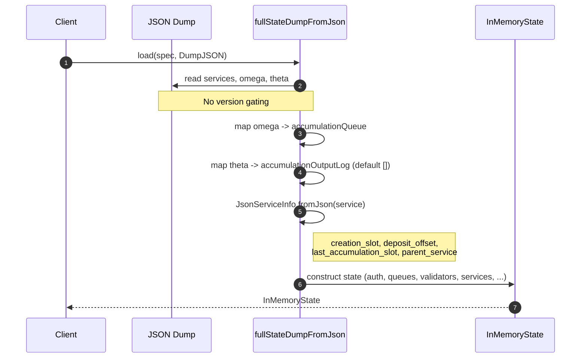
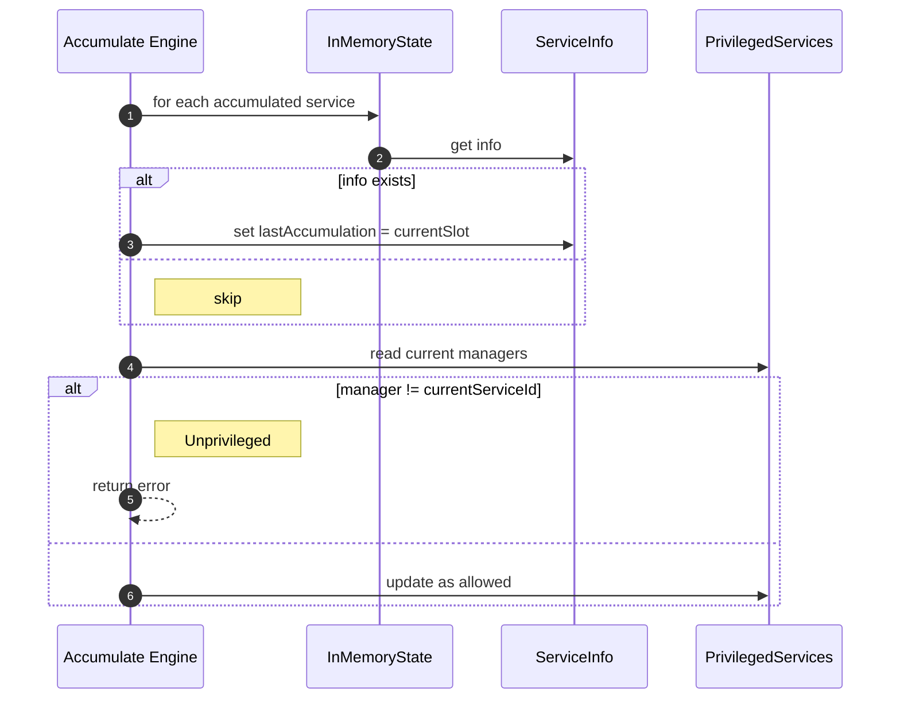

# Remove some additional pre-067 stuff

## Pull Request by @tomusdrw

Closes #536 

## Comment by @coderabbitai[bot]

<!-- This is an auto-generated comment: summarize by coderabbit.ai -->
<!-- This is an auto-generated comment: skip review by coderabbit.ai -->

> [!IMPORTANT]
> ## Review skipped
> 
> Auto incremental reviews are disabled on this repository.
> 
> Please check the settings in the CodeRabbit UI or the `.coderabbit.yaml` file in this repository. To trigger a single review, invoke the `@coderabbitai review` command.
> 
> You can disable this status message by setting the `reviews.review_status` to `false` in the CodeRabbit configuration file.

<!-- end of auto-generated comment: skip review by coderabbit.ai -->
<!-- walkthrough_start -->

📝 Walkthrough

<!-- This is an auto-generated comment: release notes by coderabbit.ai -->

## Summary by CodeRabbit

- New Features
  - Service info now includes gratisStorage, created, lastAccumulation, and parentService across JSON/state views.
- Refactor
  - Unified on the post-0.7 JSON dump format; removed legacy pre-0.6.7 handling.
  - Deterministic state keys and serialization (no version gating); accumulation output log always serialized/read.
  - lastAccumulation is always updated during accumulation.
  - BASE_STORAGE_BYTES fixed to 34.
  - Privileged service checks and auth manager encoding applied uniformly.
- Bug Fixes
  - More consistent thresholds and storage accounting across environments.
- Chores
  - Removed legacy pre-0.6.7 example dump and compatibility branches.

<!-- end of auto-generated comment: release notes by coderabbit.ai -->
## Walkthrough
The patch removes GP version gating across state JSON parsing, merkleization, state logic, transitions, and tests. It consolidates JSON parsers, deletes pre-0.6.7 paths/data, updates dump schema (omega/theta), unifies key derivations and accumulation log handling, simplifies privileged-services encoding, and makes accumulation updates unconditional.

## Changes
| Cohort / File(s) | Summary |
|---|---|
| **State JSON schema unification** `packages/jam/state-json/accounts.ts`, `packages/jam/state-json/dump.ts`, `packages/jam/state-json/dump.test.ts`, `packages/jam/state-json/dump.pre067.example.json` | Consolidated to a single JSON format and parser. Removed pre-0.6.7 paths, data file, and exports. Mapped new fields (creation_slot, deposit_offset, last_accumulation_slot, parent_service). Dump now reads omega→accumulationQueue and theta→accumulationOutputLog; tests use one example and a single expected root. |
| **Merkleization serialization and tests** `packages/jam/state-merkleization/serialize-state-update.ts`, `packages/jam/state-merkleization/state-entries.ts`, `packages/jam/state-merkleization/serialized-state.ts`, `packages/jam/state-merkleization/serialize.test.ts`, `packages/jam/state-merkleization/serialized-state.test.ts`, `packages/jam/state-merkleization/keys.test.ts` | Removed version-based key derivation and legacy hashing; use direct keys. accumulationOutputLog now serialized/retrieved unconditionally. Tests switched to fixed expected keys and static service fields. Cleaned imports. |
| **State entities and tests** `packages/jam/state/service.ts`, `packages/jam/state/service.test.ts`, `packages/jam/state/in-memory-state.test.ts`, `packages/jam/state/test.utils.ts`, `packages/jam/state/privileged-services.ts` | Dropped compatibility guards in ServiceAccountInfo threshold calc; API shape used in tests includes gratisStorage/created/lastAccumulation/parentService. Tests and fixtures made version-agnostic. PrivilegedServices authManager encoding simplified to unconditional per-core. |
| **Transitions and recent history** `packages/jam/transition/accumulate/accumulate.ts`, `packages/jam/transition/accumulate/accumulate.test.ts`, `packages/jam/transition/externalities/accumulate-externalities.ts`, `packages/jam/transition/externalities/accumulate-externalities.test.ts`, `packages/jam/transition/recent-history.test.ts` | lastAccumulation now updated unconditionally during accumulate. BASE_STORAGE_BYTES fixed (34). Privileged-service validation unconditionally enforced. Key diff calc simplified. Recent-history test accepts accumulationLog without version gating. Tests updated to fixed values. |

## Sequence Diagram(s)

## Estimated code review effort
🎯 4 (Complex) | ⏱️ ~60 minutes

## Poem
> A rabbit taps keys in delight,  
> Trims old branches, makes logic light.  
> Omega hums, theta logs sing,  
> Gates torn down—one honest spring.  
> Keys straight through, no hashes to chase—  
> Hop! Unified paths, a tidier place.  
> Thump-thump: ship it, swift as a race.

<!-- walkthrough_end -->
<!-- internal state start -->

<!-- DwQgtGAEAqAWCWBnSTIEMB26CuAXA9mAOYCmGJATmriQCaQDG+Ats2bgFyQAOFk+AIwBWJBrngA3EsgEBPRvlqU0AgfFwA6NPEgQAfACgjoCEYDEZyAAUASpETZWaCrKPR1AGxJcbJZvil7FhJ0Wlp1eHwMNA8eChIwAAYANgB2e1xsADMsyEgDADlHAUouZMT0/IBVGwAZLlhcXG5EDgB6NqJ1WGwBDSZmNoAxD2ys2VqVRDbcWW4SEooXNu5sDw828sqDKsRSyAJmbERaCgB3PIMAZXxsCgYQgSoMBlguXFowAFYAZmTL6DOUi4SBPTCvLjMbRYfJXXDUY5cfDzGEGXwSeAkM6UVqQKE0Y4AL0Q8AA1vgqJdJiUPLiABQYKIkACUlwAwvFqHR0JxIAAmRJ8r5JACcYAAjOLoOKACwccVfeUADgAWkYACLSBgUeDccRRLhwEKrdaQeIAR2w0hBDA8+D2yCQDhCZl+/zpbLtDsgrr+zI0kAK+EgWTuuFglEgSkQ2t1+qwvAC8CU9HgWHDIVsoMUsg05ksAHlhKJxFJkFkKCxIB406TuU6rYgjABJRDOn1uyCAFAJIJ6SJhINhuFGSLxRFz6KH1nCuerHNwhpXmAApRBREPYF7xoxQABCaAYpKIlc3tENEY3W8iWCnHhnNDnzAXS9X67TPAPpLQpGmQjQg0QeEaDAIQ1wwNpaHnDRcEdZBGWrKJSD4cg6G5NAshoPg01wStIIYNMiEgV8MHvEhH24Kx4hSdIsgpSBYEwWgawwQixySDRkg0dJAK5KN50QAN8igNkohoAAPXlb1I8jFxYYjIBIMSkBoeg1y8Dx5AIewh24CkQT/ZhIOiA5rUgKQxApZA6TYxIOK45kAG4iLA6T50okhqMgRkLgYjAmOkA4Ly8IgD3kWiKHxQSDCgQFEFJHw/ACEIMxHMcGAnDdpyAsj51klcwMvMRr3QPySvkeIPAyzdjm5JglBDJdApCOqFjQPYoqgXwskoMgHlxLNGmaVoOi6cNen6FhhlGHIJimGY5gWShlhNDYvnFPkABozRISqVKjJAGGOEl10Glp2k6bpxoGKaxlmgRplmeZFmWtZVvWsxwhjI7rwAfQoPk+WScUfkSGUfh+JUnItRs9rkSAAAFDmOU4zjzaKwEMAwTCgMh6HwXI0DwQhSHIKg9oGNgMF5Xh+GLIqy1BeQWqoVR1C0HR9Cx8AYoQWCSpwAhiDIZRyZYSneSoC4HCcFxGYUJQWbUTRtF0DGjC50wDG4T9v2kNoDLaHjgNAqI2gPJhNxg6DWgMAAie2DAsSAAEFmyF0mMulqFZfxxhfJ/HdIF8bhKoeegUqODxxDAKQKGOrBlyuAsCnsSgMQeFAMFoj844IyAzm6dB7AIrxnKiK40/gB5myz4NbTagSg8SqR6GIiuKHTkga9o9zPMYpqzJxa9iAyu0ugYJy28r6va40Cs5IK7z6MYrxkDQMIIiiGIQ0xDxaCs7V+3jH7EDtXAtqUXSSVwH78ayPZz+rNqb/Nxw1moX7T/wR/tfiKmT+niyEq9AoQtCaswA4wZ26d2dgwC2VNu7BiyLvfeW14ghwPHnFKY4MS3GQEoLIhMo5gEJJQYMEgYiNjzFAKo3BaAZVAdwPO88IGJ2TpAyA0Cq4kFgfA3AiCuAtR+gxRAsAtoCBiOCEgW1mBph+uoPwP0QqIBkXItg/glFtXEbIGgKiUA0GYCojkR9ir90AhSXWYAKoZWQTtfeXl8BS1uPcbkLCiJJxTnSQ+H8ognzPhfUc9p1C3xyA/LalVAI/VfpHHxGA/Hfy2r/dgACO7cNZP3Rh3ItItQABJtTEaCSRLxpHoDgW/XaJAACyaYADiWj+AYGgM8RA3UKDVIwHUvR5iqCkCqOIGsiBYm7h0dILa3TdZ9PgAM2JIlLZbWPB/RAcILGkC2t4lS4Tn68PKbExJzh2BcIzvERA8x6Y7VzNFSAVQXhRHCPGGIGlBx7DLiRQBiC54vgKuFAeexUkZ1sXvTOLzDkkA+QvdcdJ4j+Bbr2Fg2txBqBrLMNoNTuAADUh7riYH5Te0QPD+kuc7WgQhjh7XgE+PSuIoVJXoCJJ8H9EXqHkP3VFGLc5vgpRQGCUMSDwjTGhRABZtaWhINABa1DgVvNrg4hCLFIyKRoH5Ne1YSAhQYEzCJiAnLkAuPXNsI5kHkDXqaaG8B4j0FWAIGsDAd52LXqVFh8kx5VzWVENSyYP4sTiCQXBxxB7svIPQEoDFcEUAlcsnpCRrF7V/iSL1zqbV0nYDqUZ/BhVWkgHWWQyAMRoHQIK9NoqFpbV5QwDQrIoXQnLJuIqW91iaQvIMtg+bkwhDcSlIc9C9oApAWgbgTCWICXzPkR2lhnZRxFteZAWkUpKHrmTKd/BciKV0ly7kdFLXWoUlTCI0hA5BnIEYAAooBclGUWrbQxFiBSOQ9JcByfAIgsA7YO3RmAIw2tDy61/P+Q22UQJgQglBMc1ENCKX/CHUFJsMAcBfbbUdLs3YkxFtyL2zh5C+1eJgAOBgjT7RyPYWAjjp0XiUF4eMS6B7INLp+r8P59a/qNgkaDQGnwaBA2kMDYkINeA0NBgMeHqUwuo81US0I0JPwoKQdx7DFJ+AwXwdBxz2B5zzTZNIRF/wZF4pBJ8W00y2mwOEL1GBHBkL9QQbgYAvBSFiHsWtGArKgqIBoLaMRuAMS2hQigHn4DiN5WgeZ/4oSJJJCW+E+nv6BczX27WmzmACHoWgojW14TYDWQgRJfmmoRcgEpdJpU81KD5V4eg5tbhU2QIBCg2AxB3FBTAC8IUnCpwc/ROxkBmtQh+qSfNRcBkgl9lmg4OpIMwUgHSCRfkcTRFwK8EttAhRrRFOI2krIC7hjxAFrt0WzgIFLuVy2joXijBTPzZMYzAFRmoHmrxigSDCPyeIopDxVFxIUcwTRejZFxPUfgL72jdH6YMYgZkiT4hnp/BNkRsA2hWsEB+M1oO3OlTtPgUkQ4fpsHhND/J1myBEE24wgi9r6AUNGNIf0kACwZj4Ex21e8rJMPzoXcniAfqHSWOwNobOfoRMfqQysMdKHcmTZiPRRrRbHMNoAvR/dvORD9c4Kg2b0nxG9XsKmfXf6DdyLOqCkAa6Eb0qli88LXjbWhQFPNAwxwRkc5IEIRsq4yZTjth+TyBVFw4+kcDT5S70909wEtNYfuesInmhw914Q7u3s7m1O2d6l3bRedBQSCAuDRsO8dmFYnTuDLO0QlUF1usoyuvS66+Cbpdyp8Qe7LkHpIMe09+Jar3cvZiC4JBb1cq4LURxcGdya1o9+hjAF/0saD9Ba01tYP23g07V27sUOqUcN7DDuQsNyqbJc4OoduSx3jiPPaCaWebcjyXEph/h7fkZKem18LYBApSmwlOgf5wmUAgJi8uiQRLxiGcGgNmp7vglBH7pBnxgVP3AAUATINgFMvYvrk+GZPAHmlJNlDJJ8lEHSCcqIGDpbkmF6tgvEL6jIM8BbiULgNiGQHxGxuAbxtBmZKAWxj7lxjxlBlAaVJQdQTeK9K5E+HlPJBINWllLOLlFgRgL3JxoHHhiuiWNyJWN/MvKIigHBI4kXHGkQF4K6o5jHiCOThmtZCQYrqfEzLcritvOuClNflEASpctAKZOSquuNtiOriSP7vALYmeAQTCk4ZSpRnSvCvAIyrMMApAKypihgCjvQEJq4nwRgeIeCpIVRBpiniEEHigJypoDIT/qZBeo/jKnaHKopt3j1MUiIXeAkQIRIVIekP3PBEUUhKnF4GIMqupukBkY/lnghjnpOqXjOqRkXs4HnmXmJM4ZXjwL0FurXuLoHL4FbvQOXmurQCsFMTXjuqEfEK0r1N4JlJUWIdUUkbUQ1FWEgcOP4JBKXMcLrBNm1ApBiEoMUkGvIOoGvPdDsc/rkYBIAJgEjoWRJxECtsGgrG3AkBtsdhJ64gre9AF6xh163e4UvIlSdA8Ajgg+b6H6Os9GBsTGAGpsU+MEc+Dsi+SGwsZMqGa+6GlGW+OGUA1SCye09Or+tBw44U+IAJ3q7E6QWkV8uAXJAY8xNKA87RH4m2dI6BBxz4RxKRqQBWqY42Dc+A+EGUj0IQdIbcVRFEMp+B/c6C++4cpGH+MYEYUIQKEpD4iR+U64G2T+am9ofJnkoifayUDEII2EuEtWAUOqDO+8SIbAIUIYdE0S788YAAilaBmv3BmDjt8sGbtNeAWHgKsLgP3i5o1iEIIL8hQlaiEMydVrVpkOrkvDVMgMEAGVGRGDjmmIBP2HjHrheGyZGHGbEuGSQBmnaOlPGNETlnmiUAMNbl5K9CoAdksEAZRs2fGImc0HgPon4I3HhmmGAH9rLPENivmW1tiuIKZgFDyciCGSEITOGFYPgPgLSG5ngLAK2Y2GgqIOwLuB2aSHouTh6hntdrlmgBQlMioFMkyqluStIP4nEJIFMqqnQCCl0kBMpFXHLqVFmdwnogIDOROdeFeSEEvArI7uWI1GWXmtAWUjEpOUmXgKmRydGbdgQkQluYRFpAANoAC6+c9ueIToBEVOeGrwOgFY344sluVag5bAOoNqSm0g7AIxvsvAwFwUqGsuW0Npfs8ASi2k/aekqmg56ww5B5o5FylyzY/x68JKgE4suIIKzYqYyAsRk4jUKU8Oh4mRzhMF9AR6VMlY3AsgeSKh/cVglAR6ukrw95SpvW+yDiFwfhyxZ+T+KUqpYAUQjyiAsgVMaAYkbmjRJI9UOEsgzsiAXlFAPlSpsA/ltlUZLgmVIKnS3+qANJO5ZuaxNqoVIIDgFAhCGcp8j6jQjy0BNYRAjm4VA83pvJSQGmGR65hZoKgcVgNVLsVgzY2kjVB4IQ5qnp3heGIpnR1AsAgB8g4p8RkpghYEtRrIqAFlpFDZIFIe5KaY4e+iyA1eNqSxmg6ZeI0ICkYxekex/BUpVpWAla1Zg4Lw/s9YWAJIXVCI6uiFg28w5JpZ6YF43peZDE8waMUA7cqBNYhIsSEEIlOoMQ8AaNFGp++lpKdA54omGANhWAS8chrRvV16zJlUsgtwIIdIOFpuAW4WZacpj1YCWkNcyJ/gLgpEpSTAFAxmWhsg+mJ2RmecFFawIIvkTEzCdEsibYqm+FIZCZRFKZ+AhEie0B9CeoriKCXk/40gaMTs2eE6Je3VAx6RQxltpZy6L1YVG6E1Mx9enUzcRNkxVqLuoYV4645pOUhxn1tROBpyXAbIDEaYVwpyrIAAvHoIbhgLzRSLIALe+CPtiYxhPoBgSTvpCWeqLPVHCV3j3ryA+k+uiRAO+lrFiXrDif+gJaSF4DjejVmgJL/rPoPiScvuSavjLBvn7Nhm7U3AsVGPFf+C7mTWABInsPQMNpTZBaXu+OGPEMlNaDIPIGRrylgheFPdincteNvKfuGNQH7PaI8LyjwQcGcMGAxMLWAC1HPSQNmgGEegeBFaZP/m2JQAqcXCxKXHfZ8I/Zms/RkDqCxBKoKTCilHVQEXCgyj+aESyuipEcdWvYBEniUjtOdbNnnDVjus2mCH9XnDPeutDefYOP0rukOjFOvYGXTldkxpdn8saBDlCKsmEXBRnGjhjsOLzBnvIMWc8sgmJKLmMfIbQAANKgMGHSCwZ5BQBcNO7ZRcCJBiSqAihKiqAyiqACBfC6NZCgzJB8gygkBKhfCpBfAMCGNhAMAyiJDrwyi0CpA/BoBmO0AMCJZfB8ipACA/Cyg/ACCpDJAkDJDJBKgihZDJAGAKOpwsPeqQ67FqMaMLCqDiiqBKi0CqCCgCCaMOOpCmM6MkAFN6NfBgxfC0DlAgzFMyjJDeMMAihwLJDdTeOBMygMBKhhNZBfAxO6BxOdwITo5Dj0TKQp2qPqMCAyhaO5N8iqAMCBN6M5DBMih8iLZmOhP6M/CpC0AVPdMRPiipB8gHNZNBOzPiiLYMCJAMC0BZCWMVAigkAij2Gp6mS+wpQia8U/U1r/W0BOQxUNohAL10BgDDa254AjGuHzWjj6k9Vrl6FDrqxQBBiD3b4cJ3V0CrHe23UbGb22155oz53QnyxQtXol2IlcDInhBonz5D7V0Z111Z1chLmUBN0kAt3xgy5Y2o0JC4mdpcid00vd3Ia93aT93Un/U77u0YJhz+pH4hQn6qqhQZArIJDDYYUUIUZyXhCrkght1cDfIVwggHjxh6I1SlLxgaDjKkAaBZpOTfJQMHkOamvPLGvXg2vP08qj0pTBRKvAi1CKvqrSPyAFEdWxCKnKl7Qw4ETlXIDYNh66LU2uJ0RWpoB1izPKEIAsRbTYA/B8iZX+vDJA5hERq6xBufHKMqsgPBtrWI2cJOE1heF2X+H9w3VgBNVS2ji4y9Ti5cBHUptpsCDZu5v5skCFupolukBluqlPK6zdl1X22wr0oIqINi3hEoMBrdltRCpoAipirzBOQNw/0FA+qRjfWOa1vXL70WH1pxMo042OuHQEXq3Tma2ER7Y0EEL8reGVWWVVh5pT3ytt44oUZaSR44TaBPq4DhSAHC0a4fGvCiCki1sOv0A+vqpVudZkmxKFQUahtXUzukBORWshDDY8NDhqGypNGXy4wNKyvFREMcUQOBztJ0S2j9imbcBcAE0YPEdWI7Tnrt6P756e77Q6tVvIBrnKTsDtWwX1ueFmHOWnkhh2iozqw9EW0jHW0jjzpiUO3jF4xV4u0bGzEGCEsCdF0+qd43rkuQCUuonMCV3D610/rj5MuN3N243Xict3ukLT5f6Eld1jqkkeyMmUk+yb4StzEe1k6RFgDUfTZa6n7vi/I+fYfDa/4b0jjkY70hCwO+yBEINIrMqlQREBphFCY5eqE1KciYQFg5WWjbwIeHiNxCRNzStZKwCr3PWnIqQgsyMi7IByUiN0Beaxe372ku7VYk70NUankqd5zpQOjyN9O2xMa2xcAU3iNU1qMkAkBFOPOpCJCJBfBHeJB/CAwMCpDihKgPDGMkDpPWMCCShwKpDd6TPNM+OSjigMDihhO0BaP6MCCgyEJHO9NQC2xjiJPrfBXdcljIA7eiCmPd4gyJBZC0BHeTNoCgxhBKjryJCSg/Aij6MCho9KgbNZAMAWOpAqACBZAHPihnckB8gig/DdQNNoBlNg+QC2xkd8OjMuDQ+bc9fw+iN7duNM8o9lNHe4/XMCBKjM9TMgxwIAxZC5vnMWM+PJAiipCZOJBE9fBoBaPzOs9o+0AijJDtNZACDPOsOWd4KPJXv3KxAMcRgSfwPmroAhTVkgilfxwaBoqJA/TJA/R1Hq4WVOSRV0N9nBAjiYQ/ZQVlqBh1wSscLfwRh8C/6MBtQm1qeL4acmscKF46cF++zosGde3THGfD3Itl+YvWpxd4sUZA2zb1YSc/MEst7mcktWcIl3q2conUuvpV2YlfqZ2ufATudsueemwpfY2kKfBMZ+eaABeCtBc92exhcD2VWSsj1Cm0Dj2yI2q26FdMoITjwzdKM5zG2YTzlm7GF4LEue5laLtBEhG5hIDVdHyUB1dHoNceB0i+83WAfIPiH1ZBNdesWkPYC0RBDcFdu6YG+qnHGy+xL+PaLVIFAqrmEneqhBSKHguoqRIG0XJtlygXYFdl2RXMIoAP9pWUviIIETH8wwCPIlAo4X/tgG3hns/i+nDkojAWjPRZAbQPAFMhoaJ0fkV2dZMVEfws17AY4deJRhShgtGSgCQIrTBEBiBsBepOavQDkorprU6gLaMN0nAoJcQDJJABOxCCx1IADPExmshq7chzBSoTZIBG2RPt1w5g9aN2SSRUwQUkAVwbZBt6f4/86hSTjWSpiPISyTUZ5PHjMgDcZuKUJRr8UFoVYqKPpPRBVyIJ387efqMgBiErAYBxYDfFEI8RgEkAQ0kQMNGpyRZMhm8UJLvh3nhKl0KWA/BzjSwxI11R+DLcfgkEn7ssvOs/blgv2ygCtiSa/YVhvzFaYZIufg5ClECnLJkSKwITCPQwEqPJAOzxIuGTT9iIcJs8QQshgFUrbCU0MKWRjN0oFYA9A5g2yJxHSB0R6K/AWnAXD2CshiyNyYDofRvb7DMQDMawiLhQJ5pwwSADQO8JPZ0gNAII/AqkOoq71YupDScA8gkSHgJUmVIuMchlpbRTyCsGOKg2DQflShWw3lHcF2FeoBw8mJBlpUYo0EUow2VAFMHYAHVzK0XJyErU0Jvk80S8HCI+iQgkYoWbIn1NvAkGMUq4T+dKNDUrAXAiRSwCkBKmWoTVm+INDMgTFVrxlphGtEiuwN+o/t6BjyGBlTEoB4oz+LufuEtGTbFDsRdEENM1Hb658x0+fRdFpznTF5dO3XCvOXxurbpxAdeHfjX0doqQ6+LuZ2FNWLjA0RqKLH8B32qGF1u+dQmznZ0H7wYWh9LFzn+jc4ssPO6NXEmLhNor8hhiGdfqFzGERch6O/FDnR3XDysCIXHBUbEhmHEUta2ApeL0Pvb0Aa0mA14Y8iMIZDTC+cKgP2gBooBcgHoeBmQKZQaAP+NgigD/z/4AD12fvYAcH1lLMgCUUAXSs4WLgeFkEnZa8L20IGkDgiK7CgVOOKjztPW0IPOC6PnboB1c0AI9FcGgA/Q2QBYSpFYGdg2Aj0P0KoFcGbAFAakYRQ9lymPaxwJUyLNPpGF9oOZGuKfLTvWOn43gVO/AQzli0mrNhuiefXPAX1tGN9F0pfL0RMRdGu0PRlQ0zp33DG1CyWffaMU0KH5Oc2hCYpjG0EXLLlZAYARfh3UzEL5hhWHXMevnFYFjj0uA2bAFCnrQjQQ5BTNoRGXoXgeaiUfmtlH8GZdwRA8bcW/z3Fsp44RAhUqVDkHNi60CQy2D6UQFDhv8D7RIUoJsq9ZUA/+P+loTbTwBRGeMOmCCDkrGClkGeG4pYJlDWCv+9ABng4NwBOC1a64BUO4P2SeCrs4oG8tCkq44ITCVXUceONYH/8Th/vQPrONZAu8Aw46WIEBIz6mRT8qo75kPVoBISrRKEm0QXkGLF8MJenJ0bBIr7rE3RJnRcf8TtHDEKMfLFSFwAAAGsDAAN7U5JGW0XwA4CjhuYC0O7K0HuxKRMDuALA7eAAF8OStsbgU9CWh8CBBtIW2A5HalAp2p8YsfImJoC0SMAzLPmgxKYkz4YIm09QfhDSG29SCkATqf8R6kKSV2W0E4VtALB9Sm4g0x+Fu0LTjSAkzAv/pADmluIFpqpXgfwP6SIB1p7UqoQXTbwWdSW1nUiY0Mc50tnOu0miRJQxBSUF+suQYaxOzEjCOJVJcYdxMmEXlKkmAXWHwF6iKATxa1IFJREkqgVaA4FDQCJDnTYD3CIcTwpiG8LEF2xxYw6Y71eFCTwQT+OkHtgFHNEJGoIS+nAO9yUAH6FIY0AzKDIKBtREkaetnxhL3YGAAAdW6AiRNZNoKIOsPi4i1aOT08gcg2UnXhaRPhOgAGGbABCLgYQi/P/RKRNiXhWkiGsrPVy0yRagiPWdlREjxA7sc6DQDmz5BaARpIqYACZVoB6A6Q84mNjgJwZchORZoS2P+QUBLsdx5A/GupIvDhtUCZKLIgfD1mGzwwxs8SI/Gtm/k12dsqIKlmKpZVKAYclkAiOVTIihpwpGqm20wReomZ2MlmeBQQmEZnSnzK2o2mNriIZyWozCLqMDl5xT8sZCmVTKaKoBTgz8KuA8nkDcyG2fMgydtAwZvMLwHM0QMkLCJyDNUGs4ahSDaDrIncj6FvmHz8BPU8pcqAqZaJdjWj+ipUm2uVNLyYTOBzteCbhMDhXBX5sowcHQgnBcAjceqZACPJAqkBWZMlbTOIBtSXyy0h5WAJTOiBNEV5XqH9hyX/axcRZWkldMchUlM0944dAcQXKHEjiv+Y4+rnFMnHNyMAiUkAbKUgAAB+YlgwFDkqzgRoIyAMHLnTVzYAtchVOIvLSshQOonEsDwCVlC1AWNyIOQLAIWbz9gLUERR3LEUGKo5ubWOdu3jmJzk584oFDtPrpcgVgOoUeegsYl4yYIsMolrCUs6RjkZVLcibGOH6tC6M7QvaSQE5adwl++MnosFxXyitOJpM7fFF1HoCSdZec1/ruLXlWUo+8gONngLzhnj8uTCxSbbNQa6lm4eDfjntFLFMcpWMLDST7OXlaK6ADhQCIgh6oezLJO8GydukfotL+E0qKbjUsgBHpeJKpRtIoLhQayD6daCPtaDaXoUzUJYR5AZlOwBRHJpg9yROG8m+TFRURMIh4NwBeDUBEqI3JFU67SAiMgKCRJVGKQySwpQpdYdUojylR/8HgDarGy25GtAoxyS5XWQsE/AvgMQu/melliLdRqi46GiEFjgMSVOYAFehcrRH+D7lhw1Bk8qBUukzUFqYYtjibKFY3lsBD8Pqj5AAA9C3hKAPbf0uUxUVqVkmDAdLS4C9bDr7F8FQACwscB5KljoZLwKoGGLAPSptpx80wCfUUk/jTAWz2AlGMmoVL/nFSAFA8JqXbVGJgK4JlfOqdX3wlmciJxdJGb3n75+LUZI/YJdROyjhLuEUSoVuxIpJ5jgxw9IsXmnwZQlRM+cxSUQFYGwd3wIKXhIkPeTpQPAh0CpHAB+Voj9wNyjOCfRBBkBwoMrdZc5OkxaQSgkAQXMGBKDhQoVqDC4VxF+qrxkAJw/OHcUACmRJAAzWpAI+F4cAQorAEPI81+CHaLyidmXJ1QLleYKmArlwNnVz0puZEW7LgCuBYM5aRDMEHap1C/zanIWi2gyLNQiFIgJuzjljSFo543LlkXrU8wK2kaBQBg19X+rsOBRVUbEONotp6oaRTrG6piLNwYgXAYjiJAwaoBdwzsK4C+PvU2A0UzYNkC+NvW1BnYBQV9ZAAADUwy2oEejZDQBmwaKF8c2EvGVIfo76z9d+oABUs5QxL+v/WAbgNoGqDQAE1LxUG52B+q/VHpIA8GuQAmygAxqVWslQuOQFLGBBe542euE+FpVFqwisjZAIWpJUW97AINDKKfTY0yg+m4oACcnwLEcIXRfo6ajKJGqlk+AyCsBgWVb5yz6axcxdcuP7iurnAp66FDEGlW9FFVaE4Bd1VAVVTwFqq6hvumDC18XR4m+rDaprU0AxAPYuxYy32lKNrYHimodqt766ry6z6ZoYEoc0dCZgM+Vae3Rtir9CZlqvuvEvzGJLd8hAqeuKq1zYpkErqy2uip3hxx6qV2ZeqZEX4PVsIOoxrm6j0L9NuESgyWQgAtyvAKGpGyNJso2RPxHBFYrsvsqCmHKrsgk9cDUisBCyHZW9fAQ9QknHSQUw46VE8KoV4pQh3oarbrC4CuTatntLyfVp8mNaNxFgr4IFL/itaWGM22tpeOvE/RrxzsS8cyLgVdoGNCaqeuN3vxpTTQY27eCZJIyn1Ip9vA+bWrs30AIwYkMBtN3a1YAG5swYcYgE/5ch2F00+KfuKiC8LkptxUqNGgPyoNwBoOBddtHa6aDC4+g6sAoioCxBmNAYIoAJQf67abxB2o7emKsiHZ/4vPNzHAkSE/RIe7DEpOTpvh07LEsOoNA+S6SAIok1OnScJU1yL1HMbNctDDzNZBDFUj8QBsrLOwfavtg6baCFGFrZrKMnWoWbWyNyiITcQsxiacl5k2oXeAULLRgx1rq4mA6lFoAxs0KlwhRUQPebEDhaYAYIMiVNlglMiJ4xVnbBLrrnCJdapVanbTZp0AXad7RJfSqU7RVW1STNDeDVYRPhkRiSJuqsiQaqCWj4DY4HB3BywnJhKM9kSlidEpzFWrIt1mnIg+x2Q0B/Bwu54dMrxQvbxs/OHZdhxnRtz3AbAK4GfDpAyh+F3vWstSThQCCvU6gH4S/xP7/bWFwO2KTEC4WRFIdoAtObESzlxb3dhQsWX9TQZl7GVFrIvWXo+bmIwEdVPOH9uK70Bc1biRaYtCWArTIZyKvONcWkznyKGd1Y7APEz6bkFUaMY9hGpyAlhia/g+IUC1UjSTUAh83mQxpgLAEVlRmEILXuW3rg7i7em8vLv8j6pfYPu9WMhL6JW0A9Cqh0WX2qk4Sq+eEw9ARLDEx7iJOqpEijJ82USjVu01PdfC84Z6zYjW0FDnotUhd89JMqLbSV34woKFAaY/At00l8qTwpUVqZV0gOPs/JN4FBCfPyL39jgoQ+BSfi2RQGsAI6zwoPsHHD7AdMUjhePoSkzjQBTkfvcWQUMBQxDJe6lRXuvaPJYypoDPapEwV3FGifWNMNnEUjKRb+qAXJXxKzkOrc56wntR1XeXoB+0NYKqiEBpUzcxwfO4rX1BOX/E2OmAIcJuNHr76lJqDM8UeqC14hFAawEgBqPkADSZa34ylbgCPRPhNiH8tMKbUsDm1ZV6B+VehJAUh69oRm8Pe6NM2OjliPom1KJoDFvyAokLG1T/MINwzdZCMnvvUL1X2dE9fmmYM0lxRtAFU+WpFOLgYPiGKkYAJYxQDxTUNs9IWrMUviJlsHwuhemLVbi90Yiyugk4/hofkBorvkU26TGUoqQGC7UQKHVF4Iy4Bh3IpBDSPMgXROTK2zG/OD1DPqa4plVh+QLmnUPMLNDQO2rjobB3cKp9spIdRcAzDMp1c3syvQVt0L26rIJ3IFEyCRUWDBQvG98JgEyl2EoAIyjOaXusJQjUlSjYyQ+XK7Qs5qPVbE9ey2gS7gGKAwwSfKe1+pI40cF3qCFZNQCSwecR4yUmfm0Btlyh9bQcja2pKOt3u9I3SIWKzLAIahUUfiuAJmsZT3g0k1YMYA2D6APghU+sew6uC1tzWjbV4NcG1sj0EkGjrgbdG4s9NyAGqKmHTB0MtIYB+qN6Uv7Y514N2ZISfIy4w84WNWVQZ6u50IJpUcldeDidiCoDOsAJjZWaY8lWnzDLc+08qZYbdkBtKdLwUKvEBz8RigZl0iJWvliTcu0qQQCoOyKXJaEp2zfdZIk1hE19JU7aFkGgHU0zgo3Xg5duwUxGQgoZnbK/U+XSUWGbSps3DzCI0rdTGsvlJCq8jXpUB3ZeFersBSbqJDD+qM2aw7SWGnejyRMA8W5BGmcdgcNlcoFNAIlP9Fx82QvolV6614780eu2my14jg8N8i8PGb4RtKXRieJ0vMGwFLHps4cOuMrjuOZnY1sp807mecF7KW2LWrwVybPPaVajaB4TkXyD0VTOjLRsPdizVU79xq8E3ozSu8LtTAL3q2eM/M2nvgLiuRhGH2rP2hKYe5sUcGpItQuVvwmcjcxcHTPvhXimcZMsoM/1c8ZTXPOU1zzMMoWueBykFGNQmqgWcIsmrEyYaWoXhsD07Wi4Ai9WWxEETFj5YqjOwBmJaaVGGpucMHLcSN8FlVlwCqAW9ZL5pw0P+Rb3fx5LSh60/GA8vN6z4Sl9C4Ai4CJzVL8E8s6lxanaXEFfpnU1tBLP81AEw27OGIPXBLxqzWc70umbpAym5t8pxbXXqa3KXAE62JijGYLJ5w6Lxl6VNCefmhjRjj/dzZMa80zH0ZKe+Yxyy2M7H3RaxkvQkB6vY13R5qtiawYi3sHTje4O9Q+ugAFgbAzsGpG+sw1Xjax6hNAtZIPzfC6QPwGUBWkVYK7pAC7ZXWTSchCmOx/ewAjmli4rCwiFsK5SEFzbVTdrEqaxKI2upOK0F5oxDg/ppVopsaXaSyOqBuzvBIRZXVTe6s1M0puyz5QG3HEIXUzsBIBukdyO4OlRwBaEL3roQHic4Nt45w3OqEMO5Ala+IBDoVbHjKpwOGcMpTsOQDXIsZX12gEenFFlCoAb1gKAzakobDmuQKGlagpxngVQbaa8GyerUH0jGAdwDbQja3nGogjnIQq/3DUP97aA+AL0koVJsRUy1ktiVZf2bDqhJBIEijNsPxF02MAnNseYAlLWeHa4LiLOU2m+u2VMLLYi5FAHfBnAdQNAG8u1zn03Xz0MQLdRRl9iSwg26oTwrkC0FjEdBj8SCDEDi5h2Mgo4XEPIJI7P1Q7OQKBqplKhZo07WQIlJbL2C/wuQMnA0jQWlgcJg7qdsO2deUwdwObOoOiHsChA7oGAcBeqnJ1sRZzNylYNMyp1ese17UmcZiMLaPw9rGQ+0imBKucAVYS7QFZxcCyUbemTDIq8KgzWDF5whrzvY0aGmqMyrcLhfMqQRaaNEXsJRnMi6ZvIBC31cQVeCNvw4SWbjkSqwzSRddHUMJseW2an1DWSapU0dEbA4banQHVoa28sO3mAoNoyqJ1Brq151XLsAwA/DFOnsaJIEzDj4WuJZNe35JKhSDJ3g7dZ7WxllDJFCk4gF8APAqYD6bpLmAeoXoGiiEeVDbb6iBRT6UwjAIQ+9PTZDUExEdQ8kcRkMhZyAM4UWrsglrBaeZlhzWKpFwIeL3IJ23Wj+PtKQwsIz8Bwh6nzBU2uIG4XNPfZYBTw3eL9hKj7CYBpHw4M8XDDkmpGSlZXY/exeWBBb8j+aCxXOvAv9we1Z7CVLuC3s4itHIjlC6w9+qftA0085VNLSjiUYVH/YR8lwA0flt75Glt7U3FIe4ACqj5chwIy03/z6j+F5qYRewOtHSLEeioQQc1XEGWrUY8gxRMxjYxt0fyw8sTFQcT2qYvbNAFLE35yxmYNPNmCrE5iVOKYwSZMOzmLp0AT48ILlKrAqfcxIAuPRLD91uYa8vgoTOnrMzWiHNBQyQVxotnN4QxAmIofHjKBFCjPjA4znpzfD6d/RvF2IWgD9Bo76AgAA== -->

<!-- internal state end -->
<!-- tips_start -->

---

Comment `@coderabbitai help` to get the list of available commands and usage tips.

<!-- tips_end -->

## Comment by @github-actions[bot]

View all

| File | Benchmark | Ops |  |
|------|-----------|-----|--|
| [bytes/hex-to.ts[0]](../blob/c3a51a1c54be855af17d1a6f0af688145e8d74c7//_work/typeberry-runner-4/typeberry/typeberry/benchmarks/bytes/hex-to.ts) | number toString + padding | 325008.79 ±0.34% | fastest ✅ |
| [bytes/hex-to.ts[1]](../blob/c3a51a1c54be855af17d1a6f0af688145e8d74c7//_work/typeberry-runner-4/typeberry/typeberry/benchmarks/bytes/hex-to.ts) | manual | 16016.14 ±0.27% | 95.07% slower |
| [codec/bigint.compare.ts[0]](../blob/c3a51a1c54be855af17d1a6f0af688145e8d74c7//_work/typeberry-runner-4/typeberry/typeberry/benchmarks/codec/bigint.compare.ts) | compare custom | 259807046.25 ±5.54% | fastest ✅ |
| [codec/bigint.compare.ts[1]](../blob/c3a51a1c54be855af17d1a6f0af688145e8d74c7//_work/typeberry-runner-4/typeberry/typeberry/benchmarks/codec/bigint.compare.ts) | compare bigint | 243527713.1 ±6.61% | 6.27% slower |
| [bytes/hex-from.ts[0]](../blob/c3a51a1c54be855af17d1a6f0af688145e8d74c7//_work/typeberry-runner-4/typeberry/typeberry/benchmarks/bytes/hex-from.ts) | parse hex using `Number` with NaN checking | 133025.05 ±0.49% | 84.51% slower |
| [bytes/hex-from.ts[1]](../blob/c3a51a1c54be855af17d1a6f0af688145e8d74c7//_work/typeberry-runner-4/typeberry/typeberry/benchmarks/bytes/hex-from.ts) | parse hex from char codes | 858791.49 ±0.41% | fastest ✅ |
| [bytes/hex-from.ts[2]](../blob/c3a51a1c54be855af17d1a6f0af688145e8d74c7//_work/typeberry-runner-4/typeberry/typeberry/benchmarks/bytes/hex-from.ts) | parse hex from string nibbles | 546454.8 ±0.4% | 36.37% slower |
| [codec/bigint.decode.ts[0]](../blob/c3a51a1c54be855af17d1a6f0af688145e8d74c7//_work/typeberry-runner-4/typeberry/typeberry/benchmarks/codec/bigint.decode.ts) | decode custom | 170006124.78 ±2.38% | fastest ✅ |
| [codec/bigint.decode.ts[1]](../blob/c3a51a1c54be855af17d1a6f0af688145e8d74c7//_work/typeberry-runner-4/typeberry/typeberry/benchmarks/codec/bigint.decode.ts) | decode bigint | 96589161.84 ±2.64% | 43.18% slower |
| [codec/decoding.ts[0]](../blob/c3a51a1c54be855af17d1a6f0af688145e8d74c7//_work/typeberry-runner-4/typeberry/typeberry/benchmarks/codec/decoding.ts) | manual decode | 20660921.27 ±1.33% | 86.59% slower |
| [codec/decoding.ts[1]](../blob/c3a51a1c54be855af17d1a6f0af688145e8d74c7//_work/typeberry-runner-4/typeberry/typeberry/benchmarks/codec/decoding.ts) | int32array decode | 154119501.09 ±2.77% | fastest ✅ |
| [codec/decoding.ts[2]](../blob/c3a51a1c54be855af17d1a6f0af688145e8d74c7//_work/typeberry-runner-4/typeberry/typeberry/benchmarks/codec/decoding.ts) | dataview decode | 149850552.31 ±3.71% | 2.77% slower |
| [codec/encoding.ts[0]](../blob/c3a51a1c54be855af17d1a6f0af688145e8d74c7//_work/typeberry-runner-4/typeberry/typeberry/benchmarks/codec/encoding.ts) | manual encode | 2917338.44 ±2.01% | 23.28% slower |
| [codec/encoding.ts[1]](../blob/c3a51a1c54be855af17d1a6f0af688145e8d74c7//_work/typeberry-runner-4/typeberry/typeberry/benchmarks/codec/encoding.ts) | int32array encode | 3802591.68 ±0.62% | fastest ✅ |
| [codec/encoding.ts[2]](../blob/c3a51a1c54be855af17d1a6f0af688145e8d74c7//_work/typeberry-runner-4/typeberry/typeberry/benchmarks/codec/encoding.ts) | dataview encode | 3662195.66 ±1.65% | 3.69% slower |
| [collections/map-set.ts[0]](../blob/c3a51a1c54be855af17d1a6f0af688145e8d74c7//_work/typeberry-runner-4/typeberry/typeberry/benchmarks/collections/map-set.ts) | 2 gets + conditional set | 114296.85 ±1.36% | fastest ✅ |
| [collections/map-set.ts[1]](../blob/c3a51a1c54be855af17d1a6f0af688145e8d74c7//_work/typeberry-runner-4/typeberry/typeberry/benchmarks/collections/map-set.ts) | 1 get 1 set | 58272.69 ±0.64% | 49.02% slower |
| [hash/index.ts[0]](../blob/c3a51a1c54be855af17d1a6f0af688145e8d74c7//_work/typeberry-runner-4/typeberry/typeberry/benchmarks/hash/index.ts) | hash with numeric representation | 172.93 ±0.47% | 26.55% slower |
| [hash/index.ts[1]](../blob/c3a51a1c54be855af17d1a6f0af688145e8d74c7//_work/typeberry-runner-4/typeberry/typeberry/benchmarks/hash/index.ts) | hash with string representation | 101.02 ±0.65% | 57.09% slower |
| [hash/index.ts[2]](../blob/c3a51a1c54be855af17d1a6f0af688145e8d74c7//_work/typeberry-runner-4/typeberry/typeberry/benchmarks/hash/index.ts) | hash with symbol representation | 163.35 ±0.57% | 30.62% slower |
| [hash/index.ts[3]](../blob/c3a51a1c54be855af17d1a6f0af688145e8d74c7//_work/typeberry-runner-4/typeberry/typeberry/benchmarks/hash/index.ts) | hash with uint8 representation | 148.21 ±0.68% | 37.05% slower |
| [hash/index.ts[4]](../blob/c3a51a1c54be855af17d1a6f0af688145e8d74c7//_work/typeberry-runner-4/typeberry/typeberry/benchmarks/hash/index.ts) | hash with packed representation | 235.45 ±0.76% | fastest ✅ |
| [hash/index.ts[5]](../blob/c3a51a1c54be855af17d1a6f0af688145e8d74c7//_work/typeberry-runner-4/typeberry/typeberry/benchmarks/hash/index.ts) | hash with bigint representation | 170.36 ±0.81% | 27.64% slower |
| [hash/index.ts[6]](../blob/c3a51a1c54be855af17d1a6f0af688145e8d74c7//_work/typeberry-runner-4/typeberry/typeberry/benchmarks/hash/index.ts) | hash with uint32 representation | 191.03 ±1.01% | 18.87% slower |
| [math/add_one_overflow.ts[0]](../blob/c3a51a1c54be855af17d1a6f0af688145e8d74c7//_work/typeberry-runner-4/typeberry/typeberry/benchmarks/math/add_one_overflow.ts) | add and take modulus | 239951677.74 ±5.93% | fastest ✅ |
| [math/add_one_overflow.ts[1]](../blob/c3a51a1c54be855af17d1a6f0af688145e8d74c7//_work/typeberry-runner-4/typeberry/typeberry/benchmarks/math/add_one_overflow.ts) | condition before calculation | 234339781.02 ±5.36% | 2.34% slower |
| [math/count-bits-u32.ts[0]](../blob/c3a51a1c54be855af17d1a6f0af688145e8d74c7//_work/typeberry-runner-4/typeberry/typeberry/benchmarks/math/count-bits-u32.ts) | standard method | 102564853.39 ±2.08% | 58.01% slower |
| [math/count-bits-u32.ts[1]](../blob/c3a51a1c54be855af17d1a6f0af688145e8d74c7//_work/typeberry-runner-4/typeberry/typeberry/benchmarks/math/count-bits-u32.ts) | magic | 244281012.7 ±5.23% | fastest ✅ |
| [math/count-bits-u64.ts[0]](../blob/c3a51a1c54be855af17d1a6f0af688145e8d74c7//_work/typeberry-runner-4/typeberry/typeberry/benchmarks/math/count-bits-u64.ts) | standard method | 1418023.81 ±1.32% | 86.16% slower |
| [math/count-bits-u64.ts[1]](../blob/c3a51a1c54be855af17d1a6f0af688145e8d74c7//_work/typeberry-runner-4/typeberry/typeberry/benchmarks/math/count-bits-u64.ts) | magic | 10248903.82 ±1.64% | fastest ✅ |
| [math/mul_overflow.ts[0]](../blob/c3a51a1c54be855af17d1a6f0af688145e8d74c7//_work/typeberry-runner-4/typeberry/typeberry/benchmarks/math/mul_overflow.ts) | multiply and bring back to u32 | 236367998.09 ±7.68% | 7.12% slower |
| [math/mul_overflow.ts[1]](../blob/c3a51a1c54be855af17d1a6f0af688145e8d74c7//_work/typeberry-runner-4/typeberry/typeberry/benchmarks/math/mul_overflow.ts) | multiply and take modulus | 254477433.12 ±4.89% | fastest ✅ |
| [math/switch.ts[0]](../blob/c3a51a1c54be855af17d1a6f0af688145e8d74c7//_work/typeberry-runner-4/typeberry/typeberry/benchmarks/math/switch.ts) | switch | 217201853.26 ±7.44% | 17.64% slower |
| [math/switch.ts[1]](../blob/c3a51a1c54be855af17d1a6f0af688145e8d74c7//_work/typeberry-runner-4/typeberry/typeberry/benchmarks/math/switch.ts) | if | 263718323.14 ±4.75% | fastest ✅ |
| [logger/index.ts[0]](../blob/c3a51a1c54be855af17d1a6f0af688145e8d74c7//_work/typeberry-runner-4/typeberry/typeberry/benchmarks/logger/index.ts) | console.log with string concat | 6466611 ±53.21% | fastest ✅ |
| [logger/index.ts[1]](../blob/c3a51a1c54be855af17d1a6f0af688145e8d74c7//_work/typeberry-runner-4/typeberry/typeberry/benchmarks/logger/index.ts) | console.log with args | 245827.81 ±121.34% | 96.2% slower |
| [codec/view_vs_collection.ts[0]](../blob/c3a51a1c54be855af17d1a6f0af688145e8d74c7//_work/typeberry-runner-4/typeberry/typeberry/benchmarks/codec/view_vs_collection.ts) | Get first element from Decoded | 22605.89 ±1.54% | 60.71% slower |
| [codec/view_vs_collection.ts[1]](../blob/c3a51a1c54be855af17d1a6f0af688145e8d74c7//_work/typeberry-runner-4/typeberry/typeberry/benchmarks/codec/view_vs_collection.ts) | Get first element from View | 57535.1 ±1.08% | fastest ✅ |
| [codec/view_vs_collection.ts[2]](../blob/c3a51a1c54be855af17d1a6f0af688145e8d74c7//_work/typeberry-runner-4/typeberry/typeberry/benchmarks/codec/view_vs_collection.ts) | Get 50th element from Decoded | 20607.98 ±2.12% | 64.18% slower |
| [codec/view_vs_collection.ts[3]](../blob/c3a51a1c54be855af17d1a6f0af688145e8d74c7//_work/typeberry-runner-4/typeberry/typeberry/benchmarks/codec/view_vs_collection.ts) | Get 50th element from View | 29070.86 ±1.92% | 49.47% slower |
| [codec/view_vs_collection.ts[4]](../blob/c3a51a1c54be855af17d1a6f0af688145e8d74c7//_work/typeberry-runner-4/typeberry/typeberry/benchmarks/codec/view_vs_collection.ts) | Get last element from Decoded | 20566.79 ±1.99% | 64.25% slower |
| [codec/view_vs_collection.ts[5]](../blob/c3a51a1c54be855af17d1a6f0af688145e8d74c7//_work/typeberry-runner-4/typeberry/typeberry/benchmarks/codec/view_vs_collection.ts) | Get last element from View | 21102.16 ±2.22% | 63.32% slower |
| [codec/view_vs_object.ts[0]](../blob/c3a51a1c54be855af17d1a6f0af688145e8d74c7//_work/typeberry-runner-4/typeberry/typeberry/benchmarks/codec/view_vs_object.ts) | Get the first field from Decoded | 322372.77 ±1.52% | 6.26% slower |
| [codec/view_vs_object.ts[1]](../blob/c3a51a1c54be855af17d1a6f0af688145e8d74c7//_work/typeberry-runner-4/typeberry/typeberry/benchmarks/codec/view_vs_object.ts) | Get the first field from View | 73427.8 ±1.24% | 78.65% slower |
| [codec/view_vs_object.ts[2]](../blob/c3a51a1c54be855af17d1a6f0af688145e8d74c7//_work/typeberry-runner-4/typeberry/typeberry/benchmarks/codec/view_vs_object.ts) | Get the first field as view from View | 74839.77 ±0.69% | 78.24% slower |
| [codec/view_vs_object.ts[3]](../blob/c3a51a1c54be855af17d1a6f0af688145e8d74c7//_work/typeberry-runner-4/typeberry/typeberry/benchmarks/codec/view_vs_object.ts) | Get two fields from Decoded | 313000.25 ±1.16% | 8.99% slower |
| [codec/view_vs_object.ts[4]](../blob/c3a51a1c54be855af17d1a6f0af688145e8d74c7//_work/typeberry-runner-4/typeberry/typeberry/benchmarks/codec/view_vs_object.ts) | Get two fields from View | 61562.89 ±1.66% | 82.1% slower |
| [codec/view_vs_object.ts[5]](../blob/c3a51a1c54be855af17d1a6f0af688145e8d74c7//_work/typeberry-runner-4/typeberry/typeberry/benchmarks/codec/view_vs_object.ts) | Get two fields from materialized from View | 137227.15 ±0.96% | 60.1% slower |
| [codec/view_vs_object.ts[6]](../blob/c3a51a1c54be855af17d1a6f0af688145e8d74c7//_work/typeberry-runner-4/typeberry/typeberry/benchmarks/codec/view_vs_object.ts) | Get two fields as views from View | 68223.41 ±1.35% | 80.16% slower |
| [codec/view_vs_object.ts[7]](../blob/c3a51a1c54be855af17d1a6f0af688145e8d74c7//_work/typeberry-runner-4/typeberry/typeberry/benchmarks/codec/view_vs_object.ts) | Get only third field from Decoded | 343905.28 ±1.75% | fastest ✅ |
| [codec/view_vs_object.ts[8]](../blob/c3a51a1c54be855af17d1a6f0af688145e8d74c7//_work/typeberry-runner-4/typeberry/typeberry/benchmarks/codec/view_vs_object.ts) | Get only third field from View | 81103.64 ±1.32% | 76.42% slower |
| [codec/view_vs_object.ts[9]](../blob/c3a51a1c54be855af17d1a6f0af688145e8d74c7//_work/typeberry-runner-4/typeberry/typeberry/benchmarks/codec/view_vs_object.ts) | Get only third field as view from View | 79568.71 ±1.18% | 76.86% slower |
| [bytes/compare.ts[0]](../blob/c3a51a1c54be855af17d1a6f0af688145e8d74c7//_work/typeberry-runner-4/typeberry/typeberry/benchmarks/bytes/compare.ts) | Comparing Uint32 bytes | 17809.28 ±0.89% | 1.47% slower |
| [bytes/compare.ts[1]](../blob/c3a51a1c54be855af17d1a6f0af688145e8d74c7//_work/typeberry-runner-4/typeberry/typeberry/benchmarks/bytes/compare.ts) | Comparing raw bytes | 18075.33 ±1.27% | fastest ✅ |
| [hash/blake2b.ts[0]](../blob/c3a51a1c54be855af17d1a6f0af688145e8d74c7//_work/typeberry-runner-4/typeberry/typeberry/benchmarks/hash/blake2b.ts) | hasher with simple allocator | 0.043 ±3.51% | 4.44% slower |
| [hash/blake2b.ts[1]](../blob/c3a51a1c54be855af17d1a6f0af688145e8d74c7//_work/typeberry-runner-4/typeberry/typeberry/benchmarks/hash/blake2b.ts) | hasher with page allocator | 0.045 ±1.08% | fastest ✅ |
| [collections/map_vs_sorted.ts[0]](../blob/c3a51a1c54be855af17d1a6f0af688145e8d74c7//_work/typeberry-runner-4/typeberry/typeberry/benchmarks/collections/map_vs_sorted.ts) | Map | 220588.68 ±0.38% | fastest ✅ |
| [collections/map_vs_sorted.ts[1]](../blob/c3a51a1c54be855af17d1a6f0af688145e8d74c7//_work/typeberry-runner-4/typeberry/typeberry/benchmarks/collections/map_vs_sorted.ts) | Map-array | 99215.59 ±0.77% | 55.02% slower |
| [collections/map_vs_sorted.ts[2]](../blob/c3a51a1c54be855af17d1a6f0af688145e8d74c7//_work/typeberry-runner-4/typeberry/typeberry/benchmarks/collections/map_vs_sorted.ts) | Array | 50288.49 ±6.32% | 77.2% slower |
| [collections/map_vs_sorted.ts[3]](../blob/c3a51a1c54be855af17d1a6f0af688145e8d74c7//_work/typeberry-runner-4/typeberry/typeberry/benchmarks/collections/map_vs_sorted.ts) | SortedArray | 197588.26 ±0.4% | 10.43% slower |
| [crypto/ed25519.ts[0]](../blob/c3a51a1c54be855af17d1a6f0af688145e8d74c7//_work/typeberry-runner-4/typeberry/typeberry/benchmarks/crypto/ed25519.ts) | native crypto | 8.18 ±0.68% | 72.58% slower |
| [crypto/ed25519.ts[1]](../blob/c3a51a1c54be855af17d1a6f0af688145e8d74c7//_work/typeberry-runner-4/typeberry/typeberry/benchmarks/crypto/ed25519.ts) | wasm lib | 10.64 ±0.3% | 64.33% slower |
| [crypto/ed25519.ts[2]](../blob/c3a51a1c54be855af17d1a6f0af688145e8d74c7//_work/typeberry-runner-4/typeberry/typeberry/benchmarks/crypto/ed25519.ts) | wasm lib batch | 29.83 ±0.59% | fastest ✅ |

### Benchmarks summary: 63/63 OK ✅

<!-- thollander/actions-comment-pull-request "benchmarks" -->
