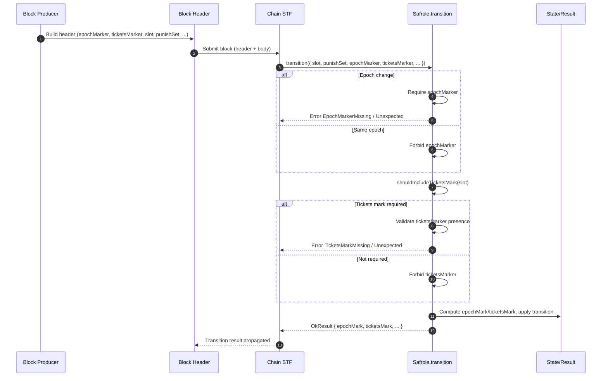

# Marker validation

## Pull Request by @skoszuta

epoch and ticket marker validation
- [x] epoch marker validation
- [x] ticket marker validation


## Comment by @coderabbitai[bot]

<!-- This is an auto-generated comment: summarize by coderabbit.ai -->
<!-- This is an auto-generated comment: skip review by coderabbit.ai -->

> [!IMPORTANT]
> ## Review skipped
> 
> Auto incremental reviews are disabled on this repository.
> 
> Please check the settings in the CodeRabbit UI or the `.coderabbit.yaml` file in this repository. To trigger a single review, invoke the `@coderabbitai review` command.
> 
> You can disable this status message by setting the `reviews.review_status` to `false` in the CodeRabbit configuration file.

<!-- end of auto-generated comment: skip review by coderabbit.ai -->
<!-- walkthrough_start -->

<details>
<summary>📝 Walkthrough</summary>

<!-- This is an auto-generated comment: release notes by coderabbit.ai -->

## Summary by CodeRabbit

- New Features
  - Added support for epoch and tickets markers in block headers during transition, with strict validation and clear error reporting for missing or unexpected markers.
  - Improved ticket sequencing behavior when a tickets marker is provided.

- Tests
  - Expanded test coverage for marker-present/absent scenarios, error cases, and ticket reordering.
  - Enabled additional conformance test vectors previously ignored.

<!-- end of auto-generated comment: release notes by coderabbit.ai -->
## Walkthrough
Safrole transition input now includes epochMarker and ticketsMarker, with corresponding validation and new error codes. Chain STF forwards these markers from block headers. Tests are updated to cover marker presence, sequencing, and error paths. Test runner re-enables several previously ignored traces.

## Changes
| Cohort / File(s) | Summary |
|---|---|
| **Safrole core**<br>`packages/jam/safrole/safrole.ts` | Added Input fields epochMarker and ticketsMarker; added error codes for marker presence/absence; introduced shouldIncludeTicketsMark; updated getTicketsMark and transition to validate and use header-provided markers; comments note header-driven expectations. |
| **Transition integration**<br>`packages/jam/transition/chain-stf.ts` | Passes header.epochMarker and header.ticketsMarker into safrole.transition; removed TODO about mark verification. |
| **Safrole tests**<br>`packages/jam/safrole/safrole.test.ts` | Expanded imports for marker creation; test inputs now include epochMarker/ticketsMarker (often null); added tests for new error codes and sequencing using real markers and per-epoch ticket blocks. |
| **Test runner adjustments**<br>`bin/test-runner/jam-conformance-070.ts` | Removed three ignored traces; simplified ignored list construction (direct array). |
| **W3F safrole runner**<br>`bin/test-runner/w3f/safrole.ts` | Updated runSafroleTest to pass epochMarker: null and ticketsMarker: null alongside punishSet to safrole.transition. |

## Sequence Diagram(s)


## Estimated code review effort
🎯 4 (Complex) | ⏱️ ~60 minutes

## Poem
> I thump my paws on epochs’ floor,  
> Two markers knock upon the door—  
> “Present?” “Absent?” tickets queue,  
> We sort the lot, as rabbits do.  
> With headers crisp and traces bright,  
> We bound through slots, our logic tight.  
> Hop! The tests now pass in flight. 🐇✨

</details>

<!-- walkthrough_end -->
<!-- internal state start -->


<!-- DwQgtGAEAqAWCWBnSTIEMB26CuAXA9mAOYCmGJATmriQCaQDG+Ats2bgFyQAOFk+AIwBWJBrngA3EsgEBPRvlqU0AgfFwA6NPEgQAfACgjoCEYDEZyAAUASpETZWaCrI5Ho6gDYkuAWWcA1pSQEmie8LTU8PhYkAYAco4ClFwAbACMAAyQcQCqNgAyXLC4uNyIHAD0lUTqsNgCGkzMlQBintgAZp2yBSqIlbiy3CTJFC6V3NienpUZ2XmIKfYB+IgAXnhoOQYAyvjYFAwkkAJUGAywXIgBYMyBlGCh4ZHiMTvQzqS4p+eXXPd4LE9rhqNgKvwRsCbCQJPASAB3SgQgAUGBiJ3CiBotAAlDs+slPKj0eRIFicfi4gBhCgkah0dCcSAAJkyLIArGBMgBOMDpFnQdLpDiZAAcotSAC0jAARaQMCjwbhvDBuKAAIhI3Hwl3QGHo4gYQR+9woQT4zwiURiGoMUGpsFEAQpbhyUAA2gAPAC6kG1utgkDNFpCYWtqoM7sg3r9RpNwYelvDr2iGCM+mM4CgZHo+E6OAIxDIyhxClY7C4vH4wlE4ikMnkTCUVFU6i0OkzJigcFQqEwhcIpHIVDLzTYGGZVAR9kcZvkcgULZUak02l0YEMWdMBjUGEG0lwYAo2AwI8qQjQzDATAwnXwFHuFxI3IA7JkNLgKgYNb+DBZIAAQQASWLEcGXoBwnBcfgC0uTBSEQDNIBhZh8CkQ1YDpE52CVaRIE6CgWEgXAnRQIh0TpQ1DyeOsH3JJBmVwKhjgGdJXw5d9UhZHkWVfSpMkEoSeXSDQhEQGIABoSJY6RKnYziABYWQAZkUlSVIEoTBJZRSxIkjBpMwQ1ZLYjjX2U9IeQ5FktO04V9Kk/00D1BE6hQDBwjJdEaGQFQDh+EgvRGMRGTpEQxDTfg+HgZgdQoH5klgNA4QfDR7RQkg0IwkiyKaGIGGoFEPUgDQysgH18QRKhuBGPhnAOA1cpOeAKIfRlnCoeRjJIw5yEwk5b0KmgMBtLAgQIdBIFoeA6TEdBxjQeRcyBIhIDc0jIGHaQkEcjB0qgABRbo60kEhPFkaTSJOXhYWicELvIyjGWYlz8OcE50XJGJSBitqqP1eg3JmU5BpiRAIkoRkgWakjD0gE9DPWhBvFhulAQwVanva+h1Cy5AUSBBgOhmjA1u2iHED2/E6spzQjHMSxAM8GhRzTZBJuu6bRE8ZwxuQfN/WCh8y3oqYBHCBh/UndR4SQjL4nwRhkrJ/DJqC+KcUmBpJe54m+dVKmjEO7FYogpcTjpOFEX9boRb8Oh4EcH8/3tHc9wPbFj1Pc8ERUzpKkQNBCPwbxP2/X87QAkCwNLRkoPnWDlYQ6RkOArBEd2YOiO8aBDyusjCpByag5DsPXowCHVUgdEZ24NBECWZAA0ufxzWWDBpk8QGSPgY0SC/NuLS4TuQZhtBaBm6vJqmTHEFgXYB4Abh4K37sQR6Yke2ekAXgf1objziewJRaA0GAyKBKYfkECKfnntARhIpWK6rqL4NVxBpIRFGTi5hxxiNVJmtTw+BahSxRBrOsdAYQOBZtJKBoVaC7FBDQaSdI4E/BVrQLyRB8To20JXSAp4P6kDPgzf8TMWalnZs/WGSh9Zs3BknDWItGRix1n3aW4hxCpwVhiY2pt7hjkUJbO6NsSB2wSg7GaztI4Zh3PXY0aBEIXivIHbOocSAaLLiQT8h5w5uHkdHUC21RzxznM4eQgtSF8KgMBOKItZwUE6G9IW9cDSMhDswSAAABIYIwxgTAlrqAIdCiYkxOIdHUrckzSQAGopmoA+AA0iQWQX8e7MVkIBRAVhKDRMDAAIVAcaBBo0JZY0VPSauPVwQnEFi3IMIZkQ9zqmAJpvd+6JVKQEZAMNfJfgOpALOui4bYg8tfZuXoRqnzoYVcY8hcAIiVuQGc+AVRpjCDwThUtOjwk8LQCETSh7BB6vGAeiBTkUBXk+JZ8NCpNxrvgGcQJZbhnWH/J0SwCIHKOZAFE+YRroGQKPTw+JJp0k6N4eaXM1lASsMBZxrjjjDMApPF6h4OZKyYFIPg8LKBET4PXUiyA6S8zLOrGJsBrlZL7iaK5SY3S6EgIU2J7cKC+CQBDMmyMyD+mpcnT+pw8ACsDLS1AYL0rRjZTSpMuRyDBWgUDJ0WBOmoH/leE4AhRXbFJGAMFYr2WhlQLwdCkNyHRg8N0xl5ouWNyxj/fl2wLmDyTCgMlJAACO2BZqMh1T8Hyq9zWn2lSy61DKh4KsQWWJ1WAXX0suRK5At0liThFYG/AgUlVIOGenZiihsDHHoNUsaPdwQqIaQWOk2zOktIoH5Jq7TOkhONP0rAgzvwyupdcpoNaaAojKhofE9TDQ4qoJ0H4Vp6AnPdVfPARtoyJJeMkigaSMl9pqSQQdZUR1LDHTwDZ0wGRhhXQQBtHkIZKFZT2pMYaoDZNyfkigsqSmhJ3cO4h+66FmJPQmm1tLbygjeby7YSwb4FldUbI6wVjIdXGT8SaeL4A9AUOMOs9hvXYDIAwLGgsoN8vjc8jAHS4pDC6ZGudyAHC1XCHQIyjdKDiFAwjEgD4WwvUTV+dADAGCOGPeejysMArXzRRi+gYGGjYkwOIbZrawn4a4+2qaUHaUl1igJsGcVvBekTBysAtAlRSAzmxigLYsY9WQ/s4aUUUSH3rglJO/8sM4axoM3E6UDBwGkINFWiEFAzFOlIR6ZAVCo0GXhyDZFRk5z/ucN+7xQHgPQEQQhEyCXUruO6nqzbMuuqyxyyZC6jKgN5RtIMTB0OIB1AaLGhL6LYNwTwagsAjYM2jtQphRDOZkQYbzLrAsCysISuw4luzuGyzsZARW5BBHiGEYyZsYjrYzkkfeaRkBfCOzka7CAYAjBKICJWgYl4Wil1izo2LhiXZRyZqYks5jIKWJgjYvzU30VzKdBPR4Sh9n9T0xabFsNxa63TtfewyURhcFnRyrgsraUAB8a5dzpQBplMAlND0gEjqVGVDozNzIyGLWjDqAIoNSUR613L3kODXG2S2ge4uCPW1ePnnyVH6DhnwN7xVJntTyog0l4fysVSFHE0kI1JsCPz1aEvMeBGjTmnEebJxEVoEW+DvBJAnqdJ4OqEODiHPTsfJQku3XmhRPN6QoDcAQpxbhD5XzMRgK4UoVmzAQNrSdddeqFHLkA49axn1fr6DramrUYzvc2AbyzcMmEKLz2Mm+Gb21ARLexWt1mu3rHN5YHnob2gxvIkp6Hun6PNv8RAmxPSPMBZ1fcEllEXlXMgReTBrV1UwzDp3gfMWunM5p38yE6/WWMRCYYGvriaHldDg4VvYV01GD2CEdhp02xjbcZ+QEGmn4caUA/FoPgfCPkV5kAAX/eXC+U1L/TXv/P0xC8XGL5ftP87NAx9t4H5i2Ge6c/TVmp0CgNyJYYZAoSRQKefMJc5F/I+DoCGd4AZMiDBaYXAb+dyccdgdtGaGzFjHUEaWTbuL7FsMAM1OEOZCSQ4Y4ITToPAWfAFU2EGPjdDScR6Zoa+RkZ4bDRADzDKLlSidAcICiCcJiMiETUVbEE8MQOgukYDIhGHKApqVTQIX5c6f5RAk4AAeQCFgRQOklrmml1EcHYA6lKyICvROCIJ+yM35RjX5k80ZiAk6yHx6xOD6wNloUaWFhGzzDG0qSlnYEm3ligF8EUBQ3hFoGhy8MQ2GBODB1FRhkO2OzUTO00W8Euy0XDijBZQ+y8T+S7RyBZXkOWGF0Kxxy7iyOjCUNhwxzR3NGx2RxmF4NCP2ToEiM1mlkcBGVSJIFJyJQp2vQSJciO1UVO3SLSPOwyK/CyKgByJnU7jYHOC/GZW7V5w5Rl15QAF5IAxQKiWUSiLRFcxdGQtieRdiewX91i1otisgziajKNzRDjlVIBrj0g5szYRFr014JEpFmQAAJVqWAG7BRfbAwRIkY9REfVUSoeCIEMAbEToa7YxO7WOR7WcaCaxOCN7IIoCSeDmFZfvFQw5IHTVXRT8eLUfcaCfPAaHSAs5RQl/SgaSToLxIiHxSwigDQIo+qJqdkz8BkigdBaQMXM6C6c+VCdCNWMiW6YtLGaADQ2UDQ9AAQAKEISgFDWQLGEMKmSACnVXUOAiUBGcHqerPgRrLGAhGGAAygYAk4EhN7chdrKhVmZwl+XrHmdw5hTwzWUbHZPwibXhbErbUiRQewVqUaXAOg7AbgV4VoyAAAA0hLTDjKEzQnV1RjjP8RiKCVkDGO0QmLDnEmTP0JcmOBVGQBaKJPjK5OTJ6gTP5OTJhnUHbXB1vgw3H3QEngpLoS5iCkYixgrKOR4IMBNnm3NiW1YxW1tnW2ZC21kWYCBLdi3G7Gllr0HBRLHJYGEK4GnDRMTkXCW1bFXA7A3EMGXPHHUAAH0IhEALyvikRaALzpNHNMwDBlzMhFJxRaArJXx2JMgGB0h/ySBUg6BXxOgOQGAWRUgORUg0AMgSAVIeR4KGAVI0ASAWQTztwoBzzcAryjlbzxF7yLzcwTygA=== -->

<!-- internal state end -->
<!-- tips_start -->

---


<sub>Comment `@coderabbitai help` to get the list of available commands and usage tips.</sub>

<!-- tips_end -->


## Comment by @github-actions[bot]


<details>
<summary>View all</summary>

| File | Benchmark | Ops |  |
|------|-----------|-----|--|
| [bytes/hex-from.ts[0]](../blob/ccea8998729c96b7ccb3db41f0a9d0daa832558c//_work/typeberry-1/typeberry/typeberry/benchmarks/bytes/hex-from.ts) | parse hex using `Number` with NaN checking | 133079.54 ±0.97% | 82.32% slower |
| [bytes/hex-from.ts[1]](../blob/ccea8998729c96b7ccb3db41f0a9d0daa832558c//_work/typeberry-1/typeberry/typeberry/benchmarks/bytes/hex-from.ts) | parse hex from char codes | 752678.93 ±1.24% | fastest ✅ |
| [bytes/hex-from.ts[2]](../blob/ccea8998729c96b7ccb3db41f0a9d0daa832558c//_work/typeberry-1/typeberry/typeberry/benchmarks/bytes/hex-from.ts) | parse hex from string nibbles | 504757.72 ±0.41% | 32.94% slower |
| [codec/decoding.ts[0]](../blob/ccea8998729c96b7ccb3db41f0a9d0daa832558c//_work/typeberry-1/typeberry/typeberry/benchmarks/codec/decoding.ts) | manual decode | 19370343.7 ±1.19% | 85.64% slower |
| [codec/decoding.ts[1]](../blob/ccea8998729c96b7ccb3db41f0a9d0daa832558c//_work/typeberry-1/typeberry/typeberry/benchmarks/codec/decoding.ts) | int32array decode | 134244567.42 ±3.38% | 0.47% slower |
| [codec/decoding.ts[2]](../blob/ccea8998729c96b7ccb3db41f0a9d0daa832558c//_work/typeberry-1/typeberry/typeberry/benchmarks/codec/decoding.ts) | dataview decode | 134874101.47 ±3.38% | fastest ✅ |
| [codec/encoding.ts[0]](../blob/ccea8998729c96b7ccb3db41f0a9d0daa832558c//_work/typeberry-1/typeberry/typeberry/benchmarks/codec/encoding.ts) | manual encode | 2470066.6 ±0.99% | 20.14% slower |
| [codec/encoding.ts[1]](../blob/ccea8998729c96b7ccb3db41f0a9d0daa832558c//_work/typeberry-1/typeberry/typeberry/benchmarks/codec/encoding.ts) | int32array encode | 3033592.8 ±1.09% | 1.92% slower |
| [codec/encoding.ts[2]](../blob/ccea8998729c96b7ccb3db41f0a9d0daa832558c//_work/typeberry-1/typeberry/typeberry/benchmarks/codec/encoding.ts) | dataview encode | 3092842.95 ±0.68% | fastest ✅ |
| [hash/index.ts[0]](../blob/ccea8998729c96b7ccb3db41f0a9d0daa832558c//_work/typeberry-1/typeberry/typeberry/benchmarks/hash/index.ts) | hash with numeric representation | 94.47 ±10.12% | 58.61% slower |
| [hash/index.ts[1]](../blob/ccea8998729c96b7ccb3db41f0a9d0daa832558c//_work/typeberry-1/typeberry/typeberry/benchmarks/hash/index.ts) | hash with string representation | 94.92 ±0.95% | 58.41% slower |
| [hash/index.ts[2]](../blob/ccea8998729c96b7ccb3db41f0a9d0daa832558c//_work/typeberry-1/typeberry/typeberry/benchmarks/hash/index.ts) | hash with symbol representation | 162.25 ±0.46% | 28.91% slower |
| [hash/index.ts[3]](../blob/ccea8998729c96b7ccb3db41f0a9d0daa832558c//_work/typeberry-1/typeberry/typeberry/benchmarks/hash/index.ts) | hash with uint8 representation | 145.74 ±0.33% | 36.14% slower |
| [hash/index.ts[4]](../blob/ccea8998729c96b7ccb3db41f0a9d0daa832558c//_work/typeberry-1/typeberry/typeberry/benchmarks/hash/index.ts) | hash with packed representation | 228.22 ±0.71% | fastest ✅ |
| [hash/index.ts[5]](../blob/ccea8998729c96b7ccb3db41f0a9d0daa832558c//_work/typeberry-1/typeberry/typeberry/benchmarks/hash/index.ts) | hash with bigint representation | 159.4 ±0.84% | 30.16% slower |
| [hash/index.ts[6]](../blob/ccea8998729c96b7ccb3db41f0a9d0daa832558c//_work/typeberry-1/typeberry/typeberry/benchmarks/hash/index.ts) | hash with uint32 representation | 175.95 ±0.31% | 22.9% slower |
| [codec/bigint.compare.ts[0]](../blob/ccea8998729c96b7ccb3db41f0a9d0daa832558c//_work/typeberry-1/typeberry/typeberry/benchmarks/codec/bigint.compare.ts) | compare custom | 217186267.67 ±6.28% | 1.77% slower |
| [codec/bigint.compare.ts[1]](../blob/ccea8998729c96b7ccb3db41f0a9d0daa832558c//_work/typeberry-1/typeberry/typeberry/benchmarks/codec/bigint.compare.ts) | compare bigint | 221106942.06 ±5.02% | fastest ✅ |
| [codec/bigint.decode.ts[0]](../blob/ccea8998729c96b7ccb3db41f0a9d0daa832558c//_work/typeberry-1/typeberry/typeberry/benchmarks/codec/bigint.decode.ts) | decode custom | 153571012.69 ±2.27% | fastest ✅ |
| [codec/bigint.decode.ts[1]](../blob/ccea8998729c96b7ccb3db41f0a9d0daa832558c//_work/typeberry-1/typeberry/typeberry/benchmarks/codec/bigint.decode.ts) | decode bigint | 95970391.66 ±2.78% | 37.51% slower |
| [bytes/hex-to.ts[0]](../blob/ccea8998729c96b7ccb3db41f0a9d0daa832558c//_work/typeberry-1/typeberry/typeberry/benchmarks/bytes/hex-to.ts) | number toString + padding | 282485.77 ±1.53% | fastest ✅ |
| [bytes/hex-to.ts[1]](../blob/ccea8998729c96b7ccb3db41f0a9d0daa832558c//_work/typeberry-1/typeberry/typeberry/benchmarks/bytes/hex-to.ts) | manual | 15124.14 ±0.42% | 94.65% slower |
| [collections/map-set.ts[0]](../blob/ccea8998729c96b7ccb3db41f0a9d0daa832558c//_work/typeberry-1/typeberry/typeberry/benchmarks/collections/map-set.ts) | 2 gets + conditional set | 111166.61 ±0.92% | fastest ✅ |
| [collections/map-set.ts[1]](../blob/ccea8998729c96b7ccb3db41f0a9d0daa832558c//_work/typeberry-1/typeberry/typeberry/benchmarks/collections/map-set.ts) | 1 get 1 set | 58187.11 ±0.36% | 47.66% slower |
| [math/mul_overflow.ts[0]](../blob/ccea8998729c96b7ccb3db41f0a9d0daa832558c//_work/typeberry-1/typeberry/typeberry/benchmarks/math/mul_overflow.ts) | multiply and bring back to u32 | 230364109.07 ±6.49% | 0.5% slower |
| [math/mul_overflow.ts[1]](../blob/ccea8998729c96b7ccb3db41f0a9d0daa832558c//_work/typeberry-1/typeberry/typeberry/benchmarks/math/mul_overflow.ts) | multiply and take modulus | 231533106.61 ±6.14% | fastest ✅ |
| [math/switch.ts[0]](../blob/ccea8998729c96b7ccb3db41f0a9d0daa832558c//_work/typeberry-1/typeberry/typeberry/benchmarks/math/switch.ts) | switch | 223990945.24 ±6.3% | 7.28% slower |
| [math/switch.ts[1]](../blob/ccea8998729c96b7ccb3db41f0a9d0daa832558c//_work/typeberry-1/typeberry/typeberry/benchmarks/math/switch.ts) | if | 241566847.52 ±6.3% | fastest ✅ |
| [math/add_one_overflow.ts[0]](../blob/ccea8998729c96b7ccb3db41f0a9d0daa832558c//_work/typeberry-1/typeberry/typeberry/benchmarks/math/add_one_overflow.ts) | add and take modulus | 231089459.18 ±6.37% | 3.84% slower |
| [math/add_one_overflow.ts[1]](../blob/ccea8998729c96b7ccb3db41f0a9d0daa832558c//_work/typeberry-1/typeberry/typeberry/benchmarks/math/add_one_overflow.ts) | condition before calculation | 240328375.77 ±5.71% | fastest ✅ |
| [math/count-bits-u64.ts[0]](../blob/ccea8998729c96b7ccb3db41f0a9d0daa832558c//_work/typeberry-1/typeberry/typeberry/benchmarks/math/count-bits-u64.ts) | standard method | 9011981.17 ±0.85% | 89.44% slower |
| [math/count-bits-u64.ts[1]](../blob/ccea8998729c96b7ccb3db41f0a9d0daa832558c//_work/typeberry-1/typeberry/typeberry/benchmarks/math/count-bits-u64.ts) | magic | 85311684.82 ±1.42% | fastest ✅ |
| [math/count-bits-u32.ts[0]](../blob/ccea8998729c96b7ccb3db41f0a9d0daa832558c//_work/typeberry-1/typeberry/typeberry/benchmarks/math/count-bits-u32.ts) | standard method | 88233351.69 ±2.13% | 58.07% slower |
| [math/count-bits-u32.ts[1]](../blob/ccea8998729c96b7ccb3db41f0a9d0daa832558c//_work/typeberry-1/typeberry/typeberry/benchmarks/math/count-bits-u32.ts) | magic | 210408508.04 ±5.64% | fastest ✅ |
| [logger/index.ts[0]](../blob/ccea8998729c96b7ccb3db41f0a9d0daa832558c//_work/typeberry-1/typeberry/typeberry/benchmarks/logger/index.ts) | console.log with string concat | 5744668.63 ±62.96% | fastest ✅ |
| [logger/index.ts[1]](../blob/ccea8998729c96b7ccb3db41f0a9d0daa832558c//_work/typeberry-1/typeberry/typeberry/benchmarks/logger/index.ts) | console.log with args | 1126418.31 ±99.38% | 80.39% slower |
| [codec/view_vs_object.ts[0]](../blob/ccea8998729c96b7ccb3db41f0a9d0daa832558c//_work/typeberry-1/typeberry/typeberry/benchmarks/codec/view_vs_object.ts) | Get the first field from Decoded | 392226.89 ±1.73% | fastest ✅ |
| [codec/view_vs_object.ts[1]](../blob/ccea8998729c96b7ccb3db41f0a9d0daa832558c//_work/typeberry-1/typeberry/typeberry/benchmarks/codec/view_vs_object.ts) | Get the first field from View | 89038.94 ±1.49% | 77.3% slower |
| [codec/view_vs_object.ts[2]](../blob/ccea8998729c96b7ccb3db41f0a9d0daa832558c//_work/typeberry-1/typeberry/typeberry/benchmarks/codec/view_vs_object.ts) | Get the first field as view from View | 83717.75 ±1.34% | 78.66% slower |
| [codec/view_vs_object.ts[3]](../blob/ccea8998729c96b7ccb3db41f0a9d0daa832558c//_work/typeberry-1/typeberry/typeberry/benchmarks/codec/view_vs_object.ts) | Get two fields from Decoded | 384260.76 ±2.25% | 2.03% slower |
| [codec/view_vs_object.ts[4]](../blob/ccea8998729c96b7ccb3db41f0a9d0daa832558c//_work/typeberry-1/typeberry/typeberry/benchmarks/codec/view_vs_object.ts) | Get two fields from View | 73746.32 ±2.1% | 81.2% slower |
| [codec/view_vs_object.ts[5]](../blob/ccea8998729c96b7ccb3db41f0a9d0daa832558c//_work/typeberry-1/typeberry/typeberry/benchmarks/codec/view_vs_object.ts) | Get two fields from materialized from View | 153009.57 ±1.29% | 60.99% slower |
| [codec/view_vs_object.ts[6]](../blob/ccea8998729c96b7ccb3db41f0a9d0daa832558c//_work/typeberry-1/typeberry/typeberry/benchmarks/codec/view_vs_object.ts) | Get two fields as views from View | 73037.85 ±1.5% | 81.38% slower |
| [codec/view_vs_object.ts[7]](../blob/ccea8998729c96b7ccb3db41f0a9d0daa832558c//_work/typeberry-1/typeberry/typeberry/benchmarks/codec/view_vs_object.ts) | Get only third field from Decoded | 371605.08 ±2.58% | 5.26% slower |
| [codec/view_vs_object.ts[8]](../blob/ccea8998729c96b7ccb3db41f0a9d0daa832558c//_work/typeberry-1/typeberry/typeberry/benchmarks/codec/view_vs_object.ts) | Get only third field from View | 94856.42 ±1.31% | 75.82% slower |
| [codec/view_vs_object.ts[9]](../blob/ccea8998729c96b7ccb3db41f0a9d0daa832558c//_work/typeberry-1/typeberry/typeberry/benchmarks/codec/view_vs_object.ts) | Get only third field as view from View | 94327.67 ±1.33% | 75.95% slower |
| [codec/view_vs_collection.ts[0]](../blob/ccea8998729c96b7ccb3db41f0a9d0daa832558c//_work/typeberry-1/typeberry/typeberry/benchmarks/codec/view_vs_collection.ts) | Get first element from Decoded | 25284.69 ±1.62% | 58.36% slower |
| [codec/view_vs_collection.ts[1]](../blob/ccea8998729c96b7ccb3db41f0a9d0daa832558c//_work/typeberry-1/typeberry/typeberry/benchmarks/codec/view_vs_collection.ts) | Get first element from View | 60715.48 ±1.45% | fastest ✅ |
| [codec/view_vs_collection.ts[2]](../blob/ccea8998729c96b7ccb3db41f0a9d0daa832558c//_work/typeberry-1/typeberry/typeberry/benchmarks/codec/view_vs_collection.ts) | Get 50th element from Decoded | 27192.92 ±1.25% | 55.21% slower |
| [codec/view_vs_collection.ts[3]](../blob/ccea8998729c96b7ccb3db41f0a9d0daa832558c//_work/typeberry-1/typeberry/typeberry/benchmarks/codec/view_vs_collection.ts) | Get 50th element from View | 38529.87 ±0.31% | 36.54% slower |
| [codec/view_vs_collection.ts[4]](../blob/ccea8998729c96b7ccb3db41f0a9d0daa832558c//_work/typeberry-1/typeberry/typeberry/benchmarks/codec/view_vs_collection.ts) | Get last element from Decoded | 28160.05 ±0.19% | 53.62% slower |
| [codec/view_vs_collection.ts[5]](../blob/ccea8998729c96b7ccb3db41f0a9d0daa832558c//_work/typeberry-1/typeberry/typeberry/benchmarks/codec/view_vs_collection.ts) | Get last element from View | 27356.56 ±0.27% | 54.94% slower |
| [collections/map_vs_sorted.ts[0]](../blob/ccea8998729c96b7ccb3db41f0a9d0daa832558c//_work/typeberry-1/typeberry/typeberry/benchmarks/collections/map_vs_sorted.ts) | Map | 328575.91 ±0.21% | fastest ✅ |
| [collections/map_vs_sorted.ts[1]](../blob/ccea8998729c96b7ccb3db41f0a9d0daa832558c//_work/typeberry-1/typeberry/typeberry/benchmarks/collections/map_vs_sorted.ts) | Map-array | 103414.13 ±0.04% | 68.53% slower |
| [collections/map_vs_sorted.ts[2]](../blob/ccea8998729c96b7ccb3db41f0a9d0daa832558c//_work/typeberry-1/typeberry/typeberry/benchmarks/collections/map_vs_sorted.ts) | Array | 76016.25 ±2.62% | 76.86% slower |
| [collections/map_vs_sorted.ts[3]](../blob/ccea8998729c96b7ccb3db41f0a9d0daa832558c//_work/typeberry-1/typeberry/typeberry/benchmarks/collections/map_vs_sorted.ts) | SortedArray | 196796.45 ±0.28% | 40.11% slower |
| [hash/blake2b.ts[0]](../blob/ccea8998729c96b7ccb3db41f0a9d0daa832558c//_work/typeberry-1/typeberry/typeberry/benchmarks/hash/blake2b.ts) | hasher with simple allocator | 0.04588 ±0.88% | 0.11% slower |
| [hash/blake2b.ts[1]](../blob/ccea8998729c96b7ccb3db41f0a9d0daa832558c//_work/typeberry-1/typeberry/typeberry/benchmarks/hash/blake2b.ts) | hasher with page allocator | 0.04593 ±0.44% | fastest ✅ |
| [bytes/compare.ts[0]](../blob/ccea8998729c96b7ccb3db41f0a9d0daa832558c//_work/typeberry-1/typeberry/typeberry/benchmarks/bytes/compare.ts) | Comparing Uint32 bytes | 20272.96 ±0.1% | 3.23% slower |
| [bytes/compare.ts[1]](../blob/ccea8998729c96b7ccb3db41f0a9d0daa832558c//_work/typeberry-1/typeberry/typeberry/benchmarks/bytes/compare.ts) | Comparing raw bytes | 20949.26 ±0.11% | fastest ✅ |
| [crypto/ed25519.ts[0]](../blob/ccea8998729c96b7ccb3db41f0a9d0daa832558c//_work/typeberry-1/typeberry/typeberry/benchmarks/crypto/ed25519.ts) | native crypto | 8.31 ±0.48% | 72.96% slower |
| [crypto/ed25519.ts[1]](../blob/ccea8998729c96b7ccb3db41f0a9d0daa832558c//_work/typeberry-1/typeberry/typeberry/benchmarks/crypto/ed25519.ts) | wasm lib | 10.88 ±0.03% | 64.59% slower |
| [crypto/ed25519.ts[2]](../blob/ccea8998729c96b7ccb3db41f0a9d0daa832558c//_work/typeberry-1/typeberry/typeberry/benchmarks/crypto/ed25519.ts) | wasm lib batch | 30.73 ±0.39% | fastest ✅ |
</details>


### Benchmarks summary: 63/63 OK ✅

<!-- thollander/actions-comment-pull-request "benchmarks" -->


## Comment by @coderabbitai[bot]

_🛠️ Refactor suggestion_

**Header markers added to Input: presence validated, content not.**

Good to surface these via Input. However, the current checks only enforce presence/absence. Consider comparing provided markers to computed ones (post-validators resolution) and error on mismatch to prevent header forgery. You can still keep the TODO but please scope follow-up.

<details>
<summary>🤖 Prompt for AI Agents</summary>

```
In packages/jam/safrole/safrole.ts around lines 78 to 81, the Input type exposes
epochMarker and ticketsMarker but validation currently only enforces presence;
update the runtime validation to compute the canonical epoch and tickets markers
after resolving/normalizing any validators and then compare those computed
markers to the provided header markers, throwing a clear error when they
mismatch to prevent header forgery; implement this check where Input is
validated/constructed (or in the existing TODO area), include helpful error
messages showing expected vs provided, and keep the TODO for any follow-up
scoping notes.
```

</details>

<!-- fingerprinting:phantom:medusa:chinchilla -->

<!-- This is an auto-generated comment by CodeRabbit -->


## Comment by @coderabbitai[bot]

_🛠️ Refactor suggestion_

**Epoch marker: only presence validated; add equivalence check.**

After `getValidatorKeys`, compute expected epoch mark and compare to `input.epochMarker` (when non-null). Mismatch should fail (either with a new error code or reuse `IncorrectData`). This closes a header/content integrity gap.

<details>
<summary>🤖 Prompt for AI Agents</summary>

```
In packages/jam/safrole/safrole.ts around lines 498–506, the code only checks
presence/absence of epochMarker but does not validate its content; after calling
getValidatorKeys (where expected epoch marker can be derived), compute the
expected epoch marker and, when input.epochMarker is non-null, compare them and
return an error on mismatch (either SafroleErrorCode.IncorrectData or add a new
specific error code). Ensure this check runs after validator keys are available
and short-circuits with Result.error on mismatch.
```

</details>

<!-- fingerprinting:phantom:medusa:chinchilla -->

<!-- This is an auto-generated comment by CodeRabbit -->


## Comment by @coderabbitai[bot]

_🛠️ Refactor suggestion_

**Tickets mark: only presence validated; add equivalence check.**

Likewise, compare `input.ticketsMarker` with `getTicketsMark(input.slot)` when required. Return a specific error on mismatch.

<details>
<summary>🤖 Prompt for AI Agents</summary>

```
In packages/jam/safrole/safrole.ts around lines 507 to 513, the current checks
only validate presence/absence of input.ticketsMarker; when a tickets mark is
required you must also compute the expected mark via getTicketsMark(input.slot)
and compare it to input.ticketsMarker, returning a specific error (e.g.
SafroleErrorCode.TicketsMarkMismatch) if they differ; implement this additional
equality check after confirming ticketsMarker is non-null so the code both
enforces presence and verifies correctness.
```

</details>

<!-- fingerprinting:phantom:medusa:chinchilla -->

<!-- This is an auto-generated comment by CodeRabbit -->


## Comment by @tomusdrw

This shouldn't be removed. We still want to make sure that the failing to import block didn't perform any state changes. I know it feels redundant (since the state changes are now returned by `stfResult`), but this is just for extra safety :)


## Comment by @tomusdrw

Seems a bit verbose to have separate errors for this. I feel like this could be the same error (`InvalidEpochMarker`) and the details could contain info what exactly is invalid.


## Comment by @tomusdrw

Yeah, we should. Epoch marker should be compared with the one that we generate in `getEpochMarker` method. I think it would even be easier to skip the `isEpochChanged` check and just always compare epoch marker that the input has with the one that we generate.


## Comment by @tomusdrw

Same here - we should compare our `ticketsMarker` with the one that's in the input.


## Comment by @skoszuta

how can there be changes if it's done without applying a state update? on top of that there isn't even anything to apply since when stf errors out it doesn't return an update


## Comment by @skoszuta

tickets marker is a lengthy array. do you want to iterate and perform an equality check on every item?


## Comment by @tomusdrw

Yes. If it's easier we can encode it and then compare (we could even avoid decoding it from the input in such case).


## Comment by @tomusdrw

Yes. You're absolutely right that it's impossible in the current code design, however it's part of future-proofing or defensive programming, since I have a plan to refactor the `stateUpdate` in the future and that assertion can become very useful.
