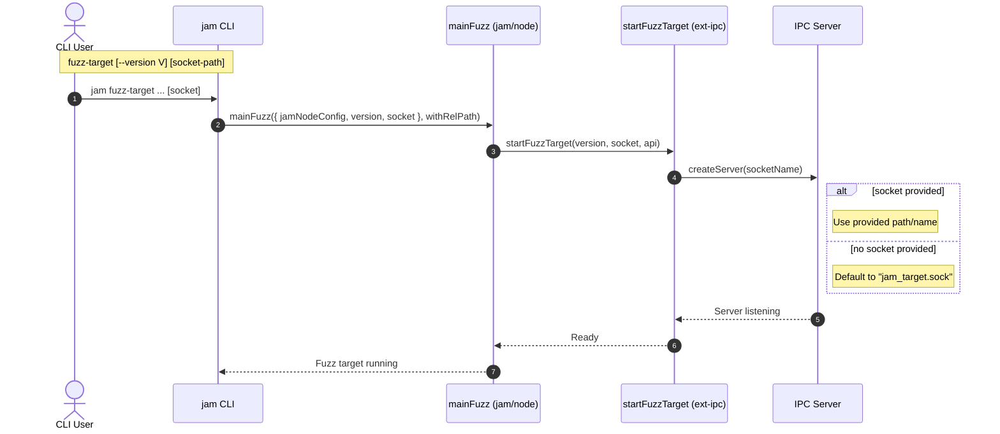

# Release preparation

## Pull Request by @tomusdrw

- [x] Make 0.7.0 the default.
- [x] Make fuzz target socket configurable.
- [x] Allow publishing manually.  


## Comment by @coderabbitai[bot]

<!-- This is an auto-generated comment: summarize by coderabbit.ai -->
<!-- This is an auto-generated comment: skip review by coderabbit.ai -->

> [!IMPORTANT]
> ## Review skipped
> 
> Auto incremental reviews are disabled on this repository.
> 
> Please check the settings in the CodeRabbit UI or the `.coderabbit.yaml` file in this repository. To trigger a single review, invoke the `@coderabbitai review` command.
> 
> You can disable this status message by setting the `reviews.review_status` to `false` in the CodeRabbit configuration file.

<!-- end of auto-generated comment: skip review by coderabbit.ai -->

<!-- walkthrough_start -->

<details>
<summary>📝 Walkthrough</summary>

<!-- This is an auto-generated comment: release notes by coderabbit.ai -->

## Summary by CodeRabbit

* New Features
  * Added support for specifying a custom socket path when running the fuzz target, enabling configurable IPC socket names.
  * Updated default compatibility version to 0.7.0 (stable).

* Chores
  * Release workflow can now be triggered manually.
  * Test scripts updated to target 0.7.0 (stable) instead of preview.

* Refactor
  * Simplified non-Windows IPC socket path calculation without changing behavior.

<!-- end of auto-generated comment: release notes by coderabbit.ai -->
## Walkthrough
Adds optional socket path support to the fuzz target flow, threading a socket parameter from CLI args through node startup into IPC startup. Updates IPC server path handling. Bumps GP version to 0.7.0 and sets it as default. Adjusts test scripts and release workflow to allow manual dispatch.

## Changes
| Cohort / File(s) | Summary of changes |
| --- | --- |
| **Release workflow trigger**<br>`.github/workflows/release.yml` | Added `workflow_dispatch` to enable manual triggering; no other workflow logic changed. |
| **CLI args and wiring for fuzz socket**<br>`bin/jam/args.ts`, `bin/jam/index.ts` | Introduced optional `socket: string | null` for `fuzz-target`; removed `FuzzOptions`; propagated `socket` to `mainFuzz` call. |
| **Fuzz main and IPC start signature**<br>`packages/jam/node/main-fuzz.ts`, `extensions/ipc/index.ts` | Added `socket: string | null` to `FuzzConfig`; updated `startFuzzTarget(version, socket, api)` signature and calls; uses dynamic socket name instead of hard-coded default. |
| **IPC server path calc refactor**<br>`extensions/ipc/server.ts` | Minor refactor for non-Windows socket path calculation using a local `linuxPath`; behavior preserved. |
| **Core compatibility version update**<br>`packages/core/utils/compatibility.ts` | `GpVersion.V0_7_0` value changed to `"0.7.0"` (from `"-preview"`); `DEFAULT_VERSION` set to `V0_7_0` (from `V0_6_7`). |
| **Test script GP version bump**<br>`bin/rpc/package.json`, `bin/test-runner/package.json` | Updated scripts to use `GP_VERSION=0.7.0` (removed `-preview`) across e2e and suite runs; no other script/dependency changes. |

## Sequence Diagram(s)


## Estimated code review effort
🎯 3 (Moderate) | ⏱️ ~25 minutes

## Poem
> I twitch my ears at version’s chime,  
> From preview mists to seven-dot-oh time.  
> A socket burrow, path I choose,  
> Through IPC tunnels fuzzers use.  
> Workflows wait at human’s knock—  
> Thump, thump—release the clock!  
> Hippity ship, the tests all rock.

</details>

<!-- walkthrough_end -->


<!-- tips_start -->

---


<sub>Comment `@coderabbitai help` to get the list of available commands and usage tips.</sub>

<!-- tips_end -->

<!-- internal state start -->


<!-- DwQgtGAEAqAWCWBnSTIEMB26CuAXA9mAOYCmGJATmriQCaQDG+Ats2bgFyQAOFk+AIwBWJBrngA3EsgEBPRvlqU0AgfFwA6NPEgQAfACgjoCEYDEZyAAUASpETZWaCrI5Ho6gDYkuNkt7REEh4KEm5nanh8DA0jABFpBgp4bnFotygAWTQAa2CABg0Adg18yFxYYKUAMzRsT00DLNzg6uwAL3by51Jce3wGPL6mDGr4ImwqAW9YqABBT098AHcebGmkBAwiSGZMbDRF2ViDOdpadSiMQ+s7Nlw0Wmo0DMgAOUcBSi4ANgBGP5NSAAVRsABkuLBcLhuIgOAB6eFEdSwdYaJjMeEAMU82Gq1VkYJUiHhuFk3BIXwoLnh3Hqnnh/0BUGBQQoXAIzGwiFoFGWQIAyvhJgxggIqBgGLAObQwIgBkMgdAeiQ+uLMFKuHt4BhBQ9cNyuPgKbqoABhULUOjoTiQABM+TtAFYwPkAJxgP526B/J0cfI/f0AFgAWkZ9MZwFAyPR8NUcARiGRlDR6Bi2Bhbbx+MJROIpDJ5EwlFM1JptLowIYTFA4KhUJgE4RSOQqKmFKx2FwqKsHE4XJA5AoSyoy1odBHI6YDBpkRV1vDlvgKDlqktliTQgEghpZMxPG4AETHgwWSBzACSSdbVvofb2A7jjFgmFIiCMZ1oyAqwSXK7XKwAPoXIg4S4FK5TJEQpB8AQ5SVPwWBBGIVz8PGP6QH426/suq7rgANJAZAqJ4Oo7HsGAHJ4kHjDBZFofBwRYSQgQ4f+64oFgjwXGkWBwRhJAAB5IOI2yQFuLFBDR0GUBo7z4PwP58IgNCwoRQiCIghHLgomYUPg1EAaszjBMwijwGMdAnOYlgLDQbZXN+CkYUoDCeBEvHIE+QncMu7Y6XSGwMERmaXNI4bWOspHBSQUiZug5x0FwAAGf54UBIFgVKyWQNgGAloxkDJdEOXTAqnFFbOKILmlRmbv4kkkLu+45QAFLVHEYCskCkSpZDINUOkUVRkCZdQEE6glPGofxCFCSJ9HJRJrE5bF7AAJQnAAoip8B7O2xbBKEEjwCQqwkPiflcJkdDwI4BjHoe4bTmoGDwkIaCYj0iAaLgcIPSeZ6XteKbWvezjyE+UqvuFQKfsgjbGrxNzyoMqpgGBsDoBQEwZn0s2tB07RgA8OOqh2FH0Jg9DhBQQTIOo6AI5B2ikWJvmIJc0Q3BIhzYCQhE+fgnNiYzgT9GjtoqckYkAD6QJRiwVRhWJE8qZN9N9kCtTUdQNPRcGK9RyyVFxAhBJmm1An4ZkFoVqudAA8qkjnlOSwTU5xbPSCgf2QJZnhfpxBOQA77Tq70kC88kmB9E+cw4447BacH+m0NgDD0ajQxcNL9Hy0b6D5VHlCc+kkBlPLfyjfAoRiJ4xxAsC3BPDQ34IQnuPJ7lGAzQpoTcO5oqQAKL6hLQzueZAABkodE5PrvLCiI9j3QC/RMgs8AN4Szn9i4DLOwF/SADcJd01cXCV5A1cAL7+zpZosJTGhhxHqqzCCLdWu3wRmmCF5ICVE8NweE3I0CkHKP3C63gxD+yJiTFUfQuq9mwNwXyFBRI7DQLvdGmNtYAG1s54OoLAAAvKSZgoCPrMEAqTXoGhs4AF11pnwwmgMQI1aYix2EEP2xC+jVH0swdALN4Bs2wYnPGn8zhCG5H7DC3CSCdwGhxQafAn5OHyq/NWSCoHiRYlTYuvBjQQKtIVcgvYFTk15riD2SxticyUOfMuMQjA2XPA0FMrsQ6uXcg5DeDEhaYOtAFKK8AYqhXELDKANt8BSHoME9sZIKRcDDuvDAA1hGDh1O9T68Jvq/R+k3b+7YknWhST4c8Uju6TVenkr6OMfp/TcJAXQkBHaBy4JoymKjgA9Opjozo79cCEVHiZCeLtAmz3SVMzJhg2lQDeGdbpz9qZ9IGdot+SCxmr0mVPbeuCpYH3zgrU+LjL4V0gFXSAt9DDzESrQeEiAEDVHbIFaKYAA6JMEhzSYv4USTW2RrXO1jjmH2uWcpWrVxa0zjuhBClivY6mCJUiqnck6ZkQFbAwO1xD7WtIdAxJ0zpEUupg66t17qPWemAIw9SaHwh1EoQSRSjyA1sleFsoM7yOAfJDeM0NtiwwvEhUmuA3iKAFvbXRGseCkIVt1S0QdGzcS5tcaiAjsZd3ikIlg2qfqFK1Z7cIiB6a+30dqDAYc5JwGCAwQ4mr1D2pfMKrJ+qrVh1ajvGhkqlBP1GOMQiUgL7RFuYRJeFQsJWFIetS12hrVE29ZAX1UqA1jCIMG0uVxCJatvhGlE0bY2EXgBoJqhFFFoFkEsR48adRh0VasHUblsBKGZlqkxFJMGN3cUDLxATMn6JcqIfxkRAneV+X5UJfAPkRJCuIaJ74gSq0lLxew4xrgGlCLlUpSVdgJobZNMy6dvCQAAAKVKpDSLqziUHoAYKKVICMsBI1doIEQcCKjUE4i2ttRd+BzJRmCkIxpKBkgqmqtdcFU3+uiBmou9AQ2uO1qW8t/tsmeqTT6z6fqSDpqDRcsN+bICRtgEWioca4KYc6MmmDeG4MEaQzmo54aSOFv8DGijOK8V7VvMOI6sVTrnXJbaG6FxqUniaC9XJFBuAMFpBwnIECmpCHlBgdlT0gZcuTG2MGfKIYMSFW+IwoqclvVk/J8IgxlMaFU9ECtc07SoukH0RASQUh+y6j1aIMFcpSQwoUEo+QMbHSE5AAA4lYQCAA1LaNgBQXkdm8OSAoKSZzGA6o4rw26cBIE5uUqo0GNr8z7SLMW4sJaS2QwLpROJ9VrU+GrwXeCCbOp/HLHA8vBDvdyUrUXYvxcS28arxRautVCLbA2CEQutdQfieAgk42e1CA8HUv97CfVaBxcbeVyguc6/lvhaCHNkHErtrrbGKjlEQIJSsOWcWSsUpUZS7nUj8D4EoE0ShJRFldW+bGwQdQH0UBnKy7jTy2X7WOwdviR0eTffGcpsYZ3hMiQu06S7JXkG2rtAlaYpXErCxddRomqXMABk9KTdKDD1Jy2ACgeVWwKes6QWzamNMQ/PNpm87ZwaPkFX92GdrnwwwZnxBCJiTpKHoBcfEO7W6ooQkxsNT4MKHjKwNyrbxDwhROvpDAeMo7OHgCRYIvX6CTQwhgbgIi3PJCfQ/PgDOMC9zEmr5YABmaoYAngSEErIHXntDw0LACMdRFFRQ65y/YbAzqfojzSxZCJjrZAncgIeGbJLlg64cPN27L4ZAkFOxN+J1o9UiLVxrirQ2RtBcz0JnXtj+Yp2ZcnrB8Fv0YWjw4OPAPitfHos79ARAE0qUI1gJrDEMJ5RLA3eiQjNtpXez1eA6oXAlsyTQBr8YcEtaz+P6ynO7LeMCbDty8Px2I8nSE5HawgrzrCpjhSRmfbLEoKZR4qLnIIT8RfwdE6MF/IUd792BH9lYEBkBZdqgcd8U+MiVQtSVicrpIAxM7pycaUqcjAhIaBMlHImU5MmV8ohI2UKcj9uceUY9+wBURc3UIp4Z/1X1uZNVgNaZNt7J9EVJnBcBgVI5PYSxJAfYcEBE3hNt0N9VGYdYLo9Z29oNPo6EkFGFyoTZTsjZNpIAAAhfAK7aLMoT2aLauTGZAHrKSYQ0QtbLfWMBFYIMeWUQ6egYPOQ+hD+bOQ8W1BCNoVdVCTmIgTdf5Gg/7cvbWZXDAQiNAbgeASjBSVqYI3NMFUI8I9aQiPYHIKbYIC8KwM0ewSgENeVK7MPcYSYU3KOE3CxUlDtCIe4WSEEDAHIFBLAYIoBamCRYonBQINkCVNaCgaI7NaIONCbUfOSR7F/JyeBToboOVEYaWDONdJYZEYKLQ57DvLAbkVI0aWQa4ZgOdcoioE4M8CKG6CoRQddHw6gPwtBBXWgFKTgzBHg1Ubo0NdTOeToaLHokI9AcItJWVXoOYBInKSaZKbA/qPAlIeTZlYgv6HKQAJMIiprjuCvi7jgjPjnjXjYjJZc4Tk5YoVPB4j4AkTw4kEfiIjkojAeM8d+NCdECRNKVxN0DJMIBqdATcCN58D5M2QQ0SCaUtMQZdNeUqDDNBcl1YkpCxBlwjDogwAAB1ZlFYZAbYrGTLBgeoaHQceQIHNODOeiHBNmbAQSTjLGJYTLI3GOaYD2YuFY0WfGBSfgqQQqARPUs+KU/KGU3IrGV1WgZo/otbHuF/WgOSdQkgF8E6HSVAFrNksvHSAQBY9Ac2AyPAU0+gLcSIG0jY6QQ/PteyaHEY4dc/AdLyK/QA6dO/aKB/RdCKIYgUjgjdU40IPMoia/VMWkVHEsjHGA3jA6AnBA4TEnLgMEFYUgzAgwKzJTN8eEJgUIMBcQTwEkDEMCVfcRdQY4FpUgrk7lHkyg/lfk0XCKYXMgRwXYEgZgKkCLbgF4h4jQHQwCIoQCMoO9PYWEfRQ8JrHXcwwxBiR80bZrTs58rAIc5Tac5cEgCc8Rf8qhSINQUiMkIpT+Hc+s60OILaLEOYYEMEaAcrQbJLXSTg+KVAO9PhfRcLE81488/IS8687WPfKIbkBuY8081xYiwCH4S8uNSaX8kcscwCvAYC0clgWc8ChcqC8HdMk/GHb/KoOHXMoJWC2/WdNHR/CKLaSiERJvM3XdS4oqAi2iq4eiq8/IP4rAZKVi6Qbi8cziqc7i0C8QPiyCiEyAQAFAIjc7F/Cy9sl3y68KKzoo8FJXLShXCgQA0sK+hzjbwUp4LELkLULNchs9KipDL/yTLJyQLeL5zrLEAcp7K2iN0KkFJkoNKiKLydK9L6tLD1LCKzyLzGKihkpWyyT4DZsyVuyUCyd+z6SjBYqGl4Qb1AKrUvkiYOSOUuduS+M+dqDhiIpRVgd05RQqYFZSUZL/ZTpA5EJCo2hOh6J8iiA8T8Mdg71m1cQ/0BF0SIVj5FhP5m4LjlqiZxjI5YSitMtqI4JTV1tjV21RBogqYalMx0SuDbjkElVRASABCBoiYtrFDJZBwLoALCp1rCi11308xCIjNVi7r10aAODxUfrWoVr2gQaYjRjsaGMiBQahhCId4NAybbkrYoALwqFoovBU94JUBQgABHWPGs209G+EvoOYKwQBOCDhdMRQcxVVc4dVIDMG1gyoigNhBCT013HYLGq68mJQVbKcnMD9PoWW5APKH0tMyHDMqeM/UdKeAAqdaSps0A0s5dBaqmR5K4sFQ605I2HKOCJHN2CkIqMOLa6KgyxTP89qzq+EbqrGopYkqAAUKsrdFSi4q4jm4ZJBVaKSsQkRZKC9d2K9WQeEbAsAEEnKO9fmsIP2YW6aJg+VKgSWmE+2/eI6rEnKcWDCZCN67VTFNUCG7dYdFWryXMOBVqCi4URAai7w3w7dC4egLqPoXa1tRXEMio1USgdaEk3HOAjsuqpAilRqmk5qqsKcaMYuJ8OoRMVcpezsT68SNAVBPkocQ6UsdQccSsasKMCmdQQCeAL8QCTsugQCWEu+7e9AJ0NAJ0AADmdHyGqDdHyDQAAZ+DQFAf+GqH+AEDQBICdFqAECKHyCDFoAYCDDQY91we/oMBrEftwGftfvftoEAhjDvqAA=== -->

<!-- internal state end -->


## Comment by @github-actions[bot]


<details>
<summary>View all</summary>

| File | Benchmark | Ops |  |
|------|-----------|-----|--|
| [bytes/hex-to.ts[0]](../blob/09f5630110f1988f463f89093a4011c3577080d8//_work/typeberry-runner-2/typeberry/typeberry/benchmarks/bytes/hex-to.ts) | number toString + padding | 289173.18 ±1.72% | fastest ✅ |
| [bytes/hex-to.ts[1]](../blob/09f5630110f1988f463f89093a4011c3577080d8//_work/typeberry-runner-2/typeberry/typeberry/benchmarks/bytes/hex-to.ts) | manual | 14462.26 ±1.14% | 95% slower |
| [math/switch.ts[0]](../blob/09f5630110f1988f463f89093a4011c3577080d8//_work/typeberry-runner-2/typeberry/typeberry/benchmarks/math/switch.ts) | switch | 227521392.23 ±5.62% | 1.97% slower |
| [math/switch.ts[1]](../blob/09f5630110f1988f463f89093a4011c3577080d8//_work/typeberry-runner-2/typeberry/typeberry/benchmarks/math/switch.ts) | if | 232085342.63 ±5.83% | fastest ✅ |
| [math/count-bits-u32.ts[0]](../blob/09f5630110f1988f463f89093a4011c3577080d8//_work/typeberry-runner-2/typeberry/typeberry/benchmarks/math/count-bits-u32.ts) | standard method | 74936926.73 ±1.56% | 62.56% slower |
| [math/count-bits-u32.ts[1]](../blob/09f5630110f1988f463f89093a4011c3577080d8//_work/typeberry-runner-2/typeberry/typeberry/benchmarks/math/count-bits-u32.ts) | magic | 200132413.55 ±6.94% | fastest ✅ |
| [math/add_one_overflow.ts[0]](../blob/09f5630110f1988f463f89093a4011c3577080d8//_work/typeberry-runner-2/typeberry/typeberry/benchmarks/math/add_one_overflow.ts) | add and take modulus | 242461188.28 ±5.62% | fastest ✅ |
| [math/add_one_overflow.ts[1]](../blob/09f5630110f1988f463f89093a4011c3577080d8//_work/typeberry-runner-2/typeberry/typeberry/benchmarks/math/add_one_overflow.ts) | condition before calculation | 226554023.31 ±6.13% | 6.56% slower |
| [hash/index.ts[0]](../blob/09f5630110f1988f463f89093a4011c3577080d8//_work/typeberry-runner-2/typeberry/typeberry/benchmarks/hash/index.ts) | hash with numeric representation | 174.88 ±0.49% | 27.31% slower |
| [hash/index.ts[1]](../blob/09f5630110f1988f463f89093a4011c3577080d8//_work/typeberry-runner-2/typeberry/typeberry/benchmarks/hash/index.ts) | hash with string representation | 102.97 ±1.18% | 57.2% slower |
| [hash/index.ts[2]](../blob/09f5630110f1988f463f89093a4011c3577080d8//_work/typeberry-runner-2/typeberry/typeberry/benchmarks/hash/index.ts) | hash with symbol representation | 167.69 ±0.34% | 30.3% slower |
| [hash/index.ts[3]](../blob/09f5630110f1988f463f89093a4011c3577080d8//_work/typeberry-runner-2/typeberry/typeberry/benchmarks/hash/index.ts) | hash with uint8 representation | 149.83 ±0.59% | 37.72% slower |
| [hash/index.ts[4]](../blob/09f5630110f1988f463f89093a4011c3577080d8//_work/typeberry-runner-2/typeberry/typeberry/benchmarks/hash/index.ts) | hash with packed representation | 240.59 ±0.42% | fastest ✅ |
| [hash/index.ts[5]](../blob/09f5630110f1988f463f89093a4011c3577080d8//_work/typeberry-runner-2/typeberry/typeberry/benchmarks/hash/index.ts) | hash with bigint representation | 171.96 ±1.21% | 28.53% slower |
| [hash/index.ts[6]](../blob/09f5630110f1988f463f89093a4011c3577080d8//_work/typeberry-runner-2/typeberry/typeberry/benchmarks/hash/index.ts) | hash with uint32 representation | 186.64 ±0.6% | 22.42% slower |
| [bytes/hex-from.ts[0]](../blob/09f5630110f1988f463f89093a4011c3577080d8//_work/typeberry-runner-2/typeberry/typeberry/benchmarks/bytes/hex-from.ts) | parse hex using `Number` with NaN checking | 134116.52 ±0.61% | 84.54% slower |
| [bytes/hex-from.ts[1]](../blob/09f5630110f1988f463f89093a4011c3577080d8//_work/typeberry-runner-2/typeberry/typeberry/benchmarks/bytes/hex-from.ts) | parse hex from char codes | 867613.27 ±0.22% | fastest ✅ |
| [bytes/hex-from.ts[2]](../blob/09f5630110f1988f463f89093a4011c3577080d8//_work/typeberry-runner-2/typeberry/typeberry/benchmarks/bytes/hex-from.ts) | parse hex from string nibbles | 535062.03 ±0.31% | 38.33% slower |
| [codec/bigint.compare.ts[0]](../blob/09f5630110f1988f463f89093a4011c3577080d8//_work/typeberry-runner-2/typeberry/typeberry/benchmarks/codec/bigint.compare.ts) | compare custom | 238851580.36 ±7.27% | 2.6% slower |
| [codec/bigint.compare.ts[1]](../blob/09f5630110f1988f463f89093a4011c3577080d8//_work/typeberry-runner-2/typeberry/typeberry/benchmarks/codec/bigint.compare.ts) | compare bigint | 245220984.55 ±6.39% | fastest ✅ |
| [collections/map-set.ts[0]](../blob/09f5630110f1988f463f89093a4011c3577080d8//_work/typeberry-runner-2/typeberry/typeberry/benchmarks/collections/map-set.ts) | 2 gets + conditional set | 109740.1 ±0.46% | fastest ✅ |
| [collections/map-set.ts[1]](../blob/09f5630110f1988f463f89093a4011c3577080d8//_work/typeberry-runner-2/typeberry/typeberry/benchmarks/collections/map-set.ts) | 1 get 1 set | 61726.92 ±0.01% | 43.75% slower |
| [codec/bigint.decode.ts[0]](../blob/09f5630110f1988f463f89093a4011c3577080d8//_work/typeberry-runner-2/typeberry/typeberry/benchmarks/codec/bigint.decode.ts) | decode custom | 170029919.48 ±3.48% | fastest ✅ |
| [codec/bigint.decode.ts[1]](../blob/09f5630110f1988f463f89093a4011c3577080d8//_work/typeberry-runner-2/typeberry/typeberry/benchmarks/codec/bigint.decode.ts) | decode bigint | 108279151.8 ±2.53% | 36.32% slower |
| [codec/decoding.ts[0]](../blob/09f5630110f1988f463f89093a4011c3577080d8//_work/typeberry-runner-2/typeberry/typeberry/benchmarks/codec/decoding.ts) | manual decode | 22560519.27 ±0.45% | 86.54% slower |
| [codec/decoding.ts[1]](../blob/09f5630110f1988f463f89093a4011c3577080d8//_work/typeberry-runner-2/typeberry/typeberry/benchmarks/codec/decoding.ts) | int32array decode | 157195177.49 ±3.58% | 6.18% slower |
| [codec/decoding.ts[2]](../blob/09f5630110f1988f463f89093a4011c3577080d8//_work/typeberry-runner-2/typeberry/typeberry/benchmarks/codec/decoding.ts) | dataview decode | 167551781.69 ±3.01% | fastest ✅ |
| [codec/encoding.ts[0]](../blob/09f5630110f1988f463f89093a4011c3577080d8//_work/typeberry-runner-2/typeberry/typeberry/benchmarks/codec/encoding.ts) | manual encode | 3110765.92 ±0.41% | 17.65% slower |
| [codec/encoding.ts[1]](../blob/09f5630110f1988f463f89093a4011c3577080d8//_work/typeberry-runner-2/typeberry/typeberry/benchmarks/codec/encoding.ts) | int32array encode | 3761286.03 ±0.39% | 0.43% slower |
| [codec/encoding.ts[2]](../blob/09f5630110f1988f463f89093a4011c3577080d8//_work/typeberry-runner-2/typeberry/typeberry/benchmarks/codec/encoding.ts) | dataview encode | 3777357.74 ±0.3% | fastest ✅ |
| [math/count-bits-u64.ts[0]](../blob/09f5630110f1988f463f89093a4011c3577080d8//_work/typeberry-runner-2/typeberry/typeberry/benchmarks/math/count-bits-u64.ts) | standard method | 1226286.44 ±0.3% | 88.74% slower |
| [math/count-bits-u64.ts[1]](../blob/09f5630110f1988f463f89093a4011c3577080d8//_work/typeberry-runner-2/typeberry/typeberry/benchmarks/math/count-bits-u64.ts) | magic | 10887417.29 ±0.78% | fastest ✅ |
| [math/mul_overflow.ts[0]](../blob/09f5630110f1988f463f89093a4011c3577080d8//_work/typeberry-runner-2/typeberry/typeberry/benchmarks/math/mul_overflow.ts) | multiply and bring back to u32 | 253246191.43 ±6.94% | fastest ✅ |
| [math/mul_overflow.ts[1]](../blob/09f5630110f1988f463f89093a4011c3577080d8//_work/typeberry-runner-2/typeberry/typeberry/benchmarks/math/mul_overflow.ts) | multiply and take modulus | 239531209.49 ±6.93% | 5.42% slower |
| [logger/index.ts[0]](../blob/09f5630110f1988f463f89093a4011c3577080d8//_work/typeberry-runner-2/typeberry/typeberry/benchmarks/logger/index.ts) | console.log with string concat | 7847153.46 ±57.09% | fastest ✅ |
| [logger/index.ts[1]](../blob/09f5630110f1988f463f89093a4011c3577080d8//_work/typeberry-runner-2/typeberry/typeberry/benchmarks/logger/index.ts) | console.log with args | 1047262.59 ±100.01% | 86.65% slower |
| [codec/view_vs_object.ts[0]](../blob/09f5630110f1988f463f89093a4011c3577080d8//_work/typeberry-runner-2/typeberry/typeberry/benchmarks/codec/view_vs_object.ts) | Get the first field from Decoded | 385038.83 ±3.05% | 16% slower |
| [codec/view_vs_object.ts[1]](../blob/09f5630110f1988f463f89093a4011c3577080d8//_work/typeberry-runner-2/typeberry/typeberry/benchmarks/codec/view_vs_object.ts) | Get the first field from View | 105131.69 ±0.17% | 77.07% slower |
| [codec/view_vs_object.ts[2]](../blob/09f5630110f1988f463f89093a4011c3577080d8//_work/typeberry-runner-2/typeberry/typeberry/benchmarks/codec/view_vs_object.ts) | Get the first field as view from View | 100414.43 ±1.4% | 78.09% slower |
| [codec/view_vs_object.ts[3]](../blob/09f5630110f1988f463f89093a4011c3577080d8//_work/typeberry-runner-2/typeberry/typeberry/benchmarks/codec/view_vs_object.ts) | Get two fields from Decoded | 423672.15 ±1.86% | 7.58% slower |
| [codec/view_vs_object.ts[4]](../blob/09f5630110f1988f463f89093a4011c3577080d8//_work/typeberry-runner-2/typeberry/typeberry/benchmarks/codec/view_vs_object.ts) | Get two fields from View | 78394.85 ±1.38% | 82.9% slower |
| [codec/view_vs_object.ts[5]](../blob/09f5630110f1988f463f89093a4011c3577080d8//_work/typeberry-runner-2/typeberry/typeberry/benchmarks/codec/view_vs_object.ts) | Get two fields from materialized from View | 152306.16 ±1.78% | 66.77% slower |
| [codec/view_vs_object.ts[6]](../blob/09f5630110f1988f463f89093a4011c3577080d8//_work/typeberry-runner-2/typeberry/typeberry/benchmarks/codec/view_vs_object.ts) | Get two fields as views from View | 79382.29 ±1.8% | 82.68% slower |
| [codec/view_vs_object.ts[7]](../blob/09f5630110f1988f463f89093a4011c3577080d8//_work/typeberry-runner-2/typeberry/typeberry/benchmarks/codec/view_vs_object.ts) | Get only third field from Decoded | 458404.5 ±0.52% | fastest ✅ |
| [codec/view_vs_object.ts[8]](../blob/09f5630110f1988f463f89093a4011c3577080d8//_work/typeberry-runner-2/typeberry/typeberry/benchmarks/codec/view_vs_object.ts) | Get only third field from View | 100149.77 ±1.16% | 78.15% slower |
| [codec/view_vs_object.ts[9]](../blob/09f5630110f1988f463f89093a4011c3577080d8//_work/typeberry-runner-2/typeberry/typeberry/benchmarks/codec/view_vs_object.ts) | Get only third field as view from View | 99555.48 ±1.15% | 78.28% slower |
| [codec/view_vs_collection.ts[0]](../blob/09f5630110f1988f463f89093a4011c3577080d8//_work/typeberry-runner-2/typeberry/typeberry/benchmarks/codec/view_vs_collection.ts) | Get first element from Decoded | 25378.18 ±2.9% | 62.94% slower |
| [codec/view_vs_collection.ts[1]](../blob/09f5630110f1988f463f89093a4011c3577080d8//_work/typeberry-runner-2/typeberry/typeberry/benchmarks/codec/view_vs_collection.ts) | Get first element from View | 68485.13 ±0.5% | fastest ✅ |
| [codec/view_vs_collection.ts[2]](../blob/09f5630110f1988f463f89093a4011c3577080d8//_work/typeberry-runner-2/typeberry/typeberry/benchmarks/codec/view_vs_collection.ts) | Get 50th element from Decoded | 27170.77 ±1.32% | 60.33% slower |
| [codec/view_vs_collection.ts[3]](../blob/09f5630110f1988f463f89093a4011c3577080d8//_work/typeberry-runner-2/typeberry/typeberry/benchmarks/codec/view_vs_collection.ts) | Get 50th element from View | 36680.81 ±1.73% | 46.44% slower |
| [codec/view_vs_collection.ts[4]](../blob/09f5630110f1988f463f89093a4011c3577080d8//_work/typeberry-runner-2/typeberry/typeberry/benchmarks/codec/view_vs_collection.ts) | Get last element from Decoded | 26549.05 ±1.59% | 61.23% slower |
| [codec/view_vs_collection.ts[5]](../blob/09f5630110f1988f463f89093a4011c3577080d8//_work/typeberry-runner-2/typeberry/typeberry/benchmarks/codec/view_vs_collection.ts) | Get last element from View | 27237.12 ±0.4% | 60.23% slower |
| [bytes/compare.ts[0]](../blob/09f5630110f1988f463f89093a4011c3577080d8//_work/typeberry-runner-2/typeberry/typeberry/benchmarks/bytes/compare.ts) | Comparing Uint32 bytes | 20978.72 ±0.19% | fastest ✅ |
| [bytes/compare.ts[1]](../blob/09f5630110f1988f463f89093a4011c3577080d8//_work/typeberry-runner-2/typeberry/typeberry/benchmarks/bytes/compare.ts) | Comparing raw bytes | 20720.26 ±4.8% | 1.23% slower |
| [hash/blake2b.ts[0]](../blob/09f5630110f1988f463f89093a4011c3577080d8//_work/typeberry-runner-2/typeberry/typeberry/benchmarks/hash/blake2b.ts) | hasher with simple allocator | 0.045 ±0.71% | fastest ✅ |
| [hash/blake2b.ts[1]](../blob/09f5630110f1988f463f89093a4011c3577080d8//_work/typeberry-runner-2/typeberry/typeberry/benchmarks/hash/blake2b.ts) | hasher with page allocator | 0.043 ±2.68% | 4.44% slower |
| [collections/map_vs_sorted.ts[0]](../blob/09f5630110f1988f463f89093a4011c3577080d8//_work/typeberry-runner-2/typeberry/typeberry/benchmarks/collections/map_vs_sorted.ts) | Map | 318889.01 ±0.42% | fastest ✅ |
| [collections/map_vs_sorted.ts[1]](../blob/09f5630110f1988f463f89093a4011c3577080d8//_work/typeberry-runner-2/typeberry/typeberry/benchmarks/collections/map_vs_sorted.ts) | Map-array | 96290.44 ±1.9% | 69.8% slower |
| [collections/map_vs_sorted.ts[2]](../blob/09f5630110f1988f463f89093a4011c3577080d8//_work/typeberry-runner-2/typeberry/typeberry/benchmarks/collections/map_vs_sorted.ts) | Array | 40990.31 ±4.83% | 87.15% slower |
| [collections/map_vs_sorted.ts[3]](../blob/09f5630110f1988f463f89093a4011c3577080d8//_work/typeberry-runner-2/typeberry/typeberry/benchmarks/collections/map_vs_sorted.ts) | SortedArray | 177275.06 ±1.4% | 44.41% slower |
| [crypto/ed25519.ts[0]](../blob/09f5630110f1988f463f89093a4011c3577080d8//_work/typeberry-runner-2/typeberry/typeberry/benchmarks/crypto/ed25519.ts) | native crypto | 7.38 ±3.78% | 73.12% slower |
| [crypto/ed25519.ts[1]](../blob/09f5630110f1988f463f89093a4011c3577080d8//_work/typeberry-runner-2/typeberry/typeberry/benchmarks/crypto/ed25519.ts) | wasm lib | 10.01 ±0.42% | 63.55% slower |
| [crypto/ed25519.ts[2]](../blob/09f5630110f1988f463f89093a4011c3577080d8//_work/typeberry-runner-2/typeberry/typeberry/benchmarks/crypto/ed25519.ts) | wasm lib batch | 27.46 ±3.3% | fastest ✅ |
</details>


### Benchmarks summary: 63/63 OK ✅

<!-- thollander/actions-comment-pull-request "benchmarks" -->


## Comment by @coderabbitai[bot]

_⚠️ Potential issue_

**Manual runs will fail in create-github-release-assets (release.* is undefined).**

When triggered via workflow_dispatch, steps referencing `github.event.release.*` have no data and will error. Gate the job to only run on actual Release events.


```diff
   create-github-release-assets:
+    if: ${{ github.event_name == 'release' }}
     runs-on: ubuntu-latest
     needs: [publish-docker, publish-npm-lib]
```

<!-- suggestion_start -->

<details>
<summary>📝 Committable suggestion</summary>

> ‼️ **IMPORTANT**
> Carefully review the code before committing. Ensure that it accurately replaces the highlighted code, contains no missing lines, and has no issues with indentation. Thoroughly test & benchmark the code to ensure it meets the requirements.

```suggestion
  create-github-release-assets:
    if: ${{ github.event_name == 'release' }}
    runs-on: ubuntu-latest
    needs: [publish-docker, publish-npm-lib]
```

</details>

<!-- suggestion_end -->

<details>
<summary>🤖 Prompt for AI Agents</summary>

```
.github/workflows/release.yml around lines 8-9: the release job is declared
under workflow_dispatch so steps that reference github.event.release.* will be
undefined when manually triggered; update the workflow so the release job only
runs for actual GitHub Release events by gating it with an appropriate condition
(either move the job under a release trigger or add a job-level condition such
as if: github.event_name == 'release' or if: startsWith(github.event_name,
'release')) so steps that access github.event.release.* only execute when
release data is present.
```

</details>

<!-- fingerprinting:phantom:poseidon:chinchilla -->

<!-- This is an auto-generated comment by CodeRabbit -->


## Comment by @coderabbitai[bot]

_💡 Verification agent_

<details>
<summary>🧩 Analysis chain</summary>

**Avoid default-socket collisions by deriving a unique default per run.**

If `socket` is omitted, ext-ipc uses a fixed "jam_target.sock". Multiple concurrent fuzz runs will collide. Derive a per-run default from `fuzzSeed`.


Apply this diff:

```diff
-  const closeFuzzTarget = startFuzzTarget(fuzzConfig.version, fuzzConfig.socket, {
+  const effectiveSocket = fuzzConfig.socket ?? `jam_target_${fuzzSeed}.sock`;
+  const closeFuzzTarget = startFuzzTarget(fuzzConfig.version, effectiveSocket, {
```

Verify all call sites were updated to the 3-arg signature:

---

🏁 Script executed:

```shell
#!/bin/bash
# Expect all startFuzzTarget calls to have 3 args after this change.
rg -nP -C2 --type=ts '\bstartFuzzTarget\s*\('
```

Length of output: 673

---

🏁 Script executed:

```shell
#!/bin/bash
set -euo pipefail

echo "=== Search for 'fuzzSeed' in repo ==="
rg -n --hidden --no-ignore 'fuzzSeed' || true

echo
echo "=== Show packages/jam/node/main-fuzz.ts (1..240) ==="
nl -ba packages/jam/node/main-fuzz.ts | sed -n '1,240p' || true
```

Length of output: 387

---


</details>

**Derive a per-run default socket from fuzzSeed to avoid collisions.**

If fuzzConfig.socket is null/undefined, use fuzzSeed (declared earlier in this file) to build a unique socket name and pass that to startFuzzTarget in packages/jam/node/main-fuzz.ts.

```diff
-  const closeFuzzTarget = startFuzzTarget(fuzzConfig.version, fuzzConfig.socket, {
+  const effectiveSocket = fuzzConfig.socket ?? `jam_target_${fuzzSeed}.sock`;
+  const closeFuzzTarget = startFuzzTarget(fuzzConfig.version, effectiveSocket, {
```

<!-- suggestion_start -->

<details>
<summary>📝 Committable suggestion</summary>

> ‼️ **IMPORTANT**
> Carefully review the code before committing. Ensure that it accurately replaces the highlighted code, contains no missing lines, and has no issues with indentation. Thoroughly test & benchmark the code to ensure it meets the requirements.

```suggestion
  const effectiveSocket = fuzzConfig.socket ?? `jam_target_${fuzzSeed}.sock`;
  const closeFuzzTarget = startFuzzTarget(fuzzConfig.version, effectiveSocket, {
```

</details>

<!-- suggestion_end -->

<details>
<summary>🤖 Prompt for AI Agents</summary>

```
In packages/jam/node/main-fuzz.ts around line 42, startFuzzTarget is being
called with fuzzConfig.socket; if that value is null/undefined we must derive a
per-run unique socket from the existing fuzzSeed variable to avoid collisions.
Replace the direct use of fuzzConfig.socket with a local socket value that uses
fuzzConfig.socket when present, otherwise build a unique name using fuzzSeed
(e.g., include fuzzSeed in the filename/path) and pass that computed socket to
startFuzzTarget.
```

</details>

<!-- fingerprinting:phantom:poseidon:chinchilla -->

<!-- This is an auto-generated comment by CodeRabbit -->
