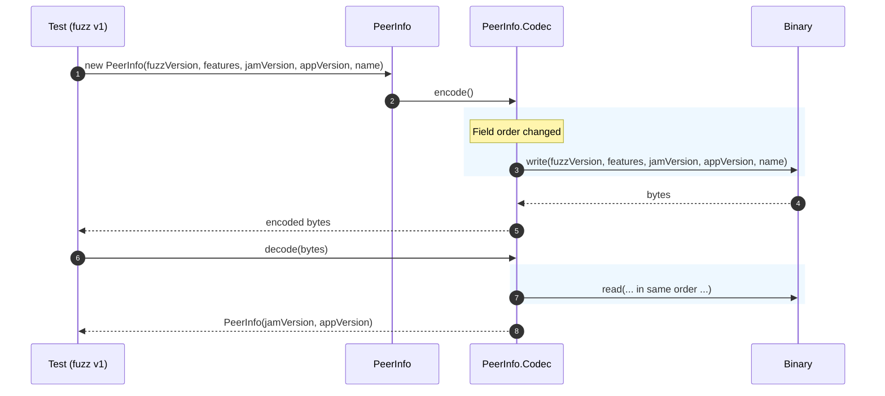

# Fuzzer fixes.

## Pull Request by @tomusdrw

- [x] Fix db opening in non-root docker container.
- [x] Fix app_version/jam_version order. 

## Comment by @coderabbitai[bot]

<!-- This is an auto-generated comment: summarize by coderabbit.ai -->
<!-- This is an auto-generated comment: skip review by coderabbit.ai -->

> [!IMPORTANT]
> ## Review skipped
> 
> Auto incremental reviews are disabled on this repository.
> 
> Please check the settings in the CodeRabbit UI or the `.coderabbit.yaml` file in this repository. To trigger a single review, invoke the `@coderabbitai review` command.
> 
> You can disable this status message by setting the `reviews.review_status` to `false` in the CodeRabbit configuration file.

<!-- end of auto-generated comment: skip review by coderabbit.ai -->

<!-- walkthrough_start -->

📝 Walkthrough

<!-- This is an auto-generated comment: release notes by coderabbit.ai -->

## Summary by CodeRabbit

- New Features
  - None.

- Refactor
  - Aligned IPC peer info version field order with the spec; no functional impact expected.

- Tests
  - Updated test fixtures to reflect the new version field order.

- Chores
  - Docker image now runs the application as a non-root user to enhance security.
  - Pinned native module dependency to an exact version for more reproducible builds.

<!-- end of auto-generated comment: release notes by coderabbit.ai -->
## Walkthrough
Introduces a non-root Docker user and runs build steps as that user. Reorders PeerInfo fields in IPC fuzz v1 (jamVersion before appVersion) and updates its codec and tests accordingly. Pins @typeberry/native dependency to an exact version in two package.json files.

## Changes
| Cohort / File(s) | Summary |
|---|---|
| **Containerization** `Dockerfile` | Adds non-root user `typeberry`, sets ownership of `/app`, switches to `USER typeberry`, and runs npm steps and entrypoint under that user. |
| **IPC Fuzz v1: PeerInfo field order** `extensions/ipc/fuzz/v1/types.ts`, `extensions/ipc/fuzz/v1/types.test.ts` | Swaps PeerInfo constructor/field order to jamVersion before appVersion; updates Codec mapping and create helper; adjusts test data/comments to match. |
| **Dependency pinning** `packages/core/crypto/package.json`, `packages/core/erasure-coding/package.json` | Pins `@typeberry/native` from `0.0.1-43eee4f` to `=0.0.1-43eee4f` in both packages. |

## Sequence Diagram(s)

## Estimated code review effort
🎯 3 (Moderate) | ⏱️ ~20 minutes

## Possibly related PRs
- FluffyLabs/typeberry#395 — Also updates dependency declarations in packages/core/erasure-coding/package.json; related to dependency management in the same package.

## Suggested reviewers
- skoszuta
- mateuszsikora

## Poem
> In a burrow of bytes I hop with cheer,  
> Swap jam before app—now the path is clear.  
> Pin native roots so builds don’t roam,  
> Run as non-root in my Docker home.  
> Thump-thump, encode—then off I go,  
> A tidy warren, in sequenced flow. 🐇✨

<!-- walkthrough_end -->

<!-- pre_merge_checks_walkthrough_start -->

## Pre-merge checks and finishing touches

✅ Passed checks (3 passed)

|     Check name     | Status   | Explanation                                                                                                                                                                                                                                                                                                                                                                   |
| :----------------: | :------- | :---------------------------------------------------------------------------------------------------------------------------------------------------------------------------------------------------------------------------------------------------------------------------------------------------------------------------------------------------------------------------- |
|     Title Check    | ✅ Passed | The title "Fuzzer fixes." is directly related to the primary changes in this PR—chiefly the swapped app_version/jam_version fields in the fuzz IPC types and tests and the Dockerfile change to support DB opening in a non-root container—so it concisely identifies the main area affected. It is short and clear for a reviewer scanning history, though slightly generic. |
|  Description Check | ✅ Passed | The PR description lists two checklist items that directly correspond to changes in the diff (fixing DB opening in a non-root Docker container and correcting the app_version/jam_version order), so it is related to the changeset and satisfies this lenient check. The level of detail required by this check is minimal and the description meets it.                     |
| Docstring Coverage | ✅ Passed | No functions found in the changes. Docstring coverage check skipped.                                                                                                                                                                                                                                                                                                          |

<!-- pre_merge_checks_walkthrough_end -->

<!-- tips_start -->

---

Comment `@coderabbitai help` to get the list of available commands and usage tips.

<!-- tips_end -->

<!-- internal state start -->

<!-- DwQgtGAEAqAWCWBnSTIEMB26CuAXA9mAOYCmGJATmriQCaQDG+Ats2bgFyQAOFk+AIwBWJBrngA3EsgEBPRvlqU0AgfFwA6NPEgQAfACgjoCEYDEZyAAUASpETZWaCrKPR1AGxJcAYtgBe/pSQAGbwAB7SGpCQBgByjgKUXABsAIwAnDEGAKo2ADJcsLi43IgcAPQVROqw2AIaTMwVPh7YISGy+SqIFbiy3CRJFC4V3NgeHhXpWbE5iMmQBMzYiLQUAO7ZAMr42BQMJJACVBgMsFy4tGBh4TcB/tnQzqS4x6fnXMzaWLHbuNRVlx8INfgYAMIUEjUOjoTiQABMAAYEQBWMBIjJgNKo6BIgDsHARhIRGQAWkYACLSBgUeDccT4DAcAxQHwRSC0AT8UHwDBEFBYDBMsAUfD4N60fAMADWwSYGABfMo0QAFOdRHLaABKVmQdnhdDcbgAfSkFEQ8CZFSEaGYZsolqZ/AoSgoao1sroutZYEMBhMUDI9HwIRwBGIZGUNHoTTYiq4vH4wlE4ikMnkTDdKjUmm0uj9AfAUDgqFQmHDhFI5CoMYUrHYXCoWwcThcx0zimUqnUWh0+iMRdMBkp0rlFDCXhZACJZwYLJAAIIASUjNZh9Fb33bocYsEwpEQRigy8VYto2EOyDQkGFGFF4req2CGDtsP6g2G7Y2tUgsBYRy0PAUJiPg7YVGgxqQKqNg5HEkDPlQtD0GA9AQVBYDMEsAxDJQLjahoeoAOKnLgyD4BsNaIAg3D8GG6G0QQ2Gfnh8hoCENB8Ew3CyHyArcGgspoIe0GwfB5wUVgYB2B+uEjPIDEEXq2w/rgGrILgsBHAI2DwB4tAVBQ2BYAqNDhG8TGaUcslfvIiGhGB9j1AsACO2DsPYNBlNBOTbAAojJOG2dqAA0jBoKsfG3twWEMPAYWIACFBvIgtL0m8gwUMwSBOlgaC0EIqy4PGuBhZg9BWZAflxNANgAJpWAA8suNVLPgkAkJEDB4Ecxluks+5Pgs7p6o15poJMZXIdet4imKEodV1eBWiZTJmW8GwIF4PBQsNEhRZ1SDiPyoR6Uc3HwNI6AYPQGAxYKiUTR41ArZ5JBlIRg4LouHicS9TIae1lVKAwz21it5Fhp13BgXWjnjAIHjwAwHWKuol1HnqcTtecB5XUx0Ow3QYz1EjKMg2D/0YIgn1+Yl8DfHWWZHFC+0kFsJAdLDXAALJ0PAjgGLO07HsOnU0NTEMVPSDAVCEDwVBIaR9DhNM0IlGhkTOc7fau1bRrCW7OPIu64/y0jHjA0iStQN5Mh4shcKeA1HNO1F7PpqPM4tdrcNtIRilhiCDAw05LNbYWVcHog+8wfskAA5NexoOhar3lZAtr2uauXoFC9gbJBgy0NEcDnV2s1bAqiVGWIyBWCQlCniE7WqbAmd2gAao6r1hBabyqt8QiOUiYXZcKfBpGFAlqe3CIAMzatd9BF93afOgsCr0IPaDD3wo+QOPjn4tP1DnJASJL3yiXQiGYaVbwJD7Xs5GuiqMBaU5Ix7DdUVxh5iMxychpHSNQJ0o4h0gAAKW2I1eCqBsDcFoBudADAmCuj4g7Uun9oaplhFpQ0SNyCQChN8a+Lt7BvkFBQoCHRPpQGxjtRQl5GQYBJojZGS4rDLj3HjZASgaBiDoAAbn4BgB24dEqcltnLCIuB9hXQ2JQI4+VCo3xLoOeclgfp/VYYDGhohKZ6LootGGyVYTw1Jpw9g6MLYGDpuIRmsJvas0uhzLmyVeb80FsLUWYAjDizILlXoMs5YKyVirQYatyhCx1tovWUZayG0cNuE2YYzaHiMA3JuGAW6VwQgsGaiBC7GlhGEEgnswL9RbnwVePdnQZyzmvXK0Rtgh3gGEBgT1ZCR0/tXXAtcCB8AElQNgnEXT9QyVdAOLBoLy0CM0laYUQjQnkbtMqxpFlMjCk0+pGAwqvjYEvJiqp5n+C2fs0IqyFGIB2V3PZGzuAXIOW+AikBwQAxIG5dgDtelHARmTU6FT6AU2cFTZAUIqnBDqevLATFpTdVqRxYIuzYXYKOI9cQKMPkg0PkXKKCCkEoKYlCEIXgxADVQOQLY5TKlvz4KqGFudhQ0vwJMCiyBUW5TeWXRgUIYR/gqZlQAmATIGvgCNGVMUDIEQcgusTEBKIE5fc2FxxOZgRUZsvZbV0BIyIFgNuFDqUKGpgMlhjlLT6sBFCT65htG/WjBDHVwNDFguMbuQm5iQzDKsSjGx4g7FQG2PAK1azepEpjFwAABtkigzd8BRpNTXc1wywVjOCFCri+5zb0D5JAKNgTJYA2ltwWWZzFbK1ktExNMysJRtOQ8C5XAcgAA5lnXN2s2+eCJHlNsgM8juzA+0DsOd4TydJ+TakTUxetZy+2tvbda6QXae2DuHQ8o0Ty9lcBHW+LgNc+JTstsG0NCiEIRroFwKwvqgWe1BeDAGJCSCZthHmgt5kglS1CeWiJVbNaIETYgIGg181MpWom1A97YTsXGVGrl4HoLwA0CQDQfyJkZvvn056SrRU8BvbS2gyApk6mPSG18Ybz1ysvfm2N8aNA4tEIm74xooqypQW+wtwSS1lvCZW1W/7p3tTIMzCoIMK6Gsqsagj6GGV+0ElFKNYGmSJpg8EODKrcpRp9A4hmKCXFPzcR1Dx8I+ZAR8XOX0/iDACSEoeCo6CSD2ZcAyfAYxBIymEihoQQHmSxJFrrNcBtNwpONiYqZmNwTZtIBVT+ShQRKDOPIaOKMamQAAAI2VYhUcjkgjh5psx5uzDmnMDAIG52zXmfOhEDpAacSIND1bSGAAALPPRuJBmshDDkxacABeerjWWttcbp1sOjLkLQcgF4fKUVetvMYRKLSfA4vBmExjF0JqJZvGI7arRS4HUPups62LrrDuQ1MUTb1eGOF+rRgGzGDCmQoaMDppxsYK6uPZkZmpJnvHMD834owBXPO9GK8oBwUIwBZj4uVwrlWmTa38/EwLSTgttjSbw82D3IDO2B0VjVFRwcKKh4oGHeP4eXJdfF4T8hpwZaCllnLUgw7heq7MurDWNBNda+10bOq+sDa50N3nXXqFU9W2cdbm9WFTSAidCs0MybqFq71sOIJoyOQVXmyqnVBJvBzitaIC2rLLfehLuKV1nBHGYKT8pGivr2t0U6yyJ3QZuqdR68IZi4Y+pu6jcQ93LbUmp4l4BbvDuUY3NG+nLF5LZZelICDWAo3k9BwTonkPof8lh55jQ3nlNs7rRzwbPORtdcE/mgXnPufDY6+Xl79M3sKCUE+tm7ifteLM/93xvp/SBlRnfSsKO9MsBKk2NALYQvtjkM37suY+wFkMP3uM6gTTwEIyaT7SjaAmkeslRfxhiyQAyPPNIaA0Bn9RKiDI+JmtIhCPiBEAh8T34YKiO/Ag2spAEC2kIXT8QpBoL4gkBZADhDhQAr64Br4b5b50AmjBgH796PwmhsAUCkAmiegyiIC75JRvBgEADeBgMQ04SAtgAAQh4GOHQB8g2IqFYPgOotOFwCEBNAsCFEQbVu7BMLQBQWOLYEwaEKwSQOwcQUgGNHhOvglgISwR4GwRwdOEBLQDYMZKOAwP8BOkQIgJFpqAIWasIfIYocoRgO4LgF4NobKLoUZPocQYYSoSAulCtOYTKJYe5CIbVkQlqMuEqu5IgOoQIbOG4dONhrgE4TYNIBMGRAIQANocExCEExAJG1aYFxBvj+EmHbROHThuGJFuwAjyKIAuHWGJG1aK6YBUxpGfwB7bQAA604fggQwQtwUQtR0qnIwEqYEiUIz08qwG/ydIqSmOIk2uCA9cNggAKATnCXRkryBRwlLFybqpy5Q2h2iLG9yXT6RipwqfxnI45WDgjMSW43SSJkTLwUKqHjiTjnRRbWTtQODGiwyQCUhkE8hkAEp5SzT3jzTbZrQ/CUBjFAYoDfGS4LASLr42LlIaSfxkJ5T8roAdB4Ilw45vCoDuz74ZygzQh8CpY3iwF8CpSYAYBRQjFDI9IDR7BEDtyIB6rFASL6x0gMAaBZGxEJHTi7RsrLRMj+EfKSz9Q3g275zJYdKcJVFHCnKOS65xxeBhS1FnLMEchFzLFYQG7OiZqnF3gPgLTnHBBPEvEYC1HHLtQMy8D4BSBtGpQmndh6TqDyB5rElgSyCMnZEsk25KD+GFwUCEn8hMnFG1YgRMhhBEAKLSFCFOnEFgQhp8gTROEpFsD+EikiyJEAC+Tp8RxR04yRqRXA041IqUdIDIr0mRoZnBeRqwhRRZ04pROWnJWZvKtgwCuZDhzoSMiUGkGwOMWksozZyJNAzAkJ1AbRIEphnYIw0gMMRxTErOwxgEHSYYpyEQUUOp6unpAoeaN46pXxjxVBXEPxyotSRx6Cg5UUlURcqx1oWcp5WAmaoU9ghpyJEKFSxKvRgx0gJAbwGciAL0iAEJlKyAXghJHkmB6KU2T8FSJiAi2gHgT6bk7R9AM+mkqAmBrR48umkFGcLqDZ+ZzobAr5Yqmg3paZbJbQrC/hjUmFr4kw8g0MaFJ2GFrCOqJwUxEimK1kn8h2E0KiRxXZkAcobE8JQi9Alx+iWkHgtEuJyA0FnZdkN0joEqMWGK3EKG+FORLpJAbpzgy5SlLJfpuSIaQZzBIZzJYZdINQ5F0ZmZtWSgtFK0CZCRyZzJqZORGZsZWZqhB6J0Hy40pAmlxBmKpZlwVh5ZlZ5RWZjC8sZwxiLcfUYufS1xNMm5DAblAoTAnlVxmo9gMo9IxcjphltWKlalHpfE3ltW4ZJlUZHZMoMZqlWZUoCVAyfEBRzJiZHBAAuoEcEbYDmWlGRf4VAFEeEM1fqByFyLqW8R8RqZKFuZtr8e6NURQNUfeJAH1QNQaAscqWwueWtTJtlcQe1TYOkVVbVvUUEFiREFECLE1eATtCQCgZQOgZgdgQgfoEAA=== -->

<!-- internal state end -->

## Comment by @github-actions[bot]

View all

| File | Benchmark | Ops |  |
|------|-----------|-----|--|
| [collections/map-set.ts[0]](../blob/d6635bcfd19ec021e8af30dd562a2a94da9e1c31//_work/typeberry-runner-5/typeberry/typeberry/benchmarks/collections/map-set.ts) | 2 gets + conditional set | 70371.8 ±0.24% | fastest ✅ |
| [collections/map-set.ts[1]](../blob/d6635bcfd19ec021e8af30dd562a2a94da9e1c31//_work/typeberry-runner-5/typeberry/typeberry/benchmarks/collections/map-set.ts) | 1 get 1 set | 41537.72 ±0.17% | 40.97% slower |
| [codec/decoding.ts[0]](../blob/d6635bcfd19ec021e8af30dd562a2a94da9e1c31//_work/typeberry-runner-5/typeberry/typeberry/benchmarks/codec/decoding.ts) | manual decode | 21993600.65 ±0.77% | 88.27% slower |
| [codec/decoding.ts[1]](../blob/d6635bcfd19ec021e8af30dd562a2a94da9e1c31//_work/typeberry-runner-5/typeberry/typeberry/benchmarks/codec/decoding.ts) | int32array decode | 186649348.48 ±4.4% | 0.45% slower |
| [codec/decoding.ts[2]](../blob/d6635bcfd19ec021e8af30dd562a2a94da9e1c31//_work/typeberry-runner-5/typeberry/typeberry/benchmarks/codec/decoding.ts) | dataview decode | 187497895.12 ±4% | fastest ✅ |
| [codec/encoding.ts[0]](../blob/d6635bcfd19ec021e8af30dd562a2a94da9e1c31//_work/typeberry-runner-5/typeberry/typeberry/benchmarks/codec/encoding.ts) | manual encode | 3159088.17 ±0.75% | 15.52% slower |
| [codec/encoding.ts[1]](../blob/d6635bcfd19ec021e8af30dd562a2a94da9e1c31//_work/typeberry-runner-5/typeberry/typeberry/benchmarks/codec/encoding.ts) | int32array encode | 3739658.45 ±0.95% | fastest ✅ |
| [codec/encoding.ts[2]](../blob/d6635bcfd19ec021e8af30dd562a2a94da9e1c31//_work/typeberry-runner-5/typeberry/typeberry/benchmarks/codec/encoding.ts) | dataview encode | 3428358.24 ±1.88% | 8.32% slower |
| [math/add_one_overflow.ts[0]](../blob/d6635bcfd19ec021e8af30dd562a2a94da9e1c31//_work/typeberry-runner-5/typeberry/typeberry/benchmarks/math/add_one_overflow.ts) | add and take modulus | 261061133.9 ±4.48% | fastest ✅ |
| [math/add_one_overflow.ts[1]](../blob/d6635bcfd19ec021e8af30dd562a2a94da9e1c31//_work/typeberry-runner-5/typeberry/typeberry/benchmarks/math/add_one_overflow.ts) | condition before calculation | 248573800.32 ±6.58% | 4.78% slower |
| [math/count-bits-u32.ts[0]](../blob/d6635bcfd19ec021e8af30dd562a2a94da9e1c31//_work/typeberry-runner-5/typeberry/typeberry/benchmarks/math/count-bits-u32.ts) | standard method | 77157770.51 ±1.76% | 68.24% slower |
| [math/count-bits-u32.ts[1]](../blob/d6635bcfd19ec021e8af30dd562a2a94da9e1c31//_work/typeberry-runner-5/typeberry/typeberry/benchmarks/math/count-bits-u32.ts) | magic | 242967570.42 ±5.82% | fastest ✅ |
| [math/count-bits-u64.ts[0]](../blob/d6635bcfd19ec021e8af30dd562a2a94da9e1c31//_work/typeberry-runner-5/typeberry/typeberry/benchmarks/math/count-bits-u64.ts) | standard method | 1169616.93 ±1.21% | 88.42% slower |
| [math/count-bits-u64.ts[1]](../blob/d6635bcfd19ec021e8af30dd562a2a94da9e1c31//_work/typeberry-runner-5/typeberry/typeberry/benchmarks/math/count-bits-u64.ts) | magic | 10100402.77 ±1.45% | fastest ✅ |
| [math/mul_overflow.ts[0]](../blob/d6635bcfd19ec021e8af30dd562a2a94da9e1c31//_work/typeberry-runner-5/typeberry/typeberry/benchmarks/math/mul_overflow.ts) | multiply and bring back to u32 | 263383732.8 ±4.83% | fastest ✅ |
| [math/mul_overflow.ts[1]](../blob/d6635bcfd19ec021e8af30dd562a2a94da9e1c31//_work/typeberry-runner-5/typeberry/typeberry/benchmarks/math/mul_overflow.ts) | multiply and take modulus | 259343659.13 ±4.82% | 1.53% slower |
| [math/switch.ts[0]](../blob/d6635bcfd19ec021e8af30dd562a2a94da9e1c31//_work/typeberry-runner-5/typeberry/typeberry/benchmarks/math/switch.ts) | switch | 244791102.71 ±5.77% | fastest ✅ |
| [math/switch.ts[1]](../blob/d6635bcfd19ec021e8af30dd562a2a94da9e1c31//_work/typeberry-runner-5/typeberry/typeberry/benchmarks/math/switch.ts) | if | 239499118.13 ±6.67% | 2.16% slower |
| [hash/index.ts[0]](../blob/d6635bcfd19ec021e8af30dd562a2a94da9e1c31//_work/typeberry-runner-5/typeberry/typeberry/benchmarks/hash/index.ts) | hash with numeric representation | 179.66 ±0.32% | 22.57% slower |
| [hash/index.ts[1]](../blob/d6635bcfd19ec021e8af30dd562a2a94da9e1c31//_work/typeberry-runner-5/typeberry/typeberry/benchmarks/hash/index.ts) | hash with string representation | 108.81 ±1.23% | 53.1% slower |
| [hash/index.ts[2]](../blob/d6635bcfd19ec021e8af30dd562a2a94da9e1c31//_work/typeberry-runner-5/typeberry/typeberry/benchmarks/hash/index.ts) | hash with symbol representation | 160.88 ±0.86% | 30.66% slower |
| [hash/index.ts[3]](../blob/d6635bcfd19ec021e8af30dd562a2a94da9e1c31//_work/typeberry-runner-5/typeberry/typeberry/benchmarks/hash/index.ts) | hash with uint8 representation | 157.22 ±0.48% | 32.24% slower |
| [hash/index.ts[4]](../blob/d6635bcfd19ec021e8af30dd562a2a94da9e1c31//_work/typeberry-runner-5/typeberry/typeberry/benchmarks/hash/index.ts) | hash with packed representation | 232.02 ±0.45% | fastest ✅ |
| [hash/index.ts[5]](../blob/d6635bcfd19ec021e8af30dd562a2a94da9e1c31//_work/typeberry-runner-5/typeberry/typeberry/benchmarks/hash/index.ts) | hash with bigint representation | 164.6 ±1.11% | 29.06% slower |
| [hash/index.ts[6]](../blob/d6635bcfd19ec021e8af30dd562a2a94da9e1c31//_work/typeberry-runner-5/typeberry/typeberry/benchmarks/hash/index.ts) | hash with uint32 representation | 185.69 ±1.57% | 19.97% slower |
| [bytes/hex-to.ts[0]](../blob/d6635bcfd19ec021e8af30dd562a2a94da9e1c31//_work/typeberry-runner-5/typeberry/typeberry/benchmarks/bytes/hex-to.ts) | number toString + padding | 314278.12 ±1.03% | fastest ✅ |
| [bytes/hex-to.ts[1]](../blob/d6635bcfd19ec021e8af30dd562a2a94da9e1c31//_work/typeberry-runner-5/typeberry/typeberry/benchmarks/bytes/hex-to.ts) | manual | 14633.37 ±3.34% | 95.34% slower |
| [bytes/hex-from.ts[0]](../blob/d6635bcfd19ec021e8af30dd562a2a94da9e1c31//_work/typeberry-runner-5/typeberry/typeberry/benchmarks/bytes/hex-from.ts) | parse hex using `Number` with NaN checking | 128970.35 ±0.86% | 83.65% slower |
| [bytes/hex-from.ts[1]](../blob/d6635bcfd19ec021e8af30dd562a2a94da9e1c31//_work/typeberry-runner-5/typeberry/typeberry/benchmarks/bytes/hex-from.ts) | parse hex from char codes | 788955.18 ±1.29% | fastest ✅ |
| [bytes/hex-from.ts[2]](../blob/d6635bcfd19ec021e8af30dd562a2a94da9e1c31//_work/typeberry-runner-5/typeberry/typeberry/benchmarks/bytes/hex-from.ts) | parse hex from string nibbles | 517478.72 ±1.92% | 34.41% slower |
| [codec/bigint.compare.ts[0]](../blob/d6635bcfd19ec021e8af30dd562a2a94da9e1c31//_work/typeberry-runner-5/typeberry/typeberry/benchmarks/codec/bigint.compare.ts) | compare custom | 256853754.48 ±6.67% | 2.99% slower |
| [codec/bigint.compare.ts[1]](../blob/d6635bcfd19ec021e8af30dd562a2a94da9e1c31//_work/typeberry-runner-5/typeberry/typeberry/benchmarks/codec/bigint.compare.ts) | compare bigint | 264761362.15 ±5.01% | fastest ✅ |
| [codec/bigint.decode.ts[0]](../blob/d6635bcfd19ec021e8af30dd562a2a94da9e1c31//_work/typeberry-runner-5/typeberry/typeberry/benchmarks/codec/bigint.decode.ts) | decode custom | 215006421.25 ±3.76% | fastest ✅ |
| [codec/bigint.decode.ts[1]](../blob/d6635bcfd19ec021e8af30dd562a2a94da9e1c31//_work/typeberry-runner-5/typeberry/typeberry/benchmarks/codec/bigint.decode.ts) | decode bigint | 105569403.95 ±2.5% | 50.9% slower |
| [logger/index.ts[0]](../blob/d6635bcfd19ec021e8af30dd562a2a94da9e1c31//_work/typeberry-runner-5/typeberry/typeberry/benchmarks/logger/index.ts) | console.log with string concat | 6133131.78 ±61.23% | fastest ✅ |
| [logger/index.ts[1]](../blob/d6635bcfd19ec021e8af30dd562a2a94da9e1c31//_work/typeberry-runner-5/typeberry/typeberry/benchmarks/logger/index.ts) | console.log with args | 1345926.6 ±81.8% | 78.05% slower |
| [bytes/compare.ts[0]](../blob/d6635bcfd19ec021e8af30dd562a2a94da9e1c31//_work/typeberry-runner-5/typeberry/typeberry/benchmarks/bytes/compare.ts) | Comparing Uint32 bytes | 313.95 ±65.15% | 98.14% slower |
| [bytes/compare.ts[1]](../blob/d6635bcfd19ec021e8af30dd562a2a94da9e1c31//_work/typeberry-runner-5/typeberry/typeberry/benchmarks/bytes/compare.ts) | Comparing raw bytes | 16885.01 ±0.98% | fastest ✅ |
| [hash/blake2b.ts[0]](../blob/d6635bcfd19ec021e8af30dd562a2a94da9e1c31//_work/typeberry-runner-5/typeberry/typeberry/benchmarks/hash/blake2b.ts) | hasher with simple allocator | 0.044 ±3.16% | fastest ✅ |
| [hash/blake2b.ts[1]](../blob/d6635bcfd19ec021e8af30dd562a2a94da9e1c31//_work/typeberry-runner-5/typeberry/typeberry/benchmarks/hash/blake2b.ts) | hasher with page allocator | 0.043 ±3.21% | 2.27% slower |
| [codec/view_vs_collection.ts[0]](../blob/d6635bcfd19ec021e8af30dd562a2a94da9e1c31//_work/typeberry-runner-5/typeberry/typeberry/benchmarks/codec/view_vs_collection.ts) | Get first element from Decoded | 17630.19 ±11.24% | 71.64% slower |
| [codec/view_vs_collection.ts[1]](../blob/d6635bcfd19ec021e8af30dd562a2a94da9e1c31//_work/typeberry-runner-5/typeberry/typeberry/benchmarks/codec/view_vs_collection.ts) | Get first element from View | 62172.7 ±1.46% | fastest ✅ |
| [codec/view_vs_collection.ts[2]](../blob/d6635bcfd19ec021e8af30dd562a2a94da9e1c31//_work/typeberry-runner-5/typeberry/typeberry/benchmarks/codec/view_vs_collection.ts) | Get 50th element from Decoded | 24849.39 ±1.97% | 60.03% slower |
| [codec/view_vs_collection.ts[3]](../blob/d6635bcfd19ec021e8af30dd562a2a94da9e1c31//_work/typeberry-runner-5/typeberry/typeberry/benchmarks/codec/view_vs_collection.ts) | Get 50th element from View | 32453.68 ±2.05% | 47.8% slower |
| [codec/view_vs_collection.ts[4]](../blob/d6635bcfd19ec021e8af30dd562a2a94da9e1c31//_work/typeberry-runner-5/typeberry/typeberry/benchmarks/codec/view_vs_collection.ts) | Get last element from Decoded | 24832.74 ±1.96% | 60.06% slower |
| [codec/view_vs_collection.ts[5]](../blob/d6635bcfd19ec021e8af30dd562a2a94da9e1c31//_work/typeberry-runner-5/typeberry/typeberry/benchmarks/codec/view_vs_collection.ts) | Get last element from View | 23155.03 ±2.47% | 62.76% slower |
| [codec/view_vs_object.ts[0]](../blob/d6635bcfd19ec021e8af30dd562a2a94da9e1c31//_work/typeberry-runner-5/typeberry/typeberry/benchmarks/codec/view_vs_object.ts) | Get the first field from Decoded | 434626.91 ±0.92% | 1.43% slower |
| [codec/view_vs_object.ts[1]](../blob/d6635bcfd19ec021e8af30dd562a2a94da9e1c31//_work/typeberry-runner-5/typeberry/typeberry/benchmarks/codec/view_vs_object.ts) | Get the first field from View | 94535.2 ±1.36% | 78.56% slower |
| [codec/view_vs_object.ts[2]](../blob/d6635bcfd19ec021e8af30dd562a2a94da9e1c31//_work/typeberry-runner-5/typeberry/typeberry/benchmarks/codec/view_vs_object.ts) | Get the first field as view from View | 91500.94 ±1.37% | 79.25% slower |
| [codec/view_vs_object.ts[3]](../blob/d6635bcfd19ec021e8af30dd562a2a94da9e1c31//_work/typeberry-runner-5/typeberry/typeberry/benchmarks/codec/view_vs_object.ts) | Get two fields from Decoded | 440922.93 ±0.3% | fastest ✅ |
| [codec/view_vs_object.ts[4]](../blob/d6635bcfd19ec021e8af30dd562a2a94da9e1c31//_work/typeberry-runner-5/typeberry/typeberry/benchmarks/codec/view_vs_object.ts) | Get two fields from View | 69014.4 ±1.27% | 84.35% slower |
| [codec/view_vs_object.ts[5]](../blob/d6635bcfd19ec021e8af30dd562a2a94da9e1c31//_work/typeberry-runner-5/typeberry/typeberry/benchmarks/codec/view_vs_object.ts) | Get two fields from materialized from View | 157610.98 ±1.55% | 64.25% slower |
| [codec/view_vs_object.ts[6]](../blob/d6635bcfd19ec021e8af30dd562a2a94da9e1c31//_work/typeberry-runner-5/typeberry/typeberry/benchmarks/codec/view_vs_object.ts) | Get two fields as views from View | 70363.24 ±1.98% | 84.04% slower |
| [codec/view_vs_object.ts[7]](../blob/d6635bcfd19ec021e8af30dd562a2a94da9e1c31//_work/typeberry-runner-5/typeberry/typeberry/benchmarks/codec/view_vs_object.ts) | Get only third field from Decoded | 428544.26 ±0.7% | 2.81% slower |
| [codec/view_vs_object.ts[8]](../blob/d6635bcfd19ec021e8af30dd562a2a94da9e1c31//_work/typeberry-runner-5/typeberry/typeberry/benchmarks/codec/view_vs_object.ts) | Get only third field from View | 94382.51 ±1.17% | 78.59% slower |
| [codec/view_vs_object.ts[9]](../blob/d6635bcfd19ec021e8af30dd562a2a94da9e1c31//_work/typeberry-runner-5/typeberry/typeberry/benchmarks/codec/view_vs_object.ts) | Get only third field as view from View | 89632.23 ±1.18% | 79.67% slower |
| [collections/map_vs_sorted.ts[0]](../blob/d6635bcfd19ec021e8af30dd562a2a94da9e1c31//_work/typeberry-runner-5/typeberry/typeberry/benchmarks/collections/map_vs_sorted.ts) | Map | 262918.01 ±0.34% | fastest ✅ |
| [collections/map_vs_sorted.ts[1]](../blob/d6635bcfd19ec021e8af30dd562a2a94da9e1c31//_work/typeberry-runner-5/typeberry/typeberry/benchmarks/collections/map_vs_sorted.ts) | Map-array | 103155.97 ±0.17% | 60.76% slower |
| [collections/map_vs_sorted.ts[2]](../blob/d6635bcfd19ec021e8af30dd562a2a94da9e1c31//_work/typeberry-runner-5/typeberry/typeberry/benchmarks/collections/map_vs_sorted.ts) | Array | 81742.38 ±1.26% | 68.91% slower |
| [collections/map_vs_sorted.ts[3]](../blob/d6635bcfd19ec021e8af30dd562a2a94da9e1c31//_work/typeberry-runner-5/typeberry/typeberry/benchmarks/collections/map_vs_sorted.ts) | SortedArray | 197544.23 ±0.4% | 24.86% slower |
| [crypto/ed25519.ts[0]](../blob/d6635bcfd19ec021e8af30dd562a2a94da9e1c31//_work/typeberry-runner-5/typeberry/typeberry/benchmarks/crypto/ed25519.ts) | native crypto | 7.87 ±3.79% | 73.58% slower |
| [crypto/ed25519.ts[1]](../blob/d6635bcfd19ec021e8af30dd562a2a94da9e1c31//_work/typeberry-runner-5/typeberry/typeberry/benchmarks/crypto/ed25519.ts) | wasm lib | 10.82 ±0.99% | 63.68% slower |
| [crypto/ed25519.ts[2]](../blob/d6635bcfd19ec021e8af30dd562a2a94da9e1c31//_work/typeberry-runner-5/typeberry/typeberry/benchmarks/crypto/ed25519.ts) | wasm lib batch | 29.79 ±2.06% | fastest ✅ |

### Benchmarks summary: 63/63 OK ✅

<!-- thollander/actions-comment-pull-request "benchmarks" -->
