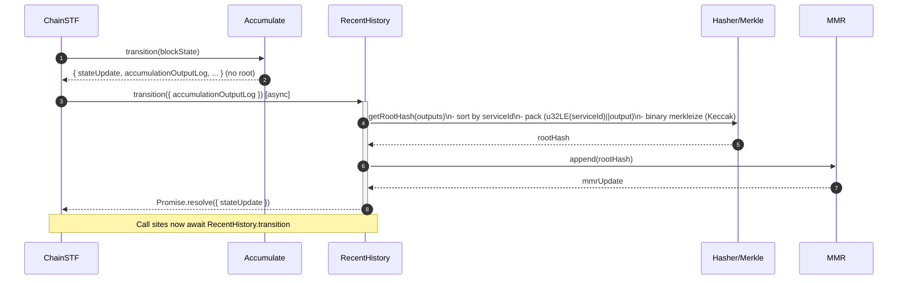

# Move root hash calculation to recent blocks

## Pull Request by @mateuszsikora

We don't need to calculate root hash in accumulation anymore so I moved it to recent blocks where we need this hash


## Comment by @coderabbitai[bot]

<!-- This is an auto-generated comment: summarize by coderabbit.ai -->
<!-- This is an auto-generated comment: skip review by coderabbit.ai -->

> [!IMPORTANT]
> ## Review skipped
> 
> Auto incremental reviews are disabled on this repository.
> 
> Please check the settings in the CodeRabbit UI or the `.coderabbit.yaml` file in this repository. To trigger a single review, invoke the `@coderabbitai review` command.
> 
> You can disable this status message by setting the `reviews.review_status` to `false` in the CodeRabbit configuration file.

<!-- end of auto-generated comment: skip review by coderabbit.ai -->

<!-- walkthrough_start -->

<details>
<summary>📝 Walkthrough</summary>

<!-- This is an auto-generated comment: release notes by coderabbit.ai -->

## Summary by CodeRabbit

* **Refactor**
  * Public accumulation output no longer exposes a root; consumers now receive an accumulation output log.
  * RecentHistory now accepts an accumulation output log instead of a single root and computes the root internally in a deterministic way.
  * RecentHistory.transition is asynchronous; update call sites to await results.
  * Internal integrations updated to use the new output log.

* **Documentation**
  * Updated type and input descriptions to reflect the new accumulation output log and root derivation behavior.

<!-- end of auto-generated comment: release notes by coderabbit.ai -->
## Walkthrough
The Accumulate transition no longer computes/returns a root. Call sites and types are updated to pass accumulationOutputLog instead. RecentHistory now accepts accumulationOutputLog, computes a root internally via deterministic merkleization, and its transition is async. Tests are updated accordingly, and chain-stf awaits RecentHistory.transition with the new input.

## Changes
| Cohort / File(s) | Summary |
|---|---|
| **Accumulate API: remove root from result**<br>`packages/jam/transition/accumulate/accumulate-state.ts`, `packages/jam/transition/accumulate/accumulate.ts` | Removes `root`/`AccumulateRoot` from `AccumulateResult`; deletes root hash computation and related helpers/imports. Public result now exposes `stateUpdate`, `accumulationStatistics`, `pendingTransfers`, `accumulationOutputLog` only. |
| **RecentHistory refactor: derive root from outputs; async**<br>`packages/jam/transition/recent-history.ts` | Changes `RecentHistoryInput` to `accumulationOutputLog: AccumulationOutput[]`. Adds `getRootHash` to merkleize sorted outputs; appends computed root to MMR. Makes `transition` async and returns `Promise<RecentHistoryStateUpdate>`. Updates imports/types. |
| **Chain STF integration**<br>`packages/jam/transition/chain-stf.ts` | Stops using `accumulateRoot`; passes `accumulationOutputLog` to `recentHistory.transition` and awaits it. |
| **Tests alignment**<br>`packages/jam/transition/accumulate/accumulate.test.ts`, `packages/jam/transition/recent-history.test.ts` | Update expectations to use `accumulationOutputLog` instead of root. Import `AccumulationOutput`, `tryAsServiceId`, and `deepEqual`. Make `recentHistory.transition` awaited; refresh deterministic expected hashes/peaks. |

## Sequence Diagram(s)


## Estimated code review effort
🎯 4 (Complex) | ⏱️ ~60 minutes

## Possibly related PRs
- FluffyLabs/typeberry#585 — Shifts accumulation flow toward per-service outputs and updates cross-module types; closely aligns with replacing root with accumulationOutputLog here.
- FluffyLabs/typeberry#400 — Introduced/modified root computation and related helpers; directly related as this PR removes that root surface.
- FluffyLabs/typeberry#529 — Adjusts accumulation pipeline and propagation to consumers; overlaps with changes to accumulate.ts and chain-stf interactions.

## Suggested reviewers
- tomusdrw
- skoszuta
- DrEverr

## Poem
> I hop through logs where roots once grew,  
> Now leaves of outputs line my view.  
> I sort, I pack, I hash—Kerchunk!  
> A mountain range from bytes is sunk.  
> Async winds hum, “await the peak,”  
> Carrots merkle’d, tidy and sleek. 🥕

</details>

<!-- walkthrough_end -->

<!-- pre_merge_checks_walkthrough_start -->

## Pre-merge checks and finishing touches
<details>
<summary>✅ Passed checks (3 passed)</summary>

|     Check name     | Status   | Explanation                                                                                                                                                                                                                                                                                                                              |
| :----------------: | :------- | :--------------------------------------------------------------------------------------------------------------------------------------------------------------------------------------------------------------------------------------------------------------------------------------------------------------------------------------- |
|     Title Check    | ✅ Passed | The title succinctly describes the primary change: relocating root-hash computation from accumulation to later ("recent blocks"), which matches the raw summaries showing removal of root from accumulation and addition of root computation in recent-history; it is concise, specific, and relevant for reviewers scanning PR history. |
|  Description Check | ✅ Passed | The description plainly states that root hash calculation was removed from accumulation and moved to recent blocks, which directly reflects the changes in the diff and test updates; while brief, it is on-topic and sufficient for this lenient check.                                                                                 |
| Docstring Coverage | ✅ Passed | Docstring coverage is 100.00% which is sufficient. The required threshold is 80.00%.                                                                                                                                                                                                                                                     |

</details>

<!-- pre_merge_checks_walkthrough_end -->

<!-- tips_start -->

---


<sub>Comment `@coderabbitai help` to get the list of available commands and usage tips.</sub>

<!-- tips_end -->

<!-- internal state start -->


<!-- DwQgtGAEAqAWCWBnSTIEMB26CuAXA9mAOYCmGJATmriQCaQDG+Ats2bgFyQAOFk+AIwBWJBrngA3EsgEBPRvlqU0AgfFwA6NPEgQAfACgjoCEYDEZyAAUASpETZWaCrI5Ho6gDYkuAWXxSkBT4+LiQsGiIsIxongzYntTw+FgEQaLskAKe+AwA1siQBgByjgKUXABsAEyVkEUAqjYAMlywuLjciBwA9D1E6rDYAhpMzD0AYp7YAGYzss0qiD24stwk5RQuPdwJnj01dY2IFZDM1CTYiABeiPB5+FT1BgDK+NgUDCRZVBgMsFxmIgwHdmNxPPB5mA0Ax4swEkkUmB3p08M9oM5SGEBL9/oDtFgii9cNQrlx8OtCQYbCQJPASAB3SjdSAEeGIWgUBnPRblTwsgAUGBSJAAlM8AMIUEgXejULjVAAM1QArGBFQBOMAARhV0G11Q4ABZDSaAFpGAAi0gYFHg3HEKS4cG+u08nnSAEdsNIwtLmAFpEEQmEIlEYnEEY6sDNgsxWbBvjC4VHklhEDRuOgMPRpTkGBdkLgImEC5HEtHWfh0l8MNj8wVIAzE9KE98w9FUOQ6HQNEZ9MZwFAyPR8DMcARiGRlDR6GM2HWuLx+MJROIpDJ5EwlFRVOotDoByYoHBUKhMBPCKRyFRZwpWOwuFRuQ4nC4slvFMo95ptLowIYg6mAY3AwnkaCkMsQhoOMuC/Hc0Y9MmjhRiQSGwihFYkCCJI0BouDdAYABEJEGBYkAAIIAJJTjesr2I45zvmOjARBgkH9pANIBlI9DFt8wShJAMz0p49CxiwbaURh8JYTSDieGEqzrBo0kpnJ0gJGEwrcvAfzTEoyAZhcDTcLQFwADToDJqYpMSSQZvADCIFZlK0HpRDQPBMzMlZmByjZFZpgA8nguy4M0+BEAA3FJgmcGpmEXDYIbCaJ9BdtWOTsZQPDOGELH8TwwwQgwrJrCQfZGGRlgUYpM5pkW1ZFUoDCJLejX8OOJAAB7cI8d6PMV2ROZA7DqPSiCcRM6XpDxdBcAABvFXAUYFyUhtFi3CXG5XrJAi1repyWaYp216QdoH5BB0g9NBsHwRNKTocdNAvUlNA4Rc+GIItRgAKKOecd7bgJtL0tyJBzANfh0PAjjEaRBgQGARhXeBkF3TBKyPYhyGyRc70E3hNAZj9bgkURNWUTR14znQDFvvILH/JgHHIzAvppd4rFs98F3ozdUHY3BmAIWmROoZLWH4b65OQDpKBggNRYVYlxMhWFaL+ZAVxBuoVZ7d8RX47ZWAouFiB9ieiZjX1a4MxbaKK3ryAXiQYKrOgWxoPIykM5E6tm6FqK4AA2gAuigGAZjKo7jgAQrIpMaNclD4AKAASFEvJnAD6LxUWa/2itbMC25EJwUJWiAMuo/wMxJ8ZjKBdrsfwWuaPgeQaPFhst84Hkd6HGjd1o63RiH4WRUQ6BEASGZSeQkOe/IvXrGIdBT9rPuyGXLqsr6gCYBMggZUO6wk5Ny/oL1JiAwSQsUpJ4fu207YQ5EQAztySFBYtmGUCJ7SHqzHKtAqrmFqvVDqKQmpSVau1REMcup236tXR2fBdgjTKuNcQ0hOJUWVtXdAtAlC0C4P7IOQUUjbzCE3SAAABf2mxtjGRoNHPK11Mb3RxmLJ6GBpaE1NjLUmmgCJl0imWSACDnBIN5mArg68Ha0FoQrfA3IZHSjlMgI6H1Nah0jpAAUTAY5hCUZvFRndVoT30eFQxABeSAkdRRWWlOCGEQ8iq8HBu8ZAScU5p2CFnHO+dC7F3FFcG6VVAbiGBgzUG6Q6SMjGtDausN3II0pv2YCgtuEi1xhLYRQiJ6VQIhTUi5FqK0XpvQV8TFmbjlAezKA3FAzID7h2e84U5E614BSCCSDnS2wSaBYsCZqA8GlHSXxL8ul4ADsGISnSBTxUzpEWA4p6FFMnp3AB0c2rYDISgMIF0ioiQwLEKhJ0FKhkDuUMgc1AzgMom7BQMcSDejIF8KyXiSqjXfmoyA2VSB8HXvgE4ry+4iRIGJVSB8sQpVCGs8MiZPDrAoK4mF9E2AUDyN4eA1w5HwCIUAgUagLkuF8JQPFJACVIKsgAaVEAWPIyKWxWSxEy2EaA8heXpGyygLi9kOG4Gg8Q7d/HSATjkAQPRsAAGZqgUUQM0EgkrkCRNIN7MG81xK7WLKgAMtAEiVXLkmGxSIAUmIzBQbAYg0xzVvgINEmUgUpBBbrE4fFqx9ONV8dAizNCcSsH8sqFErBUQYhQGYMIwZ+oWma4apUjZXJoIik57SPZPJ2pJIqYL0H0E0Uglyeyiqixjvws4JBiyKBPukXAHxyB8TVsKN1OU+AFi2JNANfcJCxB9HChAyAmlBiKncIgFyG2tkKrbLBpVdEaxSOkG5KbiwTOtY4Zk6RZkpCqlAKidZKAXI9IgAs0MxKeLtA+chkBCFirdjmaONAKDHvCDC9FRZ6TesDXM3CDqyV6WcLIKluL8WEujIy5lPKBUYsgJyqDvK7QkBg1ZdV0rBBWQVUqlVark7SHFM4b4nIKTrFoH5YFTZBhSUrrkeA9EBChDZMiGYYARI8wRSGNlStwQe3YEgwdOqCRD22Q6z+o0BRsO+NgMyhYrLv0QOKYyshkB6RJGICB1M6rPuLYbFqohEHRlPt1PqA0MFJtGrgyanFoBq39E8palCF2oXTdteh+awhFsMxwxaGhBGfUkxoIQv0jHSh8tKP4DM5CXTAkLLGD0+F4xKX50pv1S7BtDZRCN8jSBDLBlO1IasWKHRKfhApKRtqtuBblPSBzDIBuWiGVzs0BTwA0JVTFPFLlFZWqmkgLmc3xl+dg2Z7mGbFden106uBtr+1LuXVAI6iyzoy1ENA+0Z3mteg66UK6wVeo/FJI1JrolA3ogkqZEMUkzBhpAKlGTmCIypsjHJMW8nxYrYhVmekcIzHJo9zTtNpy3gZnUoDKDFucVabxOKqVYh0eQAKbZfWQybP1bbQycE7VTqHixJH8ktKjzyFZGFxLAPitnnrFBePUoXQcAIE4ny6xuoGAwMuEo2KkD4rbaUtZcCZyQAQFwpWEsOrLB6NI5R0AMm0HeHWtc1ukeOSpjA4UBvWQm+mw2ImaGdxnphmT5PqN/03Uz5Mjx3LsRfvvN+Uhz4eh55kIdgv5DSfMuw0ZsBpfyBdhC9XeidehxntHWOaB45++JsjoSOs0DS/UEt42ZWsA7YJ9VTT0CdNpD021WRXmWKjdHJgjLln8Ec2KNWcdk6PjfEW4bfPOwi91gmtIE7sSztfkSZdqG120m3bhpkpGKM0avdujw8t4tnoO7rGAJ3jw96iL+1kypgO6J3lB8xRpHOS9QHDZGuHE6FwJVEUZOuuB/i6dtsvcPZtMuRqi24xIDBhMlM1yf6I2uMC0KD4jrAzgqANMgAAN72CUB0hfBURkbDyq4AC+Y0dYSGCmeyUWVwl6sgyqLwIBTkJA4Btefw7eVcoB3wVEloVsHMyqsgfwrIieT4GQdY/OGYs+wuH2aYLWKueA4omU3IMeMudAVkek7kBYhuZaie9ajaryVgcYSAj89guEJApkbu/Mp8AgJIekDMdIaAUuMueyPkGUdY1YTA3AqBOYchFw9keEpBiAVcXmruso1B7iXw2ilhGgSgJA3AxIdoYg/03olyr+0iJALhnh2Aly9CTCFULCsgcq4g/I/cLArc1eMR3gPU0htqYgVeJBUA1oz6zAekAuFm9sYgxaiieRsuFqGA+Oikey7+M8Gg6wPKyAfa0wQYhGusBujcu0oIPG3MURaQ6q1RzgJw6qlGYy68pUBsiYiR1qJIdYJaoW3g9q7cl+SgmR2RjkZU8mZcXG5if6sCzR8hN6sk4gHRmxDMnS9RPoyA3eWQDYV+1CSeU2D69ANRjYTR9+sa9APhl+ExmAQCMIwQFhh8GYaRnMi8p6aA56FuRAXAoeRyl+xKYqlBqBiA6BFABB2BOszh3AARsQsU1hd4eklsPQ8mHCxY0oxsXMBYvuaQMxa4S8ySeJaIq2+0OsLc8yuYdxZcwUtusQHoXea4FCvoyAisvUlAj+JwUkOJDMNIvOdBzuN+UaMa/qOscezOnO1xcibuaAVkPhkQ5B/wwQwoVwlBIu2xcuGBXwYA8AtA0I0u06uyn8JB1UlS6eXmme6O+mOenUeeJmBa/Ahe2CsB4geCU0HMVKNatS8AE6pIrY4pN6i0Y+/CLB4Uoo50WA2efxi0kp7A0ps+20AobG3wEIeQMK8guSI++SRpAik+uA0+AuDBBE4oI6eqkk0o+WwmaiGAYA4hLAkhq61YzZjarZnZWRopG2kyPiBpfZL6RsqkEoKQto1aRZPywym+dRSA8A2Q/MqQ/J6QMwsxCU3i0yVwsysZieCZbB20E5TaAapxUm+2iAOpsAepMy8ggc6hkmOxFwsUisBs54ses4vBbWGgVkx55Zp5uAooXAg5khwAphshLRegOZ+5yQh58gwFTBKQoF4FkAMFxhNAi0aWBgMSxKbeSgHeySXeN2d28MD2WSz2qMIEw+ws724+FZNBVZM+QuZS/2S+1SwOtSjEYOLMy51mwhHu2WrRkkG6WR7cr5HkPM7+P6iOz+IYXAwUoEnybK4oaQbEtAEI0lCg7oa4DquOJRkBeACO7+n+UU1iW2AediEcc2p4bs0C8e0cquDJ3wLEGZtBNZLgB6quOsRUXuUkvgvgdgfcC2MRLJ1uCe5ZVaoZ/AWAXlfOPl8g5QYwjRd5fwD5KQvieyF5YhEhw544SVWZLg2FLRVkTSQ8SpYuII6gSYj6lAwQfA2luls8Jw5wjezkZcFECsySqK6KcG1a6abKAosg6UdA6aLITmNxtCziKAyucEigdqDMaQzJ7C6hIGNKP69C+x9oclJlaxt6nABg9Q+6piXxdGpMAaXKLK4Q6yuU0ekAt1PKYAAgkQq1SG91UQlAfYZ1WFKsUkdJQCUW+BmB2BaQZADgrYixlAUlORqxFAO4Hkf1ugkAUoMo113goJkA15m4nCeQQ8YNYBcoj6AKyBEqeGiA6GAgVkiAG8kITkXJ8gaGMqGg2QggEwcYVg+UiAAoYcWGyqqq6qEmppWBtAQq78vcMe9lqNUAVglA3eQIWQgG74W1YGciaQvqK12YvW6a0Vo5B5yA7kPOYQCuI4KCY6slm2H0keGa6QdhkWn4YIeAQ8qy6yuNdGQ1uAI1Ht0eoqI4niJY5+3w6tod7wdYBIXEfMRirAFAaWUAxQtJJKRk0mcJRUl+/s9xwk2AfwXmAorNGGz1CGKGKtFKwG1KGtEG3tL1iG/KD1sGgtOG6qVkM1SCtCrdSloQxOp+GgCdiac6o0lCJVKVflLqGqLRAUTASNslsgmKdhT+GuylkAqlaA6lHtWpJRllEJqatieAkcZclouQJuWxtxYWXyG5QNrBSkashkto9olYqA0ZhsVJYgNJ18IYYAyNfalYbAoZGmjp2mzpzUrp2eMCyCnpYqZmg9OCjegZnEIZsAig9g4ZleUZk9DmJ5wNXAI99Bvl19mFuDzu5V8hyZjAiQaZRD2Z3mJZjFvCaFLFvO1ZeDc+wWgASYQHTakUFxnRigU4OsWlWyBj1gUQWFUkDABUNlUyE4UkDwX7xqwV6RlSYYO3pYD54prpkCOj3X05kXSLS0Nxb0PMU9CVnMPO4/R4WuTBDopeyLTU6hAqVqU+hsrnkuEP4Mw+F2Nb265WW722X70Rw+YAynYgzt4XZkWpIJT85ECwD/bPaATHiwFh5oB4BXhA5t4PiLhBAx6Mz1IHagy7hqC/iHgAQGCJPzjqB5wWmIB5zhNMi0B5zGTEIDhlNDiMAai0AADsDA2oGoRo2otAlQioBYnTlQDAKoAAHBM6CQaDMPKiqEaCqDMLqJ00aAIIqrQMs/+Ak20xU7gFU7QDU3U3QHnBbUeG094nnDiqQHnA3PkDU002EC0wAadZAEREgLYOhvkHQDOZk7gFYOCrOERFwDGvyCQBZK80RFEO8GJF83kLYMC8JLECcBC/UO84gByU1RaUoBgIi6Cyi5C+5LQDYLnUfQwG4R5IgOzqIHkIi5juC4SxaSSxgB4LgN4NS/kHS7agy2i0S8y9aKenaA6GmBy7SxQty6i287pYWbQFRBYWcW4YiyRJK0RBQ7gKK2UQRIi2HK8/UC8/UAa283c3kMUA/Eq6yzzKK0RJK4a1C7hFcFyz6Dawa0RMMZgEgua7bAGTzA4LCDVmy/IHfXaOUC5bwERe+COtQfmEkO3PFNPh7etXIlsiZWkFhHwAKAADpESVmXG5AFBZtCrNhOTRDAwNwuXPi5ODxBjQt1yxtZr1EoJQq7TyXR6kKVosR9yJuP23FMPsWyCxTfnDqzmSF00M0iQMB+SPp5i0hfHCRDTHMUBGQFgYAYBDy2DhApUaDWu6sus7b4DTDRhKtl5iVejYDwBaKxRlpeAKHkMyh8A6zXbxD7ZLpFTnAXQjqLnvAxP8DCspDM0kLgmQBZuSOyBZsKAJD0DnCFnHL2AQgxMBtnCPDfD02iCM2s7buGtotGokBKvWmrvsQYeYfZuiApAiREBV54vIs8tEePDhmAaeCiumtsBKves4c7tQHOv6tEfGtMc4dcBEQCv32/tYBWvOtotsIOvitOs7totuuTppietEY2hCuVjuJ6SzKSZLYTIdIJuxDxA3FNiBx2bQ7Js2U/6Pq6ov2sW5v3OakIBn4m1rizKv1AJFQ16nLo6QjjgBVczimICxRFs8w4j0gzC8H21IgEDcCjRy6zDjv0hM4XEGrIDeCruZDGtbtidvN7sHsKf8fHswiVjSjejnt0CXuumCsP0OqoDTt9p1ifvYDfvrz+TVVhBalzDKKIfGreAI5t00BWQgfigMgwtygWmkVMiLsZcydvPYe4fOD4dECEe2s86kfhkUcgtUeZdES0ffyxCMdmv8dBuVcpBUyGscc7tce2s8f7dvNks2pDwzmcmkCLcusSeICOvUe2tycev8e3dwQgJnw3QLWQDaiKiKgaCg8ACkTY9nnYqdcwTk8XmgiaRXZ7WiCYO2SDYkQPEzYPkPk3mH03X4s3L6Hkz3aL239He3zHB3uQd37Eb37HrzEcKrartggnKnuXbzAA6kRikAAOTaR+Hfplj6cXA/qdIXQtsYCyABitiIDViRqWcGyUnWcc33PQ+UDfBMh9WrVDrfWwCEequRD/M2AWt8dvP+CBA6fhgi/X4q+842cFBUxQFARQCXPXMkC3OJj3OnOPr6BAA== -->

<!-- internal state end -->


## Comment by @github-actions[bot]


<details>
<summary>View all</summary>

| File | Benchmark | Ops |  |
|------|-----------|-----|--|
| [bytes/hex-from.ts[0]](../blob/54aa9cde70afed3e188d87f038281995d25ea600//_work/typeberry-runner-2/typeberry/typeberry/benchmarks/bytes/hex-from.ts) | parse hex using `Number` with NaN checking | 119589.24 ±0.62% | 84.49% slower |
| [bytes/hex-from.ts[1]](../blob/54aa9cde70afed3e188d87f038281995d25ea600//_work/typeberry-runner-2/typeberry/typeberry/benchmarks/bytes/hex-from.ts) | parse hex from char codes | 771207.86 ±0.72% | fastest ✅ |
| [bytes/hex-from.ts[2]](../blob/54aa9cde70afed3e188d87f038281995d25ea600//_work/typeberry-runner-2/typeberry/typeberry/benchmarks/bytes/hex-from.ts) | parse hex from string nibbles | 486439.72 ±0.49% | 36.92% slower |
| [math/mul_overflow.ts[0]](../blob/54aa9cde70afed3e188d87f038281995d25ea600//_work/typeberry-runner-2/typeberry/typeberry/benchmarks/math/mul_overflow.ts) | multiply and bring back to u32 | 251493878.19 ±4.62% | fastest ✅ |
| [math/mul_overflow.ts[1]](../blob/54aa9cde70afed3e188d87f038281995d25ea600//_work/typeberry-runner-2/typeberry/typeberry/benchmarks/math/mul_overflow.ts) | multiply and take modulus | 249727190.1 ±5.72% | 0.7% slower |
| [codec/bigint.decode.ts[0]](../blob/54aa9cde70afed3e188d87f038281995d25ea600//_work/typeberry-runner-2/typeberry/typeberry/benchmarks/codec/bigint.decode.ts) | decode custom | 217990993.85 ±4.18% | fastest ✅ |
| [codec/bigint.decode.ts[1]](../blob/54aa9cde70afed3e188d87f038281995d25ea600//_work/typeberry-runner-2/typeberry/typeberry/benchmarks/codec/bigint.decode.ts) | decode bigint | 102402168.08 ±2.74% | 53.02% slower |
| [math/add_one_overflow.ts[0]](../blob/54aa9cde70afed3e188d87f038281995d25ea600//_work/typeberry-runner-2/typeberry/typeberry/benchmarks/math/add_one_overflow.ts) | add and take modulus | 266265284.24 ±4.62% | 2.74% slower |
| [math/add_one_overflow.ts[1]](../blob/54aa9cde70afed3e188d87f038281995d25ea600//_work/typeberry-runner-2/typeberry/typeberry/benchmarks/math/add_one_overflow.ts) | condition before calculation | 273757207.31 ±4.19% | fastest ✅ |
| [math/count-bits-u32.ts[0]](../blob/54aa9cde70afed3e188d87f038281995d25ea600//_work/typeberry-runner-2/typeberry/typeberry/benchmarks/math/count-bits-u32.ts) | standard method | 118337484.29 ±2.51% | 52.11% slower |
| [math/count-bits-u32.ts[1]](../blob/54aa9cde70afed3e188d87f038281995d25ea600//_work/typeberry-runner-2/typeberry/typeberry/benchmarks/math/count-bits-u32.ts) | magic | 247111971.71 ±5.97% | fastest ✅ |
| [hash/index.ts[0]](../blob/54aa9cde70afed3e188d87f038281995d25ea600//_work/typeberry-runner-2/typeberry/typeberry/benchmarks/hash/index.ts) | hash with numeric representation | 188.07 ±0.76% | 26.34% slower |
| [hash/index.ts[1]](../blob/54aa9cde70afed3e188d87f038281995d25ea600//_work/typeberry-runner-2/typeberry/typeberry/benchmarks/hash/index.ts) | hash with string representation | 117.21 ±0.5% | 54.09% slower |
| [hash/index.ts[2]](../blob/54aa9cde70afed3e188d87f038281995d25ea600//_work/typeberry-runner-2/typeberry/typeberry/benchmarks/hash/index.ts) | hash with symbol representation | 177.34 ±0.45% | 30.54% slower |
| [hash/index.ts[3]](../blob/54aa9cde70afed3e188d87f038281995d25ea600//_work/typeberry-runner-2/typeberry/typeberry/benchmarks/hash/index.ts) | hash with uint8 representation | 158.22 ±0.44% | 38.03% slower |
| [hash/index.ts[4]](../blob/54aa9cde70afed3e188d87f038281995d25ea600//_work/typeberry-runner-2/typeberry/typeberry/benchmarks/hash/index.ts) | hash with packed representation | 255.33 ±0.39% | fastest ✅ |
| [hash/index.ts[5]](../blob/54aa9cde70afed3e188d87f038281995d25ea600//_work/typeberry-runner-2/typeberry/typeberry/benchmarks/hash/index.ts) | hash with bigint representation | 188.21 ±0.39% | 26.29% slower |
| [hash/index.ts[6]](../blob/54aa9cde70afed3e188d87f038281995d25ea600//_work/typeberry-runner-2/typeberry/typeberry/benchmarks/hash/index.ts) | hash with uint32 representation | 196.45 ±0.37% | 23.06% slower |
| [codec/bigint.compare.ts[0]](../blob/54aa9cde70afed3e188d87f038281995d25ea600//_work/typeberry-runner-2/typeberry/typeberry/benchmarks/codec/bigint.compare.ts) | compare custom | 270226515.78 ±5.42% | fastest ✅ |
| [codec/bigint.compare.ts[1]](../blob/54aa9cde70afed3e188d87f038281995d25ea600//_work/typeberry-runner-2/typeberry/typeberry/benchmarks/codec/bigint.compare.ts) | compare bigint | 267042945.32 ±5.76% | 1.18% slower |
| [bytes/hex-to.ts[0]](../blob/54aa9cde70afed3e188d87f038281995d25ea600//_work/typeberry-runner-2/typeberry/typeberry/benchmarks/bytes/hex-to.ts) | number toString + padding | 308913.5 ±0.41% | fastest ✅ |
| [bytes/hex-to.ts[1]](../blob/54aa9cde70afed3e188d87f038281995d25ea600//_work/typeberry-runner-2/typeberry/typeberry/benchmarks/bytes/hex-to.ts) | manual | 15706.27 ±0.51% | 94.92% slower |
| [collections/map-set.ts[0]](../blob/54aa9cde70afed3e188d87f038281995d25ea600//_work/typeberry-runner-2/typeberry/typeberry/benchmarks/collections/map-set.ts) | 2 gets + conditional set | 107629.32 ±0.54% | fastest ✅ |
| [collections/map-set.ts[1]](../blob/54aa9cde70afed3e188d87f038281995d25ea600//_work/typeberry-runner-2/typeberry/typeberry/benchmarks/collections/map-set.ts) | 1 get 1 set | 59996.6 ±0.36% | 44.26% slower |
| [math/count-bits-u64.ts[0]](../blob/54aa9cde70afed3e188d87f038281995d25ea600//_work/typeberry-runner-2/typeberry/typeberry/benchmarks/math/count-bits-u64.ts) | standard method | 1044414.82 ±0.48% | 91.23% slower |
| [math/count-bits-u64.ts[1]](../blob/54aa9cde70afed3e188d87f038281995d25ea600//_work/typeberry-runner-2/typeberry/typeberry/benchmarks/math/count-bits-u64.ts) | magic | 11912550.92 ±0.82% | fastest ✅ |
| [math/switch.ts[0]](../blob/54aa9cde70afed3e188d87f038281995d25ea600//_work/typeberry-runner-2/typeberry/typeberry/benchmarks/math/switch.ts) | switch | 241756983.02 ±5.53% | 7.64% slower |
| [math/switch.ts[1]](../blob/54aa9cde70afed3e188d87f038281995d25ea600//_work/typeberry-runner-2/typeberry/typeberry/benchmarks/math/switch.ts) | if | 261764214.91 ±5.19% | fastest ✅ |
| [codec/decoding.ts[0]](../blob/54aa9cde70afed3e188d87f038281995d25ea600//_work/typeberry-runner-2/typeberry/typeberry/benchmarks/codec/decoding.ts) | manual decode | 23057669.41 ±0.69% | 88.07% slower |
| [codec/decoding.ts[1]](../blob/54aa9cde70afed3e188d87f038281995d25ea600//_work/typeberry-runner-2/typeberry/typeberry/benchmarks/codec/decoding.ts) | int32array decode | 193257447.6 ±4.59% | fastest ✅ |
| [codec/decoding.ts[2]](../blob/54aa9cde70afed3e188d87f038281995d25ea600//_work/typeberry-runner-2/typeberry/typeberry/benchmarks/codec/decoding.ts) | dataview decode | 188785299.48 ±4.18% | 2.31% slower |
| [codec/encoding.ts[0]](../blob/54aa9cde70afed3e188d87f038281995d25ea600//_work/typeberry-runner-2/typeberry/typeberry/benchmarks/codec/encoding.ts) | manual encode | 2981263.61 ±0.57% | 9.21% slower |
| [codec/encoding.ts[1]](../blob/54aa9cde70afed3e188d87f038281995d25ea600//_work/typeberry-runner-2/typeberry/typeberry/benchmarks/codec/encoding.ts) | int32array encode | 3283652.52 ±2.66% | fastest ✅ |
| [codec/encoding.ts[2]](../blob/54aa9cde70afed3e188d87f038281995d25ea600//_work/typeberry-runner-2/typeberry/typeberry/benchmarks/codec/encoding.ts) | dataview encode | 2521594.84 ±6.5% | 23.21% slower |
| [logger/index.ts[0]](../blob/54aa9cde70afed3e188d87f038281995d25ea600//_work/typeberry-runner-2/typeberry/typeberry/benchmarks/logger/index.ts) | console.log with string concat | 6350488.23 ±58.28% | fastest ✅ |
| [logger/index.ts[1]](../blob/54aa9cde70afed3e188d87f038281995d25ea600//_work/typeberry-runner-2/typeberry/typeberry/benchmarks/logger/index.ts) | console.log with args | 920053.68 ±97.54% | 85.51% slower |
| [codec/view_vs_object.ts[0]](../blob/54aa9cde70afed3e188d87f038281995d25ea600//_work/typeberry-runner-2/typeberry/typeberry/benchmarks/codec/view_vs_object.ts) | Get the first field from Decoded | 345244.23 ±1.3% | 0.89% slower |
| [codec/view_vs_object.ts[1]](../blob/54aa9cde70afed3e188d87f038281995d25ea600//_work/typeberry-runner-2/typeberry/typeberry/benchmarks/codec/view_vs_object.ts) | Get the first field from View | 79782.02 ±1.11% | 77.1% slower |
| [codec/view_vs_object.ts[2]](../blob/54aa9cde70afed3e188d87f038281995d25ea600//_work/typeberry-runner-2/typeberry/typeberry/benchmarks/codec/view_vs_object.ts) | Get the first field as view from View | 80721.53 ±0.47% | 76.83% slower |
| [codec/view_vs_object.ts[3]](../blob/54aa9cde70afed3e188d87f038281995d25ea600//_work/typeberry-runner-2/typeberry/typeberry/benchmarks/codec/view_vs_object.ts) | Get two fields from Decoded | 325926.89 ±0.73% | 6.44% slower |
| [codec/view_vs_object.ts[4]](../blob/54aa9cde70afed3e188d87f038281995d25ea600//_work/typeberry-runner-2/typeberry/typeberry/benchmarks/codec/view_vs_object.ts) | Get two fields from View | 64240.81 ±0.4% | 81.56% slower |
| [codec/view_vs_object.ts[5]](../blob/54aa9cde70afed3e188d87f038281995d25ea600//_work/typeberry-runner-2/typeberry/typeberry/benchmarks/codec/view_vs_object.ts) | Get two fields from materialized from View | 138534.65 ±1.04% | 60.23% slower |
| [codec/view_vs_object.ts[6]](../blob/54aa9cde70afed3e188d87f038281995d25ea600//_work/typeberry-runner-2/typeberry/typeberry/benchmarks/codec/view_vs_object.ts) | Get two fields as views from View | 67490.11 ±1.03% | 80.63% slower |
| [codec/view_vs_object.ts[7]](../blob/54aa9cde70afed3e188d87f038281995d25ea600//_work/typeberry-runner-2/typeberry/typeberry/benchmarks/codec/view_vs_object.ts) | Get only third field from Decoded | 348348.2 ±1.1% | fastest ✅ |
| [codec/view_vs_object.ts[8]](../blob/54aa9cde70afed3e188d87f038281995d25ea600//_work/typeberry-runner-2/typeberry/typeberry/benchmarks/codec/view_vs_object.ts) | Get only third field from View | 84679.08 ±0.98% | 75.69% slower |
| [codec/view_vs_object.ts[9]](../blob/54aa9cde70afed3e188d87f038281995d25ea600//_work/typeberry-runner-2/typeberry/typeberry/benchmarks/codec/view_vs_object.ts) | Get only third field as view from View | 84355.34 ±0.64% | 75.78% slower |
| [codec/view_vs_collection.ts[0]](../blob/54aa9cde70afed3e188d87f038281995d25ea600//_work/typeberry-runner-2/typeberry/typeberry/benchmarks/codec/view_vs_collection.ts) | Get first element from Decoded | 23827.55 ±3.82% | 64.54% slower |
| [codec/view_vs_collection.ts[1]](../blob/54aa9cde70afed3e188d87f038281995d25ea600//_work/typeberry-runner-2/typeberry/typeberry/benchmarks/codec/view_vs_collection.ts) | Get first element from View | 67203.92 ±0.26% | fastest ✅ |
| [codec/view_vs_collection.ts[2]](../blob/54aa9cde70afed3e188d87f038281995d25ea600//_work/typeberry-runner-2/typeberry/typeberry/benchmarks/codec/view_vs_collection.ts) | Get 50th element from Decoded | 25624.29 ±1.85% | 61.87% slower |
| [codec/view_vs_collection.ts[3]](../blob/54aa9cde70afed3e188d87f038281995d25ea600//_work/typeberry-runner-2/typeberry/typeberry/benchmarks/codec/view_vs_collection.ts) | Get 50th element from View | 35181.21 ±1.62% | 47.65% slower |
| [codec/view_vs_collection.ts[4]](../blob/54aa9cde70afed3e188d87f038281995d25ea600//_work/typeberry-runner-2/typeberry/typeberry/benchmarks/codec/view_vs_collection.ts) | Get last element from Decoded | 25610.54 ±1.58% | 61.89% slower |
| [codec/view_vs_collection.ts[5]](../blob/54aa9cde70afed3e188d87f038281995d25ea600//_work/typeberry-runner-2/typeberry/typeberry/benchmarks/codec/view_vs_collection.ts) | Get last element from View | 22872.29 ±3.63% | 65.97% slower |
| [hash/blake2b.ts[0]](../blob/54aa9cde70afed3e188d87f038281995d25ea600//_work/typeberry-runner-2/typeberry/typeberry/benchmarks/hash/blake2b.ts) | hasher with simple allocator | 0.046 ±0.82% | fastest ✅ |
| [hash/blake2b.ts[1]](../blob/54aa9cde70afed3e188d87f038281995d25ea600//_work/typeberry-runner-2/typeberry/typeberry/benchmarks/hash/blake2b.ts) | hasher with page allocator | 0.045 ±1.41% | 2.17% slower |
| [collections/map_vs_sorted.ts[0]](../blob/54aa9cde70afed3e188d87f038281995d25ea600//_work/typeberry-runner-2/typeberry/typeberry/benchmarks/collections/map_vs_sorted.ts) | Map | 320790.16 ±0.14% | fastest ✅ |
| [collections/map_vs_sorted.ts[1]](../blob/54aa9cde70afed3e188d87f038281995d25ea600//_work/typeberry-runner-2/typeberry/typeberry/benchmarks/collections/map_vs_sorted.ts) | Map-array | 103517.41 ±0.02% | 67.73% slower |
| [collections/map_vs_sorted.ts[2]](../blob/54aa9cde70afed3e188d87f038281995d25ea600//_work/typeberry-runner-2/typeberry/typeberry/benchmarks/collections/map_vs_sorted.ts) | Array | 66902.06 ±0.13% | 79.14% slower |
| [collections/map_vs_sorted.ts[3]](../blob/54aa9cde70afed3e188d87f038281995d25ea600//_work/typeberry-runner-2/typeberry/typeberry/benchmarks/collections/map_vs_sorted.ts) | SortedArray | 195841.8 ±0.19% | 38.95% slower |
| [bytes/compare.ts[0]](../blob/54aa9cde70afed3e188d87f038281995d25ea600//_work/typeberry-runner-2/typeberry/typeberry/benchmarks/bytes/compare.ts) | Comparing Uint32 bytes | 19675.53 ±5.16% | 5.76% slower |
| [bytes/compare.ts[1]](../blob/54aa9cde70afed3e188d87f038281995d25ea600//_work/typeberry-runner-2/typeberry/typeberry/benchmarks/bytes/compare.ts) | Comparing raw bytes | 20878.05 ±0.14% | fastest ✅ |
| [crypto/ed25519.ts[0]](../blob/54aa9cde70afed3e188d87f038281995d25ea600//_work/typeberry-runner-2/typeberry/typeberry/benchmarks/crypto/ed25519.ts) | native crypto | 8.25 ±0.56% | 73.14% slower |
| [crypto/ed25519.ts[1]](../blob/54aa9cde70afed3e188d87f038281995d25ea600//_work/typeberry-runner-2/typeberry/typeberry/benchmarks/crypto/ed25519.ts) | wasm lib | 10.87 ±0.03% | 64.6% slower |
| [crypto/ed25519.ts[2]](../blob/54aa9cde70afed3e188d87f038281995d25ea600//_work/typeberry-runner-2/typeberry/typeberry/benchmarks/crypto/ed25519.ts) | wasm lib batch | 30.71 ±0.49% | fastest ✅ |
</details>


### Benchmarks summary: 63/63 OK ✅

<!-- thollander/actions-comment-pull-request "benchmarks" -->


## Comment by @tomusdrw

Can we get a sorted collection on input instead of sorting it here?


## Comment by @mateuszsikora

done


## Comment by @tomusdrw

```suggestion
      (o) => SortedArray.fromSortedArray(accumulationOutputComparator, o),
```
I'd rather assume that the array must be sorted here.


## Comment by @mateuszsikora

done
