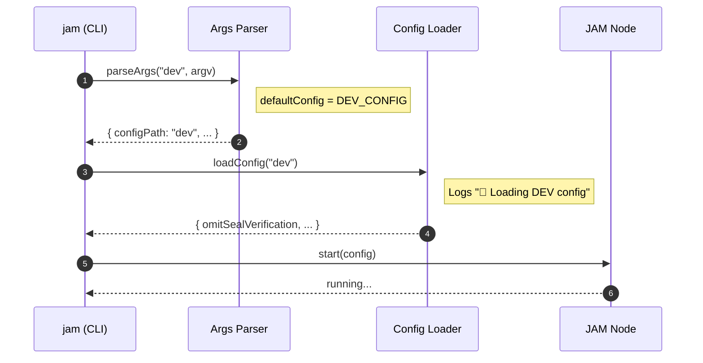
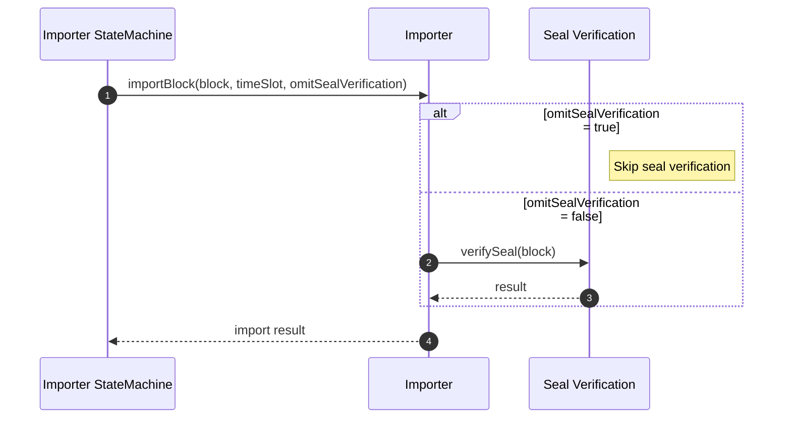

# Block Generator E2E test

## Pull Request by @tomusdrw

Resolves #588 

- [x] Fix block generator (auto-select dev config), but it only works up to block 12 and fails with epoch mismatch.
- [x] Refresh config genesis with 0.7.0 data (previous data was failing to decode).
- [x] Pad logger modules for better readability.
- [x] Simple E2E test for generator + dev mode (expects to create 6 blocks).


## Comment by @coderabbitai[bot]

<!-- This is an auto-generated comment: summarize by coderabbit.ai -->
<!-- This is an auto-generated comment: skip review by coderabbit.ai -->

> [!IMPORTANT]
> ## Review skipped
> 
> Auto incremental reviews are disabled on this repository.
> 
> Please check the settings in the CodeRabbit UI or the `.coderabbit.yaml` file in this repository. To trigger a single review, invoke the `@coderabbitai review` command.
> 
> You can disable this status message by setting the `reviews.review_status` to `false` in the CodeRabbit configuration file.

<!-- end of auto-generated comment: skip review by coderabbit.ai -->

<!-- walkthrough_start -->

<details>
<summary>📝 Walkthrough</summary>

<!-- This is an auto-generated comment: release notes by coderabbit.ai -->

## Summary by CodeRabbit

- New Features
  - “jam dev” now defaults to the development config when no --config is provided.

- Improvements
  - Clearer error messages in Safrole validation for easier debugging.
  - More informative logs: config source (default/dev/path), importer shows skip-seal status, and generator category renamed for consistency.

- Tests
  - Added end-to-end startup test and supporting npm scripts.

- Chores
  - Introduced GitHub Actions workflow to run E2E tests on pushes and pull requests.

<!-- end of auto-generated comment: release notes by coderabbit.ai -->
## Walkthrough
Adds E2E infrastructure (GitHub Actions workflow, scripts, and a new test) that boots the JAM node and waits for blocks. Updates CLI arg parsing to default to DEV config for `jam dev`. Introduces logging in config loader, refactors Logger constructor usage, tweaks safrole error messages, and threads omitSealVerification into importer flow.

## Changes
| Cohort / File(s) | Summary of changes |
|---|---|
| **CI and E2E testing**<br>`.github/workflows/e2e.yml`, `package.json`, `bin/jam/package.json`, `bin/jam/test/e2e.ts` | Adds a GitHub Actions workflow for E2E; root and package scripts to run E2E; new JAM E2E test that starts the node and waits for a target block; introduces quick/bash variants. |
| **CLI args parsing and tests**<br>`bin/jam/args.ts`, `bin/jam/args.test.ts` | Adds `defaultConfig` option to shared parser; `jam dev` now defaults to `DEV_CONFIG`; updates test to expect `configPath: "dev"`. |
| **Logger refactor**<br>`packages/core/logger/index.ts` | Makes constructor private, removes `fileName` parameter/state; `Logger.new` pads module name and passes global config. |
| **Config loader and logging**<br>`packages/jam/config-node/node-config.ts`, `packages/jam/config-node/package.json` | Adds `DEFAULT_CONFIG = "default"`; introduces logger usage with load messages for default/dev/custom paths; adds `@typeberry/logger` dependency. |
| **Safrole error messages**<br>`packages/jam/safrole/safrole.ts`, `packages/jam/safrole/safrole-seal.ts` | Prepends error code text to mismatch messages; standardizes invalid validator message content. |
| **Workers updates**<br>`workers/block-generator/index.ts`, `workers/importer/index.ts`, `workers/importer/state-machine.ts` | Changes block generator logger category to "generator"; importer logs now include skip-seal flag; state machine passes `config.omitSealVerification` to `importBlock` (updated signature). |

## Sequence Diagram(s)




## Estimated code review effort
🎯 4 (Complex) | ⏱️ ~60 minutes

## Possibly related PRs
- FluffyLabs/typeberry#450 — Similar change to importer: adds and propagates the `omitSealVerification` flag and updates `importBlock` signature.
- FluffyLabs/typeberry#599 — Edits in `packages/jam/config-node/node-config.ts` around config constants and load behavior.
- FluffyLabs/typeberry#566 — Touches `bin/jam/args.ts` parsing paths, adding commands and branching logic near the modified code.

## Suggested reviewers
- skoszuta
- mateuszsikora

## Poem
> A hop, a skip, the node awakes,  
> I thump the logs for snowflake flakes—  
> “DEV,” it chirps, with configs neat,  
> Blocks arrive on bunny feet.  
> Seals can snooze (just for a spell),  
> Our tests now ring a carrot bell. 🥕✨

</details>

<!-- walkthrough_end -->

<!-- pre_merge_checks_walkthrough_start -->

## Pre-merge checks and finishing touches
<details>
<summary>❌ Failed checks (2 warnings)</summary>

|      Check name     | Status     | Explanation                                                                                                                                                                                                                                                                                                                                                                                                                                                                                                                                                                                                                                                                                         | Resolution                                                                                                                                                                                                                                                                                                                                            |
| :-----------------: | :--------- | :-------------------------------------------------------------------------------------------------------------------------------------------------------------------------------------------------------------------------------------------------------------------------------------------------------------------------------------------------------------------------------------------------------------------------------------------------------------------------------------------------------------------------------------------------------------------------------------------------------------------------------------------------------------------------------------------------- | :---------------------------------------------------------------------------------------------------------------------------------------------------------------------------------------------------------------------------------------------------------------------------------------------------------------------------------------------------- |
| Linked Issues Check | ⚠️ Warning | The PR partially addresses the objectives of [#388]: it adds an E2E test, refreshes genesis data, makes the CLI auto-select the dev config, and introduces an omit-seal-verification flag propagated to the importer and logs to allow skipping seal checks. These changes align with the "disable seal checks" and testing goals, but the core objective—restoring the generator to produce valid, properly sealed and coherent blocks—remains unmet as the author reports the fix only works up to block 12 and then fails with an epoch mismatch. Therefore this PR only partially satisfies [#388] and does not yet fulfill the primary requirement of producing correct seals/coherent blocks. | To complete compliance with [#388], implement full seal generation or a comprehensive typeberry "disable seal checks" mode across all relevant codepaths, fix the epoch mismatch causing failures after block 12, and extend E2E tests to validate block validity and state-root coherence beyond the initial blocks before closing the linked issue. |
|  Docstring Coverage | ⚠️ Warning | Docstring coverage is 14.29% which is insufficient. The required threshold is 80.00%.                                                                                                                                                                                                                                                                                                                                                                                                                                                                                                                                                                                                               | You can run `@coderabbitai generate docstrings` to improve docstring coverage.                                                                                                                                                                                                                                                                        |

</details>
<details>
<summary>✅ Passed checks (3 passed)</summary>

|         Check name         | Status   | Explanation                                                                                                                                                                                                                                                                                                                                                                                                                                                                                                                                       |
| :------------------------: | :------- | :------------------------------------------------------------------------------------------------------------------------------------------------------------------------------------------------------------------------------------------------------------------------------------------------------------------------------------------------------------------------------------------------------------------------------------------------------------------------------------------------------------------------------------------------ |
|         Title Check        | ✅ Passed | The title "Block Generator E2E test" succinctly highlights the prominent addition of an end-to-end test for the block generator present in this changeset and is directly related to a real part of the PR; it is concise and clear. It does not enumerate accompanying fixes (dev-config auto-selection, genesis refresh, logger padding), but that omission does not make the title misleading.                                                                                                                                                 |
| Out of Scope Changes Check | ✅ Passed | I do not observe unrelated or stray changes outside the stated objectives; most edits touch config loading, logger formatting/refactor, importer behavior (omitSealVerification), safrole error-message tweaks, and test/CI artifacts which are relevant to fixing the generator and adding E2E coverage. The logger constructor visibility change and the added @typeberry/logger dependency should be reviewed for API compatibility, but they appear to be tied to the "pad logger modules" objective rather than being unrelated scope creep. |
|      Description Check     | ✅ Passed | The PR description is on-topic and matches the changeset: it lists the dev-config auto-selection fix, genesis refresh, logger padding, and the added simple E2E test that expects six blocks, which correspond to the main edits in the diff. The level of detail is sufficient for this lenient description check.                                                                                                                                                                                                                               |

</details>

<!-- pre_merge_checks_walkthrough_end -->

<!-- tips_start -->

---


<sub>Comment `@coderabbitai help` to get the list of available commands and usage tips.</sub>

<!-- tips_end -->

<!-- internal state start -->


<!-- DwQgtGAEAqAWCWBnSTIEMB26CuAXA9mAOYCmGJATmriQCaQDG+Ats2bgFyQAOFk+AIwBWJBrngA3EsgEBPRvlqU0AgfFwA6NPEgQAfACgjoCEYDEZyAAUASpETZWaCrKPR1AGxJcAQh/wMANaQAOJkygR8AKIATFGQNIi4kJAGAHKOApRcAGwxAOwpBgCqNgAyXLC4uNyIHAD09UTqsNgCGkzM9QBiHtgAZv2yZSqI9biy3CRZFC713NgeHvV5hanFiNkJLNiItBQA7kUAyvjYFAwkkAJUGAywXLi0YGiIiPgUNM/98AAe0pBAEmEMGcpGSN0w9y4zG0WFSx1w1F2XHwUzhBgAwhQSNQ6OhOJAYgAGGIAVjARIAnGAAIyk6A0gAcHAALJSOKSYgAtIwAEWkDAo8G44nwWAAFP00GJkP0KCxrDYAJQcAxQGzSfAeKTIJAOK5mADMjMZGjVkG6fwBAn8QUgpHIVEi2xwBDAmy8YkgSgkCgwPyIAG5GOdsRhkj9fpADh9AshsNwXTaAsEaTFrnhIFL4B5kLhYJQcf0aHxaNgrgR0FgSNwArBIMwkDDcPczeqSHLpAXkEx/fAiPbwohUAcWpAiRp8hoid7qGhrqI0LsrrwSBJ4GdkLQ51ntF56JWlEwlG3rGhaMh/ERSHxmIpFgD+h8UMxePgpPRseeVDn1LJTwAgrQF7oPY8Cvl4kBkM8brQQk0gRs++ZXA6ETPvAWA+g2igVrA1BQb8Uwyi6go4jQkA5NctpxmaBgWJAADywiiOIOpZvKzCQB4GGBHierlogRjdBxKBvOWkBGiakDigARJaUbJnaqFOh8MkquaGpJB8VyKcEynUM+P7cRMLpvmWlyQBIaDcfQumIMGDChuwu45ucVyoGWFb4CgGBGX+pnyuZK7ylMfCbNZiCnlY8rrkooETFMMwuNhcXihh6jwNZHjyK8oEYmUACSSoJHhyS0EgKheMg4UeIwBZBMgmD0NKlwitVRGZUsshgKu3DOHiNWReaBWvjFKHhE6eJ2QA5AoBZhhZciQLsGEDsh6BiNg1n2Ii5G4Lcw6ilg/TYHcR1VvQZnYAwq0KLMLE7bikDyvguDIAc81XGg3BvrwmU0Ke0Bfsk+YjrG6CNVgGH7feYgfPIiKIMEBAHM49D8Qaxr5AANPY3n5vhYqLdRjXYnNhbhiVwX4CIXoMJg2Fkziw7ZT5NBEJNoG/ZQ9g4rV+nne8fRHbR+jGOAUBwfg/SuoQAt4p0bDhlwvD8MxYiSNa8jHsoqjqFoOhiyYUBwKgqAM0ubry/QivsFwVBHA4TjJUtOtUHrmjaLoYCGOLpgGBozT5m09QxhQgT9P4BxjCQMQkBosjMB4qoyandGWABBXEBNuL0E7MLJdLdWYKQgkGEBIHziE6gABJtJAAEa2K72xpH+BHPhgctCHYcR1HMdxwnScJJ4eIyQAUgBACykBpDhkCxPE0AIYgMkaDABbRq3UcJEK16UMgYo8Ls3YuutMIYdctz3Bdx9LM9JAAI4CW9CSgiQ4gYAOF8YOvBVlR2DCAJ5zDi/pBIQghIBCDQMwMAsdcL4QoKdQ+WA2inVwNgMAHhcRJGjGOecNIiRgEbBgPAFZwIkDOMkJqoE54niEMgGIMQNBRmbEKX4684BXAgQIOqog4z8EzOtbEtZDrw1xpsV+CZZ44Q0AwwkzCoyjnzJADA3BOL03uKtXGSCMDIDURonQlYMJJCyt6Gs0EyA3WkLjGhJB/iOUSFBDAMFCBwUSK/dc84DHPVOvBJIHB4G6COAAAQStMSgcxoHMFouYDOHgSzUA3Hos+m8jzYKdMkw+Mt7G1k+HiZ8CwbTwAYM48Q4hpBGCgHPAieSvjzDaNxUp7B/LDiIL5DBZN7gl2kLRKISRwK5wUHFbE64SBHA7E+T4XAp50HgI4AwqcZJVP9moDA9Ron1FBJFDxGg3opzTvRTO2dHRDPzs4eQRdulf0qQYLh/jki5JYkko+UyqbmN9IrGhqN4zcG3F8F0GEGB9Digzd8kT4BxSLutXsAYrDUFgOvY4HUfj0y6rjS+60ZKIFgGcDwl1nCbA+WAKyNkDJ8AwkoX4MkHm43Wn1CgmxmoUCIPo9uPlgXYDirC/s8L8xcBkj6Gll9zzlXOpWda9ikCfwHEoKUixkioiOpDdGLj7HrxqVdJuWAdbFxuaTYK0h2DBjFKzdaHjanPPOj89AtAhC7C+LE9ODcEkRCyakq46TnAvJSUXXJHwAWFMaSUspGVbn9PEM2BW89RnwHGVBQYAaZlzIWUslZYAjBrI2TArZLKdl1EWYcjOWdrb2EcAXS5MtrmlyqQ3YCeJvHxqVck7aDKYEfx5nKpcCSMRigDKZQlJBjh4WxLQBiIp3XfPgKOlA1C8xpI7N2xCfB1rTR5UQWazaxTBi7Qqh+P9kBpAYryKIAB9E93QALFDKNAY4HQ+39lPAyzYCIhRf3HedN5a6H0btUey5cW5F0Kt7X2AcJiaDnn4DLI9J7z1REvde2997QOngKlgda/JPksBhC4ngCLcbPpIABPNf6jh9TeACE9AA1U9GIGJpG6AVEIEN3m7p7T+gdjKh0jroB+rJEjvIfTIH+7267RI8BipCviWBprRI+dNXG1HaP0cY8x1Ay5bLyDY5oc09yilNIblYAqZaKBSgstiA9y07h4RubQFWg7iOsrAu0pEZNTrVroMGQjw7+pjonc3fdsJdThkoL5DwtjcMwps6QCTRqKBsQENKQIqMKAgU6H1cQahjLyDeVKgZX9GBZRkFpoDCTLLWXLIDSYVw2kdLclmZ82mQP9oA1Z5JCRqsdamEXJTdGGNMcgAAHy65Q6Dx6z0XqvTeu966nVHNdZkgLEqF3Au9cqqDtSA0FL4PpkNLSKll2qd5DzeZvL+vyfQINxTmnhlaf2Or2IhoGAjYMgFurY3xsmUmyAszyqprTmqVZGFs1dD6kENApA5HvAwAc5ZRyS05wBecwuVbou3KgBXRqqjPsuLALBSLCF7CCmFASDxgS466D0JAGSb0owQAtR4+o8C9mrx8tcYHmyweBAh/HBhYpAabzyzKh5ROhQikCyYrM7mjpZQRpvRA7bgzzn2nuW6Xzoy5WhoFa6Dbiw83NYTxAxPxfcXIC6LK7LRW3XWuQR2xvkjikQLIcM0pxClPHscejerSBKjm/ExJ63luetEBkn12TNsXf4Dt4NN3ylxsO5AY49vbVKDs5AAABmT+B6e2fp6zZzpLPOodihz6dJQfB09G7F29HPyj6y1dc1cTPCFyfeGp7T72DOEJM8Hm9GS6fTw1NevNY+124G3ZMl6xbKSPO0D6QMqNNsY1rjjRMxN0yfspuYIW5ZgOM0GHzzmxnzP9k7+dcc0tyPK3e9uQBbHEzcf4/oOKRexULU/Egofrox/e/IDwjIEgYTUVOgP+ABH4cgLHC1SeGeOhK4BEZwDBRMReEqfCbBdzU+daaAv9OKLxVRdRR6T4D5SAGkFjecLRfFCTAIaQRAXGO8DAdQD4aqJ4KhBrPgecU3K4XsREdKArGSQAPg3AAp3cgB8EJ10i4DMGAAwD0Bkgi0/E1G1ABAN1wSE3Q03kEE2HiymmolUUyB5i/HuABGfHsUuDoGQGgAAhsBCCiGgFPR8DKAYgxAAGlpIchfcN4KxCdWtldXptpI1KFMwi4WQZxNhexK5cN5xyQQixQ85WhmCDgsAOZpQVxKANw59IB/5lpxBuIAAvYBSAMofAfeFdM7RsZIN8S4N4QRGoTMGhUxDBTYSKdImWKLHMS6eUCo5ASJRgqPAidQAAqZK4fQhAArc1WAR7XFfFOlTeC1bEWmN6UA5xBwR7e0KgS4E6WqEsEhH1DbdaRAPqeIvEco6g64eQTYFxW6Y4JjAqNIaAWxVGDKArY4GuYoaAXkBiAAdTSFPRCBsAAgxDPSsCiBsAKmPUskyhHjYEZXmA4iQBsQugxRlgGXvmsk1gkWgguKY0cIKjKDKE4U3gLA8FCgINwHFGKj2LQHiP0XwLr3QBZUcHYBoPxERAMKxyCPdFEGiIhP8JBlKl3n7BvDzEoC2POiPj8KoVkMYC8EJXeTFICKwCOMqKlU0HcMgAJKJM2IwlxFJNVKaiqhWKSPWPsFiNoHbiwBoVrBoFu22imUuHoECBzFNyIDxI8NwVazXHYDAH2E1iwCSBNMzH+XnBs1oEdLwRUXnGxFICjErHsRVy9HWl0h0OYBmFvnPCsjuABC4PlFqjbiOBUJlPfmSFQCGJAKMDiRdQD3dSD3MVW2n3D3O0DWj2u1DQO1rRqROxdHrLoAaSbP2xKxrLD3n0jSGXexX0+3XwJF+3mW3zTT3yMC5yLz5xhzP3hxOQiAGnLQuQ2xOyEjOD4FtzwM4irxJ3ekLBTzxCrJejKML0h0XKs3L2pyPLahpUrAcB+gDWcVcXHwPAQlujeXWjCWqySlkBBy3nDnJMuHXlrSzzji4CUC8CIBwRdBkh8V0QeVb2CUgAAsSkiWAuiRpXFHsVEDIWQGQI8XehaExU3jk17nApICVHNGgu8ESxxXtmQWpy/3GG72iXdERE+ATDgTjndHAm4C8A0BxWWSgEYo4GYoeCkAoAEHwE2FYpSRkg4sZ24tMT4u4AEvjhxV0AkAkrQvgQ4GfhKUCC4EkRIriFPWgAKiniiAYheIAF5iQiQ3Lb5F5bD7CnCbK7KHLnLSQ3KiQpjhNdFkBkL8DULGKMKsKIlZhcKYFd8ak4KP5J0yZVwzjCzVCPJ4BBgnVz8Fsw8PVqzQ91s/VCIttLtGyDN9t49a0k9q8zy09m8Als9c95ybzocc9xRLzioy8eZHzX5gR08acW94EZIBUUK/FoqwBQlwkgKQd+9zQGqScmquAWrOBjKZKc9L508OrecurpJeq7yBr7dkBhrRrWqYKZKJrqcNB6g1KuKYEeKED+L4EhKIJdLYAlqoAVrxdgDmqpKZKOA5KFLNgdqsA9rryDqS8jr8BXo+q1UwozqgQM9LrNrrrXhZLKAwaSBbq14HqOcj8nrYFNLECdKxL6wSUfrE9k8Ab1qpLTKggIaM99ri8MBurjr+rkbq9zq0bGbsAzL8bPLbL7LHLoAXKgqZxPK7CHDHDfKxaAqgqDzfF0MxqKdZrML5qcLFr08jAXtF9hlBjRy18pkJyt8z9ZyDB9qxgmBsR6grwbx6hKV1VT800VzL8NyUcb8E8CiiiNB9yMB2VewkgkFiJ5w/abwTi8NgJrcF0hQPwUoHxVF20XRRxaAVFGRb5yNQE1pN4iB/BEtap10dEaxsEboRjN5Vx1xNw8MVECYIw8Q7wywvA0h21cYP8SA262AJSQh7CfAAIyhlN+tmMqyQ79prpIgBcrhI6eZx6w7nRUBZ8kxgpJAnoaE+i8MqA2ASwuJpVxNR0dd6A5QFRxRm6Hxu6SAO6cwu726/QAw39vIz77xW677103DTZkALNwV50rhO7L6t721d6aF1p/7U6fgSB8Vp6JM17yIwG2Asw40KCiySA7wPxbFuJ2k47ODsFKiXzIgrhTV5Bz7X6EGaFZtrAY8uJCjmgCsd7cUQILNYQrNl7L4sg8Ia6KA/dyy3Ult8YVtSr3Vyq6lttR8aqJ86rzQQNQ7J7nwG9OkrgEx/k6AuAT7t8Uh57ZGKBxQ/orJyIvwTSMBWYSHb62ALL9ptEYG9HjbzwiHEHSG29Q7LHdGnoDG7H11Hhqsi4+6GIB6h6+tVN6KUgCADAUgXHyJNG4ZtHwmbHDHjGX7THHGLGv4CME7XGcQ4ntYf1PHusZYfG/Hh7Ana1opURKATJv6PwVY0n9GMm7H4Gkm30wMdVcHkBZ6KV5TobbbtIHaaHKBna1UOE3pa1pGJ6omwThwst/IlHc4uBInF62UyNqn3JmnXhWnen2m8NwdS56g7aSAemij+mqUWd9aF9hzl8xlTbvsa5+xYBLaIB98baQcdmf0wAg6lB6g3mSAwBZs3ai0G4EdTkkcvbr9tzhpwxtcKjQITH3QmAph6A2nWD3kxN/BzweYlorcCsGZhL3y1GtbAKdbHaeZyHgZbp2D1mfJTF0zQz6w2mA7xk0pXwA0NAd60ANBO7fIe7qd101JAJgIsd9zOyl89FERKZJtENCmBsaTSVxJBVStcBhVVDOCONPmk7RLzQogMAbNIWUXaBmt+wOzSjqHv5qCedgsSpsQatLhfIhRFKuA8yxWb0JW1NLx8BUXn8ZJABeDcAHJd/I118qArB16Ae+/sNSXGe1qIGjAJgbVAHVvEWSb13188W6ajYNogUN2+PMnV38kSC2eS9QKgZKDLescUK8X+uu+sGkz1n1gopNgrMTXFgAEgAG910+VYAABfHllUk6M6FtWqdhtAThiXX1ZCQ4WElhtHOfUsgqisvh1jEPNbIRnJCqyPK7cRuPdHSAEZzAahetZq+sv0XBQNp1yAJy6nbTfvdqzpp59dV5nCD5nCb5n9FnPW57U5t7c51fBNM25NP7acgHe5uc69zZW9z5+YaG9m2Hc/AFtcvOYFrctHMuTHUCfcpQNEJQO4eQGSWKhawligZ8/h4PdDqxePDbR5kDl5sDtmxcsNscOS4cI+PY0QanAAKjXmnfm1nZSSrKnyKuEcqp6N21jzDQT35GI8w7Wozxw4JfWZz0rChq2ekBvco/veo8OrQ8sTuFI/FAFfBdkHWuw+1viv2ZvHxrY/T19xOaHI/ZGRNu/e+wKIODuf9nI5zQVxPq8HqHc6zK+ZqhZyg49sR3XOdhBcQ6MDQ0shSKGGOD5neJaEcJIFkEZLzJhRYAWCRz5lWgS603wABCDuSGbBvktlxQoGy40ESyRsQA6XuBCqglmGfGxE6SwCDqOFa12NTq6L4F1WODQA86HT5iiHq64bQ1JUhSoxRP+WfAEEzBpPnGbtyrjXoDYDeB5wFRG4m8gHG7JSnoXkIhYhUcgA0CO7Xm7Y+GbGF2hUFyG8PdGfOnUz+SGUrDm4VV/DNzRQ8A1WO0Q5IjFBhmzJ3iMJXfqSE+cwe16Q4/914e48I5KsXYC349Xeqr2wkc3bbO++jKB67JB97NB8byewNrOds4ufs430nP+130A+tuA7c9658689p61Hjl+bh2LVXMmjg5C4Q56TLnuVwBjDq/lAoGIRNZiyca/jNfS36ji/zA1ePFugOFPKXCICVgBWMTuBBVwg8N+AwW2k66Nti0jCRRRRKVl1VCgAi5t0WA8GISbGoBvghGs1q715a4fia/IrDIbBF50hIFofoIKxpJ6768G8F97SUAAG1OuABdBcAY95IXW6GSKIPbsQA7o7jQZ8mM1DRV5xOXr+G3xAQr+sB3mruP67l3xr84FJWbz3lbmLLIX3+XscQPnz4Pj4UPkgCPob6PrIWPyVX4aVBPpPoiL4LgNPjP7Xs0e5TMrULMHeOxa7+0lxA1CdnpWgE1IxuXK4VB9QAFPX5bhXGLLg5yVAMgLVks0szjqH07ed/ssq5dkRqqsR5HjdhPOecgKz17aNInr9r7Uni2mcynr3APgPVqIbPclIc1doFp3arPT2pzyuRhdMQk7d5Hh0Kzsx4YO0RpmziAFQldIYAyIBAMGaygRIqlUAQLFUhIUyB+HdeABHvjD4eYV4EpBinV5co46BjPhA1FxjXJyAtUSRAmAlI/xQKfcduKXUszoFV+eJVAHY2sglgy22CLILVA0zR11oCLcDJCCvo8BXoLSWXOgEGAsRboV4exiWFujPh6YaAoUNkW2J14WCwlV3Grl+5ZlZ+7KIwtdyDKOluGNArjtf3Wi8c7+EeBsk/2E4tl0gYoEgB/0Nojliev/c2n+2c775sBYwbFvkgoAED/Oy5GAUFw54Voue+qWtPcgMH78eciLZ+CQHLC2QSY4mJXir3PLeQgUGvd5EjGFDslrS2CAcOix+jokCsjue0omBqhcBm2s2FgOoBi7WQqMUXE3kdHbaP04+/ffLGtAoTHB/AyQK8J934CjsjWjAv0H90cEHBcYzgwXjqRcQhl2yAQRyBQGDDFDBamLXDAqVzrDt6h7adwYVUDww8fBS7PwaI2x4o9X+IQsIYT2NqRDxyv7KcrEKMDxDnajLJIV512hfMYQWicgKkOgH/M8BwXLIfAO561oRodSPwCmEKz3xpmqvbyDnRQ7xpI4EOdiAqA8YvgRGXDRIbgGxF2hy+ogEgJrEgIIBUstJIgPSUpgDDSiwwjwKMKFCoptiOjWNJuFZjvc8QNJOxnz28igguRb0NwgxDWEMDSkJbGhpYz16uDLGNCR7LWD0Rb87gigVaMVCYaS4xBtmWiPRFSDmhZk+YRQLjwUbLQHuI/dIhCJLAaBaR9I4IJfDBG0i+mforhq/Bd4tQawr8ZXGyIJTb0O0fAcUIMNwB8iBRC3Uwcki4AKVGemAJUF5lFG7BWY6gDaK1EDQb8Eg/PNtDvQPiDlP+S+b/mOR/ab4YhAAn2H7Eli4Yi4lsOWBkIUCsA7Yz0CkmWk56uwcI7sNQJ7ENiNjjYnY0oqekhSIBT0H2BXrQFPRk1vYvsccfkBIB5BGQAgHIJuMZAsgcgOQEgJSByBoAcghoA8f0ENBbiLxlIKkESEZAMAmE64m8fODFgGBxxisdQFOIvCziTadAU9HBCNgSxYsp6SEqQFPQGEGoi43iskFfFNtQm1OJALYC9F0Be0XY8MFYEUpfBbqUoXMFfXgnYpcUiwWgF6NsDYSIoeElIDJCQAMQ5KQoetBgDIm4TsY+E8qLQBsCnReQAQV9KtEQAYh6ogQW6hPQonntIU7EjAO4FwBeA+J/CQSUgmEmCpRJHEgUNXmSTSSggsk8sMxMomm5eItAAqGJGkCvp8aAAHQwCmTjJuACyVZMsk2TgAOkv8RjD0DmSbJ1k6yRYEsCSRmQFoP4FRBxGUDzJZklyUFIsn0QJJXgAKfJF8lKREcHwAKfRH5CDVkkAUjUNghdGSRCgAUjEE5HDBmpN4CZSgeJny7oAbQXkSgkFHKw2QopcYCRECncjJB6YGAaaGUQhbUwiSfnAKWhiSAZNowNWQiRQQ4ZfQRsQFFKFcHFANSFweUQqIixa5Kgpi+EcqArhKllsao7AgRDQhDFtQ8YCDJjjdFlw9QREvmXmBFApYQY58AU94r1LxTNRcwso6oKg3FyVgYQvEd5HZAml3guk+AT6JTDSgaB44y0W4a7i2g8DoRu8TAIdHaw9ttUt8OooMXhpvRcYH8BgMVDzLWwNAAUz+hUKhjgt8YrwZGN5HSnUC9cK6fOjFIpSygrQzUXDK9P6iMwlWX0wsskBxRXS3p10esMzDjTFEeAfQIgGABFSUE2pfMQcIC2SRozAprkoKcAAdo8QHJBk6QlpOpy4NcAakwIJpAVSrwuAYfeCSkDgkpBdZXLfiZfXxphSrgysmQlrN1nYpdouwDScJL1kyRck2CDpMkiNnTFR4kAYyTJC9GhBSZC8OIA8g9lloGAFdMQKzAQBEBYAmDKoGWzfAkJnIVuEUjLAZjQQ8cbiAnLgj/J5TtCBUjKsf2yo9hEOH8W+DlWxAhz5A2IVKdUNAhfhaoDKRVM0U3i2BgweYpekTHHbkMpSXDdImVFy5spHkpCSEuvSDlpdMAsgX8laGQDigfQT7UDLLHZKegjouMVCMOC/odhxiuMFAX1FjpfxZpGYHkoTEbBvB2sJpPLq9AbBoBnp5qN2QfKlL+snSZsvWZRMexag8AzsgVHxjFDaDckIDV2ZJNKkq92s60AqZGABCShAeMCESm3g9lezKBsFNcNPP7SRgPKfsjxB7OKi5VIAsgM4BrkpiXzf5LobEJHAeigMreROUphtgcACBKWrETgoh3T7yy7ZzdPGgKhSx+8029Ci2SXJ/RuRGJmwdhZRI+D9hNSHgZWYbIFTlIvAyyPWe23YU6yH5MkCCYEFEXU4yg0s+gPpP1DIBTZfCh8lbPVm7gmJ5syiQ7MwA+oXZVwWwFvXEDaDRUj2Bou8kEBzEWRG2MPp5Mj5cA8xoqSGL7PiAeJS6nYHFACCXkeQ5wtBc+YoU3j5RjMbYueUQoXRYZQMEpLXLDGARYA4xTQ63nJSTHbFSRA4X6BDke4w8Axt8UtubiWDsoGhP0W6CtIUWNEuERKdsiiXaTUt3kHshaZVBqyCyalAckBj+QKxEBXWuYXGNNx5JKsyYDivQVIEAAoBI9kiDYMhZaETmVqiuCjdaAqTUphQFZg1QG0uGJgPTKqmIBplqDILFZh3osZ1oxXBrjWADRltEFdjGik6KTDaE0wt8ZCMdD3Du96wSc2sDfAPmF9nSBC7SCVFQAWK7GtczqJsqSSIAIGyAFxcaEZDR8aEx83uRgsLnrEP8GxKukKCyHYhTKFmZyEXC1R2D7oXoQaM8z2V2Q6Fhi6nE/OFivzqc0AY7Gly8ARMmVmUKljSVhUmhI+GKT6irylz3wVpAsdrIZE7GrgCweiTWENJwruyFJi0yCNUv4mIAA5jCjaPKEqJmJy5a4HdkbSLaMlEFkqb5fWF+V296w9MFaAVmzB9BlivXXegmTTASkYycEUiivBdArKnoCZFZf5FqLQiwAl5cmAtG96YLIsm8dKFYv7blCe+gK4FIpTmX2T0YBkylQ/OpyML8aLC1aPfLkWcLQM3C1RuRO0UyQBFtDayCIvbT40416igSABAoxvAVeki3WdIvNmyK7ZCipRTJAYgBEZYSeMhXxO55bt+JGau2XUWtmPA5J+a4xU7LFD41jMJpP9IqkoWUApAVmcuUMjkYq5tY33KhMODii7FoRl2dWNQvsjYRcEcyV+AQFZmptqGtbIgOvPJZTJzuq0eoAQtdwfAeV1IhcBww3Axi4xCYsYcmLFA7zvOjPAXh8GF618KwCvc+YyR6VJB6gGIKJZ8Fyqu53oCAIrmTE1VpkQY3kSMHMoKnrSt5A4ZAkwDkpF4VSKAuZs+HXATNfwJkDzC8s3gA08W2FYzigI05qoJOTMoiRNLnF4g3kAEIzKKqSSTMJgQyoRAWByjtDnAK9EeJXPWgezN5RrKOiYyVU0pxlGsRdU6BHwEwsAWQW6KdGXVI5YWnBC1twETWZr5CL8ydWtxlj9B2ZJUzgc3CkxkytQSSSulcBQFPqxmSETeAK216hZtorGjDgwHkDQxZRvMNtORBBVsFgIAmzLNRvkD5dFC3kYcBBFyply7OOougDrmehIBAgpmhhThFTXOBWFA6jhRyWzXYgeFtsi2YWqEUlq2A+NKhAxH6BdqpgPa/VFWoaIF92AdalIA2r1lNqLZLa0tQKgSn252sWiqlZbKRB6KhJY6wiI7NMUCp7kFipQIlKPiSCMAKc7gCGhoSF9wlNC7nh/HcVLDpUZbKeWJmiUeg9BryP4IvKHAoN/FsAG9UURjq3yJS5yvdmBE+reKRcDdS1MRGHAKQSYYbFDaao+C6jOSVZAQSerNbeDcq/QZ0lxHdK1Qi4SgbgrVFQAOBBgJSONJTAzkxsyAuOgBGtp1T8S8tpWoWBZoYkCoaktgo+DisFozosgQay7P5jCziisoxg0TVcECAtcsA3EUosKKuU/LbeLYT5UTKqnEEYgaC7PqtrG2MdvI3GxlJAF53spQGPkpetlMknyAwV1kcnZRJTXMKit6a/NVmoDA5r9FvCybTVrCx1amF57ZSSTmdnmy+tusgbZRKG31aRtAQMXgOF7TEbSAJWyiUOr0U4SrdSa+2fNpMVHR8anEhgL7oUAB73IyAGkCyA0AxBKQAAUmjCg7xMJiAYKiiJ2I6Gd06c8mMS7Bah41kARkBODcqZ79d1K8zTHoFQABNLBeNNQrp4QkbsFQMOK9jyxvQPu5Jqyjk41DRo4KQffHuH2J7lAkOIPcmoK1G6KAxW/NTbuLUGzht57IfY01Xgu74J3K/CYrNsCjaVJlm6nJpC1BsQzApIKSMZIoDmT79m2yAGH1+DR9Ip+Un2eKEu2QMHoWEd+iJoZn8Aix9y6RJWDtXpgaElqj5VBENUNhRdrYO/aZKgAv7o+GoR7ReqCXQGJwU4GcAGWkjV0NwuwWcIiA1yyhVcIxbyEeBwi+5EDT+lA2eHoAoClNiLLIHdL4AGM/IEwNGY/uQOv7E8wlSCM6vTnPgCpAAaiIIqqCKyfU9cdmBhXBKIdkX3BmpkhH6bAxs/Gl7LCCAtnwQh+VgYHbZNjgJoEkgOBMVX/jcM+gIAA -->

<!-- internal state end -->


## Comment by @github-actions[bot]


<details>
<summary>View all</summary>

| File | Benchmark | Ops |  |
|------|-----------|-----|--|
| [collections/map-set.ts[0]](../blob/a3cf1eaa3a0f6ea17b0dd2943c3f2fc47feaacd8//_work/typeberry-runner-3/typeberry/typeberry/benchmarks/collections/map-set.ts) | 2 gets + conditional set | 65736.86 ±0.85% | fastest ✅ |
| [collections/map-set.ts[1]](../blob/a3cf1eaa3a0f6ea17b0dd2943c3f2fc47feaacd8//_work/typeberry-runner-3/typeberry/typeberry/benchmarks/collections/map-set.ts) | 1 get 1 set | 39582.02 ±0.47% | 39.79% slower |
| [bytes/hex-from.ts[0]](../blob/a3cf1eaa3a0f6ea17b0dd2943c3f2fc47feaacd8//_work/typeberry-runner-3/typeberry/typeberry/benchmarks/bytes/hex-from.ts) | parse hex using `Number` with NaN checking | 120798.58 ±0.82% | 85.09% slower |
| [bytes/hex-from.ts[1]](../blob/a3cf1eaa3a0f6ea17b0dd2943c3f2fc47feaacd8//_work/typeberry-runner-3/typeberry/typeberry/benchmarks/bytes/hex-from.ts) | parse hex from char codes | 810307.77 ±0.51% | fastest ✅ |
| [bytes/hex-from.ts[2]](../blob/a3cf1eaa3a0f6ea17b0dd2943c3f2fc47feaacd8//_work/typeberry-runner-3/typeberry/typeberry/benchmarks/bytes/hex-from.ts) | parse hex from string nibbles | 507315.49 ±0.47% | 37.39% slower |
| [bytes/hex-to.ts[0]](../blob/a3cf1eaa3a0f6ea17b0dd2943c3f2fc47feaacd8//_work/typeberry-runner-3/typeberry/typeberry/benchmarks/bytes/hex-to.ts) | number toString + padding | 289350.7 ±0.68% | fastest ✅ |
| [bytes/hex-to.ts[1]](../blob/a3cf1eaa3a0f6ea17b0dd2943c3f2fc47feaacd8//_work/typeberry-runner-3/typeberry/typeberry/benchmarks/bytes/hex-to.ts) | manual | 14730.74 ±0.79% | 94.91% slower |
| [codec/encoding.ts[0]](../blob/a3cf1eaa3a0f6ea17b0dd2943c3f2fc47feaacd8//_work/typeberry-runner-3/typeberry/typeberry/benchmarks/codec/encoding.ts) | manual encode | 3021282.79 ±1.26% | 24.95% slower |
| [codec/encoding.ts[1]](../blob/a3cf1eaa3a0f6ea17b0dd2943c3f2fc47feaacd8//_work/typeberry-runner-3/typeberry/typeberry/benchmarks/codec/encoding.ts) | int32array encode | 3937487.95 ±1.48% | 2.2% slower |
| [codec/encoding.ts[2]](../blob/a3cf1eaa3a0f6ea17b0dd2943c3f2fc47feaacd8//_work/typeberry-runner-3/typeberry/typeberry/benchmarks/codec/encoding.ts) | dataview encode | 4025880.16 ±0.66% | fastest ✅ |
| [codec/decoding.ts[0]](../blob/a3cf1eaa3a0f6ea17b0dd2943c3f2fc47feaacd8//_work/typeberry-runner-3/typeberry/typeberry/benchmarks/codec/decoding.ts) | manual decode | 22543973.69 ±0.8% | 86.24% slower |
| [codec/decoding.ts[1]](../blob/a3cf1eaa3a0f6ea17b0dd2943c3f2fc47feaacd8//_work/typeberry-runner-3/typeberry/typeberry/benchmarks/codec/decoding.ts) | int32array decode | 163809537.25 ±4.21% | fastest ✅ |
| [codec/decoding.ts[2]](../blob/a3cf1eaa3a0f6ea17b0dd2943c3f2fc47feaacd8//_work/typeberry-runner-3/typeberry/typeberry/benchmarks/codec/decoding.ts) | dataview decode | 163667438.2 ±2.66% | 0.09% slower |
| [math/count-bits-u32.ts[0]](../blob/a3cf1eaa3a0f6ea17b0dd2943c3f2fc47feaacd8//_work/typeberry-runner-3/typeberry/typeberry/benchmarks/math/count-bits-u32.ts) | standard method | 77155601.03 ±1.91% | 68.14% slower |
| [math/count-bits-u32.ts[1]](../blob/a3cf1eaa3a0f6ea17b0dd2943c3f2fc47feaacd8//_work/typeberry-runner-3/typeberry/typeberry/benchmarks/math/count-bits-u32.ts) | magic | 242199004.87 ±6.84% | fastest ✅ |
| [math/count-bits-u64.ts[0]](../blob/a3cf1eaa3a0f6ea17b0dd2943c3f2fc47feaacd8//_work/typeberry-runner-3/typeberry/typeberry/benchmarks/math/count-bits-u64.ts) | standard method | 7009607.76 ±1.82% | 92.29% slower |
| [math/count-bits-u64.ts[1]](../blob/a3cf1eaa3a0f6ea17b0dd2943c3f2fc47feaacd8//_work/typeberry-runner-3/typeberry/typeberry/benchmarks/math/count-bits-u64.ts) | magic | 90957747.11 ±1.62% | fastest ✅ |
| [math/mul_overflow.ts[0]](../blob/a3cf1eaa3a0f6ea17b0dd2943c3f2fc47feaacd8//_work/typeberry-runner-3/typeberry/typeberry/benchmarks/math/mul_overflow.ts) | multiply and bring back to u32 | 250158194.49 ±5.89% | fastest ✅ |
| [math/mul_overflow.ts[1]](../blob/a3cf1eaa3a0f6ea17b0dd2943c3f2fc47feaacd8//_work/typeberry-runner-3/typeberry/typeberry/benchmarks/math/mul_overflow.ts) | multiply and take modulus | 239301004.3 ±6.88% | 4.34% slower |
| [codec/bigint.compare.ts[0]](../blob/a3cf1eaa3a0f6ea17b0dd2943c3f2fc47feaacd8//_work/typeberry-runner-3/typeberry/typeberry/benchmarks/codec/bigint.compare.ts) | compare custom | 269630301.14 ±5.48% | fastest ✅ |
| [codec/bigint.compare.ts[1]](../blob/a3cf1eaa3a0f6ea17b0dd2943c3f2fc47feaacd8//_work/typeberry-runner-3/typeberry/typeberry/benchmarks/codec/bigint.compare.ts) | compare bigint | 259937648.28 ±5.94% | 3.59% slower |
| [codec/bigint.decode.ts[0]](../blob/a3cf1eaa3a0f6ea17b0dd2943c3f2fc47feaacd8//_work/typeberry-runner-3/typeberry/typeberry/benchmarks/codec/bigint.decode.ts) | decode custom | 168171618.45 ±3.12% | fastest ✅ |
| [codec/bigint.decode.ts[1]](../blob/a3cf1eaa3a0f6ea17b0dd2943c3f2fc47feaacd8//_work/typeberry-runner-3/typeberry/typeberry/benchmarks/codec/bigint.decode.ts) | decode bigint | 106629361.14 ±2.39% | 36.59% slower |
| [hash/index.ts[0]](../blob/a3cf1eaa3a0f6ea17b0dd2943c3f2fc47feaacd8//_work/typeberry-runner-3/typeberry/typeberry/benchmarks/hash/index.ts) | hash with numeric representation | 185.42 ±0.19% | 25.19% slower |
| [hash/index.ts[1]](../blob/a3cf1eaa3a0f6ea17b0dd2943c3f2fc47feaacd8//_work/typeberry-runner-3/typeberry/typeberry/benchmarks/hash/index.ts) | hash with string representation | 111.52 ±0.33% | 55% slower |
| [hash/index.ts[2]](../blob/a3cf1eaa3a0f6ea17b0dd2943c3f2fc47feaacd8//_work/typeberry-runner-3/typeberry/typeberry/benchmarks/hash/index.ts) | hash with symbol representation | 170.42 ±0.4% | 31.24% slower |
| [hash/index.ts[3]](../blob/a3cf1eaa3a0f6ea17b0dd2943c3f2fc47feaacd8//_work/typeberry-runner-3/typeberry/typeberry/benchmarks/hash/index.ts) | hash with uint8 representation | 159.04 ±0.35% | 35.83% slower |
| [hash/index.ts[4]](../blob/a3cf1eaa3a0f6ea17b0dd2943c3f2fc47feaacd8//_work/typeberry-runner-3/typeberry/typeberry/benchmarks/hash/index.ts) | hash with packed representation | 247.84 ±0.61% | fastest ✅ |
| [hash/index.ts[5]](../blob/a3cf1eaa3a0f6ea17b0dd2943c3f2fc47feaacd8//_work/typeberry-runner-3/typeberry/typeberry/benchmarks/hash/index.ts) | hash with bigint representation | 163.41 ±1.52% | 34.07% slower |
| [hash/index.ts[6]](../blob/a3cf1eaa3a0f6ea17b0dd2943c3f2fc47feaacd8//_work/typeberry-runner-3/typeberry/typeberry/benchmarks/hash/index.ts) | hash with uint32 representation | 182.07 ±0.84% | 26.54% slower |
| [math/add_one_overflow.ts[0]](../blob/a3cf1eaa3a0f6ea17b0dd2943c3f2fc47feaacd8//_work/typeberry-runner-3/typeberry/typeberry/benchmarks/math/add_one_overflow.ts) | add and take modulus | 225747707.7 ±7.48% | 2.84% slower |
| [math/add_one_overflow.ts[1]](../blob/a3cf1eaa3a0f6ea17b0dd2943c3f2fc47feaacd8//_work/typeberry-runner-3/typeberry/typeberry/benchmarks/math/add_one_overflow.ts) | condition before calculation | 232350490.36 ±6.07% | fastest ✅ |
| [math/switch.ts[0]](../blob/a3cf1eaa3a0f6ea17b0dd2943c3f2fc47feaacd8//_work/typeberry-runner-3/typeberry/typeberry/benchmarks/math/switch.ts) | switch | 242732731.69 ±6.78% | 4.08% slower |
| [math/switch.ts[1]](../blob/a3cf1eaa3a0f6ea17b0dd2943c3f2fc47feaacd8//_work/typeberry-runner-3/typeberry/typeberry/benchmarks/math/switch.ts) | if | 253060907.17 ±6.65% | fastest ✅ |
| [logger/index.ts[0]](../blob/a3cf1eaa3a0f6ea17b0dd2943c3f2fc47feaacd8//_work/typeberry-runner-3/typeberry/typeberry/benchmarks/logger/index.ts) | console.log with string concat | 6774589.21 ±53.49% | fastest ✅ |
| [logger/index.ts[1]](../blob/a3cf1eaa3a0f6ea17b0dd2943c3f2fc47feaacd8//_work/typeberry-runner-3/typeberry/typeberry/benchmarks/logger/index.ts) | console.log with args | 175742.91 ±119.1% | 97.41% slower |
| [codec/view_vs_object.ts[0]](../blob/a3cf1eaa3a0f6ea17b0dd2943c3f2fc47feaacd8//_work/typeberry-runner-3/typeberry/typeberry/benchmarks/codec/view_vs_object.ts) | Get the first field from Decoded | 380707.84 ±7.02% | 10.4% slower |
| [codec/view_vs_object.ts[1]](../blob/a3cf1eaa3a0f6ea17b0dd2943c3f2fc47feaacd8//_work/typeberry-runner-3/typeberry/typeberry/benchmarks/codec/view_vs_object.ts) | Get the first field from View | 84369.81 ±2.55% | 80.14% slower |
| [codec/view_vs_object.ts[2]](../blob/a3cf1eaa3a0f6ea17b0dd2943c3f2fc47feaacd8//_work/typeberry-runner-3/typeberry/typeberry/benchmarks/codec/view_vs_object.ts) | Get the first field as view from View | 93982.15 ±1.32% | 77.88% slower |
| [codec/view_vs_object.ts[3]](../blob/a3cf1eaa3a0f6ea17b0dd2943c3f2fc47feaacd8//_work/typeberry-runner-3/typeberry/typeberry/benchmarks/codec/view_vs_object.ts) | Get two fields from Decoded | 377826.47 ±1.83% | 11.08% slower |
| [codec/view_vs_object.ts[4]](../blob/a3cf1eaa3a0f6ea17b0dd2943c3f2fc47feaacd8//_work/typeberry-runner-3/typeberry/typeberry/benchmarks/codec/view_vs_object.ts) | Get two fields from View | 71670.11 ±2.33% | 83.13% slower |
| [codec/view_vs_object.ts[5]](../blob/a3cf1eaa3a0f6ea17b0dd2943c3f2fc47feaacd8//_work/typeberry-runner-3/typeberry/typeberry/benchmarks/codec/view_vs_object.ts) | Get two fields from materialized from View | 164363.96 ±1.19% | 61.32% slower |
| [codec/view_vs_object.ts[6]](../blob/a3cf1eaa3a0f6ea17b0dd2943c3f2fc47feaacd8//_work/typeberry-runner-3/typeberry/typeberry/benchmarks/codec/view_vs_object.ts) | Get two fields as views from View | 81903.66 ±0.24% | 80.72% slower |
| [codec/view_vs_object.ts[7]](../blob/a3cf1eaa3a0f6ea17b0dd2943c3f2fc47feaacd8//_work/typeberry-runner-3/typeberry/typeberry/benchmarks/codec/view_vs_object.ts) | Get only third field from Decoded | 424900.76 ±1.67% | fastest ✅ |
| [codec/view_vs_object.ts[8]](../blob/a3cf1eaa3a0f6ea17b0dd2943c3f2fc47feaacd8//_work/typeberry-runner-3/typeberry/typeberry/benchmarks/codec/view_vs_object.ts) | Get only third field from View | 101295.25 ±0.69% | 76.16% slower |
| [codec/view_vs_object.ts[9]](../blob/a3cf1eaa3a0f6ea17b0dd2943c3f2fc47feaacd8//_work/typeberry-runner-3/typeberry/typeberry/benchmarks/codec/view_vs_object.ts) | Get only third field as view from View | 101286.14 ±0.63% | 76.16% slower |
| [codec/view_vs_collection.ts[0]](../blob/a3cf1eaa3a0f6ea17b0dd2943c3f2fc47feaacd8//_work/typeberry-runner-3/typeberry/typeberry/benchmarks/codec/view_vs_collection.ts) | Get first element from Decoded | 27612.55 ±0.53% | 56.66% slower |
| [codec/view_vs_collection.ts[1]](../blob/a3cf1eaa3a0f6ea17b0dd2943c3f2fc47feaacd8//_work/typeberry-runner-3/typeberry/typeberry/benchmarks/codec/view_vs_collection.ts) | Get first element from View | 63718.25 ±1.56% | fastest ✅ |
| [codec/view_vs_collection.ts[2]](../blob/a3cf1eaa3a0f6ea17b0dd2943c3f2fc47feaacd8//_work/typeberry-runner-3/typeberry/typeberry/benchmarks/codec/view_vs_collection.ts) | Get 50th element from Decoded | 27784.98 ±0.38% | 56.39% slower |
| [codec/view_vs_collection.ts[3]](../blob/a3cf1eaa3a0f6ea17b0dd2943c3f2fc47feaacd8//_work/typeberry-runner-3/typeberry/typeberry/benchmarks/codec/view_vs_collection.ts) | Get 50th element from View | 35424.77 ±1.73% | 44.4% slower |
| [codec/view_vs_collection.ts[4]](../blob/a3cf1eaa3a0f6ea17b0dd2943c3f2fc47feaacd8//_work/typeberry-runner-3/typeberry/typeberry/benchmarks/codec/view_vs_collection.ts) | Get last element from Decoded | 23991.08 ±2.18% | 62.35% slower |
| [codec/view_vs_collection.ts[5]](../blob/a3cf1eaa3a0f6ea17b0dd2943c3f2fc47feaacd8//_work/typeberry-runner-3/typeberry/typeberry/benchmarks/codec/view_vs_collection.ts) | Get last element from View | 19969.59 ±2.32% | 68.66% slower |
| [bytes/compare.ts[0]](../blob/a3cf1eaa3a0f6ea17b0dd2943c3f2fc47feaacd8//_work/typeberry-runner-3/typeberry/typeberry/benchmarks/bytes/compare.ts) | Comparing Uint32 bytes | 19459.25 ±0.81% | 6.63% slower |
| [bytes/compare.ts[1]](../blob/a3cf1eaa3a0f6ea17b0dd2943c3f2fc47feaacd8//_work/typeberry-runner-3/typeberry/typeberry/benchmarks/bytes/compare.ts) | Comparing raw bytes | 20839.9 ±1.14% | fastest ✅ |
| [hash/blake2b.ts[0]](../blob/a3cf1eaa3a0f6ea17b0dd2943c3f2fc47feaacd8//_work/typeberry-runner-3/typeberry/typeberry/benchmarks/hash/blake2b.ts) | hasher with simple allocator | 0.0452 ±0.31% | fastest ✅ |
| [hash/blake2b.ts[1]](../blob/a3cf1eaa3a0f6ea17b0dd2943c3f2fc47feaacd8//_work/typeberry-runner-3/typeberry/typeberry/benchmarks/hash/blake2b.ts) | hasher with page allocator | 0.0451 ±0.53% | 0.22% slower |
| [collections/map_vs_sorted.ts[0]](../blob/a3cf1eaa3a0f6ea17b0dd2943c3f2fc47feaacd8//_work/typeberry-runner-3/typeberry/typeberry/benchmarks/collections/map_vs_sorted.ts) | Map | 306237.13 ±0.11% | fastest ✅ |
| [collections/map_vs_sorted.ts[1]](../blob/a3cf1eaa3a0f6ea17b0dd2943c3f2fc47feaacd8//_work/typeberry-runner-3/typeberry/typeberry/benchmarks/collections/map_vs_sorted.ts) | Map-array | 103756.43 ±0.03% | 66.12% slower |
| [collections/map_vs_sorted.ts[2]](../blob/a3cf1eaa3a0f6ea17b0dd2943c3f2fc47feaacd8//_work/typeberry-runner-3/typeberry/typeberry/benchmarks/collections/map_vs_sorted.ts) | Array | 67282.89 ±0.69% | 78.03% slower |
| [collections/map_vs_sorted.ts[3]](../blob/a3cf1eaa3a0f6ea17b0dd2943c3f2fc47feaacd8//_work/typeberry-runner-3/typeberry/typeberry/benchmarks/collections/map_vs_sorted.ts) | SortedArray | 194403.36 ±0.34% | 36.52% slower |
| [crypto/ed25519.ts[0]](../blob/a3cf1eaa3a0f6ea17b0dd2943c3f2fc47feaacd8//_work/typeberry-runner-3/typeberry/typeberry/benchmarks/crypto/ed25519.ts) | native crypto | 5.99 ±14.67% | 80.41% slower |
| [crypto/ed25519.ts[1]](../blob/a3cf1eaa3a0f6ea17b0dd2943c3f2fc47feaacd8//_work/typeberry-runner-3/typeberry/typeberry/benchmarks/crypto/ed25519.ts) | wasm lib | 10.67 ±0.23% | 65.1% slower |
| [crypto/ed25519.ts[2]](../blob/a3cf1eaa3a0f6ea17b0dd2943c3f2fc47feaacd8//_work/typeberry-runner-3/typeberry/typeberry/benchmarks/crypto/ed25519.ts) | wasm lib batch | 30.57 ±0.55% | fastest ✅ |
</details>


### Benchmarks summary: 63/63 OK ✅

<!-- thollander/actions-comment-pull-request "benchmarks" -->


## Comment by @coderabbitai[bot]

_⚠️ Potential issue_

**Bug: `--config=default` is treated as a file path**

You special‑case "dev" but not "default". Passing `--config=default` becomes a relative path via withRelPath, diverging from help text and DEFAULT_CONFIG semantics.


```diff
-  const { config } = parseStringOption(
-    args,
-    "config",
-    (v) => (v === DEV_CONFIG ? DEV_CONFIG : withRelPath(v)),
-    defaultConfig,
-  );
+  const { config } = parseStringOption(
+    args,
+    "config",
+    (v) => (v === DEV_CONFIG || v === DEFAULT_CONFIG ? v : withRelPath(v)),
+    defaultConfig,
+  );
```

<!-- suggestion_start -->

<details>
<summary>📝 Committable suggestion</summary>

> ‼️ **IMPORTANT**
> Carefully review the code before committing. Ensure that it accurately replaces the highlighted code, contains no missing lines, and has no issues with indentation. Thoroughly test & benchmark the code to ensure it meets the requirements.

```suggestion
  const { config } = parseStringOption(
    args,
    "config",
    (v) => (v === DEV_CONFIG || v === DEFAULT_CONFIG ? v : withRelPath(v)),
    defaultConfig,
  );
```

</details>

<!-- suggestion_end -->

<details>
<summary>🤖 Prompt for AI Agents</summary>

```
In bin/jam/args.ts around lines 67 to 72, the parsing special-case treats only
DEV_CONFIG specially so passing --config=default gets run through withRelPath;
update the conditional to also recognize DEFAULT_CONFIG and return it unchanged
instead of calling withRelPath. Change the value-mapper to check (v ===
DEV_CONFIG || v === DEFAULT_CONFIG) and return v in that case, otherwise return
withRelPath(v), so "default" is preserved as the DEFAULT_CONFIG semantic rather
than turned into a relative path.
```

</details>

<!-- fingerprinting:phantom:medusa:chinchilla -->

<!-- This is an auto-generated comment by CodeRabbit -->


## Comment by @coderabbitai[bot]

_⚠️ Potential issue_

**Await termination to avoid leaking the child process after the test completes.**
Without awaiting, the test can finish while the process is still alive, causing flakiness or hung handles.

Apply:

```diff
-  } finally {
-    terminate(jamProcess);
-  }
+  } finally {
+    await terminate(jamProcess);
+  }
```

<!-- suggestion_start -->

<details>
<summary>📝 Committable suggestion</summary>

> ‼️ **IMPORTANT**
> Carefully review the code before committing. Ensure that it accurately replaces the highlighted code, contains no missing lines, and has no issues with indentation. Thoroughly test & benchmark the code to ensure it meets the requirements.

```suggestion
  } finally {
    await terminate(jamProcess);
  }
```

</details>

<!-- suggestion_end -->

<details>
<summary>🤖 Prompt for AI Agents</summary>

```
In bin/jam/test/e2e.ts around lines 41 to 43, the finally block calls
terminate(jamProcess) without awaiting it which can let the test finish while
the child process is still running; change the call to await
terminate(jamProcess) and ensure the enclosing function is async (or propagate
the promise) so the test runner waits for the child process to fully exit; if
terminate can reject, also handle/rethrow the error appropriately so the test
fails on termination errors.
```

</details>

<!-- fingerprinting:phantom:poseidon:chinchilla -->

<!-- This is an auto-generated comment by CodeRabbit -->


## Comment by @coderabbitai[bot]

_💡 Verification agent_

<details>
<summary>🧩 Analysis chain</summary>

**Root E2E scripts wiring looks correct; verify downstream scripts exist and are executable.**
Prevents CI surprises from missing/x-bit shell scripts; also confirms jam workspace exposes test:e2e.


Run:

---

🏁 Script executed:

```shell
#!/bin/bash
set -euo pipefail

echo "Check jam workspace test:e2e script"
rg -n '"name":\s*"@typeberry/jam"' -n bin/jam/package.json || true
rg -n '"test:e2e":' bin/jam/package.json

echo "Ensure E2E entry file exists"
fd -a e2e.ts bin/jam/test | sed -n '1p' | xargs -I{} sh -c 'echo " - Found: {}"; head -n 3 "{}"'

echo "Verify bash helpers exist and are executable"
for f in bin/jam/test/jam-startup-e2e.sh bin/jam/test/jam-startup-e2e-simple.sh; do
  test -f "$f" || { echo "Missing $f"; exit 1; }
  ls -l "$f"
  head -n1 "$f" | grep -qE '^#!' || { echo "Missing shebang in $f"; exit 1; }
  test -x "$f" || echo "Note: $f is not marked executable; npm may still run it via sh but consider chmod +x"
done
```

Length of output: 421

---


</details>

**Root E2E wiring OK — missing helper script (ACTION REQUIRED)**

- Confirmed: jam workspace exposes test:e2e (bin/jam/package.json -> "tsx --test test/e2e.ts") and entry file bin/jam/test/e2e.ts exists.  
- Issue: bin/jam/test/jam-startup-e2e.sh is missing (this breaks test:e2e:bash:verbose and risks CI failure).  
- Fix: add bin/jam/test/jam-startup-e2e.sh or update package.json to stop referencing it; ensure helper scripts include a shebang and are marked executable (chmod +x). Also verify bin/jam/test/jam-startup-e2e-simple.sh exists and is executable.

<details>
<summary>🤖 Prompt for AI Agents</summary>

```
In package.json around lines 74 to 77, package scripts reference
bin/jam/test/jam-startup-e2e.sh (and its verbose variant) which is missing and
will break e2e scripts; either add the missing script file at
bin/jam/test/jam-startup-e2e.sh (create it with the intended startup steps,
include a proper shebang like #!/usr/bin/env bash and commit with executable bit
set via chmod +x) and verify bin/jam/test/jam-startup-e2e-simple.sh exists and
is executable, or remove/update the package.json script entries to stop
referencing the non-existent file so CI won’t fail.
```

</details>

<!-- fingerprinting:phantom:poseidon:chinchilla -->

<!-- This is an auto-generated comment by CodeRabbit -->


## Comment by @coderabbitai[bot]

_💡 Verification agent_

<details>
<summary>🧩 Analysis chain</summary>

**Padding module names at creation may break per‑module level matching**

If `findLevel`/transport expect raw module names, left‑padding here can prevent module‑level overrides from matching. Consider moving padding to the transport’s display formatting or storing both raw and display names.


Run this to verify how the transport determines levels:

---

🏁 Script executed:

```shell
#!/bin/bash
# Inspect logger level resolution and transport usage
rg -n -C3 'findLevel\(' packages/core/logger
rg -n -C3 'class ConsoleTransport' packages/core/logger
rg -n -C3 '\.transport\.(insane|trace|log|info|warn|error)\(' packages/core/logger
```

Length of output: 5358

---


</details>

**Remove left-padding from stored moduleName — it breaks level matching**

- packages/core/logger/index.ts — currently passes module.padStart(8, " ") into Logger (lines ~31–33). Stop padding; store/pass the raw module name.
- packages/core/logger/console.ts — ConsoleTransport.push calls findLevel(this.options, moduleName) (line ~63). Transports expect raw module names; padded names won’t match options.modules keys.
- packages/core/logger/options.ts — findLevel looks up options.modules.get(parentModuleName) (line ~29), so display padding prevents matches.

Action: either move padding into transport display formatting (pad after computing shortModule) or store both rawModuleName and displayName in Logger and ensure transports use rawModuleName.

<details>
<summary>🤖 Prompt for AI Agents</summary>

```
In packages/core/logger/index.ts around lines 31–33, currently the module name
is left-padded before being passed into Logger which prevents transports from
matching module names; remove the padStart call and pass the raw moduleName into
the Logger. Then update either transports or Logger to handle display padding:
move padStart into ConsoleTransport.display logic (pad after computing
shortModule) or modify Logger to store both rawModuleName and displayName (raw
used by findLevel/options and transports, displayName used only for output).
Ensure all transports call findLevel with the raw module name so options.modules
lookups succeed.
```

</details>

<!-- fingerprinting:phantom:medusa:chinchilla -->

<!-- This is an auto-generated comment by CodeRabbit -->
