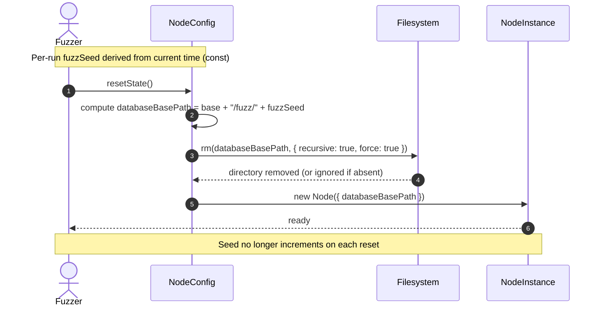

# Removing old database while fuzzing

## Pull Request by @tomusdrw

Fixes #623 


## Comment by @coderabbitai[bot]

<!-- This is an auto-generated comment: summarize by coderabbit.ai -->
<!-- walkthrough_start -->

<details>
<summary>📝 Walkthrough</summary>

<!-- This is an auto-generated comment: release notes by coderabbit.ai -->

## Summary by CodeRabbit

* **Tests**
  * Streamlined fuzzing workflow by using a fixed database path per run and cleaning it on each reset, improving run stability and consistency.
  * Removed incremental seed behavior to reduce variability across resets.

* **Chores**
  * Added automatic cleanup of fuzz databases to prevent leftover data between runs.
  * Minor internal adjustments to simplify configuration for fuzz runs.

<!-- end of auto-generated comment: release notes by coderabbit.ai -->
## Walkthrough
Updates fuzz runner to compute a constant per-run fuzzSeed from current time, derive a fixed fuzz database path, and clean that directory on each reset using fs.rm. Removes seed incrementing across resets and passes the computed databaseBasePath directly when constructing the node.

## Changes
| Cohort / File(s) | Summary of Changes |
| --- | --- |
| **Fuzz runner state and DB cleanup**<br>`packages/jam/node/main-fuzz.ts` | Import fs/promises; remove NEXT_FUZZ_SEED and mutable seed; set const fuzzSeed from Date; in resetState compute databaseBasePath as config.node.databaseBasePath + "/fuzz/" + fuzzSeed; delete that dir with fs.rm({ recursive: true, force: true }); pass databaseBasePath directly to node constructor. |

## Sequence Diagram(s)


## Estimated code review effort
🎯 2 (Simple) | ⏱️ ~10 minutes

## Possibly related PRs
- FluffyLabs/typeberry#590 — Also touches main-fuzz.ts around fuzz metadata/startup details; likely related to how fuzz identity and db-path/seed are handled.

## Suggested reviewers
- skoszuta
- mateuszsikora

## Poem
> I hop through seeds that no longer climb,  
> One path cleaned fresh, time after time.  
> Sweep the burrow, start anew—  
> Databases gone, sky bright blue.  
> Thump-thump! The fuzz runs light,  
> Carrots cached? Not tonight. 🥕✨

</details>

<!-- walkthrough_end -->


<!-- pre_merge_checks_walkthrough_start -->

## Pre-merge checks and finishing touches
<details>
<summary>❌ Failed checks (1 warning, 1 inconclusive)</summary>

|     Check name     | Status         | Explanation                                                                                                                                                                                                                                                    | Resolution                                                                                                                                                                                                                                                                 |
| :----------------: | :------------- | :------------------------------------------------------------------------------------------------------------------------------------------------------------------------------------------------------------------------------------------------------------- | :------------------------------------------------------------------------------------------------------------------------------------------------------------------------------------------------------------------------------------------------------------------------- |
| Docstring Coverage | ⚠️ Warning     | Docstring coverage is 0.00% which is insufficient. The required threshold is 80.00%.                                                                                                                                                                           | You can run `@coderabbitai generate docstrings` to improve docstring coverage.                                                                                                                                                                                             |
|  Description Check | ❓ Inconclusive | No pull request description was provided by the author, and while the raw summary shows the PR deletes the fuzz database and modifies seed handling, the absence of an author-written description leaves the intent, testing, and risks unclear for reviewers. | Ask the author to add a short PR description that states the intent, mentions the key file changed (packages/jam/node/main-fuzz.ts), explains why the database is removed on reset, and lists any testing or migration steps so reviewers can assess risk and correctness. |

</details>
<details>
<summary>✅ Passed checks (1 passed)</summary>

|  Check name | Status   | Explanation                                                                                                                                                                                                                                                                                      |
| :---------: | :------- | :----------------------------------------------------------------------------------------------------------------------------------------------------------------------------------------------------------------------------------------------------------------------------------------------- |
| Title Check | ✅ Passed | The title "Removing old database while fuzzing" accurately summarizes the primary change in the changeset, which is deleting/cleaning the fuzz database directory on reset and adjusting seed handling in packages/jam/node/main-fuzz.ts; it is concise and focused on the main behavior change. |

</details>

<!-- pre_merge_checks_walkthrough_end -->

<!-- finishing_touch_checkbox_start -->

<details>
<summary>✨ Finishing touches</summary>

- [ ] <!-- {"checkboxId": "7962f53c-55bc-4827-bfbf-6a18da830691"} --> 📝 Generate Docstrings
<details>
<summary>🧪 Generate unit tests</summary>

- [ ] <!-- {"checkboxId": "f47ac10b-58cc-4372-a567-0e02b2c3d479", "radioGroupId": "utg-output-choice-group-unknown_comment_id"} -->   Create PR with unit tests
- [ ] <!-- {"checkboxId": "07f1e7d6-8a8e-4e23-9900-8731c2c87f58", "radioGroupId": "utg-output-choice-group-unknown_comment_id"} -->   Post copyable unit tests in a comment
- [ ] <!-- {"checkboxId": "6ba7b810-9dad-11d1-80b4-00c04fd430c8", "radioGroupId": "utg-output-choice-group-unknown_comment_id"} -->   Commit unit tests in branch `td-rmdb`

</details>

</details>

<!-- finishing_touch_checkbox_end -->

<!-- tips_start -->

---


<sub>Comment `@coderabbitai help` to get the list of available commands and usage tips.</sub>

<!-- tips_end -->

<!-- internal state start -->


<!-- DwQgtGAEAqAWCWBnSTIEMB26CuAXA9mAOYCmGJATmriQCaQDG+Ats2bgFyQAOFk+AIwBWJBrngA3EsgEBPRvlqU0AgfFwA6NPEgQAfACgjoCEejqANiS4AlEs3wT4GIvwv1a1FWkQlIAdwQrSAAzbAAvcOciAwA5bGYBSi4ANgAmAA4DAFUbABkuWFxcbkQOAHpyonVYbAENJmZygDELbBCQ2TyVRHLcWW4SJIoKWXLubAsLcvSs7N8KLgJmbERaCn8DAGV8bAoGPwEqDAZYJdowCmZaAQNoNApSXEgjzFOuZm0MbdxqVa58INvnYnCR/JQypADN0khZIQYAMIUEjUOjoTiQNIABjSAFYwFiAJxgACMuOgJIyHFxVNxAHYAFpGfTGcBQMj0fAhHAEYhkZQ0eiNNgYDG8fjCUTiKQyeRMJRUVTqLQ6FkmKBwVCoTA8wikchUQUKVjsLhUfyQRAJT6jF5yxTKJWabS6MCGVmmAzcNAMADWaFIvSEaCaGAd5U+zjAYUiGlwZQMACJkwYAMSpyAAQQAknyDaj6FbWA95FzGLBMIHmZBs8xuPgKEaQr1eCwkNJIARIGQVMEQvArIhZIgaMxGFZMNhuPxuTHwpBPL8BD5pBoDFA7A4pPRcLA/LEAKIADWgAH1mtkGQzT1sDweACIKDAjzDPTD0dTIVYBkhrjckbgLB9NEViXPsInCLYSDRAAKKxcAASgCGp0CweBWDwXs/DnKDYKYZ9EIXShJDREIKBYTs90YPZkVFSB71RP8aywZFfFwLZfhoAAaSBkS3NFd2wiDcI/E4+PYSALHwaoGAAbkgMN/A4AxIF0SAERYCYaAXLxl18AAhFcAAVqFgdBkHw/siA0MMlA0RdvAM4zTMgABqSBE3KOdykTNzQmE6DaDXVSoHvEh4L8QSdKXFcF3gZExAbeRqEolLvV3SBVmiUJEA0K4YIAb140Q9kQEilgobASB4kIGwOCqqsgABfBCmIAdT3LB8JHSqxGyqLyAtWzqp4HxkCixotLRBy9JIQzfBMjLaHiqULHkGCZpXeaSEW2AkOcEcUU5bkEvwAjevEFwUGeMiKMs+BrOG+zdK25yMvffzIhEpiAFlnAbdBaCEVZcBFeNipCKwxHQS0EBCG7yLHQYKEuaQSGeXw0TQWgJDeewJK7BgJwwbK0FCeAAA9ppe3xRoys7ux9MzWPRtc03TKF2azCwaENeAzvG/BKL8JQiYeah+efGduwp+tGzRAGJgECx4AYbtRXUeBpGrWIhdOSsOy7EhZYbQVxjqFW1bKogMD+Vi2YPEd0ILBQlGK0ELRIDpTa4H66HgBIkxTdc3Q9dkMGO3U8wFNFhVNXi0AtIsbXkORXcdNRnVVUP1WNZh1FPeBaEQU9kQ9uhTxfRtXXdXOUkJQk0kJL2BHrjoQgyOk6XpbEsQyAAWfuBAAZjQNISBpFuGA7/vcRSGuw7zgui5LsutfBWhTw5Bfc94EhTzYR599OURfRLqvnhZAwCpUjykCMmx9Kkv06A0k1RSM/BDtoRMuBCNA4TVVvomRAsBdjuCfvgP0D9f6hAAb4LiwCkAAHkpAjCLkoDAsD/6AMQapRMy1aA2GwBge8UCOIUGiIgBEe4/SwNwJVIB+DCHEIwOYXAVgaGn3oYwvBHkWEkLCogBglDuDiDOlwuhDUmEeRVhgX0dBsyICtNIChsDkx8MTEBEckjfR2CtDzRAsCADat9VI31UpYjyJ8/SxBDCQdR7Dgi6MTHwqxIDOKrB4VVNxljEzG0ApgCWZ1HFUXEBwvwAAdRMm5HDZXwO4aKjk/CBAHEJSI0RonoAYAwPYqI1qWmtA8eA4RDZUV4M7W0+sXB+GcMLcsBs2I8VSacFAyAlDwWiOUImKISZXSinOJJs04oJQILaBmLM3wR0BsDJ2V1Mb0ArBHORrg6nej9D+IMIZyjDQjF8aMEE4yIHkuoNpT4GDtlQvQWquTfCciwFFSMWAkgVicADappANCuLMX41iCS8CS3UbrBpNTioAEdsArVoPJQE4jbZTHkMibgsAqC0y7NEhExNPrzk2rTCZaNcBZNqnwRAKsiBFAKT0h4lAeLoWRhLKQPAUU+GiF83x+CHBKHUf4B4fSiDfKsfg06GArJ7AcX/eBMj3ENges4ABui7FsHUeEqwiYflNV8RYwViYbG+kVeKjyQiRHwDEZLdStDfQCu1S+XAXiJW4J+fggJQFbZwqBULCYUxwVVRHERYRoi4UBB8DwciTglD0DTlFNAeAwEUB4h9VJwQormkKcWW0oD8D+HGlRB+REIrZvSTimmfgPqcvgP2DsCzIBLNoCsniUaBC+BOH4MsOpo27gbGAfwlDihkD9ca01DMJwynqc4Ggop63SEukQeN0zKGIDPplE4E4+DEvduvCEbLHUeT+W0N1XBEyZgXfU9tsbOxC2xvQMmGbq65qUP6k1gbdwpRtWU2pop2A8TBpLAtkAFHyH7MED5sF1n+kDOUYMoZwxPIObGeMCEeLOq+MgQI8goq4tqcgPijgFYsQJbO+gKsRzIEwGhqd8S+D5yIHzBmh1SiWiFmvMEEJGBtuUdILDSBfRXIUCMKU5BlFbsFR5TlBrEw8ooHyq17jhWiuRN4qVfiZXVHhQq+x6j70DrdeqzV26dUWv1eoshDAerZQ0mgn80m/E2rtXAh1wn/GyxdcErBB7jOmaukwCzpAzlYg0FiLEABSAICBWlamfO0fsFz2AaBgFRZEEKoWUVYmAxJqAMh+YC4FoT2rd0ApCQegAmrsVjLESGQAAAYAAF5QZ3UC6fUMcFxQI80QRAFXz0oDrKGkWLWGHZS88oT5VmOUOm5by6II2PLKblRYNTSqD20D65QlwRj1W3wALqaO0bgB+RqA2AoPVarRPhds2CcWJ2JTgroJI8MWkLaTsWTYME1Ree8D6UFIKeXVJdt76CAA=== -->

<!-- internal state end -->


## Comment by @github-actions[bot]


<details>
<summary>View all</summary>

| File | Benchmark | Ops |  |
|------|-----------|-----|--|
| [bytes/hex-from.ts[0]](../blob/9ad392c5d0fe294e1ac96aaaf6429a48ffb3c794//_work/typeberry-runner-2/typeberry/typeberry/benchmarks/bytes/hex-from.ts) | parse hex using `Number` with NaN checking | 133251.11 ±0.33% | 84.27% slower |
| [bytes/hex-from.ts[1]](../blob/9ad392c5d0fe294e1ac96aaaf6429a48ffb3c794//_work/typeberry-runner-2/typeberry/typeberry/benchmarks/bytes/hex-from.ts) | parse hex from char codes | 846994.35 ±0.54% | fastest ✅ |
| [bytes/hex-from.ts[2]](../blob/9ad392c5d0fe294e1ac96aaaf6429a48ffb3c794//_work/typeberry-runner-2/typeberry/typeberry/benchmarks/bytes/hex-from.ts) | parse hex from string nibbles | 534522.41 ±0.37% | 36.89% slower |
| [math/count-bits-u32.ts[0]](../blob/9ad392c5d0fe294e1ac96aaaf6429a48ffb3c794//_work/typeberry-runner-2/typeberry/typeberry/benchmarks/math/count-bits-u32.ts) | standard method | 91703238.22 ±1.68% | 64.07% slower |
| [math/count-bits-u32.ts[1]](../blob/9ad392c5d0fe294e1ac96aaaf6429a48ffb3c794//_work/typeberry-runner-2/typeberry/typeberry/benchmarks/math/count-bits-u32.ts) | magic | 255214481.2 ±5.63% | fastest ✅ |
| [math/count-bits-u64.ts[0]](../blob/9ad392c5d0fe294e1ac96aaaf6429a48ffb3c794//_work/typeberry-runner-2/typeberry/typeberry/benchmarks/math/count-bits-u64.ts) | standard method | 1131772.6 ±0.51% | 89.3% slower |
| [math/count-bits-u64.ts[1]](../blob/9ad392c5d0fe294e1ac96aaaf6429a48ffb3c794//_work/typeberry-runner-2/typeberry/typeberry/benchmarks/math/count-bits-u64.ts) | magic | 10574507.81 ±4.08% | fastest ✅ |
| [math/add_one_overflow.ts[0]](../blob/9ad392c5d0fe294e1ac96aaaf6429a48ffb3c794//_work/typeberry-runner-2/typeberry/typeberry/benchmarks/math/add_one_overflow.ts) | add and take modulus | 278574835.62 ±4.2% | fastest ✅ |
| [math/add_one_overflow.ts[1]](../blob/9ad392c5d0fe294e1ac96aaaf6429a48ffb3c794//_work/typeberry-runner-2/typeberry/typeberry/benchmarks/math/add_one_overflow.ts) | condition before calculation | 254535725.57 ±6.3% | 8.63% slower |
| [hash/index.ts[0]](../blob/9ad392c5d0fe294e1ac96aaaf6429a48ffb3c794//_work/typeberry-runner-2/typeberry/typeberry/benchmarks/hash/index.ts) | hash with numeric representation | 191.55 ±0.33% | 24.65% slower |
| [hash/index.ts[1]](../blob/9ad392c5d0fe294e1ac96aaaf6429a48ffb3c794//_work/typeberry-runner-2/typeberry/typeberry/benchmarks/hash/index.ts) | hash with string representation | 112.29 ±0.62% | 55.83% slower |
| [hash/index.ts[2]](../blob/9ad392c5d0fe294e1ac96aaaf6429a48ffb3c794//_work/typeberry-runner-2/typeberry/typeberry/benchmarks/hash/index.ts) | hash with symbol representation | 178.58 ±0.36% | 29.76% slower |
| [hash/index.ts[3]](../blob/9ad392c5d0fe294e1ac96aaaf6429a48ffb3c794//_work/typeberry-runner-2/typeberry/typeberry/benchmarks/hash/index.ts) | hash with uint8 representation | 160.82 ±0.25% | 36.74% slower |
| [hash/index.ts[4]](../blob/9ad392c5d0fe294e1ac96aaaf6429a48ffb3c794//_work/typeberry-runner-2/typeberry/typeberry/benchmarks/hash/index.ts) | hash with packed representation | 254.23 ±0.26% | fastest ✅ |
| [hash/index.ts[5]](../blob/9ad392c5d0fe294e1ac96aaaf6429a48ffb3c794//_work/typeberry-runner-2/typeberry/typeberry/benchmarks/hash/index.ts) | hash with bigint representation | 181.86 ±0.26% | 28.47% slower |
| [hash/index.ts[6]](../blob/9ad392c5d0fe294e1ac96aaaf6429a48ffb3c794//_work/typeberry-runner-2/typeberry/typeberry/benchmarks/hash/index.ts) | hash with uint32 representation | 198.15 ±0.47% | 22.06% slower |
| [codec/encoding.ts[0]](../blob/9ad392c5d0fe294e1ac96aaaf6429a48ffb3c794//_work/typeberry-runner-2/typeberry/typeberry/benchmarks/codec/encoding.ts) | manual encode | 3053047.34 ±0.34% | 18.1% slower |
| [codec/encoding.ts[1]](../blob/9ad392c5d0fe294e1ac96aaaf6429a48ffb3c794//_work/typeberry-runner-2/typeberry/typeberry/benchmarks/codec/encoding.ts) | int32array encode | 3727671.68 ±0.33% | fastest ✅ |
| [codec/encoding.ts[2]](../blob/9ad392c5d0fe294e1ac96aaaf6429a48ffb3c794//_work/typeberry-runner-2/typeberry/typeberry/benchmarks/codec/encoding.ts) | dataview encode | 3720144.28 ±0.41% | 0.2% slower |
| [collections/map-set.ts[0]](../blob/9ad392c5d0fe294e1ac96aaaf6429a48ffb3c794//_work/typeberry-runner-2/typeberry/typeberry/benchmarks/collections/map-set.ts) | 2 gets + conditional set | 105491.26 ±0.29% | fastest ✅ |
| [collections/map-set.ts[1]](../blob/9ad392c5d0fe294e1ac96aaaf6429a48ffb3c794//_work/typeberry-runner-2/typeberry/typeberry/benchmarks/collections/map-set.ts) | 1 get 1 set | 58522.08 ±0.26% | 44.52% slower |
| [bytes/hex-to.ts[0]](../blob/9ad392c5d0fe294e1ac96aaaf6429a48ffb3c794//_work/typeberry-runner-2/typeberry/typeberry/benchmarks/bytes/hex-to.ts) | number toString + padding | 287333.7 ±0.32% | fastest ✅ |
| [bytes/hex-to.ts[1]](../blob/9ad392c5d0fe294e1ac96aaaf6429a48ffb3c794//_work/typeberry-runner-2/typeberry/typeberry/benchmarks/bytes/hex-to.ts) | manual | 14912.53 ±0.61% | 94.81% slower |
| [codec/bigint.compare.ts[0]](../blob/9ad392c5d0fe294e1ac96aaaf6429a48ffb3c794//_work/typeberry-runner-2/typeberry/typeberry/benchmarks/codec/bigint.compare.ts) | compare custom | 250732741.31 ±5.47% | 0.22% slower |
| [codec/bigint.compare.ts[1]](../blob/9ad392c5d0fe294e1ac96aaaf6429a48ffb3c794//_work/typeberry-runner-2/typeberry/typeberry/benchmarks/codec/bigint.compare.ts) | compare bigint | 251276922.77 ±6.71% | fastest ✅ |
| [codec/bigint.decode.ts[0]](../blob/9ad392c5d0fe294e1ac96aaaf6429a48ffb3c794//_work/typeberry-runner-2/typeberry/typeberry/benchmarks/codec/bigint.decode.ts) | decode custom | 211107631.2 ±4.13% | fastest ✅ |
| [codec/bigint.decode.ts[1]](../blob/9ad392c5d0fe294e1ac96aaaf6429a48ffb3c794//_work/typeberry-runner-2/typeberry/typeberry/benchmarks/codec/bigint.decode.ts) | decode bigint | 102576701.45 ±2.79% | 51.41% slower |
| [codec/decoding.ts[0]](../blob/9ad392c5d0fe294e1ac96aaaf6429a48ffb3c794//_work/typeberry-runner-2/typeberry/typeberry/benchmarks/codec/decoding.ts) | manual decode | 23055116.25 ±0.62% | 87.77% slower |
| [codec/decoding.ts[1]](../blob/9ad392c5d0fe294e1ac96aaaf6429a48ffb3c794//_work/typeberry-runner-2/typeberry/typeberry/benchmarks/codec/decoding.ts) | int32array decode | 188534292.36 ±5.91% | fastest ✅ |
| [codec/decoding.ts[2]](../blob/9ad392c5d0fe294e1ac96aaaf6429a48ffb3c794//_work/typeberry-runner-2/typeberry/typeberry/benchmarks/codec/decoding.ts) | dataview decode | 182570066.29 ±4.87% | 3.16% slower |
| [math/mul_overflow.ts[0]](../blob/9ad392c5d0fe294e1ac96aaaf6429a48ffb3c794//_work/typeberry-runner-2/typeberry/typeberry/benchmarks/math/mul_overflow.ts) | multiply and bring back to u32 | 268422962.36 ±5.05% | 2.29% slower |
| [math/mul_overflow.ts[1]](../blob/9ad392c5d0fe294e1ac96aaaf6429a48ffb3c794//_work/typeberry-runner-2/typeberry/typeberry/benchmarks/math/mul_overflow.ts) | multiply and take modulus | 274717695.7 ±4.44% | fastest ✅ |
| [math/switch.ts[0]](../blob/9ad392c5d0fe294e1ac96aaaf6429a48ffb3c794//_work/typeberry-runner-2/typeberry/typeberry/benchmarks/math/switch.ts) | switch | 265158114.39 ±4.97% | fastest ✅ |
| [math/switch.ts[1]](../blob/9ad392c5d0fe294e1ac96aaaf6429a48ffb3c794//_work/typeberry-runner-2/typeberry/typeberry/benchmarks/math/switch.ts) | if | 250843744.4 ±7.62% | 5.4% slower |
| [logger/index.ts[0]](../blob/9ad392c5d0fe294e1ac96aaaf6429a48ffb3c794//_work/typeberry-runner-2/typeberry/typeberry/benchmarks/logger/index.ts) | console.log with string concat | 6465596.5 ±44.39% | fastest ✅ |
| [logger/index.ts[1]](../blob/9ad392c5d0fe294e1ac96aaaf6429a48ffb3c794//_work/typeberry-runner-2/typeberry/typeberry/benchmarks/logger/index.ts) | console.log with args | 1834376.49 ±96.75% | 71.63% slower |
| [codec/view_vs_collection.ts[0]](../blob/9ad392c5d0fe294e1ac96aaaf6429a48ffb3c794//_work/typeberry-runner-2/typeberry/typeberry/benchmarks/codec/view_vs_collection.ts) | Get first element from Decoded | 24927.68 ±1.72% | 58.87% slower |
| [codec/view_vs_collection.ts[1]](../blob/9ad392c5d0fe294e1ac96aaaf6429a48ffb3c794//_work/typeberry-runner-2/typeberry/typeberry/benchmarks/codec/view_vs_collection.ts) | Get first element from View | 60601.82 ±1.53% | fastest ✅ |
| [codec/view_vs_collection.ts[2]](../blob/9ad392c5d0fe294e1ac96aaaf6429a48ffb3c794//_work/typeberry-runner-2/typeberry/typeberry/benchmarks/codec/view_vs_collection.ts) | Get 50th element from Decoded | 25097.98 ±1.54% | 58.59% slower |
| [codec/view_vs_collection.ts[3]](../blob/9ad392c5d0fe294e1ac96aaaf6429a48ffb3c794//_work/typeberry-runner-2/typeberry/typeberry/benchmarks/codec/view_vs_collection.ts) | Get 50th element from View | 29958.12 ±1.96% | 50.57% slower |
| [codec/view_vs_collection.ts[4]](../blob/9ad392c5d0fe294e1ac96aaaf6429a48ffb3c794//_work/typeberry-runner-2/typeberry/typeberry/benchmarks/codec/view_vs_collection.ts) | Get last element from Decoded | 24182.62 ±2.73% | 60.1% slower |
| [codec/view_vs_collection.ts[5]](../blob/9ad392c5d0fe294e1ac96aaaf6429a48ffb3c794//_work/typeberry-runner-2/typeberry/typeberry/benchmarks/codec/view_vs_collection.ts) | Get last element from View | 23686.26 ±2.36% | 60.91% slower |
| [codec/view_vs_object.ts[0]](../blob/9ad392c5d0fe294e1ac96aaaf6429a48ffb3c794//_work/typeberry-runner-2/typeberry/typeberry/benchmarks/codec/view_vs_object.ts) | Get the first field from Decoded | 381469.53 ±1.87% | fastest ✅ |
| [codec/view_vs_object.ts[1]](../blob/9ad392c5d0fe294e1ac96aaaf6429a48ffb3c794//_work/typeberry-runner-2/typeberry/typeberry/benchmarks/codec/view_vs_object.ts) | Get the first field from View | 87149.07 ±1.13% | 77.15% slower |
| [codec/view_vs_object.ts[2]](../blob/9ad392c5d0fe294e1ac96aaaf6429a48ffb3c794//_work/typeberry-runner-2/typeberry/typeberry/benchmarks/codec/view_vs_object.ts) | Get the first field as view from View | 86840.17 ±1.41% | 77.24% slower |
| [codec/view_vs_object.ts[3]](../blob/9ad392c5d0fe294e1ac96aaaf6429a48ffb3c794//_work/typeberry-runner-2/typeberry/typeberry/benchmarks/codec/view_vs_object.ts) | Get two fields from Decoded | 315658.25 ±1.94% | 17.25% slower |
| [codec/view_vs_object.ts[4]](../blob/9ad392c5d0fe294e1ac96aaaf6429a48ffb3c794//_work/typeberry-runner-2/typeberry/typeberry/benchmarks/codec/view_vs_object.ts) | Get two fields from View | 61004.82 ±0.97% | 84.01% slower |
| [codec/view_vs_object.ts[5]](../blob/9ad392c5d0fe294e1ac96aaaf6429a48ffb3c794//_work/typeberry-runner-2/typeberry/typeberry/benchmarks/codec/view_vs_object.ts) | Get two fields from materialized from View | 124780.81 ±1.72% | 67.29% slower |
| [codec/view_vs_object.ts[6]](../blob/9ad392c5d0fe294e1ac96aaaf6429a48ffb3c794//_work/typeberry-runner-2/typeberry/typeberry/benchmarks/codec/view_vs_object.ts) | Get two fields as views from View | 62515.15 ±1.11% | 83.61% slower |
| [codec/view_vs_object.ts[7]](../blob/9ad392c5d0fe294e1ac96aaaf6429a48ffb3c794//_work/typeberry-runner-2/typeberry/typeberry/benchmarks/codec/view_vs_object.ts) | Get only third field from Decoded | 319599.12 ±1.19% | 16.22% slower |
| [codec/view_vs_object.ts[8]](../blob/9ad392c5d0fe294e1ac96aaaf6429a48ffb3c794//_work/typeberry-runner-2/typeberry/typeberry/benchmarks/codec/view_vs_object.ts) | Get only third field from View | 76505.3 ±0.86% | 79.94% slower |
| [codec/view_vs_object.ts[9]](../blob/9ad392c5d0fe294e1ac96aaaf6429a48ffb3c794//_work/typeberry-runner-2/typeberry/typeberry/benchmarks/codec/view_vs_object.ts) | Get only third field as view from View | 77517.67 ±0.71% | 79.68% slower |
| [bytes/compare.ts[0]](../blob/9ad392c5d0fe294e1ac96aaaf6429a48ffb3c794//_work/typeberry-runner-2/typeberry/typeberry/benchmarks/bytes/compare.ts) | Comparing Uint32 bytes | 18130.69 ±3.25% | fastest ✅ |
| [bytes/compare.ts[1]](../blob/9ad392c5d0fe294e1ac96aaaf6429a48ffb3c794//_work/typeberry-runner-2/typeberry/typeberry/benchmarks/bytes/compare.ts) | Comparing raw bytes | 17788.58 ±3.34% | 1.89% slower |
| [hash/blake2b.ts[0]](../blob/9ad392c5d0fe294e1ac96aaaf6429a48ffb3c794//_work/typeberry-runner-2/typeberry/typeberry/benchmarks/hash/blake2b.ts) | hasher with simple allocator | 0.04 ±3.76% | 20% slower |
| [hash/blake2b.ts[1]](../blob/9ad392c5d0fe294e1ac96aaaf6429a48ffb3c794//_work/typeberry-runner-2/typeberry/typeberry/benchmarks/hash/blake2b.ts) | hasher with page allocator | 0.05 ±1.36% | fastest ✅ |
| [collections/map_vs_sorted.ts[0]](../blob/9ad392c5d0fe294e1ac96aaaf6429a48ffb3c794//_work/typeberry-runner-2/typeberry/typeberry/benchmarks/collections/map_vs_sorted.ts) | Map | 332811.46 ±0.22% | fastest ✅ |
| [collections/map_vs_sorted.ts[1]](../blob/9ad392c5d0fe294e1ac96aaaf6429a48ffb3c794//_work/typeberry-runner-2/typeberry/typeberry/benchmarks/collections/map_vs_sorted.ts) | Map-array | 103582.74 ±0.03% | 68.88% slower |
| [collections/map_vs_sorted.ts[2]](../blob/9ad392c5d0fe294e1ac96aaaf6429a48ffb3c794//_work/typeberry-runner-2/typeberry/typeberry/benchmarks/collections/map_vs_sorted.ts) | Array | 65287.32 ±0.32% | 80.38% slower |
| [collections/map_vs_sorted.ts[3]](../blob/9ad392c5d0fe294e1ac96aaaf6429a48ffb3c794//_work/typeberry-runner-2/typeberry/typeberry/benchmarks/collections/map_vs_sorted.ts) | SortedArray | 198087.41 ±0.19% | 40.48% slower |
| [crypto/ed25519.ts[0]](../blob/9ad392c5d0fe294e1ac96aaaf6429a48ffb3c794//_work/typeberry-runner-2/typeberry/typeberry/benchmarks/crypto/ed25519.ts) | native crypto | 8.23 ±0.58% | 73.15% slower |
| [crypto/ed25519.ts[1]](../blob/9ad392c5d0fe294e1ac96aaaf6429a48ffb3c794//_work/typeberry-runner-2/typeberry/typeberry/benchmarks/crypto/ed25519.ts) | wasm lib | 10.86 ±0.03% | 64.57% slower |
| [crypto/ed25519.ts[2]](../blob/9ad392c5d0fe294e1ac96aaaf6429a48ffb3c794//_work/typeberry-runner-2/typeberry/typeberry/benchmarks/crypto/ed25519.ts) | wasm lib batch | 30.65 ±0.51% | fastest ✅ |
</details>


### Benchmarks summary: 63/63 OK ✅

<!-- thollander/actions-comment-pull-request "benchmarks" -->


## Comment by @coderabbitai[bot]

_⚠️ Potential issue_

**Fix: delete the exact DB path that main() will open (apply withRelPath + safe join + guard).**

Right now you rm a raw relative path while main() later resolves the DB path via withRelPath. This can delete the wrong directory (or nothing) depending on CWD, and on Windows it may diverge due to separators. Also add a guard to avoid accidental wide deletes.


Apply:

```diff
-      const databaseBasePath = `${config.node.databaseBasePath}/fuzz/${fuzzSeed}`;
-      // remove the database
-      await fs.rm(databaseBasePath, { recursive: true, force: true });
+      const relativeDbBasePath = path.join(config.node.databaseBasePath, "fuzz", fuzzSeed.toString());
+      const baseResolved = path.resolve(withRelPath(config.node.databaseBasePath)) + path.sep;
+      const rmResolved = path.resolve(withRelPath(relativeDbBasePath));
+      // remove the database (guarded)
+      if (!rmResolved.startsWith(baseResolved) || !rmResolved.includes(`${path.sep}fuzz${path.sep}`)) {
+        throw new Error(`Refusing to rm outside fuzz DB dir: ${rmResolved}`);
+      }
+      await fs.rm(rmResolved, { recursive: true, force: true });
```

<!-- suggestion_start -->

<details>
<summary>📝 Committable suggestion</summary>

> ‼️ **IMPORTANT**
> Carefully review the code before committing. Ensure that it accurately replaces the highlighted code, contains no missing lines, and has no issues with indentation. Thoroughly test & benchmark the code to ensure it meets the requirements.

```suggestion
      const relativeDbBasePath = path.join(config.node.databaseBasePath, "fuzz", fuzzSeed.toString());
      const baseResolved = path.resolve(withRelPath(config.node.databaseBasePath)) + path.sep;
      const rmResolved = path.resolve(withRelPath(relativeDbBasePath));
      // remove the database (guarded)
      if (!rmResolved.startsWith(baseResolved) || !rmResolved.includes(`${path.sep}fuzz${path.sep}`)) {
        throw new Error(`Refusing to rm outside fuzz DB dir: ${rmResolved}`);
      }
      await fs.rm(rmResolved, { recursive: true, force: true });
      // update the chainspec
```

</details>

<!-- suggestion_end -->

<!-- fingerprinting:phantom:poseidon:chinchilla -->

<!-- This is an auto-generated comment by CodeRabbit -->
