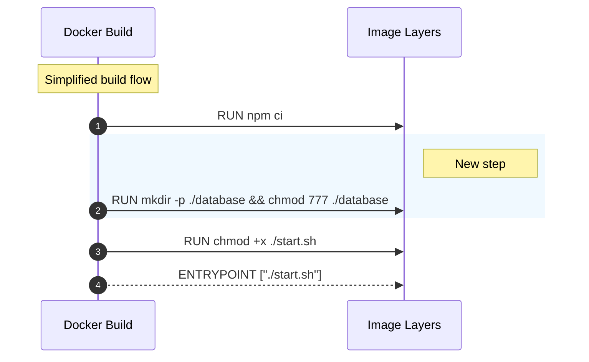

# Anyone can create db.

## Pull Request by @tomusdrw

I initially thought that the issue will be fixed by just creating a non-root user, but the problem is that the system UID is propagated to docker.

On the machine I was testing this initially the `typeberry` user created inside docker was matching UID of my user on the host machine so everything was working, but it does not have to be the case.


## Comment by @coderabbitai[bot]

<!-- This is an auto-generated comment: summarize by coderabbit.ai -->
<!-- walkthrough_start -->

<details>
<summary>📝 Walkthrough</summary>

<!-- This is an auto-generated comment: release notes by coderabbit.ai -->

## Summary by CodeRabbit

* **Bug Fixes**
  * Prevents containerized app startup failures by ensuring the database directory exists with appropriate permissions.

* **Chores**
  * Improves container setup to pre-create the database directory during build for more reliable runtime behavior.

<!-- end of auto-generated comment: release notes by coderabbit.ai -->
## Walkthrough
Adds a Docker build step to create a database directory at /app/database and set its permissions to 777, inserted after npm ci and before making the start script executable. No other Dockerfile steps or entrypoint are altered.

## Changes
| Cohort / File(s) | Summary |
| --- | --- |
| **Containerization**<br>`Dockerfile` | Inserted RUN step to create `./database` (resolved to `/app/database`) and set permissions to `777`, placed after `npm ci` and before making the start script executable; added an inline comment. |

## Sequence Diagram(s)


## Estimated code review effort
🎯 2 (Simple) | ⏱️ ~10 minutes

## Poem
> I built a burrow in the Docker night,  
> A /app/database, wide and bright.  
> Permissions open—hop right in!  
> Scripts made swift; let runtime spin.  
> Thump of paws, containers start—  
> Carrots cached, a happy heart.

</details>

<!-- walkthrough_end -->


<!-- pre_merge_checks_walkthrough_start -->

## Pre-merge checks and finishing touches
<details>
<summary>✅ Passed checks (3 passed)</summary>

|     Check name     | Status   | Explanation                                                                                                                                                                                                                                                                     |
| :----------------: | :------- | :------------------------------------------------------------------------------------------------------------------------------------------------------------------------------------------------------------------------------------------------------------------------------ |
|     Title Check    | ✅ Passed | The PR title "Anyone can create db." concisely reflects the primary change in the Dockerfile: creating a ./database directory and setting its permissions to 777, so it is directly related to and summarizes the main effect of the changeset for a reviewer scanning history. |
|  Description Check | ✅ Passed | The PR description explains the motivation (UID propagation from host to container and why a non-root user did not solve the issue) and directly relates to the Dockerfile change that adds a world-writable database directory, so it is on-topic and helpful for reviewers.   |
| Docstring Coverage | ✅ Passed | No functions found in the changes. Docstring coverage check skipped.                                                                                                                                                                                                            |

</details>

<!-- pre_merge_checks_walkthrough_end -->

<!-- finishing_touch_checkbox_start -->

<details>
<summary>✨ Finishing touches</summary>

<details>
<summary>🧪 Generate unit tests</summary>

- [ ] <!-- {"checkboxId": "f47ac10b-58cc-4372-a567-0e02b2c3d479", "radioGroupId": "utg-output-choice-group-unknown_comment_id"} -->   Create PR with unit tests
- [ ] <!-- {"checkboxId": "07f1e7d6-8a8e-4e23-9900-8731c2c87f58", "radioGroupId": "utg-output-choice-group-unknown_comment_id"} -->   Post copyable unit tests in a comment
- [ ] <!-- {"checkboxId": "6ba7b810-9dad-11d1-80b4-00c04fd430c8", "radioGroupId": "utg-output-choice-group-unknown_comment_id"} -->   Commit unit tests in branch `td-any-db`

</details>

</details>

<!-- finishing_touch_checkbox_end -->


---

<details>
<summary>📜 Recent review details</summary>

**Configuration used**: Path: .coderabbit.yaml

**Review profile**: CHILL

**Plan**: Pro

<details>
<summary>📥 Commits</summary>

Reviewing files that changed from the base of the PR and between 00f166039135129b76855ef3833657f6807152d4 and d32400e0e26da7eab3a644a1ab48a30c2ca02933.

</details>

<details>
<summary>📒 Files selected for processing (1)</summary>

* `Dockerfile` (1 hunks)

</details>

<details>
<summary>⏰ Context from checks skipped due to timeout of 90000ms. You can increase the timeout in your CodeRabbit configuration to a maximum of 15 minutes (900000ms). (5)</summary>

* GitHub Check: run (22.x)
* GitHub Check: run (22.x)
* GitHub Check: benchmarks (22.x)
* GitHub Check: test (22.x)
* GitHub Check: e2e (22.x)

</details>

<details>
<summary>🔇 Additional comments (1)</summary><blockquote>

<details>
<summary>Dockerfile (1)</summary><blockquote>

`29-30`: ```shell
#!/bin/bash
set -euo pipefail
echo "Searching for references to './database' or '/app/database' and for Docker Compose / run usage..."
rg -n --hidden -S --no-ignore-vcs -C3 "(?:\./database|/app/database|\btypeberry-db\b|\btypeberry\b)" || true
echo "Searching for Dockerfiles containing mkdir/chmod for database dir..."
rg -n --hidden -S --no-ignore-vcs -C5 "RUN .*mkdir .*database|RUN .*chmod .*database|RUN install -d" || true
echo "Searching YAML for volumes or mounts pointing at ./database or /app/database..."
rg -n --hidden -S --no-ignore-vcs -g '*.y*ml' -C3 "(volumes:|mountPath:|volumeMounts:|\./database|/app/database)" || true
echo "Searching scripts for docker run -v/--mount usage or runtime chown/chmod of database path..."
rg -n --hidden -S --no-ignore-vcs -C3 "docker run|--mount|--volume|-v |chown .*database|chown .* /app/database|chmod .*database|gosu|su-exec" || true
echo "If Dockerfile lines with mkdir exist, print the nearby context (first match)..."
FILE=$(rg -n --hidden -S --no-ignore-vcs "mkdir .*database" -l | head -n1 || true)
if [ -n "$FILE" ]; then
  echo "Found: $FILE"
  nl -ba "$FILE" | sed -n '1,200p'
else
  echo "No Dockerfile mkdir ./database found by rg."
fi
echo "Done."
```

</blockquote></details>

</blockquote></details>

</details>

<!-- tips_start -->

---


<sub>Comment `@coderabbitai help` to get the list of available commands and usage tips.</sub>

<!-- tips_end -->

<!-- internal state start -->


<!-- DwQgtGAEAqAWCWBnSTIEMB26CuAXA9mAOYCmGJATmriQCaQDG+Ats2bgFyQAOFk+AIwBWJBrngA3EsgEBPRvlqU0AgfFwA6NPEgQAfACgjoCEYDEZyAAUASpETZWaCrKPR1AGxJcAghln45IyYjBQk1CSQtAIaBgByjgKUXABsAMwAjAYAqjYAMlywuLjciBwA9OVE6rDYMUzM5QBiHtgAZm2yeSqI5biy3CRJFC7l3NgeHuXpWdmIyZAEzNiItBQA7gYAyvjYFAyRAlQYDLBcuLRgmLJg0QbQzqS4kEeYp1zM2hjbuNQrXPhBt8bCQJPASOtKGVIAAKDCBSIeJA0WgASgM3SSHmhcIRkCRiBR6IAwmEIvRqFwAEwABipAFYwDSAJxgDL06C0jhpAAcHCpzIAWkYACLSBgUeDccSBDgGKBwSIOATMdQ0PjwDDqeBoSbyag0ZjSuiLfCQNrwAAe6CwSAch3kEvC4gwRHQkHhGDAFHw+GeK0oKAwiHgSkWsEiTAwv01lFiCojkGwGCUFA8sk1bt4gi8zBQyFwsGo4aVskJJDz2QAkiL8zwfdw0ERyabICL8AwANaUADcJYU0a+gYDfGrtYYIU+uFO/dg+EJSfmo5rLzwUXw0g9fo9omkiGc8HT6/s+HjkAA8lhC0q6qripQAOQF6TPT6nWP9gAG/UGwxcn8XQMnRbTUQzDdsu0DKdThNa9IDnBcR0gMcABoT34QYqBlYNIHWfAKG7ehrzCNCBDXQtUDHSBoIQV063hZ4iGwZxMBoE00AledkDIMEfQwNho0QWJ5TAQwDBMKAyHofA2hwAhiDIZQUQUVh2C4Xh+GEURxCkGRHUUZRVHULQdH0cTwATVBUBCNA8EIUhyCwk0GgEzhICodZ7EcT4XBefTUxUNRNG0XRRKMczTAMCDuwoC0vDlAAiJKDAsSAfCrBTHJbBwnF8mTGCLV1pCMHxaFoZA0B3TzosoOKlRobh0DadUPW4PMGB0AhQmdSJKtoagVDQeYongMIxHw+R1hqF4fTQehMNVRAQ0CITIC2QYOotCc9TQzVcB9WhsAOCqVNcm0KUgGxsjiINCQoI7sNbYCaEgDRyn634BCGyIYTCRB8A8KQiLNco0G4bh3oGr7hsOyIurggB1c8bAAaRFKsbFRc77BIZ51GQBa7XgFbWwAdnJjQYAQZAOwYPYZBINp8MiT5O0zftCWcZ5EAlKVnhIS1RDwFQvGx2gN2QBj0A8Fq/QjPhy1Kfg+Dg9gXG4fA9uE8xLB8GWlOJnD4cTJQGA8FjsJp2SBY1ihlPwng6iRBhIHYbVivlSA4jNU5MFIAszRt/CUTGJ34Bd03zaww2hKMABRQl4CnZyDPc0FwU8xmmbtrgAFk6HgRwDCShKjDMiLJJTfhZNs+SHKUlPVOjLgPK83L5DkBQAqM4LTLCiTTvUAB9UNECHsIwQhOgh85u3QrEgfaDSKkABYaRpEgN6pFJ+tJ8IBDSNAUhXle0AyFQV55NA0hpBgqQnOlmTSNJ5+MCzB9wEfyvH9Op9oIepKvwHrwEgQ82AUFIEPGCXYx6z2eOXAA3gYSAkAEpIFsAAIQ8B2QixIWCuSsPOFECUuBtF1PMFCyDUGIDnBMWgWCcG2BIeachJBKEoLQYgc8UgRihiUBgZhZDsRsKoQlWgoYbDJgglsfamZEDEgjF2Zh+1sAiI4eI2gkiMDuFwF4BRohOzKPumo1BGitFih5pKaUht9FKPOMY9hqCkQYEIlWJaqjEAyIoMwpKjiErm0JLYzsIIHAy0QMwgA2lQlBSCUFxNQdAzscQ0BsB8To0WQSEqOPiQlTmuAVhGNUdkuJCUbbmwwNQQ2aTEy2EWJ4SIAAdBKfgAhBAnFgZ6kRogaCaQODq8wjxhDaF4MQBZEy8CTs4R0hVSBBn7DVWKh5vDdUqXRSqb0PqDRhqNbSE1sbzGKOzfGPBKCLWWkbM05NSZoX+igPGyBxFjV0fIMI5tlJdUwPQHKPl4AAC9NxwU+JqV2HRtLV37L7IqBzzQO0qhPDOgYeaYC1HRamBAXAaCydEkpf0AZ4CqVwBKeDgyhkDGEPCFBxF0S6kkaizNXaWm4M7dQ6ABC7GeHBOq2MOKPRhNnBlKSmVsMgE00kPVcL4Q8JcdYkpPqi1BuDSGn1vojSeXs4FCy6pNKxl1VmcNEx7XYCgVS4iIhHjNuEDUV5EwuXUOUWpBJNBYviRw5gBkfHrGcCiogzqXUJTGoEC0TEwiCNYcUjh+F4DVAqR4IJyTUmEvELokgpd4kAF9imxL9Yk+NKbCUWN5tYwIkBMnhuob8fJ4T7FFOxRwspmBKmBGqZEWpShLF80NgyplXwxksz9JIRtWAYRUWzI2Zsj02g+jzAhDlPtAgxkctjdYsB9Rbi9D6bcSENFbm5gDKQ/Y7SqKxp81V2lBkkDeQCs0cFNVLIKn7fVxY5rlXdBSqVYAZXqBFl0qGKrHm7JcDcs0LLUCBDAAQbg4dsYRg8NwNoEwYV8HhVPCgQlfU5Nxa0bCPjzxFpjUeTUZtsBhkqgiMAzjIgMUiPlVWloeVthwbVO9kLZkwjgldG6zBOyPMgAAagKm6+gVzj1V1cp2uC8w6ayvkPtOaJAwAyVkrc5DkJUPBCwAAR2wOHTsR55j6siEnIVrlB3Y2joEXUJBMVloSoJvNqDPUUG9ehnFohA1Rr2PZoRFDa2oMjdG3UcaUn2bEeKKx2HsUZuxVmnJObgs+IgnddmeCeFNhTTZvJBTq0mJyfWip2HCXe3NMmMQMcYXJnoMCuCLHpCU0S7IuiTBUuzMSfYNm4M6DWd87Z91hLHPOZs/5zUgXFFJPi4S8WDAkuunCZFqhABdPxATcC2ALeFglqCqxBm1LqI8hZdhECKOGYscFD2RCmpMF4kQLSC3oJ3IQKxnjPXZpVT03pfT+iXKRci4yfQCFzHWQsJ3EyIDLIaZCK5UCjqbC2Lqk2Yo9IoA0jADSkcYEvP2N8tFIhbc9c+RO1LqbbfELtmTiZvwDCGJQf8gE+CdMqySsM8PAx4+otQd8dEqL5WYPIJCxa4IzrZxzpUgceGyAonRVnFK2aum+3jZ44tNxSyLPumlBngjzC6xw5bth0khZaXidpKyXrdNLmmt+EB6ygPAZAxJY9AH6CAA -->

<!-- internal state end -->


## Comment by @github-actions[bot]


<details>
<summary>View all</summary>

| File | Benchmark | Ops |  |
|------|-----------|-----|--|
| [bytes/hex-from.ts[0]](../blob/fed1278c3e0100b7d3f1e9f8b7aca6c0d9497134//_work/typeberry-runner-5/typeberry/typeberry/benchmarks/bytes/hex-from.ts) | parse hex using `Number` with NaN checking | 136702.22 ±0.39% | 83.83% slower |
| [bytes/hex-from.ts[1]](../blob/fed1278c3e0100b7d3f1e9f8b7aca6c0d9497134//_work/typeberry-runner-5/typeberry/typeberry/benchmarks/bytes/hex-from.ts) | parse hex from char codes | 845503.65 ±0.78% | fastest ✅ |
| [bytes/hex-from.ts[2]](../blob/fed1278c3e0100b7d3f1e9f8b7aca6c0d9497134//_work/typeberry-runner-5/typeberry/typeberry/benchmarks/bytes/hex-from.ts) | parse hex from string nibbles | 547323.25 ±0.36% | 35.27% slower |
| [math/switch.ts[0]](../blob/fed1278c3e0100b7d3f1e9f8b7aca6c0d9497134//_work/typeberry-runner-5/typeberry/typeberry/benchmarks/math/switch.ts) | switch | 251190982.07 ±4.75% | fastest ✅ |
| [math/switch.ts[1]](../blob/fed1278c3e0100b7d3f1e9f8b7aca6c0d9497134//_work/typeberry-runner-5/typeberry/typeberry/benchmarks/math/switch.ts) | if | 245652812.35 ±5.87% | 2.2% slower |
| [math/count-bits-u32.ts[0]](../blob/fed1278c3e0100b7d3f1e9f8b7aca6c0d9497134//_work/typeberry-runner-5/typeberry/typeberry/benchmarks/math/count-bits-u32.ts) | standard method | 93809218.7 ±1.65% | 61.94% slower |
| [math/count-bits-u32.ts[1]](../blob/fed1278c3e0100b7d3f1e9f8b7aca6c0d9497134//_work/typeberry-runner-5/typeberry/typeberry/benchmarks/math/count-bits-u32.ts) | magic | 246477284.44 ±4.68% | fastest ✅ |
| [math/add_one_overflow.ts[0]](../blob/fed1278c3e0100b7d3f1e9f8b7aca6c0d9497134//_work/typeberry-runner-5/typeberry/typeberry/benchmarks/math/add_one_overflow.ts) | add and take modulus | 250333230.19 ±5.58% | 1.33% slower |
| [math/add_one_overflow.ts[1]](../blob/fed1278c3e0100b7d3f1e9f8b7aca6c0d9497134//_work/typeberry-runner-5/typeberry/typeberry/benchmarks/math/add_one_overflow.ts) | condition before calculation | 253702697.5 ±5.21% | fastest ✅ |
| [hash/index.ts[0]](../blob/fed1278c3e0100b7d3f1e9f8b7aca6c0d9497134//_work/typeberry-runner-5/typeberry/typeberry/benchmarks/hash/index.ts) | hash with numeric representation | 189.9 ±0.36% | 26.88% slower |
| [hash/index.ts[1]](../blob/fed1278c3e0100b7d3f1e9f8b7aca6c0d9497134//_work/typeberry-runner-5/typeberry/typeberry/benchmarks/hash/index.ts) | hash with string representation | 117.85 ±0.61% | 54.62% slower |
| [hash/index.ts[2]](../blob/fed1278c3e0100b7d3f1e9f8b7aca6c0d9497134//_work/typeberry-runner-5/typeberry/typeberry/benchmarks/hash/index.ts) | hash with symbol representation | 182.21 ±0.26% | 29.84% slower |
| [hash/index.ts[3]](../blob/fed1278c3e0100b7d3f1e9f8b7aca6c0d9497134//_work/typeberry-runner-5/typeberry/typeberry/benchmarks/hash/index.ts) | hash with uint8 representation | 163.43 ±0.32% | 37.07% slower |
| [hash/index.ts[4]](../blob/fed1278c3e0100b7d3f1e9f8b7aca6c0d9497134//_work/typeberry-runner-5/typeberry/typeberry/benchmarks/hash/index.ts) | hash with packed representation | 259.72 ±0.28% | fastest ✅ |
| [hash/index.ts[5]](../blob/fed1278c3e0100b7d3f1e9f8b7aca6c0d9497134//_work/typeberry-runner-5/typeberry/typeberry/benchmarks/hash/index.ts) | hash with bigint representation | 186.3 ±0.42% | 28.27% slower |
| [hash/index.ts[6]](../blob/fed1278c3e0100b7d3f1e9f8b7aca6c0d9497134//_work/typeberry-runner-5/typeberry/typeberry/benchmarks/hash/index.ts) | hash with uint32 representation | 184.02 ±1.31% | 29.15% slower |
| [bytes/hex-to.ts[0]](../blob/fed1278c3e0100b7d3f1e9f8b7aca6c0d9497134//_work/typeberry-runner-5/typeberry/typeberry/benchmarks/bytes/hex-to.ts) | number toString + padding | 294997.74 ±2.14% | fastest ✅ |
| [bytes/hex-to.ts[1]](../blob/fed1278c3e0100b7d3f1e9f8b7aca6c0d9497134//_work/typeberry-runner-5/typeberry/typeberry/benchmarks/bytes/hex-to.ts) | manual | 14291.6 ±1% | 95.16% slower |
| [codec/bigint.compare.ts[0]](../blob/fed1278c3e0100b7d3f1e9f8b7aca6c0d9497134//_work/typeberry-runner-5/typeberry/typeberry/benchmarks/codec/bigint.compare.ts) | compare custom | 238953099.6 ±6.92% | 7.95% slower |
| [codec/bigint.compare.ts[1]](../blob/fed1278c3e0100b7d3f1e9f8b7aca6c0d9497134//_work/typeberry-runner-5/typeberry/typeberry/benchmarks/codec/bigint.compare.ts) | compare bigint | 259578588.76 ±5.21% | fastest ✅ |
| [codec/bigint.decode.ts[0]](../blob/fed1278c3e0100b7d3f1e9f8b7aca6c0d9497134//_work/typeberry-runner-5/typeberry/typeberry/benchmarks/codec/bigint.decode.ts) | decode custom | 164510454.27 ±2.33% | fastest ✅ |
| [codec/bigint.decode.ts[1]](../blob/fed1278c3e0100b7d3f1e9f8b7aca6c0d9497134//_work/typeberry-runner-5/typeberry/typeberry/benchmarks/codec/bigint.decode.ts) | decode bigint | 100549078.24 ±2.53% | 38.88% slower |
| [collections/map-set.ts[0]](../blob/fed1278c3e0100b7d3f1e9f8b7aca6c0d9497134//_work/typeberry-runner-5/typeberry/typeberry/benchmarks/collections/map-set.ts) | 2 gets + conditional set | 116128.88 ±0.78% | fastest ✅ |
| [collections/map-set.ts[1]](../blob/fed1278c3e0100b7d3f1e9f8b7aca6c0d9497134//_work/typeberry-runner-5/typeberry/typeberry/benchmarks/collections/map-set.ts) | 1 get 1 set | 56121.65 ±0.92% | 51.67% slower |
| [math/count-bits-u64.ts[0]](../blob/fed1278c3e0100b7d3f1e9f8b7aca6c0d9497134//_work/typeberry-runner-5/typeberry/typeberry/benchmarks/math/count-bits-u64.ts) | standard method | 8780985.21 ±0.63% | 89.71% slower |
| [math/count-bits-u64.ts[1]](../blob/fed1278c3e0100b7d3f1e9f8b7aca6c0d9497134//_work/typeberry-runner-5/typeberry/typeberry/benchmarks/math/count-bits-u64.ts) | magic | 85357737.27 ±1.26% | fastest ✅ |
| [math/mul_overflow.ts[0]](../blob/fed1278c3e0100b7d3f1e9f8b7aca6c0d9497134//_work/typeberry-runner-5/typeberry/typeberry/benchmarks/math/mul_overflow.ts) | multiply and bring back to u32 | 235619437.83 ±6.26% | 5.62% slower |
| [math/mul_overflow.ts[1]](../blob/fed1278c3e0100b7d3f1e9f8b7aca6c0d9497134//_work/typeberry-runner-5/typeberry/typeberry/benchmarks/math/mul_overflow.ts) | multiply and take modulus | 249661203.87 ±4.16% | fastest ✅ |
| [logger/index.ts[0]](../blob/fed1278c3e0100b7d3f1e9f8b7aca6c0d9497134//_work/typeberry-runner-5/typeberry/typeberry/benchmarks/logger/index.ts) | console.log with string concat | 8077310.86 ±30.56% | fastest ✅ |
| [logger/index.ts[1]](../blob/fed1278c3e0100b7d3f1e9f8b7aca6c0d9497134//_work/typeberry-runner-5/typeberry/typeberry/benchmarks/logger/index.ts) | console.log with args | 706514.76 ±94.15% | 91.25% slower |
| [codec/decoding.ts[0]](../blob/fed1278c3e0100b7d3f1e9f8b7aca6c0d9497134//_work/typeberry-runner-5/typeberry/typeberry/benchmarks/codec/decoding.ts) | manual decode | 14486895.98 ±1.85% | 90.63% slower |
| [codec/decoding.ts[1]](../blob/fed1278c3e0100b7d3f1e9f8b7aca6c0d9497134//_work/typeberry-runner-5/typeberry/typeberry/benchmarks/codec/decoding.ts) | int32array decode | 153114802.67 ±3.11% | 1.02% slower |
| [codec/decoding.ts[2]](../blob/fed1278c3e0100b7d3f1e9f8b7aca6c0d9497134//_work/typeberry-runner-5/typeberry/typeberry/benchmarks/codec/decoding.ts) | dataview decode | 154691577.31 ±2.64% | fastest ✅ |
| [codec/encoding.ts[0]](../blob/fed1278c3e0100b7d3f1e9f8b7aca6c0d9497134//_work/typeberry-runner-5/typeberry/typeberry/benchmarks/codec/encoding.ts) | manual encode | 2166941.47 ±2.28% | 23.48% slower |
| [codec/encoding.ts[1]](../blob/fed1278c3e0100b7d3f1e9f8b7aca6c0d9497134//_work/typeberry-runner-5/typeberry/typeberry/benchmarks/codec/encoding.ts) | int32array encode | 2831992.17 ±1.04% | fastest ✅ |
| [codec/encoding.ts[2]](../blob/fed1278c3e0100b7d3f1e9f8b7aca6c0d9497134//_work/typeberry-runner-5/typeberry/typeberry/benchmarks/codec/encoding.ts) | dataview encode | 2651723.53 ±1.13% | 6.37% slower |
| [codec/view_vs_object.ts[0]](../blob/fed1278c3e0100b7d3f1e9f8b7aca6c0d9497134//_work/typeberry-runner-5/typeberry/typeberry/benchmarks/codec/view_vs_object.ts) | Get the first field from Decoded | 368659.77 ±2.85% | 6.89% slower |
| [codec/view_vs_object.ts[1]](../blob/fed1278c3e0100b7d3f1e9f8b7aca6c0d9497134//_work/typeberry-runner-5/typeberry/typeberry/benchmarks/codec/view_vs_object.ts) | Get the first field from View | 93099.11 ±1.21% | 76.49% slower |
| [codec/view_vs_object.ts[2]](../blob/fed1278c3e0100b7d3f1e9f8b7aca6c0d9497134//_work/typeberry-runner-5/typeberry/typeberry/benchmarks/codec/view_vs_object.ts) | Get the first field as view from View | 89209.25 ±1.39% | 77.47% slower |
| [codec/view_vs_object.ts[3]](../blob/fed1278c3e0100b7d3f1e9f8b7aca6c0d9497134//_work/typeberry-runner-5/typeberry/typeberry/benchmarks/codec/view_vs_object.ts) | Get two fields from Decoded | 350815.15 ±2.04% | 11.39% slower |
| [codec/view_vs_object.ts[4]](../blob/fed1278c3e0100b7d3f1e9f8b7aca6c0d9497134//_work/typeberry-runner-5/typeberry/typeberry/benchmarks/codec/view_vs_object.ts) | Get two fields from View | 63813.68 ±1.36% | 83.88% slower |
| [codec/view_vs_object.ts[5]](../blob/fed1278c3e0100b7d3f1e9f8b7aca6c0d9497134//_work/typeberry-runner-5/typeberry/typeberry/benchmarks/codec/view_vs_object.ts) | Get two fields from materialized from View | 142365.28 ±2.64% | 64.04% slower |
| [codec/view_vs_object.ts[6]](../blob/fed1278c3e0100b7d3f1e9f8b7aca6c0d9497134//_work/typeberry-runner-5/typeberry/typeberry/benchmarks/codec/view_vs_object.ts) | Get two fields as views from View | 74739.76 ±2.08% | 81.12% slower |
| [codec/view_vs_object.ts[7]](../blob/fed1278c3e0100b7d3f1e9f8b7aca6c0d9497134//_work/typeberry-runner-5/typeberry/typeberry/benchmarks/codec/view_vs_object.ts) | Get only third field from Decoded | 395924.68 ±1.62% | fastest ✅ |
| [codec/view_vs_object.ts[8]](../blob/fed1278c3e0100b7d3f1e9f8b7aca6c0d9497134//_work/typeberry-runner-5/typeberry/typeberry/benchmarks/codec/view_vs_object.ts) | Get only third field from View | 89422.21 ±1.45% | 77.41% slower |
| [codec/view_vs_object.ts[9]](../blob/fed1278c3e0100b7d3f1e9f8b7aca6c0d9497134//_work/typeberry-runner-5/typeberry/typeberry/benchmarks/codec/view_vs_object.ts) | Get only third field as view from View | 88618.96 ±1.37% | 77.62% slower |
| [codec/view_vs_collection.ts[0]](../blob/fed1278c3e0100b7d3f1e9f8b7aca6c0d9497134//_work/typeberry-runner-5/typeberry/typeberry/benchmarks/codec/view_vs_collection.ts) | Get first element from Decoded | 20317.18 ±2.04% | 65.06% slower |
| [codec/view_vs_collection.ts[1]](../blob/fed1278c3e0100b7d3f1e9f8b7aca6c0d9497134//_work/typeberry-runner-5/typeberry/typeberry/benchmarks/codec/view_vs_collection.ts) | Get first element from View | 58148.53 ±2.13% | fastest ✅ |
| [codec/view_vs_collection.ts[2]](../blob/fed1278c3e0100b7d3f1e9f8b7aca6c0d9497134//_work/typeberry-runner-5/typeberry/typeberry/benchmarks/codec/view_vs_collection.ts) | Get 50th element from Decoded | 20906.68 ±2.6% | 64.05% slower |
| [codec/view_vs_collection.ts[3]](../blob/fed1278c3e0100b7d3f1e9f8b7aca6c0d9497134//_work/typeberry-runner-5/typeberry/typeberry/benchmarks/codec/view_vs_collection.ts) | Get 50th element from View | 29860.22 ±1.44% | 48.65% slower |
| [codec/view_vs_collection.ts[4]](../blob/fed1278c3e0100b7d3f1e9f8b7aca6c0d9497134//_work/typeberry-runner-5/typeberry/typeberry/benchmarks/codec/view_vs_collection.ts) | Get last element from Decoded | 21337.82 ±1.7% | 63.3% slower |
| [codec/view_vs_collection.ts[5]](../blob/fed1278c3e0100b7d3f1e9f8b7aca6c0d9497134//_work/typeberry-runner-5/typeberry/typeberry/benchmarks/codec/view_vs_collection.ts) | Get last element from View | 21193.72 ±2.84% | 63.55% slower |
| [bytes/compare.ts[0]](../blob/fed1278c3e0100b7d3f1e9f8b7aca6c0d9497134//_work/typeberry-runner-5/typeberry/typeberry/benchmarks/bytes/compare.ts) | Comparing Uint32 bytes | 18110.66 ±1.05% | 4.62% slower |
| [bytes/compare.ts[1]](../blob/fed1278c3e0100b7d3f1e9f8b7aca6c0d9497134//_work/typeberry-runner-5/typeberry/typeberry/benchmarks/bytes/compare.ts) | Comparing raw bytes | 18987.65 ±1.22% | fastest ✅ |
| [hash/blake2b.ts[0]](../blob/fed1278c3e0100b7d3f1e9f8b7aca6c0d9497134//_work/typeberry-runner-5/typeberry/typeberry/benchmarks/hash/blake2b.ts) | hasher with simple allocator | 0.04 ±3.77% | 20% slower |
| [hash/blake2b.ts[1]](../blob/fed1278c3e0100b7d3f1e9f8b7aca6c0d9497134//_work/typeberry-runner-5/typeberry/typeberry/benchmarks/hash/blake2b.ts) | hasher with page allocator | 0.05 ±1.31% | fastest ✅ |
| [collections/map_vs_sorted.ts[0]](../blob/fed1278c3e0100b7d3f1e9f8b7aca6c0d9497134//_work/typeberry-runner-5/typeberry/typeberry/benchmarks/collections/map_vs_sorted.ts) | Map | 305845.62 ±0.04% | fastest ✅ |
| [collections/map_vs_sorted.ts[1]](../blob/fed1278c3e0100b7d3f1e9f8b7aca6c0d9497134//_work/typeberry-runner-5/typeberry/typeberry/benchmarks/collections/map_vs_sorted.ts) | Map-array | 103502.88 ±0.03% | 66.16% slower |
| [collections/map_vs_sorted.ts[2]](../blob/fed1278c3e0100b7d3f1e9f8b7aca6c0d9497134//_work/typeberry-runner-5/typeberry/typeberry/benchmarks/collections/map_vs_sorted.ts) | Array | 71189.56 ±0.24% | 76.72% slower |
| [collections/map_vs_sorted.ts[3]](../blob/fed1278c3e0100b7d3f1e9f8b7aca6c0d9497134//_work/typeberry-runner-5/typeberry/typeberry/benchmarks/collections/map_vs_sorted.ts) | SortedArray | 199541.54 ±0.28% | 34.76% slower |
| [crypto/ed25519.ts[0]](../blob/fed1278c3e0100b7d3f1e9f8b7aca6c0d9497134//_work/typeberry-runner-5/typeberry/typeberry/benchmarks/crypto/ed25519.ts) | native crypto | 5.51 ±18.83% | 82.08% slower |
| [crypto/ed25519.ts[1]](../blob/fed1278c3e0100b7d3f1e9f8b7aca6c0d9497134//_work/typeberry-runner-5/typeberry/typeberry/benchmarks/crypto/ed25519.ts) | wasm lib | 10.87 ±0.03% | 64.65% slower |
| [crypto/ed25519.ts[2]](../blob/fed1278c3e0100b7d3f1e9f8b7aca6c0d9497134//_work/typeberry-runner-5/typeberry/typeberry/benchmarks/crypto/ed25519.ts) | wasm lib batch | 30.75 ±0.36% | fastest ✅ |
</details>


### Benchmarks summary: 63/63 OK ✅

<!-- thollander/actions-comment-pull-request "benchmarks" -->


## Comment by @mateuszsikora


