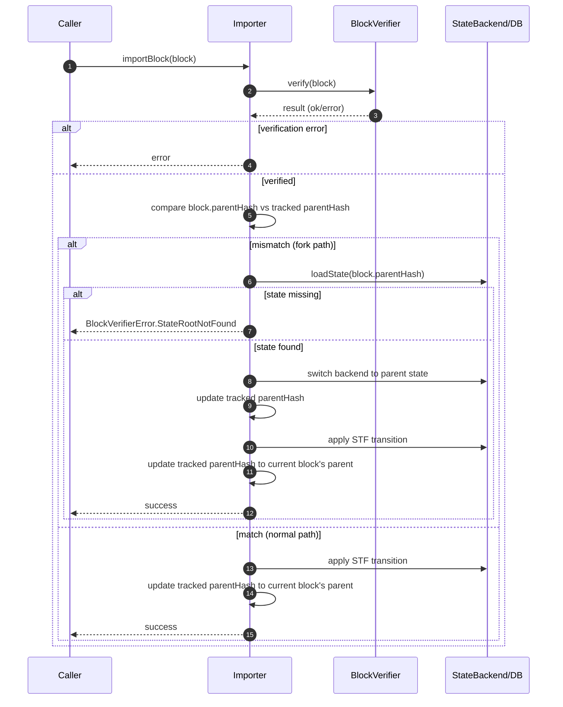

# Simple fork support

## Pull Request by @tomusdrw

- [x] The importer can load a different state, if `parentHash` is not matching the current one (i.e. if we are not importing blocks in a sequence).

## Comment by @coderabbitai[bot]

<!-- This is an auto-generated comment: summarize by coderabbit.ai -->
<!-- This is an auto-generated comment: skip review by coderabbit.ai -->

> [!IMPORTANT]
> ## Review skipped
> 
> Auto incremental reviews are disabled on this repository.
> 
> Please check the settings in the CodeRabbit UI or the `.coderabbit.yaml` file in this repository. To trigger a single review, invoke the `@coderabbitai review` command.
> 
> You can disable this status message by setting the `reviews.review_status` to `false` in the CodeRabbit configuration file.

<!-- end of auto-generated comment: skip review by coderabbit.ai -->

<!-- walkthrough_start -->

📝 Walkthrough

<!-- This is an auto-generated comment: release notes by coderabbit.ai -->

## Summary by CodeRabbit

- New Features
  - Added support for converting “fuzz-message” payloads.
  - Import process is now fork-aware, enabling safer block imports across temporary forks by loading the correct parent state when needed.

- Bug Fixes
  - More robust runtime error handling during imports with clearer failures when parent state is unavailable, reducing chances of inconsistent state.

<!-- end of auto-generated comment: release notes by coderabbit.ai -->
## Walkthrough
Adds a new "fuzz-message" type to bin/convert/types.ts using messageCodec. Updates workers/importer/importer.ts to track parent hashes for temporary fork-awareness during block import, including loading parent state on divergence and handling missing state roots via BlockVerifierError. Imports Bytes/HASH_SIZE and adjusts error import usage.

## Changes
| Cohort / File(s) | Summary |
| --- | --- |
| **Convert Types: add fuzz-message** `bin/convert/types.ts` | Adds a SUPPORTED_TYPES entry named "fuzz-message" using `messageCodec` for both encode/decode; exports unchanged otherwise. |
| **Importer: temporary fork-awareness** `workers/importer/importer.ts` | Introduces parentHash tracking for best block’s parent; on import, compares parent header hash, conditionally loads parent state, updates backend and parentHash; returns `BlockVerifierError.StateRootNotFound` if absent; initializes with `Bytes`/`HASH_SIZE`; switches `BlockVerifierError` to runtime import; TODO notes temporary path. |

## Sequence Diagram(s)

## Estimated code review effort
🎯 3 (Moderate) | ⏱️ ~20 minutes

## Possibly related PRs
- FluffyLabs/typeberry#454 — Touches the same SUPPORTED_TYPES structure in bin/convert/types.ts.
- FluffyLabs/typeberry#608 — Introduces/uses messageCodec leveraged by the new "fuzz-message" entry.
- FluffyLabs/typeberry#590 — Modifies importer logic around block import and state root handling, similar runtime/state changes.

## Suggested reviewers
- skoszuta
- mateuszsikora

## Poem
> I thump my paw—new types in sight,  
> A fuzz-message hops into the light.  
> The chain splits paths, I sniff the trail,  
> Parent states found—or raise a wail.  
> Bytes in paws, HASH in nose,  
> I import blocks where fork wind blows.  
> Boop. Merge!

<!-- walkthrough_end -->

<!-- pre_merge_checks_walkthrough_start -->

## Pre-merge checks and finishing touches

✅ Passed checks (3 passed)

|     Check name     | Status   | Explanation                                                                                                                                                                                                                                                                             |
| :----------------: | :------- | :-------------------------------------------------------------------------------------------------------------------------------------------------------------------------------------------------------------------------------------------------------------------------------------- |
|     Title Check    | ✅ Passed | The title "Simple fork support" is concise and directly reflects the main change in the changeset, which adds basic fork-awareness to the importer so it can load a different parent state when parentHash differs; it is clear and specific enough for a teammate scanning PR history. |
|  Description Check | ✅ Passed | The PR description states that the importer can load a different state when parentHash does not match, which directly corresponds to the importer.ts changes adding fork-aware state loading, so the description is on-topic and satisfies the lenient description check.               |
| Docstring Coverage | ✅ Passed | No functions found in the changes. Docstring coverage check skipped.                                                                                                                                                                                                                    |

<!-- pre_merge_checks_walkthrough_end -->

<!-- tips_start -->

---

Comment `@coderabbitai help` to get the list of available commands and usage tips.

<!-- tips_end -->

<!-- internal state start -->

<!-- DwQgtGAEAqAWCWBnSTIEMB26CuAXA9mAOYCmGJATmriQCaQDG+Ats2bgFyQAOFk+AIwBWJBrngA3EsgEBPRvlqU0AgfFwA6NPEgQAfACgjoCEYDEZyAAUASpETZWaCrKPR1AGxJcAyvGbcXpAAZvgUANb22NzcYbiQkAYAco4ClFwAbADMACwJBgCqNgAyXLC4uNyIHAD0NUTqsNgCGkzMNQBiHtjBwbLFKog1uLLcJGkULjXc2B4eNdl5iQWI6ZAEzNiItBQA7vk++NgUDCSQAlQYDLBcuLRgTBhSFLhgwdgAXh/50M6k8RdMNcuMxtFhEj5cNQtlx8GNwQYAMIUEjUOjoTiQABMAAYsQBWMA4gCcYAAjBloCSODkAOwcMkADgAWkYACLSBgUeDccT4DAcAxQOBnfyxF6URiYSAefBoehoSC0eC9SjsexQmgoYKQAAG3Gc7AAEmhELBdUr8NJIBh8PFQbhrutYGcGMcURh4vyzgAKeAaEgaAA0kF2LqwYri8AwRHOsoY4WQRy9OtWAEdsGRTgBKDQwBAyEiwNASeBhFDIUERdGmlABLxsT3o6PO10uhMeJCaIz6YzgKBkej4HVoPCEUjkKg0ehtRuY3j8YSicRSGTyJhKKiqdRaHS9kzCgsV9BYUcEYhkZTThSsdhcKj7BxOFzndeKZTbzTaXRgQx90wGGoGA1I8zy4MMozSBouDVAYABECEGBYkAAIIAJIXpOaL0E+VbyMOjDFjG0g9qhtBKPQ7xfGAbCIIgaCkFEMRxK+dbiuIMaQLR9GkIi74MCeCoxIO0axoq5D7D4BRWFYADyNjQAAomyAD60AAJpWIpPiQOwL64MW8RbNa3EMSQfFKAJoR8AIdqwLpVzvoJSqiO+eZJPg/AGZKsoNAJ5YjGMyC7GqXGKCq8B0BoRjmJYKEeDQU5lhgyAEK2LkMB4zjUMlSY6iQAAe7HouWMwCJ2AnsOokWIKRimei+8oUesnmFcVM78ogUKepAUkyfJSmqRpWk6S2QEgfyYEQUF0HVDaJD7CQDbqgA3jaaBsFwcFUR8NHSDxJBwSGWbviC+1mRZoghpZp1cedvH8ZAAC+RiKV1/jYQoSiQCipYLbpvRxFwACydDwI48GIUKAG7GE4SUEMkYShQNRI4ls2CghcFIXFGETle6K4c4+E6tcmCkLVQpkbQyDWeEYBoLshrkHRLWQGhARxJKcgoA1ijYAwonoPN+y8JIaIhJFHj0GluBUAm6UGh68QuvKkoEd5jDuuqaRdXG+AK5g9DRtVaCdh8QvqCEFAsOlusq6im6AJgEyBK+qPrloqHyUIQxZmiEZseAIaAJrmdUFTQGA02xcQAELxpEuyNOsJCc1QL505ARG0J2MZcGgwSJfrCvPBFDA5fyIZtG7qUusX4QuzwzO4EajuUCa/uy3Xcsh/D9Bu56HewHmaE6t58jKqqFAhrK8q12cA/xF1aIhtEtBovPvOJRgZsahLwcJoOIZG5Aa8b+lPeH/3zdDyPY914ve9aqgtrxKE2BRyGKK4McKXC/HBtwgADVKARUoIpSY5YfSQjRDYfAdoPK4A6EcKOYcqYoULpKRUDgGCnDou8DwvVoAdHWJcRA1V+TOWXlqM+NBV7cHXjQTe0Zt670XkPNmKJgheDEOlN0kwdYJ0bo/NKoIWFghCHDBmTMPT7UkXwBwAh0yZh6mjRA0UqZoT5rQAW1pFQ0DTsTeR9MHDMReF9Be1B7InxDtXTAsghbQFkmyWSvNlTlw4rGaM1cvCR32hoqA8VErIDRqGeA3JOJpVMexH6H9xBsF0pAvg2dc5iSjrzU25sK4Chji8ZAsdZBMOckaFCPgjQqR8GhZkilj7pMQEnR0Lp8kJxAdyYIkUKAQJtnwUJwQbbMGFoFEgYB+QeHkGlRUFA4n+DOBIM2mY2ZkBUEEYy/AdQwJoHAhBdpkEfwVPEKZnoZkBMgCsa0ElIAFKKSfEpZSKlVMUmzE24gzbwG9ulJQwRRwJSbsrLOpp7JhjIK2FEx5bSQHCLaXYWBF7RSxj2X8/4BzpIImeccl4pzolnHeH6jMojPnkDzDcH41Bfj3Iig8N5mDqBUvAGmKlfqRRCrQFSy9zG9gMJSjIFIGDEnGIyLEAgGBZEZAIWgxJgi0FpMSMkqh5QCAyOvYkxIMiMmCKiHIOQpU/j/JS2cNK6WIAZSQP6zKVKDh1Zy/sPAUQqTYBQUgKlriiETKyqE7LEUGBWgYBIcEkC2AAVfPit5PRWHwF1OgcEuBfI8KsIMPrIBwTNEcaWgbwi2CjQHWNJB42+qQLJZ43JyJkEzTGuNCa4LKloDYD+bIDaQgiUQRAiJ2zhEzXLTMubE1VprRgdwuAvAtpde2qZOaK09trZybkvJkpDoTCOztFbc59zQnRTMiAG2ZoQl2uCWUupzvCDYaQswYKZoANoJoSN6hIN7E3OoTEkDah0tr9qCAeo6l6b1Js1FsBdY7b2+rallHefIMBbpFOsTwZwAA6cE/D1jOJnaJcRYPHkeILVYzllQojEGMn6JBuHLk3mIrAZNiK8z4URCmJBcAhjDPAJ0TUZCmgY8Y6RzM5Fd1FGnIuiBPJW3LlgWeColQqnVX8x+1CzhAphTfAFomp6IAANwoHiKgTKqI+An0QGMQW7TKq2mwEQey1lBmoicFqRAgmMBC1sFnLsYRZAaA/QBxNKI+PdFA1ujyhFyZnBRBmcJdAVOa3EAOs4aAYg2zFmiPDRNuTe03mLPCvniLOa7beuCzB3xbpkTZmMLmANwRw/ydpRBjjPqzeW1zcEwjwAaDvDwB7H1sC3WFrw2Nb1PQy5Aa9RX73hBa5VuCHIrPTtA5Ad9PXfXUN/bcUd03E1AcwNk8Ddc7NKDGzyCbUna7UHSmjSUgmZRyhE5PcT6opOhnDL8408naBWmQK/Li1Brh0YQE6bDy48NMAETp/k0cuO5PRjBVLFN0DkSFnTdjoKrvCdEiGPjHyp3beSsefkYACDcFY9pnKiB2nWk1l4Gz6pNtclR5Qgb6XP2+vc/gTzyUt2Fcy9lpQuXnD5aIMzr9JWMBlYq6Ws21Wit1Ya2bZrT6t1k/G4zz93XP19cywNobW660MC6o2yb+BnhmW5zNn9iA/2LbgstkDjOto+feFcUDtMUHGywJrMjFM8xq410LJgOvGIDfsOEHkYxaDU5q6z4beXRJ68TaL6M4vW0q62g99XctRKG7lwmgAujuvduBbCjfJzO/kW6oBnoKqn/M3Hip8GO8J4W521Q9SkyGFUep2EAotC/O0L3GlC0d9rHq3pIB+gDHmRvIV0Cgue2jIW5VAEhNPPYEgGYswkFzIV3dpos8KSg1u+DgRENwyYuxbGL0rUQBtSQO1lBHUDaNRa/QQA=== -->

<!-- internal state end -->

## Comment by @github-actions[bot]

View all

| File | Benchmark | Ops |  |
|------|-----------|-----|--|
| [bytes/hex-from.ts[0]](../blob/7fa828f4bbf1e063673c67bb3f4ee3a5faf9a1e5//_work/typeberry-runner-5/typeberry/typeberry/benchmarks/bytes/hex-from.ts) | parse hex using `Number` with NaN checking | 132039.29 ±0.43% | 84.86% slower |
| [bytes/hex-from.ts[1]](../blob/7fa828f4bbf1e063673c67bb3f4ee3a5faf9a1e5//_work/typeberry-runner-5/typeberry/typeberry/benchmarks/bytes/hex-from.ts) | parse hex from char codes | 871888.69 ±0.54% | fastest ✅ |
| [bytes/hex-from.ts[2]](../blob/7fa828f4bbf1e063673c67bb3f4ee3a5faf9a1e5//_work/typeberry-runner-5/typeberry/typeberry/benchmarks/bytes/hex-from.ts) | parse hex from string nibbles | 546111.41 ±0.34% | 37.36% slower |
| [codec/encoding.ts[0]](../blob/7fa828f4bbf1e063673c67bb3f4ee3a5faf9a1e5//_work/typeberry-runner-5/typeberry/typeberry/benchmarks/codec/encoding.ts) | manual encode | 3187477.32 ±0.51% | 18.39% slower |
| [codec/encoding.ts[1]](../blob/7fa828f4bbf1e063673c67bb3f4ee3a5faf9a1e5//_work/typeberry-runner-5/typeberry/typeberry/benchmarks/codec/encoding.ts) | int32array encode | 3905980.36 ±0.53% | fastest ✅ |
| [codec/encoding.ts[2]](../blob/7fa828f4bbf1e063673c67bb3f4ee3a5faf9a1e5//_work/typeberry-runner-5/typeberry/typeberry/benchmarks/codec/encoding.ts) | dataview encode | 3676644.93 ±1.48% | 5.87% slower |
| [math/count-bits-u64.ts[0]](../blob/7fa828f4bbf1e063673c67bb3f4ee3a5faf9a1e5//_work/typeberry-runner-5/typeberry/typeberry/benchmarks/math/count-bits-u64.ts) | standard method | 7552044.59 ±0.78% | 90.7% slower |
| [math/count-bits-u64.ts[1]](../blob/7fa828f4bbf1e063673c67bb3f4ee3a5faf9a1e5//_work/typeberry-runner-5/typeberry/typeberry/benchmarks/math/count-bits-u64.ts) | magic | 81199047.61 ±1.86% | fastest ✅ |
| [math/mul_overflow.ts[0]](../blob/7fa828f4bbf1e063673c67bb3f4ee3a5faf9a1e5//_work/typeberry-runner-5/typeberry/typeberry/benchmarks/math/mul_overflow.ts) | multiply and bring back to u32 | 229561187.74 ±7.31% | 1.38% slower |
| [math/mul_overflow.ts[1]](../blob/7fa828f4bbf1e063673c67bb3f4ee3a5faf9a1e5//_work/typeberry-runner-5/typeberry/typeberry/benchmarks/math/mul_overflow.ts) | multiply and take modulus | 232782742.74 ±8.13% | fastest ✅ |
| [math/switch.ts[0]](../blob/7fa828f4bbf1e063673c67bb3f4ee3a5faf9a1e5//_work/typeberry-runner-5/typeberry/typeberry/benchmarks/math/switch.ts) | switch | 219894920.05 ±7.88% | fastest ✅ |
| [math/switch.ts[1]](../blob/7fa828f4bbf1e063673c67bb3f4ee3a5faf9a1e5//_work/typeberry-runner-5/typeberry/typeberry/benchmarks/math/switch.ts) | if | 215695478.05 ±7.64% | 1.91% slower |
| [hash/index.ts[0]](../blob/7fa828f4bbf1e063673c67bb3f4ee3a5faf9a1e5//_work/typeberry-runner-5/typeberry/typeberry/benchmarks/hash/index.ts) | hash with numeric representation | 182.61 ±1.05% | 29.35% slower |
| [hash/index.ts[1]](../blob/7fa828f4bbf1e063673c67bb3f4ee3a5faf9a1e5//_work/typeberry-runner-5/typeberry/typeberry/benchmarks/hash/index.ts) | hash with string representation | 100.74 ±1.65% | 61.02% slower |
| [hash/index.ts[2]](../blob/7fa828f4bbf1e063673c67bb3f4ee3a5faf9a1e5//_work/typeberry-runner-5/typeberry/typeberry/benchmarks/hash/index.ts) | hash with symbol representation | 176.9 ±0.68% | 31.56% slower |
| [hash/index.ts[3]](../blob/7fa828f4bbf1e063673c67bb3f4ee3a5faf9a1e5//_work/typeberry-runner-5/typeberry/typeberry/benchmarks/hash/index.ts) | hash with uint8 representation | 157.01 ±0.74% | 39.25% slower |
| [hash/index.ts[4]](../blob/7fa828f4bbf1e063673c67bb3f4ee3a5faf9a1e5//_work/typeberry-runner-5/typeberry/typeberry/benchmarks/hash/index.ts) | hash with packed representation | 258.46 ±0.38% | fastest ✅ |
| [hash/index.ts[5]](../blob/7fa828f4bbf1e063673c67bb3f4ee3a5faf9a1e5//_work/typeberry-runner-5/typeberry/typeberry/benchmarks/hash/index.ts) | hash with bigint representation | 185.08 ±0.51% | 28.39% slower |
| [hash/index.ts[6]](../blob/7fa828f4bbf1e063673c67bb3f4ee3a5faf9a1e5//_work/typeberry-runner-5/typeberry/typeberry/benchmarks/hash/index.ts) | hash with uint32 representation | 198.16 ±0.45% | 23.33% slower |
| [math/add_one_overflow.ts[0]](../blob/7fa828f4bbf1e063673c67bb3f4ee3a5faf9a1e5//_work/typeberry-runner-5/typeberry/typeberry/benchmarks/math/add_one_overflow.ts) | add and take modulus | 239876090.81 ±7.96% | 4.22% slower |
| [math/add_one_overflow.ts[1]](../blob/7fa828f4bbf1e063673c67bb3f4ee3a5faf9a1e5//_work/typeberry-runner-5/typeberry/typeberry/benchmarks/math/add_one_overflow.ts) | condition before calculation | 250444696.94 ±4.81% | fastest ✅ |
| [math/count-bits-u32.ts[0]](../blob/7fa828f4bbf1e063673c67bb3f4ee3a5faf9a1e5//_work/typeberry-runner-5/typeberry/typeberry/benchmarks/math/count-bits-u32.ts) | standard method | 73265384.5 ±1.44% | 65.44% slower |
| [math/count-bits-u32.ts[1]](../blob/7fa828f4bbf1e063673c67bb3f4ee3a5faf9a1e5//_work/typeberry-runner-5/typeberry/typeberry/benchmarks/math/count-bits-u32.ts) | magic | 211977173.5 ±7.66% | fastest ✅ |
| [collections/map-set.ts[0]](../blob/7fa828f4bbf1e063673c67bb3f4ee3a5faf9a1e5//_work/typeberry-runner-5/typeberry/typeberry/benchmarks/collections/map-set.ts) | 2 gets + conditional set | 115148.88 ±0.45% | fastest ✅ |
| [collections/map-set.ts[1]](../blob/7fa828f4bbf1e063673c67bb3f4ee3a5faf9a1e5//_work/typeberry-runner-5/typeberry/typeberry/benchmarks/collections/map-set.ts) | 1 get 1 set | 59962.19 ±0.48% | 47.93% slower |
| [bytes/hex-to.ts[0]](../blob/7fa828f4bbf1e063673c67bb3f4ee3a5faf9a1e5//_work/typeberry-runner-5/typeberry/typeberry/benchmarks/bytes/hex-to.ts) | number toString + padding | 317511.03 ±0.36% | fastest ✅ |
| [bytes/hex-to.ts[1]](../blob/7fa828f4bbf1e063673c67bb3f4ee3a5faf9a1e5//_work/typeberry-runner-5/typeberry/typeberry/benchmarks/bytes/hex-to.ts) | manual | 15982.16 ±0.7% | 94.97% slower |
| [codec/bigint.compare.ts[0]](../blob/7fa828f4bbf1e063673c67bb3f4ee3a5faf9a1e5//_work/typeberry-runner-5/typeberry/typeberry/benchmarks/codec/bigint.compare.ts) | compare custom | 248436493.03 ±7.3% | fastest ✅ |
| [codec/bigint.compare.ts[1]](../blob/7fa828f4bbf1e063673c67bb3f4ee3a5faf9a1e5//_work/typeberry-runner-5/typeberry/typeberry/benchmarks/codec/bigint.compare.ts) | compare bigint | 229480244.86 ±9.19% | 7.63% slower |
| [codec/bigint.decode.ts[0]](../blob/7fa828f4bbf1e063673c67bb3f4ee3a5faf9a1e5//_work/typeberry-runner-5/typeberry/typeberry/benchmarks/codec/bigint.decode.ts) | decode custom | 161276297.01 ±3.69% | fastest ✅ |
| [codec/bigint.decode.ts[1]](../blob/7fa828f4bbf1e063673c67bb3f4ee3a5faf9a1e5//_work/typeberry-runner-5/typeberry/typeberry/benchmarks/codec/bigint.decode.ts) | decode bigint | 91998812.53 ±2.69% | 42.96% slower |
| [codec/decoding.ts[0]](../blob/7fa828f4bbf1e063673c67bb3f4ee3a5faf9a1e5//_work/typeberry-runner-5/typeberry/typeberry/benchmarks/codec/decoding.ts) | manual decode | 22672915.06 ±0.66% | 85.83% slower |
| [codec/decoding.ts[1]](../blob/7fa828f4bbf1e063673c67bb3f4ee3a5faf9a1e5//_work/typeberry-runner-5/typeberry/typeberry/benchmarks/codec/decoding.ts) | int32array decode | 160023942.3 ±3.45% | fastest ✅ |
| [codec/decoding.ts[2]](../blob/7fa828f4bbf1e063673c67bb3f4ee3a5faf9a1e5//_work/typeberry-runner-5/typeberry/typeberry/benchmarks/codec/decoding.ts) | dataview decode | 159337190.85 ±4.03% | 0.43% slower |
| [logger/index.ts[0]](../blob/7fa828f4bbf1e063673c67bb3f4ee3a5faf9a1e5//_work/typeberry-runner-5/typeberry/typeberry/benchmarks/logger/index.ts) | console.log with string concat | 6753173.91 ±57.99% | fastest ✅ |
| [logger/index.ts[1]](../blob/7fa828f4bbf1e063673c67bb3f4ee3a5faf9a1e5//_work/typeberry-runner-5/typeberry/typeberry/benchmarks/logger/index.ts) | console.log with args | 1052575.38 ±86.59% | 84.41% slower |
| [codec/view_vs_collection.ts[0]](../blob/7fa828f4bbf1e063673c67bb3f4ee3a5faf9a1e5//_work/typeberry-runner-5/typeberry/typeberry/benchmarks/codec/view_vs_collection.ts) | Get first element from Decoded | 19696.38 ±1.5% | 60.42% slower |
| [codec/view_vs_collection.ts[1]](../blob/7fa828f4bbf1e063673c67bb3f4ee3a5faf9a1e5//_work/typeberry-runner-5/typeberry/typeberry/benchmarks/codec/view_vs_collection.ts) | Get first element from View | 49758.09 ±0.75% | fastest ✅ |
| [codec/view_vs_collection.ts[2]](../blob/7fa828f4bbf1e063673c67bb3f4ee3a5faf9a1e5//_work/typeberry-runner-5/typeberry/typeberry/benchmarks/codec/view_vs_collection.ts) | Get 50th element from Decoded | 19782.44 ±1.41% | 60.24% slower |
| [codec/view_vs_collection.ts[3]](../blob/7fa828f4bbf1e063673c67bb3f4ee3a5faf9a1e5//_work/typeberry-runner-5/typeberry/typeberry/benchmarks/codec/view_vs_collection.ts) | Get 50th element from View | 25382.84 ±1.47% | 48.99% slower |
| [codec/view_vs_collection.ts[4]](../blob/7fa828f4bbf1e063673c67bb3f4ee3a5faf9a1e5//_work/typeberry-runner-5/typeberry/typeberry/benchmarks/codec/view_vs_collection.ts) | Get last element from Decoded | 16746.1 ±1.87% | 66.34% slower |
| [codec/view_vs_collection.ts[5]](../blob/7fa828f4bbf1e063673c67bb3f4ee3a5faf9a1e5//_work/typeberry-runner-5/typeberry/typeberry/benchmarks/codec/view_vs_collection.ts) | Get last element from View | 15926.7 ±1.51% | 67.99% slower |
| [codec/view_vs_object.ts[0]](../blob/7fa828f4bbf1e063673c67bb3f4ee3a5faf9a1e5//_work/typeberry-runner-5/typeberry/typeberry/benchmarks/codec/view_vs_object.ts) | Get the first field from Decoded | 279150.12 ±1.28% | 5.87% slower |
| [codec/view_vs_object.ts[1]](../blob/7fa828f4bbf1e063673c67bb3f4ee3a5faf9a1e5//_work/typeberry-runner-5/typeberry/typeberry/benchmarks/codec/view_vs_object.ts) | Get the first field from View | 72186.32 ±1.15% | 75.66% slower |
| [codec/view_vs_object.ts[2]](../blob/7fa828f4bbf1e063673c67bb3f4ee3a5faf9a1e5//_work/typeberry-runner-5/typeberry/typeberry/benchmarks/codec/view_vs_object.ts) | Get the first field as view from View | 67565.53 ±2.67% | 77.22% slower |
| [codec/view_vs_object.ts[3]](../blob/7fa828f4bbf1e063673c67bb3f4ee3a5faf9a1e5//_work/typeberry-runner-5/typeberry/typeberry/benchmarks/codec/view_vs_object.ts) | Get two fields from Decoded | 247941.76 ±4.51% | 16.4% slower |
| [codec/view_vs_object.ts[4]](../blob/7fa828f4bbf1e063673c67bb3f4ee3a5faf9a1e5//_work/typeberry-runner-5/typeberry/typeberry/benchmarks/codec/view_vs_object.ts) | Get two fields from View | 57053.07 ±1.51% | 80.76% slower |
| [codec/view_vs_object.ts[5]](../blob/7fa828f4bbf1e063673c67bb3f4ee3a5faf9a1e5//_work/typeberry-runner-5/typeberry/typeberry/benchmarks/codec/view_vs_object.ts) | Get two fields from materialized from View | 127697.19 ±0.85% | 56.94% slower |
| [codec/view_vs_object.ts[6]](../blob/7fa828f4bbf1e063673c67bb3f4ee3a5faf9a1e5//_work/typeberry-runner-5/typeberry/typeberry/benchmarks/codec/view_vs_object.ts) | Get two fields as views from View | 61195.72 ±1.28% | 79.37% slower |
| [codec/view_vs_object.ts[7]](../blob/7fa828f4bbf1e063673c67bb3f4ee3a5faf9a1e5//_work/typeberry-runner-5/typeberry/typeberry/benchmarks/codec/view_vs_object.ts) | Get only third field from Decoded | 296566.21 ±2.23% | fastest ✅ |
| [codec/view_vs_object.ts[8]](../blob/7fa828f4bbf1e063673c67bb3f4ee3a5faf9a1e5//_work/typeberry-runner-5/typeberry/typeberry/benchmarks/codec/view_vs_object.ts) | Get only third field from View | 80066.02 ±0.65% | 73% slower |
| [codec/view_vs_object.ts[9]](../blob/7fa828f4bbf1e063673c67bb3f4ee3a5faf9a1e5//_work/typeberry-runner-5/typeberry/typeberry/benchmarks/codec/view_vs_object.ts) | Get only third field as view from View | 78903.56 ±0.68% | 73.39% slower |
| [bytes/compare.ts[0]](../blob/7fa828f4bbf1e063673c67bb3f4ee3a5faf9a1e5//_work/typeberry-runner-5/typeberry/typeberry/benchmarks/bytes/compare.ts) | Comparing Uint32 bytes | 20718.48 ±0.88% | 3.06% slower |
| [bytes/compare.ts[1]](../blob/7fa828f4bbf1e063673c67bb3f4ee3a5faf9a1e5//_work/typeberry-runner-5/typeberry/typeberry/benchmarks/bytes/compare.ts) | Comparing raw bytes | 21371.7 ±1.09% | fastest ✅ |
| [hash/blake2b.ts[0]](../blob/7fa828f4bbf1e063673c67bb3f4ee3a5faf9a1e5//_work/typeberry-runner-5/typeberry/typeberry/benchmarks/hash/blake2b.ts) | hasher with simple allocator | 0.045 ±1.62% | 2.17% slower |
| [hash/blake2b.ts[1]](../blob/7fa828f4bbf1e063673c67bb3f4ee3a5faf9a1e5//_work/typeberry-runner-5/typeberry/typeberry/benchmarks/hash/blake2b.ts) | hasher with page allocator | 0.046 ±0.53% | fastest ✅ |
| [collections/map_vs_sorted.ts[0]](../blob/7fa828f4bbf1e063673c67bb3f4ee3a5faf9a1e5//_work/typeberry-runner-5/typeberry/typeberry/benchmarks/collections/map_vs_sorted.ts) | Map | 282171.35 ±0.1% | fastest ✅ |
| [collections/map_vs_sorted.ts[1]](../blob/7fa828f4bbf1e063673c67bb3f4ee3a5faf9a1e5//_work/typeberry-runner-5/typeberry/typeberry/benchmarks/collections/map_vs_sorted.ts) | Map-array | 103690.94 ±0.03% | 63.25% slower |
| [collections/map_vs_sorted.ts[2]](../blob/7fa828f4bbf1e063673c67bb3f4ee3a5faf9a1e5//_work/typeberry-runner-5/typeberry/typeberry/benchmarks/collections/map_vs_sorted.ts) | Array | 63623.19 ±0.12% | 77.45% slower |
| [collections/map_vs_sorted.ts[3]](../blob/7fa828f4bbf1e063673c67bb3f4ee3a5faf9a1e5//_work/typeberry-runner-5/typeberry/typeberry/benchmarks/collections/map_vs_sorted.ts) | SortedArray | 175988.92 ±0.1% | 37.63% slower |
| [crypto/ed25519.ts[0]](../blob/7fa828f4bbf1e063673c67bb3f4ee3a5faf9a1e5//_work/typeberry-runner-5/typeberry/typeberry/benchmarks/crypto/ed25519.ts) | native crypto | 5.07 ±20.3% | 83.38% slower |
| [crypto/ed25519.ts[1]](../blob/7fa828f4bbf1e063673c67bb3f4ee3a5faf9a1e5//_work/typeberry-runner-5/typeberry/typeberry/benchmarks/crypto/ed25519.ts) | wasm lib | 10.86 ±0.05% | 64.41% slower |
| [crypto/ed25519.ts[2]](../blob/7fa828f4bbf1e063673c67bb3f4ee3a5faf9a1e5//_work/typeberry-runner-5/typeberry/typeberry/benchmarks/crypto/ed25519.ts) | wasm lib batch | 30.51 ±0.57% | fastest ✅ |

### Benchmarks summary: 63/63 OK ✅

<!-- thollander/actions-comment-pull-request "benchmarks" -->
