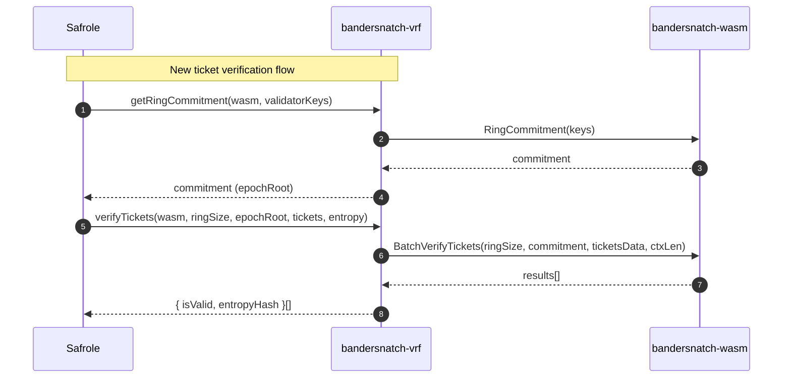
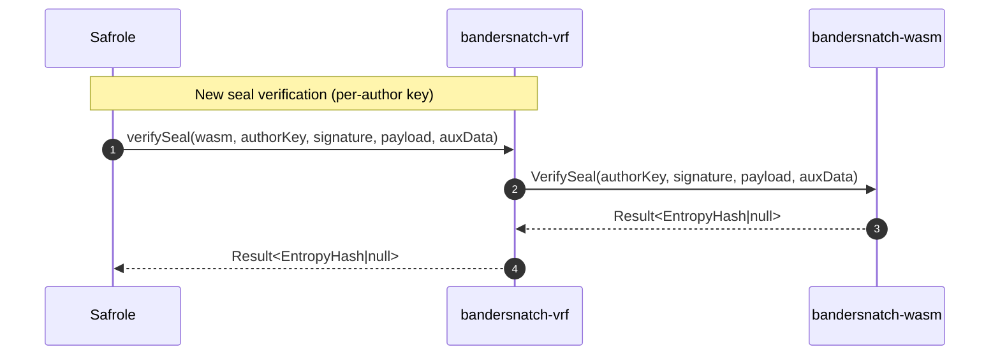

# Update `@typeberry/native`

## Pull Request by @tomusdrw

Our previous native code was always calculating ring commitment, which is completely unnecessary. This PR changes to the new API which should result in much faster seal verification.


## Comment by @coderabbitai[bot]

<!-- This is an auto-generated comment: summarize by coderabbit.ai -->
<!-- This is an auto-generated comment: skip review by coderabbit.ai -->

> [!IMPORTANT]
> ## Review skipped
> 
> Auto incremental reviews are disabled on this repository.
> 
> Please check the settings in the CodeRabbit UI or the `.coderabbit.yaml` file in this repository. To trigger a single review, invoke the `@coderabbitai review` command.
> 
> You can disable this status message by setting the `reviews.review_status` to `false` in the CodeRabbit configuration file.

<!-- end of auto-generated comment: skip review by coderabbit.ai -->

<!-- walkthrough_start -->

<details>
<summary>📝 Walkthrough</summary>

<!-- This is an auto-generated comment: release notes by coderabbit.ai -->

## Summary by CodeRabbit

- New Features
  - Introduced epoch root handling in ticket processing for Bandersnatch verification.
- Refactor
  - Simplified verification flow to use a single author key and ring size + epoch root for batch ticket checks.
  - Updated internal worker and parameter wiring to match new verification inputs.
  - Added zero-key fallback for missing author keys in verification paths.
- Tests
  - Updated tests to reflect the new verification setup and inputs.
- Chores
  - Pinned native dependency to a specific version.

<!-- end of auto-generated comment: release notes by coderabbit.ai -->
## Walkthrough
This PR updates Bandersnatch VRF APIs and their usage: switches verifySeal to authorKey-based input, verifyTickets to ringSize+commitment, adds Ring Commitment usage in safrole, adjusts wasm params/worker/index accordingly, updates tests to precompute commitment, and pins @typeberry/native dependency versions in two packages.

## Changes
| Cohort / File(s) | Summary |
| --- | --- |
| **Dependency pinning**<br>`packages/core/crypto/package.json`, `packages/core/erasure-coding/package.json` | Pin `@typeberry/native` from `^0.0.1-43eee4f` to `0.0.4-22d630b`. |
| **VRF core API (TS)**<br>`packages/jam/safrole/bandersnatch-vrf.ts` | Public API changes: `verifySeal` now takes `authorKey` instead of `(validators, authorIndex)`; `verifyTickets` now takes `(bandersnatchWasm, numberOfValidators, epochRoot, tickets, entropy)`. Removes key-blob derivations and fallback logic. |
| **WASM bridge: params + worker + index**<br>`packages/jam/safrole/bandersnatch-wasm/*` | Params: add `VerifySeal` method; change `BatchVerifyTickets` to `(ringSize, commitment, ...)`; change `VerifySeal` to `authorKey` only. Worker and index updated to new signatures and param passing. |
| **Safrole flow integration**<br>`packages/jam/safrole/safrole.ts`, `packages/jam/safrole/safrole-seal.ts` | Thread epoch ring commitment through transition; compute via `getRingCommitment`; update ticket verification to use `(validators.length, epochRoot)`. Switch seal verification to per-author key with zero-key fallback. |
| **Tests update**<br>`packages/jam/safrole/bandersnatch-vrf.test.ts` | Precompute ring commitment in `before`; update imports/types (`BandersnatchKey`, `BandersnatchRingRoot`); adjust `verifyTickets` and `verifySeal` calls to new signatures and key handling. |

## Sequence Diagram(s)




## Estimated code review effort
🎯 4 (Complex) | ⏱️ ~60 minutes

## Possibly related PRs
- FluffyLabs/typeberry#414 — Overlaps on Bandersnatch VRF API/type exports and key derivation wiring in core crypto.
- FluffyLabs/typeberry#442 — Related Bandersnatch types/constants refactors introducing `BandersnatchRingRoot` and friends.
- FluffyLabs/typeberry#504 — Touches safrole validator key handling and ticket/transition flow similar to this PR’s epochRoot and per-author key changes.

## Suggested reviewers
- mateuszsikora
- DrEverr

## Poem
> A ring takes root, commitments sing,  
> I thump my paw—new tickets spring.  
> One key to seal, no blob to wrangle,  
> The wasm hums, a tidy tangle.  
> Epochs turn, the hashes gleam—  
> Carrot-approved, our validator dream. 🥕🐇

</details>

<!-- walkthrough_end -->

<!-- pre_merge_checks_walkthrough_start -->

## Pre-merge checks and finishing touches
<details>
<summary>❌ Failed checks (1 warning)</summary>

|     Check name     | Status     | Explanation                                                                          | Resolution                                                                     |
| :----------------: | :--------- | :----------------------------------------------------------------------------------- | :----------------------------------------------------------------------------- |
| Docstring Coverage | ⚠️ Warning | Docstring coverage is 0.00% which is insufficient. The required threshold is 80.00%. | You can run `@coderabbitai generate docstrings` to improve docstring coverage. |

</details>
<details>
<summary>✅ Passed checks (2 passed)</summary>

|     Check name    | Status   | Explanation                                                                                                                                                                                                                                                                                                                                                                                                                                                                                                                                |
| :---------------: | :------- | :----------------------------------------------------------------------------------------------------------------------------------------------------------------------------------------------------------------------------------------------------------------------------------------------------------------------------------------------------------------------------------------------------------------------------------------------------------------------------------------------------------------------------------------- |
|    Title Check    | ✅ Passed | The pull request title "Update `@typeberry/native`" accurately describes the main change in this changeset. The raw summary shows that the primary modification is updating the dependency version for @typeberry/native from ^0.0.1-43eee4f to 0.0.4-22d630b across multiple package.json files, along with corresponding API changes to support the new native implementation. While the title is somewhat generic, it correctly identifies the core component being updated and is directly related to the changeset's primary purpose. |
| Description Check | ✅ Passed | The pull request description is clearly related to the changeset and provides meaningful context about the motivation behind the changes. It explains that the previous native code was unnecessarily calculating ring commitment and that the new API should result in faster seal verification. This description aligns well with the code changes shown in the raw summary, which demonstrate API modifications to the Bandersnatch VRF verification methods and the introduction of ring commitment handling.                          |

</details>

<!-- pre_merge_checks_walkthrough_end -->

<!-- announcements_start -->

> [!TIP]
> <details>
> <summary>👮 Agentic pre-merge checks are now available in preview!</summary>
> 
> Pro plan users can now enable pre-merge checks in their settings to enforce checklists before merging PRs.
> 
> 	- Built-in checks – Quickly apply ready-made checks to enforce title conventions, require pull request descriptions that follow templates, validate linked issues for compliance, and more.
> 	- Custom agentic checks – Define your own rules using CodeRabbit’s advanced agentic capabilities to enforce organization-specific policies and workflows. For example, you can instruct CodeRabbit’s agent to verify that API documentation is updated whenever API schema files are modified in a PR. Note: Upto 5 custom checks are currently allowed during the preview period. Pricing for this feature will be announced in a few weeks.
> 
> Please see the [documentation](https://docs.coderabbit.ai/pr-reviews/pre-merge-checks) for more information.
> 
> Example:
> 
> ```yaml
> reviews:
>   pre_merge_checks:
>     custom_checks:
>       - name: "Undocumented Breaking Changes"
>         mode: "warning"
>         instructions: |
>           Pass/fail criteria: All breaking changes to public APIs, CLI flags, environment variables, configuration keys, database schemas, or HTTP/GraphQL endpoints must be documented in the "Breaking Change" section of the PR description and in CHANGELOG.md. Exclude purely internal or private changes (e.g., code not exported from package entry points or explicitly marked as internal).
> ```
> 
> Please share your feedback with us on this [Discord post](https://discord.com/channels/1134356397673414807/1414771631775158383).
> 
> </details>

<!-- announcements_end -->

<!-- tips_start -->

---


<sub>Comment `@coderabbitai help` to get the list of available commands and usage tips.</sub>

<!-- tips_end -->

<!-- internal state start -->


<!-- DwQgtGAEAqAWCWBnSTIEMB26CuAXA9mAOYCmGJATmriQCaQDG+Ats2bgFyQAOFk+AIwBWJBrngA3EsgEBPRvlqU0AgfFwA6NPEgQAfACgjoCEYDEZyAAUASpETZWaCrI5Ho6gDYkuAVW601CSQAAYAAriy3CQClC4A9BjUkiQhkJAGAHKOsRRcAGwAzAAc6Qa+NgAyXLC4uNyIHPHxROqw2AIaTMzxAGKe2ABmg7KVKojxkdG5CdzYnp7xRaUZvoiUXATM2Ii0FADuZQDK+NgUDMECVBgMsJu0YBQkOyRSFPCD8JRl0M6kuJArphblxmNosBkjrhqDsuPhohCDDZXl99pRGpAwTQdgAvRDwADW+CoZTGsU8GIAFBh8OQAJRlADCTyC9GoXAATAAGDkAVjAXIAnGAAIz5aAiwocAAs0plhQAWkYACLSBjvbjiWlcODBWyYxQfL7IJLiKQKJQoLDhKYxOKyRLJKQhDTWJ4SeCnRCeWQAGkguFgwVNKRQzG43jYGGhWqwaE8+zQsmQDHjDHmrMg7wwRAUrHUUdwAG4AwgU2mM7GUMhsBhyBdEIhnLJXbrGLBMKQDVJkAR0JByIcAIJWACSVpoGCU9D7aAk+HgM47ANr9ekTZcjArnmStPQU4D+B4FHwHst21ukEGaEQND463jkDeRtTsY0Rn0xnAUDI9HwgxwAhiDIZQaHobpCy4Xh+GEUQzWkQF5CYJQqFUdQtB0T8TCgOBUFQTBAMIUhyCoMC80grM0EOBwnE3OQLWUNDNG0XQwEML9TAMbg0AYAk0FICYmCeeJ1SiAh4m43j+JIDQhEQbUDAAImUgwLEgIdR2AkjMxosFN3/dtO2kD9IGRCMeLoSAlARJQbnkN58T3QZiUgCIojtCgEhDc14CwSS+IEkTiRIESXE1fAJJ4gKZLkpyT2YfsHM9LBri7AA9LkNEykUwGlQoSAK6UANnHhfPIegkr3TLMulMAOQ5Wgii5TpIEyI98EDb5biM3sj2s38yAYY13yMVTLCHTw713DBetLYIlAYHdSOS5ADJIAAPbhiTIly5gETx4AYSB2HUY0TLawycwQvsNq2igwIkjoDqOk7Iis0QlumxAS1pH1+36qdBvs9FksgbAAiCK0eCi6TZPkjARoAUVveAsUs5DgndVFjuGbauAAWToeBHCUlSDAgMAjH86TBOC+JlAcJ4wGQ3yiEiqTSDhhTlMUsb1M04jQMs3Tm34ADuquxATP8QIyM696bKB97FucaarxctzpntR14Kh6nAqEkKGbOEhmcNHN2eirmsEGeLIAyrKNByvKCpIIrD0gaqNFq+rGsKZrXQujHLoEn6MD+gHbIYYGKEcvyytZkbzHGybQJWj35YWz7Y1WgDbu2yzdqew7jujU7jPJyBVUVuzlez0HwdluguBtdyZgdbzUihkJ9ekILhONpmWYt3vrbSCXSHoW2WFCB3sty/LCsGNI+xCL2fYapqBBCIxkfENHwMUTGURIQ4SFx+6CaJkmeY/Tje4mIQ0B6Jtp+8eIBEwFDEFNW4wAkCggwNA0FvMAxopNeZqQ0lpIW9ARb6XFh2SWJlRzRhPLQbAFw2THlNiAgE2ZcwQQLOwPMcwYygw9GgfssRnJPEgLAfA+ACRcH+DYVmjIWDMGIdGSkVFtAAk/oDWOv9YAAHUbzMH9II7+IiADSJBkwMhvPiIgM1yLcIBJSAAQl/dEIi2E5hsIw3AdIw5Xm0AMJ4/pAwnn2Igd8UAzI7iwXNHBHovToEQLImk+wMBHHgDiU2+wqDcGiPQAkCiFALDgqDfYbR+zmV8ugTySYxaQAicmAM7k2TIB0UIn+1BbjyL9GDfEOZIBaNkCAjQ3FY4kEqSAykGhml0i0IgAA8txAAjtgEgwA8kyMKbAYpehKStMrkOWg04eDFyOraY6m1tq5N0cIoZxT9z0AGXooZBiiBGI6leO2msPIJFEuFD+KyCm4FuHDDZpTLKdXWFk6IyAknyzwQ4p8lAPiyA8LxEguBywLHsPAVRMI6GN1ZFwHx0NGwIV4YmdQgJLkiPEYgSRyL8lyIUfY7wOZAz+iIbgQs1jDoRMBf6dgJ5uCyAZL5W8JA0B/gAgi/hmLBnXLERIqRKK1k4tJf8ilpdcDUtpSWJ4B0EJ7nloOdRxL2CfOfCMI4jLPBbgWDWCGcsjyDABZeeWiBohDU+EdDJiErRKHWocmeGSMRDhSS2aezBKS2q6O0DABJEDaKHJkZUiMbBHEyEOaAjIAASAB9WRiMACa4atHRugIjI4dI6QAG00B4AYRQVBlqAC6GgqD7H9E8cyQ1ymusLXcjNgZiQ5o2p8yZtBTq0kfKjO6nABxHw4HgzthxfKLWwEoGQ59gqUqSPtVmrjZXrFwODSA+xiQEkGJ4fA+wk58wmlNHOGcgx11Vtutaiz7qFz4HtZ6wry5S0rojI9ct3IVN5Zy9ZTLplJOYIoeYwRW5a08g6M54lpHbM5XDHeUAb3toeferZqzOW7P2QCF9lk30fu8KEY57dQpiQioBmDNy5I7wMHvVGmZg5Y1PjjWhHbQ2gtgBAu+lMuIw0Ck/F+aA34hRw1cv+ACgGArcLfKBAsQKkWFo4PS8gDITwrlAUc4Y8amRIO+qQ9AABq8ZFzUFrYDK1TrXEEG4GAbwUg1WIzQfCWQoabywHiGpg6sstOWrDO2ksMLfryFMyK8zlnECwGrE5guU87aKXQ9rfa+BeKKRGlAKwsz1Jji4Eq2QKrHwqNNCbEOCFdM8QuJqSdVCJDqfs7HZJVB5Bf37LZjTBBs3aY9lQspRBUPVqzes2pz8AWUBLPLQYtYxCgxhdxOFyBmvEmKQWqiO7giJnReqtV5WnhKeuru3yd42BNshrahQM0RWYLfCZGLE6jojlHAl75Iw/nkuQKl8FwQpPIF09CAkeWnyFc08V5wpWM5oCe+UjAORKDtMGJVorw2DwkC2rceDXXlvRkoEkNVSrDpq24oGPz+JwwHU+A8o8qZgWf05Sps7vyyUAupP9iggPgdvcQJSiHsB4PjaLQGEngLlTUDQIS2kNB1q4EqGQIggYGRNqeGIH0xbFOnknfLXgKIPGbZQpINW5W4jEjAEg2gB1ynXgWJ/XiUXICoLvPDyAK7WgMFO+8ZVqrO0m9pKQPgCuez9k22FgQ1qEoFbs9TksLxhuZtGwoxnVl4Ai9wD6V0iWLsApNEeFdV0+ACGwPATwtBhvpJxYCFdbuXK+/7CKv9QzkmnAPPj24hPLfE8FSWJFwu4J/SeLOigaj5bTYSk8Bwk1kBglCdj6swO7lUq81Z/X7TOr3hibSDErD2GcI0dDVHC3wT3d67GeMf0DXtZczjpBAknxIHgPtYIfZ1DIDPSXa7jfghvN3U24Y66oGp2WpPybe6n9qMPRBv8p7YuvTOpXQmNacCoKaWEKWqzcoQiWyWnglInGIiXA0GM0QyaKGKnuVWxIGI0GXGwyCiqaua/oI2NWlqXAVO1Wda60/oF+Js8Bj6ZegC/iYKl+/o3EsgK6TK8BVS0gWiWeY6GMtAvgM0qqdAoajKKE7BICXBggdIXAVg8USAfSyIHeuAwAHmoq3msA/of2CwegegaQgASYQQFE5QEwE0F3APpCKIGcrIH4H+4UDFLUFYp8olKUFPD2Ecq0GDD0EgEkBMFJisG0BiGcHcGly8H8EPjeC0DCFMobAVIcGIASECBSFugsByHAAKHzBKEqFD4+YaHzCeDaEEZQAAEMJAEMHpaQpgQtyR4s5eqwFDJcAsi0BuZmFuHYGyC4ECqXb1EiFNGeF0BR64DtHCqipcCZE0pqGJEyHJHrDAAADefehWXAAgjC3gmAJYg+YxVmIxZmGxPmkAAAvrgToZAPoSEFUYKjUSYa4XDk2JYdygOOTpTq9tVhiH9swLkLTuFvTsYlcbhvTqzPBh0dHl0Uyj0cAX0SzoMesa4JAKMRZlZhMbIdMXMUgMDoscsYyhgGsdsXCT5lsZ5jsb5gcbmjobvCjAfAxFmCfGfBfFRjRnRuTPfExn3CxvEK/CeO/LUZymAK3vEL5JamAvxipIJjAiJnAmJqLJJjvtJl8hXlAVwMiItkuMEJtuVgQWQdDFQGwHeN9OgFMpZAQc+r2LuvJKhmar5GQq6Adues4bdlKfdnbC6jin4CtsUPaqVtYTWoQRtNCuThQcATds6dGK6Q6j4SwfgGwZAL4C6W6UmNYetGztCIGbgMGaVgyH2LwjYXYZGdGSGSCqUS4dmUGTGSUswX4UmSmbGTgPGezuWcWa0gbrDk3o+FYKrMwDWE2F2OUfqQwEJE2jmH9BmZ6esiWs4ghLavEGqdpuMpXKXrAOXj8v0fKeDqOUqenpkm1lqd8HEgvqzP4oElWnqdgkSoWBqe1neJabFjaRlvaTPI6cmLWbmeIOcQmWgA+e6VttzrzvzoGD6W8ZQGmUeJSAQnuT4PcX+RQJzvmPKtGG+ZWU+Zdi+bBSUkwLDjznzviqYa8bkPWYbnDs2a2e2dJGDGAWyD2cSH2Y1vIEBbuQEsEOVseSQiORZGuYgNOcnOpI/l9C/lnPuunB/gFvwN/odheuINKUUYoHmV4cRU3P4aEDeLIDcDKT8kYbakhR6VmmQb+e8ZJQGYWcmcWaGWWXpRWSUhmtWYmcZXWWkEkirI2KEAgTcbcMgdZdaA/PECyWyfgBySYdyRIrydpmAnoXJYgApUdJAaqoOS1gompTpZfjFaWeGbJVGUWbmWZYhZZQ6nSC5YwDuHZSEA5UgRItlT3EyY/M/KyWxuyRxj5TyXyfWoCgUZAOJSUVJV2bJSEPJYpbOfOedizneRiMlfpY+dUelYNSZZzqhV+RhVpf+dlbZcgPlSshYU5UVd3G5R5ZVV5dVQ4VybVQFQ1cccFaFcigTkTv0dRTmCBTNRBXKhRGNQZczs+TWRle+ShZ+ehQLpheTllVDPNfZUtY5VyuisVeteVZ5d5TtX/HtfyQ1aSfvCRkfJSR6ORufJRlfE2jfGTBTFTKVe5WDZtRDS0b5eipFJqfYnxnRsKYLKKfYOKQgteSgmZhgi4gRPCGgD0sEIjt8IuCdFjgnmVlMs9o0QwGbKwCQsrres9rKvMupjeJAD1V8F6VapSPnPdM8sEArZQOqQALxgXYV6y40bXsYXKQ2wDE09Abnk32LXo84DSrln5HZjjmovpS3kZsDgUv7NWlyODEGGHW660cifIO2nmbl8DzKMzXgXDXluDpBQC9AuTyw6KnUV79HIAFbvCYAAgGQ2BUQtlk3i6loPK7peXhJOkvWpLbm+a4ALpXhfAp4YjAW0XXV3IMUwXl1UXwXR4vkt1c4bRTWfWUlgi+TjKx2QDx1h27o9VJbW7p3wCZ1pI537B53Pw06UmF2l33nt1Vo2GaV61bnxIGnRVb2Ug2mGWJVxnd2L7D2fJti7IcJQUnmz3z0N5L4sVIWQDUjb5GQ7rUAvYZ3RhsUbqcXbp9iZwfS8XP78XHpf4zLCW/7SmNrgGa1K3oAHQ3gGCj2q0AjzLIM61718BJK9x42sbG2clQ1+WW1gLSwkVXyAHe0JTH43ADCWhT1QEYO6ALLtr0NNUArFGQBzF32z7QUAi61cj+hJ1l5nXVGQC60ij+isP+2QAcj7HUMyXym50EV/1z3RhSyj0SNzlSPnFaPz1SaBYsAx3pAcOqXt3sOj2d2s7PX3UOq2McNvV90fU/n4MuMEAWOj2N2BLXUuNQCt0dpOOlZBOPUIWOM5nhOWOuO91oXflfXgXsNQAKOPhP3RgZZmPMC+NWNl1hNJgROTlEFeNxM+PFOZlH2FOyARM2lIURMJURk1OVPmWvk2OVxtQ0Dykz4P0kKZP4KKav29ZSn0D9VIXTlEbkmkZUkUbybUZEC0a3wMkMag0kNVUm1E08kLoUARIUACmU3jRCbaRkTwISaII9QmT6NT2p06i7qt5Xgr6gy45qowrZbg6AoBg1190kgbkdbFYXVEAgU919MAOAgjp0LywbRIDiDlLml4Cr3lbywvN+a0JYhkQ8Qnh2XbCTTwARjBCa7SCugqpghlwvMlJIq56UP+N0UHiUMhNQwu1VigMjXs492TUeOwCfLpOeB3NTYSKPM3BVhXnlY7BEWmNfYRKARRXyD0o0BMppIqkHglMbTi7M1S67p/N3gKC1gAi6afDmh9jORnAf2H1OH+mMHQxhlMoX3s71m4TIBMUNjspAYrXooaCJbhphGUiUO2o+Fk1aA73ab+sr0aCn0h32JNO0AhttmBttMMiV0uu/HIEetE5esRWUNmsxv2LhuUNRvZtxsvnjKOK9NcLCPz6+ZX1qIjNGS0CfIcJmZqrLqroD6eQuTq6a65hVuuJNhsAf2TFcLrAFrSBeXmiJtUKyoKFbQCGAMP5brpygM37gNv65ycMCVFxwNlyiVXrRaxY9ZCugxXltUtxkNA3MAaCznhqev2OIDZUt4CsraUCR3BgtuPYIQhCAsgWQVlskqRNd3s4TXvVJM/VysiFpLS5YweIft+t/sOPQiAfuPAchAlgov4g0DSWZh9iDYLXUs0WBJpDlYlUBshMuiVxWklz7t9Z7hHs0OhCnspuethF3v3MPuNnPu9oBjfbvuRUB7mv5neFWt+G2vQggfbZgcGTQf8rSsOaquxUmxn02tVlFvIezYgrodtUezYehCZtVOyAEfKu0BCA7AIYUBECODsDW27vCW2iskWtlFgEtzL1tlpAq23pIauWG342kM1UUMEUgYMgaeMMDqWhY712hA0v6f0AhAkfqx8DXOGOXalJEVItHhOtfq2ohDxAdVBuWppCJvZdDkKJpC0Ly1+2Phiucxw3EZkQzPI3Ulo08MY3MD0nY2MYczMlecbPg2mxhEHMCZHMik6R03nMM2VyG7oKYIIT1asyobRAUBgBha8RgAEFrlXgrqHCqmQAKj+rtKrfa6eC64EixfNGuu+aI6vjJQWNQCIP0BtpLLHcNLSDiOxHxH4EHhaI+p+oBpBohoRpRqxrxqJpHDzrxKYHYryC2jvij03cVKff+qBrBphrhrbc2DtKRoxqeL9iBIniWRg+OFQ8cOJaREoRQEceO4ISLcEhDg5cbR3KU/U+FfyAPa7pBhREUCskxgCf0Vr4yAmEqaAKpuynW6Jv0+6eQAAD84vsPvq8PP3SPKPaP/3VoDKCrBk3e3AeWwKqBRWLFdydV60k69ErPKEgAmASvIBWpNKVW7xiiJtD9EceCDQj0rSe2GRK63a/U5aC4CUge+kFTni8XsmF3LYdTdi+S/S9fcI+/fI87fo/RoezhXxgF3OIavBAy7uI7AvZe7PEaDd5NItKQAADUWfaBKDFXMklvifngtvgYxSMehw3QZCFPK6vEDPMrMjJfIOXvPvTxMn60dIAfp7wfyizf4WVPYfUvH3Mv33iPEaCvcfCfZXngyfPEqfbinomfvv6BufaA3A+fGgDIxfW/ZfHZFfOEQYTyd2a9o5mI6R8AYAZq53yO1AsAyA47PAlAy3NhD/kSzbG3yr9gNjMEH26Hc1y+BYYDEnKRvV2Sa3FtkkihKslTg5wTmmdiRyxhASAIJ/ugLuQgCooP/GOC+Gf6BhLOTVXyC5Du5q1ysvkU6OphxBqwr+ZAFQKhmx6EAzUuA3iAPhmjpYUK+IBlFkzNQds8s6ofAHZSwGgwtSxRa2qNDnZpxn8i7eaMuy4pQMdoQlc9PAx3atQv6ksD2FgzoCPRN24gN6DaSkFTMEaloMjPV3kyEwmuLXRku1zKrrMtqFVdjH1yFIDdqaQ3WiCNzuwoI5MlAqZGnmlpQYTCcGYxO7lci2gMM/6I8FQKZqTdXknzcvpj3ByfF4MUMexseHCzrhE4ZHd4AVnQ4SCJKV5f4JkFPj9EhwPZRwJWBchvMeyHzZACkMhzfETuvxUIQclFbrAEh6QlnFbzQHJQb6u6DIWIL3Aos+wp7fnkAjOKJdUAGnXTNhzyxxgHUaSObv/F74J4g+m2LDsomexMBdWH9Y/rimA4D46cAJEOGv0o6xgzenDOCPqVM7mcdGAwo/NcDQ6gw/+fmQLkeC06NCviByFbEeBKFlCWcFQ9MDizez+hE23wtIeTxyad83sdfNIpND15MNB07nHtpzww40BHhx0E4WENQCN88AlkfYEGCwBQs6c15PfFQnGEC9p8OYe+j+3FoHhUwnkL4EuBPDYBFmHsBwAIHWAc0smDKBoPfhTjzs5BR4MBirBXZpJdBMDYOuoPOi0gSAVXaZojQsFzNL4kABZksyxpsQOIP4A8AZGrRERhMCNMWm3UrRnNzUGMVCGoGYiYRtR2EOVOGkXCIBw0FgugF62hBq1PwBge0byBKBihpQDAYoDEGlC0Big0oYoIKEjGFARQHIYoFyC5DSgBAgQGIKGNoCCgRQgoAAOxih8grEdiPaKJSOjU8Loqkm6N/B5jvR34HBOGjYCmcSA4aW4KIE9TujnAAIL0TMXYaKQkAtgCQv8loB0j2AVgEQWBEUhcBtc6wX0J2J8ynAU8vYgkLYFHHmIKQ3hTsUgHaRvB3gepDAIuPHErj0gikJtLQBsC1hlQ4WKEAQkQCMggwEWTYBQF6STj9xh448RgA8Bh4SAV4psYuJ2x7jIAB4xcM+NVCIB1QeLWMB+JvEBg7xP4xSJrgiS0BRwjYXpIgHPGLjlID438blVwBgSCQCIwFIuNTQuMOxcTfcY2N4iZB2sKE18ahiwmKQ0JcTRSLeBhCIAvxkE2iZY0Ui3QdwIYWkBRM1a5FKSHNW8MzjfGQAAAOopBliQxv0JyDuE6FSBiT0AlQkTBHDVDvBYgRpYIEPSwBSZ0hZYa8gClbC7ozRw3ewAwjsSlhf6EHYjJuHfS34+he4GYVqjX6RwlYlUG2BrEiHaxO44QueE7AXiux3YfYdeHVE3j+w3cmLEQV3jv74toY7Xa2LXW8CIs48uYRNkJHbzTsKKcWccFfz7AOBQk20KdORi8ltpIw7AaaK6FEQIBUM7yLwFfiuwsBT4y4SANTUOj+gkUqUuvLK1sjiAsc6khQHQkb7yismsQSdBpyoHIBa8oueQBKkw6ijd0d2AFAAHJT87wcTDMgoBbQh2NElxvuPbxeU8AyUFCVtKIm/ibJJAFCYmCbyswjpRExSCLlpCfAzOTwHcfGAnHbTfxxIUFL5HjBYSyJbAFCYYO8C8w4mexViYRJukkSCQv0s6VwEUiATgJuWPcNRNYn7iGJs6JibePvFvT2Jm0TidNB4lp8+JTwASQCCHTwyqweIlYhQHrwkAdw2qVxPNIQx0sTwZ4BCGwEwCswesaqNxjznQBLE8Arid9GaDVixAEAB4ZFnaVdCjgAQHE1+oGAsmatIOmfLycHGmxgw6wogdcM4GTxIRtwyQcpAQluoMilw8s4MORmOwmSZx9AdvOkShjXgGU4+DJqgIu60gDJqAUmRqCrDqZVEb/GmWqkTbItEaV/acb4h0mYwJsZzcEQgEvBKB3022ETJlINC2TnZzeWacEDx6cp5aNgXoL0OTmYheGigUHKuRWwTcqOWAAyAbIZaCCcwGga6XRN2kDBYwh05GSdKPjnTnAGAK6c3NumiB7poKE2M9OXFdyPprQeHD9PIkwz3ZIEg6S4xBkESsZEMqGShNPEMBbwBsjhG8Gki1y2JqMnYAPNenHTsZ5kLiduJhnLzV5k6JgBvK7CoBqoXIAAKTzoo5vmPCFwOGCHQvg0YAycfB6Qh4i67eBhCnj8xxiso98muV3Prn7TuJMM6NKcC3ApRawaGS0SoGtEsQPB6HYWufJzC3sPYbaZmfNHCyYLCEp4ZQJzC3n7jTpbcy6TmDIXvT3gI876deMhnjzfxGCkVKzCYkzz2GeBTsRhNsBwyPZB0mGe0hNbp8N+JoWSRSVVnxhEwmSXHOmFpmToK5QjX9kSMOjPyUwLAfFjQD+irgNZjYZsK7OQD6hspqcgcGbKdqqLLw04+YFbOkA2y30mCXzHbO1ZhEc5ZU66dBJvC4BbAlE6Gb+IknocpJGGTuCEF5h7EdR1Y2saQAbGMLnR5Y/QEAA -->

<!-- internal state end -->


## Comment by @github-actions[bot]


<details>
<summary>View all</summary>

| File | Benchmark | Ops |  |
|------|-----------|-----|--|
| [collections/map-set.ts[0]](../blob/8f2e14652cce7c092a7bc937150aa8aad9d941b2//_work/typeberry-runner-5/typeberry/typeberry/benchmarks/collections/map-set.ts) | 2 gets + conditional set | 69180.63 ±0.85% | fastest ✅ |
| [collections/map-set.ts[1]](../blob/8f2e14652cce7c092a7bc937150aa8aad9d941b2//_work/typeberry-runner-5/typeberry/typeberry/benchmarks/collections/map-set.ts) | 1 get 1 set | 42402.65 ±0.28% | 38.71% slower |
| [codec/encoding.ts[0]](../blob/8f2e14652cce7c092a7bc937150aa8aad9d941b2//_work/typeberry-runner-5/typeberry/typeberry/benchmarks/codec/encoding.ts) | manual encode | 3241295.76 ±2.1% | 21.55% slower |
| [codec/encoding.ts[1]](../blob/8f2e14652cce7c092a7bc937150aa8aad9d941b2//_work/typeberry-runner-5/typeberry/typeberry/benchmarks/codec/encoding.ts) | int32array encode | 4131929.65 ±0.47% | fastest ✅ |
| [codec/encoding.ts[2]](../blob/8f2e14652cce7c092a7bc937150aa8aad9d941b2//_work/typeberry-runner-5/typeberry/typeberry/benchmarks/codec/encoding.ts) | dataview encode | 4125636.03 ±0.44% | 0.15% slower |
| [codec/decoding.ts[0]](../blob/8f2e14652cce7c092a7bc937150aa8aad9d941b2//_work/typeberry-runner-5/typeberry/typeberry/benchmarks/codec/decoding.ts) | manual decode | 23855230.87 ±0.58% | 87.04% slower |
| [codec/decoding.ts[1]](../blob/8f2e14652cce7c092a7bc937150aa8aad9d941b2//_work/typeberry-runner-5/typeberry/typeberry/benchmarks/codec/decoding.ts) | int32array decode | 184091261.27 ±5.7% | fastest ✅ |
| [codec/decoding.ts[2]](../blob/8f2e14652cce7c092a7bc937150aa8aad9d941b2//_work/typeberry-runner-5/typeberry/typeberry/benchmarks/codec/decoding.ts) | dataview decode | 183535160.29 ±4.84% | 0.3% slower |
| [math/count-bits-u64.ts[0]](../blob/8f2e14652cce7c092a7bc937150aa8aad9d941b2//_work/typeberry-runner-5/typeberry/typeberry/benchmarks/math/count-bits-u64.ts) | standard method | 1350432.41 ±0.39% | 87.35% slower |
| [math/count-bits-u64.ts[1]](../blob/8f2e14652cce7c092a7bc937150aa8aad9d941b2//_work/typeberry-runner-5/typeberry/typeberry/benchmarks/math/count-bits-u64.ts) | magic | 10674320.54 ±0.6% | fastest ✅ |
| [math/mul_overflow.ts[0]](../blob/8f2e14652cce7c092a7bc937150aa8aad9d941b2//_work/typeberry-runner-5/typeberry/typeberry/benchmarks/math/mul_overflow.ts) | multiply and bring back to u32 | 259063728.19 ±6.69% | fastest ✅ |
| [math/mul_overflow.ts[1]](../blob/8f2e14652cce7c092a7bc937150aa8aad9d941b2//_work/typeberry-runner-5/typeberry/typeberry/benchmarks/math/mul_overflow.ts) | multiply and take modulus | 236682505.92 ±7.46% | 8.64% slower |
| [math/add_one_overflow.ts[0]](../blob/8f2e14652cce7c092a7bc937150aa8aad9d941b2//_work/typeberry-runner-5/typeberry/typeberry/benchmarks/math/add_one_overflow.ts) | add and take modulus | 253661123.8 ±6.63% | fastest ✅ |
| [math/add_one_overflow.ts[1]](../blob/8f2e14652cce7c092a7bc937150aa8aad9d941b2//_work/typeberry-runner-5/typeberry/typeberry/benchmarks/math/add_one_overflow.ts) | condition before calculation | 227825822.25 ±6.66% | 10.18% slower |
| [math/count-bits-u32.ts[0]](../blob/8f2e14652cce7c092a7bc937150aa8aad9d941b2//_work/typeberry-runner-5/typeberry/typeberry/benchmarks/math/count-bits-u32.ts) | standard method | 93125061.01 ±2.26% | 60.43% slower |
| [math/count-bits-u32.ts[1]](../blob/8f2e14652cce7c092a7bc937150aa8aad9d941b2//_work/typeberry-runner-5/typeberry/typeberry/benchmarks/math/count-bits-u32.ts) | magic | 235348871.14 ±5.75% | fastest ✅ |
| [math/switch.ts[0]](../blob/8f2e14652cce7c092a7bc937150aa8aad9d941b2//_work/typeberry-runner-5/typeberry/typeberry/benchmarks/math/switch.ts) | switch | 261206467.74 ±5.35% | fastest ✅ |
| [math/switch.ts[1]](../blob/8f2e14652cce7c092a7bc937150aa8aad9d941b2//_work/typeberry-runner-5/typeberry/typeberry/benchmarks/math/switch.ts) | if | 252716995.19 ±6.72% | 3.25% slower |
| [bytes/hex-from.ts[0]](../blob/8f2e14652cce7c092a7bc937150aa8aad9d941b2//_work/typeberry-runner-5/typeberry/typeberry/benchmarks/bytes/hex-from.ts) | parse hex using `Number` with NaN checking | 126123 ±1.89% | 84.42% slower |
| [bytes/hex-from.ts[1]](../blob/8f2e14652cce7c092a7bc937150aa8aad9d941b2//_work/typeberry-runner-5/typeberry/typeberry/benchmarks/bytes/hex-from.ts) | parse hex from char codes | 809599.32 ±2.23% | fastest ✅ |
| [bytes/hex-from.ts[2]](../blob/8f2e14652cce7c092a7bc937150aa8aad9d941b2//_work/typeberry-runner-5/typeberry/typeberry/benchmarks/bytes/hex-from.ts) | parse hex from string nibbles | 536773 ±0.33% | 33.7% slower |
| [bytes/hex-to.ts[0]](../blob/8f2e14652cce7c092a7bc937150aa8aad9d941b2//_work/typeberry-runner-5/typeberry/typeberry/benchmarks/bytes/hex-to.ts) | number toString + padding | 302267.04 ±1.38% | fastest ✅ |
| [bytes/hex-to.ts[1]](../blob/8f2e14652cce7c092a7bc937150aa8aad9d941b2//_work/typeberry-runner-5/typeberry/typeberry/benchmarks/bytes/hex-to.ts) | manual | 15723.29 ±0.6% | 94.8% slower |
| [codec/bigint.compare.ts[0]](../blob/8f2e14652cce7c092a7bc937150aa8aad9d941b2//_work/typeberry-runner-5/typeberry/typeberry/benchmarks/codec/bigint.compare.ts) | compare custom | 247045713.86 ±6.31% | 3.9% slower |
| [codec/bigint.compare.ts[1]](../blob/8f2e14652cce7c092a7bc937150aa8aad9d941b2//_work/typeberry-runner-5/typeberry/typeberry/benchmarks/codec/bigint.compare.ts) | compare bigint | 257074054.84 ±4.56% | fastest ✅ |
| [codec/bigint.decode.ts[0]](../blob/8f2e14652cce7c092a7bc937150aa8aad9d941b2//_work/typeberry-runner-5/typeberry/typeberry/benchmarks/codec/bigint.decode.ts) | decode custom | 204010042.77 ±4.09% | fastest ✅ |
| [codec/bigint.decode.ts[1]](../blob/8f2e14652cce7c092a7bc937150aa8aad9d941b2//_work/typeberry-runner-5/typeberry/typeberry/benchmarks/codec/bigint.decode.ts) | decode bigint | 103182153.22 ±2.53% | 49.42% slower |
| [hash/index.ts[0]](../blob/8f2e14652cce7c092a7bc937150aa8aad9d941b2//_work/typeberry-runner-5/typeberry/typeberry/benchmarks/hash/index.ts) | hash with numeric representation | 180.66 ±0.4% | 23.26% slower |
| [hash/index.ts[1]](../blob/8f2e14652cce7c092a7bc937150aa8aad9d941b2//_work/typeberry-runner-5/typeberry/typeberry/benchmarks/hash/index.ts) | hash with string representation | 109.45 ±0.27% | 53.51% slower |
| [hash/index.ts[2]](../blob/8f2e14652cce7c092a7bc937150aa8aad9d941b2//_work/typeberry-runner-5/typeberry/typeberry/benchmarks/hash/index.ts) | hash with symbol representation | 167.52 ±0.98% | 28.84% slower |
| [hash/index.ts[3]](../blob/8f2e14652cce7c092a7bc937150aa8aad9d941b2//_work/typeberry-runner-5/typeberry/typeberry/benchmarks/hash/index.ts) | hash with uint8 representation | 153.65 ±1.8% | 34.73% slower |
| [hash/index.ts[4]](../blob/8f2e14652cce7c092a7bc937150aa8aad9d941b2//_work/typeberry-runner-5/typeberry/typeberry/benchmarks/hash/index.ts) | hash with packed representation | 235.42 ±2.64% | fastest ✅ |
| [hash/index.ts[5]](../blob/8f2e14652cce7c092a7bc937150aa8aad9d941b2//_work/typeberry-runner-5/typeberry/typeberry/benchmarks/hash/index.ts) | hash with bigint representation | 167.9 ±2.79% | 28.68% slower |
| [hash/index.ts[6]](../blob/8f2e14652cce7c092a7bc937150aa8aad9d941b2//_work/typeberry-runner-5/typeberry/typeberry/benchmarks/hash/index.ts) | hash with uint32 representation | 194.24 ±0.82% | 17.49% slower |
| [logger/index.ts[0]](../blob/8f2e14652cce7c092a7bc937150aa8aad9d941b2//_work/typeberry-runner-5/typeberry/typeberry/benchmarks/logger/index.ts) | console.log with string concat | 6845673.66 ±61.7% | fastest ✅ |
| [logger/index.ts[1]](../blob/8f2e14652cce7c092a7bc937150aa8aad9d941b2//_work/typeberry-runner-5/typeberry/typeberry/benchmarks/logger/index.ts) | console.log with args | 978748 ±100.48% | 85.7% slower |
| [codec/view_vs_object.ts[0]](../blob/8f2e14652cce7c092a7bc937150aa8aad9d941b2//_work/typeberry-runner-5/typeberry/typeberry/benchmarks/codec/view_vs_object.ts) | Get the first field from Decoded | 352257.01 ±1.73% | 14.89% slower |
| [codec/view_vs_object.ts[1]](../blob/8f2e14652cce7c092a7bc937150aa8aad9d941b2//_work/typeberry-runner-5/typeberry/typeberry/benchmarks/codec/view_vs_object.ts) | Get the first field from View | 93531.72 ±1.73% | 77.4% slower |
| [codec/view_vs_object.ts[2]](../blob/8f2e14652cce7c092a7bc937150aa8aad9d941b2//_work/typeberry-runner-5/typeberry/typeberry/benchmarks/codec/view_vs_object.ts) | Get the first field as view from View | 97577.88 ±1.27% | 76.42% slower |
| [codec/view_vs_object.ts[3]](../blob/8f2e14652cce7c092a7bc937150aa8aad9d941b2//_work/typeberry-runner-5/typeberry/typeberry/benchmarks/codec/view_vs_object.ts) | Get two fields from Decoded | 376810.5 ±2.67% | 8.95% slower |
| [codec/view_vs_object.ts[4]](../blob/8f2e14652cce7c092a7bc937150aa8aad9d941b2//_work/typeberry-runner-5/typeberry/typeberry/benchmarks/codec/view_vs_object.ts) | Get two fields from View | 74524.18 ±1.83% | 81.99% slower |
| [codec/view_vs_object.ts[5]](../blob/8f2e14652cce7c092a7bc937150aa8aad9d941b2//_work/typeberry-runner-5/typeberry/typeberry/benchmarks/codec/view_vs_object.ts) | Get two fields from materialized from View | 163753.43 ±0.8% | 60.43% slower |
| [codec/view_vs_object.ts[6]](../blob/8f2e14652cce7c092a7bc937150aa8aad9d941b2//_work/typeberry-runner-5/typeberry/typeberry/benchmarks/codec/view_vs_object.ts) | Get two fields as views from View | 78268.24 ±1.15% | 81.09% slower |
| [codec/view_vs_object.ts[7]](../blob/8f2e14652cce7c092a7bc937150aa8aad9d941b2//_work/typeberry-runner-5/typeberry/typeberry/benchmarks/codec/view_vs_object.ts) | Get only third field from Decoded | 413865.18 ±1.64% | fastest ✅ |
| [codec/view_vs_object.ts[8]](../blob/8f2e14652cce7c092a7bc937150aa8aad9d941b2//_work/typeberry-runner-5/typeberry/typeberry/benchmarks/codec/view_vs_object.ts) | Get only third field from View | 91722.97 ±1.49% | 77.84% slower |
| [codec/view_vs_object.ts[9]](../blob/8f2e14652cce7c092a7bc937150aa8aad9d941b2//_work/typeberry-runner-5/typeberry/typeberry/benchmarks/codec/view_vs_object.ts) | Get only third field as view from View | 90009.13 ±2.41% | 78.25% slower |
| [codec/view_vs_collection.ts[0]](../blob/8f2e14652cce7c092a7bc937150aa8aad9d941b2//_work/typeberry-runner-5/typeberry/typeberry/benchmarks/codec/view_vs_collection.ts) | Get first element from Decoded | 18921.57 ±1.56% | 60.74% slower |
| [codec/view_vs_collection.ts[1]](../blob/8f2e14652cce7c092a7bc937150aa8aad9d941b2//_work/typeberry-runner-5/typeberry/typeberry/benchmarks/codec/view_vs_collection.ts) | Get first element from View | 48200.45 ±1.04% | fastest ✅ |
| [codec/view_vs_collection.ts[2]](../blob/8f2e14652cce7c092a7bc937150aa8aad9d941b2//_work/typeberry-runner-5/typeberry/typeberry/benchmarks/codec/view_vs_collection.ts) | Get 50th element from Decoded | 19674.05 ±1.24% | 59.18% slower |
| [codec/view_vs_collection.ts[3]](../blob/8f2e14652cce7c092a7bc937150aa8aad9d941b2//_work/typeberry-runner-5/typeberry/typeberry/benchmarks/codec/view_vs_collection.ts) | Get 50th element from View | 27541.25 ±1.37% | 42.86% slower |
| [codec/view_vs_collection.ts[4]](../blob/8f2e14652cce7c092a7bc937150aa8aad9d941b2//_work/typeberry-runner-5/typeberry/typeberry/benchmarks/codec/view_vs_collection.ts) | Get last element from Decoded | 18339.91 ±2.63% | 61.95% slower |
| [codec/view_vs_collection.ts[5]](../blob/8f2e14652cce7c092a7bc937150aa8aad9d941b2//_work/typeberry-runner-5/typeberry/typeberry/benchmarks/codec/view_vs_collection.ts) | Get last element from View | 19887.54 ±2.59% | 58.74% slower |
| [bytes/compare.ts[0]](../blob/8f2e14652cce7c092a7bc937150aa8aad9d941b2//_work/typeberry-runner-5/typeberry/typeberry/benchmarks/bytes/compare.ts) | Comparing Uint32 bytes | 18029.62 ±0.48% | 4.25% slower |
| [bytes/compare.ts[1]](../blob/8f2e14652cce7c092a7bc937150aa8aad9d941b2//_work/typeberry-runner-5/typeberry/typeberry/benchmarks/bytes/compare.ts) | Comparing raw bytes | 18830.08 ±0.62% | fastest ✅ |
| [hash/blake2b.ts[0]](../blob/8f2e14652cce7c092a7bc937150aa8aad9d941b2//_work/typeberry-runner-5/typeberry/typeberry/benchmarks/hash/blake2b.ts) | hasher with simple allocator | 0.04517 ±0.43% | 0.09% slower |
| [hash/blake2b.ts[1]](../blob/8f2e14652cce7c092a7bc937150aa8aad9d941b2//_work/typeberry-runner-5/typeberry/typeberry/benchmarks/hash/blake2b.ts) | hasher with page allocator | 0.04521 ±0.68% | fastest ✅ |
| [collections/map_vs_sorted.ts[0]](../blob/8f2e14652cce7c092a7bc937150aa8aad9d941b2//_work/typeberry-runner-5/typeberry/typeberry/benchmarks/collections/map_vs_sorted.ts) | Map | 306853.67 ±0.05% | fastest ✅ |
| [collections/map_vs_sorted.ts[1]](../blob/8f2e14652cce7c092a7bc937150aa8aad9d941b2//_work/typeberry-runner-5/typeberry/typeberry/benchmarks/collections/map_vs_sorted.ts) | Map-array | 103718.17 ±0.03% | 66.2% slower |
| [collections/map_vs_sorted.ts[2]](../blob/8f2e14652cce7c092a7bc937150aa8aad9d941b2//_work/typeberry-runner-5/typeberry/typeberry/benchmarks/collections/map_vs_sorted.ts) | Array | 67361.77 ±0.28% | 78.05% slower |
| [collections/map_vs_sorted.ts[3]](../blob/8f2e14652cce7c092a7bc937150aa8aad9d941b2//_work/typeberry-runner-5/typeberry/typeberry/benchmarks/collections/map_vs_sorted.ts) | SortedArray | 199805.13 ±0.26% | 34.89% slower |
| [crypto/ed25519.ts[0]](../blob/8f2e14652cce7c092a7bc937150aa8aad9d941b2//_work/typeberry-runner-5/typeberry/typeberry/benchmarks/crypto/ed25519.ts) | native crypto | 8.41 ±0.09% | 72.93% slower |
| [crypto/ed25519.ts[1]](../blob/8f2e14652cce7c092a7bc937150aa8aad9d941b2//_work/typeberry-runner-5/typeberry/typeberry/benchmarks/crypto/ed25519.ts) | wasm lib | 10.88 ±0.02% | 64.98% slower |
| [crypto/ed25519.ts[2]](../blob/8f2e14652cce7c092a7bc937150aa8aad9d941b2//_work/typeberry-runner-5/typeberry/typeberry/benchmarks/crypto/ed25519.ts) | wasm lib batch | 31.07 ±0.04% | fastest ✅ |
</details>


### Benchmarks summary: 63/63 OK ✅

<!-- thollander/actions-comment-pull-request "benchmarks" -->


## Comment by @DrEverr

Could `epochRoot` change name to `commitment`? 


## Comment by @DrEverr

`33` is magic number. Could be extracted and named. For better readability.


## Comment by @DrEverr

ditto


## Comment by @tomusdrw

I don't think it should. The name depends on the realm we are in.

1. In JAM context we have `epochRoot`
2. However in the low-level bandersnatch context we think about "ring commitment" instead.

It just happens that `epochRoot` in JAM IS actually `ring commitment`, but IMHO the naming should be reflected depending on the layer we are at.


## Comment by @tomusdrw

Similar situation with `numberOfValidators` (JAM) vs `ringSize` (low-level bandersnatch).


## Comment by @tomusdrw

done
