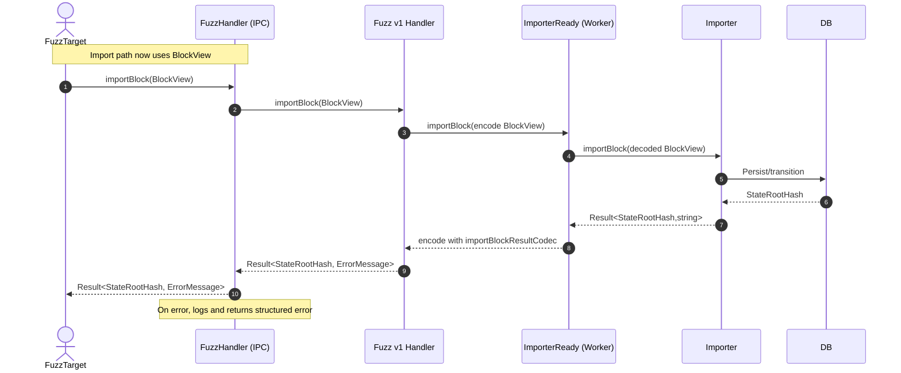
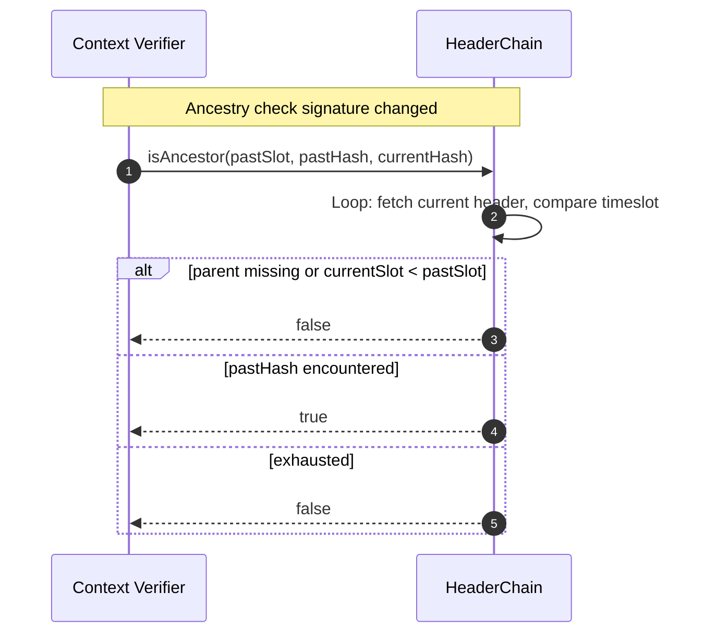

# Performance improvements & fixes

## Pull Request by @tomusdrw

- [x] Implement proper `isAncestry` method.
- [x] Avoid decoding `Block` when received from the fuzzer (it was being re-encoded to view anyway).
- [x] When running fuzzer, don't start the full node - rather only start the importer.
- [x] Fix DB cleanup path   


## Comment by @coderabbitai[bot]

<!-- This is an auto-generated comment: summarize by coderabbit.ai -->
<!-- This is an auto-generated comment: skip review by coderabbit.ai -->

> [!IMPORTANT]
> ## Review skipped
> 
> Auto incremental reviews are disabled on this repository.
> 
> Please check the settings in the CodeRabbit UI or the `.coderabbit.yaml` file in this repository. To trigger a single review, invoke the `@coderabbitai review` command.
> 
> You can disable this status message by setting the `reviews.review_status` to `false` in the CodeRabbit configuration file.

<!-- end of auto-generated comment: skip review by coderabbit.ai -->

<!-- walkthrough_start -->

<details>
<summary>📝 Walkthrough</summary>

<!-- This is an auto-generated comment: release notes by coderabbit.ai -->

## Summary by CodeRabbit

- New Features
  - Added a streamlined node importer to initialize the node, import blocks, query state, and manage shutdown.
- Improvements
  - Block imports now use lightweight BlockView objects, reducing overhead and eliminating unnecessary encode/decode steps.
  - Enhanced chain ancestry checks with time-slot awareness for more accurate contextual verification.
  - Clearer error handling and logging during fuzz imports; v0 now falls back to the best known state root on errors.
- Performance
  - Faster block import pipeline through simplified data flow and reduced serialization.

<!-- end of auto-generated comment: release notes by coderabbit.ai -->
## Walkthrough
The PR changes the block import pathway to use BlockView instead of Block across IPC fuzz v0/v1 handlers, types, tests, and the IPC index. It introduces a new node bootstrapper (mainImporter), refactors importer worker setup/state machine codecs, and updates the header-chain isAncestor API and its call sites. Minor script ordering change in package.json.

## Changes
| Cohort / File(s) | Summary |
| --- | --- |
| **HeaderChain ancestry API**<br>`packages/jam/transition/chain-stf.ts`, `packages/jam/transition/reports/verify-contextual.ts`, `packages/jam/transition/reports/test.utils.ts`, `bin/test-runner/w3f/reports.ts` | Updated HeaderChain.isAncestor signature to `(TimeSlot, pastHash, currentHash)`; implemented traversal logic in DbHeaderChain; adjusted imports and call sites; test utils and W3F test runner mocked/stubbed signatures. |
| **IPC Fuzz v0**<br>`extensions/ipc/fuzz/v0/handler.ts`, `extensions/ipc/fuzz/v0/handler.test.ts`, `extensions/ipc/fuzz/v0/types.ts` | Switched Block → BlockView in handler interface and tests; updated message codec to use `Block.Codec.View` for encode/decode/skip; removed `importBlockCodec` alias and `ImportBlock` type. |
| **IPC Fuzz v1**<br>`extensions/ipc/fuzz/v1/handler.ts`, `extensions/ipc/fuzz/v1/handler.test.ts`, `extensions/ipc/fuzz/v1/types.ts`, `extensions/ipc/fuzz/v1/types.test.ts` | Switched Block → BlockView in handler interface and tests; message union and codec paths now use `Block.Codec.View`; tests pass `testBlockView()` directly. |
| **IPC Index**<br>`extensions/ipc/index.ts` | Public API now accepts BlockView for `importBlock`/`importBlockV0`; added logging on errors; `importBlockV0` returns best known state root on error. |
| **Node fuzz/importer bootstrap**<br>`packages/jam/node/main-fuzz.ts`, `packages/jam/node/main-importer.ts` | main-fuzz now takes BlockView, removes encode/decode round-trip, and uses new `mainImporter(...)` to (re)create the node; added new `mainImporter` module that initializes WASM, DB, importer, exposes NodeApi-like methods. |
| **Importer worker/state machine**<br>`workers/importer/index.ts`, `workers/importer/state-machine.ts` | Factored importer construction into `createImporter(config)`; state machine now uses exported `importBlockResultCodec` for Result<StateRootHash,string>; added `setConfig`; widened method visibilities. |
| **Tooling**<br>`package.json` | Changed lint script order to run `check` before `lint` using `&&`. |

## Sequence Diagram(s)




## Estimated code review effort
🎯 4 (Complex) | ⏱️ ~60 minutes

## Possibly related PRs
- FluffyLabs/typeberry#512 — Also changes HeaderChain.isAncestor API and updates verify-contextual call sites.
- FluffyLabs/typeberry#627 — Modifies importer state machine and importBlock plumbing, similar codec/visibility changes.
- FluffyLabs/typeberry#628 — Adjusts main-fuzz resetState and node reinitialization, overlapping with this PR’s main-fuzz updates.

## Suggested reviewers
- skoszuta
- tomusdrw

## Poem
> I nibble bytes with whiskered grace,  
> Hop-hop through slots, an endless chase.  
> Views of blocks now light my way,  
> Importers hum, the states array.  
> Ancestors checked from slot to hash—  
> Carrots logged on every crash.  
> Boop the chain—commit, then dash! 🥕🐇

</details>

<!-- walkthrough_end -->

<!-- pre_merge_checks_walkthrough_start -->

## Pre-merge checks and finishing touches
<details>
<summary>❌ Failed checks (1 warning)</summary>

|     Check name     | Status     | Explanation                                                                           | Resolution                                                                     |
| :----------------: | :--------- | :------------------------------------------------------------------------------------ | :----------------------------------------------------------------------------- |
| Docstring Coverage | ⚠️ Warning | Docstring coverage is 28.57% which is insufficient. The required threshold is 80.00%. | You can run `@coderabbitai generate docstrings` to improve docstring coverage. |

</details>
<details>
<summary>✅ Passed checks (2 passed)</summary>

|     Check name    | Status   | Explanation                                                                                                                                                                                                                                                                                                                 |
| :---------------: | :------- | :-------------------------------------------------------------------------------------------------------------------------------------------------------------------------------------------------------------------------------------------------------------------------------------------------------------------------- |
|    Title Check    | ✅ Passed | The PR title "Performance improvements & fixes" concisely captures the primary intent of the changeset—performance-related changes (e.g., avoiding Block decoding, importer-only startup) and several fixes (isAncestor/isAncestry implementation and DB cleanup)—so it is relevant to the diff, although somewhat generic. |
| Description Check | ✅ Passed | The PR description lists concrete, relevant tasks (implement isAncestry, avoid decoding Block from the fuzzer, start only the importer for fuzzing, fix DB cleanup) that align with the changes in the diff, so it is on-topic and sufficient for this lenient check.                                                       |

</details>

<!-- pre_merge_checks_walkthrough_end -->

<!-- tips_start -->

---


<sub>Comment `@coderabbitai help` to get the list of available commands and usage tips.</sub>

<!-- tips_end -->

<!-- internal state start -->


<!-- DwQgtGAEAqAWCWBnSTIEMB26CuAXA9mAOYCmGJATmriQCaQDG+Ats2bgFyQAOFk+AIwBWJBrngA3EsgEBPRvlqU0AgfFwA6NPEgQAfACgjoCEYDEZyAAUASpETZWaCrI5Go0dQBsSXK5QAzfApmTAYSFGZefCk2DFxkADJIAPgAD2kDKAA5RwFKLgA2ABYAJizIAFUbABkuWFxcbkQOAHpWonVYbAENJmZWgDEvbACA2RqVRFbcWW4SfIoXVu5sLy9WkvKoSsQCyAJmbERaCgB3CoBlfGwKcMgBKgwGWC5cWjB5igCK6GdSXAPJ4vLiheAYK64ajHLj4eYQqA2EgSeAkM6UFr2ADW+EQAC88GgKpN8l5MQAKDD4cgASgqAGEKCRqHR0JxIKUAAylACsYE5AE4wABGAAc0FKwo4nKlnIAzAAtIwAEWkDAo8G44mpkHJUMQWOQ/W4PhotBpbigAEkoj44oDol9IAADJAAQWe0lwLmdkDYuFgig0FTdEnw8HoSiYtHBRBdACEvPgGFjfWdYGRIEzwpJWQEKCwDhmUtg8XjKLr1JAzmgZCRY1mSGAyNHWQRICi0egMLIa7IacGoAB1DNYCjYDAYBsBUvligAGkgtHwkCpgMQUIogIDERn61XihIAG57JvAdSvPId5FuMEaBRB5BBukl9QVLWIgwfJhsNweNRYGDLIwEMAwTCgMh6HwAIcAIYgyGUM0FFYdguF4fhhFEcQpBkeRWyoVR1C0HR9DA8APAQZBUEwWDCFIcgqCQ/p7S4KgznsRxQhcB48MPAi1E0bRdBAowyNMAw1AwGYvTAcdJ0oVozjlAJWiZW8t0QDQEjcAAiPSDAsSA3SteCGJZegHCcbjoMYWBMFIRAjDgCIMzQJQKHpOzwQ0d1PQ3YIS2ebUsEQeAiAwaEmRvO12FZcEixc5l3M87QsEEEQxGrLp4rkpF1ISaAvRSjBSHofNCzQexYx8f8qH9CtyQAfTsxBXkgAAJJLKHa2tYBpA4V0qgMmSbbhnDQeq+CCEJdUasaN0uJN2U8NhFvwXBFzm2tcB61quE6tzut6zaGFuJl4l2tqDvcy6aUXdN4Bq68ZyC+AdQERRePicFsGkAbG1wW4sACNAyRIDQYEoyBf1oFlkGvVYBC8eAGCMqwrXsOz5n4GDfPCfy+DOLobkBUH7wbdRkDk8Q2AeEg7JRYIgPMSw3S8e9qDejB4ZXa8oy8cbguQGySDSfLWQCxHkdR9h1FRRyKgAWRIANFCq8LIoiGHzK4V1EA9fGCAoJqWqurqKFu314uvVzkq8tLMMy+LnUk6SN1kicGMU5TVJIfLNISX1ACTCF08a9YImvm3A1uW+BVqWzao8u/bzcuk6zvYZOOtT3qaWdIwAFENzj8yFCURtO3YkgxjvLhlZjRwDD0nT3HE0WaG5rnpk1BhWhnMtWgkTlWjsjBaB8B8aA3LSWib/TDOM0zENZSyuPkGyXnszIKisHppYOOYtcQNBSFsrfaC4OP8oPdjjj+xNkyxAA1VF2PBDckpxyAH5TFIC2YSAAABWY8xFjLCRo/Rcm8SoNmvKFDWgMooOG+Gge4otbx7HoO2a8U9AStkfLvJGKM/Qq0DBZMKEVEGflHqQOuj9laIGPqQHqY8J4+SiHeH+z9OQ30gOgrCyBKoSFBr9L+ICIhcJfl2ck78aBuS/lw/qmB6C8GkJQHC1h/5IBIMAS4UIaA2HwOtS6ehHyFQ3OgWgQhji4HtJiG0+UuEHC9NDbgsMkLtnmoI7+SYUxSPYjGbMuBLw8WhqFEqziNySNfuSfqMjuZyKgjBXB0S0SxI0KEcmoN4DlliQOX4Ljax7C3FzRstBsDhAvpAJEzAYhtmLEUygwUizUASnwtIqDSYUCII4dg/0r6cN8dwvhABHbAoNkAAG0UlDIALonhwS4qk7ELx4QzCmeGdltzFgYKDLwkAsbwkEWPNpTIHDswbBuFkWYjGAlHuPBsTIwTc2ZgZVm7NEJd3+nzUQAtGJfJFmLO8Es+BS2IbLcQ29rQcK3OrShtwtZuJ1qHGF25D6QAAN4+MgdnQ6FtjqQD0SyQxxjeqQAAL5/0LDpYBh8wGyFaBAlMOkjzBxRdfcRmLsV+Nfoua6R1WqLiJQY25l0KVUoATS8R9LGVDJZVbLAzp25kFCtSbu3Be79zxIPYe9y2G4JnvnKAVgCxfFmHCzWrj3F0F1gMrckjOR0JTMAckwiRi+G5VifqABePQmiWDaN0fokgJKdq9T0H671fpH4aACBgWJrLIAh1dKih1TqsQurdb9LgqSzg+r9SagNewg3EtFeGyN0aUyxvjTSRN8UvxFJdIreh0gmEkBYePSgCqXTKs7mq1oPc+6zh1SPZR+qvSGsLsXTJrJWwV1fnwmuW4650HgI3ZurcwBGF7aq7mA6NVDoHkPUdrDKAz10vPVmJl6LLwspxZw68YLQIcu4SADi7xLl+YLUp2szS2tRQfbGWKuF8pzoKwlwbQ1ispeVSVtLQGUHAXKtlKaOXouA0M/xoG8Vpwg6W0lrVxWwcgFKuliGGVMqxDpZ0BC97EPBPeEG9x/RkItVQq1yLUODMfk/TkrqREesUX4LRxbhUhrLa1PQKG7W4Adfx91ObMOvwtP65ggaxNQfDTR0SbyjIfP+Wq75xZ+bfsM4C8WUFQV0Zlt9SFCtoXXxMwZrAv6bXso/ZyjDOL+X4vAxpiTsAiP/xI/BhY5HZWP2o0m9zsLPOeqw7im6BL/MEcC+S7tSq0gd13eqzVw7j16rPYHR8ytVbkIQQijjf6Yuycw3xrNgmhl5xQFgBjgRUERGdIMWcDC20donhlndXd915aPbqsdRXEDSdTXV+T2b4vKe0wYIuNNS5zqZJXRd012T1zXcwOeLdgJboMEN/tg6tUjvEQHWeG6F7XoQoxFe97rJPpoVCoytAlD0FzegbxnKZMSqAdK8LlHuz0CxH7QETj4oycQAsqGZAVA+GQMcBsXCND0kPAwDQ/iUgBXffaoZByx2xkfDUupKjrOfobc52ekBdDtLQ9jAntXH6QCjVwgw9OIJAthUwBJN5uMpkx1GdnnqMdY4qJUJFSEwWo3cZVVqaB5huG55AXrJ8SDKjfG+mbbPhEakwICZZYT75Ka7LIz+NlOc7Bl6yOXuolA0mKfAbJeJOY6iTJ0VG01deOKGarhnBdniKAbHfZA6OReiBx6/DQLZDwtY/vImyMmuFR+x/HpQXOGeqmjGHvYEehkS6jDHtEGgowJ8t8n3GevhdY/L6IQ82eoCXCxJqSAXviHh/F+n0vZwNAGnb1XpJgvCeP17/4gfbfuA6YXvpj33MjMRCcwv4WMF0HAsszwKnEL5avvJ1IKpmXr784sanoZ6exeR6x3WrAp293nfy8PK7M8KgH7c8fjz6KWdOI50M2/7S2Ww2j+Y2Mwh812UuduR+G+sW6KGupA2uUI3a9+uWh62qx6L+CQzekAxUtCLoAAPlyuIiuowprtAIfBoD/v/h2AJopmzulroH6s6IQVisQerq2mQRQVQY/CeA1nQTyl2OlpAdalUsHnnhEo8GEIFr7twb/M7DAXgmqoCGwKQaQOnsgVliqsAQehdhgeAa/mrrgR6lxmPnXiXpniQOSCQIuMwIgEQBoA1rWr6CBAmEXhPrHhYVYTYXYQ4QJk4cIcirnqHhIcCNIfjrXliC1j2rzooQLioW2uoVESgSNmgZdvoVgYYW9v+v7uPvXhXkoOSOaM4UwdfiXpPvkZYUUQEdVq3u3pIc8GEXwLIZEfITEQoHERwWoVjhoUAWdjoU/mAfMBAZkVvNkULliO4WXoPtwOSIgE4Ywa4TGpMf3tMbMf4bbiIVwNAHCKPoCPFMkSAegc/ukY5CMSVB6m5PQM6Jyrmr6O2LDoDqRghksBRnKlOqtkxAnhtgutXNtiug3PthukdtupoX2g/v0UesKCep2pPBOtpAdrpovDeo9nelZI+mfOcfZjAF6MgCbnfAthbgklbjBOjpDBEADsjOQIDqFjKqDogETLgC8H9MRk4u2LmouMom0s2n4sKPAe2hNg+OfmzvAvClFM+n9O2KguEFqASf3tiRYnOl4n9JVD9nqF6Lmnkv9M0Ynokl/JVDOobsjOWN9kXmSegN0r0vEM2GMhMmALgnjnwEKb/DWFTCQLUoflEXAhUvjMgGNAGByScteEyD4MIvEJEoCJRrifgOxNkuFFlAGLKWEprhDAAPJSBUD7gBBJjsRPKpSbIRDHxsAnirJtI/Z+mBaoCiyUAMDaK0CvJz4cxCxL7U5/Kr5fwKEgrb5EI2biB2avos6AbULny6xcIoa3GenFgA7EbOg0kg5DJpjZSKoHEQnoFQmFawnTyBxKykJqwimWquZH5OmphRHOjcnPy8mdH8mnoUC+jillTBanmPyZq0Ger5qqaBpIjnK4AloiqpaLgFxLDBB8kRpSb/SPnOpzaNY8bKbs4FoiY6KflrDfkpZhrgYAUFgUDAURqDagk5YpG6FrkClaRwlTbvElyfHlzfFdi/G1zsEAkInAkna4XaGjarnQn6o3aXpGT3ZmRISrwPpfzilYnOQlhlgdjCjE7Xm8Ld4/bD4KJE6+7XhHkkJlaACYBL6eNJNIuL+rAsWA7m1igvcN1mWHyf1hWFKcEDGCVJeBDCJQDpynef9D9sRrOS8RFimAGVgsWEyIglgJyrme/O+cWohezD+eJn+ZAOhUBZeRGhDNkCuPkAzG9BmR3vgN7hiQ5PWe8o2V8tgsZl+rTu2TEZ2Q7rvu9qVqxnuexgeVwJANnsZXiKZURUeZBfwV6sJkWghdIEhWFZpmhYBZhTFX6iHA1U1deewjkSmK1bKSpoWmpsFd1aFShbhlFYNaoSQBGkkcxX0axYPIReNVgRUCzoMUfJrlVqyOSA7m6OjBxIZUOecY2FmVhHFCFBQprCpnVfTvZehp6thkln5pBgFkFtSq5UhpFtFt9UBrKX9QKrAEKoDalsDXBsDm5ZRjpFtb0eCbtRIPtTCa/sttOmtl8ciD8UujtquuuvpIxcudjVCZgSRRei3HdkvCiRxGiYJW9grEYV5RENqfaZ4o2jMtBWkv1IElhCEnJRvHsg2BkiyIaTkpYf1DqERJDNRPpvmTQe6oOSkC9XlbzREewetYgZVAyQgH5cWLgouGpALDWREvqXLa7kaayKDqbacmgOxJtulFhHFSuOtBmHwJ3qjAFPaRuOOGIJVkJegAwMaJgFeFDLUjGKkLssFFlXpjlYZnrS2aZovuZpvvwFZt2XwrZnvhUPFRlRKSuFVQimvoznnZLDvsXdIEBCtuRbOsTZtjRcunRXtgxRAMdjTakTjSdddozYiTxbemzWvBzVvFiW6J9qyE4pyT9pnQ8S5SjWDSmCeI5deNqWNLIEmPIu2MGevFgLJUSW5CVpecbdDFODqDVW0tqc4AAniQXomeSNbagrpbuMEGwE0QbeIvklAHyUXeIUQK0PkbGK0NMf+AGMgL7nyeQfMJQQbfSeoEyfeYWEeenmAAIB+PQHqrAiuKUdHv4jg3g5JQ8hElYSHkoIuBUZ5diJqIA9Um6RTkmaQAOgBjZNqcRnoUMRoEIMchZAyeg/9KjhEj9iiCqUXrPtlZ8hnbzPlTTm2bnVuCVQ3b2SXcatZiQW2sbQAOTICP0zRV1ilvb0D7HbVY2D100nGA58F+7jH/QOO5rN2E0UURBUVVxk3/E91Al90gmY2oHghKBpDnoInM3Imlz8Uvbl1Yl5Q20SnFisnoqu3OUBRapvpWD0gtarAOgASaTWBU7XUYzilcANV/DdIqxujcDwATVOMm5SmQ7eJn1J4j7SMxpmkNVmV8AsaKCCJRQHn/RNMyk/a1jVgkD7gyIG2clHm8YDhvpYCXFyw6iZ2cqtTwABAbR8IDUUOUlxjlnIBECpSM7SxVhe6dAlSXwG1e7CxjgkAZTNKck+VAzeKh0VJUL0CrV8knhzM8K3PoDVjOBTgRI6iIYBSckm4vMUCL7Xj5AWJYjLIhTBo3LrTE6EbjOVQgzrC4NVqQBl1+0Vj87ej4D7JZnRlxN0yhRKD5l7Da2ckXNh526aQsx1WInz5NmZ0r5NmqNIT12F1lVYkVW7lvXVVQFjGmFYhcDkiUZtVvlzUfmLXIUI2oVw2ngaglQRoAEGVMadYVP/DVO1M4VBMpEhOiyGrRYmGs4pjSuyszWwVBVdVfm9UBaLih2xhav5zbllZsaVb33Oi1iyDPC7FcLTVCaOvAAhXKv4aquLg40aDfNDXdoNqMIujdMCnGtaE7UDpjzmuByWuBvBstUuPm55odXzVOs9XLUErxuJvrWeuvrCvlaimIqbEuiFuox/NhtNblvqYqsmLJsCyptdazg9OZtgnBO5thP5vJodshuzYlvC1lsRvVuSaspkUzr0DrYk3UU+Pd2U2HYBMGBjQpjJmCPUij2RMPbRPPbolCVOTFiUnrjqiah7FYAntYhnuIA6gun2AiMZgYMAJyQgtxhPspDwAUAWI7hYBMm/zkiu2K5ukoykvUj9RH2ewNiweRGpCQekwnJgclmbO2SiCREODR0kB0DIDkjiNxiJCJALNwCoCR0fQJnXhVmnTNKWXmUnLgt8AEMlQ2FoBt4RJgfEuxh9I6iK7emtp7jEdVqyNp3yOwuKPL4FUqPr7FVb6lWN1YmXAvsymmOtucZPu+iID6dvsugftfvUi+jv23L9TTk6RqAsARBgcQBnAag0AnjOe0xYfCQefqAkBRbtjOhOdvS+frKRHueecRB0cPDheucMb+cxfUZuMfFt2UU7veN/H7uAlU1HtWcOStBCATStBUhKCtDPJgBarhO3ZXos03vs0byc2vrX3llg4PBE5qRnLsAL5xNcAJMdaRgQdYSersMRBpOlu2WTkG3rm8IjMJCAtjMnJKlUSAhi1iAhKZ3lfWGNjulf08DfE3DIAWHgON6UU3Bjx2kajcDTeVnIxqaUJm5s6Z6QMQMRIfzNAdfXgpPYwyZATaOF0lOcMn6c1cDxVKA1M6CoAm4yasiYuDlgAlmICyDMAfT7LTNM4RBYoQ8kBQ8UpKKBl6VHfHBZgTg0zklcMwTPIoCunul0AQxuirgW6ooVgvRiClLPIs5s/BY6QaCVepRgBw8PiCPo2oAMYFjlKVIdd3xYIrjZhMjXLXg7dRE9fRzBoA94awqZObgAjtGpA9LOb9dmnKWOhNLyCGfl2AdR3SniB21jeSlv2g5jR1QqwVjnQTRtgJWlt3ToDIzhQNiu0/eltkOYIpDZkddPIxAHfkB5gBRBHuStBiF8Tjea+4+Njghyxu59fkvsRCVcBWj3N7Dq8siLjXhzom7Gh4B/QK64N7DxgfhWAAQdiu7xmwBIheBN8Jmcnd5c+s98D3EJJG6u40BtLkDsQ7eLiS1PrS0RLPKM+pVxjUTz1y8tYxjJ0RDKjxh7cxCgya+KxIDhDrCYAkDHeWLWIbh2JcDS4iG7E8yPU+CZQ/bHBnXPOsMekJ8Vgv+kDTcRA3qhSIAfMHQBCAALEwgNgicYAKovikaRUaGZ6CwimUdjbMBAeANpMggLATgrKS/VFK0HVDMhmkufWnlb2GbR0WACdJXsWHH6ylQ+9uACKnTZjp1lObSblgCg04WZ86XZfeIK37IAY7yXANemRlRpE5YeqKQvEu1+yAtOUkLFcEmHOKOlRBY3ckKSyqQgZmeZwN4OilzQMcoYkdBGNZmq6f0IknKWXhOVQAJ01gJAdSmjCtCa8ByfAyAJ/z4BR8PSAg54ssFbAMATwyfdyHtzzJ3dBE6tNpFdRurIJdWpuMqAFFByvcSoZ3UBrYN4HmNymvPfnvP1F67FBO8UckJVGphxwCyqPdHv1FQDOC6Avzc+rQEXC498e4vVnvQAR7iIkeGAEJCjzR6ktrmWPLlJUNqZI0SMKQ1KAI0QB88jIagzgSjBB551mh6PIgZcTcwA4sUffcWHwBgzJCBe4IIXv336F89X0hCfeOz2aQu9Pe94X1mY2HJmkrkW4fVlU1iIG9bgC+KwcpVSCTMt2nNFAIt32GTRtaLJInGyVLa6hOSCMTSm7z4ARQIuM9QHKDnbCUZ/E2g8Xm81FYR03sE5XcLOAOAGtcAVg4IRjCJgat7CWw4pjdW/73VSoA3P2DbQbDPJyQGgSkf1FdrzDgUxsSkRoDQ4rg8B1ySqOn1kRhBySRfFWGANmJwixSLAP0vADUDIxzUV8ZGHQEXAoDtkEQOXAYNtpxhT83oD5qUna5CV8kO8KnADgJHnUVBROAHKEI6zEDvhS7K2tXEf5284wlUcUoiMAKUAIo6weQCiFChIwIgoObrmoniB9cTBcgEYajBKbIBTa1seOooAsFpdW6W7duqTRy67YD2m6IwIV2kDFdSuO3FYRgDWELDauXFJEtez4q3tp6mJIwHPVoDeIqB5gp6FsgeC3JQ6yuDWgACkJoB4cuML1/6101GZUCcBzx1C0i1GxsfnAb3uhdAO+XfPqC1iz5O1kAQ4N0JcEViLgAW6ZXdB10n6Nhv2XgDROX3tj2B5gDARcHCBVQddM+4gN3Ek2Xxvg6+E3LoG0n/6oBbY3HWoX5G9CyAGGewSjpAGvHIArko/IjrHy+wQwrQeCRXlPEBZDhggEODyNSAN4ddrRwQM5LeDHgUx++90KgF9yrCu1ueFAJEG5CfGR8VYrzQFp0PgBgBkYEODCI81rrhIiAbgCoJvHBCXBtxjuSgLmGt79iwodIKAC1UowqY9gY8DWhYXoDgiVOuxCsDAPQmYTaA2EioqWOpBgAMAawfZGciQphIEJk1LEFG0vwMZBog5KCEgOLI7hzg2iAGHhJohuktQ8gXjiwy/IVAAQYmYPN6HljkhTYKmJQD4GOZAT7i/fKySrHjBehV2sAWJKxFwkwsqI/fKwfC3XAosCwaLU2BwMqhzgVw0UojpgOrjgg6A1EpMHsH8mL9EAUCdKSeNfBQhzxDDFiSECNCCjTQXMIwAAGkSA8gPAI9DljKkTkSoo3CjjD7ggvw2AcuHFLFSFFkp5AWod4jimsh2o049qI1EuBWgFQBcX3jRIwB0TRAY4o8UaT64wCAQKUWiduIYa18PwUDFFoeMdo5IVprfPcRgGNrniDxU4JaQrTOkfhWxuw0pEoHhAlj+AWABscwExwYBIJnJAiYOWykdcsRFdAEP7XsDIhlA+yY0NSHYBUd0Ji4USUlGwkgSKAYEj6QOO+7FgkpFAS8A2G2l7AmR5EiIIrnFGbNUQ9AEpg6U65s4AcnJT8REDGSMSm6OmI9g2SU738fkyjHlmwLroF0uBOnV9N1leiScV+usHsfeHJAsTKJkAN6SjLCiDiAww4gCNKwkBcB3WJUN8irKICzV4KwAAiaBXiipAaozoRMdMBK4DBUxVXFsVuQJrpdIxmXDunu3ahhRYAvdcSEbOTEDBvQmAUKMFFwH2wwAG4AIFmKZr1comeYprq9hnr74SRQ3NAeKIiCiwkAHce4H5zDgEwHJ5sFODhlzhcAPopLZkFgAQ4HAqAC40GDQPvGGxuIyc/WA+IjhJxzYMcLYrkJjiLha5eKDOf9TVanQlgmcdOYllhoqYc534DAK2KoGB1GAD3AQHA2CydzzoO0c2K4iLAYCiAgWF3t3MzmEYHoNUAICrBeANhmQLwA5HPOIzXgt+Zo3yrAnHDkkYILcnwZWRDzk9KAkowyTC2nATJL5gLFeWGTMFIAKJU/ZJBbUblLRC+oTMRDsgzhhlbxjpZAMjk2Q0Rr5lAJuRwKI7XgkwOxUWHZBsSBjiYqA1IPBIiRwKHwqtQRJ9j+y5C/ZS0KsZgObKciCYcnSIrM3iCS8Kkf0QLv8ikDtESWZLCPtP0BYbdAQ8cj+J6FoX0COWuVQSSwLMycz2xHA7Tpo3Ko7lm2+5cVqHCrmGwI4ECtuX3OzlGJB50mFReHGNj4L65MAABetGbnbQfMGi3zB3LAWzzW5vcqxf3O0V5zB2jaZ0MqAEA+Z1pGADLK7JNkzAngXsrmD7MF7+zJ0VsiMWXE8ZZctstFB2UvOdnHZfFpXD2Z3G9lqQ7w0wA1HVLJCByx6DXUOVPWa4Ry387/epJT2vg2QfMYqI+RbThBETQZ+yAHJRkfCF82kECrxaRNG5BisA4/PKBkqgTmNaeBsfRYDixadjmkUIYTlaPsVio3hgI2aBArxmVQ5l94aBYFC7FYBKQg0C0nYm0FIiBZyLR6PJMCmL5sWewH2vwD0mL9iEd5YRYwNZlKNWyHMtsXy25ngpeZ3rSqvyKM7VYU5RsE2D3KqW5xbRXtTKKKLBnRQ3SssCJJ4s3HxQkl7sgJSsykjpKNIbsTQNkuuwQ09FqcjUS3U3aRL50u7GMRTTy6HsXZqCT9kVz8UpLAl1IX2P7EHiMTxgYAYlu3HGReBclV7Xik9jDlxNX0K0EgDHHpYr9my+lUQW0K/xQ0gV4GQVcKqWEg116rxSLLRkLo6sjRZTexV4p8g4qjYvCJkGMhG6bIRotUA4RiF1BRwuERiuVQnH/BRIA8MyglNPPYBcJLFt0HUsSUBYUSaolqonJdEfD0g9kfswLudS4DplNmsgJEDgpIAfSaAWWKMnn0i7IA2AaPDEAgD/Cu12l9sHVcMtTlsqssGgFBViF/AGxAwFABBfms0BFqS1DRYIFAmpBxrBItaigP1EYjAyAwNELNX0L+URxK1haoxMWu4Clrgg0IgId+1Nwa1q1Q65tcKvbBKB7wj3KJeEGeDYS0AYwLCAd1mkkJU1kHdNZrQjB9dyyj4NMmDPBkNqCwnCils4Eu481uwLwAKG6gPXNIoBf06UW0lmlESB1v4dojGGaRQtJm8sF6W0ikLBArBFPRAOQvijLMJlgkkDXx16h3KWZzZcRTnUkWvK/RRdWRUK3kVHCflH+HtTeSiLqr7gzoWFalB8WUrNcxs5JUirSV+wMlTKjUCysrUcqLWjlacgRsurbRXVjq1qM1hC6cbfVj8a1SYu2ZCabWvG6xV3PiA8aZVfUbTA5g/SW9/WNq9aL6GmGr89B3ZO0uilXoPlQayqlMBRtPbUqaNns5FQyoY3hrmNDa9lXv3zbkgONAGOLHJopR3EVwVrbWlijk2LhVNgIdLHivcYZcoldsklfRX8biQzgoEjEGMN7E5tQmXK4ObmN5WFLw5hYkMKKsqhUCOy+DSZl8C4AsiaA6EsWRBLChcBEZyM0rRrKiJRakZMW4XvFrzaFN/x7Rd5mICgXMBaAAgXUDUE60CBQ0vvSMj1r61cI5ibrYNFR161daxMY2wFtAFo1cxLoX/CiWgLshMhwcogXZJEVNiUAGGNEdCTqU5EMNoWi+LFJGSn798KUj4ckdAnIBeB+oJuQQFCECpDbZml230e7W0CWjGAgEkgMVvFmFCyhglQCQ2C8B9b3KhoXaXDFHStQFIwvFrJSXBhHUGFoY6XkNEPgNCJaqKSVbAShoVbKA0suMAquRqCD3BVW9Gu2AcDcAmcDYGyMry7ArKz0CnBgUhq5ZqdnlOW6RRowalYl+ZGyyxF9l1gKFfsQbH3OMtKSFa/t/fErZ9LK2QB8d4E2XRrIyy1awJ3cfvo1unakVwlBK7dqFtoqxiyV8YgwKrvq0a6aZYAUIDvPICJbuK+SlLQJSKXpbEQUc/GC1nvAOjwBWA2IRAMiWowC5VAh3B4PnaPw1JWOMROiijYusIq6svQM+P/bKl9wFRVoBYRgawB7++JAMDDy7AeCIYisVKGJPkAm5JJ1YaLU4OkBwTX6rtI8mHqjBeC4BD4CoogMeaxbrWqkpVupNamsh0wD89Mm0nh0KT2YRAwrHWQy3PTi+hOmXQb3K1l7CdeMuGVhOGbrAKW4IR5phyq03CnmWzCsPtOz4p0Kg8YAsIdGgFIBhR9U81Nw376F6rB65XCDvxRB4KNQwiUfgnWJkYguA1k4NLZI1DSAHJvULgBOERbRkMAvvAEN5IWj9teosSBhhxIdWAGkWSiKKCbjlwBqG1P0CuodzUQUA2Fo833FHt8njbsRfqfjkQBPDRCwG73SAW6TzJ+8KE3ey8fTvYhB768zOkRQo2YHs7WBLy9RgKw+VQAC4mnLOkbw01C62iSokPSmFr2iAVdZe9XQsKh00BLdqCM2uDAc1sFnQue06P5GYCRslW0e2Nuqw9ZSZa0jYE0B1g1qqJGYpPAyp7qtZp5uiqq/eGTJEMugJ9VWqfXLoV1z6XFw7BfeJNs76zjCpuyDq3oUgW6rdKhw1Mw22HEIyZzos/aKLWSgj60Q7ZAM6D8OyBbOlht6McBCS8BJALIC0NgWdCf6WQ3++yabAAMYAgDZwEA72wWqIA4JtAD0LQHm3mbgo2xYAPAeAOLhnwU4WHbQGwrFGwDPkyA61EykKsGjTRlo20dSVcxOjlQBjKKDdBLA0A2Evo0gAA5DG1cdhoZDKzgPVGED9Rp1tMbHizG6VGABY0sZWNUB5AhBWSesF6OZ8BjQxwHk4fxFtpjeTILeedDd1DN2w+JXY6Ho73dEPV1eGrPYajC+hfclBlPTQwbBWENA9hKfoqnz3ghC96mk5M7AyPOg7hBtcsoFutmEqvGMSrunEqdkRbQI4EIuu0zwB0RktkYlCPEFYju1J6AlX0fhBUACRiIwkQwNSeYjqBGoEYRAI1C8Z0BGoZwwEKRDEhQBSgcoAUAKHCAAB2OUwwE5CchRQcoNAAKBICcgGAPIUUDyE5C0BhQpQRU4UFFCFASAPIQoLQAFBbzigPIXk8YHIjIQ1MuAIUyWNFNZdxTkEZ09SdUSNRf6pARqFhxFOSnnTBgDFNnh0hIBbAXCOgJjiZO4ArAuIM0DpH4Gvz5wMZ1qDcC8C0AuEtgDMykCzMxmkAJ6pYBGCUAYBizZy6wjGZjC0AbAE4ZUMmD0TYjEAnkEjsWeVH1n6cOkRs82cuPeAY1kXHsxfOzP9nBzLZtUDd2ChdnmUbwCczGcpIQ5aAVoRhL9EQDtnizekScyRiHa4AFz7er8gMK4CTJs89OaM/ThvMkYsO2QT3ruc8DBIIgx5nSPudvM6RPxxwcc79A/M3mdI6CAWJQi5hPniwtgA4COcgAAAdHSP4G+A/1ORN4AsLEChmQBkgqQDIIgFgvtEayewEJLsi1DV0ghGoKem1jDJ06dknNFWIABQCL4NNFCCehZIkzNbM8MRPIn0AYYCMGjiJyUGLtCwzHRbzPC/hCeFkUGSlUwt/QZEuq4IAOl1XcRY59oPrpyS35jy85Ilmi+OqrBFDJmyII3Mhs2YBAOS7MQMNgCXn2AXO6YVpMiRRgaB3zl5gC2clJZ1TqQu5lMlqC5igwCtaqCMOZXsD+8GgISWpEgm3HEzUYvZCsa0gQBLyAri3UIEIEiGK8plHAsmZHUc0BRRYE0E0FEp+MtgDuWqCsLmlCN8BI6szGS1NHSB4yMwXgP8GKcg72Bdkk4BsJRCNiyA7L/5/swnSC5cAdINYZ+SVHsu3n+z2YDfUyFrOlmhrJGYIGFHBCgxjzD5tgLuYitBcHL5Kf89eaGs6R7zj5nq6qDM5znSkb5jqyRm/NnnC5f5hy/2aAuYAF8YFiIBBZpbmdSkyMDcKVOeA+VduwZPS2GX1CGhKwtoKFZ/PkurquLkYc7jxbZw1KkRZYXbaeGcDnhGhcdcpXSPJlapYwi4TCw4O35fh1L3ANDpWNjL5yGDVF5I+bWXyGW3WK4bS3cztJwhiE1M0YEnVRBhlFKUMHwFOD6RYd2rl1kjE5ZGDBQ3LHl6kF5cZx/D8q+119qUnbBrgIga4JHLKLxGlM2LvuTKwDbG4hxlutQz7Miq/giyFIku9Cf1HHV1WBmccsWGc2CTyBPtUUGyI8GZDJWAoho8IPUqkD7JnDViGxHYm5uTWdIXV3c31ZA6DXNrI1pXQinGtgxjrOkaa5czmuRcFr3VkjI9YOuuXVr61nm1tbjs7WSMrZhgOrJwJ1IqApAIO5+dOvh29gkd66yBdcu7XkwedpgOmTOqoBSgooDQDyCVMABSasAgH3ni9uYjNlGMzc0BmkDV2AEbl5TOSBh8zRA0UJyA0Dqn273t4O9IGcsC2erAATRuCMAaIckF0IAk5OERntb45LUuFrt2SSoU2fpFEBQvL5T72IhQA3Z/7F2ALftnqwHdjBP3+z0d2a14HmtZ2Bzt92MAMNWvZ5Zk+5nSIedsB7Wnr1dkjFAEmRpBZkfuGKGGTN58A9Yuax8b6D6Z1loLFAaC+mMgDwPEHoYcMGDdAaLEjNXdzMNmHrAuDgsz0WcA1FQnjN8gjyJsHxOcYLpY6fYAcLg/wdwOEH8u0cGTyasRICrC4E+xgH0bhT4bbSPcPshV5QA21FYZHmeH73rC+HBDoh0+BfCqWcbP4P8OWSDvgPtotgZ8z4F3PwWGLSFq+NfbsToXwOWFluOShdMQBMDQZygCGbDONQ/T+gIAA -->

<!-- internal state end -->


## Comment by @github-actions[bot]


<details>
<summary>View all</summary>

| File | Benchmark | Ops |  |
|------|-----------|-----|--|
| [codec/decoding.ts[0]](../blob/7d51ab799546eca6856e0b8c93fd2c74076c957a//_work/typeberry-runner-5/typeberry/typeberry/benchmarks/codec/decoding.ts) | manual decode | 20907480.83 ±0.87% | 86% slower |
| [codec/decoding.ts[1]](../blob/7d51ab799546eca6856e0b8c93fd2c74076c957a//_work/typeberry-runner-5/typeberry/typeberry/benchmarks/codec/decoding.ts) | int32array decode | 138509666.04 ±4.65% | 7.26% slower |
| [codec/decoding.ts[2]](../blob/7d51ab799546eca6856e0b8c93fd2c74076c957a//_work/typeberry-runner-5/typeberry/typeberry/benchmarks/codec/decoding.ts) | dataview decode | 149354528.56 ±3.49% | fastest ✅ |
| [codec/encoding.ts[0]](../blob/7d51ab799546eca6856e0b8c93fd2c74076c957a//_work/typeberry-runner-5/typeberry/typeberry/benchmarks/codec/encoding.ts) | manual encode | 3307737.39 ±0.3% | 18.46% slower |
| [codec/encoding.ts[1]](../blob/7d51ab799546eca6856e0b8c93fd2c74076c957a//_work/typeberry-runner-5/typeberry/typeberry/benchmarks/codec/encoding.ts) | int32array encode | 4032229.05 ±0.63% | 0.6% slower |
| [codec/encoding.ts[2]](../blob/7d51ab799546eca6856e0b8c93fd2c74076c957a//_work/typeberry-runner-5/typeberry/typeberry/benchmarks/codec/encoding.ts) | dataview encode | 4056586.75 ±0.47% | fastest ✅ |
| [collections/map-set.ts[0]](../blob/7d51ab799546eca6856e0b8c93fd2c74076c957a//_work/typeberry-runner-5/typeberry/typeberry/benchmarks/collections/map-set.ts) | 2 gets + conditional set | 117756.29 ±0.27% | fastest ✅ |
| [collections/map-set.ts[1]](../blob/7d51ab799546eca6856e0b8c93fd2c74076c957a//_work/typeberry-runner-5/typeberry/typeberry/benchmarks/collections/map-set.ts) | 1 get 1 set | 60196.99 ±0.19% | 48.88% slower |
| [bytes/hex-from.ts[0]](../blob/7d51ab799546eca6856e0b8c93fd2c74076c957a//_work/typeberry-runner-5/typeberry/typeberry/benchmarks/bytes/hex-from.ts) | parse hex using `Number` with NaN checking | 130450.52 ±2.22% | 84.96% slower |
| [bytes/hex-from.ts[1]](../blob/7d51ab799546eca6856e0b8c93fd2c74076c957a//_work/typeberry-runner-5/typeberry/typeberry/benchmarks/bytes/hex-from.ts) | parse hex from char codes | 867460.8 ±0.45% | fastest ✅ |
| [bytes/hex-from.ts[2]](../blob/7d51ab799546eca6856e0b8c93fd2c74076c957a//_work/typeberry-runner-5/typeberry/typeberry/benchmarks/bytes/hex-from.ts) | parse hex from string nibbles | 558344.53 ±0.45% | 35.63% slower |
| [bytes/hex-to.ts[0]](../blob/7d51ab799546eca6856e0b8c93fd2c74076c957a//_work/typeberry-runner-5/typeberry/typeberry/benchmarks/bytes/hex-to.ts) | number toString + padding | 325175.7 ±0.41% | fastest ✅ |
| [bytes/hex-to.ts[1]](../blob/7d51ab799546eca6856e0b8c93fd2c74076c957a//_work/typeberry-runner-5/typeberry/typeberry/benchmarks/bytes/hex-to.ts) | manual | 15871.43 ±0.85% | 95.12% slower |
| [codec/bigint.compare.ts[0]](../blob/7d51ab799546eca6856e0b8c93fd2c74076c957a//_work/typeberry-runner-5/typeberry/typeberry/benchmarks/codec/bigint.compare.ts) | compare custom | 240527720.22 ±6.41% | 1.29% slower |
| [codec/bigint.compare.ts[1]](../blob/7d51ab799546eca6856e0b8c93fd2c74076c957a//_work/typeberry-runner-5/typeberry/typeberry/benchmarks/codec/bigint.compare.ts) | compare bigint | 243676730.04 ±5.67% | fastest ✅ |
| [codec/bigint.decode.ts[0]](../blob/7d51ab799546eca6856e0b8c93fd2c74076c957a//_work/typeberry-runner-5/typeberry/typeberry/benchmarks/codec/bigint.decode.ts) | decode custom | 162813578.58 ±3.37% | fastest ✅ |
| [codec/bigint.decode.ts[1]](../blob/7d51ab799546eca6856e0b8c93fd2c74076c957a//_work/typeberry-runner-5/typeberry/typeberry/benchmarks/codec/bigint.decode.ts) | decode bigint | 102555318.13 ±2.57% | 37.01% slower |
| [hash/index.ts[0]](../blob/7d51ab799546eca6856e0b8c93fd2c74076c957a//_work/typeberry-runner-5/typeberry/typeberry/benchmarks/hash/index.ts) | hash with numeric representation | 175.52 ±1.37% | 33.3% slower |
| [hash/index.ts[1]](../blob/7d51ab799546eca6856e0b8c93fd2c74076c957a//_work/typeberry-runner-5/typeberry/typeberry/benchmarks/hash/index.ts) | hash with string representation | 116.39 ±0.45% | 55.77% slower |
| [hash/index.ts[2]](../blob/7d51ab799546eca6856e0b8c93fd2c74076c957a//_work/typeberry-runner-5/typeberry/typeberry/benchmarks/hash/index.ts) | hash with symbol representation | 182.86 ±0.57% | 30.51% slower |
| [hash/index.ts[3]](../blob/7d51ab799546eca6856e0b8c93fd2c74076c957a//_work/typeberry-runner-5/typeberry/typeberry/benchmarks/hash/index.ts) | hash with uint8 representation | 165.1 ±0.11% | 37.26% slower |
| [hash/index.ts[4]](../blob/7d51ab799546eca6856e0b8c93fd2c74076c957a//_work/typeberry-runner-5/typeberry/typeberry/benchmarks/hash/index.ts) | hash with packed representation | 263.16 ±0.64% | fastest ✅ |
| [hash/index.ts[5]](../blob/7d51ab799546eca6856e0b8c93fd2c74076c957a//_work/typeberry-runner-5/typeberry/typeberry/benchmarks/hash/index.ts) | hash with bigint representation | 193.21 ±0.09% | 26.58% slower |
| [hash/index.ts[6]](../blob/7d51ab799546eca6856e0b8c93fd2c74076c957a//_work/typeberry-runner-5/typeberry/typeberry/benchmarks/hash/index.ts) | hash with uint32 representation | 204.43 ±0.07% | 22.32% slower |
| [math/add_one_overflow.ts[0]](../blob/7d51ab799546eca6856e0b8c93fd2c74076c957a//_work/typeberry-runner-5/typeberry/typeberry/benchmarks/math/add_one_overflow.ts) | add and take modulus | 255442367.93 ±7.05% | fastest ✅ |
| [math/add_one_overflow.ts[1]](../blob/7d51ab799546eca6856e0b8c93fd2c74076c957a//_work/typeberry-runner-5/typeberry/typeberry/benchmarks/math/add_one_overflow.ts) | condition before calculation | 252877248.1 ±6.31% | 1% slower |
| [math/count-bits-u32.ts[0]](../blob/7d51ab799546eca6856e0b8c93fd2c74076c957a//_work/typeberry-runner-5/typeberry/typeberry/benchmarks/math/count-bits-u32.ts) | standard method | 92795512.99 ±1.69% | 63.18% slower |
| [math/count-bits-u32.ts[1]](../blob/7d51ab799546eca6856e0b8c93fd2c74076c957a//_work/typeberry-runner-5/typeberry/typeberry/benchmarks/math/count-bits-u32.ts) | magic | 252050757.57 ±5.1% | fastest ✅ |
| [math/count-bits-u64.ts[0]](../blob/7d51ab799546eca6856e0b8c93fd2c74076c957a//_work/typeberry-runner-5/typeberry/typeberry/benchmarks/math/count-bits-u64.ts) | standard method | 8520729.1 ±0.33% | 91% slower |
| [math/count-bits-u64.ts[1]](../blob/7d51ab799546eca6856e0b8c93fd2c74076c957a//_work/typeberry-runner-5/typeberry/typeberry/benchmarks/math/count-bits-u64.ts) | magic | 94651011.61 ±1.46% | fastest ✅ |
| [math/mul_overflow.ts[0]](../blob/7d51ab799546eca6856e0b8c93fd2c74076c957a//_work/typeberry-runner-5/typeberry/typeberry/benchmarks/math/mul_overflow.ts) | multiply and bring back to u32 | 279130975.09 ±5.08% | fastest ✅ |
| [math/mul_overflow.ts[1]](../blob/7d51ab799546eca6856e0b8c93fd2c74076c957a//_work/typeberry-runner-5/typeberry/typeberry/benchmarks/math/mul_overflow.ts) | multiply and take modulus | 272529773.15 ±4.92% | 2.36% slower |
| [math/switch.ts[0]](../blob/7d51ab799546eca6856e0b8c93fd2c74076c957a//_work/typeberry-runner-5/typeberry/typeberry/benchmarks/math/switch.ts) | switch | 246289103.94 ±6.91% | 3.14% slower |
| [math/switch.ts[1]](../blob/7d51ab799546eca6856e0b8c93fd2c74076c957a//_work/typeberry-runner-5/typeberry/typeberry/benchmarks/math/switch.ts) | if | 254267084.52 ±6.58% | fastest ✅ |
| [logger/index.ts[0]](../blob/7d51ab799546eca6856e0b8c93fd2c74076c957a//_work/typeberry-runner-5/typeberry/typeberry/benchmarks/logger/index.ts) | console.log with string concat | 6981815.61 ±62.13% | fastest ✅ |
| [logger/index.ts[1]](../blob/7d51ab799546eca6856e0b8c93fd2c74076c957a//_work/typeberry-runner-5/typeberry/typeberry/benchmarks/logger/index.ts) | console.log with args | 1110964.8 ±95.12% | 84.09% slower |
| [codec/view_vs_collection.ts[0]](../blob/7d51ab799546eca6856e0b8c93fd2c74076c957a//_work/typeberry-runner-5/typeberry/typeberry/benchmarks/codec/view_vs_collection.ts) | Get first element from Decoded | 27924.28 ±0.16% | 58.56% slower |
| [codec/view_vs_collection.ts[1]](../blob/7d51ab799546eca6856e0b8c93fd2c74076c957a//_work/typeberry-runner-5/typeberry/typeberry/benchmarks/codec/view_vs_collection.ts) | Get first element from View | 67387.16 ±0.17% | fastest ✅ |
| [codec/view_vs_collection.ts[2]](../blob/7d51ab799546eca6856e0b8c93fd2c74076c957a//_work/typeberry-runner-5/typeberry/typeberry/benchmarks/codec/view_vs_collection.ts) | Get 50th element from Decoded | 27765.25 ±0.28% | 58.8% slower |
| [codec/view_vs_collection.ts[3]](../blob/7d51ab799546eca6856e0b8c93fd2c74076c957a//_work/typeberry-runner-5/typeberry/typeberry/benchmarks/codec/view_vs_collection.ts) | Get 50th element from View | 38569.68 ±0.17% | 42.76% slower |
| [codec/view_vs_collection.ts[4]](../blob/7d51ab799546eca6856e0b8c93fd2c74076c957a//_work/typeberry-runner-5/typeberry/typeberry/benchmarks/codec/view_vs_collection.ts) | Get last element from Decoded | 27676.34 ±0.16% | 58.93% slower |
| [codec/view_vs_collection.ts[5]](../blob/7d51ab799546eca6856e0b8c93fd2c74076c957a//_work/typeberry-runner-5/typeberry/typeberry/benchmarks/codec/view_vs_collection.ts) | Get last element from View | 27041.02 ±0.33% | 59.87% slower |
| [codec/view_vs_object.ts[0]](../blob/7d51ab799546eca6856e0b8c93fd2c74076c957a//_work/typeberry-runner-5/typeberry/typeberry/benchmarks/codec/view_vs_object.ts) | Get the first field from Decoded | 449373.13 ±0.21% | fastest ✅ |
| [codec/view_vs_object.ts[1]](../blob/7d51ab799546eca6856e0b8c93fd2c74076c957a//_work/typeberry-runner-5/typeberry/typeberry/benchmarks/codec/view_vs_object.ts) | Get the first field from View | 103548.87 ±0.1% | 76.96% slower |
| [codec/view_vs_object.ts[2]](../blob/7d51ab799546eca6856e0b8c93fd2c74076c957a//_work/typeberry-runner-5/typeberry/typeberry/benchmarks/codec/view_vs_object.ts) | Get the first field as view from View | 103260.43 ±0.14% | 77.02% slower |
| [codec/view_vs_object.ts[3]](../blob/7d51ab799546eca6856e0b8c93fd2c74076c957a//_work/typeberry-runner-5/typeberry/typeberry/benchmarks/codec/view_vs_object.ts) | Get two fields from Decoded | 442300.3 ±0.11% | 1.57% slower |
| [codec/view_vs_object.ts[4]](../blob/7d51ab799546eca6856e0b8c93fd2c74076c957a//_work/typeberry-runner-5/typeberry/typeberry/benchmarks/codec/view_vs_object.ts) | Get two fields from View | 81893.59 ±0.13% | 81.78% slower |
| [codec/view_vs_object.ts[5]](../blob/7d51ab799546eca6856e0b8c93fd2c74076c957a//_work/typeberry-runner-5/typeberry/typeberry/benchmarks/codec/view_vs_object.ts) | Get two fields from materialized from View | 171046.22 ±0.1% | 61.94% slower |
| [codec/view_vs_object.ts[6]](../blob/7d51ab799546eca6856e0b8c93fd2c74076c957a//_work/typeberry-runner-5/typeberry/typeberry/benchmarks/codec/view_vs_object.ts) | Get two fields as views from View | 81987.19 ±0.09% | 81.76% slower |
| [codec/view_vs_object.ts[7]](../blob/7d51ab799546eca6856e0b8c93fd2c74076c957a//_work/typeberry-runner-5/typeberry/typeberry/benchmarks/codec/view_vs_object.ts) | Get only third field from Decoded | 443841.28 ±0.24% | 1.23% slower |
| [codec/view_vs_object.ts[8]](../blob/7d51ab799546eca6856e0b8c93fd2c74076c957a//_work/typeberry-runner-5/typeberry/typeberry/benchmarks/codec/view_vs_object.ts) | Get only third field from View | 103196.15 ±0.11% | 77.04% slower |
| [codec/view_vs_object.ts[9]](../blob/7d51ab799546eca6856e0b8c93fd2c74076c957a//_work/typeberry-runner-5/typeberry/typeberry/benchmarks/codec/view_vs_object.ts) | Get only third field as view from View | 103036.9 ±0.19% | 77.07% slower |
| [bytes/compare.ts[0]](../blob/7d51ab799546eca6856e0b8c93fd2c74076c957a//_work/typeberry-runner-5/typeberry/typeberry/benchmarks/bytes/compare.ts) | Comparing Uint32 bytes | 20392.95 ±0.09% | 3.49% slower |
| [bytes/compare.ts[1]](../blob/7d51ab799546eca6856e0b8c93fd2c74076c957a//_work/typeberry-runner-5/typeberry/typeberry/benchmarks/bytes/compare.ts) | Comparing raw bytes | 21129.8 ±0.1% | fastest ✅ |
| [hash/blake2b.ts[0]](../blob/7d51ab799546eca6856e0b8c93fd2c74076c957a//_work/typeberry-runner-5/typeberry/typeberry/benchmarks/hash/blake2b.ts) | hasher with simple allocator | 0.05 ±0.5% | fastest ✅ |
| [hash/blake2b.ts[1]](../blob/7d51ab799546eca6856e0b8c93fd2c74076c957a//_work/typeberry-runner-5/typeberry/typeberry/benchmarks/hash/blake2b.ts) | hasher with page allocator | 0.04 ±2.65% | 20% slower |
| [collections/map_vs_sorted.ts[0]](../blob/7d51ab799546eca6856e0b8c93fd2c74076c957a//_work/typeberry-runner-5/typeberry/typeberry/benchmarks/collections/map_vs_sorted.ts) | Map | 279853.68 ±1.22% | fastest ✅ |
| [collections/map_vs_sorted.ts[1]](../blob/7d51ab799546eca6856e0b8c93fd2c74076c957a//_work/typeberry-runner-5/typeberry/typeberry/benchmarks/collections/map_vs_sorted.ts) | Map-array | 93557.15 ±1.08% | 66.57% slower |
| [collections/map_vs_sorted.ts[2]](../blob/7d51ab799546eca6856e0b8c93fd2c74076c957a//_work/typeberry-runner-5/typeberry/typeberry/benchmarks/collections/map_vs_sorted.ts) | Array | 25448.32 ±6.63% | 90.91% slower |
| [collections/map_vs_sorted.ts[3]](../blob/7d51ab799546eca6856e0b8c93fd2c74076c957a//_work/typeberry-runner-5/typeberry/typeberry/benchmarks/collections/map_vs_sorted.ts) | SortedArray | 180986.63 ±0.59% | 35.33% slower |
| [crypto/ed25519.ts[0]](../blob/7d51ab799546eca6856e0b8c93fd2c74076c957a//_work/typeberry-runner-5/typeberry/typeberry/benchmarks/crypto/ed25519.ts) | native crypto | 3.13 ±21.64% | 88.77% slower |
| [crypto/ed25519.ts[1]](../blob/7d51ab799546eca6856e0b8c93fd2c74076c957a//_work/typeberry-runner-5/typeberry/typeberry/benchmarks/crypto/ed25519.ts) | wasm lib | 9.95 ±1.34% | 64.29% slower |
| [crypto/ed25519.ts[2]](../blob/7d51ab799546eca6856e0b8c93fd2c74076c957a//_work/typeberry-runner-5/typeberry/typeberry/benchmarks/crypto/ed25519.ts) | wasm lib batch | 27.86 ±1.03% | fastest ✅ |
</details>


### Benchmarks summary: 63/63 OK ✅

<!-- thollander/actions-comment-pull-request "benchmarks" -->


## Comment by @coderabbitai[bot]

_⚠️ Potential issue_

**Guard destructive rm and use path-join + logger instead of string concat + console.log.**

Prevent accidental wide deletes; keep logging consistent.

Apply this diff:

```diff
-      const databaseBasePath = withRelPath(`${config.node.databaseBasePath}/fuzz/${fuzzSeed}`);
-      // remove the database
-      console.log("Removing DB", databaseBasePath);
-      await fs.rm(databaseBasePath, { recursive: true, force: true });
+      const databaseBasePath = withRelPath(path.join(config.node.databaseBasePath, "fuzz", String(fuzzSeed)));
+      // remove the database (guarded)
+      if (!databaseBasePath.includes(`${path.sep}fuzz${path.sep}`)) {
+        throw new Error(`Unsafe DB path for removal: ${databaseBasePath}`);
+      }
+      logger.info("Removing DB %s", databaseBasePath);
+      await fs.rm(databaseBasePath, { recursive: true, force: true });
```

Add required import:

```ts
import path from "node:path";
```

<details>
<summary>🤖 Prompt for AI Agents</summary>

```
In packages/jam/node/main-fuzz.ts around lines 74 to 78, replace the
string-concatenated path and console.log with a safe path.join import and a
guard that prevents wide deletes: add "import path from 'node:path';" at the
top, compute the target with path.join(config.node.databaseBasePath, 'fuzz',
String(fuzzSeed)), resolve both base and target with path.resolve, verify the
resolved target startsWith the resolved base (and is not the root or empty) and
throw or abort if not, then call await fs.rm(target, { recursive: true, force:
true }) and use the existing logger (not console.log) to log the removal with
context.
```

</details>

<!-- fingerprinting:phantom:poseidon:chinchilla -->

<!-- This is an auto-generated comment by CodeRabbit -->


## Comment by @coderabbitai[bot]

_⚠️ Potential issue_

<details>
<summary>🧩 Analysis chain</summary>

**Verify ImporterReady lifecycle management.**

The `ImporterReady` instance is created but there's no explicit cleanup. Verify if any resources need to be released when the API is closed.

---

🏁 Script executed:

```shell
#!/bin/bash
# Check if ImporterReady has any cleanup methods or resources that need to be released
ast-grep --pattern 'class ImporterReady {
  $$$
}'

# Check for any listener cleanup or resource management
rg -n "markDone\(\)|cleanup|dispose|destroy" workers/importer/state-machine.ts
```

Length of output: 69

---

🏁 Script executed:

```shell
#!/bin/bash
set -euo pipefail

echo "=== rg ImporterReady ==="
rg -n --hidden --no-ignore -S "ImporterReady" || true

echo
echo "=== rg importerReady ==="
rg -n --hidden --no-ignore -S "importerReady" || true

echo
echo "=== packages/jam/node/main-importer.ts (first 240 lines) ==="
if [ -f packages/jam/node/main-importer.ts ]; then
  sed -n '1,240p' packages/jam/node/main-importer.ts
else
  echo "packages/jam/node/main-importer.ts not found"
fi

echo
echo "=== import lines in main-importer.ts ==="
if [ -f packages/jam/node/main-importer.ts ]; then
  rg -n --hidden --no-ignore -n -S "import |require" packages/jam/node/main-importer.ts || true
fi

echo
echo "=== rg class ImporterReady ==="
rg -n --hidden --no-ignore -S "class ImporterReady" || true

echo
echo "=== rg export class .*ImporterReady ==="
rg -n --hidden --no-ignore -S "export (default )?class .*ImporterReady" || true

echo
echo "=== rg setConfig|setImporter ==="
rg -n --hidden --no-ignore -S "setConfig\\(|setImporter\\(" || true

echo
echo "=== rg markDone occurrences ==="
rg -n --hidden --no-ignore -S "markDone\\(" || true

echo
echo "=== workers/importer/state-machine.ts (first 320 lines) ==="
if [ -f workers/importer/state-machine.ts ]; then
  sed -n '1,320p' workers/importer/state-machine.ts
else
  echo "workers/importer/state-machine.ts not found"
fi
```

Length of output: 17236

---

🏁 Script executed:

```shell
#!/bin/bash
set -euo pipefail

echo "=== repo root ==="
pwd
echo

echo "=== locate Listener implementation ==="
rg -n --hidden --no-ignore -S "class Listener" || true
echo

echo "=== packages/core/state-machine/events.ts (if exists) ==="
if [ -f packages/core/state-machine/events.ts ]; then
  sed -n '1,240p' packages/core/state-machine/events.ts
else
  echo "packages/core/state-machine/events.ts not found"
fi
echo

echo "=== locate createImporter implementation ==="
rg -n --hidden --no-ignore -S "createImporter" || true
echo

echo "=== workers/importer/importer.ts (if exists) ==="
if [ -f workers/importer/importer.ts ]; then
  sed -n '1,320p' workers/importer/importer.ts
else
  echo "workers/importer/importer.ts not found"
fi
echo

echo "=== workers/importer/index.ts (first 240 lines) ==="
if [ -f workers/importer/index.ts ]; then
  sed -n '1,240p' workers/importer/index.ts
else
  echo "workers/importer/index.ts not found"
fi
echo

echo "=== packages/jam/node/main.ts (first 240 lines) ==="
if [ -f packages/jam/node/main.ts ]; then
  sed -n '1,240p' packages/jam/node/main.ts
else
  echo "packages/jam/node/main.ts not found"
fi
echo

echo "=== search for Importer type methods (close|shutdown|dispose|destroy) ==="
rg -n --hidden --no-ignore -S "type Importer|interface Importer|class Importer|Importer\\.|shutdown|close\\(|dispose\\(|destroy\\(" workers/importer || true
```

Length of output: 20084

---


</details>

**Close importer resources and mark ImporterReady finished on shutdown.**

createImporter(...) (workers/importer/index.ts) opens LMDB-backed resources and you construct an ImporterReady instance (packages/jam/node/main-importer.ts lines ~33–36) but api.close only closes the rootDb from openDatabase; the LMDB handles created by createImporter and ImporterReady's listeners are never cleaned. Ensure you:
- close the DB handles returned/owned by createImporter (or make createImporter return a close() helper) before exiting. (workers/importer/index.ts)
- transition/finish ImporterReady so its Listener(s) are cleaned (call importerReady.endWork() or at minimum onBlock.markDone()). (workers/importer/state-machine.ts — endWork marks onBlock.markDone())

<details>
<summary>🤖 Prompt for AI Agents</summary>

```
In packages/jam/node/main-importer.ts around lines 34 to 36, you construct
ImporterReady and set config/importer but never clean up LMDB handles or mark
ImporterReady finished on shutdown; update shutdown logic so you first call the
importer-provided close/cleanup (either make createImporter in
workers/importer/index.ts return a close() helper or explicitly close the DB
handles returned/owned by createImporter) and then transition ImporterReady to
finished (call importerReady.endWork() or at minimum onBlock.markDone()) so its
listeners are cleaned; ensure api.close (or the process shutdown path) invokes
both the importer close helper and importerReady.endWork() before exiting.
```

</details>

<!-- fingerprinting:phantom:medusa:armadillo -->

<!-- This is an auto-generated comment by CodeRabbit -->


## Comment by @coderabbitai[bot]

_🛠️ Refactor suggestion_

<details>
<summary>🧩 Analysis chain</summary>

**Fix HeaderChain mock signature to match new API (3 params).**

Use unused args to avoid lint noise.


```diff
-    isAncestor() {
+    isAncestor(_pastSlot, _pastHash, _currentHash) {
       return false;
     },
```


Run to find any remaining mocks with old arity:

---

🏁 Script executed:

```shell
#!/bin/bash
# All isAncestor declarations/implementations and callsites
rg -nP -C2 --type=ts '\bisAncestor\s*\('
```

Length of output: 2212

---


</details>

**Fix HeaderChain mock signature to match new API (3 params).**

Update packages/jam/transition/reports/test.utils.ts so the mock accepts three unused args to match HeaderChain and avoid lint noise.

```diff
-    isAncestor() {
+    isAncestor(_pastSlot, _pastHash, _currentHash) {
       return false;
     },
```

<!-- suggestion_start -->

<details>
<summary>📝 Committable suggestion</summary>

> ‼️ **IMPORTANT**
> Carefully review the code before committing. Ensure that it accurately replaces the highlighted code, contains no missing lines, and has no issues with indentation. Thoroughly test & benchmark the code to ensure it meets the requirements.

```suggestion
    isAncestor(_pastSlot, _pastHash, _currentHash) {
      return false;
    },
  };
```

</details>

<!-- suggestion_end -->

<details>
<summary>🤖 Prompt for AI Agents</summary>

```
In packages/jam/transition/reports/test.utils.ts around lines 155 to 158, the
HeaderChain mock's isAncestor method currently has no parameters but the real
API now expects three parameters; update the mock signature to accept three
unused parameters (e.g., _a, _b, _c or a, b, c) and keep the body returning
false to match the new API and silence linter/type warnings.
```

</details>

<!-- fingerprinting:phantom:poseidon:chinchilla -->

<!-- This is an auto-generated comment by CodeRabbit -->


## Comment by @coderabbitai[bot]

_⚠️ Potential issue_

<details>
<summary>🧩 Analysis chain</summary>

**Close importer LMDB handle; avoid leaked DB resources.**

`createImporter()` opens its own `LmdbRoot`, but `close()` here only closes the `rootDb` from `openDatabase()`. The importer’s LMDB stays open. Return the LMDB from `createImporter` (or expose `importer.close()`), keep a reference, and close it in `close()`.


Proposed change across two files:

```diff
--- a/workers/importer/index.ts
+++ b/workers/importer/index.ts
@@
 export async function createImporter(config: WorkerConfig) {
   const lmdb = new LmdbRoot(config.dbPath);
   const blocks = new LmdbBlocks(config.chainSpec, lmdb);
   const states = new LmdbStates(config.chainSpec, lmdb);
   const hasher = new TransitionHasher(config.chainSpec, await keccakHasher, new SimpleAllocator());
   const importer = new Importer(config.chainSpec, hasher, logger, blocks, states);
   return {
+    lmdb,
     blocks,
     importer,
   };
 }
```

```diff
--- a/packages/jam/node/main-importer.ts
+++ b/packages/jam/node/main-importer.ts
@@
-  const { importer } = await createImporter(workerConfig);
+  const { importer, lmdb } = await createImporter(workerConfig);
@@
     async close() {
-      logger.log("[main] 🛢️ Closing the database");
-      await rootDb.close();
+      logger.log("[main] 🛢️ Closing the database(s)");
+      // importer LMDB
+      await lmdb.db.close();
+      // initializer LMDB (may already be closed; tolerate)
+      await rootDb.db.close?.();
       logger.info("[main] ✅ Done.");
     },
```

Run to verify available close methods and call sites:

---

🏁 Script executed:

```shell
#!/bin/bash
rg -nP 'class\s+LmdbRoot|close\s*\(' -C2
rg -nP 'createImporter\s*\(' -n workers/importer/index.ts
```

Length of output: 24456

---

🏁 Script executed:

```shell
#!/bin/bash
set -euo pipefail

printf '\n=== workers/importer/index.ts ===\n'
sed -n '1,240p' workers/importer/index.ts || true

printf '\n=== workers/importer/importer.ts ===\n'
sed -n '1,240p' workers/importer/importer.ts || true

printf '\n=== packages/jam/database-lmdb/root.ts ===\n'
sed -n '1,240p' packages/jam/database-lmdb/root.ts || true

printf '\n=== packages/jam/node/main-importer.ts ===\n'
sed -n '1,240p' packages/jam/node/main-importer.ts || true
```

Length of output: 14332

---

🏁 Script executed:

```shell
#!/bin/bash
set -euo pipefail

echo "=== rg LmdbBlocks, LmdbStates ==="
rg -n --hidden --no-ignore -S "LmdbBlocks|LmdbStates" || true

echo
echo "=== files in packages/jam/database-lmdb ==="
ls -1 packages/jam/database-lmdb || true

echo
echo "=== show LmdbBlocks and LmdbStates if present ==="
for f in packages/jam/database-lmdb/*.ts; do
  if rg -n "class\s+LmdbBlocks|class\s+LmdbStates" "$f" >/dev/null 2>&1; then
    echo "---- $f ----"
    sed -n '1,240p' "$f"
  fi
done
```

Length of output: 13124

---


</details>

**Close importer LMDB handle; avoid leaked DB resources.**

createImporter() allocates a new LmdbRoot (workers/importer/index.ts) but returns only { blocks, importer }, so that LmdbRoot is never closed; packages/jam/node/main-importer.ts only closes the initializer rootDb. Return the LmdbRoot from createImporter and close it in the main close() — e.g.:
- workers/importer/index.ts: return { lmdb, blocks, importer }.
- packages/jam/node/main-importer.ts: const { importer, lmdb } = await createImporter(workerConfig); then in api.close() await lmdb.close(); (and still await rootDb.close()).

Alternative: expose importer.close() that calls its underlying LmdbRoot.close() and call that from main instead.

<!-- fingerprinting:phantom:medusa:chinchilla -->

<!-- This is an auto-generated comment by CodeRabbit -->


## Comment by @coderabbitai[bot]

_⚠️ Potential issue_

**Fix type mismatch in timeslot comparison (will not type-check).**

You’re comparing number (currentSlot) to TimeSlot (opaque) without materializing the latter.

Apply this diff:

```diff
-      if (current.timeSlotIndex.materialize() < pastHeaderSlot) {
+      if (current.timeSlotIndex.materialize() < pastHeaderSlot.materialize()) {
         return false;
       }
```

<!-- suggestion_start -->

<details>
<summary>📝 Committable suggestion</summary>

> ‼️ **IMPORTANT**
> Carefully review the code before committing. Ensure that it accurately replaces the highlighted code, contains no missing lines, and has no issues with indentation. Thoroughly test & benchmark the code to ensure it meets the requirements.

```suggestion
  isAncestor(pastHeaderSlot: TimeSlot, pastHeader: HeaderHash, currentHeader: HeaderHash): boolean {
    let currentHash = currentHeader;
    for (;;) {
      // success = we found the right header in the DB
      if (currentHash.isEqualTo(pastHeader)) {
        return true;
      }

      const current = this.blocks.getHeader(currentHash);
      // fail if we don't find a parent (unlikely?)
      if (current === null) {
        return false;
      }

      // fail if we went pass that time slot index
      if (current.timeSlotIndex.materialize() < pastHeaderSlot.materialize()) {
        return false;
      }

      // move one block up
      currentHash = current.parentHeaderHash.materialize();
    }
```

</details>

<!-- suggestion_end -->

<details>
<summary>🤖 Prompt for AI Agents</summary>

```
In packages/jam/transition/chain-stf.ts around lines 38 to 59, the comparison
mixes a number (current.timeSlotIndex.materialize()) with an opaque TimeSlot
(pastHeaderSlot), causing a type error; materialize the pastHeaderSlot as well
so both sides are numbers (replace the comparison with
current.timeSlotIndex.materialize() < pastHeaderSlot.materialize()), leaving the
rest of the loop unchanged.
```

</details>

<!-- fingerprinting:phantom:medusa:chinchilla -->

<!-- This is an auto-generated comment by CodeRabbit -->
