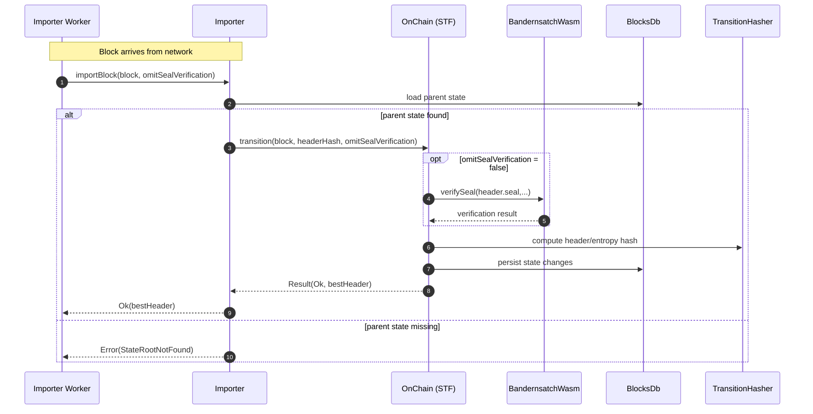

# Remove overengineered stuff

## Pull Request by @tomusdrw

- [x] Remove import queue, since seal verification is not prohibitively slow now.
- [x] Remove parallel bandersnatch support (for the same reason). 
- [x] Simplify `importBlock` logging.


## Comment by @coderabbitai[bot]

<!-- This is an auto-generated comment: summarize by coderabbit.ai -->
<!-- This is an auto-generated comment: skip review by coderabbit.ai -->

> [!IMPORTANT]
> ## Review skipped
> 
> Auto incremental reviews are disabled on this repository.
> 
> Please check the settings in the CodeRabbit UI or the `.coderabbit.yaml` file in this repository. To trigger a single review, invoke the `@coderabbitai review` command.
> 
> You can disable this status message by setting the `reviews.review_status` to `false` in the CodeRabbit configuration file.

<!-- end of auto-generated comment: skip review by coderabbit.ai -->

<!-- walkthrough_start -->

<details>
<summary>📝 Walkthrough</summary>

<!-- This is an auto-generated comment: release notes by coderabbit.ai -->

## Summary by CodeRabbit

- Breaking Changes
  - Streamlined block import and state transition APIs; removed seal/preverification parameters and parallel/synchronous options.
  - Simplified WASM initialization; background worker pool removed.

- New Features
  - Added a zero-value hash constant for consistent defaults.

- Refactor
  - Simplified importer flow and state machine; removed queueing/time-slot handling.
  - Consolidated Bandersnatch VRF wrapper to a direct async interface.

- Tests
  - Updated tests to new async WASM initialization.

- Chores
  - Updated lint script to use an additional unsafe mode.

<!-- end of auto-generated comment: release notes by coderabbit.ai -->
## Walkthrough
Removes the concurrent worker/pool Bandersnatch layer and switches to a direct wasm wrapper. Eliminates seal preverification and the import queue, simplifying Importer and OnChain transition signatures. Adds ZERO_HASH and refines Result.ok/error typings. Updates imports, tests, and scripts accordingly.

## Changes
| Cohort / File(s) | Summary |
| --- | --- |
| **Safrole Bandersnatch wasm refactor**<br>`packages/jam/safrole/bandersnatch-wasm.ts`, `packages/jam/safrole/bandersnatch-wasm/index.ts` (removed), `packages/jam/safrole/bandersnatch-wasm/worker.ts` (removed), `packages/jam/safrole/bandersnatch-wasm/params.ts` (removed), `packages/jam/safrole/bandersnatch-wasm/bootstrap-bandersnatch.{ts,mjs}` (cleared/removed logic) | Replaces executor/worker-based API with a direct wasm wrapper class `BandernsatchWasm` exposing async methods; removes worker, params, and bootstrap modules; drops concurrency dependency. |
| **Safrole imports and init updates**<br>`packages/jam/safrole/safrole.ts`, `packages/jam/safrole/safrole-seal.ts`, `packages/jam/safrole/bandersnatch-vrf.{ts,test.ts}`, `packages/jam/safrole/safrole-seal*.test.ts` | Update imports from `.../index.js` to `bandersnatch-wasm.js`; change initialization to `BandernsatchWasm.new()` (no options); adjust types where referenced. |
| **Transition refactor**<br>`packages/jam/transition/chain-stf.ts`, `bin/test-runner/state-transition/state-transition.ts` | Remove OnChain constructor flag `enableParallelSealVerification`; remove `preverifiedSeal` parameter from `transition`; adapt call sites; minor await/control-flow tweak. |
| **Importer pipeline simplification**<br>`workers/importer/importer.ts`, `workers/importer/index.ts`, `workers/importer/state-machine.ts`, `workers/importer/import-queue.ts` (removed) | Remove import queue and preverification; simplify `importBlock(block, omitSealVerification)`; add time-slot extraction helper; adjust logging/closure flow; ensure DB close; use `ZERO_HASH`. |
| **Core utilities**<br>`packages/core/hash/hash.ts`, `packages/core/utils/result.ts` | Add `ZERO_HASH = Bytes.zero(HASH_SIZE)`; refine `Result.ok`/`Result.error` to return `OkResult`/`ErrorResult` with simplified generics. |
| **W3F test-runner integration**<br>`bin/test-runner/w3f/safrole.ts` | Update Bandersnatch wasm import path; use `BandernsatchWasm.new()` without options. |
| **Scripts**<br>`package.json` | Update lint script: `biome check --write --unsafe`. |
| **Package deps**<br>`packages/jam/safrole/package.json` | Remove `@typeberry/concurrent` dependency. |

## Sequence Diagram(s)


## Estimated code review effort
🎯 4 (Complex) | ⏱️ ~60 minutes

## Possibly related PRs
- FluffyLabs/typeberry#401 — Introduced the import queue and seal preverification now removed here; touches the same Importer/import-queue flow.
- FluffyLabs/typeberry#537 — Adjusts Bandersnatch initialization and Importer/OnChain signatures; overlaps with wasm wrapper and API changes in this PR.
- FluffyLabs/typeberry#487 — Modifies OnChain transition logic; intersects with constructor/transition signature changes made here.

## Suggested reviewers
- mateuszsikora
- DrEverr
- skoszuta

## Poem
> hop-hop I go, through wasm I dive,  
> no more queues to herd or workers to drive.  
> A single sleek path, a shiny new hash,  
> ZERO at rest, results that don’t clash.  
> With seals verified, I nibble and grin—  
> lean little rabbit, swiftly checks in. 🐇✨

</details>

<!-- walkthrough_end -->

<!-- pre_merge_checks_walkthrough_start -->

## Pre-merge checks and finishing touches
<details>
<summary>❌ Failed checks (1 warning, 1 inconclusive)</summary>

|     Check name     | Status         | Explanation                                                                                                                                                                                                                                                                               | Resolution                                                                                                                                                                                                                                             |
| :----------------: | :------------- | :---------------------------------------------------------------------------------------------------------------------------------------------------------------------------------------------------------------------------------------------------------------------------------------- | :----------------------------------------------------------------------------------------------------------------------------------------------------------------------------------------------------------------------------------------------------- |
| Docstring Coverage | ⚠️ Warning     | Docstring coverage is 40.00% which is insufficient. The required threshold is 80.00%.                                                                                                                                                                                                     | You can run `@coderabbitai generate docstrings` to improve docstring coverage.                                                                                                                                                                         |
|     Title Check    | ❓ Inconclusive | The title "Remove overengineered stuff" is thematically related to the PR (it removes the import queue and parallel Bandersnatch support and simplifies logging) but is vague and non‑descriptive, so it does not clearly communicate the primary changes to someone scanning PR history. | Please use a concise, specific title that names the main removals, for example "Remove import queue and parallel Bandersnatch support; simplify importBlock logging", or similar wording that highlights the key changes and any breaking API impacts. |

</details>
<details>
<summary>✅ Passed checks (1 passed)</summary>

|     Check name    | Status   | Explanation                                                                                                                                                                                                                                |
| :---------------: | :------- | :----------------------------------------------------------------------------------------------------------------------------------------------------------------------------------------------------------------------------------------- |
| Description Check | ✅ Passed | The description explicitly lists the three main changes (remove import queue, remove parallel bandersnatch support, simplify importBlock logging) which directly map to the changeset, so it is on-topic and satisfies this lenient check. |

</details>

<!-- pre_merge_checks_walkthrough_end -->

<!-- tips_start -->

---


<sub>Comment `@coderabbitai help` to get the list of available commands and usage tips.</sub>

<!-- tips_end -->

<!-- internal state start -->


<!-- DwQgtGAEAqAWCWBnSTIEMB26CuAXA9mAOYCmGJATmriQCaQDG+Ats2bgFyQAOFk+AIwBWJBrngA3EsgEBPRvlqU0AgfFwA6NPEgQAfACgjoCEYDEZyAAUASpETZWaCrI5Ho6gDYkuNks3wpfikKMiJ4cko6e1xsADM4yEgDADlHAUouADYAFiykgwBVGwAZLlhcXG5EDgB6WvDcWGwBDSZmWoAxT3i42RKVRFrcWW4SDIoXWu5sT09a3PzkwsRMyAJmbERaCgB3AoBlfGwKBhJIASoMBlguXFowRAY0b1p8Xaxk6GdSXAurm5cZjaT4GA64ahbLj4MagvwSeAkXaUGqQYE0LYAL0Q8AA1vgqAAaSAAEQoAFEQnxkgMMp5UQAKDD4cgASgKAGFQtRotQuAAmAAM/IArGBBQBOMAARgl0EFAA4ODlBRwRdKAFpGEnSBgUeDccQstxQPwBILwZjcAl/ACO2BIDuJOOu51WL0gIXgcXgzyNWFQzL+vHwCDU4iknnkiE870gzN2GgMpv8gXO3GcL28ngumCUFEQGGoN3s2G41oofwZcQJ61gbrQbEg3MQLNZSagB0t3E83vkAANuzaAEKxhi4/uQWNEcIYIhJgwAQTmddC5xuolxvcQf3U/mQETr5yUT31hvgLPQoTRzlxvOQ7R7JBotAX+mM4CgZHo+ESaDwhCkOQVAvgorDsFwvD8MIogRtIFzyEw+YqOGWg6O+JhQHAqCoJgOAEMQZDKKB7RsBgnDNmg+wOE4LgIQoyGqOoaG6GAhgfqYBhqBgwzSLgYAUNgGDAbUO48mAuBXDi/qiRCNASVJ6gXhgGi4DUBgAERaQYFiQIuACShHATy9A0cCdG/owsCYKQiBGGaab0E05wkAAHj2vrqPw54ssgggiGIPBoIgqxOfgR6QAA8hgHLWYeTAYDugliLWh6CRg4I8tAin+hoMD1jEiQRGJ5HwNQynxnGWzwTWJxXkQjjsMgDKIGMDDErwJCZTQxICGOuKICSAjEtZiD1hQ7LFTQaA/okPpSMSJC9swETlXOEUAN6QGQKjeFYmZzEtBwkC8ABqlDer65XGpAcQvKskAAL63Z4aDzvl5yhDu/CJM5U74OEDDNv4ILIEJNw2XQC7mJYy40CBynIAQEVKAwr0I75P3be5NrRLWMx9b622leI0hGFAKThQTvZA4uVj6fY8BEEWsTXhDc7wUoNBiFDRjkjulomQxn0kAiSLbQkNpcAAsnQ8COJp2nJpx3G8TuAlCSJuwAMxxKJaBxBQ+DeKp6laRpOmw4ZQHEdEZnOPIlns7Z5OQPpVo2kFTS3bWw55pQiXFrAADqwXMFZkP0IbLCQBpAACIxjBMUyIAbRveLUAj+wWLM3GAuxh7UERKK5GhCIgGnrOF8eJ+MlAp2nxskJn2eFkH+dh2XFcdhcBeIOHERKS88CYtdWDO9E0fh37GD5oHuA3KH/caOQuwMltiCyNcsBG8yUK3fd5yPeyyMz3PqcLyHnerwy7JMuFPyNeRiCssSoTmhERARW5HkMF5m/b13iPMe3lcrJkgJTfgzk+AZGsgiAkHoJ5+QEKsCgUh6CHj+rQb0cRoaWz0p4eGY8kbhSwaIdGxCsY/1xj+Pg1MibsCUmTcBkCcTM0hGzayHMSHYwrC+aYLQaaQFRhQ/0iAFz83EOiaISERZi32CQSWlYZZywVubcmnEMzjjeiQLuxpFYW10gZIyttTKOHMo7RISD3AFV7OReweoDS7iwFo3EOi9FYD7pAMstAhbI3ShcC8TYNzjkgLsdQsB0BYBmtg/0HoIBCVTnEc4cRXrvQOG1S6zw5iyGJH9EJuIwLAlnhHDmUcjbhzUCwdc9ZQkQF2PqGgVdAnVKspuViDS9ysUSQbEgxJdgIG8BFBwKCSD2nYC0psdi/j1MaSLYExVvHb0jngoxhDiKI2aWQtGmYxFUJxpWPGdDBEMJJoiOyLDwrUMObQARhMGBgEYSMYR5DdmbORNeAI2CfS8wMJIwWJFFByMRAopRFFZbYLUUrCAYAjCuJ0UMJgoRaijVgCi4KsBTZuHUUY62REQJ23MQ7LG1jwGLloEoegaB4zi2uYCxKEJ7EanJDYSKAB9AAEouA4HKUAYCHr2TE95IDDlkDQcRQqjYMi5TytlBx9LMtfjwI2CJsHrWpZ1R8eBoiSvChIF4DosZ/TiLMHMqLGZCp7u7PhMQeRkT+BPMKKAPaVhFWK+CwV0DNiElI84+qejnDzG68Vo5BDoGQNS2ukBqwVOdTaqNW1RXiuJEm6QoaBBPWaUOV1ib3WIDyaMc4qbEDpqekqnahN1p/WqljYtGhdXSu5RyuVCryQn3CvmSQ5xmWss5U2nukCkHNLckgcQVbC1+T4DskKLydkY0SgAbn4BgKMEVV68M9kG7NfwZpCC2Lge1eUjAwwIUQvZyNtmiM2ZZOlRyeAnKBk885rsOS+UZTuildAuD9h7eymVHLJy3owVgfs8LbK1CRc3VF6Kxqm37AYJInYmYsxOD4SA/Y6UKAZZAX9faeWQAALzBukPWyg+BG2yvlYqhd8G/kC2kfQWRwN5ESxrMoyAEL5bMAMRo2FBgwPSAgwSZueB4D0lqF9WYmg1LYu0rikxBKzG0UsaUl24CrAPr0vTVT0hfDSCkxofAhSEzeNWBGxmc4hk231EDDMVA2DwyifQUIrNEpRVxH4BwhDgCRVxHoYkztP63VjUZrgPncTEnJJMAkegGShfc6yPTXncDhci9FigehCOZeRvF8LsX4u+cS+5zzUm8tZZ7hp+5WmGZIKSwZ+utYTPVXMy6IgVn8VEzs42Z8lAnPA1c8gKLRsKAle80NmLAWuGzi/lPba6Wwu+bS8N2LDWKBcHGxQYkXNtD0kI7HDSRXRspcW5ADbmWCPZaufNyAwAzsMlW+t9LW3nw7eQERrSRWNtHdu+l87ege5+Fc9BAKfwxpoDGMgd+IJhndejUgXzRdEAbZem9CNJSfmeFoC/XqeBhlySJndFKdEHOwEUMgEzIZaDYDOPGZwRsPnA2S+sCd0bfNHf4HwL7+nCGTQZSdWaEVrNE3Z0JZSA7wpDv8T6y05xYFoHgXwVK5EA4emnETDIsgWROULYzdhrNpBLurdwXxTSDbJLEH5Fd8g/r0NptphwFBCfnFrsgNjR4Hq4F2BLt9yUCAFlWbDdZ86eGXreZjG9BzQL4000+5hUBZZNEULrlD14fEmW/UZych4MOR6w99I7WeQMCcRcJ2oonxOScIXB4LMd+y5ZO3dgruJDvc+OxF07v2suQA2pOZGdfcQLb83FgfCWuBs9b2Vi73f+w9wT6T0yyGOHnDTy+b9q3C/ocwwlfPreN+gbQNo8DkGy/iAr636vs2MPXdSx35b93rsbeexCMTb39st+Szfs7Xee/NKv8NsLd2D2t+BIT+r2e2H2j2w232X+U+PeEi9GQsTGoQLGiibG4Kqi3G6iysfGxetQQgjY+s0cGcWcs8KIucsAYAEgjuqkfEWKPG8m1mQs9sFkViU2cekAfgPYB+8Ef0fc4cXysw5w26XskSs2JB+Ybcl8Hc/cRcpBpc5czS4hZB7cfBXcxId4JA3AQWf0Z8AcF8i8Yc9gsgzAAgxsMObAPcsUkMB4/K4gw8o8/oNe082c88Bhy8N8G8W8Nwu8xwqIkkhqx8zSuhFArhV87hSIt8b8qYCIVaBUP8NM/8XhO8LIvhoCYuZK5mleuAvUrc5BS8A8YMoU4aXqVgFSSAJAYAWcRRAhQyDI2S3gfAVE2gakKAuAvOO4/OWMoQUYQWl41KAC3hKRWwfKAqwCjhGYTQ4uUC40/0gMOmiAhuBUX0fwlkf04qfwqScYQa9YngYwfAJq1weyUOh4EQEIYgAep6GymMF6BUIiYebmEefCd6tuxM4gpMFy8ez48+yeS+3ixu6eIqLh+hYRzAK8ERnhgCQxqIphTceEgRgASYSAmkEhHAn5Fglrysh8wIGApKDMYgqsZSwcYYE8bYFwoH5uLgb4EdBJLpzNxKE5ztxUG4Iyb0FWwKZMFEosHzGuyFD/GgRrGFpgAsirrCETGiG+xAlBz5FOGxwaAtzImSF5x8GyElxdyVzIwaRyn0mKkUGqHlyakfQ6YoDIDLR7hOqRo67bpLrpS+oXAkBwIXh8CoDgxsGvjHr4JwxXFuY3HHivLB77JPG0L3pVax4fEQIS5sE8J3H+mPE0Ic7BlCKhnwFSKIFAp4m0pgoqKQqYHQqaLkkIp4EEE0lNzykSHkHSGgksk4psmMGgTMEqakr6TkRGxU5nDmbrrQCFoHCOKGhhJUDli9Zu7UrBzjCLghT+B9TyA1EpKxoJyFrJyyAQYuCGj4B5Tkg4xmZRIbo3KMCvQzrBGhHSnhLewar6j6pNLb7+FE59b9H45AzBReE0oYk+x0JGx7EjF2GCogIMhNHqA2HqDSlBrORYAuYnBuZ4RTSYBnDtjWAqrwAnirgkCBoDF8olQ04k5k51jUAvLeBEA8jNJCT5g9HrR8G3TgxiJuDgJeh9DHQvA/l4Ck4UAADSJAuSPx+uHUaAsgsYM0xI/4rkJI1AaARW9RMguRUpnc1FsgbK7oOYx5kSNucFlKkAhQpxCoi4kwXF9UT8LRQaoFKJEUWRQWpRLA5RPcvwNgn8r6rA6g9qDId4sgL8XAoluYCpeRnc+oc4bKpEtlEy8lguXaWADlaOzmz4YFSMSxrexlZRqwPcWcl850+ofQHg44z4DInlRAXYQqAWLAK0B67AeSvod4akglEIOVyurkuAJQYQTQIlWYYlblEly88VNwbKUlbK4gqVLR/lf04QUgLimYDmKIfW+l3pkVyW0VplsVRgy4OYGFWOV4yFSRPhwxelYVIRsFU10g/S/ZWhsR5wpFLl/lJlK0sVX0xsUgeUcA64e5yAZADu8EpFg8n5YxFUvAjpWaDKmAdhYCx6ayZ6myPps6V64eiQQG8ZLxoZrs5KlKa+ue06yAB5qJYce+uBVJhBtJpZyhUhqhak8GUAMNX66GYknV4aj5N8rI/YXAJ15RwASNTVzAmW8Ut16G9Nl8+RqN+ZlJRZjcxB4lONnceNZKn6tA36D51wnoF0NFJ0ng9FiezFrFXAql5E6lmlbFbCKeaGytuAqtVAbFGY3F+AM0StalGletfF2AAlQlJtKtZtXFRWNNqwwAmAsgegG+CNrNkp7NKNfK6GaNPNRBdJ/NSpgtiA+NekItYtKFFlVluVvl5E9lrFqI2tut9t1NMVJAztGArt7tLN/YbNbhzAnNh+gm6NxZfNjVAty8QtBNkd6G4tQMLVsAiVfYKVxV6Vn8WVaGGA6QlAOVNl+V5ENtOtdtbFnVxVg01tKlptat5VNAlV1Vc4TQXAPdJhlADtGdWdOdvtHt+dXthdxdFJpdAdmN2p5ZuNYdWJKZOJwKGZaBWZXGJJMKZJJdQwZdvNQdldIdMhMJakkk4OlRwdmKzA5csmhiNZ+KHJymJKkZ9k0R0Qf0v9SU4OsxRMTQ2FtAW8jYV0OScaNoIVH5ZUgqPBBUXuFAd4FAeUGSogWSWYY9BUTG6Du4Lq/JiA1qnss2GkakrktQ0gHQ4O8AGkW2WDK09R8g260QmptQZDFDpslcCIkabDLDDIUjMjlAcjxI26GgDmaAGgJwng7a0Ez+WAW0ajfAj0fFJSwFfKEgRm0QZjGg24NAGA0A+A+0oQ5EVgNot8kAo0dpZAOFPWbpf1geAN1xpCtxfplCsZO50eIZZy7Bg6kZw6kedAdyQi0ZxCyZAKMiaZyB+JqBhJnGUKFspJ/GXNx91JH9WNDJVdHQSD/93AgDX9mKVZcmEDxkdZnJDZsD4CDk6CVcTT3gkYFw+A+Af9/Zwsvt/tVTgdNTOpFZmcYzEzADZ9QcWKgT/JBUwhlkpjBIFDmanDcpDj+pfWf0EQtjfoFUDjTjZArj7j7AXjlYt8C6xI3g8u2hBUPoQy/lzI2MogeAu0bock/gTUV1CAd1ppLMJD5w05AA5P+S9Q4RVDiLiagbBJbv9DNGcwVP+BsOVEDOEhlUaqQ/s71kDXZhMnwhcZ6f6UDZk3sjE1HscvE28c+pcuQFfTk4xnk6LAU5mUSdmU/Xma/YWbM6fUA4s8XG5HQdWXpHip04StA07L09dbdGJumBU2/SfSWWs3UyqTKy0X4xkAE+/I5HlPpMGPk74aukoD6OQFSlgODQ0uDu+R7QXSCVhX8GQM8NULMELHhG5AC37oA0UacZQE7s0nsWxs4S0wJEtIgcuQQEQP2QgEDDCF6cgAo16mY7UMHNytLLmKlbPOCzdcFMgDsVSsqpIPhUGwwABJtoE3haBCeFeY4cjHWw2xoK20bLIJEX1iGKqryLaqTYTn7vIB4UYZCXvMgIEUw/YEtLBNEBkJ7khdEjwGM68GiFJvAPnGS3wJ237nDrYUQyPJPLGg0/2c02WesyA8gP5RyFYIUGADsIFWiBELUMCK5GEvuy/PGaeUha5KOkFmY2EvWFgAMckTO2Ep6v4bom7N6xuQgzvEhWTRLRm3S9ZA6j7tTn8O442MgiDvexEgoJMNINaLPEFnPknv6g6AQ4/Pavmv8/W00s5OHE0EbNgEQJEoewSBoOlJY6FUDlgkJeq0tOUjHH9F9BR6sFwFJbRZ4MSDHXONZXlfaoJ7mAlVLbIG3c+KW2iIoIIXgzucyEoBwPgEx/pOucG7WEGtZyx7WLNnOUnPXIuQlPW2R+RG8/gNktYINUMNR7ci7hp7m5eyg9OUx6EMkh43/OqqM+M8g003qzcNo+XPpx7V4u9eeUtIhDhzzI6/QODW7m5PDEWDmNVBay0Wa/6ttFCzyBFemJpnTAzG7uG47gfiByRzoUA5APmwcIW6B1urpSFD52VC2yI0TKB9aGYWru1OgLGCRSR1mIhS5K5DZxQI8kWH1NEPNeIu6f9Zm1spE3OtE2Dak0GZDQk2GeuYGa8eoPINV0TXvciYeT7dnjMxjbq5K8qdK6XHjdGp1PAlsKuuDZ6hqppgjTBWq+9bWBrb8REGjNgLDQhroH7WefhZeb7gSAyFl/hdyG8Fbsxw21wFZ2tw5xQMAPh8wEx55jJyQHoJTSj1AP2D2/gH20VrY/BZOAyEoLhWtF/H3k0EgBoLx5Q6z+z/2JiYhsTXeWh0DJO5BytbO1wBCYMTO1wDCe81gMfOnVtXTfvSCW7Uz/XShfJzLXLYxSxa4NPbbbPexahsPanfrVxTxaLTbyPXb/xaVWgI76PRvXrynaPUb9L/2A3ZAMp0QKp/HbgInY5b72rf76dZnYH2rcH6j6HyhU3S3clUVWlRlV3Svb3Y2z5YPRRCn+besLnyVVPeX1xXPSV4vUQMvfGEX4n7TbXznVywxlM/k3fYSRykzLAMKzgVq2K59xXTe/q11tT7K+0/K+yV08q6wdYTYvMo5Oq0Mh9+XZ/ZP9/R0NP+Ii0QlMY8O6sJ4HEGAMfyCNEC8c16WO1zTm7qRdPz1nwFwrQHYu9Jay8va1+gYPUDAB1xBoyAjgOyATQTJoMgBvYT1Nn0RAUAmyJcPbKvQmBJgABlWIRHfxAHcZwBl3RwESUTz0AeqKHWFhORRC+BY6A9e1HtkFApog42fHTlX1fzShiQ9AhTntn5CoDag1gTTC6wHIFgzmUkaLqgwYBkoIBQMD2rT18hCErQ3gRjr1wiTZRMAiAaLiUFHRhIlueeNttjxNw+93eTvdkEGmpTzVw+z4RQYlBUGjofG87UasgAADaQvcRDoI0ACBegvWT1KPWHCuCKAAAXR7iLgxBzOMYBwSohU9kAJ4RxNxC/jUpsEp4S0KtFAii5LwbuDjqhxf6OYwcEOUjtJy1zaEImzuYgfgO+L6p9Q31PbjgIh4s1QhcaWQU1HkFNAzBygygKoO+jzteB5mGwCEP86oVGUNOINIO3grwRfgDQiwTuB8YDJfQkSGwVuX8CGh5AdOLiguCbKlhmAeSSJt4EcKPcI0K4IDOkyJgMtNks2BwRvz6R8pEeaqAXgVFgGUAEBbkebmVCY5/RAuxMRwKsPOCSDEogaEpFUN4Futbq21HFm8M6H2YwY/KS8LXH042BpcTYOXArmVSBABh9AOQBwXI5SCNAQwwQU0LUFBpQhaI0wRiIoDNDdwkLOIdCypQLcv4RA5Cq2D/h+IdcDuJ3DSyDyUJ6WUTRlmd1u5xNEyV3V2J2SCGPc3eOeeNDriuHwC5CSAovofQLLv05myXXUoXAP5wZwE5IVesDHNBPdMMWAwoUni2iWUVOcdUvtQNoFackqDArqkwJYHac2BRGfkE9ElHc1xWX3ONsqQVE11IAHIFmvyLho2oJBKIj4dUNBbPw6hsAYYZiJ3CTh/KcPfXOhkx64dseLxfHsKXkA6D4+etSmn1mMH9h0RSgkYTHyKwhiqA23Wwd4MnCjUgs/YewRC27ZCVnBXg4oh4K8HFjfa++UVtKIlZOj5R/nRUVhB1yejN8ueKNB0N2BVCiMGgUcdz0SFYBViBQjIdIF5x+1R+rYx0bvzlEyEXRl9KAO6PLaqjHIXoz2B7SqHdgahgY4OAoPxGEjwxJHSMahmjF5c/cOPTTAmMJ4H9fAQIgjmmKDQZisx5g0MbmK4D5igWRYksetX5TrRyxjY97guJ1YT9sae/aYJ2KFp0Zr6uTXEr31BT31IAA/bjsPxfpH1tWDo6CbU1gkOM2m4DefrWSVYWIYGK/AwDqHWGTwNWQUFsVBJ34wSVxHQYiUx3GElhAeF4YHuIxkEBjQI1KPgoA1So8trgJwDxn8FA5u5giOpbyId2qiIjowH9SrtuSEk/tyGvWS8t9SNQ65X0EkzzrgGDj7tKe/nYkO8NWDEge6cwTLDGPy6egyobolkB5ykkmStJlDVePp1A7PVT2QqQgYYQZDPV8i5aSqlQAcnGC+hg1V/q7ljQ24XeRtWgBpxiETENwTqFIQdTDiVFjgJSDDpQmzayj8i5AvUZQIKqAljRrdRgRp1YEy0l0J0bidQEmHATh2lkg6rtU+brgCQ2QyjutCyJ5RFw0SccpWBSCixByWYLOKEnf5bsXaSyUIEwGZhnt6A81fTjZJzD2sPQDHCZEDTHYEg5hVjAqGmCoArgkouHa8cXCuim4TBwEX0AWjGBUpFeUJTSQcwmKlc8oJ472NVxeB8UVw87WbgCPUn2N92RhEwmYWcBr90EixKIItUqiqiQQQWG0jLmERIBUpkSS4FBXrCu5awzkB6Lt19pHDpyjIsJt6TyHA17ifkdkXGU5GnI2W7BG7nGU3ggycwvY/sGY0nA6T7EqxHXP2AMmuT2A7kihmZOBEWTfRVklvrZLtGVNx+LEwiWxOkb7tq8OPa1nxNJmhB7pfY70W+iem9YiMPMySXzPlmrxBZBHYWa1CkHWTTUsWMPjj2pr+d2QsBSAKOLygWMxZBjSXtk275IE+WffdjJhKH5YFn65TJifhObgCYPEYDD0gq1MTLDKJKraif02Q6+lYQSga4PIHYB0Qa485VzkJkMlSSNIXADSAACpK4s2LftU1DnlxLwSgJOT63OT9SVw4zGYlXO/A1z4IxxLAC6RWT7dQmh3FkSdzZEAyLuMebkZcnmIpNAyuwoGPsN8juzUyKEr2WhKKbEl/ZIrXCWP235SzHgMtcUFkAADsNBHcLP1InGJyJSmGOcv24Sux2GrqMUi+SRLnwGaOmCTuHC1LfdC4v3LuM0hfntjl4aXcBE2VGLItLw9RR+TKQ9ZokFey1KEncEEhHxDGYC6+BETvifScwU4t0JAug4wh/Q7YEeQ3MHLkVlIiCZJkDXWLCDrSfEEls7nIVtyGu9gbrITJ7kkyp5DxCmbExZZciaZYZJ4VeNTx8knu8C8ImvFV5QdfC0CgImmIglBypZG82StvL3nrFq8iJZ7vfO9oCLb4tGf5B7N5YoEBWxTHMqUwDmly5m2/TeS8H3nSYzYc/Y+ZA0X5nzuSf8lhvYGOCnAUkEpF7sjX7ggKjm8zc+m/LkJqlmkUjWURWTVJWoT29hEBMAsdSgKDe4C8ElOzV4iL1gMCstEERiUIKMS9CulowtZHXoWFzLAIVDXUyaZjB3C5fLwrd78LQS66QACgEyqPljazmEMAzghoXkJOJ8gPEYIgUIRUrw16bsTo2vayXGAuZ2NCBJHP5ptOfh5QGQJQHzmPC4CVLfaQSvUi/C76zzb6C89jLouwmBzV5i4jOMYtkqHyI5C/CicSljkXz7FNqG+bJLSUeKV857GOIEtfkyF35pzDUl/OXHBL9SPcA4B/QU7dRncUA+4X8RNwINwoNaWSp/Ct7HR9Q8EE4i0SsBFVuhnRVBXUqB7IAHK0afwtcCFiHhvkcQJVGtWMYPg9Z5EZUZJBhDW9yVb5WQBygxRw4ReGgV4fYGshBCTMCPHoAhV5lkrmylKkaooiiCuhkAkKucNCouiziflfymWpoKx58A7W/4QhLfMQY9cm5pBFOZ4tjSVL0S68eJcIv3hwcUlp8W5VUsQXfT4YQWXyeEscKrBiknVWKTHHiKeRQc6C1InqBOjttsld0KTHaQdJ8cu5lxLJSjByWg0B5ENIeRwp5FArPU9ygUZhijS/LA6/ykFhLLwlSKDlMtavFEtmxbAyxiK8cMAABXEgNI3K3AKdGHgm4CQ3vSuAAB9Y4IqogNCsdkaQ3av+PNbiALUgsi1Jastb2ArUUAq1kAWtRpHrVirYVFcN2hpxcygxoxpK3ANSspXrZeV3AWlRihowMrdEgyhRO5ASK4ARS1wTlfBH7AjrWKMK85Bvj+gk03QrKkgNgo3G3jYei+KMTGpJ5F5IJwc6RRmrxrMr5V3q5IQw3vV0JopjmfsLKLZnJNL8WqiBdO0SUGrj4vecKEor0IM1tVlNGeTfXTIbKKIvs7ZYYsxrb8zFRyhgtYtOVclSU0AL3NBFQT6ptu8xSilACvnBhGpSqgqJdzeLyAFlWa2NB8tYlSs/FChZGNxpllfKbCjE3ZcxKlkEa1Ib4Q0vZKPZbAdEt8jja6WiVuLkNUGhJfquSVztwokG01duJiIXC0F0G4YpgoqhBoc160H9YqstVflfqJ6WlsyOyV9zcloaqmY+mHn0aHFN8yyKxvu53ykNKi8OI6i4BeKllvi1Um8uriCaFmyyyuIeFw0ll8N8itSK7C4WPrrxz6/zSiTU1xKHp6vJJWIsgCIldNGJVZehtQkElNlS83MiP0kXryktFio+ZHMUzRyzl58tTFhAKgLLRSTGzjTHGi0+KXlfGnhANpUKdxf5nW84AmtpK7ktxsmxrEMrCXEMaF3Wr6q6HUHewStPjKaCisSBbbulUCgrbAsyWOag1zmkNeDTc13d3iL6ADfbx4Wgq3exvYcIomEzfp5tFARWTWwvJxQMobULgFYQiDUM5uLxS9VwGm1NxC11bbLsDBmiJjXKy43Xkn316qbAt52LLa91UUHb8tsG1+OyA2iPRJwxvRcHEHhjvaANX2mHRDCB3/a3Rv24HR1E0xg7IAEO7wFDtx5NJHxq6WUUjtpqVL0dW2vHd3kJ1lbkJ6yyregSFbLzatYmjoP/UShKQWQEGX7Y8FwDMlGtxyk+a1tI29MoA6AomM1z0xqj6AgPKWoiFoBsC0hg5WNNFEB0qR5d0kZSEunXRpy+V5qVAFqlAgkAIkvWJEaig6m+N+cvWWSmBwCamVcACnWAVc0vCoA4OxIWsEiOjYEgVocXEPdRQunXNwOB8ekPB3JB1dxUEUHiakVWmX9akhSbzVgFXjzrl1dK2DEUqqyG7kRxu4mEC3w6HRPAkes3dHoGr2ZX+MpW3b9plWxiKAS6VbQApARNZNygujbaTlxwJQfQDUedFahYZwTm+3Wrzb1uU2zZXlPCMLT/LKHOTeVa02MLsC4BzT2AA/HcLtNUg5QKokSrfbGl/JjpDNjOb1cjGiHwA5pDqZbvfHQAFx1AhKoPAHobp6qHwLIClcfrjB/rsKHRbgKEtK4egbNr1G6HJPcoeKkDgC8eGwXQAJAMWvjOMMqpabdCoKQhB8NyFAi/7yR2knIXEhQXrsus7eygl3pASpI3o2CkJgGtO2h4YyeS54uGqYRhkDJJ068qUpBUAlkgSQSKJjnJ0MpZV94qrFzsQj07adduhnQEMUMjs0MUOvqD5wGjzL+og0YaOof5zw7UUawBoYrowC17xoxILaBWj2gHRswnepKhnsvCPQVeLe7bm3qcMy0o9cy+LlryejEhxFr6yRQ7ssPK6QQqu9XZOAkMQIkQMh4Q3ePjEmHCe1Ov7aIAB3KHRAjOhQ6kdXTM7tDBh/Q7ocMO5GhEGhsw2thgC36WQ1h9eimrH7hGZI6R6I4qPARpa9cGW8pVwDiNSGBRYfZo8pAZA6HxwJR8cKdBBQjQg9FAaw1wA5QzHrDHUZAmbroAKdF1FKmvfStrWrTxRcwePXlWcO0NHCRGO6Dnrb5O1vsJ2cEHEDOwtqJFsu4YLUZ4itGdwMRgoEkBGmn6Tej5IYyyBGP9RxjuISY0iGmMzRKAcxjCYsYxQHH1ARxn0N3r2xnHVgFxzOlcfbw3G7jjR9Gn8ZeMq63j7RjRWsow0S75jg/bZWYyGASMKARcFhmAHGQOhCNHTKOfWSokXK1W3zA6r+1pNPEaT26ekw6EZPdVPUvPIJmpKL3Ky7WEQVpaGoY2fwAAioKZIDUrrcQAkpIG3O5uwWGipx0GWxnTztk2XxXrIeMEkynhCDJlxXwHOYsNg9LQTeB0VBKQArelGygNRqGQwiPqHKpHn/1EEEAGNkAC09GiOA3I/eWMOU3OB1MOgVTrxMdfHooD5hl21uGXAcFjC4Al01KC07QFDTjhhVz4JJeSWiBkBMzge8E7MfpW0ceCVMFY/Yipy/x6u6ZkpHuTnXWgSw/9ccEFmK4tnIkU0z+H4KH3XkD8zS5/V6lUNtQbyWABjX3RiAEgOp4cT1BzpSSIhMcB+pAByFnXkguzDIX1CmfGaGMuYlAFPQdXrDQIvUfVAJtudTN2lyRIeBhrOu2hdncwRRS8K1FEAi8uzjfE8o2eCjNmfOmKcBGJErClFRpLh7vVYNIT6gZwvWU3SBe/LQW+wCndkMV2bLnI8ZBUQM/OzpAsgBeJMktfed/N9mSaRMX4NmdxA6hn89IAE7ocQv4KwRWHYmLIhoWjHCk9YUs89jPIepK+bAHc9kTAgzAC9f0Fi/mGsOOTqUfUNAHeH5BGGiV4VL1O9NgDWHgAW0Ji4VS4uXnHo/meMhpAublrK4l4VbD3BmBjQeeL2F/IYxiReoXdzZcRkVCNbQmxoxpSqDuk8D495AmZpdF5E93wQQ985lYyaLYHehGAd5zQr+fjK7HcFewcou5Y+GVgbCQNQMx+NvARpkAmZqIq5iCwaQXgLlgM0qdoBxa/wwiMsDTHwqoB9z+XHuGNG9C5io2MINdCVxjNsVHurRGUn9GLOrAeL9yqcN+Y3O/mNOkkJmKQD4AAXcAQF9PYiYCt/RgrJYR1PAZVw5gPTSuM4fBB7PrQb0XZpjnBYRMgJew5uWQGjBOHAD0svjPMJ/1vnaXe1Lyci5OgKt1mmkFp3s/ZqZHnonNINZha5rYXUyBDrseOW7zpk7ko04ZogJGeVNWXfalJnk7jD5N0mLTpsY3oJYhMYp5jdloftLwvPjM/xyZ1M8byYtAmQTuwY3rJV51O1q9K6+yzsYtlfX4GP1zUx7QY1A3Qb3J6k+DcrACndTpsGfQENKXqRpeH2lqCoeyNzdqTJPG0xNHxuy9iL/UMi69kotjGRU/UXG+/lKxyWFLCx0s0se7wXBATst3Q7jcNwY20bMAPW38HUtFqzr8FZtcb0MuwBjLl1rgErYxTAAVbQlmE+rexta2JjIKXW6pf1seAvbRthnnVm8yRQmKRazK/zlcs5Xzb0vCq6TtvhC2+ECppU9GdrWEVFE0p2gBSYZvC2mb8MJk2ROI2ny2tdizzTanpHcF0AtAPdB0R+tLqSbkSIND7a6iXnt0kOSm6Prlsgpagjt+G2NE7szHcbxnFop1Co3CoXcN5J8kktkBjkG73FsiocQqg4QbTUcRzuNPJKcWKiMYcZkddnif8fl0AToIQytUotDxl0ImgPuhyBg4wsm+xhEmOB/AJrW3Bw0dJ8NnRmDjhUzSyAqxNdtMUXA/H7iN3r9FKwF4429UakFxZAFrXla2WHbroXi26Ei9Lfbzh74TrhjACfDouinm2lZr1AuYHskWmyCB2Wspf4CHHfDr95SFDxY1KzkAG183Quw9CbF9gfQ3y/BelU7F3yYM/TbzHo3K4Qi9Dk/YzjbaoY3ecD/qJVH2BsBgoqGJGDLifwHnpT0j32yJYsu0owpv9kAowHqrYP0eTSER7ofwezWNO04O6j7sGvU42yxHb2Ig3IVw3FcjRYGCDmuZddxq3qpKPdagAkWB7fKAh2DB6OGk2uZXEQjDKoONEmlmhXSmitWMW7apEUA4HvfzMK7HCwC0QzGvQBNKCQ5wqMFdRlyPBLzJXcKY4VQBJ6KAbAegNm2pTro2HvWPJ7/enupn+kGgpJCkhXuhJ39nVigKQAXalRyAOYAKz60UAdnXsPcBuzk83vVOxAZmuuv4IqdLR3yYz3ALU/GYIP2QzWDW7oY0A2ONA8iW+KpENs3DS40iEocQ37ZnGTrE0wpBehcBT3DbDIfkAAD1tYNoqANKHZB6X0sPcZHMtYF6D9nGRNfSL9BY1gz7El6jR8JE3sZAsWylKnMS23R8UWdILGwMs0pi4BOgOUwrodcKctlqcrSk3W+TegBtzMIoubMNh7gzKZwQWD8dIFTjTZy7ld1fESRCgIpgYqSWCPpo9A+bmHm1xwkBQKjrphCDDzRvuqR5BYHAoTmdAyEAA4BC9u+hMXAAuAQGD0cO2a8RK78Ag5l2/UOVydqetnaXr5Mt6wUo81aiF8XRh7QCX7CTnKGuj8cHvjBuM3qT1eOI1AH6O9GUeSQMPpa9xAMgXXSQVZzLZIu43CQXrpIDQ7WMy0NjNK4S2Tf2OBviHcJ0hzBZOPZ6rJXr1E8AG+x22xoDtpG8SC7sUBcbGl813ceN5fHnX3rgIW65YbwPo3rtv11MejdIO43wDm6Jr36UBvS3KbtNxEmVtZuoTpZvN8SALe/Z2InxAgfdrKWPbv05rjQO6/0e8PPA1rzO7yezvqN/uDrqKNIY+Pevy3fCPBzw7K6evS3SQat+3dBPRvg3UTl4GG8pURuXZrbg9/W5fvxuKopxw+Le6SDtuJ86b2AJm9VvO2c3fbrU7ycLfS9i3G7oN9o6WoS1p3u7uilW81s1uT3B7mNxHobecun3ibvpMm8JtomP3nb+2zm7Vt/uQU+b4W4W8Qncse+880kxhPJPS6jANrrO+/JIma7872unptRJTDN6hISkge6iAkcPUoiyWVxuCAyoadabSpnuG6p5DmuxH/WGS/Dq2ieBmAtAIw9SczQ7bsWuzKcEp6MNMWmOqnx6JDJ9cDRZPG1CszBxbvG7DH2nhyxTmcArF/njXPI0DhnGhKbwEQZlcAuRiSeaA0nkzD21OlfR1bin5T5o2FuZogpfODT4kCUsGHQvvJlJYYPHtowLOJAIaLPfGcx6yD7qsFbuRS8RQSg0sEkMOGIPraBkATe1kgHrBul3HojkMOY6Cx/TUAOIGQSfbd5/QxPup0Nsu3JJD2HqfWbbBq0RGiPPn0M/kWuQPyRIEepldaExYct1fKXiZr1Ngi/0aOfp4UO1+6/Zv9Fj7PyI15rSGfbNhbU7it6I6SfpbOE1hGUht5O+6GEHzoGWrCeQ8PvG3qDrNEd/dd3ekPyD7vayDIXJYI014KaYt+28CTjSvmNpKEkMFtLaDWsyhpgD3iugoiH8daHsUqKiOpE5LxswDGpezc+z60nMMl9WBpfhlY1iNCLRwOOZeChhEMEn0ZwXUPUJSDIGxhuoWcA97Mbp4tESgnAA9OgqoqQdy9PmsAFXuvRwYc1avuDp3PV75pu3gIrCHMPTMJx1xOxyDJAaT4eHo+LvGPdkaXp0AqQeHgvOn2LwPd6yPRjerjfX9p7i8Q2noxvDobQbQz8jC9mmXT3CL2LPJDhkVIHBWaXQG+bPcYahEUXnN2eKFJnlSC+jYLU0v7DMSyJO/dfG9dfLALgB96IeyVHv33seFL1R7m/cH/UT7/e88B+GsFtvseC8DQwpObcxSr4knlEPIwdgNVi9dKqt2UNjeMy7vUn7C8e0mF0aDXxDaXeUM1I7Bok+Vso+FMfZNHmrXR4Xe9/L1YAYEDcGlO52rFirAuzrvY9uxIHWL5ALhn/R9YVnXkWDgw0wAsgcGkAXVJQQNSWmjrY0EjH44cV2JzgJmS4J/C38so/0TaGUs5zriTBFyqKAHPAwUeN24zPGyvQoEH9JBo04NS6Hg5rn4AzQ4Du67OgO3rIBBYx/OnAvQ7wJYREKh/mt4RQ1JoACYBAeA3eMthKYxg1uAUITKLRAg7+uN7lhgL6hmCQ7PeqHm2DO6BBhRrkBzUExZUB8+kzB0BsbgwEoOt6uv7DIZjpS4iEzKic5nOzGrLjkKwLkbCb25qEOizYdaA2j/oLaIqhaAiAJFAZg4yGBY4Yr/nhgco6gZoFoA2gQIHxyJpNj6fM2FFFyCqZwFWyo2VYFK5/As3lwIquS7EN5UWN5CNw0i/JIba8WgLGIg9wkUCeYMOsMsVBcAq2CJqbeHDgLArgvrPrgFcr+tZrRITrIdYG0rvDjjSSN9rjiKUH1PYFde9ANOD8AeAHxaaugNM9ZkyAZJTLvW7mhGodGVfnt6/EmWoOCEBE4KhaOeQiNJ538fWnOaQA2sGADkBL5OxwPwkAPyD9B7TjpSDB0aBwFTGX3ih78B4LDhAt2zLg5KYIWATmDSQQhBObC2MAZgwacx9hxZIo3UucIBCXQdgarB5wGr48OTuBBgs0isvUrKyg5mE7DsQvPGZBQvevDCbqwiPgDwQQYAIH66duAzAxIT3Nv5NogGJqazY05Ohif+C5DBiwAM+Lf4l2ILFQLq+U/ocg0mM/nP4IA5AGzbsqgrghQ/oegf+gz49ehgLaY8mh06ZaTGGKTk4VUA9AEhvaP+iGBWgQ6BqKxRGQheqiquajiBq9up4C4nuuS6n+ZGFf6RI2bPnR5opGFKgqBVGG2hMhxgSyGoaoujyxzy2iuhJbKy8uxCYQxMALh4sgECx6kQEEJRDUQ3TPRCyIBYqhDaArEIYCahJfGyjwUiAGyioSdADJQQgrqO+AGAmoaIAigtAIKDSgIoJJaCgtABKBoACoPyBxA2sDkDawJACKBxAoYXEAMAWQHECBhOQNKBoA2sKoACA/IFkD5AbodaH6itoVjgOh88k6Hfgloe6GfgdSmyhsA7TiQDeUZevaFDWpYQYAbQKPFpaIAtgCRZ0AqnI8wWcL4HnLoet7sOqz6mOCRa2AfYciYYeSQK2GRQVIPBTJyY4S+4th2CLQCQiGACSA+cwns/6xQm4H2Fx6i4fBQrhHgLuokAW4eOA7hMCgOFLhK4TqCxC7SieG4gZ4U6AthdiHeC0A+kCFB0cwnn2FaQA4U2Z3hR2BXBcAtgl67NhiHsWpl6KQN1hfhh4UMh3hQjNG7DqckFsDzhOeq+7euGkPESYAY8FBEFQbxEMgAAOhpDxywQIKqzgSFKrIxAvQAREOWbHASx0MwMCAE5ef0LYBw4fwJsI4BDivFYlIDBtmBZa8kg4Dlgm6CUjNeHkD8jmBZLnODsgLgkSKegb0IahBozIBgCAAiAThCZ4HBDOg63n8BvAPwZvZ7WzgKuikQouH6D5C6YPqCUSkuOFCtgbACyBugzwMJDGUdgBCzjsGgHBGgR51D0D+gX4VYDvMD0DWjUo7nOUTOgmSAiaV8R4V6y04bADQoLIIFNET3QxIMVyuQjYE+CQABEURHmmSpgOyOGS0LxHkEpYAJGVgS6MJHbW/Etu6iOEAZ/AERcZozArQ6MJpLHB87AgDccvYNxwtEf0JipDoUPvICXAJ0LiBBYd/N2C/24iC5EHuGkF8gkAX4QXAhEn8ENGluGkHNIsgC+qhgPhE4cNEzms4C8B3hEEWwBfhuEWNFeuFjMBHwRBSJtFjR+cteE9kjhLBGoRk4STRIRoistEzRGESzDKQ2Eb6Q3hjhI6p/wu6vIBOMNChlJueWBpd7pU8DJ44WmSPmmBvBWYFlGyiuUXwgIBLXn0A5+uhrMTTY7IFxKRIy3rBCrowINwBHcNSNYTPg6kU1aoALIBJAwgRMEGgXwSAKJF1gqAN4D8oEyAUjORV0bHBuRomCyBfhQhgMIHs7kHmA8+uoKpGOOJ5P8CIgiQEGCBophLjhdR4lr1HaYQ6NWC1gbkIlFDI13iVFIxQaGfbxQd2qIZII8ro6xTkTMPOjh82APBQkGjihhrDUtkT7D1smLI+DlQagL2DPI/URbhMx8EaNHjRzgCBJEA00WhFzRGAAtGhAyEUm6gRq0atCeAG0ZBH5yKkU4jPRe0ahEgRw0UdERxscGuEMArjutCvoIQDojex10YhEAR/YfBGPRWEadE+cacV/BMAmcR06oAKoBoCCggoAACkYHBMIOWxUL0CeQ7APpyhA9oJ/rIcX0KTiY4DlgqCCgNcfXEuxrkdIDGwbMRgBfhAAJrHAILt6ggYccKaEoQ6gBaHkSXwanF9Wc4GHRveg7MeAlxW8WXGHS7iNnGxwbsfnITRnsafEaQIcWVzhxW0ZHEHxGVBXB7RKPN4I/h35rYBnRAsezH5yUALYKuQ3gk3rgxaUbqYIB62mnpkOmXo5ZwiYYEpCRg0YPw4JgGgHhEUAeERgD/xgCcAlBA3EVDE9c/ETajyxVpgVCpwTYC2BtgeUKgnoJmCUAldg8MQODuuk4GVFzgo8bHBNmtgNBEnRscERGHSYQNKZRApkLEAJAFsKb5lhEABWFVhpALWGbg9oSWH6AQAA=== -->

<!-- internal state end -->


## Comment by @github-actions[bot]


<details>
<summary>View all</summary>

| File | Benchmark | Ops |  |
|------|-----------|-----|--|
| [bytes/hex-from.ts[0]](../blob/127c481a1428e5db4cd26e5045672655b9c538de//_work/typeberry-1/typeberry/typeberry/benchmarks/bytes/hex-from.ts) | parse hex using `Number` with NaN checking | 140148.73 ±0.12% | 84.6% slower |
| [bytes/hex-from.ts[1]](../blob/127c481a1428e5db4cd26e5045672655b9c538de//_work/typeberry-1/typeberry/typeberry/benchmarks/bytes/hex-from.ts) | parse hex from char codes | 910087.42 ±0.19% | fastest ✅ |
| [bytes/hex-from.ts[2]](../blob/127c481a1428e5db4cd26e5045672655b9c538de//_work/typeberry-1/typeberry/typeberry/benchmarks/bytes/hex-from.ts) | parse hex from string nibbles | 567158.01 ±0.2% | 37.68% slower |
| [codec/bigint.decode.ts[0]](../blob/127c481a1428e5db4cd26e5045672655b9c538de//_work/typeberry-1/typeberry/typeberry/benchmarks/codec/bigint.decode.ts) | decode custom | 172500557.73 ±3.4% | fastest ✅ |
| [codec/bigint.decode.ts[1]](../blob/127c481a1428e5db4cd26e5045672655b9c538de//_work/typeberry-1/typeberry/typeberry/benchmarks/codec/bigint.decode.ts) | decode bigint | 99144252.57 ±2.56% | 42.53% slower |
| [codec/encoding.ts[0]](../blob/127c481a1428e5db4cd26e5045672655b9c538de//_work/typeberry-1/typeberry/typeberry/benchmarks/codec/encoding.ts) | manual encode | 3108619 ±0.14% | 16.62% slower |
| [codec/encoding.ts[1]](../blob/127c481a1428e5db4cd26e5045672655b9c538de//_work/typeberry-1/typeberry/typeberry/benchmarks/codec/encoding.ts) | int32array encode | 3728329.22 ±0.18% | fastest ✅ |
| [codec/encoding.ts[2]](../blob/127c481a1428e5db4cd26e5045672655b9c538de//_work/typeberry-1/typeberry/typeberry/benchmarks/codec/encoding.ts) | dataview encode | 3722276.37 ±0.15% | 0.16% slower |
| [math/add_one_overflow.ts[0]](../blob/127c481a1428e5db4cd26e5045672655b9c538de//_work/typeberry-1/typeberry/typeberry/benchmarks/math/add_one_overflow.ts) | add and take modulus | 278244969.32 ±4.69% | fastest ✅ |
| [math/add_one_overflow.ts[1]](../blob/127c481a1428e5db4cd26e5045672655b9c538de//_work/typeberry-1/typeberry/typeberry/benchmarks/math/add_one_overflow.ts) | condition before calculation | 254268254.18 ±8.23% | 8.62% slower |
| [math/count-bits-u64.ts[0]](../blob/127c481a1428e5db4cd26e5045672655b9c538de//_work/typeberry-1/typeberry/typeberry/benchmarks/math/count-bits-u64.ts) | standard method | 1342550.2 ±0.25% | 89.27% slower |
| [math/count-bits-u64.ts[1]](../blob/127c481a1428e5db4cd26e5045672655b9c538de//_work/typeberry-1/typeberry/typeberry/benchmarks/math/count-bits-u64.ts) | magic | 12509835.81 ±0.26% | fastest ✅ |
| [math/count-bits-u32.ts[0]](../blob/127c481a1428e5db4cd26e5045672655b9c538de//_work/typeberry-1/typeberry/typeberry/benchmarks/math/count-bits-u32.ts) | standard method | 83782431.97 ±1.1% | 67.1% slower |
| [math/count-bits-u32.ts[1]](../blob/127c481a1428e5db4cd26e5045672655b9c538de//_work/typeberry-1/typeberry/typeberry/benchmarks/math/count-bits-u32.ts) | magic | 254631837.49 ±5.59% | fastest ✅ |
| [hash/index.ts[0]](../blob/127c481a1428e5db4cd26e5045672655b9c538de//_work/typeberry-1/typeberry/typeberry/benchmarks/hash/index.ts) | hash with numeric representation | 193.22 ±0.07% | 27.65% slower |
| [hash/index.ts[1]](../blob/127c481a1428e5db4cd26e5045672655b9c538de//_work/typeberry-1/typeberry/typeberry/benchmarks/hash/index.ts) | hash with string representation | 110.59 ±0.19% | 58.59% slower |
| [hash/index.ts[2]](../blob/127c481a1428e5db4cd26e5045672655b9c538de//_work/typeberry-1/typeberry/typeberry/benchmarks/hash/index.ts) | hash with symbol representation | 184.22 ±0.21% | 31.02% slower |
| [hash/index.ts[3]](../blob/127c481a1428e5db4cd26e5045672655b9c538de//_work/typeberry-1/typeberry/typeberry/benchmarks/hash/index.ts) | hash with uint8 representation | 164.89 ±0.04% | 38.26% slower |
| [hash/index.ts[4]](../blob/127c481a1428e5db4cd26e5045672655b9c538de//_work/typeberry-1/typeberry/typeberry/benchmarks/hash/index.ts) | hash with packed representation | 267.07 ±0.04% | fastest ✅ |
| [hash/index.ts[5]](../blob/127c481a1428e5db4cd26e5045672655b9c538de//_work/typeberry-1/typeberry/typeberry/benchmarks/hash/index.ts) | hash with bigint representation | 194.95 ±0.12% | 27% slower |
| [hash/index.ts[6]](../blob/127c481a1428e5db4cd26e5045672655b9c538de//_work/typeberry-1/typeberry/typeberry/benchmarks/hash/index.ts) | hash with uint32 representation | 205.88 ±0.03% | 22.91% slower |
| [math/switch.ts[0]](../blob/127c481a1428e5db4cd26e5045672655b9c538de//_work/typeberry-1/typeberry/typeberry/benchmarks/math/switch.ts) | switch | 270102904.84 ±7.07% | fastest ✅ |
| [math/switch.ts[1]](../blob/127c481a1428e5db4cd26e5045672655b9c538de//_work/typeberry-1/typeberry/typeberry/benchmarks/math/switch.ts) | if | 264682370.89 ±6.08% | 2.01% slower |
| [math/mul_overflow.ts[0]](../blob/127c481a1428e5db4cd26e5045672655b9c538de//_work/typeberry-1/typeberry/typeberry/benchmarks/math/mul_overflow.ts) | multiply and bring back to u32 | 263457387.89 ±6.65% | fastest ✅ |
| [math/mul_overflow.ts[1]](../blob/127c481a1428e5db4cd26e5045672655b9c538de//_work/typeberry-1/typeberry/typeberry/benchmarks/math/mul_overflow.ts) | multiply and take modulus | 256879193.48 ±6.75% | 2.5% slower |
| [bytes/hex-to.ts[0]](../blob/127c481a1428e5db4cd26e5045672655b9c538de//_work/typeberry-1/typeberry/typeberry/benchmarks/bytes/hex-to.ts) | number toString + padding | 327864.14 ±0.28% | fastest ✅ |
| [bytes/hex-to.ts[1]](../blob/127c481a1428e5db4cd26e5045672655b9c538de//_work/typeberry-1/typeberry/typeberry/benchmarks/bytes/hex-to.ts) | manual | 16582.4 ±0.1% | 94.94% slower |
| [codec/bigint.compare.ts[0]](../blob/127c481a1428e5db4cd26e5045672655b9c538de//_work/typeberry-1/typeberry/typeberry/benchmarks/codec/bigint.compare.ts) | compare custom | 267847876.93 ±5.8% | fastest ✅ |
| [codec/bigint.compare.ts[1]](../blob/127c481a1428e5db4cd26e5045672655b9c538de//_work/typeberry-1/typeberry/typeberry/benchmarks/codec/bigint.compare.ts) | compare bigint | 266333554.66 ±5.91% | 0.57% slower |
| [codec/decoding.ts[0]](../blob/127c481a1428e5db4cd26e5045672655b9c538de//_work/typeberry-1/typeberry/typeberry/benchmarks/codec/decoding.ts) | manual decode | 23068486.68 ±0.46% | 86.37% slower |
| [codec/decoding.ts[1]](../blob/127c481a1428e5db4cd26e5045672655b9c538de//_work/typeberry-1/typeberry/typeberry/benchmarks/codec/decoding.ts) | int32array decode | 160831917.24 ±3.86% | 4.96% slower |
| [codec/decoding.ts[2]](../blob/127c481a1428e5db4cd26e5045672655b9c538de//_work/typeberry-1/typeberry/typeberry/benchmarks/codec/decoding.ts) | dataview decode | 169224776.32 ±2.7% | fastest ✅ |
| [collections/map-set.ts[0]](../blob/127c481a1428e5db4cd26e5045672655b9c538de//_work/typeberry-1/typeberry/typeberry/benchmarks/collections/map-set.ts) | 2 gets + conditional set | 121441.29 ±0.12% | fastest ✅ |
| [collections/map-set.ts[1]](../blob/127c481a1428e5db4cd26e5045672655b9c538de//_work/typeberry-1/typeberry/typeberry/benchmarks/collections/map-set.ts) | 1 get 1 set | 61773.17 ±0.01% | 49.13% slower |
| [logger/index.ts[0]](../blob/127c481a1428e5db4cd26e5045672655b9c538de//_work/typeberry-1/typeberry/typeberry/benchmarks/logger/index.ts) | console.log with string concat | 8149177.02 ±50.49% | fastest ✅ |
| [logger/index.ts[1]](../blob/127c481a1428e5db4cd26e5045672655b9c538de//_work/typeberry-1/typeberry/typeberry/benchmarks/logger/index.ts) | console.log with args | 1116969.35 ±96.17% | 86.29% slower |
| [codec/view_vs_object.ts[0]](../blob/127c481a1428e5db4cd26e5045672655b9c538de//_work/typeberry-1/typeberry/typeberry/benchmarks/codec/view_vs_object.ts) | Get the first field from Decoded | 443013.58 ±0.29% | 0.08% slower |
| [codec/view_vs_object.ts[1]](../blob/127c481a1428e5db4cd26e5045672655b9c538de//_work/typeberry-1/typeberry/typeberry/benchmarks/codec/view_vs_object.ts) | Get the first field from View | 103687.07 ±0.09% | 76.61% slower |
| [codec/view_vs_object.ts[2]](../blob/127c481a1428e5db4cd26e5045672655b9c538de//_work/typeberry-1/typeberry/typeberry/benchmarks/codec/view_vs_object.ts) | Get the first field as view from View | 103862.3 ±0.12% | 76.57% slower |
| [codec/view_vs_object.ts[3]](../blob/127c481a1428e5db4cd26e5045672655b9c538de//_work/typeberry-1/typeberry/typeberry/benchmarks/codec/view_vs_object.ts) | Get two fields from Decoded | 440216.29 ±0.28% | 0.71% slower |
| [codec/view_vs_object.ts[4]](../blob/127c481a1428e5db4cd26e5045672655b9c538de//_work/typeberry-1/typeberry/typeberry/benchmarks/codec/view_vs_object.ts) | Get two fields from View | 83041.37 ±0.13% | 81.27% slower |
| [codec/view_vs_object.ts[5]](../blob/127c481a1428e5db4cd26e5045672655b9c538de//_work/typeberry-1/typeberry/typeberry/benchmarks/codec/view_vs_object.ts) | Get two fields from materialized from View | 172528.39 ±0.2% | 61.09% slower |
| [codec/view_vs_object.ts[6]](../blob/127c481a1428e5db4cd26e5045672655b9c538de//_work/typeberry-1/typeberry/typeberry/benchmarks/codec/view_vs_object.ts) | Get two fields as views from View | 82875.23 ±0.12% | 81.31% slower |
| [codec/view_vs_object.ts[7]](../blob/127c481a1428e5db4cd26e5045672655b9c538de//_work/typeberry-1/typeberry/typeberry/benchmarks/codec/view_vs_object.ts) | Get only third field from Decoded | 443351.31 ±0.14% | fastest ✅ |
| [codec/view_vs_object.ts[8]](../blob/127c481a1428e5db4cd26e5045672655b9c538de//_work/typeberry-1/typeberry/typeberry/benchmarks/codec/view_vs_object.ts) | Get only third field from View | 103613.03 ±0.14% | 76.63% slower |
| [codec/view_vs_object.ts[9]](../blob/127c481a1428e5db4cd26e5045672655b9c538de//_work/typeberry-1/typeberry/typeberry/benchmarks/codec/view_vs_object.ts) | Get only third field as view from View | 103318.93 ±0.11% | 76.7% slower |
| [codec/view_vs_collection.ts[0]](../blob/127c481a1428e5db4cd26e5045672655b9c538de//_work/typeberry-1/typeberry/typeberry/benchmarks/codec/view_vs_collection.ts) | Get first element from Decoded | 27291.18 ±0.2% | 58.93% slower |
| [codec/view_vs_collection.ts[1]](../blob/127c481a1428e5db4cd26e5045672655b9c538de//_work/typeberry-1/typeberry/typeberry/benchmarks/codec/view_vs_collection.ts) | Get first element from View | 66457.81 ±0.29% | fastest ✅ |
| [codec/view_vs_collection.ts[2]](../blob/127c481a1428e5db4cd26e5045672655b9c538de//_work/typeberry-1/typeberry/typeberry/benchmarks/codec/view_vs_collection.ts) | Get 50th element from Decoded | 27627.4 ±0.27% | 58.43% slower |
| [codec/view_vs_collection.ts[3]](../blob/127c481a1428e5db4cd26e5045672655b9c538de//_work/typeberry-1/typeberry/typeberry/benchmarks/codec/view_vs_collection.ts) | Get 50th element from View | 37690.03 ±0.19% | 43.29% slower |
| [codec/view_vs_collection.ts[4]](../blob/127c481a1428e5db4cd26e5045672655b9c538de//_work/typeberry-1/typeberry/typeberry/benchmarks/codec/view_vs_collection.ts) | Get last element from Decoded | 27588.87 ±0.25% | 58.49% slower |
| [codec/view_vs_collection.ts[5]](../blob/127c481a1428e5db4cd26e5045672655b9c538de//_work/typeberry-1/typeberry/typeberry/benchmarks/codec/view_vs_collection.ts) | Get last element from View | 26632.34 ±0.3% | 59.93% slower |
| [collections/map_vs_sorted.ts[0]](../blob/127c481a1428e5db4cd26e5045672655b9c538de//_work/typeberry-1/typeberry/typeberry/benchmarks/collections/map_vs_sorted.ts) | Map | 287058.26 ±0.17% | fastest ✅ |
| [collections/map_vs_sorted.ts[1]](../blob/127c481a1428e5db4cd26e5045672655b9c538de//_work/typeberry-1/typeberry/typeberry/benchmarks/collections/map_vs_sorted.ts) | Map-array | 103694.1 ±0.03% | 63.88% slower |
| [collections/map_vs_sorted.ts[2]](../blob/127c481a1428e5db4cd26e5045672655b9c538de//_work/typeberry-1/typeberry/typeberry/benchmarks/collections/map_vs_sorted.ts) | Array | 63183.1 ±0.21% | 77.99% slower |
| [collections/map_vs_sorted.ts[3]](../blob/127c481a1428e5db4cd26e5045672655b9c538de//_work/typeberry-1/typeberry/typeberry/benchmarks/collections/map_vs_sorted.ts) | SortedArray | 176034.8 ±0.11% | 38.68% slower |
| [bytes/compare.ts[0]](../blob/127c481a1428e5db4cd26e5045672655b9c538de//_work/typeberry-1/typeberry/typeberry/benchmarks/bytes/compare.ts) | Comparing Uint32 bytes | 21241.86 ±0.39% | 4.62% slower |
| [bytes/compare.ts[1]](../blob/127c481a1428e5db4cd26e5045672655b9c538de//_work/typeberry-1/typeberry/typeberry/benchmarks/bytes/compare.ts) | Comparing raw bytes | 22271.54 ±0.18% | fastest ✅ |
| [hash/blake2b.ts[0]](../blob/127c481a1428e5db4cd26e5045672655b9c538de//_work/typeberry-1/typeberry/typeberry/benchmarks/hash/blake2b.ts) | hasher with simple allocator | 0.04541 ±0.22% | fastest ✅ |
| [hash/blake2b.ts[1]](../blob/127c481a1428e5db4cd26e5045672655b9c538de//_work/typeberry-1/typeberry/typeberry/benchmarks/hash/blake2b.ts) | hasher with page allocator | 0.04536 ±0.1% | 0.11% slower |
| [crypto/ed25519.ts[0]](../blob/127c481a1428e5db4cd26e5045672655b9c538de//_work/typeberry-1/typeberry/typeberry/benchmarks/crypto/ed25519.ts) | native crypto | 4.91 ±21.36% | 83.92% slower |
| [crypto/ed25519.ts[1]](../blob/127c481a1428e5db4cd26e5045672655b9c538de//_work/typeberry-1/typeberry/typeberry/benchmarks/crypto/ed25519.ts) | wasm lib | 10.88 ±0.03% | 64.36% slower |
| [crypto/ed25519.ts[2]](../blob/127c481a1428e5db4cd26e5045672655b9c538de//_work/typeberry-1/typeberry/typeberry/benchmarks/crypto/ed25519.ts) | wasm lib batch | 30.53 ±0.56% | fastest ✅ |
</details>


### Benchmarks summary: 63/63 OK ✅

<!-- thollander/actions-comment-pull-request "benchmarks" -->


## Comment by @coderabbitai[bot]

_⚠️ Potential issue_

**Close LMDB with correct type and await it**

closeDb becomes async but is never awaited; ensure proper shutdown ordering.

Apply:

```diff
-  let closeDb = () => {};
+  let closeDb: () => Promise<void> = () => Promise.resolve();
...
-    closeDb = async () => {
-      await lmdb.close();
-    };
+    closeDb = () => lmdb.close();
...
-  // close the database
-  closeDb();
+  // close the database
+  await closeDb();
```


Also applies to: 69-71

<details>
<summary>🤖 Prompt for AI Agents</summary>

```
In workers/importer/index.ts around lines 47-55 (and similarly update lines
69-71), closeDb is declared as a synchronous noop then later overwritten with an
async function but never awaited; change its type to a Promise-returning
function (e.g., let closeDb: () => Promise<void> = async () => {}), assign the
async lmdb.close wrapper to it, and ensure every call site that performs
shutdown awaits closeDb() so LMDB is properly closed and shutdown ordering is
preserved.
```

</details>

<!-- fingerprinting:phantom:medusa:chinchilla -->

<!-- This is an auto-generated comment by CodeRabbit -->


## Comment by @coderabbitai[bot]

_⚠️ Potential issue_

**Serialize imports; current handler can run concurrently and corrupt state**

Without a queue, multiple onBlock events will call importer.importBlock in parallel; Importer mutates internal state/DB.

Apply:

```diff
-    worker.onBlock.on(async (block) => {
-      const res = await importer.importBlock(block, config.omitSealVerification);
-      if (res.isOk) {
-        worker.announce(port, res.ok);
-      }
-    });
+    let importChain: Promise<void> = Promise.resolve();
+    worker.onBlock.on((block) => {
+      importChain = importChain.then(async () => {
+        const res = await importer.importBlock(block, config.omitSealVerification);
+        if (res.isOk) {
+          worker.announce(port, res.ok);
+        } else {
+          logger.warn(`Importer rejected block: ${resultToString(res)}`);
+        }
+      }).catch((e) => logger.error(`Importer failed: ${e}`));
+    });
```

Add missing import (top of file):

```ts
import { resultToString } from "@typeberry/utils";
```

<details>
<summary>🤖 Prompt for AI Agents</summary>

```
In workers/importer/index.ts around lines 59 to 64, the onBlock handler
currently calls importer.importBlock concurrently which can corrupt importer
state/DB; serialize these calls by queuing or chaining them (e.g., keep a
module-level pending Promise and set pending = pending.then(() =>
importer.importBlock(block, config.omitSealVerification)) so each block waits
for the previous to finish, and handle success/failure after awaiting the
import), and add the missing import at the top: import { resultToString } from
"@typeberry/utils"; ensure you use resultToString when logging/reporting import
failures so error details are preserved.
```

</details>

<!-- fingerprinting:phantom:medusa:chinchilla -->

<!-- This is an auto-generated comment by CodeRabbit -->
