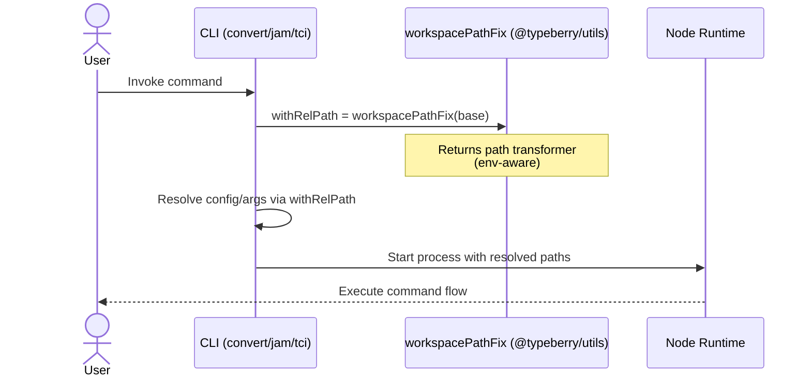

# Fix NPM build

## Pull Request by @tomusdrw

Fixes #651 


## Comment by @coderabbitai[bot]

<!-- This is an auto-generated comment: summarize by coderabbit.ai -->
<!-- This is an auto-generated comment: skip review by coderabbit.ai -->

> [!IMPORTANT]
> ## Review skipped
> 
> Auto incremental reviews are disabled on this repository.
> 
> Please check the settings in the CodeRabbit UI or the `.coderabbit.yaml` file in this repository. To trigger a single review, invoke the `@coderabbitai review` command.
> 
> You can disable this status message by setting the `reviews.review_status` to `false` in the CodeRabbit configuration file.

<!-- end of auto-generated comment: skip review by coderabbit.ai -->

<!-- walkthrough_start -->

<details>
<summary>📝 Walkthrough</summary>

<!-- This is an auto-generated comment: release notes by coderabbit.ai -->

## Summary by CodeRabbit

- New Features
  - JAM CLI is now exposed as the “jam” command and marked executable for easier use after installation.

- Bug Fixes
  - More reliable path resolution across environments for CLI tools, reducing issues when running commands from different locations.

- Refactor
  - Centralized path handling across CLI entries to improve consistency and maintainability.

- Chores
  - Added a shared utilities dependency to support unified path handling.
  - Adjusted build scripts to generate the correct CLI bin mapping and executable output.

<!-- end of auto-generated comment: release notes by coderabbit.ai -->
## Walkthrough
Introduces a new workspace-aware path utility and updates multiple CLI/test entry points to use it for path resolution. Adds @typeberry/utils as a dependency where needed. Adjusts build script to make the distributed CLI executable and changes the generated bin field format in the published package.

## Changes
| Cohort / File(s) | Summary |
| --- | --- |
| **Workspace path utility**<br>`packages/core/utils/dev.ts`, `packages/core/utils/index.ts` | Adds and re-exports workspacePathFix, a NODE_ENV-aware path transformer (identity in development; prefixes non-absolute paths otherwise). |
| **CLI entries use workspacePathFix**<br>`bin/convert/index.ts`, `bin/jam/index.ts`, `bin/tci/index.ts` | Replace manual relative-path logic with workspacePathFix based on `${import.meta.dirname}/../..`; import @typeberry/utils. |
| **RPC test setup uses workspacePathFix**<br>`bin/rpc/test/e2e-setup.ts` | Replaces custom withRelPath with workspacePathFix applied to `${import.meta.dirname}/../../..`; imports the utility. |
| **Dependencies updated**<br>`bin/rpc/package.json`, `bin/tci/package.json` | Adds "@typeberry/utils" to dependencies. |
| **Build packaging**<br>`tools/build-for-npm.sh` | Inserts shebang and executable permissions for dist index; changes generated package.json bin from string to object mapping { "jam": "./index.js" }. |

## Sequence Diagram(s)


## Estimated code review effort
🎯 3 (Moderate) | ⏱️ ~25 minutes

## Possibly related PRs
- FluffyLabs/typeberry#442: Modifies @typeberry/utils exports/consumers, overlapping with the new workspacePathFix and its adoption.
- FluffyLabs/typeberry#630: Alters build/packaging scripts for the jam CLI, similar scope to the bin field and shebang changes here.
- FluffyLabs/typeberry#423: Touches bin/rpc/test setup and related path handling, intersecting with the switch to workspacePathFix.

## Suggested reviewers
- mateuszsikora
- skoszuta

## Poem
> I hopped through paths both near and wide,  
> A clever fix became my guide.  
> In dev, I stroll—no prefix fright;  
> In prod, I tack them on just right.  
> Now jam runs true with tidy tricks—  
> a bunny’s joy in workspaceFix. 🐇✨

</details>

<!-- walkthrough_end -->

<!-- pre_merge_checks_walkthrough_start -->

## Pre-merge checks and finishing touches
<details>
<summary>❌ Failed checks (1 inconclusive)</summary>

|     Check name    | Status         | Explanation                                                                                                                                                                                                                                                                                                                                                                                               | Resolution                                                                                                                                                                                                                                                                                                      |
| :---------------: | :------------- | :-------------------------------------------------------------------------------------------------------------------------------------------------------------------------------------------------------------------------------------------------------------------------------------------------------------------------------------------------------------------------------------------------------- | :-------------------------------------------------------------------------------------------------------------------------------------------------------------------------------------------------------------------------------------------------------------------------------------------------------------- |
| Description Check | ❓ Inconclusive | The pull request has no author-provided description; the provided raw_summary shows multiple related changes (adding workspacePathFix utility and imports, new dependencies in package.json, and build-script adjustments) but without a description the reviewer cannot confirm the author's stated intent or rationale, so the description is insufficient to determine pass/fail for intent alignment. | Please add a concise PR description summarizing the objective (how these changes fix the NPM build), the key files/behavior affected (e.g., new workspacePathFix export, package.json dependency additions, build script changes), and any testing or migration steps so reviewers can verify intent and scope. |

</details>
<details>
<summary>✅ Passed checks (2 passed)</summary>

|     Check name     | Status   | Explanation                                                                                                                                                                                                                    |
| :----------------: | :------- | :----------------------------------------------------------------------------------------------------------------------------------------------------------------------------------------------------------------------------- |
|     Title Check    | ✅ Passed | The title "Fix NPM build" is concise and directly reflects the primary intent of the changeset, which updates packaging/build scripts, package.json entries, and workspace path resolution to address NPM distribution issues. |
| Docstring Coverage | ✅ Passed | No functions found in the changes. Docstring coverage check skipped.                                                                                                                                                           |

</details>

<!-- pre_merge_checks_walkthrough_end -->

<!-- tips_start -->

---


<sub>Comment `@coderabbitai help` to get the list of available commands and usage tips.</sub>

<!-- tips_end -->

<!-- internal state start -->


<!-- DwQgtGAEAqAWCWBnSTIEMB26CuAXA9mAOYCmGJATmriQCaQDG+Ats2bgFyQAOFk+AIwBWJBrngA3EsgEBPRvlqU0AgfFwA6NPEgQAfACgjoCEejqANiS4AxeAA9IAOQAKAWUgDs8C7QNPsZgFKLgA2AFYAFgMAVQAlABkuWFxcbkQOAHpMonVYbAENJmZMmwtsADMK2QSVREzcWW4SYIoKWUzubAsLTIjomMQQyAJmbERaCgB3AwBlfGwKBhJPKgwGWC5cWjAMbmYwLx8/aDQKUlxVzA2uZm0MOdxqca58Zoe4kgl4EinKDMgdxo4wAXoh4ABrfBUAy1YIWAEGADCFBI1Do6E4kAATAAGbHhMC4gCcYGxAGZoCSOOEAIw0gAcAC0jPpjOAoGR6PgKjgCMQyMoaPRimwMFjePxhKJxFIZPImEoqKp1FodGyTFA4KhUJg+YRSOQqMKFKx2FwqFNIIhAnd2p4FYplCrNNpdGBDOzTAY1BhMkwMFIKLhMvAMEp7BpcBkDAAieMGADEicgAEEAJICo3o+g21hneQ8xiwTCkRCsyCfbgWNDLeh3DDYNAWSComuylbcaiwBTrdEYajwfBYKZ5dCMZstgiQKbQiGILvLFzduz2AA0kHGYaII1gK1o8AoA7YmQ0GlPGh43fQyDDXU0BigqdoSno8GY3GhlyLs4o88XJDLrgsCrpAFQUCwkAAAKNM0rTtJkeA+IgGiPjOeSfBYQE9qgGD4FaSgVGGGJoMgv7/rWgErg4AAUAAGAAkADe76fsGGhsE8GgHkeaBsAAvheF50QAlBuaBVDK25XsBrbSPg5TiMOYHQleFBDKm5zIJg9b3OhwELJcGyltJJD2DQvEtsEJbfKp4JEAOuCLNIqFGGhTjDiQRgAKKIOIQIYoqKyot8vyQCQVRflwbh0PAgRxgmj7er6mRCHxobhmZUYxvGsZJimGZZkKGJ5naha8sZGBlhW6bihBtDYMs2mQOQVqsV+/C8uRC6UdhoE6XJ1aUcgwGdiFQ7jOgOywPgDBye2kgkGAXayaiiAKUhykWPguRzaOsloBOPQjPgM5zj1S7UY406CE8Yb6bAmHYZe2rIJVZaQDNVptoOUgybA2monJ60WFI9BTHuWBdup0lnEQgTsNp4bWk8wbSaNLVOhuciQEoVhEIOVUneOSEWOo8hhn5aLcryYZkxg0krbAy2okR9jSdtu0vXu/BBpOva4BBLYVNt30kHclO7isiB8SQ2N4FL/3AxtSlYNZaC2XwuH4Yw7BUGTIIYt8h3dQBfUOK5RjJmmFgWYOw4jadGNKAwNbGkOGDIEWZlsSaqldAIZNzew6g/OW7mne90jE/ZjnOV7vI+1+GL+wUQfheKocuT5fnvjmChKHJoVWhFFRRZAMUHvFuWsslYaZBQ3AMJ0tYQmgpAaEI60YBwCV5dbhWGsVua2gWnXFqW0gVs+r7jq1rbYJnbC4yQ7xKOs8ixjBTQtJQCGk4gsbExjKWN83i5tx3XfKUoa9kAwYeQDRaDcM0ZzadtVXgoXZlIOIRPbzgnvDoAAqK8DBL7RwGvgUafBb5cnvmHES3MdR1UUI1KBWA0AvlDsOZsPA07wDmswdBVhdzUAnGrYK8lQYkUuEcXwDdF7+TlugSSYhpLwMyhvSARAqDcB7F4S4eFLjNgshzWa+DOZEP4HwAMgsFJgVFq5Dy5Ac7+XzkFIuPwS6RWDNFWK1dEoQDAEYU+TcGjSBDCQbES0hhOW4NlXuNcB6ZiHsaEqo97RFijuHJ8L5bwfg6j+c6ZsrpgQgswaCsFd5tA6AfVCUAqw1iaorBg4xRgPSeteCoi8OHKWAhQ1ETkjwkXmr9Ts14/IUGkvtHsh0GD82nKbXqV0NxbiJhjdJbR2CAlIfuQ8x4VikU8KRawETIKHVyesVWckSkMyJmeISzEmb8WJlMhwdBlrXjWgpIM6BX5kwxNOZi7V2KcTQNxQZstBJLLuYktM7Doz8AwBYeQTNlaKQ9ipPgGM6nZNkhIZs2ASAAG5FZrW/LyDG9jsDcCfgGIiO5trYNhsjGgflIBSDEKpM50YRJyQlp7Tc6wSxVToPLYROs2yP2Ui0y6wFQJlzgSQCyzAwzox5hBGB/1Lb5RtnbVWjtFYuzdvbYl3t7C+xTnwAO6cQ7iCnhHcgl4PLhSlcnWgnRCFzVFWccVZFKDDJfBSwl+AwYblUiQg8RE6CuV8hok0WjxphVLuXSucVmB91rqYn09dcAPwyhGJx3rXFFQ8SPfM3iKpkuqmhGeGI8Xj3pVRRlDgJlRMAbE/e4gEToGRqiIadZFa8C+BNZAJYKA7CCvQH6HYlYBmqY1AgfA6njkacdZpoTWlpvsDRU5QTzmstRbxASQkzzIJgAgN6sbo5fUVv8kgWFrxAvKCsVAxR7ympId8Im4FJko0HHNOti0lbVPRqdQ6tBZDHiIZOeQuzaG0A3CmsAaAphnEqcBVyWoeaLuXbJaZ+SobjQWIgN5jBUT50OueomOMAyNJoI5aS9zMgPUVrkKQWBV0gvBXhNqlxxjRxTeba6p08IUDuAbFYGMmYbjJhCJd8gJIVCkkTD5j7NpYHuhjAAUqmDweEf51VkHygetshQe2Fc7UQYqhXjyTsGGVBDA4yIVWHCsaq5VEMyIpk0sdnhrRnEaie5LaD2tzgFEUTptGur0ViD1Ri8pJV9SlAN8AW4QPbiQTu3dnEJjDe4/OpUx4+NneHOAAyqhTVoM1eeXD14MHkHrTeWb4LxNzYfLgsYQFH2nDJu+6xH5DGA+PNzgaL7ed88OVVp0YF7j4PTKBQNrXwFtbQcFwFUEKIaqkvU2CDyq3wWZCyA4WyVdINaJ2PNeD4BEGIdCx1H1/QGl4cMZC20YwPuAyB6BP5EG/isX+uciYJcQdnNy4nBVSePjzPV7sHYKY1Up7ksqdUZ3EIqvxzhI7heJnpug2rVPB0zo0a08AHKGYuw6vOTqbMut0cyrECR8Lepc0YCb0h/TQhIIhTLmQlASBDS4gqbjBQRutF48qpm40zzi2FUm5NyGXFm98JQzVX3vs/eU+tHGaFBkvLVHrGDkBkG+BBDAYpcBvo/UDaRc1pzYKEBkpWnHZkJekspJwAB5AAIt5AA+t5JwAA1XuaFaorykNtfY5ozp/guqmkC6aIcUejn87tDL6kFtZYsYlep4Dr0++868gtMCIGZWwPgNF4UAF49A8GQRbrAeEMBgEJ0ut4UuuAkfCU8RjHPPdO/zbW33R5mph89pHygzOeCs02cgVPb6BAgzwF+gG6GPcO7CbJGiufZIAGpICxkyEfIf3AxIzgQGQuoKt2/IBon5M4/8dxtpH7GAl3Pil+4xHk2d5m0KfGwaLwMh5hxS6xWceAKgrDIBlqxiDxsM4SEgLHkYO8iyzaasgWPv/h+L0ImIloCPgAH5IAmI1kuAv9pAUIxcHlapXZsB2cV5EAGAaluB61RREYV47p6YdxxhvMn4fMiANANw9gokU1rRlgBwal8BEBN9kYRF3cSwWdQ81hwNxUUAvZXlmNDkfg3wsAM8bcL8GFYtXIXB3tUwXB0wUA0Fes6AuA9NexMV+9ndIw3J+VUwJMHtiV8s7tZN9V5NJVpVXsVN5VQcNN3JXVnsTQFVZAuA6JVDVw6JZDIA6JMd6gmBUQ8dkICcvhsoXDIADBIBdBIBvIbDAoHYnhxQHClDG1LgnD0038zwNBAjgjQjoAd5PASAbIhxo8DMSlpARJe4QiQioBLchCs87dHCi9SMXDdQwI8lZlClLht9y9xxK8I9oQo8HCaICV48n5uAuBYMiB+iE9uA6J0iyjIBLcm9KjbcYi3DEj7B6jmogNmi0AIRpIaju8e1NgUYakqoXCBo2iFkdxDpOjq8KBejVDhjBZtwxjBi7jDjRjX8E8RiXCIYTMMZLjuia9TjkB3CXDS02YMQ20diKIvdMgXDmVMY09Z9FJ58S8SUo56BYSES29/oUJ1FYdIjC4Edwp7MDEq4vUa50cDAPDsdvCD4g0spox/N+5Sdw1gsqdx5fEjA6c54wpUQwA9NYibDIAwF90olYxzxCdfNYx6ioZW5vNPCccfCERaTIxowNwfYdJOVOxJDpDiYeSlD+Y9NkBhSrdfNasad3dTpjsV91VfYvZGsdoiFwVhwINaN3sbQKAKhKJZC0C0Qhh5QvTygDxOl9CX9rVugfMNCoBwjfYYsFC3ClChTIlh8xT/Cu5JTXD3CZSywqTccaSwxg1oxJiDAYcrMC5qFi5CSkdiTPU0cTEjACAFJ6hRCwBmVdh9gNBEBNhQ0mSgt9NWSwtJ5vs3BNjmCBlz0hFE1MpIwu51VRA8Ab8VgcZS015YZrQ9wBBSxkS4VaBCYdxmhKMkBwQHYHlPgpgakMUMNyd85MdqtuMsBnY/4VJfAQh0ioAkQ/sT57oUsM1xwRilYaJRSlSJSCVFcsBBB5sEixxDohlrN8xkZ/y0pmBYxstzw8yspUyk9piABpEgVeZAIlG8JMwC1M5E0tIYCgOUfgWBQEYdbcp4Sla0faDYaOI0w6S0cKDYU6QOWaCEdZT6I1dPWaA5WbWsHsGibybXGwAlWEvjWYbXJwAWdgVCaYtwMMVSSPagFfTIJtMQRYfBJXDJKXYVa86+LAHs75GiRtP+XpTbHmX0LgJiYfBCpCwi1Cqcw+SANZKODCoIq2AqbQg1W7fcAwnQhOa0zVWRMwtTCwpVKAZcLzK+buXhS81WKA97e7TgosD8rAW1XwM0vwaYgAIQihx2y19GcoAtcolJfMeQslKrDGcoctjCcuQqIvcv4mqrsCsC4APD8k80gRvLr3QWLRxnrMVKbJbPIPbNgDQnCNnKeEDlx20xB0FiaHwDDEuGkruz/hqSEQ9hKNCMqunOCGKGjjMjmvnKfg7JaA3MpkoBNAoQIHhQGiIjIT3PZUQEPKwHsX+3sHOoWsnU6vGR6pDAQtaqfgaheM8G8FyugI+pEhxJLOdTLTs0rIrkMVJOMQ9C9E5GRiLDQDwANGSsiLNEWLYpC3tHgydGVDUFdHVCxs1FNHZVwAN0D0QANwRzoANyX2DHdE9AZtoHJA9LQHJEiAYAYAqFCFpDQBIHJG3OxBUGJEaVCAYHCGFtpApFxFxBfAqAAHYdbsRQhebsbGb1AWbYt2bka/haADcuQjaGbS0Dco9SADcmKIE2bubLg2QDAmJ0jYwkBtcgwakTUMBnKPSEQ5ZfakAXA4gCrtoIE6AkQWApcXA6DhRQ7mwhg1xfaOyFhfBY7uLo707w6s6QjYwDxaA4hF5ddZpZh7iv43zRAIRnLBYQUS7h9y7K6MBzBcArAG6IFm6KBW7faO6q7pA0D4AMCPY+6m6thB6I7S76ZGNaB0wPqQVEBa6KByrYw27Ywaw/Jp7PgbRbYstIAABtKY8Ai+0u12iEJwWWcq7ushae7eq+4fJfJyE+lu+e0o0un2GsZDYcB+nmT7MhAAHVjFAlcA8FEPAa4N7AfiGGRJ4hlAg1ZisDEBGhmxqTKlkKQyhTSXC1ZRfQQA2E3G4Foujgm23EyFEKoPQJVJ2yqxMo+xqWkHEmRkoL51b2aMvRfDWmQCgdxm2vgF2uUgPLXo0Bfp/tLrVw9nKrVSjjkgAEdvBUQOtFYQH103orAzhkSX5ZteBr8aANwDJsAiB6kcEiZWLV46D1BoRZAwAFxRA2sZEQT00GMVhwHRCOBYHUA3ghthZVJLKqYeE21RR1BMho7ewsMhVJG26f7YxrUSByrZczipHpHYxUREUIdnIi7M7X7YxoQIcwxmxp6762ByrNG8of7+J4nL7pHh8b7ynknstq6GBfzE6+ZSB0mEn37xgB6h6GnYw/7MBxV5HTp1ibsy4ADXCulwtLw2nfymAumVgb7rQtjX47UenSjEmnQUmzg0m6nS6incgxsyn77staBZoRjD4L7amL6fahmmmLnh9dcx76Hvln6jm36ngP68nv6EmRmAGQ7stIsCElsSAVGrFPoRk8I+QZoKAWZzVA8MR2dx7J7hxOssHkXZ5LQubWSc6pg8LuhxBqxqF2xAo/tn5LHV9ajwlGcwcBo8VEAyCwozsito57pjLu52H6AmzUD6Gpplc/JDKCUhEHpDJxw0WPmCkuVLaa9GkMARFewiJKNFZ8aDIKAAByO/X5icvBiKnQ5sVhdaEVd5ie2ZVBG0KoIhH4cUYmJQNlYiK8D6zID0nwH5XB3pZsV3KXOJgp2RwB7LFwHRxBgbdtYcBBlYKJ6Vi175cm+AEEDUqUcC09GiedUaRB3xMCdNDGQR0QyfDGRjeQF6rHdWTWNhVjMQDEGiYg0glqMKZYsK4MDcblm+VeBBHhAbXBT2eWY4Ohi1s0+g3l/NeQDFK0q1CHHQlGXCqbWzP4dSShLFSgNrCmcUb15GVAt4HzbZ0upJ/Zo8bcXd4fLJ4cJFXJ2ewZjJk5kpiwc5ipy581jFkOu59IgAXR3r3twGjsfpaeH0gfcChuOHSd3tIm/biDeYFbjaDeHzynaoMHttREdsoGdpvrZttv0CAA= -->

<!-- internal state end -->


## Comment by @github-actions[bot]


<details>
<summary>View all</summary>

| File | Benchmark | Ops |  |
|------|-----------|-----|--|
| [bytes/hex-from.ts[0]](../blob/bf04b53fa5052e6df444f64a6f72db275de800ee//_work/typeberry-runner-5/typeberry/typeberry/benchmarks/bytes/hex-from.ts) | parse hex using `Number` with NaN checking | 139819.64 ±0.34% | 84.25% slower |
| [bytes/hex-from.ts[1]](../blob/bf04b53fa5052e6df444f64a6f72db275de800ee//_work/typeberry-runner-5/typeberry/typeberry/benchmarks/bytes/hex-from.ts) | parse hex from char codes | 887543.86 ±0.51% | fastest ✅ |
| [bytes/hex-from.ts[2]](../blob/bf04b53fa5052e6df444f64a6f72db275de800ee//_work/typeberry-runner-5/typeberry/typeberry/benchmarks/bytes/hex-from.ts) | parse hex from string nibbles | 559979.52 ±0.41% | 36.91% slower |
| [math/switch.ts[0]](../blob/bf04b53fa5052e6df444f64a6f72db275de800ee//_work/typeberry-runner-5/typeberry/typeberry/benchmarks/math/switch.ts) | switch | 254345856.73 ±7.48% | 1.93% slower |
| [math/switch.ts[1]](../blob/bf04b53fa5052e6df444f64a6f72db275de800ee//_work/typeberry-runner-5/typeberry/typeberry/benchmarks/math/switch.ts) | if | 259347775.82 ±6.24% | fastest ✅ |
| [math/count-bits-u64.ts[0]](../blob/bf04b53fa5052e6df444f64a6f72db275de800ee//_work/typeberry-runner-5/typeberry/typeberry/benchmarks/math/count-bits-u64.ts) | standard method | 1499231.58 ±0.61% | 86.58% slower |
| [math/count-bits-u64.ts[1]](../blob/bf04b53fa5052e6df444f64a6f72db275de800ee//_work/typeberry-runner-5/typeberry/typeberry/benchmarks/math/count-bits-u64.ts) | magic | 11167716.74 ±0.77% | fastest ✅ |
| [hash/index.ts[0]](../blob/bf04b53fa5052e6df444f64a6f72db275de800ee//_work/typeberry-runner-5/typeberry/typeberry/benchmarks/hash/index.ts) | hash with numeric representation | 191.75 ±0.34% | 24.76% slower |
| [hash/index.ts[1]](../blob/bf04b53fa5052e6df444f64a6f72db275de800ee//_work/typeberry-runner-5/typeberry/typeberry/benchmarks/hash/index.ts) | hash with string representation | 119.05 ±0.8% | 53.29% slower |
| [hash/index.ts[2]](../blob/bf04b53fa5052e6df444f64a6f72db275de800ee//_work/typeberry-runner-5/typeberry/typeberry/benchmarks/hash/index.ts) | hash with symbol representation | 179.97 ±0.49% | 29.38% slower |
| [hash/index.ts[3]](../blob/bf04b53fa5052e6df444f64a6f72db275de800ee//_work/typeberry-runner-5/typeberry/typeberry/benchmarks/hash/index.ts) | hash with uint8 representation | 161.64 ±0.44% | 36.57% slower |
| [hash/index.ts[4]](../blob/bf04b53fa5052e6df444f64a6f72db275de800ee//_work/typeberry-runner-5/typeberry/typeberry/benchmarks/hash/index.ts) | hash with packed representation | 254.85 ±0.67% | fastest ✅ |
| [hash/index.ts[5]](../blob/bf04b53fa5052e6df444f64a6f72db275de800ee//_work/typeberry-runner-5/typeberry/typeberry/benchmarks/hash/index.ts) | hash with bigint representation | 189.42 ±0.83% | 25.67% slower |
| [hash/index.ts[6]](../blob/bf04b53fa5052e6df444f64a6f72db275de800ee//_work/typeberry-runner-5/typeberry/typeberry/benchmarks/hash/index.ts) | hash with uint32 representation | 196.25 ±0.45% | 22.99% slower |
| [bytes/hex-to.ts[0]](../blob/bf04b53fa5052e6df444f64a6f72db275de800ee//_work/typeberry-runner-5/typeberry/typeberry/benchmarks/bytes/hex-to.ts) | number toString + padding | 311322.93 ±0.52% | fastest ✅ |
| [bytes/hex-to.ts[1]](../blob/bf04b53fa5052e6df444f64a6f72db275de800ee//_work/typeberry-runner-5/typeberry/typeberry/benchmarks/bytes/hex-to.ts) | manual | 15913.41 ±0.43% | 94.89% slower |
| [codec/bigint.compare.ts[0]](../blob/bf04b53fa5052e6df444f64a6f72db275de800ee//_work/typeberry-runner-5/typeberry/typeberry/benchmarks/codec/bigint.compare.ts) | compare custom | 248213651.95 ±6.5% | fastest ✅ |
| [codec/bigint.compare.ts[1]](../blob/bf04b53fa5052e6df444f64a6f72db275de800ee//_work/typeberry-runner-5/typeberry/typeberry/benchmarks/codec/bigint.compare.ts) | compare bigint | 238819690.82 ±6.55% | 3.78% slower |
| [codec/bigint.decode.ts[0]](../blob/bf04b53fa5052e6df444f64a6f72db275de800ee//_work/typeberry-runner-5/typeberry/typeberry/benchmarks/codec/bigint.decode.ts) | decode custom | 174333248.16 ±1.85% | fastest ✅ |
| [codec/bigint.decode.ts[1]](../blob/bf04b53fa5052e6df444f64a6f72db275de800ee//_work/typeberry-runner-5/typeberry/typeberry/benchmarks/codec/bigint.decode.ts) | decode bigint | 100890847.6 ±1.97% | 42.13% slower |
| [collections/map-set.ts[0]](../blob/bf04b53fa5052e6df444f64a6f72db275de800ee//_work/typeberry-runner-5/typeberry/typeberry/benchmarks/collections/map-set.ts) | 2 gets + conditional set | 117146.24 ±0.31% | fastest ✅ |
| [collections/map-set.ts[1]](../blob/bf04b53fa5052e6df444f64a6f72db275de800ee//_work/typeberry-runner-5/typeberry/typeberry/benchmarks/collections/map-set.ts) | 1 get 1 set | 59378.52 ±0.22% | 49.31% slower |
| [math/add_one_overflow.ts[0]](../blob/bf04b53fa5052e6df444f64a6f72db275de800ee//_work/typeberry-runner-5/typeberry/typeberry/benchmarks/math/add_one_overflow.ts) | add and take modulus | 248959281.34 ±6.6% | 6.25% slower |
| [math/add_one_overflow.ts[1]](../blob/bf04b53fa5052e6df444f64a6f72db275de800ee//_work/typeberry-runner-5/typeberry/typeberry/benchmarks/math/add_one_overflow.ts) | condition before calculation | 265569854.28 ±3.83% | fastest ✅ |
| [math/count-bits-u32.ts[0]](../blob/bf04b53fa5052e6df444f64a6f72db275de800ee//_work/typeberry-runner-5/typeberry/typeberry/benchmarks/math/count-bits-u32.ts) | standard method | 99839781.86 ±2.02% | 56.42% slower |
| [math/count-bits-u32.ts[1]](../blob/bf04b53fa5052e6df444f64a6f72db275de800ee//_work/typeberry-runner-5/typeberry/typeberry/benchmarks/math/count-bits-u32.ts) | magic | 229102554.93 ±6.65% | fastest ✅ |
| [math/mul_overflow.ts[0]](../blob/bf04b53fa5052e6df444f64a6f72db275de800ee//_work/typeberry-runner-5/typeberry/typeberry/benchmarks/math/mul_overflow.ts) | multiply and bring back to u32 | 246881283.44 ±5.08% | fastest ✅ |
| [math/mul_overflow.ts[1]](../blob/bf04b53fa5052e6df444f64a6f72db275de800ee//_work/typeberry-runner-5/typeberry/typeberry/benchmarks/math/mul_overflow.ts) | multiply and take modulus | 238629532.57 ±6.14% | 3.34% slower |
| [codec/decoding.ts[0]](../blob/bf04b53fa5052e6df444f64a6f72db275de800ee//_work/typeberry-runner-5/typeberry/typeberry/benchmarks/codec/decoding.ts) | manual decode | 20611518.54 ±1.89% | 87.34% slower |
| [codec/decoding.ts[1]](../blob/bf04b53fa5052e6df444f64a6f72db275de800ee//_work/typeberry-runner-5/typeberry/typeberry/benchmarks/codec/decoding.ts) | int32array decode | 162757361.42 ±3.02% | fastest ✅ |
| [codec/decoding.ts[2]](../blob/bf04b53fa5052e6df444f64a6f72db275de800ee//_work/typeberry-runner-5/typeberry/typeberry/benchmarks/codec/decoding.ts) | dataview decode | 155143928.49 ±3.07% | 4.68% slower |
| [codec/encoding.ts[0]](../blob/bf04b53fa5052e6df444f64a6f72db275de800ee//_work/typeberry-runner-5/typeberry/typeberry/benchmarks/codec/encoding.ts) | manual encode | 3096139.15 ±1.33% | 17.61% slower |
| [codec/encoding.ts[1]](../blob/bf04b53fa5052e6df444f64a6f72db275de800ee//_work/typeberry-runner-5/typeberry/typeberry/benchmarks/codec/encoding.ts) | int32array encode | 3758043.11 ±1.59% | fastest ✅ |
| [codec/encoding.ts[2]](../blob/bf04b53fa5052e6df444f64a6f72db275de800ee//_work/typeberry-runner-5/typeberry/typeberry/benchmarks/codec/encoding.ts) | dataview encode | 3720072.91 ±1.8% | 1.01% slower |
| [logger/index.ts[0]](../blob/bf04b53fa5052e6df444f64a6f72db275de800ee//_work/typeberry-runner-5/typeberry/typeberry/benchmarks/logger/index.ts) | console.log with string concat | 7119915.99 ±35.6% | fastest ✅ |
| [logger/index.ts[1]](../blob/bf04b53fa5052e6df444f64a6f72db275de800ee//_work/typeberry-runner-5/typeberry/typeberry/benchmarks/logger/index.ts) | console.log with args | 987645.82 ±91.71% | 86.13% slower |
| [codec/view_vs_object.ts[0]](../blob/bf04b53fa5052e6df444f64a6f72db275de800ee//_work/typeberry-runner-5/typeberry/typeberry/benchmarks/codec/view_vs_object.ts) | Get the first field from Decoded | 400193.31 ±3.23% | 2.45% slower |
| [codec/view_vs_object.ts[1]](../blob/bf04b53fa5052e6df444f64a6f72db275de800ee//_work/typeberry-runner-5/typeberry/typeberry/benchmarks/codec/view_vs_object.ts) | Get the first field from View | 85475.64 ±1.88% | 79.17% slower |
| [codec/view_vs_object.ts[2]](../blob/bf04b53fa5052e6df444f64a6f72db275de800ee//_work/typeberry-runner-5/typeberry/typeberry/benchmarks/codec/view_vs_object.ts) | Get the first field as view from View | 86808.89 ±1.57% | 78.84% slower |
| [codec/view_vs_object.ts[3]](../blob/bf04b53fa5052e6df444f64a6f72db275de800ee//_work/typeberry-runner-5/typeberry/typeberry/benchmarks/codec/view_vs_object.ts) | Get two fields from Decoded | 409023.71 ±1.22% | 0.3% slower |
| [codec/view_vs_object.ts[4]](../blob/bf04b53fa5052e6df444f64a6f72db275de800ee//_work/typeberry-runner-5/typeberry/typeberry/benchmarks/codec/view_vs_object.ts) | Get two fields from View | 72308.21 ±1.54% | 82.38% slower |
| [codec/view_vs_object.ts[5]](../blob/bf04b53fa5052e6df444f64a6f72db275de800ee//_work/typeberry-runner-5/typeberry/typeberry/benchmarks/codec/view_vs_object.ts) | Get two fields from materialized from View | 141982.65 ±1.45% | 65.39% slower |
| [codec/view_vs_object.ts[6]](../blob/bf04b53fa5052e6df444f64a6f72db275de800ee//_work/typeberry-runner-5/typeberry/typeberry/benchmarks/codec/view_vs_object.ts) | Get two fields as views from View | 69288.77 ±1.87% | 83.11% slower |
| [codec/view_vs_object.ts[7]](../blob/bf04b53fa5052e6df444f64a6f72db275de800ee//_work/typeberry-runner-5/typeberry/typeberry/benchmarks/codec/view_vs_object.ts) | Get only third field from Decoded | 410259.68 ±1.78% | fastest ✅ |
| [codec/view_vs_object.ts[8]](../blob/bf04b53fa5052e6df444f64a6f72db275de800ee//_work/typeberry-runner-5/typeberry/typeberry/benchmarks/codec/view_vs_object.ts) | Get only third field from View | 82807.83 ±1.56% | 79.82% slower |
| [codec/view_vs_object.ts[9]](../blob/bf04b53fa5052e6df444f64a6f72db275de800ee//_work/typeberry-runner-5/typeberry/typeberry/benchmarks/codec/view_vs_object.ts) | Get only third field as view from View | 82935.73 ±2.77% | 79.78% slower |
| [codec/view_vs_collection.ts[0]](../blob/bf04b53fa5052e6df444f64a6f72db275de800ee//_work/typeberry-runner-5/typeberry/typeberry/benchmarks/codec/view_vs_collection.ts) | Get first element from Decoded | 22097.15 ±1.91% | 59.49% slower |
| [codec/view_vs_collection.ts[1]](../blob/bf04b53fa5052e6df444f64a6f72db275de800ee//_work/typeberry-runner-5/typeberry/typeberry/benchmarks/codec/view_vs_collection.ts) | Get first element from View | 54542.77 ±3.68% | fastest ✅ |
| [codec/view_vs_collection.ts[2]](../blob/bf04b53fa5052e6df444f64a6f72db275de800ee//_work/typeberry-runner-5/typeberry/typeberry/benchmarks/codec/view_vs_collection.ts) | Get 50th element from Decoded | 24784.36 ±1.7% | 54.56% slower |
| [codec/view_vs_collection.ts[3]](../blob/bf04b53fa5052e6df444f64a6f72db275de800ee//_work/typeberry-runner-5/typeberry/typeberry/benchmarks/codec/view_vs_collection.ts) | Get 50th element from View | 30063.23 ±3% | 44.88% slower |
| [codec/view_vs_collection.ts[4]](../blob/bf04b53fa5052e6df444f64a6f72db275de800ee//_work/typeberry-runner-5/typeberry/typeberry/benchmarks/codec/view_vs_collection.ts) | Get last element from Decoded | 24620.85 ±3.39% | 54.86% slower |
| [codec/view_vs_collection.ts[5]](../blob/bf04b53fa5052e6df444f64a6f72db275de800ee//_work/typeberry-runner-5/typeberry/typeberry/benchmarks/codec/view_vs_collection.ts) | Get last element from View | 20556.56 ±2.96% | 62.31% slower |
| [bytes/compare.ts[0]](../blob/bf04b53fa5052e6df444f64a6f72db275de800ee//_work/typeberry-runner-5/typeberry/typeberry/benchmarks/bytes/compare.ts) | Comparing Uint32 bytes | 18294.03 ±3.25% | 4.79% slower |
| [bytes/compare.ts[1]](../blob/bf04b53fa5052e6df444f64a6f72db275de800ee//_work/typeberry-runner-5/typeberry/typeberry/benchmarks/bytes/compare.ts) | Comparing raw bytes | 19213.95 ±3.08% | fastest ✅ |
| [hash/blake2b.ts[0]](../blob/bf04b53fa5052e6df444f64a6f72db275de800ee//_work/typeberry-runner-5/typeberry/typeberry/benchmarks/hash/blake2b.ts) | hasher with simple allocator | 0.0452 ±0.7% | 0.22% slower |
| [hash/blake2b.ts[1]](../blob/bf04b53fa5052e6df444f64a6f72db275de800ee//_work/typeberry-runner-5/typeberry/typeberry/benchmarks/hash/blake2b.ts) | hasher with page allocator | 0.0453 ±1.82% | fastest ✅ |
| [collections/map_vs_sorted.ts[0]](../blob/bf04b53fa5052e6df444f64a6f72db275de800ee//_work/typeberry-runner-5/typeberry/typeberry/benchmarks/collections/map_vs_sorted.ts) | Map | 299248.03 ±0.43% | fastest ✅ |
| [collections/map_vs_sorted.ts[1]](../blob/bf04b53fa5052e6df444f64a6f72db275de800ee//_work/typeberry-runner-5/typeberry/typeberry/benchmarks/collections/map_vs_sorted.ts) | Map-array | 101998.38 ±0.37% | 65.92% slower |
| [collections/map_vs_sorted.ts[2]](../blob/bf04b53fa5052e6df444f64a6f72db275de800ee//_work/typeberry-runner-5/typeberry/typeberry/benchmarks/collections/map_vs_sorted.ts) | Array | 63399.33 ±3.21% | 78.81% slower |
| [collections/map_vs_sorted.ts[3]](../blob/bf04b53fa5052e6df444f64a6f72db275de800ee//_work/typeberry-runner-5/typeberry/typeberry/benchmarks/collections/map_vs_sorted.ts) | SortedArray | 196614.1 ±0.45% | 34.3% slower |
| [crypto/ed25519.ts[0]](../blob/bf04b53fa5052e6df444f64a6f72db275de800ee//_work/typeberry-runner-5/typeberry/typeberry/benchmarks/crypto/ed25519.ts) | native crypto | 8.09 ±0.66% | 72.83% slower |
| [crypto/ed25519.ts[1]](../blob/bf04b53fa5052e6df444f64a6f72db275de800ee//_work/typeberry-runner-5/typeberry/typeberry/benchmarks/crypto/ed25519.ts) | wasm lib | 10.73 ±0.44% | 63.97% slower |
| [crypto/ed25519.ts[2]](../blob/bf04b53fa5052e6df444f64a6f72db275de800ee//_work/typeberry-runner-5/typeberry/typeberry/benchmarks/crypto/ed25519.ts) | wasm lib batch | 29.78 ±0.74% | fastest ✅ |
</details>


### Benchmarks summary: 63/63 OK ✅

<!-- thollander/actions-comment-pull-request "benchmarks" -->


## Comment by @coderabbitai[bot]

_⚠️ Potential issue_

**Fix inverted env logic in workspacePathFix; also handle Windows absolute paths.**

Current logic applies path mangling outside development, contradicting the comment and likely breaking npm runtime. Prefer enabling translation only in workspace/dev, and identity in packaged builds.

Apply this diff to correct the behavior:

```diff
-export const workspacePathFix =
-  env.NODE_ENV !== "development"
-    ? (workspacePath: string) => (p: string) => {
-        if (p.startsWith("/")) {
-          return p;
-        }
-        return `${workspacePath}/${p}`;
-      }
-    : () => (p: string) => p;
+export const workspacePathFix =
+  isWorkspace
+    ? (workspacePath: string) => (p: string) => {
+        // absolute on POSIX or Windows drive-letter paths
+        if (p.startsWith("/") || /^[A-Za-z]:[\\/]/.test(p)) {
+          return p;
+        }
+        return `${workspacePath}/${p}`;
+      }
+    : () => (p: string) => p;
```

Add this helper near the `env` declaration to robustly detect workspace/dev runs:

```ts
// detect npm workspace runs (present for `npm start -w ...`)
const isWorkspace = "npm_config_workspace_root" in env;
```

Optionally, if you still want NODE_ENV as a fallback, you can OR it in:
`const isWorkspace = "npm_config_workspace_root" in env || env.NODE_ENV === "development";`

<details>
<summary>🤖 Prompt for AI Agents</summary>

```
In packages/core/utils/dev.ts around lines 20 to 28, the env logic is inverted
and the absolute-path check misses Windows paths; add a helper to detect
workspace/dev runs (e.g. const isWorkspace = "npm_config_workspace_root" in env
|| env.NODE_ENV === "development") and use it so path translation runs only in
workspace/dev and returns identity in packaged builds; update the path check to
treat POSIX absolute (startsWith("/")), Windows drive-letter roots (e.g.
/^[A-Za-z]:\\/), and UNC paths (startsWith("\\\\")) as absolute so they are
returned unchanged, otherwise join workspacePath and p.
```

</details>

<!-- fingerprinting:phantom:poseidon:chinchilla -->

<!-- This is an auto-generated comment by CodeRabbit -->
