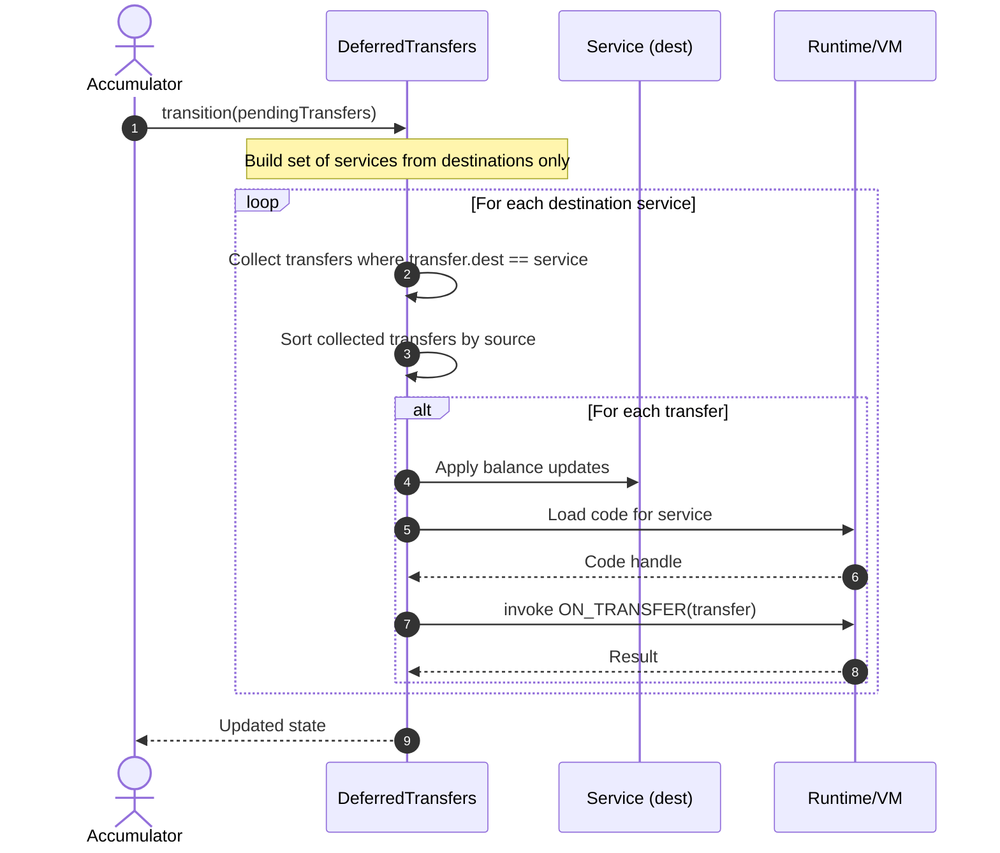

# fix order of transfers

## Pull Request by @mateuszsikora

I fixed the order of transfers. According to GP:

> Furthermore we build the deferred transfers statistics value X as the number of transfers and the total gas used in transfer processing for each destination service index.

https://graypaper.fluffylabs.dev/#/38c4e62/183304188704?v=0.7.0


## Comment by @coderabbitai[bot]

<!-- This is an auto-generated comment: summarize by coderabbit.ai -->
<!-- walkthrough_start -->

<details>
<summary>📝 Walkthrough</summary>

<!-- This is an auto-generated comment: release notes by coderabbit.ai -->

## Summary by CodeRabbit

* **Bug Fixes**
  * Deferred transfers now process in a deterministic order by sorting per destination, reducing inconsistent outcomes.
  * Iteration now considers only destination services from pending transfers, improving accuracy and performance.
* **Documentation**
  * Added a reference note clarifying the transfer processing logic.

<!-- end of auto-generated comment: release notes by coderabbit.ai -->
## Walkthrough
Updates the deferred transfers accumulation: the set of services is now derived solely from transfer destinations, and per-service transfers are processed in a deterministic order by sorting them by source before invocation. Adds a reference comment. No public API or signatures were changed.

## Changes
| Cohort / File(s) | Summary |
| --- | --- |
| **Deferred transfers accumulation logic**<br>`packages/jam/transition/accumulate/deferred-transfers.ts` | Compute involved services from destinations only; when iterating per service, filter by destination and sort transfers by source before processing; add reference comment; retain balance update, code retrieval, and ON_TRANSFER call flow. |

## Sequence Diagram(s)


## Estimated code review effort
🎯 3 (Moderate) | ⏱️ ~20 minutes

## Possibly related PRs
- FluffyLabs/typeberry#546: Also updates deferred-transfers accumulation data structures (adds lastAccumulation), touching the same logic area.
- FluffyLabs/typeberry#548: Refactors per-iteration state handling in deferred-transfers while modifying the processing loop.
- FluffyLabs/typeberry#529: Changes DeferredTransfers.transition to use new state types; overlaps with this PR’s service/ordering adjustments.

## Suggested reviewers
- tomusdrw
- DrEverr
- skoszuta

## Poem
> I hop through queues, in tidy lines I tread,  
> Destinations first, then sources neatly read.  
> Coins shuffle softly, codes awake to sing—  
> Deterministic steps in a springtime ring.  
> Thump-thump! says the reviewer’s chair—  
> Sorted carrots everywhere. 🥕🐇

</details>

<!-- walkthrough_end -->


<!-- pre_merge_checks_walkthrough_start -->

## Pre-merge checks and finishing touches
<details>
<summary>✅ Passed checks (3 passed)</summary>

|     Check name     | Status   | Explanation                                                                                                                                                                                                                                                                                                                                                   |
| :----------------: | :------- | :------------------------------------------------------------------------------------------------------------------------------------------------------------------------------------------------------------------------------------------------------------------------------------------------------------------------------------------------------------ |
|     Title Check    | ✅ Passed | The title "fix order of transfers" is a concise, focused summary of the primary change, which adjusts transfer processing order to match the Graypaper and the raw_summary details. It directly reflects the main intent described in the PR objectives and the code changes. A reviewer scanning history will understand the primary change from this title. |
|  Description Check | ✅ Passed | The PR description states the change ("I fixed the order of transfers") and cites the Graypaper section that motivated the change, which aligns with the raw_summary and PR objectives. The description is related to the changeset and therefore satisfies the lenient description check. Its detail level is sufficient for this check.                     |
| Docstring Coverage | ✅ Passed | No functions found in the changes. Docstring coverage check skipped.                                                                                                                                                                                                                                                                                          |

</details>

<!-- pre_merge_checks_walkthrough_end -->

<!-- finishing_touch_checkbox_start -->

<details>
<summary>✨ Finishing touches</summary>

- [ ] <!-- {"checkboxId": "7962f53c-55bc-4827-bfbf-6a18da830691"} --> 📝 Generate Docstrings
<details>
<summary>🧪 Generate unit tests</summary>

- [ ] <!-- {"checkboxId": "f47ac10b-58cc-4372-a567-0e02b2c3d479", "radioGroupId": "utg-output-choice-group-unknown_comment_id"} -->   Create PR with unit tests
- [ ] <!-- {"checkboxId": "07f1e7d6-8a8e-4e23-9900-8731c2c87f58", "radioGroupId": "utg-output-choice-group-unknown_comment_id"} -->   Post copyable unit tests in a comment
- [ ] <!-- {"checkboxId": "6ba7b810-9dad-11d1-80b4-00c04fd430c8", "radioGroupId": "utg-output-choice-group-unknown_comment_id"} -->   Commit unit tests in branch `ms-fix-order-of-transfers`

</details>

</details>

<!-- finishing_touch_checkbox_end -->

<!-- announcements_start -->

> [!TIP]
> <details>
> <summary>👮 Agentic pre-merge checks are now available in preview!</summary>
> 
> Pro plan users can now enable pre-merge checks in their settings to enforce checklists before merging PRs.
> 
> 	- Built-in checks – Quickly apply ready-made checks to enforce title conventions, require pull request descriptions that follow templates, validate linked issues for compliance, and more.
> 	- Custom agentic checks – Define your own rules using CodeRabbit’s advanced agentic capabilities to enforce organization-specific policies and workflows. For example, you can instruct CodeRabbit’s agent to verify that API documentation is updated whenever API schema files are modified in a PR. Note: Upto 5 custom checks are currently allowed during the preview period. Pricing for this feature will be announced in a few weeks.
> 
> Please see the [documentation](https://docs.coderabbit.ai/pr-reviews/pre-merge-checks) for more information.
> 
> Example:
> 
> ```yaml
> reviews:
>   pre_merge_checks:
>     custom_checks:
>       - name: "Undocumented Breaking Changes"
>         mode: "warning"
>         instructions: |
>           Pass/fail criteria: All breaking changes to public APIs, CLI flags, environment variables, configuration keys, database schemas, or HTTP/GraphQL endpoints must be documented in the "Breaking Change" section of the PR description and in CHANGELOG.md. Exclude purely internal or private changes (e.g., code not exported from package entry points or explicitly marked as internal).
> ```
> 
> Please share your feedback with us on this [Discord post](https://discord.com/channels/1134356397673414807/1414771631775158383).
> 
> </details>

<!-- announcements_end -->

<!-- tips_start -->

---


<sub>Comment `@coderabbitai help` to get the list of available commands and usage tips.</sub>

<!-- tips_end -->

<!-- internal state start -->


<!-- DwQgtGAEAqAWCWBnSTIEMB26CuAXA9mAOYCmGJATmriQCaQDG+Ats2bgFyQAOFk+AIwBWJBrngA3EsgEBPRvlqU0AgfFwA6NPEgQAfACgjoCEYDEZyAAUASpETZWaCrKPR1AGxJcAZvAAe/BRKfPg+kLhUGIg+lMiQBgByjgKUXABsAKyZkAkAqjYAMlywuLjciBwA9FVE6rDYAhpMzFUAYh7YPj6yhSqIVbiy3CSpFC5V3NgeHlVZOQkAgniw+BRczNQk2IgAXojwANZraLkGAMr42BQMJJACUQywG4hgfv5gayGfPmCRmDE4pBAEmEMGcpFw90ez0gm3gWAS51w1B2XHwIwRBhsJAk8BIAHc4lwCMwdrQKPiADT2Y57PBoakAEQoAFEpOMzn1Uh5KpAABQYfDkACUZwAwhQSFt6NQuAAmAAMcsyYAVAE4wHKAMzQACMWo4ABZdRxdQAOABaRkZ0gYFHg3HEQq4cDutkg72kEVgdy+lH44X+0ViFEQGhgPsYsEwpHQHngRGi9xI0dxa0g+Pq3ruAHEqMM0CM+Hyc1ZRYgRgx4H4GNR4ELqfiEE97MiaMhcNHIZ27koQ5L6EHAaHW3XEOIGMgJGhOncABooGTYeAeSFoDuRjApf1hCJRYfITCDyMEZEeSBEdeQHZ0FBYIchngUfC3RAHDBED3pqUtpTj+F1kK9iULitx3ko/jhoskDxhghwRPg2aQJKXjThgkKlsBYj1lgqC8PguJKLQJRlBU1S1Pm3CFpQGg+J03SyB4/QaEoEhVGYVRamaDCGiQ6RylU5palqCrGmaZoAOyiQA/BIAC8CoaBJGiKUY+jGOAUBkPQu5oHghCkOQVA0PQLRsOhXC8PwwiiOIUgyPITAhCoaiaNouhgIYJhQHAqCoJgOAEMQZDKCZCisOwXBUPi9iOJsLj3I5ijKKo6haDo6kaaYBhUQwhxoKQAxCGgrRDuoOFVGgDAMI40xbFUfaUAOfz7iGYa4JUBgAEQ9QYFiQIsACSwVGdKsVOAlu5PDG0hqZA2ItFM7ZIYgJCQru8ISPgHhSPQq0UKBXo7PCn5Ch48h/uIGCAVgfgkB4tDID4z7MDw2kndArVxNS8LjlKOnhAI+CdvYVw3HcR6QJdAFOhg1LTR+J0Zs2sDAQd8CvugkooDQxm3gRNEGFAADqPpYEwMy2UjD5Aj46anHUUhYPth3Un4q5AnIUPSFdN3oDIJB05K1ICHgkCCjFiBrB1SGSg4q7U19I5c1L1xgakQt3Phr7vkQGhE5Ag3oc+tDYJjpxFmALMY3cUsUFdp2BkrHaIWQDjY0ouPMPCSATk+L7SLrQQhPrUCLLQj3oOF5mQrBhzU4hpy0NWIbsJA7IHEKt6SqnGBgULSE03w2uB0jHj4HUDCh/Na3aEmJD+L7SMCDOmBgdg3C0Fs8PJcha32jiM7UpDADyiQAPrQDYiyJOcbQsnYm0vnzdH4FSGZZj2/AYOdyapvWVDngjhXJtTkaq+DAYrSBNswb76AYMetvS7eRcXs+HcnfrRh9ZYiwc8ZHCLskJKAYExQBQpkC7gbtwF+Oli6NHjAwSA7ByqzQNokLO4ZME8EQRjMAMC4FBBQf4XG10ZjyFxAcAQXgBpWEGgMA4iYURywzJQO4zBFDVjxPQeE3pUDJ26N/Fk/5NhhScncSUuICQoO6NLLgABZOg8BHDdV6kTTyWUtKPyvnpIKhlQq3jMpFZCaBJZxWcPILmEiqCpTchlTR3lo7qHHvAR648pF4kJLQce45nCQkyk4uUhoGBaloHKHwmQ5QCC1CQQ0Zo0ByiSVkM0CoJJqgkhJGJCp0i0HSAqWgCT0lylOIEzSzjcCuPcZ4gkdBx7aQ8l5cpvASDjzYBQUg48niiEOIgXxyJ7aNKMAAbwMLkLqSBbAACFy55ToGKFgMcrD4D+rQLqvgZyrUpGMyAXVECrGmLQGZL5Di2HWR6TZJBtnjKQCPdk9oI5kHOT4S51zdnJ1oDYbAGBGQviRPaD8iAxQ+jyucyI2Ark7K6h8r5GB3C4C8MCnpYKKAQredCtxsKbSIDtA6WGSLQXElRZC8Zcc6AMIcNIf55yeroqYuOAlhxsTyw6ucgA2js3Iozcg8t2d0vKiQSokBpfC2hjKupvN5XstsOwUVos5TyrqMCmLXVhiKk8ng7gAB0urvGDjuJ2AI2o6sXFHJgeckBXK/DVVae0LGTUDJGXg8B4qOWjB+K1TYMaozQLQIQOwZZvxLm+JGfo+AEFhNQFsW88xoALEWB+T9TH4l8fai6tcVxhkNpCZOkoxC7xzl4MQG4OF1zvDQdC3McX2lSLw+8kZ3SCBENheyiakISKjDNLN0EamEj4DizAGAkYIHHGseQmYZjXkfnEZEOit7OtdZ2j1HoXr8I7JqjQEqFXjLlttPAOEaU4OPpIkgABHZcA4ADchdNWmvNVWVabbCz4WdVsL84bIzHtWpoLdvLxmcKUDS/Ezgh0fl/X+rqeahR+CINcYVGyeQkog2sBMAEPCMsFWwGl4gEXCoVQAX0lZAblEH+WHEw/B3Z2LcWOhwpAcVRHxl+NwLKol8q/27OVZgG66q3R2D/DR2Go5lpb2PfyHVg0PQBFfpGMNV8i6IB1aKSGVYRORljfG/0q1sJAU7NQWEwNJBjVE+60gjYUZxgTEmTMIMt7RVTRNeQkNG02RbdIcMroq2Cbo6gFCxnEIma7WtNtPYc5rFtmOO6JaYJkDxJWgT9paNATI+GQaMtPbaHPKhe6pqHDdAxnFyEBdOyoBS+BqVu7Ohqq4F1HBVUhOSnPfAK9IDbSJaE76s92Ati7y479JC8IK1rh0TndhecvR2fuoPStFZRDcNrLDTdjHdkAco11YDFBQNEHK4qqDGAYNweea87duyUN1HIRhoVNKEt4oPQRojJGpVkYozS35k5IhIwWeyAqwrlvSpRIgOVSGpVcdVQemrOCfDfJ00mOm3y63ttM+5yAb3xwAs/Ewb7sYyM0gdCMWgS2TtdVW0BkDJ0dvjLO2hy7WGau0BfGjk6gOCM7IALp0vXLgWw1H2vg92ZJz0Sa5O7gU1BaqXwE6QFLBwLVFAtUYFl/LvQkA2jXFC5w7GhJ7jLgeq1/sr9nbCabpOdOM4IWQAXFeLeW5mBjHk4byGW9TwzgvFeG8COg3Ph1kjAuP5UbQzB0Ba2YF4QQQ0IrhXcuMClHKJUGoRBKLUQoLReiPQmICDDKxdinFuK8X4oJM0wlRLmkkjJeSillIKnA11elXObCirW3q4XhrgxxC6gYfDWinytPaZ0sjfSGn6CAA== -->

<!-- internal state end -->


## Comment by @github-actions[bot]


<details>
<summary>View all</summary>

| File | Benchmark | Ops |  |
|------|-----------|-----|--|
| [codec/encoding.ts[0]](../blob/d777594d8d6f27942c5f4e680156b38ff0d753d2//_work/typeberry-runner-3/typeberry/typeberry/benchmarks/codec/encoding.ts) | manual encode | 3146731.2 ±0.96% | 18.34% slower |
| [codec/encoding.ts[1]](../blob/d777594d8d6f27942c5f4e680156b38ff0d753d2//_work/typeberry-runner-3/typeberry/typeberry/benchmarks/codec/encoding.ts) | int32array encode | 3670510.08 ±1.34% | 4.75% slower |
| [codec/encoding.ts[2]](../blob/d777594d8d6f27942c5f4e680156b38ff0d753d2//_work/typeberry-runner-3/typeberry/typeberry/benchmarks/codec/encoding.ts) | dataview encode | 3853487.98 ±1.27% | fastest ✅ |
| [bytes/hex-from.ts[0]](../blob/d777594d8d6f27942c5f4e680156b38ff0d753d2//_work/typeberry-runner-3/typeberry/typeberry/benchmarks/bytes/hex-from.ts) | parse hex using `Number` with NaN checking | 130972.76 ±0.84% | 84.22% slower |
| [bytes/hex-from.ts[1]](../blob/d777594d8d6f27942c5f4e680156b38ff0d753d2//_work/typeberry-runner-3/typeberry/typeberry/benchmarks/bytes/hex-from.ts) | parse hex from char codes | 829789.15 ±1.21% | fastest ✅ |
| [bytes/hex-from.ts[2]](../blob/d777594d8d6f27942c5f4e680156b38ff0d753d2//_work/typeberry-runner-3/typeberry/typeberry/benchmarks/bytes/hex-from.ts) | parse hex from string nibbles | 519377.63 ±1.35% | 37.41% slower |
| [bytes/hex-to.ts[0]](../blob/d777594d8d6f27942c5f4e680156b38ff0d753d2//_work/typeberry-runner-3/typeberry/typeberry/benchmarks/bytes/hex-to.ts) | number toString + padding | 311368.02 ±0.7% | fastest ✅ |
| [bytes/hex-to.ts[1]](../blob/d777594d8d6f27942c5f4e680156b38ff0d753d2//_work/typeberry-runner-3/typeberry/typeberry/benchmarks/bytes/hex-to.ts) | manual | 14678.87 ±1.59% | 95.29% slower |
| [codec/bigint.compare.ts[0]](../blob/d777594d8d6f27942c5f4e680156b38ff0d753d2//_work/typeberry-runner-3/typeberry/typeberry/benchmarks/codec/bigint.compare.ts) | compare custom | 232264268.34 ±6.28% | 12.69% slower |
| [codec/bigint.compare.ts[1]](../blob/d777594d8d6f27942c5f4e680156b38ff0d753d2//_work/typeberry-runner-3/typeberry/typeberry/benchmarks/codec/bigint.compare.ts) | compare bigint | 266012876.92 ±5.07% | fastest ✅ |
| [codec/bigint.decode.ts[0]](../blob/d777594d8d6f27942c5f4e680156b38ff0d753d2//_work/typeberry-runner-3/typeberry/typeberry/benchmarks/codec/bigint.decode.ts) | decode custom | 171545844.58 ±2.78% | fastest ✅ |
| [codec/bigint.decode.ts[1]](../blob/d777594d8d6f27942c5f4e680156b38ff0d753d2//_work/typeberry-runner-3/typeberry/typeberry/benchmarks/codec/bigint.decode.ts) | decode bigint | 106944269.33 ±2.5% | 37.66% slower |
| [codec/decoding.ts[0]](../blob/d777594d8d6f27942c5f4e680156b38ff0d753d2//_work/typeberry-runner-3/typeberry/typeberry/benchmarks/codec/decoding.ts) | manual decode | 22991810.22 ±0.7% | 86.41% slower |
| [codec/decoding.ts[1]](../blob/d777594d8d6f27942c5f4e680156b38ff0d753d2//_work/typeberry-runner-3/typeberry/typeberry/benchmarks/codec/decoding.ts) | int32array decode | 169240875.45 ±3% | fastest ✅ |
| [codec/decoding.ts[2]](../blob/d777594d8d6f27942c5f4e680156b38ff0d753d2//_work/typeberry-runner-3/typeberry/typeberry/benchmarks/codec/decoding.ts) | dataview decode | 165191712.1 ±3.57% | 2.39% slower |
| [collections/map-set.ts[0]](../blob/d777594d8d6f27942c5f4e680156b38ff0d753d2//_work/typeberry-runner-3/typeberry/typeberry/benchmarks/collections/map-set.ts) | 2 gets + conditional set | 121135.42 ±0.19% | fastest ✅ |
| [collections/map-set.ts[1]](../blob/d777594d8d6f27942c5f4e680156b38ff0d753d2//_work/typeberry-runner-3/typeberry/typeberry/benchmarks/collections/map-set.ts) | 1 get 1 set | 61255.13 ±0.27% | 49.43% slower |
| [hash/index.ts[0]](../blob/d777594d8d6f27942c5f4e680156b38ff0d753d2//_work/typeberry-runner-3/typeberry/typeberry/benchmarks/hash/index.ts) | hash with numeric representation | 190.95 ±0.27% | 26.4% slower |
| [hash/index.ts[1]](../blob/d777594d8d6f27942c5f4e680156b38ff0d753d2//_work/typeberry-runner-3/typeberry/typeberry/benchmarks/hash/index.ts) | hash with string representation | 120.2 ±0.51% | 53.67% slower |
| [hash/index.ts[2]](../blob/d777594d8d6f27942c5f4e680156b38ff0d753d2//_work/typeberry-runner-3/typeberry/typeberry/benchmarks/hash/index.ts) | hash with symbol representation | 179.19 ±0.44% | 30.93% slower |
| [hash/index.ts[3]](../blob/d777594d8d6f27942c5f4e680156b38ff0d753d2//_work/typeberry-runner-3/typeberry/typeberry/benchmarks/hash/index.ts) | hash with uint8 representation | 160.62 ±0.29% | 38.09% slower |
| [hash/index.ts[4]](../blob/d777594d8d6f27942c5f4e680156b38ff0d753d2//_work/typeberry-runner-3/typeberry/typeberry/benchmarks/hash/index.ts) | hash with packed representation | 259.43 ±0.25% | fastest ✅ |
| [hash/index.ts[5]](../blob/d777594d8d6f27942c5f4e680156b38ff0d753d2//_work/typeberry-runner-3/typeberry/typeberry/benchmarks/hash/index.ts) | hash with bigint representation | 186.97 ±0.38% | 27.93% slower |
| [hash/index.ts[6]](../blob/d777594d8d6f27942c5f4e680156b38ff0d753d2//_work/typeberry-runner-3/typeberry/typeberry/benchmarks/hash/index.ts) | hash with uint32 representation | 195.98 ±0.41% | 24.46% slower |
| [math/add_one_overflow.ts[0]](../blob/d777594d8d6f27942c5f4e680156b38ff0d753d2//_work/typeberry-runner-3/typeberry/typeberry/benchmarks/math/add_one_overflow.ts) | add and take modulus | 247340761.04 ±6.64% | 4.08% slower |
| [math/add_one_overflow.ts[1]](../blob/d777594d8d6f27942c5f4e680156b38ff0d753d2//_work/typeberry-runner-3/typeberry/typeberry/benchmarks/math/add_one_overflow.ts) | condition before calculation | 257868058.74 ±6.17% | fastest ✅ |
| [math/count-bits-u32.ts[0]](../blob/d777594d8d6f27942c5f4e680156b38ff0d753d2//_work/typeberry-runner-3/typeberry/typeberry/benchmarks/math/count-bits-u32.ts) | standard method | 101087417.94 ±2.35% | 59.06% slower |
| [math/count-bits-u32.ts[1]](../blob/d777594d8d6f27942c5f4e680156b38ff0d753d2//_work/typeberry-runner-3/typeberry/typeberry/benchmarks/math/count-bits-u32.ts) | magic | 246918920.24 ±5.57% | fastest ✅ |
| [math/count-bits-u64.ts[0]](../blob/d777594d8d6f27942c5f4e680156b38ff0d753d2//_work/typeberry-runner-3/typeberry/typeberry/benchmarks/math/count-bits-u64.ts) | standard method | 1156620.38 ±0.34% | 90.21% slower |
| [math/count-bits-u64.ts[1]](../blob/d777594d8d6f27942c5f4e680156b38ff0d753d2//_work/typeberry-runner-3/typeberry/typeberry/benchmarks/math/count-bits-u64.ts) | magic | 11816677.16 ±0.4% | fastest ✅ |
| [math/mul_overflow.ts[0]](../blob/d777594d8d6f27942c5f4e680156b38ff0d753d2//_work/typeberry-runner-3/typeberry/typeberry/benchmarks/math/mul_overflow.ts) | multiply and bring back to u32 | 260135308.53 ±5.76% | 1.88% slower |
| [math/mul_overflow.ts[1]](../blob/d777594d8d6f27942c5f4e680156b38ff0d753d2//_work/typeberry-runner-3/typeberry/typeberry/benchmarks/math/mul_overflow.ts) | multiply and take modulus | 265126195.2 ±4.74% | fastest ✅ |
| [math/switch.ts[0]](../blob/d777594d8d6f27942c5f4e680156b38ff0d753d2//_work/typeberry-runner-3/typeberry/typeberry/benchmarks/math/switch.ts) | switch | 268991321.42 ±5.77% | fastest ✅ |
| [math/switch.ts[1]](../blob/d777594d8d6f27942c5f4e680156b38ff0d753d2//_work/typeberry-runner-3/typeberry/typeberry/benchmarks/math/switch.ts) | if | 242793409.17 ±6.57% | 9.74% slower |
| [logger/index.ts[0]](../blob/d777594d8d6f27942c5f4e680156b38ff0d753d2//_work/typeberry-runner-3/typeberry/typeberry/benchmarks/logger/index.ts) | console.log with string concat | 6600141.61 ±60.7% | fastest ✅ |
| [logger/index.ts[1]](../blob/d777594d8d6f27942c5f4e680156b38ff0d753d2//_work/typeberry-runner-3/typeberry/typeberry/benchmarks/logger/index.ts) | console.log with args | 1495054.98 ±71.89% | 77.35% slower |
| [bytes/compare.ts[0]](../blob/d777594d8d6f27942c5f4e680156b38ff0d753d2//_work/typeberry-runner-3/typeberry/typeberry/benchmarks/bytes/compare.ts) | Comparing Uint32 bytes | 849.64 ±131% | 95.8% slower |
| [bytes/compare.ts[1]](../blob/d777594d8d6f27942c5f4e680156b38ff0d753d2//_work/typeberry-runner-3/typeberry/typeberry/benchmarks/bytes/compare.ts) | Comparing raw bytes | 20209.67 ±2.71% | fastest ✅ |
| [hash/blake2b.ts[0]](../blob/d777594d8d6f27942c5f4e680156b38ff0d753d2//_work/typeberry-runner-3/typeberry/typeberry/benchmarks/hash/blake2b.ts) | hasher with simple allocator | 0.0452 ±1.23% | 0.44% slower |
| [hash/blake2b.ts[1]](../blob/d777594d8d6f27942c5f4e680156b38ff0d753d2//_work/typeberry-runner-3/typeberry/typeberry/benchmarks/hash/blake2b.ts) | hasher with page allocator | 0.0454 ±0.11% | fastest ✅ |
| [codec/view_vs_collection.ts[0]](../blob/d777594d8d6f27942c5f4e680156b38ff0d753d2//_work/typeberry-runner-3/typeberry/typeberry/benchmarks/codec/view_vs_collection.ts) | Get first element from Decoded | 25461.09 ±5.51% | 63.31% slower |
| [codec/view_vs_collection.ts[1]](../blob/d777594d8d6f27942c5f4e680156b38ff0d753d2//_work/typeberry-runner-3/typeberry/typeberry/benchmarks/codec/view_vs_collection.ts) | Get first element from View | 69401.14 ±0.18% | fastest ✅ |
| [codec/view_vs_collection.ts[2]](../blob/d777594d8d6f27942c5f4e680156b38ff0d753d2//_work/typeberry-runner-3/typeberry/typeberry/benchmarks/codec/view_vs_collection.ts) | Get 50th element from Decoded | 31883 ±0.24% | 54.06% slower |
| [codec/view_vs_collection.ts[3]](../blob/d777594d8d6f27942c5f4e680156b38ff0d753d2//_work/typeberry-runner-3/typeberry/typeberry/benchmarks/codec/view_vs_collection.ts) | Get 50th element from View | 39061.53 ±0.12% | 43.72% slower |
| [codec/view_vs_collection.ts[4]](../blob/d777594d8d6f27942c5f4e680156b38ff0d753d2//_work/typeberry-runner-3/typeberry/typeberry/benchmarks/codec/view_vs_collection.ts) | Get last element from Decoded | 31787.35 ±0.28% | 54.2% slower |
| [codec/view_vs_collection.ts[5]](../blob/d777594d8d6f27942c5f4e680156b38ff0d753d2//_work/typeberry-runner-3/typeberry/typeberry/benchmarks/codec/view_vs_collection.ts) | Get last element from View | 27362.7 ±0.33% | 60.57% slower |
| [codec/view_vs_object.ts[0]](../blob/d777594d8d6f27942c5f4e680156b38ff0d753d2//_work/typeberry-runner-3/typeberry/typeberry/benchmarks/codec/view_vs_object.ts) | Get the first field from Decoded | 513314.81 ±0.3% | fastest ✅ |
| [codec/view_vs_object.ts[1]](../blob/d777594d8d6f27942c5f4e680156b38ff0d753d2//_work/typeberry-runner-3/typeberry/typeberry/benchmarks/codec/view_vs_object.ts) | Get the first field from View | 106485.93 ±0.11% | 79.26% slower |
| [codec/view_vs_object.ts[2]](../blob/d777594d8d6f27942c5f4e680156b38ff0d753d2//_work/typeberry-runner-3/typeberry/typeberry/benchmarks/codec/view_vs_object.ts) | Get the first field as view from View | 106322.94 ±0.09% | 79.29% slower |
| [codec/view_vs_object.ts[3]](../blob/d777594d8d6f27942c5f4e680156b38ff0d753d2//_work/typeberry-runner-3/typeberry/typeberry/benchmarks/codec/view_vs_object.ts) | Get two fields from Decoded | 507972.9 ±0.28% | 1.04% slower |
| [codec/view_vs_object.ts[4]](../blob/d777594d8d6f27942c5f4e680156b38ff0d753d2//_work/typeberry-runner-3/typeberry/typeberry/benchmarks/codec/view_vs_object.ts) | Get two fields from View | 85094.72 ±0.11% | 83.42% slower |
| [codec/view_vs_object.ts[5]](../blob/d777594d8d6f27942c5f4e680156b38ff0d753d2//_work/typeberry-runner-3/typeberry/typeberry/benchmarks/codec/view_vs_object.ts) | Get two fields from materialized from View | 177657.35 ±0.15% | 65.39% slower |
| [codec/view_vs_object.ts[6]](../blob/d777594d8d6f27942c5f4e680156b38ff0d753d2//_work/typeberry-runner-3/typeberry/typeberry/benchmarks/codec/view_vs_object.ts) | Get two fields as views from View | 84813.24 ±0.14% | 83.48% slower |
| [codec/view_vs_object.ts[7]](../blob/d777594d8d6f27942c5f4e680156b38ff0d753d2//_work/typeberry-runner-3/typeberry/typeberry/benchmarks/codec/view_vs_object.ts) | Get only third field from Decoded | 508409.61 ±0.29% | 0.96% slower |
| [codec/view_vs_object.ts[8]](../blob/d777594d8d6f27942c5f4e680156b38ff0d753d2//_work/typeberry-runner-3/typeberry/typeberry/benchmarks/codec/view_vs_object.ts) | Get only third field from View | 105689.35 ±0.12% | 79.41% slower |
| [codec/view_vs_object.ts[9]](../blob/d777594d8d6f27942c5f4e680156b38ff0d753d2//_work/typeberry-runner-3/typeberry/typeberry/benchmarks/codec/view_vs_object.ts) | Get only third field as view from View | 105425 ±0.13% | 79.46% slower |
| [collections/map_vs_sorted.ts[0]](../blob/d777594d8d6f27942c5f4e680156b38ff0d753d2//_work/typeberry-runner-3/typeberry/typeberry/benchmarks/collections/map_vs_sorted.ts) | Map | 311668.59 ±0.1% | fastest ✅ |
| [collections/map_vs_sorted.ts[1]](../blob/d777594d8d6f27942c5f4e680156b38ff0d753d2//_work/typeberry-runner-3/typeberry/typeberry/benchmarks/collections/map_vs_sorted.ts) | Map-array | 103752.6 ±0.02% | 66.71% slower |
| [collections/map_vs_sorted.ts[2]](../blob/d777594d8d6f27942c5f4e680156b38ff0d753d2//_work/typeberry-runner-3/typeberry/typeberry/benchmarks/collections/map_vs_sorted.ts) | Array | 87479.76 ±0.18% | 71.93% slower |
| [collections/map_vs_sorted.ts[3]](../blob/d777594d8d6f27942c5f4e680156b38ff0d753d2//_work/typeberry-runner-3/typeberry/typeberry/benchmarks/collections/map_vs_sorted.ts) | SortedArray | 197034.65 ±0.23% | 36.78% slower |
| [crypto/ed25519.ts[0]](../blob/d777594d8d6f27942c5f4e680156b38ff0d753d2//_work/typeberry-runner-3/typeberry/typeberry/benchmarks/crypto/ed25519.ts) | native crypto | 5.25 ±19.03% | 82.81% slower |
| [crypto/ed25519.ts[1]](../blob/d777594d8d6f27942c5f4e680156b38ff0d753d2//_work/typeberry-runner-3/typeberry/typeberry/benchmarks/crypto/ed25519.ts) | wasm lib | 10.88 ±0.02% | 64.37% slower |
| [crypto/ed25519.ts[2]](../blob/d777594d8d6f27942c5f4e680156b38ff0d753d2//_work/typeberry-runner-3/typeberry/typeberry/benchmarks/crypto/ed25519.ts) | wasm lib batch | 30.54 ±0.55% | fastest ✅ |
</details>


### Benchmarks summary: 63/63 OK ✅

<!-- thollander/actions-comment-pull-request "benchmarks" -->
