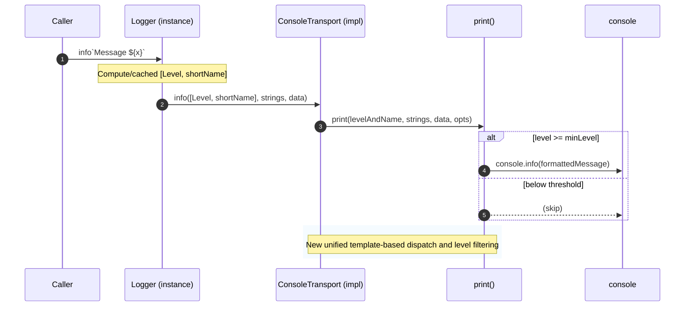

# Use tagged templates for logger

## Pull Request by @tomusdrw

Fixes #652 


## Comment by @coderabbitai[bot]

<!-- This is an auto-generated comment: summarize by coderabbit.ai -->
<!-- This is an auto-generated comment: skip review by coderabbit.ai -->

> [!IMPORTANT]
> ## Review skipped
> 
> Auto incremental reviews are disabled on this repository.
> 
> Please check the settings in the CodeRabbit UI or the `.coderabbit.yaml` file in this repository. To trigger a single review, invoke the `@coderabbitai review` command.
> 
> You can disable this status message by setting the `reviews.review_status` to `false` in the CodeRabbit configuration file.

<!-- end of auto-generated comment: skip review by coderabbit.ai -->

<!-- walkthrough_start -->

<details>
<summary>📝 Walkthrough</summary>

<!-- This is an auto-generated comment: release notes by coderabbit.ai -->

## Summary by CodeRabbit

- Refactor
  - Unified logging to tagged-template syntax across the app for consistent formatting and level handling.
  - Streamlined logger internals for clearer level filtering and more consistent output.
  - Configuration model now uses camelCase: chainSpec and databaseBasePath (renamed from snake_case).
- Chores
  - Lint script simplified; safer checks enabled with automatic fixes for unused imports.
- Tests
  - Updated end-to-end and unit test logs to the new logging style.
- Documentation
  - Minor log/message wording improvements for clarity in runtime output.

<!-- end of auto-generated comment: release notes by coderabbit.ai -->
## Walkthrough
Converts logging across the codebase to a tagged template API and refactors the core logger to a unified transport interface. Updates transport implementations, logger method signatures, and level handling. Adjusts lint config and scripts. Renames two NodeConfiguration properties. Minor message tweak in a concurrency module.

## Changes
| Cohort / File(s) | Summary of Changes |
| --- | --- |
| **Core Logger API Refactor**<br>`packages/core/logger/index.ts`, `packages/core/logger/transport.ts`, `packages/core/logger/console.ts` | Logger methods now accept tagged template params; introduce getLevel() and cached level/name; Transport interface updated to (levelAndName, strings, data); Console transports route through a central print function; ConsoleTransport ctor made protected. |
| **Call-site Migration: General (Tagged Templates)**<br>`bin/jam/test/e2e.ts`, `bin/rpc/src/*`, `bin/test-runner/*`, `extensions/ipc/*`, `packages/core/networking/*`, `packages/core/pvm-*/*`, `packages/core/state-machine/*`, `packages/jam/jamnp-s/...`, `workers/*`, `tools/*`, `benchmarks/hash/index.ts`, `tools/benchmark/index.ts`, `tools/ipc2rpc/*` | Replace logger.method("...") and logger.method(`...`) with tagged template form: logger.method`...`. No control flow changes. |
| **JAM Host Calls Migration**<br>`packages/jam/jam-host-calls/**/*` | Convert all trace/log messages to tagged template syntax across accumulate/refine/read/write/fetch/info/log/etc. No logic changes. |
| **Networking Logger Updates**<br>`packages/core/networking/...` (`bin/test.ts`, `certificate.ts`, `peers.ts`, `quic-*.ts`, `setup.ts`, `testing.ts`) | Switch to tagged template logging; replace static Logger.getLevel("net") with instance logger.getLevel(). No behavioral changes. |
| **Node Configuration API**<br>`packages/jam/config-node/node-config.ts` | Switch logs to tagged templates. Rename public properties: chain_spec → chainSpec, database_base_path → databaseBasePath. Add catch to wrap load errors with a uniform Error message. |
| **Config and Scripts**<br>`biome.jsonc`, `package.json` | Lint rule correctness.noUnusedImports now object with {level:"error", fix:"safe"}. Lint script removes --unsafe from biome check. |
| **PVM Interpreter/Memory Logging**<br>`packages/core/pvm-interpreter/interpreter.ts`, `.../memory/memory.ts`, `.../program-decoder/program-decoder.ts` | Activate and update logging via tagged templates; no control flow changes. |
| **Miscellaneous Minor Text Change**<br>`packages/core/concurrent/parent.ts` | Adjusted error message string to include options in text; no logic change. |

## Sequence Diagram(s)


## Estimated code review effort
🎯 4 (Complex) | ⏱️ ~60 minutes

## Possibly related PRs
- FluffyLabs/typeberry#627 — Also changes logger infrastructure and interfaces; overlaps with updated Logger and transport APIs.
- FluffyLabs/typeberry#608 — Touches extensions/ipc/fuzz/v1/handler.ts where this PR updates logging to tagged templates.
- FluffyLabs/typeberry#575 — Introduces/adjusts logging usage that would interact with the new tagged-template logger API.

## Suggested reviewers
- mateuszsikora
- DrEverr

## Poem
> Thump-thump go my paws on keys so bright,  
> I tag my tales with ticks of light.  
> Logs now sing in templated tune,  
> From dawn of spawn to silver moon.  
> Hop, format, hop—no args to wrangle,  
> A tidy warren of logs to untangle. 🐇✨

</details>

<!-- walkthrough_end -->

<!-- pre_merge_checks_walkthrough_start -->

## Pre-merge checks and finishing touches
<details>
<summary>❌ Failed checks (2 warnings)</summary>

|         Check name         | Status     | Explanation                                                                                                                                                                                                                                                                                                                                                                                                                                                                                                                         | Resolution                                                                                                                                                                                                                                                                                                                                                                           |
| :------------------------: | :--------- | :---------------------------------------------------------------------------------------------------------------------------------------------------------------------------------------------------------------------------------------------------------------------------------------------------------------------------------------------------------------------------------------------------------------------------------------------------------------------------------------------------------------------------------- | :----------------------------------------------------------------------------------------------------------------------------------------------------------------------------------------------------------------------------------------------------------------------------------------------------------------------------------------------------------------------------------- |
| Out of Scope Changes Check | ⚠️ Warning | Although most edits implement the logger migration, the diff also includes unrelated or potentially breaking changes that are out of scope for #652: packages/jam/config-node/node-config.ts renames public properties (chain_spec → chainSpec and database_base_path → databaseBasePath), biome.jsonc and package.json modify lint/config behavior, and packages/core/concurrent/parent.ts alters an error message (injecting ${options}) that looks accidental; these items are not part of the logger-tagged-template objective. | Move non-logger changes into separate PRs or provide a clear justification and migration notes for the public API rename (packages/jam/config-node/node-config.ts), revert or correct accidental edits (e.g., the parent.ts error message), and run the full test/build matrix so consumers and maintainers can verify the new logger API and any intentional config/script changes. |
|     Docstring Coverage     | ⚠️ Warning | Docstring coverage is 17.65% which is insufficient. The required threshold is 80.00%.                                                                                                                                                                                                                                                                                                                                                                                                                                               | You can run `@coderabbitai generate docstrings` to improve docstring coverage.                                                                                                                                                                                                                                                                                                       |

</details>
<details>
<summary>✅ Passed checks (3 passed)</summary>

|      Check name     | Status   | Explanation                                                                                                                                                                                                                                                                                     |
| :-----------------: | :------- | :---------------------------------------------------------------------------------------------------------------------------------------------------------------------------------------------------------------------------------------------------------------------------------------------- |
|     Title Check     | ✅ Passed | The PR title "Use tagged templates for logger" is concise and accurately describes the primary change set — migrating logging calls and logger APIs to tagged-template usage — so it clearly reflects the main intent of the changeset.                                                         |
| Linked Issues Check | ✅ Passed | The changes implement issue #652 by converting logging call sites to tagged-template syntax and updating the logger core (Transport, ConsoleTransport, Logger) to use template-tag signatures and level/name tuples, which satisfies the coding objective to "Use tagged templates for logger." |
|  Description Check  | ✅ Passed | The description "Fixes #652" links the PR to the relevant issue requesting tagged-template logger usage and is therefore on-topic for the changeset, so it satisfies the lenient description check.                                                                                             |

</details>

<!-- pre_merge_checks_walkthrough_end -->

<!-- announcements_start -->

> [!TIP]
> <details>
> <summary>👮 Agentic pre-merge checks are now available in preview!</summary>
> 
> Pro plan users can now enable pre-merge checks in their settings to enforce checklists before merging PRs.
> 
> 	- Built-in checks – Quickly apply ready-made checks to enforce title conventions, require pull request descriptions that follow templates, validate linked issues for compliance, and more.
> 	- Custom agentic checks – Define your own rules using CodeRabbit’s advanced agentic capabilities to enforce organization-specific policies and workflows. For example, you can instruct CodeRabbit’s agent to verify that API documentation is updated whenever API schema files are modified in a PR. Note: Upto 5 custom checks are currently allowed during the preview period. Pricing for this feature will be announced in a few weeks.
> 
> Please see the [documentation](https://docs.coderabbit.ai/pr-reviews/pre-merge-checks) for more information.
> 
> Example:
> 
> ```yaml
> reviews:
>   pre_merge_checks:
>     custom_checks:
>       - name: "Undocumented Breaking Changes"
>         mode: "warning"
>         instructions: |
>           Pass/fail criteria: All breaking changes to public APIs, CLI flags, environment variables, configuration keys, database schemas, or HTTP/GraphQL endpoints must be documented in the "Breaking Change" section of the PR description and in CHANGELOG.md. Exclude purely internal or private changes (e.g., code not exported from package entry points or explicitly marked as internal).
> ```
> 
> Please share your feedback with us on this [Discord post](https://discord.com/channels/1134356397673414807/1414771631775158383).
> 
> </details>

<!-- announcements_end -->

<!-- tips_start -->

---


<sub>Comment `@coderabbitai help` to get the list of available commands and usage tips.</sub>

<!-- tips_end -->

<!-- internal state start -->


<!-- DwQgtGAEAqAWCWBnSTIEMB26CuAXA9mAOYCmGJATmriQCaQDG+Ats2bgFyQAOFk+AIwBWJBrngA3EsgEBPRvlqU0AgfFwA6NPEgQAfACgjoCEYDEZyAAUASpETZWaCrKPR1AGxJcAqohKQuGhEpPQ0zNwe1NKQAGb4fB74IZSQkAYAco4ClFwAbACseWkGPjYAMlywuLjciBwA9A1E6rDYAhpMzA0AYh7YsbGy5SqIDbiy3CQ5FC4N3NgeHg2Fxel+uYEs2Ii0FADuJQDK+NgUDAECVBgMsFy4tGDk+0kpfOnQzqS4kFeYt1xmNosOkjkFcDsuPgpiCDDYSBJ4CR9pR6pAgTQdgAvRDwADWCTQABpIAARCgAUSksxKIxyHjRAAoMPhyABKEoAYQoJGi9GoXAATAAGQUFMDCgCcYEFAGZoABGPIcAoADg4ABZJQAtEqk6QMCjwbjiVlcHrwAAeMTMhUF5ksAHlhKJxFJkLEKCxIB54Bg8XQUIgHNIjABJYPYAK2gqCyCAFAJIBtAsFQoESBEojQPQkfclSO8DPrEIbjaaMFwAERHNBsdDIfatSC2jUAdkrkEZfto8AY0WQuFgASQIcgPIAjlHELhkDs/UQUykwhnItEfeplAy4rnBwFXgWScx4LMEvPAkP0NxePg0Ld+HxbphSMglCWjTl6H6g6OW622RojH0YxwCgMh6HwWIcAIYgyGUGh6C6NgME4Hg+EEEQxEkGI5AUJQqFUdQtB0ICTCgOBUFQTAoMIUhyCoeCFFYdguCoQ4HCcFxfnkJg8JUNRNG0XQwEMYDTAMHIblgIEKDxMZYDQRBYAabsSEtDQZw4AxK20gwLEgABBMMYLovl7EcaT5Agxh5IwZ9AMgeFVwuAcL33VI+yWOIvWYdBIBZCggQ8OJsBuctGDQTyCF8oIl3TTM119GgqA8Lg3IoDRXkZAADABtAASABvDBaxIABfABddEM0gHtBi4DQGqyjlACTCPM3gy5JcsK4q2AqqqfNq2J6sayANBgC8ugWBi2GYBJ5EGyAJAiqMxwzYFkHgJRkN7CKAG5+AwDx5F3NqWlslAMAkfA+zC6dZC8ayn2kMaMnwR7bOHLAmGQr0gtiJJDlzSgvT4GzaF9WyAN0yx9I8JLqHgVkBzek6lAYKJ6MRjBkCs1TuASBjcwWARfQYSB2HUJFEHs173ufLZyctfGKEJvhidJ8ntomGrRAxhGkYA7TK0AsS1AwBohFrcZpFwBoSEFEh1PqLSdL0wzjLgwN2Is/hIMfD7qYMKBHKiC4ENZKRttZCL7FwI1zv3M8PK3RtB0XNNwlXGh13hhlUvzSgND9eJGVOWo8A5YTTsD4P8Cywqw6m0qspJNKg4wEOsoAcXwH4SeuvFIEK/OGDxLJmGTyO9Gj9LY+z3PfiSUui4Kkuy8cZPU4D9LgYSRlK2gSgj2K8RzuvZzEA0Ssq5rjRe4oLLB4Cv0EbHr0J40FPZ/n/urHX6RkEUvBaHwfYsHEYeFzDsaAGl4CWedp90au0/nrK9+ug/7DaB5T/P+BL78DwLfe+EMiBb1fieCg/dB7TkCAAs8YcSRJWHqvBcJ1x4HynjPSBINF4y3gYApB6Zl4jzPBg/ewZN4khILgBgL03r63plFb6dt8B/QBvecmUDIBgzAftQQ/gKBLRJpcEg8lES5kZK8KqwZgjSA5DyIEfoXIBEQCVEkAg8DbgCtQUeV9IKO3Os7Das5uC0D5FDB0Bk4ZwSxsjc8AQ0Z83LDjSCeMCaBiJu0DmFNxChiNpAWmHiWZ0HmD43sYA/HyFxEQEeZwAhMOekYCk04AGmR4gEHkiJkTk0GATLgABZOg8BHAq2FkbUWfoGgUG4AwBoiBzgNHRkiZCStNJC2hgZIytFNb0G1s4SyesbJ2UCSbW8gZBw8j3N3cKSwPTeVtvbBciVNwOJih7FcWY9wbmSsrNIUBKyclZOQMQky3pCOpB2HIXQYhZWORgU5DEoqXMoFlAwBzICVgAOrTBOKXWh3CQbDSnr8UQLA7m/IEP8gMPx54gveZ8yspIkDfSeYGT03pXkUGueCtgyAsoopLCc10GLFnYveVAWmSSHGsN+nEAGNCeF8PnCSbxJNewGSsGGARh15BGIXIgWQyE0CWjpnQKxXTYbw1cQzVGvNnD82xrrRmzNWY8AiWTPxVMaaMJGTEKKIT4LhI5Vqrm80FWYwFiktJGJAyZNWjkw4JB8ksyKSUspnTKlgCMGLGpdSGlNOxe08pUqemwXolrcygyVU0vsuMs29gESbiWfOMAqzko1zmS7Jsnttnpt2TbeIAVkCMkVkQDQyCECT1wX3BqGgORRUHEgDq7U371q3s2mt3d04h3rY2lG1bW0Fl7XHDtHJbxemDEm4RqRfSxFELIdGARk3IUQCSNFrosa8MwODVlPAzx+iSktBkTKQY7owHu2yJJd2MC8JgbA3BZHqOfGNOAARBGUBEQ9HIEjEZ8CUetRx9gSq8qOsBgVF0ro3W3XdB6NKAJUr1U9WlrI2EcNPlw+eF6r2CrWttBgiB9osj8rkv4kkYhA2cOBnkEIKDKqPV6Wg2AzaIaCW9dmnL9Lcqw0zTx9BnGKtlbNWqSJaCSrVrYq1yqm0XkE9Jtxqr+NcM42a8Q/jDZIfIDai+GTFBZIREiZ1rqULFJ7J6nS3rfXVOzLgMAFAQp0WaSwWaGAQ2dLVuGkyDEBmcSsnGgwsMgqQZMZAFEPIFCXUoAxTFPlYghUwqyMAzt7DCqCGKptqY6BgDzWuIVIqxWu1gGHdAUnyEXi+I4dgOMHxofpf9U+Y0jhTAYPAWIO0liyE0lANOsdGT9ufrPOuHbAlp0ygNqOY3OojZ6z2u2Ez+sNRwXNqgFwsoze3lAxbDbBu1oXiN/SV5fSBknfgadzBFjiEiDMmDSMSR+nRtgHs50/SUwivALESqSTtbK9e9McCHOPP3bZ1CJBuBCaxjey9QLcw8jVfOBh4qHG0bOFgE9U4z25hZQ7ZIvY2VoWpBFIKqlRB4G3Q1/YEmYZSaVesuTlracqqNV4tmmrObqZ1YE162mDCpN0wxB12SjN5OLaZj1zBQ1WfEjZmW9nHOUAlrWZLrJi1AhuCQCUeRWzudVjDLzfSzIcSGUj+NYPTYxHi6FLGyWidQeuozqyJ00phdzVs6IOXgh29u9jTSnz1JDgwIyRkFAOQAF4X49syiHlqo1dyB+D2HiP7VXjxwKhQSuHzdCbZBtlQqZUmqQFant1P+eufIY+gzOl7CGWYaBsy3dYC2q9n2hQlgSBEnyS/LezB07VLqFWso8+F51FsAAiUax0q7FIzlfT9GEPp+4z46E8CrPTXs8pgEpDSnl8mtJlE819h4BxOoAkpHPMaBnPEzp9JAv9OOuFy60XXByin0lxAH10vxa2bl48hXktmDK4ZwJBq4XASitjCg67CyeYayRr9LRp+bDIoZGCcj6r0CQY7DyJeTeg9g8hiDBRW6sjZrrJu40Ae4Lh+jQaM7Fq/C5ywBmQMATzoDQ7YbY5EDdaQBHAsaMHg6DhcCxazxR4DoCGdSFTp6UqQAUg8I8F3BYE+R7a54FT55CHF557JwGDkTIC8DSBfoxBV4YaHC3osEN5njTgOZiCn5aI/ARRJTIDFYGEUBEBVZrroARbg7BjnIQbdwkg8hHSILnxZbLjxTez+Bq7iCEYXTTi8jgSQQ4Guj4GJZfRE6TxGC6pn5RTyYO7uJL7Gqqbr4aadgkaxLxIRY0rn6kq0D/jX52rmxKD365KP4FKQBmalIS5erv7WZf6y6A5Ob/7MbFSa7a4aShrQG9KwGG46z+b6qaYORm4TKHxBCXrOD0CW4JFEEu5uwbKTIkE7K+xe5UG5hpS+5Z7+5kBB4h6QDh7CFEAJ4zwnHx7nGXFTbgKiEZ5+43S3BB4kCJ6QAFTZ59wl6Vz7T1qQClS3HvGwCfHfG/EqGKHJxAkNQglsiBKSHnqsFMHmw/TV4U4D7AjAYj4kBgbHSuSzIUH263QTDwZTGyHxFhQpZFa+Tg5UBsBJQMxoDuxbFBGfSUHlhsZHD4ZhEvhg5gQHQ1yACYBAOJ7r+mgJIhQAIruAcO3vdhgFNItMtDEM4AEPsFQFeCdgONsT7GshdMBs8DoswFTjYjKvYjPk4gzrKovmqizhqmvtqpvuxuQIjqUbJmokfsUZRlkQ6bQLvpyi6YKRfvBFDHzjfvanfkLvUSZs/q/m0VUp0dOD/j0dKWgP/pAWGjAaZL5sbgFsbLMYmk8QnusXQU8anmIUaSdHcdmgILeHiGxgmoGPIQCQXvSTCfnjWReJ0NQHeG3GxtSvqpXnVliZwnXqicYedCEZgAKftJBiyIcDsAagEXFF7GomlqKuaZPgptaTzHPnufacpuyr4lzJzlpiQFUXprUbGcZk/k0eLm/smdLKmd0QrvsLKLEGABYhIJaLIAMdmSMRGnmfAQWVMabk5DELEXgSsWFJVkhD8HBh+oYpHskOiX8XwPSblqQZsQhEkU1i1m1h1kdEcVAHcWcd8aWdHuKmEG9BRWWY8Whc8Wnq8Vnm2aoQXkknRZhe2YEmGBELeGLnIqQKaXooesgEuThl4PQIiGyThRrjFDSduqFiojQGgNEami9shJQPjFmNurejBT8OjgEG4biJDOxuKgzEYZeo3rOQRjVpFuhjXocDkLIKyGEBNLbshZKruYzl6QeS4lacecvipmziGakZ6Rcj6SfjyIpszoGbkSGWUZfhGbajeQZk6iLo0c0RZhUu0Z/q+XZu+RQA0J+d+b+f+WARAUMR5nrrmT5mBbGhBQYCgU9PQHYVmhRJdPgAGJ+FgAILQfQYwYYVIdQLAGiPwUZcpYQaFtRROtDhxbCQXplrFApWsZWS8VlBhV2cnG+tWqDq8qouTEeDUF4ngCqZYaVjYcBqSd7lVPrEgD5IyApWQaEByEViVkwk7GOfoVhvXrZSYfyb2MkSkZJpadPgFRkXaf6SeavmeRzq6cOShtZdkWEklQftDVaUoGGRKtebfreYZnGQ+bla0ZZgVX6t/iVWVV+UBfVaMaBUbs1UgWMsWdBceHEaYYejpbUuwozl+LgPsG9CFkkeWeyYERuZABgaQGRbHgHpRRcUniOoITHgxQ8UrYHCnltUiZ8ktUoYXrxZxYEu+jNcVMToMHEYBiogzDIidPic+vIpotoidHdUqrbPdB3ijfwWyauF+HSU2GyVzedFFPJWuetarh6b9S5f9VOYDTji0GTJRFJoGG5R5bdT1fdfluljuTTrKlDbacFbDaFaecGeeUjeXswm9AlWFc6QfkUbFdBbQuUWlfztGYTVlQ0W6o+eZmTflVUhChoEIIgKyAwB0rrt0g1VGkzZMSzWGANYjKPkPSPVWokgkLgbgOQFQiyD4BgCubQAJWqsgA5pSe1dSYHQAtdl8vPB2EHegm9IHXbCxnRl4i6Hgb8ZWF4FIB4JWFWNfSSJWO1paD/V8uoguh2KVPtZRLQLQMgFRGgHgIQIA+FODmoIlPIIyKA18TolLbvf4J+BEATOumFggA9FoZcuVmoiVDDhQOmsmkFFKTKWNEFvwPKQoLMK6JvUfYsDEFbVgAlqgVDFvlFdvjkWzljdarzulQTZlQ/vGd3S0c+R/qpDQNjPYspAGvFliFiA0BIMKA0HwoHLVePerAzY1dPYgQbJBebofMmpmrfQWrsc7qFthWHfqRmkWsAbA4aGdsdZo1iNJbkJnrNsnskP3PWk/JNsxeto1EE5hWEw1BExrT3FAtE5vLE2nPNhcPE9grtithMqk4iuxT2vsM4IHpWOE8tu1CU/RgU+k8xf3JyEkOZRWgkxyF+KyI02dgEJEyE+Ap080xtibZ+sIioA9IDhfGIn+rmLenodHbwygFtGEXtAdOBiLZ5FnaKmfsyBcsDWTMIzZbhippQs003gwJUWDdThDTJoOjaYeZkSI46RjYjdMcjQbKjQGTXQjeoBanc7Kjjc3fjW3TI8TY0S/vsIo0YMo2QLiEjOo/Un4zowqPow3oY8rHVRPaY1PRMRY6MkWVBfMbuksVpUQA4ymmszmhsa45yQaXstg7bjIp/SQFuNIskJjhQCSNUxgMgqtlg6dtOidH44tAqJAGGFYJyAE+lONJRBbWIMgPii+jEL6AGBdF0POM0k02q2DIpGgAGA0uCDsG1JPOkFAIUsCEENbZtBTB5E5fVpwqNbHYc/ZfObbKAnel08df4JeqkIQfPI5SFHjOUQ7a+oEjfCQGDhtDzXpW7VZLQMKrWJyiZaWuWpWkGwEBMFMEQ76ySNOI2YEDy4gByFdYgK7LcAaijNsW9VrFuZaEqY9s9guHDqbGeIrDm83PSSXhoK24XAAPzdtfKVjJw9mUN1isLKPJFb65HcZhi8YfPpvenH7P2wMRbWGUB0D7SlEakao+HyBHqUBm2nQmHVs51XN063NBUL5F3qpPMb4vMV1luH4LsJLxVo0r5OlfP5H/OpWAs1HAv3k5VPlJlKOWgqMwvYxwvKRetqRGNQH00gVmPYsm6s1QX9K2M2z2MNl4NZrOO5pUuS3uPMtpycsQJRNdztR1wTrePTo9DYBaMAASKLfAzJxWMDkDsDMrM4KzRJAQqu4ltkDS8kUwKqMi8r8iRGwGsz2Jt6KO9Gqp/QPDa0X4/D7VvJRF7WezUxst3wfJRo72WIdAYI0QUIWAu96z4IJApHqbtFcq+pSlEdsTF9BMAAQk3IXIyFJ0y6ZLENoP0K4eNWyCxCQBhGFMJwfJgdxdZ9S7Z8AWPlng5yzM5wXAAGrChcAPZr1xFtxtSWfhdNo2ee52efLfBWBhsUBz3xAYVFcldlf4DJdcCbqrEhciW6GoEReS1RcBRDl3sOJMeKAPu+lEPSfnyTDSD468JH5Dg0OMvBa470IpFSq51Wn52/OF0POvvXsaZGCvOV19cN3PsBlBlqY3st1Rk/t1F/td20fjcQsGBQuqOwvGj1L/7KnIu2Wotj0wcYtwdYsxoz2WNIfm4oeE7TchBOyi2DjUBS2Ye300sRQNg4drVuOFrMvJukfK2hMTZJOtoFOo+BycvbaVMjpEfjr7UzILgieiWjvIQ4nW0HwUxE5ccgZsBO0/B23VtpHlvUv4dGu0xwVYw2wMP/obpR0U6jcHON6lHDNSBX4XMWlT7XPAbiPKohVXvhVl23vumWXCP12LtM4vsHd5FUwpXhnfu4S/vZVd1gvXe3egdjAPcNI6HpTQc5mYtwHmOId4vWO2yEsUD9J2xngyLYeUsI+c/5hnh8vICivivYo8DjX7JZ5HLHZU/1fwQdhF5RONOtI/DJ90CFOHLwgXBYT9UnqbQ1TUBsmEHD0AooThMG3F758kCF9QbvYCZl8imV+wpcCqFjT9M/W/4JFpNIr1+N8EBvQXZ3gWJBBt8Fy0Ld8avGIkr9+p+8VD9S9bCj8sZ0ET/l9YDt8z+QA9/z9988m59fIZ/sA1SooL8p+1/p+J8/A9jEpH85+xPVjT9wpQIgpL/F4wqArwotzzxqEkUkfGdNSCDDrhIiGAMPj8Br5p9emWUYAdH1QC+gIBUAluLv1wBWBxqgA+PgfwXAICHeoKWASOjri4CRWYrEAYHHEI88Es5YfnuImlL/okc67YXna2YIA1Dm8zO2hok46eEQeM5NnqgEfQT88aMvPynnRuaBV58SvS9o81V7PNIqVJF5DFR17K90acgm9kbxEGRlqipvM7ubzFw91ru4OUuPIkHrD0KwwxWDt5m+4IFEOJtCGEhVLAmgjSxgvEKYKXpYASmh8C+vOjExcQB8+AREMHQvAQAQomDBlPl0WQnQ1AEKayKIELiIRd0JPKWuYjzIkBJwZAC4H5EwyA4ZAC9DvPELFoQAtSG4Tjt9nYQAwU68gGIXWAcFCQShNAJUpEQ0oqoahBQ5uMUKNDexQh2MNAAugwptD1wVPToRuElRQAjgTg+/gXUIJCC+QXALKG+DLA1oj021L8K4PcHmDYmjoDwLQHmGDDS2HQsAA0O6ZgAwhfQgIAADILhvwfIUMJ+AjCaAJ/DIMiD2G3CDhhcB4ZcOuGDC6hnw95KkVoKpBVMB3MAF51aznRFeyAbisdx0GC4ia53AwQo0A5GB1hz4ZzDyGcw3AzgPIZCPMA1JtInewFawa7wQ6FlIAjoPlMBnGYAJ2hhccnp9AkLWgGACDWuJAPEC6dPaH0cTONDUTgpoc7w7Ic6mYAfhjq0IO0q/R+BHoJB2GekVwC0KSIdg4GSsIUi/BC0ZIqIHdA4hyB5hwsWGScDbCihAhCsCQAMBQEngdgpKyo1USaI1HyQtRMyXUUDH1FBQE4JoexKVAZhGiwsNos0aCmoEEF92AvXMLmAk6cIaULeC8HFR+BWRXs7I30J9jCi8MPWJUY9nL1PaSCjyMgtbuoI25l52eq3fXtEh2469P2xvSRq3VO53l9B7qQwciIMCojpA6IkgA0DSiYjh6XgOmp92JHjEfuOLV0nPTYTMZnIvkC4D9A5H0BeAR6U2hhWLbqBS2sDTyM7h64wNWSODNrMAWLEJJUodDfSJegyAlQAuGlVkOBhyjlA6G2bP3rZHKgXjlkaIQeJyTBC3j9IswNALIBJBb8uAIUPEEuQwA5RyorHVaPi1QiMCpgk3c8TwEoBgARM3DfcSOyRiP0xACQWBtDgWCKQY+g4cdjMSAm7t6MNsVCbADAAYdWyofc6PSWmqhYook4qntQXpZ0NS03yfSDYAyANAKQNgGwI6BsANBARIeJhtA1sLTk76cQe+CyXpEyB5AbJYeOkmCx0NFo8AeSheBNJUSfgvPVkOKR9AyTJozgJAKyGbIZhAhBqC8PKMRgGtJxS0GgPMC9C41+qSUfdl6DJznRGQ+EiDhDFbIaShwpcAtkaS85XQ0IkEc+rZFIb2wfg0hKHPQFmHZhSswPAsHm0wCIA1Ud6BSP4FLQPJ2xJAaANcDikEwMK6gQ+ERXHGqkdOa6IQiliUkRF1KmlfCWeFElsY2qbzE6ClPYRpSMp8U76KYSfq5h+CpktcJRMsnlEaExUDlBCMoCN8587hBxLeEYJij7EukoCRdjhjGgHoLIMANCFtjtAXIEPIyacEQDgYJpYOaaIoBgklQdGNsekiaWnBrT0ADBPaf7x3F7ijpt9MYFvxJBkMv0Z4JaStKDF8Arq72OJGeGwoKTckIUYioGCnZsYfAqQiKUtCNBbT7AeU+MZMmamENOwc9dROQAaleAX8bwEkOlImToympsUtVCSExl4ycZ2MQmSKyAIkzEZLMBap5Qb6MdaEzHUtCokwDmcYpFwUjkqXiBCE7J3sKZKcCIB0EToikoKdOLnDBCAgZ05QQkl0mzR3Qq0X0P8A/RYB2sl6M8V/VOY9lUA0Eh6IyDkooACGLMcVLTMYDsBkoH2RVnQ0IkKQMUwk4adpWAylTpCUMcGmmP3KQjdeHzEuod1zFQBGmiUrgFTIJkExYmRwaWSUX1R1d4JZhAgGzCNBmSAgrUa8FZKNJByyZIcz5MUkHC9dteT7FIcIN2GZ5PkLM8gIyB1kkBYJ3gYliSBPRcBb6MeEuSQGkS3TaAlcw8SfEpGnjwJt9a8cSzvHbFHx84RAM+KoBvjS+QQT8f6B/F/idaaQLPJkybnly251c2TnXMvFEAY8C85uV/V3GtyDxq0I8Z3PVlMsbx84XuQ9K4D3iNyg82yMPJfFjyPxODb8X/BnlFyim1xJefvNvo1yIoa85ZDHkyhTdd5y8nkIfJPHHyPAp8q8VAqID9yHx68u+aPPfFl9J5z8s+K/LnmxcgCZcg6V4GXnfzV5xLBudgqAV3S2A7c48fIC7lf0YF58hBZfIHkIKR5r45BRPKfnTzyos8z5Hj0/nkKV5tcohQbTx6kK95fC0BR3PAXdz15dC28QwvgVPj75rCtAKgo4VcKs8O8XhVXIIUCL65BtHeCIpAVRFKFkAahSfOJYyKh5ci6+UwsUXjzlF7Cl+ZwsCT+zgwXAFGazLxmYzopZaYDmBGQBpzMpNM+zr0NLmaK/5+6HRevOIWoym5Bi/eeIuMWmLIF5imBXAusUKKkFdilRY4tnlQAt5YS/hb/MEWtQt5cSsRUYqPlSLlkFi2+VYu2Q3zYFzCh+SgocXoKnFutUJgUu0VFLdFsA7eUy2AXxKKlkimhSkr7l1LogDSxBSwqyWtLfx7SrBSHC6Xryf5KUYpRdBDhlKq5CSypaMp7mpKJlNAKZU0qUXZK2lSJP2VEFcUwAeWAS+KT4pUYri7lBMXJREVZmMgAA+ssuWQkgPlkS/+QbUbmfKtlFC3ZWYv2WQAPlF8mAIwoyUzKPlj8r8aotib5LcFFcr+SssIW9L2ZsSluYYrAVUKIFtCg5TCvkVDyTlsypFTkrqYfy0V+CzFf8vnAALQmIKg+RIsJVVKz5JKq+fUpsWZLEVU86lcXOwXfKIlPSqJYCpIV4qhlBKkxUSrGXQqeVkyvlTMoFVoL5lFy/flcrRDEykYjU0mYEp+APK/F+/PVV4ANVqpXlQKr5XSoxU/LIVjK2yNEveUfLWVOykZeCukW/LFVsK8lbYoRUtKqV5ylFTy0+Wiq/sfy8VQCpKWhrXV0q8pbKqSXErIVPqslbfIpUBq2FQajVTSpwXMY8FdqsVWsuxWAL412y4ZRyr2VerxlpK9JX6v5WBrBVwa4VUsttV8LulxaiVa1D6xuqK1cqzldAprVKqjlKq5pVmqbU5rLlAcimfEGeVGzjVl6fxWavxnpyglwqmJWGrbVaLMVkaztdGreWly41O8sheWsTXyqIVUK+hbWt5Vwqx5ma+xdmowXzzQ14aogKsvCVOqDaW8o9QMpPWgqPVySi9amrrXpr/Vaq5FR0tpX5r0V7ahlVGqZU39riP6jwIMoTXsr+1Va6pd6qvXDqSAxysDY2vVVPqoAfWV9e+vWU9qy1/6ytZ6qw1DrfVoGhteOqI1OKoA1HAMXKNFnMhkQSpGyRFFeWvQ4UL7faIxgOmJoWEZsjkWJRqD7opuQk37G+owoP8eCd4FhMuqqjZyWORgxsqJybEtju4EHJQFBzRbGN9cYxfMszT+4e8JkdMr3mEQgk0Ny5kAb4CyXpJUQ1KSs2hhrLQBXgvQt4GQkon0n0AvFgcb4BArzWHS2AJs0TUOJOxYAPN6uDTcx0gAhb0oYWuhoyEbTyQph8cgyXuBkn8EXa2MBYhcDUmaKMKzI9hknxVxH42M+kaBoGC6new+wtwKqaIBshPUGY04BIGmwmgsApork7zdDkUieJyA9AJzT1CrlNbEk/mugBAtQ0BBu88ctcOluPWiKm5/nDDbRrPlsYBxTGFjK2TQBYh5ACIZaEqmaT+azw1BOTbekm1cBVtv69bZlsYgDbkJ+FecSYqm7ZtisLMSuZVEILtYzRPwFcivSwA8gVyG0TQIEiOAlMdS/IRcSRLJ6MzFA40q6c4PWoPSMKUMuST2DJhPSMK4UyZEOGPBrFKJiUzsF9u/gExK5HIfWQ9pQ0nrMtqXEJWzIXmcyNl+ADlqUzZZgyIZxEvgUjs02bi4ql0pgD73nCkVqSes+DZ+qigYMcNDGxpbYvrTgacloU9ALQCEA7AGIOE/dvNlXVZ8web0FcueBbT06FtmWyVIEiznJbAtUveYTm3s306ItBa2Df/Ofx0NVhWALKKlu2qOSdNaIsXc2NbEqRjNmqm3b1w0pKBdhkALKM7s20QKvdse33dbuR38gGtMerKNNuc20J5tjOzbe6po2AbpFSen3d3HEIfxQJ3MKPXQHmHZ6WtQ4WgHnvW3dtqNW24vdUtL0p6TWae4Xc13aqy0soQKx1RvO2pRwh9LO+XbIuvXKrb1JIFXYRtUUn8soW8kfWyDH3VwV9oa4DTevrUzKF9zGpfbEyyiZQ19G+2PZlB32z699Y8g/Q+onUzzl9fWM/YNgn0hwr9I6ufaNAaiq7zly+vHi/vH148P9eG0dfPp/2L6cly+neIAc307wQD+GzJXfrOUar/h2gjKnoM7qIi8qIsD/A2LGBB79NbwcYNTM0CEirBBuCzb91xY8iblwco2ThLBHzt+uYWVdqtAaEqNqSUyMNjwCiBfhoejJEqDdRd0wa2ZP2UQ6so5CgSktvXEOmuPayTJH0Xga2Zh0B1wJBDzJVIP0oZ3ra29Sa8xVIf6ADghaM+mgOUCR72YPODEDQ03TNGdgEDYBylQ/s4UASfNkQQ3lFEbncsJk7O2OFzvozq754TDeLYbOUm5gIFYAmvdyJNqbSDW9jOdhONfFJAWhqARtjZv8EP0Y5CSNAnQwaCTaY+90G8PyGhzrVGSM4DdCMgobZpUgt6HwRmHYDuQ6sQlX4NohenCIqjCAQWV5qZYXQVG0Y9xKdX0TqSv6lbcbaF2DZzce9Qu3OSLu4qy0gVmi77PfAkNYqJVUcIFb2rPUDqiAvcy9dPtw2IH4Vv+nNZ8lRXQbK5Sx13WzLX2DZSlVGtlYkvPXVqHDX+448RragiGLj8mlYzcZ6baGFtehp43RpeM37Tlcy946Rq3WXGfjMujeYNko1rb8V6G/QxCpBOMbVVkB5tVnh4VQnvjXx349XGEX3HC97e5NWiaV1Mb79LG15RotxPiH8TsJmePouJN9qUTzxhXWmopMYnD91KwJPVuj0Gy1UqXUI4EGG4/EUtMkj0fwXKZcS3RAsIepWF2j2QTa4hwUTzFVl5a6DBu3o5QCYNi1hZuSKbmADQDVNWdFbfDiof51nRBdyWmY8kilxTHktUR+YY3NL34G9NrY/XYaqVjbVWoE+jdZseRNAmuVKajkyBq5N3q3jnCrgFdE2jiEI9/ScOQEEJ2Z6F5bpgPY2MIOenSDPpg2lvoWyBnHj2xmpbAsOWgHXjmJjVTGfwBxnU90xpM/nLmEX7OoRpLPRmYIM9aiDBYEg/QbIOIBfTzZ64oWbBUd6Qz5J6ZWOqpOqLqztZx0znIbMpmXTQBdMyYMD2dnszvZ3M36YROPakTRZzDWObDO770Tk5lAzPJnO0B4zveu042fgjzCiOrZ901mYM1em1UW52PUScRMyqgzxZ7lYronNgnH10ZxaDWcvN1nbTC5vnZnrfiPn2zHpl8zmZnADmsozJr82hv3PbbB145ilVGc22xmwL5Yk7roKrFYGaxSI8mmJCfOdnyAgtE0Wq0poyxOxJjL7iSN7GIdapaYelrMlCz8F7G+HVNsQU5KktM0eFVLAVk7Ao8ri+PXJnAI7Q49WRfaJbDJeIHLm5Ls8PHhj3UulNsecTTS8XmJ5Ss2OC6WVjwIFbAFeOgqCkihSy6iTmBmJfQkoukr7p7WWOASdTz4aSRlOllFSfuynYzt+M+vO0w2DYMiZgZ0vBQSjUNR691uPzc9tjBhEYGSLcjS3nWKosYiaLaovEGqwuAsxiKN0RWOQa7GUGmq1B10i2V97LJhLNsJ4msRcbB88OSPZAJWQ7RGlqQbWWQJyGix5Xogz0uKq9IlmM8Ag9IpyuwCYbsc0Qc9VVmPBK5jREuw0oYE7C6tqdog+0eEEFzPBTBUgp0xhEtZ2jZgNAq1wLlummupBxZC4FkBgCiS0AxQBQBUJKFNm5XlrNATvgVHrSlR9oVgNnAGGOhimjwiADELcH2jSpK56IJ6v2VgAekRyam+y9HVhy0JUcsnKcPtE+nuXkxo+axKkRvP7NorOYqmAlekaYG5GpNbTauczPUXaEmVtVptd9GFXmL3Yqg32OmLlX1y+afi+Szh5B9Nk1LDZmKmoK0WbL4x6QHwUWS9ZsFBTZQj2mGyNR1d/BQjqU2yZPwooctmph2khtPQba6FSntGL4D+A2rEwOy85Uk5sCHWjeeZkpy5FjRPra+Rg3MQwrLi+9S7ZM8VHY4iCIrdUt6B7NUGJVcb9p9AwTaSsPkUrFFvA3BcIMZW6LfHScJEnDsyQmLZmxmqSJarWbhx3B0ypqlBG3h/emt0WrxYWIWIfeptMAMhQPYOTRbIccpq03kutoFbbIKu31grvYIhCol9apBhZZkdVL0tq4jpbLtjpGo/4Wg06xBoqonc6FUSe5bxLcCrqI9gXVymnbS1JZmGCHSzfdyiWTEativNDcNsTk+AYvBHHN1dl7klucVvbnDTfal15BeYrXkmZPs751ueNk3nCI7rJXEywdlEaHfJu0WZIarKOwwDADU247k9Vi7YLJHM3dbZLepgNkD5CzcO2yMS+li7stWvwAARWwC9hiugTT5HPUixtTEJFAf2LAogmNGj+WMGLlACwemFeQPkVdD8AMZ4PDWpGNiHbEoekOKZkWJ5NujF6bBXgUIq/uTm84yzYmWD6EGQEfGUP8HOMGEIgj8kMOlkzDwR1gAf7J9xHF/R/uw50l5ifLdAqZg+CmKEkS75BDOozk3bhdc7yyGHluFWpc2GrvsUGhPgW6Q0JBntrMZ83Ps3s3b23eVMtwvarcXHPs++4RdhExl4R1Y+RjgalxpXmxMdrK5HdQe/2ycDIABy7x7HAOk7WEgHr5BzaLEC7Pl7NNg0gxUQQoBjegNhjc3i1l73sfDoRVEDdXOsK9cKHQjoKZdSistntDvCyg70injMC4HKfi1YBCoc+LRhoEm0ejqHErF6/rSVutOUmHTlFsU8tDdOwoX4fp1EEGfDPyYlsGhwx3Gd7VDL11DUaz3Evd5c4dPTrLwkwzT3LOqAVqQhIYgQ9qRTPYhsscOr9X0Ew+KhsNa1upjD7jj6YdIJ8feyDeASbnIrAftBOn7JNADq/frHv30rFNiO0QHt4QhuAiTli8k/Aos1k7gYeeyqlS0aBndlYGi0/E7I9p49xDMgC9vskLgf7qW8oBIA8AzT0n6HG2WgUR21X4eVj2B1z2wbY6YZTjJIrLR7vSWemKl+ILU0g1o9rielqJiNnFeBwd4UrttCkxlfvyRX+AaS9QWpv29Z0DMprjw6iyhVcunPRq2LQzAfgBTeMOKjb150Fz0Ql2BaaTwEsMwTdLd41+H1lroO+AYYUkF7xZiPpU2och3tQxnGBvutcOgSwG48Dflk+26HkOtdZDvilDe11esQ8IKxut08b4N9q5wzatlWok2Jmf2QhF3LW6z6rHVzv5sP03X0JpnQA3Tlv546ulpOfy1byRc3gt6mEI0UGMIWBp8Nlk5ZnI3OEko3HJ0FeRv0CZSqNie3WAUjFuWnM9nyvvcuZuyj7Ugm+yr1roX3LyoL9urIwhe1ioXETvI3C6/t8dbMCOWm/Hfg5sWQHbNAllk4qtZ2Z7UDspy65sfYMzLSwU+G1s01vahhQto0rAlwCkglDqkUR7WBinYxVcpaBebXf/cywPXKrNvP29AVyFZkbdmD1+AA/wfhHGAUDyh4F3q6vwhSAuM8M/uFxqbFbhIg0EUe8PCCAqZIZL1GaTMGBcNwfGjY/SsNweQ+UntabgeipDwgQq7SLbyZZMBsDQKSwNnpLQ8EK1WDW+1DTMtWxPzVkaK9VXsEVNe3bwGDvfYHi8qSm7GLQdtoB6Pp7PHlLDzbAEpnLpU6OVna8vpNxacXz/yj868d/Pq6ALiKmXg160wgrvj2exmMZzhZFtGe7wnpKl6jdQrCh6Xn7aBaE3d35FvuiHdJsdmMR3ACQAAWKypkTE+jM7HZhMRQTMA8iR3iZo+503irbvALBxaJ3cfQenkAWjy1o7ZfOQtub2l7zvfTj/absTI+QnvrPvEevsZIRmHUAMQA+aGc/kmMncElTLw+Nno7mJLt2YluTwQVBadf+BooeXCtAu9l7fOFevz1d7IPXduOPPAQbZvmO89e3CxavJEgE8SvBPSLoT3urgbfuJe9NKXgAjhK0JJQIOSUd7290sFFXzNJVxm1Y3SP83IMju+o84XB7A6oe68nU7zX0qEE6rHLhKI1aqetZlrtTobJPtyhisXrXaDQHUj6iFQUZNzrGDlEq04jcAxPmOVjHKiVwwUtyJq5LZZ3Y/OQuPodAT8qhE/it1P1kGT+xHsAqfT9Gn3CUPxHgMYR0Ou1j5yg4+W4ePjnxwX1ZohCo8IBwHDByh4+1KPPjACr8uydtFftPgvDcghSM+5vrMln2z5bTy+DOEIJXwVB19q+Nf3PoX6yHt+aBHdOwA34jgY+iJ8xoY2vFp5NvzgFyrLpMcz2AwlMGew1q59HKfr2pO30UGB2uFVwcsEAd4IEOJPY5nPDgJ0KPzmACgnYfg9zkF6IPsfy9PHx9z2afbvvl0Ne76ZdhFhIzCNgR1dIK/jei8B3/2e7+L497cFrnkvqXsAG99owK4Zoc0BoKP5cAov6bAP93gZAz2CmkZ1BRzrIGzAJcBAGFXF3ycwgJzijYUzDmyVS1lSlZb7i8BP/kBObGQCWFzA0cDKxi5J8Mll28EqKYv73tkS04/5M+i1EfHJax2snwcqWYlLKEKQKQQpHygCoKPUtc+oYACgBCoZf1X8kgDoHzgBAHoG8hGQOQGzA2QQdn4NY5EgBQDvQW9FFtAA4ANADCoHNhZh+TSAMqhLiWAJX9pANfw0AkAvAOYBg8aQEuxMApPWSN96ZCHwBOufMTP9NZEMQ09g/OdzM5EKR22AxvfH9DHd/0G2Cj1KYCRjscT2d2R29K/YunhpXHX2TdIryK739sbvIm0hdu/aFye9CDF70H9I2Yf1KprwIgCZIfycFDwgLJZIBsC0YfTEK93uZ3lRcGbRDiwcP4awNrB9QTJHSglAJALqdsMSDAFovKBp0bgC4M/H4IzrDJzzsiWHJ3a86CNkh44zqV/wXA27EdDac56YvgnEvQXwOYBtnJqCEJQ6eq05ckeU0gp0pnPBFyDm+VCEcDawYoP7t2NBIi0dmPADAU4ZMN5yndcQWokK1ZvHjx5sHPcQW29nPXb2zF9vTQOBdEcBKn14PZAL3RBFAMKzb9KxPQNi8wnAqgPcwfPL1a1yAZpBshyAel3PdAHNF0s0aDUB1Q4opOVx4QCA4plKZSdbLUh4MUGgWtxi7J92bt9SYYI4JVOEii6xYmIlBU06CUINZdqCeuiCh3ODIXUNY+NUyXt9LEaDUooiIThqD/iYni2EBAVKW9g4qfGGxhNSUpjelF7JKS0sVbBEOK0kQqyGVtA8cWxYcDVeQPPgeWfR1hCiQjJh5YCmMqXJDUKOT1DVqQ2JhRIDiUEI6lvORrW8h28SSkJDFWFEP2xSQ5oU0p5CAACkjgR0AyA9fZZHasy0NkGf9aDSQKY9x3Mby4E6wQe2dhZAIz0GDuabklgwrLGIMWQkgo3R68jXGx0joYbbElzAwfPtwXAEMDbzEFFuJzwr8vbHz3c9N3HQPb91gzvzi8HvIwN78ybDER2CgQPYObE3zE4KSdPA692Q5AgEwyL9GQni3JQYfN7z5pySD2jlRE/Cp0atZaLB2ucY5SclctXuOh1ndsgrbC6gCoPH3LD2pdKGGdKoHoCFCeKZTXBtfIWUX/5SoF6wVClQlUPnA1Q5gEQAN5On0mdFXPBDACmwmP1wchnEqD6gOw5Yy7CkAIEN7DBbbZ0HDFQ5UNvoxwicPYClTTBywBs9fGGnBikJriDdaHYW29A2yOcKHRmwxcLbDIAVcJkoGYC8KsJU2HcJbghw/cPXlDwycJWphaSUIbD5wp3xfDlw9sM7DPw7Ly3CmuX8MKh/wkcNsggI48MCRHOIalKI2jKQGAw+8NJHOgUbNu2y4RvKnlvQ48VaH5l9gc5kUCl3H0JXdVAtd3fYLyLQK3czeW72JtUrGF2bEYwy7X2CwfKf1K9E7DFyTAlvVkH0ht/N2kgxmvUaVxAyYaHm+h8rMhEII5DT4OpYLXA+Cxg7wvDxHQt5cCKfCFw2OSXDeoSqA4sTCMzi2ALfRACnDQIrkPyZHwltGfDjI18PMj+3bqXwBrInZ0c5pAljyAx9QxbT6DuOKIVNDjEbyissIxJxFb5EpH0kQpZJeSRbQt+C4jsUJ3c21CB17bbj99NPG8IEkRg70LGDfQ5xzc81eVIjmDVMffHUxYrRiMWDwvMTFWDiLEMK7ouI/dzgt/8TEXawSWFkCUA8jfTEAIOooSP+8yvVJy8VqvLcAs9THf3mNdLHH/wqDX3L8E4CHkDqOwZSQCkB6B9IHwHKBoAD5U5AlQnoDDAs4EkBWjEubaN2j9o9XVGJOUb6CWjOAja1j46tefzZJwSKIObhnAU4BKM+tDOCPw8wDSiu1OEJtAylVcJgn5QijINylFfIIGUBi+QnVwVYqwHekY8NbFoSuivo1U34J+nGrSIBMBQcAHD+w8pkCQrbDmCSicHZ+i4BXoJQEWij8M4DdocItnGvAq9eQEm0Fkb0EfA/QKFRawlNMviIkPlTmOkJK8TvBw82Ywyg5ibZRzhtlMY2ABvRfQX6VIkmwPsDYAPARrxW9voDZ0hxHnQKW0J2jAa110bYZyIMpocf8PRA3DX6MaxPQ0v3TEnHf53UC/HV0nxiNAmJAbM5jdjDJj0YymNpJtVFwVaipYJGM6j9MHqKUA+o2rRnBYmG2LJhaY6LHkAcREqBj1mYjAFZjRAQbGjjmsOOMZA5Q40Dao/QROLOYg4mmK9A6Y1aEm0Y9Lfk5juY8akGxC44WNFiS4qfSZV2ImL0aJLuQWRJtIwsYDaiy4/wHTRmAWgAEA9WfsAGiE7K9xaosHE6CejMuKyEJ1d5Y5FYB1AEIJ4RyWKzlrCbgnPHbIJbGcISB2yVwykxbCc5wvBsMVADMoPCYzy0NmvaHlzD4fc+G691IyWnnt+7E2iyiMKbDEG50JOgk4Eego70G4zwV3zngtsa3xIBwZYQShiNACeNOoNQsPxOgMwlGwpDWXdPyspmMNNkcc2sBdAp9cnOzhL8lA5d0zELYs+ytj1eG0isl6ox+x3dQwzYMosPY7oH/wwAdLxy8kiBoAmlHARYGiBqE4MB9Je4y9xSdRIlsnmJKrIiQ/9DGBkI+Ciw7jg3E+bF+IEtZaSsH0gjgI4H2iMgZ7WgDrAfSAyAwwTkA7AcuOyL0jWQ8RMkSs4aRI5BZEqwHkTFEk/jESJEqRMZA0YnkDnojNUqBJBCoQBn04LZfSDwBYAFBxIAowUEkgBZEx0BvhlElrmnC1E/Jg0STEsxJIALE1SCsSW4WxNoAw5PTgcTBwZxNcSdEqAE8TDEgJK0TTEgqCD0Qky0DCSbEq0DsTokxxLiSyoBJMgBaOHwFo5vE0+l8SeE/xOMTUkoJMyTskgqAiSokkgBiSnEqMHiT3EqAFKTaOKgS65RyJ0O3sqIhG0TZR3bRwndLWAjFkCgo6klB8j2E2NQSGI9BNc9LYwF1vYCxcqKLFvPRYKiNgvOWRrcuEWqK0EpGYMPBdQWF+0MD3TNqLISKEm3HmRqEhgloTtkBoFEQqERMI8CZ/FMM945pK7AegWQhbEgcv/dlxmik/DcX+S1sFq3D4k0IHhj5IBQjAaBPEhoB6SGgb5Fo5HQAW11dkhRSLIjC/LoI2hFmDrBNCZtdZjZ4EMU1UGTMMdzjow0cNUnEC0o45IrEGos5It4Lk8MKuSpYG5Oy87khkAeTmROaXoT3hfGCPRmEmwXRc/uG+JHI0jYcU69zoaTyp5wg7j3chbcUpwvjZozcFR8anCX1ngt5I5Fo4KQTkBvgrAR0DDAMgaAEy0n4I33xRtU1kM5A9Ug1KNSTUs1PX0AJSiF49MIepGLtao+6m2srKTe1tZ/fHKLjpFNWo2Ck+rWdGOoMwx/DiIIEmewCjU2PKIccCoxiL9Diojd0soyonMTtjH2CORQw8EsFwISmogwLZSSExXDS8uUzLxoT+U8yVfBlBAqyK93A6fyGi2Em93PBpka1ImRHgiHj3piWcxw5tgQqOxPRz+VVLywj2H4Oqd0fUigBCKQI4E5AbAMMEc4KQGRKgA9EhRNZ9Zk4TyblkUadKkT9IaAEXTikldMUTFbVROqS1sFaM0SMgXdP3SukuRNXST+c9NnT50xdJyhiQX4HAMNAThRvSeknSPbSsmQlG3StEq9MZAwAvIOoAkJUkDL4coYUFp9rEgqFAzY5RAAgyggHKAVAYM7/Q/TiknpJAjf0kgH/SL0oDJAzm+MDLNEkMtACgy0MwqHgzwMyDNQywk+tE/TZErDKnSZ0udIXTgM19IEB30hjMSSb4H9PBSm5PDJ3S904DMoyiMhDNIzyMxpKoySMmjLQz6M4pKSTl4vxLPSAMy9OEzCM30An5qM5DOgypMsTO0yyM2jK4yFMm+D6TffDTxjoqw3DGEChgy0Is9PqbRBXYzHbULBRtHMYU154/c2IzSpg/xyi81g5lJQgg7S5JLTOUjLyoTK0uhPMkjrMQBFSgHMVIuC2aTyjbTrocn0yE/SYlnf9MwoFM5sQUip0R0uAWJjP94QDSg/ikAKGMfimQiUPsi1sCkDlD9Us1NIDXpC4DDBaANxN0T9EzkCyh9oWI22lgY6rIEzas+rLSTyGZrNayD0jrKagTwrPH8BI3KJCC4KsqSjhCN0rKEGzOQBrIKgRs4JNazYMnrOOQlAejkUg2sqAFRTHQLrNBwFRXrJwzsoVbPWzNslrMaTds/TAOzYAI7MgATsybNiZVZNDksiZERbOZDlsm7OGymsrbIeyhcLaT2ySAZ7NezRCVgLhhoAfAAaUWA1X1wBjw87OMlLs/jOuy6stbKBz2jUbNBzDMcHKeyFIF7OKSYc5HPhzEcuKjYDASS+3j8tEcyi/hXgPHDs002DKTpCiGQQIpTXKEgHcp3oqr34ECsF2UXctvcv2TSio1ZIDCPMyK2ips09LJWTMEtZLzTt3EFhZTwWbiKe9rkpXFuSK0x5KrTmxYtG+BYss4NKsmbFtP5sUs/n3VxFMB+m94JaNVMzRZ4lVP4TTSPjI3TsoHoA4ks4CkHWy7RF7NgyvAWyCxjxsu9KUzT03DM9ybAb3N9yScxpMDyiAYPJvTD0zrK3hb0eeMd5uQyPOjy0kv3LjyyABPNJyb08nMuxKc9eSRyac7DP4ysoLPJ9yc82PIDz88xPNkTi8uHIRyy86nLhh2A9eJupOqYzyu1Xgwgm6oroPqk7Bh072GpAHAD0AHzEiJYA+oSGUyjDSghV50VSMSPoy99WGZnIYBe3VglG5b4j0JQT6IpNOWSX2f0JKjDvGuI79C0rv2LTNcjlO1zy08LL1zIsyJ2RBjc5MNSdmbC3MeSqtYcRjTlM4lIscng7tJ8tuU3j0KxXcISyUpvgjOM1T/g08PwixqQcG+whPfrOygMgCkG+RpLdrNDzZPf/Kyh0CzAoGxsCgxJYd9IWIBZJJoSl3rAiiOgBazkC/ANtd5pAtHIAe0uVJZ5uvZpgegVPT3FeAdIt+Uxy35NIHwKMCrApgC08WHNwBS85ZDc5GEuJFoKKiTuDfk2QKbLSACAfguWyCC0QpbgO8yQrbzpCmKLkL96BQvWw6c9Wz9TxyANMnYeMEd1cyOgidzjTp3foJCiBcwVGrY9WD2ncyw5OXPzFm/E/JDIuAC6wESQoSLxOT/MgtOwN7vcJxCz78sLPuSIs55OvBEQJQDfzPk1Jwq8wgEw34y1iCaIdgpojng3IqrIKHa4zSWgzUMs+EciVjosE33/zsoWwEdBEuL10XT+0SvOWy6ihopWj8eVPP5yk0b6AxJqQDjkxz34diXaKmipS2bzxCinL0L5wcvM7zbInDKGL6ixoq0KW83QqpyJCrvOlyK8L8DATfIr6V5y06Hm3cKHoGbxcKiCA239SDCY2yszTbLoIWYrWCKATSy/WfEKiME6v3WSr7OXImDT855mVyOI5+3VyWo2/NISYiyhLiKn855IyFJ/d5MbSRI8VIvAQfVl1UosAZxMn8ScZkW9hFgkx0WQ4gkAtM9LQhSnWQXcrng1SJ0seUGKkHHwFYkAATTrzDshvKDzC84gs6zC2PFCqy8CikupLaS/3Jbh48pvOXSJsnamWyOSmwBpLCoXPPpKC86HImLLsQdilS2S8POyhhS0UoKhxSnksbzGSsQp0LK4DKPvZb4ysNBgBJIlMZDXafMIehFvAuV+La4tXMbjdNLXLLTYinlPiL6E9sV7BCIaEuEj+45tNTD+bTJ3ztuEjPI7S+E8oLXBsdOckmoUCmoqyhFQ8oEUSwwGPLpK1Shktezk8ybMFLUCqMsdAYyzkDjKuSvPKTKyc6Utby1i5HPYDlC3AvDyMyrMpzKxS+vMTLJSkPIMT9oO4P6zKy2MvjLuSwqF5KNS7QokKpC6Yp0LjwnUqNI9SzoOpTEbaQEijTaG2EThtEPUJfiQE0KNcLxLJezKCkfGgEeKzYlQJTTJcs/I7cZczBLlgT8yEUtLL8wLNZSoioEtLTyEh/LBK+U5/J7MIPH73RYSvQaNhKEs70pMMEtLISsgmXTDnZt9TIkpLCthLAH4DxFINxCkrsyBx8ST0gMohTGoUgvILUgL0wQTVoZHIpdwQFWMxyoKypJgr1IVkNVtjaQYOjIdKKnjG9DQ+nnG8Fy04pNLt0FcrtDJaREJaErIH2j4Md+deXcyvQxNLFzj8r2R3K00mYMspfCj5m2S2DaEQvzGos8oBLgsy8tCzQSx0vBL6Ex9F8Dki90tfLPS8VMyL0KMHzEDWDCLFnEGnMlG9AcS6fNALoeLl2mj7c5HwdCx0tHz+Cq7fSJ8ArALOBsB9IDouaKWS2WMVTYK3DMcrnK1ytGKG0bamoJBqDYkMlMATlB5iKI4fC4Iv4BeTGhWg2gXoZdi+wpfjziiwsuLinbTzD4IselPCs8xbzPfYs030iRwTyiSoTIpKm/KbjS0q8p1zH8u8ueTZAJEB2EUiptKs00nYH00r+stlxyzLK4sJsc3c1AsrAqSsMApBygUkCXTb0o9LDzvKrKGGrRq8aobLOsmWwjKFS2apGqxq3MvX1pqvCvyY5qjaprLDs51M2LRKL8AG90grLi1sjmRoJ8gsovRzmTxLc0ssRaDKMWHsLwFGznLh2I73Bw4UirNvRPE1CrYCNy5QPGCmIvbxYjy6DZMzS+9EqvEqAs8qptK0RO0uvKHSsYAXQGnFqrfLXSEaLCj5kOeOtCTK4uxoquKwCv6r5HYDGTzH4+yszyfc21LSTonMbKTyJsssuFcKynoBpraOOmu7BkyibKmyyHLj3HLGQiCsGK2a6AFprCoemqlKTKbtnUgpi2yHSkEsPkEy1ASZS1Zr2azmsvRJatUmlqCABpXlqbgRWowjMgfpPMK/qXMCSjWCYjDegXM4RgfjE2LhBmSo0ky1TpFqVl2GCFkw/O4r7mBXLeLdUTz1lyWDIGBxspgqqL3IdkoLwCFQvLhDEqgwsItVzJKhGsbEka2qvuSiABSAxr1K0ZCGZKRa2pHJUAPvJxqgoL8CzgFIer2nBGvJYDngmRPACrl+CZ2Afd/8sWlSDzLc6uh44gxknYAhwIkKig4g1ctyydidVJsQgobiU1kPqwa07BaMI0GTRkAVOuQATKC8R61IdI0h5AWgSIj4BWwesHBi8gDUGC9qU2cC9YNTegC1I3DQMC7xrAEUP8B+7LbnvZciG21/yd7I8p293MgSqvqHELzJPzU0o7lhrwisiyISEvKqqTqbynlNjh061hLar2ErLNxrYgk5jMq8i+iodzYeN9xMMTUz3MNZ6PDEK/R4Y96rxTxvFAE5CG611LHzuOafKoqwC7+DawOOdPJ2q/08dHLKZq1W2OrdSizP1K3Qu6tdqBBMxAtL3a0XOeLxc14p9tDYF+veYArGKwdtNBEIsZT8EuOvhqNc/+rvz7SuSrGBXgEBviyyrFtLZJ/IQKDa9bcKpO8rG6uBqsqU0OIKyKFIYDBigsUqhiSjd4xKUDAMGYHIWZU4cCWcCBTIIAcJaEd8TsDAwekRg8p7YfBzCxQw4GvBYtWSjklVvSLk9xGKzSjZJpqKTwcInCTQEsoc6swq7ducrhFtq1SYXPSA8xJzMc9RGs7zeLSquGpS1zyrYOiL5G7lMUb8AXqkfRlG84NUagJH0vXlCinDO6roHYMu9hAYqvMQd+al/Cqan0OSKM4shIRICAKanmP2AA8fqDmg2VOIG84iGW9BHoBEvgAoQG+IEFEo4qrUPQaRmH3ywbWPSipaMWeRcr2JTSzkXpgcilZFgbCG2x1ML3bXJqzFzvH4q/qpGu7wTrm4uRuRqFGmpCiIam03KB9E0X8qtNRovtPKdFKT3GLt8nSjmQBis8TDRLq6x+Lj5EkkCr0lOIMCr/5BimwApBXKrQpTKCeCsrRaMWogv5K704CombOIY4WoZ//Vatxbxq/FsmrmSlWpmrKWzFomzYmb5HGaTKMARM41lVFvRaqWsYqpQlQikALwWa+lu5atCjIH5aT+C0H3YHAK6WDB4sIKDAreCq7KygGW6lpoD4AwQAYCEApgMZBbgL8X/Ada9eT1r8rWgCVrBWzHjTMVW3lpbg4AugIQDNWwQG1bdW/0H1bZaogCNaDatQj3LrmkcqnKkq7R1Ya53NwsJqOGyxC4acmz2pho+GnzIhr98vzKZTv6opoqqLy2RuBKymzLx5ANTQ8oTD60okQ9LQG98vScGmu3IgaKWVprXL+6vZHJbvK67IAANI1JsAzU6lpobLU+UpmqKQOto4lG2q1q6aaCUKpXREClIOhw+hFkiNQqjfwCIBEKMaB8jtHIXm5z1dMOAZ9x7XKqfrjaquiDqCYx+oeaERaRsBKU2mqsAaxgDNr9BmxPGBChSAL5sB9AkbGqXL4HLEoYKbQhHXTL22qwB8AMgb3LSTYwhAHIAGkgsp0K+y2yB8UFgD6Fd9Sy1cUIb5i59tfb32wqE/bj2n9qLzCy1YrLzT24DvWKdnPklCIh7W9DYKj6W4oCi0qv6hcsDSoNJwY+hYyzLE6I7hrPZeG72v4bUibJtGC363isVyQyApoTagsyqttLXm5Op5Sj2/YOrRY5DrHTRKmvEGqbVKvuPza6mwtpMMKJXCoXlqSHuuyFdEIoq+CcwwxzChu6k5l7reqrkjJISHGytgKBXd3KyhaOMMCOBoADiUUT9IcoA+VygR0E8THK3HMRB8c2DNzzFqw31ZLqiistM7zOyzs5BrO2zvs6b4Rzsay8ckHNc7Y89zpYdBinzos650/zps67OhzqsAnO3sHC6W4NzoQ6TKOnxbavOmati6/OgLqS7gulLtC7nO9LoOruy0TLk49qQJASq+eYHk5QZmCzOfjPqy8GcBlJRZF7yiKvgCHzeqNdmk19EahNia4osyiBpMO8IigTBoVIC4SRSE6Fs5p8wUy8BEKJVCBq0Er2vfq+Kg70vJEcISuUwFgtg12SI6g5NzAjk/qlN0XweBLY7Hm5qOkq922SvKaPmzNtJIAwC9tn9P82ADbSsKpSw+DevFNA6blsntrjTU7PMG9w0QVNyRD63EUlJaoe29DGbyXSDBz9+I3TvuodC+Kunz3savX5EWu24tyqjS+6vgdHqijvm5Fko/I27mOn2sO9Zg9ds5QRKnNItst2kJw47k2rjtTa3mx7r47mxWDvdJxOlhJUazcj8tUSAW6kj4tKgwGIsqgW13JpVIywpH0hbUk1MXS0YlStdb3W+CCVrYMs2UmAazZCG5rQ8/aCFaqG3DNl75e9ArSTMkGWt1rAcY1vV7/+H6C16j0XXsbLpe1auN7TO03qV6CrFXqt6PWjXrt6hUnXt/bey11rLl+IuenUAQO5WoN60zV3oV6ze/TAt7DW73rV7MA33rth7egPoQ6/24Pu56w+3AAj6usq5syimGgP2uKg/bIV9bNZCXjwAZkgnu3Iw20YIjaVuWjujb1kgqtp77YqklLEGUoi0kbt2p5pkbWe/dpRqnu49rxFX0XntFTamgXsLaeuw3tydIfaOFs1wcZ8Fd89Gn5PgBmCohoDEkE5uqGM1Il3NVw+CtIAELMFd+H0hvco4A/bkehpJ2z5EAzhZgHs+RGOQQoXAEaSJwKcEkLhuKUqz7Ec5fukB8+okEzxlCzPDULj+1ovP7p0q/rjCb+luD/77+1/tv7SAZ/p17YM9/plhoAL/sD7Ji3/tE58+pU2h1dmenjqdGuBVhGtSK7Bvw7xOEcmMUyO10GOpZ4sz0ZAQCwmvU7t0CQAlI2mzcgKxL6u9gGSt7ANN3tIYevvyjG+7x2b7wa1vpp6FI6+1opruvvtu7OOxGu46D2kfv2DNrJsgn64sqfrcAJoagcpEnM+gddrRA8/ma91+lyULsUsffs4HVUS13077BAOFXzRvbBsmSlmZJQex+getmAxuez6CM13GwiNpxs2U4HOARudSQZL1dUBIkKzwEym74NPbfIEl1dBwHQaMhKnk3yXCJ21oGv2A/Ko6/PSNvEGNA1iOBdGe272Z6SmmSpBKOel1FH78YV7s0GTcy9pf9eBT/08hmvDRqLRFuomqwBvunbCsHy2qoM6b4K3Zwl5KRA53gcTiw/ACkHXbSvYBJy7FJIrcUnZoCj18iblOY4hoNN3yLM/fMo7w2nhp4qq/OjvyqpBvIiKqG6GGpjr42m7qLSWepQbZ6eOsYGOE3ur5OB9Pung3/KoGiyLMdzK43ROZwOrlyyCKygyxNox7QwmFE6Ac1yZhbB6fFa7BrI0rM8xh/8uhFdnDIYobm616tOKUsK6hZAs+YvqAQ6EY3zW6lk8nr2GW+zblXabmyGpb7dKoaw0pi/ONt76QnBQauHE6uRuVIi7Q91I8Hhj/MSzfIDMLMr0KZ3OsGZEOILjThrNIKHLDULKr+w0muTk5zasbnLQbXkegG2agMFwY6wjOWRzA8oejBBK4wBajyf5DPXgUs4aAYDhSq2uxwuCjvQfOoMdzQivist8RsntyHNuljt3KGGhxFO9bm/JqKH/i55uqqnubgFZHqbSeFqH38r0s95+bPGFJh+8GJscI4ogPmyyy2vuour+XQrM2YJ6w3mkIq26uwbDNoPqC9FUx+Tlm1uReEDlkNrGazNau7MAOzHKoXMdoRJ63DoLGxoIsYE8TrdKBP5o3Qgj0QVwFnh5YMx/SIrHWsyqH0gzqCID37kmp5E/DtRiHhoao+1kL7G+oQcc9gRxij3YLCHPgEnGYmT5Anr5ALznvhT8dMaVbZxyqA7Hhx6ZrXCxob5FdZNxzsHcq6Ww3qzH+x9ACHHnBbcZkozxi8ZrH0GZosIqt+toL9a7C0evtosgxBG/zYGfZra7/ejjn+k2u0dmA5sAG2C34yy4xRGHNmOEcRLRaZp0WRWhv6HaHWB1SJRgXc+e14C9CUESGT54chLctUh8MUm9qKnCbYqCwpOiSgT6/mvtoHUaQkuaD7bYeo7dhtQKdH+K0kbb6fZY4ZLEm6TIdpH80x5pKHiEsoeYAWRsYGTlrodhGaQNcBUEFBVQQiRc5LDKEL7M3A3NrUrJO6fo6q3oDML5dIG7MOLacnDocLCBRoCs+RtOUASCiMxzKAbDPWPCBVDKHe7LMjy3O0VWhNJ2vR7LNJunwN6U8MAOcnA4Ch1rB3JrVUz5NRbyY/7fJmHP8mT+AtyQpLWBydCYnJsCFCmmHcKfvHbJ1IEG5AwYuBc4a0dUo9E24CNhbh6RDKBKmuICKRjYy+TeGxb0oIKcayvWdKDCnmACKdynRy1HAKnW4Iqaqmky56NkgjSGDsFsBpyUpqn0srfjSYvWovrnbA03DFG4konvBOZN8gNqGD2G281dsSej2p2HCR7icp6P8USZVy++iSb/rB+30f9HLJeSeWBQCZSelAdgtAenAORkMfSMwHOxgSCC7QV0BTca7CnNNKg9AlWmmfUVx7bo+GZnLdhrVgllouprgBX5AwJ6ah0bJh3i4BoAqAGxCPKP6SbBBqYIpjQuo9UmhxvrAWvBxjwZIk+Qkp2GdEAG+VfmxmsnemP0xSZrPHJmZiAvlX5XQxNkIn4/LKMcsiYp9lG4rC6dk+kbMiyILDwuShTtHRBlz0dHDp9NKkGKo75mhrSiLvvEae+sSfkHLh0ofu7awGSYcCCAJgFumlJ2UAVBksA2cFAi7PoV+hFKXsFhQfyJAD95LCEhyDHUi16fE1Oqpoa3BTmqoIl6X3P/3E8lLQKemxO7ZssJ55bBV2DmSQzeDFHDJl/ppFbC8dy5z+B/YBhHpvSCEtG1ieidXY8qrfDyHf7IsQO6IsM7rkGme4psknNZ6Sb9HZJ66b1nFJsAAVBZQWUCOETRP+wzMi7doD+tQOF6bAauR0XscZUJ36YgKCiqAstCZIncGeHJh4wbXRSwrACSn6OasI0BWQXDyvCYY4kMDxQ53Hm0tlXPmsin2AGefBhQpsCG+QTRTAVJsex0NQGxqCIPSPmPhc1vwr1xrPCwdp5hjk7Z95w+YzMT5gFKUtqCTK0vnTBDcHHCbx+TxiZZp+9kJiB3OKmQRhuGUYPLq6PyxsLjFSDE0jGEivjZ4UzcWb2mHRinv2GZgz0Y2DIijWYumtZ8uZ1mbp6udrmNQBuZkgm50myLt5IZZA7mC2t6auCWvP0pLb1pKHy1gYfLl2/8dOxMdxqoUu2kDdwZqKdocjWGAtJKjOleOgRKwHKHozKwNlkanP42cPozxnKBGwFgmVV37hpFhqHKhZF9DPkW64TRY/SEUZ3urapFmRffT5FtMwMXyoIxaAXUMeacEHFNM2tb4KcJOYKwji6y1B9x5iCZManMiVASaNm79GObr6tnFvrKMe+o+ZWO4Qa4q0Fpvqln9hwMOOm/iwO2Lnzp64dLTtZuSarm7p2UHFBMrSwzVQbZrmntmdJR2dar6F4cW7nwHR9zjH9GvqsNIhmsetEloZkNxSmpLXKE2hKoOGfoBHCRVB0pAwTK0AkCYBqZvGgpjpeZmqZwMB6XrgGgH6WTRQZZZgB+RmfLd7J5eeygcoMZZzhgdcgCZhA2Ya0IJOQCkBrmcl9UZKLcBYZYN6iOdZdoBKoTZZwYA2S/Es59lw5drmCgE5dn4zsBHESnll1pcGKrlyqD5JL0M8CmW5yMNkPq5luHCGWyxqvL+WOCMCCBXYJ6ZdBXvRGSHmXNAMzOEYfW82sNLY5xgX/HuBOBbYblyqC1QXOJ/aeYj8hmNvj9+Jo4dEalZwuc4j1ZkufwWy5q6dzhiFx9AlA1JguGNNHkN6IuBJ20pcxr9J35sYW/mx/xabalh1zXsDOsRbJr55rKeYBF5x2lQqcQzwebcdWKVapJKGzKFMWtF49PLH6MkwvgL5V5DyVXSAKHBZAEscHx+AA+LVZWqmp0Jl1WP0/VcrIrFo1bvmd+MCB3mc3VnQZDbVr2ntXDejRYqZaG28bdWWHchzAhdxS1fVxEKCzjh6Hg7hyspKGheSIMyqB4Mk8OF85oP7PGeYshSXaqpnXn4KzCN2LyhXRBk1D+Pownd0hVB0HTkIfHt7mgoMz02Gdp7IaY6iRiQd9rFYGWYwW18OnqGtlgiL3pX9A6/MZGXm1Nu1n2pvL2Kg9InNooNdJ/np+bPGmzz+TuLHO2cK+hntEtBt1/uHpF9V+bpdyzPNOG3XLQLKHpFU88Foug3sIKCxW1hk5buLtoJ6xViHF4L0RiicBslLg9k45yElIBRSDZQ8AIgG16FwUloFQG3OfivhQJezxdH9yISlgngeMge1sbWdKobWZ7CyeDatp6IwOokRgcB5Z2dIjsFqYQr8BCq6CNLkAQ5mgDaA371nfI3qUQTyBMatY+VqiIyqLoQAKP12SERxNHX8fHdFZ4SeJ72JhvpiWxBuJeJHDvMRrGhGQQRqit9uXIlgXKRBjZLbSGrwSWDRMCVEu9Elq0oiLvRu0u1mggRAFkgGkYVHoRbMOhak70jW3Na8H2oookFncfkd6H57VKeuJKwMIjxALUzzq7tnN9bF2dXUjZndSrKL8G66HXXPzMgjsMTA5YmwEjGHqXMz6WnLZR9DGInMMFtf42RBwTclne1ztap7LKN0fJGJBykY11o9L9cjrcwFBewXzkpNrwW0ly6bGBdN/TfywjNudb+8JOxdb5NPIVqUakuzYXsxKLYaLEMqfIMVdJ18i/NFEta+sVDLQ8XFNm+mlLHRtHRu7CB0m3cKlPDUtKQ6Sym2ieTuy6HtqgBYamsU3ZgQ2VUMezxW2AFDbdn3aE+gNhXDELbLYAuFmbelckIcGpGzRTRD81aAPsEIiFwO7bwgiGCgnqDMufwGSGshTliHkSQJaWeAuVjyXZl90WrbD5t/eWcwAY1/leqxvsWhD2CFwMqcCMeECFdysIRM4DPBMuBGbYmRcjiZyHYltLYpX3iqlcOGtkmQbpWSt60oH60lvGecxWAEpfq2Xyxre0H/uN6caaT46SLXW+5nqsl6ueDMb6xxbG8altqENMoldsoKccx4FtkaChTsPUjKIklSa9YtlFdm2XV1OArOFghcQRAG/jIeTAnAmjWDQnQBxrUhtqNI2PMO3R7bDEYbgXMqUaRtxOCzPI3cRq1KhH8SRHBNJyMD7WYa0SSiYJXql3hYiwM23fu2mkt6JdJX0FjtdJ2u1mnc026dpke6AGdwfFBEaOLEBM3hV9UjHBo5kdnCiCw67VBDA14XZoaehhMYB727EGYGHjd0ogC2MU0gasb3CHigPi+AJgcWR/JIgAegoxuJrA6XciybGaumLPe2gDQgTipHqhRbSwBnAUeRVRMdc3a+9LdpGBg8xmp51wix2qhk+cEm1hk43zMlJp923LTdkMxFmElaJ2hNknawTSo2Wcp3vCnjdwTY9n+twWmV+nZ9jk9uLiSh09pdYyDjTEbvP5/yrhYF3jXIRK+6tKrxbhbMfTOEAA+DcAAFvZgBhuGYE4hpdkA7jgIDqA6mAYD+QA3n4D7KEAAeDcAAO/YV8Ouw9FCNNgNGM+iK0PGcrkIGKFeBm44bA9wPMd8ggIO6HIg/6jSD5cMWW1FzWkdWcoQfEqhAAXg3AAI73AAeD+tVD5YGtW4kgESZyxrg8gA+DwQ9IFUYIWP8AT+QVykXJDwAFByMkFZBFYcQ57tcoVQ/UP3SdFc5nsRhxbGS/xigeESzR9dMDahcrYYE2I94naj3T9wvvvYst6lciX498dd9iue4EFf2OdkVZhT/yhfuAKTK0zzZ4f9jHWrZxF9RYGwiBGOA7tWD32Z2wYjh1fAQNsMgvI6CWX1yfRRJWt2EOEXZdAfQsjttwI8eaKVssiml0ORcakXS+WgPgYeQAnzt0cwdvQyAoYzxnf3SrMlWGZy5V5Bd6bgEDlwNxmBA57EG9EcSkJBACyO0VIHaPdonMngmO7FIiTdZmmGWxXggoUkA0PLOP7LTZ+Ezo4MgRjs0TGOuAQABwCNpNGPjQXWCGgVHRj1oBAAXAIMKA4/gGcdlzhz1vMBIA0Abjsew2OOjlhwS5m4Uxm0jIAA44/ggmoaaawLZLgEAAyAjePBbSrI4Hy2lhxI9KbWyEOP4T+FzOOAi5Jo6jIT68I2OYTvuo5n9yrmYWmwEIdwx7GuhgHWnRos3ehw0g/REP321g6fiXoNpQU+LQa72wpHqds4bpHihlJZ79B+hnfEUny0zVODgxzudTD3p77Mqs2ClhYAqrJ19waX7aco9lcFLNVyyhuDwADWdmYh+jzoQqYLhEAeHIPohlrstKmipig/L244NU41PPB7U48k9T0I3GmsYoaf7NjFzMfNP9T2g6GmuAMwCtOmyd7cDgnUS3QmYjgJIEp9IODQDtQdOeGVNb5FlPBdPQjB44LgPTr040AfT9KD9P9WmkUDPc4TJNDPogcM4tlTWp07adzTlYv/briOKlA6Det+CLPEOks6Rz2Ap0/rtmGMqfsBS2aDR4ptRZ/YlQtDyg6yhGzoqebPG9bhjbPhwAg/ExxCG+Kd2C1zlDd3QMKialP9K1TTwnrBt2qyHCduk/JXHDrOYp266GQbDr8t47toBRuXxeVnAnE6aLmyt+/YT2Hy3EHLBeUp5PoSnS9csFWM60zd+bGm2bu/3gU7ha5c+FirAUqwoCnEiP2DyVz9mZdgOc3hsGV6Fsm0ukkFeg94ZZuVXb0OC/SRSAeHPwAX8c6DHs1hVL0kj6q6IFyC9O9R0VOg11eboaRoMEMV9LDbZDCB82MlzB0JC/iTwjbcm3xcFsLv8+CSaJ6Ltm2dsf2ZSPSQ0XTvOjlCXTw07G8i466MKBdtiFqpJ0/GwQLhBz4uHz4S+SG4xcDBok/zi0LEu08/h2jCYq87Dbc2MCVJRpcI3rTa6PnHFIwobDGwiO3D2B6pDbjeLfE334536Hi3DgSiZIxPd64G92S+4jsOYNKLXWnAdK52ts0VR61jHscgeutD2Cd2w6P3Uthw7WSY9jk9Vn6RxldSXLzr0zpDbz/XKo8XUYGGyxkK1EB8PMXFyDbSjJ7OxMmjK6BqzXX3TTvIQSa+pZHmTLtt1ESjgLKyvAzwJUI+VoAFyoyAjgNmrsBoW/85dC7GsrrS77s+n3gZFYu/FQAOW4WCRRmr40G4A2rjIA6uurnq9YlGYUnAGudbIa42zgc0a5uRxr4y/r8F7cD0QAEExABmv4+Oa9avzodq86v5E1a76uq6za5AE0utAV2vWssa5N0HUPOsqa8wWyGFg/ZWIcJPnLKk5JOcVvyMU5PLLkSsvBcwnrlZB1uqKiWniuw+P3YrqXMk3/a3bhZO7mz+oSvTzrk/POUrjw7Subz6OKLtcAWIAKv2qxNCiaOaWCkW7LB+bdCYJmCgBwuBLjbQ+oA6IFqab3grizgFCoFm7Zv9c01qYZPIYetSHmulJunPDt8vv2YJRq+B1s1pGtfP5IiOoBXb8xbOZpXjym/cTatNqWBJusYQ8r41EoKmAyvn8qJF8VcJE2+egnzvSbf3W0l4Y3TO0theWITKtDdCOmwGtckAIoIdMPWBBLACFvn8ikEtuzaG9llpCdRLn0yZMthUxlLOeHq+grcpCjsaprhuBOhpMuVny9opbE7zXpQ8qWRDBqipliYx43Y4+wlUQpITIkda8PjvGARO5eushFO9AmoIOgjVwCvOljYYF7Zcn+yWyrpplD87moobtp4Iu751jjo0ATEsYcu6KbK70geoIvtzTJkd4GN2BbvopEvmzv+h8C4ia+7hUoHvNVDG6Q3Tary5YbwbzoIWHzDmZNrDrL7OkmNHyes0v2NObIW0xl0zVCzb9unbzROecdTdPKd2u7sH6Db1kA+bD6HRnmsAKaCYhAHi226a3Cr7kez2AC0NY0slLWzdL2wU+4PDmgq+q7HqAdjC7GmGGvgYuLLM7y/4Qk0Cbtw7B8XZuMVYRlOdm8FvS7otoKfWk63KJcnie27MtmQYLmdbhkYKoR+HlIkhbgaSDxBDNVSCpvwG30qJZeRgPdLbJV3tLpZH26KWXEk2KBH8MuWNqAo4rPYDG4epIZwELhOHgCU9IpvcS0oblxXdYnCn4fkPagDHrKDSCWi0x7T0z1icL91mu4URXhZUekm53ZUIUb+69ka+IvAXMmco45pbtmR8aYH9Db+yarzgaNZodX4KNDVhw5lYm1TM6sdd9ZeEPF33Bp7CqMZRQWw3QDrhIaCBS4MaDxiCgy1wq1fqZy8ddGQDB9gVvCRzAsiT8IhnzJ1dUCVBEnnTSSNBzBTyXnOhZRc96GHpXq3Vil80iLmG9mvZzMc0N20eNZaDO47Aobj7vEglVTBaB8fxA4PfLXnkL4c2PQnsLb7ax6y6p5mIsLsBuAPBtq5vhFoZAGBhCnpIFHvzqcOA459ZR8A8A8QWiNbXVz+h6jb0t2xaEbb7NnBgWqd3je76TzpJcIS79j/E4fbeOpEFBakepEbcCRFnYvdJ+75t8OTsUzk4TmXLDhqWfhsXs8YHNhpiv4PCfAW1cuzuAQeR0UHimxfqQM7LbI4DxJ7Oyg5heP+I88FRZNO6wvBBpeQYHZ0BG23RxHHCmWeWXmZyK052CuHi8lITmonok4woJmMOGIfcSZdoxsnDhxGpXtbvG9+er8sMKlxAXuFhBeA0UPR8P0iyKSReyr3rcqvDSL2fceEGoUfhK1yMvdVcuzKl8lZjd7DfuB4S6EG6NicbT0oAljvCJkQph5wiKwvwQfChBJHAa0crhQE5ezY4V86HVWAwWtyimUERx5VimjwN0jeVIhFsxTvLMG9SHHL9KrPxArxoYvu6+lc6iu1zsGuj2qeth+SujAZV4e5VX+pFBefD+wdQ2aJh8YoEdbSo7xqGC4R4LsYG3YhL3uFjoaF3sFSsHMMUBc6GoIbAcgQh4OAWUGFBx3p+CSPptvt5UYrtXMCHfxWEd7Hfx3zzeN2T4GIExHBnve9htupmTlGSUAaMUpFq9reKlXbcPrr6o6HkGu3LGH6YL4nhNwquivQaD+7KrdbusUytUQF5PUnTGBIH4fjNbSfnW2dmF4aGW3jINh8o2RZ06HG1wFpRfZT/UovFGyBtwOvjS/mrv8bYTh3ShYX/IMJy4jRprL28/SAG+PC4LXeeOAMEKDs0dgTREePnJkG+WJXsNCWGswjw14sc7InBqkuyILx4CXMG5KoO2JvRCYOa/LbFzaf94rY+wYHFjCkwn6HHZ/iBvDC4Duew95G8feWT74qYfgkQ4axtO+r5+PPrvQpvYexId97NFP37le/fSqPiLjCNXnxO3iZ41l0I9gQSFtkA8Ko/ALAKRQj+W9Ftbm/4sUsOUsVHxJRcGnEOhmhHY4sIHaQU0s/dOjyCduIorFMd4o58GMRBPSBsPktlG5iv6TkTZ27GTzG5UF3R/huHWcF67n0+xgC6PqR9Pou3Bwz4QR65HzN5hayLkghPxlOB6oZk4+ffR2slFD4Eti/aFwFNe5CwA7wZMiyoSqAPn1RHW1K+xtFuH1gjgzoETvv4yM9DXLFmDuR7evvqAG/TRWGRNMRv/p0OCmWCb6q1cAKb9RziNrLiR64wvyCoYZmWu7G+ejMHxIbhnkWcUELwSzfQkbJMcHGokKmyEaHiKtfKRvNyq94YfpZ1T+k2xGFQJqiEb75+0+E23T4/x8v5SHoOofh0lcDfvVnb572dyB5A+Ms98953xHmD7qvVxx9tZydKr8FdOkobp/IYBreU9ZfsOz/bXRkhC+Da0FIBJB0qes1ZgcH4oqSxZvMtDkBMfJdlm5ra2ftIbVM3IYJrZJNqRsJpFoEdgK4QhftgFp+eQetBFvER03dQ/4xHncU1MuZ/ZxGGfGuXms9rXWPoBzOnoFthw2eD+9hCdahhqfLI3++xhDoxzjCwWN2ZpQkuUx6cqakKWOWVWrqdd7FCrCKTG3fnQg+7RJN8wRnS+oFvwu3PPi8Tb5IAgTivl5ciD2XpBGsS7wS/w9xT+vffvtdv+++1jvtzSdbs6aMBIfjs9Kp1X8B6R/qbk7AaC/rAzDjcsAWh0sP6XvuCwYptt+E4oh2A2PCCwK/wCRcGXBhf8PKDmuwlXMf2lm0Oe2hX9LvywLnUpg3/YtFB3ZIJY9/XG9QWu16Zwa1z0x2GTKUBX46XH5k8FUpv5VlFuwwkvRlpb8hWm70bo79dNOtNiY/M2QL6/puISoxDfMMY+It3T4sAVAlVcRifPB+97hzxPrmzfZ9bXQ7wdh8hKexEnKiIFxAWzW4+Zh1NGZ9wjKWbzUgc3Hueub0eemt3RuGhyLeo6wKoOf2h+pny/adaX/eDW0R+QHyL+8OiHq3+RxEv+Twalr13WgtiJcTYGLw561HyOawCgbTBQ+9B1ZyBsTM+BkBds/IFAUEbDrY3gFiYprD9AdnzxctCB8i04G/iNgEd+z2XAqJcWru6M1xC7LQbgPgCPQqoCaUEa3oOdnxjMWkhhk2GBieyT08Guf2yEkojZE9/gtkB5yb4c9wRmopimASpHC+4IQsBbMk0ua4QX8Rsky4rBBUBaqBc+qv2fGp+GHijxykoSayFG/CRpCRoDeAd8V3+EEHIWZHhhCC/RkQvrGwYs9xL4vRQ5yH/zmmAr2GSe71pSfMxCWPNCYMYnH92G0zcWxdnc4VF0dcfj0Iec5D+Cl7xeKCAOdGz9Q4w7z2sK19l40upjmIovAfqINV3OByTt0J3UY4wPy0+ugUKaWfwMAkPzISUTl/e5XyAkYp2uCD4DB4QBRW83s1pYZEjpuykgJqloRMQ2bDa+gnnvCkoXVCoa3r+y1HoKukVWqwJEKgb1kseeBSOBr1gagncAwolDSL2DUGOBlwNOBsRwr2GgHuBGgGZeWG1N2fH1OKAn1IGTRzU6s+wf+PNiB2qd23isXzGMmKWa2EIXYBWXBckrXznE7Twke/FjM858yRgts0yE8gEgmYpD1IQllm6U7CJ+Lzhwaw3n6eczR94gcEvsRhygQZExI6FE10cVIiiIx7WDA6a1H+C4BmYG32CwbWEXQy6CPuJo0GsN6AgBFowOaZnkJ0+O028Dz2++TzwLeCS1CK5wzVmKAL0+PonHWTwCmO3cVIIPXwL+eAItA1oA/8FJzM8AtBMMQEhwglRTdOlDTacrwLmKMJBOB2jypINezSe14Xr2mHACoaUAC+5HSC+4khC+ArAZu3lGH25ZBKw4XkaqA1n5+CG3VuwjDzekwQkGOXz+ez5BEgpEE5gkTQQYpwUQgzECe+bECaohoJcCfEEIggkBIgIEEYgp1A+Um0EQAHyjvIdAEvUYlyAgBgBjBDAC/ICoBIAwoAYAwoBIACoAVAtAA1AeQHrBDADFAeQElABQAYAW9Q1ALyw1AgoFbAqoAVAwoFbAKk1oA69XLBlYJcw6gHzBMDCLB8IhLBwpGzBEAFBwXykoApAA+U7wkLBzRyEgIkAKgmeErASAFsAhHzoAgCXYAVgGy8dAGAYXnAZA5nCPBI2kWAtAEI+tgFvBsPAfBaQGPBiAEdA1ICNADWgwA74PvBgAy/BPYFoANgBCgqxwYAUyhQI8QmAYj9E/BXyDAhEEIwA7gFwAXgFghpcHghDmEQhlYGQhkEINARoB6cmEJc29wBwhIEK+QEMD6oEYBDAuuztgwDErAAAB0MAMxDGIbgA2IRxD2IVxDgAFRCSwSOAowHoBWIVxDOIZxCLAJYAYwIKBfALMCRPvns3gKxCWIcJDFIWxC9IGhCvAPJDkwBc08nN3B5IXpBiwJMIsYPJCawL0ExaL+BIAEJCRIYpDgAC2I/QH1R8wZGASAHoBZFkeCrlLgASIa75zrlwAcoG/JDwZgovwe8JK5AxDVIQEASIU5DfISAxFfNhCowBRDMFJWBwxvl5ywIFCLwLYB4EOhCAgIxDKwBpCZIRz9KAOlCwBEpF28BhQaEpGhwMK+BSwDkBjqJOIdYEkgk0D8BEwEeBfAkMZ/ypS8+AFOxCSkuAcsPqRsXImBh6Ae9D/tRhw4i6gvACZYkel+Bd2FTwxhjSgZ+KFDfIZWA4qOwgycKyAGIVfVSMHQABuvN1PAMOAoRPehVxkO1fNNCAdOO000HqURwgqgBbAFPBooXPJKwCJgxDlWAyntNCYobgRnYjyAgIf4ALoV+DTwGdAIoCRCAoVWB1MF4ALrmkArEt5DBCl8h/ISVAGIeYZ/QIGAaIVOB9+O5IXNm9DwodU9IoYhCYoXFD43olCglhtBMwNatvwCtAJIf4IjQY1DG1ofgIpBZUOodzY2eLehwpFUYnGD1pOwBaoCYCSA51LgAiZN3AhCM64K2FAUZBgQFcjPkYkXF4AiGIvs7wOohxAKdcPDH1pPBuhAt0HhEooOlDMoaE8tIe1B0ofdDLoXND+gAlCqwBSBsYKfggZLLBd2A1Dt0LZgf3EoAYQIsxlNtwxxAlohhJAzB4MsZcZHM7g/LHShmjDkBi0ENZNwQjhVYV+DroQxC7oYjDZoXyIOogkgXoajDLoR9Dljt9DwYVWBeIfvR7IcPIxpP9Z2AADCQSBdCfITNCwYWwAGIY6BtEFZAJhMI44YSjQQof7D3fB5DpmsBCQYbFCmYFEAMYVWBpUMVhsAILIlgnAgSkBxw6jHFEm9qDZDYRm5UYPAlSsD1CdATEAQoD4RTIETBjnNtAKKlcBeQNMc0iE8FN2CVgfykwBBONQQJIXKIS0l7EngD7E8Zv7EK0L48yACVBNCNnFhHLlYYgDq0+YrHEyYK1AE4gLFocKIcuYjbIPlDzFWoKIcRYv4AxYt418hGYIR6OZcMzJ/CQKoOt+UEeh2ol9FPpHU8eIpiJUsriJ26hC9BnshIg3MNYdnutYtTgVAppEjA3ElECROl4xWsIsxlmLuAVvL/NxApu8yjKiMa4KMYKYZLRpYdv5NDv7D1YQtDAIVWAiPHhELrMJ1ggcdDuAkmhBDN7BbAI5REisW5HottDIAH5dxAE+t2xtDh6odJh9ARbg0HvzM84lQx/dJeV14Qzst4V7ElYDB5skNFgo6ulw8CBNIXBmh8ewBxxRthWg6nFAi+zHAjBbDB4pOGR8PQZFAZYC8lUHDsIDYn7wxUD1DWpFVg7DLehB8Oaw6IFCIqIG1YhgMaRDTLMg/LNh0MADuw5hg11IsB1EGkJMISql7CvkD7DbofiF/rtQjA4RTFnoXwQPwf7Dw4WbRI4ZnCqwGHBHQLEA84VMAKvPHCkpInDkIMnCgYZgo04TFCM4TdCvkHpCiIWFAi4RXCS4SjD/YejClUJjCeYIsIenGZDKwJqCbQHaBcoVRDjqMlCAqD4RTtPKl7ITFMZYCE9QgGQjOXLMhsXLUZVEAs9lZDlhoQJygGlpNDWYfYA3oJGMEYOLDNTIHkopqVCmkSpR4YedCK4TQjNYafxUQXhBVULugqjMlDzkWWBt0KU4rgEiBIIJ4FiUIJxgkdUJQFNPDhGNoB6AMWC7DK7D6YWwAHCJ7D/YfEivkH7CbkSkjHCGkiy4a9CK4VkivofDCfoUhDCIe8jFoW/IqkXPIakZdC6kQxCoIdDxjkIThSALEjKwG0j0keXCwoZXDVwDXCGkddBsUtSjNoZAAFQNrhCgAABSR5x3gbqgOAQYCulUazPVL248gJLLSAYrD2I1ACqgCAjjvPlHXIplG3IrGAMQqkqnAcKBg6Mj5ZQAAACAQQzB5rCeOmsBqg7KIQU21E8MEQC9AeERPghGBh8TAE5RKqJmh8KMrAiKKZRmKPli2KKjhSEPNRt4kqRmeGvEzkIUgGAhsAjSPxRdCK+QgyOQAEkOmhH9BDRtgCChDEIVh5bXw+aUGFgpUFEgUAC0IG4Nca24PhhhYJXBwkCAAA=== -->

<!-- internal state end -->


## Comment by @github-actions[bot]


<details>
<summary>View all</summary>

| File | Benchmark | Ops |  |
|------|-----------|-----|--|
| [codec/bigint.decode.ts[0]](../blob/e8dcce6fa94ae664a02ad189fee3b8f25e0b085c//_work/typeberry-runner-5/typeberry/typeberry/benchmarks/codec/bigint.decode.ts) | decode custom | 170138651.62 ±2.41% | fastest ✅ |
| [codec/bigint.decode.ts[1]](../blob/e8dcce6fa94ae664a02ad189fee3b8f25e0b085c//_work/typeberry-runner-5/typeberry/typeberry/benchmarks/codec/bigint.decode.ts) | decode bigint | 96198024.68 ±3.02% | 43.46% slower |
| [codec/encoding.ts[0]](../blob/e8dcce6fa94ae664a02ad189fee3b8f25e0b085c//_work/typeberry-runner-5/typeberry/typeberry/benchmarks/codec/encoding.ts) | manual encode | 2954819.54 ±1.37% | 26.38% slower |
| [codec/encoding.ts[1]](../blob/e8dcce6fa94ae664a02ad189fee3b8f25e0b085c//_work/typeberry-runner-5/typeberry/typeberry/benchmarks/codec/encoding.ts) | int32array encode | 4005643.22 ±0.79% | 0.2% slower |
| [codec/encoding.ts[2]](../blob/e8dcce6fa94ae664a02ad189fee3b8f25e0b085c//_work/typeberry-runner-5/typeberry/typeberry/benchmarks/codec/encoding.ts) | dataview encode | 4013567.7 ±0.36% | fastest ✅ |
| [codec/decoding.ts[0]](../blob/e8dcce6fa94ae664a02ad189fee3b8f25e0b085c//_work/typeberry-runner-5/typeberry/typeberry/benchmarks/codec/decoding.ts) | manual decode | 22816752.47 ±0.4% | 86.19% slower |
| [codec/decoding.ts[1]](../blob/e8dcce6fa94ae664a02ad189fee3b8f25e0b085c//_work/typeberry-runner-5/typeberry/typeberry/benchmarks/codec/decoding.ts) | int32array decode | 165238758.65 ±2.85% | fastest ✅ |
| [codec/decoding.ts[2]](../blob/e8dcce6fa94ae664a02ad189fee3b8f25e0b085c//_work/typeberry-runner-5/typeberry/typeberry/benchmarks/codec/decoding.ts) | dataview decode | 161936995.43 ±3.13% | 2% slower |
| [collections/map-set.ts[0]](../blob/e8dcce6fa94ae664a02ad189fee3b8f25e0b085c//_work/typeberry-runner-5/typeberry/typeberry/benchmarks/collections/map-set.ts) | 2 gets + conditional set | 118228.03 ±0.36% | fastest ✅ |
| [collections/map-set.ts[1]](../blob/e8dcce6fa94ae664a02ad189fee3b8f25e0b085c//_work/typeberry-runner-5/typeberry/typeberry/benchmarks/collections/map-set.ts) | 1 get 1 set | 59957.67 ±0.32% | 49.29% slower |
| [bytes/hex-from.ts[0]](../blob/e8dcce6fa94ae664a02ad189fee3b8f25e0b085c//_work/typeberry-runner-5/typeberry/typeberry/benchmarks/bytes/hex-from.ts) | parse hex using `Number` with NaN checking | 138230.96 ±0.16% | 84.45% slower |
| [bytes/hex-from.ts[1]](../blob/e8dcce6fa94ae664a02ad189fee3b8f25e0b085c//_work/typeberry-runner-5/typeberry/typeberry/benchmarks/bytes/hex-from.ts) | parse hex from char codes | 888765.04 ±0.08% | fastest ✅ |
| [bytes/hex-from.ts[2]](../blob/e8dcce6fa94ae664a02ad189fee3b8f25e0b085c//_work/typeberry-runner-5/typeberry/typeberry/benchmarks/bytes/hex-from.ts) | parse hex from string nibbles | 560470.32 ±0.49% | 36.94% slower |
| [bytes/hex-to.ts[0]](../blob/e8dcce6fa94ae664a02ad189fee3b8f25e0b085c//_work/typeberry-runner-5/typeberry/typeberry/benchmarks/bytes/hex-to.ts) | number toString + padding | 332716 ±0.07% | fastest ✅ |
| [bytes/hex-to.ts[1]](../blob/e8dcce6fa94ae664a02ad189fee3b8f25e0b085c//_work/typeberry-runner-5/typeberry/typeberry/benchmarks/bytes/hex-to.ts) | manual | 16668.84 ±0.14% | 94.99% slower |
| [codec/bigint.compare.ts[0]](../blob/e8dcce6fa94ae664a02ad189fee3b8f25e0b085c//_work/typeberry-runner-5/typeberry/typeberry/benchmarks/codec/bigint.compare.ts) | compare custom | 265595643.58 ±4.59% | fastest ✅ |
| [codec/bigint.compare.ts[1]](../blob/e8dcce6fa94ae664a02ad189fee3b8f25e0b085c//_work/typeberry-runner-5/typeberry/typeberry/benchmarks/codec/bigint.compare.ts) | compare bigint | 261271456.59 ±6.39% | 1.63% slower |
| [math/add_one_overflow.ts[0]](../blob/e8dcce6fa94ae664a02ad189fee3b8f25e0b085c//_work/typeberry-runner-5/typeberry/typeberry/benchmarks/math/add_one_overflow.ts) | add and take modulus | 268759649.06 ±4.99% | fastest ✅ |
| [math/add_one_overflow.ts[1]](../blob/e8dcce6fa94ae664a02ad189fee3b8f25e0b085c//_work/typeberry-runner-5/typeberry/typeberry/benchmarks/math/add_one_overflow.ts) | condition before calculation | 261953462.82 ±6.57% | 2.53% slower |
| [math/count-bits-u32.ts[0]](../blob/e8dcce6fa94ae664a02ad189fee3b8f25e0b085c//_work/typeberry-runner-5/typeberry/typeberry/benchmarks/math/count-bits-u32.ts) | standard method | 84239112.63 ±1.77% | 65.22% slower |
| [math/count-bits-u32.ts[1]](../blob/e8dcce6fa94ae664a02ad189fee3b8f25e0b085c//_work/typeberry-runner-5/typeberry/typeberry/benchmarks/math/count-bits-u32.ts) | magic | 242213812.52 ±5.67% | fastest ✅ |
| [math/count-bits-u64.ts[0]](../blob/e8dcce6fa94ae664a02ad189fee3b8f25e0b085c//_work/typeberry-runner-5/typeberry/typeberry/benchmarks/math/count-bits-u64.ts) | standard method | 1411899.58 ±0.38% | 88.26% slower |
| [math/count-bits-u64.ts[1]](../blob/e8dcce6fa94ae664a02ad189fee3b8f25e0b085c//_work/typeberry-runner-5/typeberry/typeberry/benchmarks/math/count-bits-u64.ts) | magic | 12022197.16 ±0.48% | fastest ✅ |
| [math/mul_overflow.ts[0]](../blob/e8dcce6fa94ae664a02ad189fee3b8f25e0b085c//_work/typeberry-runner-5/typeberry/typeberry/benchmarks/math/mul_overflow.ts) | multiply and bring back to u32 | 260088545.71 ±6.68% | 0.89% slower |
| [math/mul_overflow.ts[1]](../blob/e8dcce6fa94ae664a02ad189fee3b8f25e0b085c//_work/typeberry-runner-5/typeberry/typeberry/benchmarks/math/mul_overflow.ts) | multiply and take modulus | 262431067.51 ±6.12% | fastest ✅ |
| [math/switch.ts[0]](../blob/e8dcce6fa94ae664a02ad189fee3b8f25e0b085c//_work/typeberry-runner-5/typeberry/typeberry/benchmarks/math/switch.ts) | switch | 264547580.29 ±6.37% | fastest ✅ |
| [math/switch.ts[1]](../blob/e8dcce6fa94ae664a02ad189fee3b8f25e0b085c//_work/typeberry-runner-5/typeberry/typeberry/benchmarks/math/switch.ts) | if | 260386356.77 ±5.68% | 1.57% slower |
| [logger/index.ts[0]](../blob/e8dcce6fa94ae664a02ad189fee3b8f25e0b085c//_work/typeberry-runner-5/typeberry/typeberry/benchmarks/logger/index.ts) | console.log with string concat | 7892464.07 ±53.62% | fastest ✅ |
| [logger/index.ts[1]](../blob/e8dcce6fa94ae664a02ad189fee3b8f25e0b085c//_work/typeberry-runner-5/typeberry/typeberry/benchmarks/logger/index.ts) | console.log with args | 933128.88 ±104.9% | 88.18% slower |
| [hash/index.ts[0]](../blob/e8dcce6fa94ae664a02ad189fee3b8f25e0b085c//_work/typeberry-runner-5/typeberry/typeberry/benchmarks/hash/index.ts) | hash with numeric representation | 186.18 ±5.29% | 30.09% slower |
| [hash/index.ts[1]](../blob/e8dcce6fa94ae664a02ad189fee3b8f25e0b085c//_work/typeberry-runner-5/typeberry/typeberry/benchmarks/hash/index.ts) | hash with string representation | 120.69 ±0.39% | 54.68% slower |
| [hash/index.ts[2]](../blob/e8dcce6fa94ae664a02ad189fee3b8f25e0b085c//_work/typeberry-runner-5/typeberry/typeberry/benchmarks/hash/index.ts) | hash with symbol representation | 184.64 ±0.14% | 30.66% slower |
| [hash/index.ts[3]](../blob/e8dcce6fa94ae664a02ad189fee3b8f25e0b085c//_work/typeberry-runner-5/typeberry/typeberry/benchmarks/hash/index.ts) | hash with uint8 representation | 162.85 ±0.14% | 38.85% slower |
| [hash/index.ts[4]](../blob/e8dcce6fa94ae664a02ad189fee3b8f25e0b085c//_work/typeberry-runner-5/typeberry/typeberry/benchmarks/hash/index.ts) | hash with packed representation | 266.3 ±0.22% | fastest ✅ |
| [hash/index.ts[5]](../blob/e8dcce6fa94ae664a02ad189fee3b8f25e0b085c//_work/typeberry-runner-5/typeberry/typeberry/benchmarks/hash/index.ts) | hash with bigint representation | 194.12 ±0.19% | 27.1% slower |
| [hash/index.ts[6]](../blob/e8dcce6fa94ae664a02ad189fee3b8f25e0b085c//_work/typeberry-runner-5/typeberry/typeberry/benchmarks/hash/index.ts) | hash with uint32 representation | 204.98 ±0.25% | 23.03% slower |
| [codec/view_vs_collection.ts[0]](../blob/e8dcce6fa94ae664a02ad189fee3b8f25e0b085c//_work/typeberry-runner-5/typeberry/typeberry/benchmarks/codec/view_vs_collection.ts) | Get first element from Decoded | 32610.3 ±0.34% | 54.08% slower |
| [codec/view_vs_collection.ts[1]](../blob/e8dcce6fa94ae664a02ad189fee3b8f25e0b085c//_work/typeberry-runner-5/typeberry/typeberry/benchmarks/codec/view_vs_collection.ts) | Get first element from View | 71009.49 ±0.17% | fastest ✅ |
| [codec/view_vs_collection.ts[2]](../blob/e8dcce6fa94ae664a02ad189fee3b8f25e0b085c//_work/typeberry-runner-5/typeberry/typeberry/benchmarks/codec/view_vs_collection.ts) | Get 50th element from Decoded | 32633.08 ±0.27% | 54.04% slower |
| [codec/view_vs_collection.ts[3]](../blob/e8dcce6fa94ae664a02ad189fee3b8f25e0b085c//_work/typeberry-runner-5/typeberry/typeberry/benchmarks/codec/view_vs_collection.ts) | Get 50th element from View | 36269.57 ±2.12% | 48.92% slower |
| [codec/view_vs_collection.ts[4]](../blob/e8dcce6fa94ae664a02ad189fee3b8f25e0b085c//_work/typeberry-runner-5/typeberry/typeberry/benchmarks/codec/view_vs_collection.ts) | Get last element from Decoded | 26970.14 ±2.15% | 62.02% slower |
| [codec/view_vs_collection.ts[5]](../blob/e8dcce6fa94ae664a02ad189fee3b8f25e0b085c//_work/typeberry-runner-5/typeberry/typeberry/benchmarks/codec/view_vs_collection.ts) | Get last element from View | 26055.45 ±1.93% | 63.31% slower |
| [codec/view_vs_object.ts[0]](../blob/e8dcce6fa94ae664a02ad189fee3b8f25e0b085c//_work/typeberry-runner-5/typeberry/typeberry/benchmarks/codec/view_vs_object.ts) | Get the first field from Decoded | 457431.06 ±2.38% | 1.39% slower |
| [codec/view_vs_object.ts[1]](../blob/e8dcce6fa94ae664a02ad189fee3b8f25e0b085c//_work/typeberry-runner-5/typeberry/typeberry/benchmarks/codec/view_vs_object.ts) | Get the first field from View | 102289.67 ±2.14% | 77.95% slower |
| [codec/view_vs_object.ts[2]](../blob/e8dcce6fa94ae664a02ad189fee3b8f25e0b085c//_work/typeberry-runner-5/typeberry/typeberry/benchmarks/codec/view_vs_object.ts) | Get the first field as view from View | 102449.7 ±1.12% | 77.92% slower |
| [codec/view_vs_object.ts[3]](../blob/e8dcce6fa94ae664a02ad189fee3b8f25e0b085c//_work/typeberry-runner-5/typeberry/typeberry/benchmarks/codec/view_vs_object.ts) | Get two fields from Decoded | 463284.96 ±1.84% | 0.13% slower |
| [codec/view_vs_object.ts[4]](../blob/e8dcce6fa94ae664a02ad189fee3b8f25e0b085c//_work/typeberry-runner-5/typeberry/typeberry/benchmarks/codec/view_vs_object.ts) | Get two fields from View | 83471.09 ±0.79% | 82.01% slower |
| [codec/view_vs_object.ts[5]](../blob/e8dcce6fa94ae664a02ad189fee3b8f25e0b085c//_work/typeberry-runner-5/typeberry/typeberry/benchmarks/codec/view_vs_object.ts) | Get two fields from materialized from View | 172793 ±0.86% | 62.75% slower |
| [codec/view_vs_object.ts[6]](../blob/e8dcce6fa94ae664a02ad189fee3b8f25e0b085c//_work/typeberry-runner-5/typeberry/typeberry/benchmarks/codec/view_vs_object.ts) | Get two fields as views from View | 83988.86 ±0.69% | 81.89% slower |
| [codec/view_vs_object.ts[7]](../blob/e8dcce6fa94ae664a02ad189fee3b8f25e0b085c//_work/typeberry-runner-5/typeberry/typeberry/benchmarks/codec/view_vs_object.ts) | Get only third field from Decoded | 463893.84 ±1.65% | fastest ✅ |
| [codec/view_vs_object.ts[8]](../blob/e8dcce6fa94ae664a02ad189fee3b8f25e0b085c//_work/typeberry-runner-5/typeberry/typeberry/benchmarks/codec/view_vs_object.ts) | Get only third field from View | 97493.86 ±1.44% | 78.98% slower |
| [codec/view_vs_object.ts[9]](../blob/e8dcce6fa94ae664a02ad189fee3b8f25e0b085c//_work/typeberry-runner-5/typeberry/typeberry/benchmarks/codec/view_vs_object.ts) | Get only third field as view from View | 94217.88 ±0.94% | 79.69% slower |
| [bytes/compare.ts[0]](../blob/e8dcce6fa94ae664a02ad189fee3b8f25e0b085c//_work/typeberry-runner-5/typeberry/typeberry/benchmarks/bytes/compare.ts) | Comparing Uint32 bytes | 19829.56 ±0.75% | 1.27% slower |
| [bytes/compare.ts[1]](../blob/e8dcce6fa94ae664a02ad189fee3b8f25e0b085c//_work/typeberry-runner-5/typeberry/typeberry/benchmarks/bytes/compare.ts) | Comparing raw bytes | 20085.59 ±0.62% | fastest ✅ |
| [hash/blake2b.ts[0]](../blob/e8dcce6fa94ae664a02ad189fee3b8f25e0b085c//_work/typeberry-runner-5/typeberry/typeberry/benchmarks/hash/blake2b.ts) | hasher with simple allocator | 0.043 ±3.4% | 2.27% slower |
| [hash/blake2b.ts[1]](../blob/e8dcce6fa94ae664a02ad189fee3b8f25e0b085c//_work/typeberry-runner-5/typeberry/typeberry/benchmarks/hash/blake2b.ts) | hasher with page allocator | 0.044 ±4.22% | fastest ✅ |
| [collections/map_vs_sorted.ts[0]](../blob/e8dcce6fa94ae664a02ad189fee3b8f25e0b085c//_work/typeberry-runner-5/typeberry/typeberry/benchmarks/collections/map_vs_sorted.ts) | Map | 302826.49 ±0.36% | fastest ✅ |
| [collections/map_vs_sorted.ts[1]](../blob/e8dcce6fa94ae664a02ad189fee3b8f25e0b085c//_work/typeberry-runner-5/typeberry/typeberry/benchmarks/collections/map_vs_sorted.ts) | Map-array | 103450.04 ±0.08% | 65.84% slower |
| [collections/map_vs_sorted.ts[2]](../blob/e8dcce6fa94ae664a02ad189fee3b8f25e0b085c//_work/typeberry-runner-5/typeberry/typeberry/benchmarks/collections/map_vs_sorted.ts) | Array | 72398.28 ±0.27% | 76.09% slower |
| [collections/map_vs_sorted.ts[3]](../blob/e8dcce6fa94ae664a02ad189fee3b8f25e0b085c//_work/typeberry-runner-5/typeberry/typeberry/benchmarks/collections/map_vs_sorted.ts) | SortedArray | 198323.45 ±0.26% | 34.51% slower |
| [crypto/ed25519.ts[0]](../blob/e8dcce6fa94ae664a02ad189fee3b8f25e0b085c//_work/typeberry-runner-5/typeberry/typeberry/benchmarks/crypto/ed25519.ts) | native crypto | 5.27 ±20.37% | 82.86% slower |
| [crypto/ed25519.ts[1]](../blob/e8dcce6fa94ae664a02ad189fee3b8f25e0b085c//_work/typeberry-runner-5/typeberry/typeberry/benchmarks/crypto/ed25519.ts) | wasm lib | 10.87 ±0.03% | 64.65% slower |
| [crypto/ed25519.ts[2]](../blob/e8dcce6fa94ae664a02ad189fee3b8f25e0b085c//_work/typeberry-runner-5/typeberry/typeberry/benchmarks/crypto/ed25519.ts) | wasm lib batch | 30.75 ±0.36% | fastest ✅ |
</details>


### Benchmarks summary: 63/63 OK ✅

<!-- thollander/actions-comment-pull-request "benchmarks" -->


## Comment by @coderabbitai[bot]

_🧹 Nitpick_

**Fix assertion message: avoid `[object Object]` and correct grammar**

Interpolating the whole `options` object renders as `[object Object]` and the sentence is grammatically off. Include concrete values instead.


```diff
-    check`${options.minWorkers <= options.maxWorkers} Min workers has to be lower or equal ${options} to max workers.`;
+    check`${options.minWorkers <= options.maxWorkers} Min workers must be less than or equal to max workers (min=${options.minWorkers}, max=${options.maxWorkers}).`;
```

<!-- suggestion_start -->

<details>
<summary>📝 Committable suggestion</summary>

> ‼️ **IMPORTANT**
> Carefully review the code before committing. Ensure that it accurately replaces the highlighted code, contains no missing lines, and has no issues with indentation. Thoroughly test & benchmark the code to ensure it meets the requirements.

```suggestion
    check`${options.minWorkers <= options.maxWorkers} Min workers must be less than or equal to max workers (min=${options.minWorkers}, max=${options.maxWorkers}).`;
```

</details>

<!-- suggestion_end -->

<details>
<summary>🤖 Prompt for AI Agents</summary>

```
In packages/core/concurrent/parent.ts around line 30, the assertion message
interpolates the whole options object (producing [object Object]) and is
grammatically awkward; change the message to include concrete values (e.g.
options.minWorkers and options.maxWorkers) and correct wording such as "Min
workers must be less than or equal to max workers" while optionally appending
the numeric values for clarity (or JSON.stringify(options) if you want the full
object).
```

</details>

<!-- fingerprinting:phantom:poseidon:chinchilla -->

<!-- This is an auto-generated comment by CodeRabbit -->


## Comment by @coderabbitai[bot]

_⚠️ Potential issue_

**Bug: logged message assembly is broken (arrays/undefined leak into output)**

`strings.map(... )` yields an array and appends `undefined` for the last segment, producing malformed logs like `...,undefined`. Use a reduce or join.

Apply:

```diff
-  const lvlText = Level[level].padEnd(5);
-  const val = strings.map((v, idx) => `${v}${data[idx]}`);
-  const msg = `${lvlText} [${levelAndName[1]}] ${val}`;
+  const lvlText = Level[level].padEnd(5);
+  const msgText = strings.reduce(
+    (acc, s, i) => acc + s + (i < data.length ? String(data[i]) : ""),
+    "",
+  );
+  const msg = `${lvlText} [${levelAndName[1]}] ${msgText}`;
```

<!-- suggestion_start -->

<details>
<summary>📝 Committable suggestion</summary>

> ‼️ **IMPORTANT**
> Carefully review the code before committing. Ensure that it accurately replaces the highlighted code, contains no missing lines, and has no issues with indentation. Thoroughly test & benchmark the code to ensure it meets the requirements.

```suggestion
  const lvlText = Level[level].padEnd(5);
  const msgText = strings.reduce(
    (acc, s, i) => acc + s + (i < data.length ? String(data[i]) : ""),
    "",
  );
  const msg = `${lvlText} [${levelAndName[1]}] ${msgText}`;
  if (level === Level.WARN) {
    console.warn(msg);
  } else if (level === Level.ERROR) {
    console.error(msg);
  } else {
    console.info(msg);
  }
}
```

</details>

<!-- suggestion_end -->

<details>
<summary>🤖 Prompt for AI Agents</summary>

```
In packages/core/logger/console.ts around lines 11 to 21, the current assembly
uses strings.map which returns an array and appends undefined for the trailing
segment, causing logs like "...,undefined"; replace that with a proper
interleave using strings.reduce (or join) to produce a single string without
undefined by concatenating each string segment with its corresponding data entry
(guarding missing data as empty string), then use that resulting string for msg
before routing to console.warn/console.error/console.info.
```

</details>

<!-- fingerprinting:phantom:poseidon:chinchilla -->

<!-- This is an auto-generated comment by CodeRabbit -->


## Comment by @coderabbitai[bot]

_⚠️ Potential issue_

**Do not cache level/name without invalidation (stale config bug)**

`cachedLevelAndName` never invalidates after `configureAllFromOptions`, breaking the documented guarantee that changing options affects existing loggers. Levels (and `workingDir`-based short names) can be stale.

Apply this diff to compute fresh values on each call (simple and safe fix):

```diff
-  private cachedLevelAndName?: readonly [Level, string];
+  // Avoid caching to ensure config changes take effect immediately.

@@
-  /** Return currently configured level for given module. */
-  getLevel(): Level {
-    return this.getLevelAndName()[0];
-  }
+  /** Return currently configured level for this module. */
+  getLevel(): Level {
+    return findLevel(this.config.options, this.moduleName);
+  }

@@
-  private getLevelAndName(): readonly [Level, string] {
-    if (this.cachedLevelAndName === undefined) {
-      const level = findLevel(this.config.options, this.moduleName);
-      const shortName = this.moduleName.replace(this.config.options.workingDir, "");
-      this.cachedLevelAndName = [level, shortName];
-    }
-    return this.cachedLevelAndName;
-  }
+  private getLevelAndName(): readonly [Level, string] {
+    const level = findLevel(this.config.options, this.moduleName);
+    const shortName = this.moduleName.replace(this.config.options.workingDir, "");
+    return [level, shortName];
+  }
```

<!-- suggestion_start -->

<details>
<summary>📝 Committable suggestion</summary>

> ‼️ **IMPORTANT**
> Carefully review the code before committing. Ensure that it accurately replaces the highlighted code, contains no missing lines, and has no issues with indentation. Thoroughly test & benchmark the code to ensure it meets the requirements.

```suggestion
  // Avoid caching to ensure config changes take effect immediately.

  private constructor(
    private readonly moduleName: string,
    private readonly config: typeof GLOBAL_CONFIG,
  ) {}

  /** Return currently configured level for this module. */
  getLevel(): Level {
    return findLevel(this.config.options, this.moduleName);
  }

  private getLevelAndName(): readonly [Level, string] {
    const level = findLevel(this.config.options, this.moduleName);
    const shortName = this.moduleName.replace(this.config.options.workingDir, "");
    return [level, shortName];
  }
```

</details>

<!-- suggestion_end -->

<details>
<summary>🤖 Prompt for AI Agents</summary>

```
In packages/core/logger/index.ts around lines 70 to 90, the cachedLevelAndName
field is never invalidated so changes from configureAllFromOptions can leave log
levels and short names stale; remove the caching by not writing to
cachedLevelAndName and instead compute and return a fresh [level, shortName]
tuple on every getLevelAndName() call (or alternatively clear cachedLevelAndName
when configuration changes), ensuring getLevel() always calls the fresh
computation and no stale values are used.
```

</details>

<!-- fingerprinting:phantom:poseidon:chinchilla -->

<!-- This is an auto-generated comment by CodeRabbit -->


## Comment by @coderabbitai[bot]

_🧹 Nitpick_

**Fix misleading log: branch triggers for 0 or >1 certificates**

The message says “no certificates” but the condition hits whenever count !== 1. Log the actual count.

Apply this diff:

```diff
   // Must present exactly one cert
   if (certs.length !== 1) {
-    logger.log`Rejecting peer with no certificates.`;
+    logger.log`Rejecting peer: expected exactly one certificate, got: ${certs.length}`;
     return Result.error(VerifyCertError.NoCertificate);
   }
```

<!-- suggestion_start -->

<details>
<summary>📝 Committable suggestion</summary>

> ‼️ **IMPORTANT**
> Carefully review the code before committing. Ensure that it accurately replaces the highlighted code, contains no missing lines, and has no issues with indentation. Thoroughly test & benchmark the code to ensure it meets the requirements.

```suggestion
  // Must present exactly one cert
  if (certs.length !== 1) {
    logger.log`Rejecting peer: expected exactly one certificate, got: ${certs.length}`;
    return Result.error(VerifyCertError.NoCertificate);
  }
```

</details>

<!-- suggestion_end -->

<details>
<summary>🤖 Prompt for AI Agents</summary>

```
In packages/core/networking/certificate.ts around lines 41 to 44, the current
log message says “Rejecting peer with no certificates.” but the condition
triggers whenever certs.length !== 1; change the log to report the actual number
of certificates (e.g., include certs.length in the message) so it accurately
reflects zero or multiple certificates before returning
Result.error(VerifyCertError.NoCertificate).
```

</details>

<!-- fingerprinting:phantom:poseidon:chinchilla -->

<!-- This is an auto-generated comment by CodeRabbit -->


## Comment by @coderabbitai[bot]

_⚠️ Potential issue_

**Don’t stringify Error objects; you lose message/stack**

`JSON.stringify(e)` on Error typically yields `{}`. Pass the Error itself; transports can format it.

Apply this diff:

```diff
-      logger.error`${JSON.stringify(e)}`;
+      logger.error`${e}`;
```

<!-- suggestion_start -->

<details>
<summary>📝 Committable suggestion</summary>

> ‼️ **IMPORTANT**
> Carefully review the code before committing. Ensure that it accurately replaces the highlighted code, contains no missing lines, and has no issues with indentation. Thoroughly test & benchmark the code to ensure it meets the requirements.

```suggestion
      logger.error`${e}`;
```

</details>

<!-- suggestion_end -->

<details>
<summary>🤖 Prompt for AI Agents</summary>

```
In packages/core/state-machine/channel.ts around line 228, the code uses
logger.error`${JSON.stringify(e)}` which stringifies the Error (yielding {});
instead pass the Error object directly to the logger and include a short context
message — e.g. call logger.error("Failed to ...", e) or logger.error(e) —
removing the JSON.stringify/template literal so the logger/transport can
preserve message and stack.
```

</details>

<!-- fingerprinting:phantom:medusa:chinchilla -->

<!-- This is an auto-generated comment by CodeRabbit -->


## Comment by @coderabbitai[bot]

_⚠️ Potential issue_

**Avoid JSON.stringify in logs; it can throw on circular structures (double-fault in catch).**

If `msg` contains cycles, `JSON.stringify` throws and masks the original error. Use a safe serializer.


Apply this diff:

```diff
-        logger.error`[${this.constructor.name}] Failed to dispatch a message: ${e}: ${JSON.stringify(msg)}`;
+        logger.error`[${this.constructor.name}] Failed to dispatch a message: ${e}; msg=${inspect(msg, { depth: 2, maxArrayLength: 50 })}`;
```

Add the import as shown in a separate comment on the imports block.


> Committable suggestion skipped: line range outside the PR's diff.

<details>
<summary>🤖 Prompt for AI Agents</summary>

```
In packages/core/state-machine/port.ts around lines 35-36, avoid using
JSON.stringify(msg) in the catch because it can throw on circular structures;
add an import at the top: import fastSafeStringify from 'fast-safe-stringify';
then replace the logger.error line with one that logs the error and a safe
serialization of msg, e.g. logger.error(`[${this.constructor.name}] Failed to
dispatch a message: ${e}: ${fastSafeStringify(msg)}`); keep the subsequent throw
e as-is.
```

</details>

<!-- fingerprinting:phantom:poseidon:chinchilla -->

<!-- This is an auto-generated comment by CodeRabbit -->


## Comment by @coderabbitai[bot]

_⚠️ Potential issue_

**Same issue in postMessage error log: replace JSON.stringify with a safe serializer.**


Apply this diff:

```diff
-      logger.error`[${this.constructor.name}] Failed to post a message: ${e}: ${JSON.stringify(msg)}`;
+      logger.error`[${this.constructor.name}] Failed to post a message: ${e}; msg=${inspect(msg, { depth: 2, maxArrayLength: 50 })}`;
```


> Committable suggestion skipped: line range outside the PR's diff.

<details>
<summary>🤖 Prompt for AI Agents</summary>

```
In packages/core/state-machine/port.ts around lines 123 to 125, the error log
uses JSON.stringify(msg) which can throw on circular structures; replace that
call with the project's safe serializer (e.g., safeStringify/safeSerialize) by
importing it at the top of the file, use it to serialize msg in the logger.error
template, and add a small fallback (String(msg)) if the serializer itself
unexpectedly fails; keep the rest of the error handling (rethrowing e)
unchanged.
```

</details>

<!-- fingerprinting:phantom:poseidon:chinchilla -->

<!-- This is an auto-generated comment by CodeRabbit -->


## Comment by @coderabbitai[bot]

_🧹 Nitpick_

**Fix stray brace in log message.**

There’s an extra “}” after the storageKey.

Apply this diff:

```diff
-      logger.trace`WRITE(${storageKey})}) <- PANIC`;
+      logger.trace`WRITE(${storageKey}) <- PANIC`;
```

<!-- suggestion_start -->

<details>
<summary>📝 Committable suggestion</summary>

> ‼️ **IMPORTANT**
> Carefully review the code before committing. Ensure that it accurately replaces the highlighted code, contains no missing lines, and has no issues with indentation. Thoroughly test & benchmark the code to ensure it meets the requirements.

```suggestion
      logger.trace`WRITE(${storageKey}) <- PANIC`;
```

</details>

<!-- suggestion_end -->

<details>
<summary>🤖 Prompt for AI Agents</summary>

```
In packages/jam/jam-host-calls/write.ts around line 75, the log statement
contains a stray closing brace resulting in "WRITE(${storageKey})}) <- PANIC";
remove the extra "}" so the logged message is correctly formatted as
"WRITE(${storageKey}) <- PANIC". Update the logger.trace call to use the
corrected string interpolation without the extra brace.
```

</details>

<!-- fingerprinting:phantom:poseidon:chinchilla -->

<!-- This is an auto-generated comment by CodeRabbit -->


## Comment by @coderabbitai[bot]

_🧹 Nitpick_

**Fix arrow direction in invalid request logs**

These warnings are for incoming invalid requests (server handling peer’s request). Use `-->` (incoming) instead of `<--` to match the convention used elsewhere in this file.

Apply this diff:

```diff
-      logger.warn`[${peer.id}] <-- Invalid block sequence request: ${startHash} is on a fork.`;
+      logger.warn`[${peer.id}] --> Invalid block sequence request: ${startHash} is on a fork.`;
@@
-      logger.warn`[${peer.id}] <-- Invalid block sequence request: ${startHash} missing header or extrinsic.`;
+      logger.warn`[${peer.id}] --> Invalid block sequence request: ${startHash} missing header or extrinsic.`;
```

<!-- suggestion_start -->

<details>
<summary>📝 Committable suggestion</summary>

> ‼️ **IMPORTANT**
> Carefully review the code before committing. Ensure that it accurately replaces the highlighted code, contains no missing lines, and has no issues with indentation. Thoroughly test & benchmark the code to ensure it meets the requirements.

```suggestion
    if (res.error === BlockSequenceError.BlockOnFork) {
      // seems that peer is requesting syncing a fork from us, let's bail.
      logger.warn`[${peer.id}] --> Invalid block sequence request: ${startHash} is on a fork.`;
      return [];
    }

    if (res.error === BlockSequenceError.NoStartBlock) {
      // we don't know about that block at all, so let's just bail.
      // we should probably penalize the peer for sending BS?
      logger.warn`[${peer.id}] --> Invalid block sequence request: ${startHash} missing header or extrinsic.`;
      return [];
    }
```

</details>

<!-- suggestion_end -->

<details>
<summary>🤖 Prompt for AI Agents</summary>

```
In packages/jam/jamnp-s/tasks/sync.ts around lines 245 to 256, the log messages
for incoming invalid block-sequence requests use the wrong arrow direction
(`<--`); update both warning messages to use `-->` to indicate incoming requests
from the peer (i.e., change the arrow substring in each logger.warn template
string from `<--` to `-->` so they match the file's convention).
```

</details>

<!-- fingerprinting:phantom:triton:chinchilla -->

<!-- This is an auto-generated comment by CodeRabbit -->


## Comment by @coderabbitai[bot]

_🧹 Nitpick_

**Fix arrow direction in error log**

This is an error during an outgoing request; align with `<--` (outgoing) to keep semantics consistent with “broadcasting”.

Apply this diff:

```diff
-            logger.warn`[${peerInfo.peerId}] --> requesting blocks to import: ${e}`;
+            logger.warn`[${peerInfo.peerId}] <-- requesting blocks to import: ${e}`;
```


> Committable suggestion skipped: line range outside the PR's diff.

<details>
<summary>🤖 Prompt for AI Agents</summary>

```
In packages/jam/jamnp-s/tasks/sync.ts around line 333, the error log currently
uses the wrong arrow for an outgoing request; update the log message to use
"<--" (outgoing) instead of the current arrow so the log direction matches the
“broadcasting” semantics—edit the string in that error logging call to replace
the arrow and keep the rest of the message intact.
```

</details>

<!-- fingerprinting:phantom:triton:chinchilla -->

<!-- This is an auto-generated comment by CodeRabbit -->


## Comment by @DrEverr

👍
