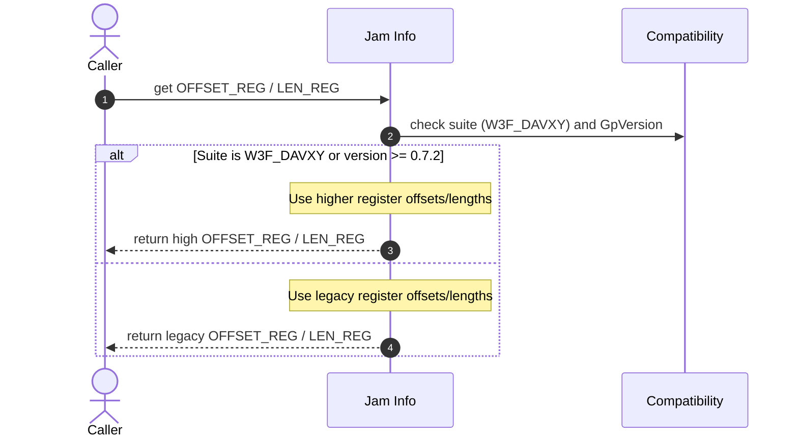

# Assign reg 9 & 10 in info GP 0.7.2

## Pull Request by @DrEverr

Update according to change: [GP #480](https://github.com/gavofyork/graypaper/pull/480)


## Comment by @coderabbitai[bot]

<!-- This is an auto-generated comment: summarize by coderabbit.ai -->
<!-- This is an auto-generated comment: skip review by coderabbit.ai -->

> [!IMPORTANT]
> ## Review skipped
> 
> Auto incremental reviews are disabled on this repository.
> 
> Please check the settings in the CodeRabbit UI or the `.coderabbit.yaml` file in this repository. To trigger a single review, invoke the `@coderabbitai review` command.
> 
> You can disable this status message by setting the `reviews.review_status` to `false` in the CodeRabbit configuration file.

<!-- end of auto-generated comment: skip review by coderabbit.ai -->

<!-- walkthrough_start -->

<details>
<summary>📝 Walkthrough</summary>

<!-- This is an auto-generated comment: release notes by coderabbit.ai -->

## Summary by CodeRabbit

* **New Features**
  * Added support for version 0.7.2.
  * Promoted 0.7.1 from preview to stable.
  * Expanded compatibility logic to automatically apply the correct offsets/lengths for newer versions and specific suites, improving reliability.

* **Chores**
  * Updated internal version ordering to ensure accurate version comparisons and smoother upgrades.

<!-- end of auto-generated comment: release notes by coderabbit.ai -->
## Walkthrough
Adds GpVersion V0_7_2 and finalizes V0_7_1 as "0.7.1". Updates ordered version list. Adjusts jam host offset/length selection to activate new offsets for W3F_DAVXY or versions >= 0.7.2. No public API signatures changed.

## Changes
| Cohort / File(s) | Summary |
| --- | --- |
| **Versioning updates**<br>`packages/core/utils/compatibility.ts` | Added `GpVersion.V0_7_2` ("0.7.2"); changed `V0_7_1` from "0.7.1-preview" to "0.7.1"; extended `ALL_VERSIONS_IN_ORDER` to include 0.7.2. |
| **Jam host offset logic**<br>`packages/jam/jam-host-calls/info.ts` | Imported `GpVersion` and updated conditions so W3F\_DAVXY or versions >= `V0_7_2` use higher OFFSET\_REG/LEN\_REG values. |

## Sequence Diagram(s)


## Estimated code review effort
🎯 2 (Simple) | ⏱️ ~10 minutes

## Possibly related PRs
- FluffyLabs/typeberry#568 — Also modifies `packages/core/utils/compatibility.ts` around `GpVersion` handling (DEFAULT_VERSION), likely adjacent to this version update.

## Suggested reviewers
- tomusdrw
- skoszuta
- mateuszsikora

## Poem
> I hop between the versions, neat and new,  
> From 0.7.1 to .2 I chew—  
> Offsets shift, the registers align,  
> A nibble of logic, crisp and fine.  
> Thump-thump! My paws approve the view—  
> Carrots compiled, and tests all true. 🥕✨

</details>

<!-- walkthrough_end -->

<!-- pre_merge_checks_walkthrough_start -->

## Pre-merge checks and finishing touches
<details>
<summary>✅ Passed checks (3 passed)</summary>

|     Check name     | Status   | Explanation                                                                                                                                                                                                                                                                                                                                                           |
| :----------------: | :------- | :-------------------------------------------------------------------------------------------------------------------------------------------------------------------------------------------------------------------------------------------------------------------------------------------------------------------------------------------------------------------- |
|     Title Check    | ✅ Passed | The title "Assign reg 9 & 10 in info GP 0.7.2" succinctly captures the main change: updating info handling for GP 0.7.2 to assign registers 9 and 10. This aligns with the changes that add GpVersion V0_7_2 and update jam-host-calls/info.ts to use V0_7_2 when selecting OFFSET_REG and LEN_REG. It is concise and specific enough for teammates scanning history. |
|  Description Check | ✅ Passed | The description "Update according to change: GP #480" directly references the upstream Graypaper change that motivated the edits and matches the modifications to compatibility and info handling for GP 0.7.2, so it is related to the changeset. Although brief, it is on-topic and satisfies this lenient check.                                                   |
| Docstring Coverage | ✅ Passed | No functions found in the changes. Docstring coverage check skipped.                                                                                                                                                                                                                                                                                                  |

</details>

<!-- pre_merge_checks_walkthrough_end -->

<!-- tips_start -->

---


<sub>Comment `@coderabbitai help` to get the list of available commands and usage tips.</sub>

<!-- tips_end -->

<!-- internal state start -->


<!-- DwQgtGAEAqAWCWBnSTIEMB26CuAXA9mAOYCmGJATmriQCaQDG+Ats2bgFyQAOFk+AIwBWJBrngA3EsgEBPRvlqU0AgfFwA6NPEgQAfACgjoCEYDEZyAAUASpETZWaCrKPR1AGxJcAgokTwRFgUJESQAJyQAGSQAIwADChY8BgAZviQAOJWkPEaAOwaAEyQkAYAco4ClFwAbACs+aUGAKo2ADJcsLi43IgcAPQDROqw2AIaTMwDAGIe2Kmpsu0qiAO4stwk1RQuA9zYHh4DDU1lLYg1kAAiFACiUrvNAMr42BQMJJACVBgMsFxmGhEIRsNxaNQSGAUukwPF8rFmtBnKRcN9fv9AdosGVnrhqNh+vwtjiDDYSBJ4CQAO6UIkEZiE2gUakAGnsAGt8IgAF54NDsoE0Qk8gJcqjNFbVDxEgAUGHw5AAlM0AMIhSH0ahcIrxIr1OHhMBFADM0F1HFiJo49VqAC0jNdpAwKPBuOJFRxWuDIegGEwKLQUmECIxYJhSFxspAzAAWAAciVl3V6/SGI1wYwmU2GaAk+CW+AoHOGVE2aC2FH2h2OCfiSqM+mM4CgZHoBZwBGIZGUNHoUzYGE4PD4ghEYkk0m+8iYSioqnUWh0TZMUDgqFQmE7hFI5CofYUrHYXCo1PsjiBLmnCjnKjUmm0ujAhmbpgM3DQDA5aFIawDJAGPB4BlAYpg/cQ1A8dRZA0XB+gMAAiJCDAsSAfAASW7PdNXPJwrw7f4I2kRtIBaH0D0ybgADU6XgRVIDIRwuDQWglC1SByDPNhmB2SAqPiAB9fIBJKalRkgCQ0HmL4ELyQoigQjQDCgMiIQo6jaPoxjmC4QiMFIehMy+STpP4VI+ME4TEVSCgWEgWSCg0WIwF4CkqWpBDIFDBzCliRTlNI8i6CSGgKAwKT+EDShg18dp2gEqi7hsZ50IAeXKZ4BPQ8oBNSmxriSjj8DPFIGHmJRkH4oSRPZEgAA8aAwIN9K82BjM0rBLgAR2wMhPi8jIAG08lqAp2TkjR4nGxzYmm+SAF12TQRZRHEFrHgCeiwOcJB6I8fARgYVrqEgEIoKneijMiudgqgxBNCMO57vgIVgtnL4QkpGkGMWIthwAWToeBHEQ5DlLfD8vx/aQBiENBpjh5gwFgblcDABgpJAmF8Fg+CkIQlDLAwrDe2Chw8PkAjw304iAvQ5huD+nAiEHPsow0ihNuSZAFRKhm/uCmy7IAAQ2LYdj2ICZXQJrIEJYKUkgJRQuYFJg0gVKZhmZ47mgASbDuTIZfodo7hyg3Mg0GA2oUJr1DorBea8jU4IY0ZKEgAB1E0ZgE64fCogANABNc91C+It0AkjrICIF2Pcjkgeoi0MquEkpgWdwJSFdFqroQIg2tHRZLldzB6C8fTM0QWq6o/O285t7aIOA6DIDEpriqt8oMgOAQoIYAZ6sZigD3YNuAiCAkQmQWkQjDIjaCUoxCbQjxQuoB3kFDK6lDK5xN8VZAO2HgX2z4PuB4Yod7dpqAe4Xmnt4ySfwtwd4LvM0/R7oat+/gI649xDSGXk9cQr1+yKA+m5b6JBfqjy4IDIMIN8aNmfK+VsssOxoDwDuHs+43osFZieNAZ5yaXnkHIG8ygFwPmXOg1ch5Va4AEvAWgiABKfXcnQAS91nBoibAYRhDABAmnCLQAQsRRAmliOEIo+R4yxHjGgRRDB4ifgSGgWMqQGDxj0akaotR4ipHjE+F8wiiHqFYewzhMDaS0AEm2MxQiWwjhIAJNgFBSACX+KIDkHC+Gj2cQYAA3gYUoCEkC2AAEL7S/HQVURD2BWFRnQBCXBUhSUuKycJ9lEAo0OLQWJ+Avy2HSZATJMoSA5IiUgVKjxXSsTIOUyp2TckISDLQGw2AMDXBKXiXORBECqjal+cpuAKC9RqfZTp3SMDuFwF4EZfjxmTOqe02ZPSnSIBdG6D0GBlljK4BMqZ7SoIYA5HQdC/heqIAGeUpC0yEIeGBLgQ5HJyQOHXogcpg1cmlDCaUIF9lfFfnKPDEgDyFleEgO8hC0zgUIT4e/H5xy1kIqBQhYeLy34OyhTbcQiyvgAB0EJ+FfqdUIERohxESIrbGWQcgTSKKS88/pSqLJnBWd+M9WpfCBIrPSkY5bkXVgy6mtBzlhHSHwaMzKBroH8IEYIoQkChWQJEcutKrbrmQFJZVs9xJXSFVOTMJ0WL0EojRTmDsLLVQzrLMEakviI2RqjdGmM1jY1xgq+Wdr07tzap1EgXgJwtU1trXW+tDbG0gKbc2hsrboTRKgJgfwkBfC1YgLYDB4CpAAdfN4hcKmRxoPDV6yAdmYAwOrBA90iwwXhf8zFM98DzH2Q8h+JrKU9XgCEWgABuPlXlPBfFTV4ZwsaKy8HwLweAkIPDyAqrs6o28bZzooY/UgGgm3AoicwKBDzqTOBrfpXde6EIhDTfmogH8WlZPWXu+yRZAgpCku88FbAHmEq8ATYFABfDFgKL2go5J+yFXAELbN2e6W1cKMURORYSVZpyn1Yrrjiw+GB8VfGXa6WD9FSWqV9J+AMzUQwZBNVGHIcZEysqDFezllLUiUD6qam2YJ7oamYFkMsH5Kxbq+GatEB7xCSQPFdIGZdZZCl8Wu/lig80AKw8/Q84F4CQTblq8V5cpUltlUyxyRR2QghQCm5AZ0cI7ybtTX8JBNBr0zEW2A6IqSpHZOoFAx8MBgAINwAtWbN6IHzex1AlcqRDjDH4ndCH7KtvbXiyDXbbPQN7f2odu9nT4f2V5+wKMgkCDwOgbgM650LvkCEFjIQ/jsegV4SSkXOMTJIPDQTMXm37sPZB49YVgznsRVexUN670ZIfbFhCL6RjhQ8B+iFDy8N7Lxc2wDzbgOItA+Bh5fSGBcfVokx40N+uYqQ6i52qGL3YswFhztGRUg9InEfEtPT6CK2NSlxAVttu7ZakwA7pAotfk5G6LYS8judaUEek9fXxuTbfTN0ZYG5uQdoCU77Qy/1Av/bkxaZzXm2Gg9lxL9k0CxFjLUAQsZwi1CMSQWIAh4RoHyNsBgmj6gk9iEUPRtRYwMCKAwRo8ZdSLAYBCeM/p8iiNoPUeoDBYxoDkeT8IHPz3PLxzYaFEH7KZMWPkanyiGAS7QPUWgijYhaNjPUE0RQSCxj57r2gJobdaIaCafIRQii0FSPCAxaBagmnjLGWgBvLeO4D/UPyBgscuIgG4jxlBvGgY4U4/QQA=== -->

<!-- internal state end -->


## Comment by @github-actions[bot]


<details>
<summary>View all</summary>

| File | Benchmark | Ops |  |
|------|-----------|-----|--|
| [bytes/hex-from.ts[0]](../blob/ea5353d701b957c18c9b495a2056a01e1dbc58f7//_work/typeberry-1/typeberry/typeberry/benchmarks/bytes/hex-from.ts) | parse hex using `Number` with NaN checking | 142412.45 ±0.33% | 83.91% slower |
| [bytes/hex-from.ts[1]](../blob/ea5353d701b957c18c9b495a2056a01e1dbc58f7//_work/typeberry-1/typeberry/typeberry/benchmarks/bytes/hex-from.ts) | parse hex from char codes | 884834.35 ±0.35% | fastest ✅ |
| [bytes/hex-from.ts[2]](../blob/ea5353d701b957c18c9b495a2056a01e1dbc58f7//_work/typeberry-1/typeberry/typeberry/benchmarks/bytes/hex-from.ts) | parse hex from string nibbles | 557364.95 ±0.4% | 37.01% slower |
| [codec/bigint.decode.ts[0]](../blob/ea5353d701b957c18c9b495a2056a01e1dbc58f7//_work/typeberry-1/typeberry/typeberry/benchmarks/codec/bigint.decode.ts) | decode custom | 172602735.44 ±3.48% | fastest ✅ |
| [codec/bigint.decode.ts[1]](../blob/ea5353d701b957c18c9b495a2056a01e1dbc58f7//_work/typeberry-1/typeberry/typeberry/benchmarks/codec/bigint.decode.ts) | decode bigint | 103394990.92 ±3.24% | 40.1% slower |
| [codec/decoding.ts[0]](../blob/ea5353d701b957c18c9b495a2056a01e1dbc58f7//_work/typeberry-1/typeberry/typeberry/benchmarks/codec/decoding.ts) | manual decode | 23486551.65 ±0.65% | 85.87% slower |
| [codec/decoding.ts[1]](../blob/ea5353d701b957c18c9b495a2056a01e1dbc58f7//_work/typeberry-1/typeberry/typeberry/benchmarks/codec/decoding.ts) | int32array decode | 166247673.53 ±2.74% | fastest ✅ |
| [codec/decoding.ts[2]](../blob/ea5353d701b957c18c9b495a2056a01e1dbc58f7//_work/typeberry-1/typeberry/typeberry/benchmarks/codec/decoding.ts) | dataview decode | 165288491.97 ±3.26% | 0.58% slower |
| [bytes/hex-to.ts[0]](../blob/ea5353d701b957c18c9b495a2056a01e1dbc58f7//_work/typeberry-1/typeberry/typeberry/benchmarks/bytes/hex-to.ts) | number toString + padding | 323589.41 ±0.47% | fastest ✅ |
| [bytes/hex-to.ts[1]](../blob/ea5353d701b957c18c9b495a2056a01e1dbc58f7//_work/typeberry-1/typeberry/typeberry/benchmarks/bytes/hex-to.ts) | manual | 16449.01 ±0.35% | 94.92% slower |
| [codec/bigint.compare.ts[0]](../blob/ea5353d701b957c18c9b495a2056a01e1dbc58f7//_work/typeberry-1/typeberry/typeberry/benchmarks/codec/bigint.compare.ts) | compare custom | 270124938.91 ±5.03% | fastest ✅ |
| [codec/bigint.compare.ts[1]](../blob/ea5353d701b957c18c9b495a2056a01e1dbc58f7//_work/typeberry-1/typeberry/typeberry/benchmarks/codec/bigint.compare.ts) | compare bigint | 259281271.88 ±6.75% | 4.01% slower |
| [math/add_one_overflow.ts[0]](../blob/ea5353d701b957c18c9b495a2056a01e1dbc58f7//_work/typeberry-1/typeberry/typeberry/benchmarks/math/add_one_overflow.ts) | add and take modulus | 237786619 ±7.78% | 3.98% slower |
| [math/add_one_overflow.ts[1]](../blob/ea5353d701b957c18c9b495a2056a01e1dbc58f7//_work/typeberry-1/typeberry/typeberry/benchmarks/math/add_one_overflow.ts) | condition before calculation | 247654733.84 ±6.91% | fastest ✅ |
| [math/count-bits-u32.ts[0]](../blob/ea5353d701b957c18c9b495a2056a01e1dbc58f7//_work/typeberry-1/typeberry/typeberry/benchmarks/math/count-bits-u32.ts) | standard method | 88433048.12 ±2.21% | 63.19% slower |
| [math/count-bits-u32.ts[1]](../blob/ea5353d701b957c18c9b495a2056a01e1dbc58f7//_work/typeberry-1/typeberry/typeberry/benchmarks/math/count-bits-u32.ts) | magic | 240236311.6 ±7.1% | fastest ✅ |
| [math/count-bits-u64.ts[0]](../blob/ea5353d701b957c18c9b495a2056a01e1dbc58f7//_work/typeberry-1/typeberry/typeberry/benchmarks/math/count-bits-u64.ts) | standard method | 1336872.67 ±0.34% | 89% slower |
| [math/count-bits-u64.ts[1]](../blob/ea5353d701b957c18c9b495a2056a01e1dbc58f7//_work/typeberry-1/typeberry/typeberry/benchmarks/math/count-bits-u64.ts) | magic | 12156976.97 ±0.47% | fastest ✅ |
| [math/mul_overflow.ts[0]](../blob/ea5353d701b957c18c9b495a2056a01e1dbc58f7//_work/typeberry-1/typeberry/typeberry/benchmarks/math/mul_overflow.ts) | multiply and bring back to u32 | 231949766.61 ±8.85% | 10.09% slower |
| [math/mul_overflow.ts[1]](../blob/ea5353d701b957c18c9b495a2056a01e1dbc58f7//_work/typeberry-1/typeberry/typeberry/benchmarks/math/mul_overflow.ts) | multiply and take modulus | 257981157.87 ±5.71% | fastest ✅ |
| [math/switch.ts[0]](../blob/ea5353d701b957c18c9b495a2056a01e1dbc58f7//_work/typeberry-1/typeberry/typeberry/benchmarks/math/switch.ts) | switch | 242841316.11 ±8% | fastest ✅ |
| [math/switch.ts[1]](../blob/ea5353d701b957c18c9b495a2056a01e1dbc58f7//_work/typeberry-1/typeberry/typeberry/benchmarks/math/switch.ts) | if | 238022603.03 ±7.22% | 1.98% slower |
| [codec/encoding.ts[0]](../blob/ea5353d701b957c18c9b495a2056a01e1dbc58f7//_work/typeberry-1/typeberry/typeberry/benchmarks/codec/encoding.ts) | manual encode | 2888061.01 ±0.29% | 17.74% slower |
| [codec/encoding.ts[1]](../blob/ea5353d701b957c18c9b495a2056a01e1dbc58f7//_work/typeberry-1/typeberry/typeberry/benchmarks/codec/encoding.ts) | int32array encode | 3510803.11 ±0.39% | fastest ✅ |
| [codec/encoding.ts[2]](../blob/ea5353d701b957c18c9b495a2056a01e1dbc58f7//_work/typeberry-1/typeberry/typeberry/benchmarks/codec/encoding.ts) | dataview encode | 3492750.18 ±0.36% | 0.51% slower |
| [collections/map-set.ts[0]](../blob/ea5353d701b957c18c9b495a2056a01e1dbc58f7//_work/typeberry-1/typeberry/typeberry/benchmarks/collections/map-set.ts) | 2 gets + conditional set | 118207.17 ±0.26% | fastest ✅ |
| [collections/map-set.ts[1]](../blob/ea5353d701b957c18c9b495a2056a01e1dbc58f7//_work/typeberry-1/typeberry/typeberry/benchmarks/collections/map-set.ts) | 1 get 1 set | 59979.9 ±0.47% | 49.26% slower |
| [hash/index.ts[0]](../blob/ea5353d701b957c18c9b495a2056a01e1dbc58f7//_work/typeberry-1/typeberry/typeberry/benchmarks/hash/index.ts) | hash with numeric representation | 188.89 ±0.42% | 27.48% slower |
| [hash/index.ts[1]](../blob/ea5353d701b957c18c9b495a2056a01e1dbc58f7//_work/typeberry-1/typeberry/typeberry/benchmarks/hash/index.ts) | hash with string representation | 115.52 ±0.58% | 55.65% slower |
| [hash/index.ts[2]](../blob/ea5353d701b957c18c9b495a2056a01e1dbc58f7//_work/typeberry-1/typeberry/typeberry/benchmarks/hash/index.ts) | hash with symbol representation | 176.48 ±0.36% | 32.24% slower |
| [hash/index.ts[3]](../blob/ea5353d701b957c18c9b495a2056a01e1dbc58f7//_work/typeberry-1/typeberry/typeberry/benchmarks/hash/index.ts) | hash with uint8 representation | 162.4 ±0.4% | 37.65% slower |
| [hash/index.ts[4]](../blob/ea5353d701b957c18c9b495a2056a01e1dbc58f7//_work/typeberry-1/typeberry/typeberry/benchmarks/hash/index.ts) | hash with packed representation | 260.45 ±0.39% | fastest ✅ |
| [hash/index.ts[5]](../blob/ea5353d701b957c18c9b495a2056a01e1dbc58f7//_work/typeberry-1/typeberry/typeberry/benchmarks/hash/index.ts) | hash with bigint representation | 190.37 ±0.53% | 26.91% slower |
| [hash/index.ts[6]](../blob/ea5353d701b957c18c9b495a2056a01e1dbc58f7//_work/typeberry-1/typeberry/typeberry/benchmarks/hash/index.ts) | hash with uint32 representation | 200.89 ±0.45% | 22.87% slower |
| [logger/index.ts[0]](../blob/ea5353d701b957c18c9b495a2056a01e1dbc58f7//_work/typeberry-1/typeberry/typeberry/benchmarks/logger/index.ts) | console.log with string concat | 7157891.83 ±50.42% | fastest ✅ |
| [logger/index.ts[1]](../blob/ea5353d701b957c18c9b495a2056a01e1dbc58f7//_work/typeberry-1/typeberry/typeberry/benchmarks/logger/index.ts) | console.log with args | 1210186.73 ±83.84% | 83.09% slower |
| [codec/view_vs_collection.ts[0]](../blob/ea5353d701b957c18c9b495a2056a01e1dbc58f7//_work/typeberry-1/typeberry/typeberry/benchmarks/codec/view_vs_collection.ts) | Get first element from Decoded | 26535.46 ±3.33% | 60.73% slower |
| [codec/view_vs_collection.ts[1]](../blob/ea5353d701b957c18c9b495a2056a01e1dbc58f7//_work/typeberry-1/typeberry/typeberry/benchmarks/codec/view_vs_collection.ts) | Get first element from View | 67572.65 ±0.96% | fastest ✅ |
| [codec/view_vs_collection.ts[2]](../blob/ea5353d701b957c18c9b495a2056a01e1dbc58f7//_work/typeberry-1/typeberry/typeberry/benchmarks/codec/view_vs_collection.ts) | Get 50th element from Decoded | 29355.69 ±1.47% | 56.56% slower |
| [codec/view_vs_collection.ts[3]](../blob/ea5353d701b957c18c9b495a2056a01e1dbc58f7//_work/typeberry-1/typeberry/typeberry/benchmarks/codec/view_vs_collection.ts) | Get 50th element from View | 38304.35 ±0.6% | 43.31% slower |
| [codec/view_vs_collection.ts[4]](../blob/ea5353d701b957c18c9b495a2056a01e1dbc58f7//_work/typeberry-1/typeberry/typeberry/benchmarks/codec/view_vs_collection.ts) | Get last element from Decoded | 29572.81 ±1.69% | 56.24% slower |
| [codec/view_vs_collection.ts[5]](../blob/ea5353d701b957c18c9b495a2056a01e1dbc58f7//_work/typeberry-1/typeberry/typeberry/benchmarks/codec/view_vs_collection.ts) | Get last element from View | 26452.42 ±1.63% | 60.85% slower |
| [codec/view_vs_object.ts[0]](../blob/ea5353d701b957c18c9b495a2056a01e1dbc58f7//_work/typeberry-1/typeberry/typeberry/benchmarks/codec/view_vs_object.ts) | Get the first field from Decoded | 471501.53 ±1.65% | fastest ✅ |
| [codec/view_vs_object.ts[1]](../blob/ea5353d701b957c18c9b495a2056a01e1dbc58f7//_work/typeberry-1/typeberry/typeberry/benchmarks/codec/view_vs_object.ts) | Get the first field from View | 89732.37 ±1.57% | 80.97% slower |
| [codec/view_vs_object.ts[2]](../blob/ea5353d701b957c18c9b495a2056a01e1dbc58f7//_work/typeberry-1/typeberry/typeberry/benchmarks/codec/view_vs_object.ts) | Get the first field as view from View | 98294.27 ±0.95% | 79.15% slower |
| [codec/view_vs_object.ts[3]](../blob/ea5353d701b957c18c9b495a2056a01e1dbc58f7//_work/typeberry-1/typeberry/typeberry/benchmarks/codec/view_vs_object.ts) | Get two fields from Decoded | 468209.05 ±1.36% | 0.7% slower |
| [codec/view_vs_object.ts[4]](../blob/ea5353d701b957c18c9b495a2056a01e1dbc58f7//_work/typeberry-1/typeberry/typeberry/benchmarks/codec/view_vs_object.ts) | Get two fields from View | 79684.27 ±0.97% | 83.1% slower |
| [codec/view_vs_object.ts[5]](../blob/ea5353d701b957c18c9b495a2056a01e1dbc58f7//_work/typeberry-1/typeberry/typeberry/benchmarks/codec/view_vs_object.ts) | Get two fields from materialized from View | 167781.15 ±0.75% | 64.42% slower |
| [codec/view_vs_object.ts[6]](../blob/ea5353d701b957c18c9b495a2056a01e1dbc58f7//_work/typeberry-1/typeberry/typeberry/benchmarks/codec/view_vs_object.ts) | Get two fields as views from View | 66894.82 ±1.32% | 85.81% slower |
| [codec/view_vs_object.ts[7]](../blob/ea5353d701b957c18c9b495a2056a01e1dbc58f7//_work/typeberry-1/typeberry/typeberry/benchmarks/codec/view_vs_object.ts) | Get only third field from Decoded | 378577.99 ±1.2% | 19.71% slower |
| [codec/view_vs_object.ts[8]](../blob/ea5353d701b957c18c9b495a2056a01e1dbc58f7//_work/typeberry-1/typeberry/typeberry/benchmarks/codec/view_vs_object.ts) | Get only third field from View | 83096.68 ±0.93% | 82.38% slower |
| [codec/view_vs_object.ts[9]](../blob/ea5353d701b957c18c9b495a2056a01e1dbc58f7//_work/typeberry-1/typeberry/typeberry/benchmarks/codec/view_vs_object.ts) | Get only third field as view from View | 84942.99 ±0.88% | 81.98% slower |
| [bytes/compare.ts[0]](../blob/ea5353d701b957c18c9b495a2056a01e1dbc58f7//_work/typeberry-1/typeberry/typeberry/benchmarks/bytes/compare.ts) | Comparing Uint32 bytes | 19198.1 ±1.33% | 4.78% slower |
| [bytes/compare.ts[1]](../blob/ea5353d701b957c18c9b495a2056a01e1dbc58f7//_work/typeberry-1/typeberry/typeberry/benchmarks/bytes/compare.ts) | Comparing raw bytes | 20161.93 ±1.03% | fastest ✅ |
| [hash/blake2b.ts[0]](../blob/ea5353d701b957c18c9b495a2056a01e1dbc58f7//_work/typeberry-1/typeberry/typeberry/benchmarks/hash/blake2b.ts) | hasher with simple allocator | 0.045 ±0.92% | 2.17% slower |
| [hash/blake2b.ts[1]](../blob/ea5353d701b957c18c9b495a2056a01e1dbc58f7//_work/typeberry-1/typeberry/typeberry/benchmarks/hash/blake2b.ts) | hasher with page allocator | 0.046 ±1.06% | fastest ✅ |
| [collections/map_vs_sorted.ts[0]](../blob/ea5353d701b957c18c9b495a2056a01e1dbc58f7//_work/typeberry-1/typeberry/typeberry/benchmarks/collections/map_vs_sorted.ts) | Map | 323161.83 ±0.18% | fastest ✅ |
| [collections/map_vs_sorted.ts[1]](../blob/ea5353d701b957c18c9b495a2056a01e1dbc58f7//_work/typeberry-1/typeberry/typeberry/benchmarks/collections/map_vs_sorted.ts) | Map-array | 102238.7 ±0.16% | 68.36% slower |
| [collections/map_vs_sorted.ts[2]](../blob/ea5353d701b957c18c9b495a2056a01e1dbc58f7//_work/typeberry-1/typeberry/typeberry/benchmarks/collections/map_vs_sorted.ts) | Array | 63722.59 ±0.74% | 80.28% slower |
| [collections/map_vs_sorted.ts[3]](../blob/ea5353d701b957c18c9b495a2056a01e1dbc58f7//_work/typeberry-1/typeberry/typeberry/benchmarks/collections/map_vs_sorted.ts) | SortedArray | 195346.16 ±0.47% | 39.55% slower |
| [crypto/ed25519.ts[0]](../blob/ea5353d701b957c18c9b495a2056a01e1dbc58f7//_work/typeberry-1/typeberry/typeberry/benchmarks/crypto/ed25519.ts) | native crypto | 8.29 ±0.66% | 73.06% slower |
| [crypto/ed25519.ts[1]](../blob/ea5353d701b957c18c9b495a2056a01e1dbc58f7//_work/typeberry-1/typeberry/typeberry/benchmarks/crypto/ed25519.ts) | wasm lib | 10.87 ±0.14% | 64.67% slower |
| [crypto/ed25519.ts[2]](../blob/ea5353d701b957c18c9b495a2056a01e1dbc58f7//_work/typeberry-1/typeberry/typeberry/benchmarks/crypto/ed25519.ts) | wasm lib batch | 30.77 ±0.44% | fastest ✅ |
</details>


### Benchmarks summary: 63/63 OK ✅

<!-- thollander/actions-comment-pull-request "benchmarks" -->


## Comment by @coderabbitai[bot]

_⚠️ Potential issue_

<details>
<summary>🧩 Analysis chain</summary>

**Search for stale '0.7.1-preview' refs**

Ensure no leftover preview string remains anywhere (docs/tests).

---

🏁 Script executed:

```shell
#!/bin/bash
# Find any remaining references to the preview tag.
rg -nP '\b0\.7\.1-preview\b' -S
```

Length of output: 0

---

🏁 Script executed:

```shell
#!/bin/bash
set -euo pipefail
PAT='0.7.1-preview'
if command -v rg >/dev/null 2>&1; then
  rg -n --hidden --no-ignore -S "$PAT" || true
else
  grep -RInF --exclude-dir=node_modules --exclude-dir=.git "$PAT" . || true
fi
```

Length of output: 78

---


</details>

**Remove leftover '0.7.1-preview' in CI workflow**
Replace GP_VERSION=0.7.1-preview in .github/workflows/src-test.yml:29 with the correct released version (or remove the preview tag).

<details>
<summary>🤖 Prompt for AI Agents</summary>

```
In packages/core/utils/compatibility.ts around lines 4 to 5, the code base
references version constants including V0_7_1 = "0.7.1" and V0_7_2 = "0.7.2";
update CI workflow variable GP_VERSION in .github/workflows/src-test.yml (line
~29) to remove the leftover preview tag by replacing GP_VERSION=0.7.1-preview
with the released version (e.g., GP_VERSION=0.7.1) or the correct current
version, then commit the change so the workflow uses the proper released tag.
```

</details>

<!-- fingerprinting:phantom:poseidon:chinchilla -->

<!-- This is an auto-generated comment by CodeRabbit -->


## Comment by @tomusdrw

Versions that are not fully supported should be suffixed with `-preview`. If we fully suport a version it should be marked as the current default.


## Comment by @tomusdrw

Please update the GP link below.
