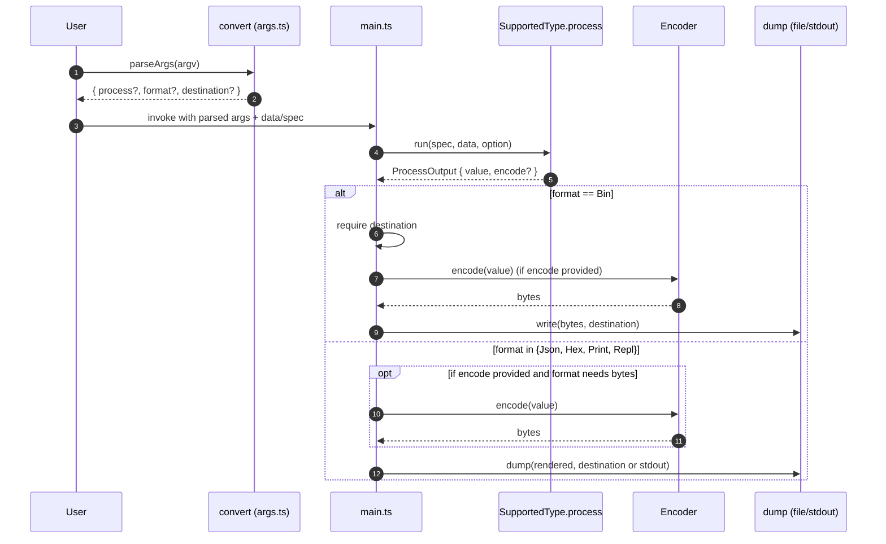

# Convert STF data to fuzz protocol format

## Pull Request by @tomusdrw

My plan is to reproduce jam-conformance perf vectors, so I want to:
1. Take all `traces` (`fallback`, `safrole`, `storage`, etc) and convert them to fuzz messages.
2. Write a simple fuzzer (even simpler than `minifuzz.py`) in TS that takes these messages and just pipes them to the IPC, measuring time required to import blocks.
3. Produce reports in `typeberry-testing` repository. 
4. Collect reports over time and graph our performance.

This PR introduces couple of features to `@typeberry/convert`:
1. Produce binary output `to-bin` output.
2. Dumping to a file instead of std output (`destination`).
3. New processing options for `stf-*` to treat them as fuzz messages.


## Comment by @coderabbitai[bot]

<!-- This is an auto-generated comment: summarize by coderabbit.ai -->
<!-- This is an auto-generated comment: skip review by coderabbit.ai -->

> [!IMPORTANT]
> ## Review skipped
> 
> Auto incremental reviews are disabled on this repository.
> 
> Please check the settings in the CodeRabbit UI or the `.coderabbit.yaml` file in this repository. To trigger a single review, invoke the `@coderabbitai review` command.
> 
> You can disable this status message by setting the `reviews.review_status` to `false` in the CodeRabbit configuration file.

<!-- end of auto-generated comment: skip review by coderabbit.ai -->

<!-- walkthrough_start -->

<details>
<summary>📝 Walkthrough</summary>

<!-- This is an auto-generated comment: release notes by coderabbit.ai -->

## Summary by CodeRabbit

- New Features
  - Added optional output destination to write results to a file.
  - Introduced binary output mode for writing raw bytes to a destination.
  - Unified dumping so JSON/hex/print can also be written to files.
  - Added “as-fuzz-message” processing options producing encodable messages.

- Bug Fixes
  - Clearer errors for invalid format/destination combinations, unsupported dump targets, and missing destinations.
  - Improved CLI syntax validation and error messages.

- Tests
  - Comprehensive tests covering destination handling, output modes, processing interactions, and error scenarios.

<!-- end of auto-generated comment: release notes by coderabbit.ai -->
## Walkthrough
Adds destination-aware output to the convert CLI, introduces a to-bin output format, centralizes dumping to files/stdout, and updates processing to return typed values with optional encoders. Tests cover destination parsing, error cases, and hex/bin behaviors. Types gain ProcessOutput, and several processors add as-fuzz-message handling.

## Changes
| Cohort / File(s) | Summary |
|---|---|
| **Tests: destination and syntax cases**<br>`bin/convert/args.test.ts` | Adds tests for destination across formats, error cases for unsupported/missing destinations, extended syntax error scenarios, and hex output with destination. |
| **CLI args parsing and output modes**<br>`bin/convert/args.ts` | Adds destination parsing and validation; introduces `OutputFormat.Bin` ("to-bin"); enforces dump rules; refactors to return `{ process, format, destination }`. |
| **Main output handling and processing**<br>`bin/convert/main.ts` | Centralizes output via dump helper to file or stdout; adds Bin handling with required destination and encoding; adjusts processOutput to return processed value and updated type metadata. |
| **Types and processing outputs**<br>`bin/convert/types.ts` | Introduces `ProcessOutput<T>` and `looseType`; updates `SupportedType.process.run` to return `ProcessOutput`; adds as-fuzz-message options with encoding via messageCodec; standardizes encoded/hash outputs. |

## Sequence Diagram(s)


## Estimated code review effort
🎯 4 (Complex) | ⏱️ ~60 minutes

## Possibly related PRs
- FluffyLabs/typeberry#454 — Earlier CLI module changes to args.ts/main.ts/types.ts; closely related to current destination and format handling.
- FluffyLabs/typeberry#495 — Modifies OutputFormat and argument parsing paths in args.ts; overlaps with to-bin and destination parsing.
- FluffyLabs/typeberry#634 — Adds fuzz-message support in types.ts; aligns with new as-fuzz-message processing and messageCodec usage.

## Suggested reviewers
- skoszuta
- mateuszsikora
- DrEverr

## Poem
> A rabbit taps the CLI, quick and spry,  
> Packs bytes to bin, lets hexes fly.  
> A path to dump, a file to find,  
> Processed names neatly redefined.  
> With fuzzing notes and tidy streams—  
> I burrow through your data dreams. 🐇✨

</details>

<!-- walkthrough_end -->

<!-- pre_merge_checks_walkthrough_start -->

## Pre-merge checks and finishing touches
<details>
<summary>✅ Passed checks (3 passed)</summary>

|     Check name     | Status   | Explanation                                                                                                                                                                                                                                                                         |
| :----------------: | :------- | :---------------------------------------------------------------------------------------------------------------------------------------------------------------------------------------------------------------------------------------------------------------------------------- |
|     Title Check    | ✅ Passed | The title succinctly describes the core feature of converting STF data into a fuzz protocol format, which aligns with the primary change of adding new processing options for STF traces and binary output support; it is concise and clearly communicates the main goal of the PR. |
|  Description Check | ✅ Passed | The description clearly outlines the motivation, overall plan, and specific features added—binary output, file dumping, and fuzz-message processing for STF traces—which directly correspond to the changes implemented in the code.                                                |
| Docstring Coverage | ✅ Passed | No functions found in the changes. Docstring coverage check skipped.                                                                                                                                                                                                                |

</details>

<!-- pre_merge_checks_walkthrough_end -->

<!-- tips_start -->

---


<sub>Comment `@coderabbitai help` to get the list of available commands and usage tips.</sub>

<!-- tips_end -->

<!-- internal state start -->


<!-- DwQgtGAEAqAWCWBnSTIEMB26CuAXA9mAOYCmGJATmriQCaQDG+Ats2bgFyQAOFk+AIwBWJBrngA3EsgEBPRvlqU0AgfFwA6NPEgQAfACgjoCEYDEZyAAUASpETZWaCrKPR1AGxJcAwvgxSFLiQAMrQAGKQtNRokASQAGbYAF7JPBT4BEweifgUzNSQkAYAco4ClFwAbFUArEUGAKo2ADJcsLi43IgcAPS9ROqw2AIaTMy94R7YCQmyLSqIvbiy3CQVFC693NgeHr019cWNiJVxLNiItBQA7g0h+NgUDCSQAlQYDLBcuLRgTAFKLgwElUg1oM5SMF3pgvlwCvAsMUQrhqJcuPg1kiDDYSBJ4CQbpQepAABQYfyvDxIGi0ACUDQWFQ8JPJlMg1MQtIZxR8FBI1Do6E4kAATAAGUW1MDigCcYCl0AAjEqOKKACwcJXqgBaRgAItIGBR4NxxP4OAYoABxfBoDxcfm8RTYF6QIRoZj/fwJPIFT6vNYUX35WGvKRiPIyeQAwLiDBEUIROJUF7IRHxUFpNiIRBoUjITD0NhoBwmhMoZjcPLBIMh/0vDRW6weTCWopKjSQPyAoLoPaQAAGuFT0kHZJIGiIGgANEOEvaPAI0AwANaDueDvMJDJeDdDrl5fMkfckXAMDQMzMpbPSPMFptFUVdgCSVa8bAwwViiHg79e0CrCQITGqawRZpQZK/v+fC4LAmBDswiLwFmGjcLIg5XvBtamtIcSwNIrw5veeHxHBrwvlYPjoBgxYCmWpF/q8/IAI7YPA/L0PEf7Vn2AgePga6II+kAAMxdlYGS0K6zEkLxuDplg5FDisawbC4YA0FyiJEOOTr4L+BAuCJ6pdn4eyiME+lBMg+CBHETE0fQRBUNwsA8JQ9Zhk2UA+PBCZ4RmUkyVx+BDgAAqp6yUFssZAoO7aQJ2kAAIK0PQagYM48iPF0eD8Ga8D+GSw6EJlmEic+oTYNw8lRI43A6fweA7ME8SxAk8BeJA+KxLEg5KNpWXmhg46YiNZKIlyAr0PgCT2L8uV0iJ4mpelkDkHczppr+FbjUVGDICGB64AkYAAFTjmR/KFGEkQjiueGlokN6QMRx7CUY+jGOAUBkLN81oHghCkOQVC0gorDsFwvD8MIlmSHhcgKEoVCqOoWg6N9JhQHAqCoAhQMEMQZDKBD4yfiKVB3A4TguG8MaKMo6OaNouhgIYP2mAYmW9HFQS9JCwlaZoCmWgARJLBgWKlL4k2Dgr0LTBT03NjD+QWX1rbQyAi0deRRNI8bUAdkD+bQ1IViuGS5m9uziNw3W5a1b1M4gc6Igw0y0E1XKCmA0lVk5ZszZB3DULAwmQC+X7BWmhsLvbKUUEQuthZ73uvLEg3GyNXAYLsOSdSQHi0F2aU63ERvIBI9rwNE8aJuHFC7YmavbXeBUTTcQyG0NJv+HOBEAB7NXlwQ93Bfe5wdc5Fj1zhFZckAxQbDClnhNwEVgOeIgPWCoJcQqe3k/JiB48iksTmWQJPsC5dPe8jXOxNOjkd+P8Ns/nGAvAZrfvdd5f0HsHDuuYmofyAfvZakAACiw8aC0WQIgWQX40Cj1XrBI2DN0C1X+k1BCJAEFUHQCnRw7BzgpngEQUgfAEKABwCRo5Bh5rDEEKCmRZAC4BPYF4WUTT4HLulXW1cV6HSeE1TB+s+BIWHk1bAYjao1iFM7fKXkFIAKnmA1uwdjqIlrtSJWqDUTD0EZXPWCgMCdXyE1KBE1UD8kQKwiGx0R4/1cSo78tFch8HXqcZAW9KCvFsabS4x4UCKX0fXbxjAgTaCwGoz6RhpaWBSh4Gg4MDpp3wkE0QrYMn+FsvNIh8llF8B2PxeADBRHiHENIIwJRKRGFgdpAo5MmaQH5PiQkK9Zg1i4AAWToPARwBhJbiy+tzXm/NcCCxTsLHooypYyxSnLUGZMhTK2yvweaXxMCa2bDHEcLp47BOKg4RRfZjoeLnulAhG1un7X8PaT++8eDOE9GeSC89nThyICbCs6h8IZGwEQdyylITkK/G8luTUEgCRuF2OArwOFeNCaQDa+A7grheGaQsWBHlZRyB4kEXUs5kMpsHZSTAlBvKnuvLA/JcBPCwLECkGAwAFwHKcllAkEy/hpVonRfpqA+TgQg/6yAADyLU8DhGFRPXurLukACFEQLxNJgTx9AaoNzws3bR8Qz74CIBgeAyQs5ePNt1a+arnqxEibNGV4F5WioroWe5dwCIeCDJQh1gp6pB1RCnM8JI4IZBuC+BI+oGoNNwCEGqJTaBzjICGBgTU4KFEDo1Cs7VEikvCRi78exMVCmOi8IIcTvGtOQKSSSGZei4kdgyeeGbgiqoZSQNiHEnovImp1bqASsBH3oHfB+2cjZPwOqK2BGB/Lx31SQZOqdEjwsoeMVqFr6CMuZb202g70h2XrnQOeXj4h+poJDTK+9Clki0XOYlai5zcoZLahaFBXRMs4nOZg9t4BgBhJ8dyAlBgMESlASNB6dr3qdSCeVJ76DctIVnAczp8RKCTYbE0UgpGtLnOeoUd7g7crnJAhq9gE01nVqIVcn0ijgfmrgG4YVm4fPSYWfkB60PHvIxc9RpJCNqIZAbUkj7d3+AZOMK9I13aYckOmgib0kDaP0dgJ6DAmAUB9gmC+oDPJ+hsWRr41HaO6GjvNfwOn2QsbYOkgtqGj0YZ9kNIg7FEAERkGeIkZB0CQbvE1AlwcEIPvlQAbhQAEOuxYkBfHwJUvCsgCSlx817AU/I+CYNFbiBckYW7hfSYSl6nwJpZRzDo1d8Qj6QChJJQSd45WhlwClWihp+4TVJFNGgaAAbZPSHiJeyBqsZB2k12g0rx50jntSE1TVrOfL4FaghXjt0UCwG5tAaxKEZ2wDS7lTYknJNSmksmmTKHKSUF7d50ntkrxYUo2aZSRjUiqewdQBJEBawrqWxLtAuADQncAjAXAuTlkTAAHw2oXK6YUopDiXZChS441WDimf4OMszU4aAR82T79Ba4aq/L99tkAAC8kBxY2owOLKHojHBDjG61errTEdYGR4iPmqOgTo/mYOZsjRuC6voEkIrptfwmrRPyX7C6l2IHHBSO4y3Dqw/JewGX+FChbZpX91rB1xz8c6f1nTSFwEJjpM2UkDT+DkQexUqpKUrAvnsNQ4aTw8K7ICvQa2BlkDFLu9U170hTcGGaeIVp7D2n6+6SQXpQQuAAAlqGwEWeMq0ky2fTN6AiDAmOFljIOys+W6ylaOBVjlHZGs6kHNjscntWaQ7esgmqrN9P8qGtyq8DxK8hiQVzYh/t7fYJhQBIgfA3VlynFmiyuZGhduQEba2E53axAWOH14DQiJfSMEXP4wBDVSQaH3wyY6davxzlj0Q+DkAABSw/8VOs+lAN1N3HaVMBQtisx1m+4EZyK9tYHIAADVItBRvdPhFBfYKM+x54yAGJ3Ve981UB7N0Mwsw1MVbJ4ltBph+QRIoAZ1qU8IG4+ovEbgTQtIetqYGZSDeoeta8hcxAp1sdaAhBLh1E59g5r9io39ExW88BXgUCQUwUFNNoA1uA68fUOsZprsfYz5ggh8R928nVRUY5fNcxP85w3cCwet10eCt1pB7Y/8UQ8hSIFMHF7Zrsoo0Ihs7wNB30MA98D9wsfMBJ14cg8d4AVAvAX5t4OkzxmVkAtE6ANAVNXhxCutrs9F8BVwmobD0A/lERsDIA+ddVdZjCfCVshQYcbMusYhEo6NZ8yAPlkjeCgJNtPhM4etBVyQPkuBxZgA8hqE94PA9BSRgAtE9A6RxZloDAihciQgQ1RE8DTsFMyABigjEgMhmByjLDcx0igJRVJVAhFwLEjki5V05dCtyAWQx4XY+DQUfNW5upa9w44Ibg0B5B54dVgDJjatpi/gMizwsjURKF+Q4VLIeADJgRBVhiwCrYvESsdI9tzAUkjt8lFcyIFNzs8lr1rsfcghSkeBHtKk/dal3tmwGlyAmkWlFYUZZIuk7go8QwRRBkfYRlc8U8wAjAUdewZkop5kJYlkUlVlSZwYNli8tk1Z1CK9wMq9pIXgPcPVrApjEBP9gBoA9A4hij55YgvUfUBIDISBAINt4hiD1sti8Bt8p4gtConkcgvjUZk0soKkKw/ZaJnAfZzV6BdSCFeVU4j0fMgjRUrAESqkYcITLtTYOSuB41eM6AFTJwtFrD5EMV5dUjFcasdphT5FVw5cMAxSQjutIzozRV6t7A8RlAchBUrViQ5wFcF5pgnoONlS8FtVtFZTThfS1COcggZt9dHhEAdMpDXiFdFJ4hBARAxB1T3JRj54CVnldTXhi5S579tYhQhDykntKx5I8UuIgIslzk6osw3o7wwlOCuAY5Xs65zU5xBlcxjxyzFydzSA/BzstylzSB9QYgL9Y8UoQhY8AB9EIF8HUWBShOcyjLMMAd6dFS0n4+geCNzf45seBcOWiAjQU/zLUxXY6H9NJU0bqGEiGGkqCVEGgOcLkM6NZX8GTNCsACMIyZNc8S8HBLrLTRMUsEEG8D8089vCCqcicj8F7CsDTBxasWiJqTgyhZ0Hk14bckic8x4j+dbH5DVC9b8xMfdViVTaaMuBg9DM2IsS2RMYDRE46Mi98z84I1bVMqgHIaIo4yOP/VSii9S6JbCjC1AY0AUUgjqV6Nc8QDcoiKi4OJslABVKedSo80QeIwy1ISig8/sg2bCv2C9eebC3Cg2Qs5AdSmtN8eSZVJw1cOcWytw6kc1F9L8MKWIHi48Pin8EcD9F3DRdyJi6QFiki/opmFuUVQAgxLuU2FNPIF4SmH4WAcNfk2BTYA2XRCLGqrRcCuxHlHINAWYSyUC645BBGApUVfpREAKvKsQJ4Z5DkrJaAgqxY0FUsAiR1ceGtP89zZtAs1yNYEdXuZSUSt5WQASUI8SztSS2ke9K3HuU4bwz9cgD3Pw1sNVIIxJQEw7dJKEsEnJC7EEm9eCuEscxEl7ZErWeC8UjbMMu8YU0UknSAAAby6NzNUy4GgBC3Rr7IAH4uBcCmYRS9AcaABfHGrkp/SjGHL0xNPcj09GqALRLgNG7o7oglEkG6WgCzeQYHHSAAbQAF0cb2aigbCuBSRHFRBfB4JEQQhWEn1sjIAEzMUMB70IKgcRwdIGRicxT4aVCnVgBVabgYzRbuiKbASMSQ8sSBiI88To8RR49QUk8JlOYcZRFusiYQYmTbaWAmqOk0AaZWT6ZkY8C0Y1BWYsYOYDAPaKZ1Bbz65EBbz7a6Bby/Y+xvpY7foko6BZRxRaAGBaBZQBAqhRQSBZQqgBBJQagSBRQlQEhagGAy6AAOEgWoNAFugu9UBgcUKPdmd2nO+O3AROnWFOvrQkNO/6Ae7OiAXrW8tgYNW8ozISdOoNYILOtmsnJAWwOKwSVcOgPwKGL8Kwd4ugcWLgBcFkEgGcdG8WNzR4UuPetcWwC+xIe0U4W+oocWJAeYmKeuJQSnS+j+m+u+n2WgGweRfUQSFEEHRAPyajN+vK0B7+8ByBjAdwXALwBBtcJB99FBsnNBqBo0E0CCnB1cPB1TL+snS2A+2gF8XMSS2Bt+yWah8WVsLkch3EBwNJRAN+gW9GooLe9m8WFe1cEoD5FhzB7qch8WahkRoKy4ShghkR4pVsAHKRhTGpbqBwdTT2LB+QQaUCCoQohQDjBISygq9kysxuJMSIAgvLDKl6MEZ0LIEfKtagEjBAL4fsJ3DsyYv8LZDk67YipqUcsCvaGi6JO6FMR6Wiq9VWJ1HjeSMLQFcy/wNNJ6+eFLZwHTCmeRSpS45STPKrO0IlBjBTWwDQORwR7o8WBxEfPAA6Fhi3JapDe5HaLZXaN0ZSbRrOdTBamgHTZ4rwdsnrEpnYCgasLJrxRAJgDbNWZSHYAcCSo2ap+Rup5gJmFhk4lbHSGpsWsnI1SxahF3N+q+z+2p7+uowYQlchiRtgFhvp8ZdmsmjZ4RupsRh5kgFhlrUCCC7sAiXBjZ7+xRvhn4fBkFsnNRzAfeTRnJOZ0hiaHJigSzPAS2IwoiTISQfee9BYlDdRi/aWtNTqKpCx8XJ6dKOgQAFAIEmconU5w+9hCdIL81LHLer38DYYmHo0xqWt5Kl3IGzz5GZNgSr/BQpNDy90x/xKZj4lIFM8D1mrmjnpBGmRoWmMq6DioJLu03rqCSGwJTZ7ES48RNVg4HBZgX92B6z7jSUJX5FUZjSuIFM5nMR28KnkUpWlXDnxYtmlAdnnBTUEwDmxb6nRAfRTn+RzmQGoXxYbmGj7nJHqijGkXmnam3namPnv6vmk2ydoGGB+aKw/AFjSAQ2FHkKlGIWqHlXxYYWNHqiLdaCrtfQHWHCqUvXIB83C3EwmAS3PXqN7BIiizvXQ2/Wfnqjdmg2iAy26n427mgXxHc3xYeaC3ta+UXmLb0aha2GOHcBbA/nU3/AWGAB2NAbu49gQWgKUWUWoFu0SZulupQcUFutASunuugBgFuhu9UUUT98UBgDUY9i9qoBgAQWoKoEgFul9pUUUR92oWocUW9outAEN9h0sPdmwaR8dsnRD0SUSSD0SY9su87F9kDsD9UBIdeSj2UEgKodUCoWoWgdULIqDzu0SDUPu0SZcdugQUUBIeu0uiUAQJUFu498ZMmrmZm/kBeygUgZehd5O6e/QIAA== -->

<!-- internal state end -->


## Comment by @github-actions[bot]


<details>
<summary>View all</summary>

| File | Benchmark | Ops |  |
|------|-----------|-----|--|
| [bytes/hex-to.ts[0]](../blob/68ca862bc14fb1dcc505899e513bc2a7121c943b//_work/typeberry-1/typeberry/typeberry/benchmarks/bytes/hex-to.ts) | number toString + padding | 323130.1 ±0.44% | fastest ✅ |
| [bytes/hex-to.ts[1]](../blob/68ca862bc14fb1dcc505899e513bc2a7121c943b//_work/typeberry-1/typeberry/typeberry/benchmarks/bytes/hex-to.ts) | manual | 16270.85 ±0.3% | 94.96% slower |
| [math/count-bits-u32.ts[0]](../blob/68ca862bc14fb1dcc505899e513bc2a7121c943b//_work/typeberry-1/typeberry/typeberry/benchmarks/math/count-bits-u32.ts) | standard method | 72341819.49 ±1.83% | 69.67% slower |
| [math/count-bits-u32.ts[1]](../blob/68ca862bc14fb1dcc505899e513bc2a7121c943b//_work/typeberry-1/typeberry/typeberry/benchmarks/math/count-bits-u32.ts) | magic | 238526361.98 ±6.05% | fastest ✅ |
| [math/mul_overflow.ts[0]](../blob/68ca862bc14fb1dcc505899e513bc2a7121c943b//_work/typeberry-1/typeberry/typeberry/benchmarks/math/mul_overflow.ts) | multiply and bring back to u32 | 255930316.51 ±6.55% | 4.39% slower |
| [math/mul_overflow.ts[1]](../blob/68ca862bc14fb1dcc505899e513bc2a7121c943b//_work/typeberry-1/typeberry/typeberry/benchmarks/math/mul_overflow.ts) | multiply and take modulus | 267671578.96 ±4.65% | fastest ✅ |
| [hash/index.ts[0]](../blob/68ca862bc14fb1dcc505899e513bc2a7121c943b//_work/typeberry-1/typeberry/typeberry/benchmarks/hash/index.ts) | hash with numeric representation | 185.15 ±0.43% | 28.8% slower |
| [hash/index.ts[1]](../blob/68ca862bc14fb1dcc505899e513bc2a7121c943b//_work/typeberry-1/typeberry/typeberry/benchmarks/hash/index.ts) | hash with string representation | 115.91 ±0.39% | 55.43% slower |
| [hash/index.ts[2]](../blob/68ca862bc14fb1dcc505899e513bc2a7121c943b//_work/typeberry-1/typeberry/typeberry/benchmarks/hash/index.ts) | hash with symbol representation | 182.98 ±0.28% | 29.63% slower |
| [hash/index.ts[3]](../blob/68ca862bc14fb1dcc505899e513bc2a7121c943b//_work/typeberry-1/typeberry/typeberry/benchmarks/hash/index.ts) | hash with uint8 representation | 164.29 ±0.18% | 36.82% slower |
| [hash/index.ts[4]](../blob/68ca862bc14fb1dcc505899e513bc2a7121c943b//_work/typeberry-1/typeberry/typeberry/benchmarks/hash/index.ts) | hash with packed representation | 260.04 ±0.45% | fastest ✅ |
| [hash/index.ts[5]](../blob/68ca862bc14fb1dcc505899e513bc2a7121c943b//_work/typeberry-1/typeberry/typeberry/benchmarks/hash/index.ts) | hash with bigint representation | 188.83 ±0.81% | 27.38% slower |
| [hash/index.ts[6]](../blob/68ca862bc14fb1dcc505899e513bc2a7121c943b//_work/typeberry-1/typeberry/typeberry/benchmarks/hash/index.ts) | hash with uint32 representation | 199.43 ±0.31% | 23.31% slower |
| [math/add_one_overflow.ts[0]](../blob/68ca862bc14fb1dcc505899e513bc2a7121c943b//_work/typeberry-1/typeberry/typeberry/benchmarks/math/add_one_overflow.ts) | add and take modulus | 261874332.06 ±4.91% | fastest ✅ |
| [math/add_one_overflow.ts[1]](../blob/68ca862bc14fb1dcc505899e513bc2a7121c943b//_work/typeberry-1/typeberry/typeberry/benchmarks/math/add_one_overflow.ts) | condition before calculation | 246886202.05 ±6.75% | 5.72% slower |
| [math/count-bits-u64.ts[0]](../blob/68ca862bc14fb1dcc505899e513bc2a7121c943b//_work/typeberry-1/typeberry/typeberry/benchmarks/math/count-bits-u64.ts) | standard method | 1577869.92 ±0.31% | 87.25% slower |
| [math/count-bits-u64.ts[1]](../blob/68ca862bc14fb1dcc505899e513bc2a7121c943b//_work/typeberry-1/typeberry/typeberry/benchmarks/math/count-bits-u64.ts) | magic | 12370961.26 ±0.41% | fastest ✅ |
| [collections/map-set.ts[0]](../blob/68ca862bc14fb1dcc505899e513bc2a7121c943b//_work/typeberry-1/typeberry/typeberry/benchmarks/collections/map-set.ts) | 2 gets + conditional set | 121383.93 ±0.08% | fastest ✅ |
| [collections/map-set.ts[1]](../blob/68ca862bc14fb1dcc505899e513bc2a7121c943b//_work/typeberry-1/typeberry/typeberry/benchmarks/collections/map-set.ts) | 1 get 1 set | 61719.86 ±0.03% | 49.15% slower |
| [codec/bigint.decode.ts[0]](../blob/68ca862bc14fb1dcc505899e513bc2a7121c943b//_work/typeberry-1/typeberry/typeberry/benchmarks/codec/bigint.decode.ts) | decode custom | 177018676.97 ±2.43% | fastest ✅ |
| [codec/bigint.decode.ts[1]](../blob/68ca862bc14fb1dcc505899e513bc2a7121c943b//_work/typeberry-1/typeberry/typeberry/benchmarks/codec/bigint.decode.ts) | decode bigint | 105644001.64 ±2.96% | 40.32% slower |
| [codec/bigint.compare.ts[0]](../blob/68ca862bc14fb1dcc505899e513bc2a7121c943b//_work/typeberry-1/typeberry/typeberry/benchmarks/codec/bigint.compare.ts) | compare custom | 259456960.28 ±6.44% | fastest ✅ |
| [codec/bigint.compare.ts[1]](../blob/68ca862bc14fb1dcc505899e513bc2a7121c943b//_work/typeberry-1/typeberry/typeberry/benchmarks/codec/bigint.compare.ts) | compare bigint | 249734591.09 ±6.89% | 3.75% slower |
| [bytes/hex-from.ts[0]](../blob/68ca862bc14fb1dcc505899e513bc2a7121c943b//_work/typeberry-1/typeberry/typeberry/benchmarks/bytes/hex-from.ts) | parse hex using `Number` with NaN checking | 143283.43 ±0.07% | 84.12% slower |
| [bytes/hex-from.ts[1]](../blob/68ca862bc14fb1dcc505899e513bc2a7121c943b//_work/typeberry-1/typeberry/typeberry/benchmarks/bytes/hex-from.ts) | parse hex from char codes | 902214.56 ±0.08% | fastest ✅ |
| [bytes/hex-from.ts[2]](../blob/68ca862bc14fb1dcc505899e513bc2a7121c943b//_work/typeberry-1/typeberry/typeberry/benchmarks/bytes/hex-from.ts) | parse hex from string nibbles | 564081.35 ±0.26% | 37.48% slower |
| [math/switch.ts[0]](../blob/68ca862bc14fb1dcc505899e513bc2a7121c943b//_work/typeberry-1/typeberry/typeberry/benchmarks/math/switch.ts) | switch | 269075116.37 ±4.63% | fastest ✅ |
| [math/switch.ts[1]](../blob/68ca862bc14fb1dcc505899e513bc2a7121c943b//_work/typeberry-1/typeberry/typeberry/benchmarks/math/switch.ts) | if | 260610658.51 ±5.96% | 3.15% slower |
| [logger/index.ts[0]](../blob/68ca862bc14fb1dcc505899e513bc2a7121c943b//_work/typeberry-1/typeberry/typeberry/benchmarks/logger/index.ts) | console.log with string concat | 7385911.48 ±60.48% | fastest ✅ |
| [logger/index.ts[1]](../blob/68ca862bc14fb1dcc505899e513bc2a7121c943b//_work/typeberry-1/typeberry/typeberry/benchmarks/logger/index.ts) | console.log with args | 1072361.27 ±100.65% | 85.48% slower |
| [codec/decoding.ts[0]](../blob/68ca862bc14fb1dcc505899e513bc2a7121c943b//_work/typeberry-1/typeberry/typeberry/benchmarks/codec/decoding.ts) | manual decode | 15873426.1 ±11.96% | 90.63% slower |
| [codec/decoding.ts[1]](../blob/68ca862bc14fb1dcc505899e513bc2a7121c943b//_work/typeberry-1/typeberry/typeberry/benchmarks/codec/decoding.ts) | int32array decode | 168900974.31 ±2.93% | 0.26% slower |
| [codec/decoding.ts[2]](../blob/68ca862bc14fb1dcc505899e513bc2a7121c943b//_work/typeberry-1/typeberry/typeberry/benchmarks/codec/decoding.ts) | dataview decode | 169335337.56 ±2.99% | fastest ✅ |
| [codec/encoding.ts[0]](../blob/68ca862bc14fb1dcc505899e513bc2a7121c943b//_work/typeberry-1/typeberry/typeberry/benchmarks/codec/encoding.ts) | manual encode | 2459174.26 ±1.63% | 20.05% slower |
| [codec/encoding.ts[1]](../blob/68ca862bc14fb1dcc505899e513bc2a7121c943b//_work/typeberry-1/typeberry/typeberry/benchmarks/codec/encoding.ts) | int32array encode | 2701195.74 ±1.38% | 12.18% slower |
| [codec/encoding.ts[2]](../blob/68ca862bc14fb1dcc505899e513bc2a7121c943b//_work/typeberry-1/typeberry/typeberry/benchmarks/codec/encoding.ts) | dataview encode | 3075906.71 ±0.79% | fastest ✅ |
| [codec/view_vs_collection.ts[0]](../blob/68ca862bc14fb1dcc505899e513bc2a7121c943b//_work/typeberry-1/typeberry/typeberry/benchmarks/codec/view_vs_collection.ts) | Get first element from Decoded | 26663.14 ±1.95% | 62.48% slower |
| [codec/view_vs_collection.ts[1]](../blob/68ca862bc14fb1dcc505899e513bc2a7121c943b//_work/typeberry-1/typeberry/typeberry/benchmarks/codec/view_vs_collection.ts) | Get first element from View | 71073.15 ±0.27% | fastest ✅ |
| [codec/view_vs_collection.ts[2]](../blob/68ca862bc14fb1dcc505899e513bc2a7121c943b//_work/typeberry-1/typeberry/typeberry/benchmarks/codec/view_vs_collection.ts) | Get 50th element from Decoded | 31643.92 ±0.16% | 55.48% slower |
| [codec/view_vs_collection.ts[3]](../blob/68ca862bc14fb1dcc505899e513bc2a7121c943b//_work/typeberry-1/typeberry/typeberry/benchmarks/codec/view_vs_collection.ts) | Get 50th element from View | 37751.19 ±0.8% | 46.88% slower |
| [codec/view_vs_collection.ts[4]](../blob/68ca862bc14fb1dcc505899e513bc2a7121c943b//_work/typeberry-1/typeberry/typeberry/benchmarks/codec/view_vs_collection.ts) | Get last element from Decoded | 31285.78 ±0.26% | 55.98% slower |
| [codec/view_vs_collection.ts[5]](../blob/68ca862bc14fb1dcc505899e513bc2a7121c943b//_work/typeberry-1/typeberry/typeberry/benchmarks/codec/view_vs_collection.ts) | Get last element from View | 26842.4 ±0.32% | 62.23% slower |
| [codec/view_vs_object.ts[0]](../blob/68ca862bc14fb1dcc505899e513bc2a7121c943b//_work/typeberry-1/typeberry/typeberry/benchmarks/codec/view_vs_object.ts) | Get the first field from Decoded | 499876.69 ±0.65% | 1.88% slower |
| [codec/view_vs_object.ts[1]](../blob/68ca862bc14fb1dcc505899e513bc2a7121c943b//_work/typeberry-1/typeberry/typeberry/benchmarks/codec/view_vs_object.ts) | Get the first field from View | 105843.41 ±0.12% | 79.22% slower |
| [codec/view_vs_object.ts[2]](../blob/68ca862bc14fb1dcc505899e513bc2a7121c943b//_work/typeberry-1/typeberry/typeberry/benchmarks/codec/view_vs_object.ts) | Get the first field as view from View | 106244.13 ±0.11% | 79.15% slower |
| [codec/view_vs_object.ts[3]](../blob/68ca862bc14fb1dcc505899e513bc2a7121c943b//_work/typeberry-1/typeberry/typeberry/benchmarks/codec/view_vs_object.ts) | Get two fields from Decoded | 505545.91 ±0.28% | 0.77% slower |
| [codec/view_vs_object.ts[4]](../blob/68ca862bc14fb1dcc505899e513bc2a7121c943b//_work/typeberry-1/typeberry/typeberry/benchmarks/codec/view_vs_object.ts) | Get two fields from View | 84927.29 ±0.12% | 83.33% slower |
| [codec/view_vs_object.ts[5]](../blob/68ca862bc14fb1dcc505899e513bc2a7121c943b//_work/typeberry-1/typeberry/typeberry/benchmarks/codec/view_vs_object.ts) | Get two fields from materialized from View | 178503.53 ±0.17% | 64.96% slower |
| [codec/view_vs_object.ts[6]](../blob/68ca862bc14fb1dcc505899e513bc2a7121c943b//_work/typeberry-1/typeberry/typeberry/benchmarks/codec/view_vs_object.ts) | Get two fields as views from View | 84715.07 ±0.12% | 83.37% slower |
| [codec/view_vs_object.ts[7]](../blob/68ca862bc14fb1dcc505899e513bc2a7121c943b//_work/typeberry-1/typeberry/typeberry/benchmarks/codec/view_vs_object.ts) | Get only third field from Decoded | 509467.43 ±0.29% | fastest ✅ |
| [codec/view_vs_object.ts[8]](../blob/68ca862bc14fb1dcc505899e513bc2a7121c943b//_work/typeberry-1/typeberry/typeberry/benchmarks/codec/view_vs_object.ts) | Get only third field from View | 105351.32 ±0.11% | 79.32% slower |
| [codec/view_vs_object.ts[9]](../blob/68ca862bc14fb1dcc505899e513bc2a7121c943b//_work/typeberry-1/typeberry/typeberry/benchmarks/codec/view_vs_object.ts) | Get only third field as view from View | 105249.98 ±0.11% | 79.34% slower |
| [collections/map_vs_sorted.ts[0]](../blob/68ca862bc14fb1dcc505899e513bc2a7121c943b//_work/typeberry-1/typeberry/typeberry/benchmarks/collections/map_vs_sorted.ts) | Map | 279878.71 ±0.61% | fastest ✅ |
| [collections/map_vs_sorted.ts[1]](../blob/68ca862bc14fb1dcc505899e513bc2a7121c943b//_work/typeberry-1/typeberry/typeberry/benchmarks/collections/map_vs_sorted.ts) | Map-array | 103704.85 ±0.03% | 62.95% slower |
| [collections/map_vs_sorted.ts[2]](../blob/68ca862bc14fb1dcc505899e513bc2a7121c943b//_work/typeberry-1/typeberry/typeberry/benchmarks/collections/map_vs_sorted.ts) | Array | 74214.34 ±2.42% | 73.48% slower |
| [collections/map_vs_sorted.ts[3]](../blob/68ca862bc14fb1dcc505899e513bc2a7121c943b//_work/typeberry-1/typeberry/typeberry/benchmarks/collections/map_vs_sorted.ts) | SortedArray | 199720.21 ±0.28% | 28.64% slower |
| [hash/blake2b.ts[0]](../blob/68ca862bc14fb1dcc505899e513bc2a7121c943b//_work/typeberry-1/typeberry/typeberry/benchmarks/hash/blake2b.ts) | hasher with simple allocator | 0.0462 ±0.44% | fastest ✅ |
| [hash/blake2b.ts[1]](../blob/68ca862bc14fb1dcc505899e513bc2a7121c943b//_work/typeberry-1/typeberry/typeberry/benchmarks/hash/blake2b.ts) | hasher with page allocator | 0.046 ±0.4% | 0.43% slower |
| [bytes/compare.ts[0]](../blob/68ca862bc14fb1dcc505899e513bc2a7121c943b//_work/typeberry-1/typeberry/typeberry/benchmarks/bytes/compare.ts) | Comparing Uint32 bytes | 21182.68 ±0.12% | 3.76% slower |
| [bytes/compare.ts[1]](../blob/68ca862bc14fb1dcc505899e513bc2a7121c943b//_work/typeberry-1/typeberry/typeberry/benchmarks/bytes/compare.ts) | Comparing raw bytes | 22009.18 ±0.11% | fastest ✅ |
| [crypto/ed25519.ts[0]](../blob/68ca862bc14fb1dcc505899e513bc2a7121c943b//_work/typeberry-1/typeberry/typeberry/benchmarks/crypto/ed25519.ts) | native crypto | 8.24 ±0.59% | 73.26% slower |
| [crypto/ed25519.ts[1]](../blob/68ca862bc14fb1dcc505899e513bc2a7121c943b//_work/typeberry-1/typeberry/typeberry/benchmarks/crypto/ed25519.ts) | wasm lib | 10.89 ±0.03% | 64.65% slower |
| [crypto/ed25519.ts[2]](../blob/68ca862bc14fb1dcc505899e513bc2a7121c943b//_work/typeberry-1/typeberry/typeberry/benchmarks/crypto/ed25519.ts) | wasm lib batch | 30.81 ±0.42% | fastest ✅ |
</details>


### Benchmarks summary: 63/63 OK ✅

<!-- thollander/actions-comment-pull-request "benchmarks" -->


## Comment by @coderabbitai[bot]

_🛠️ Refactor suggestion_ | _🟠 Major_

**Remove “as” cast; adjust ProcessOutput to avoid unsafe assertions.**
Use Encode<any> in ProcessOutput to eliminate the need for casting.

Apply this diff:

```diff
-export type ProcessOutput<T> = {
-  value: T;
-  encode?: Encode<T>;
-};
-
-function looseType<T>(output: ProcessOutput<T>): ProcessOutput<unknown> {
-  return {
-    value: output.value,
-    encode: output.encode as Encode<unknown>,
-  };
-}
+export type ProcessOutput<T> = {
+  value: T;
+  encode?: Encode<any>;
+};
+
+function looseType<T>(output: ProcessOutput<T>): ProcessOutput<unknown> {
+  return {
+    value: output.value,
+    encode: output.encode,
+  };
+}
```

<!-- suggestion_start -->

<details>
<summary>📝 Committable suggestion</summary>

> ‼️ **IMPORTANT**
> Carefully review the code before committing. Ensure that it accurately replaces the highlighted code, contains no missing lines, and has no issues with indentation. Thoroughly test & benchmark the code to ensure it meets the requirements.

```suggestion
export type ProcessOutput<T> = {
  value: T;
  encode?: Encode<any>;
};

function looseType<T>(output: ProcessOutput<T>): ProcessOutput<unknown> {
  return {
    value: output.value,
    encode: output.encode,
  };
}
```

</details>

<!-- suggestion_end -->

<details>
<summary>🤖 Prompt for AI Agents</summary>

```
In bin/convert/types.ts around lines 24–34, remove the unsafe "as" cast in
looseType by changing ProcessOutput's encode property from Encode<T> to
Encode<any> (i.e., export type ProcessOutput<T> = { value: T; encode?:
Encode<any>; }) so looseType can simply return { value: output.value, encode:
output.encode } without assertions; update looseType accordingly to return
ProcessOutput<unknown>.
```

</details>

<!-- fingerprinting:phantom:medusa:chinchilla -->

<!-- This is an auto-generated comment by CodeRabbit -->
