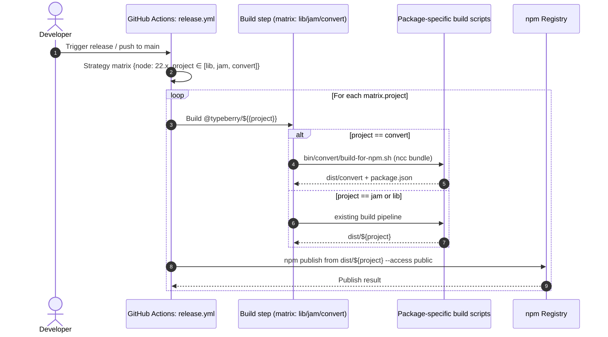
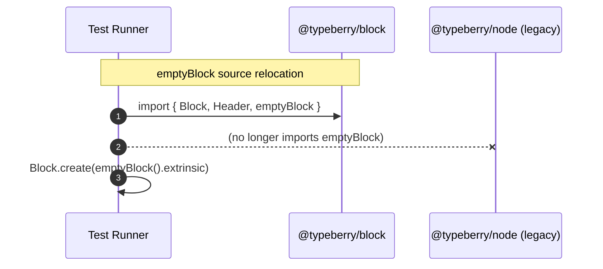

# Build `@typeberry/convert` and restructure top-level directory.

## Pull Request by @tomusdrw

Closes #659 


## Comment by @coderabbitai[bot]

<!-- This is an auto-generated comment: summarize by coderabbit.ai -->
<!-- This is an auto-generated comment: skip review by coderabbit.ai -->

> [!IMPORTANT]
> ## Review skipped
> 
> Auto incremental reviews are disabled on this repository.
> 
> Please check the settings in the CodeRabbit UI or the `.coderabbit.yaml` file in this repository. To trigger a single review, invoke the `@coderabbitai review` command.
> 
> You can disable this status message by setting the `reviews.review_status` to `false` in the CodeRabbit configuration file.

<!-- end of auto-generated comment: skip review by coderabbit.ai -->

<!-- walkthrough_start -->

<details>
<summary>📝 Walkthrough</summary>

<!-- This is an auto-generated comment: release notes by coderabbit.ai -->

## Summary by CodeRabbit

- New Features
  - New @typeberry/convert CLI packaged for npm (single-file build with executable entry).
  - emptyBlock now available from the block module.

- Improvements
  - Publishing and release pipelines now publish multiple packages (lib, jam, convert) via a unified matrix.

- Refactor
  - emptyBlock moved from the node module to the block module (update imports accordingly).

- Documentation
  - Added Packages Directory overview and contribution guidelines.

- Chores
  - Workspace structure reorganized; dependencies cleaned up; package descriptions and build scripts updated.

<!-- end of auto-generated comment: release notes by coderabbit.ai -->
## Walkthrough
This PR generalizes npm publish workflows to a matrix for lib, jam, and convert; removes the dedicated lib publish workflow; adds a build-and-package script for @typeberry/convert; updates JAM build script and metadata; relocates emptyBlock from jam/node to jam/block; adjusts imports; updates workspaces; and adds packages documentation.

## Changes
| Cohort / File(s) | Summary |
|---|---|
| **GitHub Actions: Publish/Release**<br>`.github/workflows/publish-npm.yml`, `.github/workflows/release.yml`, `.github/workflows/publish-typeberry-lib.yml` | Consolidate publishing into a matrix over projects [lib, jam, convert]; rename jobs; parameterize build/publish targets and dist paths; remove the dedicated lib publish workflow. |
| **Convert tool packaging**<br>`bin/convert/build-for-npm.sh`, `bin/convert/package.json`, `bin/convert/types.ts` | Add NCC-based build script producing dist/convert with executable entry and generated package.json; add build script and @typeberry/test-runner dependency; switch imports to @typeberry/test-runner namespace. |
| **JAM CLI packaging**<br>`bin/jam/build-for-npm.sh`, `bin/jam/package.json` | Rework build script to source version/description, adjust paths to packages/workers/*, and generate package.json using DESCRIPTION; simplify package.json build command and update description. |
| **Test runner adjustments**<br>`bin/test-runner/package.json`, `bin/test-runner/state-transition/state-transition.ts` | Remove @typeberry/node dependency; change emptyBlock import to come from @typeberry/block. |
| **Monorepo workspaces and docs**<br>`package.json`, `packages/README.md` | Reorganize workspaces under new paths (bin/ipc2rpc, packages/...); remove legacy workspace entries; add packages directory README. |
| **JAM block API change**<br>`packages/jam/block/block.ts`, `packages/jam/node/common.ts` | Add exported emptyBlock in jam/block and remove its prior implementation/export from jam/node; update imports to use jam/block’s emptyBlock. |
| **JAM config**<br>`packages/jam/config-node/package.json` | Remove dependency `@typeberry/jamnp-s`. |

## Sequence Diagram(s)




## Estimated code review effort
🎯 3 (Moderate) | ⏱️ ~25 minutes

## Possibly related PRs
- FluffyLabs/typeberry#454: Also modifies bin/convert/* (CLI/build/README), overlapping with the new convert packaging.
- FluffyLabs/typeberry#630: Adjusts GitHub Actions publish workflows similarly (job consolidation/renaming).
- FluffyLabs/typeberry#613: Changes release workflow npm publish paths, related to this PR’s matrix-based dist paths.

## Suggested reviewers
- mateuszsikora
- DrEverr

## Poem
> A hop, a skip, I package three—  
> lib, jam, convert, all set free.  
> Matrix dances, scripts align,  
> emptyBlock finds a place divine.  
> With ncc’s glow and tags that sing,  
> I thump the ground—release in spring! 🐇✨

</details>

<!-- walkthrough_end -->

<!-- pre_merge_checks_walkthrough_start -->

## Pre-merge checks and finishing touches
<details>
<summary>❌ Failed checks (1 warning)</summary>

|         Check name         | Status     | Explanation                                                                                                                                                                                                                                                    | Resolution                                                                                                                                                                               |
| :------------------------: | :--------- | :------------------------------------------------------------------------------------------------------------------------------------------------------------------------------------------------------------------------------------------------------------- | :--------------------------------------------------------------------------------------------------------------------------------------------------------------------------------------- |
| Out of Scope Changes Check | ⚠️ Warning | The pull request includes extensive directory restructuring, workflow generalizations for other packages, modifications to jam and test-runner code, and new block implementations that are unrelated to the specific goal of publishing `@typeberry/convert`. | Unrelated changes should be separated into distinct pull requests or deferred until after the convert packaging work is merged to keep the scope focused and facilitate targeted review. |

</details>
<details>
<summary>✅ Passed checks (4 passed)</summary>

|      Check name     | Status   | Explanation                                                                                                                                                                                                                                    |
| :-----------------: | :------- | :--------------------------------------------------------------------------------------------------------------------------------------------------------------------------------------------------------------------------------------------- |
|     Title Check     | ✅ Passed | The pull request title clearly and concisely summarizes the two main changes by highlighting the addition of the convert build and the top-level directory restructure, matching the actual modifications without unnecessary detail or noise. |
| Linked Issues Check | ✅ Passed | The changes implement a build-for-npm script for `@typeberry/convert`, update its package.json, include it in the matrix workflows, and thereby fulfill the objectives to publish the convert package as a standalone NPM tool.                |
|  Description Check  | ✅ Passed | The description “Closes #659” directly references the linked issue and implies the PR’s intent to address publishing `@typeberry/convert`, which is related to the changeset even though it is brief.                                          |
|  Docstring Coverage | ✅ Passed | No functions found in the changes. Docstring coverage check skipped.                                                                                                                                                                           |

</details>

<!-- pre_merge_checks_walkthrough_end -->

<!-- tips_start -->

---


<sub>Comment `@coderabbitai help` to get the list of available commands and usage tips.</sub>

<!-- tips_end -->

<!-- internal state start -->


<!-- DwQgtGAEAqAWCWBnSTIEMB26CuAXA9mAOYCmGJATmriQCaQDG+Ats2bgFyQAOFk+AIwBWJBrngA3EsgEBPRvlqU0AgfFwA6NPEgQAfACgjoCEYDEZyAAUASpETZWaCrKPR1AGxJcAQtnge9AAGAAK4stwkApQuAPRMGFIUuEHoGPQU0rgU2GLYmZAE3GBeUh6QtPCZYvguGpCQBgByjtEUXABsXQ0GAKo2ADJcsLi43IgcsbFE6rDYAhpMzLEAYh7YAGYbsgMqiLHhkW1x3NgeHrFdHT29iJRcBMzYiLQUAO49AMr4+QwkkAIqBgGLAHrQwAJ/IEwAwvJhIIAkwhgzlIuABQJBXGY2iwjU+uGozy4+EiuIMNhIEngJDelAmkGxNGeAC9EPAANa1NAAGkgABEKABRJJ8Rq7aIeekACgw+HIkA8SBotAAlD0AMKZah0dCcSAAJgADPqAKxgQ0ATjApugAEZ9RwACyOjj620ALSMfOkDAo8G44jlXDg/1sjA8+DuyCQDn+Zg6JotkBl+GV6GQACJ1RGo5B44mMyqNOZLAB5YSicRSZAbCgsBXwDDsnUx7DSIwASUQsbzCaTgBQCazzRWIWCQUKHKIxWTxOVJFKFfCQJpWACyHAMUCsw6QY4nESnFDiCXnqTQyDQ9gJ6TQEfl3DQDHZaFIi+Xa/sS/UKGQOQwGBULxICpS8MG4AAPYsoG9GgKGYRsSFiSEAnoS8HyfF9GyISA3lqdkNgjN4AG5+ADeA5WQNgMEDchaA3BooFuf5cFgf4SHApUsIBKFwQ2WowDA5gNFHexfX9NE0G4Xh8EfMdnh1Pi+H3I5p1iIQ0GYIJiwYyBSz4ZDAkgZ4uJY/5EA0/5cIofDCPTccwgPY4Z0VARUilYyMGwoICHwSUkJ4yggiLIx9GMcAoDIeh8A2HACGIMhlDTJYqL1Xh+ArMRJGkAF5CYJQqFUdQtB0UKTCgOBUFQeE0DwQhSHIKgkpYFKuCoD4HCcFwcoUfKVDUTRtF0MBDDC0wDA0GYWPmWIrJs/A3n2U4BBHWABO4ITZGYDwNwzXaDAsSAAEEO3ihrtXoDrsS66LGFgTBSEQELIAAcQSqhFWZbLTJ4HcRNmgj5sgWt60vNlPKA6SRDEZMHJUo8Z3U5g1QIBkznEbgIbrKHcBkeRG2yRRci4y9GT9cCcNmHgscrLgAG0XN5RHeRPShcAAXSgyAKQAthkG+oRBCButmB+5bdzARG3yWlbOYpDHH2yu6KHBPKdQM+gCQoVEKZY9AKlkHn4AYbiUMKFESDRDzsNhw84gAEgAbwdhlqDJjRIcrSAAF8vc53puFobU+dY0WVpwvCuMqaoCC64GRY0WJKkQXA1I0t8E6TlPHed0n4Egj3oZ9zmAGkSBIcZIHYzjPNu0ROTwNJ6Gl3cr3LmQG8kjHqWQWgDY0o2qfwbHIDu9JFRrxsTcMzAm9+sdk7b4t9ssJ7vVhZxqHIjBFp3Y32HUbvbvu6R6N0SAAHU8IBj4ee8IX6wzbcxZEm2nNTkWUZXVcMzfR+58gV+qkABUb4v4ZgMDpAAUoLW+XA46QAzM3UcEsNI/xRogue4CdKrldnndAtBKg0S4GgAhLtsh53dtTaGbxKYSFvG2ZA9N4ACEZhpZmc5WZswgWfPwpsF7cC4MlGeRkA7nV/rwwygD4axGzmQt2Bc0Q+x/lKN454EESPoNARy04GyAmcLIH+NDdaXg2HnHUmtUQqm4Vuf+/CuCzSwmAKOlZajyGwKItM6CM5KhkU7ORFCFHey9so1RmZvHJ3foWIwgpk7wEZDqVWkBMhUhpJXLYtQ9SrjoPARwBhdrgM3GNCasxpr/UIjvZ+q1JxORKMwjQm1tp5L2gdY6p1Eo6kuvo/gMUQTH0euSEgzB8BSA1iHZ66gAAS8wjqZQouHay19Ch3TREg1iwd/hSLiC5Hgj5nyvhRoJeoIYKgkC8GmMpgNyFEFIJkKKWALlvAAPpJwfLgEEjcfqji+kubEjZeR3FGFxdxetc7kyMWOJoigSAaCEMgfU+oNDgWZqxJ8XEfholVuwjApiiD5C4pCpQOsxyCUYLJEgvJGzJ1vOPbCShSRKGBIfECkASUMHgLydWJkQ6bOcswnZGFSC8mEasrl/xM6xG2XxQIlA3wkqtmkWKY4CDNgwEvEsR0PCwU3nMlG30lDr0alvZAN12LcAyTqWoocB773EO2AwspyDRNifE+giTknUg+CQdJyQuBZMqLk/JIUimTTmAIGaV9ymxEyHCO49Sto7WaZYVp9V2kXUcFdeQN1emeTtVAbmFl1ksvWla0cXEBYCHviLVZa1mC1IrSjathzNyQA7NROstBcjZRJrg8mydGokCIHjLA31G3FvLUSllUKwBJDZHKSAtN4WIrZh8hRjCGaQCZgoRInDZblw8ArZASsVZQqbpQMAgT1axFWa3Cu4L/HgScX6KQWBMgbEoGQP4ExrGQA0ZOj4FiLbIB5b4nOPbKFD09j7FA28aAkO6XrUx4EdQuSoHUb9FIY3/HVjev9RlczAdkaC8Dw8i7fvVBRXy8BA40GQNe/h0ZqJLlBlhIC/ClnUBLWs9OicfGEbA4EqDd6SXXogI+T9tHd67qGdWJZZly4bxoDwM9gTVnvynhdGgFdhGmSqAoI80gzXpC4nRzTiA/YeK+iHUxAFygmfLm+Ek7TK2yfvY+rKWBAnOJqF1RqrE+AsXhIhnUXmY7dyXgdEsSbNWJSNW+PVoh92GrmSa8CZrkgWr4M3Pe1ED65uXHKEgTrxAup6v8d1qSvWKUydkgNe1ClgCMGoDAs5t3JH8ihMAika3CVBE08BLSTopv7Wmzqmaemjwep2NthNP163IO1Vi5xRJ+gDACRsLX5ztehF1w5IkAtonVheGAB5PhiVW+wLqUomsbdZrERsShII4zVPjJj9gWNiqVH6SEBJlr/EgWgOhp2VtolMUBeVIQkh/AuMCBgvJ5aze+pkBwmqjLpBleKlmyQhXpH5Xs7KbACTUZMZaw5MAQ6IDO5wZtFISHIBnVvD5SgKfA4Z/A9CeOYWIDlJzJoAP4BECDnFkOgS6ypg+QC5AfIOyfGgI8lYpYBh8kFHYFG4SU6Y80M2zUJAg7xDhBQQtmcKhVBcWhqAGjC2/KwE1rpQmGDGylMysC5MIeUCh7EGH6ndDICccFKA5HuCHwGB2dUgomifEFB8mwgpDp8lXIKDQzB6AvZc0bqV+VOZWEyPSo7XyBD3TfPd9inO3xkAcAUdiog8AqACOoeQwirrskLaDtiSGGDV9+5zDsMVpePOjwMGPEefyo4BUKqSkVC3t/09RSAk17CwAyZAT4EzDpC/+PT7nzbXpnRo3rcV7OXzQthXOoTFkAHVNUhr3kvdDbGw381pnlOt68itx8prQNqSBEQNji6kQ2WmJ1AJxIWoEvClAXzYAfEFUVVqF5EVD+G3nJUKAPCxEJi8GCiMGXg1S1Roj5iXHiwNW1W3ng1NXNSiky13krhy1tX6SgEhUdQMBiWKzETdUpA9TSSq19Rq2YD6yDQawMGuw1yvV2UP05yDB4IGzaWG3sHTS6SzQmzy0OgIR1FAlSWw2Z3EkoOyFkC4AzHVgzB0ITnVk634l21gB/knm+nUIDGQDuFmVVWbUUKUFQhZVSTpUig/W0IQWAxo1wDAD/Aan0IQSAXMOHRDjcLR0ZWylsJojVUwMOmiySyIN1TCISwU1ixSzSzTEtSy00NyxoOsDrEiGSHryULonHHVlSEniCCsJxlSBuiCAEI4TawP1IFEIwCCGbW9HpQ8PwScK4GUlthnB8L8OwH/ECmg3HHCIZTZWkDqJigaPW0EJaKPy53aKKziWYKhSSVYIq29Wq39W4MDXq0a0WKaJTknDMxxgTX6yTUGzejEU6WunGz6SenVHkOjGYEyM/F+GykUkKCyBGLGL4CGQ7S8BrGFm2P3SrH+FeVgFwJc28IBP8JlVvkQHQmhTJyqi2ErGQGgCyHxG1F5AJJoGgCBDZBol5Evmsg7BoGWCpPZCsGENfEgU+FLCaC3XnDpB/2sAkGYDxOTmRXujRQwA8HkBBLODK2kF8jwAZ2EQp0c3g2+jiUyI6U2gEF8jM3yyPhzXhL/GK3+AjBmGNmyIoMOisA7DeyIAAlwHyC7QKHxnbU7VoFiJaQSMIPhPwMS3dOINS1IP4HILFmy3EGoKejoMKwYOdU2MJXK09T2M4IOJ4OOP4PW0Ri214hMPWh62uLiLuJ3w6RkKeO1MmwcIIWQHYmyEfBong3v0Zx9BZznTZyZJWLnRTzICpDrAwBSmAmcHgEAmyilAADVldPgOw2SPkldPh1QbAOwrBoBRymg1QG9hkojKc3wGB6BgVcBcJjdo5agwtqdBllzC1eBWCfgyzfTkh4MbBegmg5z48Plvo9yZgbMfxfIxEfBegOxFcGx5RWISFKBuTMgHSZtsoPyvy+Q7JohFIsMG471YSt0aBwIJJaAhBnhPElx5sFR8AGBCDOY3i+kXNZoZVsMAMcZnNo1N4pAdkWJkBRj8pIAE4iKDc18XCPgE5lj9gmKbDshcgbTMgpMjyXNGxx5/ghybARyxzMhyFKRbx2MVl3UzzRTtinFKAspRl186RZS0QWJUAqVSASJZQPho1D451voigwBoowAajIAxKJL2S6F1h/g/iWisJOZVxFB4AADm9GxZLli2jZ97iqyUZ5IXMJypyZy5yxy6E/Q+zoMF44MbpLwj1VZ6BH96yMASITy7gKAZNnhD9FSQ5bL5zuyYrfsgZLVvoayADAhtJGh1V4jsDYtkixVUjEjjUYoSD0syCrUgy8jQyCt1iSsWCUlYyODIA/UclDi6sIA+DrtUy/Lj8MBsyJChsHiCyxsiy8t/ZqMdRliTkajWcISMwtE4YXAwBIFDpVxIB1Rg8NA0ElxjrtF4Yz4Tq6yNCLqrrlSvAUpCDuo1hNhthIBxQ+YdchJwEoBPgvrPLqR6A1DVz4EMx1yGKE4NAE5IAAAydGhig4fADUtM4wigbrUce6hBQwniAmomswl0qLRqnVPAlIggnAn0lU7qnIm1buIwB1cMxgjYpqaMnY0ajJeMyaxMmak45rYY5EigIQgVZspa8Q24yQta0beDbNYsvNQ8kZVPcudw4EeQDMYDWUJQH+eBeLboyI9qtbCWpE0YhqGWjnRa+oSFfgUyPgNW75LCo0/0hCuscoa+AyjC1JESi8Uo2I6CHWiIhgeQTIaTOgfow2qFSorAFvco9bSW22yge2kQxa1IJEKYj9fciMpgvmyUka9goW8arg0Wsaa7dOoE2IKlGgMACs7eA+OUBugkJulu8kreDQK4hWo6XM1NaQlWuQl45tY5RukgZusktul9DOvgQylAT4jJMsz48IHwCMJ8ZzYDZabC9kCYkhQhBnFGTe/ej5CZHXfKXkbPfdNlGuEdP0S1ZUxfE1de2QM+7e+BBOpQI5EOPK18ck/4KUT+9kRYLURTO9QZAMD+re9kKUIscsv0VuhgNUGOnEQtcyNgDlBuR8v0Z84g9+0B4fJe3euBv+yqT4xUbKaBjeuB4fKUS1aIJYaQNULLJSzqtMOQc/J6uIPep8bk76LwAXKOydJQCEc8FsFey81AGO5c50owWmAkIgZdeqt0pm5qk5Rm9Ijqi8rIgMuA3IkM5tDsaRtENkK0wkAodxHasooIF+y852UB3kS+/8vgL2ZzA2i/aRfh9kDMXO8cBxtEJxuB3kWh2B/elxq+mVDxhGsh/e/xiY2um2+uqemezAHu9utJ7uuevux6GxQMq9XeMATh6QigDYBWTa5eruOOyuIh+h2O+geBaILiIJhSI6n+kgEmrx3hmcXx5ReADQaFMJ+p8+1AJesTaQO4egZleJp8dAnmoarYmM8un1SuhMo4sWgwBa1Y5axW1atMR4ja92/Ixw5ATC2aNEg9Lga7f0BgfUCgbgBgTmM51i+ZJvdE+kDilrHFMzEs2gc51JS5z5rgb58ssvI1O7J5l50st54F653HQ/fYeCCnJCD9WARvGFgFuFvCK5z9UFps5FpABgNMygLFwFj4eF/FxFh6cNayOkJCOBpWmOclnF6yPFk+Gl6QOl5sA3aYN6I2Vli53FkFrlzivCBltpigIVoFkVhF75ri9+ASC2WaASmTKuWJGuKlzlhIX5tVmhjiTV7CbV+kcF1uiiKF55g82O886uY1uV6lnyPyaIYEDF5wMB61wSjV8QLVh1zlp1/YdWMlz19Vw1n1+19l0VgNy1h56FkNg1u195jl+kRV3x5l2ofV21o1pN0VxVobQV+NrN8NnNhFxVqVzNyuMNriE1+xCVvlxGZVrcvCCt716tv1gl2W/YJgTIK9XksABfZOGEalP5jA102mpI+mlq7R5LXRlm72tmqgjm5tekjlrRr0qso+2poIXQ9bO52NhgRJyeHZudG6MykkEoSkU5QeYeKUThugIpwMktv4LdHFfIQgv3C+P1tdtIudTduxxBQln5/nRAQ9jzJs/y29vR+9nI7Vj9ld9E79xI3ordgDzt2IM12dbeS10DrliDu92gB9wx2DzmeDyp/Vdd2U0o/o1DvHIl1Fl1kERvHD49rASDlmwjgeYj5dr98jn9rAP96j75lFkloNigZj8Dxa5MfDjj42LjqAUj593jpDgT8cGjpFnlhltNg52ocT2WvDqDgjmDv1uDnj1q36lT7dhVut/YfNg9pO3DyTtj0gmTp9kgEzyNsjszjdqj1Tqz+lvlqV3Th21YqTgzlzuTz9jzxTrzyjvo3zwDxVht8gJt6yIL7OkLpzrq8L4zkj0z6dl9TWlD3V4DxJxsvTxz6TozqLtz3L6rxD36uRkZajjDyFu50riElj0L9jqrj5hWdz3r6L/L7Yxp6j6Nhjt11L1IMr4LudTL5UbL6r/r1dpThrwr/9sbgKMTqbjriTjLyrigiLhTqdijudRrlD6Nvdx5uz5zTrub6Dg7nL7jurlbqss7/91Npl7Trbm73b2b/bx9w7vLk7grkb1TvNgV676b9Lv7sLnrjlpbhDl7hnN76jstsxygdr+sW7/7ojx7+ToHvj4b+R1H6zpV5L2aTHqtX71jnHzjvHyLgb47wnlH+LtD7txCbgPtgd3wnC84ED7brH6nrr5zuH9EhZyMku7YsuyrCugYeaauvg756PWPePRPOiAe5NQK/M0e54nUowV5lQj4WgbCxwdgX6lOjjJXmPOPBPJPE5AkWvB+kOV6pya9ysAAcmQEZM7f5BN281kHqBpMoNN/7ULXMtKCvZCz3P7PZ9YWYCxV+bCaQohYol5C4pf2JcXJxx0z4AcAEHPUJevzeuiGPPyDNTuGINknsErGfxXTrCpCZ1n38CUGDvKr4CPq4kwo4o+VqAFwwHgGZGMybKvByDyH4q1MSUNIHmfuokoAqdm2cH+BBOhroBIm+gSBoBn0qmxVqEZC3lkuEXRVb6j66j7V4ttLh2H8NhrhZhy1T4+Q36+xlNO4lJHbUfHY9IZuB8tvw/nYoPZrtRhlBqUZUumwRl5rM5ebwBXkYG+aplfGjLfenkz2aD1mW2vDNKrXeJPRHCyhN5r/w2CjE7CdTGBqAylCIAIweodwGwE+DkDIAAAXkKAuBDoiASgSQGoGpgpQhoFUM9jA5oc4BcDBAU+DyaB8MUFEHimICOzEM70JiJHGOFcbX10wFjJIsLnr5UYMsJyCpmjBgBxJWBNAlGH+Qzz6k2BuAVtA9m5KNgD4t4AfpZn+CCgkKyDNkLJ0pjhMFA5wGvnMj+LiAnwgGOHEBWxAPQhU3YN9sCGkC8hcUG8WfiEI+SXglAGglHM4L5BIBTgNGWweQhQYj9z+/FJ6K2gJgdo/g9ATCkE3hIOApIi+b6PgOBBEJ0wxcQyhgEhqfQd63jY8L5C8B2ELwOOFgUYN5BaEmBHQmgfAgTjJRucsKZMEI2oCwRCg25RfnhnMR4EDwtZWIdpXJzkD0C7/GLHTW1r5cf+BnP/o+wAH5EVgBA7znFyCDhMSBZA1MMGG0FGC6BDA2QD0KuHkCOBXA+zkEFgEaQBB7ID4Xkw6JF1eaCSZZgLVWZ6gJk/OWANAO2aAdUyxXIgAJChRZ1Wii1ZAZrzzIjZ0BY9PXgMkaba1zaojHpqdQRgaQwIVlE2jt14HvDoRsIpQPCLlonIcRYWLUqmD8wAgSAd0KkFyHKAnN0o2VEZAHTeb50La3tZfqYhwoaMlwrbGuAVk1LkZpsftWyMIhiCWpR4tAGlOgGsYARsSYgOgEvFpgCx8gL5ZRlwlWFtUWKSPGdpWznYmldhi7PLCmHIBWJfhSzfmtLzjLrMRamzMaG8OWBG1EIgw1VP3UDQrUteqI2Qrr3Vpcw1uLmPAYcIZynC4GpA8gZcKoE0D6B3Q5gQ8PYGcC1QUPWlqmW9GzhWA3OHGGE0VDwRrSrTMijkTNIWlFBVjaFCWVQoLxk8ZjcEvWDmYH0UYjYWENgEJSxixmoRf4AULMY/lECbwBAEBEa5cQUh9ggeNpkYFpikxYuU2iHCCbJhKx5pMpvP3+CntlkDIVApKStxlkNR0JJSgQPkJNMKqA7fcfIxQC0lv83ERYQaWwqyUAGHPf/r6XLz/BZGdAJ0t1AnFO82Iozbel9UGRm8aIKwuIuoyaqTt6uTNDIn6UtGGM9hT0A4RUOR5rd+ipTcoYQN7FPh4xFwrQQuLRApi5xvQjMc8ImKvDIR7wvMb6O+HADJeKzcAfsTdHTVhoo0CKDjkSq1RUBrqZqOwFahoB2o61bqKrAKj9RioQ0QwGVAUCsB1AjyKjIgEeQxk6AjyKlJeVCgGBpJAAZloAAB2HXNEETCOg0A+oWgAwFtC0B4UAgWgAAA4LQpkkgF0AtAkBDQXQCyfqBckMBdJJoSSexJknwRcA8kgFkpIFoqTIovk6SSeUeRsAtYJAR5CCDriKS1JaIDSQ7G4QZgkAtgUBnQHIysB2AVgSMMqECIVNJQ5KdKaOB+CBBQGtgYqbeDuDch0pSAUsCKCowMpappUhqQ0AzCVBaANgUYnyGwr4hkGRARAG8TriBEeKZUrqT1L6kYB3AuALwGNKfATScgU0hBDNP6lvUyIcoJaX4weCrTOpCCceM2FoBdhYwiAIaYEQzAAAdDALdOum4AHpT0x6S9OADHSVJrYEgHoHukvTnpz0iwJYHzAWguAT8MOAMTfga5Ugn8NcPdLum/T4ZD0g6PNK8CwzQZLccGZfjOJQylwX8WGQdG9AHU5QsM8+GZAXxnBZ4lSeyI0JnCQzQEH4LnHJRvGe90AdCAILFTURUobwd4GEsP38KxVmUQQZ3FpFhlB94IRAEYNsQACO/gaxmDGwjfQGi5NHbJmVHCpBrKncOsFX1pAjwAcTlS1BjOkSIwggODFZJQDugVxvwNCJbHVKXDRAeAkYNkGVRRjYZ5UlhM/A8jsgGytkzCNyPKm8i41nWm3IKBoB+l/T4ZwACVI2BOnyTAhX0jMIdIzD7pk4u0ikMjhxiBFaY3CBoGlIaC5yEECUp8LzjYBXTkZ/wXafHKzm5yMwjdZ4CtLbCHS85GYU1PujLFygS5wuM4OUEyDSysghQTwP8FhA64KASlYRAkDZR3AlKjxKwWH23Kv5OR3DBAOLMVDizi230DvlWW3EDyziXubTCHHD6XtygJ/aOlkFH58VECjIEEKKnQB5BZKQoo2N6XBTopUc5AcTF0iUAO9ygJOfAEgGhQVy85XUpHNKRohXS/5/8jMCCS6Y6FVEFAfvp5FAWNzqgcoV9pkHan1TK5XUp8j5Q8C7Si5kChBMGS8BYJc5XsBuZABzlgKC57IXBVdIGBRydQZ0hhNdRRR+NSFXUmuSB32n1z0FCCZuZgEILtyB57xapt9XYB6wjCyskWNZT+JeyaZWM3kDY21A3jaM1PClMCHWCEpvwFhEOKCnebXw7xu899Nw3wEeBQc5QR8hlGhLwlr06/beXtTUSgxrwgcbme+CupOs7qrChBIAvWDAKdC8CquRAqunQLYFRAPxQAtEBIL+ctpVBWtMbmYKbMOCiyFdPemnTY5iAJgVGEQApQiFDQEhZXPIWNzKF1CnQqWAbg3RTsCpfCjqSYXjSPF1czurXLgR1SYlVc3ha3IwACKfoS2buQwjRCdj1FBrTfmyCopHztiZ/MflhDT4RpAYq1D6N6T+KMiZUHFF/B5WFHekUYksbTCkwailZuSmFXxsIpAnUQ1lO4qYaMQoroUXMaJUQNDWNhEAZIn8mKCKhrgyKbsyQLSKEs8VSlvFW8K6b0AwDnKEkQiiqeTOZHV8HwUhFPJnE7ErJO5Usnpcaj4AxCYgOoUYuIHKBoANg4wmxa1hWRMk221kYfDFNIAawlwzYezJYSYCRByq7eaZh8nn615O6zEc2GmBjLuLuF4CqFIEucDBKPlGYRBdikiUoLGlHU9lXEtvAJLi5OhdFKWA2DlLIglSh6OkqmZZLK5uSvOfkqrmFLElOhAmU/jnTlzal7Cuuc0q6mtL+FOhY5GlXEgM5AAOATZhIw2UIGYAFwCHcpWCUqvp30wQwtMkp/A9hhEUNawdYBsCABMAgYyb9tKTGAhEjgkyVIuILyyGWnwQDvIvxUJGYS5hOYWxK4z6JZD8HFk3jh8gIakBsDZX/zPlXOb5W3N8W1KAlUC7lVhF5X8rkFeCkqWgtLUZgxV2C5hUUvWlbTgFqq0hRqq6larJVCCAaQwD7RcRyMSQQ/LyqNWcKTVPC1LC3PNUIJnaWEpmnxDooTF1+7xeoGOonU39lyVAV8JQvsDsh/QkQZ0ryprUIIgl9a2pR2olV4Lup2FA9SNOyXexuEbMBOUnNwC2BdV6VK6baAskkALQFoAQB0BskuStJaAC0MBo6AMBDQNkhgFsDQAmhDQfwC0CaA6C2gtJhoR0NZM8kmg9Jdk3SYhpslIbLQpoN9CaC0kCB9QNkx0CaFAWJzzwf6mwKXKulaSLQHQQ0LaFEAqB+NGwE0MZI2CWgoNNk2gBaA2AdAlAaABDTZN0laSugFTDYFpN0mGhdJUG/ULpP1D2SGN4GgQBho6AWgbJJCLSSaDQDgIvYfkqKUSrimULFJ4U/QEAA -->

<!-- internal state end -->


## Comment by @github-actions[bot]


<details>
<summary>View all</summary>

| File | Benchmark | Ops |  |
|------|-----------|-----|--|
| [codec/bigint.decode.ts[0]](../blob/a2a12243f6888e4bbf9f2f3071e3b611600aabc4//_work/typeberry-runner-5/typeberry/typeberry/benchmarks/codec/bigint.decode.ts) | decode custom | 165169415.24 ±2.61% | fastest ✅ |
| [codec/bigint.decode.ts[1]](../blob/a2a12243f6888e4bbf9f2f3071e3b611600aabc4//_work/typeberry-runner-5/typeberry/typeberry/benchmarks/codec/bigint.decode.ts) | decode bigint | 98312741.53 ±2.36% | 40.48% slower |
| [codec/encoding.ts[0]](../blob/a2a12243f6888e4bbf9f2f3071e3b611600aabc4//_work/typeberry-runner-5/typeberry/typeberry/benchmarks/codec/encoding.ts) | manual encode | 3109758.48 ±1.03% | 20.13% slower |
| [codec/encoding.ts[1]](../blob/a2a12243f6888e4bbf9f2f3071e3b611600aabc4//_work/typeberry-runner-5/typeberry/typeberry/benchmarks/codec/encoding.ts) | int32array encode | 3679878.27 ±2.53% | 5.49% slower |
| [codec/encoding.ts[2]](../blob/a2a12243f6888e4bbf9f2f3071e3b611600aabc4//_work/typeberry-runner-5/typeberry/typeberry/benchmarks/codec/encoding.ts) | dataview encode | 3893601.61 ±0.25% | fastest ✅ |
| [codec/decoding.ts[0]](../blob/a2a12243f6888e4bbf9f2f3071e3b611600aabc4//_work/typeberry-runner-5/typeberry/typeberry/benchmarks/codec/decoding.ts) | manual decode | 21731317.72 ±0.58% | 86.27% slower |
| [codec/decoding.ts[1]](../blob/a2a12243f6888e4bbf9f2f3071e3b611600aabc4//_work/typeberry-runner-5/typeberry/typeberry/benchmarks/codec/decoding.ts) | int32array decode | 158307465.4 ±2.89% | fastest ✅ |
| [codec/decoding.ts[2]](../blob/a2a12243f6888e4bbf9f2f3071e3b611600aabc4//_work/typeberry-runner-5/typeberry/typeberry/benchmarks/codec/decoding.ts) | dataview decode | 152274933.94 ±3.59% | 3.81% slower |
| [hash/index.ts[0]](../blob/a2a12243f6888e4bbf9f2f3071e3b611600aabc4//_work/typeberry-runner-5/typeberry/typeberry/benchmarks/hash/index.ts) | hash with numeric representation | 189.6 ±0.09% | 24.88% slower |
| [hash/index.ts[1]](../blob/a2a12243f6888e4bbf9f2f3071e3b611600aabc4//_work/typeberry-runner-5/typeberry/typeberry/benchmarks/hash/index.ts) | hash with string representation | 116.74 ±0.46% | 53.75% slower |
| [hash/index.ts[2]](../blob/a2a12243f6888e4bbf9f2f3071e3b611600aabc4//_work/typeberry-runner-5/typeberry/typeberry/benchmarks/hash/index.ts) | hash with symbol representation | 180.25 ±0.42% | 28.59% slower |
| [hash/index.ts[3]](../blob/a2a12243f6888e4bbf9f2f3071e3b611600aabc4//_work/typeberry-runner-5/typeberry/typeberry/benchmarks/hash/index.ts) | hash with uint8 representation | 152.26 ±1.32% | 39.68% slower |
| [hash/index.ts[4]](../blob/a2a12243f6888e4bbf9f2f3071e3b611600aabc4//_work/typeberry-runner-5/typeberry/typeberry/benchmarks/hash/index.ts) | hash with packed representation | 252.41 ±1.3% | fastest ✅ |
| [hash/index.ts[5]](../blob/a2a12243f6888e4bbf9f2f3071e3b611600aabc4//_work/typeberry-runner-5/typeberry/typeberry/benchmarks/hash/index.ts) | hash with bigint representation | 181.26 ±1.55% | 28.19% slower |
| [hash/index.ts[6]](../blob/a2a12243f6888e4bbf9f2f3071e3b611600aabc4//_work/typeberry-runner-5/typeberry/typeberry/benchmarks/hash/index.ts) | hash with uint32 representation | 195.65 ±1.23% | 22.49% slower |
| [collections/map-set.ts[0]](../blob/a2a12243f6888e4bbf9f2f3071e3b611600aabc4//_work/typeberry-runner-5/typeberry/typeberry/benchmarks/collections/map-set.ts) | 2 gets + conditional set | 120672.68 ±0.29% | fastest ✅ |
| [collections/map-set.ts[1]](../blob/a2a12243f6888e4bbf9f2f3071e3b611600aabc4//_work/typeberry-runner-5/typeberry/typeberry/benchmarks/collections/map-set.ts) | 1 get 1 set | 59992.65 ±0.28% | 50.28% slower |
| [bytes/hex-to.ts[0]](../blob/a2a12243f6888e4bbf9f2f3071e3b611600aabc4//_work/typeberry-runner-5/typeberry/typeberry/benchmarks/bytes/hex-to.ts) | number toString + padding | 317879.08 ±0.49% | fastest ✅ |
| [bytes/hex-to.ts[1]](../blob/a2a12243f6888e4bbf9f2f3071e3b611600aabc4//_work/typeberry-runner-5/typeberry/typeberry/benchmarks/bytes/hex-to.ts) | manual | 15973.7 ±0.55% | 94.97% slower |
| [codec/bigint.compare.ts[0]](../blob/a2a12243f6888e4bbf9f2f3071e3b611600aabc4//_work/typeberry-runner-5/typeberry/typeberry/benchmarks/codec/bigint.compare.ts) | compare custom | 262634416.32 ±5.74% | fastest ✅ |
| [codec/bigint.compare.ts[1]](../blob/a2a12243f6888e4bbf9f2f3071e3b611600aabc4//_work/typeberry-runner-5/typeberry/typeberry/benchmarks/codec/bigint.compare.ts) | compare bigint | 242723473.67 ±7.87% | 7.58% slower |
| [math/add_one_overflow.ts[0]](../blob/a2a12243f6888e4bbf9f2f3071e3b611600aabc4//_work/typeberry-runner-5/typeberry/typeberry/benchmarks/math/add_one_overflow.ts) | add and take modulus | 252857987.45 ±6.7% | fastest ✅ |
| [math/add_one_overflow.ts[1]](../blob/a2a12243f6888e4bbf9f2f3071e3b611600aabc4//_work/typeberry-runner-5/typeberry/typeberry/benchmarks/math/add_one_overflow.ts) | condition before calculation | 246104094.93 ±6.37% | 2.67% slower |
| [math/count-bits-u32.ts[0]](../blob/a2a12243f6888e4bbf9f2f3071e3b611600aabc4//_work/typeberry-runner-5/typeberry/typeberry/benchmarks/math/count-bits-u32.ts) | standard method | 91389406.69 ±1.94% | 60.42% slower |
| [math/count-bits-u32.ts[1]](../blob/a2a12243f6888e4bbf9f2f3071e3b611600aabc4//_work/typeberry-runner-5/typeberry/typeberry/benchmarks/math/count-bits-u32.ts) | magic | 230898216.02 ±6.75% | fastest ✅ |
| [math/count-bits-u64.ts[0]](../blob/a2a12243f6888e4bbf9f2f3071e3b611600aabc4//_work/typeberry-runner-5/typeberry/typeberry/benchmarks/math/count-bits-u64.ts) | standard method | 8184340.5 ±0.43% | 91.04% slower |
| [math/count-bits-u64.ts[1]](../blob/a2a12243f6888e4bbf9f2f3071e3b611600aabc4//_work/typeberry-runner-5/typeberry/typeberry/benchmarks/math/count-bits-u64.ts) | magic | 91363952.19 ±1.18% | fastest ✅ |
| [math/mul_overflow.ts[0]](../blob/a2a12243f6888e4bbf9f2f3071e3b611600aabc4//_work/typeberry-runner-5/typeberry/typeberry/benchmarks/math/mul_overflow.ts) | multiply and bring back to u32 | 238120207.6 ±5.79% | 5.86% slower |
| [math/mul_overflow.ts[1]](../blob/a2a12243f6888e4bbf9f2f3071e3b611600aabc4//_work/typeberry-runner-5/typeberry/typeberry/benchmarks/math/mul_overflow.ts) | multiply and take modulus | 252934983.73 ±6% | fastest ✅ |
| [math/switch.ts[0]](../blob/a2a12243f6888e4bbf9f2f3071e3b611600aabc4//_work/typeberry-runner-5/typeberry/typeberry/benchmarks/math/switch.ts) | switch | 255042788.66 ±5.59% | fastest ✅ |
| [math/switch.ts[1]](../blob/a2a12243f6888e4bbf9f2f3071e3b611600aabc4//_work/typeberry-runner-5/typeberry/typeberry/benchmarks/math/switch.ts) | if | 252466698.07 ±5.71% | 1.01% slower |
| [bytes/hex-from.ts[0]](../blob/a2a12243f6888e4bbf9f2f3071e3b611600aabc4//_work/typeberry-runner-5/typeberry/typeberry/benchmarks/bytes/hex-from.ts) | parse hex using `Number` with NaN checking | 129986.62 ±1.35% | 84.9% slower |
| [bytes/hex-from.ts[1]](../blob/a2a12243f6888e4bbf9f2f3071e3b611600aabc4//_work/typeberry-runner-5/typeberry/typeberry/benchmarks/bytes/hex-from.ts) | parse hex from char codes | 860600.6 ±0.64% | fastest ✅ |
| [bytes/hex-from.ts[2]](../blob/a2a12243f6888e4bbf9f2f3071e3b611600aabc4//_work/typeberry-runner-5/typeberry/typeberry/benchmarks/bytes/hex-from.ts) | parse hex from string nibbles | 530949.84 ±2.1% | 38.3% slower |
| [logger/index.ts[0]](../blob/a2a12243f6888e4bbf9f2f3071e3b611600aabc4//_work/typeberry-runner-5/typeberry/typeberry/benchmarks/logger/index.ts) | console.log with string concat | 7281410.47 ±50.23% | fastest ✅ |
| [logger/index.ts[1]](../blob/a2a12243f6888e4bbf9f2f3071e3b611600aabc4//_work/typeberry-runner-5/typeberry/typeberry/benchmarks/logger/index.ts) | console.log with args | 112689.82 ±105.52% | 98.45% slower |
| [codec/view_vs_object.ts[0]](../blob/a2a12243f6888e4bbf9f2f3071e3b611600aabc4//_work/typeberry-runner-5/typeberry/typeberry/benchmarks/codec/view_vs_object.ts) | Get the first field from Decoded | 501221.76 ±0.42% | fastest ✅ |
| [codec/view_vs_object.ts[1]](../blob/a2a12243f6888e4bbf9f2f3071e3b611600aabc4//_work/typeberry-runner-5/typeberry/typeberry/benchmarks/codec/view_vs_object.ts) | Get the first field from View | 97742.93 ±0.77% | 80.5% slower |
| [codec/view_vs_object.ts[2]](../blob/a2a12243f6888e4bbf9f2f3071e3b611600aabc4//_work/typeberry-runner-5/typeberry/typeberry/benchmarks/codec/view_vs_object.ts) | Get the first field as view from View | 101466.18 ±0.47% | 79.76% slower |
| [codec/view_vs_object.ts[3]](../blob/a2a12243f6888e4bbf9f2f3071e3b611600aabc4//_work/typeberry-runner-5/typeberry/typeberry/benchmarks/codec/view_vs_object.ts) | Get two fields from Decoded | 474620.72 ±1.46% | 5.31% slower |
| [codec/view_vs_object.ts[4]](../blob/a2a12243f6888e4bbf9f2f3071e3b611600aabc4//_work/typeberry-runner-5/typeberry/typeberry/benchmarks/codec/view_vs_object.ts) | Get two fields from View | 74916.72 ±1.05% | 85.05% slower |
| [codec/view_vs_object.ts[5]](../blob/a2a12243f6888e4bbf9f2f3071e3b611600aabc4//_work/typeberry-runner-5/typeberry/typeberry/benchmarks/codec/view_vs_object.ts) | Get two fields from materialized from View | 146282.59 ±2% | 70.81% slower |
| [codec/view_vs_object.ts[6]](../blob/a2a12243f6888e4bbf9f2f3071e3b611600aabc4//_work/typeberry-runner-5/typeberry/typeberry/benchmarks/codec/view_vs_object.ts) | Get two fields as views from View | 77296.87 ±1.62% | 84.58% slower |
| [codec/view_vs_object.ts[7]](../blob/a2a12243f6888e4bbf9f2f3071e3b611600aabc4//_work/typeberry-runner-5/typeberry/typeberry/benchmarks/codec/view_vs_object.ts) | Get only third field from Decoded | 491316.66 ±0.77% | 1.98% slower |
| [codec/view_vs_object.ts[8]](../blob/a2a12243f6888e4bbf9f2f3071e3b611600aabc4//_work/typeberry-runner-5/typeberry/typeberry/benchmarks/codec/view_vs_object.ts) | Get only third field from View | 98078.91 ±0.78% | 80.43% slower |
| [codec/view_vs_object.ts[9]](../blob/a2a12243f6888e4bbf9f2f3071e3b611600aabc4//_work/typeberry-runner-5/typeberry/typeberry/benchmarks/codec/view_vs_object.ts) | Get only third field as view from View | 91016.1 ±2.12% | 81.84% slower |
| [codec/view_vs_collection.ts[0]](../blob/a2a12243f6888e4bbf9f2f3071e3b611600aabc4//_work/typeberry-runner-5/typeberry/typeberry/benchmarks/codec/view_vs_collection.ts) | Get first element from Decoded | 22675.17 ±0.55% | 54.24% slower |
| [codec/view_vs_collection.ts[1]](../blob/a2a12243f6888e4bbf9f2f3071e3b611600aabc4//_work/typeberry-runner-5/typeberry/typeberry/benchmarks/codec/view_vs_collection.ts) | Get first element from View | 49550.32 ±0.76% | fastest ✅ |
| [codec/view_vs_collection.ts[2]](../blob/a2a12243f6888e4bbf9f2f3071e3b611600aabc4//_work/typeberry-runner-5/typeberry/typeberry/benchmarks/codec/view_vs_collection.ts) | Get 50th element from Decoded | 23919.06 ±0.66% | 51.73% slower |
| [codec/view_vs_collection.ts[3]](../blob/a2a12243f6888e4bbf9f2f3071e3b611600aabc4//_work/typeberry-runner-5/typeberry/typeberry/benchmarks/codec/view_vs_collection.ts) | Get 50th element from View | 27679.95 ±1.1% | 44.14% slower |
| [codec/view_vs_collection.ts[4]](../blob/a2a12243f6888e4bbf9f2f3071e3b611600aabc4//_work/typeberry-runner-5/typeberry/typeberry/benchmarks/codec/view_vs_collection.ts) | Get last element from Decoded | 21388.38 ±1.1% | 56.84% slower |
| [codec/view_vs_collection.ts[5]](../blob/a2a12243f6888e4bbf9f2f3071e3b611600aabc4//_work/typeberry-runner-5/typeberry/typeberry/benchmarks/codec/view_vs_collection.ts) | Get last element from View | 17632.83 ±2.12% | 64.41% slower |
| [bytes/compare.ts[0]](../blob/a2a12243f6888e4bbf9f2f3071e3b611600aabc4//_work/typeberry-runner-5/typeberry/typeberry/benchmarks/bytes/compare.ts) | Comparing Uint32 bytes | 16386.95 ±2.82% | 18.16% slower |
| [bytes/compare.ts[1]](../blob/a2a12243f6888e4bbf9f2f3071e3b611600aabc4//_work/typeberry-runner-5/typeberry/typeberry/benchmarks/bytes/compare.ts) | Comparing raw bytes | 20022.56 ±0.8% | fastest ✅ |
| [hash/blake2b.ts[0]](../blob/a2a12243f6888e4bbf9f2f3071e3b611600aabc4//_work/typeberry-runner-5/typeberry/typeberry/benchmarks/hash/blake2b.ts) | hasher with simple allocator | 0.043 ±5.01% | 2.27% slower |
| [hash/blake2b.ts[1]](../blob/a2a12243f6888e4bbf9f2f3071e3b611600aabc4//_work/typeberry-runner-5/typeberry/typeberry/benchmarks/hash/blake2b.ts) | hasher with page allocator | 0.044 ±5.75% | fastest ✅ |
| [collections/map_vs_sorted.ts[0]](../blob/a2a12243f6888e4bbf9f2f3071e3b611600aabc4//_work/typeberry-runner-5/typeberry/typeberry/benchmarks/collections/map_vs_sorted.ts) | Map | 306516.41 ±0.07% | fastest ✅ |
| [collections/map_vs_sorted.ts[1]](../blob/a2a12243f6888e4bbf9f2f3071e3b611600aabc4//_work/typeberry-runner-5/typeberry/typeberry/benchmarks/collections/map_vs_sorted.ts) | Map-array | 103464.69 ±0.05% | 66.24% slower |
| [collections/map_vs_sorted.ts[2]](../blob/a2a12243f6888e4bbf9f2f3071e3b611600aabc4//_work/typeberry-runner-5/typeberry/typeberry/benchmarks/collections/map_vs_sorted.ts) | Array | 69418.18 ±0.21% | 77.35% slower |
| [collections/map_vs_sorted.ts[3]](../blob/a2a12243f6888e4bbf9f2f3071e3b611600aabc4//_work/typeberry-runner-5/typeberry/typeberry/benchmarks/collections/map_vs_sorted.ts) | SortedArray | 199242.22 ±0.24% | 35% slower |
| [crypto/ed25519.ts[0]](../blob/a2a12243f6888e4bbf9f2f3071e3b611600aabc4//_work/typeberry-runner-5/typeberry/typeberry/benchmarks/crypto/ed25519.ts) | native crypto | 8.14 ±0.5% | 73.46% slower |
| [crypto/ed25519.ts[1]](../blob/a2a12243f6888e4bbf9f2f3071e3b611600aabc4//_work/typeberry-runner-5/typeberry/typeberry/benchmarks/crypto/ed25519.ts) | wasm lib | 10.87 ±0.04% | 64.56% slower |
| [crypto/ed25519.ts[2]](../blob/a2a12243f6888e4bbf9f2f3071e3b611600aabc4//_work/typeberry-runner-5/typeberry/typeberry/benchmarks/crypto/ed25519.ts) | wasm lib batch | 30.67 ±0.43% | fastest ✅ |
</details>


### Benchmarks summary: 63/63 OK ✅

<!-- thollander/actions-comment-pull-request "benchmarks" -->


## Comment by @coderabbitai[bot]

_⚠️ Potential issue_ | _🟠 Major_

**Protect against accidental rm -rf /* and quote paths.**

Follow ShellCheck SC2115 and quote variables.

Apply this diff:

```diff
-# clean dist file
-mkdir $DIST_FOLDER || true
-rm -rf $DIST_FOLDER/*
+# clean dist dir
+mkdir -p "${DIST_FOLDER}"
+rm -rf "${DIST_FOLDER:?}"/*
```

<!-- suggestion_start -->

<details>
<summary>📝 Committable suggestion</summary>

> ‼️ **IMPORTANT**
> Carefully review the code before committing. Ensure that it accurately replaces the highlighted code, contains no missing lines, and has no issues with indentation. Thoroughly test & benchmark the code to ensure it meets the requirements.

```suggestion
# clean dist dir
mkdir -p "${DIST_FOLDER}"
rm -rf "${DIST_FOLDER:?}"/*
```

</details>

<!-- suggestion_end -->

<details>
<summary>🧰 Tools</summary>

<details>
<summary>🪛 Shellcheck (0.11.0)</summary>

[warning] 17-17: Use "${var:?}" to ensure this never expands to /* .

(SC2115)

</details>

</details>

<details>
<summary>🤖 Prompt for AI Agents</summary>

```
In bin/convert/build-for-npm.sh around lines 15-18 the script uses mkdir
$DIST_FOLDER || true and rm -rf $DIST_FOLDER/* which is unsafe and unquoted;
change to create the directory safely with mkdir -p "$DIST_FOLDER" and protect
against accidental rm -rf /* by verifying DIST_FOLDER is set/non-empty and using
rm -rf -- "$DIST_FOLDER"/* (or wrap the removal in if [ -n "${DIST_FOLDER:-}" ];
then rm -rf -- "$DIST_FOLDER"/*; fi). Also quote all variable expansions to
comply with ShellCheck SC2115.
```

</details>

<!-- fingerprinting:phantom:poseidon:chinchilla -->

<!-- This is an auto-generated comment by CodeRabbit -->


## Comment by @coderabbitai[bot]

_🛠️ Refactor suggestion_ | _🟠 Major_

**Use deterministic typed empties for the extrinsic.**

`DisputesExtrinsic` expects typed collections (e.g., `KnownSize` wrappers). Feeding raw `[]` relies on structural typing and will fail once we enforce stricter checks. Please construct the empty extrinsic via the existing factory instead of ad-hoc literals.

<details>
<summary>🤖 Prompt for AI Agents</summary>

```
In packages/jam/block/block.ts around lines 95 to 112, the extrinsic is built
with ad-hoc literal arrays which breaks once stricter typed empties (KnownSize
wrappers) are enforced; replace the inline Extrinsic.create({...}) with the
existing typed factory (e.g., Extrinsic.empty() if available) to produce a
deterministic empty extrinsic, or if that factory is not present, call
Extrinsic.create but ensure all collections use the proper typed empties (wrap
tickets, assurances, guarantees with asKnownSize([]) and wrap disputes.verdicts,
disputes.culprits, disputes.faults with asKnownSize([]), and use the appropriate
typed empty for preimages) so the extrinsic uses the correct KnownSize/typed
wrappers instead of raw [] literals.
```

</details>

<!-- fingerprinting:phantom:medusa:sabertoothed -->

<!-- This is an auto-generated comment by CodeRabbit -->


## Comment by @coderabbitai[bot]

_⚠️ Potential issue_ | _🟡 Minor_

**Tighten the JAM packages sentence**

Small grammar tweak for clarity. Suggest merging the clauses so it reads cleanly.


```diff
-- **JAM packages** contain JAM-specific implementations and logic, builds on core.
+- **JAM packages** contain JAM-specific implementations and logic and build on core.
```

<!-- suggestion_start -->

<details>
<summary>📝 Committable suggestion</summary>

> ‼️ **IMPORTANT**
> Carefully review the code before committing. Ensure that it accurately replaces the highlighted code, contains no missing lines, and has no issues with indentation. Thoroughly test & benchmark the code to ensure it meets the requirements.

```suggestion
- **JAM packages** contain JAM-specific implementations and logic and build on core.
- **Extensions** add optional functionality that builds on core or jam packages
```

</details>

<!-- suggestion_end -->

<details>
<summary>🤖 Prompt for AI Agents</summary>

```
In packages/README.md around lines 90-91, the sentence "JAM packages contain
JAM-specific implementations and logic, builds on core." is grammatically
incorrect and awkward; rewrite it to merge clauses into a single clear sentence
such as "JAM packages contain JAM-specific implementations and logic and build
on core." Ensure subject-verb agreement ("packages ... build") and remove the
comma splice so the two ideas are joined properly.
```

</details>

<!-- fingerprinting:phantom:triton:sabertoothed -->

<!-- This is an auto-generated comment by CodeRabbit -->


## Comment by @mateuszsikora

can we add a coderabbit rule to keep this list in sync? 


## Comment by @tomusdrw

Good idea! Added.
