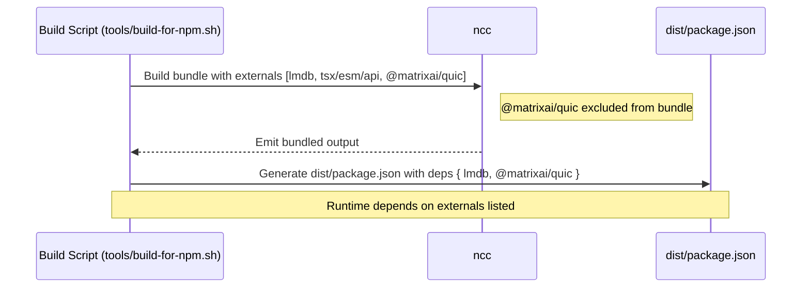

# Fix NPM build of @typeberry/jam

## Pull Request by @tomusdrw

We need `@matrixai/quic` as an explicit dependency to make sure that pre-build binaries can be fetched from `node_modules`.

I've also removed the main-module checks, because they were not working correctly after building, deploying and running with `npx` (the main file is renamed via symlink).


## Comment by @coderabbitai[bot]

<!-- This is an auto-generated comment: summarize by coderabbit.ai -->
<!-- This is an auto-generated comment: skip review by coderabbit.ai -->

> [!IMPORTANT]
> ## Review skipped
> 
> Auto incremental reviews are disabled on this repository.
> 
> Please check the settings in the CodeRabbit UI or the `.coderabbit.yaml` file in this repository. To trigger a single review, invoke the `@coderabbitai review` command.
> 
> You can disable this status message by setting the `reviews.review_status` to `false` in the CodeRabbit configuration file.

<!-- end of auto-generated comment: skip review by coderabbit.ai -->

<!-- walkthrough_start -->

<details>
<summary>📝 Walkthrough</summary>

<!-- This is an auto-generated comment: release notes by coderabbit.ai -->

## Summary by CodeRabbit

- **Chores**
  - Updated build to exclude a new networking module from the bundle, reducing package size and aligning with runtime loading.
  - Declared the networking module (@matrixai/quic) as a runtime dependency in the published package, ensuring it installs automatically for consumers.
  - Maintained existing external dependency handling for other modules to keep bundles lean.
  - No changes to the public API or exported entities.

<!-- end of auto-generated comment: release notes by coderabbit.ai -->
## Walkthrough
Build script updates: the NCC bundling step now treats @matrixai/quic as an external module, and the generated dist/package.json declares @matrixai/quic as a runtime dependency alongside lmdb.

## Changes
| Cohort / File(s) | Summary of Changes |
|---|---|
| **Build script**<br>`tools/build-for-npm.sh` | Added @matrixai/quic to NCC externals; updated generated dist/package.json to include @matrixai/quic as a runtime dependency (in addition to existing lmdb). |

## Sequence Diagram(s)


## Estimated code review effort
🎯 2 (Simple) | ⏱️ ~10 minutes

## Possibly related PRs
- FluffyLabs/typeberry#654 — Also modifies tools/build-for-npm.sh to adjust package.json generation and dist entry behavior, overlapping build-script concerns.

## Suggested reviewers
- mateuszsikora
- DrEverr

## Poem
> In the burrow I bundle with care,  
> Nibbled a quic carrot to share,  
> Externals hop out, dependencies hop in,  
> dist/package.json wears a tidy grin.  
> With lmdb and quic side by side,  
> My release wagon’s ready to ride. 🥕🚂

</details>

<!-- walkthrough_end -->

<!-- pre_merge_checks_walkthrough_start -->

## Pre-merge checks and finishing touches
<details>
<summary>✅ Passed checks (3 passed)</summary>

|     Check name     | Status   | Explanation                                                                                                                                                                                                                                                                                                                                                                                                                             |
| :----------------: | :------- | :-------------------------------------------------------------------------------------------------------------------------------------------------------------------------------------------------------------------------------------------------------------------------------------------------------------------------------------------------------------------------------------------------------------------------------------- |
|     Title Check    | ✅ Passed | The title clearly summarizes the primary objective of this PR, which is to fix the NPM build process for the @typeberry/jam package by adjusting its dependencies. It is concise, specific to the package, and avoids unnecessary detail while reflecting the main change in the build script and package configuration. Therefore it accurately conveys the purpose of the changeset.                                                  |
| Docstring Coverage | ✅ Passed | No functions found in the changes. Docstring coverage check skipped.                                                                                                                                                                                                                                                                                                                                                                    |
|  Description Check | ✅ Passed | The pull request description clearly explains the introduction of @matrixai/quic as an explicit dependency to fetch pre-built binaries and the removal of main‐module checks, which directly corresponds to the updates in the build script and the generated package.json. It is specific to the modifications made and clearly relates to the changeset. Therefore, the description is relevant and adequately describes the changes. |

</details>

<!-- pre_merge_checks_walkthrough_end -->

<!-- announcements_start -->

> [!TIP]
> <details>
> <summary>👮 Agentic pre-merge checks are now available in preview!</summary>
> 
> Pro plan users can now enable pre-merge checks in their settings to enforce checklists before merging PRs.
> 
> 	- Built-in checks – Quickly apply ready-made checks to enforce title conventions, require pull request descriptions that follow templates, validate linked issues for compliance, and more.
> 	- Custom agentic checks – Define your own rules using CodeRabbit’s advanced agentic capabilities to enforce organization-specific policies and workflows. For example, you can instruct CodeRabbit’s agent to verify that API documentation is updated whenever API schema files are modified in a PR. Note: Upto 5 custom checks are currently allowed during the preview period. Pricing for this feature will be announced in a few weeks.
> 
> Please see the [documentation](https://docs.coderabbit.ai/pr-reviews/pre-merge-checks) for more information.
> 
> Example:
> 
> ```yaml
> reviews:
>   pre_merge_checks:
>     custom_checks:
>       - name: "Undocumented Breaking Changes"
>         mode: "warning"
>         instructions: |
>           Pass/fail criteria: All breaking changes to public APIs, CLI flags, environment variables, configuration keys, database schemas, or HTTP/GraphQL endpoints must be documented in the "Breaking Change" section of the PR description and in CHANGELOG.md. Exclude purely internal or private changes (e.g., code not exported from package entry points or explicitly marked as internal).
> ```
> 
> Please share your feedback with us on this [Discord post](https://discord.com/channels/1134356397673414807/1414771631775158383).
> 
> </details>

<!-- announcements_end -->

<!-- tips_start -->

---


<sub>Comment `@coderabbitai help` to get the list of available commands and usage tips.</sub>

<!-- tips_end -->

<!-- internal state start -->


<!-- DwQgtGAEAqAWCWBnSTIEMB26CuAXA9mAOYCmGJATmriQCaQDG+Ats2bgFyQAOFk+AIwBWJBrngA3EsgEBPRvlqU0AgfFwA6NPEgQAfACgjoCEYDEZyAAUASpETZWaCrKPR1AGxJcAYvAAekAByVgCykALY8B70+ABmkAACuLLcJAKULgD0QmjMkJAGQY4ZFFwAbOUA7AUGAKo2ADJcsLi43IgcWVlE6rDYAhpMzFk+HthxcbKNKohZKWml2dzYHh5ZlTWFdYiUXATM2Ii0FADutQDK+NgUDCQRVBgMsPu0YBjczGBxAbXQzqRcA9MM8uMxtFhChdcNQjlx8GlIQYbCQJPASKdKJ1IOCaEcAF6IeAAa3wVAANJAACIUACiUgofEKMwyHmxAAoMPhyABKWoAYQoJGodHQnEgACYAAwSgCsYClAE4wHLoABGADMHBl2olAC0jFTpAwKPBuOJuRwDHB7rZ0LRaMgAAaJXGm/zaLIARyiDCd6GQmEgJH83A88AY6kgSkRSie8gIwYwDiFPCFYEi0SBagwznRyAYQYykDiJFwz1FcQoLEgTq5SgA+sxFKtpE6NEZ9MZwFAyLEEmg8IRSOQqDR6MM2Bhxbx+MJROIpDJ5EwlFRVOotDouyYoHBUKgg4OCMQyMpxwpWOwuFRzg4nC4IivFMoN5ptLowIZu6YDAR8GyWSZjE3xku8nwaIgLwGAARHBBgWJAACCACSp6jiK9D3uCj7xIwsCYKQiCdjAsD3EE/L8hEUQxJe4IYPQXLnCGDDjEogZYGgDrqPA3JoB4OItl4kDsq61Dup6PoRnyVY1rgZHUQxwmYPQ8BPGx0goECaCBvYJDcM4IrBv4NAULmAkwhQgKUvx3JEESSjGUg4gYEQxmsUcvHJiJHjMLQAiUrgiD+Fk0gjGg3DwDyGikYe4ZEN58n3MB9CnH0kBJZA5DnDGfZkAw8hyEmKZqW5Ym4BJ8Der6KDIBVwoXjp6BYCGpnmdGNylYptDhq5HZ7gpI7nqKBkMMSaCkBoQiINyKBYJltDOdG8BCmIZLyEx0aiB4ziaeVlXVRGAboJAFDYNO8BsFtsb5bIlJqfai0WvN+AZQpIbOV1vn+ddeXxjF+7INg3C0CKdUKSsAjhlBoqREpJCAJgEyC5Qxt2QEQVDcLAGWvWpHmOZl2WCbQrYdkYCGWEhHimdQXl1a9C3bYZz3IHhIbcGSF5kjwAzhgwSbiOI0gkUEr3PIRmmJuznN0FkkN81trHM3TW00GIdBk7SiDiLioqrvcQpohiwaTJzXChHQ8COLB8EGF2Bi7km/Y4CeQ1jnrLBTuKt72I4OGFc+a4qGo77bl+Ds9nR6gNvAjoNob6KYrQDba84QL247DCymgDC0AALIqDACOUaDZ0oAAcGpVBqcQSuXaBSnn1clzXsoShXEpoBKAift+mee9HseIPHqKJ3QDZ9r3EcQGmJBNpQpANhWY3D6nFDp+HBgAN4GAUMFIAA8gypoOmQMFcHE/G7OSu+QPviC2AAQh4+BjXQ/Ke+wVj4NrdDnyWV8SA3z3lBa4MRn6v2JLYf+l82RANvjBRatAbDnSpK/aEppXKIH5GRMa/8KrYHgXvJBKCMDuFwF4HBohiT4LOkQu+JDUHGlNOaLyVC8H7DocAu+vViR0BQogBw0gMH/zgtwmCO1tbsOJCiBw1NED/wANq3wKDvAo6i77L2JEEPIJBRHkOEtImC3CNEwVTrgI4tDCEmPUTBdmO1czPX0QpQWwlWLCgoB4eQ2E8z4klhDU0/s5wiDEJIe4eF5KoFsJSU4CBni1RxiWX4mUQjhBSmmV+0hkBxG5plZIqR0iZFkDkPIPAc7jVIE+e0QgjguTcuoZG+k/qRmkDFFCQJUBMCeEgIB9g0iRh+PzRMmVRoVN6SpdAEh8BD0gOdcgdxBHOHkEoGE0RICxOiAbEgcQvChNcm9e44IHri1cvcB6mV0mIBNGabSDEyljQmvcLpPwiA3FptyAGZEhQ5NTFGHODA3k0C8QoDAUhZDg3uCsCgHNdj8ASJlE5REywaGMSo2xQoZrjCcVwGCot8IS0DKmIUUkhT0AyIWI49xMquPuP8wFJBgUTIcAwSMTwKHLOYfADIEKebQp/uE+FCk7QTLSmsCITyvDOESQnDEWJmr0DiHgG4hyISrNHIgFFNi97NiUKI04zgMClVRRoveq1uQvOVTAwBWq75kngL0cy0idFsFETSmCaKAC+Ni1Empglo51eicVoIYNrTBbkP4Mkeca315jLGcOsWive9jMDvIwKIvFiq2UqxyedVS80FKItadSV+oaupMEjZUrR9hiRmjSLQTVia746sDXffVZkjU2pgnah1/EnW6NEbQEtFVSoKM9d6xtfrcHaP7UGzlrDZpGM7bGhR8b6GmOTY4ryzjIWrAEsSwh2stpXJYc9RgkrPHyGTWpHlakKotlCbNPC+0AiSRqk1IM9iIxRhRnGAqiTSzlmxrwEgGYaLZjUnmTSEzMpCmbBIficKcQQkAAgEOrWz4WoYgGJcTsaLVWuyhQjJpAcwYvTA5syQZgzmuRy51zzTyvI27TC9yxlTRmhgNpHTkCIH6fAQZiTMo6r4xGVNyBwSOQme45wwKhQ7RoGRhFBFTm7E0KRSg2yyS9MZsem5XkEmydRJgW59AuIkB9CKYF7FrncvI4WjV0bTEYoAngLdOKM03CSnwHOp7UD7pWqKJq2m6OnocJML97BgXlrlYpglSGlANpNU2l8eqDUdonWajAFqhRWrgZ27tEGPB9pdTiqzJ6t2etvgAXXEZI3AtgDEtpguUOI9cBBVFa4qB0apFTlDVAwPODBpRSmLgIduJdG6KlrmgPOpZS5SmzsXcu6RaDlylJUDUa3aCynSHnDUTdo0SJ0nVmwRodPzrTTijbAhaC9YEHEPOtA4iDYlFUEgVRFQSjVC94utApQkGlOUO7ohaAME649l7aA3txCULQNU5cBAyg1ADtA5dFRVDh+6j1P4oDAfnlZOeWjh6T30EAA -->

<!-- internal state end -->


## Comment by @github-actions[bot]


<details>
<summary>View all</summary>

| File | Benchmark | Ops |  |
|------|-----------|-----|--|
| [bytes/hex-from.ts[0]](../blob/2b6250998b16ebe762507d05dad86fbd9132b203//_work/typeberry-runner-2/typeberry/typeberry/benchmarks/bytes/hex-from.ts) | parse hex using `Number` with NaN checking | 129855.77 ±2.24% | 85.09% slower |
| [bytes/hex-from.ts[1]](../blob/2b6250998b16ebe762507d05dad86fbd9132b203//_work/typeberry-runner-2/typeberry/typeberry/benchmarks/bytes/hex-from.ts) | parse hex from char codes | 870711.69 ±0.46% | fastest ✅ |
| [bytes/hex-from.ts[2]](../blob/2b6250998b16ebe762507d05dad86fbd9132b203//_work/typeberry-runner-2/typeberry/typeberry/benchmarks/bytes/hex-from.ts) | parse hex from string nibbles | 524585.91 ±0.51% | 39.75% slower |
| [math/switch.ts[0]](../blob/2b6250998b16ebe762507d05dad86fbd9132b203//_work/typeberry-runner-2/typeberry/typeberry/benchmarks/math/switch.ts) | switch | 265724906.19 ±6.7% | 3.66% slower |
| [math/switch.ts[1]](../blob/2b6250998b16ebe762507d05dad86fbd9132b203//_work/typeberry-runner-2/typeberry/typeberry/benchmarks/math/switch.ts) | if | 275815466.2 ±4.69% | fastest ✅ |
| [math/count-bits-u64.ts[0]](../blob/2b6250998b16ebe762507d05dad86fbd9132b203//_work/typeberry-runner-2/typeberry/typeberry/benchmarks/math/count-bits-u64.ts) | standard method | 9812775.25 ±1.33% | 89.81% slower |
| [math/count-bits-u64.ts[1]](../blob/2b6250998b16ebe762507d05dad86fbd9132b203//_work/typeberry-runner-2/typeberry/typeberry/benchmarks/math/count-bits-u64.ts) | magic | 96338582.84 ±1.72% | fastest ✅ |
| [math/add_one_overflow.ts[0]](../blob/2b6250998b16ebe762507d05dad86fbd9132b203//_work/typeberry-runner-2/typeberry/typeberry/benchmarks/math/add_one_overflow.ts) | add and take modulus | 264985651.04 ±5.9% | 1.99% slower |
| [math/add_one_overflow.ts[1]](../blob/2b6250998b16ebe762507d05dad86fbd9132b203//_work/typeberry-runner-2/typeberry/typeberry/benchmarks/math/add_one_overflow.ts) | condition before calculation | 270356600.52 ±4.69% | fastest ✅ |
| [hash/index.ts[0]](../blob/2b6250998b16ebe762507d05dad86fbd9132b203//_work/typeberry-runner-2/typeberry/typeberry/benchmarks/hash/index.ts) | hash with numeric representation | 188.71 ±0.78% | 21.26% slower |
| [hash/index.ts[1]](../blob/2b6250998b16ebe762507d05dad86fbd9132b203//_work/typeberry-runner-2/typeberry/typeberry/benchmarks/hash/index.ts) | hash with string representation | 114.66 ±0.44% | 52.16% slower |
| [hash/index.ts[2]](../blob/2b6250998b16ebe762507d05dad86fbd9132b203//_work/typeberry-runner-2/typeberry/typeberry/benchmarks/hash/index.ts) | hash with symbol representation | 172.16 ±0.4% | 28.16% slower |
| [hash/index.ts[3]](../blob/2b6250998b16ebe762507d05dad86fbd9132b203//_work/typeberry-runner-2/typeberry/typeberry/benchmarks/hash/index.ts) | hash with uint8 representation | 156.32 ±0.42% | 34.77% slower |
| [hash/index.ts[4]](../blob/2b6250998b16ebe762507d05dad86fbd9132b203//_work/typeberry-runner-2/typeberry/typeberry/benchmarks/hash/index.ts) | hash with packed representation | 239.66 ±0.37% | fastest ✅ |
| [hash/index.ts[5]](../blob/2b6250998b16ebe762507d05dad86fbd9132b203//_work/typeberry-runner-2/typeberry/typeberry/benchmarks/hash/index.ts) | hash with bigint representation | 179.33 ±0.47% | 25.17% slower |
| [hash/index.ts[6]](../blob/2b6250998b16ebe762507d05dad86fbd9132b203//_work/typeberry-runner-2/typeberry/typeberry/benchmarks/hash/index.ts) | hash with uint32 representation | 191.01 ±0.32% | 20.3% slower |
| [codec/bigint.compare.ts[0]](../blob/2b6250998b16ebe762507d05dad86fbd9132b203//_work/typeberry-runner-2/typeberry/typeberry/benchmarks/codec/bigint.compare.ts) | compare custom | 269466544.81 ±5.13% | fastest ✅ |
| [codec/bigint.compare.ts[1]](../blob/2b6250998b16ebe762507d05dad86fbd9132b203//_work/typeberry-runner-2/typeberry/typeberry/benchmarks/codec/bigint.compare.ts) | compare bigint | 248963692.15 ±5.99% | 7.61% slower |
| [bytes/hex-to.ts[0]](../blob/2b6250998b16ebe762507d05dad86fbd9132b203//_work/typeberry-runner-2/typeberry/typeberry/benchmarks/bytes/hex-to.ts) | number toString + padding | 301210.47 ±0.47% | fastest ✅ |
| [bytes/hex-to.ts[1]](../blob/2b6250998b16ebe762507d05dad86fbd9132b203//_work/typeberry-runner-2/typeberry/typeberry/benchmarks/bytes/hex-to.ts) | manual | 15637.17 ±0.72% | 94.81% slower |
| [codec/bigint.decode.ts[0]](../blob/2b6250998b16ebe762507d05dad86fbd9132b203//_work/typeberry-runner-2/typeberry/typeberry/benchmarks/codec/bigint.decode.ts) | decode custom | 218256365.69 ±4% | fastest ✅ |
| [codec/bigint.decode.ts[1]](../blob/2b6250998b16ebe762507d05dad86fbd9132b203//_work/typeberry-runner-2/typeberry/typeberry/benchmarks/codec/bigint.decode.ts) | decode bigint | 104815085.51 ±2.53% | 51.98% slower |
| [collections/map-set.ts[0]](../blob/2b6250998b16ebe762507d05dad86fbd9132b203//_work/typeberry-runner-2/typeberry/typeberry/benchmarks/collections/map-set.ts) | 2 gets + conditional set | 107521.99 ±0.4% | fastest ✅ |
| [collections/map-set.ts[1]](../blob/2b6250998b16ebe762507d05dad86fbd9132b203//_work/typeberry-runner-2/typeberry/typeberry/benchmarks/collections/map-set.ts) | 1 get 1 set | 59925.72 ±0.34% | 44.27% slower |
| [math/count-bits-u32.ts[0]](../blob/2b6250998b16ebe762507d05dad86fbd9132b203//_work/typeberry-runner-2/typeberry/typeberry/benchmarks/math/count-bits-u32.ts) | standard method | 95078382.27 ±1.59% | 64.51% slower |
| [math/count-bits-u32.ts[1]](../blob/2b6250998b16ebe762507d05dad86fbd9132b203//_work/typeberry-runner-2/typeberry/typeberry/benchmarks/math/count-bits-u32.ts) | magic | 267915210.59 ±4.18% | fastest ✅ |
| [math/mul_overflow.ts[0]](../blob/2b6250998b16ebe762507d05dad86fbd9132b203//_work/typeberry-runner-2/typeberry/typeberry/benchmarks/math/mul_overflow.ts) | multiply and bring back to u32 | 276093135.44 ±5.69% | fastest ✅ |
| [math/mul_overflow.ts[1]](../blob/2b6250998b16ebe762507d05dad86fbd9132b203//_work/typeberry-runner-2/typeberry/typeberry/benchmarks/math/mul_overflow.ts) | multiply and take modulus | 260451251.75 ±5.12% | 5.67% slower |
| [logger/index.ts[0]](../blob/2b6250998b16ebe762507d05dad86fbd9132b203//_work/typeberry-runner-2/typeberry/typeberry/benchmarks/logger/index.ts) | console.log with string concat | 7817068.13 ±54.46% | fastest ✅ |
| [logger/index.ts[1]](../blob/2b6250998b16ebe762507d05dad86fbd9132b203//_work/typeberry-runner-2/typeberry/typeberry/benchmarks/logger/index.ts) | console.log with args | 878369.78 ±109.33% | 88.76% slower |
| [codec/decoding.ts[0]](../blob/2b6250998b16ebe762507d05dad86fbd9132b203//_work/typeberry-runner-2/typeberry/typeberry/benchmarks/codec/decoding.ts) | manual decode | 16886056.65 ±1.86% | 91.43% slower |
| [codec/decoding.ts[1]](../blob/2b6250998b16ebe762507d05dad86fbd9132b203//_work/typeberry-runner-2/typeberry/typeberry/benchmarks/codec/decoding.ts) | int32array decode | 195952288.37 ±4.53% | 0.49% slower |
| [codec/decoding.ts[2]](../blob/2b6250998b16ebe762507d05dad86fbd9132b203//_work/typeberry-runner-2/typeberry/typeberry/benchmarks/codec/decoding.ts) | dataview decode | 196924745.87 ±4.03% | fastest ✅ |
| [codec/encoding.ts[0]](../blob/2b6250998b16ebe762507d05dad86fbd9132b203//_work/typeberry-runner-2/typeberry/typeberry/benchmarks/codec/encoding.ts) | manual encode | 2496495.92 ±1.34% | 21.59% slower |
| [codec/encoding.ts[1]](../blob/2b6250998b16ebe762507d05dad86fbd9132b203//_work/typeberry-runner-2/typeberry/typeberry/benchmarks/codec/encoding.ts) | int32array encode | 3183903.96 ±0.62% | fastest ✅ |
| [codec/encoding.ts[2]](../blob/2b6250998b16ebe762507d05dad86fbd9132b203//_work/typeberry-runner-2/typeberry/typeberry/benchmarks/codec/encoding.ts) | dataview encode | 2883332.12 ±1.58% | 9.44% slower |
| [codec/view_vs_object.ts[0]](../blob/2b6250998b16ebe762507d05dad86fbd9132b203//_work/typeberry-runner-2/typeberry/typeberry/benchmarks/codec/view_vs_object.ts) | Get the first field from Decoded | 399229.97 ±0.61% | 0.88% slower |
| [codec/view_vs_object.ts[1]](../blob/2b6250998b16ebe762507d05dad86fbd9132b203//_work/typeberry-runner-2/typeberry/typeberry/benchmarks/codec/view_vs_object.ts) | Get the first field from View | 84869.3 ±0.43% | 78.93% slower |
| [codec/view_vs_object.ts[2]](../blob/2b6250998b16ebe762507d05dad86fbd9132b203//_work/typeberry-runner-2/typeberry/typeberry/benchmarks/codec/view_vs_object.ts) | Get the first field as view from View | 84762.33 ±0.54% | 78.96% slower |
| [codec/view_vs_object.ts[3]](../blob/2b6250998b16ebe762507d05dad86fbd9132b203//_work/typeberry-runner-2/typeberry/typeberry/benchmarks/codec/view_vs_object.ts) | Get two fields from Decoded | 398340.35 ±0.44% | 1.1% slower |
| [codec/view_vs_object.ts[4]](../blob/2b6250998b16ebe762507d05dad86fbd9132b203//_work/typeberry-runner-2/typeberry/typeberry/benchmarks/codec/view_vs_object.ts) | Get two fields from View | 67252 ±1.25% | 83.3% slower |
| [codec/view_vs_object.ts[5]](../blob/2b6250998b16ebe762507d05dad86fbd9132b203//_work/typeberry-runner-2/typeberry/typeberry/benchmarks/codec/view_vs_object.ts) | Get two fields from materialized from View | 142270.28 ±1.07% | 64.68% slower |
| [codec/view_vs_object.ts[6]](../blob/2b6250998b16ebe762507d05dad86fbd9132b203//_work/typeberry-runner-2/typeberry/typeberry/benchmarks/codec/view_vs_object.ts) | Get two fields as views from View | 66789.31 ±0.99% | 83.42% slower |
| [codec/view_vs_object.ts[7]](../blob/2b6250998b16ebe762507d05dad86fbd9132b203//_work/typeberry-runner-2/typeberry/typeberry/benchmarks/codec/view_vs_object.ts) | Get only third field from Decoded | 402775.16 ±1.08% | fastest ✅ |
| [codec/view_vs_object.ts[8]](../blob/2b6250998b16ebe762507d05dad86fbd9132b203//_work/typeberry-runner-2/typeberry/typeberry/benchmarks/codec/view_vs_object.ts) | Get only third field from View | 83309.59 ±0.71% | 79.32% slower |
| [codec/view_vs_object.ts[9]](../blob/2b6250998b16ebe762507d05dad86fbd9132b203//_work/typeberry-runner-2/typeberry/typeberry/benchmarks/codec/view_vs_object.ts) | Get only third field as view from View | 78725.58 ±1.72% | 80.45% slower |
| [codec/view_vs_collection.ts[0]](../blob/2b6250998b16ebe762507d05dad86fbd9132b203//_work/typeberry-runner-2/typeberry/typeberry/benchmarks/codec/view_vs_collection.ts) | Get first element from Decoded | 19923.23 ±1.47% | 58.6% slower |
| [codec/view_vs_collection.ts[1]](../blob/2b6250998b16ebe762507d05dad86fbd9132b203//_work/typeberry-runner-2/typeberry/typeberry/benchmarks/codec/view_vs_collection.ts) | Get first element from View | 48128.98 ±1.64% | fastest ✅ |
| [codec/view_vs_collection.ts[2]](../blob/2b6250998b16ebe762507d05dad86fbd9132b203//_work/typeberry-runner-2/typeberry/typeberry/benchmarks/codec/view_vs_collection.ts) | Get 50th element from Decoded | 21864.74 ±1.52% | 54.57% slower |
| [codec/view_vs_collection.ts[3]](../blob/2b6250998b16ebe762507d05dad86fbd9132b203//_work/typeberry-runner-2/typeberry/typeberry/benchmarks/codec/view_vs_collection.ts) | Get 50th element from View | 26605.9 ±2.22% | 44.72% slower |
| [codec/view_vs_collection.ts[4]](../blob/2b6250998b16ebe762507d05dad86fbd9132b203//_work/typeberry-runner-2/typeberry/typeberry/benchmarks/codec/view_vs_collection.ts) | Get last element from Decoded | 21380.14 ±2.38% | 55.58% slower |
| [codec/view_vs_collection.ts[5]](../blob/2b6250998b16ebe762507d05dad86fbd9132b203//_work/typeberry-runner-2/typeberry/typeberry/benchmarks/codec/view_vs_collection.ts) | Get last element from View | 16623.33 ±1.67% | 65.46% slower |
| [bytes/compare.ts[0]](../blob/2b6250998b16ebe762507d05dad86fbd9132b203//_work/typeberry-runner-2/typeberry/typeberry/benchmarks/bytes/compare.ts) | Comparing Uint32 bytes | 17850.23 ±2.59% | fastest ✅ |
| [bytes/compare.ts[1]](../blob/2b6250998b16ebe762507d05dad86fbd9132b203//_work/typeberry-runner-2/typeberry/typeberry/benchmarks/bytes/compare.ts) | Comparing raw bytes | 15775.03 ±6.7% | 11.63% slower |
| [hash/blake2b.ts[0]](../blob/2b6250998b16ebe762507d05dad86fbd9132b203//_work/typeberry-runner-2/typeberry/typeberry/benchmarks/hash/blake2b.ts) | hasher with simple allocator | 0.044 ±2.7% | fastest ✅ |
| [hash/blake2b.ts[1]](../blob/2b6250998b16ebe762507d05dad86fbd9132b203//_work/typeberry-runner-2/typeberry/typeberry/benchmarks/hash/blake2b.ts) | hasher with page allocator | 0.043 ±2.41% | 2.27% slower |
| [collections/map_vs_sorted.ts[0]](../blob/2b6250998b16ebe762507d05dad86fbd9132b203//_work/typeberry-runner-2/typeberry/typeberry/benchmarks/collections/map_vs_sorted.ts) | Map | 310221.5 ±0.49% | fastest ✅ |
| [collections/map_vs_sorted.ts[1]](../blob/2b6250998b16ebe762507d05dad86fbd9132b203//_work/typeberry-runner-2/typeberry/typeberry/benchmarks/collections/map_vs_sorted.ts) | Map-array | 100992.78 ±0.36% | 67.44% slower |
| [collections/map_vs_sorted.ts[2]](../blob/2b6250998b16ebe762507d05dad86fbd9132b203//_work/typeberry-runner-2/typeberry/typeberry/benchmarks/collections/map_vs_sorted.ts) | Array | 70949.11 ±0.81% | 77.13% slower |
| [collections/map_vs_sorted.ts[3]](../blob/2b6250998b16ebe762507d05dad86fbd9132b203//_work/typeberry-runner-2/typeberry/typeberry/benchmarks/collections/map_vs_sorted.ts) | SortedArray | 192234.37 ±0.47% | 38.03% slower |
| [crypto/ed25519.ts[0]](../blob/2b6250998b16ebe762507d05dad86fbd9132b203//_work/typeberry-runner-2/typeberry/typeberry/benchmarks/crypto/ed25519.ts) | native crypto | 6.16 ±10.27% | 79.29% slower |
| [crypto/ed25519.ts[1]](../blob/2b6250998b16ebe762507d05dad86fbd9132b203//_work/typeberry-runner-2/typeberry/typeberry/benchmarks/crypto/ed25519.ts) | wasm lib | 10.36 ±0.64% | 65.18% slower |
| [crypto/ed25519.ts[2]](../blob/2b6250998b16ebe762507d05dad86fbd9132b203//_work/typeberry-runner-2/typeberry/typeberry/benchmarks/crypto/ed25519.ts) | wasm lib batch | 29.75 ±0.69% | fastest ✅ |
</details>


### Benchmarks summary: 63/63 OK ✅

<!-- thollander/actions-comment-pull-request "benchmarks" -->
