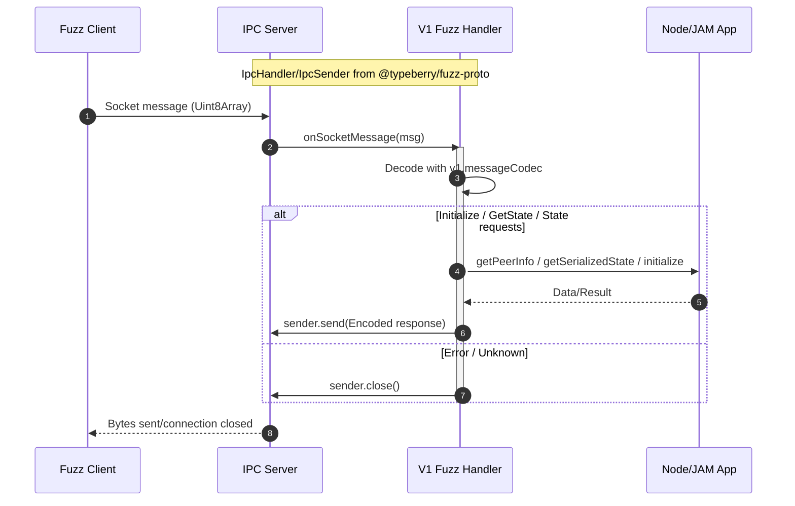

# Export fuzz protocol types in @typeberry/lib

## Pull Request by @tomusdrw

Closes #658 

I had to split it off `ext-ipc` to avoid bringing in some huge deps, but I think it's for better.

Also removes fuzz protocol version V0.


## Comment by @coderabbitai[bot]

<!-- This is an auto-generated comment: summarize by coderabbit.ai -->
<!-- This is an auto-generated comment: skip review by coderabbit.ai -->

> [!IMPORTANT]
> ## Review skipped
> 
> Auto incremental reviews are disabled on this repository.
> 
> Please check the settings in the CodeRabbit UI or the `.coderabbit.yaml` file in this repository. To trigger a single review, invoke the `@coderabbitai review` command.
> 
> You can disable this status message by setting the `reviews.review_status` to `false` in the CodeRabbit configuration file.

<!-- end of auto-generated comment: skip review by coderabbit.ai -->

<!-- walkthrough_start -->

<details>
<summary>📝 Walkthrough</summary>

<!-- This is an auto-generated comment: release notes by coderabbit.ai -->

## Summary by CodeRabbit

- New Features
  - Introduced @typeberry/fuzz-proto package with v1 protocol types and IPC interfaces.
  - Added FuzzTargetApi methods: getPostSerializedState(hash) and getBestStateRootHash().
  - Exposed fuzz_proto in library exports.

- Breaking Changes
  - Dropped fuzz protocol v0; only v1 is supported.
  - CLI/args: fuzz-target version must be 1.
  - Renamed API: getState → getSerializedState.
  - Removed legacy v0 handler/types and related re-exports.

- Chores
  - Added dependencies on @typeberry/fuzz-proto (and related packages) across modules.
  - Workspace reorganization for JAM/Core packages.

<!-- end of auto-generated comment: release notes by coderabbit.ai -->
## Walkthrough
Removes fuzz protocol V0, migrates all IPC and tooling to V1, and introduces a new shared package @typeberry/fuzz-proto providing IpcHandler/IpcSender and V1 types/codecs. Updates imports, re-exports, and dependencies accordingly; adjusts CLI parsing to only accept version 1; removes v0 handlers/types/tests and updates encoding to use v1.messageCodec.

## Changes
| Cohort / File(s) | Summary |
| --- | --- |
| **New shared fuzz-proto package**<br>`packages/jam/fuzz-proto/*`, `packages/jam/fuzz-proto/index.ts`, `packages/jam/fuzz-proto/server.ts`, `packages/jam/fuzz-proto/v1/*` | Adds @typeberry/fuzz-proto package. Exposes IpcHandler/IpcSender and v1 API (types, codecs, handler). Introduces Version, KeyValue, stateCodec; renames FuzzMessageHandler.getState -> getSerializedState; updates tests. |
| **Remove fuzz V0**<br>`extensions/ipc/fuzz/v0/handler.ts`, `extensions/ipc/fuzz/v0/handler.test.ts`, `extensions/ipc/fuzz/v0/types.ts`, `extensions/ipc/fuzz/v0/types.test.ts` | Deletes V0 handler, types, and tests. |
| **IPC integration to v1-only**<br>`extensions/ipc/index.ts`, `extensions/ipc/fuzz/v1/index.ts`, `extensions/ipc/jamnp/handler.ts`, `extensions/ipc/server.ts` | Consolidates to V1: removes V0 enum/paths/exports; imports IpcHandler from @typeberry/fuzz-proto; trims v1 barrel exports; updates handler to use shared interfaces. |
| **Tooling: converters and args**<br>`bin/convert/types.ts`, `bin/convert/package.json`, `bin/jam/args.ts` | Switches fuzz-message codec to v1.messageCodec; adds @typeberry/fuzz-proto dep; narrows fuzz-target version to 1 only and parser accordingly. |
| **Library surface updates**<br>`bin/lib/index.ts`, `bin/lib/package.json` | Re-exports fuzz_proto namespace; adds deps @typeberry/collections and @typeberry/fuzz-proto; reorder of existing dep. |
| **Workspace wiring**<br>`package.json`, `extensions/ipc/package.json`, `packages/jam/node/package.json`, `packages/jam/node/main-fuzz.ts` | Adds @typeberry/fuzz-proto to workspaces/deps; moves pvm-host-calls workspace; node uses fuzz-proto.Version.tryFromString. |

## Sequence Diagram(s)


## Estimated code review effort
🎯 4 (Complex) | ⏱️ ~60 minutes

## Possibly related PRs
- FluffyLabs/typeberry#608 — Introduces and wires Fuzzer V1 types/handlers; overlaps with this PR’s v1 adoption and v0 removal.
- FluffyLabs/typeberry#634 — Modifies bin/convert SUPPORTED_TYPES for fuzz-message; this PR switches it to use v1.messageCodec.
- FluffyLabs/typeberry#530 — Centralizes IpcHandler/IpcSender abstractions; this PR moves those into @typeberry/fuzz-proto and updates imports.

## Suggested reviewers
- mateuszsikora
- skoszuta
- DrEverr

## Poem
> A hop, a skip—V0’s goodbye,  
> I twitch my nose at v1 on high.  
> New burrow: fuzz-proto’s gleam,  
> Messages flow like a carrot stream.  
> I nibble bytes with codec cheer—  
> One version now, the path is clear. 🥕✨

</details>

<!-- walkthrough_end -->

<!-- pre_merge_checks_walkthrough_start -->

## Pre-merge checks and finishing touches
<details>
<summary>✅ Passed checks (5 passed)</summary>

|         Check name         | Status   | Explanation                                                                                                                                                                                                                                                                                                                                                                                  |
| :------------------------: | :------- | :------------------------------------------------------------------------------------------------------------------------------------------------------------------------------------------------------------------------------------------------------------------------------------------------------------------------------------------------------------------------------------------- |
|         Title Check        | ✅ Passed | The title correctly identifies the addition of fuzz protocol type exports to the library package. It is concise and specific, and it matches a key change in the pull request. However, it does not highlight the primary refactoring of splitting out the fuzz protocol into its own `@typeberry/fuzz-proto` package and the removal of V0 support, which comprise the bulk of the changes. |
|     Linked Issues Check    | ✅ Passed | The pull request eliminates all V0 support by deleting the v0 handler, types, and tests across the codebase. It updates parsing and argument types to only accept version 1 and removes V0 branches from the FuzzVersion enum and startFuzzTarget logic. These changes fully satisfy the requirement of issue #658 to remove fuzzer V0.                                                      |
| Out of Scope Changes Check | ✅ Passed | All modifications relate directly to splitting out the fuzz protocol into its own package and removing V0 support, including new `@typeberry/fuzz-proto` code, updated imports, and deletion of legacy v0 files. No unrelated features or refactorings are present. Therefore, there are no out-of-scope changes.                                                                            |
|      Description Check     | ✅ Passed | The description states that V0 support is being removed and that functionality was split out from `ext-ipc` to avoid large dependencies. It references the closure of issue #658. This concise summary accurately reflects the changes in the pull request.                                                                                                                                  |
|     Docstring Coverage     | ✅ Passed | No functions found in the changes. Docstring coverage check skipped.                                                                                                                                                                                                                                                                                                                         |

</details>

<!-- pre_merge_checks_walkthrough_end -->

<!-- announcements_start -->

> [!TIP]
> <details>
> <summary>👮 Agentic pre-merge checks are now available in preview!</summary>
> 
> Pro plan users can now enable pre-merge checks in their settings to enforce checklists before merging PRs.
> 
> 	- Built-in checks – Quickly apply ready-made checks to enforce title conventions, require pull request descriptions that follow templates, validate linked issues for compliance, and more.
> 	- Custom agentic checks – Define your own rules using CodeRabbit’s advanced agentic capabilities to enforce organization-specific policies and workflows. For example, you can instruct CodeRabbit’s agent to verify that API documentation is updated whenever API schema files are modified in a PR. Note: Upto 5 custom checks are currently allowed during the preview period. Pricing for this feature will be announced in a few weeks.
> 
> Please see the [documentation](https://docs.coderabbit.ai/pr-reviews/pre-merge-checks) for more information.
> 
> Example:
> 
> ```yaml
> reviews:
>   pre_merge_checks:
>     custom_checks:
>       - name: "Undocumented Breaking Changes"
>         mode: "warning"
>         instructions: |
>           Pass/fail criteria: All breaking changes to public APIs, CLI flags, environment variables, configuration keys, database schemas, or HTTP/GraphQL endpoints must be documented in the "Breaking Change" section of the PR description and in CHANGELOG.md. Exclude purely internal or private changes (e.g., code not exported from package entry points or explicitly marked as internal).
> ```
> 
> Please share your feedback with us on this [Discord post](https://discord.com/channels/1134356397673414807/1414771631775158383).
> 
> </details>

<!-- announcements_end -->

<!-- tips_start -->

---


<sub>Comment `@coderabbitai help` to get the list of available commands and usage tips.</sub>

<!-- tips_end -->

<!-- internal state start -->


<!-- DwQgtGAEAqAWCWBnSTIEMB26CuAXA9mAOYCmGJATmriQCaQDG+Ats2bgFyQAOFk+AIwBWJBrngA3EsgEBPRvlqU0AgfFwA6NPEgQAfACgjoCEYDEZyAAUASpETZWaCrKPR1AGxJcAogA9ufApcSAAzbAAvCJ4KfAImD0hcWW5pFCwAAWTUgUoXAHoPeAFISAMAOUdcii4ANlqADlKDAFUbABkuWFxcbkQOfPyidVhsAQ0mZnyAMQ9sUNDZdpVEfOySaoLubA8PfPqmspbESi4CZmxEWgoAd2aAZXxsCgYSSAEqDAZYM9owcKiYCKJUASYQwZykEIfTDfLjMbRYMr3XDUS5cfCpREGGwkCTwEg3Sj9SDwmiXCKIeAAayCaAANJAACIUHxSCh8MrLXIeYkACgw+HIAEpmgBhCgkah0dCcSAAJgADHKAKxgBUATjAKugAEYACwcHUKjgAZgVAC0jIzpAwKPBuOJBVw4G9bIwPPgTsgkA43mZasqGhpIABJEKIbhFXDIcJfR0YNBR+T4BbpAjoewkbjOKU8NAMKloUhhWLMSAkPy4MD2hhJfDoCT4eD0DwQt5KTFKL7yba7RDBl2MWCYYuJxD1iXMfBSZC4WBvAHRXhxfAJSBsymCyAANQVA/nODnQUgApos4PEajkBuaGQtEFb3TaEbzfedowww/6UgrYoxY7ZBdgw+LIJg9BMBglJKBQ55vJe6joFg8DMMuUhsBgmjmJYADywiiOIM4liwP7wBgVLSj62DSEYIaIL6kD+oGkCACgEkAAEQ4lOUhhJEESUDuCpsVwk7TnB2DcIEwRhMec5vLu65EvAW4pkkB6LpQ+5vJRbynmksmQAABhAG5KRgBlhK2RAkmg8iTgi7x4AoOz0LkkASoguB2mI0rpkZYAmYKAC8OrmU+L70BKACO2DwO+VnibQUqzvW+kVjQFAJokQhoMwYAQaEQTwl8j5tiEvISqElBkK8daqW82W5flhUwiVf4kNGGhCOOWDsC4QoaEY+jGOAUCAfwoSHoQpDkFQNDgSw6Gyrw/B4WIkhpHICjQSoaiaNouhgIYJhQHAqCoJgk3EGQyhzQorDsMJaB3A4TguO88hMNtqjqFoOhDcNpgGGoGD5BBbK4Pk2YFkWJCdd1HAGGxSMGBYkAAIIhldM1SvQL3wm9KnfCO1EGGjtBKPQaAngSqmxX82bBPIAEYEB8hsVkKQbHksj5IuYDLgQbG1fpzNASBmZrcpE3A6Dgrg5D+aFqQcOCsG5T1nE858LGkuZUOxPIMeEGefgHj/B6dxTrQ8ChPADDUKZ/ZGINTJZoB1XyGg5N0FwBkczk3O87x/OxAQ5mkWE8BeIZMtg5QENQ0rsNdYK5mi9VIFGD4HnITjW1vBKeI0yQCxBLKACydDwI4iPIwYEBgEYsdy/Hayc/20YI0jbEo5YGNYzd0p484yYTUTH4k1AOKRvmelqcHbB0TD+e1pcMNcAImvll8ihvGBkBKJ9C4yQebF84viAw0L6zfvcLRWFY2E2NAPiMgA+tAACaVg+Pc9g3Oob4REywXxhqKXetZ0wSB1BoUBpBwGHwZCXSqa0pAeA+sOD8pErL6WwCzSg6DsErxQChLwi0HZbhuAgaOvBpCUDxF+G+iBhypAGvXUMKEy7IASnndMlxHwHmgTxQEAt6xWx2FpSCNAvbjTqjEXESlLjCIiPkaBbdUj9i6mwrC6MPDpQoZBYWB5D6/gMYbCaFZJK3WPNsAQRRazsHUJndhlcjy43gEQBMuBnhvB4XNX21Vd7mX3gZQ+QTpJ8FShhN6AC5yGQTGwLgZ8F7SEvqQNi4csAGWbhgeW6wO6IHMmCUIpZDJwJIAg0QoV6wGWgbA1JYCIGZMMnfB+T8X7vy/j/e4Bks451JNKI+bkFHF1LsELgldrY127oNQGMsGr5AhAUruyNUb92moPXGjh8aj31hPRALtyjOFiISegfMURtRCAFLAmDaBFA/GcQRikty2xIB4egEc0Z/kcOwGMx5zmlRQMgcepAzmlIVJAAAPpAHUtUdQMhEgwqyDgJJlwiQpGCplIB7nYVYZwlIvw63jOgWgQhLi4EWlwBmJxpi8W3M8rAAo7gSm8RlZAsLoUYB2IkXkpEPKSnoCpCF0KOUnm5f1dh25EzNgMZAPx0hHlvAkNK+gyq5hvG+KIKk35qUkFpVEelmKtyoHlfQdMgp0HoAYK8B0MLIDlRIFxIh+kIXQi+LAEU+9UrsmPOUoFcruCJVuvmJgFBrYfktemKKMUJQwu0b3XR+j4zJTkSYnMybZGWLLtKGxYx7Hb3EOISekB7geK8T4gNQafaGRvl8ogPyMKFO/Nk0i+QFlLI0NGcyrEQWSLkQZfVERoClXMm6oBJTiK1IZVwYVMLqmGWuVwEKA0oCls8aiWNprfZEqxbqwdhrNwYF5BILgHk4pQrFcwaoQpmktpBu2v8BTu3DNZVgG+vawWTtnaKrlux50GR/dygybDs7iAGfNJQwyi53GQWXCZVdpl1wbk3VtwJ8ikSUH4Tt/Ra49zWZjDZs0h7bJHrI3tBz2FkwphmcgdxbH5qzeM5Rb9RHAPYv7Lm7IeZ81EULCOMs0MYYrNhhkpFbSSgJTgg89G7aWolGARjt1xHRwcBQUIs93r8HIPGqArjYCKBJRTAJAQ0UACp0Axl4ix0O+BzITrLHewoxR0P4Kw1278+kZMOJM8ECjoHc63SGYXfEMGxkVwQ8wXDszG5A1Q85xOMMVYYBWXhvuBHrpEa2a9XZ5GXZUelOnbs7H1ibB5gkLwutEBC15JSUhOkcreAULsfCjsJVQHy/QQrDA2YcdK0HERNnqu1cjPVxJyiQ4rja5Acuol6DsxK4HbgEhcoRngGAMJ0Ehb2a028D09tiVPlPFra8IwI5dfFg6ri0p97ya9hTIUSCFgtbQZ7YZQRoLYIANwkWhG9WhJxirDPhHyuV7ria0HjWsvRN1HZGPbKIUxGaVKKZzXwLzBanEkwFOQPpYG85BZGaFgqTHJnV0izM+ugM0pkEPasGs/WVESAVPkW5XgKCdukJoTuUX8MD0y/YEjBMx6YNIBRzis25GONjWecMMUaCR2jtTyCjt0PcAYAz1RzPWcaRlyJ9IDA5jhqsomRIMvGC3jSPvecHhUh8CnAWfsMADyCBOBQZVdi3jIPwv6/SiLEyyP0oO4dlzIDa8iZzv5fBBSPALO1SuS9SAMiYGyIhiBXgJjtJ6BGUArAkEoCGDABVQ9gXucblmwyIyChOOwgA4u1ZEuZWdEJu9IQIkESDsJDJw4IAAhPb2qm9fhb5X9v7D7j15RPLwfZeIqt6rx3qALRyABHwtKBv8u/W5GHHiY8vIILkF1u6T0e9y8CmLyzNn6RGz7da+wpfljV/0HXyQGw+A4gkgacWLfz4lJ8D34KA/YlA3Y/IUdha0T6IhPIY8afe1JfKkJlLAP1G+WJWAYZEQXWUAwcJQLwYlN5ZCUiJKdAXYEkVcKkZAXkGbAsePNJEgAACRL0oAZEoKpHH3wQoAeySE5wPmoCphOG8W4HtVIm2Ahgf28noHKUQA4P3lvFdwzRT0WCIXtmIKYDwWjAZABxCCDXpEQnAg9BOHeBIG31/2DHAWiVNgsnwDuGR3zFQLN1oR30uEtQrEoGAhOHENIJIRG3IWTSQR3iN3yA2yITxCpnKUqQYAZGkLonjlhy3Ht21VIn0Uq2DB8B9T4BgPkPxFVXgCphkOiOUiwAlHQNujgIQI/wT0fE5khz7mh1mlh3TBFgR3TRiIsR82sTRzzTtgxyLQo2xw7wMH83A3zigxC3LDCy4FoI8VgCi0pxiyV1p1V3V0XE1xZwYPZ25xmV50IzzmHiFz2VFyMHFykDNQPClzeBDCsFFGUXXAhTD08LIXYAMU0gPjeXakGUFBoAwn10N2ux6laIogwkoHUxqkHWoJhnoIv34hQI/zcRTUEBRAjld2yKKD4lxknxIARToXDDRNE27xCCpjsVIIiPL0hB4Dzz4FIgKm+ypgNxkMgCD0BWQi8McS/BDDV3BLuUhJGAzAgjPWwDEGPA8iCCIWYEQCIHZLZ3UPdgoCJNxlSAYCpKwGj1ILj0/zeDYDcVUmoGeKPm9B3mYGFNVO4UkwzHAN3j4H3lCIgQZA9CIFgn1xYANPKJlOeK8CIEIOXFeDomdXrAugSMoD1g9NSTRhZhxBHzOTwV1ieMDLoh4jjCxWtgjGoE1RkAt0FSwFBNIGgE5ntVz3z0L3wAZC7ysT70JJLQnylAZDr1wGfwZBrJLTRNfziAZCUHUx2FwBFHTGXFoD5L3gUHZDnxZiIXcjb30P3kCSUFWAB1oG9CuWyMgB8D8MoHyAzIqQgWvHnCwDQAknsRUC8GDDDC+OwAnPLFSPPzuWdWHBCBtOQCgJgiTz0LnjgilK0zCG0DmHcmdKphuCCELFiDwXoGzDiWJ1B1EKU1VKSHbntVyOCHKFxE5LiWpKTNsPrBRX+0kM0ljXOh5B9J/FXH90FFFAfLPMvznC1OvLkWANUwLgk1Vl0USEZK4VEwBLU1nkQGdP0hpJjMZPuIwllV5S+ENyIT9Iyn92t1t1jIwPQFjURWlG230ltj3OdgTTRhqLMTh21MR2aPLD+MFXaLsU6McW6JdgL3SiBOoqu1oF9hBNVPFMoFvTmJV3pyWKZxWIhLWMKQMFKF03an02nIRlKC8sMkhHHztGlRROf2PUTConGIFUoHoOYSFC4CsFLCQBIGAAAGkSBZApV1UABtAAXT0F6QCt0EMncnLJoEivVS4HH2rLRMSusBSpOGAGf0bNwHitgCKs8oCqgAMgYt73713CquisgBLILG3BCwauSodOatarf3atvE6uKp6qCvalzIoALwKiGrVRGvWs2vwCmqarSr2vzK6vYUItpJksssMnpMuXDjq0WmQAMlZIYFsooHssrBp0crVw1xcrD2w2WqgFMN5P5L4EpHXVZW8G6sCoMh5M8j5IIAoF5HRwlC9gtXkBFLFNWK4GsvKLeoZBRoFXRszDYK4BetYOggJo6NrFRvvAwEtQjFEC4FFGHFInuDlJvW6pz2puhN8qB1m19iVNj1wBXN5Exq4BaASIaC+SoFkEOpmrSvCi6sCuSskClBc3Sj1jEv4h3S3Cut9mjMQGDNoFDLb1oBqzlIZHKSttFPxpJughvUEIEqPKEujAPiQEAqARtM6OApXKzNSB0IrxHLeGn1AJVp5vVL5v1sMgIofN5AAG8TzYg+AABfLgRO28gAfl8FPJToavCl6X6P6Xx13mGNGWJ1lAmKICmIp2QwMAcqrwWN+uZ3yQ5w8mwxS2UvS2xluh2JyxFxJkOJ8hOIwlijOIuOuPUWkDbq51nC4IcHUFhid3hxwNkqjg1XeIRB8gj3RXHOwQCNEEUCIXOMuK0PsHhrEB8TYsPKN2zx3GnW3iPgPqGShOVUzyUR2st3L03n/NI01QdxXWsDJP2q4HHJIGftLv3jVRlWJRUnIH5UpgkgPSxX3gamQZeXxHeSdigEyuyqisazAYgcgxUnIlkH8nwbzFimwfrKlFAcXKIb3lAkzGimqjeBUlwZyqokoZgkDpgORxQmSHPqlEAZXLoafo20fB3uApOoKkrIqvRJoZoGdLmvfwkKYoNxdsYU5jABRCsn/rIMDs/vXBVTMREdVJ0ezL3q/B5KQA+O604I8mvrE0Eq/AyJvylkjhgirDkHlxvl0cj2MffuQAkIGkHBl2QAlCKBzSwAXKPgoHyFNOgkMecEUWBQgRTRpwrT/JZh0btAEL9KIDtEEa9W0d0b7IlDEHgcd3VgkvjH9y7IRqxSGXIykreH+3YG+2Jr90SBUjN2T2UGViUqhyTTqJSmMUaNqKr0zR0v4D0oY1HqMoqAfFxwCzeMg2C3Lrg0gCrprqQyp0+uV0bqct4mWNbvWNWTSz522MF37oNitBeNuiiXEFjRPquPyRIO7Oji1Ibsgibucpbvbj10RWb2IPR0U1AnL0iZLsPkd1wldyOP5rVV1I0aUARnOtbCiOJHQYwAZBkYLMgA4fwdrPkfYX9r3iKAtwhfmikUwE7iEZoDCLkbqqlDAChcC3SftVhiIA0AZGCrRLCI4I8ilDasZem1VLJe3kcCYNVMZB4NByxXWGlfKKIOyPIJXMgECjFfKNlZRFAKBvSfg2VaPlrDFtVIFcDpN3LCvToGozCOeNtgwCcSmZQIjg4oxa9E5Y0G5YZGxY0FFbxb9atIJays4dhlFdquf0DcPj1bpPzERrK1Ro3x8sUCxYZQmETYUYDfEwrODbwfVXTclCUbLOZZoALalHOqrwvsRuJF4DVvlzhooARqCACexdxeAfzIZEJfVWJZLYXxLTGHef4RcgxvAun2EhLiqmKhTTGqpAmoJAZFoNiulJgEba+Bxg6oZB71kDPBLIEGdPOzSC3BnajdEA0DnZuCQVwAYB5evCqiIMSCurY30mUz7fVZgO9oYEVQx1jQYHJWIktMPlwuGHCJvsgL8Ob3L0CK/DHXnACctb9uzLfuyMbRzPbdkY4WLP7x7brKrLrLw4bPms9XL1DWHMFCN3sCpHtCA7thoh6iezEAZE8x5rRisBDG0sCDcM0znFQBff9SuvUZceN2ILPpBshuvuNevq9QPEmA48Xq1ZoOsm+FIkoHkFIpCD/LPAMNwEJDIECdSbKIU+zFkA9C9idmdmGZhymfqPGZpMmcMWRxmdzX0ocQWecSBvdfvqNSQl+I+PmOOaiFOcBejC5sgCHoAp5qFfEFrDCK4GNb9fdd5FbcgETvhCECCFi4gQ0GwAaCttInS5Xiy5y7zCvZ+AK+y8gDzpC7C/pc6M8lkGmFLGRDihq08lPU8mwQauxaq8dQl0i86OzcqpS7QDS+Xf1IFGXc9tQLTsgDCJxFDVoGAGxb0DDtKuq9reVXrcrcbdBrFuG/y5aCK7G/26K8m4loaFAPRdpLxe/B+bpx+v+anoKW64sp4Ai8n06Ji4K4urol5DxYZEToSUazi7PWwQiKQYft9dFbQYh7Tbtcq8Cuq769rAG5IATpPAazB+4CS+h684q+ZogTm/e2ADxeW+e4l3W9zAbabaRsB7a7ikx+xa4Gx5ykZ888PQu/c9pK7a4Yjlu7+ZOZcrOYOQR564RfRyR5m4gQy8Pni5kN5G54UcTtIel9PZ8ekF5GgBsBaHKFFDRg6TfloLRnuFoLfnuBDHNB8A4M/pV+vYJJKHh9W9F6Hne+R4zbR9IYZCMem9m8PrDQypDfwdJ5F5e4p826kW28Rt5GV5XYjPXcWs9/wa4C3Z3Y9AEA55m484jbRJu4Ob8/u4F4BY0WwzJ7F7e4dmi6l6+4S6z5zcTvnC9lOG2aXZPZA8i6B8y5OBYeKilQoHaDIHl4D/zfNYd6nid9RPL8YDd7r6XfUOz+94J994W5r5oCD8d5D7tA243vD+p95Hr+ghiob+Xbb64AV4KvT+BpREbXyDJd1O0t8++sWIL8e+L+D96/5cr+B5IC79eB7776PQV5b4rdR+L3PllKE+5xc1eiAXkIb2N6m9zelvLQIgGwjZgWGwARdofw6p6BeQQA0LmP3pYv55q4AzLpAOgFG8TeZvC3v1FvDIC0AqAlRgtWYRYD0+EraVJS0DpkBHAt/Pnv50ZyF9p6wXV/giw4FlgEOqQEvj5GzIrkdWaAcQWakkHgVeQrA8xPJxhjSDz+a5feGfTwRYpeeufB/s3Wf4CC1+EuOGrSwM6NJD4NvCYH+2YDAApBPBLARoCcE4DqulrKxkQCIZEIYOaQX2uK0Q4pNaWwvYwQi3sEoh1sbsfBJ8Sg4eD3BgdRAJRwkhEIP2LsKwDzRvjgsc+9/I5vnwC6C8guQQ4ARLkUwQUA6uHbPpq3QHQQOqsg9jmihvj0CNWijAgXEGqHsJsIskPgIVhCDgsahmAWyBOwlBTtaoK5ATpoykzktVWtQ4IEYHVg0AuAKlB9qLzHCklgg9kTstTScIzNDKIEb7HthNzyA08GICiDQBFInZuOb6A8LxzU63tY0p4KYcGluHv4igCDUPFVBAzF12W6zQnKMQrrjFJi0xOutwJyGM4dQLmTDB3R5yXMtivdG5mRgHoUZBwClT3HoOyGP9choIoTG5mQDDgzU35V7s53eDHI3k9wiJmPy4AIQz8HoCeHwHkwZD/qXUQOq3S0RO5UAeBMboQWfaKAJEgATAJDYeAG8GGlqFUUA8+mfQtpzERcivAyAYInIkxGEj+yHgAmnEEcT7D0A9HcQF+HvA3Bw+koMsP1TdrXDImmRF8keH0K0jWiZnFITzWKHR0DIxQ8zNtjYgaBXKHJdnF1AyTNogRaIkEWCOExdpcU1o1ooi2rR2igxDo0pE6Of7uiPqWQ35jwNUQYjXMANFZoMQJzQYfhWzUnIhh7gzEjAXo30ViM7qbEMs1zbLHCLubsJp4rYV4OITbJrZrkbzQFKhTRRQleC2CaOPugZT2ptwOoEUJtGBZfh5IclEeo4EDoDjxhAkYikQkAqoEESFyXALdUhCAMWggaPOIuPahoxuAOgdHMJTMr+VSqAoJQNi0DpEAseXY95nHGCCyVSkx4qBDAl9YhcOskASEFYE9DVlKASJeAOFTRK79FqRHegJCB7yc56BHVbARZnxH5oWObHNgNaxgiAMcQeITjoOjeoQTOiqmMyrVG4qOp2AWmS1HUlxo0EUJl2CXEzg0AESwSqxAXKimCBTYqxs8FsCQDdL2NI6KbdFLuAUxUB8BU4r8K/R1AcSqYX/GKGql+T7ioAwVD8WFToDP4TwlhF9M8EMR1JT++VKCqfnrBUjSAnQl4m6U05PhJxM4iVIFVIhOJJJwyGeJ6TkT2F9O5VXtvkHYkCBUy1HEDpcCCIwIC8xk5Em0xsgmcIcNQ/UTO3kj7wXxaHfAPJBnGIBvs5EB0OhlxLRM8JfEmTg7A9zcTuWlYvAcUJUjHjeQD3fJP+LkT/NPCaKdCbPCpLexVUfE+yZx31EBNFwJQ6epRlJTkpBkHnfeFBJOznoo0byeQBWA0aUgXsL5IREVM9LfYhWwQAAFI5QMA3AfwLGMDrITKJ0qTxGcNQJCJW6neMwt2RrEWZZCsFNkMegZQdl6wZAYnDVArDDhyU60ZKeik7G49+Qsk4mj2IlQJojAKlEZlZzGbw5bOalBzlYlRyoSXOhaNzjNwHq+AuUZYU1CF2umHpx2V2ScTBOqDfYmUuE+QD2KBwIhqGLNYmElR5q7iNM4MwKuuNwCbj4AXAQ8SQGxZDAzxuPQdquNujbZbx9YOpA+Pxm8Rg8kIImVwDuzSh0cLE6cs+LWpviQqn478VKF/HMID+VQv8UlSOotU0SC5drmkE5Tco9AJ49qEBI8ggTFq2AqWQrRlnCt5qmAwBhjInhYyCROMmqHjNKrTSvqgoImajJBwCBHIg6Vlm8jzitTxezwDCYjKVy8yoStGc3NmDUBRgLsFJPINeOIgEzbZ5GEUKxDPwnAGYuYe5FpBOHUw6AFECaBGQHo+SgawMjPrSSwmPVK0ecHccxTMoQzeIKExGfnN+RIz1wMCciaQCIln4mcdJXiCuTepTYjZpAE2fmh5mkigSiNOgCF3EmhUPJtAaSeDXLQ/tM5tUFlPJMao6zFJg/KiAVT0DfZv8O+PgKalqjwh8mzFPWG31qhCIABIXIyeIBMkSgzJaQSyU8GQBt9nZfBYrrAAZDOTXGrkx1mfI8l5hjO+AGROmA+zcReo4saQlOzq6Gyc5YXfICyjHrhcCRimGocUMTrHiU6bGSMdlMBbuiBogg6UBkMiayAiEW4ZuTVPyTfZ9ShTXhAzPKkOTsg2CMzgMWhbUV0xsGEnBFgBH7NYxd3dXA1Emkui2cEIjYlCJLEwiyxhMeES7DombTqSLAYGFzLSHZl9R6KF6ihP3jk1nyjopwfkHhYaR3RS0zMPHPlxVSyabJSiZXJimfoyw82TmH1h4yDZA6KitgigvUWaK3RVWfcOdHVGGx6aqnORbiSpYUUtu1PEofgomjjTmAk0xRasQZC+yNYAgeFruQ1QD0Z5qhZCG8HXm/5Zmf03mgZgnkboNoWVMjnInHDPAaovTA8HYqSbrA2EJ0aTh5xCVhKjFblBQKPS5R6R6wVcz4uEoaVSc3gC5NBEcIpr8RjYpEKiCmjaUhAmuuolcv0ooAIz6wfs7mcm15nHgROVbK+q00My/SrqlSyADUxabWcC4SStgI5PSXGxYgiQUIBbAMKyB8l+kL2GSheE3x5FhSl4HVPM7VFXphiPZRpSaJTNvp2aXShku2HFodl8I2qNkrE7TMfptASGNaNc4vK6FnwhhSMSYXhYpk5OPZrMRRFxifqCWZWCnGSyQj0Y3dTZALmEXC4Kx7WUqTRhphdYesC2LjAzgmyCx1K+YnFcnG6jPFOwGcOqbpglz6QLFAcelflA8RCwaVtUKmNbCeyDCQgsnYlK63Gacqvg4sZ4WVDPy9pao7TYqAyDuXqcSA72D8R+Eek6IXplnD5e9K+V2dlBKOf5WC1hUUYoA6sHHEXTxwIqy6ROTMSwtrpsLrZWK9XE4r4UXNCVVzIRTsnLH7IxFTvO0nsMSBWq0wgJDTB0tdFsZ8xfqt2vvD5TSIPkPi0MPUsTXbZesgcaxSuCeIjTcAKit3PxDBUVpBlzSlNBVEnY1QE1l+W8HIlnkZRapsiWjG3IiUOQQg+kJ5cUomiNr+IqARGalE+oiVEgvHWaMdlIqblcKShS1GmglAfIS5s8YMDYAOUpLDCP+Y8HZBBwZzwcnTTxXIhvhClPwexF5UatUoZpPlS6r6S0UhXpKbVAM4tCZTjU1RbRxQs2WcRzVs4Yx3qjhRovoQ64PKTq1ZhBkRWbNmFqK1hTFlZVJYixAinusRlJUXq7V02CXGxFZWrBQ04DJbLlFFFVgF1VWJ9geFGloxy4zs1sLdG/IUAyCUMJ8ofk+Wign4Pga8D+UTKvBAGT4rDYrBhirAFkhaplZ8vI2Ua2W0oWjfRo0wnBIyqUl7rxuhii5ZYEoSGMtjACEa8oJuEjcOLeCib2NdGzjYxvjAREigniIhFCU5HcR0wLGmwD4HjSJoTVKaBop9KRwPq/lT6mFS+r8wfC1mkGt1dBrJywajA2GttDlAZWiICx/q1LIGuhEoaQ1IiisVRmQCE0FMFonVHxqU2Cbg4EWzERCNH6parEN5NkNuwQCEoIxzov1RgvYT+AOOluYghkLUUJjIt2i/8vxH0iA9DN7EaBNVngAaBYYSCMMeBKESNa1EuW90RKlOhpNIIpsGBmkFamDSUlGNNAJRy/BOLDGDKaUEIgyFeZLUz4N8nEtI2SJwRQzN5Y5vUp3rXN9w36c+sxzoaataKTmddVDFWJIA4Y4iJGMq1VZb0IWrLQNhXCRb/RUAe7VJEe3GYXt5mZtcNvK1NaxtX25tD9rC1Cb8AAO0DfCt82uqMxAW7MdFmC0ZbpAoWqYEjoViKa2VToAleskEVxbSMCWsNaTGph0Y8d1kR1pVA8j+pHt6KflZxgKBI6hYrWtHHjoE2I7stNmYnUnCSz7lNCJcZTsgEB6e8uxe4GBHKGbI2g8mxKNiIOn4iiI1wrdNiFbUlEVFUgVteyL1E9ghBctahDMGbjTyq7ldCq4CIeywAnA2Q/uYSnrHzX0rzM2GiIngH0zLt945cKwO0C1AaAIU9iGnEvUHCsq5UHrKmNAD/i8dWxDjdTnghmj2BbQ9oXtZeXdqHCNwY4vBHPVZ1IiZdDWegKZhnrYYqiDmi1edomb3qrt1qzzbdsOTFwdK0K2BQs1kBUpGdnOqxcLpXB8Z1pPZegMjQjqYAbYXBKEsDmSzpBwRqayDhMwKwRCxYaQCOPBrxUXc0dEGjHcivgwwbPVcGgXQTvC0i6U1OGfhTFsp1ZZ4tZK2nUlqSB4i5l2M1deZPTDa4VheUKJu0onqiQwaypN2qvsP2/aIgjK5Hafv3KD7zJQ6vgFCSFrkQRaCgyWhhGlrsgbIIoQ6PPP1LNUlagdWOsfjR5Z0c6ydCrmgeVnhRwDJsDaWkDKXwVUCU5XkMn2kC7sSD64JsJTGI5x1mDZBjDlwkt3ZkGDiAXdmxnd0FBIB6KPtc+TPoVLtlrSh6g8QzSoRmwdAb7LJFHKxptgsaFYJ5DjY6Dn9Pg31KOxLwQdcYf+q1j6FMigw9CFaMKZXuNXV7b1tey7TGqc7zMvNzeu4N+vWVPaoD32wA0Lr+0EAgN5a9yoDTFZuJBaGAGPHAdFri1IAiB3AMgdlry1MDitVg8rVKp6ZFA4RwingdRrwxkuSdIINnXnK5186rBwuvappgeHQdhkag+9Xh2+HCdfegI6fpCMZGntdBrQkn23aMHU+pR5sK0YWW+xKKqPPo7QELqb6hiGzfzSisC377cdJOwXY0f8PI61E/1XXOc2i0U7kNV+6nTfv2KpTL59AfhMoNAHy4oSw8oWVJOz4Rw4idxbCbxQzReouC0FHwj8OeydThkCSC8k+RHlfi6AYAA+SyjtC4h/crU9MBcckljzs++8PxEORdlKZSCvi0CmpRDTvZ2xsgERqQSmWh58QVAF4LAAwSYz3QtJZgticpGCgNJd/QCMgFqOB101AqO4wXNqMmb0o3xjJQtrpPvyhZsqGcTeHkC3TGlonI2CblTziQaDGYSI+1HSBCtiotEvAaKq3CkyOA5AMZSYc2jYF2obJyU94wclU9QadJnxYA1SGwK0tkTPCvGBP5LyT89AY8c4B0iyT9RYc8xc6KZEkbFB5eLcqkGcAeZpM2M3Eu8H7x1QJQIoadW1swSHbYo8iBwsE311ONByN+IfIKZm1BosUJSuhPYFkBXpTYt/JjgSPeYvtAGZLMAMTXkW3LyUlKbNQwGxNnRTF4EqmDfFDORJwzVMT+iZrLTmauS+kb9cWePVrxiwEcUk1KRsPXrRmqaBw1pScNzMDKtql2N92BSZzfYg5tgj4YWNH6idqx1YuXvcwfok1Bzcjs9TVxTL50oyohAearNSlgMAY9vYWn6F7CLThkBXsEnLwGRsW5kF7gkTNU7j/TBJAsGxmAxRim0yNYLDfMtSOmzF7tSVThJfaSEWT+q8YZGbBZBi7zjsQBkWUKlloclF632LUfuqPrm19Z7Mryj603s+q/pm+InVpMp0DIIoekzIhUgtmKG+ojEucpayJn1gPZy1H2b7QGQlz0ES89zQJF6nEaiLRMM6APA8WsTF5wU1WxPhalr5jheQKREbDkR6ABkFFJQH5A0xtT2Ax2jeFJEWUk8IuNk5xUQC8iMlQlrFKkqCDvDnV6OqY5jpmPY7cxBgBHUseAMRaNzblKLV3SDVU7diuWVKR1ozDzKNScqt4PXLoKUSPD22U46j0qFxU/xtUCE6PIirxWKAHVDgu0zdxsnpqyR/3nm2XmFU5JbaqQ4OFGWyoF19gOTiahpk+RWluSfAORD5nvjfjws/RVIgZMqRYrwYUlgeHkUziFFv6/iMosPPPkWm22dRY4uA3OLaoU1oI3DG425tQ27akdQSFAvO1qMYVpM0UCrRyCA68in89qkTAUmoIbDDobVPIIpFk6Iw0MFycklKsaCD11QTwUvbXtHpVetSvYZc0TnHOU5/6U3pcQLKqrENCtFulWq9thqjWNKxle1l5WlJRVb8B4YHStybKqxcyPxUMiuXj9/2zy66IBoigwQBkZK38ahMizreTfDAZLIwOpV8robFeb0jmMuWGj2NgI2ojOac5vLxY7YySuv1oaXY5cDxERnPASg2mfpwrWxnUV5Ci+DI9MC6fQXIAXWFwyRoXvXqWmCrCjNvqK33i2nHh7h2sxNYAvSmM1siSW3wM0SO5BwUagqVJEOsS3DbqAdyCsuXWYSNrbwBXrPzAFBttbXY46x+FOvaVbG04wMYVsewoICIHxp1Iwlg5wRMzm8HkOpStsvszLxQhbWrHrC7KzVfOwhKttjvZm6oIpN5DOCPWRp5wkZx5U8GeUni/yW46xgPR6uvKPrN6s1Rdp+uPrnD051w0szQ21QW7PytzVeIb3XnbtzxGgGIRsvgbJj3wnfWKz33or5jScRYyzZWOgiheiGi/dzb7qhr9jUAEyrEEoNMM/Zx4kyzoqpha28wMEHWqUnFVxBe67XD8J+VfKg0ys/i0Gr4WOnCk9uo3PLn7vLyTdwJDQMALtFBwTzNt+Dahnfqph+yFexJmMonrtbAUqYpDe1PDTXa3RhwCVZJuqntR29MrcwJhv3KCCewPTMQOtlvyFNg1EazeGPqg7oAdULWo1bowIdT6ANwCv4S3PTvZPv9AO+F5hlREBzGt+AbIJa0S23i7kwOEBD8J4K/D0WSIrO9hlae4aWjlKI5t6WOe+t9369Hmoe4swpXUZ0cx948QAdXNAGQDTWoXiFzXSTygeHnY8d7OQAAB1EYNaAdlEALHLvD/LBOJB2t/8MvOc+ilS5BBcu43AmkhQ4J1cGuLAJrtgha41Bz6cUZg0lxR5o8AnX94J8VyATz9D4hPP3ktwScMoQuF/CPvl1D5kOZLSNFJ2dyCfHcQnJXM7jgONP5pXkWDOEJ/cqckhv7bT07rEYaB5ZKV+jjztA6McL21zTR5e4YIKEloMLkNWLgM4Ud2PIAjjucM4+wCuPAq6+TonDMb7eO4ufjqEtHwgGMONeWvHXnr1fgG8yBcAygQn2qoFccHbjifkk6V5ZVrnXDTJ6IGycLcFey3XQMrIV4hdVam/aS0U6RqE00ax66PtAFXb7ZaH8fDJbTWJrk3+DTB3p3o55qmDPimttckM/40jPljZj/IRY6mc+JQGQYuGvgLtaatP+3/Mmc4D/4D91bgAlMfQu31jFtm/wxm1jdJn5Ap9/wXiJzaQ3ErN7NO7e+jHJgQtrbIQFSEjqgqWYDUvYoQ3Su52jOxxEaiycBaUTyKMpXYvNYq55hpRqwaueCVmGrFpA61gwl/fWF9bhPGud9qyFCUXA9iz2aba15E9tffhIQg6a0PCR5ARF1RRCfTHcFJm2niSlMw9GsqEt0B7Nthz683fHMaPJzAKmc0s0dUTG0xSK1l1mLRU5i66nL3eKLsSx4q17WxwV7COFfFonxkD6lUvo9jFZLFBa0Z9fFjd27xY2LzLWFq5dr7uoad/gOdd1p6wWmRsd4qcosJ3BEw7ypR95Q1LVGHVr7IG5Ws3S1XrqM7yVAEKSmDCS9XAZd2BtTGl17L09zN6wsMAGBjo28QVBNDQB4Apol+u6BWaoDPRYRm0OJjtB+j7QhoJ7yYPqVwBvxmwiAN+FMboBvwS1B0I9ye7QDqgFQAgAMMqFqByh1QaAPUAwFCB6gIPyoHUKEFqBoASACoRKHqBNDqhQg4H2gCaBIA6h1QOoe2MB4BhQAP36gb99OT/eE4APY0N9yNHkRvw2AbUN+Po1/dAf/o8dbqmxCQC2AZ2dAcBPdAwiviEGQkV8jyHRICfmETwd5DO1sDSf1MsnukAJ6QDYQ2Qdob2BgFU9jg5PpQNiNbBNp4JGQq4KJ37ZZpappP8NIz+xFM8bqMA7gXAF4Bs8Fg7PjbBzyZ+bDOfrQ1ujPaZA89UgvPVEDT8Z/uQqXaIvoRAE12k9sQAAOhgGS+JfcAaXjL+l6y/AAovAH7SHoFS9ZfMvmXiwJYEYgNAuAQ9ZRPxF3CpeUvRXhr2l9RiuevAdXqr+pD4C1eUvGAVGAF/T0OhTIbXp3nInkgNi0z1Xo/mJiTkHx8A0gDAAAHIQg5AOqwYSomPqiATYQlEEAFEQ46v5QbCC/E1KZ63gfka5HZksjtPq6WJGyCpLTIM1xIL207wymCjUWGQuQe2Pwh7dawAE+hQkCnLNT1h5U/AZ4IZAah5RBQxOIqK8FCilQugPQPoAMCGAjAxgEwFgAEWfB+AeYYPpqBQCh/gM7e3LhEBov6/Rg1gpUc24KDMDtB9QOoQr8V4a/AAnMZEPL3RCoh6BddAnjFrgBC+hk2yVWLgLlWhrJchfxn/RkcjYAJeWvbwELxz5KrGfIulwMLw55KpsRLErYLxKZEl8HhC00cEjvhFAtdhxAryO0ndidaKkJoNUrXeYXSFpbPlwIPEz2Dx0S7/UEEVwtafsBykbYdsZ0ghFJDJkMwSDtVVtd7CLCWG7dbZpYTgrLsEI94NIHcIQDV1TN3QNV7nDegVQ42QpaRxNHgg9B8FjkeSrxBiArg1wH5lAG7UsJZJhD3GUZ+ZCj1dKRLPTCaPJGbHBBIlCAIBDJztBiiDwDsjwNqnG/kYNAsvuX2xHcimw8AmvpJMP5V9WwSACXgUY6w/DT+Aqo/w+oXg8Q+IDP6nkX+xDPUEEPAIX8X3P6SQ6+5/QvlOhF4Cr8e5f7EMXw1gS/tBSIKl0MKz7SAy/L/KvhX/z6SDeeP/K/tX5gAGIWvqLbEE0aFwRsiBBJpyWszfg95oo6pg8xsmzcmHiMc7cOxQ70+YLEAxkHFLvAVSS9AeTyoyWvihGGUlPWiLQF1rVDE0IaFmBXIXYrCgt4V2MgDyQ3gjGClIgeHShdiwgnELziBMo5KaQ+hONbcoBwg7CIAiwC2qCSY9GQEqQ2kAxABgTQB1IwyHXgJBD+f/sZ5j+cwPGAJey/sZ6z+8/s4CL+RAFoHsQFTBD4b+EoFv4nAKgbv52gn4ImCH+9/kki5etADF7DKaMJiyIAi0D3AlUF/kL7X+I/nf4S+SSNhCOQKkPcBMAAdJ3Jv+84J56WBbEF/5K+MQQAEa+goAl4LCHzF77uMhiOJru0FTG56qcKFJGDqAGolZBPAx3lcRW+9FBhCtK5ftqJ5gJOiq6R2VkDAHUSuAKMLkcfsn7C6uS9uZBHwz8ou4SuknPPo4EqZhNCuk+YPICEK69NUyA+GAOJpnIhbKsq7qJcBn5xQoEGoblUGEBhQlwQQAowdCe8I8LA+VYCmAAmYQfEoGwygTv6r+44OoGT+7EIYFsQOgUkgL+2CHcHGB6/vWhmBXAGp4WBFwXv6ZQdgQEG7+eANhChAoQUcIRBRtG4EeB5/n/6+BKvv4HH+7EH16q6WKO/4XBcQWcC/+FwYkFABSSFgQq6QXluBt854FqRNBL2qgC5AcJi9xScWpH27SogjHpYe+V4CUF/m+rjWDzoz4KwY/gbYByruwiqtPShgOqpVDmuj5EfjCiUga/4yBgYK4pTabvjzakYIaM8BSgcmCXAVYBotJwgqwftyjDIYfpoAvB0gOP4aBU/jEEPB7EE8FL+MQa8G2w7wQiFfByviv6/BtgVEFUgR/gl4TkJPpr7QhPgRcHwhCXhZ4MAIPF+DgIzuukgxB6IT/7heWIQEDq+OIexA1Mfbn8j/kPpqcH7IwYH6EBhejD/rLw+jBRz2gqQBDh3BJoWxBmhBgTEEOhB/k6EuhSSPeD+htrlVjn+3VPlSX+bEFz62ASIQSH6eSSNh7qgDAKh4mgiHiaABgJAIqAMA+HgADsJAGR60AAgER61AeHmgD5g6oPh4BgrwLUAjheoAIAmgDQCaACAoQMR76go4eqC1AGoK8D5gyoAIDD+zYbeC4AtgFL4Jeo4WB5ygtAMqAKgaAA0BygDADuHdh5HsqCPhKgLQCkeuHuqDKgDAKOFbhaAMqC0AoQDuFGgI4bUBIe6oHKA6gR4QqCgRo4dOHvhW4ZKA6gPcCnRUebHhx6kAXHk6G/uzHodBAAA=== -->

<!-- internal state end -->


## Comment by @github-actions[bot]


<details>
<summary>View all</summary>

| File | Benchmark | Ops |  |
|------|-----------|-----|--|
| [bytes/hex-from.ts[0]](../blob/3a8d2a66d838a62768226444f3454b9a8bb61d82//_work/typeberry-runner-2/typeberry/typeberry/benchmarks/bytes/hex-from.ts) | parse hex using `Number` with NaN checking | 129581.47 ±0.33% | 83.76% slower |
| [bytes/hex-from.ts[1]](../blob/3a8d2a66d838a62768226444f3454b9a8bb61d82//_work/typeberry-runner-2/typeberry/typeberry/benchmarks/bytes/hex-from.ts) | parse hex from char codes | 798007.63 ±1.74% | fastest ✅ |
| [bytes/hex-from.ts[2]](../blob/3a8d2a66d838a62768226444f3454b9a8bb61d82//_work/typeberry-runner-2/typeberry/typeberry/benchmarks/bytes/hex-from.ts) | parse hex from string nibbles | 495410.91 ±1.73% | 37.92% slower |
| [hash/index.ts[0]](../blob/3a8d2a66d838a62768226444f3454b9a8bb61d82//_work/typeberry-runner-2/typeberry/typeberry/benchmarks/hash/index.ts) | hash with numeric representation | 184.33 ±0.75% | 26.76% slower |
| [hash/index.ts[1]](../blob/3a8d2a66d838a62768226444f3454b9a8bb61d82//_work/typeberry-runner-2/typeberry/typeberry/benchmarks/hash/index.ts) | hash with string representation | 105.81 ±1.5% | 57.96% slower |
| [hash/index.ts[2]](../blob/3a8d2a66d838a62768226444f3454b9a8bb61d82//_work/typeberry-runner-2/typeberry/typeberry/benchmarks/hash/index.ts) | hash with symbol representation | 166.18 ±1.25% | 33.97% slower |
| [hash/index.ts[3]](../blob/3a8d2a66d838a62768226444f3454b9a8bb61d82//_work/typeberry-runner-2/typeberry/typeberry/benchmarks/hash/index.ts) | hash with uint8 representation | 150.36 ±1.36% | 40.26% slower |
| [hash/index.ts[4]](../blob/3a8d2a66d838a62768226444f3454b9a8bb61d82//_work/typeberry-runner-2/typeberry/typeberry/benchmarks/hash/index.ts) | hash with packed representation | 251.68 ±0.38% | fastest ✅ |
| [hash/index.ts[5]](../blob/3a8d2a66d838a62768226444f3454b9a8bb61d82//_work/typeberry-runner-2/typeberry/typeberry/benchmarks/hash/index.ts) | hash with bigint representation | 188.27 ±0.72% | 25.19% slower |
| [hash/index.ts[6]](../blob/3a8d2a66d838a62768226444f3454b9a8bb61d82//_work/typeberry-runner-2/typeberry/typeberry/benchmarks/hash/index.ts) | hash with uint32 representation | 197.5 ±0.44% | 21.53% slower |
| [math/add_one_overflow.ts[0]](../blob/3a8d2a66d838a62768226444f3454b9a8bb61d82//_work/typeberry-runner-2/typeberry/typeberry/benchmarks/math/add_one_overflow.ts) | add and take modulus | 231893950.62 ±6.32% | fastest ✅ |
| [math/add_one_overflow.ts[1]](../blob/3a8d2a66d838a62768226444f3454b9a8bb61d82//_work/typeberry-runner-2/typeberry/typeberry/benchmarks/math/add_one_overflow.ts) | condition before calculation | 228386245.58 ±8.69% | 1.51% slower |
| [math/count-bits-u32.ts[0]](../blob/3a8d2a66d838a62768226444f3454b9a8bb61d82//_work/typeberry-runner-2/typeberry/typeberry/benchmarks/math/count-bits-u32.ts) | standard method | 90910975.16 ±2.62% | 60.52% slower |
| [math/count-bits-u32.ts[1]](../blob/3a8d2a66d838a62768226444f3454b9a8bb61d82//_work/typeberry-runner-2/typeberry/typeberry/benchmarks/math/count-bits-u32.ts) | magic | 230294499.37 ±7.34% | fastest ✅ |
| [math/count-bits-u64.ts[0]](../blob/3a8d2a66d838a62768226444f3454b9a8bb61d82//_work/typeberry-runner-2/typeberry/typeberry/benchmarks/math/count-bits-u64.ts) | standard method | 7127347.37 ±2.33% | 91.96% slower |
| [math/count-bits-u64.ts[1]](../blob/3a8d2a66d838a62768226444f3454b9a8bb61d82//_work/typeberry-runner-2/typeberry/typeberry/benchmarks/math/count-bits-u64.ts) | magic | 88603908.82 ±2.46% | fastest ✅ |
| [collections/map-set.ts[0]](../blob/3a8d2a66d838a62768226444f3454b9a8bb61d82//_work/typeberry-runner-2/typeberry/typeberry/benchmarks/collections/map-set.ts) | 2 gets + conditional set | 107631.2 ±0.31% | fastest ✅ |
| [collections/map-set.ts[1]](../blob/3a8d2a66d838a62768226444f3454b9a8bb61d82//_work/typeberry-runner-2/typeberry/typeberry/benchmarks/collections/map-set.ts) | 1 get 1 set | 57610.93 ±1.27% | 46.47% slower |
| [codec/bigint.decode.ts[0]](../blob/3a8d2a66d838a62768226444f3454b9a8bb61d82//_work/typeberry-runner-2/typeberry/typeberry/benchmarks/codec/bigint.decode.ts) | decode custom | 192420023.38 ±4.43% | fastest ✅ |
| [codec/bigint.decode.ts[1]](../blob/3a8d2a66d838a62768226444f3454b9a8bb61d82//_work/typeberry-runner-2/typeberry/typeberry/benchmarks/codec/bigint.decode.ts) | decode bigint | 98912732.11 ±3.1% | 48.6% slower |
| [codec/bigint.compare.ts[0]](../blob/3a8d2a66d838a62768226444f3454b9a8bb61d82//_work/typeberry-runner-2/typeberry/typeberry/benchmarks/codec/bigint.compare.ts) | compare custom | 262958945.4 ±4.97% | fastest ✅ |
| [codec/bigint.compare.ts[1]](../blob/3a8d2a66d838a62768226444f3454b9a8bb61d82//_work/typeberry-runner-2/typeberry/typeberry/benchmarks/codec/bigint.compare.ts) | compare bigint | 246774500.8 ±6.12% | 6.15% slower |
| [bytes/hex-to.ts[0]](../blob/3a8d2a66d838a62768226444f3454b9a8bb61d82//_work/typeberry-runner-2/typeberry/typeberry/benchmarks/bytes/hex-to.ts) | number toString + padding | 294230.47 ±1.1% | fastest ✅ |
| [bytes/hex-to.ts[1]](../blob/3a8d2a66d838a62768226444f3454b9a8bb61d82//_work/typeberry-runner-2/typeberry/typeberry/benchmarks/bytes/hex-to.ts) | manual | 15449.74 ±0.98% | 94.75% slower |
| [math/mul_overflow.ts[0]](../blob/3a8d2a66d838a62768226444f3454b9a8bb61d82//_work/typeberry-runner-2/typeberry/typeberry/benchmarks/math/mul_overflow.ts) | multiply and bring back to u32 | 240156992.22 ±7.59% | fastest ✅ |
| [math/mul_overflow.ts[1]](../blob/3a8d2a66d838a62768226444f3454b9a8bb61d82//_work/typeberry-runner-2/typeberry/typeberry/benchmarks/math/mul_overflow.ts) | multiply and take modulus | 224311902.57 ±6.69% | 6.6% slower |
| [math/switch.ts[0]](../blob/3a8d2a66d838a62768226444f3454b9a8bb61d82//_work/typeberry-runner-2/typeberry/typeberry/benchmarks/math/switch.ts) | switch | 256859392.07 ±6.49% | fastest ✅ |
| [math/switch.ts[1]](../blob/3a8d2a66d838a62768226444f3454b9a8bb61d82//_work/typeberry-runner-2/typeberry/typeberry/benchmarks/math/switch.ts) | if | 252284262.59 ±7.35% | 1.78% slower |
| [logger/index.ts[0]](../blob/3a8d2a66d838a62768226444f3454b9a8bb61d82//_work/typeberry-runner-2/typeberry/typeberry/benchmarks/logger/index.ts) | console.log with string concat | 7659659.1 ±50.11% | fastest ✅ |
| [logger/index.ts[1]](../blob/3a8d2a66d838a62768226444f3454b9a8bb61d82//_work/typeberry-runner-2/typeberry/typeberry/benchmarks/logger/index.ts) | console.log with args | 894268.16 ±101.35% | 88.32% slower |
| [codec/encoding.ts[0]](../blob/3a8d2a66d838a62768226444f3454b9a8bb61d82//_work/typeberry-runner-2/typeberry/typeberry/benchmarks/codec/encoding.ts) | manual encode | 2028376.86 ±3.83% | 23.45% slower |
| [codec/encoding.ts[1]](../blob/3a8d2a66d838a62768226444f3454b9a8bb61d82//_work/typeberry-runner-2/typeberry/typeberry/benchmarks/codec/encoding.ts) | int32array encode | 2647055.93 ±1.17% | 0.1% slower |
| [codec/encoding.ts[2]](../blob/3a8d2a66d838a62768226444f3454b9a8bb61d82//_work/typeberry-runner-2/typeberry/typeberry/benchmarks/codec/encoding.ts) | dataview encode | 2649683.98 ±0.89% | fastest ✅ |
| [codec/decoding.ts[0]](../blob/3a8d2a66d838a62768226444f3454b9a8bb61d82//_work/typeberry-runner-2/typeberry/typeberry/benchmarks/codec/decoding.ts) | manual decode | 13405399.45 ±1.56% | 93.04% slower |
| [codec/decoding.ts[1]](../blob/3a8d2a66d838a62768226444f3454b9a8bb61d82//_work/typeberry-runner-2/typeberry/typeberry/benchmarks/codec/decoding.ts) | int32array decode | 189499546.85 ±5.6% | 1.55% slower |
| [codec/decoding.ts[2]](../blob/3a8d2a66d838a62768226444f3454b9a8bb61d82//_work/typeberry-runner-2/typeberry/typeberry/benchmarks/codec/decoding.ts) | dataview decode | 192474568.7 ±4.59% | fastest ✅ |
| [codec/view_vs_object.ts[0]](../blob/3a8d2a66d838a62768226444f3454b9a8bb61d82//_work/typeberry-runner-2/typeberry/typeberry/benchmarks/codec/view_vs_object.ts) | Get the first field from Decoded | 392402.54 ±1.57% | 5.02% slower |
| [codec/view_vs_object.ts[1]](../blob/3a8d2a66d838a62768226444f3454b9a8bb61d82//_work/typeberry-runner-2/typeberry/typeberry/benchmarks/codec/view_vs_object.ts) | Get the first field from View | 86508.68 ±1.87% | 79.06% slower |
| [codec/view_vs_object.ts[2]](../blob/3a8d2a66d838a62768226444f3454b9a8bb61d82//_work/typeberry-runner-2/typeberry/typeberry/benchmarks/codec/view_vs_object.ts) | Get the first field as view from View | 80897.74 ±0.93% | 80.42% slower |
| [codec/view_vs_object.ts[3]](../blob/3a8d2a66d838a62768226444f3454b9a8bb61d82//_work/typeberry-runner-2/typeberry/typeberry/benchmarks/codec/view_vs_object.ts) | Get two fields from Decoded | 413137.68 ±3.27% | fastest ✅ |
| [codec/view_vs_object.ts[4]](../blob/3a8d2a66d838a62768226444f3454b9a8bb61d82//_work/typeberry-runner-2/typeberry/typeberry/benchmarks/codec/view_vs_object.ts) | Get two fields from View | 67967.78 ±0.9% | 83.55% slower |
| [codec/view_vs_object.ts[5]](../blob/3a8d2a66d838a62768226444f3454b9a8bb61d82//_work/typeberry-runner-2/typeberry/typeberry/benchmarks/codec/view_vs_object.ts) | Get two fields from materialized from View | 139268.85 ±0.92% | 66.29% slower |
| [codec/view_vs_object.ts[6]](../blob/3a8d2a66d838a62768226444f3454b9a8bb61d82//_work/typeberry-runner-2/typeberry/typeberry/benchmarks/codec/view_vs_object.ts) | Get two fields as views from View | 67627.71 ±1.49% | 83.63% slower |
| [codec/view_vs_object.ts[7]](../blob/3a8d2a66d838a62768226444f3454b9a8bb61d82//_work/typeberry-runner-2/typeberry/typeberry/benchmarks/codec/view_vs_object.ts) | Get only third field from Decoded | 399113.99 ±1.75% | 3.39% slower |
| [codec/view_vs_object.ts[8]](../blob/3a8d2a66d838a62768226444f3454b9a8bb61d82//_work/typeberry-runner-2/typeberry/typeberry/benchmarks/codec/view_vs_object.ts) | Get only third field from View | 78939.52 ±1.07% | 80.89% slower |
| [codec/view_vs_object.ts[9]](../blob/3a8d2a66d838a62768226444f3454b9a8bb61d82//_work/typeberry-runner-2/typeberry/typeberry/benchmarks/codec/view_vs_object.ts) | Get only third field as view from View | 86881.04 ±2.16% | 78.97% slower |
| [codec/view_vs_collection.ts[0]](../blob/3a8d2a66d838a62768226444f3454b9a8bb61d82//_work/typeberry-runner-2/typeberry/typeberry/benchmarks/codec/view_vs_collection.ts) | Get first element from Decoded | 32244.89 ±0.34% | 53.85% slower |
| [codec/view_vs_collection.ts[1]](../blob/3a8d2a66d838a62768226444f3454b9a8bb61d82//_work/typeberry-runner-2/typeberry/typeberry/benchmarks/codec/view_vs_collection.ts) | Get first element from View | 69868.5 ±0.23% | fastest ✅ |
| [codec/view_vs_collection.ts[2]](../blob/3a8d2a66d838a62768226444f3454b9a8bb61d82//_work/typeberry-runner-2/typeberry/typeberry/benchmarks/codec/view_vs_collection.ts) | Get 50th element from Decoded | 32100.11 ±0.17% | 54.06% slower |
| [codec/view_vs_collection.ts[3]](../blob/3a8d2a66d838a62768226444f3454b9a8bb61d82//_work/typeberry-runner-2/typeberry/typeberry/benchmarks/codec/view_vs_collection.ts) | Get 50th element from View | 39253.52 ±0.36% | 43.82% slower |
| [codec/view_vs_collection.ts[4]](../blob/3a8d2a66d838a62768226444f3454b9a8bb61d82//_work/typeberry-runner-2/typeberry/typeberry/benchmarks/codec/view_vs_collection.ts) | Get last element from Decoded | 31807.11 ±0.5% | 54.48% slower |
| [codec/view_vs_collection.ts[5]](../blob/3a8d2a66d838a62768226444f3454b9a8bb61d82//_work/typeberry-runner-2/typeberry/typeberry/benchmarks/codec/view_vs_collection.ts) | Get last element from View | 27704.23 ±0.25% | 60.35% slower |
| [collections/map_vs_sorted.ts[0]](../blob/3a8d2a66d838a62768226444f3454b9a8bb61d82//_work/typeberry-runner-2/typeberry/typeberry/benchmarks/collections/map_vs_sorted.ts) | Map | 310434.02 ±0.03% | fastest ✅ |
| [collections/map_vs_sorted.ts[1]](../blob/3a8d2a66d838a62768226444f3454b9a8bb61d82//_work/typeberry-runner-2/typeberry/typeberry/benchmarks/collections/map_vs_sorted.ts) | Map-array | 103575.95 ±0.02% | 66.64% slower |
| [collections/map_vs_sorted.ts[2]](../blob/3a8d2a66d838a62768226444f3454b9a8bb61d82//_work/typeberry-runner-2/typeberry/typeberry/benchmarks/collections/map_vs_sorted.ts) | Array | 82693.9 ±2.55% | 73.36% slower |
| [collections/map_vs_sorted.ts[3]](../blob/3a8d2a66d838a62768226444f3454b9a8bb61d82//_work/typeberry-runner-2/typeberry/typeberry/benchmarks/collections/map_vs_sorted.ts) | SortedArray | 197635.58 ±0.19% | 36.34% slower |
| [hash/blake2b.ts[0]](../blob/3a8d2a66d838a62768226444f3454b9a8bb61d82//_work/typeberry-runner-2/typeberry/typeberry/benchmarks/hash/blake2b.ts) | hasher with simple allocator | 0.0463 ±0.01% | fastest ✅ |
| [hash/blake2b.ts[1]](../blob/3a8d2a66d838a62768226444f3454b9a8bb61d82//_work/typeberry-runner-2/typeberry/typeberry/benchmarks/hash/blake2b.ts) | hasher with page allocator | 0.0456 ±0.53% | 1.51% slower |
| [bytes/compare.ts[0]](../blob/3a8d2a66d838a62768226444f3454b9a8bb61d82//_work/typeberry-runner-2/typeberry/typeberry/benchmarks/bytes/compare.ts) | Comparing Uint32 bytes | 21202.43 ±0.11% | 3.18% slower |
| [bytes/compare.ts[1]](../blob/3a8d2a66d838a62768226444f3454b9a8bb61d82//_work/typeberry-runner-2/typeberry/typeberry/benchmarks/bytes/compare.ts) | Comparing raw bytes | 21899.13 ±0.14% | fastest ✅ |
| [crypto/ed25519.ts[0]](../blob/3a8d2a66d838a62768226444f3454b9a8bb61d82//_work/typeberry-runner-2/typeberry/typeberry/benchmarks/crypto/ed25519.ts) | native crypto | 8.34 ±0.55% | 72.97% slower |
| [crypto/ed25519.ts[1]](../blob/3a8d2a66d838a62768226444f3454b9a8bb61d82//_work/typeberry-runner-2/typeberry/typeberry/benchmarks/crypto/ed25519.ts) | wasm lib | 10.88 ±0.03% | 64.74% slower |
| [crypto/ed25519.ts[2]](../blob/3a8d2a66d838a62768226444f3454b9a8bb61d82//_work/typeberry-runner-2/typeberry/typeberry/benchmarks/crypto/ed25519.ts) | wasm lib batch | 30.86 ±0.39% | fastest ✅ |
</details>


### Benchmarks summary: 63/63 OK ✅

<!-- thollander/actions-comment-pull-request "benchmarks" -->


## Comment by @coderabbitai[bot]

_⚠️ Potential issue_ | _🔴 Critical_

<details>
<summary>🧩 Analysis chain</summary>

**LGTM: API rename getState → getSerializedState**

Clearer intent, consistent with returning KeyValue[].


Please grep for any remaining implementers/callers of getState:

---

🏁 Script executed:

```shell
#!/bin/bash
rg -nP -C2 '\.getState\s*\('
```

Length of output: 8673

---


</details>

**Remaining getState call sites require updating**  
Multiple modules—including workers/block-generator, workers/importer, RPC handlers, and tests—still call `getState(headerHash)`. Replace all of these with `getSerializedState(...)` to match the renamed API.

<details>
<summary>🤖 Prompt for AI Agents</summary>

```
In packages/jam/fuzz-proto/v1/handler.ts around lines 44 to 46, the RPC method
was renamed from getState to getSerializedState returning Promise<KeyValue[]>;
update every call site that still calls getState(headerHash) — including
workers/block-generator, workers/importer, RPC handler files, and all tests — to
call getSerializedState(headerHash) instead, ensuring the argument is the
HeaderHash and the caller expects Promise<KeyValue[]> (adjust await/then usage
and any typings/imports accordingly); run and update failing tests to reflect
the new name and return type.
```

</details>

<!-- fingerprinting:phantom:poseidon:chinchilla -->

<!-- This is an auto-generated comment by CodeRabbit -->


## Comment by @coderabbitai[bot]

_⚠️ Potential issue_ | _🟠 Major_

**Handle malformed/partial version strings in tryFromString**

Current code silently accepts fewer than 3 segments (patch can be undefined at runtime). Enforce "X.Y.Z" format to avoid runtime undefined values.

Apply this diff:

```diff
   static tryFromString(str: string): Version {
-    const parse = (v: string) => tryAsU8(Number(v));
-    try {
-      const [major, minor, patch] = str.trim().split(".").map(parse);
-
-      return Version.create({
-        major,
-        minor,
-        patch,
-      });
-    } catch (e) {
-      throw new Error(`Unable to parse ${str} as Version: ${e}`);
-    }
+    const parts = str.trim().split(".");
+    if (parts.length !== 3) {
+      throw new Error(`Unable to parse ${str} as Version: expected "X.Y.Z"`);
+    }
+    try {
+      const [major, minor, patch] = parts.map((v) => tryAsU8(Number(v)));
+      return Version.create({ major, minor, patch });
+    } catch (e) {
+      throw new Error(`Unable to parse ${str} as Version: ${e}`);
+    }
   }
```

<!-- suggestion_start -->

<details>
<summary>📝 Committable suggestion</summary>

> ‼️ **IMPORTANT**
> Carefully review the code before committing. Ensure that it accurately replaces the highlighted code, contains no missing lines, and has no issues with indentation. Thoroughly test & benchmark the code to ensure it meets the requirements.

```suggestion
  static tryFromString(str: string): Version {
    const parts = str.trim().split(".");
    if (parts.length !== 3) {
      throw new Error(`Unable to parse ${str} as Version: expected "X.Y.Z"`);
    }
    try {
      const [major, minor, patch] = parts.map((v) => tryAsU8(Number(v)));
      return Version.create({ major, minor, patch });
    } catch (e) {
      throw new Error(`Unable to parse ${str} as Version: ${e}`);
    }
  }
```

</details>

<!-- suggestion_end -->

<details>
<summary>🤖 Prompt for AI Agents</summary>

```
In packages/jam/fuzz-proto/v1/types.ts around lines 22 to 35, the tryFromString
implementation currently allows strings with fewer or more than three
dot-separated segments which can leave patch undefined; change it to require
exactly three segments by checking that str.trim().split(".") yields length ===
3 and throw a clear Error if not, and ensure each segment is validated by
parsing and passing through tryAsU8 (propagating or rethrowing parse errors) so
malformed numbers (NaN/out-of-range) are rejected rather than producing
undefined values.
```

</details>

<!-- fingerprinting:phantom:medusa:chinchilla -->

<!-- This is an auto-generated comment by CodeRabbit -->
