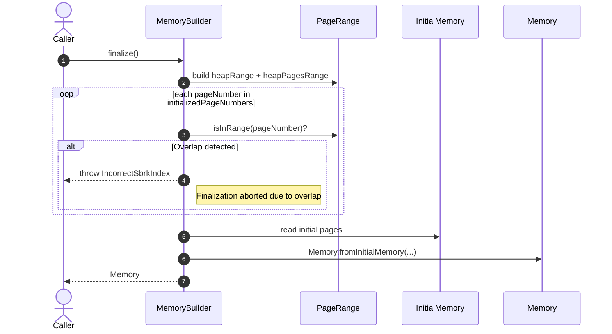

# Improve MemoryBuilder performance

## Pull Request by @mateuszsikora

`MemoryBuilder.finalize` takes a long time because it iterates over all heap pages. I changed the loop to iterate only over initialized pages, which should improve performance.

## Comment by @coderabbitai[bot]

<!-- This is an auto-generated comment: summarize by coderabbit.ai -->
<!-- This is an auto-generated comment: skip review by coderabbit.ai -->

> [!IMPORTANT]
> ## Review skipped
> 
> Auto incremental reviews are disabled on this repository.
> 
> Please check the settings in the CodeRabbit UI or the `.coderabbit.yaml` file in this repository. To trigger a single review, invoke the `@coderabbitai review` command.
> 
> You can disable this status message by setting the `reviews.review_status` to `false` in the CodeRabbit configuration file.

<!-- end of auto-generated comment: skip review by coderabbit.ai -->

<!-- walkthrough_start -->

📝 Walkthrough

<!-- This is an auto-generated comment: release notes by coderabbit.ai -->

## Summary by CodeRabbit

- New Features
  - Added utilities to detect wrapped ranges and verify whether a page lies within a range, improving safety and clarity in memory operations.
- Refactor
  - Streamlined heap range computation and validation to more reliably detect overlaps during initialization, enhancing stability without changing behavior.
- Tests
  - Expanded coverage with comprehensive scenarios for wrapped/non-wrapped ranges, edge cases, and empty ranges to ensure accurate range membership checks.

<!-- end of auto-generated comment: release notes by coderabbit.ai -->
## Walkthrough
Introduces PageRange.isWrapped and PageRange.isInRange; updates MemoryBuilder.finalize to use PageRange membership checks against initializedPageNumbers; adds comprehensive tests for wrapped and non-wrapped range membership. Core finalize flow and Memory construction remain unchanged aside from the page selection and overlap detection logic.

## Changes
| Cohort / File(s) | Summary |
| --- | --- |
| **MemoryBuilder finalize logic** `packages/core/pvm-interpreter/memory/memory-builder.ts` | Refactors heap range checks: computes heapRange and heapPagesRange; iterates over initializedPageNumbers; uses PageRange.isInRange for overlap detection; preserves existing error throw and finalization flow. |
| **PageRange API additions** `packages/core/pvm-interpreter/memory/page-range.ts` | Adds isWrapped() and isInRange(page) to support wrap-aware range queries without altering existing behavior. |
| **PageRange tests** `packages/core/pvm-interpreter/memory/page-range.test.ts` | Adds tests for isWrapped and isInRange across non-wrapped, wrapped, boundaries, empties, and outside-range cases. |

## Sequence Diagram(s)

## Estimated code review effort
🎯 3 (Moderate) | ⏱️ ~25 minutes

## Possibly related PRs
- FluffyLabs/typeberry#358 — Touches MemoryBuilder.finalize page calculations, documenting an edge case when endHeapIndex equals MEMORY_SIZE; closely related to the revised heap page range logic here.

## Suggested reviewers
- tomusdrw
- DrEverr

## Poem
> A hop and a skip through pages I range,  
> I sniff for wraps—such circular change.  
> If heaps overlap, I thump in alarm,  
> Else memory knits, all safe and calm.  
> With whiskered logic and tidy domain,  
> This bunny debugs the rambling lane. 🐇💾

<!-- walkthrough_end -->

<!-- pre_merge_checks_walkthrough_start -->

## Pre-merge checks and finishing touches

✅ Passed checks (3 passed)

|     Check name     | Status   | Explanation                                                                                                                                                                                                                                 |
| :----------------: | :------- | :------------------------------------------------------------------------------------------------------------------------------------------------------------------------------------------------------------------------------------------ |
|     Title Check    | ✅ Passed | The title succinctly describes the primary change by highlighting a performance improvement specifically in MemoryBuilder, matching the core modification where the finalize method iterates only over initialized pages to optimize speed. |
|  Description Check | ✅ Passed | The description directly explains the performance issue in MemoryBuilder.finalize and the change to iterate only over initialized pages, clearly aligning with the actual code modifications in the pull request.                           |
| Docstring Coverage | ✅ Passed | No functions found in the changes. Docstring coverage check skipped.                                                                                                                                                                        |

<!-- pre_merge_checks_walkthrough_end -->

<!-- tips_start -->

---

Comment `@coderabbitai help` to get the list of available commands and usage tips.

<!-- tips_end -->

<!-- internal state start -->

<!-- DwQgtGAEAqAWCWBnSTIEMB26CuAXA9mAOYCmGJATmriQCaQDG+Ats2bgFyQAOFk+AIwBWJBrngA3EsgEBPRvlqU0AgfFwA6NPEgQAfACgjoCEYDEZyAAUASpETZWaCrI5Ho6gDYkuASWa8+FKQALIkzPguAELY8J5KfNyUAGaRzJgMJJAAFLaQZgBsAOwADACUBgCqNgAyXLC4uNyIHAD0rUTqsNgCGkzMrQBintjJybI1KoituLJJApQurdzYnp6txSUGAIJ4sJFc6TTYiABeiPAA1pFoBgDK+NgUmZACVBgMsIeIYPABFEESGA2BEXGABLF4pQwEkKKkKOkPllAEmEMGcpFwr3en0O2gw91w1BOXHwSXxNhIEngJAA7pQWpACMwTrQKDSADSQAAiFAAolIKBQDABhCgkah0dCcSAAJhKMoArGASgBOMAygrQVUcADMAEZdQAWABaRi50gYFHg3HE+AwbjCoNkMTiCQ0yXgGDQnngpyyNLQyEQnnwNNeojQJyy6hQNCoNHogL43s8kFg4u4PDQpEQGhg6cYsEwpEgEVo8A90kZBZDpMZ+Fjyho/AwnnkSZQGHU8G9vsl3Gz0k5NIQnxQyE9NAwSnoBBQ/0BPBSaQyJA0Rn0xnAUDIieSOAIxDITcl/TYGGlvH4wlE4ikMnkTASKjUmm0ujAhhMUDgqFQmAPQhSHIeNTxYc9pSoMMHCcFxXkfRRlFUdQtB0Tct1MAwBwYS5B2mJgxWWCRmF+C9KF4Eg41aEFIlkajwlo8FITdXAWgMAAiTiDAsSBtl8I8QIlegYPSOD8H3T5i2kDdIF8LAPS9H0/U5XAC36FZCVtLBxOrLJ3hLTB6AHHM00DcMyEgMUvTYehkgBZhIBOT0iHQexnO8SypMgCRnB7AQPLnRASAHUC0wzGwvMMsK0G4Kw8IijBSDzOAsiCzEdOMqs509RAkjEcdIAwUNIASSRJTslh0CwT1u17P1aDi0gADlHAWChkGcKhZE5eN0z4VSAIqhy0BKygyqMvD7Eo9cfxrfA6yYaduztQspNs+zC1ES5nMgEgAA8kCnF4dJq8RvUdWjvJ7askA0U6e08C6XA0ItEGyTKWuYNqykgeFdrQMdMtGq0pHWyrVL0qSVIbT4tp2kdKL6/6x3uur+0HT62oKmkuk9aLYvirynMS8c5IS0h3ox1rKDKGbICiEgiypSJLPCPEGVUgEwzkgixTEO43kuOSlD2lB9wApNPBiyAcdUztaqU9GTNlhAsAhxl0Uo/HPMS6NkCUGgxDoABufgIbZJAskCTJJTnJ7ZHdey5IV+30BkEh4TXfM9OkdL9wUtHIBDToGCq2zPTq6h4BW5IQzDMV0hyxyPiLXXaHXIxuMsbZPDjKO7WQOd1aUBgpfjaOMGQHT9u4SIE34RIeh9UP2G7aSDCK8gjF5RBxCOMClFZqlaV2sY664MJy0cDiuIMCAwCMbDcJzVoCJIIiSMncixSomilkysB9LXGhe40Vi3E49is94/jgJPYTHFE9sJNTnN3ALcsxk7XAAVobBMg6oVEeaV+D7hPqxX6LNGokHJtGLAe86IHyPmfX2Z9cyyUxGgWgtBC40gbOQMMShECWngAsV4IYcIMiQAAdSoNwJI9AopIDJlJZKBYaF0IYYyX2yABQVnkANTBOsSyLV7hQf+9c5w0joegAE2Bpy6VLAxOCuUAZZF5reNsrNa4UAgdImKXCoqdzAPo+hkpe4SnQSlUmGBYHcN7h1bBpZVjiG4B5YhZBfL4ELg2Ph4wZbpnNq5ToUgsBAwwNTPgPoqwqzxiNaBsDORMD4STYxpjDEKPSZKI+iBOR0BEYGGJfUsjqyBiQAAjtgb0QZCS6IbrtaceSAizGEUOMO/A8BgHEofLysNKF5iag2QIf8xAVwUIPSSusOpih4GKIKF5Tbq0mSZRA+BvBaP2lOWcvsFACkHO0xaP81m/Tjt5XstB87ySgYOOxCwmbRwoBncw2dc5Ngrj4xRJcy6XKrvuGuddJQsxWP5eALcLxt0QEYTuJBu69z+EJcZPth5hg9vCaUk94DT0vhuTCS88Kr0iOvbgxFSJxgorvZRiDBw9N1mgi+XEeJ8QEvfewj9nDP1WlM9weCgFhmBc3JRqlFDIDpDMrBM56yKISb0qWiA2JQA4QYug2QyhcAEPNbwAFAAoBKzXATxK6MnEdGfcFi6l6AALwNMYQo9WR8CpFUxOEG0Ds542NgZTUgXBoGYxpmqjV4osA6r6ZcEVgSkYjRCRZcJkSg7UhFbjNWBYj7Di6EHfAIcSoVmSGNEmf0sn0AkMgNJnDslSVzO/aQWQ2BCpwbIuBRyRmSm9HaIgFxB77UOjtO1eA4gQryV6EFJMa7NxjPmmlJYDa3jGVFEEbVEAIEzJUsaMSuiPEwa8q0Q6DpwpJnctAzM+B/WLUq+gOSBkNnwEE5I8jRl2m9JykyLNFiRDAKnWgPoSZYKECcXAEFplWzmewDOPc+4IqfEi6kKKx66InnQTFzAZ5Xznp+DCO4FE6UjIeO+oF6BnnYFwKCrLYLyDkIiqgyE3xoRQ9+BQrB1AAH14A4Po2KZFdB6OmsxOhGjOoigAA4VQyhICqAQhps0lD4wJ2gCoFQCAVMkPjDBDQMCU4aPUtAdQyhlLQSTJRSh6g/IYAwNGzwMaY4gFjlJIPsd3IZ4z25ZkkHo2wCgpB6PBos5xuzBgADeBhICQHYkgWwUQKGXDoMKcC7ArDeITOxLgyRqkkHZP5wL87HjxFC/gHCth4u/SSylgLQXEAAHkBRWmwWQPLiXPBBUK4F8stAbDyK5Nlu4P9nKIGFOmHCeWf7YGS6l9ijXmsYA8Lgbw3Wtp9aNfV4bTHRvmmIVaG0Fcpu9a4P1wbRWP3hdoL4OVA3EDtYoHlzic3ZW4HW5cCkDhc6IDywAbVSwFvzAX3uBeDU1NAbAzvjY8td9i9WPvsQsXqh7m3Zsvfe+xYdmBLl/YLOICbqV/4ME9GILRRCSELELgWXg8K4LLKyKRhARBYA+nJ+IT9S44QriRPOQIUgIL2DyhWUFKZ5B43ti6KEFBORHE+DtJZhLSyKHZwwS5ATKAlILAHRWgr9j0HUCeKurZ2wCnlmdRWE0TJzlJH3PsrOSB0A0ED6HRW5lrJ7XaM7gyH1VmcFkcgdAm145KV4PWCgPiW3aQDBgTwJRaLFLHW87vSx4gaanTIEEzfA5h2WEgZ2AwUC7Ilc3H3LeiDtB6IgTwk8JYKxbwLkR4CdEUtd77v2uDsWR94K+H2AC+8e3uZ/Yl9n7BfAtLZIatlagP49FbBycGbA3B+Bbh16LSiOsjY5W1pTNfMJvyDh0nUpy4ESrnHA4OBoRKW87dPLo3UUlmvxKQ2FXoU7RaI7KjHXWYcxJM1RQLRvYiBp5cirRRAM9X3vA2Lz+DnLSCcRNK2VYVMMUJdU+DPNvK3EYafGve3Ynf9IBV3RhcPOfa0BfLBCpKpGgLRSXG0fPcPCIO8KXJhAIbwCCKXHSdWbAbgC5GgOPYvdiRPZPZwD/GAkHPmHPMvfParIvTPEvK0cvb0SvTvM7TAvvDABvd7ZvaHVvEHDvavbvbLMRHaSLPZUgLgmHYfCHQ1MfFgyfBHRAhsa9D4YAyBeRZXUAh3dBVrBgdQkmZJZQERHrS4ewbaMxdOHQorNgmvFPTg8fdiUvUQzwcQlQ4bNQjrRKB7aHRvVLAAXQu0DFwFsB73nwrjOwVD4wKEkz1FKDQBNzQCKCKAuT4xKAECKDGAKBICKB1AKAYGSD1AED4wU201oBKCwQVGKD4zExIGUxVD1GSCUz1DQByMNAVEVGGJgPYku1sH+y73YlaI9jlGwQKD1D1AGNUGaLKJ1AGPFDEz1D43Uz1BVBGK6MND4xIEk0mOSAVDQDaMqI2L1AVA9h1AVENGE0yFoCvgSPswgEc2c0oDcw83o1s30CAA -->

<!-- internal state end -->

## Comment by @github-actions[bot]

View all

| File | Benchmark | Ops |  |
|------|-----------|-----|--|
| [bytes/hex-from.ts[0]](../blob/f168633fb4d88680605438029a824ec919d3b6ba//_work/typeberry-runner-2/typeberry/typeberry/benchmarks/bytes/hex-from.ts) | parse hex using `Number` with NaN checking | 126933.09 ±0.7% | 84.62% slower |
| [bytes/hex-from.ts[1]](../blob/f168633fb4d88680605438029a824ec919d3b6ba//_work/typeberry-runner-2/typeberry/typeberry/benchmarks/bytes/hex-from.ts) | parse hex from char codes | 825374.65 ±0.89% | fastest ✅ |
| [bytes/hex-from.ts[2]](../blob/f168633fb4d88680605438029a824ec919d3b6ba//_work/typeberry-runner-2/typeberry/typeberry/benchmarks/bytes/hex-from.ts) | parse hex from string nibbles | 526106.15 ±0.35% | 36.26% slower |
| [codec/decoding.ts[0]](../blob/f168633fb4d88680605438029a824ec919d3b6ba//_work/typeberry-runner-2/typeberry/typeberry/benchmarks/codec/decoding.ts) | manual decode | 23661257.4 ±0.52% | 87.93% slower |
| [codec/decoding.ts[1]](../blob/f168633fb4d88680605438029a824ec919d3b6ba//_work/typeberry-runner-2/typeberry/typeberry/benchmarks/codec/decoding.ts) | int32array decode | 193716702.6 ±4.05% | 1.22% slower |
| [codec/decoding.ts[2]](../blob/f168633fb4d88680605438029a824ec919d3b6ba//_work/typeberry-runner-2/typeberry/typeberry/benchmarks/codec/decoding.ts) | dataview decode | 196113538.02 ±3.82% | fastest ✅ |
| [codec/encoding.ts[0]](../blob/f168633fb4d88680605438029a824ec919d3b6ba//_work/typeberry-runner-2/typeberry/typeberry/benchmarks/codec/encoding.ts) | manual encode | 2952207.99 ±0.51% | 21.75% slower |
| [codec/encoding.ts[1]](../blob/f168633fb4d88680605438029a824ec919d3b6ba//_work/typeberry-runner-2/typeberry/typeberry/benchmarks/codec/encoding.ts) | int32array encode | 3772862.55 ±0.46% | fastest ✅ |
| [codec/encoding.ts[2]](../blob/f168633fb4d88680605438029a824ec919d3b6ba//_work/typeberry-runner-2/typeberry/typeberry/benchmarks/codec/encoding.ts) | dataview encode | 3738989.63 ±0.46% | 0.9% slower |
| [bytes/hex-to.ts[0]](../blob/f168633fb4d88680605438029a824ec919d3b6ba//_work/typeberry-runner-2/typeberry/typeberry/benchmarks/bytes/hex-to.ts) | number toString + padding | 310259.57 ±1.67% | fastest ✅ |
| [bytes/hex-to.ts[1]](../blob/f168633fb4d88680605438029a824ec919d3b6ba//_work/typeberry-runner-2/typeberry/typeberry/benchmarks/bytes/hex-to.ts) | manual | 16476.7 ±0.43% | 94.69% slower |
| [codec/bigint.compare.ts[0]](../blob/f168633fb4d88680605438029a824ec919d3b6ba//_work/typeberry-runner-2/typeberry/typeberry/benchmarks/codec/bigint.compare.ts) | compare custom | 272593179.17 ±4.24% | fastest ✅ |
| [codec/bigint.compare.ts[1]](../blob/f168633fb4d88680605438029a824ec919d3b6ba//_work/typeberry-runner-2/typeberry/typeberry/benchmarks/codec/bigint.compare.ts) | compare bigint | 264158618.15 ±4.43% | 3.09% slower |
| [codec/bigint.decode.ts[0]](../blob/f168633fb4d88680605438029a824ec919d3b6ba//_work/typeberry-runner-2/typeberry/typeberry/benchmarks/codec/bigint.decode.ts) | decode custom | 218577616.75 ±4.52% | fastest ✅ |
| [codec/bigint.decode.ts[1]](../blob/f168633fb4d88680605438029a824ec919d3b6ba//_work/typeberry-runner-2/typeberry/typeberry/benchmarks/codec/bigint.decode.ts) | decode bigint | 110500165.92 ±2.52% | 49.45% slower |
| [math/mul_overflow.ts[0]](../blob/f168633fb4d88680605438029a824ec919d3b6ba//_work/typeberry-runner-2/typeberry/typeberry/benchmarks/math/mul_overflow.ts) | multiply and bring back to u32 | 278806951.03 ±4.64% | fastest ✅ |
| [math/mul_overflow.ts[1]](../blob/f168633fb4d88680605438029a824ec919d3b6ba//_work/typeberry-runner-2/typeberry/typeberry/benchmarks/math/mul_overflow.ts) | multiply and take modulus | 270179623.74 ±6.47% | 3.09% slower |
| [math/switch.ts[0]](../blob/f168633fb4d88680605438029a824ec919d3b6ba//_work/typeberry-runner-2/typeberry/typeberry/benchmarks/math/switch.ts) | switch | 263617277.5 ±6.45% | 1.5% slower |
| [math/switch.ts[1]](../blob/f168633fb4d88680605438029a824ec919d3b6ba//_work/typeberry-runner-2/typeberry/typeberry/benchmarks/math/switch.ts) | if | 267622853.51 ±5.39% | fastest ✅ |
| [math/count-bits-u64.ts[0]](../blob/f168633fb4d88680605438029a824ec919d3b6ba//_work/typeberry-runner-2/typeberry/typeberry/benchmarks/math/count-bits-u64.ts) | standard method | 8097342.92 ±1.31% | 91.51% slower |
| [math/count-bits-u64.ts[1]](../blob/f168633fb4d88680605438029a824ec919d3b6ba//_work/typeberry-runner-2/typeberry/typeberry/benchmarks/math/count-bits-u64.ts) | magic | 95386895.9 ±1.17% | fastest ✅ |
| [hash/index.ts[0]](../blob/f168633fb4d88680605438029a824ec919d3b6ba//_work/typeberry-runner-2/typeberry/typeberry/benchmarks/hash/index.ts) | hash with numeric representation | 188.74 ±0.72% | 28.7% slower |
| [hash/index.ts[1]](../blob/f168633fb4d88680605438029a824ec919d3b6ba//_work/typeberry-runner-2/typeberry/typeberry/benchmarks/hash/index.ts) | hash with string representation | 109.97 ±2.35% | 58.46% slower |
| [hash/index.ts[2]](../blob/f168633fb4d88680605438029a824ec919d3b6ba//_work/typeberry-runner-2/typeberry/typeberry/benchmarks/hash/index.ts) | hash with symbol representation | 182.6 ±0.44% | 31.02% slower |
| [hash/index.ts[3]](../blob/f168633fb4d88680605438029a824ec919d3b6ba//_work/typeberry-runner-2/typeberry/typeberry/benchmarks/hash/index.ts) | hash with uint8 representation | 164.74 ±0.25% | 37.77% slower |
| [hash/index.ts[4]](../blob/f168633fb4d88680605438029a824ec919d3b6ba//_work/typeberry-runner-2/typeberry/typeberry/benchmarks/hash/index.ts) | hash with packed representation | 264.73 ±0.3% | fastest ✅ |
| [hash/index.ts[5]](../blob/f168633fb4d88680605438029a824ec919d3b6ba//_work/typeberry-runner-2/typeberry/typeberry/benchmarks/hash/index.ts) | hash with bigint representation | 194.56 ±0.24% | 26.51% slower |
| [hash/index.ts[6]](../blob/f168633fb4d88680605438029a824ec919d3b6ba//_work/typeberry-runner-2/typeberry/typeberry/benchmarks/hash/index.ts) | hash with uint32 representation | 204.04 ±0.15% | 22.93% slower |
| [math/add_one_overflow.ts[0]](../blob/f168633fb4d88680605438029a824ec919d3b6ba//_work/typeberry-runner-2/typeberry/typeberry/benchmarks/math/add_one_overflow.ts) | add and take modulus | 271402528.66 ±4.86% | 0.1% slower |
| [math/add_one_overflow.ts[1]](../blob/f168633fb4d88680605438029a824ec919d3b6ba//_work/typeberry-runner-2/typeberry/typeberry/benchmarks/math/add_one_overflow.ts) | condition before calculation | 271676796.77 ±3.86% | fastest ✅ |
| [math/count-bits-u32.ts[0]](../blob/f168633fb4d88680605438029a824ec919d3b6ba//_work/typeberry-runner-2/typeberry/typeberry/benchmarks/math/count-bits-u32.ts) | standard method | 78443309.61 ±1.37% | 68.7% slower |
| [math/count-bits-u32.ts[1]](../blob/f168633fb4d88680605438029a824ec919d3b6ba//_work/typeberry-runner-2/typeberry/typeberry/benchmarks/math/count-bits-u32.ts) | magic | 250608149.59 ±4.53% | fastest ✅ |
| [collections/map-set.ts[0]](../blob/f168633fb4d88680605438029a824ec919d3b6ba//_work/typeberry-runner-2/typeberry/typeberry/benchmarks/collections/map-set.ts) | 2 gets + conditional set | 109384.19 ±0.33% | fastest ✅ |
| [collections/map-set.ts[1]](../blob/f168633fb4d88680605438029a824ec919d3b6ba//_work/typeberry-runner-2/typeberry/typeberry/benchmarks/collections/map-set.ts) | 1 get 1 set | 60924.07 ±0.18% | 44.3% slower |
| [logger/index.ts[0]](../blob/f168633fb4d88680605438029a824ec919d3b6ba//_work/typeberry-runner-2/typeberry/typeberry/benchmarks/logger/index.ts) | console.log with string concat | 9037395.64 ±35.98% | fastest ✅ |
| [logger/index.ts[1]](../blob/f168633fb4d88680605438029a824ec919d3b6ba//_work/typeberry-runner-2/typeberry/typeberry/benchmarks/logger/index.ts) | console.log with args | 740409.6 ±90.15% | 91.81% slower |
| [codec/view_vs_object.ts[0]](../blob/f168633fb4d88680605438029a824ec919d3b6ba//_work/typeberry-runner-2/typeberry/typeberry/benchmarks/codec/view_vs_object.ts) | Get the first field from Decoded | 363893.07 ±1.15% | 7.62% slower |
| [codec/view_vs_object.ts[1]](../blob/f168633fb4d88680605438029a824ec919d3b6ba//_work/typeberry-runner-2/typeberry/typeberry/benchmarks/codec/view_vs_object.ts) | Get the first field from View | 79732.4 ±0.58% | 79.76% slower |
| [codec/view_vs_object.ts[2]](../blob/f168633fb4d88680605438029a824ec919d3b6ba//_work/typeberry-runner-2/typeberry/typeberry/benchmarks/codec/view_vs_object.ts) | Get the first field as view from View | 79010.07 ±0.55% | 79.94% slower |
| [codec/view_vs_object.ts[3]](../blob/f168633fb4d88680605438029a824ec919d3b6ba//_work/typeberry-runner-2/typeberry/typeberry/benchmarks/codec/view_vs_object.ts) | Get two fields from Decoded | 387707.61 ±1.19% | 1.58% slower |
| [codec/view_vs_object.ts[4]](../blob/f168633fb4d88680605438029a824ec919d3b6ba//_work/typeberry-runner-2/typeberry/typeberry/benchmarks/codec/view_vs_object.ts) | Get two fields from View | 66652.47 ±1.06% | 83.08% slower |
| [codec/view_vs_object.ts[5]](../blob/f168633fb4d88680605438029a824ec919d3b6ba//_work/typeberry-runner-2/typeberry/typeberry/benchmarks/codec/view_vs_object.ts) | Get two fields from materialized from View | 140396.89 ±1.06% | 64.36% slower |
| [codec/view_vs_object.ts[6]](../blob/f168633fb4d88680605438029a824ec919d3b6ba//_work/typeberry-runner-2/typeberry/typeberry/benchmarks/codec/view_vs_object.ts) | Get two fields as views from View | 66564.8 ±1.09% | 83.1% slower |
| [codec/view_vs_object.ts[7]](../blob/f168633fb4d88680605438029a824ec919d3b6ba//_work/typeberry-runner-2/typeberry/typeberry/benchmarks/codec/view_vs_object.ts) | Get only third field from Decoded | 393923.33 ±0.69% | fastest ✅ |
| [codec/view_vs_object.ts[8]](../blob/f168633fb4d88680605438029a824ec919d3b6ba//_work/typeberry-runner-2/typeberry/typeberry/benchmarks/codec/view_vs_object.ts) | Get only third field from View | 83855.39 ±2.02% | 78.71% slower |
| [codec/view_vs_object.ts[9]](../blob/f168633fb4d88680605438029a824ec919d3b6ba//_work/typeberry-runner-2/typeberry/typeberry/benchmarks/codec/view_vs_object.ts) | Get only third field as view from View | 79377.84 ±2.51% | 79.85% slower |
| [codec/view_vs_collection.ts[0]](../blob/f168633fb4d88680605438029a824ec919d3b6ba//_work/typeberry-runner-2/typeberry/typeberry/benchmarks/codec/view_vs_collection.ts) | Get first element from Decoded | 23231.7 ±2.78% | 54.38% slower |
| [codec/view_vs_collection.ts[1]](../blob/f168633fb4d88680605438029a824ec919d3b6ba//_work/typeberry-runner-2/typeberry/typeberry/benchmarks/codec/view_vs_collection.ts) | Get first element from View | 50927.24 ±2.09% | fastest ✅ |
| [codec/view_vs_collection.ts[2]](../blob/f168633fb4d88680605438029a824ec919d3b6ba//_work/typeberry-runner-2/typeberry/typeberry/benchmarks/codec/view_vs_collection.ts) | Get 50th element from Decoded | 24441.93 ±2.57% | 52.01% slower |
| [codec/view_vs_collection.ts[3]](../blob/f168633fb4d88680605438029a824ec919d3b6ba//_work/typeberry-runner-2/typeberry/typeberry/benchmarks/codec/view_vs_collection.ts) | Get 50th element from View | 25713.32 ±1.64% | 49.51% slower |
| [codec/view_vs_collection.ts[4]](../blob/f168633fb4d88680605438029a824ec919d3b6ba//_work/typeberry-runner-2/typeberry/typeberry/benchmarks/codec/view_vs_collection.ts) | Get last element from Decoded | 26117.63 ±2.52% | 48.72% slower |
| [codec/view_vs_collection.ts[5]](../blob/f168633fb4d88680605438029a824ec919d3b6ba//_work/typeberry-runner-2/typeberry/typeberry/benchmarks/codec/view_vs_collection.ts) | Get last element from View | 19645.64 ±2.15% | 61.42% slower |
| [bytes/compare.ts[0]](../blob/f168633fb4d88680605438029a824ec919d3b6ba//_work/typeberry-runner-2/typeberry/typeberry/benchmarks/bytes/compare.ts) | Comparing Uint32 bytes | 18164.78 ±6.15% | 0.91% slower |
| [bytes/compare.ts[1]](../blob/f168633fb4d88680605438029a824ec919d3b6ba//_work/typeberry-runner-2/typeberry/typeberry/benchmarks/bytes/compare.ts) | Comparing raw bytes | 18331.76 ±2.97% | fastest ✅ |
| [hash/blake2b.ts[0]](../blob/f168633fb4d88680605438029a824ec919d3b6ba//_work/typeberry-runner-2/typeberry/typeberry/benchmarks/hash/blake2b.ts) | hasher with simple allocator | 0.045 ±0.9% | fastest ✅ |
| [hash/blake2b.ts[1]](../blob/f168633fb4d88680605438029a824ec919d3b6ba//_work/typeberry-runner-2/typeberry/typeberry/benchmarks/hash/blake2b.ts) | hasher with page allocator | 0.044 ±1.26% | 2.22% slower |
| [collections/map_vs_sorted.ts[0]](../blob/f168633fb4d88680605438029a824ec919d3b6ba//_work/typeberry-runner-2/typeberry/typeberry/benchmarks/collections/map_vs_sorted.ts) | Map | 306743.03 ±0.14% | fastest ✅ |
| [collections/map_vs_sorted.ts[1]](../blob/f168633fb4d88680605438029a824ec919d3b6ba//_work/typeberry-runner-2/typeberry/typeberry/benchmarks/collections/map_vs_sorted.ts) | Map-array | 103117.93 ±0.03% | 66.38% slower |
| [collections/map_vs_sorted.ts[2]](../blob/f168633fb4d88680605438029a824ec919d3b6ba//_work/typeberry-runner-2/typeberry/typeberry/benchmarks/collections/map_vs_sorted.ts) | Array | 61703.64 ±0.35% | 79.88% slower |
| [collections/map_vs_sorted.ts[3]](../blob/f168633fb4d88680605438029a824ec919d3b6ba//_work/typeberry-runner-2/typeberry/typeberry/benchmarks/collections/map_vs_sorted.ts) | SortedArray | 195563.17 ±0.2% | 36.25% slower |
| [crypto/ed25519.ts[0]](../blob/f168633fb4d88680605438029a824ec919d3b6ba//_work/typeberry-runner-2/typeberry/typeberry/benchmarks/crypto/ed25519.ts) | native crypto | 4.33 ±22.59% | 85.79% slower |
| [crypto/ed25519.ts[1]](../blob/f168633fb4d88680605438029a824ec919d3b6ba//_work/typeberry-runner-2/typeberry/typeberry/benchmarks/crypto/ed25519.ts) | wasm lib | 10.86 ±0.04% | 64.36% slower |
| [crypto/ed25519.ts[2]](../blob/f168633fb4d88680605438029a824ec919d3b6ba//_work/typeberry-runner-2/typeberry/typeberry/benchmarks/crypto/ed25519.ts) | wasm lib batch | 30.47 ±0.71% | fastest ✅ |

### Benchmarks summary: 63/63 OK ✅

<!-- thollander/actions-comment-pull-request "benchmarks" -->
