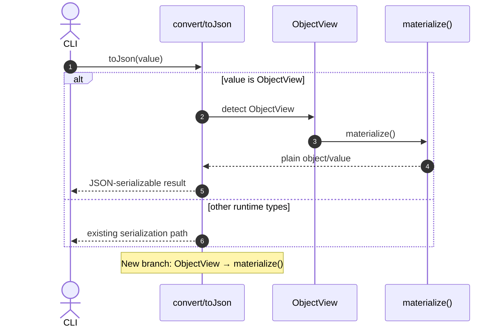

# Fix `toString` of view objects.

## Pull Request by @tomusdrw

Lack of explicit `toString` was causing some issues when `inspect`ing the object (circular dep), for instance when running and printing using `@typeberry/convert`.


## Comment by @coderabbitai[bot]

<!-- This is an auto-generated comment: summarize by coderabbit.ai -->
<!-- This is an auto-generated comment: skip review by coderabbit.ai -->

> [!IMPORTANT]
> ## Review skipped
> 
> Auto incremental reviews are disabled on this repository.
> 
> Please check the settings in the CodeRabbit UI or the `.coderabbit.yaml` file in this repository. To trigger a single review, invoke the `@coderabbitai review` command.
> 
> You can disable this status message by setting the `reviews.review_status` to `false` in the CodeRabbit configuration file.

<!-- end of auto-generated comment: skip review by coderabbit.ai -->

<!-- walkthrough_start -->

<details>
<summary>📝 Walkthrough</summary>

<!-- This is an auto-generated comment: release notes by coderabbit.ai -->

## Summary by CodeRabbit

- New Features
  - JSON conversion now correctly serializes view objects by materializing them.
  - Views provide clearer string/inspect output with contextual type and cache state, improving debugging.

- Tests
  - Added comprehensive tests for view decoding, field access, and debug string/inspect output in core.
  - Added block-related tests validating view toString and inspect behavior.

<!-- end of auto-generated comment: release notes by coderabbit.ai -->
## Walkthrough
Adds ObjectView handling in bin/convert toJson via materialize(), updates codec view internals to include contextual toString on views/fields, and introduces tests validating view string/inspect output and codec view behavior.

## Changes
| Cohort / File(s) | Summary |
| --- | --- |
| **Convert tool**<br>`bin/convert/main.ts` | Imports `ObjectView` and updates `toJson` to detect `ObjectView` values and call `materialize()` before serialization. |
| **Codec view runtime**<br>`packages/core/codec/view.ts` | Adds `name` parameter to `ViewField` constructor; implements `toString()` on `ViewField`, `ObjectView`, and `SequenceView`; updates instantiation sites to pass names for improved debug strings. Public constructor signature of `ViewField` changes. |
| **Codec view tests**<br>`packages/core/codec/view.test.ts` | New tests for codec view: defines `MyClass`, encodes/decodes via `Encoder`/`Decoder`, asserts `toString()`/view caching and element access representations. |
| **Block view test helpers**<br>`packages/jam/block/test-helpers.test.ts` | New tests asserting `testBlockView()` string and `inspect(...)` outputs equal "View<Block>(cache: 0)". |

## Sequence Diagram(s)


## Estimated code review effort
🎯 3 (Moderate) | ⏱️ ~25 minutes

## Possibly related PRs
- FluffyLabs/typeberry#523 — Also extends bin/convert toJson for additional runtime types (Map); closely related serialization pathway.
- FluffyLabs/typeberry#454 — Earlier modifications to bin/convert main runtime logic that this PR builds upon.
- FluffyLabs/typeberry#495 — Prior toJson adjustments in bin/convert; same code path extended here for ObjectView.

## Suggested reviewers
- skoszuta
- mateuszsikora
- DrEverr

## Poem
> In bytes and views I thump with cheer,  
> A cache of zero, crystal clear.  
> I nibble strings that softly sing,  
> Materialize—what joys they bring!  
> With tiny paws I test and see,  
> "View<Block>" squeaks in harmony. 🐇✨

</details>

<!-- walkthrough_end -->

<!-- pre_merge_checks_walkthrough_start -->

## Pre-merge checks and finishing touches
<details>
<summary>❌ Failed checks (1 warning)</summary>

|     Check name     | Status     | Explanation                                                                          | Resolution                                                                     |
| :----------------: | :--------- | :----------------------------------------------------------------------------------- | :----------------------------------------------------------------------------- |
| Docstring Coverage | ⚠️ Warning | Docstring coverage is 0.00% which is insufficient. The required threshold is 80.00%. | You can run `@coderabbitai generate docstrings` to improve docstring coverage. |

</details>
<details>
<summary>✅ Passed checks (2 passed)</summary>

|     Check name    | Status   | Explanation                                                                                                                                                                                                                                                                                      |
| :---------------: | :------- | :----------------------------------------------------------------------------------------------------------------------------------------------------------------------------------------------------------------------------------------------------------------------------------------------- |
|    Title Check    | ✅ Passed | The title “Fix `toString` of view objects.” clearly and concisely summarizes the primary change in the pull request by highlighting the addition of explicit `toString` implementations for view objects to resolve inspection issues, and it omits any unnecessary details or extraneous noise. |
| Description Check | ✅ Passed | The description identifies the absence of explicit `toString` implementations causing inspection errors and directly relates to the changes that add these methods, demonstrating clear relevance to the modified code.                                                                          |

</details>

<!-- pre_merge_checks_walkthrough_end -->

<!-- announcements_start -->

> [!TIP]
> <details>
> <summary>👮 Agentic pre-merge checks are now available in preview!</summary>
> 
> Pro plan users can now enable pre-merge checks in their settings to enforce checklists before merging PRs.
> 
> 	- Built-in checks – Quickly apply ready-made checks to enforce title conventions, require pull request descriptions that follow templates, validate linked issues for compliance, and more.
> 	- Custom agentic checks – Define your own rules using CodeRabbit’s advanced agentic capabilities to enforce organization-specific policies and workflows. For example, you can instruct CodeRabbit’s agent to verify that API documentation is updated whenever API schema files are modified in a PR. Note: Upto 5 custom checks are currently allowed during the preview period. Pricing for this feature will be announced in a few weeks.
> 
> Please see the [documentation](https://docs.coderabbit.ai/pr-reviews/pre-merge-checks) for more information.
> 
> Example:
> 
> ```yaml
> reviews:
>   pre_merge_checks:
>     custom_checks:
>       - name: "Undocumented Breaking Changes"
>         mode: "warning"
>         instructions: |
>           Pass/fail criteria: All breaking changes to public APIs, CLI flags, environment variables, configuration keys, database schemas, or HTTP/GraphQL endpoints must be documented in the "Breaking Change" section of the PR description and in CHANGELOG.md. Exclude purely internal or private changes (e.g., code not exported from package entry points or explicitly marked as internal).
> ```
> 
> Please share your feedback with us on this [Discord post](https://discord.com/channels/1134356397673414807/1414771631775158383).
> 
> </details>

<!-- announcements_end -->

<!-- tips_start -->

---


<sub>Comment `@coderabbitai help` to get the list of available commands and usage tips.</sub>

<!-- tips_end -->

<!-- internal state start -->


<!-- DwQgtGAEAqAWCWBnSTIEMB26CuAXA9mAOYCmGJATmriQCaQDG+Ats2bgFyQAOFk+AIwBWJBrngA3EsgEBPRvlqU0AgfFwA6NPEgQAfACgjoCEYDEZyAAUASpETZWaCrKPR1AGxJcAYvAAekAAGBADKuBTwGERB/ABmkBLwJADu/MKiuIgakJAGAHKOApRcAGwA7KW5BgCqNgAyXLC4uNyIHAD0HUTqsNgCGkzMHT4e2HFxsvUqiB24stwkxRQuHdzYHh4dFVV5NYglkATM2Ii0FGl5ofjYFAwkkAJUGAywXLi0YASIEVFEkIAkwhgzlIuEez1eXGY2iwV1w1FOXHwi1hBhsJCSqUo7XsAGt8IgAF54NAAGkg0Jop0JiHg+Ko5IAIhQAKJSFbVabFDw4gAUGHw5AAlNUAMIUEjUOjoTiQABMAAY5QBWMAKgCcYDl6ugAEYFRw5bqOEqAFpGRnSBiRbjiQVcOAPWzoWjnaQHZC4WAPGZke7xdBYEj+bgeeAMdTBMK/aKxeDMUMkNgYeF2rCCxLJNKCERibIwWDUfjMJC0jMMNCnaWl7DSSApb1YKKIRZiP5Hb3pXNg3kShwecTRFBYNCMeB3DbOSBKFFKF6yEWAFAJIHF8Hxg2gE15643IBRsBgMO3MPReFFB/9Tu2ggABeaLZarJgYdm4II5R2MQvRH2u5CYSBg1DcNIxCfBwkiWMjnwPdpHwDwpA7AkHmbVs0zWSCLx4ChBC8ZhsiMfRjHAKAyHofAEkrAhiDIZQaHoIZk1lXgu0ySQ6zkBQlCoVR1C0HQiJMKA4FQVAAKowhSHIKh6IUVh2C4Kg0gcJwXEeeQmG4lQ1E0bRdDAQxiNMAw1AwDpn1fDpoSiDQsg4AwACInIMCxIAAQQASRo6SpXoFToTUiiv0wUhEEI9y/3sbBuG4NcwVXPhv1oMMhwAeQyMQADUs0SNAxjrKJoIAKUQDNOIrTZ20pSh4Dy+BCRIXkRQbMhcvylB/ywdLu2y1INAMKAWX8GgMFoZB41iih4pw5hIDvBYlkoJ9FFEaDhwYMYlEgbrMl6lJyTIFQUv+L0HnINJ9xTeMHm4ahYGHYrSowfqjBcyw3IHOj4EFT0YNO6dRA8ZxqG+jBkCCoC4ulNceH6MMGEAq7xGkcKPITOL7HgIgMARCVIGi2hfK4IIJoxgBvSBLU0yhyRZF4VoockdqynKAF8VxmyAHPmh8ltkcyVoYByAG5YjiTneAxb7TmCUmpsgCmqYZ2n6e4yB2fFlguZ5xaVn56mhdFowWR+eNfK4h4JUxNISAmOKuAAWToeBHEc5yBuM26GFxNBQoFiUBaUBgOmt2zpE0Oy3Yct73K8qS6OlfznHkILXhClGDDcyLR3Oo5w5XeBtwSjsHlFQXM1SYcaCIGTQZyDyUxw2hsHuf885+KL1AeByy6DiuUgcjsiyUOIojrUdEE3RNGCBxBkAd2RRVn5AUl6dB7FTcNIF71alEQa14FtGG94P0z/lHkgPDGrgcbYSBeR+SCiCFckDgAR1rF4HgfkgP79EhMrOHqK1IK2AADMcoX6BnoBgRw98JDOBqBAoUOQrA4SSHvdePwQYI2tJKGgFISBekUNA9eZ4EEEOfI/FuBAKD1xeJtce7dcCMmoKOb0HhFh8C9EWKhEQaGdWHNgr+mZRwLyXmgOegwJRSgOqrAqYIrxDjptTOhfoVrM1wLycRy8NA7wYOSQm8IoEngBtTFea8lbcQ0EHDRGUtE6MkdkfRGg9pyOprQFBkBMo1QvsgR+7YJSSwOCmEGP0Vww3+tbUh5AfjSgvlfRA5IogbWwLQdsFZXjHlGv3JqhDiFjXJJI+sl8PDoGQJfJM7B0AMFbsgJIo5QS8gVCKUx6h6lZiajkOmDg+xmJWvQBB+VkCUleIBEMmRpRBL7OwMJYN74kA0EQDQ5IHJ7WAI4ueeheSZO9FwFpDlVkKn8AqfUCpznnMOVzAALNqa56oKjamVA5FBr0Y4fRoLXcJBAS5mKBl8+ZEMQxQ3InwdYAh4aI3EMjMKA1ID5EFCQY2ptqoMRWrBaJtsEqyiduk12Tlo4ezAEYL2Ps/ZMADgbEOWZbLtCju8uOtEZKJ0cAFFOCQ04/lhVABuERFAt2lDnTcN1gZsE+Wtf6e0/CXzRWDfhYgYamKrPQSMPz47MvXs+Ggw1sB5WghBdsxclACGwP8aZ0hZlpnzFnJQ9BoxP3ybARQ4MsBSuSFfJm9i3GkNCL/T+9w9prQlHELwYgS7jiEfCL+FivSMDQK8B42CaA5BqNwIx1YUyUBxmUvBczMY0GQLyTRgbTG+r/l/PaIofm3Tnr83Ot9E0xn+C1JscrMDiBBkON1MqPwIGQJy0Kvy+H7gVXwWk2NcYPCCv9cFkLu1XyOAtUhZBvytz3AecQd8AlDnNSEze4TV7ELwOgT6DrgyfOzY8EghYkgw2KLIQUdrOxoFdNKY1pr+B4HWJoN5rkPlfW+X9TsQd/lzPBgkSGU1oZgrhlvdg6hkjcsgE7ApmMJ24FuA8AmRNggbScd4rM0qr7AGgOSTKeg4xYCCKS320h/YkEDqIalfUsixCBMOmhMMBRpCCBx0dvJyFSlgi+wUHh5ANq4Nuog5JBMEJkbQUT8hQR7S4HkgAvHobxMnIgUMtpKBTGAxOQGU3lWsqmRQaZgNpyQQn5OKeM0QlRAzzOQEswAIVkAWtzHhBBCiCOFFDTr6AvttcTedtBbLgSbU1STTbKPBBo+StcDGqWh1YwFohQWXSheCMWml9q/gxY3k/eL1H41kroxSlLgtmMpFpf5uFgWSEhboMTMt/qAH5ai0/IrUnSuJcq8lxjwc0uIAaybTd5tqYYpyli+2yHnb4vdhAYlBgBuzCEJuDoEL8DezmOHMAHCuHZALRHOlBKGXeQTn5VlycAwDozjatuudTsF23Otjom3hg7b26dw7l9jthx+LSoeYJgyUAjB6X5r2juUAiXwH7uJ+6wWCZa0G+YPJgjllkSAAolAcCcZQMEpi8feFe8XV74OGB4FBkUlepTylCLQhzLWOtHz8xpzyeuiioene87t3EgbNazVHD5iqzD/ucOxBSflXgPwpD+uHepvjZD2ThZ+KTCgXzYlBgGPnYvBedJFH6vKyA1lZmAPz722zdneEgAc/qPKwZoXbPrgXe08myHdWNX5k8t1NtEUzzIySNCLNWesq3uIbfxr2fboUDkXrpQOBQKQ/iIjaCIM0BKKRnCyr5WUkN+AUhcD42CRHgbD33Td97D3UDTpYC4QlWaASw0m7DPMcpyerXw/1QHtpzvMiftaHgAiBgADa8IiBcAALrhQReQZFk3ZLTatrNu2U1HaLeYPSj2hkhKI3IpRPAkkmVTZYExRSaBlK3bUuVBm2k+J6UEiROSJZcAAH14BjXf6vrEtB3/YLyxEQGD75oBgIkClBoDqjlBgLXLlByilC6gkC6gAAcaApQyoFyKBAgCotAyoaA1yuopQAgxBJAyocQuoCB+ke+L+jE6gn+3+v+KQdA7+ZE1BIBL+ks7+bAFApA7+Ca3siAAB8IQBBkRgZMBguQDkSAtgkedAZc8kKYVgBI9EDkXAcQpuJApIkhXMiATqGwtAketgahK4mh2hUhSAqU7IkQr6GAJhGhPIWhOhDk6StANgB4jIu2Bq0QiAoo3o3sJh/CThUhrh7hGA7guAXgfhoguIgR+4wRXMoRHhVoNoaY0RAR7w8R5hXMKUuIdAHkc8tYiAEEJhTk2RDks8uA6RuI6I/YWQJhY+OhuQEhuQrRXMAhuI+QwqpRER241RhyTRrRDkSapwcRtY2RbRDkQEQMOMaYPRnY0K24gAOAR+CBBgTeExABjRI5iZDZCAC4BDPJKBQEZqYs+JDpfPIEnJEA1J6J2GeGysFD+A9DOhsGUhKH/B3JxAgJnmGJnlhP9CFghhmECsBBGGCOsXFigFuFUqEt3sXNsfYr9LBKVAhChAPm2BmDWNIEUjkpGCwO0oGPIAeOQHUndkoPCIXODOuMNM8CQDcMgAKEgIsgMW0VIX2PBDToKKUQio8YOs4GdKIO6HdsUv9IsT6LUrcFKEZsGqGjjv9NZOmPYuxHrp2A9gcMTrif+DFDhGeFKRpIKOcRoCyayQ5MwCtKUTnhQEeNEMaZMRKM+KPEQJhvYWYYMVIWuFjFEHlNUV0WwKUWKdHG0azBMQrG6e0f4Z0d0VwA5JaPvKkbrv0SGVISMYgGMQkZMdMZgHMvMQ8CfPGZiXOOIH4r8r6CIiCfDKBAVlBBNHhGjuEhWEov8KhGxBmEtGuJ1PQOkvaZEfIBKEDAWhKqqd+IOjwsTq6CXAcI6s6oYkmD9OnlhBtEcbBF4AgiIj8vKYoPABfGikoEaUmVzOyWMHMdGTyavmWPMvybjiQHQInCkg8P9HmYfGmC6CbjQEZpmc2L8maeIBQrrsXCTpOiqVhmmlKNkLaUMWaUoBac4NaUQOBWyaIIKI6c6eoa6ayVzB6T0Nmj6VGYkSkU+aDIGa0cGYMS0SaR0b6SQKUZ4QwJrmXOyLRvBboamKMahY4fuVMSGDMdmdGTRZrkwAxaQB1PbhoOcgAKQ7jhj3SiRgzjCjwRjsC9p6YfzjjSheh9hOoLqoAoEKiiUKhiV7lhkOSHmcl2HRkACaNwcaWAl0wQN4qiD+FJDmPkBCCmtFTaY2a0E06CuZu2/F+AglzJHFkFVF0ZlpsFTFDkmFXpHgOFfp0ZblUmqZgxrMOh0+5RlRtgsZB8tohF0ZCoyo+ocoAgDACoJAKBDAyoeBAgYCuo9y5Q1yAg5Q5QcQAgcotAOw+oGhKocoKBcQYCpQpQco9ytADAGBuoyoYCyoyo2BogMBFB6oxpFRkiuAtgvRoVXMKBcocQ1ytA6oDA4B5Q5BlQSoDAAgaAZVpyvV1yZBuoDAlBYBtA1yYC6oogxBE1EwU1pQ6oz1FYDyuoqBpQDA2Bco0cqVHBEA2EJA3BlAfBHRQhbB+gQAA=== -->

<!-- internal state end -->


## Comment by @github-actions[bot]


<details>
<summary>View all</summary>

| File | Benchmark | Ops |  |
|------|-----------|-----|--|
| [bytes/hex-from.ts[0]](../blob/60f541da32a37292706e823f89247ea7477001ca//_work/typeberry-1/typeberry/typeberry/benchmarks/bytes/hex-from.ts) | parse hex using `Number` with NaN checking | 142497.17 ±0.33% | 83.97% slower |
| [bytes/hex-from.ts[1]](../blob/60f541da32a37292706e823f89247ea7477001ca//_work/typeberry-1/typeberry/typeberry/benchmarks/bytes/hex-from.ts) | parse hex from char codes | 888782.53 ±0.18% | fastest ✅ |
| [bytes/hex-from.ts[2]](../blob/60f541da32a37292706e823f89247ea7477001ca//_work/typeberry-1/typeberry/typeberry/benchmarks/bytes/hex-from.ts) | parse hex from string nibbles | 566243.27 ±0.18% | 36.29% slower |
| [math/switch.ts[0]](../blob/60f541da32a37292706e823f89247ea7477001ca//_work/typeberry-1/typeberry/typeberry/benchmarks/math/switch.ts) | switch | 264337178.82 ±6.28% | fastest ✅ |
| [math/switch.ts[1]](../blob/60f541da32a37292706e823f89247ea7477001ca//_work/typeberry-1/typeberry/typeberry/benchmarks/math/switch.ts) | if | 258616966.94 ±6.23% | 2.16% slower |
| [hash/index.ts[0]](../blob/60f541da32a37292706e823f89247ea7477001ca//_work/typeberry-1/typeberry/typeberry/benchmarks/hash/index.ts) | hash with numeric representation | 194.04 ±0.03% | 26.11% slower |
| [hash/index.ts[1]](../blob/60f541da32a37292706e823f89247ea7477001ca//_work/typeberry-1/typeberry/typeberry/benchmarks/hash/index.ts) | hash with string representation | 120.12 ±0.13% | 54.26% slower |
| [hash/index.ts[2]](../blob/60f541da32a37292706e823f89247ea7477001ca//_work/typeberry-1/typeberry/typeberry/benchmarks/hash/index.ts) | hash with symbol representation | 185.44 ±0.05% | 29.38% slower |
| [hash/index.ts[3]](../blob/60f541da32a37292706e823f89247ea7477001ca//_work/typeberry-1/typeberry/typeberry/benchmarks/hash/index.ts) | hash with uint8 representation | 165.84 ±0.02% | 36.84% slower |
| [hash/index.ts[4]](../blob/60f541da32a37292706e823f89247ea7477001ca//_work/typeberry-1/typeberry/typeberry/benchmarks/hash/index.ts) | hash with packed representation | 262.59 ±0.22% | fastest ✅ |
| [hash/index.ts[5]](../blob/60f541da32a37292706e823f89247ea7477001ca//_work/typeberry-1/typeberry/typeberry/benchmarks/hash/index.ts) | hash with bigint representation | 192.5 ±0.31% | 26.69% slower |
| [hash/index.ts[6]](../blob/60f541da32a37292706e823f89247ea7477001ca//_work/typeberry-1/typeberry/typeberry/benchmarks/hash/index.ts) | hash with uint32 representation | 200.42 ±0.23% | 23.68% slower |
| [math/add_one_overflow.ts[0]](../blob/60f541da32a37292706e823f89247ea7477001ca//_work/typeberry-1/typeberry/typeberry/benchmarks/math/add_one_overflow.ts) | add and take modulus | 241740425.23 ±6.5% | 11.7% slower |
| [math/add_one_overflow.ts[1]](../blob/60f541da32a37292706e823f89247ea7477001ca//_work/typeberry-1/typeberry/typeberry/benchmarks/math/add_one_overflow.ts) | condition before calculation | 273759038.02 ±4.11% | fastest ✅ |
| [math/count-bits-u32.ts[0]](../blob/60f541da32a37292706e823f89247ea7477001ca//_work/typeberry-1/typeberry/typeberry/benchmarks/math/count-bits-u32.ts) | standard method | 99241271.81 ±2.06% | 60.91% slower |
| [math/count-bits-u32.ts[1]](../blob/60f541da32a37292706e823f89247ea7477001ca//_work/typeberry-1/typeberry/typeberry/benchmarks/math/count-bits-u32.ts) | magic | 253850665.56 ±4.66% | fastest ✅ |
| [math/count-bits-u64.ts[0]](../blob/60f541da32a37292706e823f89247ea7477001ca//_work/typeberry-1/typeberry/typeberry/benchmarks/math/count-bits-u64.ts) | standard method | 1823423.01 ±0.28% | 84.13% slower |
| [math/count-bits-u64.ts[1]](../blob/60f541da32a37292706e823f89247ea7477001ca//_work/typeberry-1/typeberry/typeberry/benchmarks/math/count-bits-u64.ts) | magic | 11486512.43 ±0.21% | fastest ✅ |
| [codec/bigint.decode.ts[0]](../blob/60f541da32a37292706e823f89247ea7477001ca//_work/typeberry-1/typeberry/typeberry/benchmarks/codec/bigint.decode.ts) | decode custom | 178938704.76 ±2.54% | fastest ✅ |
| [codec/bigint.decode.ts[1]](../blob/60f541da32a37292706e823f89247ea7477001ca//_work/typeberry-1/typeberry/typeberry/benchmarks/codec/bigint.decode.ts) | decode bigint | 110618600.39 ±2.19% | 38.18% slower |
| [codec/decoding.ts[0]](../blob/60f541da32a37292706e823f89247ea7477001ca//_work/typeberry-1/typeberry/typeberry/benchmarks/codec/decoding.ts) | manual decode | 23573854.21 ±0.46% | 86.18% slower |
| [codec/decoding.ts[1]](../blob/60f541da32a37292706e823f89247ea7477001ca//_work/typeberry-1/typeberry/typeberry/benchmarks/codec/decoding.ts) | int32array decode | 170523641.56 ±2.06% | fastest ✅ |
| [codec/decoding.ts[2]](../blob/60f541da32a37292706e823f89247ea7477001ca//_work/typeberry-1/typeberry/typeberry/benchmarks/codec/decoding.ts) | dataview decode | 167068620.53 ±2.66% | 2.03% slower |
| [codec/encoding.ts[0]](../blob/60f541da32a37292706e823f89247ea7477001ca//_work/typeberry-1/typeberry/typeberry/benchmarks/codec/encoding.ts) | manual encode | 3011581.24 ±0.13% | 16.56% slower |
| [codec/encoding.ts[1]](../blob/60f541da32a37292706e823f89247ea7477001ca//_work/typeberry-1/typeberry/typeberry/benchmarks/codec/encoding.ts) | int32array encode | 3609132.84 ±0.16% | fastest ✅ |
| [codec/encoding.ts[2]](../blob/60f541da32a37292706e823f89247ea7477001ca//_work/typeberry-1/typeberry/typeberry/benchmarks/codec/encoding.ts) | dataview encode | 3602311.06 ±0.16% | 0.19% slower |
| [collections/map-set.ts[0]](../blob/60f541da32a37292706e823f89247ea7477001ca//_work/typeberry-1/typeberry/typeberry/benchmarks/collections/map-set.ts) | 2 gets + conditional set | 121545.95 ±0.12% | fastest ✅ |
| [collections/map-set.ts[1]](../blob/60f541da32a37292706e823f89247ea7477001ca//_work/typeberry-1/typeberry/typeberry/benchmarks/collections/map-set.ts) | 1 get 1 set | 61777.23 ±0.01% | 49.17% slower |
| [bytes/hex-to.ts[0]](../blob/60f541da32a37292706e823f89247ea7477001ca//_work/typeberry-1/typeberry/typeberry/benchmarks/bytes/hex-to.ts) | number toString + padding | 333295.03 ±0.07% | fastest ✅ |
| [bytes/hex-to.ts[1]](../blob/60f541da32a37292706e823f89247ea7477001ca//_work/typeberry-1/typeberry/typeberry/benchmarks/bytes/hex-to.ts) | manual | 16626.87 ±0.12% | 95.01% slower |
| [codec/bigint.compare.ts[0]](../blob/60f541da32a37292706e823f89247ea7477001ca//_work/typeberry-1/typeberry/typeberry/benchmarks/codec/bigint.compare.ts) | compare custom | 263355762.07 ±5.53% | fastest ✅ |
| [codec/bigint.compare.ts[1]](../blob/60f541da32a37292706e823f89247ea7477001ca//_work/typeberry-1/typeberry/typeberry/benchmarks/codec/bigint.compare.ts) | compare bigint | 253520549.31 ±5.81% | 3.73% slower |
| [math/mul_overflow.ts[0]](../blob/60f541da32a37292706e823f89247ea7477001ca//_work/typeberry-1/typeberry/typeberry/benchmarks/math/mul_overflow.ts) | multiply and bring back to u32 | 269695787.14 ±5.51% | fastest ✅ |
| [math/mul_overflow.ts[1]](../blob/60f541da32a37292706e823f89247ea7477001ca//_work/typeberry-1/typeberry/typeberry/benchmarks/math/mul_overflow.ts) | multiply and take modulus | 260081427.13 ±5.15% | 3.56% slower |
| [logger/index.ts[0]](../blob/60f541da32a37292706e823f89247ea7477001ca//_work/typeberry-1/typeberry/typeberry/benchmarks/logger/index.ts) | console.log with string concat | 7210755.72 ±59.39% | fastest ✅ |
| [logger/index.ts[1]](../blob/60f541da32a37292706e823f89247ea7477001ca//_work/typeberry-1/typeberry/typeberry/benchmarks/logger/index.ts) | console.log with args | 1047921.1 ±100.73% | 85.47% slower |
| [codec/view_vs_collection.ts[0]](../blob/60f541da32a37292706e823f89247ea7477001ca//_work/typeberry-1/typeberry/typeberry/benchmarks/codec/view_vs_collection.ts) | Get first element from Decoded | 30449.24 ±7.81% | 55.31% slower |
| [codec/view_vs_collection.ts[1]](../blob/60f541da32a37292706e823f89247ea7477001ca//_work/typeberry-1/typeberry/typeberry/benchmarks/codec/view_vs_collection.ts) | Get first element from View | 68136.94 ±0.11% | fastest ✅ |
| [codec/view_vs_collection.ts[2]](../blob/60f541da32a37292706e823f89247ea7477001ca//_work/typeberry-1/typeberry/typeberry/benchmarks/codec/view_vs_collection.ts) | Get 50th element from Decoded | 31797.25 ±0.16% | 53.33% slower |
| [codec/view_vs_collection.ts[3]](../blob/60f541da32a37292706e823f89247ea7477001ca//_work/typeberry-1/typeberry/typeberry/benchmarks/codec/view_vs_collection.ts) | Get 50th element from View | 35129.84 ±0.29% | 48.44% slower |
| [codec/view_vs_collection.ts[4]](../blob/60f541da32a37292706e823f89247ea7477001ca//_work/typeberry-1/typeberry/typeberry/benchmarks/codec/view_vs_collection.ts) | Get last element from Decoded | 31693.24 ±0.21% | 53.49% slower |
| [codec/view_vs_collection.ts[5]](../blob/60f541da32a37292706e823f89247ea7477001ca//_work/typeberry-1/typeberry/typeberry/benchmarks/codec/view_vs_collection.ts) | Get last element from View | 23845.13 ±0.29% | 65% slower |
| [codec/view_vs_object.ts[0]](../blob/60f541da32a37292706e823f89247ea7477001ca//_work/typeberry-1/typeberry/typeberry/benchmarks/codec/view_vs_object.ts) | Get the first field from Decoded | 510366.02 ±0.27% | fastest ✅ |
| [codec/view_vs_object.ts[1]](../blob/60f541da32a37292706e823f89247ea7477001ca//_work/typeberry-1/typeberry/typeberry/benchmarks/codec/view_vs_object.ts) | Get the first field from View | 102950.07 ±0.21% | 79.83% slower |
| [codec/view_vs_object.ts[2]](../blob/60f541da32a37292706e823f89247ea7477001ca//_work/typeberry-1/typeberry/typeberry/benchmarks/codec/view_vs_object.ts) | Get the first field as view from View | 102865.26 ±0.23% | 79.84% slower |
| [codec/view_vs_object.ts[3]](../blob/60f541da32a37292706e823f89247ea7477001ca//_work/typeberry-1/typeberry/typeberry/benchmarks/codec/view_vs_object.ts) | Get two fields from Decoded | 507324.07 ±0.28% | 0.6% slower |
| [codec/view_vs_object.ts[4]](../blob/60f541da32a37292706e823f89247ea7477001ca//_work/typeberry-1/typeberry/typeberry/benchmarks/codec/view_vs_object.ts) | Get two fields from View | 81898.5 ±0.17% | 83.95% slower |
| [codec/view_vs_object.ts[5]](../blob/60f541da32a37292706e823f89247ea7477001ca//_work/typeberry-1/typeberry/typeberry/benchmarks/codec/view_vs_object.ts) | Get two fields from materialized from View | 171108.92 ±0.25% | 66.47% slower |
| [codec/view_vs_object.ts[6]](../blob/60f541da32a37292706e823f89247ea7477001ca//_work/typeberry-1/typeberry/typeberry/benchmarks/codec/view_vs_object.ts) | Get two fields as views from View | 81853.95 ±0.11% | 83.96% slower |
| [codec/view_vs_object.ts[7]](../blob/60f541da32a37292706e823f89247ea7477001ca//_work/typeberry-1/typeberry/typeberry/benchmarks/codec/view_vs_object.ts) | Get only third field from Decoded | 508808.29 ±0.29% | 0.31% slower |
| [codec/view_vs_object.ts[8]](../blob/60f541da32a37292706e823f89247ea7477001ca//_work/typeberry-1/typeberry/typeberry/benchmarks/codec/view_vs_object.ts) | Get only third field from View | 101812.53 ±0.15% | 80.05% slower |
| [codec/view_vs_object.ts[9]](../blob/60f541da32a37292706e823f89247ea7477001ca//_work/typeberry-1/typeberry/typeberry/benchmarks/codec/view_vs_object.ts) | Get only third field as view from View | 101413.84 ±0.22% | 80.13% slower |
| [bytes/compare.ts[0]](../blob/60f541da32a37292706e823f89247ea7477001ca//_work/typeberry-1/typeberry/typeberry/benchmarks/bytes/compare.ts) | Comparing Uint32 bytes | 20436.35 ±0.16% | 2.73% slower |
| [bytes/compare.ts[1]](../blob/60f541da32a37292706e823f89247ea7477001ca//_work/typeberry-1/typeberry/typeberry/benchmarks/bytes/compare.ts) | Comparing raw bytes | 21010.72 ±0.11% | fastest ✅ |
| [hash/blake2b.ts[0]](../blob/60f541da32a37292706e823f89247ea7477001ca//_work/typeberry-1/typeberry/typeberry/benchmarks/hash/blake2b.ts) | hasher with simple allocator | 0.0461 ±0.44% | fastest ✅ |
| [hash/blake2b.ts[1]](../blob/60f541da32a37292706e823f89247ea7477001ca//_work/typeberry-1/typeberry/typeberry/benchmarks/hash/blake2b.ts) | hasher with page allocator | 0.046 ±0.19% | 0.22% slower |
| [collections/map_vs_sorted.ts[0]](../blob/60f541da32a37292706e823f89247ea7477001ca//_work/typeberry-1/typeberry/typeberry/benchmarks/collections/map_vs_sorted.ts) | Map | 328374.22 ±0.06% | fastest ✅ |
| [collections/map_vs_sorted.ts[1]](../blob/60f541da32a37292706e823f89247ea7477001ca//_work/typeberry-1/typeberry/typeberry/benchmarks/collections/map_vs_sorted.ts) | Map-array | 103495.18 ±0.03% | 68.48% slower |
| [collections/map_vs_sorted.ts[2]](../blob/60f541da32a37292706e823f89247ea7477001ca//_work/typeberry-1/typeberry/typeberry/benchmarks/collections/map_vs_sorted.ts) | Array | 65761.63 ±0.3% | 79.97% slower |
| [collections/map_vs_sorted.ts[3]](../blob/60f541da32a37292706e823f89247ea7477001ca//_work/typeberry-1/typeberry/typeberry/benchmarks/collections/map_vs_sorted.ts) | SortedArray | 201090.87 ±0.26% | 38.76% slower |
| [crypto/ed25519.ts[0]](../blob/60f541da32a37292706e823f89247ea7477001ca//_work/typeberry-1/typeberry/typeberry/benchmarks/crypto/ed25519.ts) | native crypto | 4.85 ±21.73% | 84.17% slower |
| [crypto/ed25519.ts[1]](../blob/60f541da32a37292706e823f89247ea7477001ca//_work/typeberry-1/typeberry/typeberry/benchmarks/crypto/ed25519.ts) | wasm lib | 10.84 ±0.04% | 64.61% slower |
| [crypto/ed25519.ts[2]](../blob/60f541da32a37292706e823f89247ea7477001ca//_work/typeberry-1/typeberry/typeberry/benchmarks/crypto/ed25519.ts) | wasm lib batch | 30.63 ±0.52% | fastest ✅ |
</details>


### Benchmarks summary: 63/63 OK ✅

<!-- thollander/actions-comment-pull-request "benchmarks" -->
