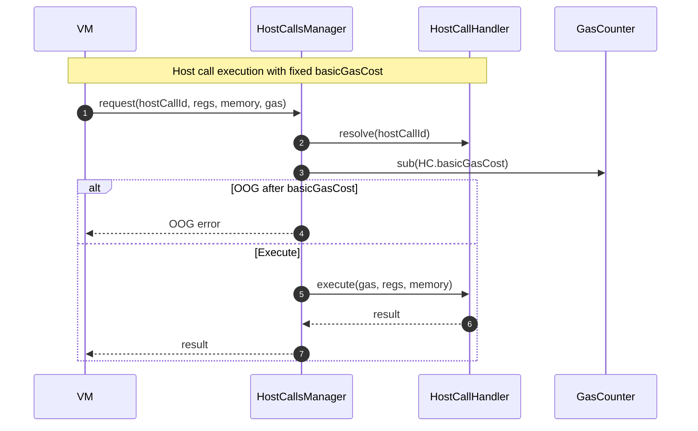
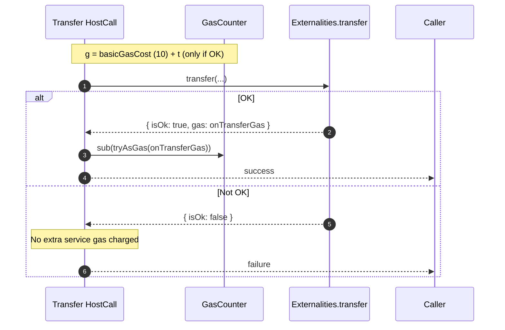

# Transfer gas calculation

## Pull Request by @DrEverr

Implement [gas = 10 + `t`](https://graypaper.fluffylabs.dev/#/ab2cdbd/374100374100?v=0.7.2) - GP v0.7.2.
I intentionally did not use `Compatibility`, it seems to work perfectly with all test vectors as-is.


## Comment by @coderabbitai[bot]

<!-- This is an auto-generated comment: summarize by coderabbit.ai -->
<!-- This is an auto-generated comment: skip review by coderabbit.ai -->

> [!IMPORTANT]
> ## Review skipped
> 
> Auto incremental reviews are disabled on this repository.
> 
> Please check the settings in the CodeRabbit UI or the `.coderabbit.yaml` file in this repository. To trigger a single review, invoke the `@coderabbitai review` command.
> 
> You can disable this status message by setting the `reviews.review_status` to `false` in the CodeRabbit configuration file.

<!-- end of auto-generated comment: skip review by coderabbit.ai -->

<!-- walkthrough_start -->

<details>
<summary>📝 Walkthrough</summary>

<!-- This is an auto-generated comment: release notes by coderabbit.ai -->

## Summary by CodeRabbit

- New Features
  - Standardized gas model with a fixed base gas cost across all host calls for more predictable execution.

- Refactor
  - Simplified gas accounting by replacing dynamic gas calculations with a consistent base cost and clearer API naming.

- Bug Fixes
  - More accurate gas charging and failure handling for transfers, leading to consistent remaining-gas values and clearer failure records.

- Tests
  - Updated test suite to validate per-operation gas subtraction and the new accounting model.

<!-- end of auto-generated comment: release notes by coderabbit.ai -->
## Walkthrough
Renames gasCost to basicGasCost across host-call interfaces and implementations, simplifies HostCallHandler gas typing to SmallGas, updates host-calls execution to use fixed basicGasCost, and adjusts Transfer to charge additional service gas on success. Tests and partial state mock updated to reflect the new gas accounting.

## Changes
| Cohort / File(s) | Summary |
| --- | --- |
| **Core interfaces & manager**<br>`packages/core/pvm-host-calls/host-call-handler.ts`, `packages/core/pvm-host-calls/host-calls-manager.ts`, `packages/core/pvm-host-calls/host-calls.ts` | Rename `gasCost`→`basicGasCost`; `HostCallHandler.gasCost` union removed in favor of `SmallGas`; host call execution now uses `hostCall.basicGasCost` for OOG checks. |
| **JAM accumulate host calls (rename)**<br>`packages/jam/jam-host-calls/accumulate/*` (assign, bless, checkpoint, designate, eject, forget, new, provide, query, solicit, upgrade, yield) | Public field renamed `gasCost`→`basicGasCost`; initializers unchanged (`tryAsSmallGas(10)`). |
| **JAM refine host calls (rename)**<br>`packages/jam/jam-host-calls/refine/*` (export, expunge, historical-lookup, invoke, machine, pages, peek, poke) | Public field renamed `gasCost`→`basicGasCost`; initializers unchanged (`tryAsSmallGas(10)`). |
| **JAM general host calls (rename)**<br>`packages/jam/jam-host-calls/fetch.ts`, `.../gas.ts`, `.../info.ts`, `.../log.ts`, `.../lookup.ts`, `.../missing.ts`, `.../read.ts`, `.../write.ts` | Public field renamed `gasCost`→`basicGasCost`; values preserved. |
| **Transfer behavior & API**<br>`packages/jam/jam-host-calls/accumulate/transfer.ts` | Adds public `basicGasCost=tryAsSmallGas(10)`; `execute` now takes `gas` and, on OK, subtracts additional `onTransferGas` via `gas.sub(tryAsGas(onTransferGas))`; comments/typed imports aligned. |
| **Mocks & tests for gas**<br>`packages/jam/jam-host-calls/externalities/partial-state-mock.ts`, `packages/jam/jam-host-calls/accumulate/transfer.test.ts` | Mock records `tryAsServiceGas(0)` on failed transfers; tests initialize per-test gas, subtract `transfer.basicGasCost` before execute, update assertions for gas remaining and transferData. |

## Sequence Diagram(s)




## Estimated code review effort
🎯 3 (Moderate) | ⏱️ ~25 minutes

## Possibly related PRs
- FluffyLabs/typeberry#543 — Adjusts host-call interfaces/host-calls; overlaps with `HostCallHandler` and execution flow changes.
- FluffyLabs/typeberry#575 — Modifies many of the same JAM host-call files; likely intersects with property rename and gas handling.
- FluffyLabs/typeberry#380 — Touches refine host-call classes also updated here; potential merge interaction on the same files.

## Suggested reviewers
- skoszuta
- tomusdrw
- mateuszsikora

## Poem
> A bunny counts each careful puff of gas,  
> Ten hops to start, then extra if we pass.  
> If transfers fail—no carrot toll today,  
> But when they clear, more nibs we gladly pay.  
> Renamed my pocket cost, neat and small—  
> basicGasCost, and that is all. 🥕✨

</details>

<!-- walkthrough_end -->

<!-- pre_merge_checks_walkthrough_start -->

## Pre-merge checks and finishing touches
<details>
<summary>✅ Passed checks (3 passed)</summary>

|     Check name     | Status   | Explanation                                                                                                                                                                                                                                                                           |
| :----------------: | :------- | :------------------------------------------------------------------------------------------------------------------------------------------------------------------------------------------------------------------------------------------------------------------------------------ |
|     Title Check    | ✅ Passed | The title “Transfer gas calculation” directly reflects the core change, namely implementing the new gas formula (gas = 10 + t) for the transfer host call while other modifications support this behavior. It is concise, specific to the main change, and avoids unnecessary detail. |
|  Description Check | ✅ Passed | The description succinctly explains that the PR implements the new gas formula (gas = 10 + t) per GP v0.7.2 and notes compatibility with existing test vectors, which directly relates to the documented changes.                                                                     |
| Docstring Coverage | ✅ Passed | Docstring coverage is 100.00% which is sufficient. The required threshold is 80.00%.                                                                                                                                                                                                  |

</details>

<!-- pre_merge_checks_walkthrough_end -->

<!-- tips_start -->

---


<sub>Comment `@coderabbitai help` to get the list of available commands and usage tips.</sub>

<!-- tips_end -->

<!-- internal state start -->


<!-- DwQgtGAEAqAWCWBnSTIEMB26CuAXA9mAOYCmGJATmriQCaQDG+Ats2bgFyQAOFk+AIwBWJBrngA3EsgEBPRvlqU0AgfFwA6NPEgQAfACgjoCEYDEZyAAUASpETZWaCrI5Ho6gDYku0KhkQAM0pIIjRkBjRPBmxPanh8LEgDADlHAUouADYAdgAOSGSAVRsAGS5YXFxuRA4AejqidVhsAQ0mZjqAMU9sQMDZUpVEOtxZbhIMihc67ljPOtyC4sRMyAARCgBRKWnCgwBlfGwKBhJIAX8GWC5mcMJcfyDKYnCwSOjY+MTIQCTCGGcpFwFyuN0gd3gSUOuGo2Fq/AmUIAwhQSNQ6OhOJAAEwABmxAFYwLiAJxgbEk6AARipHCpAGY6QSAFpGdbSBgUeDccSJLgASWY3G8bAwuGQYQiURicV5WEC+AozC+kAARJLIABeSBU3GQADUkAABrgjarIArPJ58AB3SFESAAcSskAkuI0OQ02MgAApUcFURgzhUqjV6o0qOM0BMKBpAr1+rI4gJEBolBI6mY6ipsQxaAJaHV6TkACy63HFsu43EAfgkmvdnuxAEoNDBYOc0HhYIqUGL2AkMFFPPJaPB6Bh8MC4ecjUiWNx4mpPOpZEb0Bh6KjuIrxZBcLBqPuOyghSL2N8sDbFQBrZB2g/oK376TAqRiRXIN5IDRGfTGcAoDIeh8ECHACGIMhlBoegOlFLFeH4YRRHEKQZHkJglCoVR1C0HR/xMKA4FQVBMHAwhSHIKgYIUVh2C4KgbXsRw7hcC4MMUZQcM0bRdDAQwANMAxFwYG80FIEYmFRWYJGYMAe0QXB3mHEYFKUj5PHkzBaG8WNxTcVVDIMCxIAAQX5SCqPRegHCcNjQMYQ8MAkv9IBsMg0DYZAD3OAAJfBFKRYdfO03S+xoChAjQM4eAofAYzGC04uYUJwnnRT93wC5wngBhHTSgLgW0yAh2mW1kHUbzxnOQJkvQSBsAwQdfQOO4rXy5AAB9fT9EgiAFfzAuHdymkUyhEGbLU9CdcJm0mgh6sQeAz3OVrhw6tsDCgdzmHwNDj3ODrTx3ChgSURElCDeRapYA7wUUWISAAGifeAiCa5zjt3e9mju8gmN4eLKESsYJk2qAUiyqcOz4DJDwkBIqE8fg+HjW1HMwCSAG47shCKopiycmJIAAPHdVmQRIR3qgQcrygqMsCeASE8egHx7PB6toWQh2YXLUsQd5CotRqxEHX8jGMyxTM8CLL28rKfMgJQGDiajB0psDSZOmjezmAQVwYSAB3EaRXKsOKEvkJb3thVEGu4WhrK4I1BtwIKrRCzddPXSFjREsSJLqKSSBkuS1OUq1VMKyPNKcnTKA0cV12SQooAAeVZl3UTQWgqfkSV0qxNb2vCSBup9Xr+sgfk3Y9zwRqQCKJqmmaJqxlODDTyAUhIG1s7RPOMGp2mlvpxAi64EvPA6jvzDMIwtkU5brIUJRIFRBG++N/pdy4ABZOh4EcAxDNVP8hID8TpGDxVQ+4WT5JjjTo8U2PBbuIdSD02pT6MkzzKWWghiWyrF5AOWuJjM2qR8DxX3kgJan1VbhGQIDK2Asi6QBtGXQMnkMQLVHrlDqmCbQIG8LFaQlAEafSVpCdQ8AojwAAF6Xgaogh0jxZCmUQNPDqPpcStjMs+aGIQmYs1oF+TcFwSDw0RhvEgEIsCiycqQWgEtXKHwPIoewb0hy4BOOcbAjtnbGkhnAhB9oNCF0Kuuf4RozHcHgYgdhGhCHjyLr7LARor5BxDmHJ+b8X51Aji/MAn9r4/yNIvZedwaKYXOJvZmxNd6nQPkfE+Z8L5gCMD4m+fiH7h2fipYJRSo5J1/pkgBFlKLAJsixZw4CwKQOctA7aJBhTRWkMrHmnl+bWIyh8GUrD2b1SZiTDEal66uLpsQ4WfslZqUYMOY24yYhyh4NQWAv42kdDmDQZAjUsJoyYnCe0AsNAOAED6SZw5plj1mYpSakIxq534GBSUFzWg+n6bgSapDKDnB+RQhGxxEDUyYLEegGR6oYHSCEXsaARZBnWaiBwsttmQH3toMU2LkCIDwZAdO6dHSQHjiuT6xVHjRTOXDNAIKKAvQEJzImhLiXKxIDQMWPxUQri6T8JWYyMRuIecCaiMNjxkUReTJaBsOKbnoYkKIGDhYSCiNgEg6ipZCLlnKBWd0VZq3lm8lZOsMR61aIbY2Yp6HQMnOQaJ4hYkYnifIreySFSpMxek5gf9z5bUvtFQON8hCeTqCGwpgTinRRiMqWUocUG6PKQZf+0tqlQWoiA+p9kmkqNaW5DyXl6r60tWwZgUx+BYCVtwm2WBkHOKSrdIFBCZkM2BKQ+A5DeCUIoNQjhJ58VsD7PQxhLD1mqt6OcH0nDuG8PCD6XUc02yQ34D5Pg1omgMBekwMUcVkbHJer2SgcU+BkrOc0iS6B7Z4zirQbAZw1GSy1TLHVGtMr6tEIa3Vxrta7jNXwYt/MTbM0QBojlPYbK6LtoY4xMEXY/M8YwOI9ajTVt0Qh7xgbr4jHDWGzyAT1JRoYDGr4NBszOMTcnP4xphWtoQ3W5AKHyPvXQ7k7Dobw34fftmIjjgSPxqYxgcpUSDBL0davF1iTt4kBSViQ+Y4MlGX9dk4SmGg44Y4yEwjxG411ANtIVM+lfVPrTVZGioCGnGvPXm9yvMulSotfzUt5b5kngAELeHrfRhtKUm1ZRoxPQqL0u2rB7Wc2hTVxAjpCNOnhbUZ5zoXUuqGq7IDrv5lZxAONt2PHwHu60TFiq0vpfIxRd0B0asfQA2W0FX0LSVga5wRqHI/tOn+ngDmjZAbzRbIGp15C4LYLQF27n9Pri837DDoksO4c6Bp0pngRjRt4zpvTzihOQEACgE7WDaOYUeWo08GMYtPoAtI0/mPFYN+krcrQ7IsriYSEE0LgZ1xb4Quo0EtRMrziZxV1SSd4etk96ozSmcmqeDexvDmmo7ce0+iYOHZRI7jxkmozVSgEZrqXZRpR2XIGDgOcJEiObzI7FIhlBuO7PbctWI1mJUCU3R862t953AsUJC72lAe46F3eYawhGiKYuzsQPOgRG56CVX3NVJL0jZGKiVRlt9pNRB4BqvllGAtSWhXtDjfOd1acTgJcVSXP6HD2zHP0ROQjkYiL4E58aJXsUNSDLmh9ksqsvsSHq+rH7Gtfua2TX9IF/0dateIU2IGtqQC6MzOnA26Bwdo32cnyGieiBJ/gPGLHwdsdm1D+bi2eOxvh9cdPpPNCUbsazxSwmvtOtgr9yT7q95evkz6zJoOVNTbU5DiNBGYdLeL6RpQNb0So8qamjHq9zPZsp5HtptnvIngA0bA3FaNjSEgzQbzyqMrNvucz9tnbUVULOZLnnDD7shCnc92L60EsCMEcu23qX8Abo19l3dFp1cZZxkVuRqIiiS+5wN2TKwISsK+ZkVg/IdQikFAd6wIa+tmKAByMGdAmqHuNWXub6PuyC6s2BAepqwe1OgG1qEerkMe4i8itmQ2xoh2VeLaAWNeyeXmRo7Io+NA2e3eEOeefeXGg+fGdQI+W+GqycDq32zqjeJAbqAOLecmx87eimEAymrGM2M2nGQSAhOmJAIgYg4+KaZkJmtSzE2Olmua8++ai+d0kBaCwM4ClaJ4WwuhwIXmjOu+4BfmjBRcL0N4JA7SYWJ4F+I6/Oaq5w44A4HwMuL+aWRsvYn+uW3+6MiuzgYRO6D096GugBe06B7YCSr4xqSs/+vYgBuKzuVmbu882qWBAQOBJ4DW+BNRhBQeGukBXWFhPW6CHBBiDsTssGdBSefsrBThKE64PoE2qh6m+ekaA+ReghOhKEQmk0DBB+TBpol2j412BKQR92rCT2XCd+pcIu72n2MS4mUhMh0mgOaSbeIOyhYO3Bue6h0OC2sOy28OHqQI+h586ONSmOJhYCZhUCFhNmeCwBJBq+seIEDh5wXQioQIKeyAbhvm2UKxRcURKWiuC02xfO6yvYRRFAWWiQOWeW6MxUMRjuLmIBeCbYxEX4luYglMw88gSsLWMEswoeJssgAA5MgPUawnIE+BFAEecPbnwMgVJKijuPKjQllBqEwIpCcWJj9uvE3rIZ6vIQpn6ncV3kGo8XNtMS8VofDv9F8cZlPmZlmjjhlq5CCYWkrHKcLGvpST3NvM8Vrt7KInVMidXrgD4X4dwMKfYFsRFpfjic1OOuqjSQgBEOYdYR1rMJbMDMBqlmgLIMcMCA5ErF5uzOmYKZQGcuSSzKsP8letCSsirtvschgdLNVg0d7nUb7nWd+oHq1sQa0WQcBubImX1tQXgrQQdgMbWkhgxr3DaFwbqWofqf3oabMTpiaZXtRl4TYuIfXmvHkRcTJtcQobcQGg8ZOVMdOYXnDqRoDAjEoKaT8emtPpaYCS0sCQWl0hAaHs8jCEGDVJCevj1meTVF6czvvkQofmQucMFqfjQieAmu9BiBGZOrqK6AwvuLfsLk/llJiShUSV/schrjETjFSmcJIlCjInSgAQok7psWwFGagLtBbsmU+TtgwHUKyRiJyYAJgEvJjZ/J8gUQQpn0kuop9ObAL07a1w4IqZ6A9JwIpMEUQ4yMcI188iAYZADAZyPyipEhDeKp0h/2lxchwOHe2pExveGhWmbxpGAAjuqi4BeZPr8deaYRAuYTaQ+SdsvqHl5rYT2UiX+Z4aiXMmWQAIoWUYTDlboqKBmQGmTQHMSRSdLrEcxFS1mBlm5xSHIFlv65SqWrkSaaVSabmt7bl6W7kTmTF8GaGznw6IC5a5S4SGYT6GHmmZp2U5pAnuAnhHCGzqAIn8WdhSL4kUkYA4Unh66CAc4qDkJWYoG9l8xgXAWh4OmMwfmeWrEs5LmKRBYn6hbTVBmDrQW3ahmjrNQ377HC6i6LrtikS1lgnhWRVm4EznCZknjZnNC5nnpnroUJGYXFGNSOrnAxHVlVFNl1YNl4FNZawtm6wh50Vh42rtHdmJRdH2xGK9EJ79GrF0bDnGhtVVVrHjE577klXGVD6hwVXtUV6IC2KLk+XMFTrVR9gBioj0BuF7Evb35HECJGjNjzwrlnEaUblXF5WalZL3FFWGXPFHkmWhxUoBABhJyvhWV1U2UWmNVz6uT8hpG3p4U8AvD7LAgainqfQCmchojiAUqa4Qr9h8DPLhEviKT4XMQCC4XG19rnCS3PCwwrXAgZAeqpESD4A3hnLK5rLPSvTvTKVlzRrHDWqfQjK9asLymaBR47TZFfjW0e3WiiQSrAhdogpwjUzK6nBIAYhAqDIkaDgvTFSI3ojIA8qrwoJJnYELT+jeBiCa4lF0IUqBARTllrIHUfJAg+hzR9gvIgRNILiq4N4KlR6wl8CrC7BKpRQdrdGLgHiIBl20ASKa7Yn7U/DFQxgerMASjhCfJXIu3S0+mTS8ByILQB2q4vRkBm6h1fhEYR2O3gjwBlQUCP36IK5e6OA8jixR5FBoHIDawoRGoeoIWYCu3rDUCIrFQait0fQOh+yxriDCggFnClQJC/zdwADqHYWAMdX6DgRGfhtAL08DJFbdSDX4tAQgcINEPoGqRAGgL0eQT0JIJIuIGAk0lKTwAY0DMIfVP0j4IDYgUFoRqYXcugkAeDZA4ICiWUpaio8glFFin0h679lMPGDKEDUtlAAjiK7AXIXSM4kAXDFovYSsnkz9FokJZdUiFDiiNKogLAXSJI7DnDgmUjUAsjWAI+xtrCk4iBEdxBL+R6n4/A2j5DOClDiDE126S0Y0Yo1M7jHD5jvDkD/DMD8lTde45jzp1jX1tj4iGK6cs9VoL0iACAHdiJdUik8QRsXaYA2tmuC03MvM/MMYzT+Rut2uFKUiCTTc7AmulyDtzUF9ljWU19coglv0Ep0gUpY4FKtD9D8EeqqKsQRUziddNRxu5t0l9gMI2+kQPIBikj7uNZnuNRgN5wfJ/uoNRBLRHJHZeakM9qImpxyp65WluVGpihWphV02xVRlMxx5EtfDicNVBhgCCtDVAJ9lzVCd7ScQGRAqiobAfAQKbAWibMv09mkNPpsUvWiUm9UF8FQur2D+rYUeROUCzl5w0zIpYG2i8NP5t04QPMnWqyquPoAA+pKFwLMl9ZQC9KiEQPCLXIVPXI3GNB/S9Eoy4ANFK8OIfLtC4PNFlBy0GF3TywK23POMKzo2KxK3XMNH1EM3K/I2q64DXKa1aKq8o9SxnFgIisQ3hUELELo67ZU60A7XdCfSEBqG4RAXFN+fQBqALucpcoddwnwokH4Jk5QB1IugA2gfQHnDGheHKLfHRGKOs9Jrk39NvBqFRSzL6A6NqLBYaL6VgjDM7ZANNHqHrv8pWhC9PUc3CBNenAANI4wV00QlClATQYrwKTh8DZaSVcC5xKAS5Ci7gFGIWUu21ZFSAnY01HTBsngajLQ6xl0rgh1R1XYnj/QokAVLWyWkB/XPrVH1m3PsX3MmrNHmqQ1tGgY4s6K2z6II1psuxatcsVkkB8t6tCvm2it9QmvKtWgyvNzysKOKu2uQeeAOvqto0U5GgJt6MUCjFMzeBcAGW8EgszlgujBtvlJLHGh/s6s0DfLhCCsFSGtgfitKtDRQfmuysr1WvKPMfuwqtweyDNgfZR4dF2HoBr3I1nbu2ofIYYeu2jEr5PIhlRb0BlxM0HHxas0CcZXc3fM5V81/M7kqG43Aui2vGE11BGJEBUDnlQvfHWVXmK3wtNV3mOVWG0Ulp7aBteWnvuK+V3SAOWe5znD0Z+n+GbU3YUss0nW7XBFyjonirkmK7DVULoGVaXM3u1F3vA0PuMVtnPPh6dlCew3Wxb7dH9vieHaDHo1Gj+dWckDjlAsi0F6meCEWe1frbLFnseJc1fN/a6c6U3EFWGd7nGdNdGmkayCQly0wv2dwsWYIvOdItWH4uGx1AvmYAxTuUktDkU4ACaC1v5S1/5Pnq17OoFSDinOx6y5d+Kl7PcfmhFxWcRb1mkmFv+d0qKGZYESs2L4G4unVCDKAl04gkRqX/1RqNz7KWXr6TRrZTzL7LzMNxL/WTlieqNVGEnlN2N23yGe34i9XPeBHJnY3ocE3JTYhHzSpkhPNPzenulShgLBPTxTXkllA0l0Nswzgd2YA9TNAYS+AokU3RhfxM+VpDlUegoOsU7YnJ2iFp+ZwG7dUAAAqDJMEerILpmnTeBijYF9ctOcPiVwFYJz5fgcEcyQPvPz1rwG2KejJcOtx2IyV6wGO5F+xgAAGqhEaBIDpw3huDdz8hgS+0MQuMUDr0ADa/jkIl4Zdu0X1Pr3AwozMtAHUsHu0AAuugDINJnfL+P72BEE/wL7/IlJOH5H3oqXegLH2KC9ELnLyQHwgIqn/gBny+YPHu9xU7crNkyc1+xiOA/Pd4DL4mx/RivOGkSSf3HGVUzgW2wY/E4kGOHKEqqPGaq28Py7ycO76EfY/S0ilylgMvM+KiK795G2xvxQFvxOle7WeD4rEDZ+tDw80+xDZaq+1Hm8yQN11Tzp83uqXTwC0N2FqE8muwQXANcEF71UscjnZWgYFVp3QugHKYSsFzjKQ1NuBcZnIeCz5yN48J2byp1zZwgUNqSDbnBdzDI/BI2EXQ4idTi4hAYiW6Z7okRtAHo+A4TE9H0wdDJEn6QoTAMyWjKTUKsFzMHl+gh53NH+j7WHs+1f4I8uySPfgf2UOynYfSUnBjAgLAGwB8ePBJngaRGCgDwBlGRhmDToDsl4e4eDCLmmpYU81Ka5Xrr/yBwDd6egAhrsAO0GNBD6NnM0rCygFzcnOeOBfKCVxgBBXyG3Iru4WWqY9k8HUO1p4CjKpFh0yMHagg1P5HUl21As6jGSBIoCacH5ZAsbhIFxCyBGAWZo+EnArpxU+JBXLGSvrctt8v1UHtewBp39MuD/Agk/wkEv9SC+XbrCENZY9ETEcA1gpEMQ4aC9SB5LjB8mTg18XKkNNfAOTR7YIq6TlN9Bj3wHMFiox/UouFnyFb0vElA9TidUE6WDMq5xGnv13yoOChaTgrQYeVW4YAFQEAzwf8W8EwC/BdpKYe5zLSelG0XnQls6VVoKgESIXAMmF2DJbDWEZcXYW9gEQ0C10aVWIuOwYGvdzCA1Z2lQHvTQdxo9AwIfAQ/A6NGW8jHFjvw3i69B0vVAHsojpZtgtg79d0jpDORL1YAX4BGkOHEopdBB9Q2/u+ih4tDxB4NcElDXIKFdZBOA1Hhdkq5oc/h+AYYXjUI4jBIQdwhcssOO5rEfQN2TepeBdgQiqW7NL/upR/5qk7BZwgARcMZ5TkuM66e4TNy8Gz5rSi3fwct35hOksApQN/FEJ3zel3aIVTGIGSS49pRqM1SGhFX5B/dNhvObYSalRRLRt6T9UPvaBHDQjX87+J7uP0YFz4cYao9ZDODBLhdF2kXMXBpBeh0MMohyEIIigtwKUycaArqtfyua3tIezQxoq0N5HtlOhiPdBMKJRoXYOuSo5QcaGdFEAohUokbi4PNHk8682nGwfqK3IC1O8+HK4WaNgQ3gjEFo0zLN2tFi8XhVOGwiEOdLOjfaRiTqotUwRHcRUtbDtMBXWqc4yKsQ0MawhjZqdIRp1WkmJWCAMk7o9GZinyMDFRVbqsVZ6qFX1oPc5ERZPuHW0JF3AVG3A5ujwJWRSVv668A8EeH9AAo3yB9VYtWPS4iD72YgnLnDykEtiZBbYlHh2JsQsEquu4xcdwEHGNdhxC4pcQqKUG+hVRpAh7HwFU7HV3sHNQ4eONVLaU/+9go0TqUuGmigkfMcjM5GXHGERet5XwZYTtHglg46NR0XdCcTsIDxB3I8XgKVFrVu0l4wIsxJCITpgxNNCgTmKoGJY7usuIivLmRhvd4iE/P7oGCwhnIAeV4tsBL2ii4BAgnrG6jFXGqoA3ODo7IdSUqKVF2RwgxoXWL9zYTDBuXEwdDQIkicehZXeQczm1CaiNOHcUiWhxUn2gqJzg64aJJcT0T3aWoBCskMi4Lo54XEnrjxN+b/9Bagkk0aMKCQ5w1E7gy8iuKtGi9EWtpfBG8MClUF+UJ4dyK8lcLqThYx4wCmeNO5ECAhoIsdKESMlgwLJL+LycikHBKokxxJMAIiKBLIj5EGUe6ky3fbFQvMpI2JgchdwUi6hN/cKZyPrGaweRbWZsfFMnofkkpP7YicwTFHIYRptAPKXOJamDx2uFNFYVj06pGg/pAM4ScUlalCYdR1g2qbT34kNTZxMMmHP6EhChxWSEk4XjeXm4yTepydSAnxWdJbAwaakr4Yd00kipPRzkQMjl2MFZCqCPQnMpzC4r5keK+k9ZOSTxKATFQEsbUmOJqnZVbBU4/5qjKM7UTrhmM8gAxTJiNRL27Uuzp1MeFrjEWG4y6qHjXxDTzg5MuYC0kplM5qZ3nEVPGN5nwjkxu0u8vtISaPAECCKKRNM3GabI+qZWPBC9EhCqxsASzB0L029hnIL25wCgSeBwHFNWYFFCqMnVEFSBKcz4lCHSJCHIF84OMZZEhMDAa12YzpLzADzWn79hwnFfduQFwFFsmItmdCQ0PulRTuROEyQR0NelQBKCceIibMNFHY8GM+sxWXV2TyTYgBgM2GdJixnyyDZSssmujyUEIysqvNU4dOP0pSz8pXGWWaHGjIEAuQHwMANaD3HcBcZtlaATaM1lFp4ygMTlDRErG6zIAvkJuIqFyhRByJ+4saVTI0mmzmcxUXOIWL3BWMBM8EdANGN9lxiLJ41CHmgJ5JS4JgGuIOdIjTJSIlYtmF6N4CIpcz5pzUI8OlKi54wPJEsEyAlJ7IfSkaKUtHl2JFQ9jXYV8tebfNomUSe5aM5qQPKZhyyV5189eZvIolCZMFaXSubgQenNlHmdczrNIKjyaJwMdQYTjgpK7fs8FIokiZWJ+kMZL5ikRheQq3nQyaFGMwefQtIU3zNIzCuiWPPKJLClBWnEWdPM9SXyiAsAAzsaM0HoyXiS8m4T7V8I7yHOTw/ebJMGyZDcoCkinNIqwCq17FbLY2U/J9LaSOcZ+PITeKu5JDmaZkqEWkLnx3RGZL0uGicB/ECkOZXITakgQJRsyXC/4zvtBRlzlDkYFshQFbJ/yxkfRq7SBQv3e6LDRSFcjkZwurkNinpsUvCQ3K9TvtcFJiVuSRJkXGhfFvtbuTjWG7SzF5ai0OJCD8UgzFRRCrKchgGW+FlF+NVRXQomUYAplo4z5t/wnG8SDRs8hnlYpUU2LxldQO4NcCxmOLVx3UhbgfICmNMQh58rFOcvIBGzQhk01YoJSAozTOc5+bmc1DqymS9h5k5/ClkKUf5nuO0spXtLYRyUjpRLdBFnLLI5yLpwdYuRlxKjbxy5uRA6Z93iXVC1cpJJ2dSL1oOhEhZRV3PUrumNKmyMPJsXl3aUe8uQfouQZIu+ntzjQTyhAOQCWUyi6gtis5VytEJjzCFtGSeccL658TDRkskZQvKBmrKOeEkS5V1OknWYHyWs1AQ8qwBG8L0h4iaTTKmnkJfCoXTvhBTRU7VKUNNJyZUuDaAqHxkc+Oa+L1x3LIpDRP7gXyVjwFrUg6YpXZMYGUrasEU0QTXJim4T65AoqACIsSjtielbKiGdqukA8qTOtixcIquKmY9a8Wy3UTsrqkoyZx88/uSsqHkTASAVvCpNCyF67znF641xY+X6n0UcJOs9lVYD8I3g3R3wj0RcGhjRcr89AEyeVOiXIVShtA2EeCtKVJEkRlk4rGSqvGZ8ram7PIjQXhV2F/V9dQNVhODU8L2hfC/CW9JZliLoMEir6WsRFVo8+lRoZtSWsTVNdk1La+GdVO2VIyZ5EsvNTKoLXHL5VO4BxcrPlqWi1Z1ywmWqruhWBBlnVSsbqr3z6qlqR+c8TpNCUVQ/l5A8lraqpbmyR1W0jClCptnGxiV7Av7umQ6BdIXJ/aYKWyNukBqq5NKxsc9PpXhrrA3Q/db0L6IxrwZrBYDYsqoX5rrFIwZNYMumUMSxizEjECMjYkpCOJYq6nhKr2XPq55r6rjXUBtBcgaASqv9SqvvKuc614cqEjI0U3+K3lkGkhF8sIG6TOwAmcRoZLvHsTH89qtJWCXowgKWeF/AuXBRlTH5ZByBbJbjjg3dqCh4Cm7gywWwgSAUyea7E1AT4coV11zNdVyOaW1yt1/Igro3PekMbkpLsHBjprGzo1hlfcuTQpvUBCrO43cTOPgswRpTkNGUgrdI1HIuxCWpW/tUCoERVThZD60WZOMgDOibQO5ASIRCtTD1yIkA2iPBAYhoAmIUkg2pxGwhqAeI+EfiAYG61wR1AvLccIgF5ZN46AvLepqdD4hdbAIFoWgNiByBUgBAWQekPiBLA5AGAJIEsHkFoCBABAFYAkASAEB5ASwwQEkFkFxAlgSAJIKkAwAJBoASweof8LNp23zbcAi2iRCttFlrbgIW24HRAAoS8sMWpAXlqXlEjLaNtwIIHQAG8pGqoJALYHcyW86A84XNrgGA1jRaAqoLgFFAC1PRcdVTY4KzEJ2iRbAVOi0FEFWB07CgeOxAGUyPTjhLobOmnZztx1jhaAOvDAOsH56m90l4rNPKJDZ32znoou8cBLo8C4BvA8um8IrvgLK7udYuiXewU5Dcg5QWunXeqi51qhyUvhWgPyGcTqoeEjwNnYZEt2qgkM7sYnO5DRTig2dYfKRoUBx2FAg9aoVHTeBSB4Jnd6u8hGbst3B7VQPPOEObr13B61Q2sOIOX0SCR6Tw4echIABwCGTgGFNrSgS6iQQALgEysN+ihGpiN0UItmu+JThei2ZqYO7c8JHU74nsg26LFUDR2QCVs9Q1bSaOAyVjW9SUwsDSKePIQv4qK8AJmJECIZGIdYx4VAPiTcnAhUA26JSpzvsATAlKs+9FaVisyEi6Umedeo1HIDusLMSgGEB2g0CqhY9Qe1UKilyx4BBwzuu/f7of2ltnd2CC/vaHf0p61QqIbdEzCIAGIhdHO5PXHuvlNBpKWu8PWwGd056SA58YPQAF979gelPaqFD3wHkDXAVUEbq5B/0fgMej/dzoT2IAk99+7nWnswCXgs9d7RAMbuIMH870SlZFLnTJhxBnkGdIDXYBb0KJ2AYJDvWXD3rd6NQfeg0PuHPohBnQroRsF6DdVTgukuyJcB2lXCxUVkTcMLPkXfCryOOQlWABXqAMa7kecaWsRm0cDsBnU5hW/dQcAPSBn9coN/fYdVBf78DP+xBv/qwNAHEgIBsA9TogOuHoDUfTwHAYj34GR8zB5wx/vQMf7MDcenAxEbVBS6GAcBM5POFnqkBvDceig1QbIOp6uDdB5w/gdSPpGkE2RKgKQAmrlgNA1YAAKSnjhKqABwP0CqrsAYh8icypXucqooewdOVAHkHdANG7DBRtw5xG/3OAvDwRrkDAaiDhGEDkR/nuUfFYoGg9qBqRmn1d3u7bAhBk3a/vwMZAAdJIekIEBLAnbcQJAAkLiAJBvbsQh2tAD9qyB5A8gOQekA9pICEhoouIGkAyAEA5AMgDAAmD9vyBRQSQeIN41kGxAlgSQDAbw27vCBk6bAUevA2qCyAMB6QJYbEHkCyC0AqQ1x+kO9txBoAcgKgf7QwBLBoB6QgJrIGgE4bQmHtaAaTCSdUCfG3ttAAE6IAYC5hAg1J6sAwAZC4hz4GxuHVAC7SI7KAyO0Pctph36AgAA=== -->

<!-- internal state end -->


## Comment by @github-actions[bot]


<details>
<summary>View all</summary>

| File | Benchmark | Ops |  |
|------|-----------|-----|--|
| [bytes/hex-from.ts[0]](../blob/3d9e475072d5e85b4692e3393d466821a7c28a48//_work/typeberry-runner-3/typeberry/typeberry/benchmarks/bytes/hex-from.ts) | parse hex using `Number` with NaN checking | 132103.54 ±0.7% | 84.79% slower |
| [bytes/hex-from.ts[1]](../blob/3d9e475072d5e85b4692e3393d466821a7c28a48//_work/typeberry-runner-3/typeberry/typeberry/benchmarks/bytes/hex-from.ts) | parse hex from char codes | 868546.84 ±1.46% | fastest ✅ |
| [bytes/hex-from.ts[2]](../blob/3d9e475072d5e85b4692e3393d466821a7c28a48//_work/typeberry-runner-3/typeberry/typeberry/benchmarks/bytes/hex-from.ts) | parse hex from string nibbles | 541705.94 ±1.72% | 37.63% slower |
| [math/switch.ts[0]](../blob/3d9e475072d5e85b4692e3393d466821a7c28a48//_work/typeberry-runner-3/typeberry/typeberry/benchmarks/math/switch.ts) | switch | 261975661.43 ±4.71% | fastest ✅ |
| [math/switch.ts[1]](../blob/3d9e475072d5e85b4692e3393d466821a7c28a48//_work/typeberry-runner-3/typeberry/typeberry/benchmarks/math/switch.ts) | if | 251400226.15 ±5.8% | 4.04% slower |
| [math/count-bits-u32.ts[0]](../blob/3d9e475072d5e85b4692e3393d466821a7c28a48//_work/typeberry-runner-3/typeberry/typeberry/benchmarks/math/count-bits-u32.ts) | standard method | 80264536.83 ±1.61% | 66.84% slower |
| [math/count-bits-u32.ts[1]](../blob/3d9e475072d5e85b4692e3393d466821a7c28a48//_work/typeberry-runner-3/typeberry/typeberry/benchmarks/math/count-bits-u32.ts) | magic | 242060952.23 ±5.44% | fastest ✅ |
| [math/add_one_overflow.ts[0]](../blob/3d9e475072d5e85b4692e3393d466821a7c28a48//_work/typeberry-runner-3/typeberry/typeberry/benchmarks/math/add_one_overflow.ts) | add and take modulus | 250637314.57 ±5.98% | 1.61% slower |
| [math/add_one_overflow.ts[1]](../blob/3d9e475072d5e85b4692e3393d466821a7c28a48//_work/typeberry-runner-3/typeberry/typeberry/benchmarks/math/add_one_overflow.ts) | condition before calculation | 254734742.33 ±4.7% | fastest ✅ |
| [hash/index.ts[0]](../blob/3d9e475072d5e85b4692e3393d466821a7c28a48//_work/typeberry-runner-3/typeberry/typeberry/benchmarks/hash/index.ts) | hash with numeric representation | 189.28 ±0.46% | 18.12% slower |
| [hash/index.ts[1]](../blob/3d9e475072d5e85b4692e3393d466821a7c28a48//_work/typeberry-runner-3/typeberry/typeberry/benchmarks/hash/index.ts) | hash with string representation | 118.72 ±0.61% | 48.65% slower |
| [hash/index.ts[2]](../blob/3d9e475072d5e85b4692e3393d466821a7c28a48//_work/typeberry-runner-3/typeberry/typeberry/benchmarks/hash/index.ts) | hash with symbol representation | 180.71 ±0.45% | 21.83% slower |
| [hash/index.ts[3]](../blob/3d9e475072d5e85b4692e3393d466821a7c28a48//_work/typeberry-runner-3/typeberry/typeberry/benchmarks/hash/index.ts) | hash with uint8 representation | 161.73 ±0.44% | 30.04% slower |
| [hash/index.ts[4]](../blob/3d9e475072d5e85b4692e3393d466821a7c28a48//_work/typeberry-runner-3/typeberry/typeberry/benchmarks/hash/index.ts) | hash with packed representation | 231.18 ±1.25% | fastest ✅ |
| [hash/index.ts[5]](../blob/3d9e475072d5e85b4692e3393d466821a7c28a48//_work/typeberry-runner-3/typeberry/typeberry/benchmarks/hash/index.ts) | hash with bigint representation | 171.26 ±1.04% | 25.92% slower |
| [hash/index.ts[6]](../blob/3d9e475072d5e85b4692e3393d466821a7c28a48//_work/typeberry-runner-3/typeberry/typeberry/benchmarks/hash/index.ts) | hash with uint32 representation | 187.83 ±0.87% | 18.75% slower |
| [collections/map-set.ts[0]](../blob/3d9e475072d5e85b4692e3393d466821a7c28a48//_work/typeberry-runner-3/typeberry/typeberry/benchmarks/collections/map-set.ts) | 2 gets + conditional set | 116578.31 ±0.49% | fastest ✅ |
| [collections/map-set.ts[1]](../blob/3d9e475072d5e85b4692e3393d466821a7c28a48//_work/typeberry-runner-3/typeberry/typeberry/benchmarks/collections/map-set.ts) | 1 get 1 set | 59127.29 ±0.31% | 49.28% slower |
| [bytes/hex-to.ts[0]](../blob/3d9e475072d5e85b4692e3393d466821a7c28a48//_work/typeberry-runner-3/typeberry/typeberry/benchmarks/bytes/hex-to.ts) | number toString + padding | 303212.12 ±0.49% | fastest ✅ |
| [bytes/hex-to.ts[1]](../blob/3d9e475072d5e85b4692e3393d466821a7c28a48//_work/typeberry-runner-3/typeberry/typeberry/benchmarks/bytes/hex-to.ts) | manual | 15444.47 ±0.55% | 94.91% slower |
| [codec/bigint.compare.ts[0]](../blob/3d9e475072d5e85b4692e3393d466821a7c28a48//_work/typeberry-runner-3/typeberry/typeberry/benchmarks/codec/bigint.compare.ts) | compare custom | 256465679.47 ±5.51% | 1.12% slower |
| [codec/bigint.compare.ts[1]](../blob/3d9e475072d5e85b4692e3393d466821a7c28a48//_work/typeberry-runner-3/typeberry/typeberry/benchmarks/codec/bigint.compare.ts) | compare bigint | 259378186.06 ±3.98% | fastest ✅ |
| [codec/bigint.decode.ts[0]](../blob/3d9e475072d5e85b4692e3393d466821a7c28a48//_work/typeberry-runner-3/typeberry/typeberry/benchmarks/codec/bigint.decode.ts) | decode custom | 174842169.52 ±1.99% | fastest ✅ |
| [codec/bigint.decode.ts[1]](../blob/3d9e475072d5e85b4692e3393d466821a7c28a48//_work/typeberry-runner-3/typeberry/typeberry/benchmarks/codec/bigint.decode.ts) | decode bigint | 106059862.66 ±2.33% | 39.34% slower |
| [math/count-bits-u64.ts[0]](../blob/3d9e475072d5e85b4692e3393d466821a7c28a48//_work/typeberry-runner-3/typeberry/typeberry/benchmarks/math/count-bits-u64.ts) | standard method | 7021181.01 ±2.08% | 92.26% slower |
| [math/count-bits-u64.ts[1]](../blob/3d9e475072d5e85b4692e3393d466821a7c28a48//_work/typeberry-runner-3/typeberry/typeberry/benchmarks/math/count-bits-u64.ts) | magic | 90662463.74 ±2% | fastest ✅ |
| [math/mul_overflow.ts[0]](../blob/3d9e475072d5e85b4692e3393d466821a7c28a48//_work/typeberry-runner-3/typeberry/typeberry/benchmarks/math/mul_overflow.ts) | multiply and bring back to u32 | 259549433.73 ±4.89% | fastest ✅ |
| [math/mul_overflow.ts[1]](../blob/3d9e475072d5e85b4692e3393d466821a7c28a48//_work/typeberry-runner-3/typeberry/typeberry/benchmarks/math/mul_overflow.ts) | multiply and take modulus | 245839503.03 ±6.08% | 5.28% slower |
| [codec/encoding.ts[0]](../blob/3d9e475072d5e85b4692e3393d466821a7c28a48//_work/typeberry-runner-3/typeberry/typeberry/benchmarks/codec/encoding.ts) | manual encode | 3215616.9 ±0.7% | 19.16% slower |
| [codec/encoding.ts[1]](../blob/3d9e475072d5e85b4692e3393d466821a7c28a48//_work/typeberry-runner-3/typeberry/typeberry/benchmarks/codec/encoding.ts) | int32array encode | 3977666.07 ±0.71% | fastest ✅ |
| [codec/encoding.ts[2]](../blob/3d9e475072d5e85b4692e3393d466821a7c28a48//_work/typeberry-runner-3/typeberry/typeberry/benchmarks/codec/encoding.ts) | dataview encode | 3947948.17 ±0.52% | 0.75% slower |
| [codec/decoding.ts[0]](../blob/3d9e475072d5e85b4692e3393d466821a7c28a48//_work/typeberry-runner-3/typeberry/typeberry/benchmarks/codec/decoding.ts) | manual decode | 20775884.25 ±1.65% | 86.99% slower |
| [codec/decoding.ts[1]](../blob/3d9e475072d5e85b4692e3393d466821a7c28a48//_work/typeberry-runner-3/typeberry/typeberry/benchmarks/codec/decoding.ts) | int32array decode | 153359678.05 ±3.7% | 3.98% slower |
| [codec/decoding.ts[2]](../blob/3d9e475072d5e85b4692e3393d466821a7c28a48//_work/typeberry-runner-3/typeberry/typeberry/benchmarks/codec/decoding.ts) | dataview decode | 159709195.06 ±3.18% | fastest ✅ |
| [logger/index.ts[0]](../blob/3d9e475072d5e85b4692e3393d466821a7c28a48//_work/typeberry-runner-3/typeberry/typeberry/benchmarks/logger/index.ts) | console.log with string concat | 8196219.49 ±33.73% | fastest ✅ |
| [logger/index.ts[1]](../blob/3d9e475072d5e85b4692e3393d466821a7c28a48//_work/typeberry-runner-3/typeberry/typeberry/benchmarks/logger/index.ts) | console.log with args | 945246.19 ±94.74% | 88.47% slower |
| [codec/view_vs_object.ts[0]](../blob/3d9e475072d5e85b4692e3393d466821a7c28a48//_work/typeberry-runner-3/typeberry/typeberry/benchmarks/codec/view_vs_object.ts) | Get the first field from Decoded | 474316.26 ±1.37% | fastest ✅ |
| [codec/view_vs_object.ts[1]](../blob/3d9e475072d5e85b4692e3393d466821a7c28a48//_work/typeberry-runner-3/typeberry/typeberry/benchmarks/codec/view_vs_object.ts) | Get the first field from View | 33884.57 ±121.15% | 92.86% slower |
| [codec/view_vs_object.ts[2]](../blob/3d9e475072d5e85b4692e3393d466821a7c28a48//_work/typeberry-runner-3/typeberry/typeberry/benchmarks/codec/view_vs_object.ts) | Get the first field as view from View | 59828.36 ±3.97% | 87.39% slower |
| [codec/view_vs_object.ts[3]](../blob/3d9e475072d5e85b4692e3393d466821a7c28a48//_work/typeberry-runner-3/typeberry/typeberry/benchmarks/codec/view_vs_object.ts) | Get two fields from Decoded | 375121.98 ±1.82% | 20.91% slower |
| [codec/view_vs_object.ts[4]](../blob/3d9e475072d5e85b4692e3393d466821a7c28a48//_work/typeberry-runner-3/typeberry/typeberry/benchmarks/codec/view_vs_object.ts) | Get two fields from View | 66356.92 ±2.32% | 86.01% slower |
| [codec/view_vs_object.ts[5]](../blob/3d9e475072d5e85b4692e3393d466821a7c28a48//_work/typeberry-runner-3/typeberry/typeberry/benchmarks/codec/view_vs_object.ts) | Get two fields from materialized from View | 138597.41 ±1.06% | 70.78% slower |
| [codec/view_vs_object.ts[6]](../blob/3d9e475072d5e85b4692e3393d466821a7c28a48//_work/typeberry-runner-3/typeberry/typeberry/benchmarks/codec/view_vs_object.ts) | Get two fields as views from View | 63702.2 ±0.98% | 86.57% slower |
| [codec/view_vs_object.ts[7]](../blob/3d9e475072d5e85b4692e3393d466821a7c28a48//_work/typeberry-runner-3/typeberry/typeberry/benchmarks/codec/view_vs_object.ts) | Get only third field from Decoded | 395318.32 ±1.61% | 16.66% slower |
| [codec/view_vs_object.ts[8]](../blob/3d9e475072d5e85b4692e3393d466821a7c28a48//_work/typeberry-runner-3/typeberry/typeberry/benchmarks/codec/view_vs_object.ts) | Get only third field from View | 82368.57 ±1.32% | 82.63% slower |
| [codec/view_vs_object.ts[9]](../blob/3d9e475072d5e85b4692e3393d466821a7c28a48//_work/typeberry-runner-3/typeberry/typeberry/benchmarks/codec/view_vs_object.ts) | Get only third field as view from View | 81961.02 ±1.48% | 82.72% slower |
| [codec/view_vs_collection.ts[0]](../blob/3d9e475072d5e85b4692e3393d466821a7c28a48//_work/typeberry-runner-3/typeberry/typeberry/benchmarks/codec/view_vs_collection.ts) | Get first element from Decoded | 25218.68 ±2.27% | 51.32% slower |
| [codec/view_vs_collection.ts[1]](../blob/3d9e475072d5e85b4692e3393d466821a7c28a48//_work/typeberry-runner-3/typeberry/typeberry/benchmarks/codec/view_vs_collection.ts) | Get first element from View | 51804.52 ±1.31% | fastest ✅ |
| [codec/view_vs_collection.ts[2]](../blob/3d9e475072d5e85b4692e3393d466821a7c28a48//_work/typeberry-runner-3/typeberry/typeberry/benchmarks/codec/view_vs_collection.ts) | Get 50th element from Decoded | 27745.09 ±2.61% | 46.44% slower |
| [codec/view_vs_collection.ts[3]](../blob/3d9e475072d5e85b4692e3393d466821a7c28a48//_work/typeberry-runner-3/typeberry/typeberry/benchmarks/codec/view_vs_collection.ts) | Get 50th element from View | 33302.99 ±1.31% | 35.71% slower |
| [codec/view_vs_collection.ts[4]](../blob/3d9e475072d5e85b4692e3393d466821a7c28a48//_work/typeberry-runner-3/typeberry/typeberry/benchmarks/codec/view_vs_collection.ts) | Get last element from Decoded | 30307.68 ±1.85% | 41.5% slower |
| [codec/view_vs_collection.ts[5]](../blob/3d9e475072d5e85b4692e3393d466821a7c28a48//_work/typeberry-runner-3/typeberry/typeberry/benchmarks/codec/view_vs_collection.ts) | Get last element from View | 23053.96 ±0.97% | 55.5% slower |
| [bytes/compare.ts[0]](../blob/3d9e475072d5e85b4692e3393d466821a7c28a48//_work/typeberry-runner-3/typeberry/typeberry/benchmarks/bytes/compare.ts) | Comparing Uint32 bytes | 19382.3 ±0.94% | 5.53% slower |
| [bytes/compare.ts[1]](../blob/3d9e475072d5e85b4692e3393d466821a7c28a48//_work/typeberry-runner-3/typeberry/typeberry/benchmarks/bytes/compare.ts) | Comparing raw bytes | 20517.33 ±0.83% | fastest ✅ |
| [hash/blake2b.ts[0]](../blob/3d9e475072d5e85b4692e3393d466821a7c28a48//_work/typeberry-runner-3/typeberry/typeberry/benchmarks/hash/blake2b.ts) | hasher with simple allocator | 0.045 ±1.23% | 2.17% slower |
| [hash/blake2b.ts[1]](../blob/3d9e475072d5e85b4692e3393d466821a7c28a48//_work/typeberry-runner-3/typeberry/typeberry/benchmarks/hash/blake2b.ts) | hasher with page allocator | 0.046 ±0.77% | fastest ✅ |
| [collections/map_vs_sorted.ts[0]](../blob/3d9e475072d5e85b4692e3393d466821a7c28a48//_work/typeberry-runner-3/typeberry/typeberry/benchmarks/collections/map_vs_sorted.ts) | Map | 306636.52 ±0.08% | fastest ✅ |
| [collections/map_vs_sorted.ts[1]](../blob/3d9e475072d5e85b4692e3393d466821a7c28a48//_work/typeberry-runner-3/typeberry/typeberry/benchmarks/collections/map_vs_sorted.ts) | Map-array | 103736.71 ±0.03% | 66.17% slower |
| [collections/map_vs_sorted.ts[2]](../blob/3d9e475072d5e85b4692e3393d466821a7c28a48//_work/typeberry-runner-3/typeberry/typeberry/benchmarks/collections/map_vs_sorted.ts) | Array | 65549.83 ±0.5% | 78.62% slower |
| [collections/map_vs_sorted.ts[3]](../blob/3d9e475072d5e85b4692e3393d466821a7c28a48//_work/typeberry-runner-3/typeberry/typeberry/benchmarks/collections/map_vs_sorted.ts) | SortedArray | 197949.71 ±0.2% | 35.44% slower |
| [crypto/ed25519.ts[0]](../blob/3d9e475072d5e85b4692e3393d466821a7c28a48//_work/typeberry-runner-3/typeberry/typeberry/benchmarks/crypto/ed25519.ts) | native crypto | 5.08 ±20.14% | 83.31% slower |
| [crypto/ed25519.ts[1]](../blob/3d9e475072d5e85b4692e3393d466821a7c28a48//_work/typeberry-runner-3/typeberry/typeberry/benchmarks/crypto/ed25519.ts) | wasm lib | 10.89 ±0.03% | 64.22% slower |
| [crypto/ed25519.ts[2]](../blob/3d9e475072d5e85b4692e3393d466821a7c28a48//_work/typeberry-runner-3/typeberry/typeberry/benchmarks/crypto/ed25519.ts) | wasm lib batch | 30.44 ±0.61% | fastest ✅ |
</details>


### Benchmarks summary: 63/63 OK ✅

<!-- thollander/actions-comment-pull-request "benchmarks" -->


## Comment by @coderabbitai[bot]

_⚠️ Potential issue_ | _🟡 Minor_

**Typo: “substracting” → “subtracting”.**

Apply:

```diff
-      // substracting value `t`
+      // subtracting value `t`
```

<!-- suggestion_start -->

<details>
<summary>📝 Committable suggestion</summary>

> ‼️ **IMPORTANT**
> Carefully review the code before committing. Ensure that it accurately replaces the highlighted code, contains no missing lines, and has no issues with indentation. Thoroughly test & benchmark the code to ensure it meets the requirements.

```suggestion
      // subtracting value `t`
```

</details>

<!-- suggestion_end -->

<details>
<summary>🤖 Prompt for AI Agents</summary>

```
In packages/jam/jam-host-calls/accumulate/transfer.ts around line 72, replace
the misspelled word "substracting" with the correct spelling "subtracting" in
the comment; update the comment text accordingly so it reads "subtracting value
`t`".
```

</details>

<!-- fingerprinting:phantom:poseidon:chinchilla -->

<!-- This is an auto-generated comment by CodeRabbit -->


## Comment by @tomusdrw

```suggestion
      const underflow = gas.sub(tryAsGas(onTransferGas));
      if (underflow) {
         return PvmStatus.OOG;
      }
```

You MUST handle gas underflow here. I know that there is no `PvmStatus.OOG` yet, but it must be added and handled correctly.


## Comment by @tomusdrw

I'd prefer if this was gated behind `Compatibility`. The fact that all tests pass now just means that there is no tests for non-positive scenarios, but they might show up before we move on to 0.7.2.


## Comment by @mateuszsikora

why is it called `ON_TRANSFER_GAS_REG`? wouldn't `TRANSFER_GAS_REG` be a better name? The same in case of `onTransferGas` - it looks a bit like an event handler 


## Comment by @DrEverr

Bcs it's `gas` you pay only when transfer was successful,
but renaming to smth like `TRANSFER_GAS_FEE_REG` might be a better name.


## Comment by @tomusdrw

Because it's the amount of gas allocated for handling `on_transfer` callback of the destination service.
