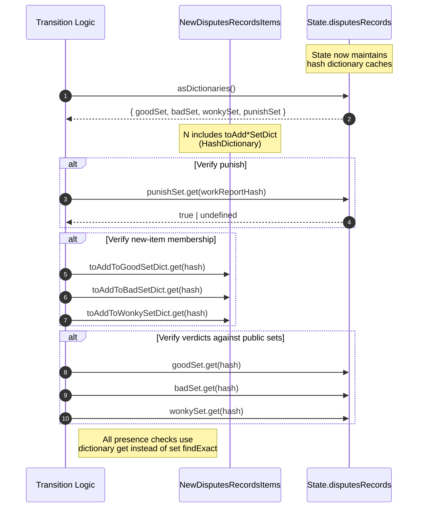

# Quicker dispute membership queries

## Pull Request by @skoszuta

Fixes #195 

Average execution time of disputes transition in davxy 0.7.0 test vectors:

| method | average (ms) |
|  --- | --- |
| Using .find() | 13.1597516 ms |
| Using HashDictionaries | 11.47134053 ms |


## Comment by @coderabbitai[bot]

<!-- This is an auto-generated comment: summarize by coderabbit.ai -->
<!-- This is an auto-generated comment: skip review by coderabbit.ai -->

> [!IMPORTANT]
> ## Review skipped
> 
> Auto incremental reviews are disabled on this repository.
> 
> Please check the settings in the CodeRabbit UI or the `.coderabbit.yaml` file in this repository. To trigger a single review, invoke the `@coderabbitai review` command.
> 
> You can disable this status message by setting the `reviews.review_status` to `false` in the CodeRabbit configuration file.

<!-- end of auto-generated comment: skip review by coderabbit.ai -->

<!-- walkthrough_start -->

<details>
<summary>📝 Walkthrough</summary>

<!-- This is an auto-generated comment: release notes by coderabbit.ai -->

## Summary by CodeRabbit

* **Performance**
  * Faster dispute processing and verification, improving responsiveness in related workflows.
* **Reliability**
  * More consistent and accurate checks reduce edge-case errors in dispute outcomes.
* **Refactor**
  * Internal optimizations to how dispute sets are referenced to improve lookup efficiency without changing user-facing behavior.

<!-- end of auto-generated comment: release notes by coderabbit.ai -->
## Walkthrough
Adds internal hash dictionary caches for dispute sets in state; exposes them via asDictionaries(). Updates transition logic to build dictionary views for pending additions and replaces set-based exact lookups with dictionary get checks across punish/good/bad/wonky verification paths. Expands NewDisputesRecordsItems with three new HashDictionary fields.

## Changes
| Cohort / File(s) | Summary of Changes |
| --- | --- |
| **State: dictionary caches and accessor**<br>`packages/jam/state/disputes.ts` | Initializes ImmutableHashDictionary caches for goodSet, badSet, wonkySet, punishSet; adds public asDictionaries() to return these; updates imports to collections HashDictionary types. |
| **Transition: dictionary-based verification**<br>`packages/jam/transition/disputes/disputes.ts` | Extends NewDisputesRecordsItems with toAddToGoodSetDict/toAddToBadSetDict/toAddToWonkySetDict (HashDictionary<WorkReportHash, true>); constructs these from SortedSets; replaces findExact calls with dictionary get checks for punish/good/bad/wonky paths and verdict verification. |

## Sequence Diagram(s)


## Estimated code review effort
🎯 3 (Moderate) | ⏱️ ~20 minutes

## Possibly related PRs
- FluffyLabs/typeberry#504 — Both modify how punishSet is accessed; this PR uses state.asDictionaries().punishSet while the related PR passes punishSet explicitly into safrole.

## Suggested reviewers
- DrEverr
- tomusdrw

## Poem
> A bunny buffs its lookup speed,  
> With tidy maps for every need.  
> No more peeking through the thicket—  
> Just a quick and trusty ticket.  
> hop get(hash) hop, truth revealed;  
> Disputes resolved, the carrots sealed. 🥕

</details>

<!-- walkthrough_end -->

<!-- pre_merge_checks_walkthrough_start -->

## Pre-merge checks and finishing touches
<details>
<summary>✅ Passed checks (3 passed)</summary>

|     Check name     | Status   | Explanation                                                                                                                                                                                                                                                                                                                                                            |
| :----------------: | :------- | :--------------------------------------------------------------------------------------------------------------------------------------------------------------------------------------------------------------------------------------------------------------------------------------------------------------------------------------------------------------------- |
|     Title Check    | ✅ Passed | The title “Quicker dispute membership queries” succinctly summarizes the core change of optimizing dispute membership lookups for speed. It directly references the move from set-based searches to hash dictionary access. The phrase is concise and clear without extraneous detail.                                                                                 |
|  Description Check | ✅ Passed | The description directly reports benchmarking results comparing the legacy find-based approach with the new hash dictionary implementation, demonstrating the performance gains. It clearly contextualizes the results in terms of average execution time for the disputes transition. This aligns closely with the pull request’s objective of improving query speed. |
| Docstring Coverage | ✅ Passed | No functions found in the changes. Docstring coverage check skipped.                                                                                                                                                                                                                                                                                                   |

</details>

<!-- pre_merge_checks_walkthrough_end -->

<!-- tips_start -->

---


<sub>Comment `@coderabbitai help` to get the list of available commands and usage tips.</sub>

<!-- tips_end -->

<!-- internal state start -->


<!-- DwQgtGAEAqAWCWBnSTIEMB26CuAXA9mAOYCmGJATmriQCaQDG+Ats2bgFyQAOFk+AIwBWJBrngA3EsgEBPRvlqU0AgfFwA6NPEgQAfACgjoCEYDEZyAAUASpETZWaCrKPR1AGxJcAitngMANaUkLRI3HgkkGzMApSICNyQAI7YlPDSkJAGAHKOcRRcAGwAHACMWQYAqjYAMlywuLjciBwA9G1E6rDYAhpMzG0AYh7YAGZjsrUqiG24stwkBS5tER4ebaUV2VWIlFyIgfiIAF54aJUAyvjYFAxRAlQYDLAHgWBhiBE0iGBjaIhcGAPPh8IFsElstBnKRcJBHpgXlxmNosNlLrhqNhWvxFmiDABhCgkah0dCcSAAJgADJSAKxgakATjAAGZqdAytSOHS6RwACzUgBaRgAItIGBR4NxxPgMBwDFA4FFbNESQ5icg0FIqKRICQAB6iPDwOWQcRsfhjULhSLIXBPRDqU1YeBYWjag3yakaADsGmp5ukcKkYnwFC1GHoA24zkyuAA7vh0NxePg0C9pAqslBdm6iJANGM3bQABQASi4ZVZGjKdKZvrpZSK0WQpe1ylI5YMOcgeYwBYAEgDYKKArKMM4MjiymUNPzfdXBXTWa3IO2dWgu0Z9MZwFAyPR8Na0HhCKRyFQaNGWGwMBTePxhKJxFIZPImEoqKp1FodLuTCVBBkFQTAcAIYgyGUa8FFYdguCoBN7EcFEXHhD9FGUH9NG0XQwEMPdTAMWMgi3aQ2iENBBkBUk2k+b5pA0XBWgMAAidiDAsSAAEEAElIMvUl6AcJw0OPRhYEwUhEB3SBePvChFGwe4QPvShJw8SBJISG0xBdZwPwzWBMjGcN9SMnheg8AJ7BIOFSyIUFaEuOyABp4TQZy3MgJMMECWQXNwdyIgwJBYEC8t0CjFBQvENBrJOeNjOYGLzWMhQMEBChlIICgNEVHjaFoLVIHIJCIgEayGDVXBYEUdBEDHPS5SnaQKzS6hIGJXBbkytKolM24FAoTVuDlMIBzk1hzkqkhhwSJqJwMxgjMYgqbBIJMKECEDmDGihmPNZM1k0t1IHm0dx30tDMHoYkPCE80FhMxSUtqqImHWF8XWQayERcdyyBUazJrCZrJzQ4leGkdhqB+/KjE4yxuI8Ggrx+o7+tCUQHvRuVkHEw19pgsyKqq/V72daRZIAWTsurhPgIhJx64lIAhD1ry4AADMcvjtDamAoYrucYB7EFUyBuZIwIyNmSjqMxGg6NtH4mMQUWMHwJDPOKyzKpsthavq7mAUW67pwrLgAG9IEcxRAvcgRPMdny5X812QrCwLIAAX1F7revzLGhdG8bg+02BdKWqU1oMABRQF4BRGDPyiYkJAyJCSAmcMKTpsJHDYjjFSImW5Yoqi5kdZ05RV/mfnrhjEHVhV2NYpGeP4i9oLJETUPkcSXik6mCvkh0lPuegyuj67ZDAZ29noEhUkkeL2GQUy+HoyIUBoFK9mYrgCG4oroHwABxJzAsW9yT7P/AACEXbs2+ovoe/aHPgB1d2Atf8c/AsA5E2nzZugtwzFV4vvRA7lsTBwuubFqLhgC/22htYmF077ZRIHofKUAMEPSnvqA0GYgSH0gCCMEEJkAJm6LPZB8gqHghaOgSUxxkDMGwKjaUXhIA6ngMWBgcMzSxlqixXsVhsChQSGAChmYgjIC1khbEURapIA0DRGgGgd4/AgcLFuZsrrIMtuWDQXsEiBQ0LCUswRZCRTdICEkR5rTFijPHUhYh8q9gJMZRRkAt4xQYKMJ0Zozoz2drQToTk2i+X8rZQ6qjSqbWgSQZgLdP7n2fl5XAi1rF2VLFtQIGC84XUirdZJCZUnpKYvgU+X9L7XwAV4mxRSSkHTKe/Sp1SMl1Ifr/Py/9cnjnybgQp4ZikkEwSOBxmUaCeStAEksHiyHeN0JAAAapQMGh0BFCJEVgZRElRA7X1lVFW4MDILwBH3OyOJ7Y5Kdi/IKXS4lDP4fAC4RjLmx0QBWDQwBD54JsRoUF3ZczcE5mSJgczsrg0WSAhMYCBaiEgYgHpmM3TOnivARKWNarEiiDPHZFtMilkyY0h2zSXkUuyTfccd8+kNIGR7alkUxivRDuGMOUZg7XAOnQQKLcCqnyENiGCEgpw3FUmjDS/D0j7InPaZM91B7umMRDJhoIWGb1JpqMg9xjn+KvMZPgtUwLvR4BnU02IEnXKXks9xni4R7BRJTBgwrEZcRRmjA5yqsZKGCc4P1iyiZ5zJKTKyNl2BUxkgVaAz12aQqEjzRFyK9GooMT00WZ1pYZlltJSugwHSYCdBOJudoK1q2YtzHs6zH453DN4bIWRexDAyB4Yqx8mXnyvlSmlPan7PMZfUn+f9Ap1qgNxMYaNsytqgO2kgnacQUr7Y8o6o6h3ropSyoZdbeyIqWUuvWus6Dds3Wu+lYguCII1QZVBEz2m4CweaHBegADcG6H50upTekcSDNUPvQVM0pI5sFpA/V+5l47f3nX/XelBaDJnTISOB3BBUpEG2qtiMiKA9pkLnUBKIabVbSH0VAmBT1Fj2CZizW4UQia3TJHQ2qaVCWVLOYbNJBQCbWnmNR29PzZBAeQ6B1Dr6IMI0ThaR6acuokEzptfUucDpcALvAIu7cdz4UIgeaK4lTwQR7leaFt54JdTQEhfuy05AKC/CoNQOF/w6cArBZg6gAD68BioeetZtOgHmaIHTwgRVzdIihoH5AwWgAhfRjGpLyfklISi+gYCUEgdI4i+gzBFgQ1IGBlF9CQakrJKSshKGMaqu4DCuYGO53AXmfN+YTAFw8IWav7itSQDzbAKCkA8wonagXMTBeq9bOtrEkC2EfiCIIdACRmfvFYY415WJcH+B4PYrkJsJBuJ2mb+Agi2DWwE+KW2JtIAAPI6ilEVMgJ2NvnayKxMItAbDSNFIdjEUoByIF8Sck7Do0jbee6997GB3C4C8P9oIgOcEg8gC97z4PxSIElNKCcMPAhw+BxNkGwRaC8QlmkRA32TvsQR6xcWuAscbQcKjRAJ2ADa+7IDjdba21ig2chURIOTyHfCsesQRxz1iWjsQ45ICLznRMHosxdPz9K4godREADgEfgAjBG3qRtUsR4iJBSGkX5gBcAmQgwBgboxAeHkNZqUiV7TpSFh9SSA4ojiXwDKZOuLg66KiDEHjBvmE0ICWZL4JA6AaDknCMIxIrfyGJGMSgBqkp+/wFIAJnLD72tuc4TM/rI4MM1WwlSLcYDpW4LAKgewUDIBhRb6vFTgkkj4CxuqeASElvINK7GmJ4AeA0ML1nz3NT4FGBOcng+OfPeYJhcnCZnChQHJPqfrFY9ymLEQejD2ztS6H4j8MTM3TxSxzztg5PldeA7hz320v2cr+57z8nqP0ee7NEL6Xz3xeM+PvDvfrFZeYAHKK5RBKBo5Siv7qqx5Q7x4gYHQyAGqwCoSBDByajcKHQxhTiTSWpeBEAZjyBuK0DZ70BoCpiKQWSt5YwzwF4kqMJ4bcBeB3hKwujuRKAz6wpwxYHl6UBbxuqGq4GOKR7QJizN7W4ZQ0AGg9Q4r25YyoEM6pRozpKLIdi6gMZGgMAmhmgWgDRmSWq+72g1wTiR5wCgTWTMy14gh7CiEUGWonTyapDBiACYBATM+HpOnuJMnGmJnJNPYWhGHhHsvqLiPmPgrlwBTn/jPkoHPgvvmAEZzmvhgBvlvutjvh/vvlKF0BpCfo/qEaAS/uPqzjfqznfqLg/mfqEZ9h6g6MHAtpuKQLEZ/krBLj/rjlPojgAfLnKOTjkMmGMNIuDLqtIvQGdJasPK7qXhUVlMHEwLUc7icvYMgamP4akaxBEXzqEfPhQIvkQPUWkYfpkX4oEKfmsYjrQIdpMb9lfq2r7HWgALqU7U62DP7gHj6hH8gCA0jCLh5jBMishMgLh0jm50i+jAn8hFDAlAlKD8h0jlAegVZlBKBlBMj5YCCsgrgMDUhLDMilBgkkhMh0hoDUjL5U4Ai4C2AC7HGsS+hFBMglBFDCJFDUhFBFCiBMhlCUhlACCJ5cipZMjCKUiUhMhMgolxZoANh0jUj/CpZoC+iUgoninlAMBCmJ5xZlb3AdzXEdYQBdY9aUD9aDaIAeZtb6BAA= -->

<!-- internal state end -->


## Comment by @mateuszsikora

> Average execution time of disputes transition in davxy 0.7.0 test vectors:
> 
> method	average (ms)
> Using .find()	13.1597516 ms
> Using HashDictionaries	11.47134053 ms

The execution time should be better when we change `HashDictionary` implementation


## Comment by @github-actions[bot]


<details>
<summary>View all</summary>

| File | Benchmark | Ops |  |
|------|-----------|-----|--|
| [bytes/hex-from.ts[0]](../blob/1307de2afa3ed995b627e630bc7d01f93b385811//_work/typeberry-1/typeberry/typeberry/benchmarks/bytes/hex-from.ts) | parse hex using `Number` with NaN checking | 144741.98 ±0.06% | 84.1% slower |
| [bytes/hex-from.ts[1]](../blob/1307de2afa3ed995b627e630bc7d01f93b385811//_work/typeberry-1/typeberry/typeberry/benchmarks/bytes/hex-from.ts) | parse hex from char codes | 910363.26 ±0.17% | fastest ✅ |
| [bytes/hex-from.ts[2]](../blob/1307de2afa3ed995b627e630bc7d01f93b385811//_work/typeberry-1/typeberry/typeberry/benchmarks/bytes/hex-from.ts) | parse hex from string nibbles | 563278.09 ±0.27% | 38.13% slower |
| [codec/bigint.compare.ts[0]](../blob/1307de2afa3ed995b627e630bc7d01f93b385811//_work/typeberry-1/typeberry/typeberry/benchmarks/codec/bigint.compare.ts) | compare custom | 267880572.35 ±5.58% | 3.99% slower |
| [codec/bigint.compare.ts[1]](../blob/1307de2afa3ed995b627e630bc7d01f93b385811//_work/typeberry-1/typeberry/typeberry/benchmarks/codec/bigint.compare.ts) | compare bigint | 279023265.32 ±5.2% | fastest ✅ |
| [collections/map-set.ts[0]](../blob/1307de2afa3ed995b627e630bc7d01f93b385811//_work/typeberry-1/typeberry/typeberry/benchmarks/collections/map-set.ts) | 2 gets + conditional set | 121538.75 ±0.12% | fastest ✅ |
| [collections/map-set.ts[1]](../blob/1307de2afa3ed995b627e630bc7d01f93b385811//_work/typeberry-1/typeberry/typeberry/benchmarks/collections/map-set.ts) | 1 get 1 set | 62076.06 ±0.06% | 48.92% slower |
| [codec/bigint.decode.ts[0]](../blob/1307de2afa3ed995b627e630bc7d01f93b385811//_work/typeberry-1/typeberry/typeberry/benchmarks/codec/bigint.decode.ts) | decode custom | 177770792.2 ±3.07% | fastest ✅ |
| [codec/bigint.decode.ts[1]](../blob/1307de2afa3ed995b627e630bc7d01f93b385811//_work/typeberry-1/typeberry/typeberry/benchmarks/codec/bigint.decode.ts) | decode bigint | 110044169.05 ±2.46% | 38.1% slower |
| [bytes/hex-to.ts[0]](../blob/1307de2afa3ed995b627e630bc7d01f93b385811//_work/typeberry-1/typeberry/typeberry/benchmarks/bytes/hex-to.ts) | number toString + padding | 331381.6 ±0.24% | fastest ✅ |
| [bytes/hex-to.ts[1]](../blob/1307de2afa3ed995b627e630bc7d01f93b385811//_work/typeberry-1/typeberry/typeberry/benchmarks/bytes/hex-to.ts) | manual | 16518.92 ±0.21% | 95.02% slower |
| [hash/index.ts[0]](../blob/1307de2afa3ed995b627e630bc7d01f93b385811//_work/typeberry-1/typeberry/typeberry/benchmarks/hash/index.ts) | hash with numeric representation | 189.23 ±0.2% | 28.87% slower |
| [hash/index.ts[1]](../blob/1307de2afa3ed995b627e630bc7d01f93b385811//_work/typeberry-1/typeberry/typeberry/benchmarks/hash/index.ts) | hash with string representation | 116.43 ±0.14% | 56.24% slower |
| [hash/index.ts[2]](../blob/1307de2afa3ed995b627e630bc7d01f93b385811//_work/typeberry-1/typeberry/typeberry/benchmarks/hash/index.ts) | hash with symbol representation | 180.75 ±0.18% | 32.06% slower |
| [hash/index.ts[3]](../blob/1307de2afa3ed995b627e630bc7d01f93b385811//_work/typeberry-1/typeberry/typeberry/benchmarks/hash/index.ts) | hash with uint8 representation | 165.74 ±0.02% | 37.7% slower |
| [hash/index.ts[4]](../blob/1307de2afa3ed995b627e630bc7d01f93b385811//_work/typeberry-1/typeberry/typeberry/benchmarks/hash/index.ts) | hash with packed representation | 266.04 ±0.33% | fastest ✅ |
| [hash/index.ts[5]](../blob/1307de2afa3ed995b627e630bc7d01f93b385811//_work/typeberry-1/typeberry/typeberry/benchmarks/hash/index.ts) | hash with bigint representation | 193.89 ±0.34% | 27.12% slower |
| [hash/index.ts[6]](../blob/1307de2afa3ed995b627e630bc7d01f93b385811//_work/typeberry-1/typeberry/typeberry/benchmarks/hash/index.ts) | hash with uint32 representation | 204.99 ±0.03% | 22.95% slower |
| [math/add_one_overflow.ts[0]](../blob/1307de2afa3ed995b627e630bc7d01f93b385811//_work/typeberry-1/typeberry/typeberry/benchmarks/math/add_one_overflow.ts) | add and take modulus | 263013259.15 ±5.97% | 0.77% slower |
| [math/add_one_overflow.ts[1]](../blob/1307de2afa3ed995b627e630bc7d01f93b385811//_work/typeberry-1/typeberry/typeberry/benchmarks/math/add_one_overflow.ts) | condition before calculation | 265042108.87 ±6.8% | fastest ✅ |
| [math/count-bits-u32.ts[0]](../blob/1307de2afa3ed995b627e630bc7d01f93b385811//_work/typeberry-1/typeberry/typeberry/benchmarks/math/count-bits-u32.ts) | standard method | 103048154.3 ±2.55% | 58.71% slower |
| [math/count-bits-u32.ts[1]](../blob/1307de2afa3ed995b627e630bc7d01f93b385811//_work/typeberry-1/typeberry/typeberry/benchmarks/math/count-bits-u32.ts) | magic | 249573794.64 ±5.92% | fastest ✅ |
| [math/mul_overflow.ts[0]](../blob/1307de2afa3ed995b627e630bc7d01f93b385811//_work/typeberry-1/typeberry/typeberry/benchmarks/math/mul_overflow.ts) | multiply and bring back to u32 | 265686949.91 ±6.12% | 2.27% slower |
| [math/mul_overflow.ts[1]](../blob/1307de2afa3ed995b627e630bc7d01f93b385811//_work/typeberry-1/typeberry/typeberry/benchmarks/math/mul_overflow.ts) | multiply and take modulus | 271863435.76 ±6.82% | fastest ✅ |
| [math/switch.ts[0]](../blob/1307de2afa3ed995b627e630bc7d01f93b385811//_work/typeberry-1/typeberry/typeberry/benchmarks/math/switch.ts) | switch | 272709071.17 ±4.89% | fastest ✅ |
| [math/switch.ts[1]](../blob/1307de2afa3ed995b627e630bc7d01f93b385811//_work/typeberry-1/typeberry/typeberry/benchmarks/math/switch.ts) | if | 270176050.98 ±5.69% | 0.93% slower |
| [math/count-bits-u64.ts[0]](../blob/1307de2afa3ed995b627e630bc7d01f93b385811//_work/typeberry-1/typeberry/typeberry/benchmarks/math/count-bits-u64.ts) | standard method | 8551512.42 ±0.33% | 91.06% slower |
| [math/count-bits-u64.ts[1]](../blob/1307de2afa3ed995b627e630bc7d01f93b385811//_work/typeberry-1/typeberry/typeberry/benchmarks/math/count-bits-u64.ts) | magic | 95670925.38 ±1.17% | fastest ✅ |
| [codec/decoding.ts[0]](../blob/1307de2afa3ed995b627e630bc7d01f93b385811//_work/typeberry-1/typeberry/typeberry/benchmarks/codec/decoding.ts) | manual decode | 23722243.32 ±0.51% | 86.22% slower |
| [codec/decoding.ts[1]](../blob/1307de2afa3ed995b627e630bc7d01f93b385811//_work/typeberry-1/typeberry/typeberry/benchmarks/codec/decoding.ts) | int32array decode | 172193377.8 ±2.61% | fastest ✅ |
| [codec/decoding.ts[2]](../blob/1307de2afa3ed995b627e630bc7d01f93b385811//_work/typeberry-1/typeberry/typeberry/benchmarks/codec/decoding.ts) | dataview decode | 171004427.11 ±3.53% | 0.69% slower |
| [codec/encoding.ts[0]](../blob/1307de2afa3ed995b627e630bc7d01f93b385811//_work/typeberry-1/typeberry/typeberry/benchmarks/codec/encoding.ts) | manual encode | 3099744.36 ±0.14% | 17% slower |
| [codec/encoding.ts[1]](../blob/1307de2afa3ed995b627e630bc7d01f93b385811//_work/typeberry-1/typeberry/typeberry/benchmarks/codec/encoding.ts) | int32array encode | 3734818.59 ±0.19% | fastest ✅ |
| [codec/encoding.ts[2]](../blob/1307de2afa3ed995b627e630bc7d01f93b385811//_work/typeberry-1/typeberry/typeberry/benchmarks/codec/encoding.ts) | dataview encode | 3716022.35 ±0.31% | 0.5% slower |
| [logger/index.ts[0]](../blob/1307de2afa3ed995b627e630bc7d01f93b385811//_work/typeberry-1/typeberry/typeberry/benchmarks/logger/index.ts) | console.log with string concat | 6885031.75 ±60.99% | fastest ✅ |
| [logger/index.ts[1]](../blob/1307de2afa3ed995b627e630bc7d01f93b385811//_work/typeberry-1/typeberry/typeberry/benchmarks/logger/index.ts) | console.log with args | 1067582.8 ±96.21% | 84.49% slower |
| [codec/view_vs_collection.ts[0]](../blob/1307de2afa3ed995b627e630bc7d01f93b385811//_work/typeberry-1/typeberry/typeberry/benchmarks/codec/view_vs_collection.ts) | Get first element from Decoded | 32106.36 ±0.17% | 53.41% slower |
| [codec/view_vs_collection.ts[1]](../blob/1307de2afa3ed995b627e630bc7d01f93b385811//_work/typeberry-1/typeberry/typeberry/benchmarks/codec/view_vs_collection.ts) | Get first element from View | 68909.83 ±0.1% | fastest ✅ |
| [codec/view_vs_collection.ts[2]](../blob/1307de2afa3ed995b627e630bc7d01f93b385811//_work/typeberry-1/typeberry/typeberry/benchmarks/codec/view_vs_collection.ts) | Get 50th element from Decoded | 32199.17 ±0.22% | 53.27% slower |
| [codec/view_vs_collection.ts[3]](../blob/1307de2afa3ed995b627e630bc7d01f93b385811//_work/typeberry-1/typeberry/typeberry/benchmarks/codec/view_vs_collection.ts) | Get 50th element from View | 35566.66 ±0.26% | 48.39% slower |
| [codec/view_vs_collection.ts[4]](../blob/1307de2afa3ed995b627e630bc7d01f93b385811//_work/typeberry-1/typeberry/typeberry/benchmarks/codec/view_vs_collection.ts) | Get last element from Decoded | 32111.66 ±0.24% | 53.4% slower |
| [codec/view_vs_collection.ts[5]](../blob/1307de2afa3ed995b627e630bc7d01f93b385811//_work/typeberry-1/typeberry/typeberry/benchmarks/codec/view_vs_collection.ts) | Get last element from View | 24172.75 ±0.25% | 64.92% slower |
| [codec/view_vs_object.ts[0]](../blob/1307de2afa3ed995b627e630bc7d01f93b385811//_work/typeberry-1/typeberry/typeberry/benchmarks/codec/view_vs_object.ts) | Get the first field from Decoded | 509498.28 ±0.25% | fastest ✅ |
| [codec/view_vs_object.ts[1]](../blob/1307de2afa3ed995b627e630bc7d01f93b385811//_work/typeberry-1/typeberry/typeberry/benchmarks/codec/view_vs_object.ts) | Get the first field from View | 102965.04 ±0.16% | 79.79% slower |
| [codec/view_vs_object.ts[2]](../blob/1307de2afa3ed995b627e630bc7d01f93b385811//_work/typeberry-1/typeberry/typeberry/benchmarks/codec/view_vs_object.ts) | Get the first field as view from View | 102694.7 ±0.13% | 79.84% slower |
| [codec/view_vs_object.ts[3]](../blob/1307de2afa3ed995b627e630bc7d01f93b385811//_work/typeberry-1/typeberry/typeberry/benchmarks/codec/view_vs_object.ts) | Get two fields from Decoded | 505937.76 ±0.27% | 0.7% slower |
| [codec/view_vs_object.ts[4]](../blob/1307de2afa3ed995b627e630bc7d01f93b385811//_work/typeberry-1/typeberry/typeberry/benchmarks/codec/view_vs_object.ts) | Get two fields from View | 81449.9 ±0.19% | 84.01% slower |
| [codec/view_vs_object.ts[5]](../blob/1307de2afa3ed995b627e630bc7d01f93b385811//_work/typeberry-1/typeberry/typeberry/benchmarks/codec/view_vs_object.ts) | Get two fields from materialized from View | 171541.57 ±0.25% | 66.33% slower |
| [codec/view_vs_object.ts[6]](../blob/1307de2afa3ed995b627e630bc7d01f93b385811//_work/typeberry-1/typeberry/typeberry/benchmarks/codec/view_vs_object.ts) | Get two fields as views from View | 81504.51 ±0.13% | 84% slower |
| [codec/view_vs_object.ts[7]](../blob/1307de2afa3ed995b627e630bc7d01f93b385811//_work/typeberry-1/typeberry/typeberry/benchmarks/codec/view_vs_object.ts) | Get only third field from Decoded | 507645.67 ±0.3% | 0.36% slower |
| [codec/view_vs_object.ts[8]](../blob/1307de2afa3ed995b627e630bc7d01f93b385811//_work/typeberry-1/typeberry/typeberry/benchmarks/codec/view_vs_object.ts) | Get only third field from View | 101747.2 ±0.22% | 80.03% slower |
| [codec/view_vs_object.ts[9]](../blob/1307de2afa3ed995b627e630bc7d01f93b385811//_work/typeberry-1/typeberry/typeberry/benchmarks/codec/view_vs_object.ts) | Get only third field as view from View | 101487.52 ±0.25% | 80.08% slower |
| [bytes/compare.ts[0]](../blob/1307de2afa3ed995b627e630bc7d01f93b385811//_work/typeberry-1/typeberry/typeberry/benchmarks/bytes/compare.ts) | Comparing Uint32 bytes | 21063.25 ±0.17% | 5.14% slower |
| [bytes/compare.ts[1]](../blob/1307de2afa3ed995b627e630bc7d01f93b385811//_work/typeberry-1/typeberry/typeberry/benchmarks/bytes/compare.ts) | Comparing raw bytes | 22205.02 ±0.09% | fastest ✅ |
| [hash/blake2b.ts[0]](../blob/1307de2afa3ed995b627e630bc7d01f93b385811//_work/typeberry-1/typeberry/typeberry/benchmarks/hash/blake2b.ts) | hasher with simple allocator | 0.045 ±0.64% | 2.17% slower |
| [hash/blake2b.ts[1]](../blob/1307de2afa3ed995b627e630bc7d01f93b385811//_work/typeberry-1/typeberry/typeberry/benchmarks/hash/blake2b.ts) | hasher with page allocator | 0.046 ±1% | fastest ✅ |
| [collections/map_vs_sorted.ts[0]](../blob/1307de2afa3ed995b627e630bc7d01f93b385811//_work/typeberry-1/typeberry/typeberry/benchmarks/collections/map_vs_sorted.ts) | Map | 268498.71 ±0.04% | fastest ✅ |
| [collections/map_vs_sorted.ts[1]](../blob/1307de2afa3ed995b627e630bc7d01f93b385811//_work/typeberry-1/typeberry/typeberry/benchmarks/collections/map_vs_sorted.ts) | Map-array | 103737.64 ±0.03% | 61.36% slower |
| [collections/map_vs_sorted.ts[2]](../blob/1307de2afa3ed995b627e630bc7d01f93b385811//_work/typeberry-1/typeberry/typeberry/benchmarks/collections/map_vs_sorted.ts) | Array | 68985.39 ±0.27% | 74.31% slower |
| [collections/map_vs_sorted.ts[3]](../blob/1307de2afa3ed995b627e630bc7d01f93b385811//_work/typeberry-1/typeberry/typeberry/benchmarks/collections/map_vs_sorted.ts) | SortedArray | 201145.36 ±0.32% | 25.09% slower |
| [crypto/ed25519.ts[0]](../blob/1307de2afa3ed995b627e630bc7d01f93b385811//_work/typeberry-1/typeberry/typeberry/benchmarks/crypto/ed25519.ts) | native crypto | 5.04 ±20.85% | 83.52% slower |
| [crypto/ed25519.ts[1]](../blob/1307de2afa3ed995b627e630bc7d01f93b385811//_work/typeberry-1/typeberry/typeberry/benchmarks/crypto/ed25519.ts) | wasm lib | 10.89 ±0.02% | 64.4% slower |
| [crypto/ed25519.ts[2]](../blob/1307de2afa3ed995b627e630bc7d01f93b385811//_work/typeberry-1/typeberry/typeberry/benchmarks/crypto/ed25519.ts) | wasm lib batch | 30.59 ±0.55% | fastest ✅ |
</details>


### Benchmarks summary: 63/63 OK ✅

<!-- thollander/actions-comment-pull-request "benchmarks" -->


## Comment by @mateuszsikora

```suggestion
      const { goodSet, badSet, wonkySet } = this.state.disputesRecords.asDictionaries();
      const isInGoodSet = goodSet.get(verdict.workReportHash);
      const isInBadSet = badSet.get(verdict.workReportHash);
      const isInWonkySet = wonkySet.get(verdict.workReportHash);
```


## Comment by @tomusdrw

Couldn't we just use `DisputesRecords` instead of this additional structure? I mean to replace the entire `NewDisputesRecordsItems` with just `DisputesRecords`. The latter has better API and is immutable, here we can easily go out-of-sync with the two?


## Comment by @tomusdrw

Didn't we have something like `HashSet<Ed25519Key>` to avoid the need of the second generic argument?


## Comment by @skoszuta

done


## Comment by @skoszuta

done


## Comment by @skoszuta

done
