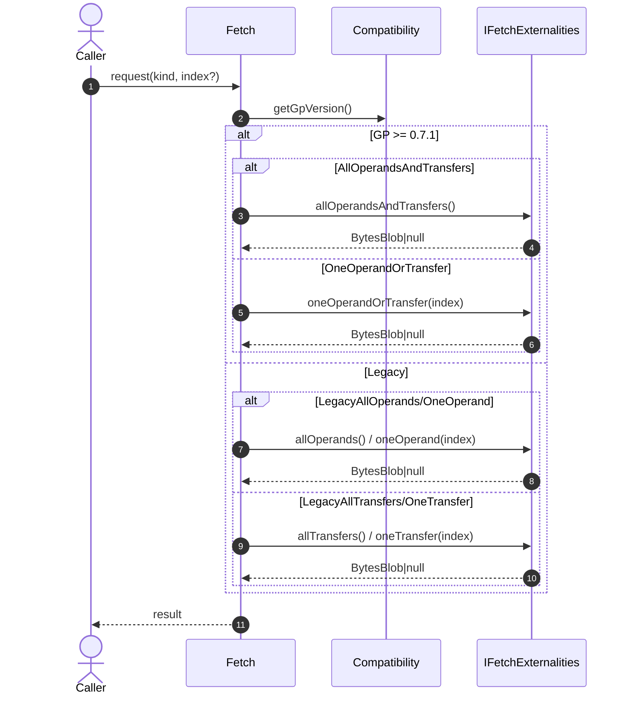
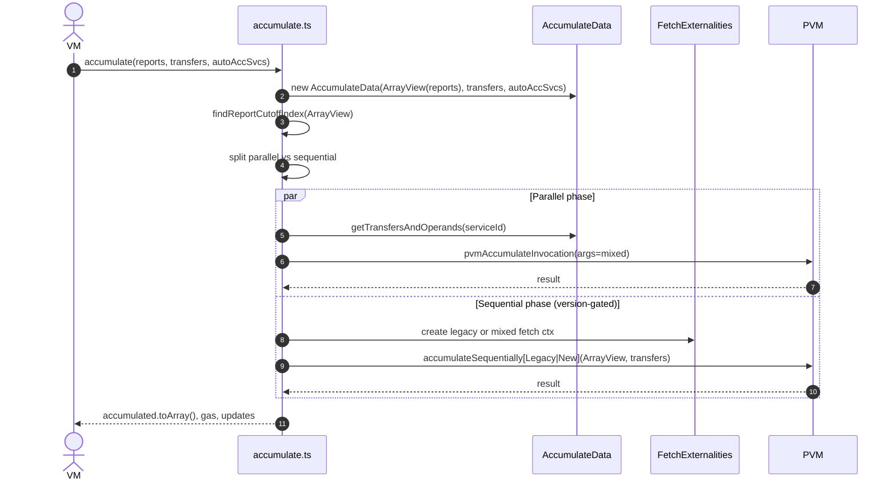

# Update accumulation to 0.7.2

## Pull Request by @mateuszsikora

### Changes:
- Current `accumulateSequentially` renamed to `accumulateSequentiallyLegacy`
- New `accumulateSequentially` implementation 
- Fixed auto accumulate services (now they are empty in recursive invocation)
- Changed fetch externalities to return operands and transfers as one collection 
- Added `ArrayView` to avoid `Array.slice` - we had a lot of them in accumulation
- Disabled deferred transfers module in 071+

### Next steps:
- Refactor accumulate to avoid recursion.

### Known problems:
- I didn't find any preimage that is updated to 0.7.1+ so I wasn't able to test it e2e


## Comment by @coderabbitai[bot]

<!-- This is an auto-generated comment: summarize by coderabbit.ai -->
<!-- This is an auto-generated comment: skip review by coderabbit.ai -->

> [!IMPORTANT]
> ## Review skipped
> 
> Auto incremental reviews are disabled on this repository.
> 
> Please check the settings in the CodeRabbit UI or the `.coderabbit.yaml` file in this repository. To trigger a single review, invoke the `@coderabbitai review` command.
> 
> You can disable this status message by setting the `reviews.review_status` to `false` in the CodeRabbit configuration file.

<!-- end of auto-generated comment: skip review by coderabbit.ai -->

<!-- walkthrough_start -->

<details>
<summary>📝 Walkthrough</summary>

<!-- This is an auto-generated comment: release notes by coderabbit.ai -->

## Summary by CodeRabbit

- New Features
  - Introduces lightweight array slice views with safe access, subviews, iteration, and copy-out.
  - Adds support for combined operands-and-transfers fetching and processing, with version-aware routing and legacy compatibility.
  - Accumulation now includes pending transfers alongside operands, with mixed-argument handling and updated encoding.

- Refactor
  - Transition flow updated to use array views, improving bounds safety and performance.
  - Externalities split into legacy and new paths, with mixed data encoding/decoding.

- Tests
  - New unit tests for array views and expanded coverage for fetch and accumulation, including legacy scenarios.

<!-- end of auto-generated comment: release notes by coderabbit.ai -->
## Walkthrough
Introduces ArrayView utility and re-exports it; integrates ArrayView into accumulation logic. Adds transfer support across accumulation data, invocation args, and externalities. Extends fetch host-calls and externalities with legacy vs combined operands/transfers paths gated by version. Updates tests for new APIs, legacy enums, constructor signatures, and mixed args handling.

## Changes
| Cohort / File(s) | Summary |
| --- | --- |
| **Core Collections: ArrayView**<br>`packages/core/collections/array-view.ts`, `packages/core/collections/array-view.test.ts`, `packages/core/collections/index.ts` | Added generic ArrayView with bounds-checked access, subviews, iteration, and copy-out; added tests; re-exported from collections index. |
| **Host Calls: Fetch (impl + tests)**<br>`packages/jam/jam-host-calls/fetch.ts`, `packages/jam/jam-host-calls/fetch.test.ts` | Added combined operands/transfers fetch methods and enum variants; version-aware routing between new and legacy kinds; updated tests to use Legacy* variants and new mock methods. |
| **Accumulate Data (impl + tests)**<br>`packages/jam/transition/accumulate/accumulate-data.ts`, `packages/jam/transition/accumulate/accumulate-data.test.ts` | Constructor now accepts ArrayView<WorkReport> and transfers; groups transfers by service; new getTransfersAndOperands accessor; tests updated and expanded for transfers-only, operands-only, and combined cases. |
| **Accumulate Flow**<br>`packages/jam/transition/accumulate/accumulate.ts` | Refactored to use ArrayView for reports; introduced transfers into args; split legacy vs new sequential paths; updated codecs (argsLength), invocation wiring, cutoff computation, and final state update handling. |
| **Externalities (impl + tests)**<br>`packages/jam/transition/externalities/fetch-externalities.ts`, `packages/jam/transition/externalities/fetch-externalities.test.ts` | Added mixed TransferOrOperand encoding/decoding; introduced legacy constructors/contexts; exposed combined accessors; renamed prepareAccumulateData to prepareLegacyAccumulateData in tests. |

## Sequence Diagram(s)




## Estimated code review effort
🎯 4 (Complex) | ⏱️ ~75 minutes

## Possibly related PRs
- FluffyLabs/typeberry#390 — Touches the same fetch host-call implementation (FetchKind enum, Fetch class) and tests.
- FluffyLabs/typeberry#487 — Modifies accumulate pipeline with transfers and ArrayView use across accumulate and externalities.
- FluffyLabs/typeberry#562 — Updates fetch externalities APIs/codecs in the same modules adjusted here.

## Suggested reviewers
- tomusdrw
- skoszuta
- DrEverr

## Poem
> I hop through views of arrays so neat,  
> Sub-slices crisp beneath my feet.  
> Transfers twirl with operands’ song,  
> Legacy paths still hop along.  
> Version moons guide every turn—  
> Carrots encoded, args to burn.  
> Thump! The merge is swift and strong. 🥕🐇

</details>

<!-- walkthrough_end -->

<!-- pre_merge_checks_walkthrough_start -->

## Pre-merge checks and finishing touches
<details>
<summary>❌ Failed checks (1 warning)</summary>

|     Check name    | Status     | Explanation                                                                                                                                                                                                                        | Resolution                                                                                                                                                                                                                                                                     |
| :---------------: | :--------- | :--------------------------------------------------------------------------------------------------------------------------------------------------------------------------------------------------------------------------------- | :----------------------------------------------------------------------------------------------------------------------------------------------------------------------------------------------------------------------------------------------------------------------------- |
| Description Check | ⚠️ Warning | There is no pull request description provided, so there is no context or summary explaining the scope and intent of the changes, making it impossible for reviewers to understand the full objectives without inspecting the diff. | Please add a descriptive pull request description that summarizes the key changes—such as the addition of ArrayView, updates to accumulation logic for transfers and legacy support, and related test adjustments—to give reviewers clear context before diving into the code. |

</details>
<details>
<summary>✅ Passed checks (2 passed)</summary>

|     Check name     | Status   | Explanation                                                                                                                                                                                                                                                              |
| :----------------: | :------- | :----------------------------------------------------------------------------------------------------------------------------------------------------------------------------------------------------------------------------------------------------------------------- |
| Docstring Coverage | ✅ Passed | No functions found in the changes. Docstring coverage check skipped.                                                                                                                                                                                                     |
|     Title Check    | ✅ Passed | The title “Update accumulation to 0.7.2” succinctly captures the primary intent of the pull request, which is migrating the accumulation logic and related code paths to support version 0.7.2, and it does so in a clear and focused manner without extraneous details. |

</details>

<!-- pre_merge_checks_walkthrough_end -->

<!-- tips_start -->

---


<sub>Comment `@coderabbitai help` to get the list of available commands and usage tips.</sub>

<!-- tips_end -->

<!-- internal state start -->


<!-- DwQgtGAEAqAWCWBnSTIEMB26CuAXA9mAOYCmGJATmriQCaQDG+Ats2bgFyQAOFk+AIwBWJBrngA3EsgEBPRvlqU0AgfFwA6NPEgQAfACgjoCEejqANiS4BVbrWol0DBtmbYL1ePgwGAcm4ClFwAbAAcAEwGNgBKADJcsLi43IgcAPTpROqw2AIaTMzpAGIW2ABm5bJxKojpuLLcJEEUFLLp3B4W6eFRNojBkMyO2IgAXojwANb4VAYAyvjYFAxOAlQYDLBczIhg2PaOYGgubh5ePgbQaBSkuJDrmFs72r7zuNSjXPhNvjEkEngJAA7pQ0pADDUghZwQYAMIUEiOejULgRAAMEQArGB0QBOMAAZnR0AAjKSOKSwhwIiEAFpGfTGcBQMj0fDlHAEYhkZQ0eiFNgYTg8PiCERiSTSB7yJhKKiqdRaHRMkxQOCoVCYLmEUjkKj8hSsdhcKjAyCINzDNoyhTylRqTTaXRgQzM0wGbgnKZoUh1JiI9JMCxWSU+Oo3KiyMCAkEaGiITS4NIGABE6YMAGJM5AAIIASR5+uRFqtN3kHMYsEwfqMudotGQaEg5HNCfu5XgVkg5VmedaaFkADUgeaABRehg+v1B2YkWch0TicPpSODmOj+PSJOIACUCmFr3gGCIkGwGHUkHbyFw1fuEjQFngDho6AH8lj5oYiIuGAANJAGykJAD5Pi+3j/pAJBWEK9wnKsiCIABloCJ+kB6nyEEAUw3DRj4YAELm74PCQ1aArMAGYPQ6iYT4IHwM2vYUGAlZURavBIrQGgwNuyBMFIfABoiYiQFYJ63owj6uJ4y6QZQFB9mwiG+tKTEoBgoHPoBNbSmxSy4Cx5RgAISwYI2zgIUhpaoaOFpPgwx6nmx6jIGJRC3pRZlXneV74ERUaASQuDLBgTYWiQXoGk4OHyMCOT6UMeBeCe3lOLM8DZBgj5vlG3FwE416BRYFZYA0TRgFsohTHQ6CIZQslNl5x4MGUSgPPgEm0PAwlwS40jIGOdz7s5NAGhBxloAM9CaeBPgaEYRjZnmFijb+N74KlkBKC1NxrfwnIkAAHtwsyGn2nQCPZUHCuoQKIIykBjhgPgkLuRgAKKJvAwyGnKTiImhJCVKdXAALJ0PAbhphmBgQGARiTtO0izoGwahg1q7vhucbJhw0OplmOYFkWfI1ZarDlvtVY6fdBj1uZzatuhvIUPADBnuIT4NIwniIf2UYjiCwDQHo6k8N6Kn+nOC7oxBEZY5+8aIHlsDRbzyCoEdJ0UIabEMJgz33EEB6JhQ2BiDVXU9cVj28JIjgm7gZtiLMu4ANzqYmnEAceiZPLpiKMD+hqAs2t5OH74js+UCnMGOiBLCsJDIR8OsAWy+5sLeigAcCCBbCBj7Po4MimeZoyOZtlVThzXbqPIbGIsFFChegWD+YOgvmvgAnoNZQFpZy4eij3z5k4nqw5YO3EAAp5FduYz/m6ktdgSgplAkdsz2sfC3o8cT9YMAANoALopzc9wALyQOi6deTfCfLKsGhubeu5cB3w6jnvsOiWQ7ltgtkCJQR6dxRr7kRBxAYN0Upsl0BaVOuA/53DHPALgGAQEUA/jAXyFl+ptygjBdgkA4oSRMuecy1cpiOT/ihT8Y4Y4sAwVggCBAWHMBaJAG+t4kCvwAe/T+74u57zwd+JEr5GbbhqmhHuoDmwoQHn/Qi74xw4OgGfPBP1KAMSfGMAqqt6IglqoQtcsg/7H3mLITh+ALAaBogaWYp81FcHzKtAgFBREEBQO4tKvdoIkFghrUqhjPwfVaH2asZknwnjxlAJhzBrpMQQrfSAwBH5ILSTfeB6SLSH34eJWAHtjwzW0ieaUTsMqkD4M2ahUEIl8DIbASAqZ8waSLvQP2Ot0jwLUl/LuGgCZQDuEk2YKT0RZJQGk/+hSPb6UMsZMuTY+p80qUQapYVWlmSOvwPAVMKFmWVqmepCkKDzXhD4J2tiewWHwMCOJkA4ThjcGCIOEinDNjQqHfmndNwJLYarLAWxXj8D4AAR2wJQeQb9YCURWcgAJQT6LNjuABeUUprKfmQN8+ho5sI+AEvcbxZjSE5F8l/ACfYHEOytkuG2TSeyzEMucxaRMVq0Vbt44e21PBjXDFTLWp0arnXntvdgt1pAPT8MYwVOsao7UQlwAABv0n+IslVi07N2JViNJYo3nGjJcctMZRmxsCJWSqDCQAQXPS628t7syzrARQyqEl7wPs/I+Gjz6IMvtw2+996CP3yTCnBqqhbqqtTa0V7NwGDCVTClxwDOGUEtdaqAtqrpOpdZAJVqD0HJpaOotN0a7WOqCs62gyrcUgkYbHDhLQ2H4AbaAnhCBlahqEQLNVegS0ZpjUMCtOalUqKjEm71fbICZu3hhRxfBs1VtzQAKksdYkydjqUeOcTgtxfJZh70tZCeAAhkBKBoBbaiQKol+jxgYT64htECkUP9AEtkgZMRFODLqUN0wE1hh6XVM4AwGtsbLFcx4lCHSVnjX9hM8yFlnSWcm1oKycmBeU2mUB6ZhSZhdK6iIwCypFERpsIYd4sBaRoE165FZCEQMc484spx6uAzLI14HtlQeTD7TYP5JgpWHnh+1yxygnDWPIQV/GnIK1so+HwRBJhtSOkgcQcDjqnWVgtP+072ZEfQA2Ogyq9NLvI4k1MVGzFmo0HR1MGrGNaqcDqiWQHpaGrDKFdIEGjoWo+l9R9doX2A2BjrMGEMf0wzhgjZzyMhBoCKLF5gYBnWJgqo+GE6RyhBS2FuRM0H8ZweJohw0yHKaVnQ7WP+/xuCeFWAKNL61IDFCy7AAA0hBjQuYQwAHkmgbEbABJruAthtbMhoLr5AevKDMgN5rI2uKdYsNADYiBMsUCsmxQbw32vjZIEtzAK3QEMvDt1SAcQSBEBONGDinZDrytMqNSKyZHpnYuwwWQC3Jt9asi9y7O3PtUQAj9t7C29uhVW9987v3yCg4O9gsWAwBLZWvJRdlrM4HMHUIaTLQ3mmIFWFlVm+BNNQHesdKiNVNuwFBvgGuQn2aWgoKJye3jLTcG1vcQoahyDsl61ROoTt9vg7xumvMBn6C4YHbwH49UG7dd54c3MZkYfg/+IgE6oVpBcAAEKyATFr25AhIAAB9gEhijVhsXLZjF05Hr17mL1/tmS6xQZXlBVfq4GOCUGaBuDAFNo5ACOu9cG+N6biwhgRf0xqhLstg7s4ojl1NxsivaCu7W0moP0h9eCFD5gs3kfLcx6zUO9kE35e0Gd2ntBnHbAhAACw4Mz4gbPhuTd54sGYVWAxqYYfUlc2g5sI4HHZ4ympRoufCvL/z5b4PxYSUY4VNiaBaBCFGES7cChEfAW8YiVbZBJ5WFexJzBiSHys0wE9tSds+xBDIt4M5WmlqdfcXLPB3LRC8r2pWIjwq+A2/FeIJKtpgOguvpkoIukqmlo7snkrjPmCBnrrlniHm3l0HZkCurLmpTtTlOGgbmoBjFnFukAlklkTgZPrCGHUNjtlu2D5v2rHqAcvuAcqg7uXpXnARQNXpBrXg3trogc3sgWHrgQqsgEqlgTTlMLgU5sxjOAlkQXFiQSluQellQbADljuJanQVdFLnbg3GLsqlAVPinmnogO7uGJrpAE3i3rnl0P6u3kIRgaIc1tgRIWLFIUjHULIcQclmQfVhls1mobQVOpLgpDoWAYZrmiwUnmwYLm7tIB7uYd7r7v7ieIHnwVYSgSGKLDfEzIkWovYZNCIWITga4fgR4YQV4aQalhQX4TjgEcmIevet9CWH9IFEFh+qFt+swPlv+vDJ6NFmUfFvId4VUcof4bjPlk/ghizEhmWDaGVtekARbuATwAOseKNEzk4AuuCAYUnogEYewYgAgcHjnhkRYG3KXiQNAdEWDpQJwUdNwY3mkQIe3mLPmJTqTqNFlFzHdPNFAG0v3oPk+swF6OIGoFzNGAIJNHdsKApGceULcuaIxpTjzAUXgqziPkzGxIfpdj2M1pADQocsLggsUH2K2KAgAOIzwgRgiv5jjkncBDg0l0R6A3xDjogAD6AA7OyaSDglErQN2B9oYbATEWtucZAH9qwS7uwfNCLiSWKBYPKJAJSdSWtnLFwNApQFIP/EfpAPyVYGKUKbsQBJKUngBCDgcSadDjKX/KTl6NsiiF5FAssCdFNI1rNhBtdG4ESUsdHtbgOmfgxMKMgEaV9vsaKY1PQKaX1tcbDrKQgv8B8MeDVNiW9oXOfsGUMD7k0PQN4kzFlEpM9pDsDonl9oDsWbINGQDqdhWRaRGeWUfjtmnvuAymPDdOQcmjouzKBJCppiLnYC+Hdq0HET4F1ClD2ZsdmY5JGQeF1LJNlLctkOzDvvpAYgpNgEQM0kzH2KmfICCbADIFCaXsqVSQJJMHNH/PmMCUKvQE8sCV4GCfXOKfSYyWqXRAkptHgF2MgMwIoB4MnNdCoDEqeGeeNGgMCDcE4F1GrtQNlsAbHovMvAzhsT3n6IFPCUuDVIxmsZQChWxGQG4LnGSgcIOfQLQDTi8oeLJEaEirvpQPvpXEzPrF6I+YAZpgtE/qjntFyoYjyrtA1AKupnKuyH/gOgAXdA9ODPHmERATsWGSKTceno8cca3oIWLDhYzmJrmm8c1h8ZQF8RKogJIaUXIYMYlsMUoZQWMUZX/FJZWjJcwWXlEdKaKXcYdA8bwSpdYSGLgRpShUqjpTjnpS3EXGxcZf0aZaZQoT4dUSoYEe9CfmeIcPyMqpTnNuFdIQQWZdFSMVZbUfUebqLkwbmqGXzuGYpcgDfKSHXhqhODGm9AXsVUqlWU7i5Ypf6qSFiLVXTg1QglHhAUDu9qWXzh1TVbbPVYVf1cqoNS1UGpAJ1d1RNY1eEUqoNXWRVR1SEItWWr1b6QNRWU2ewR1ZydtfZLtZAKTippXDbmwCmmKSRciOkIiAWVhVgO+kuESSLiqsNYchqs9XFjVN4qtbWT9Y2CWl9bNX9WQADbmRtMDY2U5X1uDQgt9YtgcVDS9bDbmmtSGMYcjVAM1daaKRjTDXgvDVDrtuwQ0X5s0c+q0W+sFiKAABIZSwDdGRZ9GZUDH1DLa3Q+CrinDuAyTzjwRnDC1gAvhoB1EpiwaTEkxRSdKzGoaoWLGQD/EKQD4pIC6KVgCIjC2dL6zAyKmORcCMEazXk6zIBqQzxsiORp4ATQAxC5h+DzDFDvQxDsmgzvSgxdbsla4ACa0A708wnkuZbQuYiANg9eHsZtfcdwaeep0EvW3k1ADw2AXYDMU6ttJ4CdDKT8ScaK24x4v4lEv554uAAEF262Xkt1+AvxF1h0NAhyV4G+eOaARtY5p43i/EoC2tsO2xDYyATMhUak8dBxKe0BVkzUrUlceO0NhOyATcIUlcPgNs0uZZ/AGANsfd4OodfcnOyZ9AiIloK09dA5JceYgt5wNAAAItQLUuGE7ObB4meIgCpM4ApKsrxHgvBCwL+YOX3MPQceLFQFnIMFAjVtKEzLmFfcLXfR8GOFAhpgBGfC2WStA7A44PA2gIgxFMg5AGfCg6fPuIxkLeINVgVBvvrJ7vXdhlbuaKrBYMneUOeO5leDPrMMwFVqdNAPgJPSgIvUFK8HQHvcPd/QJPAFUCnfcGPRGRPVPvHFqWzCQPmLQJAkFCFDeIYkJEuEMPAIdFTDva8npFPiYtmfZEBSQPXerX+SklIm2K3ena+AMO5lwOvN+MeiQGOKmLIxVfI7samABBoME7uABDNMlKeLfmgORHwGpOvSNU3KzACI+GwsA4k0CKBHvQfdzoFCfcmCygVlxQJTxVBR/vxa/t/kJWdKJbHuJarVeSPpMEQFlM3NFAsfQHVTta4lgA5kxu4ZFX3XzRgALa4ELY4CM2LUcJLdLYVQklwN9CPgAN7sPvaIDzBKOrDkmTSpOrPrMUCAirCqOQAAC+pmLSAAAmVM0PJO0JdOIamG7IVewigBbfcMs1c5AHswcyo7QDsxHV88o1s1ZE7Lsxsz8yc2c6mJc40Nc60Lc7clOA8w9A06dGAUM+NV02rT012E4CZbIYM7JBM2MzQES9fSQBLffTM8tYugs6i8s03qkV5acx+VC1cy0G0OkHIAmEi5ea82i9RZ02dd0z2Di303qvi7zYS6LcSyLZgzQBSx8FS31XoS80s1nWZHbewQ7U7S7W7R7V7T7X7YHcHRCyy9C00Oy+0BUYofVjy38Xy4wei4K2zDuti92Hi4QQSxBKS8LT61M5SzQcmJNSq7SzrJAO8+HZHfXqa7HBc2yzc+kCfi0PRo83/NKgw0naAiw5sAKzboha/e/U0gvhvg5jgr47Doo/s8o6o1wAC4c2o+G5AME9xMc1KsYu2KWDRKWJpZPM6+zPm6MIWzkMW4mCK1YDgu46zEEN4+W+Dv419oE02yE6ShJGQ/ABQz4mOM2/uNQ6rU8qFE/S7HwIO8BOVk4H23mEvKqycLgK64lCtOu92MjpfaM2S9g47M7C/UoSrfQB+Rg6+3A/fbg+zlZKg3gv+5M7fUB0g5bUQ0Q6E+pF1PrKpk5PQysbHpFADaNKPuwxGY9GxK6ZMJdA3HgIQNK2S+FFWwhCQyEk4D/rmTCy+5ByQNg+co0f5i0QDAze0ZAF+pDF0bBj0VFlzQM5K96+R76xJ/64q+MbLUTFMcWMVkrVTGe5hliwCbVqWGzqi2pEY2KWsRtFJ9RZLT6UVTVPY7hxVTrnW+C8MNwOKWHBwxQIkl7PZ94kQOufZzbRqznUdTRLsLaOvKpr+JR986o/GVAPu6bM/X2A9YaMSn1NwESgcVwN553WnpomxN4gIOnYqZZ/3dZ2C+F4VeDLcGTEV0+ouGw89IiZsK1NKAMFRz81bbG3p8EvyxBHgjB09kvqR8cHKxHGC8TpAO+zvZwyF2xHFGjkQKZ/1aKPbK+GN858YXgjlxnfl+DoV010c0vqF9W+ZAMB2K1wcRF5AOfYaGwGVzZ6ow1vBBFHBOmQxEh6JCplTPnZPIdzOUvS3H3Jd6QCiO+Kd0t1w3g5bRaBlC08sG0zpFjR8NVD8t/ELAAOqzBTDcM6yiyNyBKvCCNq7hjHrdhqRrfG0pTxPN0EeUBgCNffO+r5N/wwOWSzAzlMxRMxOzeW6ztgjzt86VthcNs74aM/cP2cKH0vejuVhpeauik+KBIzlk/mRqQKJgv13QCMehs9deRNOQ/H2mcothuOsNRdq/LGJqQo8UBo+g8c6gbsatxsSS++fS9XOnfnc1QM/MfvtMAHuft9ha+fCBzeLAcaZG+I/AjABm8W/s56CpMRmpfZ1EAZc+poCkdu8ys2fgg/jkVb3yC5jJ8DeoMFOcUv78olNbRlN8qtyVPs6/7odXR1NqdReHsv2++tNJWkXKqe/RdHuB+W2micSr3yDh/o+4CEM6gp9ktp+9/L7995i58AeOCoMaqABJhLmh3437MN37jAjyIoP5b1Hxt2CLHz5/H+wSP0n4RANxP4FFP1nzP+f3PzQAv/T4XjKlUzVDdSXsqpz2ttz4crz/t7WxVxwRjh7ex/aXibmgK7gz4GhKdKzAfCvhGGydZvlD1b7IguAhVHVLAIdh/cSA13RsB6iTgUhPmQUYALgL37vcSAEQAAbgBIEVc9Au4JfngUwGvhsBuAw4s23IHgh1m1A0gY/ygDpt5ucAzYiXnFKdhoIVaYNssTtiCCRWYg5VFIIdgZ9p+bXLbnzzBg+4aB23X5uq3S4n9T4vaCQW/yYFCD48cgowRt04bGExwbXXhsrk4aH8dBopBfoFGbgXgUoSqCNhGRUH7dkIFXZAMc2gEzwzBoBJAYHDi7hF0B8gxbk5xB4gcN+6fPvjfx37s4nBy/DAQtwKjRCh+hxbruCHDSh8khp0OgdTQfS002oXHGVIzS4As1Ny7NADBFQlb7YhmfrElkZysaycMwctIrGTGU7zEaYD0KrJA1PTdRdGBQnWJohPZOAGUeQsPqjyH6ixSGHgcht2A0pfE48ladbJUCNQpRN0nXJfPCkehWMiAGgACBXBSj5phomvPIJ+H3DeIFmCkbUmhAGDDB2yM5A5Ad3bpBRZA1jGErY2lC/BO6+/fTsKEM5ytOu8JO5LaDihKBXBp4eXoFE1JUVX8H5aApogD4gCE64A8vJANPhixuAEgZgG0gkA041oAEXrFTzBYWRIOnXSynvT1olgbgRASivcH3yKBK4Y4XMDEHJLzB2ScILrDfXehwgWwEIlkevDfAKYzshST2DQGXxUx5erkARLAF3C0NB6WnEfNbTj4J02IOfO/sxyvAwt2uw8Izp124DrtoIyZeZq8xnITCUB8XDaNoV9AOw2uDnPrq0L24H4VMWjdcpuRAZpZoI6QAYBCnFTZR9yw3eYNVhcjil/qhZPymJjqCYcwGYpG4GXEpHEtOuJnFMeP0chWAbOQo80HdyS5Nhbg4IYARqKOqYik82Ij2HiOYBj9hahI4kdRXzFPY2uP/RsDHQG5tIZ4u0RcGcVGDSgv+exJ3FPg9hhCGszqc0EdE+KhU7ob4NYLl3uCMJdKjdfStOOkA3CNo6JVFiZAki7lxSZJGpKCLoghjvhGnXSGh13FGijx1AZpGOFaHrNAxN0NLNUArIXCUQ9DUBPuXw4X8SAD48QE+JuE+RNxYPL0IhErhtcY6Ko4SMsEmDakSkDY40dQE+INZsmuLbsVYDOJsQAxkKR8WcW4DVhPcDnAbgoHLrLIAwndYqPXX+BM4PEpEqkXRCwkMVYkRoToK+B0DfJOwZkIfnCFI6VA2kkGFds0jyHtj7+LHe+m8hC41cV49XG8AcRHHJVAaG0b7lgFaG0AshyKfelSNgmcYHOK+NfOhEmhPJR2v9CgORK+F/wXeyAKumACfAY4rewJJKNRTorPU7GXkAgNwGskAhoI+XdFuCLbAbQ+xUEHIL3UMTbk+Au4hiThLnzNJISbpOiKBToiFAQSx6OuA0GKQ/DNaukWfsxzT76SUOYsfcVFOVGr5EwVtYumcUjhOBRxtoT3oSkrgqT4RGmH+spOIhMREkecMgGnQzpgTDEl4rABVJtHnsVJ8YPyKol3BKjKsIIVHtihuDeBRgokfAKeCUhv00KbEDHM9D4DhNimhnJ8M0wElocGRTIi0NWCaAzlfJBwjQEcIAiLlMop4GFFTAZHYplY/AKfONKgAWSzu8QdCvRU2DShGMgodgA1l3zow0O8UmEY9HRAaBOSGgCIK+M2gY4POIXIILgFBAdSLxXkTEoeKwCLk2Y5yJaKymWhF9OUG0d/DtHL7IBK+N5UFDXzFQ3Q2KklYQSEMqnySICkQpwBxNUmW9uJBAXiZxkGiTQ4g30dQAAKa5AsAIOQrgKMOH7EMGBaQ6QezK4k8TygfEo6HzMQACzbJws75qLIak98t+P8SWUUO0y7QExeopoANLkH4jaxjgeschwghbtgmlKKfFwBRE+pt2Ms6sVbJoA2zfw9s44YCMHEV4nZj0dEWWIlJYiR+bs+CvZE8zCgVxZxDkVyICzRwgQeXKMUfCVRyiuAf0BgBoDPw2BCQEQGWQ9IlGAIs5z6HOXnILnQC9ecEBsEM2VQfNlmIc6Xv4LOZKpzWsLDltaxiowhq5DrOubJAbmMdlm2ovyERNbkfl258bOFv6I+A0BoBd4rMTgIpGMzzZERIOS7KLlFiuAJYo/hiLDkVioBf8O8T+Owl/iQwz43UqvLCHKpxZkASWVAMgCpC750wg2RqiXyW4R0KXbQVL0UpHyoAJ838bohtjXz5JptFUV/Jj4/yHef80+BqnjFBR5EmvMhJVAaxKoX5wifWbMN34LyOxGALsVQB7GSQyMkwV8Gey4ABTICA3VjgONbGHFqe+3egVKM4hUw80QUSen/3rb0DlEYnd8giS4AflThp4KhSJI5kgcNUiAeyAVDhoqSshEiq4aOA9giLmOtADVB81U5k0hpo6QcHkVISApxYoEgTBuLnlMzBy90YZEFCBbqzLw5FdmE5P3ymKSwY4UGVeF9BvQAF34oBU+OIW4TrxZcjVvOTOJIyUZWAJmC4qxIVlVS55DABBPMiQEspqfIbu/NuBMjj5nis+cAvkBKSopFC5mWIhYAsSPkXke0RdlfCtgVuH5TDkQrwlQk+8xMwxFBLVLakIp58nxSgiCieyII7wRwC73UhEjbZPgDUqiWUUysuI2i2QLot9jSj2QnIEZWS1UW+YShv0OmuUInGVDIA1QtmoJw5oesigXrfmpOLjmGUaiWwQjMuJCrfFpA0tGDB0Pk7y0ZiFMOYmhgWK0x8o6FG9nOCfRtR/6kjGccPA7aWgu2akFQlBHOUGU2KtoKMZXBWHZQEBWbVhg1GQhNAHInYJQrKGvTdSnAL1NuRxEigkBPZokj4Gorhq4rIKa1ahffSVQqxUAUK7YVo1xaswUM6AIplhD2nDxs27mAAOSuQFp28AjsbMQVilEQwwY8JXFYbtNuIUXU+ewGKgo4zillN/IYlamgJJJcE+HsPBkijQxZQMWWClFqQLE8k6E+QAvkMRtlxAog49m6TUiHcDg1K82pOGbGGIO2u7LRqnSmUX4GIr4EFYcouWGV+AwgJcFbT7CpgCVxyOegTm8BWREAKChAClEnniJHA8pAlcSpX7BwSA8pclSJNwLsqEVEEblc4JCi09Ak7AbiAthbqjsXV0jUUK+iWCSLZQvo+gBgIiiQUCV2DXRZBQGlY01VjmUlYiEzXu8gO9A7VXk2hVAp8eXsYUH3jjk9hc1dEWlV3VgBejnUeAbiH4EM66TEwSKDtcMDagl9gM80pcunAaR6kqIwFSlIJEuSwkbkEIoILIFHKpRu82K1TnvWHhyJCF5UxvsgKXx1QdYr+E1ZQxKmzjq11POgAX0L4coGsJMz/AJQpnCUqZ/+WmRJXVCmrY5FyxOkw3hU5swRnDSgDbExqMDm1iIVtZSpPUyASAHUtOVjSbV4r+1MrbBlSpgBKrZ1fUiHn7xfQirOUhiN+mwCIoSQEFo0INXwCVTApjwYY0QEqgAgZyp8Em3NOwBCKyAZNbESBRVUU1NR7gSkxqFKP9isL3iYK1cUZRVgvoXBRa2CLmJ8UiEE1NADNbWQG5oEvYMoysMJrTVJrbNq6jaB1FVh8AfVqwvsPR2ujiAIV261kaIK4iLKmiyysoa+gqE8c+O4WP9DsvqGeteFwzbzfppOWwAzlU4y5crHaEExOh0xJTo8uVqqdkW6UwfMgCAkdgdykSvWCwAny/s8SktKKTIF0IAiLOaeaAtdDlDXVrxEFeQGOA63l45sDtdgs7mgLatnartd2uyS6we0usM8d2s7Rvp71Hak2vVtyKW0zaFtOrG+vMFhk6M8eR/LrayJPDpBtoJ226bypzlFUEUmwC7WdtEAXacOzYDHLdnoBPhxenIOUeKTa6USgYHysUpTn3Y0BG6dSnUjiTYhhKZpF+AaLRrJYNkoczZcUmsQ1rlbwdaZEFU1quaw6bNIkynNgwR1vZxsaefHffWGi3ITwimAxHR0OhXUUoBK0nR8BOHJVMV/ARHGRkZ3NhzwnXW4XVzXhOBdxgZGHfXT0rN1dNWWv1XmyvZNJTODqcSVZtmBw7hai4nHATupiibkV64j9s/T7ji6jlEKoRZtAvFET9yp3OXZZvTWzBid7BFXVsDV0iaMAYmhgPuEklNjK4M1DAAnSa21avez9SuN8g1WRL8IenQqU/2KlPYbcrPe/Dh13EhjTOclEanpERqQ6IR+panTWSPwEqDwIOzQIVTSwrck9lNaXpJLT2bQPdCdT3jntO42MMppGCwJPXKr91xSkRGMm1Vhxolh8qLFCSiH2EgkkJOHV7ZPl2I808O/6oURgA8m6lTdf8FrORtSCgq6dkTUiNE2j1qRnoE+2PdeKsh5xRWU3UdeeIrJU9kVvy9mI8E2Bd49xxiRKUTi7Z3c+YWxMDQTIg2KrSmpMr/AdFf4iVqZumRDarTsqKAHKuac3c5sV247mOtu2APburAa7RATCv6Q4T12+qwqJRRLXsuS09I9N2W9LZlv10/ECqUAf/Z0lY0t8whEBYA+8nlLW7XKKhKA68Cd1wH0CwyxA+CrugZV+mDQ0KE0NS1YGVCOBpA3gaMpPyzNTY+UbqWD1HVvdXkVfp+2xQMQjdkS/cmFo44rKotaymLWFgE4RZXQ7oVkF5FYh9cuhQJWCKaHAqlgit1U59AqEdDKgXQhgNUDRXUDslnwiAdkqsroDskuk9wJkAYHsN15aAnJduiEE5J4gwgJAPEFiCxCEgsQnJOgGgAiBhGwgaAMIHXhUBYgSA0R8oAwAEBYhSQeIQkE4G8P2HBQjh5w64dUPuH4EqoFkNWvZLYD2S1CFw54dsNGBFmUaVMEgC6wCRWYBmDAKmAEWPgBgf4No0gBngxBs8U4OgHeVggzxSCdAPoz2AGPJw2jiAZdYqXGNTBRj8x0TDCCWPWpUwXUVSeeBvo053g03RAHCFViIsuAT9XYy0gOMxBzw5gXAFYAuNVR5jNxoY3sfuNHHpAHjJLhBFeNXH2GkKT4y0hiTVRaA+YRCL2VOPzH0woJ1MLzFwCAmLeeTejFwGPhRprUrR61LiZaTUI/AANOEzfV+Osx/jdEFE4EyxO4nUwkcUYFscWOgm8TqYLWJ4BaYQQ4T+UQOKgGegrEyMiIQMaO0nbrtqKUuQEOAWQj1L6KAjIUdnsnFUySsNoVk0eAExcacIRSy9E3XuCVhh4z6rMgSVPCXhaWoEy6GzL7BuGxS3iShGCA+CuSmNZGcUEaikDIAmkCUX2MiryncpJG5QQZEyZpPH1bEX5HwHCZnhWBaljBPuMKf+PalOg/J6VUKdJMimedgE2YvAH0T0r8SJAdFTTEAAoBJaALiTRNoBvTrpWDyHM6zFP9TGQeu3i6dgGESq+Z3rTiRjoIJYDtsvnD1BIcz7nDFBab4hhmL1sc0HUECYhQVJAo6vdc+l9PUm9j/9EgHCYgotxHIVJvE3seEg+BOwjIxEAyZ2N+m9j6UTKI+BROEm2AcJqM7JAJh4njmfpnEyudTAEmiTXAVMMcYYDJFTwTyLfHOd3MtI6T6J4E7ceZPKn2TwZx82upnVYb+UvYShGLF1MvLuIz5185vmUCntLjUwC0DQjZygblzt52c/OZuAwisLzJ/c2VKPMPm7jNOV8/RmpNXnqTN55k/eZPOPmnj3YSk1+dpNzz6T1xs2P+ZpOAXfwnJp1ZYCcCAAcAl6W9S8EEMqGREEAC4BKWBcDNRnj9apLlDwzN2wmVOFSdTqcMSxmziAp3shXT0VsxmkqAeGWNFVMfIqz2M9mFj31oBZmtHe7TmGxcUSXoZe9GxfgAa4bRGMtSfsyIIopulnh+oASQlEnEbASAta0vkmRhBTmVzLSAM2UHPMgWNoGijteQEsiUxCz/ywS+gDZwhFz8NAG2EDMDVwyQUZ7MWA/U2BIANTpfPHGSfEDak+t0V7C8+lwuLmTwBF/049owAbmoe25wY9OZaREWviJFhiy0gC1WALzuJ1ttanPhtGkToxpi3OcfNYgsjEQTknXnKDJHqqhIWgFiHKCqA8QmR7IyQHRBKBKghIPECEAbACBSQEQAQPrE5KcksQYQEINtaiNhBaAEQBsKSDoCckIgeIEgJyQYB5GCYrbHw9UY4i1HKApAeoyhZcOVHXQQAA== -->

<!-- internal state end -->


## Comment by @github-actions[bot]


<details>
<summary>View all</summary>

| File | Benchmark | Ops |  |
|------|-----------|-----|--|
| [codec/bigint.decode.ts[0]](../blob/d736f1d5f4c13340570f3d6d5ad23800edfb8ea3//_work/typeberry-runner-5/typeberry/typeberry/benchmarks/codec/bigint.decode.ts) | decode custom | 166621791.61 ±3.48% | fastest ✅ |
| [codec/bigint.decode.ts[1]](../blob/d736f1d5f4c13340570f3d6d5ad23800edfb8ea3//_work/typeberry-runner-5/typeberry/typeberry/benchmarks/codec/bigint.decode.ts) | decode bigint | 107076478.4 ±2.28% | 35.74% slower |
| [codec/bigint.compare.ts[0]](../blob/d736f1d5f4c13340570f3d6d5ad23800edfb8ea3//_work/typeberry-runner-5/typeberry/typeberry/benchmarks/codec/bigint.compare.ts) | compare custom | 252414456.42 ±8.42% | 1.01% slower |
| [codec/bigint.compare.ts[1]](../blob/d736f1d5f4c13340570f3d6d5ad23800edfb8ea3//_work/typeberry-runner-5/typeberry/typeberry/benchmarks/codec/bigint.compare.ts) | compare bigint | 254995814.05 ±7.05% | fastest ✅ |
| [math/mul_overflow.ts[0]](../blob/d736f1d5f4c13340570f3d6d5ad23800edfb8ea3//_work/typeberry-runner-5/typeberry/typeberry/benchmarks/math/mul_overflow.ts) | multiply and bring back to u32 | 263117118.76 ±5.28% | fastest ✅ |
| [math/mul_overflow.ts[1]](../blob/d736f1d5f4c13340570f3d6d5ad23800edfb8ea3//_work/typeberry-runner-5/typeberry/typeberry/benchmarks/math/mul_overflow.ts) | multiply and take modulus | 246312906.92 ±5.25% | 6.39% slower |
| [math/switch.ts[0]](../blob/d736f1d5f4c13340570f3d6d5ad23800edfb8ea3//_work/typeberry-runner-5/typeberry/typeberry/benchmarks/math/switch.ts) | switch | 278584761.81 ±3.83% | fastest ✅ |
| [math/switch.ts[1]](../blob/d736f1d5f4c13340570f3d6d5ad23800edfb8ea3//_work/typeberry-runner-5/typeberry/typeberry/benchmarks/math/switch.ts) | if | 263209307.39 ±5.53% | 5.52% slower |
| [hash/index.ts[0]](../blob/d736f1d5f4c13340570f3d6d5ad23800edfb8ea3//_work/typeberry-runner-5/typeberry/typeberry/benchmarks/hash/index.ts) | hash with numeric representation | 191.92 ±0.24% | 20.72% slower |
| [hash/index.ts[1]](../blob/d736f1d5f4c13340570f3d6d5ad23800edfb8ea3//_work/typeberry-runner-5/typeberry/typeberry/benchmarks/hash/index.ts) | hash with string representation | 119.02 ±0.5% | 50.83% slower |
| [hash/index.ts[2]](../blob/d736f1d5f4c13340570f3d6d5ad23800edfb8ea3//_work/typeberry-runner-5/typeberry/typeberry/benchmarks/hash/index.ts) | hash with symbol representation | 171.7 ±0.38% | 29.07% slower |
| [hash/index.ts[3]](../blob/d736f1d5f4c13340570f3d6d5ad23800edfb8ea3//_work/typeberry-runner-5/typeberry/typeberry/benchmarks/hash/index.ts) | hash with uint8 representation | 159.15 ±0.34% | 34.25% slower |
| [hash/index.ts[4]](../blob/d736f1d5f4c13340570f3d6d5ad23800edfb8ea3//_work/typeberry-runner-5/typeberry/typeberry/benchmarks/hash/index.ts) | hash with packed representation | 242.07 ±0.43% | fastest ✅ |
| [hash/index.ts[5]](../blob/d736f1d5f4c13340570f3d6d5ad23800edfb8ea3//_work/typeberry-runner-5/typeberry/typeberry/benchmarks/hash/index.ts) | hash with bigint representation | 184.61 ±0.46% | 23.74% slower |
| [hash/index.ts[6]](../blob/d736f1d5f4c13340570f3d6d5ad23800edfb8ea3//_work/typeberry-runner-5/typeberry/typeberry/benchmarks/hash/index.ts) | hash with uint32 representation | 198.58 ±0.5% | 17.97% slower |
| [bytes/hex-from.ts[0]](../blob/d736f1d5f4c13340570f3d6d5ad23800edfb8ea3//_work/typeberry-runner-5/typeberry/typeberry/benchmarks/bytes/hex-from.ts) | parse hex using `Number` with NaN checking | 132545.93 ±0.44% | 84.43% slower |
| [bytes/hex-from.ts[1]](../blob/d736f1d5f4c13340570f3d6d5ad23800edfb8ea3//_work/typeberry-runner-5/typeberry/typeberry/benchmarks/bytes/hex-from.ts) | parse hex from char codes | 851533.41 ±0.44% | fastest ✅ |
| [bytes/hex-from.ts[2]](../blob/d736f1d5f4c13340570f3d6d5ad23800edfb8ea3//_work/typeberry-runner-5/typeberry/typeberry/benchmarks/bytes/hex-from.ts) | parse hex from string nibbles | 528975.18 ±0.9% | 37.88% slower |
| [bytes/hex-to.ts[0]](../blob/d736f1d5f4c13340570f3d6d5ad23800edfb8ea3//_work/typeberry-runner-5/typeberry/typeberry/benchmarks/bytes/hex-to.ts) | number toString + padding | 286823.08 ±0.83% | fastest ✅ |
| [bytes/hex-to.ts[1]](../blob/d736f1d5f4c13340570f3d6d5ad23800edfb8ea3//_work/typeberry-runner-5/typeberry/typeberry/benchmarks/bytes/hex-to.ts) | manual | 14936.96 ±0.67% | 94.79% slower |
| [math/count-bits-u64.ts[0]](../blob/d736f1d5f4c13340570f3d6d5ad23800edfb8ea3//_work/typeberry-runner-5/typeberry/typeberry/benchmarks/math/count-bits-u64.ts) | standard method | 6183314.31 ±2% | 92.93% slower |
| [math/count-bits-u64.ts[1]](../blob/d736f1d5f4c13340570f3d6d5ad23800edfb8ea3//_work/typeberry-runner-5/typeberry/typeberry/benchmarks/math/count-bits-u64.ts) | magic | 87435972.19 ±1.47% | fastest ✅ |
| [math/add_one_overflow.ts[0]](../blob/d736f1d5f4c13340570f3d6d5ad23800edfb8ea3//_work/typeberry-runner-5/typeberry/typeberry/benchmarks/math/add_one_overflow.ts) | add and take modulus | 270451943.94 ±4.18% | fastest ✅ |
| [math/add_one_overflow.ts[1]](../blob/d736f1d5f4c13340570f3d6d5ad23800edfb8ea3//_work/typeberry-runner-5/typeberry/typeberry/benchmarks/math/add_one_overflow.ts) | condition before calculation | 264999931.22 ±4.65% | 2.02% slower |
| [math/count-bits-u32.ts[0]](../blob/d736f1d5f4c13340570f3d6d5ad23800edfb8ea3//_work/typeberry-runner-5/typeberry/typeberry/benchmarks/math/count-bits-u32.ts) | standard method | 86959652.81 ±1.46% | 65.53% slower |
| [math/count-bits-u32.ts[1]](../blob/d736f1d5f4c13340570f3d6d5ad23800edfb8ea3//_work/typeberry-runner-5/typeberry/typeberry/benchmarks/math/count-bits-u32.ts) | magic | 252291746.35 ±4.2% | fastest ✅ |
| [collections/map-set.ts[0]](../blob/d736f1d5f4c13340570f3d6d5ad23800edfb8ea3//_work/typeberry-runner-5/typeberry/typeberry/benchmarks/collections/map-set.ts) | 2 gets + conditional set | 116138.09 ±0.41% | fastest ✅ |
| [collections/map-set.ts[1]](../blob/d736f1d5f4c13340570f3d6d5ad23800edfb8ea3//_work/typeberry-runner-5/typeberry/typeberry/benchmarks/collections/map-set.ts) | 1 get 1 set | 59200.75 ±0.28% | 49.03% slower |
| [codec/decoding.ts[0]](../blob/d736f1d5f4c13340570f3d6d5ad23800edfb8ea3//_work/typeberry-runner-5/typeberry/typeberry/benchmarks/codec/decoding.ts) | manual decode | 21528446.6 ±1.34% | 88.72% slower |
| [codec/decoding.ts[1]](../blob/d736f1d5f4c13340570f3d6d5ad23800edfb8ea3//_work/typeberry-runner-5/typeberry/typeberry/benchmarks/codec/decoding.ts) | int32array decode | 190856763.7 ±4.45% | fastest ✅ |
| [codec/decoding.ts[2]](../blob/d736f1d5f4c13340570f3d6d5ad23800edfb8ea3//_work/typeberry-runner-5/typeberry/typeberry/benchmarks/codec/decoding.ts) | dataview decode | 186534161.65 ±4.45% | 2.26% slower |
| [codec/encoding.ts[0]](../blob/d736f1d5f4c13340570f3d6d5ad23800edfb8ea3//_work/typeberry-runner-5/typeberry/typeberry/benchmarks/codec/encoding.ts) | manual encode | 3181277.76 ±0.94% | 20.28% slower |
| [codec/encoding.ts[1]](../blob/d736f1d5f4c13340570f3d6d5ad23800edfb8ea3//_work/typeberry-runner-5/typeberry/typeberry/benchmarks/codec/encoding.ts) | int32array encode | 3990523.14 ±0.68% | fastest ✅ |
| [codec/encoding.ts[2]](../blob/d736f1d5f4c13340570f3d6d5ad23800edfb8ea3//_work/typeberry-runner-5/typeberry/typeberry/benchmarks/codec/encoding.ts) | dataview encode | 3719261.02 ±4.34% | 6.8% slower |
| [logger/index.ts[0]](../blob/d736f1d5f4c13340570f3d6d5ad23800edfb8ea3//_work/typeberry-runner-5/typeberry/typeberry/benchmarks/logger/index.ts) | console.log with string concat | 7060622.03 ±59.73% | fastest ✅ |
| [logger/index.ts[1]](../blob/d736f1d5f4c13340570f3d6d5ad23800edfb8ea3//_work/typeberry-runner-5/typeberry/typeberry/benchmarks/logger/index.ts) | console.log with args | 1060137.07 ±86.8% | 84.99% slower |
| [codec/view_vs_object.ts[0]](../blob/d736f1d5f4c13340570f3d6d5ad23800edfb8ea3//_work/typeberry-runner-5/typeberry/typeberry/benchmarks/codec/view_vs_object.ts) | Get the first field from Decoded | 476948.76 ±1.73% | 3.06% slower |
| [codec/view_vs_object.ts[1]](../blob/d736f1d5f4c13340570f3d6d5ad23800edfb8ea3//_work/typeberry-runner-5/typeberry/typeberry/benchmarks/codec/view_vs_object.ts) | Get the first field from View | 93917.69 ±1.65% | 80.91% slower |
| [codec/view_vs_object.ts[2]](../blob/d736f1d5f4c13340570f3d6d5ad23800edfb8ea3//_work/typeberry-runner-5/typeberry/typeberry/benchmarks/codec/view_vs_object.ts) | Get the first field as view from View | 87234.69 ±1.95% | 82.27% slower |
| [codec/view_vs_object.ts[3]](../blob/d736f1d5f4c13340570f3d6d5ad23800edfb8ea3//_work/typeberry-runner-5/typeberry/typeberry/benchmarks/codec/view_vs_object.ts) | Get two fields from Decoded | 473799.51 ±1.81% | 3.7% slower |
| [codec/view_vs_object.ts[4]](../blob/d736f1d5f4c13340570f3d6d5ad23800edfb8ea3//_work/typeberry-runner-5/typeberry/typeberry/benchmarks/codec/view_vs_object.ts) | Get two fields from View | 71713.51 ±1.97% | 85.42% slower |
| [codec/view_vs_object.ts[5]](../blob/d736f1d5f4c13340570f3d6d5ad23800edfb8ea3//_work/typeberry-runner-5/typeberry/typeberry/benchmarks/codec/view_vs_object.ts) | Get two fields from materialized from View | 137857.34 ±1.53% | 71.98% slower |
| [codec/view_vs_object.ts[6]](../blob/d736f1d5f4c13340570f3d6d5ad23800edfb8ea3//_work/typeberry-runner-5/typeberry/typeberry/benchmarks/codec/view_vs_object.ts) | Get two fields as views from View | 73981.25 ±1.41% | 84.96% slower |
| [codec/view_vs_object.ts[7]](../blob/d736f1d5f4c13340570f3d6d5ad23800edfb8ea3//_work/typeberry-runner-5/typeberry/typeberry/benchmarks/codec/view_vs_object.ts) | Get only third field from Decoded | 492002.76 ±0.59% | fastest ✅ |
| [codec/view_vs_object.ts[8]](../blob/d736f1d5f4c13340570f3d6d5ad23800edfb8ea3//_work/typeberry-runner-5/typeberry/typeberry/benchmarks/codec/view_vs_object.ts) | Get only third field from View | 86482.65 ±1.66% | 82.42% slower |
| [codec/view_vs_object.ts[9]](../blob/d736f1d5f4c13340570f3d6d5ad23800edfb8ea3//_work/typeberry-runner-5/typeberry/typeberry/benchmarks/codec/view_vs_object.ts) | Get only third field as view from View | 90158.39 ±2.06% | 81.68% slower |
| [codec/view_vs_collection.ts[0]](../blob/d736f1d5f4c13340570f3d6d5ad23800edfb8ea3//_work/typeberry-runner-5/typeberry/typeberry/benchmarks/codec/view_vs_collection.ts) | Get first element from Decoded | 28344.23 ±1.6% | 54.8% slower |
| [codec/view_vs_collection.ts[1]](../blob/d736f1d5f4c13340570f3d6d5ad23800edfb8ea3//_work/typeberry-runner-5/typeberry/typeberry/benchmarks/codec/view_vs_collection.ts) | Get first element from View | 62708.13 ±1.31% | fastest ✅ |
| [codec/view_vs_collection.ts[2]](../blob/d736f1d5f4c13340570f3d6d5ad23800edfb8ea3//_work/typeberry-runner-5/typeberry/typeberry/benchmarks/codec/view_vs_collection.ts) | Get 50th element from Decoded | 30049.28 ±0.93% | 52.08% slower |
| [codec/view_vs_collection.ts[3]](../blob/d736f1d5f4c13340570f3d6d5ad23800edfb8ea3//_work/typeberry-runner-5/typeberry/typeberry/benchmarks/codec/view_vs_collection.ts) | Get 50th element from View | 32283.74 ±2.64% | 48.52% slower |
| [codec/view_vs_collection.ts[4]](../blob/d736f1d5f4c13340570f3d6d5ad23800edfb8ea3//_work/typeberry-runner-5/typeberry/typeberry/benchmarks/codec/view_vs_collection.ts) | Get last element from Decoded | 30326.14 ±1.02% | 51.64% slower |
| [codec/view_vs_collection.ts[5]](../blob/d736f1d5f4c13340570f3d6d5ad23800edfb8ea3//_work/typeberry-runner-5/typeberry/typeberry/benchmarks/codec/view_vs_collection.ts) | Get last element from View | 19096.69 ±3.86% | 69.55% slower |
| [bytes/compare.ts[0]](../blob/d736f1d5f4c13340570f3d6d5ad23800edfb8ea3//_work/typeberry-runner-5/typeberry/typeberry/benchmarks/bytes/compare.ts) | Comparing Uint32 bytes | 19511.93 ±0.87% | 2.69% slower |
| [bytes/compare.ts[1]](../blob/d736f1d5f4c13340570f3d6d5ad23800edfb8ea3//_work/typeberry-runner-5/typeberry/typeberry/benchmarks/bytes/compare.ts) | Comparing raw bytes | 20052.24 ±1.9% | fastest ✅ |
| [collections/map_vs_sorted.ts[0]](../blob/d736f1d5f4c13340570f3d6d5ad23800edfb8ea3//_work/typeberry-runner-5/typeberry/typeberry/benchmarks/collections/map_vs_sorted.ts) | Map | 286936.85 ±0.18% | fastest ✅ |
| [collections/map_vs_sorted.ts[1]](../blob/d736f1d5f4c13340570f3d6d5ad23800edfb8ea3//_work/typeberry-runner-5/typeberry/typeberry/benchmarks/collections/map_vs_sorted.ts) | Map-array | 101182.26 ±0.25% | 64.74% slower |
| [collections/map_vs_sorted.ts[2]](../blob/d736f1d5f4c13340570f3d6d5ad23800edfb8ea3//_work/typeberry-runner-5/typeberry/typeberry/benchmarks/collections/map_vs_sorted.ts) | Array | 48907.65 ±3.12% | 82.96% slower |
| [collections/map_vs_sorted.ts[3]](../blob/d736f1d5f4c13340570f3d6d5ad23800edfb8ea3//_work/typeberry-runner-5/typeberry/typeberry/benchmarks/collections/map_vs_sorted.ts) | SortedArray | 191741.22 ±0.29% | 33.18% slower |
| [hash/blake2b.ts[0]](../blob/d736f1d5f4c13340570f3d6d5ad23800edfb8ea3//_work/typeberry-runner-5/typeberry/typeberry/benchmarks/hash/blake2b.ts) | our hasher | 2.14 ±0.96% | fastest ✅ |
| [hash/blake2b.ts[1]](../blob/d736f1d5f4c13340570f3d6d5ad23800edfb8ea3//_work/typeberry-runner-5/typeberry/typeberry/benchmarks/hash/blake2b.ts) | blake2b js | 0.04 ±1.49% | 98.13% slower |
| [crypto/ed25519.ts[0]](../blob/d736f1d5f4c13340570f3d6d5ad23800edfb8ea3//_work/typeberry-runner-5/typeberry/typeberry/benchmarks/crypto/ed25519.ts) | native crypto | 5.5 ±18.17% | 82.03% slower |
| [crypto/ed25519.ts[1]](../blob/d736f1d5f4c13340570f3d6d5ad23800edfb8ea3//_work/typeberry-runner-5/typeberry/typeberry/benchmarks/crypto/ed25519.ts) | wasm lib | 10.9 ±0.03% | 64.38% slower |
| [crypto/ed25519.ts[2]](../blob/d736f1d5f4c13340570f3d6d5ad23800edfb8ea3//_work/typeberry-runner-5/typeberry/typeberry/benchmarks/crypto/ed25519.ts) | wasm lib batch | 30.6 ±0.52% | fastest ✅ |
</details>


### Benchmarks summary: 63/63 OK ✅

<!-- thollander/actions-comment-pull-request "benchmarks" -->


## Comment by @coderabbitai[bot]

_⚠️ Potential issue_ | _🔴 Critical_

**Block invalid subview ranges**

`subview` doesn’t validate `from`/`to` against the current view bounds, so `ArrayView.from([0,1,2,3],1,3).subview(-1,5)` happily expands outside the parent slice. That breaks view encapsulation and can leak unrelated elements. Please guard the local range before delegating to `ArrayView.from`.

```diff
   subview(from: number, to: number = this.length): ArrayView<T> {
+    check`
+      ${from >= 0 && to <= this.length && from <= to}
+      Invalid subview range.
+    `;
     return ArrayView.from(this.source, this.start + from, this.start + to);
   }
```


> Committable suggestion skipped: line range outside the PR's diff.

<details>
<summary>🤖 Prompt for AI Agents</summary>

```
In packages/core/collections/array-view.ts around lines 30 to 32, subview
currently forwards raw from/to to ArrayView.from which can produce ranges
outside the current view; validate and clamp the local from/to against the
current view bounds before delegating: coerce inputs to numbers, clamp from to
Math.max(0, Math.min(this.length, from)) and to to Math.max(0,
Math.min(this.length, to)), ensure from <= to (e.g. set to = Math.max(from, to)
or throw), then call ArrayView.from(this.source, this.start + fromClamped,
this.start + toClamped).
```

</details>

<!-- fingerprinting:phantom:poseidon:sabertoothed -->

<!-- This is an auto-generated reply by CodeRabbit -->


## Comment by @coderabbitai[bot]

_🛠️ Refactor suggestion_ | _🟠 Major_

<details>
<summary>🧩 Analysis chain</summary>

**Version-gated dispatch looks correct; verify behavior across GP versions.**

Routing ≥ V0_7_1 to combined APIs and older to legacy APIs is sound. Please run cross-version tests to confirm numeric kind mappings (14/15) align with engine expectations.

---

🏁 Script executed:

```shell
#!/bin/bash
# Sanity: where FetchKind values 14/15 are used and expected by tests
rg -nP -C2 'FetchKind\.(AllOperandsAndTransfers|OneOperandOrTransfer|LegacyAllOperands|LegacyOneOperand)'
```

Length of output: 2207

---

🏁 Script executed:

```shell
#!/bin/bash
# Inspect FetchKind enum definition for numeric assignments
rg -nP 'enum FetchKind' -C10 packages/jam/jam-host-calls/fetch.ts

# Search test coverage for new enum values
rg -nP 'FetchKind\.AllOperandsAndTransfers|FetchKind\.OneOperandOrTransfer' -C2 packages/jam/jam-host-calls/fetch.test.ts
```

Length of output: 492

---

🏁 Script executed:

```shell
#!/bin/bash
# Print full FetchKind enum definition for numeric mapping inspection
awk '/export enum FetchKind/,/}/' packages/jam/jam-host-calls/fetch.ts
```

Length of output: 491

---


</details>

**Add tests for new FetchKind aliases under the version gate**  
The enum’s numeric mappings are correct (both `AllOperandsAndTransfers` and `LegacyAllOperands` are 14, and `OneOperandOrTransfer` and `LegacyOneOperand` are 15), but existing tests only cover the legacy names. Add test cases that invoke `FetchKind.AllOperandsAndTransfers` and `FetchKind.OneOperandOrTransfer` with `Compatibility.isGreaterOrEqual(GpVersion.V0_7_1)` to verify dispatch to the combined APIs.

<details>
<summary>🤖 Prompt for AI Agents</summary>

```
In packages/jam/jam-host-calls/fetch.ts around lines 345 to 372, the new
FetchKind aliases (AllOperandsAndTransfers and OneOperandOrTransfer) are gated
by the V0_7_1 compatibility check but only legacy-named cases are covered by
tests; add unit tests that enable or mock
Compatibility.isGreaterOrEqual(GpVersion.V0_7_1) and invoke the host call with
FetchKind.AllOperandsAndTransfers and FetchKind.OneOperandOrTransfer, then
assert that fetch.allOperandsAndTransfers() and
fetch.oneOperandOrTransfer(index) are dispatched respectively (for the latter,
set regs.get(11) to a known index and assert the index is forwarded); ensure
tests also cover the numeric aliasing scenario to prevent regressions.
```

</details>

<!-- fingerprinting:phantom:medusa:chinchilla -->

<!-- This is an auto-generated comment by CodeRabbit -->


## Comment by @coderabbitai[bot]

_⚠️ Potential issue_ | _🔴 Critical_

**Fix constructor arguments to pass an `ArrayView<WorkReport>`**

`AccumulateData` now requires an `ArrayView<WorkReport>` but the tests still hand it `WorkReport[]`, which triggers the TS2345 build failures you see (e.g. Line 60). Wrap each reports array with `ArrayView.from(...)` (importing `ArrayView` from `@typeberry/collections`) so the constructor receives the correct type—for example:

```diff
+import { ArrayView } from "@typeberry/collections";
…
-      const reports = [report];
-      const accumulateData = new AccumulateData(reports, [], []);
+      const reports = ArrayView.from([report]);
+      const accumulateData = new AccumulateData(reports, [], []);
```

Apply the same pattern everywhere else in this file (including the empty-array cases via `ArrayView.from<WorkReport>([])`) to unblock the build.

<!-- suggestion_start -->

<details>
<summary>📝 Committable suggestion</summary>

> ‼️ **IMPORTANT**
> Carefully review the code before committing. Ensure that it accurately replaces the highlighted code, contains no missing lines, and has no issues with indentation. Thoroughly test & benchmark the code to ensure it meets the requirements.

```suggestion
// At the top of packages/jam/transition/accumulate/accumulate-data.test.ts
import { ArrayView } from "@typeberry/collections";

// … other imports …

// Around line 60 in your test:
-      const reports = [report];
      const reports = ArrayView.from([report]);
      const accumulateData = new AccumulateData(reports, [], []);
       const expectedOperands = transformReportToOperands(report);
```

</details>

<!-- suggestion_end -->

<details>
<summary>🧰 Tools</summary>

<details>
<summary>🪛 GitHub Actions: Build - Project</summary>

[error] 60-60: TS2345: Argument of type 'WorkReportNoCodec[]' is not assignable to parameter of type 'ArrayView<WorkReport>'.

</details>
<details>
<summary>🪛 GitHub Check: build (22.x)</summary>

[failure] 60-60: 
Argument of type 'WorkReportNoCodec[]' is not assignable to parameter of type 'ArrayView<WorkReport>'.

</details>

</details>

<details>
<summary>🤖 Prompt for AI Agents</summary>

```
In packages/jam/transition/accumulate/accumulate-data.test.ts around lines 60 to
61, the test passes plain WorkReport[] into the AccumulateData constructor but
the constructor now expects an ArrayView<WorkReport>; wrap the reports arrays
with ArrayView.from(...) (and add an import for ArrayView from
@typeberry/collections at the top) so each call uses ArrayView.from(reports) and
replace any empty-array literals with ArrayView.from<WorkReport>([]) as well;
apply this pattern to every AccumulateData call in this file to fix the TS2345
errors.
```

</details>

<!-- fingerprinting:phantom:medusa:sabertoothed -->

<!-- This is an auto-generated comment by CodeRabbit -->


## Comment by @coderabbitai[bot]

_🛠️ Refactor suggestion_ | _🟠 Major_

**Replace forbidden `as` cast in legacy fetch path**

Per our TS guidelines, `as` conversions aren’t allowed. The legacy path is now doing `transfersAndOperands as Operand[]`, which violates that rule and risks masking real type gaps. Instead, derive the operand list with an explicit type guard before calling the legacy factory, e.g.:

```diff
-    const fetchExternalities = Compatibility.isGreaterOrEqual(GpVersion.V0_7_2)
-      ? FetchExternalities.createForAccumulate({ entropy, transfersAndOperands }, this.chainSpec)
-      : FetchExternalities.createForLegacyAccumulate(
-          { entropy, operands: transfersAndOperands as Operand[] },
-          this.chainSpec,
-        );
+    const fetchExternalities = Compatibility.isGreaterOrEqual(GpVersion.V0_7_2)
+      ? FetchExternalities.createForAccumulate({ entropy, transfersAndOperands }, this.chainSpec)
+      : FetchExternalities.createForLegacyAccumulate(
+          {
+            entropy,
+            operands: transfersAndOperands.filter(
+              (item): item is Operand => "payloadHash" in item,
+            ),
+          },
+          this.chainSpec,
+        );
```

This keeps us compliant while ensuring only operands reach the legacy branch. [Based on coding guidelines]

<details>
<summary>🤖 Prompt for AI Agents</summary>

```
In packages/jam/transition/accumulate/accumulate.ts around lines 155 to 160, the
legacy branch uses a forbidden `as` cast (transfersAndOperands as Operand[]);
replace the cast by deriving a properly typed operand array with an explicit
type guard (e.g., implement or use an isOperand predicate and filter/map
transfersAndOperands into a new const operands: Operand[]), then pass that
operands variable to FetchExternalities.createForLegacyAccumulate; remove the
`as` cast and ensure the predicate is a TypeScript type predicate so the
compiler knows the result is Operand[].
```

</details>

<!-- fingerprinting:phantom:medusa:sabertoothed -->

<!-- This is an auto-generated reply by CodeRabbit -->


## Comment by @coderabbitai[bot]

_⚠️ Potential issue_ | _🟡 Minor_

**Decode should return enum constants, not raw U32.**

Ensure `kind` in decoded value is of `TransferOperandKind` to keep narrow typing and avoid accidental mismatches later.


```diff
   (d) => {
     const kind = d.varU32();
-    if (kind === TransferOperandKind.OPERAND) {
-      return {
-        kind,
-        value: d.object(Operand.Codec),
-      };
-    }
+    if (kind === TransferOperandKind.OPERAND) {
+      return {
+        kind: TransferOperandKind.OPERAND,
+        value: d.object(Operand.Codec),
+      };
+    }
 
-    if (kind === TransferOperandKind.TRANSFER) {
-      return { kind, value: d.object(PendingTransfer.Codec) };
-    }
+    if (kind === TransferOperandKind.TRANSFER) {
+      return { kind: TransferOperandKind.TRANSFER, value: d.object(PendingTransfer.Codec) };
+    }
 
-    throw new Error("it should not happen");
+    throw new Error("Unsupported TransferOperandKind");
   },
```

<!-- suggestion_start -->

<details>
<summary>📝 Committable suggestion</summary>

> ‼️ **IMPORTANT**
> Carefully review the code before committing. Ensure that it accurately replaces the highlighted code, contains no missing lines, and has no issues with indentation. Thoroughly test & benchmark the code to ensure it meets the requirements.

```suggestion
  (d) => {
    const kind = d.varU32();
    if (kind === TransferOperandKind.OPERAND) {
      return {
        kind: TransferOperandKind.OPERAND,
        value: d.object(Operand.Codec),
      };
    }

    if (kind === TransferOperandKind.TRANSFER) {
      return {
        kind: TransferOperandKind.TRANSFER,
        value: d.object(PendingTransfer.Codec),
      };
    }

    throw new Error("Unsupported TransferOperandKind");
  },
```

</details>

<!-- suggestion_end -->

<details>
<summary>🤖 Prompt for AI Agents</summary>

```
In packages/jam/transition/externalities/fetch-externalities.ts around lines 64
to 77, the decoder reads kind as a raw number (d.varU32()) but should produce a
TransferOperandKind value; change the decode so kind is typed as
TransferOperandKind (e.g. cast the result of d.varU32() to TransferOperandKind
or use an enum-aware decode) and use that typed kind in the returned objects and
comparisons, keeping the existing branches for OPERAND and TRANSFER and leaving
the final throw for invalid values.
```

</details>

<!-- fingerprinting:phantom:medusa:chinchilla -->

<!-- This is an auto-generated reply by CodeRabbit -->


## Comment by @coderabbitai[bot]

_⚠️ Potential issue_ | _🔴 Critical_

<details>
<summary>🧩 Analysis chain</summary>

**Name consistency: use `transfersAndOperands` everywhere.**

Type declares `transfersAndOperands`; usages later referenced `operandsAndTransfers`. Align usages to avoid regressions.

---

🏁 Script executed:

```shell
#!/bin/bash
# Detect inconsistent property names across repo
rg -nP --type=ts -C2 'operandsAndTransfers|transfersAndOperands'
```

Length of output: 3360

---


</details>

**Rename `operandsAndTransfers` to `transfersAndOperands` in fetch-externalities.ts**
- In `allOperandsAndTransfers()` (line 346): change  
  `const { operandsAndTransfers } = this.fetchData;`  
  to  
  `const { transfersAndOperands } = this.fetchData;`
- In `oneOperandOrTransfer()` (line 364): change  
  `const { operandsAndTransfers } = this.fetchData;`  
  to  
  `const { transfersAndOperands } = this.fetchData;`

<details>
<summary>🤖 Prompt for AI Agents</summary>

```
In packages/jam/transition/externalities/fetch-externalities.ts around lines
185-203 (and specifically in allOperandsAndTransfers() at ~line 346 and
oneOperandOrTransfer() at ~line 364), the code still destructures this.fetchData
as operandsAndTransfers but the type uses transfersAndOperands; update both
functions to destructure const { transfersAndOperands } = this.fetchData; and
replace any uses of operandsAndTransfers within those functions to use
transfersAndOperands; also search the file for any other remaining references to
operandsAndTransfers and rename them to transfersAndOperands to keep the type
and runtime property consistent.
```

</details>

<!-- fingerprinting:phantom:medusa:chinchilla -->

<!-- This is an auto-generated reply by CodeRabbit -->


## Comment by @coderabbitai[bot]

_⚠️ Potential issue_ | _🟡 Minor_

**Add “why safe” notes for Number() on U64 indices.**

Per guidelines, document safety of bigint→number casts. Checks already bound to < 2^32; add short comments.


```diff
-      const operand = operands[Number(operandIndex)];
+      // Safe: operandIndex < 2^32 (checked above) and bounded by operands.length.
+      const operand = operands[Number(operandIndex)];
@@
-      const transfer = transfers[Number(transferIndex)];
+      // Safe: transferIndex < 2^32 (derived from checked `index`) and bounded by array length.
+      const transfer = transfers[Number(transferIndex)];
@@
-        const operand = operands[Number(index)];
+        // Safe: index < 2^32 (checked above) and bounded by operands.length.
+        const operand = operands[Number(index)];
```
Based on coding guidelines.


Also applies to: 332-339, 371-389

<details>
<summary>🤖 Prompt for AI Agents</summary>

```
packages/jam/transition/externalities/fetch-externalities.ts lines 298-309 (also
apply analogous comments at 332-339 and 371-389): add short “why safe” comments
immediately before each Number(operandIndex) cast explaining that operandIndex
is checked to be strictly less than 2^32 (and therefore fits in a JS Number
without precision loss), and note that the subsequent array indexing uses
Number() only after that bound check so the bigint→number conversion is safe;
keep comments brief and colocated with the cast for future reviewers.
```

</details>

<!-- fingerprinting:phantom:medusa:chinchilla -->

<!-- This is an auto-generated reply by CodeRabbit -->


## Comment by @coderabbitai[bot]

_⚠️ Potential issue_ | _🔴 Critical_

**Fix encoding of combined operands/transfers (wrong property name, shape, and typos).**

- Uses non-existent `operandsAndTransfers` (type defines `transfersAndOperands`).
- Treats the list as a tuple; spec here requires a varlen sequence of discriminated items.
- Misspelling `tranfsers`.


```diff
   allOperandsAndTransfers(): BytesBlob | null {
     if (this.fetchData.context === FetchContext.Accumulate) {
-      const { operandsAndTransfers } = this.fetchData;
-      const [operands, tranfsers] = operandsAndTransfers;
-
-      return Encoder.encodeObject(
-        TRANSFERS_AND_OPERANDS,
-        {
-          operands: [tryAsU32(0), tranfsers],
-          transfers: [tryAsU32(1), operands],
-        },
-        this.chainSpec,
-      );
+      const { transfersAndOperands } = this.fetchData;
+      const items: TransferOrOperand[] = [];
+      for (const v of transfersAndOperands) {
+        if (isOperand(v)) {
+          items.push({ kind: TransferOperandKind.OPERAND, value: v });
+        } else {
+          items.push({ kind: TransferOperandKind.TRANSFER, value: v });
+        }
+      }
+      return Encoder.encodeObject(TRANSFERS_AND_OPERANDS, items, this.chainSpec);
     }
 
     return null;
   }
+
+function isOperand(x: PendingTransfer | Operand): x is Operand {
+  return x instanceof Operand;
+}
```

<!-- suggestion_start -->

<details>
<summary>📝 Committable suggestion</summary>

> ‼️ **IMPORTANT**
> Carefully review the code before committing. Ensure that it accurately replaces the highlighted code, contains no missing lines, and has no issues with indentation. Thoroughly test & benchmark the code to ensure it meets the requirements.

```suggestion
  allOperandsAndTransfers(): BytesBlob | null {
    if (this.fetchData.context === FetchContext.Accumulate) {
      const { transfersAndOperands } = this.fetchData;
      const items: TransferOrOperand[] = [];
      for (const v of transfersAndOperands) {
        if (isOperand(v)) {
          items.push({ kind: TransferOperandKind.OPERAND, value: v });
        } else {
          items.push({ kind: TransferOperandKind.TRANSFER, value: v });
        }
      }
      return Encoder.encodeObject(
        TRANSFERS_AND_OPERANDS,
        items,
        this.chainSpec,
      );
    }

    return null;
  }

function isOperand(x: PendingTransfer | Operand): x is Operand {
  return x instanceof Operand;
}
```

</details>

<!-- suggestion_end -->

<details>
<summary>🧰 Tools</summary>

<details>
<summary>🪛 GitHub Actions: Build - Project</summary>

[error] 346-346: TS2339: Property 'operandsAndTransfers' does not exist on type 'AccumulateFetchData'.

---

[error] 352-352: TS2353: Object literal may only specify known properties, and 'operands' does not exist in type 'TransferOrOperand[]'.

</details>

</details>

<details>
<summary>🤖 Prompt for AI Agents</summary>

```
In packages/jam/transition/externalities/fetch-externalities.ts around lines
344–360, the method uses the wrong property name, treats the data as a tuple,
and has a typo; replace uses of operandsAndTransfers and tranfsers with the
actual fetchData.transfersAndOperands, treat it as a variable-length sequence of
discriminated items (not a fixed tuple) and construct the encoded value as a
sequence where each entry is a discriminated pair [tag, payload] (use
tryAsU32(0) for operand entries and tryAsU32(1) for transfer entries) preserving
the original order from transfersAndOperands, then call Encoder.encodeObject
with that correctly-shaped array and the TRANSFERS_AND_OPERANDS spec; also fix
the spelling mistakes.
```

</details>

<!-- fingerprinting:phantom:medusa:chinchilla -->

<!-- This is an auto-generated comment by CodeRabbit -->


## Comment by @coderabbitai[bot]

_⚠️ Potential issue_ | _🔴 Critical_

**Fix selection of a single operand/transfer (index checks; BigInt vs number; encoding).**

- Uses missing `operandsAndTransfers` and splits into two arrays; input is a single mixed list.
- Compares `U64` bigint to `number` lengths; TS error and runtime hazard.
- For single item, encode the discriminated union for consistency.


```diff
   oneOperandOrTransfer(index: U64): BytesBlob | null {
     if (this.fetchData.context === FetchContext.Accumulate) {
-      const { operandsAndTransfers } = this.fetchData;
-      const [operands, tranfsers] = operandsAndTransfers;
-
-      if (index >= operands.length + tranfsers.length || index >= 2n ** 32n) {
-        return null;
-      }
-
-      if (index < operands.length) {
-        const operand = operands[Number(index)];
-
-        if (operand === undefined) {
-          return null;
-        }
-
-        return Encoder.encodeObject(Operand.Codec, operand, this.chainSpec);
-      }
-
-      const transferIndex = Number(index) - operands.length;
-
-      const transfer = tranfsers[transferIndex];
-
-      if (transfer === undefined) {
-        return null;
-      }
-
-      return Encoder.encodeObject(PendingTransfer.Codec, transfer, this.chainSpec);
+      const { transfersAndOperands } = this.fetchData;
+      if (index >= 2n ** 32n || index >= BigInt(transfersAndOperands.length)) {
+        return null;
+      }
+      const i = Number(index); // Safe: i < 2^32 and bounded by transfersAndOperands.length.
+      const v = transfersAndOperands[i];
+      if (v === undefined) {
+        return null;
+      }
+      const item: TransferOrOperand = isOperand(v)
+        ? { kind: TransferOperandKind.OPERAND, value: v }
+        : { kind: TransferOperandKind.TRANSFER, value: v };
+      return Encoder.encodeObject(TRANSFER_OR_OPERAND, item, this.chainSpec);
     }
 
     return null;
   }
```


> Committable suggestion skipped: line range outside the PR's diff.

<details>
<summary>🧰 Tools</summary>

<details>
<summary>🪛 GitHub Actions: Build - Project</summary>

[error] 364-364: TS2339: Property 'operandsAndTransfers' does not exist on type 'AccumulateFetchData'.

</details>

</details>

<details>
<summary>🤖 Prompt for AI Agents</summary>

```
In packages/jam/transition/externalities/fetch-externalities.ts around lines 362
to 393, the method incorrectly destructures a single mixed operands/transfer
list, mixes BigInt and number comparisons, and encodes items with the wrong
codec; instead, treat fetchData.operandsAndTransfers as a single mixed array (do
not destructure into operands/tranfsers), perform bounds checks by comparing
index (U64) to BigInt(length) (or convert index to Number only after bounds are
verified and index < 2n ** 32n), compute itemIndex = Number(index) once
in-range, fetch the mixedItem = operandsAndTransfers[itemIndex], null-check it,
then encode the item using the discriminated-union codec (or switch on its
discriminant to call Encoder.encodeObject with the proper codec) so single-item
encoding is consistent and type-safe.
```

</details>

<!-- fingerprinting:phantom:medusa:chinchilla -->

<!-- This is an auto-generated comment by CodeRabbit -->


## Comment by @mateuszsikora

`ArrayView.from` validates it


## Comment by @coderabbitai[bot]

@mateuszsikora You're right that `ArrayView.from` validates against the source array bounds, so invalid ranges like `subview(-1, 5)` on a view of `[0,1,2,3]` sliced to indices `[1,3)` will be caught and rejected.

However, there's a design question: should `subview` be constrained to the *parent view's* logical bounds, or is it acceptable for a subview to access parts of the source array outside the parent view's range? 

For example, with the current implementation:
```typescript
const view = ArrayView.from([0, 1, 2, 3, 4], 1, 3); // viewing [1, 2]
const sub = view.subview(-1, 3); // creates view of [0, 1, 2] - includes element 0
```

This expands beyond the parent view's `[1, 2]` range. Is this intentional, or should subviews be strictly bounded by their parent?

<!-- This is an auto-generated reply by CodeRabbit -->


## Comment by @mateuszsikora

outdated


## Comment by @coderabbitai[bot]

@mateuszsikora Thanks for addressing this! 👍

<!-- This is an auto-generated reply by CodeRabbit -->


## Comment by @mateuszsikora

fixed


## Comment by @coderabbitai[bot]

Looking at the provided file content for `packages/jam/transition/externalities/fetch-externalities.ts`:

**Line ~337-348 (`allOperandsAndTransfers` method):**
```typescript
allOperandsAndTransfers(): BytesBlob | null {
  if (this.fetchData.context === FetchContext.Accumulate) {
    const { transfers, operands } = this.fetchData;
    const transfersAndOperands: TransferOrOperand[] = transfers
      .map((transfer): TransferOrOperand => ({ kind: TransferOperandKind.TRANSFER, value: transfer }))
      .concat(operands.map((operand): TransferOrOperand => ({ kind: TransferOperandKind.OPERAND, value: operand })));

    return Encoder.encodeObject(TRANSFERS_AND_OPERANDS, transfersAndOperands, this.chainSpec);
  }

  return null;
}
```

**Line ~354-381 (`oneOperandOrTransfer` method):**
```typescript
oneOperandOrTransfer(index: U64): BytesBlob | null {
  if (this.fetchData.context === FetchContext.Accumulate) {
    const { operands, transfers } = this.fetchData;

    if (index >= operands.length + transfers.length || index >= 2n ** 32n) {
      return null;
    }
    // ... rest of method
  }
  return null;
}
```

@mateuszsikora The fix looks good! ✅ 

I can see that both methods now correctly destructure `transfers` and `operands` separately from `this.fetchData`, and then construct the combined `transfersAndOperands` array locally. This approach is actually cleaner than my original suggestion, as the type definition in the diff (line 200) shows `transfersAndOperands: (PendingTransfer | Operand)[]` as a single property, but your implementation stores them separately and combines them when needed. This maintains consistency with the type system while keeping the internal representation flexible.

<!-- This is an auto-generated reply by CodeRabbit -->


## Comment by @mateuszsikora

fixed


## Comment by @coderabbitai[bot]

@mateuszsikora, thank you for addressing the typing issue! The decoder will now properly maintain the enum type throughout the decode path. 🎉

<!-- This is an auto-generated reply by CodeRabbit -->


## Comment by @mateuszsikora

fixed


## Comment by @coderabbitai[bot]

<details>
<summary>🧩 Analysis chain</summary>

🏁 Script executed:
```
#!/bin/bash
# Check for safety comments around Number() casts in fetch-externalities.ts
echo "=== Checking for safety comments around Number() casts ==="
echo ""

# Show context around line 304 (oneOperand method)
echo "--- Around line 304 (oneOperand) ---"
sed -n '300,310p' packages/jam/transition/externalities/fetch-externalities.ts | cat -n

echo ""
echo "--- Around line 332-339 (oneTransfer) ---"
sed -n '328,342p' packages/jam/transition/externalities/fetch-externalities.ts | cat -n

echo ""
echo "--- Around lines 371-389 (oneTransferOrOperand) ---"
sed -n '368,392p' packages/jam/transition/externalities/fetch-externalities.ts | cat -n
```

Length of output: 1647

---


</details>

@mateuszsikora Thank you for addressing this! I can see you've added a safety comment at line 378 for the `transferIndex` calculation in `oneTransferOrOperand`. However, there are still three other `Number()` casts that need safety comments according to the coding guidelines:

1. **Line 304** in `oneOperand()`:
   ```typescript
   // Missing comment here
   const operand = operands[Number(operandIndex)];
   ```

2. **Line 333** in `oneTransfer()`:
   ```typescript
   // Missing comment here
   const transfer = transfers[Number(transferIndex)];
   ```

3. **Line 368** in `oneTransferOrOperand()`:
   ```typescript
   // Missing comment here
   const operand = operands[Number(index)];
   ```

Could you please add similar safety comments for these three locations as well? The comments should briefly explain that the index is checked to be < 2^32 and therefore safe to cast to Number.

<!-- This is an auto-generated reply by CodeRabbit -->


## Comment by @DrEverr

Are we allowing shifts of view?
source: [0, 1, 2, 3, 4, 5]
sub1:         [1, 2, 3]            `ArrayView.from(source, 1, 4)`
sub2:                [3, 4]        `sub1.subview(2, 2)`

Or should we consider just allowing digging deeper into what we have got (restrain by bounds).
source: [0, 1, 2, 3, 4, 5]
sub1:         [1, 2, 3]            `ArrayView.from(source, 1, 4)`
sub2:                [3]            `sub1.subview(2, 1)`


## Comment by @DrEverr

I’d consider changing end to length. That way, we don’t need to calculate the ending index.
For example: instead of start at: 3, end at: 14 (length = 10) (which is kind of confusing to look at and understand), we could just say start at: 3, take: 10 (length = 10).

But this is more of a design choice.

We can also provide second method `fromTo`.


## Comment by @DrEverr

```suggestion
  const [itPre071, itPost071] = Compatibility.isGreaterOrEqual(GpVersion.V0_7_1) ? [it.skip, it] : [it, it.skip];
```


## Comment by @DrEverr

```suggestion
   * Accumulate: `E(↕i)`
```


## Comment by @DrEverr

```suggestion
   * Accumulate: `E(i[omega_11])`
```


## Comment by @tomusdrw

Can you add a bit of docs what's the purpose of that structure?


## Comment by @tomusdrw

```suggestion
    private readonly source: readonly T[],
```

I think that should work fine and it nicely underlines that the array is not going to be altered.


## Comment by @tomusdrw

```suggestion
      Invalid start (${start})/end (${end}) for ArrayView 
```


## Comment by @tomusdrw

```suggestion
      Index out of bounds: ${i} < ${this.length}
```


## Comment by @tomusdrw

Do you mind updating the docs of the "old" methods (`oneOperand`, `allOperands`, oneTransfer`, etc) with `Pre-0.7.1` comment or sth, so that we know that they can be safely removed in the future?


## Comment by @tomusdrw

Shouldn't that be `Compatibility`-gated?


## Comment by @tomusdrw

Ah, okay. I can see now that `transfers` is going to be empty if we are pre-0.7.1.


## Comment by @tomusdrw

```suggestion
    throw new Error(`Unable to decode TransferOrOperand. Invalid kind: ${kind}.`);
```
jeez....


## Comment by @tomusdrw

Just a side note (does not need to be addressed). I'd suggest to avoid relative terms like "legacy", because it can easily become confusing what exactly that means, i.e. pre-0.6.7 or pre-0.7.0 or pre-0.7.1 = that's all legacy. My suggestion would be to use specific `pre067, pre070, or pre071` names instead.


## Comment by @tomusdrw

```suggestion
      if (index >= operands.length + transfers.length) {
```
I think that should be enough?


## Comment by @tomusdrw

Just to double check: are you sure this is correct and we should be returning either `Operand` or `PendingTransfer` depending on the index only and not `OperandOrTransfer` encoding always?


## Comment by @mateuszsikora

done


## Comment by @mateuszsikora

added


## Comment by @mateuszsikora

yeah it is incorrect


## Comment by @mateuszsikora

fixed


## Comment by @mateuszsikora

we don't allow shifts. The idea is to have the same behavior what `Array.slice(...)` but without copying the array


## Comment by @mateuszsikora

it simplify logic here but I will need to calculate `length` in accumulation (because I use start/end indexes there). Like I mentioned I wanted to have the same interface what `Array.slice(...)`. if we have a case that start + length is useful then we can add another static method.  

As everything here is readonly I moved `length` calculation to constructor to do it once.


## Comment by @tomusdrw

Additional argument for`start, end` is that it's a common API in JS
- `.slice(start, end)`
- `.subarray(start, end)`
- `.substring(start, end)` 

So I wouldn't diverge from this in such low-level structure.


## Comment by @tomusdrw

```suggestion
   * @deprecated since 0.7.1
```

I guess that might be clearer?


## Comment by @tomusdrw

```suggestion
  /** @deprecated since 0.7.1 */
  LegacyAccumulate = 1,
  /** @deprecated since 0.7.1 */
  LegacyOnTransfer = 2,
```
