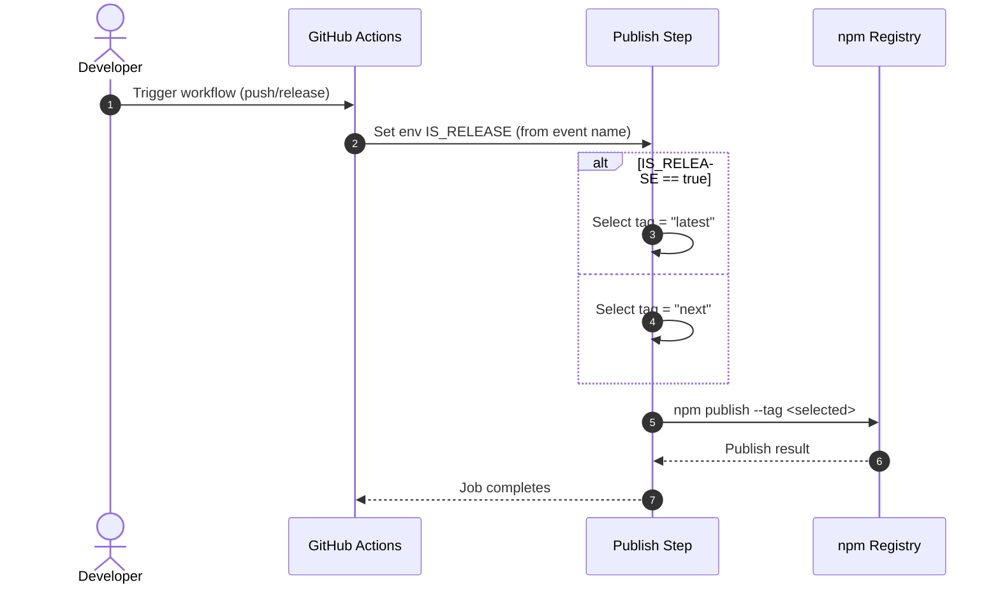

# Fix release to npm

## Pull Request by @tomusdrw

In the release workflow, the env variable was missing, so the latest `0.1.3` is released with `next` instead of `latest` tag on npm.

Hence `npx @typeberry/jam@latest` will still install `0.1.2-sth`


## Comment by @coderabbitai[bot]

<!-- This is an auto-generated comment: summarize by coderabbit.ai -->
<!-- This is an auto-generated comment: skip review by coderabbit.ai -->

> [!IMPORTANT]
> ## Review skipped
> 
> Auto incremental reviews are disabled on this repository.
> 
> Please check the settings in the CodeRabbit UI or the `.coderabbit.yaml` file in this repository. To trigger a single review, invoke the `@coderabbitai review` command.
> 
> You can disable this status message by setting the `reviews.review_status` to `false` in the CodeRabbit configuration file.

<!-- end of auto-generated comment: skip review by coderabbit.ai -->

<!-- walkthrough_start -->

<details>
<summary>📝 Walkthrough</summary>

<!-- This is an auto-generated comment: release notes by coderabbit.ai -->

## Summary by CodeRabbit

* **Chores**
  * Updated package publishing tags: stable releases are now published under “latest,” while non-release builds use “next.” This ensures npm install package pulls the stable version by default, and prerelease builds remain opt-in via npm install package@next.
  * No changes to package functionality or APIs. Existing users need no action; testers who want early builds should continue using the “@next” tag.

<!-- end of auto-generated comment: release notes by coderabbit.ai -->
## Walkthrough
Introduces IS_RELEASE environment variable in the release-publish GitHub Actions workflow and conditionally sets the npm publish tag to "latest" for release events and "next" otherwise, sourcing IS_RELEASE from the GitHub event name. No exported APIs or other workflow steps changed.

## Changes
| Cohort / File(s) | Summary |
| --- | --- |
| **Release workflow publish tagging**<br>`.github/workflows/release-publish.yml` | Add IS_RELEASE env var derived from workflow event; update npm publish command to use tag "latest" when IS_RELEASE is true, else "next". |

## Sequence Diagram(s)


## Estimated code review effort
🎯 2 (Simple) | ⏱️ ~10 minutes

## Possibly related PRs
- FluffyLabs/typeberry#460 — Also adjusts GitHub Actions publish workflow to explicitly use the "latest" npm tag; closely related to tag selection logic.
- FluffyLabs/typeberry#630 — Introduces workflows/scripts using an IS_RELEASE flag for conditional publish/version behavior, aligning with this PR’s conditional tag approach.

## Suggested reviewers
- skoszuta
- mateuszsikora

## Poem
> A bunny taps the “release” gong—ding!  
> Latest for the moonlight, next for spring.  
> Carrots queued in tidy rows,  
> Tags decide where each one goes.  
> Hop, publish, hop—so fleet,  
> Clean footprints on the workflow sheet. 🥕✨

</details>

<!-- walkthrough_end -->

<!-- pre_merge_checks_walkthrough_start -->

## Pre-merge checks and finishing touches
<details>
<summary>✅ Passed checks (3 passed)</summary>

|     Check name     | Status   | Explanation                                                                                                                                                                                                                                   |
| :----------------: | :------- | :-------------------------------------------------------------------------------------------------------------------------------------------------------------------------------------------------------------------------------------------- |
|     Title Check    | ✅ Passed | The title "Fix release to npm" succinctly captures the core purpose of the pull request by indicating that it addresses an issue with the npm release process, making it immediately clear to reviewers what the change will fix.             |
|  Description Check | ✅ Passed | The description directly explains that a missing environment variable caused version 0.1.3 to be published with the wrong npm tag and clarifies the impact on installation behavior, which aligns with the changes made in the workflow file. |
| Docstring Coverage | ✅ Passed | No functions found in the changes. Docstring coverage check skipped.                                                                                                                                                                          |

</details>

<!-- pre_merge_checks_walkthrough_end -->

<!-- tips_start -->

---


<sub>Comment `@coderabbitai help` to get the list of available commands and usage tips.</sub>

<!-- tips_end -->

<!-- internal state start -->


<!-- DwQgtGAEAqAWCWBnSTIEMB26CuAXA9mAOYCmGJATmriQCaQDG+Ats2bgFyQAOFk+AIwBWJBrngA3EsgEBPRvlqU0AgfFwA6NPEgQAfACgjoCEYDEZyAAUASpETZWaCrI5Go0dQBsSXAGLwAB6QFCQ+aIgkkASQGNzMkJAGUAByjgKUXABsABwAzInJkACqNgAyXLC4uNyIHAD09UTqsNgCGkzM9X5e2ABmfbJlKoj1uLLcJBkULvXc2F5e9bkFSVDFkRRcBMzYiLQUAO6FUADK+NgUDFECVBgMsNu0YPMCXkiwYKHhkScwzqRcJBbpgHlxmNosGtIKdcNQ9lx8JMoUUAMKhah0dCcSAAJgADLiAKxgfEATjAeXx0AAjAAWDh5IkcGlEgBaRgAItIGBR4NxxPgMG4PLAot8SBEood8BQANZ9Lz4Y6HCKQZhIRDwDBEdBYMgSeAUIVsDBAiTOeAqHwaIoAQWQaBC0gWuAANJApBQtULIPiNDSNAVVchXu9EGL6DE4glDi1omLIAAiciBXBJ6JoXXaxA0ND0fB9BNRJNeTG5jNwoi2qAAIVEaD2UULCaQHoo2AwGG1uoABnFggABcaTaazIRoZiDss0XO9hRm7XYaTRfAoDC5tCLdB+gMaXFfMKY+gSqUhahivi4WCYXeBvK25JgQwGExQMgFouNgjEMjKGj0J0po4rw/DCKI4hSDI8hMEoVCqOoWg6Por7gKKqCoLe36EKQ5BUABCisOwXBUMcDhOC4wIwYoygIZo2i6M+RioaYBgaM015tPUMryoqyqjKekQvG04awBosjMF4bhJjJBgWJAdoAJK/nhx72I4EKUS2DyYKQiBGHatC0I6+oYIaxoYMBnqWtaUSKacAD6NgAKJlM5dqnM567FsmVgiR8kDDhMUyULMGjhRmMY8P5Eb2DQ3B6vQ2DcLQ5Y+WGAVAZgUZrk2PlVsmM7SOmkCHGKWD2U5rnuZ5KDILgHZRNlyapiV+DXpQcaRBoMCJpVLluR5XkWr0USoIgFxXFifTGgkHWQAA4uoAASbSlbKCpKscJBSGasSTiQPUpGu7WXpASrNAw/B8EwZrGl4kB8ccOk6tIj7mJYdpeDQ+HwEK9VrvNSgMGWv3/fwRYkIE3CygRsrRW88BXew6jwNI7iQMd5BGM5ubwBCBGweKO1o9tAyw1wACydDwI4BgyUm7hMSx74YJ+OA/rh/5YkBxHnmRGnOPIcgKHBKhqPRyFMW+hEargDnwMZDmhIaJCHHQDmbhQQIoSzkD5LQdIkEyZJ5H0ZK0Hkog5GgRIMLbdI0gSTt0mguIMDkADsJD4p7Rt9E6usy0B6gK0rKukxrH6MYYMu8CQDlsBQpAOQ8ohyogmtwtrMdGAA3gYiRJkgti1kqDBynQqIsMBVj4LmdBJlwAdeJEbqF8mEYXF4tBl/gFe2E3j1bm3HfF4gADyXp8kZZBDy3o9F7Qis2J2nL97CfI6ogqJihXQ8Ncu7dLyvnaeLgPi7+nB+NcfybL7Qq8YNyiC8vygoYFf+/bLfY/vBgldaCKUQA4aQm8h4yTvqWCIuAv5yhsC6b6iAh4AG0O6JALokLByY04VxSAdCB58fCQDgUmO+2CkyblwHsG+R90FYKTFDbgZYMDUD+hgQhiZxAXyiAAHSTAEYIgkojRniPw9SDAGDajEF4GCaABSXBXPNJgoRooUBhr8Fs815jblCAAR2XLmKi65l723EDqBM1AUBAnzAcaQkQTJ1VAaVeM80orCJ4Maa4ICPQQjlD2axKAiLL0xLIxg4QrxrgjmrSgyAypWOUTeV6Ljtx9CCBoMh9Ci6hAmr0D+EDMnYKLswGiEDVQUG7DqQpRSkyhFumkogij54jxIOQhhsp4DNFYV4OB+C2AQO4T4Rm2CAC+bTME1NwXKPpJAIEvzfgKdhJC95ymqRQqhNCf50KKcmJhLC2FCk4VEJQr8+SLN9MvOpF95B7MhPVG8Nj1SagCQaI0Jp2DWT5LZRgjZIj0C9D6LA/p7yrmBFEDKEYsRxmvD5Q4FldRRQKs1EGlo0lKMTPjbgaAxD8CwDmOEiwDlYAyDeQ0soPRlSRrAdA7wiAbhcTCxJukVwQiUN5eaPFNrKkevAG0ayGE5PwHk9hBS2nFNKVwJM5TKlEH5dk0QQoGlNObi0sVyYOldK3L0ghkqTkLPyfQsZ9CJkUKmTMuZ/dcxb11NXL0WZZlqsoXCahyCtmtKybs6G+z8mSuOo9TsYh2HID6BcNm7LEwvT0j1deDArUBKYHa0gjAVn2H8dwSYtAMmOpKUoMpzgZVyvVXyTVPSVnmt1ZahqPZkGGo7gAXSgWWXMth5lnJ9ffUQDBPZ9CyDSQ2OQsj4jpESOkOQjZ5FoLiAQSgSB9BHTkEgRI8h0loH0Egjs6S5D6H2mk+Jp34iJPiWgZIcgMAEESJQw6zbVOgc2mwRDZmSoEDbAdAh7Z0mndO22nsaSztxJ7BgrsiRoF7YSAQ9I115DyG+skKgGBkiyJ7HIZIBjHtxOupdfR4N0g3YzEZxg0KeITknFOUzM7R30EAA=== -->

<!-- internal state end -->


## Comment by @github-actions[bot]


<details>
<summary>View all</summary>

| File | Benchmark | Ops |  |
|------|-----------|-----|--|
| [codec/bigint.decode.ts[0]](../blob/28d7a58c037ec6c47825b7d058da73e22e284d01//_work/typeberry-runner-3/typeberry/typeberry/benchmarks/codec/bigint.decode.ts) | decode custom | 167648052.21 ±3.55% | fastest ✅ |
| [codec/bigint.decode.ts[1]](../blob/28d7a58c037ec6c47825b7d058da73e22e284d01//_work/typeberry-runner-3/typeberry/typeberry/benchmarks/codec/bigint.decode.ts) | decode bigint | 101943814.45 ±3.63% | 39.19% slower |
| [collections/map-set.ts[0]](../blob/28d7a58c037ec6c47825b7d058da73e22e284d01//_work/typeberry-runner-3/typeberry/typeberry/benchmarks/collections/map-set.ts) | 2 gets + conditional set | 70922.8 ±0.4% | fastest ✅ |
| [collections/map-set.ts[1]](../blob/28d7a58c037ec6c47825b7d058da73e22e284d01//_work/typeberry-runner-3/typeberry/typeberry/benchmarks/collections/map-set.ts) | 1 get 1 set | 42306.46 ±0.37% | 40.35% slower |
| [codec/decoding.ts[0]](../blob/28d7a58c037ec6c47825b7d058da73e22e284d01//_work/typeberry-runner-3/typeberry/typeberry/benchmarks/codec/decoding.ts) | manual decode | 23529271 ±0.68% | 87.17% slower |
| [codec/decoding.ts[1]](../blob/28d7a58c037ec6c47825b7d058da73e22e284d01//_work/typeberry-runner-3/typeberry/typeberry/benchmarks/codec/decoding.ts) | int32array decode | 183401132.52 ±5.78% | fastest ✅ |
| [codec/decoding.ts[2]](../blob/28d7a58c037ec6c47825b7d058da73e22e284d01//_work/typeberry-runner-3/typeberry/typeberry/benchmarks/codec/decoding.ts) | dataview decode | 182495641.99 ±5.24% | 0.49% slower |
| [codec/encoding.ts[0]](../blob/28d7a58c037ec6c47825b7d058da73e22e284d01//_work/typeberry-runner-3/typeberry/typeberry/benchmarks/codec/encoding.ts) | manual encode | 3326352.9 ±0.33% | 19.92% slower |
| [codec/encoding.ts[1]](../blob/28d7a58c037ec6c47825b7d058da73e22e284d01//_work/typeberry-runner-3/typeberry/typeberry/benchmarks/codec/encoding.ts) | int32array encode | 4082806.45 ±0.44% | 1.71% slower |
| [codec/encoding.ts[2]](../blob/28d7a58c037ec6c47825b7d058da73e22e284d01//_work/typeberry-runner-3/typeberry/typeberry/benchmarks/codec/encoding.ts) | dataview encode | 4153726.06 ±0.45% | fastest ✅ |
| [hash/index.ts[0]](../blob/28d7a58c037ec6c47825b7d058da73e22e284d01//_work/typeberry-runner-3/typeberry/typeberry/benchmarks/hash/index.ts) | hash with numeric representation | 187.37 ±0.38% | 26.91% slower |
| [hash/index.ts[1]](../blob/28d7a58c037ec6c47825b7d058da73e22e284d01//_work/typeberry-runner-3/typeberry/typeberry/benchmarks/hash/index.ts) | hash with string representation | 111.09 ±0.5% | 56.67% slower |
| [hash/index.ts[2]](../blob/28d7a58c037ec6c47825b7d058da73e22e284d01//_work/typeberry-runner-3/typeberry/typeberry/benchmarks/hash/index.ts) | hash with symbol representation | 174.04 ±0.56% | 32.11% slower |
| [hash/index.ts[3]](../blob/28d7a58c037ec6c47825b7d058da73e22e284d01//_work/typeberry-runner-3/typeberry/typeberry/benchmarks/hash/index.ts) | hash with uint8 representation | 160.91 ±0.4% | 37.23% slower |
| [hash/index.ts[4]](../blob/28d7a58c037ec6c47825b7d058da73e22e284d01//_work/typeberry-runner-3/typeberry/typeberry/benchmarks/hash/index.ts) | hash with packed representation | 256.36 ±0.49% | fastest ✅ |
| [hash/index.ts[5]](../blob/28d7a58c037ec6c47825b7d058da73e22e284d01//_work/typeberry-runner-3/typeberry/typeberry/benchmarks/hash/index.ts) | hash with bigint representation | 187.87 ±0.43% | 26.72% slower |
| [hash/index.ts[6]](../blob/28d7a58c037ec6c47825b7d058da73e22e284d01//_work/typeberry-runner-3/typeberry/typeberry/benchmarks/hash/index.ts) | hash with uint32 representation | 195.52 ±0.42% | 23.73% slower |
| [bytes/hex-from.ts[0]](../blob/28d7a58c037ec6c47825b7d058da73e22e284d01//_work/typeberry-runner-3/typeberry/typeberry/benchmarks/bytes/hex-from.ts) | parse hex using `Number` with NaN checking | 134046.06 ±0.42% | 84.2% slower |
| [bytes/hex-from.ts[1]](../blob/28d7a58c037ec6c47825b7d058da73e22e284d01//_work/typeberry-runner-3/typeberry/typeberry/benchmarks/bytes/hex-from.ts) | parse hex from char codes | 848420.06 ±0.46% | fastest ✅ |
| [bytes/hex-from.ts[2]](../blob/28d7a58c037ec6c47825b7d058da73e22e284d01//_work/typeberry-runner-3/typeberry/typeberry/benchmarks/bytes/hex-from.ts) | parse hex from string nibbles | 540300.59 ±0.3% | 36.32% slower |
| [bytes/hex-to.ts[0]](../blob/28d7a58c037ec6c47825b7d058da73e22e284d01//_work/typeberry-runner-3/typeberry/typeberry/benchmarks/bytes/hex-to.ts) | number toString + padding | 311944.97 ±0.35% | fastest ✅ |
| [bytes/hex-to.ts[1]](../blob/28d7a58c037ec6c47825b7d058da73e22e284d01//_work/typeberry-runner-3/typeberry/typeberry/benchmarks/bytes/hex-to.ts) | manual | 15547.24 ±0.92% | 95.02% slower |
| [codec/bigint.compare.ts[0]](../blob/28d7a58c037ec6c47825b7d058da73e22e284d01//_work/typeberry-runner-3/typeberry/typeberry/benchmarks/codec/bigint.compare.ts) | compare custom | 233672559.31 ±7.05% | 1.93% slower |
| [codec/bigint.compare.ts[1]](../blob/28d7a58c037ec6c47825b7d058da73e22e284d01//_work/typeberry-runner-3/typeberry/typeberry/benchmarks/codec/bigint.compare.ts) | compare bigint | 238265336.79 ±6.56% | fastest ✅ |
| [math/add_one_overflow.ts[0]](../blob/28d7a58c037ec6c47825b7d058da73e22e284d01//_work/typeberry-runner-3/typeberry/typeberry/benchmarks/math/add_one_overflow.ts) | add and take modulus | 250067842.47 ±7.03% | fastest ✅ |
| [math/add_one_overflow.ts[1]](../blob/28d7a58c037ec6c47825b7d058da73e22e284d01//_work/typeberry-runner-3/typeberry/typeberry/benchmarks/math/add_one_overflow.ts) | condition before calculation | 238155021.76 ±6.86% | 4.76% slower |
| [math/count-bits-u32.ts[0]](../blob/28d7a58c037ec6c47825b7d058da73e22e284d01//_work/typeberry-runner-3/typeberry/typeberry/benchmarks/math/count-bits-u32.ts) | standard method | 97222232.78 ±2.52% | 57.28% slower |
| [math/count-bits-u32.ts[1]](../blob/28d7a58c037ec6c47825b7d058da73e22e284d01//_work/typeberry-runner-3/typeberry/typeberry/benchmarks/math/count-bits-u32.ts) | magic | 227571926.61 ±6.73% | fastest ✅ |
| [math/count-bits-u64.ts[0]](../blob/28d7a58c037ec6c47825b7d058da73e22e284d01//_work/typeberry-runner-3/typeberry/typeberry/benchmarks/math/count-bits-u64.ts) | standard method | 1585135.79 ±1.8% | 83.91% slower |
| [math/count-bits-u64.ts[1]](../blob/28d7a58c037ec6c47825b7d058da73e22e284d01//_work/typeberry-runner-3/typeberry/typeberry/benchmarks/math/count-bits-u64.ts) | magic | 9849195.57 ±1.95% | fastest ✅ |
| [math/mul_overflow.ts[0]](../blob/28d7a58c037ec6c47825b7d058da73e22e284d01//_work/typeberry-runner-3/typeberry/typeberry/benchmarks/math/mul_overflow.ts) | multiply and bring back to u32 | 244114561.77 ±6.42% | fastest ✅ |
| [math/mul_overflow.ts[1]](../blob/28d7a58c037ec6c47825b7d058da73e22e284d01//_work/typeberry-runner-3/typeberry/typeberry/benchmarks/math/mul_overflow.ts) | multiply and take modulus | 237650805.43 ±6.34% | 2.65% slower |
| [math/switch.ts[0]](../blob/28d7a58c037ec6c47825b7d058da73e22e284d01//_work/typeberry-runner-3/typeberry/typeberry/benchmarks/math/switch.ts) | switch | 236046608.37 ±6.65% | 2.7% slower |
| [math/switch.ts[1]](../blob/28d7a58c037ec6c47825b7d058da73e22e284d01//_work/typeberry-runner-3/typeberry/typeberry/benchmarks/math/switch.ts) | if | 242587508.49 ±7.12% | fastest ✅ |
| [logger/index.ts[0]](../blob/28d7a58c037ec6c47825b7d058da73e22e284d01//_work/typeberry-runner-3/typeberry/typeberry/benchmarks/logger/index.ts) | console.log with string concat | 6486634.35 ±57.68% | fastest ✅ |
| [logger/index.ts[1]](../blob/28d7a58c037ec6c47825b7d058da73e22e284d01//_work/typeberry-runner-3/typeberry/typeberry/benchmarks/logger/index.ts) | console.log with args | 1325736.23 ±87.27% | 79.56% slower |
| [codec/view_vs_collection.ts[0]](../blob/28d7a58c037ec6c47825b7d058da73e22e284d01//_work/typeberry-runner-3/typeberry/typeberry/benchmarks/codec/view_vs_collection.ts) | Get first element from Decoded | 23337.85 ±3.1% | 54.2% slower |
| [codec/view_vs_collection.ts[1]](../blob/28d7a58c037ec6c47825b7d058da73e22e284d01//_work/typeberry-runner-3/typeberry/typeberry/benchmarks/codec/view_vs_collection.ts) | Get first element from View | 50957.76 ±2.23% | fastest ✅ |
| [codec/view_vs_collection.ts[2]](../blob/28d7a58c037ec6c47825b7d058da73e22e284d01//_work/typeberry-runner-3/typeberry/typeberry/benchmarks/codec/view_vs_collection.ts) | Get 50th element from Decoded | 23490.99 ±3.35% | 53.9% slower |
| [codec/view_vs_collection.ts[3]](../blob/28d7a58c037ec6c47825b7d058da73e22e284d01//_work/typeberry-runner-3/typeberry/typeberry/benchmarks/codec/view_vs_collection.ts) | Get 50th element from View | 23288.38 ±1.72% | 54.3% slower |
| [codec/view_vs_collection.ts[4]](../blob/28d7a58c037ec6c47825b7d058da73e22e284d01//_work/typeberry-runner-3/typeberry/typeberry/benchmarks/codec/view_vs_collection.ts) | Get last element from Decoded | 22541.17 ±3.65% | 55.76% slower |
| [codec/view_vs_collection.ts[5]](../blob/28d7a58c037ec6c47825b7d058da73e22e284d01//_work/typeberry-runner-3/typeberry/typeberry/benchmarks/codec/view_vs_collection.ts) | Get last element from View | 16449.94 ±2.09% | 67.72% slower |
| [codec/view_vs_object.ts[0]](../blob/28d7a58c037ec6c47825b7d058da73e22e284d01//_work/typeberry-runner-3/typeberry/typeberry/benchmarks/codec/view_vs_object.ts) | Get the first field from Decoded | 357006.29 ±2.4% | 26.49% slower |
| [codec/view_vs_object.ts[1]](../blob/28d7a58c037ec6c47825b7d058da73e22e284d01//_work/typeberry-runner-3/typeberry/typeberry/benchmarks/codec/view_vs_object.ts) | Get the first field from View | 79658.54 ±1.92% | 83.6% slower |
| [codec/view_vs_object.ts[2]](../blob/28d7a58c037ec6c47825b7d058da73e22e284d01//_work/typeberry-runner-3/typeberry/typeberry/benchmarks/codec/view_vs_object.ts) | Get the first field as view from View | 78184.83 ±1.41% | 83.9% slower |
| [codec/view_vs_object.ts[3]](../blob/28d7a58c037ec6c47825b7d058da73e22e284d01//_work/typeberry-runner-3/typeberry/typeberry/benchmarks/codec/view_vs_object.ts) | Get two fields from Decoded | 382968.99 ±3.14% | 21.15% slower |
| [codec/view_vs_object.ts[4]](../blob/28d7a58c037ec6c47825b7d058da73e22e284d01//_work/typeberry-runner-3/typeberry/typeberry/benchmarks/codec/view_vs_object.ts) | Get two fields from View | 62893.03 ±1.76% | 87.05% slower |
| [codec/view_vs_object.ts[5]](../blob/28d7a58c037ec6c47825b7d058da73e22e284d01//_work/typeberry-runner-3/typeberry/typeberry/benchmarks/codec/view_vs_object.ts) | Get two fields from materialized from View | 128985.97 ±1.33% | 73.44% slower |
| [codec/view_vs_object.ts[6]](../blob/28d7a58c037ec6c47825b7d058da73e22e284d01//_work/typeberry-runner-3/typeberry/typeberry/benchmarks/codec/view_vs_object.ts) | Get two fields as views from View | 72422.06 ±2.09% | 85.09% slower |
| [codec/view_vs_object.ts[7]](../blob/28d7a58c037ec6c47825b7d058da73e22e284d01//_work/typeberry-runner-3/typeberry/typeberry/benchmarks/codec/view_vs_object.ts) | Get only third field from Decoded | 485679.37 ±1.18% | fastest ✅ |
| [codec/view_vs_object.ts[8]](../blob/28d7a58c037ec6c47825b7d058da73e22e284d01//_work/typeberry-runner-3/typeberry/typeberry/benchmarks/codec/view_vs_object.ts) | Get only third field from View | 98712.4 ±0.81% | 79.68% slower |
| [codec/view_vs_object.ts[9]](../blob/28d7a58c037ec6c47825b7d058da73e22e284d01//_work/typeberry-runner-3/typeberry/typeberry/benchmarks/codec/view_vs_object.ts) | Get only third field as view from View | 94852.12 ±1.98% | 80.47% slower |
| [bytes/compare.ts[0]](../blob/28d7a58c037ec6c47825b7d058da73e22e284d01//_work/typeberry-runner-3/typeberry/typeberry/benchmarks/bytes/compare.ts) | Comparing Uint32 bytes | 20936.09 ±0.39% | 3.71% slower |
| [bytes/compare.ts[1]](../blob/28d7a58c037ec6c47825b7d058da73e22e284d01//_work/typeberry-runner-3/typeberry/typeberry/benchmarks/bytes/compare.ts) | Comparing raw bytes | 21743.34 ±0.87% | fastest ✅ |
| [hash/blake2b.ts[0]](../blob/28d7a58c037ec6c47825b7d058da73e22e284d01//_work/typeberry-runner-3/typeberry/typeberry/benchmarks/hash/blake2b.ts) | hasher with simple allocator | 0.04 ±0.95% | 20% slower |
| [hash/blake2b.ts[1]](../blob/28d7a58c037ec6c47825b7d058da73e22e284d01//_work/typeberry-runner-3/typeberry/typeberry/benchmarks/hash/blake2b.ts) | hasher with page allocator | 0.05 ±0.31% | fastest ✅ |
| [collections/map_vs_sorted.ts[0]](../blob/28d7a58c037ec6c47825b7d058da73e22e284d01//_work/typeberry-runner-3/typeberry/typeberry/benchmarks/collections/map_vs_sorted.ts) | Map | 306556.29 ±0.05% | fastest ✅ |
| [collections/map_vs_sorted.ts[1]](../blob/28d7a58c037ec6c47825b7d058da73e22e284d01//_work/typeberry-runner-3/typeberry/typeberry/benchmarks/collections/map_vs_sorted.ts) | Map-array | 103666.9 ±0.03% | 66.18% slower |
| [collections/map_vs_sorted.ts[2]](../blob/28d7a58c037ec6c47825b7d058da73e22e284d01//_work/typeberry-runner-3/typeberry/typeberry/benchmarks/collections/map_vs_sorted.ts) | Array | 66206.08 ±0.16% | 78.4% slower |
| [collections/map_vs_sorted.ts[3]](../blob/28d7a58c037ec6c47825b7d058da73e22e284d01//_work/typeberry-runner-3/typeberry/typeberry/benchmarks/collections/map_vs_sorted.ts) | SortedArray | 201191.34 ±0.27% | 34.37% slower |
| [crypto/ed25519.ts[0]](../blob/28d7a58c037ec6c47825b7d058da73e22e284d01//_work/typeberry-runner-3/typeberry/typeberry/benchmarks/crypto/ed25519.ts) | native crypto | 8.2 ±0.74% | 73.17% slower |
| [crypto/ed25519.ts[1]](../blob/28d7a58c037ec6c47825b7d058da73e22e284d01//_work/typeberry-runner-3/typeberry/typeberry/benchmarks/crypto/ed25519.ts) | wasm lib | 10.89 ±0.02% | 64.37% slower |
| [crypto/ed25519.ts[2]](../blob/28d7a58c037ec6c47825b7d058da73e22e284d01//_work/typeberry-runner-3/typeberry/typeberry/benchmarks/crypto/ed25519.ts) | wasm lib batch | 30.56 ±0.56% | fastest ✅ |
</details>


### Benchmarks summary: 63/63 OK ✅

<!-- thollander/actions-comment-pull-request "benchmarks" -->


## Comment by @coderabbitai[bot]

_⚠️ Potential issue_ | _🟠 Major_

**Don’t promote prereleases to “latest” — include prerelease guard in env/tag.**

Current env sets IS_RELEASE based only on event_name. For prereleases, event_name is still "release", so npm publish will tag "latest". Add the prerelease check and use that boolean for tag selection.


Apply this diff:

```diff
-    - name: Publish @typeberry/${{ matrix.project }} to npm
+    - name: Publish @typeberry/${{ matrix.project }} to npm
       working-directory: ./dist/${{ matrix.project }}
       env:
-        IS_RELEASE: ${{ github.event_name == 'release' }}
+        IS_LATEST: ${{ github.event_name == 'release' && !github.event.release.prerelease }}
         NODE_AUTH_TOKEN: ${{ secrets.NPM_TOKEN }}
-      run: npm publish --access=public --tag $([ "$IS_RELEASE" = "true" ] && echo "latest" || echo "next")
+      run: npm publish --access=public --tag $([ "$IS_LATEST" = "true" ] && echo "latest" || echo "next")
```

Optional: rename the earlier “Build (release)” step’s inline `IS_RELEASE=1` to `IS_LATEST=1` for consistency.

<!-- suggestion_start -->

<details>
<summary>📝 Committable suggestion</summary>

> ‼️ **IMPORTANT**
> Carefully review the code before committing. Ensure that it accurately replaces the highlighted code, contains no missing lines, and has no issues with indentation. Thoroughly test & benchmark the code to ensure it meets the requirements.

```suggestion
    - name: Publish @typeberry/${{ matrix.project }} to npm
      working-directory: ./dist/${{ matrix.project }}
      env:
        IS_LATEST: ${{ github.event_name == 'release' && !github.event.release.prerelease }}
        NODE_AUTH_TOKEN: ${{ secrets.NPM_TOKEN }}
      run: npm publish --access=public --tag $([ "$IS_LATEST" = "true" ] && echo "latest" || echo "next")
```

</details>

<!-- suggestion_end -->

<details>
<summary>🤖 Prompt for AI Agents</summary>

```
.github/workflows/release-publish.yml around lines 83 to 89: the workflow
currently sets IS_RELEASE based only on github.event_name == 'release' so
prereleases (which still have event_name "release") get tagged "latest"; add a
prerelease guard by exporting IS_PRERELEASE: ${{ github.event.release.prerelease
}} and change tag selection to publish --tag $([ "$IS_RELEASE" = "true" ] && [
"$IS_PRERELEASE" = "false" ] && echo "latest" || echo "next") so only
non-prerelease releases get "latest"; optionally rename the earlier Build
(release) step's inline IS_RELEASE=1 to IS_LATEST=1 for consistency.
```

</details>

<!-- fingerprinting:phantom:triton:chinchilla -->

<!-- This is an auto-generated comment by CodeRabbit -->
