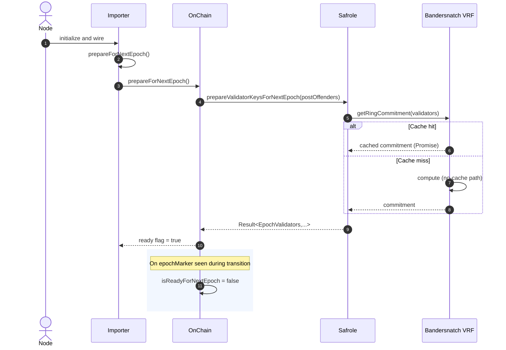

# Cache ring commitment

## Pull Request by @tomusdrw

Get ring commitment is invoked every epoch and it's super heavy. On my machine, the WASM version takes around ~130ms, yet the native rust version (`--release`) is around ~35ms, so also quite a lot. I've initially thought it might be related to parsing the `.bin` file, but that isn't really the case (the static cache in rust saves only 3ms from the native run).

It seems though, that the ring commitment is pretty much dependent only on the next validator set, and can effectively be done out of regular block import pipeline. What's more we can pre-compute it for the next epoch and even pre compute it during startup.

This PR introduces very simple cache for ring commitment and a mechanism to pre-compute it for the upcoming epoch. This significantly reduces the import times of epoch blocks, but also reduces variance between our block imports. It is a bit of optimisation for the specific case we have in tests, where all validators are pretty much the same and there is nothing in the punish set, but it works pretty well.

## Comment by @coderabbitai[bot]

<!-- This is an auto-generated comment: summarize by coderabbit.ai -->
<!-- This is an auto-generated comment: skip review by coderabbit.ai -->

> [!IMPORTANT]
> ## Review skipped
> 
> Auto incremental reviews are disabled on this repository.
> 
> Please check the settings in the CodeRabbit UI or the `.coderabbit.yaml` file in this repository. To trigger a single review, invoke the `@coderabbitai review` command.
> 
> You can disable this status message by setting the `reviews.review_status` to `false` in the CodeRabbit configuration file.

<!-- end of auto-generated comment: skip review by coderabbit.ai -->

<!-- walkthrough_start -->

📝 Walkthrough

<!-- This is an auto-generated comment: release notes by coderabbit.ai -->

## Summary by CodeRabbit

* New Features
  * Background preparation for upcoming epochs to reduce delays during epoch transitions, enabling smoother block import and verification.
* Refactor
  * Introduced caching for validator/ring computations to avoid repeated work, improving performance and responsiveness under repeated queries.
* Chores
  * Automatic epoch preparation triggered after sync and head updates for more consistent readiness.
  * Improved robustness with safe error handling and logging during background preparation to prevent disruptions.

<!-- end of auto-generated comment: release notes by coderabbit.ai -->
## Walkthrough
Adds an epoch-preparation pathway across importer, on-chain state, and safrole: new prepareForNextEpoch methods, readiness flag/reset on epoch changes, and preloading of validator keys for the next epoch. Introduces a small ring commitment cache in Bandersnatch VRF. Wires startup and state-update hooks to trigger preparation.

## Changes
| Cohort / File(s) | Summary |
| --- | --- |
| **Epoch preparation workflow** `packages/workers/importer/importer.ts`, `packages/jam/transition/chain-stf.ts`, `packages/jam/safrole/safrole.ts`, `packages/jam/node/main-importer.ts` | Importer exposes prepareForNextEpoch and calls it on startup and after state updates; OnChain adds prepareForNextEpoch with readiness flag and resets on epoch markers; Safrole adds prepareValidatorKeysForNextEpoch using tryAsTimeSlot; main-importer invokes importer.prepareForNextEpoch post-wiring. |
| **Bandersnatch VRF caching** `packages/jam/safrole/bandersnatch-vrf.ts` | Adds ringCommitment memoization with capped cache (3 entries). getRingCommitment now returns cached Promise when available and delegates to getRingCommitmentNoCache otherwise; control flow adjusted without changing the return type. |

## Sequence Diagram(s)

## Estimated code review effort
🎯 3 (Moderate) | ⏱️ ~25 minutes

## Possibly related PRs
- FluffyLabs/typeberry#638 — Touches Bandersnatch ring-commitment paths; relates to the new VRF caching and precompute hooks.
- FluffyLabs/typeberry#450 — Modifies chain-stf and importer verification flow; overlaps with added prepareForNextEpoch and verifySeal visibility changes.
- FluffyLabs/typeberry#642 — Edits main-importer; aligns with adding importer.prepareForNextEpoch in the same module.

## Suggested reviewers
- skoszuta
- mateuszsikora
- DrEverr

## Poem
> I cached a ring with a twitch of my ear,  
> Primed the epoch—next one is near.  
> Hops through slots, I prep and I preen,  
> Ready flags set, my ledger is clean.  
> Thump-thump—blocks roll, I don’t forget:  
> New epoch? Reset! Then cache it, yet. 🐇✨

<!-- walkthrough_end -->

<!-- pre_merge_checks_walkthrough_start -->

## Pre-merge checks and finishing touches

❌ Failed checks (1 warning)

|     Check name     | Status     | Explanation                                                                          | Resolution                                                                     |
| :----------------: | :--------- | :----------------------------------------------------------------------------------- | :----------------------------------------------------------------------------- |
| Docstring Coverage | ⚠️ Warning | Docstring coverage is 0.00% which is insufficient. The required threshold is 80.00%. | You can run `@coderabbitai generate docstrings` to improve docstring coverage. |

✅ Passed checks (2 passed)

|     Check name    | Status   | Explanation                                                                                                                                                                                                                 |
| :---------------: | :------- | :-------------------------------------------------------------------------------------------------------------------------------------------------------------------------------------------------------------------------- |
|    Title Check    | ✅ Passed | The title “Cache ring commitment” succinctly and accurately captures the primary change of introducing a caching mechanism for the ring commitment computation, which is the main focus of the pull request.                |
| Description Check | ✅ Passed | The pull request description clearly explains the performance issue with ring commitment computation, the rationale for caching and precomputation, and the observed benefits, directly reflecting the implemented changes. |

<!-- pre_merge_checks_walkthrough_end -->

<!-- tips_start -->

---

Comment `@coderabbitai help` to get the list of available commands and usage tips.

<!-- tips_end -->

<!-- internal state start -->

<!-- DwQgtGAEAqAWCWBnSTIEMB26CuAXA9mAOYCmGJATmriQCaQDG+Ats2bgFyQAOFk+AIwBWJBrngA3EsgEBPRvlqU0AgfFwA6NPEgQAfACgjoCEYDEZyAAUASpETZWaCrKPR1AGxJcAwmgawJJAU8BhECqzqbBi4kJAGAHKOApRcAGwAHAAscQYAqjYAMlywuLjciBwA9FVE6rDYAhpMzFUAYh7YAGZdsoUqiFW4stwkKRQuVdzYHh5VmTnxeYipkATM2Ii0FADuuQDK+NgUDEECVBgBXLi0xCS4YCFhYC3MUeyQgEmEMM6kseeYK6QZjaLDxfa4aibLj4UZggw2EgSeAkHaUSr2ADW+EQAC88GgADTA6gkTa4xDwbFUYkAEQoAFEpBNcv0Uh4MQAKDD4cgASlyPgoJFJ9GoXAATAAGCUAVjAUoAnGAAMxS6AARjSHClWQ4WRVAC0jLTpAwQtxxLz7I4QS4OAYoFYKIIvMwuAAiADi92CoXCr3eMQ9KGQoQk+ExdEgSMo8hI3HwAXQGHoqBa00hVowaFm8YAHnDKVINJAALIihzC+jiN5hDEAdQAgvsy5AAH4atXAxDEnPiKSQGybWKciDCrxoFYC9sq2U90vLf3oexZ+AMRj+QLBOjYU70fuSIK1s7yXkeeSznvExD4SBdeBeHjOSlhUOQHmxXDbkGhBSITRHUgAB5AQVgoCRqHgXkuDgIIngDFg3lwaJYiUOFaGQXh4DtR8zywb8gnIfNYkgjx4Foah8D4FZYkwegGEwSAUgiTNoyOXBKSUNZt2FIgZmcZiPCTTEUGYRMKFibh4FGcjyFLABJWJGKwFjeFEFg2PoLpqJ4oJsG4FplwTJNYBTehaGOZcAOcXADI0ICfFgTBSC4BSYhdSzTmQNB7Bw7gn0YgIgh0vgEIiZDUKwzofOBURnIwJBmDWO91IzPBj23QMUI+UK9MgAyjLfEyAgcqAGR6UROEgfZ4CIRKHxU3ALx3LzpDEiSvxw9r8C6GNE2TARhIYTEfNTSBhLRChkEgkJATOe40TIISRI66jONLBJ8BoMUxv4S0cPgXEoOtb9qHfbhbPXASKBakhKrEI8UAI7caAA+xThzEI7x2QJhUgMiKKo6b0H+2AWHwUhyCOMaa23aZEsQMzaPfEhxOGBzHTAQwDBMKAyHoXqcAIO5yCoHaIvYLheH4YQqqPGR5CYJQqFUdQtB0fRcfAKA4FQVAmLQPBCCh5QKdeKngjQPYHCcFxmKZxRlDZzRtF0bGjG50wDEuka0FIQYhDQVoeSUKpfwwMB/PWygNE4h0PUdgwLEgJsFNJsXo1lu0zz6gIXOkIwoCbWhMJXcg9kY2YUvQHZtFia3JNt9TLuFNpqISEgSIZAbYE5AU0C6Gg+B2eBwsItak4oYlpEhIakAQN9hTQWhQmkZA8or4jYhKsyUlCoImysBSCsQfWSE2u9tr+ibIfXRgEoNgBuGN8yQcQ3y6Sadwt3tIFL798sT4uP3wPYs4C9dPHkFPnGjbDdIIV3h9HifNedywmw8YuTowZAn4rkoBgHhnC/2QETC+NtCZ8GmPXDc7B1AokQEYLa5AjAMgAjhUUChuLCmRKiGMPR1pcArK3RwBhHYeiDtrXWmJx6G2NlUMeXQXReCqAIei6J+wBDABICgXQ7aVAoU7F2bsPbky9raZwvsF4B2QUBdyuBPJ7mjL5BCPgkJBmUluZcbB/aI2Sk/NgzB8BHXgtIGYnF0DmhxMgKOHJSwhzDr5IK24ALUSCJydRmicoxD8MFAu41fL+MCAyDy8hhijBjiCbgz1MyQCjLIZAnIABCsg3opOEgIAUT9fLOhYEgEgYAdhUG4KMegiIHDf1LH8Gw/oNGRF8aOdSyIYYtSnLIS4AoeR7AfNNZSgQRr/yyluII9Edx2QoH/FcrjoxkWwEEeAfV1IrBiCvaelBS4rBQMpTSGVhlBHmYc+AvlfIR0gIEDwow+C1PqT41CW0QkkBvAQYUYYE4vSCLM4k4yyChW8iuEEa8NjJVmX5XEniyxNgABoAH0fBNh8AACQZLChkCRoA2AUgyfYkAAC8kAVQCjkGsEIkQ3wV3wB4JQ712AuEcR+Ahlzrn3mwJcbMkBblhAaZFdgjzRnvhbkoGsqVKChUMdufwdlcwRS0RMkISIZUH3BngTcAR/TEmFJMxKFK3HGyCJUyxawRhjJkPdDxpY+Z2MXu1JgHkqX3m3iwlg6APBxySbHeOy5fKt2FGIZinDprcNgBoLlRAeVytyWqwIYBhKRgMs+Q+yqFCpkQbyGVHTLisQJNmYkAVNgpnQKHNNOYPCnxeAKy6h9O6SrENgGVXR7ilRgNufAzJcxlsEOBSCQ0FrOVaWFNGoJYr5LeCsYAhrv7ABSYGxAwa6lhBsPgbafYZgeD0HoYkAhVXJtccuJ+1YVE7lGNgi+ZBixfI7YgTG5hP7fzFtBaZADtxAJAeTR94C+qQKTtAngjRyLwJiIgwOQEKzfkUH5eqUJ/oGUojtLgAADLobLHrWjDRGppnIOGpi4dQIEM6cNTLHrgAIDYpzMGJIDOD1EMQEZZnOvDsAADSJBZAAG0AC6fIuCjsKROixU66O4ZI7ABdRAl0ro/GujdCHnqQAQ7Q+hVQjatGYawkg7DZ3Bt4fwwRsnvgoZtfQLVxwCImuYqq/RpBtIumSghzNG5kPssfbJqNPJLYOdZc53kxJk2hGLqW6N3qgmMr2My1IBg4hQBSea4UiHPNOdQ1gdD9z2BYa04xrgQmiOMbI4gCjANcxA1ebRjLImWPsa4zx2zfHJ24GnWVgIYmJO4FXbMGTkXdCuyLqsJDKGOUpcaahdLhGGMiay4Gv+uXyOUaK9R6aE3RvBoq5x7j1gavjrqw1pbjHmvLta1J9rehZPcjPq/OxArxlKC8EQUk/87wIcG7ymI/Lgqyd+stcgdA6B8hQVPQiMD/3z2/VY3SsCAOQf7McdqU0vlGcxhg2s2DmbmPwefIhkkuBIrqrAYRVCsZgCMIpg2ynGFqapRp8nXhBEOxEZ/d2osJH0G9tI/gfsbXyKgApcSxDXah2jEo2QTZEDuDYPsYSsRnXJQ9AAAUiWMSgkwhoiQ9GVSAPgQGIGQPsQu6muBONUaFv9cC4rgfoLfYUAA1ObwMKuIHThQTO2dc6ckTABYClVRs5OclJYUYBEzTBAW9Qr5F5sJNY9GkKj9tzd36qZRSuzxL7MZc70yEJbL3ls/lBgxxhQxDjwEYkhEsDXZILd4PT8/jW9D7b1jyBNj7pcML0XJBxfbW5FnXAOc0+QkkoEuGQReBtoovfHEuAPeNtG5an89xwZpjDDEAmAu7wsU2OxS4g/KAF7Mk/bCbB8rhWyqhSPAMTkBp2yJzV9xTP7r1fvurxqolTk5fcavxXqJ28xi7IO5ZZ8QaFXQIhuDvPJ5hbiQG/vNnbg7k7l3i7m7uPp7vRm5KwASL2ocD+vsPcMAAyLQHKLKBqIqBVnoHyLJn+MAlOMgAhjrs6l4KQVgApv4HQiTipkwrrhTqwTQRPJxPphMqZpQbxptgJvVt3gEBAcDHvPLkTNQepgyBMNRBokoBoO5EwBMFVLSNQGgB1gYIjlguLErDuGjoQqFNVKQvAOQpQtQoTjrIwUpiwUopgJSNmFUP7KEGAABAIvbHjh/K7AzmQJ7MzlIvLETFZiBlzvam1HtL3P7sKKnL/CfnoglElPwFgMBBgE5KCKfqckbg+CQNSqGIiC3LINAZ3iIWZOMr5BbsDPIGwGbjwDEXfMUansmLvn6nsjQCHu/nwIkh3NHkRJ3tvmrukWEO1BXMyEsrIJgTKjUXPpni6hUUDhuJyLpO5tEZIKSAXIgJ0huNMRBlGthJBO0Z5jsbQD8uRPVN6gwN5MgH5ovlMjKpsOPGrk4rFOcmAY0bAaZPvNRJiFvGdmdL7rGDEMgH7ulGuNaEsq6s3LQPIFCfIOMrBndtngKlCW3FrskacPlGlG0XERmF4G9E8aHLFGCuGDbk4cKCwtIDviEEQKQHwKEFxMeBcI4Y+lwB9lgGQEwGysXN6qfJbBgGutvmWM4FGHSZ8hciKCzEXiMsFKuKSO+G8r6JyEgAUdCe8aUfKdIL6E/F0LmNODHOetDifkwH9ByUEMmr3LIsMdeqBqELpK4eQWiW8konuJMsuCSv5sogwLfpeuqm+AkZgEkbmLyEQAyavOvMuLyC8M5H+EPlccuL8TsL5vUBxK6tybqkEJ3pQIFv5mKv4AtLILyPQMiJSGoORMMGzgDJQOMZMR4Det4V/D/NmPdvlK+qAk2RWSDuxIDibgguIKEZAG0CiHkQAbQNTCEAcYsogCqUURnCUbnNVgUuOgIMupOBgHoPiutouRPG8lSlIJyDqRyCQHyCvGQZrsgKkekX+K7jYcwYwvYX/CWs4dGZbO4YIr9lAGBjMSOVwKAfUWnLOU0XnAKKeRQSBGkc+aBn/sznVFDjBtwHBoAZWSEL0DWZyCeG3tVC3hhVusNJiFlrhZbiiDsAKCETZi6sAQwFUOcsWfAKWeoBEqlOOXKZ5mMShSKB4Ghd1BhbBFxRLjhSJPhSJIRaiL9h/OgpgiCHobgkiERUYbzqYeYU7ATkTjedIFUDsN8eiFUMfJQNpTzlXDTl4aIr4WTNgizkEeznIj/s8eHAQhRabjMW8QBR8cmNaNzp1Fvv8ZAKXuXiMXeK+U5Y7nOZ8eaXIXwAlLQHJOEF5cJCGfeNoJ0G8qWAohgBGFGFhH+SQGqbnHJhXHagBBQC6bpIXCfKEIgkVriMuDnqoTEEilOLAD8uNH+LgBpTgoPtQLANcSaflDZO0agAiRTJyCVVvgNW6YwQTN5QsjHBUXfPnr1c8uZOgD1nwKNRSneGckyhKbKTQHyMlbzDHgQscYwHShVSMduIADgEYB94yx/RvcgAuAR+RKBgD3SNr+rjItLsD14YARVeD0CK40azHJRD6XTl7LiWThQWmVEcokolJoBlLembjRx/i+SC4VoiaLWxV1DFRhXWmayiL3rvq8jNmAKiBvpgIdmFhQL8DdkQ69lII/6fn/786jnyb2W/kJgNHOWlH5x0GMBnnybuU2wUC80MF6wk4aUUAimDA6UUB6UeUUB6biVI5SWo6yUvXyV0BmHMBeFYw4x4wxjjRExCwkyM7I5ISSxUAyyBHyAkoo6sxqCqycwaz63ZSwoUSICwp4JEV0Cwo2SSTqx608yQCyiKiiBShdBSgqiFy0BZAZAqgagShdAMAShqi0AqgkB0AagADsAgcoAgGoDAioLcEoGQEoAdxgQdrt7tntMlqIPtE1XM+t6ksKbAFApAsKwUQyvtvesQXMBgAA3p1h6EgLYJkiJHQDyuwFYGPnQB6FwAeSsISEPUjEcNSmPSNLYHPfFYeUvXEMPYgMBMyCEPzhgFvQvc8kPa3LQMOBgLSEmBCAhIgE5KIJiFvc6RfXvVfTfe4M1CQM/SNG/YVR/ZAB6F/WyqaIgOaDJNmP/a/dcEA7vSA3JFGLQApFrgsogA/VvY7Igx6JrrgLA3VogFvWxp1nEIPXEJQyA53ZiAkPqtgz/U+LAx6Ig1Qx6L1ZsIAwsqw5Qx6BfCAoeLyAw69J4EEOdU8n6G+EfuwA9Q4JcaEGIO0kEpcccKSC1IxJaNDgcnUVgvLCERWR6YoHuDyXun6fFAGfltdXwBXIfqlvnqCb/L5ggMmKgBXBbNdTnp+piQKcKAAI4YOaAsNkO8M7mdDZjYNbSWkGw7j+Nlx0AaBBNUN70mJKDYNxxTL+iJNJMeitEYAPj8TChn26nANsPUR1ShC5iwN0NsDYPiC/1UJUMAC+PDFD2TND1TJA2DEDUDB01ozDPDe9HDxD8D3DwTe9/DmAv8wjg+PjJA/jtc3lZoFoHKwCIot0BYAUw6mJYq1EIIG+oYDgZp9QkjiEQ2HwDjuaB+v8uYUefApj4Q71rRSeYJGAjVA+tM3a0YKQ5AD4nExIvqVULU5JXgj06ZHUbo7A0YIR16WTbDoTeAj6ETd40LMT2AcTtACTAzIDKTnTno6TOqRAsLITGkeTdU0ORTO9YzIDZTWNlTgytD9DnoNKPT4TwTzTwTrTbD7TjLIDd9DABVy4Gi7apARLgzWYnD89xTWLfDhYAjUznofLArUjbaygpA74UoGgUoUoAApPvM42ZPzH/N0I1CiDENPuYrE9WDxG8uDHkagBkBq1q9q5i1Szk9IFSgi0I56AAJpHCbhYCFX0Ey520qAO1qym3tG0BJhKshmuZ3j+QuiDhRv8tKJVUqtUCkAutJPYtKxpPOAEuivUvUkVMeBVM8ugPRupv1gNOUONOdYca4P4O2DdPLOIuegkAqhZ0qiZChxpAShZAkBZCJ0ShpBSi0CyinAqhJ0MCl0MBZ20AMBpAagx2Ki9sagqBSinAMCygqhKAZBdACCl0kByhpAdtoBZ1ZN4NTi4C2CMO4sgNShoAagCBTs6mKhpBoBx20CKgZCyhSgkBpCNoSiiCAdpCMRPuNoZBF2ygShoBoBjvh0/vdtoAl3ZBZ2KgqjAfHv+BdBUJ1taxQDN2t3t00Me0N3YxAA=== -->

<!-- internal state end -->

## Comment by @github-actions[bot]

View all

| File | Benchmark | Ops |  |
|------|-----------|-----|--|
| [codec/bigint.decode.ts[0]](../blob/c4336eef25871ee7605f6bf93ad014d891f07be8//_work/typeberry-runner-5/typeberry/typeberry/benchmarks/codec/bigint.decode.ts) | decode custom | 167807022.95 ±4.01% | fastest ✅ |
| [codec/bigint.decode.ts[1]](../blob/c4336eef25871ee7605f6bf93ad014d891f07be8//_work/typeberry-runner-5/typeberry/typeberry/benchmarks/codec/bigint.decode.ts) | decode bigint | 92671990.57 ±2.69% | 44.77% slower |
| [codec/bigint.compare.ts[0]](../blob/c4336eef25871ee7605f6bf93ad014d891f07be8//_work/typeberry-runner-5/typeberry/typeberry/benchmarks/codec/bigint.compare.ts) | compare custom | 254484646.89 ±6.68% | fastest ✅ |
| [codec/bigint.compare.ts[1]](../blob/c4336eef25871ee7605f6bf93ad014d891f07be8//_work/typeberry-runner-5/typeberry/typeberry/benchmarks/codec/bigint.compare.ts) | compare bigint | 252607048.81 ±7.62% | 0.74% slower |
| [codec/decoding.ts[0]](../blob/c4336eef25871ee7605f6bf93ad014d891f07be8//_work/typeberry-runner-5/typeberry/typeberry/benchmarks/codec/decoding.ts) | manual decode | 22842761.82 ±0.64% | 87.89% slower |
| [codec/decoding.ts[1]](../blob/c4336eef25871ee7605f6bf93ad014d891f07be8//_work/typeberry-runner-5/typeberry/typeberry/benchmarks/codec/decoding.ts) | int32array decode | 188555098.97 ±6.09% | fastest ✅ |
| [codec/decoding.ts[2]](../blob/c4336eef25871ee7605f6bf93ad014d891f07be8//_work/typeberry-runner-5/typeberry/typeberry/benchmarks/codec/decoding.ts) | dataview decode | 181533186.39 ±6.26% | 3.72% slower |
| [codec/encoding.ts[0]](../blob/c4336eef25871ee7605f6bf93ad014d891f07be8//_work/typeberry-runner-5/typeberry/typeberry/benchmarks/codec/encoding.ts) | manual encode | 3405887.52 ±0.16% | 16.78% slower |
| [codec/encoding.ts[1]](../blob/c4336eef25871ee7605f6bf93ad014d891f07be8//_work/typeberry-runner-5/typeberry/typeberry/benchmarks/codec/encoding.ts) | int32array encode | 4092473.69 ±0.16% | fastest ✅ |
| [codec/encoding.ts[2]](../blob/c4336eef25871ee7605f6bf93ad014d891f07be8//_work/typeberry-runner-5/typeberry/typeberry/benchmarks/codec/encoding.ts) | dataview encode | 4079740.43 ±0.19% | 0.31% slower |
| [hash/index.ts[0]](../blob/c4336eef25871ee7605f6bf93ad014d891f07be8//_work/typeberry-runner-5/typeberry/typeberry/benchmarks/hash/index.ts) | hash with numeric representation | 193.03 ±0.13% | 27.01% slower |
| [hash/index.ts[1]](../blob/c4336eef25871ee7605f6bf93ad014d891f07be8//_work/typeberry-runner-5/typeberry/typeberry/benchmarks/hash/index.ts) | hash with string representation | 110.67 ±0.12% | 58.15% slower |
| [hash/index.ts[2]](../blob/c4336eef25871ee7605f6bf93ad014d891f07be8//_work/typeberry-runner-5/typeberry/typeberry/benchmarks/hash/index.ts) | hash with symbol representation | 179.46 ±0.07% | 32.14% slower |
| [hash/index.ts[3]](../blob/c4336eef25871ee7605f6bf93ad014d891f07be8//_work/typeberry-runner-5/typeberry/typeberry/benchmarks/hash/index.ts) | hash with uint8 representation | 165.24 ±0.06% | 37.52% slower |
| [hash/index.ts[4]](../blob/c4336eef25871ee7605f6bf93ad014d891f07be8//_work/typeberry-runner-5/typeberry/typeberry/benchmarks/hash/index.ts) | hash with packed representation | 264.45 ±0.03% | fastest ✅ |
| [hash/index.ts[5]](../blob/c4336eef25871ee7605f6bf93ad014d891f07be8//_work/typeberry-runner-5/typeberry/typeberry/benchmarks/hash/index.ts) | hash with bigint representation | 191.35 ±0.03% | 27.64% slower |
| [hash/index.ts[6]](../blob/c4336eef25871ee7605f6bf93ad014d891f07be8//_work/typeberry-runner-5/typeberry/typeberry/benchmarks/hash/index.ts) | hash with uint32 representation | 204.3 ±0.08% | 22.75% slower |
| [collections/map-set.ts[0]](../blob/c4336eef25871ee7605f6bf93ad014d891f07be8//_work/typeberry-runner-5/typeberry/typeberry/benchmarks/collections/map-set.ts) | 2 gets + conditional set | 121696.52 ±0.12% | fastest ✅ |
| [collections/map-set.ts[1]](../blob/c4336eef25871ee7605f6bf93ad014d891f07be8//_work/typeberry-runner-5/typeberry/typeberry/benchmarks/collections/map-set.ts) | 1 get 1 set | 62107.93 ±0.02% | 48.96% slower |
| [bytes/hex-from.ts[0]](../blob/c4336eef25871ee7605f6bf93ad014d891f07be8//_work/typeberry-runner-5/typeberry/typeberry/benchmarks/bytes/hex-from.ts) | parse hex using `Number` with NaN checking | 132464.63 ±0.09% | 85.44% slower |
| [bytes/hex-from.ts[1]](../blob/c4336eef25871ee7605f6bf93ad014d891f07be8//_work/typeberry-runner-5/typeberry/typeberry/benchmarks/bytes/hex-from.ts) | parse hex from char codes | 909943.49 ±0.09% | fastest ✅ |
| [bytes/hex-from.ts[2]](../blob/c4336eef25871ee7605f6bf93ad014d891f07be8//_work/typeberry-runner-5/typeberry/typeberry/benchmarks/bytes/hex-from.ts) | parse hex from string nibbles | 570393.95 ±0.23% | 37.32% slower |
| [math/add_one_overflow.ts[0]](../blob/c4336eef25871ee7605f6bf93ad014d891f07be8//_work/typeberry-runner-5/typeberry/typeberry/benchmarks/math/add_one_overflow.ts) | add and take modulus | 246095295.52 ±8.15% | 1.48% slower |
| [math/add_one_overflow.ts[1]](../blob/c4336eef25871ee7605f6bf93ad014d891f07be8//_work/typeberry-runner-5/typeberry/typeberry/benchmarks/math/add_one_overflow.ts) | condition before calculation | 249799367.33 ±8.12% | fastest ✅ |
| [math/count-bits-u32.ts[0]](../blob/c4336eef25871ee7605f6bf93ad014d891f07be8//_work/typeberry-runner-5/typeberry/typeberry/benchmarks/math/count-bits-u32.ts) | standard method | 81105026.81 ±1.83% | 63.56% slower |
| [math/count-bits-u32.ts[1]](../blob/c4336eef25871ee7605f6bf93ad014d891f07be8//_work/typeberry-runner-5/typeberry/typeberry/benchmarks/math/count-bits-u32.ts) | magic | 222554328.36 ±8.49% | fastest ✅ |
| [math/count-bits-u64.ts[0]](../blob/c4336eef25871ee7605f6bf93ad014d891f07be8//_work/typeberry-runner-5/typeberry/typeberry/benchmarks/math/count-bits-u64.ts) | standard method | 1657890.97 ±0.24% | 86.46% slower |
| [math/count-bits-u64.ts[1]](../blob/c4336eef25871ee7605f6bf93ad014d891f07be8//_work/typeberry-runner-5/typeberry/typeberry/benchmarks/math/count-bits-u64.ts) | magic | 12247172.07 ±0.35% | fastest ✅ |
| [bytes/hex-to.ts[0]](../blob/c4336eef25871ee7605f6bf93ad014d891f07be8//_work/typeberry-runner-5/typeberry/typeberry/benchmarks/bytes/hex-to.ts) | number toString + padding | 330153.86 ±0.24% | fastest ✅ |
| [bytes/hex-to.ts[1]](../blob/c4336eef25871ee7605f6bf93ad014d891f07be8//_work/typeberry-runner-5/typeberry/typeberry/benchmarks/bytes/hex-to.ts) | manual | 16469.53 ±0.41% | 95.01% slower |
| [math/mul_overflow.ts[0]](../blob/c4336eef25871ee7605f6bf93ad014d891f07be8//_work/typeberry-runner-5/typeberry/typeberry/benchmarks/math/mul_overflow.ts) | multiply and bring back to u32 | 242379192.44 ±8.29% | fastest ✅ |
| [math/mul_overflow.ts[1]](../blob/c4336eef25871ee7605f6bf93ad014d891f07be8//_work/typeberry-runner-5/typeberry/typeberry/benchmarks/math/mul_overflow.ts) | multiply and take modulus | 237873631.66 ±8.47% | 1.86% slower |
| [math/switch.ts[0]](../blob/c4336eef25871ee7605f6bf93ad014d891f07be8//_work/typeberry-runner-5/typeberry/typeberry/benchmarks/math/switch.ts) | switch | 255745997.52 ±7.13% | fastest ✅ |
| [math/switch.ts[1]](../blob/c4336eef25871ee7605f6bf93ad014d891f07be8//_work/typeberry-runner-5/typeberry/typeberry/benchmarks/math/switch.ts) | if | 252430703.08 ±8.75% | 1.3% slower |
| [logger/index.ts[0]](../blob/c4336eef25871ee7605f6bf93ad014d891f07be8//_work/typeberry-runner-5/typeberry/typeberry/benchmarks/logger/index.ts) | console.log with string concat | 8414075.95 ±53.41% | fastest ✅ |
| [logger/index.ts[1]](../blob/c4336eef25871ee7605f6bf93ad014d891f07be8//_work/typeberry-runner-5/typeberry/typeberry/benchmarks/logger/index.ts) | console.log with args | 666906.43 ±99.37% | 92.07% slower |
| [codec/view_vs_collection.ts[0]](../blob/c4336eef25871ee7605f6bf93ad014d891f07be8//_work/typeberry-runner-5/typeberry/typeberry/benchmarks/codec/view_vs_collection.ts) | Get first element from Decoded | 33590.59 ±0.25% | 53.29% slower |
| [codec/view_vs_collection.ts[1]](../blob/c4336eef25871ee7605f6bf93ad014d891f07be8//_work/typeberry-runner-5/typeberry/typeberry/benchmarks/codec/view_vs_collection.ts) | Get first element from View | 71914.26 ±0.22% | fastest ✅ |
| [codec/view_vs_collection.ts[2]](../blob/c4336eef25871ee7605f6bf93ad014d891f07be8//_work/typeberry-runner-5/typeberry/typeberry/benchmarks/codec/view_vs_collection.ts) | Get 50th element from Decoded | 33476.04 ±0.23% | 53.45% slower |
| [codec/view_vs_collection.ts[3]](../blob/c4336eef25871ee7605f6bf93ad014d891f07be8//_work/typeberry-runner-5/typeberry/typeberry/benchmarks/codec/view_vs_collection.ts) | Get 50th element from View | 37990.61 ±0.21% | 47.17% slower |
| [codec/view_vs_collection.ts[4]](../blob/c4336eef25871ee7605f6bf93ad014d891f07be8//_work/typeberry-runner-5/typeberry/typeberry/benchmarks/codec/view_vs_collection.ts) | Get last element from Decoded | 33399.43 ±0.14% | 53.56% slower |
| [codec/view_vs_collection.ts[5]](../blob/c4336eef25871ee7605f6bf93ad014d891f07be8//_work/typeberry-runner-5/typeberry/typeberry/benchmarks/codec/view_vs_collection.ts) | Get last element from View | 26159.23 ±0.07% | 63.62% slower |
| [codec/view_vs_object.ts[0]](../blob/c4336eef25871ee7605f6bf93ad014d891f07be8//_work/typeberry-runner-5/typeberry/typeberry/benchmarks/codec/view_vs_object.ts) | Get the first field from Decoded | 538902.6 ±0.23% | fastest ✅ |
| [codec/view_vs_object.ts[1]](../blob/c4336eef25871ee7605f6bf93ad014d891f07be8//_work/typeberry-runner-5/typeberry/typeberry/benchmarks/codec/view_vs_object.ts) | Get the first field from View | 107177.44 ±0.21% | 80.11% slower |
| [codec/view_vs_object.ts[2]](../blob/c4336eef25871ee7605f6bf93ad014d891f07be8//_work/typeberry-runner-5/typeberry/typeberry/benchmarks/codec/view_vs_object.ts) | Get the first field as view from View | 106116.39 ±0.21% | 80.31% slower |
| [codec/view_vs_object.ts[3]](../blob/c4336eef25871ee7605f6bf93ad014d891f07be8//_work/typeberry-runner-5/typeberry/typeberry/benchmarks/codec/view_vs_object.ts) | Get two fields from Decoded | 534018.57 ±0.25% | 0.91% slower |
| [codec/view_vs_object.ts[4]](../blob/c4336eef25871ee7605f6bf93ad014d891f07be8//_work/typeberry-runner-5/typeberry/typeberry/benchmarks/codec/view_vs_object.ts) | Get two fields from View | 85003.07 ±0.2% | 84.23% slower |
| [codec/view_vs_object.ts[5]](../blob/c4336eef25871ee7605f6bf93ad014d891f07be8//_work/typeberry-runner-5/typeberry/typeberry/benchmarks/codec/view_vs_object.ts) | Get two fields from materialized from View | 179503.2 ±0.25% | 66.69% slower |
| [codec/view_vs_object.ts[6]](../blob/c4336eef25871ee7605f6bf93ad014d891f07be8//_work/typeberry-runner-5/typeberry/typeberry/benchmarks/codec/view_vs_object.ts) | Get two fields as views from View | 85192.95 ±0.21% | 84.19% slower |
| [codec/view_vs_object.ts[7]](../blob/c4336eef25871ee7605f6bf93ad014d891f07be8//_work/typeberry-runner-5/typeberry/typeberry/benchmarks/codec/view_vs_object.ts) | Get only third field from Decoded | 534391.44 ±0.25% | 0.84% slower |
| [codec/view_vs_object.ts[8]](../blob/c4336eef25871ee7605f6bf93ad014d891f07be8//_work/typeberry-runner-5/typeberry/typeberry/benchmarks/codec/view_vs_object.ts) | Get only third field from View | 105109.48 ±0.19% | 80.5% slower |
| [codec/view_vs_object.ts[9]](../blob/c4336eef25871ee7605f6bf93ad014d891f07be8//_work/typeberry-runner-5/typeberry/typeberry/benchmarks/codec/view_vs_object.ts) | Get only third field as view from View | 105070.09 ±0.23% | 80.5% slower |
| [bytes/compare.ts[0]](../blob/c4336eef25871ee7605f6bf93ad014d891f07be8//_work/typeberry-runner-5/typeberry/typeberry/benchmarks/bytes/compare.ts) | Comparing Uint32 bytes | 21389.41 ±0.18% | 3.45% slower |
| [bytes/compare.ts[1]](../blob/c4336eef25871ee7605f6bf93ad014d891f07be8//_work/typeberry-runner-5/typeberry/typeberry/benchmarks/bytes/compare.ts) | Comparing raw bytes | 22153.69 ±0.14% | fastest ✅ |
| [hash/blake2b.ts[0]](../blob/c4336eef25871ee7605f6bf93ad014d891f07be8//_work/typeberry-runner-5/typeberry/typeberry/benchmarks/hash/blake2b.ts) | hasher with simple allocator | 0.0454 ±0.21% | fastest ✅ |
| [hash/blake2b.ts[1]](../blob/c4336eef25871ee7605f6bf93ad014d891f07be8//_work/typeberry-runner-5/typeberry/typeberry/benchmarks/hash/blake2b.ts) | hasher with page allocator | 0.0453 ±0.11% | 0.22% slower |
| [collections/map_vs_sorted.ts[0]](../blob/c4336eef25871ee7605f6bf93ad014d891f07be8//_work/typeberry-runner-5/typeberry/typeberry/benchmarks/collections/map_vs_sorted.ts) | Map | 256630.08 ±0.19% | fastest ✅ |
| [collections/map_vs_sorted.ts[1]](../blob/c4336eef25871ee7605f6bf93ad014d891f07be8//_work/typeberry-runner-5/typeberry/typeberry/benchmarks/collections/map_vs_sorted.ts) | Map-array | 103668.12 ±0.04% | 59.6% slower |
| [collections/map_vs_sorted.ts[2]](../blob/c4336eef25871ee7605f6bf93ad014d891f07be8//_work/typeberry-runner-5/typeberry/typeberry/benchmarks/collections/map_vs_sorted.ts) | Array | 68538.01 ±2.18% | 73.29% slower |
| [collections/map_vs_sorted.ts[3]](../blob/c4336eef25871ee7605f6bf93ad014d891f07be8//_work/typeberry-runner-5/typeberry/typeberry/benchmarks/collections/map_vs_sorted.ts) | SortedArray | 177330.51 ±0.14% | 30.9% slower |
| [crypto/ed25519.ts[0]](../blob/c4336eef25871ee7605f6bf93ad014d891f07be8//_work/typeberry-runner-5/typeberry/typeberry/benchmarks/crypto/ed25519.ts) | native crypto | 8.31 ±0.55% | 73.05% slower |
| [crypto/ed25519.ts[1]](../blob/c4336eef25871ee7605f6bf93ad014d891f07be8//_work/typeberry-runner-5/typeberry/typeberry/benchmarks/crypto/ed25519.ts) | wasm lib | 10.88 ±0.02% | 64.71% slower |
| [crypto/ed25519.ts[2]](../blob/c4336eef25871ee7605f6bf93ad014d891f07be8//_work/typeberry-runner-5/typeberry/typeberry/benchmarks/crypto/ed25519.ts) | wasm lib batch | 30.83 ±0.32% | fastest ✅ |

### Benchmarks summary: 63/63 OK ✅

<!-- thollander/actions-comment-pull-request "benchmarks" -->
