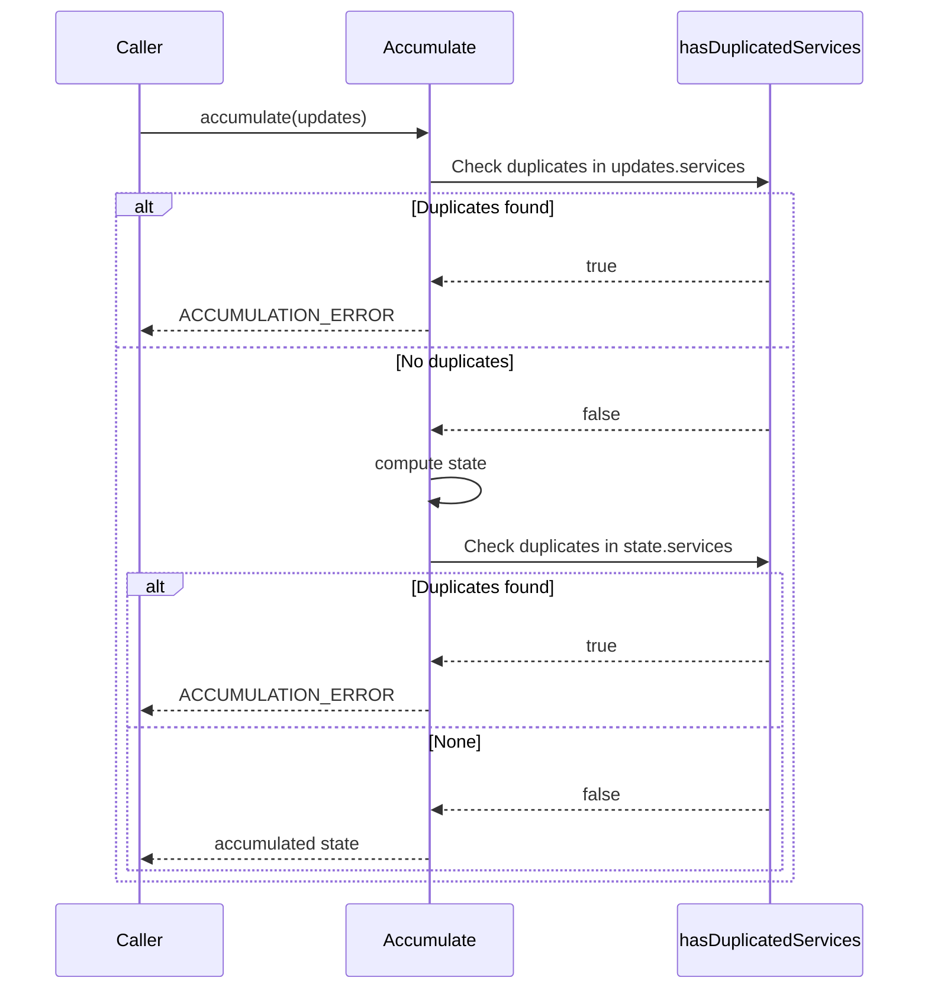

# Check creation of two services with the same ID

## Pull Request by @DrEverr

Resolves: #410 


## Comment by @coderabbitai[bot]

<!-- This is an auto-generated comment: summarize by coderabbit.ai -->
<!-- This is an auto-generated comment: skip review by coderabbit.ai -->

> [!IMPORTANT]
> ## Review skipped
> 
> Auto incremental reviews are disabled on this repository.
> 
> Please check the settings in the CodeRabbit UI or the `.coderabbit.yaml` file in this repository. To trigger a single review, invoke the `@coderabbitai review` command.
> 
> You can disable this status message by setting the `reviews.review_status` to `false` in the CodeRabbit configuration file.

<!-- end of auto-generated comment: skip review by coderabbit.ai -->

<!-- walkthrough_start -->

<details>
<summary>📝 Walkthrough</summary>

<!-- This is an auto-generated comment: release notes by coderabbit.ai -->

## Summary by CodeRabbit

* **Bug Fixes**
  * Detects and rejects duplicate service updates within a single request to prevent conflicting actions.
  * Adds validation before and after processing to ensure service list integrity.
  * Returns a clear accumulation error when duplicates are found, improving feedback and stability.
  * Enhances reliability of state updates by blocking inconsistent inputs.

<!-- end of auto-generated comment: release notes by coderabbit.ai -->
## Walkthrough
Adds duplicate-Create detection for UpdateService items in accumulation: introduces a hasDuplicatedServices helper (added twice by mistake), validates before and after accumulation, and returns ACCUMULATION_ERROR on duplicates. Imports UpdateService and UpdateServiceKind from @typeberry/state were added.

## Changes
| Cohort / File(s) | Summary |
| --- | --- |
| **Accumulation validation and imports**<br>`packages/jam/transition/accumulate/accumulate.ts` | Added duplicate-Create check via private `hasDuplicatedServices(updateServices)`; invoked pre- and post-accumulation to return `ACCUMULATION_ERROR` when duplicates by `serviceId` exist. Imported `UpdateService`, `UpdateServiceKind` from `@typeberry/state`. Note: `hasDuplicatedServices` defined twice in the file. |

## Sequence Diagram(s)


## Estimated code review effort
🎯 2 (Simple) | ⏱️ ~10 minutes

## Possibly related PRs
- FluffyLabs/typeberry#492 — Refactors Accumulate to use stateUpdate.services; overlaps with current PR’s service-update handling and validation flow in the same file.

## Suggested reviewers
- tomusdrw
- mateuszsikora

## Poem
> A rabbit taps keys with a careful cheer,  
> Sniffs out duplicates—“No twins in here!”  
> Before and after, the checks align,  
> Errors hop back with a clear red sign.  
> Two helpers sprout—oops, a mirrored vine—  
> Snip the twin, and all’s just fine. 🐇✨

</details>

<!-- walkthrough_end -->

<!-- pre_merge_checks_walkthrough_start -->

## Pre-merge checks and finishing touches
<details>
<summary>❌ Failed checks (2 warnings)</summary>

|         Check name         | Status     | Explanation                                                                                                                                                                                                                                                                          | Resolution                                                                                                                                                                                                                                  |
| :------------------------: | :--------- | :----------------------------------------------------------------------------------------------------------------------------------------------------------------------------------------------------------------------------------------------------------------------------------- | :------------------------------------------------------------------------------------------------------------------------------------------------------------------------------------------------------------------------------------------ |
|     Linked Issues Check    | ⚠️ Warning | The pull request adds duplicate service ID detection but does not address the core requirement of failing the entire accumulation when any error occurs during service accumulation, such as handling null `stateUpdate` cases in `accumulateInParallel` as specified in issue #410. | Update the implementation to replace the `continue` on null `stateUpdate` with a complete accumulation failure and ensure that any service accumulation error triggers `ACCUMULATION_ERROR` in accordance with the linked issue objectives. |
| Out of Scope Changes Check | ⚠️ Warning | The file contains two identical definitions of the private `hasDuplicatedServices` helper, which appears to be an inadvertent duplication and is unrelated to the specified objectives of error handling in the accumulation process.                                                | Remove the redundant `hasDuplicatedServices` definition and ensure only a single implementation exists so that all changes align strictly with the intended objectives.                                                                     |

</details>
<details>
<summary>✅ Passed checks (3 passed)</summary>

|     Check name     | Status   | Explanation                                                                                                                                                                                                                              |
| :----------------: | :------- | :--------------------------------------------------------------------------------------------------------------------------------------------------------------------------------------------------------------------------------------- |
|     Title Check    | ✅ Passed | The pull request title “Check creation of two services with the same ID” succinctly describes the primary change of detecting duplicate service IDs and is concise and clear enough for teammates to understand the focus of the change. |
|  Description Check | ✅ Passed | The description “Resolves: #410” directly references the linked issue that the pull request addresses and thus remains on-topic with the changeset.                                                                                      |
| Docstring Coverage | ✅ Passed | No functions found in the changes. Docstring coverage check skipped.                                                                                                                                                                     |

</details>

<!-- pre_merge_checks_walkthrough_end -->

<!-- tips_start -->

---


<sub>Comment `@coderabbitai help` to get the list of available commands and usage tips.</sub>

<!-- tips_end -->

<!-- internal state start -->


<!-- DwQgtGAEAqAWCWBnSTIEMB26CuAXA9mAOYCmGJATmriQCaQDG+Ats2bgFyQAOFk+AIwBWJBrngA3EsgEBPRvlqU0AgfFwA6NPEgQAfACgjoCEYDEZyAAUASpETZWaCrKPR1AGxJcAwrFEA1owUJNTw+Fj4AGaQuADu+PaUEvAM0pBx6rCx/vZobJAAkgAikJAGAHKOApRcAGwAHHVlBgCqNgAyXLC4uNyIHAD0g0RZ2AIaTMyDAGIe2FFRsh0qiIO4stwkNRQug9zYHh6Djc3lrYi1kMUUAKJSuy0AyvjYFGmQAlQYDLBczGhEIRLhQUmkwLRsNxIIAkwhgzlIuE+31+/20WHKT1w1GwA34WwxBhsJBSJDilDxBGYuNoFDiLRWNQ8eIAFBgIiRIB4kDRaABKFo+ELUOjoTiQABMAAYJQBWMAARilYClCugCoVHAALA0OFKAMwALSMxWkDAo8G44giHAMUGJQI8UjxZi1SvMlgA8sJROJnZAohQWFz4BgAqKkA5pEZCogo5BXUrIIAUAkgACIfBFLhgHIgwOb1Kk0B4uLddvg+LBMLRuRgiCgsGgGAxHIcwhEeEG0nH7LBXh56FFtB5IOx4CF0M3Wx52xg00YrEGBF5mLaoAB1fyNrCUIN8fBTijISEWutJUGpTlNlvUmfWrChyc3ts0QoYKzOYteDwAGhynPgZhuBXdhZ0gEJcDeHNIAwQ4RyiCt7GxGhWm4WgRXQDB6CYDBxFg9ICH/GCSAADyREEwRIDQ7RgBBkF4RRsG7WIEmCQsGGLFA42waRbTKBUNEgVoMG4bRsJYA5kPCDAuAkYt4HQggjx4SgEIoZgMgrIIBDwdAJ3ZJEpgJRARXoOIt1HctlIPFsKGosoJUEzMczIXNwKQAIuFoeBFkoUN60A4CSDYXDZ2QZh4CIHpICrLCvCIjjLgbHDEB5dgPHkFkgQKSL2QnXcK0QP98FwfxlJCEQxD5P8LUQAJ/OI+ItPsYD1EQaiDB8N4Qlwz4SCrFIKzXIosFEhgAjQUg1iEfJ1m+VL70Ga9pxFJap1vEUNFwAYDDKHzICy5CSFQxTOQAXgumC4IFABvXaygUXDQx4gBuMphkgAApXFyPq6FCPIMjz0o+6AF8jFuEitjEUUagG8I+EGfgfTESReJouBOTHCdlo2+9e37QdhwO3BhSRUrOWXA8gkBBs5O5fkMgsgrrMPSATwaijLyfFb72oqBbhzN5OXphTqEKvTOSM1zTIDRCEgoAJ+esIMUiUR7UsQGherhtBBr4Jsgx7QKQNC+92poxdpGSTlyCaxWNdc3EGxoIgLQ2DriSiSgyG7YbbG6Xp+iGEYxgmKZZnmRZllWdZNm2XdZH2ODBi1KUpRaKBiiQFs42kwO+gGYZRlK8ZJhYSOFiWRk1g2LYdj2A4jlT9OzG8xBc9SiIAH0KAlDUFS1AB2fUh9lABOTPIGJABHHitdh2QuAAASpGk6SMfRjHAKAyHoaIcAIYgyGUXkFFYdguF4ZHKr9dI5AUJQqFUdQtB0LeTCgOBUFQTBD8IUg5AqBnymCFcUVB6QOCcC4T48gmBPxUGoTQ2hdBgEMNvUwBgxoTSmoMGa0xSaYAWtJNaz47wkFIbzKi21bRpjoQYCwkAACChRj5ANllAgEMCD6/EwFNTeI1SaMTSPQNAxF6S8EkBhfwHgtiVkBMUKE3IOK8ieMkS8iAWRQlOmoi83YBSESUDQMQ7MlFFhoJAIUoQLFNnNrA4Gl5ChmSyI+MRlwkQHxOiKXRlFIDaJFO1IoSIPD4CIMgMRbA4yTSvFhcCJBIIUGgqTHiKAYhiMhK1FRAFkAIWwFhN6JUyqZCSkOZkVEMa5HIPSKsiBFGZNMj4jRXE6b4HDPQQiotTp+LQgEviuhIAACESBqU5HItSEUzwU0gACVx60XzSS5KE1INV4lQQakwnwPhWgAFlWgdCYdAQonoKjd1uDYGwno7D7QycogJo4SI8nsv0phUQaB8CMngBqUzcbzI7FrEUKyEkYHWZsnZeyDlHJOWci5VyYg3PMekUiPIGxES5sxbgFZ8YHymf8mgytMY8GoL8dAtBaDICaigJQT0OIjkkXJCxNS6m3NUeo5iJtgqgTsSyeFWT6BKCiKGQsWYBSZFKo+KZAqvDKy8WfQKmLyWJC+A1R8MqSCNI+NWISPSaDqpIAAaVDIOIMGlV7xwbknXFnJCIOG4Biig5NKlklMfU/GvxAgdQ9MwjwbywqxESFMpQDAZzAOksgA+pE7Vn0QgcZcqRRxPXENGGi2z4l9lEaSugV8LT0s5IysxvLdWaP8Tq1lvEtU6NLQAbQALp8i4AIfA+AvB/0fEGwEyAmFzPIQdbB0TpqzUITmIVGBKF4woT88hW1EB8hooUICmL7C5RxBOYtmaSXtPjuW7xpbML0FVbqg1sTAzBmYIxeKaZTX10ToMS1aYDqioQFgHF+ROSSpIIATAJ6LjGUYMOV9rRSBuDWFGdBhbha0ArLeBnIQiknpMMtS4oAASkVYAGDofOO0aCMG71iQfNAeAAEn2AaKUBl9wJoEgY4Lh8gH5Qefkgt+qDDCf3PhFXA3cFKIF7iSeAZI6Dd3+fapj2HIBSjqKPCUEp9Skq1GgaUWoojj31FqOoAgtQCCaGgceqmGCyhIOPBgsmNPKc5FvAwLHQHqA42S7jsH+N72Eyx3gJBu5sAoKQbubrxpccE0iMzd0yhpiQLYAZITxp0EzBfXCVh8AL1oGmLgpTLg/nummRAfZDi0FC9TWwCWAzFmS6lpAnoHgWgzXORLBWSApcC95WgNg8nFAPFiU8YS/CBDy8k6rqW6sNYwO4XAXh2vjU6xQHiNX0y9ca2aC0VppLDYCKN8bqXaxtNjFGRALW8tpgADoYD2zt3Ah3jtHdO8AVb/HIw8T0Ad07J2TsWEsImKUvgsxOzzAWcQNLSxWRitWWsAVGxdrAgxbsyB0uE3y/AEc2MrzA/vAd/bd3keHcYQNrwiPnLZlzPmd2RYSyQDLHuP7cVlVA7ISDrs0hwcZYHFDmHT0cbw+kojxhpoO6zYR/tjAjDFyCBXJj7q6VZB/nMmQTCllic2TeMeN4nMd0TrAuK3IAADRXr53yfiOCQDwKvpmpsUH+KZ7KwFgRwnheenYDzU6+Y6oGaLKbyAgmss8KvYJHD12pSAKvLWqr15q3EDUVfm+eiQPX1q/p+qIoDJE6hT7SQ0Ij7+4TbVBibNkGpLFEiffx1xDbHBEcCUgAAKmL8JUSClz6SVnKXrgAA1eSikJZjIrBpD5UkOwK20rpdk/ByCEtkDkxCUymBa2QGLncVkw2Hj245EvxesfvfcnVWv1wfLex6rHoCpsO/QQilFJEsUaxWroowQEnJvK+U3xlA62UAJEDyljKfxUKblRILfaqPASpji/HA/DqUzw7Yu8WpuRtpWdLAupdh2BBl+o9YEZEc3xvde1cF8E5oiFh1R0Xxx14dqFEAVdRcLIfcjo/dmk3c4IVcC8MAVdqC64ZtLQjtgUYhDoRRVVIALozorojhbo9sygQ98I3pIAPpvotZ7BI8AZSJyJS09tQY9tqCVdwDCcoZfRRQhl4YKwk9chYceY8YFkIdMt6cDoUoFJKAiIqZxo6ZG8RVmYp9+A2YOYzwHdtDfkn1EgnYQhKCoAG8GZxZlJnApYJIZYz4vcKZxxNJFY9soAsc0odZYD9ZJwjZkATdOVQ0IjIAKh4lgCUol9QxXZ3ZZAFCvYfYfhpBEcoArA4Jp4SA55pBxQehC4Q4S5YAy4I45gq4Y4BBa4zVr0m5jg04pRUjs4O5cQu4ZIYog4i5Q5S5w4K5Wjo4a444r1dgk4eiW4pQ24c5hjpJe5+4NRh5R4J5EdZ554z45AV415EBaQ4hbt7tkdgBBgLtaAONuISA9A0wJs0wZwtYFsHRDhto8tK17oygAsHpAsvMAgKgX1tt0dOQFs3jASHo0tkJcQltusQTAsI0ZwMBZwoTcgei4lqiRDxBBtORAAcAgW2CGsQWWxVYgd3HyyFRRfSKGKEAFwCewJiBgUMMQG/JQDneAGoclXEi0ajRgWKUgfgOFeJX0BqHlDCRwkocJWJVAHCDkpKTVINUIPgMgV4KKOWPgGgfIAEGgBVPxLCCkbEWJCVA8Z2bFXIXhOsKiOEtE9MEIR0T5CIbbCobPUU6DKo7AccUUWmKZIk+KdU5wG/EIKILwMQAUzkGZLAO0sUg+GUixOU0oME/yDQR0tEtMU9JQbbOIZwYFOsLMkEtMEIHCAVIgYWPLJLVE7MisSKUMYsBbCEtgbbYMkgecEE0GCbIE+E0E/wcaVszsrgNMDoUMNpIoZ45AWE3shE3FZEyrMpOc9EqGTE7E0cglPEkIAkpENAUlWXF1TkVM9mSU1GDsHSJEWgfAdIAyddF0mMhQCcHcv0kIMBcU+nW3LGRnOHCnfGCfTCeQFmWw2yWXVrBxDVZnCIP8BwYlWmI/AHTgkcIglg7VMPM/S4RIrANXHAt8D8KgbXXXdAcHaGHyXjegR8K7TkZ7TMlc506QJtN0irdMVg43bfDlM2BZQiEIYCJsE/TkYPCIC3dCjsd3ZC33NCvXB9dAKvLwGxKCrAIcaHYWXdeNBwCcUqagQCiC383mBZYC0mSKUgZSFXDZLZXZfZQ5Y5U5c5S5PXWZJgCgdCYojIekqZB4vPFJQQW+NGdqEshE3Mkc9MAsxJfyfywLcsiISs6spcwrJ0tMBs0YLEjwFsyE0ch49beeJhOManMBLsh6Hs+E4E0ssE4c7bT0XSA+J4JgLYSxb0mcwcxbOixEnERAGsqrZqjEzADc9MAlN9R6bEUMclViYw6lTiflQVOxG00ZbNDCFXPNI82gQtPXGRORAg1IbINAW1DU40moCXJs2gB4bWK8/NMCTVVAPJEIchdpf1XIRAUigVUUbyqU/0cNX7BCsnIidXBZUHanWi/s+i10+8bbYkU9KQIiEISELCTAJEeahRU6llPRaQPXCa4FfGTVNwzkCIG/NxfyeKJIzijsJFMfewW6rSr8EUvhdIeSB/JCC0Lk+QaS43XCPeJ6lGO+Py5qwK/MwssK5qyKjAaKkIdq5cgGhKi0JK5sxqsq0c14XAT0KIaq/ALYPwKmxAbKzCxAPK+EwqkE4qhE0qtK9MdnAsObDsWcsWhctqrgLrTqtc7q4Gzc3IHk02/GEkh0JtZ0LgZ7Vk7ycswbJ3YZIo5idyiciMZ4nILSqZbc30mo+86nami0po5AN89EMNDAMAAgbgONJm20+q+Jf6+Kl0xix29MT0gMN4V/U8wakcVAcgMHZweQQM52ugs2+Misf2m/VbR82wKPKZK6kkGGzyh0rmxQIKtMEKosogcK+iisyKGK/LUW+KxKpslK6Wo2tMF2znaSfKsoXWh6fWgcwIGW42g8LWcCzMB4aJGelqyCa22IMbOs0srqrE0utMcuqIPJc86CXJRUp9POtWwSJrBgc+hqJgK+sUsE0Qy0LYWgQu7M7m0cyevmsWle5K1Kts0c68kBwyusNqnW+6atd4z43AWwE27e900c3TNAOoNOBUCUEgfUceceIeXTOoBgQeIeeh8eWUfUNTEgLUWUDhnUNAIeVQVQJhhoWgZTFTAQDUGoIRhUEgIeSTKUEgKUIeLMj4wEUhmwaE7bLUceNAKUceSTAQOoMTMeceJUb2KIBoHhgQNAWUCUBoKIUlKUQRhgceBoWUWTfUEx1UBUKIOUBUceHUBoaTNAFTWgWhhUBoLUeccGczHeTsFzNzDzMErjBzfQIAA== -->

<!-- internal state end -->


## Comment by @github-actions[bot]


<details>
<summary>View all</summary>

| File | Benchmark | Ops |  |
|------|-----------|-----|--|
| [codec/bigint.decode.ts[0]](../blob/3bd0f46d28177ed503af309be52b3cc06f271452//_work/typeberry-runner-3/typeberry/typeberry/benchmarks/codec/bigint.decode.ts) | decode custom | 168616935.46 ±2.59% | fastest ✅ |
| [codec/bigint.decode.ts[1]](../blob/3bd0f46d28177ed503af309be52b3cc06f271452//_work/typeberry-runner-3/typeberry/typeberry/benchmarks/codec/bigint.decode.ts) | decode bigint | 106642453.18 ±2% | 36.75% slower |
| [codec/encoding.ts[0]](../blob/3bd0f46d28177ed503af309be52b3cc06f271452//_work/typeberry-runner-3/typeberry/typeberry/benchmarks/codec/encoding.ts) | manual encode | 3293013.06 ±1.13% | 19.01% slower |
| [codec/encoding.ts[1]](../blob/3bd0f46d28177ed503af309be52b3cc06f271452//_work/typeberry-runner-3/typeberry/typeberry/benchmarks/codec/encoding.ts) | int32array encode | 3651173.19 ±4.97% | 10.2% slower |
| [codec/encoding.ts[2]](../blob/3bd0f46d28177ed503af309be52b3cc06f271452//_work/typeberry-runner-3/typeberry/typeberry/benchmarks/codec/encoding.ts) | dataview encode | 4065933.42 ±0.72% | fastest ✅ |
| [codec/decoding.ts[0]](../blob/3bd0f46d28177ed503af309be52b3cc06f271452//_work/typeberry-runner-3/typeberry/typeberry/benchmarks/codec/decoding.ts) | manual decode | 22900345.26 ±0.78% | 86.11% slower |
| [codec/decoding.ts[1]](../blob/3bd0f46d28177ed503af309be52b3cc06f271452//_work/typeberry-runner-3/typeberry/typeberry/benchmarks/codec/decoding.ts) | int32array decode | 164880375.17 ±2.58% | fastest ✅ |
| [codec/decoding.ts[2]](../blob/3bd0f46d28177ed503af309be52b3cc06f271452//_work/typeberry-runner-3/typeberry/typeberry/benchmarks/codec/decoding.ts) | dataview decode | 162372332.82 ±3.14% | 1.52% slower |
| [collections/map-set.ts[0]](../blob/3bd0f46d28177ed503af309be52b3cc06f271452//_work/typeberry-runner-3/typeberry/typeberry/benchmarks/collections/map-set.ts) | 2 gets + conditional set | 119844.43 ±0.37% | fastest ✅ |
| [collections/map-set.ts[1]](../blob/3bd0f46d28177ed503af309be52b3cc06f271452//_work/typeberry-runner-3/typeberry/typeberry/benchmarks/collections/map-set.ts) | 1 get 1 set | 61345.79 ±0.33% | 48.81% slower |
| [bytes/hex-from.ts[0]](../blob/3bd0f46d28177ed503af309be52b3cc06f271452//_work/typeberry-runner-3/typeberry/typeberry/benchmarks/bytes/hex-from.ts) | parse hex using `Number` with NaN checking | 138048.49 ±0.55% | 84.41% slower |
| [bytes/hex-from.ts[1]](../blob/3bd0f46d28177ed503af309be52b3cc06f271452//_work/typeberry-runner-3/typeberry/typeberry/benchmarks/bytes/hex-from.ts) | parse hex from char codes | 885339.15 ±0.31% | fastest ✅ |
| [bytes/hex-from.ts[2]](../blob/3bd0f46d28177ed503af309be52b3cc06f271452//_work/typeberry-runner-3/typeberry/typeberry/benchmarks/bytes/hex-from.ts) | parse hex from string nibbles | 545492.13 ±0.47% | 38.39% slower |
| [bytes/hex-to.ts[0]](../blob/3bd0f46d28177ed503af309be52b3cc06f271452//_work/typeberry-runner-3/typeberry/typeberry/benchmarks/bytes/hex-to.ts) | number toString + padding | 309221.86 ±0.46% | fastest ✅ |
| [bytes/hex-to.ts[1]](../blob/3bd0f46d28177ed503af309be52b3cc06f271452//_work/typeberry-runner-3/typeberry/typeberry/benchmarks/bytes/hex-to.ts) | manual | 15695.73 ±0.53% | 94.92% slower |
| [codec/bigint.compare.ts[0]](../blob/3bd0f46d28177ed503af309be52b3cc06f271452//_work/typeberry-runner-3/typeberry/typeberry/benchmarks/codec/bigint.compare.ts) | compare custom | 249336408.35 ±5.8% | 1.18% slower |
| [codec/bigint.compare.ts[1]](../blob/3bd0f46d28177ed503af309be52b3cc06f271452//_work/typeberry-runner-3/typeberry/typeberry/benchmarks/codec/bigint.compare.ts) | compare bigint | 252313384.02 ±5.13% | fastest ✅ |
| [hash/index.ts[0]](../blob/3bd0f46d28177ed503af309be52b3cc06f271452//_work/typeberry-runner-3/typeberry/typeberry/benchmarks/hash/index.ts) | hash with numeric representation | 173.73 ±1.04% | 31.11% slower |
| [hash/index.ts[1]](../blob/3bd0f46d28177ed503af309be52b3cc06f271452//_work/typeberry-runner-3/typeberry/typeberry/benchmarks/hash/index.ts) | hash with string representation | 108.12 ±1.01% | 57.13% slower |
| [hash/index.ts[2]](../blob/3bd0f46d28177ed503af309be52b3cc06f271452//_work/typeberry-runner-3/typeberry/typeberry/benchmarks/hash/index.ts) | hash with symbol representation | 169.52 ±0.97% | 32.78% slower |
| [hash/index.ts[3]](../blob/3bd0f46d28177ed503af309be52b3cc06f271452//_work/typeberry-runner-3/typeberry/typeberry/benchmarks/hash/index.ts) | hash with uint8 representation | 153.38 ±0.57% | 39.18% slower |
| [hash/index.ts[4]](../blob/3bd0f46d28177ed503af309be52b3cc06f271452//_work/typeberry-runner-3/typeberry/typeberry/benchmarks/hash/index.ts) | hash with packed representation | 252.18 ±0.74% | fastest ✅ |
| [hash/index.ts[5]](../blob/3bd0f46d28177ed503af309be52b3cc06f271452//_work/typeberry-runner-3/typeberry/typeberry/benchmarks/hash/index.ts) | hash with bigint representation | 187.62 ±0.32% | 25.6% slower |
| [hash/index.ts[6]](../blob/3bd0f46d28177ed503af309be52b3cc06f271452//_work/typeberry-runner-3/typeberry/typeberry/benchmarks/hash/index.ts) | hash with uint32 representation | 193.11 ±0.99% | 23.42% slower |
| [math/add_one_overflow.ts[0]](../blob/3bd0f46d28177ed503af309be52b3cc06f271452//_work/typeberry-runner-3/typeberry/typeberry/benchmarks/math/add_one_overflow.ts) | add and take modulus | 240587442.56 ±6.76% | 4.6% slower |
| [math/add_one_overflow.ts[1]](../blob/3bd0f46d28177ed503af309be52b3cc06f271452//_work/typeberry-runner-3/typeberry/typeberry/benchmarks/math/add_one_overflow.ts) | condition before calculation | 252187790.35 ±6.22% | fastest ✅ |
| [math/count-bits-u32.ts[0]](../blob/3bd0f46d28177ed503af309be52b3cc06f271452//_work/typeberry-runner-3/typeberry/typeberry/benchmarks/math/count-bits-u32.ts) | standard method | 91902857.33 ±1.87% | 61.3% slower |
| [math/count-bits-u32.ts[1]](../blob/3bd0f46d28177ed503af309be52b3cc06f271452//_work/typeberry-runner-3/typeberry/typeberry/benchmarks/math/count-bits-u32.ts) | magic | 237466126.52 ±6.5% | fastest ✅ |
| [math/count-bits-u64.ts[0]](../blob/3bd0f46d28177ed503af309be52b3cc06f271452//_work/typeberry-runner-3/typeberry/typeberry/benchmarks/math/count-bits-u64.ts) | standard method | 1514820.72 ±0.82% | 84.96% slower |
| [math/count-bits-u64.ts[1]](../blob/3bd0f46d28177ed503af309be52b3cc06f271452//_work/typeberry-runner-3/typeberry/typeberry/benchmarks/math/count-bits-u64.ts) | magic | 10074881.97 ±2.14% | fastest ✅ |
| [math/mul_overflow.ts[0]](../blob/3bd0f46d28177ed503af309be52b3cc06f271452//_work/typeberry-runner-3/typeberry/typeberry/benchmarks/math/mul_overflow.ts) | multiply and bring back to u32 | 244410183.98 ±8.32% | fastest ✅ |
| [math/mul_overflow.ts[1]](../blob/3bd0f46d28177ed503af309be52b3cc06f271452//_work/typeberry-runner-3/typeberry/typeberry/benchmarks/math/mul_overflow.ts) | multiply and take modulus | 240759480.31 ±7.76% | 1.49% slower |
| [math/switch.ts[0]](../blob/3bd0f46d28177ed503af309be52b3cc06f271452//_work/typeberry-runner-3/typeberry/typeberry/benchmarks/math/switch.ts) | switch | 210789300.83 ±8.14% | 16.35% slower |
| [math/switch.ts[1]](../blob/3bd0f46d28177ed503af309be52b3cc06f271452//_work/typeberry-runner-3/typeberry/typeberry/benchmarks/math/switch.ts) | if | 251992199.94 ±4.96% | fastest ✅ |
| [logger/index.ts[0]](../blob/3bd0f46d28177ed503af309be52b3cc06f271452//_work/typeberry-runner-3/typeberry/typeberry/benchmarks/logger/index.ts) | console.log with string concat | 7542390.15 ±56.35% | fastest ✅ |
| [logger/index.ts[1]](../blob/3bd0f46d28177ed503af309be52b3cc06f271452//_work/typeberry-runner-3/typeberry/typeberry/benchmarks/logger/index.ts) | console.log with args | 865223.41 ±112.77% | 88.53% slower |
| [codec/view_vs_object.ts[0]](../blob/3bd0f46d28177ed503af309be52b3cc06f271452//_work/typeberry-runner-3/typeberry/typeberry/benchmarks/codec/view_vs_object.ts) | Get the first field from Decoded | 455970.48 ±2.06% | fastest ✅ |
| [codec/view_vs_object.ts[1]](../blob/3bd0f46d28177ed503af309be52b3cc06f271452//_work/typeberry-runner-3/typeberry/typeberry/benchmarks/codec/view_vs_object.ts) | Get the first field from View | 98571.32 ±1.19% | 78.38% slower |
| [codec/view_vs_object.ts[2]](../blob/3bd0f46d28177ed503af309be52b3cc06f271452//_work/typeberry-runner-3/typeberry/typeberry/benchmarks/codec/view_vs_object.ts) | Get the first field as view from View | 91868.14 ±1.67% | 79.85% slower |
| [codec/view_vs_object.ts[3]](../blob/3bd0f46d28177ed503af309be52b3cc06f271452//_work/typeberry-runner-3/typeberry/typeberry/benchmarks/codec/view_vs_object.ts) | Get two fields from Decoded | 415140.5 ±1.39% | 8.95% slower |
| [codec/view_vs_object.ts[4]](../blob/3bd0f46d28177ed503af309be52b3cc06f271452//_work/typeberry-runner-3/typeberry/typeberry/benchmarks/codec/view_vs_object.ts) | Get two fields from View | 64991.14 ±0.97% | 85.75% slower |
| [codec/view_vs_object.ts[5]](../blob/3bd0f46d28177ed503af309be52b3cc06f271452//_work/typeberry-runner-3/typeberry/typeberry/benchmarks/codec/view_vs_object.ts) | Get two fields from materialized from View | 138313.18 ±0.8% | 69.67% slower |
| [codec/view_vs_object.ts[6]](../blob/3bd0f46d28177ed503af309be52b3cc06f271452//_work/typeberry-runner-3/typeberry/typeberry/benchmarks/codec/view_vs_object.ts) | Get two fields as views from View | 65685.28 ±0.71% | 85.59% slower |
| [codec/view_vs_object.ts[7]](../blob/3bd0f46d28177ed503af309be52b3cc06f271452//_work/typeberry-runner-3/typeberry/typeberry/benchmarks/codec/view_vs_object.ts) | Get only third field from Decoded | 386947.88 ±1.36% | 15.14% slower |
| [codec/view_vs_object.ts[8]](../blob/3bd0f46d28177ed503af309be52b3cc06f271452//_work/typeberry-runner-3/typeberry/typeberry/benchmarks/codec/view_vs_object.ts) | Get only third field from View | 82761.64 ±1.02% | 81.85% slower |
| [codec/view_vs_object.ts[9]](../blob/3bd0f46d28177ed503af309be52b3cc06f271452//_work/typeberry-runner-3/typeberry/typeberry/benchmarks/codec/view_vs_object.ts) | Get only third field as view from View | 82801.79 ±0.87% | 81.84% slower |
| [codec/view_vs_collection.ts[0]](../blob/3bd0f46d28177ed503af309be52b3cc06f271452//_work/typeberry-runner-3/typeberry/typeberry/benchmarks/codec/view_vs_collection.ts) | Get first element from Decoded | 23455.46 ±1.43% | 55.02% slower |
| [codec/view_vs_collection.ts[1]](../blob/3bd0f46d28177ed503af309be52b3cc06f271452//_work/typeberry-runner-3/typeberry/typeberry/benchmarks/codec/view_vs_collection.ts) | Get first element from View | 52143.05 ±0.81% | fastest ✅ |
| [codec/view_vs_collection.ts[2]](../blob/3bd0f46d28177ed503af309be52b3cc06f271452//_work/typeberry-runner-3/typeberry/typeberry/benchmarks/codec/view_vs_collection.ts) | Get 50th element from Decoded | 21456.05 ±1.44% | 58.85% slower |
| [codec/view_vs_collection.ts[3]](../blob/3bd0f46d28177ed503af309be52b3cc06f271452//_work/typeberry-runner-3/typeberry/typeberry/benchmarks/codec/view_vs_collection.ts) | Get 50th element from View | 23775.25 ±1.69% | 54.4% slower |
| [codec/view_vs_collection.ts[4]](../blob/3bd0f46d28177ed503af309be52b3cc06f271452//_work/typeberry-runner-3/typeberry/typeberry/benchmarks/codec/view_vs_collection.ts) | Get last element from Decoded | 22854.31 ±1.51% | 56.17% slower |
| [codec/view_vs_collection.ts[5]](../blob/3bd0f46d28177ed503af309be52b3cc06f271452//_work/typeberry-runner-3/typeberry/typeberry/benchmarks/codec/view_vs_collection.ts) | Get last element from View | 16119.69 ±1.97% | 69.09% slower |
| [bytes/compare.ts[0]](../blob/3bd0f46d28177ed503af309be52b3cc06f271452//_work/typeberry-runner-3/typeberry/typeberry/benchmarks/bytes/compare.ts) | Comparing Uint32 bytes | 14777.48 ±2.52% | 5.41% slower |
| [bytes/compare.ts[1]](../blob/3bd0f46d28177ed503af309be52b3cc06f271452//_work/typeberry-runner-3/typeberry/typeberry/benchmarks/bytes/compare.ts) | Comparing raw bytes | 15621.98 ±3.34% | fastest ✅ |
| [collections/map_vs_sorted.ts[0]](../blob/3bd0f46d28177ed503af309be52b3cc06f271452//_work/typeberry-runner-3/typeberry/typeberry/benchmarks/collections/map_vs_sorted.ts) | Map | 262518.68 ±2.49% | fastest ✅ |
| [collections/map_vs_sorted.ts[1]](../blob/3bd0f46d28177ed503af309be52b3cc06f271452//_work/typeberry-runner-3/typeberry/typeberry/benchmarks/collections/map_vs_sorted.ts) | Map-array | 93436.54 ±1.56% | 64.41% slower |
| [collections/map_vs_sorted.ts[2]](../blob/3bd0f46d28177ed503af309be52b3cc06f271452//_work/typeberry-runner-3/typeberry/typeberry/benchmarks/collections/map_vs_sorted.ts) | Array | 32101.56 ±3.21% | 87.77% slower |
| [collections/map_vs_sorted.ts[3]](../blob/3bd0f46d28177ed503af309be52b3cc06f271452//_work/typeberry-runner-3/typeberry/typeberry/benchmarks/collections/map_vs_sorted.ts) | SortedArray | 172093.52 ±1.4% | 34.45% slower |
| [hash/blake2b.ts[0]](../blob/3bd0f46d28177ed503af309be52b3cc06f271452//_work/typeberry-runner-3/typeberry/typeberry/benchmarks/hash/blake2b.ts) | our hasher | 1.96 ±4.2% | fastest ✅ |
| [hash/blake2b.ts[1]](../blob/3bd0f46d28177ed503af309be52b3cc06f271452//_work/typeberry-runner-3/typeberry/typeberry/benchmarks/hash/blake2b.ts) | blake2b js | 0.05 ±0.92% | 97.45% slower |
| [crypto/ed25519.ts[0]](../blob/3bd0f46d28177ed503af309be52b3cc06f271452//_work/typeberry-runner-3/typeberry/typeberry/benchmarks/crypto/ed25519.ts) | native crypto | 5.64 ±17.8% | 81.53% slower |
| [crypto/ed25519.ts[1]](../blob/3bd0f46d28177ed503af309be52b3cc06f271452//_work/typeberry-runner-3/typeberry/typeberry/benchmarks/crypto/ed25519.ts) | wasm lib | 10.88 ±0.02% | 64.37% slower |
| [crypto/ed25519.ts[2]](../blob/3bd0f46d28177ed503af309be52b3cc06f271452//_work/typeberry-runner-3/typeberry/typeberry/benchmarks/crypto/ed25519.ts) | wasm lib batch | 30.54 ±0.58% | fastest ✅ |
</details>


### Benchmarks summary: 63/63 OK ✅

<!-- thollander/actions-comment-pull-request "benchmarks" -->


## Comment by @tomusdrw

```suggestion
  private hasDuplicatedServicesCreated(updateServices: UpdateService[]): boolean {
```

This function does not check if there are duplicated services in `updateServices` but rather if there are duplicates services that are being created.
