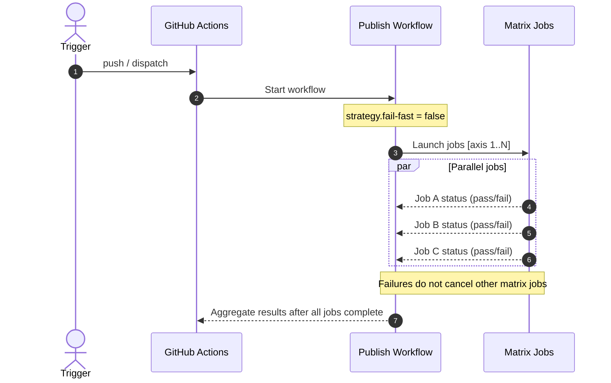

# Fix NPM publish of `typeberry/lib`

## Pull Request by @tomusdrw

borked merge left the previous workflow around and having two caused some races and issues.

## Comment by @coderabbitai[bot]

<!-- This is an auto-generated comment: summarize by coderabbit.ai -->
<!-- This is an auto-generated comment: skip review by coderabbit.ai -->

> [!IMPORTANT]
> ## Review skipped
> 
> Auto incremental reviews are disabled on this repository.
> 
> Please check the settings in the CodeRabbit UI or the `.coderabbit.yaml` file in this repository. To trigger a single review, invoke the `@coderabbitai review` command.
> 
> You can disable this status message by setting the `reviews.review_status` to `false` in the CodeRabbit configuration file.

<!-- end of auto-generated comment: skip review by coderabbit.ai -->

<!-- walkthrough_start -->

📝 Walkthrough

<!-- This is an auto-generated comment: release notes by coderabbit.ai -->

## Summary by CodeRabbit

- Chores
  - Updated publish workflows to run all matrix jobs even if one fails, improving reliability and visibility of CI results.
  - Removed the deprecated library publishing pipeline to streamline CI/CD.
  - Aligned release publishing behavior with the new fail-fast configuration for consistent execution across jobs.

<!-- end of auto-generated comment: release notes by coderabbit.ai -->
## Walkthrough
Adjusts CI matrix behavior by setting fail-fast: false in two publish workflows and deletes the dedicated @typeberry/lib publish workflow.

## Changes
| Cohort / File(s) | Summary of edits |
| --- | --- |
| **Matrix fail-fast adjustments** `.github/workflows/publish-npm.yml`, `.github/workflows/release-publish.yml` | Set strategy.fail-fast: false to prevent early termination of remaining matrix jobs when one fails. |
| **Remove lib publish workflow** `.github/workflows/publish-typeberry-lib.yml` | Deleted workflow that built and published @typeberry/lib to npm. |

## Sequence Diagram(s)

## Estimated code review effort
🎯 2 (Simple) | ⏱️ ~10 minutes

## Possibly related PRs
- FluffyLabs/typeberry#672 — Also edits .github/workflows/release-publish.yml to change job dependencies; overlaps in the same workflow.
- FluffyLabs/typeberry#592 — Modifies the now-removed publish-typeberry-lib workflow; directly related/conflicting context.
- FluffyLabs/typeberry#580 — Removes another package publish workflow, paralleling this deletion.

## Suggested reviewers
- skoszuta
- mateuszsikora

## Poem
> Little paws tap pipelines bright,  
> Matrix hops run through the night;  
> Fail fast? Not this bunny’s way—  
> Every job can have its say.  
> Farewell, old lib’s publish song,  
> New routes mapped, we bound along.  
> (\\_/)\n>(•_•)🥕

<!-- walkthrough_end -->

<!-- pre_merge_checks_walkthrough_start -->

## Pre-merge checks and finishing touches

✅ Passed checks (3 passed)

|     Check name     | Status   | Explanation                                                                                                                                                                                                                                                                                                                                                                  |
| :----------------: | :------- | :--------------------------------------------------------------------------------------------------------------------------------------------------------------------------------------------------------------------------------------------------------------------------------------------------------------------------------------------------------------------------- |
|     Title Check    | ✅ Passed | The title succinctly identifies the primary goal of the pull request, which is to fix the NPM publish process for the typeberry/lib package. It directly reflects the removal of the outdated workflow and adjustments to the CI configuration described in the changeset. The phrasing is clear and specific, enabling teammates to understand the main change at a glance. |
|  Description Check | ✅ Passed | The description clearly explains that a duplicated workflow caused race conditions and conveys why the leftover CI configuration needed removal. It directly relates to the changes in the pull request which remove the old workflow and adjust the publish process. The level of detail is sufficient for this lenient check, making the description on topic.             |
| Docstring Coverage | ✅ Passed | No functions found in the changes. Docstring coverage check skipped.                                                                                                                                                                                                                                                                                                         |

<!-- pre_merge_checks_walkthrough_end -->

<!-- tips_start -->

---

Comment `@coderabbitai help` to get the list of available commands and usage tips.

<!-- tips_end -->

<!-- internal state start -->

<!-- DwQgtGAEAqAWCWBnSTIEMB26CuAXA9mAOYCmGJATmriQCaQDG+Ats2bgFyQAOFk+AIwBWJBrngA3EsgEBPRvlqU0AgfFwA6NPEgQAfACgjoCEYDEZyAAUASpETZWaCrKPR1AGxJcAYvAAekAByVgCyPNgCHkiw/ABmkAAGuLLcJAKULgD00QKJkJAGQY4ZFFwAbAAcAJwFBgCqNgAyXLC4uNyIHFlZROqwkRpMzFk+HthxcbJNKohZKWml2dzYHh5ZVbWF9YiUXATM2Ii0FADudQDK+NgUDCSQAlQYDLD7tGAY3MxgAtjwHvRAEmEMGcpFwDyeLy4zG0WEKF1w1COXHwaThBhsJAk8BIp0oXUgAAoMPhyJBoogaLQAJR1GYZDwE4mk+4Uqm0woAYQoJGodHQnEgACYAAxCgCsYAAjCKwGLoFKhRxRcrKgAtIwAEWkDAo8G44lJXAAgjwKIIvDDxAxIGwKKRySQ4uC0GasfBrshTvgKABrOIefDneAYRFiADckFgaGxGCIkFw3sg3r9AaDyAYaCO/Kod2QmHoSAc0g0MAQyFsKFDZFoyAIkDiAQTsHuIXCKyiMXiSQW6Uyshy8DyD3kaFoJ2kiBD8dwLcdzvwUj4Kf9gfOs+oZsU2Du9Fn91z9yYGFo6g9GEQGiM+mM4CgNe7WYIxDIyipClY7C4vH4wlE4ikGR5CYJQqFUdQtB0G8TCgOBUFQTAcGfUhyCod9hjYUMuCoc4HCcFwRwUUCVDUTRtF0MBDFvUwDA0PpZ0iLIVzTU45g7ClYA+L4NFkZgPA4AwACJhIMCxIGNABJF9UL5eg8JhAj8ASF5MFIRBr3E8dkDibQPDAHTKS4HTGXuet93sXA0JIIh5F2MRz27cz2K7Zi1wAGkYaM42nZt7k5CSHhIaNsR9BN8EgEkXQEH1wXMq09UCUlfIbeAKEpBtdJ8oRBFLIJwpUuNpDClBmG4GLkFC5ybWNKwJMQSMSXJfA+htAq1MC2RSXofyFFDc0PAbNcryMUTLGNDwaDQ8863C8ylAYDxnGoabuxIfwyood9KsiaIbXYM9pA0vLPNUor6zWjaqSyKrIH2lJIHmxaptJS9zDMIwAFFKXgK1+RAg93VxW7JhirhQjoeBHCEkSDAgMAjDo/pGNc9Nrp2mIwF7JZZDAXIeL4gThME0bxKklC335eTnHkJSTsK9SMRIZhF35cyAHF1AACUicT7Je5MfVXINm03ZzEBbPc5wAASx/tBwEHg0AYX00AdetPmYUs4HuFHzl4d1PQ8WQBNhmA9SIUgeXoJLdYAfVPRBuGoF50BPCJxbO8KYRDU2dn5V14qbU5+mCRQSA0IRkCFIUNH8U3ORbZX+WucF/o83ZwWwbhQ6UCOvRDjXGCVucCwir5IB5PpKRcU2JIvRE1n5JQ0SUZ4cWQbFXULhh4FNgAhP4JuSmXUj7ChslyRXldVnWC/LihsCwX5/noMBzhHxY5dyU2rHRj3JfuZeh6d6eHTic1mAepBcHlyAjh8wuxdiYPZwopW82QG7S4gRF43IfxcAeSfC2UM8BMziDjMmEOQQADymoPq22NPUaAnNbbQBgQAaQ+kEBsF97CiB5LgBmcFkA8mZhINAA0SDRGYCGPkdY5w1kxoQB8/ksick1INYWcRtqdnFj5cyuQqAEXrG2YaX1xC/XoP9CugNzhOh4ZtLgTQgzQ2JrDGiiMGICCYoLFicweReDQLsMAT98b8TUSTSS0kKZyUcApGmykvJqQ0nXZKT8uKX2ygraufIbJAPHPyHS/x9LGMFMZXYxUHYqC8LdZwRsEyUFoRgZaSVab4H3HwQOgQ0D+CKqcEB/AyTeIyv8S8ZZUBtSKseSy+ABosVwSwHgGT9qUISZSVE3AfJtNtNQBKFdF4VSwI2NK4JgnjB5MVNpQZulrF6ZZJsww1ApMNBeYqC8sCV2cLQLwiAKoJBDKebEtBsCUNKRMksod+CZMCsFD0VABpVNeiNMS41JqpLWWZOcj0lqrP2bddaMVk58BundduGk3qfW+lIoiANsRAwUaDSA4NTxQyJteSi1F7xu1pk+Qg5MrLSJYJhQUOF7D2OpoRf6YFSKQQooYGCH5aG4FtvAWstseTwrxLQW2lJnDghvAYRlABmAALAAdnFQIcUkrRXlB0kKAQ44VDVAYIqWglQqhCmFeUMVAhKgilFQwaoAgRSVHpVipl6hWXss5TibltsHzQTvG6W2dpSC2xeKIX0iBeWIk2hagwABvAwBRBJIFsH3QMSdaCcmJewKw+BKR0EEkZShuw3KhsgIJcW1wARRvwMrWwqaMomUzWGpAMClx6kCRgEtESSDluzaeWgNhF6akLQiPUcZEAJ29SWyy2BG1ZsEi2ttGB3C4C8H25WA6F7DrDWO9tOo9QGnPDO30c6h1NsEtEDAvo6B1WLIgLtJbhI7sWpSDdmIHATUQCWgA2lmgoIaChvuzV65WQQ0BsDPZO2JG7BJNvfTmxEuAjhboXe+7NF1ForPPH+uc4gp33AcAwHuzwp3yDZftRsZ05y8B+pSog+Azm0ycqsAaPIACOQ7KQeQKWA2IqB6yNkCOZNsEQ+GxF4IWycDZQrmVluPAck8T4q1IKWCS4JTw8jEAknkAZ/wMIBuQsjCRzIp1oLJAWqY1yu3oGOIQRxcAkpmslHqx5GxEBuB8h6K6hz8hDMlJ5JBNBlnuNwWAVApyQMqUYvgpdHaiHgI2BgHkyAxIEbyJwNBzOL1Anyt2cVYR0wdJuV0RA4N3A0EB59b7BI8kQHUvACGuCCWOk89AkzyAf0pcY5KyHYmUJ5GOeQbA3MqcgDZnDe6iqKMYE9dQo43bBZ7mF4buXgMFeZkoM9pxnAYGnHl6D2a5OkmszcEg9b01QZAz6eAfQUkeA3d+395WmvbfywAX2m6+6DglP2+jO9t8r2pEC6n1KsyAgHpthr5eB+9+x51/Zg+tODHzEP3CUB91d32Fq8goAk2DsIGEZYelnXaOndZF2zPQQ8vVTx/IM71KQsgvSwHkIIp0BAlw/YClZw7tnvvkDoDmJmi5KFSZk6lf8CnqH0OKuZKrzmKNzJo3R8EjGXZkJZslOp9AcelyMyZ9xe8ePmg/lrOcXgpADVpkoRE/wUDIAcJMMBOJQwCb4LOVAXglvsE8t6jyMJfQCO+Q5tdaSsAEC6QwKb+Ww1FZK6ss9lXnFFWcPcVnSh6AZEzNmZKMPPte6wGOEgtG+T88WnFoXc5XMujdijkMXXeNRCZugccRXdhx6pwRyjsjaPSE0Cth7s3XvZoWxQJbcZW8gfWxgTbPIdtlsD9mg7R3KGnZ/R30dnvQ83bu2Px7idnsz7PR2hg1cfJxqXDPPvBWAcQeB9u5fKP4OkjD+FOIi8+ZrJ4QlqsLmI/lM39vyBTA98Oie/YN33A0i0AB6raCTt7zaLbLag6CQT50Inar4vZnq0CFrv5ED3o3ZZoAC6F6YStg72Keoe5WoqUoqqQo2mwqcQ4oqg4oaAfYIo4oYo5Q4qDBAg1Q1QIoIoUolQoq+qTooqwq1QvIaAoqcQZBoq4oDAlQlQToIoDAkqUoYqJA4qDAreu62BNg/6s+lQ4q6QOq0qHBDAcQ1QwqAgaAlQMq1Buq1QoqNQ5QQovIIoihlQwqDA5Q7Boq2qoqtAoqChjhAgwq4oBqTo2m2qUoAgQoxM12lq+sbqlAHqT2vqTqlEQAA== -->

<!-- internal state end -->

## Comment by @github-actions[bot]

View all

| File | Benchmark | Ops |  |
|------|-----------|-----|--|
| [bytes/hex-to.ts[0]](../blob/9ea1d3da3a7762c4ce3cb20d8ab6106e8e468889//_work/typeberry-1/typeberry/typeberry/benchmarks/bytes/hex-to.ts) | number toString + padding | 297526.25 ±1.02% | fastest ✅ |
| [bytes/hex-to.ts[1]](../blob/9ea1d3da3a7762c4ce3cb20d8ab6106e8e468889//_work/typeberry-1/typeberry/typeberry/benchmarks/bytes/hex-to.ts) | manual | 14344.15 ±1.33% | 95.18% slower |
| [codec/decoding.ts[0]](../blob/9ea1d3da3a7762c4ce3cb20d8ab6106e8e468889//_work/typeberry-1/typeberry/typeberry/benchmarks/codec/decoding.ts) | manual decode | 20346848.91 ±1.27% | 86.33% slower |
| [codec/decoding.ts[1]](../blob/9ea1d3da3a7762c4ce3cb20d8ab6106e8e468889//_work/typeberry-1/typeberry/typeberry/benchmarks/codec/decoding.ts) | int32array decode | 147658207.66 ±3.41% | 0.82% slower |
| [codec/decoding.ts[2]](../blob/9ea1d3da3a7762c4ce3cb20d8ab6106e8e468889//_work/typeberry-1/typeberry/typeberry/benchmarks/codec/decoding.ts) | dataview decode | 148881038.05 ±3.11% | fastest ✅ |
| [collections/map-set.ts[0]](../blob/9ea1d3da3a7762c4ce3cb20d8ab6106e8e468889//_work/typeberry-1/typeberry/typeberry/benchmarks/collections/map-set.ts) | 2 gets + conditional set | 113595.75 ±0.86% | fastest ✅ |
| [collections/map-set.ts[1]](../blob/9ea1d3da3a7762c4ce3cb20d8ab6106e8e468889//_work/typeberry-1/typeberry/typeberry/benchmarks/collections/map-set.ts) | 1 get 1 set | 59148.09 ±0.59% | 47.93% slower |
| [bytes/hex-from.ts[0]](../blob/9ea1d3da3a7762c4ce3cb20d8ab6106e8e468889//_work/typeberry-1/typeberry/typeberry/benchmarks/bytes/hex-from.ts) | parse hex using `Number` with NaN checking | 132731.58 ±0.52% | 84.04% slower |
| [bytes/hex-from.ts[1]](../blob/9ea1d3da3a7762c4ce3cb20d8ab6106e8e468889//_work/typeberry-1/typeberry/typeberry/benchmarks/bytes/hex-from.ts) | parse hex from char codes | 831535.24 ±0.85% | fastest ✅ |
| [bytes/hex-from.ts[2]](../blob/9ea1d3da3a7762c4ce3cb20d8ab6106e8e468889//_work/typeberry-1/typeberry/typeberry/benchmarks/bytes/hex-from.ts) | parse hex from string nibbles | 502742.06 ±2.27% | 39.54% slower |
| [math/mul_overflow.ts[0]](../blob/9ea1d3da3a7762c4ce3cb20d8ab6106e8e468889//_work/typeberry-1/typeberry/typeberry/benchmarks/math/mul_overflow.ts) | multiply and bring back to u32 | 209368575.93 ±11.1% | 14.26% slower |
| [math/mul_overflow.ts[1]](../blob/9ea1d3da3a7762c4ce3cb20d8ab6106e8e468889//_work/typeberry-1/typeberry/typeberry/benchmarks/math/mul_overflow.ts) | multiply and take modulus | 244198358.63 ±8.88% | fastest ✅ |
| [math/switch.ts[0]](../blob/9ea1d3da3a7762c4ce3cb20d8ab6106e8e468889//_work/typeberry-1/typeberry/typeberry/benchmarks/math/switch.ts) | switch | 257826036.85 ±5.77% | fastest ✅ |
| [math/switch.ts[1]](../blob/9ea1d3da3a7762c4ce3cb20d8ab6106e8e468889//_work/typeberry-1/typeberry/typeberry/benchmarks/math/switch.ts) | if | 240641372.57 ±7.08% | 6.67% slower |
| [math/count-bits-u32.ts[0]](../blob/9ea1d3da3a7762c4ce3cb20d8ab6106e8e468889//_work/typeberry-1/typeberry/typeberry/benchmarks/math/count-bits-u32.ts) | standard method | 88651892.88 ±2.04% | 65.01% slower |
| [math/count-bits-u32.ts[1]](../blob/9ea1d3da3a7762c4ce3cb20d8ab6106e8e468889//_work/typeberry-1/typeberry/typeberry/benchmarks/math/count-bits-u32.ts) | magic | 253383490.31 ±5.64% | fastest ✅ |
| [math/count-bits-u64.ts[0]](../blob/9ea1d3da3a7762c4ce3cb20d8ab6106e8e468889//_work/typeberry-1/typeberry/typeberry/benchmarks/math/count-bits-u64.ts) | standard method | 1510762.39 ±1.4% | 86.19% slower |
| [math/count-bits-u64.ts[1]](../blob/9ea1d3da3a7762c4ce3cb20d8ab6106e8e468889//_work/typeberry-1/typeberry/typeberry/benchmarks/math/count-bits-u64.ts) | magic | 10941023.13 ±3.45% | fastest ✅ |
| [codec/bigint.decode.ts[0]](../blob/9ea1d3da3a7762c4ce3cb20d8ab6106e8e468889//_work/typeberry-1/typeberry/typeberry/benchmarks/codec/bigint.decode.ts) | decode custom | 160911547.42 ±4.25% | fastest ✅ |
| [codec/bigint.decode.ts[1]](../blob/9ea1d3da3a7762c4ce3cb20d8ab6106e8e468889//_work/typeberry-1/typeberry/typeberry/benchmarks/codec/bigint.decode.ts) | decode bigint | 89858897.23 ±2.62% | 44.16% slower |
| [hash/index.ts[0]](../blob/9ea1d3da3a7762c4ce3cb20d8ab6106e8e468889//_work/typeberry-1/typeberry/typeberry/benchmarks/hash/index.ts) | hash with numeric representation | 179.21 ±1.01% | 32.35% slower |
| [hash/index.ts[1]](../blob/9ea1d3da3a7762c4ce3cb20d8ab6106e8e468889//_work/typeberry-1/typeberry/typeberry/benchmarks/hash/index.ts) | hash with string representation | 107.36 ±0.42% | 59.47% slower |
| [hash/index.ts[2]](../blob/9ea1d3da3a7762c4ce3cb20d8ab6106e8e468889//_work/typeberry-1/typeberry/typeberry/benchmarks/hash/index.ts) | hash with symbol representation | 173.2 ±0.38% | 34.62% slower |
| [hash/index.ts[3]](../blob/9ea1d3da3a7762c4ce3cb20d8ab6106e8e468889//_work/typeberry-1/typeberry/typeberry/benchmarks/hash/index.ts) | hash with uint8 representation | 161.02 ±0.39% | 39.22% slower |
| [hash/index.ts[4]](../blob/9ea1d3da3a7762c4ce3cb20d8ab6106e8e468889//_work/typeberry-1/typeberry/typeberry/benchmarks/hash/index.ts) | hash with packed representation | 264.92 ±0.23% | fastest ✅ |
| [hash/index.ts[5]](../blob/9ea1d3da3a7762c4ce3cb20d8ab6106e8e468889//_work/typeberry-1/typeberry/typeberry/benchmarks/hash/index.ts) | hash with bigint representation | 189.62 ±0.36% | 28.42% slower |
| [hash/index.ts[6]](../blob/9ea1d3da3a7762c4ce3cb20d8ab6106e8e468889//_work/typeberry-1/typeberry/typeberry/benchmarks/hash/index.ts) | hash with uint32 representation | 198.69 ±0.41% | 25% slower |
| [codec/encoding.ts[0]](../blob/9ea1d3da3a7762c4ce3cb20d8ab6106e8e468889//_work/typeberry-1/typeberry/typeberry/benchmarks/codec/encoding.ts) | manual encode | 3037900.2 ±0.49% | 16.87% slower |
| [codec/encoding.ts[1]](../blob/9ea1d3da3a7762c4ce3cb20d8ab6106e8e468889//_work/typeberry-1/typeberry/typeberry/benchmarks/codec/encoding.ts) | int32array encode | 3654338.6 ±0.43% | fastest ✅ |
| [codec/encoding.ts[2]](../blob/9ea1d3da3a7762c4ce3cb20d8ab6106e8e468889//_work/typeberry-1/typeberry/typeberry/benchmarks/codec/encoding.ts) | dataview encode | 3511983.37 ±0.65% | 3.9% slower |
| [math/add_one_overflow.ts[0]](../blob/9ea1d3da3a7762c4ce3cb20d8ab6106e8e468889//_work/typeberry-1/typeberry/typeberry/benchmarks/math/add_one_overflow.ts) | add and take modulus | 238930482.84 ±7.81% | 0.33% slower |
| [math/add_one_overflow.ts[1]](../blob/9ea1d3da3a7762c4ce3cb20d8ab6106e8e468889//_work/typeberry-1/typeberry/typeberry/benchmarks/math/add_one_overflow.ts) | condition before calculation | 239721181.82 ±8.81% | fastest ✅ |
| [codec/bigint.compare.ts[0]](../blob/9ea1d3da3a7762c4ce3cb20d8ab6106e8e468889//_work/typeberry-1/typeberry/typeberry/benchmarks/codec/bigint.compare.ts) | compare custom | 264599819.74 ±5.9% | fastest ✅ |
| [codec/bigint.compare.ts[1]](../blob/9ea1d3da3a7762c4ce3cb20d8ab6106e8e468889//_work/typeberry-1/typeberry/typeberry/benchmarks/codec/bigint.compare.ts) | compare bigint | 262326413.13 ±6.33% | 0.86% slower |
| [logger/index.ts[0]](../blob/9ea1d3da3a7762c4ce3cb20d8ab6106e8e468889//_work/typeberry-1/typeberry/typeberry/benchmarks/logger/index.ts) | console.log with string concat | 6902826.24 ±61% | fastest ✅ |
| [logger/index.ts[1]](../blob/9ea1d3da3a7762c4ce3cb20d8ab6106e8e468889//_work/typeberry-1/typeberry/typeberry/benchmarks/logger/index.ts) | console.log with args | 1479090.72 ±77.51% | 78.57% slower |
| [codec/view_vs_collection.ts[0]](../blob/9ea1d3da3a7762c4ce3cb20d8ab6106e8e468889//_work/typeberry-1/typeberry/typeberry/benchmarks/codec/view_vs_collection.ts) | Get first element from Decoded | 25710.66 ±1.37% | 54.27% slower |
| [codec/view_vs_collection.ts[1]](../blob/9ea1d3da3a7762c4ce3cb20d8ab6106e8e468889//_work/typeberry-1/typeberry/typeberry/benchmarks/codec/view_vs_collection.ts) | Get first element from View | 56225.02 ±2.09% | fastest ✅ |
| [codec/view_vs_collection.ts[2]](../blob/9ea1d3da3a7762c4ce3cb20d8ab6106e8e468889//_work/typeberry-1/typeberry/typeberry/benchmarks/codec/view_vs_collection.ts) | Get 50th element from Decoded | 24058.98 ±1.36% | 57.21% slower |
| [codec/view_vs_collection.ts[3]](../blob/9ea1d3da3a7762c4ce3cb20d8ab6106e8e468889//_work/typeberry-1/typeberry/typeberry/benchmarks/codec/view_vs_collection.ts) | Get 50th element from View | 25333.44 ±2% | 54.94% slower |
| [codec/view_vs_collection.ts[4]](../blob/9ea1d3da3a7762c4ce3cb20d8ab6106e8e468889//_work/typeberry-1/typeberry/typeberry/benchmarks/codec/view_vs_collection.ts) | Get last element from Decoded | 23529.23 ±1.72% | 58.15% slower |
| [codec/view_vs_collection.ts[5]](../blob/9ea1d3da3a7762c4ce3cb20d8ab6106e8e468889//_work/typeberry-1/typeberry/typeberry/benchmarks/codec/view_vs_collection.ts) | Get last element from View | 17573.77 ±1.82% | 68.74% slower |
| [codec/view_vs_object.ts[0]](../blob/9ea1d3da3a7762c4ce3cb20d8ab6106e8e468889//_work/typeberry-1/typeberry/typeberry/benchmarks/codec/view_vs_object.ts) | Get the first field from Decoded | 432211.76 ±2.23% | fastest ✅ |
| [codec/view_vs_object.ts[1]](../blob/9ea1d3da3a7762c4ce3cb20d8ab6106e8e468889//_work/typeberry-1/typeberry/typeberry/benchmarks/codec/view_vs_object.ts) | Get the first field from View | 93778.12 ±1.35% | 78.3% slower |
| [codec/view_vs_object.ts[2]](../blob/9ea1d3da3a7762c4ce3cb20d8ab6106e8e468889//_work/typeberry-1/typeberry/typeberry/benchmarks/codec/view_vs_object.ts) | Get the first field as view from View | 81503.67 ±1.12% | 81.14% slower |
| [codec/view_vs_object.ts[3]](../blob/9ea1d3da3a7762c4ce3cb20d8ab6106e8e468889//_work/typeberry-1/typeberry/typeberry/benchmarks/codec/view_vs_object.ts) | Get two fields from Decoded | 384283.57 ±1.42% | 11.09% slower |
| [codec/view_vs_object.ts[4]](../blob/9ea1d3da3a7762c4ce3cb20d8ab6106e8e468889//_work/typeberry-1/typeberry/typeberry/benchmarks/codec/view_vs_object.ts) | Get two fields from View | 66308.89 ±1.02% | 84.66% slower |
| [codec/view_vs_object.ts[5]](../blob/9ea1d3da3a7762c4ce3cb20d8ab6106e8e468889//_work/typeberry-1/typeberry/typeberry/benchmarks/codec/view_vs_object.ts) | Get two fields from materialized from View | 18836.69 ±185.18% | 95.64% slower |
| [codec/view_vs_object.ts[6]](../blob/9ea1d3da3a7762c4ce3cb20d8ab6106e8e468889//_work/typeberry-1/typeberry/typeberry/benchmarks/codec/view_vs_object.ts) | Get two fields as views from View | 41176.52 ±7.45% | 90.47% slower |
| [codec/view_vs_object.ts[7]](../blob/9ea1d3da3a7762c4ce3cb20d8ab6106e8e468889//_work/typeberry-1/typeberry/typeberry/benchmarks/codec/view_vs_object.ts) | Get only third field from Decoded | 351329.79 ±4.62% | 18.71% slower |
| [codec/view_vs_object.ts[8]](../blob/9ea1d3da3a7762c4ce3cb20d8ab6106e8e468889//_work/typeberry-1/typeberry/typeberry/benchmarks/codec/view_vs_object.ts) | Get only third field from View | 78684.96 ±3.36% | 81.79% slower |
| [codec/view_vs_object.ts[9]](../blob/9ea1d3da3a7762c4ce3cb20d8ab6106e8e468889//_work/typeberry-1/typeberry/typeberry/benchmarks/codec/view_vs_object.ts) | Get only third field as view from View | 89668.97 ±1.13% | 79.25% slower |
| [bytes/compare.ts[0]](../blob/9ea1d3da3a7762c4ce3cb20d8ab6106e8e468889//_work/typeberry-1/typeberry/typeberry/benchmarks/bytes/compare.ts) | Comparing Uint32 bytes | 18798.92 ±1.6% | 6.6% slower |
| [bytes/compare.ts[1]](../blob/9ea1d3da3a7762c4ce3cb20d8ab6106e8e468889//_work/typeberry-1/typeberry/typeberry/benchmarks/bytes/compare.ts) | Comparing raw bytes | 20126.49 ±1.4% | fastest ✅ |
| [hash/blake2b.ts[0]](../blob/9ea1d3da3a7762c4ce3cb20d8ab6106e8e468889//_work/typeberry-1/typeberry/typeberry/benchmarks/hash/blake2b.ts) | hasher with simple allocator | 0.04613 ±0.25% | 0.02% slower |
| [hash/blake2b.ts[1]](../blob/9ea1d3da3a7762c4ce3cb20d8ab6106e8e468889//_work/typeberry-1/typeberry/typeberry/benchmarks/hash/blake2b.ts) | hasher with page allocator | 0.04614 ±0.05% | fastest ✅ |
| [collections/map_vs_sorted.ts[0]](../blob/9ea1d3da3a7762c4ce3cb20d8ab6106e8e468889//_work/typeberry-1/typeberry/typeberry/benchmarks/collections/map_vs_sorted.ts) | Map | 285347.85 ±0.28% | fastest ✅ |
| [collections/map_vs_sorted.ts[1]](../blob/9ea1d3da3a7762c4ce3cb20d8ab6106e8e468889//_work/typeberry-1/typeberry/typeberry/benchmarks/collections/map_vs_sorted.ts) | Map-array | 103773.39 ±0.03% | 63.63% slower |
| [collections/map_vs_sorted.ts[2]](../blob/9ea1d3da3a7762c4ce3cb20d8ab6106e8e468889//_work/typeberry-1/typeberry/typeberry/benchmarks/collections/map_vs_sorted.ts) | Array | 65577.92 ±0.3% | 77.02% slower |
| [collections/map_vs_sorted.ts[3]](../blob/9ea1d3da3a7762c4ce3cb20d8ab6106e8e468889//_work/typeberry-1/typeberry/typeberry/benchmarks/collections/map_vs_sorted.ts) | SortedArray | 175850.65 ±0.13% | 38.37% slower |
| [crypto/ed25519.ts[0]](../blob/9ea1d3da3a7762c4ce3cb20d8ab6106e8e468889//_work/typeberry-1/typeberry/typeberry/benchmarks/crypto/ed25519.ts) | native crypto | 5.24 ±19.32% | 82.8% slower |
| [crypto/ed25519.ts[1]](../blob/9ea1d3da3a7762c4ce3cb20d8ab6106e8e468889//_work/typeberry-1/typeberry/typeberry/benchmarks/crypto/ed25519.ts) | wasm lib | 10.89 ±0.02% | 64.26% slower |
| [crypto/ed25519.ts[2]](../blob/9ea1d3da3a7762c4ce3cb20d8ab6106e8e468889//_work/typeberry-1/typeberry/typeberry/benchmarks/crypto/ed25519.ts) | wasm lib batch | 30.47 ±0.6% | fastest ✅ |

### Benchmarks summary: 63/63 OK ✅

<!-- thollander/actions-comment-pull-request "benchmarks" -->
