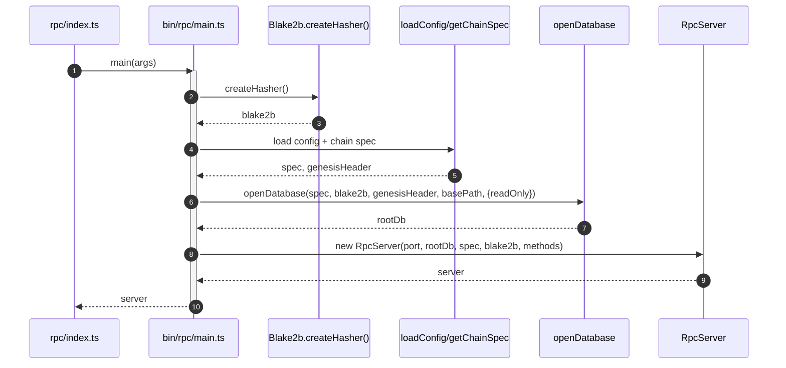
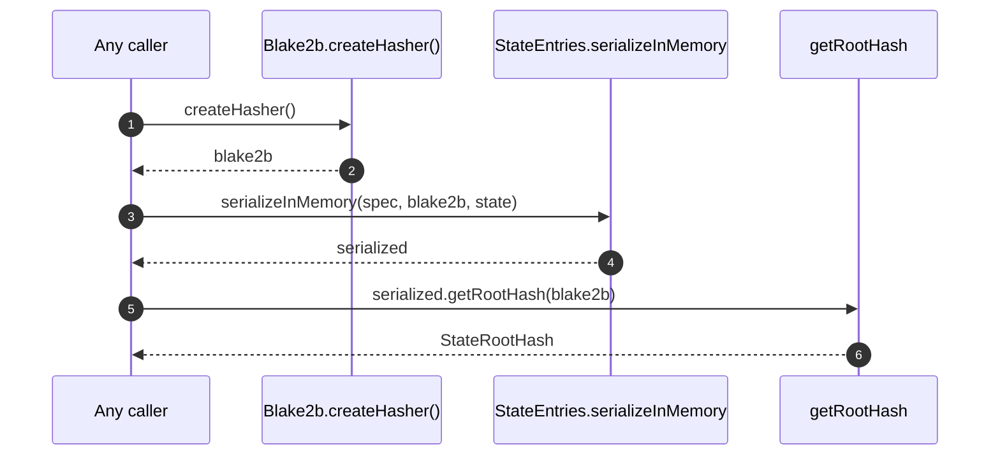

# Use `blake2b` from `hash-wasm`

## Pull Request by @tomusdrw

Closes #276 
Closes #212 

Significantly faster.


## Comment by @coderabbitai[bot]

<!-- This is an auto-generated comment: summarize by coderabbit.ai -->
<!-- This is an auto-generated comment: skip review by coderabbit.ai -->

> [!IMPORTANT]
> ## Review skipped
> 
> Auto incremental reviews are disabled on this repository.
> 
> Please check the settings in the CodeRabbit UI or the `.coderabbit.yaml` file in this repository. To trigger a single review, invoke the `@coderabbitai review` command.
> 
> You can disable this status message by setting the `reviews.review_status` to `false` in the CodeRabbit configuration file.

<!-- end of auto-generated comment: skip review by coderabbit.ai -->

<!-- walkthrough_start -->

<details>
<summary>📝 Walkthrough</summary>

<!-- This is an auto-generated comment: release notes by coderabbit.ai -->

## Summary by CodeRabbit

- New Features
  - Standardized Blake2b hashing across node, RPC, tools, and workers for consistent performance.
  - New RPC entry point with graceful shutdown and clearer startup flow.

- Bug Fixes
  - Corrected work report reference in report verification, improving stability.

- Refactor
  - Reworked hashing to use injected hasher instances; removed legacy allocator paths.
  - Updated CLI/convert flows to async patterns; unified hashing through pipelines.

- Chores
  - Dependency updates and type additions.

- Tests
  - Broad test suite updates to new hashing and async initialization.

<!-- end of auto-generated comment: release notes by coderabbit.ai -->
## Walkthrough
Replaces the old hashing allocator pattern with an injected Blake2b class across the codebase. Removes allocator module, adds Blake2b factory usage, and threads a Blake2b instance through state merkleization, transitions, database, workers, CLI tools, and tests. Splits RPC entry into a new async main. Adjusts several public signatures to accept Blake2b.

## Changes
| Cohort / File(s) | Summary |
| --- | --- |
| **Hash API overhaul**<br>`packages/core/hash/blake2b.ts`, `packages/core/hash/index.ts`, `packages/core/hash/index.test.ts`, `packages/core/hash/package.json`, `packages/core/hash/allocator.ts` | Introduces class Blake2b with async factory and instance methods; removes allocator module and blake2b function exports; updates re-exports; drops blake2b deps/types; adapts tests. |
| **Crypto key derivation**<br>`packages/core/crypto/key-derivation.ts`, `packages/core/crypto/key-derivation.test.ts` | Secret key derivation functions now take Blake2b instance; remove SimpleAllocator; update tests to create and pass hasher. |
| **State merkleization pipeline**<br>`packages/jam/state-merkleization/{state-entries.ts,serialized-state.ts,serialize.ts,serialize-state-update.ts,loader.ts,keys.ts}`, `packages/jam/state-merkleization/*.{test.ts}` | Thread Blake2b through serialization/deserialization, root hash, service key codecs; adjust signatures and tests accordingly; replace WithHash-based paths where applicable. |
| **Trie hasher factory**<br>`packages/core/trie/{hasher.ts,trie.test.ts}` | Replace exported constant trie hasher with getBlake2bTrieHasher(hasher) factory; adapt tests. |
| **LMDB states and DB**<br>`packages/jam/database-lmdb/{states.ts,states.test.ts}`, `packages/jam/database/{leaf-db.ts,leaf-db.test.ts,blocks.test.ts}`, `packages/jam/database/states.ts` | LmdbStates now takes Blake2b; root computations and serialization require hasher; LeafDb.getStateRoot(blake2b); tests initialize Blake2b and factory trie hasher. |
| **Transition core modules**<br>`packages/jam/transition/{hasher.ts,hasher.test.ts,chain-stf.ts}`, `packages/jam/transition/index.ts` | TransitionHasher now takes Blake2b (replacing allocator); update internal hashing calls; remove WorkPackageExecutor export. |
| **Accumulate & DeferredTransfers**<br>`packages/jam/transition/accumulate/{accumulate.ts,accumulate-utils.ts,deferred-transfers.ts}`, `packages/jam/transition/accumulate/*.{test.ts}` | Inject Blake2b into constructors and helpers; pass through to externalities/shuffling; update tests. |
| **Reports**<br>`packages/jam/transition/reports/{reports.ts,guarantor-assignment.ts,verify-contextual.ts,test.utils.ts,verify-credentials.test.ts,guarantor-assignment.test.ts}` | Reports constructor gains Blake2b; workReportHashes now takes hasher; generateCoreAssignment requires hasher; remove WithHash usage; tests updated. |
| **Assurances**<br>`packages/jam/transition/{assurances.ts,assurances.test.ts}`, `packages/jam/state/assurances.ts` | Assurances constructor takes Blake2b; payload hashing uses injected hasher; AvailabilityAssignment stores raw WorkReport (no WithHash); tests adapted. |
| **Disputes**<br>`packages/jam/transition/disputes/{disputes.ts,disputes.test.ts,disputes.test.data*.ts}`, `packages/jam/transition/disputes/package.json` | Disputes constructor takes Blake2b; compute workReport hash via Encoder+hasher in getClearedCoreAssignment; improved error messages; add test data modules; add numbers dep; tests reworked. |
| **Preimages**<br>`packages/jam/transition/{preimages.ts,preimages.test.ts}` | Inject Blake2b into Preimages; replace module-level hashing; tests updated. |
| **Safrole**<br>`packages/jam/safrole/{safrole.ts,safrole.test.ts}` | Safrole constructor now includes Blake2b; internal hashing via instance; tests updated. |
| **Shuffling**<br>`packages/core/shuffling/{shuffling.ts,shuffling.test.ts}`, `bin/test-runner/w3f/shuffling.ts` | fisherYatesShuffle now requires Blake2b; propagate to callers and tests. |
| **Test runner (W3F and state-transition)**<br>`bin/test-runner/**/{*.ts}` | Create Blake2b in setups; pass to Accumulate, Assurances, Disputes, Reports, Preimages; update state loading and root hash calls. |
| **CLI convert tool**<br>`bin/convert/{main.ts,types.ts}` | Make main/load async; create Blake2b and pass through processOutput and run signatures; thread hasher in state conversions. |
| **RPC entrypoint refactor**<br>`bin/rpc/{index.ts,main.ts,src/server.ts,test/e2e.ts}`, `bin/ipc2rpc/rpc.ts` | Move startup into new async main.ts; RpcServer takes Blake2b; jam_getBalance async creates hasher; tests updated. |
| **Node process and DB open/init**<br>`packages/jam/node/{main.ts,main-importer.ts,common.ts}`, `packages/workers/{block-generator/index.ts,importer/index.ts}` | Create Blake2b at startup; pass to openDatabase/initializeDatabase, LmdbStates, TransitionHasher, Generator; adjust signatures. |
| **Workers**<br>`packages/workers/block-generator/{generator.ts,index.ts}`, `packages/workers/importer/index.ts` | Generator constructor adds Blake2b; TransitionHasher created with Blake2b; remove allocator usage. |
| **Benchmarks**<br>`benchmarks/hash/blake2b.ts`, `benchmarks/package.json` | Switch benchmarks to Blake2b class and blake2b npm dep; rename entries; update per-iteration hashing. |
| **Misc**<br>`packages/extensions/ipc/index.ts`, `packages/jam/state-json/{availability-assignment.ts,dump.test.ts}`, `packages/jam/jam-host-calls/lookup.test.ts`, `bin/jam/index.ts`, `bin/test-runner/w3f/{accumulate.ts,assurances.ts,disputes.ts,preimages.ts,reports.ts,safrole.ts,trie.ts}`, `packages/jam/jamnp-s/{network.ts,protocol/*.test.ts,tasks/{sync.ts,sync.test.ts}}` | Remove conditional hashing in extension; pass Blake2b through various tests/tools; jam CLI prepares hasher; sync task API gains hasher; various tests initialize/await hasher. |
| **Root package.json updates**<br>`package.json`, `benchmarks/package.json` | Add @types/blake2b in root devDeps; add blake2b and @types/blake2b in benchmarks. |

## Sequence Diagram(s)




## Estimated code review effort
🎯 5 (Critical) | ⏱️ ~120 minutes

## Possibly related PRs
- #688: Also modifies the hash allocator module; this PR removes it entirely and replaces usage with Blake2b injection.
- #574: Touches StateEntries/SerializedState APIs; this PR further changes those to accept a Blake2b instance.
- #646: Modifies chain-stf wiring; this PR updates constructor signatures across Safrole/Reports/Assurances/Disputes and their usage in chain-stf.

## Suggested reviewers
- mateuszsikora
- skoszuta

## Poem
> A hare with a hash in its paws,  
> Hops past allocators and laws.  
> “Bring me a Blake, v2b I’ll take—  
> Create me, then pass me along for each bake.”  
> Roots sprout quick, reports realigned—  
> The burrow hums, dependencies signed. 🐇🔗

</details>

<!-- walkthrough_end -->

<!-- pre_merge_checks_walkthrough_start -->

## Pre-merge checks and finishing touches
<details>
<summary>❌ Failed checks (2 warnings)</summary>

|         Check name         | Status     | Explanation                                                                                                                                                                                                                                                                                                                                                                                                                                                                                                                                                                                                                                                                                                       | Resolution                                                                                                                                                                                                                                                                                                                                            |
| :------------------------: | :--------- | :---------------------------------------------------------------------------------------------------------------------------------------------------------------------------------------------------------------------------------------------------------------------------------------------------------------------------------------------------------------------------------------------------------------------------------------------------------------------------------------------------------------------------------------------------------------------------------------------------------------------------------------------------------------------------------------------------------------- | :---------------------------------------------------------------------------------------------------------------------------------------------------------------------------------------------------------------------------------------------------------------------------------------------------------------------------------------------------- |
|     Linked Issues Check    | ⚠️ Warning | The changes migrate the codebase to a Blake2b class backed by hash-wasm and update many call sites and benchmarks to use it, which partially aligns with the linked issues' intent to use hash-wasm and assess performance. However the patch does not implement an explicit batch-hashing API or refactor callers to use a batch interface requested in #276, nor does it include a benchmark comparison between the Rust blake2b crate and hash-wasm as requested in #212; instead it standardizes on the hash-wasm implementation. Because the core coding requirements of adding batch-hashing and performing the cross-implementation benchmark are not fulfilled, the linked-issues objectives are not met. | To comply, add or expose a batch-hashing API in the Blake2b implementation and refactor hot call sites to use it (or document why batching is unnecessary), and include a dedicated benchmark comparing the Rust crate implementation to hash-wasm (or open explicit follow-up issues listing the remaining work and rationale if postponed).         |
| Out of Scope Changes Check | ⚠️ Warning | The changeset includes numerous wide-reaching API and implementation changes beyond switching the hasher implementation and benchmarks, for example removal of the allocator module, deletion of packages/jam/transition/work-packages.ts, and many altered public constructor signatures and exported APIs across modules; these edits appear unrelated to the linked issues' scope of moving to hash-wasm and benchmarking. Such large unrelated removals and public API breaks increase review risk and are out of scope for the stated objectives.                                                                                                                                                            | Split this PR: isolate the hasher implementation and benchmark changes into one focused PR, revert or move unrelated large removals and public API changes into separate PRs with their own rationale and changelogs, and provide explicit migration notes for any unavoidable breaking changes so reviewers can evaluate each concern independently. |

</details>
<details>
<summary>✅ Passed checks (3 passed)</summary>

|     Check name     | Status   | Explanation                                                                                                                                                                                                                                                                                                                                                                                                                           |
| :----------------: | :------- | :------------------------------------------------------------------------------------------------------------------------------------------------------------------------------------------------------------------------------------------------------------------------------------------------------------------------------------------------------------------------------------------------------------------------------------ |
|     Title Check    | ✅ Passed | The title "Use `blake2b` from `hash-wasm`" is concise and directly reflects the primary change of switching the codebase to the hash-wasm blake2b implementation; it communicates the main intent clearly for a quick scan. It does not enumerate the large API and constructor refactors introduced, but that level of detail is not required in a short PR title. Overall the title is relevant and descriptive of the core change. |
|  Description Check | ✅ Passed | The PR description references the two linked issues and claims improved performance, which is related to the code changes that switch to the hash-wasm blake2b implementation and adjust benchmarks, so it is not off-topic. The description is minimal but still relevant to the changeset.                                                                                                                                          |
| Docstring Coverage | ✅ Passed | No functions found in the changes. Docstring coverage check skipped.                                                                                                                                                                                                                                                                                                                                                                  |

</details>

<!-- pre_merge_checks_walkthrough_end -->

<!-- tips_start -->

---


<sub>Comment `@coderabbitai help` to get the list of available commands and usage tips.</sub>

<!-- tips_end -->

<!-- internal state start -->


<!-- DwQgtGAEAqAWCWBnSTIEMB26CuAXA9mAOYCmGJATmriQCaQDG+Ats2bgFyQAOFk+AIwBWJBrngA3EsgEBPRvlqU0AgfFwA6NPEgQAfACgjoCEYDEZyAAUASpETZWaCrKPR1AGxJcAqohKQAAYCHmgA1iQATAKBkABmFCxBsGiIsGAA7qnMsZAGAHKOApRcAGwAnAAMkHk+NgAyXLC4uNyIHAD0HUTqsNgCGkzMHQBiHthxcbL1KogduLLcJMUULh3c2B4eHRXVtf4UXATM2Ii0FBk1BgDK+NgUDAECVBgMsEe0YCHhUQKQgEmEMGcpFwkGemDeXGY2iweWuuGopy4+CWsIMNhIEngJAylHa9jC+EQAC88GgADSQaE0U7ExDwQlUK4zYoefEACgw+HIkA8SBotAAlFcAMIUEjUOjoTiQSKVSIAVjAAEZKmB5dBlQAWDgKnVahUALSMABFpAwKPBuOJuRwDCKPETpJAzJEAOylUWO/zIV3KyLmSwAeWEonEUmQCSSfIwEXoSAc0nM7s9gBQCSAAWXwUjB1DeYNCEWijDQHgYm2o8G5kAIkCyiGYvPg4JcBigAEFaPQBHn0ik0vAMER7NhuNx8BRQYOa7AnoXfihmNwvGwMAibVh2bW0BJ8PB6P2EEOqZh5IOlKilGvIBJS9hndO0Lz8CjBRo25AMXE0GIJ5ASAAHvyg7DkwSg1vgkCnAEuCznW2RNi2siAJgEMi9mAh4gSW3AqPAfILO+UBihKNDoFgCb3hBNZUAwYQzqgGQTnR7ITvAPQYJK9BRo2tiQLQSDlog9Lcm+yb+pA6YAEJkG80IUHR3xFn83FBIpvyxBakpkfQgSHpk2SBB+0mvLAckKfOxbwEuK7sJW3KRokjawQENinKCwQWTEjBUKRmD0M5ySpOk9Y5IhVAuIRkBmjQFDMIOAQZLOzl8B5PzRLE7KaTQwqoPSRAYPAcTwAwmC4B48jfogMUzpggVpPpDaBJFACScSqZ5sS5WxBVFSVa7lfEqQxZSy61bW0F1cFBn8BgA2pOgYKJBkBw8Pg5VFVs75tmAhgGCYUBkPQ+BtWgeCEKQ5A+VKQyrjKvD8KGYiSM6cgKEoVCqOoWg6Poe3gFAcCoKgtWnQQxBkMoAoKKw7BcFQlwOE4LhgvIYHKJ9mjaLoO1GH9pgGMUJlmXMh4dGp0QaLg7QGAARHTBgWJA7bNeDl2cSOSPyMdjApEOSYfhio2PP5cFrQeQWUFBiBoKQda9At5CXJJnlfKkUpxI6GRcFZ46TsgiAZOo+YqeTAiUlYMskO2Wz4CVBAUJS1w6141uOnbf61sraV/H5kAABLttcfsAPrXM1hoAKIjeMyBPv4OFXQW3uQBQ2BrlZAQ6xOmh5FAxmyc4dHsJazrihxbC0FwNOHpLhuwfYzsBKWbvUBONNgqILDOjTdx8DXFA0wA3JA1cS3wdewDwlvoDb7sDx3Qzd6bkBCIgNORX7Y8oAV4ilvAxJ2VgbyYKQ+KDlVEpHW1pxYU+TvWVbs+t3wcR/qbGiHpJsg0Ig7IhIIlJm622foKSkXJLhoCyOoLCXslKDHFJKTeaRKDsmFL7EqWwsLv0/t/aQf9HQCGFBPO4oIQZP3tpFKwlAwDqEhlWLAmFjzHz5viXgmIqynAGtgoKX8f74IATPFu9tBTD3Ad5EizonxLAoDQmKh9ID9xvPAJ8pt2QByDqHcOEc0EYHoEMDYP8+JsWkKCE2BCNDwzlvXUctBJTsg0A4t8/FT64HZDTNQHEXA01ErjRm1s5EbmQLWAKSgGChB8vQ5A3NAK6yhn+DYIRir/nTuIfmUB8iQRidnOg6x+h8gYMk8QCwG75UROKZAzDSC0C2hHKqVl2ZoxTuwnE/5JjZy4BmOg8BHC03pttMARhCYF3knMHCtFLYaFXraXpNMGaWGZqzSGUpEZyS5m1SpaSmZdmQIrPiJBLwyWxPiU2AABSIGhlQaC1NpSAJyFhLDmKc85lyADMkUMwwgROff8QE6nHjuYsZYlA1gWkWNuXRtz7lAtWLIDoE53pYWLkclGVJsxYWco2ZwdwIXsiUF4Dc8Q1qaylK9cUYA0BdmgSJKxk8uSQHIKYtOT1uSlh5ifEgkUMlspYVRVO6c2DPh6AUv8TA1yJA8PETWw9uQDQvIdGS8hxRYmEhgWOELxTwsoFhacYywgTKmRgLavj5keACZEqiITRDhMPlEtqWTJxSniXkpJ7BoH8wyeQIwtTxDUmuooAISrsSXBIG0ycHSuk9LprM/pgzBwdFFVIScHRoSDkptTKNcymYswuks+gKznBrO5afIwUAPngRTVgVIsgTKJC5EiH5sT0CIGrQUuITKCUVvsY4m5kDtCggCuUzYoJuaOgpe2XRVhEiPCEiaagaARh4RIF2jQOVVU0ApfwdZzdtWgmbTW7kdxEDlUijYCOVh6jQ2hBCsgvNHi3SOHBGmo7aDtxur7H8BLpwBVPeelAOz8AQL3W8Wth7AFQPEMeZ947aCTtttIRAs6EQLq8Mu4UxRX7iigtwWxEHQLchoABTQH5moYBEGIKUsCFyDlrLwODQkQJcFo9OxAQY8AGPpQB9ADBHjWjVegSlG5WWmy4JR4sCc0BsGqr7HCQkHz9sglCjQTH4MWLTsuykptRJQEQ0+Z9WENacZsZxLgUGJ1Tvgzp5Dmd/2AZbTci0EjY6QFE38RR+DvY6PoDJn0KB+2wESNgIgk8aPmfo8eLEUjQssbY3gSKOmeBRawhgiVRmBRcESmQPZYFb4QuU2F4cOGKQJbo9F1oeA/3b13HGGlM4Ai7OXsCRw7AWpLmzvx/iG5tZisUNgYWznPLxEcpCwFKw1iHiog4McbXGHDjba8QT+F5DQXoLQe4WE8v0iHEazN/i6H2QtXBUJ1rAmbobdko6fAEn5MKW6xAJbIBO1Kbge4ARUt0C4IECtnUsDBDjQmyguBk0wjTbEQE4oK3IHtVDAQ5WxFVteHaGoecQ0Tm8EEKH8R230JPIOdkwJ8TtgoEQJra5ECUgnhiDwFtYJcHZBILgVVLRDmFAAXj0PYXATOiCCkMkjpmcQYofYx/D1tWPqydvx1wQnxPbpk5pZT6n7xIB04Z5zkCrP2eM/V4ZD8j2OLPcw29yuQQNusbK7gb7qk/vckTYDitIOOOXARBEPjFKOv0NZeJyTJQDB8+khhtHvuahBDm8yrApuYuuMQEsBgXARQpEHNcGPlJCtcDTmEcBGBKRQq4NcUcsS6DQEBSNKLquueCi4AAb2K8x97UFYyZ+Hjnh7+fztF6WMPAAvrz3Q/PBdB5qIEUPBKI/m/ZNH0QceE8YCT6IDTnkROeRT3OtPDeANZ5rIC3PreHW0HbyQEvJWy/q6rzX+Ddf0+N830sbfU3d/767zr719SoaNMDS0kNGGZR+zYrAGZJb8YPF40bcAd5hAVEA007QM0/Fs0IYro81HBVlTsNk7sPwfBsN2YAorskkNt9MxcsA8p9cXtCU+Bm4HsfArArAgwbBoAI4TRg5oAABNKwCOa4KiQcMJbAcCJ8erAbL3EgQXFONOR3LjHjKmZXCfBgZfBESkFEDcefDzbeC+DdbmcfZPPiOdWQ60ehN8GABAZAWjHCIgSUIJfzO4ILQRM/ISBRPyLwCgZAdkDlIgDQQBRADCIKVwsAJFaQTwxIfAXAdwtITwqqSUTwoQK0LUTwttYkYkMANgISS2TwthMAEImgJIokAI1Ig/JtMAaI2I+I6WUgSkAQhgFdd5ClGCOCWcDwaRTHebbHLIkYRyAAaRIFkFvDZB4GdQYFyJ/G1SwBimYFtV82QFOGngni/TgmYB6y8BRRiT8h3QMOcAkwELxCoh/DEKTiUjTwwKhhUjULnw50lGFFrAOKkK2N+EpCyK00/H2VCD6zIOo0oA4glWSyCUggOGUT5APg3A6Bmyom81q3pRaQayJxJ04CDygHhElAjjFSOQ0E+L3mJBIBI06WmORjEWSylAngkPUNNiuPXBIFXWUKvlxMOOuPfD52hJoFhLV2kARK1SRJRIwDRInFkFQw0BBBsBfFwCQVgFQREMHCqylHmk5IEO5P8L5PcyUlEipMJKaJYFaPaNLFGMKNe12KlBo1SBkAGwy0w3IDoClHH3lJaLaI6N/kkIUKUgJOONlN72uEZO+LoGpI5W4hdNpJLhs0q3wGqxxLOKtMuMKU9OJPXVJP9KDKORuM7CEDcilCzknCogmifChTABlXkBc0XEbXZHjNBGryhX629kpHURDjDkjkgE70gAcRXUpHFCFnRTgjYSxEPRvDvEzla0nEAT5HyiwhxICl2XzLGNlmIXK2o0SFWwYCwj5R9QCAzI6PvFjinHbP7Qzi2jgGkACBQIUC2DDGegGgHAF0sNwOPBwlgneJnAQXoCfAzPPgRFeEqICwsICkRO+MPj+KChyzzUJLAARVvAJUdCFU7JiiS3w3FUlU419kKz2QOVeGRQ2PhRAmPVxh21NT21VQOwCCO2WJO2iQAgLwuy6MSQKVdVSVQNLQENgEUBKSIMNw1ON0CD5Ut1+wwGAIwFtzAIeQd0cNwvO1yUIqy2Ox0MGxYER173orTlp0kKnxhFn3ONT3rwz3Xy0M6w53L0gDZ2sCizNwMWAEv3Xz0EHh7wIBEqgDEowAkpjyksT3ULkt0oyA3zkPoWPyHADOiEX0UPUtg2Yy0rwB0rXzsv0p1ygBGHwKorKXVJwzr0CEaNNOVLZEYqAP+yTShQgKpgyihxyWwIKUwoiWpW4mMqCFFSqiOJoAVOYCVPNLUrJNj0gHj2kvUKyK4GgBMRdI10gGryrPLMMvwHysCEKt3RNMVLNJVMqrOMspnzxIXwLOtOKrRyaqqharUvZ3aocU6vuxFGbhSNoSnioG9z4DewcMyo7hSCbIoBOMgnFA1jDGBMuFSiUliH4P7z50CHdLhPpOfP3mZNZJcHDOuNiB2iCBerpIgPeuRNRJIHRPZMtIuOiBtOyh7xMsBs9IZMtCZLBohp+sJLfC5J5KlJ510HZ2esJI9PhJBs+vBrZPDPxJmqxvFJxqCmlN+B50hKCGisGtiotPUJ/k0F+vxpZoGrKqGrZEpqXxrBMQRMxvhoBsdI+toBdI0DdKJteo5sOO8MQDxv+ueuluRNlsJPlsckRqOWFsLIjOkCZuIyXJnjNWrE5G5C8O4t3yLSbkmB3OPHuRAjVq4GZsCBzLauhrNn9kDhLK0XLKEsbBpgBSWFG1hUPCHj+oJp9rzMBSmsDOLM0TLIrJUnDqhSjrfLSFjq9TqV9T0X9SaSxA/1DW/1/3/xjQJjjStAYEiAoG4AYA6CbtKKpigPphgMWXgI5iQO5hQPu0FnuLjItu5mXhxIzJUgjuhTGyCham63HJFKAzMLrWQF5loBjFmz/CEAk2DhBEklLAhDRwCkkwovjC9JF0AQhXUHERMIWkUQi2Topgc0QTHgFPQ1Rylh3SonGwCjgrTlBAiFkEijXKaSKu5gCn/KSXBxhGQAyCoDHDjMrQ0pYCQASnlifJWPAfHFVQ3Psk5163kLBFh043FD5GdGrH/pXpA04VRgQShn7m2z8RQpyrQuCUOytSwvNRwrwv4Eu26JuxIvu2agto2S4CAPrsbubtbubrTQBFDpHhnpzpjsFKXOQGvLXUvlO2XnZEOubWYAEDWiaXLgCDMWTk9k8huKsEEfbCsGahHAoG/EeC4DpV2XStoF4uu2Itgq7EdT4HB2zDoGHmKGOqrD4G5l3uYH3oEMPtCDvMdpkHK0ILCtOwCg8apHIsotge+SwYFS3CqNsMlmH2x1QDhxoYPVOB8WfyLregDWaWDQrvDX4kjT6QgAGVruYqiY6HPEAkgP/27pzV7vzWRgHt5mLQFjuJ/ClH4nFDED9qlnGPlgzLCW1O1jEfGfViG2Xkse9mHifEURvOPoq1fqhifpc3gQkT5JQVXSOMnAyW4Ny21M1MgjYQThIBFG5CKiICs0ijeecA+a+bYis1CoN3CswMgg2P2VIWfr+AepKEUbxyJwJzBNl2FEBCRaIBRZl3YDl2E1hZuKVL2UtF/Ox2Sywwiv8kggmgCk0ZCLvK4B/JIAjloEVAVGVHKAdIc1wCVPHxIDoC0BYxwgAEd7xUEXLCFIpPnusJUDNLgjd2Cd4viPqFnP7MNRVvmEt9luHqxfYtTrDb7YIHzgtXnayAXpXvnfmkKPwPUAhIG4IPGvGklsqbU6xKANzNn4wUGsh5BYJqB0BnaxBIdCNnjWU7GHGHAnHpnlc6VDriL5AUmwXkBpj+Iio6BqnC6GkS739Gmv9mnulmBq72nY1mK26endE+mO6Bn5lYC2YoYRnC1B7JmhZNS4JBwYwAgRR6gHGjH/DGc0BuBBUkkcSnw8USBjCCVwUfkYoXiccsAU3NgOU9CAhGyOFk2YRMW1a6iw8e0tgG5wJ/BntB29HnBNthx8cas4oCo4oqpKQ9MmEgWiAtCyB6yMK50ex/BKQ+rU4npjwbBm6HSKBE1r7xZdEt6HtmoABxZqfIaANBTDQJqQapNA2ioExAC0K0XAVCIM+QccajKiclgKHMqUCtbdglFSPslpBd2Y99Pxy8iCbgMALwKQCVWjG9+psjAlDeuwmqUEf80wgIYFP8X2QCdQeB+WRpFUGsqZic12hswNZsiptesCiBXLKLDQUT4dLALkWKVlQYwcQ+E9cmpD7eXIxdfht4ExNhodgpX2KcjObeaBJEw+JvOCXZOVxgYuJk/WBEScUcbeSsoHVNVeZhk1K29hhTTh1Zth4YjJp1PinxzZTpWCbJ4zyKjHEp8XDdyXFSkCAAbQAF08bpwmLZGW7emAIQd7sbG+Lw3HbGq4INo6tIJHQ+Y+AocnNSPMuMBh4Qi/PB3oGClpiTOp3AIZ3WVqOAh2QmogvDVV5AhPMgSmuRCDgIwEt6lLQ5onMx2J3EUxVcO9w1walM3X9s2GnWk83MwI1C2M0a6gCy37cq3oCa2e72YG3kDNnUCSNOcetp0FYP99vVp8P/X7uZHHvTD/XDZyksMyJPwrARR7BKBE0NBIBmoISoALZ7DnQu2HHGtZdL3BwrJ+RD8sR+JjwlBvwh1Ix4ls4wF/V8gViQOFAMBNXx9e4+sVJ8ggwTQI5g4eeRh2wfB6hoBrgbjiJ76ryBsmGPx6h8AKUKlH37h5En7n0LW2IbkmWnNj5pxJCasQRaqrLRBIogxUQnMLzUzZp5BCsP2Agn6UQyAdMbfv65OAh+46fwJTHKQc16R17L5KAmenx9E8AZn321Zcx/Ap5YIF76Xd5DF/2GBAPE0atYkayeSTR/aoaqb31Efh02oz7FAIDJmegL57CFow5oPYObCwPJZawiAaIQ1NgBowknQ0OkfJYROgIiMoAMQDd2G4J4/E/JYjm7ytoavvHAe8O1wH0zGQrUAMn5pPsYRYg7OBD7g++AhVuh+11j6to8vgH8Qcf0BkWv3H3nwKUQIv3p97BrLQ+I/7eCpnLEegPJY+Q4hRBZAwkSACvAxGZjUmZWHXWHDDClwxi6nY4uAjBLikiOT3Zgq9RXVnRw+wS5kWTlIgIV2K5YBlupXB7sDlSo1ZE2xBQIMLiAxkdscSArFigLQFcBYM7HYAAPzb4UA9AT+E7n6nAg5sLu7SK7i0xu5tNACcaMtogAeAdBN+FAfps9yzSvd62iBAtB93ZSkUtkSgejrsjlQVtXguHZYrtQWZADPwAHegcz0ZxENhOEKKqKjnjCkInMvASQFpDTYeBqkehOfhxBCDOhvMt8WFkoVvKPB0KT/ZHih0paOdd4L5AlPayQDi176+rATtdQWbD8XGijeoMwFoACAXSv8bXuNUOJ+FcA6fM6pAFiHxDEhmUafDJQlap9/CGQlrI2lHK/d1Yf4DMvmWnrZ1gU0dIKBNh3x+Y6sLSawZeQhSDkOUSFFhuFzPKWpourrXhudn4YEVx+RSaAR+Glb6DfwfAfATRUpZdZ4g5nUHi3QEFrD6BaaZmv7lRxcBv2BgigHow4EYAig/vdbr+XqYUo0yKcNPgIC4DZCBAEpXACXksGkQLy1w5ITJTGoFDzhWkd4Zb0yYpdaA+IePsl3PqCx8AgoZmu2AFwIt9hswo4WGnpSnCHYvwt4ZfGuFpD0+9wuIY8J5IvCLhTSK4QCM+EWUaq+Q9QhYMJH/CuEk1FzASL+EYiAR+fYEVwFBFZNaAEIqEQYBqZZtWB53T/BwM6RcCi2vA0tjIy5odAogHKJ7l3Re5DM3uUg0Zusk+73YwGPtE8pPAwxztEmijBxOWyUCVdV4VEfUfblXhM8Ao5LekKRGnBqsl0woTcipGEGVVO0VZTIc6JZzoBwMc7VDJfxPivs/ByrH4tjm3DECV+oreAFzi9F9oAx1A9Bij0BixxWGCvGVipxuRCdLsiQIwvIi/QmIc+o4cnAgFmJsJVuWEIJlQD3Zc0jqO4cJqF3/59DPBLrbCnantpxIIB4w27PdltYF0fUfI+pmXVzZCjruoojpkAS5pgA+Ul0IQV+U5yYBrR9CacZKCY5y93ooguUeIIVGSDOYMglhCI0Xq9ZnQ1QpOl0MUbKN6hudSeK9FSwBifatYDguMHAj5kLmH4COCG10ThDn0LpUFsQVrBzMSAz0BaHS3cFNxzB6g1YocEUafjCS4ZYBuaUyFQS7EmfEWrBJVLWMsxMsUIW5xBJ8EwJ1UajJFwwrr5GcEoRsIRxa4rjAOQY50oSUpDnwAcP9eaAFCKj2FSEqLdgAG2qi69fYdoyAChLZCRRoybkcIVaK2phCgSvBZOHj3YCFjzOJYpHgGNE5/Jhws41VBhmpDY5uYfEwvn/12ygCtBTYnhi2L4bxcOxwjD8GCMorzDwWaWdHK2JIHVgEJNAUauSLqqHEtJueQkkqQABqpYNAaDlsmNpuuZ/HWohLJEG8Uh5xfFvSN4mC18QLpbyb5KK6W5MBY4kxBOLThTisiYAFSfOO5CLiaAy4ioiINSo9iX8LA/sUGnYFIjhRBbEcSW3mBpTJxlAfKSQGykvBcpzFLKTlKpSGpZRsyQZnAUVHbixmsgvcT9yXoaMBs80Hgi0kUS1CRs548bOggYaSJyI2/BJv6yfK+dc+QhGfISWgDtSepoDfzNox2ZmFAsk8LIsFIYxatg4V06TBkTumEkj+zXS4M+mxKYM4Iy8aXh2D3ZpCbCaQaGAYldYKsxJtLKXmPEYzigXSTwm5OOHmqElYZYiCaNjUlL01NMoDQ6RuGuZ7U1SFLCFlLEqJzhk4hzLRioTahYEFOpwB7I3FdjAJ7YqsfwF5moBK5dkB0ucT1Jxnhle0t9CINxnCA4yJWNxEjHEXJrIx/4tEFMTMIJSgzqWEfZeNqNnBFSAZR4PDGuDG51hZwR8BhlgjdhhAvJlU32ErPeh8kSwZYCsBuEigAB1LWfYAoqbBaAysW2GEGkgYhOOcZIJKnGyL/Sg+64bHNqP0TOAkA1YZGT5lRm8l0ZVjNwdo3tYrsqZyACnqdFNSRQvxb2dAGOHyTyJZZT/KiS6XQIRUas+LUmnnI1JG1pqVUOIBiAcDJyfSNxBdLOx9ksBgZBKNALCNIIjhuM8GNtBKm6kyzUOtfWmmjLSAM1ogws9RvxhjIXwqW28TguBCnpDYzxMKC8XWN0mACCJ/FHVmhWGEO0TJLqKAe6m5AkBSptTN/AKKaacDapt3Ytp0walVR0pGAKcRkBeRxAOgGxRwBbJlHpp1xCyTccsiVGNtVRH4TsMCNcH/FJsjaV6OUPHI5ZMybWeaZHUWmNDfYhPfwfvCwjthuM780IKRBHYqzKAKPKYZ9yBIYLywJwbBfgzXQ/t7YizWWCpF2QkKsFdiUkeSUxpUR6FmCshUwopGHEeZoIC5qcxIBczQE1NWifuNk7ntK0SnZsoolOalMBicEQ9v521FvzOFlsnoWF1Qr9CouAlfbNvLbFjC95EwpLhyO/ELDjMQQdhaQo/l5DXJ5xHmtOBSlxpxxTUigB0CfkvyVFH8h3ICECCWLGFTk5hecV4WwtLmb9ZBIcOEW/VAwx8vsaXUqmCjqpw4q+WKNvkBEXFbi5+a/KEhK87yKVL+f1PlGDStx/dFUaNOIxiLVpXrJzk6ScwZk3MPteBbPQaGAzlpVzd+oKEW7eZnQAURRFoPbDZKXgf3eEdQtWxRiqxgEUQHgHoSAUtULvPQYQ1mFmzZWQ2ehQMuPrK1zibCBarWFWWRt1l4ZLZTROjG30MZQC7ZP9ydwogmOmIEgBKm+m3LaifVUqITK9ZAkqxHnWsOArmgqyyxj0eTMQrWW5K3Bx9SkCm0KiyBgKqYj5ZC29E9Kt4PE4frH3oTbZzJJiqyfjJsn9K9lQK4ZX+BPEOKVhTixqRlOanuKsl2K6dPIzETigIx0PEGAJg9ysdcJksEeYQj9FDgsIFFJ3HBFWYGtkAiK5RAKATH6FMyFDLXhOHKS4Myew4Q6nVw2SeDcVcw7qKk25hYqclf3A5dDKOWnKoAojRtIewbR+Q68uyBpVUIGyNKVGHhHgDHDvqBCToeCvgFEOyJkAVA4HSjpcHhaWhta8yqhXirVLvJBwb8EgGEwnCsp5VuYoqpqOn7gMh0p2ZwXMtJkax7wQKrlTNXmBYzSmwbSZQKEpBP13V9ECgJeTYnXhawaqwZfSUDD1jNFjYkAUMKMkjDd5RFfeXIIsl5plVYLDFZFTLXrKNIBDX1Y6vnYzEAgpXZxSStcVkrtS6q+krgJPEbIuIQ2QIJqpIAtVYgtYRdVDUOWhE/aeNdkDSuwCRjnQTAVYNIClXrZBGiq0xdZMziDrVssxKHFhECDdrclgQWiRpxcJBBF5awXuQuMnXlqIC83DNr2NO78iBxVUmUDVNabRpr5qUu+ekrJX8Ro8wfPJZ3QKUbiilf84aaUt3HlLxpB413FIupmkytBJoJAAYgfBKtnOBKV6PGvPbej+FK0oRU2lb6ioi1OLEtevJI2IbDEiq4Va0MuCHMKkK07sCjnVZ9qiGAYzjWRv5XrTHgTPRSbhi1YpFnpOUtSTmIMLlI2+tgvVXArNXJwLViClpXR1427TpyaYuHOBnXpbxZF1YHicpi6THgcSCGqTZTAzXchjuQG8qXEvLqXcIN3AqDSktHUPzSVmSthPUlPhrjUNP89DQgUw2JMh6MnB8GPTajLwpli2GrCs1CDWF9NS8w8AvVw1/cRcq9aRVZp1m2h5lCzT0cEvo1tLwlqCShOhInbdK4IQE45sEjzEANrwwyxyqLSqgkLsUVMD5NwA9KyBoA+APrYAxEJQteMCzX2NBH5X/Lxs/8AQIXygD5z76k6FEtCFPg0KYIrzbUkCRa0JMtBG2sLYerE2zDXGLSE7VtrwSbq0i26yKGtsMRPEKAs7aorUS5rjbScg24baNq+27p21xBd9HuxEmGJtw3GFgCmy0jpNCMTIDMp6soQZEwAGyaTtXNBDccPyM1IGUHMQDVgcmWAJlJ6wC6hMaxE4DTOVnIZcx5FM5AbE6pII/Ljy4oU7dpJ0kACTs+k2tc2LOw7z2xhizsTa1ebdEpRrYugF4RSQJtAd6rIhUoBoDkZkOPI5gcXRA3xLz5vmuqTfMC2PzMltZbOMhurZoa62GGkpXFrOUgLJeJMreMoKvAMB5A0mZ5vhpbRFa6GtqqUL0vXkQi9YPqg4cZo93iEBV8iR0UNl90bKS8y63WlkUpDGzKA4UzIcHu5l0bPIoSmgEItD1y0I9CiP3hQBj3CrgYyYoEheqDnFJkFFSh3fumU4yLStBBGgIOwsEewFMrmw1DEuA0VTvNQ4kUcktHFErYNY6jJS/OlhRgvAEWnbLW1zR91pBI07DR2Do6w9CttDSaRbvCW2rsc5zRPQIsY127ZMIsepmjs5VbxppEQz1Z4OuCtzxUFC6WROEe2odj9A+69TH0FX+yhs1+0/TYsN6bKtVW6gQCFEyFP61oS6QJWBj7QhK197S1Pdqq/15axyB4xQS0lNV8B55SQT9c0pNYjg786OkrSRGRVIUoSkuj1uyi4Cvj4ZUoQ6heu5g/7ZiYie8VwVWntYeprKRRIfr/gia0cL+iKaAY/1f79mbc2nP/odVsH7tn+7IB0vc1lSldLewcYkvb08DO9zFTXcFr719BJgW9IfQNMN0xbjdTbKfQoNgUJltR8BxsIgeXlTChNgEiGYvrp0r7vYSewRe0qUL7gA0aca4AoY1ggQ5qVMS/b4LInLDwljBEwo4YmCXUAS+28GQvtnCkFwhzEoqlJLXDsr2Is2IbEVG8O+GnDKGQcAYmKLdZuAsgTIQkdCM+Gf4fhxQ0uipqpG8A6Rn7pkZ8SVrV57O9eQZN0X1qedBiptUYpbVoqcDna43DkcoB5HpABRy6uyDd7bw0jQZFEFkYC5YFbG9jZXKu0PQDQujFAHo4gD6MpGMAwx4uKMaENN7PNbAhJeBqSVSH6psh8dZkrpLKHClqhsfcqJN3d8Et23A9fM1NgHTsQOM7Q6CFwW0Bq0EmJJCCEEI5lkAB9TyE8esOL7fY0U5yNrMcwP0t4FhuBMAdq2dL7dQJQdKal32L6B5uAFzECZxnGbGkmJJuUhr9pYm99oIezgKnPh2HdpQJ1w9HPJlNJyoZYlBqkWKjNwzwS5V3WPGM1o02SQJr3Tu19gOBltJAUVuxKyKt0eSQMskCdhpZYSMgA0QQF8nIDixwlKPYetMy31asmy1Mn2uPUBMlwXjmdAw3SQvH4LV47cXBSaqS2QAAT3sIk4voo4KLsGk3APtPvN1KRXjijLOgtJy1BR146iqtXpNqOc7DJ3O/RXG2bVdjD5Wx0Q15vEN7HJD/mjprqn1S46zK+uqLRcfe4T6JmmhkUhEKUASAzQ0FG3Uo2SpkxPIZp+WImhVQjwAAes8g0AvJ24WpcZKQEmQpnKQacd6HsgLP7J5UMFeknYOk35bnQ++a4Bh2tDX5gBgwk7NqOCNum+QSEGlCQiLSTlAGDnK3YcgHNcp/CoRmzqMIzHuEwOWCYNaTsdWxxA2Qqv09UfNQc7pzwZ8AU0aEaTDtMmIQs32eLNu5IqM9R5B1HGNwRAg+Zt8yoInLSBYg/gHdtzECBJnWzBqDKDMed2zB2AgGkQ3UxjNgb82kGgAomZ/B6pT4wBcUPGhcDWh8AHQYBt+S1Sks3NXNM4wbtH2ZmsN2Z24i23oAnjuYumYBBKnvjLhH4QiP8LgrqV76LQRIZNkOitCzEuaEBVHhUvo6HaPBMJ34FYcY22imDCiF8GEDVTMzrCcKtE5Cz3ZMsWWbLDlly3FA8s2iKeCi8y1ZYKh2W5QMfsVCVLmWSWJAQ+hW3sL643gxlgQg5Y14WWXL70RAO5dgB2WGARLN4iqbS7qmuLLschH+B9rIK/d60pFW5sgBPbNSJiM8kyximyA5g/gOgKqQDECWzDZM0kv/RiuojW5b/X9sOAMvWWOWNyPy3iECuI8MqgjYBsS1eHmoV+5C/yHmJKg+gUe0rH7rK01iCkKNNSkwyEclg8TyGmIZ5VWIcC0JkAfKYeN1zDXNwvSlOmaECXoPMqAmLMmvrzBn1lWUeEcVYH+Ax3Hg9W7W2TJOHNT47+AyUQ2BH0J3sp5dVRtnTecDN3n6jIZ/xo+cS6tGgRl6jo1wC5SZVhdfDeNpevgbutHatg9kFykdaHU6jaFXEJhjBVptaA0qAEVWL+MdAuhMNzDBSknlQxxoEfQq7uZvIxy2oUVni/TIv3cjeRzetC7sYwt+asLRgaC9IHwskBCLYKEi2RZ/KGc+pw+iQUbvH0MXNkqpoZdyG5ZNwyrjMqUHQEMvlAyYRqty72ER7cswAbVoWwSkc29ngLsgGhKRjDAUZadMmpdrAJ3ZWSKkmzRFrldoCdleLp1GrKOxDRJzQQtNumXPCoh8s6AQsmrHSkTlDoUe33UNq8XWv2A64xsIbEAjngfweEuCX+G6KojcI0gvCPBKnZX7Dd5bLtnbSj2CtZX2rlFjAfgVGImRXrAXdFdxJPMnUtouqi2gqxUg5ldZkkiFN7bKvsElyDJ75UeKWDSdhuq5/lAEE7v52uhDdyAFyk3I0ZWrbREu/Im65RJ2urYmQG0W5DqncAjELWyZZ1vz29b2Od7XiG2xkUgbttkG8zRIzLDixOFy2HMCPW83QUxF0i20XIskthbd2YPL3n0tWWbLnl0y5DX5bG4lSDpAO37Tcoyl8Dv9oy6IBMugP6AejeOXuSAdcAQHQD52/TYglj3MHlVXZNg7nioIoRX9qAEywasa3cAHl2B15baL+3gHbReBxKwgeM0RM6tgK72H/vwPpjSDhNig8gBoOwH8d5+Lnlpld3PReDkRy7cIciMNmsg/KgnT9qOwJHODjOkNk9MILvTedYeP9VvFJ1q8GZFR0kDUdNKLxQ8IwP6bXlAkUbsXEXfhTDMtH7sra4G5+boo/2Vb/93lo7dQf0P0H4DgllA7cdUPcA8Dxilzfvuo4+bz9wWxRY/uGRT759JxwgKCCkPWHgV9xzQ88d8PvHYDqKVYxYeuW2HFD2ABw6AchPb7eFh+xE4IAv3jbB9qi4gCYEebozOx1XfsYTOc2yn3Nip6TEEcUIRbKhui//J3ETMwGmA0JzzYvGvzjruA4HRKm5hidfrnjOx7dhsI5higmWRDgKwewx5CozJrYLIDtBQACDIwl7c4wCB8kfbz8S9iYvBrWhZAuNLgCbzQDCnTZ/YDuOs4iuRQjnDtXlcgHweXPG4t0LCOc7KuFiW+NzhYLjSaS99czCQaQJPCYCZHTsqdUshHBRiGJzmydjQMiUSCR75oazrABs+Q6HObHjATLcgAtikALn1CgF66kutTwqkgiemQ0VnE0AiAsgURbPIYzM0qRWkIwk8H8Pt8IU5YY9WuFNlZFmaF6jovuErDHga4iAKhBQApcBB2c1QYvdUrQVzK+X3L9++iMPZKuBS24chE3AP3TwV+Bq8V3znBd3P6aJxFIKCF9mSIRwPYVYGgELSWj7gZcUEHy6Y21RHnzzq1RwXBy4tGAHr9gHySZ4abxCWBcYrbOjeyw5+AEFILGVoAviSXTy68CHdNRUvYrY1mWusQiF/PqFrz/F00lzvy6uUFp2JITabhGarzH1/bLeZ0VbyGjoZwRgDbGmUBTnpboJnRWBcu3SnLZzp+E+6dTP6nUwsl926Q4fZC3E4Ad7haHcEWR3LtqrkRAneEuPsSr7NxQDnd33xnS7zByu5qoENnl67pJx7aHRbud35T4d0FEmfLuSpCuxp6heaeXcf8QWdXWM66e3v34fT84wM9i0aGmLI9dTXBlGV0H3yDm+WIHzJeK36A4bMOyXoWiHUMtQRu18khKhtAP54QxRPdOvTcUfMdOlkdTz7gQfnCkzXOz5z8ilhD59ktCp/AIRy4cEP8JnoeHhBc5XO65F6U0mYsooj1kqje/0XpYeCiPTDimPR8EBy4LmTHnwiEtY9q4tsOGyAwVuKpJJnG9seQCyKAMMat4tYARQtA1ZsQXsSpym5balYgFPdL22dti8IDjYLrykyFqilvWtT0O9vYuolcgDWebkc23zPTqtcm32MfVitURCIVEcLakbU5wzhjuzgzyrd48JnY0vOZk7Ts5SAvLqFLy5AhiWbT5j0ghRsOAiySPUHbDNEI4xYX2M1BeNU3aTlM9hM2XbbxQFmE9nwZhLMYjW7xub5Etta3iy2puT9RVYt3BNNIJot9acER+k51lNX8cngNQnJYV6MDurCFEVBeL7x5Eg3ASbQBJsJzbY4JAPZDuDezmZTpL7UrB6ZhTGV+Cp8IVriHDZTCAGX50P8RJ0nUlEV5JL+YiW2lU2P/RcSVRw5Erz63EXSx0GZ+sPmlnZknM8bgdD7bNG19ldh07CeLvv3ie8QlxTwpQiMegjTT+ipQL5UMQZbhZ7R5VnJeU73aBxTuD/DcwpPPCBj8AD9jTtDo8+pSHyT0CoYfXa0oTwEBZHM0cfPbvH0FOk9E+V0AXb8LuAiZtQKfGd5O/wjuGJef4yXyAAAB8Ur1GAAByE4qAWR0TwID5Kc+IrPPkKnJ65zGkIJl37nIL9J8i/ZPQUD70OEN8oCK8sLLX2D48mVhW0H6NkoCPifVawloR1BFQMcjoNYWOGiO+sB1e4GeUFVl2jKsEbhfpmzNSdK8LP0LL7YiD+P0SNoDXD+4XAcr2PFuYuZY/56id9H48HUqhT+66HjfDi+r7tP8JqiPKZhCw8nVUZ592fNfdV0O97Twd3D95ukwKulMMWr+9ovDNBnWZqW7cfdPcxN3Xd7ibqXljanRfnkfZuctYtz/LDcJ737cxmmXAeJFFH0oq3VcdfXTVGUz4p4qFOZxxzHW5Qs1vAo1HBk5y8vT4XBqvUFyJebU95d1CKjOLbSzeL+e2sUmXVDND/BZHotup3LWgIpJWiT+xam8ZQeSyrxxTwsmFEg42X0uYjkeQTEmL52iioOwQU9xqCAT+49mqTDwm5JtbVgLmNhxqebvpp6VepJGNwR2jLgnZ1uDYo26by1jsZK86zRvzrEukNuLqTudeLgE4OKkJ+43uaQAaJ9Mq8Km6cBRSBLpPYxBEbhcAfJFhCaexAQNhzqijHz6S+GDnPCZCqgUtqo+kAF85QwUNs46q4zvu76UUnvsno2GigcnA6osPnu63uPfqIGPuKFqfKgarNhfKYWNdAIHw+QgT379+6Zv+7qGgCjca4+GOGxZd2/ATYFfu3gRWyVcbhoQpV2y8Blxx29KCsTR40bBjjI+bWAABUTGgrKqOGgGWaWGpppkKjs2AU0h20WZBjjZBmdPkHvwRQTMpRiqaoVRNYpfFCxaWSAcnCTcKPK0T8ydEEbKNCHXKW51+L1nzBvWyFAwFfWTbswENqrAU+abIegdwHG4PTn+CJBSQFBYRBggbADCBMQfU5cONXs7qECdklUF5Bd7ge6mmBlDcTzBKNiDbtQ3sLEAY4JXJ4Fd+dgdEEO4ygSpAHBjaNkF4u5qscG1Ba8AZRUQHwVkEemNQYnpnBTUI37OBKuj5qtOHNgYCPBEzlzZtm0yGIJ+Bg/gB6AKXPiNzNaFtqy7Wc9pjD6DujLLcqrE6pqSbACRZvIDuI5ZjcgDotyuzD5mtyiiC3Qk5nsiLePUsgBGOP5t7Dtw4QR362BQgUiEGoKPNPYl0m5EGohqfAOKGCmz/FjYzQsqIbbW6VvID6o2sNoS6AIF5lhCMhjoNwC3Q2UknRu0Q4Al7kh6ALeB4QuEIti/e4wQD7fWzbnj6NqswXIJAWSoQsEfYpsLEAqQG5v2bSaJuOsFeBmwUKEpmsTlFCvmioQqiuhH6qWbuhijIBZhh3oQFxrB/IZEEBhHTsiEYADTk4FncLgS07xmcIQiFpA/hlvRCCyRiBC9+VUDRZohQ0gEFlKuqoh4U2WoXGHFmEauISP+VEk5iKIPEhJa7Sa3mbodwAeKpY7+unitITWbpqTJs+yuJpj06Q3gMTpW7hhLwg6UdrWDzGixssa7acAeEISSbpofqMSjXJGKRGkATEb6Y8RkgC5GSRoWFLohWGUZZiYxkuEnh3RmeGFGrKtIRFY6xhUacokEDPYKYeYoNz7muFGbb0AyJuITFAsgBvZywYyoUxFWWggWGFGSyizpjB1aowGgCein9Yg+z5srjT2IXpBBWOYAiS4OhANnsiy6QqozaK6TftmEwhuYR4F+hvNtBHOGQ4MWGFhpYb4Ej66IdWGT61gJMbNQXAMuEPhARsX60qjrrJYgSS3HuFeuu1lcQIAAuApK/ICmp6pnkT4Ufyoir4VkZ5aNAUfYQSh4KNqFAhjJQAOkwpgkzoq2clNqggrKhr5XhoxiJjJ2wABHCwcNgEGBWAjBMHCSQjBLQTXAegHexkARADTjIi2ka7aUBp2NcKOEGRuy68gHkbBAiIsER0aBGbQTTpWBR/o3aNoWPgsEtk4wG2SNoOpnpqpeXpnPQtK6qAlr0AuCimTXCs/iEr0BCERMFMBOESwH/W4Zqipn27RjIEh4d4QsY8RXgMADQATPs4AQS0AIVxmRmRhZE/wVkTZF2RDkU5EuRegHb7dRBXFe4Lu1ESWF0RNEUoa4CPitxH5GyRiQBtRTPjk7G0nUY1Q9RIxn1HS+0gINHQAtkfZGORzkawTjRu0VNG1R8TgZG0UH2BpH4AWkSsC6Ryao8CBR5Rvs6HRiAMdGnRI0RdGuR7kUOBeRJwj5HoCvoUmHhOC0SBD0RihoxE7BPik9EvROkSX4yQRRnSIi0Skf1FHR1kSdHDR50WNHAxnkazIoiTNPFHZwENm1jiM3HiPTJRlED7S3U6kIoyBABhoeCxAvZEnSMxLmB6ELqbMUFDTRnfnDG0RRAMLGLRY7o4EnyWYdCFt6l8gcbwhVEemrYgxpsVL5Kotr/JqGEttcZAe0zOEIZM6bqCCPGeppDIwAxsYvrmmH+CS5BS1pkpC2m3vhn5+Opsc8Ycmy7BEJBSJlmvxOYdsbXAUUEfIeDSsdsITLhCtGKTzsmyprcQUeRiHMyggE0GxaKaUPCSgW244cXokk55JfC1KSccBLnk5hMFhwQ8Hh+CtE+yP8bUOPQd7F7UldiMHE6dduEw3IVklaFlRNoZMGVR0wdVH2OYgSMJXBhgfj42xvwGXEDGJsS5gTRZsSZ7Q+U8FDEEWRpkwxUw7cQ7RXBp7kbHOx4So1TDxW/KPEIhk8RybTxksbEovusse4HXy68SXBKxMon35qx/TixFaxgHtLbOgS/oSYrxjqhbQ4kPcdEBlxijNpa7mk3DcgoKbYQtCvxdOo+B9hX9Nv5hAPYaf6AoXmIIzFRr8RBQgCjrpNzXKLHHfGLxu5lf7KIN/vaybSxeJrLFQk8EDDtey9I7pz6XCCpZdhfKJ85viICu/FD8YXvcBdubXrPIxRbpgSEqyjnouzpGrqkliV6aTBBEoJyiFp41aa/oAmYYtfoTxzKdJA6preG3j1q7oq/IOy6e52i0J+0x3uIlXS5fspIymA0CZYlwJnIMZ7w3ZJB71wAUAqyyq9jPXEBmjcRVHIRtjm241RaPpAISB7WHXhBSgQM/ECAfcZpiW4n8TNxMM83MriDgb/MerzqSQCeK1kI9CyGQWC8cCahGHMfLAuJsTLqbIJlAAtyUINiQ4mEurdC6oVwUMnsFABePkzEvx98bzGrB+QT4k7BqAKElqmKKPmpxJGJgklRJSSSGYpJfFPmRxWiTvmSBAZcZ1BsmQSY2AzcXIEoAIYAwL4l44TmKYz+QSdFDjIWUscrqt6EhnLFtOCsfyHUBqqJEg9MMjD4Fnxf7hfFXGV8Tr7FRDWBCgnRPgPkAig7YLQT0EyLsHTZa2UbACiInGNcKXJZZL7BWyvQKbL5kALK8YCszbCPRue7uCyh3KesrYbgQIIAlIpRFsHuGwBDrvQBzkTwGrBHQKDONiWctEG7bzKzyjClcAMKRVhw4HgD6waML3oIAaAb3o5Aox9hOyB5cbLJSAUpkAJUCUglQEVz06p4HcwAOZiRY4DCTcVYmjCqEfzBcgnqNvHM2u8XMn7x+MGM7dM1vGrBMcuIi1IpUp8Shrqx0WpcYAKNYbcSMQ8kKdj1AGYCaCSQM1EEjpWUUXxgxI+SLfQU2W/LPZ8Uiqgl4g0AeutbGaDwokK8m1Cuip8RpfgJGZxxzDuEb8ncE8w7U4ElVSFCNwv4Qhk1Nr6n+puALoSUSlGmSxR2TqQeojhh/snGu4DKv8lH8bGsZGk0XJt9RISxtNcT9ecEIBGTk4puNhaJ2IB0QiE3nuHJSkGMq7G42+CRnGTWfAJ2G6pvsAnEv++Em8olwDqq/6uJZcZ2Tcgw4LgqvximP/wSoV0o3JLgkpp1ZCuTcjjr7YHydnKAkWXkTKuCdOhlhHw+Jgpp/gRaewiyuEsJJYZggagOrZSeYvtTFY2YqRCwQZTLNJ76kAdnEXSYIDuYzQ35EgC9BN9BgCiyENDnIRp1YJqIJezzLdb2QLKTUYWJSES24oRqSewFXcdUVIFmKNkr1QTutqYSQ7BF6g8E2BoqbfytSHgJKlZE/6ojEsx4ZGkJ40a6mXKBk+GcGHW2BKPdGLCANIrRA0yNFRLppsgILEdAqGQiA28EqfEJSpbZhlDxWqpHfbosuGVDQ80hGZmnlyEtLdGWS9UQ9FUZMJErS0ZqNCyRiy7JG6JikuAE8K40/kmIhNQ5aZHIeYjGcxkqA4qRhnsZWGZxnK4XVpgTpWOgcApEGkCe16Hwl2pcqMc5/sOmyJBHMOGBAPMR2lP07mZX4CJNzMvwQomVvkluJhSa/41JmJvfGsqO6uH5VWrCV4AIJF/h7BpSLnksAQJfFNcQfgRdoaFEA6zI2gLpp2B0khZNQnzFpeX6kfH9J0gOnwmZGQUzKsh+KjOFVQatJCHSxsyZXTvubfosnzucwHpmsZhmQIAcZTEWLaaxOyYEFSWw5vf6leoyS0hehTYdTpZCuInak/ONyM2k+eRrDnFocz0vbwxcH/sB5IeloH+BMmBSJEkVej8dAEfG5cN8bxJNpvfH2p2OLUSbZh8B2Zns/CV743MoCRcr2p8SLta+O1QpBDwZEvEYL2wcmD67LCtykS6QANsplh0St1nRHXix4A1TM0fgI64twezvamJxV2YkmkEuUed4/IwEJBgSgL8pil2elJL3jFyhJKlYiEf4s9DhCgkSz40GC2Mmngk1srbIXkWEPDl84IIDDLimYiF0rU5rqUdrrynZpQD0mcOc9KjpzcpgZUkWtNRKSgGgCaqjE/cpCwgBiiTTnZkb6o7BS5IUjQCy5OIERkw0IUa3Lp8VcqHa1yNxHuk6cYEUlhEKZAJGx52TRr0TiKWOl1rzeeaFrTyI36euEHafOR4KFU/IOwCIUrOtaFspliSBnWJ9ieBnTCifvtkSZlGYtl/ZP/mPGdZTGRJgdAYqf4BsZfWcZniEFBq8APijrrsiH6PLuiLEitIt7Aa+TSddhBSmPp6wM4UuSXIFy0aXSqVoiabOzw6X2Seyb6TGuekQEy8NOBpy36bcwipyeannoZmGQhlpo5eUkgXqJ4g1FvEVEOGlOkmuRyiKwzPtnKUGj4jiGxR44eyDz5MtHLTL5XeQiSc0+hISki0XgAbmPC0gMblhAHSgFyD5wwMPnp5/WStrsRtXFMbT5kmSOnimvsvIjc5iJj9n1470MLnDg/0kFLsgHOYjI8kBTMEKaYA+ShlD5aGY/mZ5z+UXZ1c7+ZRngFWkE7lYApBhrlfiDeYeIDY2+bgW60++cflQ0B+VTRn5cQIbmX5NctfmwF/Id1kGZo+SYTj5TWTMmxmsga37yxd+SnloZZZs7LSp5YQNkaxCqUM4j+PHvsk/BCBiVlIG6WiLR6JD/Ooln6TWHmiyAhjMYy9kPKhO6mMKPFZn0c81i5l+s9ritLthW8OYZ8JZgfUkRKtcYDktpKDJuELgqCa6pLsiYrqKpqVCWebAq6cOzALp+Ub0DNheLOVhySz/MgCPJqLs8mvJjQo14B5DcUHnAZ9oTMHtu5tPqrR55ikFkZQ1yUgZ8Z3mbcHK4WRReK3MiYYnlMF/gAIWSyZYZoAPuTNtsbN+e8ezaURjBfAUsZasB0BUF35AMDUWIhfKn0W2sdcBZAbQGyGe2rxsMRViqWss70JueQtBb+all/E1psadEDKJ7aR2EkJs4d8m6xUcVdRHZW8CeK4KXaRFmThZAcjD8mdhUia0FU4Cgxlx+oSlktk1/oPqm6wbMuDFQt9NhHai2xSCYQoWfBCggwBGtJp7+8iBLJ0QxhS7rYee+hCjLZw3muDry4iT9IpWGpPyrjytYCImzZj9HwlPgRxRVAhUtHL2EDpXMUuQL+UiQFCGFR7Lv5P+i6fQZ7ZfAG1oNZwhtMliG6Fm4ENFB8XAX35/Be0XxCFYcxFVhl8SNmpWqWddgY+OBvcL45lWRgU0ASMpxjO4LqcnAMGYpSQBPCJkQSyLcDrhd6i54pmokLFAgCkTbOvULwa0xfRBN45JHGOSjXpcpQqW2u/rMtgLQ8CSHF2G3YHUnYmaolMQmKRjB8YiEAik5jvFvCU+D7FGOZFleeBHv8oOu62X8L4iNJqSQalccH7LJYrJnwxel+CtI65Z63m5D48cFEuCMpT5O0Y0xzjq4ItJFtCvw8e8ZQ/GNoT8Zdm2x98Z2TdQPZJ9J8a21CsQxQ35E5YMI6BoZylR5ifEV1qiRa3HgZjjhRnpF9QCKUDAZpZAUQxxRbu6lFvNuyWdFOGYEADl5+cpmc5/hIqWDxGYXSUs2OYfMl5hLJXwUtFZRUgWyp58dyXDZSqfoVj+y/kwmZR6jjckL0Ull9SyAiQguUQF/hFcRReLzEvp0uxqaiI0aK2ZBAG0b1FLn0ZTPMiUBi/0uNhP0WmcPKVpbhTPYKKruSPgsyiZBHy1QBqc8V8KphiZ7JxEKPIljpZ6bmkFpjQloX+sgxhUkO51XpqYVIZBMCX8Q9AFyCggKFRORlQZ4IlaCqxrtLyxF7ZdorB5XZVymoEPKUfJ8ptRWRH1FH7tuVRMGEEjpvEbRWpajglRZyWDZYhcP5yC18fGCWmXNJyoPKaxJMVUGQiWYwrK/qBwDUWucA9ivlPSc7znsDHPFmvEx7teDFkEpvWyEJlTLkm1g2VEC6B0wOYdTvJk6ThU/05JtwQRCdogKTAJ7CYkiXWvxYGKfpjehTEJk5Pp5AXiJ3g4zN2Q2Pep0uhUQCLLwBjEYw9ymSK2IwISgRO6gmnkG8mAow8LZVlMnGN/FMk0KZYU+ZL2TYXKWAeAKR6stsjXD+FhibmnnFqJqEY9hyDP8UEojSAAkBVaGIClDhEiFCbhKuLoDJbSUYtXC3KjoHWATgNgk2amsFQgHRBwAfPRj5QVELZXai04dInP5WIa2xtkFcCxUWVTmatU0+3+S3K5RPHjiQmhFVQEJyKX3gjCyJGoZVYKaqaqFo3a51RVjIllQlSVrF7FaymcVCRcD5gZoPlPaRmAlU051FgqUyXCpolRJirGKRB0AMoKqSAndFGZkP6S2cgqeUb+DqnsKmFmpZ5nVVK/lX6CJvlR6lHsEBhULQGm/jhLep1UF0rTy1wC2jQAqQCAl9czwiuZzK5LCpAs1rwGzWIAHNdtIY0CCMwAfIHEKQCoiqdrWD81DAILXC1zgFHgTUWaZzgkSEtZbDS1jiKUI6acBlNLT6BRblqVqP/OY6AZHZVzqg1YeeDW9laRTBly1CtSEKTgoterWYAmtSfxBaYeHix6ycuNyD5AOIE7KSyeND4r217NY7XK1hxFTTESEmBrVS17teQCe18+IIWyEGAH7UZAAdepYQxXibwVRMSNXMAIgQtTlYtonGewX0lrgWrrtZ2dYjWMcoyIkAEATANsCPAKoJEBK+XwHrITiaMcIUypaZlyXFKPJUqn9FA7JR7iABSGFUpaeMsophVs3srwk101K2Hec/sBHDtgPPDYDBwpVSsl+VMxT6Qo8UVeIRASQaQcmXk5ygipLk29QvVL1EcCvW2VxQIvCdcZIDf7OFN/sgqxwG1YqZApi6QFUi4woBgGn1GYO2AAAGo5H1AQYCKDNEbBL7AuR0AIA3ANzRMHBeSzUBHBWyO2oMG5MDpmwAceVpvEnOyb0ejHA2+OhXZzqAGZ9ZAZnZZbWmSaEd2JQ1pETLGw1IlU0XDAOddXXB+/hLbBrQ8aK1L+g5QEppLie6n35d1qIT3Xi2x5WxHXxQ9cVCiKHbMZ6oppODVhnZXxm/qtSxJf5yRlkinZib1ICWfXL1q9W5W+wxXowRce2eXv5Sg8li/Rk1NzG/U6VNZPtZUlh1lCnSg7ptOQ61nutnITQehsNhXlSBsPAkVzoLMxXUt8enZFO8nn2nywuQUkCeF3hY8DU1E0rf7WAPgAV7NQIoExwMgU5k3GzmeYnJR+wi9Zo1X1ncPEQLQ+KP7CZ64bnw4RwejdfVdweKQNFQo3MEcknJZyXQTBwujYTGXRb2SogqWwCQRxrpZzpk0X1WjUHA3IujekaRsDYfpwFQdSAUj3Vy3iPiUlFqGsVT6UiWRaYpP4dOAgpbRD5Jgp2gKXzYV7zDVi6NZlcU2MEGgEgARworKWCjaxpErVKkgabSZzMa6QGLjYdXjyAqQUZVzjbZGxWRVrsNhIWrI6/qMZ5v2z0PQC7NWBTVghInxnFAFIuzbRhL0ryk+SyJAaubnzWifsQQ0xfxqNYMJOlYozlZBle1pYVcEFWKQUEzcGLVgDEIgw3FA1SpaAlhDQ27lRINbhFJFNUXxUl165eRGbljRSUXJ5DDcjX516lkIJF1XRZskD+R5YqnCNo/qF58M+jOoWZVp4rIVxV5jG6a7M01OeDMmCmlIgcRjtJrKw20Hkd58gEQK4JeNwcZN7LwMKZE14a72eOLJZRjUHIuFCzJAxJ0GZCvzF8MUE5gYBHOPsiKsd+lpAHM0JjPUKWq/mY0NpNJam40A74tInhVD1c7lINr0EayXwBVl7nXqstazWh1nNZ3mwVLGgzm3Q9QQGIiSUGbpVJAIdULVh1ztdHWu1sdZWTdo8bQLWJtItcJmBkUdeLXFtZwkpkFx/LIMXya62LtYJeD3jXG3K/gHqTZEMOPa5EKoqENZpitYNbk/icEHm10QfUITKe5dafTr/EoyqzkOVBUIS2N6gNWbXA1JDbS3dl4NdpoJkfZTBlU04RZSAvJsEHyRFJvSfzFpA/krkXTUx7eDlRF17X4k/YldcwC518wOzWF1rwLJXTOk6cerR4AnseBdCOgSgVTGNMbe3MxqAFaX76UKE6xEUdkruoycAYoAE3Bd1K8bCg7wVe2wAwYUXaCl2bdcHPUCbfm2c1GkGQTWiofgy7vBk7QW0CZatUW2S1ZwqKjx1gSInWSy6fMnWp16dWrSrqkEIR0VtxHVW0q1ImWLUx1jHdyDMdkSKx3qW7HTNCcd3tWbQWAjLQKmtZf+BXUI1b7Yw1ctX7e3T8tlYb3VCNjFqB2cRD2ER2K1CZHDhK5k2XTUylbeYPFwyiJpCVaCk7R9kiCGWRxG54pnS53A22csYKYYlMmihaGPeZbZcOKfjSLyAW0TKR/mG5GS4T5BSOGxNAQUH7CZ6+Pge1vlRkTNrhGIkWm3sS/cWkBJdRUsuUi0UehBL5d70FcRhS3CgwCbGtYeNwpYapHHiLhkEIeCldksHOmoe0BYQXNdmelAXd5ChQ/LYod6M1jFd2eGQUx41XajxLk7FBR3SAueCZXumBptK2qMZNsa6pVA0Ha2tcWLBSantsAEU2KF1ZW1W1lBegt4hUttpS3/e5tfebbtPFQ45tG+HQ1FRU0ZUymoYluItl8d8tezW6Z7LVXWctn7Ty3ftS0e1hLEDNZLBBZGvsGER5/at52SZheQn6Q9A9BO5vdCtZ930N33XnW/dQGN4qA9aImYzYgNgqh2/AYPR+BkZDRLbWRUvPol3ddxXbIGZ65XZPguSr+qOWvt77Vp1/dOnTe3k9eXd10RdgZFT0FNRUrT3VU4UjJTkxL+ddioFeMjPlkdW1LpAU9BXZgB1od5LdAfwNPfRDA0Y3Te1ddBXRQV9dCvYN1Hcw3ar2H5ogCL17tgOAOQS9kmQ0rFZWUUgYaQROmuryOT4iLTbdpsgY5h0WHTTDI9SeRp0/dBdaz1VclDVCEtZbNrQ1stwwOVnAErAHU4HlWyYK3iFONS6YmuwPfWmYxFjOvJxcqII7xh83XN1W01dZRoLc9xYFoIZMBLSQBZ9EfDn1NeUMJZ6soJ4mJI7Mv2fNkIZS+uG3e8uUM9L3sT7JbSzKw4FdIEt8iL7Bt9Q9QECd9iFYuk05isre5XS92YEgn2EGXdGk9dFPfzl9JAF70R9N0HU7qZ5VTnlUGQPfWUg9hfTEDvIt3dRRXqdFKX0r9a/f6iR90xL1I4Z2eQwl79GgqD2wsEIQYDXmVLcQ0W1V3WDVoRjjl3EAWIaPwCZ9aGYV3G05WQzxsAKAl7wQwPvC10QS8Xsl7PhNvIfT+AiuNAO+0F5EGAAinot+BsgAQJ3in4WA5bwAA/BIwvgZ+VgAVknopXid4jPduXr9kOpv1iZband2SZgA21AX9oA5JT09rBt9ki0Q/fAN8k1PUVJFNWIlL4PCTwu7XfMXAAABSVoEL3qE6ypzjfReXEINWq7gGwDXAjoLgAFcfkgmG8FjA1H139q5TvEw1cZiy3MldDSjXX9FaDQhsmqsTH0Ct+nUK2MW33Ep7Slo4fCqxl2cLlUZRMhTb1xVrShLwdp/pYu3HgpHMRwDqvVZgYY8iJpaLGGQXeOGtpy/WhkBlQOdNKVo16W16GNK/WN73EyHZN519aHtRUcYokdFESJZylIlDtoFNCreFsfOSXwqKlsPnADL7JdYvpMQ9yCDNa2AmrmFscGaGhAN/m8X3pLQ8638m/QP4B6Rw6NIg2oZ3VorJNXFaQ186ZkhQ01F0NUJU0NandYMR94PE4N6dgja4ObI7gyf5E1DsR6VjVGFVnHGNAwL602FJxajj2F72Q/WzE78BlkNazXh2mtpLQ/33KUPOZoKQQqQ7uVNwWFZBBcDQI/kMGlyhRqYfNhHCUP7gZQzWA/AFwwmUcBfkAiVVuOWbrquChtY0J44WOXAwPtZ7UgpgJSwMKAkVhQ0aW3iaHkVE79Whi73z0RgINa1DI1olGetZhoJoSIwmv2H38AYi0NP164a2zGsVEN8O2ZV1QBH0h9bLC1tlQNQsM0tVUdd0FAkNWsNUNwfYyWh945cnn96p+kIIn6v+j+26dAjUNmHDcgscNQtoCjsV4y04GQYwQuqa9Bu4Lgrsg7WyffZg6ydLo6PmFwXfVWo4EcD+CwAxmtaNedWbaf3jGuqfuTiEfNbqMoYEGLICKDLCuwaCGc+ZGNLo0Y7GORSItOnoCGDYLoSuwIbU6qxw0GW+WAk+akwyDmM8LjpNI/EeiO+DFfu3YsWuxFhAnicFIWoIUIDLoFnWmOZ+TQ6Denub3WQpD6SCja2QGN4uTBuTqKJxBgol/g+BQml/Jb2lekppcwzWq2hUwY0YKjREBONKqbA5RnPUSYxpATuyGdYNajv+jqM36JmYCBUdSY1uCDgMY5V2w0fbV/o8dANBeMpjN4wo4zUGmPeNKd5g1wVtZPBduWHjXgMeOn6claIW9FgHqaMmt02UxWcc/siKhEWBAHXwDsCAAUj3eiqEh10uPjfMw+0fjdP71wgfOuMm27svQAq52vR5h6Fe7DX0SoF1O6xAqtYP42E+zPrOkK5hvXRMMeHJEZW1UPKAFABji2RepWSewpV1YpnGDD2p+aZBKwVYOZfNDCTYXUzx99XpIdRhdxmj2D5OTVofp4NwLag3AClPKaih6pYseA/D2OJ20X6VQ0JKWEFEzAHkdZ5FRNlwHgkRym2cuq4J5qx+UkOhk3CXHI1x8CWdU5kr1RH4YNuAB6SjGNyHgMeAPYLRBoOekY8DlWt/cOA7mx9usXKeOnNCASoUhcnAFRgKBbwDQPtNFIXUXgDFmn0QTIoxPgd1RbTbg0TZBMLjiEVu3yjv/ZsgQ9BwlD0x5E7gGPWBB40mOATeo9PF84QYDYJ7C648n6EigSt8KUiUfoSS54SYy6QMiReWn5pVKTr2C++aDP4DAAZDqqi9gVstkDs4noktPSwhTqtMNg2uRkBSOfOKnU9TlCgcJ9TjIsXmowlXYNOHEUk0yIl52xLCwjQgjGF0zUo0zfrjT2PSJPTTyk7NOoMNAptMrTa05VQAz209kB7TUjikVtYVwQ1FeNJmg5zJTbpqlNLA6Uz4OTgzNF1PG48jsvBu9JZoEMx0g8MzRHT9jbo6uCOM0Y6Wqmjp+MbDFg0KnYWB41+QGor8gMMWh6gMbbak3UEr0Y1/gX3XCtn/nDMCoekDbz5RJLWWIUycEFbJMQvuiikYTMcXjKxy3Hm1iCAnHOq0QmMrsODtgzM2oCLYWKhzPNYcQTyhW9SQBLPyQUs0830xqUW1glTq3ajNd8EcagHoeigLDELtjYcijsgsJGjCoiVNPSNpAOaSBK46E5OzCIppYOWDYK0yg3DWQ4Kpm1cJmomP1Ako0NOA660VX8rlT1LZVMtxq4xDW8pyo0H2cFao1sNh9LUmACMzq2EuD6jew4aMKV2NWNIeDtaV4MfFVSmSWPDrTf2HAJrzX9wwtKNAvlY6YueOlUMe2hUOfltOfRW30URv8ppp8mRDSSJJkwOj4VgMpuklpnyvngDQc5guBu6vk6plWqGpWE22i96ZalijIaYESTwtTpFXyCfGLAauC9rb7ktBnw8F216VJV+EBt67UQ0XdQPj/1W1aEUXapddFH+XA0AFRPMU0G6qezS5cNAoyE00mTRnjzd5brn+0CcEzIrqbnWlmL9bIqvyvajqH8omBOkBBX8kQdUEBYLkWaYP8pX43nO/j9M0uJsA8kF4CTNC4vvxlz3dfJWgTI2aeX1hcOc0IhjDWV1jDm0xehVb8hja8rNzQCbMV+FybTj0sS2XexpeCxUK1LkM7MG1bmpBCsS5BtWhuDY+0hfmjiZT0hfoaLduI4+DN5W1YHRp02iOmL4exroa2WtN/oEVzhr+FL1g6/c6CVLxzNKWKPA8IKGqywYiFKUOEkdfJKPAzUE7YqyRDiTleLJANdrTwbiz8AeL6Y4Es+LE1bAD+LUAI4skAsvD6SjgP+L53yAoSy7gThES0BySLUSyrKUgbom4AiqMFRQrDtdQ3uoxpbI5cPHM+3px6yLCiROl1jEVMHFR+OBqMXtV3VjNREsS9usRK5RNQjo/8lgO9aB5m7d/1VT780cP5liThB3pQM8L2n0g4EIEDhFF7ZGF4zAsQYN/jX5OQthAlC6u3VOQhVUVjudiddhfzH2PEvOLVAKQCW4W0lpD788VRTkl+B6rXMLg24Zl2iLo88rhOE76lFSBL5y5bDyR8S7kuHgPOEUW8FWUlss7Lr5DQvDJ/icChbMwSWqQgdLS5uPpF8S8EuXLkUeDqbEB/mJhfZ7qcsJvL16Y4SckXy6itM6N2v8uRLvi0CsLcCC8ctILLNIEuJLYQMkv8gbJLECGRvS9itwsuK68v7hKaR8vErlIN8vZLjwEyssrqSxSsirKJFStWqbojSs2sLSGa0IuFrXcVo4gQPk2H9AITmW1gn8ea0Krz1SSXAJboUwYjJdmAKTqU1eMvCVaCeqTW+ZESl3giID46X2de4SomXUxmzFwA5lwQEwZdJgUguqYtXNA+PgKls3mIYBVM9Q00zcNXTMFzYK5QDbL/4rss0LXM9snGj1czTXvZLmNcVEGuK0JbWE/gImie4w0zcvz25qT2jJlU8goD/tp6kwjWpWzqIA7OMZVcQ/L9sIkQSLjwGivZE8S2KvcAKS+p4yTgS37UVrFnViv4rfK+CT8D20d8XkT6sq9qsoJGLuB2w5qEWMiqh+loKC5FAEAUM6oELWtgMXgMYTFmjSO7n3W2omLCSwVZuaj9tFOSQj3ka2fmqmwYAJ6p5u8S4OtQwvsHus/g95QOsmI7JkeZbYrsSYkOMsENTKB68Ky4IpAhamjD4UzsKhX/DFY6X4wKw82hWb5WcY8rNwxmii1o2Z/d3aNodrSSPAjLFjVkOKJ3a0sQjpFfJyUjlpg1hOYRrZABBgBayDogUxjB5xqTeTGYw08d8pUAaApQBoBugkfLABBFiiYilrpP+Zxg+5F8P1BLYPmP52hxRE7G20lZg9TPfjqnSQsxrmy3GsQrvxO9KODdCyBNY12sbjVJ9+/Sn2l5uZevKOSM/HAIEEOBpYuHV+Pq6W+sti5EJQlD2MQUy5CtOAtI0YgUarqmxHJI3JUirGi3rdcyxSYHSTKJxB8kKc1/2XdYy2Q3GKkGcGP3dGXCFTmbzkqmNXhRyJn5yIjgsAB5c8UvPYK+oW68DhbVqogMEIBXONE3tSW5ZvBSLpKlsvjh/elszdqPFlutRuW55L5bpsWFsCgRTaVuCA5W/QOkLBUuCsJrr5FpsB92c81m5z5dSpsajwwLGsULI278Sk0XDQVJvYwEz0V6bYE4h541rec6P+lNrUsCmbQJKRyk07XIDyk5koOTlNVF5C/6rZt6ekzpwmGHvO3ZVoLcrxQ9WiiAYShiA32mTM67Oynb+IMXKBLqVnLik0Ha3Lj8mteS2tFE+pQ7kods+VRXwjtFXBsVLM2pAFGcaNQryhILfUfCNdUEOIBOks7W6ZOqpG1qGlB8S9qX1rupc9vVgs+TiT3rvaJhjOF0jUSvOETa1Ku/LMO6Sv/iN2qDuMr0lT2usrLgMUQUOZRFX2SIe7NFn1sz0sXBLYGpBg11sIYo5t5ZAUM5PVLf4MAzAE2O9ZqVoC3ssGvAjsw5qhGTcBnLMmjglPMNZjiZ4zN2xG9m0xetI4un55uK50LwlfEERJ0dpElHZNj0quVAZtD7FCqtemSKqhA6e7ODTqAUMMenSmrvEFDHeNO+HgsykWy/N2hSw2wHW1JigAMXbNAKlbQLHZhqQQxozhstkL6m4tsLiy21lJrbuAhkEO0lee0YP9ueU5gv9HmZ6o6BNtciswZpOS4tLovnZbA4Lwq7nLQ7XewPtCyXvfNvxrVC3lJl7X5BXuHL8/eJlt7kVGDtkrd9og487d9ukZowve4vur7p8CvvM66+/6jD76y4NutSw2+PudSUuStutS0+8GGt7CW+wNA7UqyDt8sUq4gAg7++0oCb7tecDvwlz+1iDTob+w7NKAh+/uOqbRewttn7Qghfvl7GpIe45jZk2jAFIQLbPltd1hBkUCrbOwyudzH1MjR/7Yep3vyRcq0Kuk0OB5Ivg7BB44gvq/4KLst7J/akz3dmeyQCpWsQFOMz6zeayiN7v5p6rhrqo2+7KbCyaCtqb4B7svEHfLeXP0Lm2yNngTDxPmKDsF8HIkfhw4Vysdp9w5hiQl72aYuqrufdMVtNsxTkNklRO6vNbwd8zM0BtNxjx4yzohPBgTYUuSbTicbVengiknckJD5UrhutQR8+ZG8FDYeXMb6Ug1eMAxO+NAESyd4BJFzgFcVEN4eBNlIOatLUWVgEckAQRyEcgQBXMTmHOvoyWAR8su7AGABA0LaVaGJQdHFNIASTg0lTp2yIS5HjrkBuxgyuNEcfpTpBoAAQDR2SMoLShUCRKzV1EO0wgWEMAw2bLufRvpHgnErR6ptRx9SZim2SRSv+lR+pboH76sQegwQVhQN87WB8iQkHjwDpgi7pRItwKsMSP+FZWscBDrNjQ4IhRzNybiG0TK5YJOwfhZBLLsGuAIwIAKmrfEseSwbRw8YqWrQU9kaA3R+LsqVVbmnZRi04K41Yd4Zf5EAi97dlM+TxY2PDHeaNXKxaHeNTmTZS65o2FU6Bh8WCKIxeniHsw8znVmfKX5NIuSjSxyt4C7z+VmCps2IL0fKAzmQSd9VasGeTzpoQ5OGtp3S9q0epHO0PttrQS0vunw/a1Kvdrva2yTkJOEBWzqmv6RccztdIWjpgC+3AKQ+Qu5n6xYAsux8f722Af7m/88ERxWyjacyuPVTcgvvhw2H2PmSuHasCPuCHY+8IdS5+o5LQ7C4oPqdJ0hpxHyeiER1zi+HsRw9jtb8gMEe5cQ4AVwGU0IlwZBABpyYhuHAQA6c+HyuK1R+HbRHEcJHnp0QDenBC4JURrIffnOzbhc6ftmnjx+tuY1GIUqlSHuZv3YWzOhpeXGOS0p0I1ZUPlG18aA0MYmCMNe3bs15rJ53vs7uB+DvcnuB7ydC7rYz6P5gw69CxPLOK86N4rERqxL8rG+oGUdNVa4B299bp4gB5cVZGEdhWrsR7GvaR7tjvtCyDWhTDBVSMZrxL8WJkdqTm518lfHdJuzBWT6MUYGBHbRBRVbAG1qID/iOYCvP9nRm/Tr/0F5lKA0LDjvunumacrRN/Hs2fmezLRoRSbhFW0Kqe/S1oUjban+VLft0H9+82v4HDW+yc+LueJSuUg/h66ed7lzclLmcY5XhbdMo+xpul75pwD1qT0sAKie8IhO4sXzkYFl39LfONBcdq9B4EtkHCFwCvG4ifDksyraQL77b7USfnvYXAh2Aemnr5CIc4ZJF9gzkX6SwQWSS1F6Iu0XvePRfSBsFzycC7fJ99QsXlK8hdSrgK0FDcXp2kU1eAZlClYvIkQHxezEOF9zZ4XJpwRcT7RF6Jfg0BI6Rd1YjPBRdhLVF6OuiRyfZPam9wNuIyX2TdpJmYdWi0+117u/f6e2tv5tR6AXCy0svybhC4pvEL/B4XtDbxexAek0nwFkS0L/DeIfZnbEcArmji+nVl7VHCx4MyWsba/5qNLo5yPIj48Msw1V5gfCbHSF5B2l3bFhHHt8bgO3/N3lk2pZ19Lbedkc8Ojx61X2yU4KGkDWEqieqTnMAc2EYrjm68MAwJ0hui9K50hYQDJcFbdksy+IO5s0kgxz2fTaShwwb9XeyGldLmI5KNdHuE57ohJYZBCgc6klhtKMbtGp6Mvpz2pzd3xbMF1uM/zsmU6T0Zl4xgDXjtiqIrVKK6qAufXkCwpm/X/16/p+p91cDcEqZlwJfJXQh8JdfkqtMXVxOc+3fsfXrm1rlbXzLErQQ3aW8Mfa0wN8HXY3rpPrTUZnpATf1bWS1RKL5pl8OoI3J+ylfpndN5fvF1gfZNsMl024lfH7oskjdLbGuezfJrcfYpXxaPHodQIzC4PxYDYeZX6sBD7jReKiK+Wi4IeVSdKecJMz4lCRk3etCwA/z3V2IR9n3KwOdPM8AT+X56648PCHXLxUjv+EKO8ImXY+2nNcubg13vktILB/tfO7mlmOdaCiqlbfcOPnqUPI75S5hjO3O+cTfPSvE+0bLJWhlpV+Vwk4f0g5NginI63HOYEujW7rYYjh3zpOndaFHXcbRjt4ESye4HD0JxyWaOYG8eeCgkSneu36d1Hf4dMd2+Vr5xrvJN3T4Xan1bhYkYaqXXmrhxECS067V1E3VqdedZHAd9B1WmBCKyixWEcwxULMv+W0H53bpqzvvqYCuneXh7Jxzid7ux0zyfVlsFJVJLbQFGR7s3e7LDSYnJyP1EnM12Kcb5xO8F3aktsCxVDXDx3Tdpq8S90NRiYm0G1oGA4MeCGTpBLmtRIMw7P3G1apzKMbyco89fjLgNgv3z7dFAdmh0P83VsA3r066cebRyNJyPAa4OxfToml7gc+LhXJVT6DPivA+43xNHgg8DhNyxcjTqD9tdA0GD+wDYPTW4w/4PYRw6dJSAXK93Z3i+caeCX1l+fuDXwtzPsKXBY3A+PdisG1G0+wbVw8ukh9LRCHQTPhQ8vj8Qo1T0PWD4EtxSlKwQ9sPdvtI+EkG0Te3wP4j9ACSPICro+SgsjxEC6ICjxV3IPCF8o8wAqj0E7qPuDxxdaPkAJQIu3dNy6T6PHDwj1mPNADw+I3Ql4LcCPGVyVJrjJ04sonLJuCH4udZ05NPXCij8g+HUIU5Y/G40APksUHCjM3fIAUFrE8vTh/fdRfZ04Jw9k3gT8zcC3hF6E+604T7PvijvfKyHoI9S9WD3dS59pwtI0j4EvZkvizueaEyuMAytUB+fPMkAJvAtjsgAz46ugLbTwW64FXTyRMKtPT4EtrH/T20SDPx+cM+jPjKuM+rPkzyU9+PZT0fugHQT3w+QH1TzLm1PtU1E/0rvVL1Ot3F04hdsXKF59MvTHWrgAkYr8C4+PA/2u8/4AE05cJTTmiQITaJIz9oT/JXABtHbP30UqTQYnzKEgbRrVMY8K+guYt7ps/km7i5PdzwC/t3Jmx5lrqnT1KvlP/N8E9VPbN2E8z7nO/Ux0kJaT+ENRqCc2QI7vHcQdnLA+/5nijHS+7nz3uT/M/MxeWbfST9P98ODL3RB+afMv+B9y965B+axeoXqzwtyiKUtLXdSrZgOAWd7rL8efM2IBymf4XJezZdnPWubU8dr+98yuDsyB5Jmz5zJ5gdUSKxxyc8X/PnjS+wfe0yRWv7ZxKtyrV94CSBA4r15C9t6ck8UlQjgnK+a0Cr7geEvaZ8JdC3ZL/GfrDiZ/7DcFvN0c8VPxLxPso3MmaIc6bG2zlduD22/ldVLG0uCWPLK2cteXSa13lKhv5HJrBkTrHAHeeqXgNYSz5xfo8AASKiFNLXpeK7onqos8/C7CbJ2B8nSIakh9IHdxWDJsSJpY1LsdXVJ49VsAENLeOdqOO9O83NkT+RxJVStBG4dvdlbMNHuAe2Qz2XKDRvzOXl6wFASeSPFa1/3IhFboIB64Xc06ekEER6j3OSVWc1ZT4NBsMVKeee6mow70Z1INm5D+CJA1hPre+w/j3G3KAntbygPLRNgsyH6kxP+IBMJ6juQ5gYVvdjAKnpToeDhoI/gkonAwCsX9hpCWnDBVbqu1UQMYszaOW7unpRWFv6k9HtFWbPpPYg7lhFgs3IeJ9dB476XSrs33cacBLv3+aXbdyuXHrY1aFccgF1hxXVQh/lrUbnmLbHYgBY6ByCHB29naOFf2+5x/H0O+DzMpwdYgw5EDPcvFr70RhPzn/UnvLjrblA8wCtu5jfpFoN51fg31bXrn2KL7UlcJvJz1lKo3wyYddgLtD0jRg36NLR3HE8q0FTGf71yitQ7l26XKWf/tNXhzHVgAsflkA2/G9Ev9n1AdT7MB058B3Dr06R15oUocShfeAPMdrQyAHQPefkAMT3Vg0T4G9ePutKQ/43wX+zt03UX5q9WX2r/w+kvutIl93v8gMV+VVctGV9A0P1BrnArr1zA8mfMGXgseJW1uKexqkFmZ+PH9GXBZJfeCz19E9IVH+CaeaBekWDfVjFcvXWBwCdgr75FQNA1JG88PKzfPn9VtFfWRLDKeiaV8pl7f/JEN9bfa7Dt/nfM33l/Um+k2Vr55NmZ0Px79cF5lWFQiuyuEbBBC5l44F5o8UjCi2YVdElJiKIiWxfDBiUVYVpUiV3HdfpUuUAxEU+45z3N7CGstNX7w91fhc6jci3Lg/H33Y433Rn/zGJFu+VjvVybcrYJIY1pnkiVG8+k/95ftL4AJGmHjSC9O4no0ydu2q37Enn9lB+2FX9TQpylN/CR0fu1y2GuC24ZOkLv4QkWWdpZZb3EHFUcjxK+yIFTyQo8euKkwgbjYDN9UQK3zi9WMkUPT/0ZLpKNqs/gmGT8QIPV57dU/FWH2O+kwTfP4jEPl0Qq8/9VKwqnEgvxSRDp28IPcMvRNxyjc7e+wH9WvFL9yeWvXaypcdnXHjdcZdwkQSvzj918/MjL0W5A+xb0Dxjd+f7e493ufACzY9Q3KDyb8S0vj/toufeN0DSZFi6Ixi2fMXzj8OfKb1uzEPOf+Z8ef+f3wNUPkoJn6M/8C+jesD/X5FQzfcR5d8vdfjyL+gW+RVX8J5WP8c91/ybzRlUwORfr8PTg8UP90017XN9Hf1z0FLG/3f8z/m/HuBmlt/Pwg1S3lCmcDfsgTXNX983pb6Xtz/SNAv+gL2/+Z4M/d5ab8s/xUBb+Q0R/0J0E9j04X+7/Xn24OU2wx+Vg3je5KinUeuiyuumwzeI/lzsKskyAIs2PA2ojRqCsz1gUuE1meEFZmOs3ygLIVDkTWgDQkCHByks32Q1MX9QBSHZAxszCAvug0AsL2N6AXHmc8D1oB4zWKsp2CfACDAHYNxQQOyuAQO3s35IlAOoBTAPG6RdnruwYxpiGs20Agw0wBCwGwBGABZCF6kP08qn4Cz0zbu81RNmJAKREvAOAA/APUBEciCIRALUBsSHZwpqWuwL0zRqvui4A2gJT4M8CrKcyl86mpCTofHw4wr6Raq+gKoBOgNi67pmJsKZVxYcMDS4rgN90RVUO2cVlyiHS3+I4xRIow8E0Gy6h0G7pjwaTPEsBbWB9oak2HGAeFHGLq1nA+USYgHnHKSOviUBfFBiKQyziKKf1fmMW2WGf/VoODF3v2j3SYBI/1L+4gPNCWsywBL9Vug5T3ABf6gdweQD9wTBg+wZgJ0BPU1CQvAIoBxANiQNALIBeNE6BveBhEghECAvQNiQFgOGB2cFGBoSECoMACTo0T3kBxTyPgCPXqBkgO1mzQPYArQN/U6yg6B2wm6BJuGUB9z1mBHAk0BCQMnARTVuBuAEYEVwD5wUwIRYUFguBWL1UBbgLmB/gJ0BkbxVGwAIoioAOn+vNkHAb6TZIwtz4a38grmDCxPK5yjjgLmTkOpJSokpwzBK9ACyQPtwfm4hCfo/C0wwrcx1i7c3I25FTPKr43CKUrVWWgMknoItDJBwQ0y8N83HC/rXEIZCSrSoa33UpEDwBt1zgQfPhvSj5FY+lkFM8ENUfMcqk+42NmXmoaxcy6JxoCjY3Rsjs0xsYdktMAazzEIVwGSFjWSQHCTmUuyGdach2M05SB2k4PyKoP4RY2Gk0T2xQOT2b83T+EZizmJETR+ZdRAB8NWsG36jykninIUr8g4UH8jAAqWn2WmZ25mBnQmWjaC3sEoHUsrjH0quNgtoyoJegTBmHggJx9oMdzCK+ixRc6xDZA2VUIMJUQBg4oKPY9mUv8Zixo43xXRa7TT0OKIO++NhkZBz+WpMXQi4Av8j9qhGGYeeiGuuTE2XWtZVBII5w268y0E40kTbayfWfyYNlVam5Bl0Ox2nAGTCscBAUHaQLFfq1JV3QJUDaQNgkx0BQNAeD13AempwM+FoIF0VoNR+XN1tBQIPtBBc0dBzFGdBkoFdBVinIUHoIJ2kAOhB2V1YijFmUqJIJCamiwpBk8CRmBZx2k0UnvalSADEO4AkBVrQyqTGySCQUitmSdD3g80BqWlQzB872UP0idwHkhuirBTjy0uvi174AYiCkraXdslIQImOxzUkx0gs2O7Hs2paSk28nAE+9pRs6e2zomEvhkgPzRvyfkW5glOgZM9fj+2U92LKIwipoIRSxAv92rifFiLEFHUzaG1HI69t3BouLHfCD1l3MP4U3IA4IN20qmiWF/FGEgERuy3IAICjG2GsW7whwaHGwYqQApMzCRzK/Sx0+53VNB+n1AyhnxYG9U2W+6GighNYK96O4IPB/il5se4NW2J4Mx6akK+yHB1uC6M26mAUjgUIVErBY3BrB7IF9oUr32iwUWnIR6DtuhAyns7kMpWJGGGMA014GMlEgAOj0pWktCJmQIR0MrkMMhwUJghnkOrw3kKUi2eAzg/kNBAgUKMhIUNWMpRjZQr+mumaYwN+ycGihMEP+BNoPPkvB3VGuF2TypkMshFkLdB5CkyuZ4OgBF4M2Q1JmdaFBnHkCKibyM42FG5oEtAxQC/iXNRdUIVXMqFVwsWpuhmYSJy2sAJyCuk8HROJVy4WycGAYZ62zB3Qhq6q0NxBrvF0OaHln0jlSb4hNSUOaJwByDwx88tokT0R5zGKcszagDClUUa4QbBS6TvuTrU9SrGnBIXESGwj0OsUz42Qe1xCogv0PIU1N1se6Y0xoIF0GWtKySQVeTwMTMBahmBXXGBt17OyuH+hBf0jqrCnIhbUFBhBfwpIQAPR+m4OjWKZ0ahCMJoAZkKeh3oJTWhPweKGawGwkE08EwMMwKE7kgUYilVugjETua50g+XnRUOP9H/8t+mAkH21PS+AIiEGZHphLVwU+ohH8U/sk1gFYKSh1YMpW9ywbea3AfOfwBJ2NyEZhNJBDYs63wgyKFQAwynk+6H3Ca20Im6Px2zkzwE+8uGwWgUKG+OcCiGw78Viy2REium3XAgwFw/AYDAA2wNlVUpMOswJjyMafCXmcF6lHaxiyeqCzDKmWBjqeVu2DBnqF7++kJgyiqhYMXwgihP/1cof/xP+GsLD0XnxL+qB3ThJkIb05MI/k+cNahAPQPO/JSSQpjBIYUAVwmbByZUtvz48E1x7ukfj4ohhABwLX3dCH4B8kqqxMYKxGNwDLTnByf0euqfy1OukIie5+g3G/fzooi2Rzhhz2JhecKahhcPOe9/U4wNzwXeE4D0YHwI+EV0yThN03XhaVQ7ugZExeiT2oe6cPP+6L0fMBTz3ho8nxhG4MsGW4JnhHMl+Ic8Ip4sK0+AKmmPs+PwOG1MJAheNTluutQvmeHkUWtmzNAASXFAe+HakASQqQE7kDhiuRHWr3z4oU9Fx6tgjcKUChNaeNUOozcMnA2LzdM1YCARz8PZkqklim810bBZV1QAUbQqIXrF9uXCS9hh4JhIWsKW84xxPWr6Vfhox2Yw4kMDcEoCeylqCLMyKCZqPIKPmPQ2Uk3YyJy0MLi6YHQ9WIYWARheDARaxBEBqTHDBnIN/+UPntGopx4MpYCAosrm36bPnzGsPSIYYAQPAnGGmysFFUOdk0vMGkPmGC4KeuQ8OXBMcKK+8cIPhJIk3hhNzsR90wURItFum9zxP+OCMCSeCMQA4CNhuWwNL+niJAR3iPARucPvhP6m9hL7wkRL8KkR9hEx6zn1sRO8Kb4DiJfGbiM+BHiJDQuCJiRSxglosVwTOqox5uW5QdBs8MBUlKlTeUAPTenUJNG0ll2yCjXTB/nALBTJHBygcAzAlVw9a2bzOEGIIYknpTKuVpVegZCnEA3FhDagXn2qeUSQaccRcBKAMTmlcOWh1qjr8DwIC4OwJZm0gP2BnWi4SV1iKo4nz9k9kEHsaKDmUvALrAJLUFcbL0DmpHhs4PR0sISGV/8i6x+sAUCfUQygncYMgO8y8E9UuH0RQtCPA8Ar3x2UgORQtE1ewNWQmIkigpUzoFW8xkwrWPxQ2+SuwbQV1EKmhAPmRzxwuKQJHfBDQK8AwegUirriBOccXIAFa0goa5yZYplSR+n5CoUL2FhO/lWQ+z6UPqJNlHoPx0xWTAwLkKsOO8/xA84372Ese1Tn6wjzP6H2DuR4/0uRQQHyCRwNyUJmQ9uBamZkzozQOquQ5QlIHeCXKN/gaML4GMN2L+a6mlROMLlRY1g+mHiR8QRy2WGkgVEBRCgbYUF3T2dHGTQsoLJOnKJKR3KKRhJXD5RZqOwyW/RuoSqNlRPwnlRH+lW+kMNNq/cPMRg8KXBZQLi2fXyz+XaiBRiGQtR/iOsIC3yHUIZgfU0qNCRKyQfh1qNPGLMXtRV40JuTqJAWiqOtRyqMdRqqO1Uq3yvhG5Vpm7fm3BxSIDRlMNFuVc2P8Zox22dMPmh++nHGK8Mduzo2rA0qJkmgOVME7lUSRFUAQROekhwDghreF7w/KxCOc2RJQb0bc1zMMKWO8PeROyuE0nMKM3m6umlnquWHGA2kXVMNOVbSmZX0SMqldcz6DXeJ2Ecmh3SRh7QnORq6ODGOEFkAm6MuqkKOY+r0MwqBG0zgC2kaElollskoH1wYATeAE4AEKfwHXuWMLpMEKmPAurGfAMZRSIyqyg2Gn2/uWonwIFu1JscEB/CwJSah/Qw/BN/imRtJ1OAEsMsQVwKTmys2zILAO5gqGM0AhWCIQtsjwmCHAlAlnHCEUrhwwE4EQAyEBPAQgFYgBECPOjxCuRnZUIIIEAtgJ6JXEQxxVhRsNRhTkyjkTsNbBQJFba7QxfRHYzBA6gFxRc6DhaIqFkhuRBGsOsA/Q6WHwxlawo+ySDWy/KOnQI3QwhBKDhw5yiYkjfC+BUs3hR6xE1mKKJ0BS1isaNUAcK36xWwc6CTuvi0SgOCRPAtugvMbuzsotbSr4m9FFmqANiCpiMXG7KRDynKReuwiJsxkcPx6MywO2w6lxeH4W2B1qKjRHUjaBxwP1e56iRhNiN6m4UMJuacOtRaqIvhhCGYOnGAxBy9CQ8baKCx9kLuogWNrO48M9oT1DKxzGI3RK4jxGQmJxiiACQGBYEEADWOS8dvl62XkA1oVWKHALGOfQYAznR9WJ+iTWKW0rWIIQ7WPxSMQBzRzLTzRHWTvh0aIXEgJTAAiaB2c+CjKR7UIqRPMzcG/lwioGvit25IMVuRtVrC733q4psTCR3IBeMHIOOUSG1hMpjTqqmGLag4jgfgW7gFIQEPPShajEW2n0KB6pw9RJQLT+3qLkEqw2tB64NzRUa3zRc2NixyQiU0cQGLRBPzFucUxmYpQWwmsUVuKMIybkh8k6064zsOMyKYYzyK7uqiJ76ZxX4in0Px42omtGlIEk0SGkpAwekpAjaPhh1CPu0gSMkRc4nARTPHB2hdgDuzkAj4+iHRxLYSVyaOSwRcwi/I1wjUkiADuS3KhLW9kF9yEmyaQSsIo+XVQawG3TdsY4CzEKNFIguHgQIqBl+UZdwQ8g9yRxXIKTsz2nlyvgmW6hvRxxiej58naN1Ez3wwEI1hgSlIV7RXfSl2iKHbGJ6S+2611PINYDJO6FC5xmOJNBA8N+xliP+xa1CSx1z2tGCcPd+H+hmmhTl72YeJ4MZuNVqkeJ+m0eMtwXNg6ABeyKRZ2OYokOIrkh7kueDqWueFOL4QPBh5oPikLxeCDjxHJgxhmcI1e9UOGApkOzxuAGhxFzxDxsDw+wcemLxRynT48Axj0N7XbxL43jxImS3UXeMz0PeOnhtePTUmePjQ0+ChxueJbx5WKCASqI7xmcJ8Ui+JfG6egHxjNBixPUinxMIBnxzeNrRscK7U3sPDxcYxAWK+OPxFeOVMVeJAWNeIsuDULzhDeKbxM+zzxUeVbxQQEZxoCOZxeIBPxdimL+peIyRXiKyRP+OiW+CmvxRJC3xvxEfxs+IPxRXzIOJeKCAcBKOUG+NHkEBIXEUBOqKQOI4KBMJvhRMPHxpkKc0SGhTypGiQ0slUKwMOI/hcOMQ+prTSa1mM/i/rF4K+BOIJP8CIJXGmnUYtDIJUbjQ8wyn5UWwDcgESBzABBIKkDHysxCID2a1sJIYeEH8sOuJrmBzhDcIrlwAazWlc9sHiwZ9xySihLIxFAHiwAiiqqyZBcA/SgVc6hMuc5Yi1YFPHig0KT3gGhNsOJ4CQYT9wEUhhOUJfTy3miaMq6Rv02AFgg7oaKMLQIoDcJloBJMncELUUskT8fsMD4K0m8JNRF8J7tQVMPZCYgnmLyWWVhkm1mw/AiaH4gQbBuQyRI/+iAG26JGDrhYgHsJE4BIwhok9WLrmysp2C8klABSJfhKPUICm0JvCJd0ZRObG8zHZAOJCxRZzH8IL0H3Ub7168K0i8kbROEUvsGhANhJqwdhPKJH/0igWkw8JnUXRR3MBGAwxRuaARIkJnRL4SAihmJsagwxnLldowIAEIuajaJyUX3ArM2lewUX5MOBjrkrvjGwGlXsIBNQkQ9RIqJX7FCJPhPUAtxIkQKxO0mdRLaJjxMlAeRM0J1mLa8mdxXYgjEgo0shewDkCSAFgjig4YGvUBiDlwvbwnAV7GHA8dXgw0glu821CeyvsGs8PZGN2PrxVxLFS2gOY3wiHyXn4IQOROakVtU5GPWIsmEMY4ljSm/eg34iLWh4KkEsQs4AAgMZw7auCBII1IG0kqp16ERQP9xZoNKBqe3KBQNgAGGOD6ochM9cnxJ0wqBLykghO5s0pK9BHBKEeBqIUEQuDskIpMAC4pLnQkpOYospJYJzmmos8pJv2ipPS4KpIIYIbnCJYnE1JOpMIJspNIJ4mNqe//SmWwpJNJ6RKDYFpO1J1pL1JtpIVJgpIdJxpLXQN4BGJQbCyJBu2PUuRIsJz8AKJgEFdJTBJlJ0ZLlJnpINJ3pKVJzkITIIpPGJZSRs+GePmxUpNjJlpJ/gNpIRAh7ntJSZPihjKGq2wxIaJriDzImxK5qra13AhiEChVZKJwAhBQE+zFIArjBREw8DrJTW2rwXZPIGv+kwAw8Aq47ZJ8ivXCFKMZ3LIBDzoGXAGuJH/yjJrBLmA7pPYJ8ZL0hQpLsk2/zuJZpMrJiIybJXNWAYVxHaMDZO3JIIBbJLp2N8o5OzaKAki+ceHuJFuDHxd+LrxecLdJsZPzJaAELJhpLooVWx3YyxM9s7IEbJIIG2J92j3JwNkPJvnGPJMZ07JbRL7JlA2HgaFzPJl6kvJU5Py+ntjnJUmlzJbBPLC+pJXJPpMCkIVDsJbRN/JN4DeJ28ENE+5Pw6h5N7Jd6X7JPXGIpgEGHJKwHPJp/QQpdvlkGXBFIALQLvJXWXvxk+KfJ85JfJb5MTJRpJwpZZO6JYZIcJCIAIpSk38sgVmKI0DnKA5ZFPwklMasv0zgpytlqs5QCYp05NEpE4AlJHFO96E+KzJWpJzJi5Iwpy5M5uWBNcCtUOTOeBMfJRlOfJHpIRA5yHfhRo2phuZys6IbUgon8W1EspOKIOVRFyRKJARywkIwQJJ7QGehqINfEhY5JMfqXwM8xXQXnsJIVlwdoBni4hGFcYpK0pXxNEJqhPIq6pNEJMODwgoIDzUehPlclAE+J/ACT4kxJKJ3MFIxlzkgo8KLlwKmhhJBsLsJaVJUJOLRggzhNsUApyxGzpJbCruGKJaTG3s3VNLuYYDlwRGM7ea4E6OGxJ3JgCBh22fD5ABH0IpP8A4887A4BjVO6JAZNtmegQqQN5OfqM+j6p3MFqpqMOrJBxNIpp/WFAAxJuKOJAEUYRPcJnVM90aZNpy5VJRSZ7FmI4xJw4h1KmpC1OyIQFKskZ1JWpthJWkzxI2pq9gWg2GJPYg7iKaD9gjJAEAw6IVGMK+VDzxTmEoBFsEHckUJxIh4GJisEGKIVABtyUgxDMiAFxpHfCrcnzEAYKR2cwHRN7CX4Higg1g1kI7BMgZOhmouNLWcUwFxpjoAPu46CExd7AF27NIooFAG0Gz5S1Y5SwsmpNJ74nsQWg8yI6OoiShGKgCCYJ/HFAUNMAQmX1Yg2Ll26itK9Uh8G8oXNX8ARAFugTwm7WAfECpUoCNypqHzGavhqwNHm0BEp1/2HF0pAnnjlcXvFSAshDoggEX1pLRKlAsvA3QT8VSAiOQ6ExdEAYatFJpiOX1gOpRwII9AooNgk2hKUQcI1nmI8eCjlwWoEiAVpkAhHsFgqUq1pSMdLpe1MnaEW7E+U1aE5xKrCfAV7HqQHgHdqPvC/usRMBJ4oC2gFbg/wLuLs8ownBAJkCwgg3HQan8VBJQcib4CiQS8AwT7BsUEJ4YzRDaRUCCpjeXo4MPyCkyil+BIwKT+uny0hzcUDx/JLmCwNLxq3XHSwCwKdqXNmEGrgORp87ghpqOChpdFOR+UXVHixlJwxc6Ecpd2A4CWIwRBO0l2QBsXxAKVPYA2VKKwapOapfT26pcuBDm7hLlwaZKmxwlSsp95P0psWJ4pupKhBkWhhBEhyVSGIDRqaViKobXmVmZ0I9GtYDLxgRMh6erA+I7PCI+oIBxRKyio4Q6jlw5Iz0ms0Hq84G0+AkGw0IBZKMqV4JQ6DzVt4aVNSUZDLwmC72xwOJGoC2sOkSLVJ6sVUB0wCdMm4ouKSiyyXpAOYDBBy3Fyp4dL7g5xJjpj9MpAPRPu0M5LEAlIGupERJuQgNONafWGSI1uNYB7SIHU2hxbmgi1Nut20ggSDN2C23yYqvxKfuAUQdRlInf02UBuIfJUU0V0iBav4gAJxRxMQOmEGAobjXAj9NpCLjPExz9L5AGhPiwn6ORyUjViCZhx+SmxXmYGYjcx4HCRSUxxxIxvhWx4owlOT9EAio2it8EikaWvhRus3b32OPu3kA7ICDAzRCx0mJFnAcjx0JMalNQqTMiOCI2QqLuPaEUZBE+0DMwZ1mJPEyAJiJCGOOm0smiJBgMVmfymQAeam8ZDlPswtzRd4kYljpYhIO8n5QX8WhjAqWqF6gA/WMIN5ChR9kxhSWOIWg561toLGloMEqE2RFrRSiAp282A9MD2dlXw2/pMtAUwC+B7dUbQ3H02ZC2F92XnlQ4SKN2BrMybQhBHx4JuMVgJ0KqukyJMx9zONxGcBIQDhHjp9gB0G/tNmhxdHTK4gEaBCwHJQWQFE0l13pyEoA3WqEwaeACSrEnyjCAVoExwk4F3MMTJjpEU3uOkHCsApzJVQDhE42boA0AlQAAA1DYzUOIt5WUFlJP+EHJQqhCjP+ooVyPnmZrMXKwT+OmUi7qS5EWSKQMAWlp2ZjgDg3MX0/wvZNNUMJiVmeyyFWPesJoV4BmZFHwPwHRsKTsXTaPKygfwmGNgSY2BqGdHBqAGpJKdhORdSoPSk2MKM50I2VnoPVkFNO8YukHbBroHBN8AAhNuAEhNlDhCh1ma+kvQnRVxWVsjVUH7s1ZKPCdtM+EZDutUWWVXoT0d0JM0F9iwHthEOUnhFbEhu8A2UV8kGVhcb7PXBrScaIWIFKFxrgB0G4Q7CHRETo8qKcCA8B9hdkEgz00ZYyM4XDRfTtMDS2bGTy2RHVXEVYzwCT/SkRJZSZttZTuKbZTeKU5TK5vptp9H8Z5gd0yOyLoERIWcICqnswwIubZYosRpYyYd5rCDiCIhBsDPLuZJPzmXBsGAAlWaYOxnhjm1SJPcTScAOUQYsgYP6b4TEAAeySYjGxIIH/cw1PbYB2ErUMWl8ZmcJ84MALeglbC7iCiHfZ6dPiy6/OiplsXMyTsHaMkGLmyh2hrJjfA4RPlpSAaYPOsLCcDYA5DeTtYDTAEiXFBwkPTp7qb7AYyLQA2KbixhZNUjKliBBjvDHNlmgIQHQPyzaAJ8xxQDID70Nr5zDqUFxsKzSjXqdhsMSwlbqq1ISIdKogSIxyNSu7N/UMJj/iNcMA6ThDt9KJZt0pNVyJDv5/OF2SIdgFkqHPjx8dFhAJOcIsUIJhgNsF8lDpo3wVsQrwibCsjxCCukOYJGAyCKyBJSnBAqqfbBEAAAByKjE0YkBiX2AJBnaaHi00/8DOAAaCacGaAeCMgjycnt5RYL5K1haiCZ4nSaaaf8Au4wwhu4mzTIstfgKSR7YuQc4oYolsSziXKYOsdsaSot+A7mfKi22UbT1E8FRG00xASA4giaiUmklGPya1M7LlKchPYrs83IV00sBp4mEnUAZVoiffHgJzCUZGNWZlKtAyaDKaLwAkd4akQYDlBU1lCRM99nhaKemaQnknaQ0PJWIhNmR5MeF+oyuDM0QxmLZZqYFoztnzktCl5KRyHG4WxH5PFQGpYlJGFYjxGxklqiEzHEAdM8bnxPf54bw2xQlQv55fTZxEpw6KROIhNjUPJBl7cxUbnpY8DdtNsF4UODrQ2OGy5IqN48HWN6FI+bkGUpbnrAVMIGoMQ4dQzbH8wAzZKCeaHkzc8RgxFYBrwGtRcIyhhtQBgk2UxbmBhZKyihcCA/hSTGbvS4AoEUUG26KCjvmeQBOsyeBrbcOHOhcMIADAwzw8vEAoUwgmY89MIk84CyTCCbbmUkHF1Q/+mmQlhl0Io5DzwgqR88veAkUNqGgM88EQ8k0aTLEmwJU2HbdweRwDJDDjFAWiQ5QxRimcxUFVQUzkVmKuFaGdxBMGduCGzJyAaTB2GDk8eQZkRDpjJRRiThX2Bkghbp3gg3n3Y14xt2N0wyzI44wAOpHcAYq4nDZMhXKM6oaHNBI5g+jiDVAcJAlVD6GNHzx8c24Z1aQLHi9aeCJRY9L0YzO7BmdOGviWrrLOQIrsYg7xOjJ87+lPFbgWUCLvLKyDHVSUBzQNuRvKdqkF/fHG8si9Sg6G9YXSZcz6g0xCLoDwEqLLMpiIg2BGwNrm0c5sDhQG2YemI9rxgrRBLVEeDPgwfmRwB3lvKPMRNcaTiXUGLKFTTJKzRAdjTdVyZ4+RTBB4AwBrkLnFEKME7zMQ95AcK1qfhWQlgMGREdqKhHmQ1PkR2ZZx44afSDzZvboQx8wqLWhLRseWbjYT+LsgWcjyI0eT38qsTgbLFH27cPnjDDOS+sLPkcmaJRmU0uo1Qv7mY/DtmA84Xk6w7mxNQu2hp80Xk9s2EFsRXM559JdlPnZeBhY16F048/nvI+AWScz8gmCHzzVo2J77o0sZ6tcJmyzaeBxxa27dJJzbJDWbI/Oc5G3xe2F06E3GevROzf+LOzE+R3mq7D5JEQvhCNtVbT9yNtgW0O3kHYn0wgfWfmKJfsh4lH4Et2Huy/3WW6gjFQVQjfM6VlNdHsswcCETTjGNedJAfhTCL8zJ4AsQ+tLr2PN6/nIEh6CnY6iwqtEu7HDCZtbNnVrbdbH3USRyyRdJ06fdEgPRmBmgJcaz0r1Hz0uQQv4ibmVArcbxwzblgwsqHTUI3AukKgRK1L4jlQPkofTe+lqPGCGfPaVZgIMbip1GsHrUS647Yl254PXxZpC3ABRA7KGNUDOB800NIWkuAW3YQXkscwgW3YTHpyIkOGH6PJ6hdFQGFPJjQJwPUENkRLEwExIngCplq/09tk88vOFTxEBlypLM6VI8W47ZGdy4yJZj1wcs5wQbxGcyHTwe89DYW0OammIIs4UzeFyu/IbD3tPmQlQMICKOJ7Fd2eVop0MflRwGKQ9BC0RwQJYIDqJPlEtJax7JDARm+ZAiujcyqDzUc4/0WsBrC7GQuxNwpV88IRPC1nkuhJqraIxZR9ja5EffLUR/gQEX0IF4wAovareTGLI1DJja24iFAGYqHj7dYa7c1YcBwC336duDYrVNBvQVeKmC3KaHEgPSGb7telZX2dPEA82LGTC4Qr1OWiSSC63rSCp9ra/IIDHC0QCnC84XcWS9yAhUfkaIFFzSvHoJVQ4HHTY0HGzYmAUsizeIGjCXm+gpSqj+W+JPgPtyYOY7w9Od3H3g6AKZrIWZ8bMa4H4hQGHCpICRYFPxai32wlTZDyxtAPh7sbkGz5Q65bzY/Lgij5LZ5YUhlM7gWqBUQWjZGuYFYvigKyBBFbWJEXnYtEFBxHzzKKR0UG48jQLrV1jMo6wgG9MbhM4ekBBKa9AiQttqnkHZFMQ89gK2I0UzYYdFoBfgCYKEVx/cdKL643gX8+EbrBCJ4VEIT6SL3BSy+ixxAcuB8SdVLdHmoRWQq9b5mNoYnDLEdWQyeETijs9EGw6ckyIHNHHkAUnDDwQu5naFZLibaYZPOSiB/0RYBycvhI+i2MW2vQVh+ue8DAAKsh6AcDFVjfdpP8jwQ4jETnumf86RFIkZpAaDDxeUzItgikwCY4cDdBU4Xt1DpZ/GPoldkFo6OA2BFi9KYxpAJfl8Q+VRaCBABBYSyp3LVRYdwECLS/ANlS/dUyHUNc4Ygl7CDkmiESoH8JHrbd7ynCMQdEdiS3sws6hNdqotscJKEfDtK46e4ARNAblmImNl+YuNltxTVGtoEMUADaMK4C6ZZeQPZ6l/MMUYAHGQWkqeL1OMzyDCt/FX2V7ocSriXqY4VH59H1K8ijoXUiFQFPC2QJBQEUVrqW7kTrO6iQwltmRrbnmcUh8mT4jZJg8jbGqi+LS4+CYwJcOyTcwJGkdOV8TZqP8DMJHcE0UpklOmC7iwfW5TyAN7ZXsNWab08yUAQSyUvwO2FTEIdTYcDJgAbEUIAjZKB400YRmTH8KYbL7kUSnzGLDc0FB4pKkRhQIBmSwdwWS846zuFmJo87SUvBSvaHXDJheZfIJo1B9aw+TjIo/TMKc82UUaSvSmmQ3e7haNbHi88Hn6SukXf4RoQLmXvn2ACVrGMRQHbMNQWwsEqo3C9c6SWaCohefoV8UH2jlwuH63He46eFUBge8xqi6pAxr6HH4rLtZsiDzSPm3YxqoXQ1Q4Io524fvcsEaUG16BjKOyx/Twq6XXnbnNfn7/URAnOo0iZuwvMR4iocBS4Pdjg7eob36fbBcwqsRiIL5TAC4mR1zUIyk7RnRGlOna9AZcxI/VzoRPUpYyw93lFUBaykQMpq5NI6HKcHXiyJfZjTrF4VoUIgK67Wnzawz5knI5UzRSiqYWIoIWOhYPH8S+fGBAcHYWkmqX0kXxLvBK6Upo3jp0yvtrZo4YXKdJM5jCzSUAM7fFUy08H1SvSWprN4YHSniZIw8X7TjLZkQi8MKJ3FQ4ZDcwSFY9BEEQV2KPirHSqTDCWSWeHErYRHH3QtaHE7CdEU8jhHcY5OA7oiIR06OWVWcsQW+CW8SeCq2FpTa4SLQu8H/SqEYodTFJS3CmCljTcgeFHhKDQCchpaVADlHBBy2Cndi9eJGEqfaxq1QT+I5kSow10LknfYqiXcVALHWI+laLZZ6Un84ghzc8HFcy8+7LcvnClUQ7n9qNeF8UF6Yn/cHYLUWgbM0UbQ5y06ZKSwuUZyj6ZKSw/rCgEuWBYk2V05brSJyjOWJ075C1yrLFurekX4dRQGzohcA54ZmjZy90yWrAbBkzD3oEzPnBly4maHbPRxjyj0wTyjtysMpb6k2c6hOMhJjGyrMQtw/KjDy4QV4IbQJbikVhisERCly7qjMTc3EbiyXxvgVIDbi+0QEzFmVELApHQC8YWT4hDHdAbAD9ihmTCs2QHNYOqXTCn0H8ynaHprPGrOtemGpNS3aQKDQXotOhQhg7Fp6Ib4Wogyj5ZxEsEkon8VJIbdnWtCmThXWsahtPNxqHPaEh8g9G9WPHa/yMjlWwLTmZ8xhKGHEEyiy+nKjze2VxzSbwI7OEY0VO24h3ViqgCs2WYnREqofQLZTSe8Uuw/qWniv0aTMHfT+7CGWcYBaU/xUGUucswVYfRtKlnJrT+sf+LgBCVCkK1HAUc9iTwfbzEEyz1E6Q0bneXGmIqQZbiZSwHlvyvsUvAL+Vac/UZFs3YQjy86oGLEOhSC4s4+matkIseRxiioOjp0BeVLQqDRBQj1SCMDBUo2fKj6FEzACEZSW/Ae+V0Su5azqe2wX/Xz7hC44g7y/AgfYdRXkcrTnhkDKGe4rQY6DHdTTXLrmhpUBZpK8hWvM9gA57HyGZQnJUBpaUXlSjgRtsuN5py34jmKj+WWKicDkoaxWoC8Bm5XeEGS/L7IQQpZBkKzRXXgVBlTeWKDB8V5FzKX8HK7S9FZxFdENkSgAnAH1lixVnLV6GzbCSSiqQQFaK9GNaKxzDjGO2BhXvNZshKRadGwi1soY8DrnCwxwqPnDQTiwhXYDKjRUUKrQTSIRZWu8c4mHhOZTliMggP2F5m6za8B1DUaGO2ElDpkG6GloT5AEjRWXTPZKhE8mwUFQjy5GbBLzwHaxaSIImwNM6eRplKHS4VKhXFgI1rWsGOEADYpVDK8OqC9Gm4xCwMgCENACRAbGIjsr6JFNCoUwAKoW5KqgTFUtKnAAMhVQ0xgR6Qor4EqjJVJPAv7kqylVBRfAxBRWlU6DSoVVK0NJMqigCfE1lW706IJPAnxTcq0pVrgJB7owrLEi7ClVUq/yaZGEVX+EMVXRAgNKSq6VVsquVUJk31GJKmDJBSZ5XB8T6LXhIVU0qq1R0qqIHVCgXpUCYqBhAVlUvjGmAkAt4Bns2CDtwBXw0wWuqHwBVxVgF9Dy+EeAP2RADE0tcD+qkeDGc8jHRq3AA0wK6LWAZlV+M5+AyquWkmqx/4hUK1VOSBC6aq4VUOq0VX0q8VUuq6wBuqj1XIPL1XjgH1WhRWACxqwNX+EYNVaoRQCNqyNWJqxtXxq+widqlNUGEllXGqw0Qcqh+XxXJ+XAghUXb4t+UIY8gnOUuHFAK8tEH6f4nzQywJumO0aUoOlyJ3Vdbu6H5lHdEcXwyLpGBikwEqAk2UpyOboqQSMqEjHboEVQ5H3zGgX3vAMSMcgzGPgQVnPM7+VK9W6GQYl8DGvepaXWF9VF6LTlnkX1CPHdjltMnQGyKntAv1QO7KncLqowWVWGiQWFfbWzY05WsD/EQbgr0odm6Atrkiyyn5PnBdL6MlhJTItFxBeOEq+CDW7tzSCC/yRTE/KkVnSNR5FYq1WGW2WWGG6QZUUKzEjNwA2GevAC7OwgY5fRWkIMq/wjgY5BiD3Cii45dJlINRxlwApiQNUgdSGiY7y0Iazgk+YXynYCw7SIYgAtK0qD8sKwhPZb8UtIR9XJzEB5gXBuI1oxNljkvvHRCwfH3aYrox6IZkXXNjloIreUYIv2geAvDo6ouGHYY65i/wfLmB2fBl9pVemYavBD5c6xiqtWJWyOX7Z+/djWl8HzpLzW3SdCAnYqsDjFOqb7kAghkr1K/7mNKhcRvy6iyegmdW9s3ZJ8zZ2UpeBW4uKykG1XY2iIcLCD7Iiez/rSBI0JKNje5IhTe7FsY3lRWDU4334BimRVrSu1YbS727CwvNKqC5DbHMVtKooxVR+si24H4wvSSbEUj2uJFXNanECLIqFmyAQlXFEPkCuSwxCscrCCUsrdYr8+ZEhYFapPgXgEIAv6l6YsDUpxFyZ/DAdCEAxjmu8piqlqP9WLa6xUCKHMWXvSkGIAqc6utZhKZUe3JZikRU6K1OaEy/RXxSneou/dlABcLDo7yxyASMakE3C7PBJ0W+X3Ax9p/4KeVnyzxUGLGHWHbOHVBQZmgEGeJh2ZLuG5NGHR8MHDwdSrKp/w8UaRxAKD7IqHAwU5tpxg8UXB0X2AY6lpQGENtyr2SexF2ELV8wZ9oWHV6CNIDGzNckSDw0vHbDaoNHXUVFGcvVg4zjVlDvLf0rFAAMGZYCxmiAWwpbqV8E81INHxi8jKmakzH1s3/FbqKzXT4YUD/UOPQK60qEWa7Ih66mEB2kIwU0ABrhAwJD6ShCrkc62WD0CgYWjw3NRIAZsA0cabXuCwxAFMDfjtGeWb6xMlwsUANnAdNnWCMR5lLItQT1wXy4vAu7WEqqwyKwu869ay7V+a6Lli0hHWHawYnwo95VQjAvTXpf8WHbFSDV4bDEWAhHWVKkgDLmCsi1gYvV+a8vWV6pLXVQiqV/0jmWmQt+W/s42wFKj+UeAHLVoCiZgcTBlz/0Jw5LEeuBAQlAFc2FhJcwull3KVrmnYdvXJSzrI+AAqB6ReDDRqXExbveXhTeBuHzaqQEgMbDEaANGpb0y2AyUHgW4JR3mXgECDb6y0J76sgkH6jpzH63LQbvCRWqcdEG102wiTkDCWKQtBqq9A2n6tMY5R6yeAKUOyhp2fBghk0xDJ0hKCp6iukRs8wBuo6elDcwIUA64IVGAXuEc8iAVN69mVVSvOFt62Zkd6kBGuoFUhi8/+VUwudX+ik4ZgKVhaQK2JB+DC8pFa/YXkJRRZXnToi1gdzU7pIY70qSXUSobPkaCPHA2rG7Fdam/KJikSwomQZFViYZFvZSjjMYaQSKIemG7FYGXlYKvms5D1zYoNjlViXHkRMPAA31P3E/Y3kl/YpA2cq657B6ffV+ajzVgFdTUDi7jqgLQw0sG5BC/wCxUaamTz9wKLLW/AaFiytE6QBUqVrlVmUJXNLUTq34iFS0Jw96rpUTMA6rqmV1CqHB+C3QHMTx7TMmxY/w3FSqmCtirghcuaJVQ4QdlhAQ/WkAVKVnQKUITuHEgBwpGEd8bNQkAefV/LXVBnUn7yB+Vhk/hZRSq0jVxias45TKOlxj6jpzIgBH6S0mfS1G1do/ILyU1kDKRvgzo0PZXYlOCuZRzHJWmDG+TVuS4wkoA2hBDEKiANG0iCjUje5P0VTUzG7o1pS+wjcsgxBYQYwjv0n9XDgC2mxqVWiuEfwAUkpulsY/xJVc4hhNPbcgxZQCLP5JLphU4TEecTEUeAWWHQQ3A5ZGpPx0c0cDc0+mnpQ71l0AWgF8kbIwlEZaFus0SnGueJZrG7I28eeyBCc4cDFdUHZHKSHZSrVCzo0qFxhculxWACQDMAT41k+THIBcxIB8ABdmZcyhA4mvE05GoIznUYQhPgKwBeSFpG0YBCaNgHEi+yj7EJeHY3ScOCEflCbHlM4dAEmq1zNY1WF58BTJ/oDADIQWWZecsblUKDSRtQeZHHo59DSadYn7GpiAZG5dTqEApWy05kgkUnAApcL1SUAFWm6ms/Ya0ptba09gC60gXao6KngB8AY0bgSDhe0pmRV04KW7mD2FfvJTkaaa8CTEVACpsZLSWCsnXZgKe7ESjJglGzI2eS9Y2mZb4pCQB+6YnFCXWAck2hmmE0icF3FkARwC6EMxxRs+cExylPbEylAImcQPVrMIIDBm5ljxm+2AWkuI0d+cbaYEtA11KqAXjq7mxQM+wjlFMIASCV9GbiC/SdKmAFqi8w7zQvaWEuUwU0yC4X52FaHAKmZU78V2KHrAO76w+jiHgLdz2dDvKGsSCDCSseBi4yMVKHOnT+lHebR6go2HJCkUejdXWxDUXpJIYUEg67mCQcIpQTgT1aJ9NBUFIMCFZYhVTrjS3HUCqTWxQE1KqReSXHWMc06FXLHGLT/lwsbohu88OysMtc6IcUsC+A3HypI9Pxvml2zCOAc18BHyXRdbUh8Sp/UBlaeD7UZeKZ4irxekf3RQwPO69dZDZBpA/LTmkFzd9XlnjYIKQGYr5Re42iaApf4gz9SJCONAdqharxo2w6Ko02JRy+2B8EnKy0y2y7kWwAJ7Wq614AmWPOw4OYIHog7tEBiK5XG3Izauoj/qDc7Q3Dc/zHDwqU11TdYETuU811sHNxT/PCz1mn8zOyZs2uKVs2qxBRihC1Fr17M+FdCruVBUEMXAW143PPFQGEWqC39m4UVlWTxq5AobCLZNS2QwCcBE9BiXN5RjCFYyWXT6XTyqWs80UAJqUnY3s3yOBYVOK1RyLyoHXZlftnFTEmb6OHxX28++WoGkYWbDDA3aWxs16WrYKBGjs3CfLQzFRbi3Fa5aECKgIAnC8IAqMvM7cLZ4WzK5amPgPRlXQ5zYCmSYbJqe1zNPVVDnIuPLkaNGUgfWXGGwtzDBKBk4uG0U4w6UTXiSx1r7MoU6QADy0+QPHkBs05WinZu6DWvfS0KxlQfYjiQHWAIDPi8IDAQrZCUo9UwGW3BVdG+vr3pAKC7WuiDnQpdG1W6ODUyQEoWpMfKlcjdIV6wtQ99Srm6cFoAeY+9HjayAJY45cwq63vpKGzsxnGoVCQS0CL/0afRcG8CRaGzM1xSvQ0jw8bmewtqCBAOa3PwDKBWlT03UXLwDCgRKrCUZmiZQR9iDAF8bBKSq0gJS63YmARTisZrGSyW8aNZGoBGUAm0GeZwgqI70Rk2jQAU2jkxU2vom8Gn1rrS4RQPWum0eGhTbRvVLXPyuYDZWqIZ5W9s2zCtWWOW6Kz52KkHSXZjSgRLdVzZHITN9BdkSW+kECwstFQGWmFztXPmKKltHyJBd53peuA9WhLyLmvGUAwHc2L6IFqXYjjFDW70QjW1OJxxKK2vYhADvY0eaRQS61INZIHIAMm1pAsJr3SuElCTeIZ8grUoFireDevUqz52Q671gF5Sw2lULyWmiXgZQxXV5FmLyOIO3y2umy+2ceW+KgEIO9C2hzy42hk26K2GOCeXBhVOp/o1lDBKgqgmkq1bPZeq5r+H06I2yHqO697Be0XZCW2wm0s8NiDE25B69ZXvY92pvomEPu3fMQe2V8l22n5XERM0J6hsyO23e+Zm1T2vgak2gUUCyMeDZCy4ALCwhw3tRe3oW9+gr21m2AGMm2CyK7HbqGpVVmzK3+aXaD7QZJCkkUGDnQeVI3QWGApwQgHvcHnXcclQBqATGA/QHGD32m6DqAYOD7gRADBwHNh0AJ6R3s36B4wKADKgZUBoAF5ClAAQClAJB2lAOIAvIF5BugcoAMABUDIO5YDKgbB0MALUAkAUoDLAF5AkAN0A/2t0C0ABgBK+bGB32/6CXoYB2gO8B0NMSB2HQBh2wO26TkLUgDBwXFlQOhMgwOyvBB4GmBIAWwDp1QE27eNcDhfKeQ0wLiIqkA/CiOtIB3AGwTp1WwDyOwaD4DckCiOpAAqs1YD7gK8CaOvAafsUR3UVVyAYAE0C2wNJlRqkplhATR2EMJR01AGmDmOtODuAMqAfMOx0OOr2Q6O5x2uOyx3DQzDj0IePCiAex1HAHx2iOmMBxgZqDZKXoyc4TR00wAAA6GAGSdiTtwAaToyd6TqydwACidkDoogJAD0AqTqydmTsydFgEsAroA9AHSHymPYEKcCzAwQIc3kQzBoQgrUoLQqTpSdxTo6daTsZg7jq8AbTqzAqzk1sy8HqdFskhRIUDCgrTpSdGAD8FgTtBekzuSdX9gWdCzrcKuVlmN5r3YsO0n+IvTGgo+VNbIPoXYsKIDDs9ECqO6gFM58DGzgy0PXVw4BqdbwEPmn3jQOK/COKkKRLoACVfgNsHlYg7FsAY1wdkkABAi2AGtU7CI3Iih3IgsTufO+hBIGiTooAqTshdGAGDgQYEtA7EBZMq0ArWr0DuQLAFOA5wEuA04GaArQHaAXQB6AQGxuGLAFGA4wEmA0wFmAU3RzoGwC2AHQEiApQGVAZgAQ0gkBVQ4Do5YboEiAWoGVA1liV8boGDgELvmdizoWdRTpKdHTuAAbRUHAcYBAdsTsKdczs6dIrtydtAEldiYGldwruFdZTpdAkQH9AImBkgpkELgCzHeCakAEAkQA0gicHteOXgMgGgDadKro6d3Ts8AJADad+cB1dqqRvB+PUNdxro9aEKBl69UBCgTUDad0zvQ4loFmdbTtAcKAGIlaBy6g3ZDmZ0uMqg1UDlOk0AagOQAtd0Lr5dGAFagV0LqptslxAxWB7AIQDSWQDljmnrqmgjUGByzwAAwK0HHA60Dwg3eqFdsrrSdorvldirvvAegAQ5kTqGgITtogmXLXgXADy4A+DaoPbucdMTMgGJAASdPTs7YXjt8dCzppgqRFOA3jvvA47q/sXqtwoOOo3Aw7txatrsgAiTppgiORCxXkHeCZrsagG7pOYstn98WAWjigLzkF+rQ24l02PNbUA75hTmcFSgCd4wEpj2YzvHR3FkiNG4EHJHVtYAacCVawsMiG6sk60Z+SRZDKUgAEYmRS6HEwAYdkwZ+AGdAyO2TN5C2h0kGM2JdyyaeB+IuopxKHMJV2DtaHjOq3MBl0EgMEmfhKJxAXDjgPNJwCdgCKQg+lo29Gx7kq7o8dFWBmst4GGVUnP9dQTpzA8s2+VGyA0AzbsWdgaukAa0CmU3IASdGERB17CrlCDlH+SgLzgB1DNQsw9SmO2oiqg4bL0EUuOLMywVwoUIusAdgEV5AbtFOOwos5fAHDYXwAQQGLKYQuqLXlA4jWIgBrmN3rLlgSgHbqvo3f1RxQgIPHondKbCHdVcFhZShRc987vne3zBewxjsUdc7uDwPcHhdBnA8AbbrCAg7oSdlHqHdPbuCOPbpEdvHoHdKxASd9QHFdUoBidiYGQAEXu89wXqndnbq0dpjt49BqVdqy7qrgx/KIUcUAQmmKrqYj7oc8KHmsIqTyBV8ALGds2nl2V6FRgSKo7a2ruJgscweJ2CXzAvQqSFtuk/FqzKgY6XovoWXvM5TxHEWE0D3dmKAjNPoAMInbiq5I/H9gAGBuU1jRh8tTrT8sHrtuNLmY9DaENShsXQg/xDq4L1sedWJE2alspUQmthOc0bB4aFa2nAFTtKAdPD4Au3vsKaLVaaRMF1dUn2DkWAFl1uIHl1/fDcgdTpNdEKHm9TGke91fSwAfoEiAyEtTit9HpYtiGbGz/mG+PCXjdoqh4h41MtkzmFEAp0HcOPKi/o2WGPA7Cvx4bFkuduYEKctzvaGXmBW9vdJ5qP7zcIB3p9ZHcB+9qqQ9Fdt27kG0AVZokvldNCFidUSD+UVOX0adt0kw3HqC9zjvKQAnrK9I8FG0QMjuZbuF/CKYNu91PrO9Uxi5h15AiNtkH3m6HsWUFFC91w6UWsfXuMif4DT8pCnYkiUHC6vYG1QFdnhJCRBcAfRJfSX3r2QKRPZgQyEddU7SnSvLNcgRVCygqURsgOPshRkPszZrQ3lOi7pg2rzs1gHoMHY+TuQAOwpAqGEq6Z5KPftC2EzgqPIyIuDHTYEvr7dI8Dc9CTs89IEFy9Uvs9SfnvFAAXu0dufpC9bEDC9EXqi9VcHldmXvnIWKngwt0FmQX9ni9X9kS9E7uS9bAASdZuFOwY5nt4Lkh5QOXsl9I8Hy9FfqK9E7pK9+uHoQK7um6Bqhye3kUoAzZENgdnoQQbwHQUp3hvo2vqD9tOyIUwEVAit7q39vQzMMe/tZ9tdnZ96lkS5K9gkwgyOstK/PBF9krHYdqk0tL8sB5ZZs6yaaCZ4HXuIt1mTNSc+LCoXdJJc4bD2OTPodhvDM5xgnA6wscCQYzgHrwwhM8E8rr/QU3vsAyq1OwQ9ldoTXWfdCECv9wyBM9zhBbw+YHCQssDTgSAestCXg9hzwEDBipoQQEfDYEloCFqPaGES5WG5g5rVBdNJPZg8KKpyOft490vvGAsvppgSeHwg3+tsA2sFx05CnSB1CTfdOvuxw+Ac99VuOc2NHlfggkClAtgGk4tuFGEcAPIDDXPoApAfqYw3GGo0mB7BRClbS8cCwoAQFsAY3tnAozPXwqfsZUJzI2Q/HB3uiQFDiR3pg2VXus4tFWdAyij+u9eFJ80rhv8NAfCAluVkE9gHM9QaGkRyFTnIWkEWNoqAima0k9Zx6GL9efv9QBfucAXnvH9fHuZt/noUdlft49rEARd4Xrsd9fpHgJCCDAcQCH9SwH710gBb9QkDb9cXqC93fvndvfvc9I8DNArHtmd5IlCdqQcnd64Gnd4TtndVftn9h8AX9mnqOu45gJQZGuFhW9ha4E3tQD85HswoQCsg6IzcDRBnp9V6Fk0A3twSbwo6WvtzFCw0v9YJ/uQM78Ux9r7sD9l/u+KInzZ9BAdB2oIynA/6Fz4cQGu83AGKgxmm09QTteFVIEJ4iUwrhHOErddJlms4i0tEn3AEIfAYndAgcE9GAASd0wjsMK9kFOKhs4YXQdFOIzHi1UxDQA1GIM9O/rc8Jmt7lDWpBGMARBl/gZCDhAd1EL1uI9XgfkQchxjpafhcxHuz0EzQWc92Qfz9HnsyDRfuyDvnsM85fvyD0/vndRQdr9pQZS9VcE+Dszvb9weE79weBaDwXraDCTqsdDAGN8R7gLWpAD6Dk/qGDTjpn9i7tK98/qrgXKG6Wr8E7Mh9JQIKPHlDioaYAyoY9YoToJAVoBSyEIfndrIZHghfqHAfQYFDLxDr9woZHg5vtA54oZqAneCDwBXHHdT6CGgtgE6DUwZ1DI8AEAHoG5dVDoYAAgAVAbLoVALyAEADADdAboAYAyoFKASvkqAboAEAlQEqAJDoVAKYYVAkwCV8JACV85QEiAtAEmAcQAVASvmVALyHKA5QAEALyE/MSvjQA5QH9AUQAVALnqDDVUFsAI7oSdlDtKAlQCV8KYcpVhYbId5QFsQkQAYADYa1AaAGQdcQCqALyEqApQFKAWoDiApQFoAjYeVAcQFXDboDiAboEqACoHbD64bpdWoDIdFKobDiDuVAIaFmQfoe4dbCGDgvDpIA/DrsdYDs4d+gCAAA -->

<!-- internal state end -->


## Comment by @github-actions[bot]


<details>
<summary>View all</summary>

| File | Benchmark | Ops |  |
|------|-----------|-----|--|
| [bytes/hex-from.ts[0]](../blob/804b1484378a6392b25c1aa882c76907d9004e46//_work/typeberry-runner-2/typeberry/typeberry/benchmarks/bytes/hex-from.ts) | parse hex using `Number` with NaN checking | 128676.61 ±1.07% | 85.1% slower |
| [bytes/hex-from.ts[1]](../blob/804b1484378a6392b25c1aa882c76907d9004e46//_work/typeberry-runner-2/typeberry/typeberry/benchmarks/bytes/hex-from.ts) | parse hex from char codes | 863857.94 ±0.56% | fastest ✅ |
| [bytes/hex-from.ts[2]](../blob/804b1484378a6392b25c1aa882c76907d9004e46//_work/typeberry-runner-2/typeberry/typeberry/benchmarks/bytes/hex-from.ts) | parse hex from string nibbles | 525481.61 ±0.57% | 39.17% slower |
| [math/switch.ts[0]](../blob/804b1484378a6392b25c1aa882c76907d9004e46//_work/typeberry-runner-2/typeberry/typeberry/benchmarks/math/switch.ts) | switch | 262820013.79 ±5.43% | fastest ✅ |
| [math/switch.ts[1]](../blob/804b1484378a6392b25c1aa882c76907d9004e46//_work/typeberry-runner-2/typeberry/typeberry/benchmarks/math/switch.ts) | if | 261043618.94 ±5.34% | 0.68% slower |
| [math/add_one_overflow.ts[0]](../blob/804b1484378a6392b25c1aa882c76907d9004e46//_work/typeberry-runner-2/typeberry/typeberry/benchmarks/math/add_one_overflow.ts) | add and take modulus | 268369556.37 ±5.54% | fastest ✅ |
| [math/add_one_overflow.ts[1]](../blob/804b1484378a6392b25c1aa882c76907d9004e46//_work/typeberry-runner-2/typeberry/typeberry/benchmarks/math/add_one_overflow.ts) | condition before calculation | 262165934.52 ±5.97% | 2.31% slower |
| [math/count-bits-u64.ts[0]](../blob/804b1484378a6392b25c1aa882c76907d9004e46//_work/typeberry-runner-2/typeberry/typeberry/benchmarks/math/count-bits-u64.ts) | standard method | 1353619.43 ±0.39% | 87.77% slower |
| [math/count-bits-u64.ts[1]](../blob/804b1484378a6392b25c1aa882c76907d9004e46//_work/typeberry-runner-2/typeberry/typeberry/benchmarks/math/count-bits-u64.ts) | magic | 11070839.48 ±0.36% | fastest ✅ |
| [codec/bigint.decode.ts[0]](../blob/804b1484378a6392b25c1aa882c76907d9004e46//_work/typeberry-runner-2/typeberry/typeberry/benchmarks/codec/bigint.decode.ts) | decode custom | 211403923.07 ±4.88% | fastest ✅ |
| [codec/bigint.decode.ts[1]](../blob/804b1484378a6392b25c1aa882c76907d9004e46//_work/typeberry-runner-2/typeberry/typeberry/benchmarks/codec/bigint.decode.ts) | decode bigint | 110321139.36 ±2.01% | 47.81% slower |
| [codec/bigint.compare.ts[0]](../blob/804b1484378a6392b25c1aa882c76907d9004e46//_work/typeberry-runner-2/typeberry/typeberry/benchmarks/codec/bigint.compare.ts) | compare custom | 257612211.43 ±5.89% | 0.16% slower |
| [codec/bigint.compare.ts[1]](../blob/804b1484378a6392b25c1aa882c76907d9004e46//_work/typeberry-runner-2/typeberry/typeberry/benchmarks/codec/bigint.compare.ts) | compare bigint | 258035229.31 ±6.59% | fastest ✅ |
| [bytes/hex-to.ts[0]](../blob/804b1484378a6392b25c1aa882c76907d9004e46//_work/typeberry-runner-2/typeberry/typeberry/benchmarks/bytes/hex-to.ts) | number toString + padding | 307883.69 ±0.6% | fastest ✅ |
| [bytes/hex-to.ts[1]](../blob/804b1484378a6392b25c1aa882c76907d9004e46//_work/typeberry-runner-2/typeberry/typeberry/benchmarks/bytes/hex-to.ts) | manual | 16065 ±0.39% | 94.78% slower |
| [collections/map-set.ts[0]](../blob/804b1484378a6392b25c1aa882c76907d9004e46//_work/typeberry-runner-2/typeberry/typeberry/benchmarks/collections/map-set.ts) | 2 gets + conditional set | 105928.11 ±0.65% | fastest ✅ |
| [collections/map-set.ts[1]](../blob/804b1484378a6392b25c1aa882c76907d9004e46//_work/typeberry-runner-2/typeberry/typeberry/benchmarks/collections/map-set.ts) | 1 get 1 set | 59628.28 ±0.44% | 43.71% slower |
| [hash/index.ts[0]](../blob/804b1484378a6392b25c1aa882c76907d9004e46//_work/typeberry-runner-2/typeberry/typeberry/benchmarks/hash/index.ts) | hash with numeric representation | 183.1 ±1.19% | 28.31% slower |
| [hash/index.ts[1]](../blob/804b1484378a6392b25c1aa882c76907d9004e46//_work/typeberry-runner-2/typeberry/typeberry/benchmarks/hash/index.ts) | hash with string representation | 109.37 ±0.76% | 57.18% slower |
| [hash/index.ts[2]](../blob/804b1484378a6392b25c1aa882c76907d9004e46//_work/typeberry-runner-2/typeberry/typeberry/benchmarks/hash/index.ts) | hash with symbol representation | 176.01 ±0.73% | 31.08% slower |
| [hash/index.ts[3]](../blob/804b1484378a6392b25c1aa882c76907d9004e46//_work/typeberry-runner-2/typeberry/typeberry/benchmarks/hash/index.ts) | hash with uint8 representation | 158.32 ±0.63% | 38.01% slower |
| [hash/index.ts[4]](../blob/804b1484378a6392b25c1aa882c76907d9004e46//_work/typeberry-runner-2/typeberry/typeberry/benchmarks/hash/index.ts) | hash with packed representation | 255.39 ±0.32% | fastest ✅ |
| [hash/index.ts[5]](../blob/804b1484378a6392b25c1aa882c76907d9004e46//_work/typeberry-runner-2/typeberry/typeberry/benchmarks/hash/index.ts) | hash with bigint representation | 186.96 ±0.54% | 26.79% slower |
| [hash/index.ts[6]](../blob/804b1484378a6392b25c1aa882c76907d9004e46//_work/typeberry-runner-2/typeberry/typeberry/benchmarks/hash/index.ts) | hash with uint32 representation | 200.38 ±0.42% | 21.54% slower |
| [math/mul_overflow.ts[0]](../blob/804b1484378a6392b25c1aa882c76907d9004e46//_work/typeberry-runner-2/typeberry/typeberry/benchmarks/math/mul_overflow.ts) | multiply and bring back to u32 | 269976268.14 ±4.58% | fastest ✅ |
| [math/mul_overflow.ts[1]](../blob/804b1484378a6392b25c1aa882c76907d9004e46//_work/typeberry-runner-2/typeberry/typeberry/benchmarks/math/mul_overflow.ts) | multiply and take modulus | 234396138.49 ±5.66% | 13.18% slower |
| [math/count-bits-u32.ts[0]](../blob/804b1484378a6392b25c1aa882c76907d9004e46//_work/typeberry-runner-2/typeberry/typeberry/benchmarks/math/count-bits-u32.ts) | standard method | 91408924.7 ±1.81% | 63.07% slower |
| [math/count-bits-u32.ts[1]](../blob/804b1484378a6392b25c1aa882c76907d9004e46//_work/typeberry-runner-2/typeberry/typeberry/benchmarks/math/count-bits-u32.ts) | magic | 247531229.4 ±5.63% | fastest ✅ |
| [codec/decoding.ts[0]](../blob/804b1484378a6392b25c1aa882c76907d9004e46//_work/typeberry-runner-2/typeberry/typeberry/benchmarks/codec/decoding.ts) | manual decode | 23379358.62 ±0.58% | 88.33% slower |
| [codec/decoding.ts[1]](../blob/804b1484378a6392b25c1aa882c76907d9004e46//_work/typeberry-runner-2/typeberry/typeberry/benchmarks/codec/decoding.ts) | int32array decode | 196693855.35 ±4.25% | 1.79% slower |
| [codec/decoding.ts[2]](../blob/804b1484378a6392b25c1aa882c76907d9004e46//_work/typeberry-runner-2/typeberry/typeberry/benchmarks/codec/decoding.ts) | dataview decode | 200283838.46 ±3.29% | fastest ✅ |
| [codec/encoding.ts[0]](../blob/804b1484378a6392b25c1aa882c76907d9004e46//_work/typeberry-runner-2/typeberry/typeberry/benchmarks/codec/encoding.ts) | manual encode | 3047725.3 ±0.48% | 19.46% slower |
| [codec/encoding.ts[1]](../blob/804b1484378a6392b25c1aa882c76907d9004e46//_work/typeberry-runner-2/typeberry/typeberry/benchmarks/codec/encoding.ts) | int32array encode | 3784088.26 ±0.3% | fastest ✅ |
| [codec/encoding.ts[2]](../blob/804b1484378a6392b25c1aa882c76907d9004e46//_work/typeberry-runner-2/typeberry/typeberry/benchmarks/codec/encoding.ts) | dataview encode | 3738109.45 ±0.48% | 1.22% slower |
| [logger/index.ts[0]](../blob/804b1484378a6392b25c1aa882c76907d9004e46//_work/typeberry-runner-2/typeberry/typeberry/benchmarks/logger/index.ts) | console.log with string concat | 7207473.16 ±58.07% | fastest ✅ |
| [logger/index.ts[1]](../blob/804b1484378a6392b25c1aa882c76907d9004e46//_work/typeberry-runner-2/typeberry/typeberry/benchmarks/logger/index.ts) | console.log with args | 1087183.01 ±92.51% | 84.92% slower |
| [codec/view_vs_collection.ts[0]](../blob/804b1484378a6392b25c1aa882c76907d9004e46//_work/typeberry-runner-2/typeberry/typeberry/benchmarks/codec/view_vs_collection.ts) | Get first element from Decoded | 27461.4 ±2.55% | 46.87% slower |
| [codec/view_vs_collection.ts[1]](../blob/804b1484378a6392b25c1aa882c76907d9004e46//_work/typeberry-runner-2/typeberry/typeberry/benchmarks/codec/view_vs_collection.ts) | Get first element from View | 51690.37 ±0.9% | fastest ✅ |
| [codec/view_vs_collection.ts[2]](../blob/804b1484378a6392b25c1aa882c76907d9004e46//_work/typeberry-runner-2/typeberry/typeberry/benchmarks/codec/view_vs_collection.ts) | Get 50th element from Decoded | 24057.34 ±0.95% | 53.46% slower |
| [codec/view_vs_collection.ts[3]](../blob/804b1484378a6392b25c1aa882c76907d9004e46//_work/typeberry-runner-2/typeberry/typeberry/benchmarks/codec/view_vs_collection.ts) | Get 50th element from View | 26103.75 ±0.9% | 49.5% slower |
| [codec/view_vs_collection.ts[4]](../blob/804b1484378a6392b25c1aa882c76907d9004e46//_work/typeberry-runner-2/typeberry/typeberry/benchmarks/codec/view_vs_collection.ts) | Get last element from Decoded | 23808.5 ±1.5% | 53.94% slower |
| [codec/view_vs_collection.ts[5]](../blob/804b1484378a6392b25c1aa882c76907d9004e46//_work/typeberry-runner-2/typeberry/typeberry/benchmarks/codec/view_vs_collection.ts) | Get last element from View | 17891.98 ±2.04% | 65.39% slower |
| [codec/view_vs_object.ts[0]](../blob/804b1484378a6392b25c1aa882c76907d9004e46//_work/typeberry-runner-2/typeberry/typeberry/benchmarks/codec/view_vs_object.ts) | Get the first field from Decoded | 392310.8 ±1.25% | fastest ✅ |
| [codec/view_vs_object.ts[1]](../blob/804b1484378a6392b25c1aa882c76907d9004e46//_work/typeberry-runner-2/typeberry/typeberry/benchmarks/codec/view_vs_object.ts) | Get the first field from View | 81532.13 ±1.02% | 79.22% slower |
| [codec/view_vs_object.ts[2]](../blob/804b1484378a6392b25c1aa882c76907d9004e46//_work/typeberry-runner-2/typeberry/typeberry/benchmarks/codec/view_vs_object.ts) | Get the first field as view from View | 80940.06 ±0.75% | 79.37% slower |
| [codec/view_vs_object.ts[3]](../blob/804b1484378a6392b25c1aa882c76907d9004e46//_work/typeberry-runner-2/typeberry/typeberry/benchmarks/codec/view_vs_object.ts) | Get two fields from Decoded | 376810.25 ±1.35% | 3.95% slower |
| [codec/view_vs_object.ts[4]](../blob/804b1484378a6392b25c1aa882c76907d9004e46//_work/typeberry-runner-2/typeberry/typeberry/benchmarks/codec/view_vs_object.ts) | Get two fields from View | 59523.47 ±1.03% | 84.83% slower |
| [codec/view_vs_object.ts[5]](../blob/804b1484378a6392b25c1aa882c76907d9004e46//_work/typeberry-runner-2/typeberry/typeberry/benchmarks/codec/view_vs_object.ts) | Get two fields from materialized from View | 125595.71 ±1.9% | 67.99% slower |
| [codec/view_vs_object.ts[6]](../blob/804b1484378a6392b25c1aa882c76907d9004e46//_work/typeberry-runner-2/typeberry/typeberry/benchmarks/codec/view_vs_object.ts) | Get two fields as views from View | 62531.96 ±1.01% | 84.06% slower |
| [codec/view_vs_object.ts[7]](../blob/804b1484378a6392b25c1aa882c76907d9004e46//_work/typeberry-runner-2/typeberry/typeberry/benchmarks/codec/view_vs_object.ts) | Get only third field from Decoded | 357571.1 ±1.78% | 8.86% slower |
| [codec/view_vs_object.ts[8]](../blob/804b1484378a6392b25c1aa882c76907d9004e46//_work/typeberry-runner-2/typeberry/typeberry/benchmarks/codec/view_vs_object.ts) | Get only third field from View | 72294.98 ±1.74% | 81.57% slower |
| [codec/view_vs_object.ts[9]](../blob/804b1484378a6392b25c1aa882c76907d9004e46//_work/typeberry-runner-2/typeberry/typeberry/benchmarks/codec/view_vs_object.ts) | Get only third field as view from View | 68466.66 ±1.78% | 82.55% slower |
| [bytes/compare.ts[0]](../blob/804b1484378a6392b25c1aa882c76907d9004e46//_work/typeberry-runner-2/typeberry/typeberry/benchmarks/bytes/compare.ts) | Comparing Uint32 bytes | 13850.19 ±3.69% | fastest ✅ |
| [bytes/compare.ts[1]](../blob/804b1484378a6392b25c1aa882c76907d9004e46//_work/typeberry-runner-2/typeberry/typeberry/benchmarks/bytes/compare.ts) | Comparing raw bytes | 10480.19 ±43.94% | 24.33% slower |
| [collections/map_vs_sorted.ts[0]](../blob/804b1484378a6392b25c1aa882c76907d9004e46//_work/typeberry-runner-2/typeberry/typeberry/benchmarks/collections/map_vs_sorted.ts) | Map | 266809.5 ±1.65% | fastest ✅ |
| [collections/map_vs_sorted.ts[1]](../blob/804b1484378a6392b25c1aa882c76907d9004e46//_work/typeberry-runner-2/typeberry/typeberry/benchmarks/collections/map_vs_sorted.ts) | Map-array | 91392.11 ±1.34% | 65.75% slower |
| [collections/map_vs_sorted.ts[2]](../blob/804b1484378a6392b25c1aa882c76907d9004e46//_work/typeberry-runner-2/typeberry/typeberry/benchmarks/collections/map_vs_sorted.ts) | Array | 27219.59 ±3.48% | 89.8% slower |
| [collections/map_vs_sorted.ts[3]](../blob/804b1484378a6392b25c1aa882c76907d9004e46//_work/typeberry-runner-2/typeberry/typeberry/benchmarks/collections/map_vs_sorted.ts) | SortedArray | 190541.84 ±0.89% | 28.59% slower |
| [hash/blake2b.ts[0]](../blob/804b1484378a6392b25c1aa882c76907d9004e46//_work/typeberry-runner-2/typeberry/typeberry/benchmarks/hash/blake2b.ts) | our hasher | 2.11 ±3.02% | fastest ✅ |
| [hash/blake2b.ts[1]](../blob/804b1484378a6392b25c1aa882c76907d9004e46//_work/typeberry-runner-2/typeberry/typeberry/benchmarks/hash/blake2b.ts) | blake2b js | 0.05 ±1.9% | 97.63% slower |
| [crypto/ed25519.ts[0]](../blob/804b1484378a6392b25c1aa882c76907d9004e46//_work/typeberry-runner-2/typeberry/typeberry/benchmarks/crypto/ed25519.ts) | native crypto | 5.46 ±18.14% | 82.2% slower |
| [crypto/ed25519.ts[1]](../blob/804b1484378a6392b25c1aa882c76907d9004e46//_work/typeberry-runner-2/typeberry/typeberry/benchmarks/crypto/ed25519.ts) | wasm lib | 10.88 ±0.03% | 64.54% slower |
| [crypto/ed25519.ts[2]](../blob/804b1484378a6392b25c1aa882c76907d9004e46//_work/typeberry-runner-2/typeberry/typeberry/benchmarks/crypto/ed25519.ts) | wasm lib batch | 30.68 ±0.52% | fastest ✅ |
</details>


### Benchmarks summary: 63/63 OK ✅

<!-- thollander/actions-comment-pull-request "benchmarks" -->


## Comment by @coderabbitai[bot]

_🛠️ Refactor suggestion_ | _🟠 Major_

<details>
<summary>🧩 Analysis chain</summary>

**Verify the relative database path.**

The database path is constructed using a hardcoded relative prefix `../../`. Ensure this path is correct relative to where the script is executed, or consider making it configurable or deriving it from a base path constant.


Run the following script to check if there are other references to this path pattern or if it's documented:

---

🏁 Script executed:

```shell
#!/bin/bash
# Search for other database path constructions and documentation
rg -n -C3 "databaseBasePath|../../.*database"
```

Length of output: 5172

---

🏁 Script executed:

```shell
#!/bin/bash
rg -n "import .*withRelPath" -C2 bin/rpc/main.ts
```

Length of output: 0

---

🏁 Script executed:

```shell
#!/bin/bash
rg -n "withRelPath" -C2 .
```

Length of output: 11435

---

🏁 Script executed:

```shell
#!/bin/bash
rg -n "export async function main" -C5 bin/rpc/main.ts
```

Length of output: 409

---


</details>

**Use withRelPath to resolve the database path**  
Hardcoding `../../${config.databaseBasePath}` is brittle—import or pass the shared `withRelPath` (workspacePathFix) helper here for consistency and correct resolution.

<details>
<summary>🤖 Prompt for AI Agents</summary>

```
In bin/rpc/main.ts around lines 22 to 30, the database path is built with a
brittle hardcoded string (`../../${config.databaseBasePath}`); replace this with
the shared helper by importing or receiving withRelPath (workspacePathFix) and
call it to resolve the db path (e.g., withRelPath(config.databaseBasePath))
instead of the ../../ string, and ensure you add the appropriate import or
parameter where this file is constructed so path resolution is consistent and
robust.
```

</details>

<!-- This is an auto-generated comment by CodeRabbit -->


## Comment by @coderabbitai[bot]

_⚠️ Potential issue_ | _🔴 Critical_

**Potential misuse of IHasher.init() and unsafe optional chaining**

init() may return void; storing its result then calling hasher.update(...) risks runtime errors. Also hasher?.digest(...) can produce undefined and break Bytes.fromBlob typing. Call methods on this.hasher after init() instead.

Apply this diff:

```diff
-    const hasher = this.hasher.init();
-    for (const v of r) {
-      hasher.update(v instanceof BytesBlob ? v.raw : v);
-    }
-    return Bytes.fromBlob(hasher?.digest("binary"), HASH_SIZE).asOpaque();
+    this.hasher.init();
+    for (const v of r) {
+      this.hasher.update(v instanceof BytesBlob ? v.raw : v);
+    }
+    return Bytes.fromBlob(this.hasher.digest("binary"), HASH_SIZE).asOpaque();
```

```diff
-    const hasher = this.hasher.init();
-    const bytes = blob instanceof BytesBlob ? blob.raw : blob;
-    hasher.update(bytes);
-    return Bytes.fromBlob(hasher?.digest("binary"), HASH_SIZE).asOpaque();
+    this.hasher.init();
+    const bytes = blob instanceof BytesBlob ? blob.raw : blob;
+    this.hasher.update(bytes);
+    return Bytes.fromBlob(this.hasher.digest("binary"), HASH_SIZE).asOpaque();
```


Also applies to: 33-38

<details>
<summary>🤖 Prompt for AI Agents</summary>

```
In packages/core/hash/blake2b.ts around lines 25-29 and also 33-38, the code
stores and uses the return value of this.hasher.init() and uses optional
chaining on digest, but init() may return void and digest may be undefined;
instead call this.hasher.init() for side effects (do not assign its return),
call this.hasher.update(...) on this.hasher inside the loop, and call
this.hasher.digest("binary") directly (remove the optional chaining) and ensure
its result is non-null before passing to Bytes.fromBlob (e.g., by asserting or
throwing a clear error).
```

</details>

<!-- fingerprinting:phantom:medusa:chinchilla -->

<!-- This is an auto-generated comment by CodeRabbit -->


## Comment by @coderabbitai[bot]

_⚠️ Potential issue_ | _🔴 Critical_

**Reuse injected Blake2b; avoid per-call creation**

Creating a new hasher here breaks DI and adds unnecessary overhead. Use the injected this.blake2b.

Apply this diff:

```diff
-    const blake2bTrieHasher = getBlake2bTrieHasher(await Blake2b.createHasher());
+    const blake2bTrieHasher = getBlake2bTrieHasher(this.blake2b);
```

<!-- suggestion_start -->

<details>
<summary>📝 Committable suggestion</summary>

> ‼️ **IMPORTANT**
> Carefully review the code before committing. Ensure that it accurately replaces the highlighted code, contains no missing lines, and has no issues with indentation. Thoroughly test & benchmark the code to ensure it meets the requirements.

```suggestion
    const blake2bTrieHasher = getBlake2bTrieHasher(this.blake2b);
```

</details>

<!-- suggestion_end -->

<details>
<summary>🤖 Prompt for AI Agents</summary>

```
In packages/jam/database-lmdb/states.ts around line 98, the code creates a new
Blake2b hasher per call (Blake2b.createHasher()) which breaks dependency
injection and adds overhead; instead use the injected this.blake2b instance —
remove the createHasher() call and pass the existing this.blake2b (awaited if it
is a promise) into getBlake2bTrieHasher so the injected hasher is reused and no
per-call creation occurs; also ensure any required await or type adjustments are
made where this.blake2b is defined.
```

</details>

<!-- fingerprinting:phantom:medusa:chinchilla -->

<!-- This is an auto-generated comment by CodeRabbit -->


## Comment by @coderabbitai[bot]

_⚠️ Potential issue_ | _🔴 Critical_

<details>
<summary>🧩 Analysis chain</summary>

**Blake2b correctly threaded through state and services.**

Constructor/new/fromStateEntries updated; services receive the hasher for storage/preimages.


Scan for outdated call sites elsewhere:


Also applies to: 49-56, 58-64, 91-92, 190-195

---

🏁 Script executed:

```shell
#!/bin/bash
set -euo pipefail

echo "fromStateEntries old arity:"
ast-grep --pattern $'SerializedState.fromStateEntries($_, $_)'

echo "SerializedState.new old arity:"
ast-grep --pattern $'SerializedState.new($_, $_, $_)'
```

Length of output: 173

---

🏁 Script executed:

```shell
#!/bin/bash
set -euo pipefail
echo "SerializedState.new signature:"
rg -n "static new" -C3 packages/jam/state-merkleization/serialized-state.ts
```

Length of output: 213

---


</details>

**Include new `recentServices` parameter in `SerializedState.new` calls**  
Update the call in `packages/jam/database-lmdb/states.ts:171` to pass the fourth argument, for example:  
```ts
return SerializedState.new(this.spec, this.blake2b, leafDbResult.ok, []);
```

<details>
<summary>🤖 Prompt for AI Agents</summary>

```
In packages/jam/database-lmdb/states.ts around line 171, the call to
SerializedState.new is missing the new fourth parameter recentServices; update
the call to pass an explicit array (e.g., []) or the appropriate recentServices
variable so it matches the signature (spec, blake2b, state, recentServices),
ensuring the function invocation now forwards the fourth argument.
```

</details>

<!-- fingerprinting:phantom:medusa:chinchilla -->

<!-- This is an auto-generated comment by CodeRabbit -->


## Comment by @coderabbitai[bot]

_⚠️ Potential issue_ | _🔴 Critical_

<details>
<summary>🧩 Analysis chain</summary>

**API migration looks consistent (passing blake2b everywhere).**

Calls updated: serializeInMemory, getRootHash, serializeStateUpdate, and fromStateEntries.


Run to catch any remaining old call sites:


Also applies to: 43-45, 50-50, 56-56, 68-68, 75-76

---

🏁 Script executed:

```shell
#!/bin/bash
set -euo pipefail

echo "Two-arg StateEntries.serializeInMemory (should be 3 now):"
ast-grep --pattern $'StateEntries.serializeInMemory($_, $_)'

echo "Zero-arg getRootHash() (should pass blake2b):"
rg -nP --type=ts -C2 '\.getRootHash\s*\(\s*\)'

echo "Two-arg SerializedState.fromStateEntries (should pass blake2b):"
ast-grep --pattern $'SerializedState.fromStateEntries($_, $_)'

echo "Three-arg SerializedState.new (should include blake2b now):"
ast-grep --pattern $'SerializedState.new($_, $_, $_)'

echo "Two-arg serializeStateUpdate (should be 3 args now):"
ast-grep --pattern $'serializeStateUpdate($_, $_)'
```

Length of output: 5669

---


</details>

**Update getRootHash calls to include blake2b hasher**  
Tests in packages/core/trie/trie.test.ts and bin/test-runner/w3f/trie.ts still call `getRootHash()` without passing `blake2b`. Change these to `getRootHash(blake2b)`.

<details>
<summary>🤖 Prompt for AI Agents</summary>

```
In packages/jam/state-merkleization/state-entries.test.ts around line 26, tests
(and related tests in packages/core/trie/trie.test.ts and
bin/test-runner/w3f/trie.ts) call getRootHash() without supplying the blake2b
hasher; update every getRootHash() invocation to getRootHash(blake2b) so the
hasher is passed through consistently. Locate all getRootHash calls in those
files and replace them with calls that pass the blake2b variable (ensure blake2b
is in scope or imported where needed).
```

</details>

<!-- fingerprinting:phantom:medusa:chinchilla -->

<!-- This is an auto-generated comment by CodeRabbit -->


## Comment by @coderabbitai[bot]

_⚠️ Potential issue_ | _🔴 Critical_

**Fix: use BytesBlob.parseBlob instead of Bytes.parseBlob**

Bytes.parseBlob is likely invalid here. WorkExecResult.ok expects a BytesBlob; use BytesBlob.parseBlob for consistency (as already used on Line 195).

Apply this diff:

```diff
-          result: new WorkExecResult(WorkExecResultKind.ok, Bytes.parseBlob("0x010203")),
+          result: new WorkExecResult(WorkExecResultKind.ok, BytesBlob.parseBlob("0x010203")),
```

<!-- suggestion_start -->

<details>
<summary>📝 Committable suggestion</summary>

> ‼️ **IMPORTANT**
> Carefully review the code before committing. Ensure that it accurately replaces the highlighted code, contains no missing lines, and has no issues with indentation. Thoroughly test & benchmark the code to ensure it meets the requirements.

```suggestion
          result: new WorkExecResult(WorkExecResultKind.ok, BytesBlob.parseBlob("0x010203")),
```

</details>

<!-- suggestion_end -->

<details>
<summary>🤖 Prompt for AI Agents</summary>

```
In packages/jam/transition/disputes/disputes.test.data2.ts around line 204, the
test constructs a WorkExecResult with Bytes.parseBlob but WorkExecResult.ok
expects a BytesBlob; replace Bytes.parseBlob("0x010203") with
BytesBlob.parseBlob("0x010203") to match the type used on line 195 and keep
consistency.
```

</details>

<!-- fingerprinting:phantom:medusa:chinchilla -->

<!-- This is an auto-generated comment by CodeRabbit -->


## Comment by @coderabbitai[bot]

_⚠️ Potential issue_ | _🟠 Major_

**Guard against undefined verification result (faults).**

result can be undefined; accessing result.isValid may throw. Align with culprits’ optional check.


Apply this diff:

```diff
-      const result = verificationResult.faults[i];
-      if (!result.isValid) {
+      const result = verificationResult.faults[i];
+      if (!result?.isValid) {
         return Result.error(DisputesErrorCode.BadSignature, `Invalid signature for fault: ${i}`);
       }
```

<!-- suggestion_start -->

<details>
<summary>📝 Committable suggestion</summary>

> ‼️ **IMPORTANT**
> Carefully review the code before committing. Ensure that it accurately replaces the highlighted code, contains no missing lines, and has no issues with indentation. Thoroughly test & benchmark the code to ensure it meets the requirements.

```suggestion
      const result = verificationResult.faults[i];
      if (!result?.isValid) {
        return Result.error(DisputesErrorCode.BadSignature, `Invalid signature for fault: ${i}`);
      }
```

</details>

<!-- suggestion_end -->

<details>
<summary>🤖 Prompt for AI Agents</summary>

```
In packages/jam/transition/disputes/disputes.ts around lines 131 to 134, the
code assumes verificationResult.faults[i] is defined before checking isValid;
guard against an undefined result by first checking if result is falsy and treat
it as an invalid verification (e.g., if (!result || !result.isValid) return
Result.error(DisputesErrorCode.BadSignature, `Invalid or missing signature
verification for fault: ${i}`)); mirror the same optional-check pattern used for
culprits to avoid runtime exceptions.
```

</details>

<!-- fingerprinting:phantom:medusa:chinchilla -->

<!-- This is an auto-generated comment by CodeRabbit -->


## Comment by @coderabbitai[bot]

_⚠️ Potential issue_ | _🟠 Major_

**Guard against undefined verification result (judgements).**

Same risk for judgements; avoid potential crash.


Apply this diff:

```diff
-        const result = verificationResult.judgements[voteSignatureIndex];
-        if (!result.isValid) {
+        const result = verificationResult.judgements[voteSignatureIndex];
+        if (!result?.isValid) {
           return Result.error(DisputesErrorCode.BadSignature, `Invalid signature for judgement: ${voteSignatureIndex}`);
         }
```

<details>
<summary>🤖 Prompt for AI Agents</summary>

```
In packages/jam/transition/disputes/disputes.ts around lines 175 to 179, the
code assumes verificationResult.judgements[voteSignatureIndex] is defined; add a
guard to check that verificationResult.judgements and the specific entry exist
before accessing isValid, and return an appropriate Result.error (e.g.,
BadSignature or a new error code) if the judgement is missing; ensure you only
access isValid after the check and increment voteSignatureIndex after the
validation.
```

</details>

<!-- fingerprinting:phantom:medusa:chinchilla -->

<!-- This is an auto-generated comment by CodeRabbit -->


## Comment by @coderabbitai[bot]

_⚠️ Potential issue_ | _🟠 Major_

**Avoid top-level hasher Promises to prevent unhandled rejections**

Creating Promises at module scope can reject before any handler is attached, crashing the process. Instantiate inside createImporter and await immediately.

Apply:

```diff
-const keccakHasher = keccak.KeccakHasher.create();
-const blake2b = Blake2b.createHasher();
+// Initialize hashers when needed to avoid unhandled rejections at module load time.

 export async function createImporter(config: WorkerConfig) {
   const lmdb = new LmdbRoot(config.dbPath);
   const blocks = new LmdbBlocks(config.chainSpec, lmdb);
-  const states = new LmdbStates(config.chainSpec, await blake2b, lmdb);
-  const hasher = new TransitionHasher(config.chainSpec, await keccakHasher, await blake2b);
+  const keccakHasher = await keccak.KeccakHasher.create();
+  const blake2b = await Blake2b.createHasher();
+  const states = new LmdbStates(config.chainSpec, blake2b, lmdb);
+  const hasher = new TransitionHasher(config.chainSpec, keccakHasher, blake2b);
   const importer = new Importer(config.chainSpec, hasher, logger, blocks, states);
   return {
     lmdb,
     importer,
   };
 }
```


Also applies to: 28-30

<details>
<summary>🤖 Prompt for AI Agents</summary>

```
In packages/workers/importer/index.ts around lines 22-24 (and similarly lines
28-30), top-level creation of keccak and blake2b hashers is creating Promises at
module scope which can reject before handlers are attached; move the hasher
instantiation into the createImporter function (or another function called
during startup), await the creation immediately after calling the factory, and
handle errors with try/catch (log or rethrow) so no unhandled promise rejection
can occur at module load time.
```

</details>

<!-- fingerprinting:phantom:medusa:chinchilla -->

<!-- This is an auto-generated comment by CodeRabbit -->


## Comment by @skoszuta

are we keeping this dep just to prove it's slow? savage


## Comment by @tomusdrw

Hah! Yeah, I'm not sure exactly how to solve that, but I was thinking that maybe we should move all of the benchmarks to a separate repository (for instance `typeberry-testing`?), wdyt?


## Comment by @skoszuta

i think typeberry-testing is a reasonable place


## Comment by @tomusdrw

@coderabbitai please create an issue to move benchmarks to https://github.com/fluffylabs/typeberry-testing/ repository


## Comment by @coderabbitai[bot]

<details>
<summary>🧩 Analysis chain</summary>

🏁 Script executed:
```
#!/bin/bash
# Create an issue in the typeberry-testing repository to track moving benchmarks
gh issue create \
  --repo FluffyLabs/typeberry-testing \
  --title "Move benchmarks from main typeberry repository" \
  --body "## Context

As discussed in https://github.com/FluffyLabs/typeberry/pull/690#discussion_r2401391644, we should move the benchmarks from the main typeberry repository to this testing repository.

## Motivation

- Separates testing/benchmarking dependencies from the main codebase
- Allows keeping benchmark-specific dependencies (e.g., \`blake2b\` for comparison) without adding them to the main repository
- Cleaner separation of concerns

## Tasks

- [ ] Move benchmark files from \`benchmarks/\` directory in typeberry
- [ ] Set up benchmark infrastructure in typeberry-testing
- [ ] Update CI/CD to run benchmarks from the new location
- [ ] Document how to run benchmarks in the new repository

## References

- PR: https://github.com/FluffyLabs/typeberry/pull/690
- Discussion: https://github.com/FluffyLabs/typeberry/pull/690#discussion_r2401391644
- Requested by: @tomusdrw" \
  --assignee tomusdrw
```

Length of output: 57

---


</details>

@tomusdrw, I've created issue [#20](https://github.com/FluffyLabs/typeberry-testing/issues/20) in the typeberry-testing repository to track moving the benchmarks. The issue includes:

- Context about the discussion
- Motivation for separating benchmarks
- A task checklist for the migration
- References back to this PR and comment

The issue has been assigned to you.

---

<details>
<summary>🧬 Code Graph Analysis Results</summary>

- File: packages/misc/benchmark/setup.ts, lines 12-15
```
export function configure(obj: Config) {
  obj.minDisplayPrecision ??= 2;
  return rawConfigure(obj);
}
```

- File: packages/misc/benchmark/setup.ts, lines 17-36
```
export function save(benchmarkPath: string) {
  const testPath = path.parse(benchmarkPath);
  const testSuite = path.basename(testPath.dir);
  const defaultParams = {
    file: testPath.name,
    folder: `${BENCHMARKS_DIR}/${testSuite}/${OUTPUT_DIR_NAME}`,
  };
  return [
    rawSave({
      ...defaultParams,
      details: false,
      format: "json",
    }),
    rawSave({
      ...defaultParams,
      details: true,
      format: "chart.html",
    }),
  ];
}
```

- File: packages/core/hash/blake2b.ts, lines 8-44
```
export class Blake2b {
  static async createHasher() {
    return new Blake2b(await createBLAKE2b(HASH_SIZE * 8));
  }

  private constructor(private readonly hasher: IHasher) {}

  /**
   * Hash given collection of blobs.
   *
   * If empty array is given a zero-hash is returned.
   */
  hashBlobs<H extends Blake2bHash>(r: (BytesBlob | Uint8Array)[]): H {
    if (r.length === 0) {
      return zero.asOpaque();
    }

    const hasher = this.hasher.init();
    for (const v of r) {
      hasher.update(v instanceof BytesBlob ? v.raw : v);
    }
    return Bytes.fromBlob(hasher.digest("binary"), HASH_SIZE).asOpaque();
  }

  /** Hash given blob of bytes. */
  hashBytes(blob: BytesBlob | Uint8Array): Blake2bHash {
    const hasher = this.hasher.init();
    const bytes = blob instanceof BytesBlob ? blob.raw : blob;
    hasher.update(bytes);
    return Bytes.fromBlob(hasher.digest("binary"), HASH_SIZE).asOpaque();
  }

  /** Convert given string into bytes and hash it. */
  hashString(str: string) {
    return this.hashBytes(BytesBlob.blobFromString(str));
  }
}
```

</details>


<!-- This is an auto-generated reply by CodeRabbit -->
