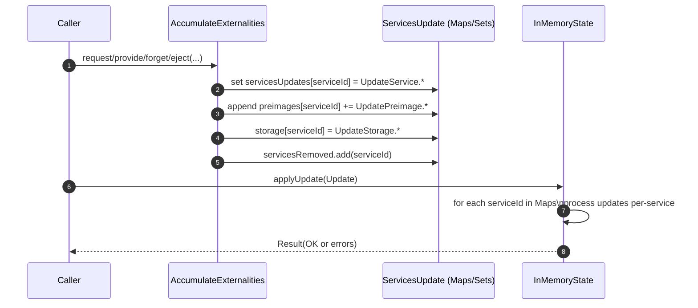
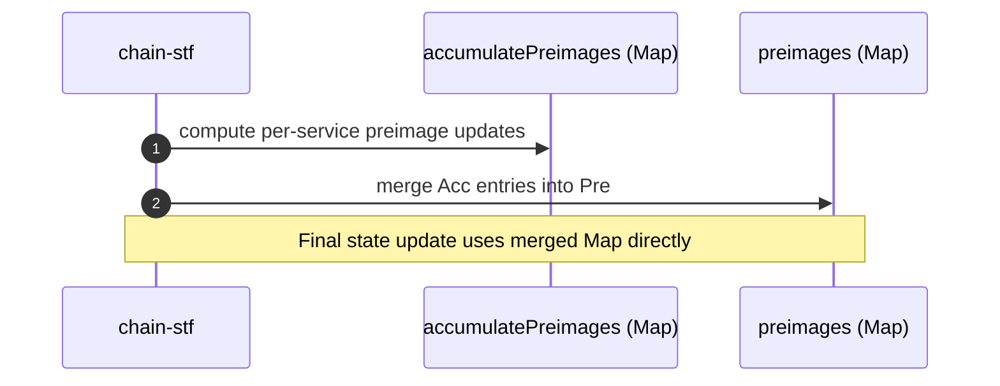

# Services updates grouped

## Pull Request by @DrEverr

### Fallback: Stats for @typeberry/jam@0.1.3
|        | List [μs] | Map [μs] |
| :----: | ---------: | --------: |
|  min   |   14604.8 |  14370.0 |
|  max   |   24722.4 |  21930.5 |
|  mean  |   16188.6 |  15612.8 |
| median |   15900.4 |  15603.5 |
| stdDev |     904.7 |    846.9 |
|  p90   |   16989.5 |  16843.8 |
|  p99   |   18878.7 |  17944.8 |

### Safrole: Stats for @typeberry/jam@0.1.3

|        | List [μs] | Map [μs] |
| :----: | --------: | -------: |
|  min   |   14497.0 |  14476.0 |
|  max   |   44905.7 |  42784.9 |
|  mean  |   24667.1 |  24522.1 |
| median |   23715.1 |  23744.8 |
| stdDev |    9052.8 |   9061.4 |
|  p90   |   38794.1 |  38659.0 |
|  p99   |   40955.9 |  40993.9 |

### Storage: Stats for @typeberry/jam@0.1.3
|        | List [μs] | Map [μs] |
| :----: | --------: | -------: |
|  min   |   14687.5 |  14494.1 |
|  max   |  225511.5 | 229559.9 |
|  mean  |   62143.6 |  63562.6 |
| median |   38132.5 |  39619.3 |
| stdDev |   51836.5 |  53414.2 |
|  p90   |  139824.5 | 144370.6 |
|  p99   |  216677.0 | 210304.5 |

### Storage light:  Stats for @typeberry/jam@0.1.3

|        | List [μs] | Map [μs] |
| :----: | ---------: | --------: |
|  min   |   14696.0 |  14672.5 |
|  max   |   83139.9 |  84070.7 |
|  mean  |   31016.4 |  31848.9 |
| median |   26595.6 |  27556.1 |
| stdDev |   17374.6 |  18189.1 |
|  p90   |   57935.4 |  59871.3 |
|  p99   |   76492.4 |  79952.9 |

> tested using `picofuzz` with `--repeat 10`


## Comment by @coderabbitai[bot]

<!-- This is an auto-generated comment: summarize by coderabbit.ai -->
<!-- This is an auto-generated comment: skip review by coderabbit.ai -->

> [!IMPORTANT]
> ## Review skipped
> 
> Auto incremental reviews are disabled on this repository.
> 
> Please check the settings in the CodeRabbit UI or the `.coderabbit.yaml` file in this repository. To trigger a single review, invoke the `@coderabbitai review` command.
> 
> You can disable this status message by setting the `reviews.review_status` to `false` in the CodeRabbit configuration file.

<!-- end of auto-generated comment: skip review by coderabbit.ai -->

<!-- walkthrough_start -->

<details>
<summary>📝 Walkthrough</summary>

<!-- This is an auto-generated comment: release notes by coderabbit.ai -->

## Summary by CodeRabbit

- Refactor
  - Migrated state update containers to Map/Set (servicesUpdates, servicesRemoved, preimages, storage) with per-service grouping.
  - Updated factories and signatures (e.g., updatePreimage now requires serviceId; UpdateService.create uses serviceInfo/lookupHistory).
  - Adjusted serialization and cloning to handle Map/Set.
  - Integrated accumulatePreimages into final preimages map.
  - Removed duplicate-service creation check during accumulation.
  - Initialized empty state with Map/Set instead of arrays.
- Tests
  - Updated tests to use Map/Set-based structures and new factory methods.

<!-- end of auto-generated comment: release notes by coderabbit.ai -->
## Walkthrough
Refactors service-related state updates from arrays to Map/Set structures across state, externalities, serialization, and tests. Updates factory methods and signatures (notably UpdatePreimage and UpdateService), adjusts accumulation/chain flows to merge per-service preimages, and removes a duplicate-service creation check. Minor test-runner return shape aligns with Map-based preimages.

## Changes
| Cohort / File(s) | Summary |
| --- | --- |
| **State update types and factories**<br>`packages/jam/state/state-update.ts` | Converts ServicesUpdate containers to Map/Set types; updates UpdatePreimage/UpdateService/UpdateStorage factory signatures to drop serviceId from payloads; servicesRemoved→Set, servicesUpdates→Map, preimages→Map, storage→Map. |
| **Host-calls accumulation structures**<br>`packages/jam/jam-host-calls/externalities/state-update.ts` | Public ServicesUpdate now uses Map/Set; cloning and accessors updated; updatePreimage now requires serviceId; per-service maps used for preimages/storage/service updates and lookup history handling. |
| **In-memory state implementation**<br>`packages/jam/state/in-memory-state.ts` | Internal mutation methods accept Map-based inputs; updated loops and guards; removeServices now Set-based; preserves error handling. |
| **In-memory state tests**<br>`packages/jam/state/in-memory-state.test.ts` | Tests updated to construct Map-based payloads; use UpdateService.create and explicit UpdatePreimage operations; storage updates via Map. |
| **State merkleization serialization**<br>`packages/jam/state-merkleization/serialize-state-update.ts` | Serialization functions accept Map/Set inputs; iterate per-service; handle preimage Provide/UpdateOrAdd/Remove; removed assertNever import. |
| **Merkleization tests**<br>`packages/jam/state-merkleization/serialized-state.test.ts` | Test payloads shifted to Map-based servicesUpdates; lookupHistory moved into UpdateService.create payload. |
| **Transition accumulate externalities (impl + tests)**<br>`packages/jam/transition/externalities/accumulate-externalities.ts`, `.../accumulate-externalities.test.ts` | Migrates arrays to Maps/Sets for services/preimages; UpdatePreimage methods now take serviceId param; updates ejection and request/provide/forget flows; tests adjusted accordingly. |
| **Transition chain flow**<br>`packages/jam/transition/chain-stf.ts` | Adds merge step to fold accumulatePreimages into preimages Map; final result uses merged Map. |
| **Accumulate step**<br>`packages/jam/transition/accumulate/accumulate.ts` | Removes duplicate-service creation check and related imports/method. |
| **Preimages integration**<br>`packages/jam/transition/preimages.ts` | Integrates to Map<ServiceId, UpdatePreimage[]>; aggregates per-requester; UpdatePreimage.provide payload drops serviceId. |
| **Database LMDB tests**<br>`packages/jam/database-lmdb/states.test.ts` | servicesUpdates now Map keyed by serviceId; UpdateService.create without serviceId; lookupHistory moved into value. |
| **Test runner**<br>`bin/test-runner/w3f/preimages.ts` | Successful result returns preimages as Map instead of empty array. |

## Sequence Diagram(s)




## Estimated code review effort
🎯 4 (Complex) | ⏱️ ~60 minutes

## Possibly related issues
- FluffyLabs/typeberry#677 — Also addresses migrating ServicesUpdate and per-service preimages from arrays to Map-based structures.

## Possibly related PRs
- FluffyLabs/typeberry#520 — Performs the same refactor to Map/Set containers and UpdatePreimage signatures across state and externalities.
- FluffyLabs/typeberry#487 — Modifies jam-host-calls externalities state-update with similar preimage and lookup history handling.
- FluffyLabs/typeberry#548 — Alters copy/construct logic for AccumulationStateUpdate and Maps in jam-host-calls externalities.

## Suggested reviewers
- tomusdrw
- mateuszsikora
- skoszuta

## Poem
> A rabbit maps the meadow’s strands,  
> Keys of clover in tidy hands;  
> Sets of clouds, and streams that flow—  
> Updates hop where service rows.  
> Arrays once sprawled in grassy rings,  
> Now ordered paths: more bounded springs.  
> Thump! The state sings, “Merge all things!” 🐇🌿

</details>

<!-- walkthrough_end -->

<!-- pre_merge_checks_walkthrough_start -->

## Pre-merge checks and finishing touches
<details>
<summary>❌ Failed checks (1 warning)</summary>

|     Check name     | Status     | Explanation                                                                          | Resolution                                                                     |
| :----------------: | :--------- | :----------------------------------------------------------------------------------- | :----------------------------------------------------------------------------- |
| Docstring Coverage | ⚠️ Warning | Docstring coverage is 0.00% which is insufficient. The required threshold is 80.00%. | You can run `@coderabbitai generate docstrings` to improve docstring coverage. |

</details>
<details>
<summary>✅ Passed checks (2 passed)</summary>

|     Check name    | Status   | Explanation                                                                                                                                                                                                                                                                                                                             |
| :---------------: | :------- | :-------------------------------------------------------------------------------------------------------------------------------------------------------------------------------------------------------------------------------------------------------------------------------------------------------------------------------------- |
|    Title Check    | ✅ Passed | The title succinctly indicates that service updates have been regrouped, which matches the core change of migrating servicesUpdates from an array to a grouped Map structure within the codebase. It is concise, focuses on a genuine aspect of the diff, and helps readers understand the primary intention without extraneous detail. |
| Description Check | ✅ Passed | The description presents benchmark tables comparing list-based and map-based performance, directly relating to the shift from arrays to Maps introduced in the pull request, so it is on-topic and meets the requirement of describing aspects of the changeset.                                                                        |

</details>

<!-- pre_merge_checks_walkthrough_end -->

<!-- tips_start -->

---


<sub>Comment `@coderabbitai help` to get the list of available commands and usage tips.</sub>

<!-- tips_end -->

<!-- internal state start -->


<!-- DwQgtGAEAqAWCWBnSTIEMB26CuAXA9mAOYCmGJATmriQCaQDG+Ats2bgFyQAOFk+AIwBWJBrngA3EsgEBPRvlqU0AgfFwA6NPEgQAfACgjoCEYDEZyAAUASpETZWaCrKPR1AGxJcAypQnwDNKQ2Ny01MFEFPihdJCQBgByjgKUXABsAJwAjPEGAKo2ADJcsLi43IgcAPTVROqw2AIaTMzVAGIe2ABm3bJFKojVuLLcJKkULtXc2B4e1Vm5CfmIaZAAIhQAolKTeT4xFEGQAlQYDLBczGiIhKsUAUFgoeE0xNGx9IBJhDDOpLgnM4XK7aLAJHy4ajYKr8MZggw2EgBEgAd0oMIIzGhtAoKIANPYANb4RAALzwaAJ1xo0NJiHgxKoeQGqQ8MIAFBh8OQAJR5ADCFBIEXo1C4ACYAAzigCsYGykrAkoAzNBJQB2DjKmUccXqgBaRnW0gYFHg3HE3Mg7O6aDEyG5HlkPI4BigcBI1jsvHwASUMjIF2uFEJ9kh4kQ4gYyG6+D4AAERmMJlMhGhmPHJRpshplehTSSY4d7P5Ap7EEEMM54CSuO00HMBHbCQSfGhutEvK2CFRSATMPQIXG0KRIB54EQyho3ZAAEKB2DBwnINFCyAUbBYaHwDBEHiBfDdbCk0mQFENXRgIVjaiQBXTqCI7hxmj0Ni4M3RyCxvjCi72Stq3wFBzi6JRIGYHcqTQAAPKlhQweDaHgTACUjWhjQkAluEySV+wwegcMyb840gXAUWAmhIzI0Zgg8FQSC8egACIiiQAEAG1AB7gRAAF1mPQAjIGYgBZNBuEgbi+OY6cDB8Rxg3gUk4nfT8ZHkCsyCA10oHrRtmy4NjqLYTA73SbIAA4LI0dJIB4gkxIkkysGyGVzPFDQLLsxAAG4eEyYijIBSyLPVaz1W8hzxLvdVMgAFjizzvIfSA2w7fAvEM9iIIQyBxTi9J0nVbNIsgRyctM/KZXFDzch4vz6IoUcJGrFR4HHEYzwva4YMgAA/BKNEyUMeMEwiAv6uKs2G7ySL4AR8FwWAUqHXtvAg7B/wQSdKAqjBkAHSAWrNNqOvkQAUAkgIK9sgdJxWyOLlRs0ryuc27tTu576og2CjobbBglCMjgL6mrMhskbfP8yUruy7JlUyCz8o0GUXuih7HvVLNbO+ojYeo+7CvVYqYfssrovulVJUS1GeJWnsR09cdJ04ECaAoNhkIiP6umCS7rre5UFWydINDitGnNyoWLLi6ziO+nr+osp7skJQBkAhl7NIb8nCYb6mViuGtWZXBmbcYmvr1VFmV1dioabeSoxEmAphwIuTBSEQAlkN6L3+D4NBaGQy0qw8FBmG4Lw2AwcMaywJRIXaldKE9HcGDAuIdzI2BPR9P04n9U1zRD87HXkVJzkXZxQyFBwPABSEBC8RBZIsSB+RYaPcGQBwnBcIwoA71h2BOeRNh2SgKC4JaSHkZxPRIGCxjNLudz3c8lsE9B68oKtxCkdBuB9O1YH4boQnpXd0HsNevB+iSmBj0E1/QSY0FkZACEgJF/u5lEc5nnwJat5zxzG/NgCggDw551zpQH81xzgkFkvoYw4AoBkHoIeHABBiBkGUK+BQw8Y5cF4PwYQoh97BDkAoJQVBVDqC0DoFBJh3QIGQKgUyaA8CEFIOQKgBDWhdy4FQFE9gFLOHLvIV2yh6GaG0JeQwqDTAGDUBgYY0hcBXk3Hw6oKJlTdGmEKeA1xPYaG7q6ZiliDBtwAIIAElcF8JFGIvu8gsHu13NIIwdisBUVwAAeTwDMXA0B8CIjrrgAkM8xEMCCIgRAR4w611mACLkoihS4AgftHgRiTHBBuNfcqO5IzCkwefUyJAI6dWcFQWQBIPH1CvtEmIFQ8D2FgOJT06VmA5JIMYxmMIOK8WBr0/pnsuDkFEY5dkPINAwDYdvCc2TokZKyXESMG4xAQM9BvU+0Sdzs1DtYXJAz1wkF4NIdg1A45jRQN3NmJAojXKtB4fA9QGBzOdvwKBR5zghwbIwDpniDprguasGOslzCWBsTvfhcdP6URzpAJQ6dnDPOyVgxez5IFxFIjMJugRv4x3UPALxBguTkCMFsSM/SBGKE9EKZEoiSC9BfFwESdB4COAMJY5iA9lHcGbAM6oaY2ivBUDcEgYAPDMFoAIaokYIgtz8WYqoPKrG2Icbw/B6zxEuDPoCj2ZLHznPokEeg0T7iPGkPkMISqeDv1eYHb80QemcLfm48+ggRD2gUE/HcL8rVljsaKISQagg+NjCMtA5MJKElnnEah4aSAhoJP/EknoWq8xQAdLAtrXgkD8A8MsIFFWIL9YnDAgbSwRowFG9kh1Xn4EJKEAAEuxOMzpblchvruO+yaQ3flJR4WgKURK+jiJamtKb6BCm6Cnct3Tv4n0gPmiIRbrV3MqWzRFnprhxtnn5NdNAN1lhaEKbmqA0kgQkM2uIuyWnXwHfQbow7R0zhsUHOITaW3cHbZGTtIzonHsLdOh1sgnX0HZLsrO0T908wBnyYpNBnVYIKTG1Ygr+GegINwaVSJGJDsYvQGDvikU1Pflu5grdLADzKiQJaigb5ED3tskIdrXxcBA6eoI57hQ0AdVQd8u1VgAgaXEJdABvEsxaI20DQtOyN+ACQaFU5AAAviM6TA663KbHPgZtbaO36vUylKwTRxwMGRdQDDH5NqZKFFwZNiAQOf1ooazxL7XVbwo569jBbkDQYvM+vkX8Y2OWAM+gk3Hp16DPDnNcf5T4xdk56R+lae6Kd07cn9RmAP6obUJHtz6iMjtmVSml1I4jSLOUy7+rLIHss5dy3l/KwBGEFQwQkwrRUivTGAWAJJNEMAbGyaoi9DkNhJdIBV4YpUvAiKqixGroVarwdh+gvdgx+fE4gOj5mCVWfFe0zpHnSBcA9KladLmONpe5JW3a17oTBEckMPw9zkOlINb5osfB1AxjfS3VKYwGDwFfSNuYdSZPWpuwFk4ogWD5NjQp1LiBETMAnfQVIrQkfvewicz28OccHWR7c/LjMieI5J45Ak14zUv2iRcgIMQQW1LAE2VYs7zm1yuSHFuM4ITcwWwJ9O3IX6vPef5kUXAmDcFkO0bz17RfkGQOVQ672crMAmMgAIMbJmQBzh4Ze4C/nwutMrkgauhIW8cgAdQaDYj1oXgI+loJtT0ShzlgCQKfWXpKHTn2ia96o72/Z07tC/Xz9gLmB351AGxsTpDIEFeUXeZ3gikesM4cQo3ZAgdoILmgwiGNmh/mHND0fRBg8JcmwAmATIGF56J7qxVfiQ0P8dk/pxB7zjkh/aKGylDoIpHrAjFKkjyzu62p9NhyjjtHE5Au2nMM1HMd1AF6vMsGvsvMAybY3WnJ6QdvDH2Qhb5PwhL2dTKvthZH789EAS+bTReW0+kusItfrUlcCWm8kDoHQMzAnT0efJPW5LEWOK0JfUZPJEFcsHsOIY3PfSfWNPyDpRAKwIAuoBjDAvpPJaoRvHAsZYAsBQOcSAhL+fAZebmK0HfPffdIHAgoAyAa9IUAAR2wHgFrifUU1FCakcBHkOkb0/iRVoLAwuSIOQHg3nzjGQj7VkBSiKAM1/QN2M3kFrgyjwBuSgMb0IiANgMgCIGoB/03x6UZ0oF3zA3g3ZHEJgOP1wFPx4L5AAH4nDJJeI+R/4yBCFglxclCgY2EexZAGobhNFG99NDNKhmD8BRFKCdV+Bdhs5UBRDUsFA5gKE44UoQNocS0dx4F0V79oizlX1yBaAuBG8eMU1stntk9zC6DxIP8E5KBIJyB4sGNL8v5TR+NPRSIwiMMwN2AXB8dLli1dxDFKCRxrkr5F52JfCIj/1AiXUt9olpiaUr5kjN1G8x0dxSIDld4AVA4hBoRcAu4P8psWNt4w5FU3hwDJi9xYi4VuQVwLxHIQ8GMwxNkHNgh2QkEiANACRyiV8m9CibiqJs5YEKALCUjD891xICQuRH979bxfNysjBrFoVYV0UP9okUVGpMSDUsUXxcU+B8VLMiVxBxBjVrALNCUkwSAFUOkxh08uAAADCo2HCIZk94+zNjHQkZZ7WNN7BjPbeIKAecH8daZk5zVzLgIZZkgkSU67dHTHGU3iOUyAZkmwgZFUtUyUwE7UgwEUyAGxbodmFkqU27GECLVTP4yAa0vQHU5zJUqQUoq7XAYAO0nUzU8ZWNd01TFTVTIZe0+U6E9lcSX0m0j0/bakqzR+DZezUiVIDpZnPgcTFkhPBgRwWYdFQvEgEDDQSpC0WQGZTkgNHPccZSYQ3OaM0rWgBvS+PcF4jXT7VDcpD1fnQ0sUuMdaH7OaC4kiCBGs4U3QI0k0tYYPUPXs0bfsvgV9YjPbGcA7Ukq4wld8QbF05k9MzMh/OOHMvM2XeXV1G0V1LgTcrEbc7kXc27HkTk+kFjKENcIUa4YpME+wdMEgAkAQNpXYigUOJ0P1OM31fXccoUo6FCA3RiY3C3NVQ0z9JQegQ3ZeFkm3cSTkw6Zk5C7ge3JaR3WpTkr+N3SOQIbmV7W5EitDNs2naQEHShJ0ZBKkw7HKRjTbJZe8tLIFc7dUxg3AxmTk69JQYouIG4A04c5krioghw1LENXwHguE1EEDLjW7QgvJa860JnGsaEP80SxSoAzkOS27BSgtJSxma8nkKMhi1cpjRMtAZM9PdhLAZkqwbPFCSHfPHM5k10Q05k/4CopTTvDRHcdFaSyS+gAAH2YNmA8BUpYJL1JSkB1zAuZKWiQA0CuNzNuxSuuwytR1czsL8tWPRRUubMHxjV4BrADg9RLGcAuGnE8u8sBIkutSkqu2CtpzQBRAAGlZ5fBATOrnROSN8e5ATFiel1iS190WSkqW5Uq8znMUrATcqQtIAXC3CSz+8vssEb92Y79ugH9P934arhyfFJsw5jsQD4kpdyCXdajLD6iFUQKfxoDTlDohQH9v0/DKgDqoAvKGNFC5jVD2RrTCqq0yylJghRrjgvS7s0ixAbldkPL4gRLYyARIbkAABeRIqaubGazKlGhaxwpa1woZHyZkujeSVxA1EkwIMAW0UHK+W81jNcJfYSr6sSvJG8liz49Pa0QOOC7IuTQTN89mUyw0xcwlY7dLUER7Qo6o2NV4gEACz437MMLs+gIQ60XXdU08rMkOS8gtVCoSaJVk67EDTktfMTe7UERAUypIRadaGFMOXbECDGksGGq0OdXaL+SmhgaYaMv8wQK1FQO+dgdQeQHEtFPna0Wkv2VFeJaoCy5iu8xW/CQias2ckdK2gkNOMCBnQbVYK/R/WFF8xABk7o8+AknFegY7BW7ZfnAwalcQKregGrRlUlZlBrVmdtScdVPlN0AVIVT2PrNoVKsANgEMLwJSdFO6k6csqVYezY8xbutEo0tbJxAhLbCRA1XbOje4Zy0Gp0ugNkqI0REAi0End7YAHy2gOLIq77LAKPZ6hjLJZAYUCgP8zwrcAiFlHcOgPydQHVB0BIqdBuYCSpdQM5DHA+IQlKHeqbZSVaCna9E++5cLMMy+6LW7eB0gQM0tAfW+vaqHXZLeF+v81ZH83szcfi7+2gX+9me1CdPgeDAY/3W5FpYJZAHxe4XAaofei6sG3aO0EOLqJK0fFdOvBvC06BygXe5SIywnRBxPU+wpVBmS1dbS7irB3ia+talsnzD1Z/TeCpZwEhx+shh6ihr+komh/+ngETadAkIFWgccK+DA30eAJQdBgtfxCgWC5OyAHhgRs3QhpgSYKi7kWQvcXLSIw6AIwDQMRQNePyHh69UB+5R830BsJWhaTeFG25F65xSJlQ/LeQJh6QSR6e0Gio1zI+/MIIRRlB7gC+lRlLa1LRkpHRqfd+fR0+Qx1+tQkxrAMxz+gS6hrdbDAB3aRhmOUvD/GBmevmj3GzMaNNHOO+o+SzQO988I5QmJwY3pINK+Kymyh6wULo/MCOwhilMADACKrZvLQIlKfei1JFYxbFAENDeJSgXARIAjGc7zRMWiFMWQfA8QNkSFJemFWhiOr+bE0QXEiOzFJeQkzBYk6s4Oik+cqAL5R2r+em1igPb+RFiun2hitF/3OZCS6RwtLG27ZjBmhlSpS2out8jQa2iwCrBu5xZupEVu+rH8DuicWARe3u9rAwTrbrAe3rYe0ewkce0kSe2Z0G2gXfObMxDRJbRezVRxHVTbPVHbdiykp8M1YIKdbKi0ms4a3R2pA1ZpktEp04/ffdbgatYKkZG13jeZX/URautcFEKgSIt1hZyEUtNx4A/fAY+QeNWQRNeQE1xq99KAcdOKl8yJ+YwDY7JdGNXDfDKQMONOkjBoWDcjNZvPGlwVCDfAZ1L+VIZgjRTOfaENl84J2uZ8YfK+ANsk/VdDGt0RFN1Q81zPYDDB6dPjbmMtyDFKT9Q4yMSssRSYGIVtu48hMQE7Rk6QigcJp0Ay9dYdzo7mJXC258rJ0+HTKNRtd61N3Zm+rBJM51xq7LPN5PLoEnTDcOnDSg7NwjXtopsF2xDEqF3dZFWF8Os3BF15okngVF4ldFowClEgdl2larelWrHlllPlprZCFrKxYVjrfumbSVubaoHcEeypTtZVxbFVBe1rTV7VDbFxbbTe/VjFvx01O0OIdt6ECnDN5FJAIuZo5xb1ChIR7pwD5CEbAhE57meO+GqAfxEdJzMDNW57UNMhH1AEQhwkHcF0gN9qzTjQCTgTQ6aQzcVmIzmOJTT6yAb5lEeTlIxTvOgNkdmgdkbTLLWMLgUz3AJTAkL9wIiZG59TFEqAfPA3aWs1+eb8Ot6FpFVKiCelDwaTyAWTl080uHFEdDO+iqtDV2rAAT+0CzqzmzmHKpjhffTwxLFdcN9AeJfAUHe1Pol1wh0ydtrNAGc3R4uzMQOIDWhz3dmgQL5jmm+A3Q9Rz0BxpxvcL+LFSzMBkDWR7oqgvnBLpLkhPQs8dL/Bg1XL+5bcNttRog6VBkcsEu9s4cgrx6wnEr8qLBErCghb+Ff4+s+Gw02boAjQPOEN5z87zZxAV5AEAL4S57vbvJDQRvLx2Cz7nzwDf7hG4cl7kbjQNJqQT7tA2AbzsgIgTef7mcREQblW5WtaXhj/RyMAX18SMYF9OMZgJbuT/HinNL3NDbrBbjea0TT76EjTJDGgZgE7zF1EZfWfVOanaKMrheCrqZ+QVADiKLVRgtTBpBVn7TIagL3iOiydo4zOCOF8D/L2sk6baC4cx5mX7d1LHToSQ6ZngXi1l5rXvyZvT0dt83jBoa5t9InN+QJdOe9KoQWumT3YKc9LTsAor1hAE0mMbzXzaoLb8DSDIn8SdnSVQiR1Ct2s25KbwIGboHxmaodt3H/VCHNkfsW/K+QbURNW8L1oZ8TnW5Mn8cAA1E8Fv9s3KLj3IDh4jFMuwlghPFSD8k/3My0ktFjSDmnk27F0jHN3ftObZ4L3oc0UllLsrdk9MDa8HnGOLrsCmNZCCsFeAKghTcG5HbvcDTgiRf0DE33T/T4As32Jed1mdM2/8z5mkc00o3pflIgklva+XP+QKTgH2Hod1LI5xIBs9XO+AE8jf2M5edbmf6VQn5zARY8oAotKzIP1pasVeGY/RQLMDgIRBp+BaDQN7yf6dlHMr/KlpbyU5O0o88CKroJjebnx2eUDJ/saRf4W8Cej5RlozlRad8umF8CnLySrapwMAt6eNPQG65O8BeGVeworwF5cA/6PSALsG3Aj1MSefrcnrT1HBjtk+dFJAUaSsB2IeBo4XkpyEWhf92oUqLwDm1QGfEPybSf2v4A2aWC2M4mF0E/xr4lsC00fZPsgGio7VBOxPDnIh39R8I7KbTYqm2Se7DkUuSqUMg02l4Bs4s7IK9uUgy5WssEW3J4gY2y5cBpMx/F0taX7AQDiEtpNTAFy0E98Q6+gz0DoRW4jdZ+c4efsQJyZR5CGNHQlHD327jh40K7UpowNHJTwvudZYIGn1BwAg2heSWEPgnhThCgumfI/O9yUCfdIaaEX7hzz/7TDDKr3UHt4yDgQ9z2fbaHgjTWERA5uCPEjkj2kwo80eu4THtbRk5QIvaxLSzAd06EvMBGCXOxJr0gTiMC0FqYCM9imEkC5uHjY3taiBEnohqS6GSLNhwGbFveAkdkOHlpoTcRCZoUiNp007Z8xBBPDjqQGtr10EOTdJDi3VRC8s2UkATuoK1azYdRWuHIYPhwiCEcMAxHDHC4DI40B1WVHVbFq1o7r19U7iRjnRhx4CM4wdlY6mGEk4UhBG8dD/PyT8EJ8QIbDHButVbJf5vs2XMiKEGbhzIfAIOavPnyhwAlLe8jWpvcgixoMSBcvQMn5FZpPUFGJo5Ri1QBFAFLRvDQ+kg1bwNMzRcQuZFsBXTx1qmf9MZvEV2iOR8yUzf3DMluQ+gF8fDCEnviEKUVI4EeNYiiOJLmFZBG3AMeignZfp6AxDWQFeH6YGFsAzgFPoM0oYlF5ReAOyi6KGqCEZhXxOsbL2uw8hKKDmKtFfHCQpINAzadkP4naoeEVmURQnq/FzjRB848bI0rQCnYEId86YsbgzmAhnUvhi2AJlaAeo5DfGvJd2kKEQQHQb+67W+PIG+Lt4bSmxVcRgDmoC9/i6Vc8QSAYwfJyshwghIjzP4w4BawmIBO5iXSX0hkIyc+pfT0C+MwU/gTOJCxuT0Mi6bxdkE2XYS0Mm4JAR8cx0THmockZVM5nHHj5V8m0kRC5rW3oDYTxmqY2MQpwtLLNTBezUsFMRggzEpic7PgPOKvjHjfiBIZ2BUQJDrANRRFN/iCOOQjctg1E6dnyEOhZo3G+RFPLAECw/EbSNwTht8wSKDMhQTAFjIq0gA5CraWxLkHwHPBmhdwZRT/ryWOgoR4JzBN8oFmhKuYhiEhCyfM3ZJUQ+8qElqAJhBI3IpRvjM4sshzh51CG0SJtqEwXaDkHUHzEwofEjhuDFsUKI0o30eIjIw6bffFuXS74osSWUHPvjOGdiUo66lWTloSO5bEjUOpIjlBh2YBCsIAIrMVj1nTBQiaAVU+bOlUo4rZl6XI5xDyL1ZGomOhvDgQxRKxYZBau0JdKMMZigjXxZYXxiwIpxI0PiwoqJGcHpAhwFxEHF6nPGy6YSC4NmTIqPzFFRhvwQo/VFKOjTMwsAuEr1sP1rgJcBpswscQ2yNHnJ7k0mRYfYGWGaYH6bYhnudJ2QNBH0z6Czm9JOEQMgSx9W0cgHOE3BUeY4dHpj2+n1iQet2MHkHGqZujIA0mSHiZkhlNjABYRa6Yoxc6SVsspmJ/j1wvQCZMZt0+ZlAORnyBNMD6NpF9PxmYjGYEg+GYDMRlqDPQeMwHrL3movjGZxooGapNngaZsx04uIGySyK0kRkc6LwMuyYDQ1BG3rNim1IS6OlTh1WRjhax/HDIv4/4ngnoAs6RDQSjtfqQAOtS/iv4poppkbLLA6yn+OTA2d5jekmzgIZsh0fbM0a6yhqtsrfGNI0YjInZcbIaRaNdnwdG6NCelnVnymNYyRArEqX3S6wVS2gH4TALNLjjVB58W5ekanLPLkc1UHIxqTR2am6sGObUgUcrNFAicuJBcTiWJwwkXBRAoYahEoC8Dd4kRo4yQNzDQIcTCKYnA+tdkv60B2Q5Ra7KfwqJDIXQJwAzF4FMjx0HmJc80WBkd5ozrUpvYKdEn+bJhJ4QLGLtb0gQUDYkactkd3Gnl/TRQYCfPh/nbmVyRQbJXuVwG5BsVa56ABuNF0hDbysECc+toI0M7wlL8xDUlPNFeRdZWia4MBvTxvR3oJxnY+uBMmAivJPEf2D4fchWSMRnEUdbtNAu5CkAiJ8CGdgRXWavhISm6XrloRzgAK3cOkvcBnO1oZF6+v7MCdFOb6AdUUcU/Ep33A469SWlJd4a8y5pZxypErSqW/KTncgU5u8zOdVIoWvUls4DTHAS1eZgAxZW87uE/zFk59vMzEVeeMHXk1S4RPaGBRgugRIsnak1IdF4GFr/8F5ZYJeRazUW0lAWWi60DovQW7QFFdbZ2jfgQl0YOUTFBwQ+RLkrdW5Amc+Z3Mvk9zCZdAfuRbLiRDzp0I8rgAtAyi5Qs4MdZAFrVerc0RF2tJBN3FxFZS6U4EIkW3TQ70Yip0csqTSMHrDAZpJKIRe7CI6Rhug7IhqfYialr0C5fIouTOCOrRA3ccSa+PrhKQSQv4o9OfOktepzdlxoJA5ABxybwZqEmYpuTUz3kkAxlSzXskllJnyYQpGCeaSsXmU5M1apEQhVfD1x5TxeKAcpAIHBSaAP0U4o4jO2KIApSGOXJdsAwvg4YkUvJaZdFGQiKTcAf5awnoT7whDN63ILuT3iOUjKjhq3SZf0Moo+CYaTSJFEMriDJJ64YfJYkij6U0BuAKULYHROppChRuA4cbg6myY84HgP9IlA4C4I5MHqzmITgstEWVCwuoKVfgCELZdIAqYcT5diuoXolaFyyADrFLxKgcDF3fZKb3zJSwcg52UvJblIKUFTmsxUykaVJw6xy+F8cypSHHGwwRjqevYRRmUZVgAJsexDqGSwo7ZzGlK9bVnRw3ptLgUxc5CQgWuopFIaZEKgF1hfhccdqSJCqmFgdZk9b2waH4Za0oxM96xHbf3H5HbDzpOu+Et5DSQ6TI0W6LOP8jMGLqRdFxY4bKNennS4Aa5QwXrkjkmYfh9RZraJE/lyaz0QKcGNvNjxY4oTwaTKuHAnI9VXwvVu1KPH6tegBq6aPBaNHmgiULxxeUaj5pAjNyNj7U16e4tQTvr75Eh18ccJGGnmOrCIzqzdC+KVauqW1x/PcFx0TGT5fVmajXNdzAx2J1gUMPxF4MKJYpBOMaDXBOtBJRdbwGuC/B7SBQhr5CdaldTY2IlQkhqVdDrpzWxECCyIGiGEOzyvSFElx6/epiWAQRRgzJoNFsWcmQni5wZsAFaU3WIXLg/IvkxAC23CYhySVEk9AXyTzrlR2eh0ekMpEFnq83wKSc0HfD8QyKKEeJNdhuxjbAQJZvg8SHLUw3WYg2csv2FnWwCEaVcBCYtdM17KNCw0JEuHA+reoREhgomasYZJZwAQtIKIwLD+H+CAickrjJQHppICqdZKKINiexieRKBzNAi+dBQDvF5qWWKULFvqxGTGqfyAKGxLoJMlsAHQSU0kr8jVG4tFa8OWQGEweTuaTqizOWTRDGADD6APC6sjFyEJ+RmkFyuwcZKpU016WT5DyeWDfLWC2Va/CLZtPpbASn4EdcgdQkvXV9R15zFOBBAnC0dTZvGjXEJp/Z8qJhdCwVa32FUd8wOyLCDuKr1799CUKAoLSP2+HL4Ig2NVHG9z0KED6h60K7ufEbVfdUiksiOiv0uRr9RQDPXzE8LgIfE2M7IHZkRUhw1Mk8glQatNvSqzUUaHEa0sMka4VVVg8GwIFbR6Ev9fZQaoaXN2wbWE11JaHJvliu3Xx4MHvPtWFmSGhrz4b0m4fRQH5Qch+idCbdLhK0zaYcWVIrhaQW3ikTyHqYAHEO5qIkAQi62gcOLtDRBzqzmUxfHl6HRDGmzswdfENW1hE7WfMqNljg0iOERtyApHd4qbVo7pqt2zKkrKPm46F+RpTLnwDJ0GoN18zSAGetqFMC1gWs4KvEPl10rt1oOvorgHh3aCxtJ0wXZxnR0i7Zt0JCXcQJwrvx+N7PLbZcvyKEMvAVw33NhuV307Y0tuoaqfhZ6g1XlFPFMiWM5Uh14dzmtqa5pYW0AHhhKALVqr9FVgfN/scLVloDChaDaSKcVMqyO1rgxZjtFQBOlkh4jg5XLMOe3XQ5colVWHFVdSLVV4d+Fmq5OW5tDh6rxFOApvVNnRYNK+U1HdbPnPJp2rPYDqo1m+EwBzwKqaa0+NOojq0rp0BY16gSJlmBNgsDGFOXDNe2YAENis42haRITQhT4PwVnpMk9GDqgBANVTDyHKyGkxdypCDsXUgA/AeaeVbvAVV1k409Cu+u/Vgh3xd5d+NyHsj8G/3+Ue8VoeDCLwJY0TyFbZEcWcg/CxU6A/YI+BgngOVqLCVyqAJ0swEoSSs63IYWA1fQUBqIfwfgjHGjTbTIIftWHeGtPlnSoZmw2CtU0hDxozJKjJGbsKKZFC5k8g+dYKniSBr+axSBtoziT6BxUZkK+HlzOvSMGvi0vYGcXUuEY9T4XB7RoPhE2EaSs7KjwSIdpnrD4ecw/6WRDQBMGD8LBr7ksMWj+lODgK3BlglUN8GZ0hikQsIYnFq8SkBI8COJNOIHT6V0SfXG9MYBTlxtp0p/mwQBiRg9NehvTYdB03YEmCpwTAPmtI2e0ZJ6y6gX0R6kGc+CXcHFUvAHBxBjN6RGgkYT5KlsmCiPAFIfxfL65AD+VQRq6vgxyyNJpEWuIBogTzTpCrARQKO3MI/7gDWAGTSPrwz+DNscm+1FTLEzsUX47esOIczQmpA09TzQNmgCz3ck1wnmvQbtna2RT+VWJDPT1vhZ9bRVfm0bSlMpKeK1yAu9ASyR+l0Gg4q1WLhPxhJVhGke4FGk/2W7qlrjMMrYX3OxlxtfA3nNg75w4Mc8SahpM7syU+OeNvj0EgkKwb+pFMuA1pEEzODONMZAjxuugFcahkvi7j4/LAT9CeMvxXjhpd4xCexPKyQBwVf4wbhBnyHrhoJ07nzw+Pkm/pMJ5mRcLBku7kTCbNomiaN2XHmTOhognNoM0kBcTmAu+AghHBEn5tJJmnmSaFPA89DlJv46lEsl5IzDkSYEwFwZO89rOgpsQ8KeVM+BYTphk4K8gECamLDIJ1Sk4fQA3LXDNTGQoeNMqIDEtc2dbQUawDiZ1ywuvAbNT1nSBdTkABXCwC4AdDGIc8aHfmIjOenAtoQV5kSb31n6WWT/UJCCG4B3VNEQxuM7LITMvhq09hSNgSBa4ITrQUkqKB6PNnmKggegV0wjprwenpZG2ohUal9PUt/TouxUiXODOhmqe+DA7bmZuQOAj4BZtYsmcBppmwBJYbM3KObNemxEo5sdUcu2E9GCqC5d09zHnNqifTZpDs4tju16Fezx5H9WADXMfyoD1hPfTBtv2wBadMAac9Uef2Sjoo0W9kB3nPO94CabhPyKz0/Pch+wTubJRy1yWhyUOZeyOV3WVUxzxWdejVYnKqVqJca9U7vZyLzktL+958Letct5qX0gMIhasgootbRIm4NXUMHia8DLrh9NjBdvyFVliz21Pqq1uyBdnO5t8gO44FYW+1yZftTozRohMRAUQQwglCFYIywRCEZByhimnvraMk78G1g9qCnx3whHa2fAMImTtzSbZ4ClZHpBof3SHzpFJWJdIO0VP0zlTgNTQxOLottmXyjy9ZCXQNS7EnkRefoTmnhk+lj9pljRq02sNJDHRI3X8b5mzG81lLJAdgqpfQBEAogjyfIhLkCB3j9orRq+GXzXBRAYgqg6hCpZKQUBNjELTrQKpfJCr9jMiw44NsR0SqmO2g3Pfqy4BjLdai2HJtenoI+z7Rfs/y0QWwbzqXZ6tMCtEnMa9MX4IsmlmLMq3yA6r+5vrmZmrJrGmSvEiQhoCcvYYYDT9J9B6bCJgGcml3Vqz9vat5JOrUlivN6sfweoprXU/k6mWY4QMAUJ6l1sZccPlsdGP08y+focP28qDhMm5OJML05LEOsq0vYUsKkV7o5iiFhESmKrcJmliHIhKzBEQ2r9U1CaRHQjUByImEYAQwKDcETqAAA+m40QBY38ldALG4qm3koIDAoN9IDKDQCSgSAMoboEEEyDjABADAKaAIG6DpA4oDASUN0CmjKhJQFkNmxZBIDUw0AsoEWFZlJsY3O42N3G/jblWE2MECiMm2gl6RY2kVWNmue/iJvPyAQpNyTMJWYhIBbAs4f+cIKHhdwrAQ2OgMxC4Cv5VgeIfW8XRiAjpjbZF2wNbe2lsh3y+tpAP4l2Bmgv0GAd27ba9vxBmIyEWgDYE3DrAauEIMhYgDou1z3bdmEO8JHDuR2MA7gX5SQATtdYk7G4FO2Hbcbp3jQ2/YuHHBzuEg87AMe26HacbCC7E8SUI7HfduWIa7wkeiJGArsQLu47tjiH/z1sw9Q7GtwkIkDfIt3M7d8Cu8xDbsw9mIVxaEFXZTuz2pumAdFOPaRTkl+0m0WmmID/Kady5whW8HGLNZJlPQqQLwkKDSufAyJ/4akAkZ8ldkuaWCSCM5bsO2TggGbaM6QavuqCKNLRn1gWzIx3YlA/guZHYjZWL4QVSATZrGAzKf8rQMaXhBwRaI3BqKBqbEmDm6C+MEKyADfOiBCCf0CDkIdPS3Po67FiUVoMYwSzfkkB1NCcbQB4A0DT2/+od9Ql0BDgt3mHg94SOPxIAt20uP5NeFw8HvMRFJ3IV9EQG2RB2MmS9hGsxDjAThOVFd0e2wBbub2+Hf/dTDPcRksPhIw9lR3w64DMQS7RcC0DcinvaPQ789xAIvcsfCQV7vR9ey31LtmOaCrKgMJXCXAGH4JkDiONWCvhk7+Nh0fdPxuXh5FEE3sTghQmMbbkmkAHYumDgBAZsoDzWyIgci6Xu54tQDiDmAiytanbgdyNy9yDkWUFCUwTv/AgqRQhGonXcA1IXDNCqJyF+GihPix8mMcGMTDux6I+kAaEOHRj4R7Pd4f8PnA7YogAM7kdiO60E4KRzbZkddOFHjSBsMo7HtGP6nZd7kHyhh5aP+7uj5iPo5WfCRo70YWA1fA7h+9SA4zqx+GAXuzPPbXThx2vaMdHONkL8JgOc8F6QAswkoSUAAFJ4sgQU+KgGKQ9BwcpKCFB6zOTsEonTzWuINhHRuWLIXz355092dsPNCGzoxwAE0Yg/hrABuHsrxhEbKgZG/InQse4auLz3cIgDwrAQXmY48l8c7IUKB3nKL7h8xCGdGOBHozy58JAWdKPsNBjlu7QApcnOiANjzR8JV4ht3mIHd3ALYBMdmhXHgdox8KBICIxebmQdUMqGJiZAGA2QJsJkHnRU2BAyoIWLQAYAU2mwTNv/AIHSBoBMgyofm7QDiiGvbXcUEgELAYCqBebSgNABZDtDCOZXIRWwBPcMfCQBA8MdIN0AsgygZQ2QQ19KBqg+vxQuEVyHFG6C0AwodAGUFZHFB0ALXDAQW2gFptKBqbgtumwjD9fdAZQJAdm+KAECZA+U6mJRFAAuSq3KApAdW27qxsK39AQAA=== -->

<!-- internal state end -->


## Comment by @DrEverr

also im experimenting with making a single map with arrays and see if this will speed up more


## Comment by @fluffylabs-bot[bot]

<!-- typeberry-benchmark-report -->
## Picofuzz Benchmark Results

### fallback

| Metric | Baseline | Current | Difference |
|--------|----------|---------|------------|
| min | 35.31ms | 32.34ms | ≈ -2.96ms (-8.40%) |
| mean | 79.12ms | 76.72ms | ≈ -2.40ms (-3.03%) |
| p90 | 116.03ms | 53.41ms | 🟢 -62.62ms (-53.97%) |
| p99 | 460.98ms | 443.28ms | ≈ -17.70ms (-3.84%) |

### safrole

| Metric | Baseline | Current | Difference |
|--------|----------|---------|------------|
| min | 36.58ms | 33.34ms | ≈ -3.24ms (-8.86%) |
| mean | 128.66ms | 127.42ms | ≈ -1.24ms (-0.96%) |
| p90 | 197.55ms | 203.26ms | ≈ +5.71ms (+2.89%) |
| p99 | 438.34ms | 434.85ms | ≈ -3.49ms (-0.80%) |

### storage

| Metric | Baseline | Current | Difference |
|--------|----------|---------|------------|
| min | 39.33ms | 38.23ms | ≈ -1.10ms (-2.80%) |
| mean | 317.75ms | 316.44ms | ≈ -1.31ms (-0.41%) |
| p90 | 717.13ms | 714.00ms | ≈ -3.13ms (-0.44%) |
| p99 | 1102.71ms | 1115.42ms | ≈ +12.71ms (+1.15%) |

### storage_light

| Metric | Baseline | Current | Difference |
|--------|----------|---------|------------|
| min | 40.21ms | 38.17ms | ≈ -2.04ms (-5.07%) |
| mean | 174.82ms | 171.33ms | ≈ -3.49ms (-2.00%) |
| p90 | 404.60ms | 405.54ms | ≈ +0.94ms (+0.23%) |
| p99 | 743.24ms | 766.72ms | ≈ +23.48ms (+3.16%) |


---
🤖 Automated benchmark


## Comment by @github-actions[bot]


<details>
<summary>View all</summary>

| File | Benchmark | Ops |  |
|------|-----------|-----|--|
| [collections/map-set.ts[0]](../blob/9a603f0b531ef7ff71ce50a2963946d1bffec0ce//_work/typeberry-1/typeberry/typeberry/benchmarks/collections/map-set.ts) | 2 gets + conditional set | 69721.44 ±0.51% | fastest ✅ |
| [collections/map-set.ts[1]](../blob/9a603f0b531ef7ff71ce50a2963946d1bffec0ce//_work/typeberry-1/typeberry/typeberry/benchmarks/collections/map-set.ts) | 1 get 1 set | 37958.08 ±2.04% | 45.56% slower |
| [codec/decoding.ts[0]](../blob/9a603f0b531ef7ff71ce50a2963946d1bffec0ce//_work/typeberry-1/typeberry/typeberry/benchmarks/codec/decoding.ts) | manual decode | 22112786.26 ±0.94% | 87.76% slower |
| [codec/decoding.ts[1]](../blob/9a603f0b531ef7ff71ce50a2963946d1bffec0ce//_work/typeberry-1/typeberry/typeberry/benchmarks/codec/decoding.ts) | int32array decode | 169218647.59 ±6.01% | 6.37% slower |
| [codec/decoding.ts[2]](../blob/9a603f0b531ef7ff71ce50a2963946d1bffec0ce//_work/typeberry-1/typeberry/typeberry/benchmarks/codec/decoding.ts) | dataview decode | 180728862.75 ±4.95% | fastest ✅ |
| [hash/index.ts[0]](../blob/9a603f0b531ef7ff71ce50a2963946d1bffec0ce//_work/typeberry-1/typeberry/typeberry/benchmarks/hash/index.ts) | hash with numeric representation | 161.58 ±2.5% | 30.57% slower |
| [hash/index.ts[1]](../blob/9a603f0b531ef7ff71ce50a2963946d1bffec0ce//_work/typeberry-1/typeberry/typeberry/benchmarks/hash/index.ts) | hash with string representation | 110.82 ±1.68% | 52.38% slower |
| [hash/index.ts[2]](../blob/9a603f0b531ef7ff71ce50a2963946d1bffec0ce//_work/typeberry-1/typeberry/typeberry/benchmarks/hash/index.ts) | hash with symbol representation | 174.75 ±0.8% | 24.92% slower |
| [hash/index.ts[3]](../blob/9a603f0b531ef7ff71ce50a2963946d1bffec0ce//_work/typeberry-1/typeberry/typeberry/benchmarks/hash/index.ts) | hash with uint8 representation | 150.65 ±1.41% | 35.27% slower |
| [hash/index.ts[4]](../blob/9a603f0b531ef7ff71ce50a2963946d1bffec0ce//_work/typeberry-1/typeberry/typeberry/benchmarks/hash/index.ts) | hash with packed representation | 232.74 ±1.5% | fastest ✅ |
| [hash/index.ts[5]](../blob/9a603f0b531ef7ff71ce50a2963946d1bffec0ce//_work/typeberry-1/typeberry/typeberry/benchmarks/hash/index.ts) | hash with bigint representation | 184.65 ±0.94% | 20.66% slower |
| [hash/index.ts[6]](../blob/9a603f0b531ef7ff71ce50a2963946d1bffec0ce//_work/typeberry-1/typeberry/typeberry/benchmarks/hash/index.ts) | hash with uint32 representation | 192.22 ±1.13% | 17.41% slower |
| [math/add_one_overflow.ts[0]](../blob/9a603f0b531ef7ff71ce50a2963946d1bffec0ce//_work/typeberry-1/typeberry/typeberry/benchmarks/math/add_one_overflow.ts) | add and take modulus | 233144852.66 ±6.78% | fastest ✅ |
| [math/add_one_overflow.ts[1]](../blob/9a603f0b531ef7ff71ce50a2963946d1bffec0ce//_work/typeberry-1/typeberry/typeberry/benchmarks/math/add_one_overflow.ts) | condition before calculation | 220615959.74 ±6.58% | 5.37% slower |
| [math/count-bits-u64.ts[0]](../blob/9a603f0b531ef7ff71ce50a2963946d1bffec0ce//_work/typeberry-1/typeberry/typeberry/benchmarks/math/count-bits-u64.ts) | standard method | 1271932.21 ±1.58% | 88.41% slower |
| [math/count-bits-u64.ts[1]](../blob/9a603f0b531ef7ff71ce50a2963946d1bffec0ce//_work/typeberry-1/typeberry/typeberry/benchmarks/math/count-bits-u64.ts) | magic | 10978360.9 ±0.34% | fastest ✅ |
| [math/count-bits-u32.ts[0]](../blob/9a603f0b531ef7ff71ce50a2963946d1bffec0ce//_work/typeberry-1/typeberry/typeberry/benchmarks/math/count-bits-u32.ts) | standard method | 79194248.73 ±2.45% | 64.04% slower |
| [math/count-bits-u32.ts[1]](../blob/9a603f0b531ef7ff71ce50a2963946d1bffec0ce//_work/typeberry-1/typeberry/typeberry/benchmarks/math/count-bits-u32.ts) | magic | 220253685.14 ±7.57% | fastest ✅ |
| [codec/encoding.ts[0]](../blob/9a603f0b531ef7ff71ce50a2963946d1bffec0ce//_work/typeberry-1/typeberry/typeberry/benchmarks/codec/encoding.ts) | manual encode | 2876268.88 ±1.22% | 19.02% slower |
| [codec/encoding.ts[1]](../blob/9a603f0b531ef7ff71ce50a2963946d1bffec0ce//_work/typeberry-1/typeberry/typeberry/benchmarks/codec/encoding.ts) | int32array encode | 3525397.52 ±0.88% | 0.74% slower |
| [codec/encoding.ts[2]](../blob/9a603f0b531ef7ff71ce50a2963946d1bffec0ce//_work/typeberry-1/typeberry/typeberry/benchmarks/codec/encoding.ts) | dataview encode | 3551704.02 ±0.62% | fastest ✅ |
| [bytes/hex-from.ts[0]](../blob/9a603f0b531ef7ff71ce50a2963946d1bffec0ce//_work/typeberry-1/typeberry/typeberry/benchmarks/bytes/hex-from.ts) | parse hex using `Number` with NaN checking | 146367.55 ±0.1% | 83.85% slower |
| [bytes/hex-from.ts[1]](../blob/9a603f0b531ef7ff71ce50a2963946d1bffec0ce//_work/typeberry-1/typeberry/typeberry/benchmarks/bytes/hex-from.ts) | parse hex from char codes | 906288.88 ±0.28% | fastest ✅ |
| [bytes/hex-from.ts[2]](../blob/9a603f0b531ef7ff71ce50a2963946d1bffec0ce//_work/typeberry-1/typeberry/typeberry/benchmarks/bytes/hex-from.ts) | parse hex from string nibbles | 563316.81 ±0.35% | 37.84% slower |
| [bytes/hex-to.ts[0]](../blob/9a603f0b531ef7ff71ce50a2963946d1bffec0ce//_work/typeberry-1/typeberry/typeberry/benchmarks/bytes/hex-to.ts) | number toString + padding | 333065.02 ±0.08% | fastest ✅ |
| [bytes/hex-to.ts[1]](../blob/9a603f0b531ef7ff71ce50a2963946d1bffec0ce//_work/typeberry-1/typeberry/typeberry/benchmarks/bytes/hex-to.ts) | manual | 16572.31 ±0.18% | 95.02% slower |
| [codec/bigint.compare.ts[0]](../blob/9a603f0b531ef7ff71ce50a2963946d1bffec0ce//_work/typeberry-1/typeberry/typeberry/benchmarks/codec/bigint.compare.ts) | compare custom | 246074883.89 ±6.5% | 5.38% slower |
| [codec/bigint.compare.ts[1]](../blob/9a603f0b531ef7ff71ce50a2963946d1bffec0ce//_work/typeberry-1/typeberry/typeberry/benchmarks/codec/bigint.compare.ts) | compare bigint | 260052863.95 ±5.73% | fastest ✅ |
| [codec/bigint.decode.ts[0]](../blob/9a603f0b531ef7ff71ce50a2963946d1bffec0ce//_work/typeberry-1/typeberry/typeberry/benchmarks/codec/bigint.decode.ts) | decode custom | 197478281.59 ±5.72% | fastest ✅ |
| [codec/bigint.decode.ts[1]](../blob/9a603f0b531ef7ff71ce50a2963946d1bffec0ce//_work/typeberry-1/typeberry/typeberry/benchmarks/codec/bigint.decode.ts) | decode bigint | 105462032.15 ±2.74% | 46.6% slower |
| [math/mul_overflow.ts[0]](../blob/9a603f0b531ef7ff71ce50a2963946d1bffec0ce//_work/typeberry-1/typeberry/typeberry/benchmarks/math/mul_overflow.ts) | multiply and bring back to u32 | 252666511.36 ±6.12% | 1.02% slower |
| [math/mul_overflow.ts[1]](../blob/9a603f0b531ef7ff71ce50a2963946d1bffec0ce//_work/typeberry-1/typeberry/typeberry/benchmarks/math/mul_overflow.ts) | multiply and take modulus | 255268718.23 ±5.87% | fastest ✅ |
| [math/switch.ts[0]](../blob/9a603f0b531ef7ff71ce50a2963946d1bffec0ce//_work/typeberry-1/typeberry/typeberry/benchmarks/math/switch.ts) | switch | 275722292.45 ±5.21% | fastest ✅ |
| [math/switch.ts[1]](../blob/9a603f0b531ef7ff71ce50a2963946d1bffec0ce//_work/typeberry-1/typeberry/typeberry/benchmarks/math/switch.ts) | if | 256161001.11 ±5.99% | 7.09% slower |
| [logger/index.ts[0]](../blob/9a603f0b531ef7ff71ce50a2963946d1bffec0ce//_work/typeberry-1/typeberry/typeberry/benchmarks/logger/index.ts) | console.log with string concat | 6349587.67 ±65.16% | fastest ✅ |
| [logger/index.ts[1]](../blob/9a603f0b531ef7ff71ce50a2963946d1bffec0ce//_work/typeberry-1/typeberry/typeberry/benchmarks/logger/index.ts) | console.log with args | 943225.01 ±103.17% | 85.15% slower |
| [codec/view_vs_collection.ts[0]](../blob/9a603f0b531ef7ff71ce50a2963946d1bffec0ce//_work/typeberry-1/typeberry/typeberry/benchmarks/codec/view_vs_collection.ts) | Get first element from Decoded | 29548.99 ±9.39% | 56.75% slower |
| [codec/view_vs_collection.ts[1]](../blob/9a603f0b531ef7ff71ce50a2963946d1bffec0ce//_work/typeberry-1/typeberry/typeberry/benchmarks/codec/view_vs_collection.ts) | Get first element from View | 68317.34 ±0.15% | fastest ✅ |
| [codec/view_vs_collection.ts[2]](../blob/9a603f0b531ef7ff71ce50a2963946d1bffec0ce//_work/typeberry-1/typeberry/typeberry/benchmarks/codec/view_vs_collection.ts) | Get 50th element from Decoded | 27219.29 ±2.45% | 60.16% slower |
| [codec/view_vs_collection.ts[3]](../blob/9a603f0b531ef7ff71ce50a2963946d1bffec0ce//_work/typeberry-1/typeberry/typeberry/benchmarks/codec/view_vs_collection.ts) | Get 50th element from View | 33788.06 ±1.74% | 50.54% slower |
| [codec/view_vs_collection.ts[4]](../blob/9a603f0b531ef7ff71ce50a2963946d1bffec0ce//_work/typeberry-1/typeberry/typeberry/benchmarks/codec/view_vs_collection.ts) | Get last element from Decoded | 31179.79 ±0.3% | 54.36% slower |
| [codec/view_vs_collection.ts[5]](../blob/9a603f0b531ef7ff71ce50a2963946d1bffec0ce//_work/typeberry-1/typeberry/typeberry/benchmarks/codec/view_vs_collection.ts) | Get last element from View | 23330.34 ±0.75% | 65.85% slower |
| [codec/view_vs_object.ts[0]](../blob/9a603f0b531ef7ff71ce50a2963946d1bffec0ce//_work/typeberry-1/typeberry/typeberry/benchmarks/codec/view_vs_object.ts) | Get the first field from Decoded | 508064.74 ±0.27% | fastest ✅ |
| [codec/view_vs_object.ts[1]](../blob/9a603f0b531ef7ff71ce50a2963946d1bffec0ce//_work/typeberry-1/typeberry/typeberry/benchmarks/codec/view_vs_object.ts) | Get the first field from View | 102165.29 ±0.35% | 79.89% slower |
| [codec/view_vs_object.ts[2]](../blob/9a603f0b531ef7ff71ce50a2963946d1bffec0ce//_work/typeberry-1/typeberry/typeberry/benchmarks/codec/view_vs_object.ts) | Get the first field as view from View | 100136.94 ±0.71% | 80.29% slower |
| [codec/view_vs_object.ts[3]](../blob/9a603f0b531ef7ff71ce50a2963946d1bffec0ce//_work/typeberry-1/typeberry/typeberry/benchmarks/codec/view_vs_object.ts) | Get two fields from Decoded | 501701.17 ±0.39% | 1.25% slower |
| [codec/view_vs_object.ts[4]](../blob/9a603f0b531ef7ff71ce50a2963946d1bffec0ce//_work/typeberry-1/typeberry/typeberry/benchmarks/codec/view_vs_object.ts) | Get two fields from View | 81521.71 ±0.17% | 83.95% slower |
| [codec/view_vs_object.ts[5]](../blob/9a603f0b531ef7ff71ce50a2963946d1bffec0ce//_work/typeberry-1/typeberry/typeberry/benchmarks/codec/view_vs_object.ts) | Get two fields from materialized from View | 171349.16 ±0.22% | 66.27% slower |
| [codec/view_vs_object.ts[6]](../blob/9a603f0b531ef7ff71ce50a2963946d1bffec0ce//_work/typeberry-1/typeberry/typeberry/benchmarks/codec/view_vs_object.ts) | Get two fields as views from View | 81257.03 ±0.13% | 84.01% slower |
| [codec/view_vs_object.ts[7]](../blob/9a603f0b531ef7ff71ce50a2963946d1bffec0ce//_work/typeberry-1/typeberry/typeberry/benchmarks/codec/view_vs_object.ts) | Get only third field from Decoded | 505590.15 ±0.29% | 0.49% slower |
| [codec/view_vs_object.ts[8]](../blob/9a603f0b531ef7ff71ce50a2963946d1bffec0ce//_work/typeberry-1/typeberry/typeberry/benchmarks/codec/view_vs_object.ts) | Get only third field from View | 101525.2 ±0.11% | 80.02% slower |
| [codec/view_vs_object.ts[9]](../blob/9a603f0b531ef7ff71ce50a2963946d1bffec0ce//_work/typeberry-1/typeberry/typeberry/benchmarks/codec/view_vs_object.ts) | Get only third field as view from View | 101012.16 ±0.17% | 80.12% slower |
| [bytes/compare.ts[0]](../blob/9a603f0b531ef7ff71ce50a2963946d1bffec0ce//_work/typeberry-1/typeberry/typeberry/benchmarks/bytes/compare.ts) | Comparing Uint32 bytes | 20331.11 ±0.17% | 4.13% slower |
| [bytes/compare.ts[1]](../blob/9a603f0b531ef7ff71ce50a2963946d1bffec0ce//_work/typeberry-1/typeberry/typeberry/benchmarks/bytes/compare.ts) | Comparing raw bytes | 21207.72 ±0.16% | fastest ✅ |
| [collections/map_vs_sorted.ts[0]](../blob/9a603f0b531ef7ff71ce50a2963946d1bffec0ce//_work/typeberry-1/typeberry/typeberry/benchmarks/collections/map_vs_sorted.ts) | Map | 312330.34 ±0.05% | fastest ✅ |
| [collections/map_vs_sorted.ts[1]](../blob/9a603f0b531ef7ff71ce50a2963946d1bffec0ce//_work/typeberry-1/typeberry/typeberry/benchmarks/collections/map_vs_sorted.ts) | Map-array | 103713.34 ±0.03% | 66.79% slower |
| [collections/map_vs_sorted.ts[2]](../blob/9a603f0b531ef7ff71ce50a2963946d1bffec0ce//_work/typeberry-1/typeberry/typeberry/benchmarks/collections/map_vs_sorted.ts) | Array | 13212.18 ±173.37% | 95.77% slower |
| [collections/map_vs_sorted.ts[3]](../blob/9a603f0b531ef7ff71ce50a2963946d1bffec0ce//_work/typeberry-1/typeberry/typeberry/benchmarks/collections/map_vs_sorted.ts) | SortedArray | 199251.6 ±0.4% | 36.2% slower |
| [hash/blake2b.ts[0]](../blob/9a603f0b531ef7ff71ce50a2963946d1bffec0ce//_work/typeberry-1/typeberry/typeberry/benchmarks/hash/blake2b.ts) | our hasher | 2.22 ±0.16% | fastest ✅ |
| [hash/blake2b.ts[1]](../blob/9a603f0b531ef7ff71ce50a2963946d1bffec0ce//_work/typeberry-1/typeberry/typeberry/benchmarks/hash/blake2b.ts) | blake2b js | 0.05 ±0.73% | 97.75% slower |
| [crypto/ed25519.ts[0]](../blob/9a603f0b531ef7ff71ce50a2963946d1bffec0ce//_work/typeberry-1/typeberry/typeberry/benchmarks/crypto/ed25519.ts) | native crypto | 5.05 ±19.4% | 83.4% slower |
| [crypto/ed25519.ts[1]](../blob/9a603f0b531ef7ff71ce50a2963946d1bffec0ce//_work/typeberry-1/typeberry/typeberry/benchmarks/crypto/ed25519.ts) | wasm lib | 10.89 ±0.03% | 64.21% slower |
| [crypto/ed25519.ts[2]](../blob/9a603f0b531ef7ff71ce50a2963946d1bffec0ce//_work/typeberry-1/typeberry/typeberry/benchmarks/crypto/ed25519.ts) | wasm lib batch | 30.43 ±0.64% | fastest ✅ |
</details>


### Benchmarks summary: 63/63 OK ✅

<!-- thollander/actions-comment-pull-request "benchmarks" -->


## Comment by @tomusdrw

unfinished?


## Comment by @tomusdrw

```suggestion
    if (servicesUpdates === undefined) {
      return Result.ok(OK);
    }
    for (const [serviceId, update] of servicesUpdates.entries()) {
```

prefer early-exit instead of indenting everything


## Comment by @tomusdrw

```suggestion
    if (preimagesUpdates === undefined) {
      return Result.ok(OK);
    }
```


## Comment by @tomusdrw

```suggestion
    if (storageUpdates === undefined) {
      return Result.ok(OK);
    }
    for (const [serviceId, updates] of storageUpdates.entries()) {
```


## Comment by @tomusdrw

```suggestion
const cloneMap = <A, B>(m: Map<A, B[]>) => new Map(m.entries().map([k, v] => [k, v.slice()]));
const serviceUpdates: ServicesUpdate = {
      servicesUpdates: cloneMap(from.services.servicesUpdates),
      servicesRemoved: new Set(from.services.servicesRemoved),
      preimages: cloneMap(from.services.preimages),
      storage: cloneMap(from.services.storage),
};
```

This is not creating a deep copy, but rather a shallow copy of the `Map`. Each value from the map is an array and needs to be copied separately, otherwise checkpoints will not work correctly.


## Comment by @DrEverr

Currently deleted, bcs there shouldn't be duplicates here.


## Comment by @DrEverr

deep clone fixed jam conformance


## Comment by @tomusdrw

This function is not really necessary. Doing `new Map(x)` or `new Map(x.entries())` is doing exactly the same. Note it's NOT doing deep clone, so I have no idea why it's here.


## Comment by @tomusdrw

```suggestion
      // shallow copy of update services info
      servicesUpdates: new Map(from.services.servicesUpdates),
```


## Comment by @tomusdrw

```suggestion
      // shallow copy of removed service ids 
      servicesRemoved: new Set(from.services.servicesRemoved),
      // deep copies of preimages and storage updates collections.
      preimages: cloneMapWithArray(from.services.preimages),
      storage: cloneMapWithArray(from.services.storage),
```


## Comment by @tomusdrw

Why remove? 😭 


## Comment by @tomusdrw

Here we have a bug introduced that is a consequence of removing duplicated service-id code detection. In case the `newServiceId` overlaps with some previous value we will overwrite it instead of failing accumulation.

To fix this, feel free to have a separate `Set<ServiceId>/Map<ServiceId/UpdateService.create>` of created services and bring back the duplication detecting code.

Alternatively, we can introduce `Map` only for storage items, because that's where the complexity is going to be.

Would be good to cover that with a test as well.


## Comment by @DrEverr

bcs service updates are saved in map, and a map cannot have duplicated entries.


## Comment by @DrEverr

and bcs of this I think the second service (if there will be duplicate) will be saved


## Comment by @tomusdrw

Please move it back to where it's used.


## Comment by @tomusdrw

```suggestion
  private hasDuplicatedServicesCreated(createdIds: ServiceId[]): boolean {
    const uniqueIds = new Set(createdIds);
    return uniqueIds.size !== createdIds.length;
```

This is not a good place to log anything I think we should rather log before returning an error.


## Comment by @tomusdrw

Bumping, because it would be really good to have a test to cover that duplicated service ids are rejected with an error. I know it might not be easy to figure out valid parameters, but maybe we can mock some stuff to just trigger the check?


## Comment by @DrEverr

done


## Comment by @DrEverr

done


## Comment by @DrEverr

in progress. im thinking how to test that


## Comment by @DrEverr

done
