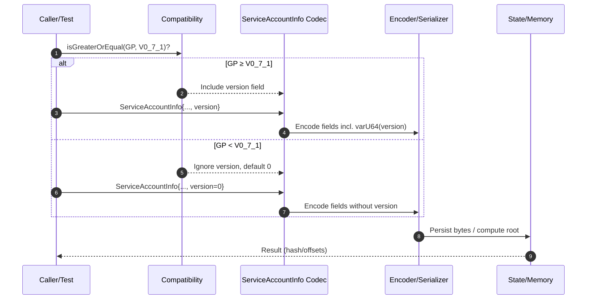

# Encoding Service version 0.7.1

## Pull Request by @DrEverr

according to https://graypaper.fluffylabs.dev/#/1c979cb/3b82033b8203?v=0.7.1


## Comment by @coderabbitai[bot]

<!-- This is an auto-generated comment: summarize by coderabbit.ai -->
<!-- This is an auto-generated comment: skip review by coderabbit.ai -->

> [!IMPORTANT]
> ## Review skipped
> 
> Auto incremental reviews are disabled on this repository.
> 
> Please check the settings in the CodeRabbit UI or the `.coderabbit.yaml` file in this repository. To trigger a single review, invoke the `@coderabbitai review` command.
> 
> You can disable this status message by setting the `reviews.review_status` to `false` in the CodeRabbit configuration file.

<!-- end of auto-generated comment: skip review by coderabbit.ai -->

<!-- walkthrough_start -->

<details>
<summary>📝 Walkthrough</summary>

<!-- This is an auto-generated comment: release notes by coderabbit.ai -->

## Summary by CodeRabbit

- New Features
  - Added versioning to service accounts. Encoding/serialization now conditionally includes a version field on newer runtimes (GP ≥ 0.7.1) and defaults to 0 on older ones for backward compatibility.
  - JSON state now accepts an optional version field when defining services.
  - State hashes and serialized outputs are updated accordingly for newer versions.

- Refactor
  - Streamlined version-based value selection using compatibility helpers.

- Tests
  - Expanded coverage for versioned encoding, memory sizing, and GP-specific expectations.

<!-- end of auto-generated comment: release notes by coderabbit.ai -->
## Walkthrough
Adds a version field to ServiceAccountInfo across state, codecs, JSON mapping, and initialization sites. Encoding conditionally includes version for GP ≥ V0_7_1; otherwise defaults to 0 and is ignored. Tests and expected hashes updated to account for the new field and version-aware sizes/encodings.

## Changes
| Cohort / File(s) | Summary |
|---|---|
| **State model and codec**<br>`packages/jam/state/service.ts` | Introduces ServiceAccountInfo.version (U64), wires into constructor and conditional codec (varU64 for GP ≥ V0_7_1; defaulted/ignored otherwise). `create()` accepts and forwards version. |
| **Host-call codec**<br>`packages/jam/jam-host-calls/info.ts` | Adds version to `codecServiceAccountInfoWithThresholdBalance` with GP-version-aware encoding; imports `ignoreValueWithDefault`. |
| **JSON mapping**<br>`packages/jam/state-json/accounts.ts` | Adds optional version in JsonServiceInfo; maps to ServiceAccountInfo with default 0 if absent. |
| **Externalities implementation**<br>`packages/jam/transition/externalities/accumulate-externalities.ts` | Populates version: 0 in `UpdateService.create` for new service initialization. |
| **Shared test utilities**<br>`packages/jam/state/test.utils.ts` | Adds version to test service info; replaces conditional TEST_STATE_ROOT with `Compatibility.selectIfGreaterOrEqual` and updates version-aware fixtures. |
| **Host-call tests**<br>`packages/jam/jam-host-calls/info.test.ts`, `packages/jam/jam-host-calls/write.test.ts` | Injects version in test data; adjusts size/offsets and expectations based on GP version; removes `tryAsExactBytes` usage. |
| **State tests**<br>`packages/jam/state/service.test.ts`, `packages/jam/state/in-memory-state.test.ts` | Adds version to ServiceAccountInfo in tests; updates encoded payload expectations conditionally for GP ≥ V0_7_1. |
| **Merkleization tests**<br>`packages/jam/state-merkleization/serialized-state.test.ts`, `packages/jam/state-merkleization/state-entries.test.ts` | Adds version in update payloads; switches expected root selection to `Compatibility.selectIfGreaterOrEqual`. |
| **Database/state tests**<br>`packages/jam/database-lmdb/states.test.ts` | Adds version to `ServiceAccountInfo.create` in LMDB update tests. |
| **Transition tests**<br>`packages/jam/transition/accumulate/accumulate.test.ts`, `packages/jam/transition/externalities/accumulate-externalities.test.ts`, `packages/jam/transition/preimages.test.ts` | Sets version: 0 in service/account creation test paths. |
| **State JSON dump test**<br>`packages/jam/state-json/dump.test.ts` | Makes expected root hash conditional on GP version. |
| **Bin test runner**<br>`bin/test-runner/w3f/preimages.ts` | Adds version: 0 to ServiceAccountInfo creation in test setup. |

## Sequence Diagram(s)


## Estimated code review effort
🎯 3 (Moderate) | ⏱️ ~25 minutes

## Possibly related PRs
- FluffyLabs/typeberry#601 — Modifies ServiceAccountInfo structure/codec in `packages/jam/state/service.ts`, overlapping with the version-field and conditional encoding changes.
- FluffyLabs/typeberry#571 — Adjusts host-call codec definitions; intersects with adding version to `codecServiceAccountInfoWithThresholdBalance`.
- FluffyLabs/typeberry#546 — Changes ServiceAccountInfo fields (e.g., adding new properties via `create`), related to this PR’s shape expansion with `version`.

## Suggested reviewers
- tomusdrw
- skoszuta
- mateuszsikora

## Poem
> A nibble of bytes, a hop through time,  
> I stamped a version—zero, sublime.  
> GP sings new tunes, I keep the beat,  
> Old burrows safe, new paths complete.  
> Thump-thump hashes in moonlit night,  
> A codec’s waltz—left, then right. 🐇✨

</details>

<!-- walkthrough_end -->

<!-- pre_merge_checks_walkthrough_start -->

## Pre-merge checks and finishing touches
<details>
<summary>❌ Failed checks (2 warnings)</summary>

|     Check name     | Status     | Explanation                                                                                                                                                                                                                                                                                                                                                 | Resolution                                                                                                                                                                                                                                |
| :----------------: | :--------- | :---------------------------------------------------------------------------------------------------------------------------------------------------------------------------------------------------------------------------------------------------------------------------------------------------------------------------------------------------------- | :---------------------------------------------------------------------------------------------------------------------------------------------------------------------------------------------------------------------------------------- |
| Docstring Coverage | ⚠️ Warning | Docstring coverage is 0.00% which is insufficient. The required threshold is 80.00%.                                                                                                                                                                                                                                                                        | You can run `@coderabbitai generate docstrings` to improve docstring coverage.                                                                                                                                                            |
|  Description Check | ⚠️ Warning | The pull request has no author-provided description, so there is no information relating the changeset to its objectives or context. Without any description, we cannot verify that the author communicated the intent behind adding the version field and conditional encoding. This absence fails to meet even the minimal requirement of being on-topic. | Please add a descriptive summary explaining the purpose of the pull request, including the introduction of the version field, its conditional encoding logic for GP versions, and any broader objectives or compatibility considerations. |

</details>
<details>
<summary>✅ Passed checks (1 passed)</summary>

|  Check name | Status   | Explanation                                                                                                                                                                                                                                                    |
| :---------: | :------- | :------------------------------------------------------------------------------------------------------------------------------------------------------------------------------------------------------------------------------------------------------------- |
| Title Check | ✅ Passed | The title succinctly describes that this PR implements service encoding support for version 0.7.1, which matches the changes adding a version field and updating encoding logic based on GP version. It is concise, clear, and fully related to the changeset. |

</details>

<!-- pre_merge_checks_walkthrough_end -->

<!-- tips_start -->

---


<sub>Comment `@coderabbitai help` to get the list of available commands and usage tips.</sub>

<!-- tips_end -->

<!-- internal state start -->


<!-- DwQgtGAEAqAWCWBnSTIEMB26CuAXA9mAOYCmGJATmriQCaQDG+Ats2bgFyQAOFk+AIwBWJBrngA3EsgEBPRvlqU0AgfFwA6NPEgQAfACgjoCEejqANiS4BRDE1rwMRSAGVKE+AxKQpFRPD4WAAMGgDsGgCMBgBy2MwClFwAbACcAEwGAKoASgAyXLC4uNyIHAD05UTqsNgCGkzM5QBiFtgAZu2yeSqI5biy3CSJFBSy5dzYFhblaZlZiEmQACIUNn4UBq742BTekAJU9rBczGiIhE4MbUpgfgFBYHI0YO34FGBoDEzYGLgG0DQFFIuAORwYJ0gZycW1w1GwZX4QwwBlWaHanEguAo2BIBhyJE8JAA7pREQYeokLOSAMIUEjUOjoTHpYLpACsYEiwTAwQAzNBIukOHyACwcUV8gBaRn0xnAUDI9Hw7RwBGIZGUNHojTYfy4vH4wlE4ikMnkDmUqnUWh0cpMUDgqFQmDVhFI5Co2oUrHYXCoxMgiHiZzGBwtiitak02l0YEM8tMBjUGH60lwYBxGE95WJfPaE3p8DOpEQGlwZQMACIawYAMR1yAAQQAkhrPYz6MHWED5CrGLBMKXZc3aLRkGhIORA/dAlh2vASBZ6AQsbAfO4KJ5vE3vjs/i2MG8GvTGYw0NNIMSak4sendz8/ogALJobh2bGyaD4B/73AAGiDEhiicFxZyCLF8CxMYm0QLJklFAAKYIAEoNAMKAYig/BcHXPhEkHTx3gvAch2kABuFAMHUeAL3gAAvag5ynfBAyuG5pF8MlmIvIIiACJRIBIAAPJBxGcSAFyXcdIEQy0AAlzlgQCBAvTBvEAr4GHiKZGWfJwAHFzkA4CGA0NCjCMBtmwsGgvTnZBV1wnwlGuIEmKCZB+xE7h3m9d4eDqCwvCEv4aOkEcAAUKHwIYKAGdAxyZVcgSIeJ2H4VVN23Ehf1+XBD2PBhTxoLhwIwLh4NFWTPEnT9YKq5CUJQqjJPgKwDicNNEAzLMczzAteBIYs0FLctECMGwepG71LUgekiUDEhOj8rhnzoeB4mrWsMKTbgvgAa1G6RyiENAmloagVHOEgwAsZhaAEcoesZMsaB68aOG2qt60bVt2y1Jlu1DPtVQhMiJow0cZMnac2uk9BEACIgMD1UFyq4eq4IQpqqIEnxnLcDwvFyvd8sK/ATwZGhz0vBEmVvQm8mfZYACEgzhd7IGwbhLpp97NBgBBkCcbFFGwbwJynEkeBiuKEogwnFi3EmKaNEQxCvG8sEJrJecZbKSZ4ahYA0IWfGDUZ90cCSLHwaoGHQDB6B5vmfHaO3A3paEdfXINzpIFS8DXHxHkcRADo5s8MFYqjrmwJRHL98rfAvXFJICwnXc7ICVf2dgxjNrD+Gcvg7Yd/g+EoGK+EHZ3gok8HnE4oEfFFmLaAluh0MsqB1twxQg3gFH4Xpbn9e1LhDZ3MmDyPSniupnwY8DLSWGYRRXvQLj/GYqTl1a9QRYwSZQUEDXQUQ84hM8JR7CZOQQ8SpR6Ax6DZAanHUNawmBbQoXnTMG4MFFugUBDBQYK8L4oFIB80nD1HEYhdihz4O0L4BAwyoBEjQZ2yUoLBm4L5eKTtn40SCCRfe9BbzKxyqFbEi4yyTWmmcWakZ5qEkXEtFa8U1obS2jWH6u0wBGH2gwI6pZTrnUkcwMAsB8A9TAAwC81JyhOGPALT631frNjbB6QGXYQy9kyqRZukMoAEg3lIFcMFEA2GEug1msgubFiIaCdoMVmCQAAAIDCGCMMY5RLSO0wF2AghCmQIhgeoSiK9+AYAsPIZYohIx8EAa4pk7iWBrmoFCcWVh0JQCbElegkxwEhRcX5RENIWD7XEGoYKCUQmQAMtwAAatxCCmTPE+MGMMau4w8DtUYeYkgwCvhMkEHCJwMCAj0R8NeXC79YJ2IcU46QclIwMGnqTR8BV54AHUahwHpIgORy5WZqXvhoWZJB5Kixao/SJjdNnbLynPN4hzcLHOkGc2gFyLDqRINchitzRYaGeNIApkA7H7VwfQdcFg4qSV+GIZiQ19r0gJPxJszt1obzDMjDAo8CZQS0qM0Ero0BjjIUSiwuccquBBcbKgbA7KySUGgqY3onJ+14IEPgNz/55BsDEAA+jkGwBkWKBnpsgGhJNGVzLxjQKlxjCZDSIgiBQGAXp/ChYeMWndvD0FhjLcqnxiSt0SkIBEuA0Y/3TJWSAuhoZMknCnShkF6Uk2qUA9WJp0LOqgL60+FtibeEVT4JgzsaXKPkKpRYyosAhqYvU9QsgNBIAMiVSgAB5NYABHbAF5EItPabvIIGhWnBFFWEUVkR/4tlVNiXEgF5URqZagekRqH7yDCJRHCeFryLBQKCWVT93jDycCRG5gaXWRXOEnKNF5tIAu9O2kgkbEYHEHegWeey3h5DIEQRZTSN1btXOi1uWLEA4toHi94GaoZFJtT1N1SNKDiE8l6te+UM58AMpFHeDwsCOE6JQMgksvpBsgBK1wWQ8jQHFZK1ObRl6xyUMiGSEFAPAbnFwVIYQsDwFVNW2t9bK6QCIDmiggFB2UGHT4VIyQMBzqgPs9cWBTw2xcAGKEJB8WyBMsJIYYgmTrmEhzCgMCm6li9fSD2Jon6IADnhx4CaJmdEWABISGgiAaEAlWYIwlgimfZMEcz7INDWarP+6WpIANAZThIZARmTOWYs9ZjQtm3h8HwMuSgUK9Zu3oMwLl8BgEE3TGCdS65HJQV4LFUaZ5CZw3PUy8uIUmmrnpk/c1aBLVj24zsCsdmBC7rUaS5280CuwKukGbwRLpPyP1b7HwgAcAlOTsA+sLymqhjqCMgOwiCwH44J9A0x8BKO1IAXAI7w9UAo0UNXZw2bqZQEZg7UgQJPk8tKwmsU5gfaBB++yBfNjcfUPeioEe7WSMDZOyHkdVesJq5AF9lv3eRE35CZfBSkQLoeFMxkAsLkCYeIFhTI5oLU4UJbhmI7kja0UIkRh1jp9DOk0THsj5EZiUdMPolXNECO0f9PRXogaGLDP2WTEUoYtiAatZ+DMUbvBIK0tOJBPmwCSZy2yE2+L4yJnnHZf41ZdO8b4vpoxxgvRoFCyKQUQpBJMaQLgt4gmvP3RTbn3yuvnMuRpKihqu4mvs/DA+KdcI5KwTUSgChXIaAkECKqV5OPNKcx0rAegAC8kAyN1siJR4eMd6Qc7Q9z3naAuWISxo1VCLV6MUEY1Cmw4GxCYz9pByM9Ate7J10c2AJzfn/MBdK7Vjgv20p2+xBOoCPWLgPhppN818rFh8OVTS6fxIuEJteMevmWFOx1DU1N7V02QDrrQBu+nLKk9slqByL2/ZvfclXryqofI/eVH9pXjt2BA5HP3ORXYQ/EvHiFg0e/tW6tBJr1bbyD34F10Xn5/m/mG7bvOdqPhRHiJOpjtIjjgovjiokTqVrErXonCQlSpXnOBQo3rQNBi6m/CmnUuPgMJmogNmkvBQPmjYEWiWmWl7lWjWoHi1AAPwO6iBO4u4ISQDq6s5h6c6R7LTR62Sx42Lx7NRWQNjg4zRQ5sIw4yzLS+aYjrSOD8I7QQDCIGB/7o7SJAFyIgHKJ9DEjSby4aIVhfQk7WRk6agU4GI9jU5gx1zDgGBFIwzm6eopzaYvZcFfwtSMx+x55i7zxUxnhwJay4S3hXr0iP5lg2R0pJ6QCZbBLVZeEopmHdxz56EL4fbPY8ouSiDvZPYb5CTfbxS/ZgIA4H7iB06YRBB4gGBTQQ45zQ4cIiHw68KSHMDI4yGo5iIKGAFy63RCAXCpi/pPjE61h6G6IGE5zAxGI07RHA4Godym7bxwyxRV4kQN4IzOE+AABSHR2yasSxrguaMQUIb43AoEmeX+p8/qmskB9gHEE4WAMx8BdKKciEGKia3ho2ceCEKEmk1WhMZwhCMC+0H6ScqAnquEMU2AI2y+UaOaueD+2u88gEHK7BPeXqwQKAqovwHKTgMRhSxST8TAow0gvkMaEk/2IUNhXuFBlU9BEEKxQQax0JE2IeMChMbkSMQYuwaC+wCyTxfscMGxWxFutAUKHGZAN+LaqKEkrh5M88kkHiT89xTI3JMQgEDJbCsS0acB5C0w8gi6IeyAneoUlsMCk4sJXKxiiJJGLEoIiWt8MRJRzC5RQhlRXCYhNRm0dRJOKOchaOEiLRnMbRHR5QncQC5Y6YPRP0fRAMhhzJxhoMquBRrqVCjOPCkAaB8AaaAwgExBFa84UpVYPSfi/S5Qgy1IVYUKz4igJGi49AMUOEk+SkGRomnMzEq4iQFesaFg6uqoSZKZGaWaNG+BhBFgpabSJBAe9aLUzkWAuWbmYQJAkQAAHBkGEGOO0OyKKOyGgMkMEO0AwKKLQKKMEMkCQAeeuaZqkOZhkJ0JEGEOue0KKF8AIDOQIHyAIKkDOZKAIMEJEKKCue0MkLQGELZkuCOgdAedwJAG5u0MEAwMkOkAIGEMxpEGgBeY9GgHOchTOckAwIhQwDOTOZEL+e0E+SQOkHyBuekAwAIN+URZEMkO0OkEKHyGgGEO0I9AwGgrQOyEWbEX9PEWkaCbAikWvkvl9ukjvjkSFHkQwiOMXLTvFrWdvhMNfqvgkcgEoDQGJnyfwZDiPoJMIQ6UzhIc6fUXtB6QAVIq0WAGwBQAdFYAxE9s9JQLRMFHMrQGAK0YGR9NoVoqGeToMVTlGdJUYE2NYYgWphVEstjEhN/JahOJiUkd6t4GrOfEpj8Q8auMFgbKth4TTIsbnA5SCs5a0fNoLE6MfCbpLDAdSrMXSolvLPINlWKe8glmgLIHbFSl3sdiKb3n7MrLlU5VHDTGenUIsEWhlE4OZQJpdkwNwOMEtlah7KxEXNhKXKEfbMrqMZRtGmLBYK8J7LkmBl4DxVakNIsH8JRNXAFFPjPuwj7MgFEWRLQG8SuH7ALJJDtd7NoIkV1apucPAIJBLoTNglQLyQcMNBJN1XRL1U0nFAEG+upZZHEY9uvrxYpTxUJdvpRoSfvmFPkcDsfoPISuftnJPJAAAAb1VP6ZUkDE2tQbydwdTE05nS4BKtFU2xJkrcClaUoVXXFA3E3lRU3ZVOBHGJWax3Ew47CIA7a9DsAWTWllGsLaX2lw6OmQD6VSGCINHulNGemmXeljWWXWWMRV7PS60FwMJuWaAeW6F/T9Edjrq+XGL+VQwEhjLGpYlBCqm0oHB2xiLZJ341J4DJRZ4iYmhMiVmgiDinIHA3Qt64YpzsnbwBDOAdSgFeodkYEZqLD7YFTtA4GMh4GFrFoWBmxwDLwywp0Wk/WgJoLTCqQ+3O5obD7bzlTICfGARQEwJkbJC1qATDnBAPVPzTiS2YnDmRD92akoxLrsLBj86rg+Qh20A5D4A4TF3CxCTBSbZEpcyHCxZPDR3LUVxNKNbYjg2cTmrN5ARZ1zgr1RY9SIzKxV7l4zUnI5Un18kgiL04SKSnKISjlQSEz13pyJY9r0CPxKxLgmjvALUlx4TA2ET8rRleQCA0JWn3ZNjcWI2xXI2I2o1ZEiUY2A7Y2ygaW2kK2LRK1M6I6wCGWyHyHa1NCtGqIYBjWCYuXenm3Bmk4236IRkgwO2jEjiWFupBUIxvzPERW/1Py10HSFbOUzV1IdRdFuKIGIMXytSHgPpjCuDemFWBHFwhFhHrVBCbXbWxzSU9y8EPaL7fqYP8VKXGJb64Po3X7iV06g7FGlECFaU+A6XkMJmq0unSFGVa0mX0Pel2Ui7sOW29HW1hk+WRl8MQwjgM6uKIiCP0Bp0NIanVbpkgYC7OBC5KCjIEGF2SlZIM3+IDLiDUhQrVIxqVWFV1Zwi2D2A54NMIIwKxKYZKheTJqj7oGZNYG512S9mF0DnlogakHkYNqUSZ0mg9OhzNrEhQSDgUCyOtMSbGzNX4BUrDIwDRZwJcBpMhVA2xVk1qyLxPabMtXqWOjRZz1iBpFcAl1tPAQ8zl5QH15e5cCImUKaTBQowwLx2Kl1Pc3Z48bGy4TmNQyK5lKOxNiRQthPMuGQn54SkXMP37RbOqpEDvVSxwzzEHxXzd6T2WyskLPC45SP4UwU3yWwuNPwKDhDAy0eOaXUHsJkOiF6V8IBPq1BP/4Y462MjhM5QcNeUDF23xMjGJPPqYnupe4nNQRnMSlNL94Mygiix/1+zVKuSN3RoIISwYLX2JmbKP3u0tk7bjrup0HVQq7nZx3u6x3yuoC+7+5kH1p0alyMajqSSqFR0+0pQsRgCxR8WIDFQRYYK+3sK4C7DPYGlsFGkANArmyMA5o/0+tiCXaxLJWcT/3yuJulOeKEyC14BGt8rO40x6vCkRv43Rtjw4tOBSz4PFbxLyBvyu4YoBx2Qr3Oh/ATFlX4OspUr1aKxdWrbHEUrVbVXJbOKgiAnDajYNtwhhSXNNJgs3ZRTX41vIIX6vTIFQBKtvBCmIIRunHxzQFNsMi0BBA7ZtsIRsYUskxUsSnauiB8VuQJHPzalfOQCu6erx0qktmhQODrswYHsLw5rl5s0c3Va+YyMThO5Ot/Caul2BiVvHuQPEPy3eOK2ct+PcvUONH8uKEMMaIFlvSVhW06KxMSu8NSumICOyvHMAnIdxU+CKNUSHvsmMzphaNnim2cSIQbocdQSnvnEhWYwOHiMWQjIu2B2/5i1apha2TwBPDgijbQA2CuBIZadNgafiq5q5rQD70hSIQOOghWCggadaeio6d6c5AGdGfx0kblAAUkAtTx3wKgQdRmeCE6pLuWeafafQC6c2D6eGc+jLa+C0TGtAJj4DOzNiBNpDN5oF0Xht29viwMD6khUt1vh2Y5NX2d3d2uvkZ92N0j2ATAJaqTjV0WBSNBYTxCNWdBchd0JhirgJegiJC4CkiCk9fLMiRSagQyB704aDkZmTOB6ARPIuAZPpqDM9mpf9kFeVoj0SN7H+t+y7FyzSZniJtQovq2pyeyWOPNc2fBd2cOdvupEP0S6ThhZwjgI+Bmc/pCmYCggechUWpWqdfMRsBNxICeKIQwCBfnchdhdGexLjqpYyyddgCmn/d1yA+PFN1e65fcAy0WNoMI1L42Pvso2b6ZH+S750suPA4wpo15HyBbtjyE10B7sg/We2ehf2fhe3gLhWAGjGUCuhNCukdVPkcGDOowbRQcLi1cDE0vcWeM8teXeGdcDtPODkTE1C/C+YQkgS8veVsy9g9y9Gd+5zeYGddJeLfFMloADekAXmkAAAvihCr7LZ42yz47hwjsPFQ66RrbQyE/0EcAEEbVpDpGuiQOUIH0p4yJExR9E1R95TR8MaYdKxiVYfi/K8x0/GBym9TGik1dc2bK4KJmWaAUJm7oKWhwa9l3DOo+NZo6tgqX7JVuO+82cXXl+xmRJx/OFbjLxPk5XRkWJDApQoEcVQg0/NMuIODZc7Uk8QlrFLpP1aJY7ACYOB99fBqoEAiDtiwOoNqFA/oytY7AFBtTFHSnNah2tVau3Jlyg9C841jdT2frWz4HT0gQ+zPKi0VBB7eDTVMD4OU3mQVazW+DkoLipCepsSQzKyQqoThYjBzWBDpQ/g47HuCyxIbYcOW1RFWvh0958tmiUiY+jqhpQudhIdkWlEDlD7fAg+jIMANgkoAkDsakfHQtH30K21KckrBPvRxlYvwpiZqVPsFVXAZ8x+PVS5txx6hOoXUh4H9o122QU1aYJ/AKKakDAbpAIKcVALEjsJORJOTUe9uIKr6CZtkQEaNiBS45YA/Cm6b0koKdbIBVBwEewh324JQo9GSDDwCoGTprVVwR/fzC9VjgBQzqtcEJDPgHQttQB3NAllQmojj9HKQgnWOmGFZGxtMbzS0FC3hpWNEiLHLBoJUJ7CUnGpPLGhJShhuNMOghUhrDld5Ok1asobAXQ196YB/ec4QgcQLojY0yB2kcPi8GoEUBaBZtKJiGRiax8WBtHNgeYST54tuBEAz1IJ2sGrhEStUMKtwQkZgMRcCVY0JrGzYrgoIaVGgFIPRbzJ3c6LCvrDwyoAJkA0lZTIy3Jbqo98MQ7wFAiy4SRIiKVKCAIJPpcCFBtfHgDhAPxxp0A3eGZPZQn4P0mkV7YkH51PCeI9W6UfwJG3pCb8sAGfQfokK4o49rGqQ2xgTxO7E8F+BDXIVAGaDBVYC9PEmnzS9Sk0UWbhD/kvH5oYAJAU2S5kYJJre8eeVQ/AUbTaEdCToYfOfrdBZENDOhiAKmohAba99ia6wzdBlS2FU0U652eQax2ZY2ksO7LYoegP8YEdNaRHQAngJqFBBCww0EsJCi0JR9uhMfcVn0Pj4IMAqY4YYTOB4EIxTmJI8Uoe0xbXNWoWwx/G2mAjwkrcf9DQahHhGWM7GePG7ukLRHZF8GZPSSkUQKFeN5RVRZWkqKwE0NueihdUQQPpApNuomgMjqKx6FGijC/Q00RwItEYi0+GfXYUEDKgWDy8FdTgeMPRjRcxGTUdzjsM8hVt6S9fMIQ5SojMNLsQnInIcJH6vZ6sSiUYOWXDCv9RcdoqCOyRKwTY7IMCEIoP0MYZcT+nsXfktQIhoAiIfAY4YIGQaw0j8wEE/EPBHiP8d2RNMDtIMAHeB2aIA2AoB2qqfpW2iHUdBODgH2phal8NQZ6NsGOEf4q9BEMdH/jD9K26gAOo22vzwsWwzJCgGS2jK8USxxgnPts3oDnYzxEY53jh0VGYDAmCYB0KFGVCqho86oXoSPl9D6gasCg+2o/EtBUBrQMYO0PGAMA4TdQ6gUVD9UQCiodKdAUVC9GIRygGJCoRgAyBnLpB0gYQB8mEHgrHYvgHIJcjeVoDMZRQpFNIFSkvLvluQP5OMNhP4lMTcALE8cOxPtKcSlQGkviRAFlgkBRUFlUgKKghCiADobE7iaCF4nm9VeVYJALmg2A/U74VYLgNXUWD/gXJSASKDkFZje0gKtAX1GjEii446A3kn1tSEDguSusUwP5KFKCmxTfJCU51FWEcAL1fgywKbFo2kz5MaQ64MRLFJbSZTQKOUnIL8HMC4ArAJU2yeVJxCVTspP1GqRgCSShtpM7NOcI1LKkSdW0LkhuGFJbBIxcQiAQqbFJrD+SspAKHqP1IOgEhp6FYWKQAG1VezqZycL2F5VgbJYiGIAHGml1SOoi0qsLNJ2mgU5cCIZqUNMumgUfIAKTenOGOlPVLAFsCWDcLEA7ZE4YbRIEnByQ+FkAQUlAEAisBow5UY7NdqDR5iuI7MKcUIBEFHpu4vAo2FhDZMnrHCbxEkOVqMNxHVZCaMCaGS4AMbn0cMnuCbpABbDqsjhQQLLn5MYBWAgQ/ddoFMB2xQic4sVaSsBG8wXSdpVYE5P5kGRBBppUlNauQDoDvon44geqWx3IEU52Ze2OZk/B9gwT+w2MlwKuxabgt5htCEIbzM2m7SaaJAaaYVmojOBzphsrKfSGjQLg0o9IdKReD8lWzQKk6aoLSkWmHS2A00mWVYB+g7SbefMyANtMul7TSpB0L2SbK4BVh8pDARXrN3wB+Bjols+6VWGumIBHZ8UoOVlMemYAns002OfHIUBJzSAKAZAKEFMwABSFGRCDLl4wOgC4LLuwCNb0gi08AbtGuGLzv465M5CucEErkGzU5gstoFXmmkABNHYOeC4y/ASaXiKiSoGjCxhehsCKbPHN5FeoXEMUKQCvLjn0JnkJcoFCnNDnGzTZQIc2UQCPn8y3Z06CwJ7KOnRyr2u8oqfxH9nC9A5hskOfzP2kRz75oFLqWG16kQQzp2cq6ZzBuk+SnZlU/mbnOekizo5zzSYJeFbkTTw618GOGqDkQfBKxTIX6T1KrxtpkOY8FQQ8PngUAWEzEDmfCQZKjEJhDw0rG+MkCcRD+RjbBGbG5xTjMA8gXBeGznCARSQU8gbDvBIzyBrcs7LbngEwU+gws1EabMd1FgZQCITgE1NSgki5s8ZCMQ+ma3qbEzu2E4RwffB9ZDIvUbAawYSD65+wN6I0OlMgvbkCYMo/YRILOKYZhIvAg80OcPOFkYBppkUJmSOlgLbxuFvU7eUMTDC5zpkqi3lLsF8gjp+w5wpBSQGGoLY44NwFsV/lKoP1YlycK0cuDbqlYAO2i7WTAgMbnZHWGZRAGPQwDxoYoVKe3AwrNCGNYu/TCfHq0rpKU3F/Mk+dHLNmgRL5u0m2UEDtnIJM5zs1OdfI9nhzI500wJaPMNk29VeAAXQulVh5puAIKSdKjmgVdyqQBkCxXaCRBcK7QGcrQDQTEVggtACzGgFFCEUlyTFZjDOSXJfBZyLFMcDOVXIbkEKtFWiq8vSCigaKJAUzJEB+hzKTJUAIaBZMoBWTv5bEoyfoCAA= -->

<!-- internal state end -->


## Comment by @DrEverr

Sounds reasonable. I was thinking how to read it without putting it into service. But I only came up with this solution.

Implementing you suggestion right up.


## Comment by @github-actions[bot]


<details>
<summary>View all</summary>

| File | Benchmark | Ops |  |
|------|-----------|-----|--|
| [codec/bigint.compare.ts[0]](../blob/33f1922b5efcb264276e766be4d78e38d812790e//_work/typeberry-runner-3/typeberry/typeberry/benchmarks/codec/bigint.compare.ts) | compare custom | 251975528.92 ±6.6% | fastest ✅ |
| [codec/bigint.compare.ts[1]](../blob/33f1922b5efcb264276e766be4d78e38d812790e//_work/typeberry-runner-3/typeberry/typeberry/benchmarks/codec/bigint.compare.ts) | compare bigint | 247355510.79 ±7.72% | 1.83% slower |
| [codec/bigint.decode.ts[0]](../blob/33f1922b5efcb264276e766be4d78e38d812790e//_work/typeberry-runner-3/typeberry/typeberry/benchmarks/codec/bigint.decode.ts) | decode custom | 175903043.59 ±1.61% | fastest ✅ |
| [codec/bigint.decode.ts[1]](../blob/33f1922b5efcb264276e766be4d78e38d812790e//_work/typeberry-runner-3/typeberry/typeberry/benchmarks/codec/bigint.decode.ts) | decode bigint | 106068454.55 ±2.36% | 39.7% slower |
| [codec/decoding.ts[0]](../blob/33f1922b5efcb264276e766be4d78e38d812790e//_work/typeberry-runner-3/typeberry/typeberry/benchmarks/codec/decoding.ts) | manual decode | 23017136.2 ±0.7% | 87.55% slower |
| [codec/decoding.ts[1]](../blob/33f1922b5efcb264276e766be4d78e38d812790e//_work/typeberry-runner-3/typeberry/typeberry/benchmarks/codec/decoding.ts) | int32array decode | 184921096.58 ±4.82% | fastest ✅ |
| [codec/decoding.ts[2]](../blob/33f1922b5efcb264276e766be4d78e38d812790e//_work/typeberry-runner-3/typeberry/typeberry/benchmarks/codec/decoding.ts) | dataview decode | 167426166.82 ±5.39% | 9.46% slower |
| [codec/encoding.ts[0]](../blob/33f1922b5efcb264276e766be4d78e38d812790e//_work/typeberry-runner-3/typeberry/typeberry/benchmarks/codec/encoding.ts) | manual encode | 2731997.02 ±1.76% | 26.23% slower |
| [codec/encoding.ts[1]](../blob/33f1922b5efcb264276e766be4d78e38d812790e//_work/typeberry-runner-3/typeberry/typeberry/benchmarks/codec/encoding.ts) | int32array encode | 3671510.64 ±1.23% | 0.86% slower |
| [codec/encoding.ts[2]](../blob/33f1922b5efcb264276e766be4d78e38d812790e//_work/typeberry-runner-3/typeberry/typeberry/benchmarks/codec/encoding.ts) | dataview encode | 3703178.59 ±1.15% | fastest ✅ |
| [bytes/hex-from.ts[0]](../blob/33f1922b5efcb264276e766be4d78e38d812790e//_work/typeberry-runner-3/typeberry/typeberry/benchmarks/bytes/hex-from.ts) | parse hex using `Number` with NaN checking | 131412.07 ±0.61% | 84.45% slower |
| [bytes/hex-from.ts[1]](../blob/33f1922b5efcb264276e766be4d78e38d812790e//_work/typeberry-runner-3/typeberry/typeberry/benchmarks/bytes/hex-from.ts) | parse hex from char codes | 845258.67 ±0.35% | fastest ✅ |
| [bytes/hex-from.ts[2]](../blob/33f1922b5efcb264276e766be4d78e38d812790e//_work/typeberry-runner-3/typeberry/typeberry/benchmarks/bytes/hex-from.ts) | parse hex from string nibbles | 527278.86 ±0.58% | 37.62% slower |
| [bytes/hex-to.ts[0]](../blob/33f1922b5efcb264276e766be4d78e38d812790e//_work/typeberry-runner-3/typeberry/typeberry/benchmarks/bytes/hex-to.ts) | number toString + padding | 297467.97 ±1.39% | fastest ✅ |
| [bytes/hex-to.ts[1]](../blob/33f1922b5efcb264276e766be4d78e38d812790e//_work/typeberry-runner-3/typeberry/typeberry/benchmarks/bytes/hex-to.ts) | manual | 15684.22 ±0.49% | 94.73% slower |
| [math/add_one_overflow.ts[0]](../blob/33f1922b5efcb264276e766be4d78e38d812790e//_work/typeberry-runner-3/typeberry/typeberry/benchmarks/math/add_one_overflow.ts) | add and take modulus | 252241365.84 ±5.48% | fastest ✅ |
| [math/add_one_overflow.ts[1]](../blob/33f1922b5efcb264276e766be4d78e38d812790e//_work/typeberry-runner-3/typeberry/typeberry/benchmarks/math/add_one_overflow.ts) | condition before calculation | 251662868.84 ±5.8% | 0.23% slower |
| [math/count-bits-u32.ts[0]](../blob/33f1922b5efcb264276e766be4d78e38d812790e//_work/typeberry-runner-3/typeberry/typeberry/benchmarks/math/count-bits-u32.ts) | standard method | 103484484.95 ±2.43% | 56.71% slower |
| [math/count-bits-u32.ts[1]](../blob/33f1922b5efcb264276e766be4d78e38d812790e//_work/typeberry-runner-3/typeberry/typeberry/benchmarks/math/count-bits-u32.ts) | magic | 239055017.17 ±5.57% | fastest ✅ |
| [math/count-bits-u64.ts[0]](../blob/33f1922b5efcb264276e766be4d78e38d812790e//_work/typeberry-runner-3/typeberry/typeberry/benchmarks/math/count-bits-u64.ts) | standard method | 1628393.68 ±1.3% | 86.29% slower |
| [math/count-bits-u64.ts[1]](../blob/33f1922b5efcb264276e766be4d78e38d812790e//_work/typeberry-runner-3/typeberry/typeberry/benchmarks/math/count-bits-u64.ts) | magic | 11875557.19 ±0.62% | fastest ✅ |
| [math/mul_overflow.ts[0]](../blob/33f1922b5efcb264276e766be4d78e38d812790e//_work/typeberry-runner-3/typeberry/typeberry/benchmarks/math/mul_overflow.ts) | multiply and bring back to u32 | 242187318.37 ±5.93% | 3.94% slower |
| [math/mul_overflow.ts[1]](../blob/33f1922b5efcb264276e766be4d78e38d812790e//_work/typeberry-runner-3/typeberry/typeberry/benchmarks/math/mul_overflow.ts) | multiply and take modulus | 252117823.5 ±5.27% | fastest ✅ |
| [hash/index.ts[0]](../blob/33f1922b5efcb264276e766be4d78e38d812790e//_work/typeberry-runner-3/typeberry/typeberry/benchmarks/hash/index.ts) | hash with numeric representation | 190.92 ±0.34% | 26.6% slower |
| [hash/index.ts[1]](../blob/33f1922b5efcb264276e766be4d78e38d812790e//_work/typeberry-runner-3/typeberry/typeberry/benchmarks/hash/index.ts) | hash with string representation | 121.21 ±0.49% | 53.4% slower |
| [hash/index.ts[2]](../blob/33f1922b5efcb264276e766be4d78e38d812790e//_work/typeberry-runner-3/typeberry/typeberry/benchmarks/hash/index.ts) | hash with symbol representation | 175.94 ±0.38% | 32.36% slower |
| [hash/index.ts[3]](../blob/33f1922b5efcb264276e766be4d78e38d812790e//_work/typeberry-runner-3/typeberry/typeberry/benchmarks/hash/index.ts) | hash with uint8 representation | 159.66 ±0.39% | 38.62% slower |
| [hash/index.ts[4]](../blob/33f1922b5efcb264276e766be4d78e38d812790e//_work/typeberry-runner-3/typeberry/typeberry/benchmarks/hash/index.ts) | hash with packed representation | 260.1 ±0.42% | fastest ✅ |
| [hash/index.ts[5]](../blob/33f1922b5efcb264276e766be4d78e38d812790e//_work/typeberry-runner-3/typeberry/typeberry/benchmarks/hash/index.ts) | hash with bigint representation | 187.72 ±0.41% | 27.83% slower |
| [hash/index.ts[6]](../blob/33f1922b5efcb264276e766be4d78e38d812790e//_work/typeberry-runner-3/typeberry/typeberry/benchmarks/hash/index.ts) | hash with uint32 representation | 200.83 ±0.36% | 22.79% slower |
| [collections/map-set.ts[0]](../blob/33f1922b5efcb264276e766be4d78e38d812790e//_work/typeberry-runner-3/typeberry/typeberry/benchmarks/collections/map-set.ts) | 2 gets + conditional set | 119023.44 ±0.33% | fastest ✅ |
| [collections/map-set.ts[1]](../blob/33f1922b5efcb264276e766be4d78e38d812790e//_work/typeberry-runner-3/typeberry/typeberry/benchmarks/collections/map-set.ts) | 1 get 1 set | 59964.57 ±0.39% | 49.62% slower |
| [math/switch.ts[0]](../blob/33f1922b5efcb264276e766be4d78e38d812790e//_work/typeberry-runner-3/typeberry/typeberry/benchmarks/math/switch.ts) | switch | 255269836.1 ±5% | fastest ✅ |
| [math/switch.ts[1]](../blob/33f1922b5efcb264276e766be4d78e38d812790e//_work/typeberry-runner-3/typeberry/typeberry/benchmarks/math/switch.ts) | if | 251760079.97 ±5.87% | 1.37% slower |
| [logger/index.ts[0]](../blob/33f1922b5efcb264276e766be4d78e38d812790e//_work/typeberry-runner-3/typeberry/typeberry/benchmarks/logger/index.ts) | console.log with string concat | 7267415.16 ±39.3% | fastest ✅ |
| [logger/index.ts[1]](../blob/33f1922b5efcb264276e766be4d78e38d812790e//_work/typeberry-runner-3/typeberry/typeberry/benchmarks/logger/index.ts) | console.log with args | 1141753.08 ±90.07% | 84.29% slower |
| [codec/view_vs_collection.ts[0]](../blob/33f1922b5efcb264276e766be4d78e38d812790e//_work/typeberry-runner-3/typeberry/typeberry/benchmarks/codec/view_vs_collection.ts) | Get first element from Decoded | 22648.24 ±8.97% | 57.4% slower |
| [codec/view_vs_collection.ts[1]](../blob/33f1922b5efcb264276e766be4d78e38d812790e//_work/typeberry-runner-3/typeberry/typeberry/benchmarks/codec/view_vs_collection.ts) | Get first element from View | 53159.23 ±1.33% | fastest ✅ |
| [codec/view_vs_collection.ts[2]](../blob/33f1922b5efcb264276e766be4d78e38d812790e//_work/typeberry-runner-3/typeberry/typeberry/benchmarks/codec/view_vs_collection.ts) | Get 50th element from Decoded | 23717.58 ±1.61% | 55.38% slower |
| [codec/view_vs_collection.ts[3]](../blob/33f1922b5efcb264276e766be4d78e38d812790e//_work/typeberry-runner-3/typeberry/typeberry/benchmarks/codec/view_vs_collection.ts) | Get 50th element from View | 26312.9 ±1.72% | 50.5% slower |
| [codec/view_vs_collection.ts[4]](../blob/33f1922b5efcb264276e766be4d78e38d812790e//_work/typeberry-runner-3/typeberry/typeberry/benchmarks/codec/view_vs_collection.ts) | Get last element from Decoded | 23421.45 ±1.46% | 55.94% slower |
| [codec/view_vs_collection.ts[5]](../blob/33f1922b5efcb264276e766be4d78e38d812790e//_work/typeberry-runner-3/typeberry/typeberry/benchmarks/codec/view_vs_collection.ts) | Get last element from View | 14970.56 ±2.61% | 71.84% slower |
| [codec/view_vs_object.ts[0]](../blob/33f1922b5efcb264276e766be4d78e38d812790e//_work/typeberry-runner-3/typeberry/typeberry/benchmarks/codec/view_vs_object.ts) | Get the first field from Decoded | 340676.88 ±1.71% | 7.81% slower |
| [codec/view_vs_object.ts[1]](../blob/33f1922b5efcb264276e766be4d78e38d812790e//_work/typeberry-runner-3/typeberry/typeberry/benchmarks/codec/view_vs_object.ts) | Get the first field from View | 71848.39 ±1.74% | 80.56% slower |
| [codec/view_vs_object.ts[2]](../blob/33f1922b5efcb264276e766be4d78e38d812790e//_work/typeberry-runner-3/typeberry/typeberry/benchmarks/codec/view_vs_object.ts) | Get the first field as view from View | 75561.04 ±1.45% | 79.55% slower |
| [codec/view_vs_object.ts[3]](../blob/33f1922b5efcb264276e766be4d78e38d812790e//_work/typeberry-runner-3/typeberry/typeberry/benchmarks/codec/view_vs_object.ts) | Get two fields from Decoded | 351688.25 ±1.77% | 4.83% slower |
| [codec/view_vs_object.ts[4]](../blob/33f1922b5efcb264276e766be4d78e38d812790e//_work/typeberry-runner-3/typeberry/typeberry/benchmarks/codec/view_vs_object.ts) | Get two fields from View | 59904.28 ±1.48% | 83.79% slower |
| [codec/view_vs_object.ts[5]](../blob/33f1922b5efcb264276e766be4d78e38d812790e//_work/typeberry-runner-3/typeberry/typeberry/benchmarks/codec/view_vs_object.ts) | Get two fields from materialized from View | 121382.96 ±1.8% | 67.15% slower |
| [codec/view_vs_object.ts[6]](../blob/33f1922b5efcb264276e766be4d78e38d812790e//_work/typeberry-runner-3/typeberry/typeberry/benchmarks/codec/view_vs_object.ts) | Get two fields as views from View | 64481.83 ±1.08% | 82.55% slower |
| [codec/view_vs_object.ts[7]](../blob/33f1922b5efcb264276e766be4d78e38d812790e//_work/typeberry-runner-3/typeberry/typeberry/benchmarks/codec/view_vs_object.ts) | Get only third field from Decoded | 369525.63 ±1.46% | fastest ✅ |
| [codec/view_vs_object.ts[8]](../blob/33f1922b5efcb264276e766be4d78e38d812790e//_work/typeberry-runner-3/typeberry/typeberry/benchmarks/codec/view_vs_object.ts) | Get only third field from View | 73932.89 ±1.1% | 79.99% slower |
| [codec/view_vs_object.ts[9]](../blob/33f1922b5efcb264276e766be4d78e38d812790e//_work/typeberry-runner-3/typeberry/typeberry/benchmarks/codec/view_vs_object.ts) | Get only third field as view from View | 79932.53 ±0.84% | 78.37% slower |
| [bytes/compare.ts[0]](../blob/33f1922b5efcb264276e766be4d78e38d812790e//_work/typeberry-runner-3/typeberry/typeberry/benchmarks/bytes/compare.ts) | Comparing Uint32 bytes | 16240.95 ±4% | 4.14% slower |
| [bytes/compare.ts[1]](../blob/33f1922b5efcb264276e766be4d78e38d812790e//_work/typeberry-runner-3/typeberry/typeberry/benchmarks/bytes/compare.ts) | Comparing raw bytes | 16943.16 ±3.7% | fastest ✅ |
| [collections/map_vs_sorted.ts[0]](../blob/33f1922b5efcb264276e766be4d78e38d812790e//_work/typeberry-runner-3/typeberry/typeberry/benchmarks/collections/map_vs_sorted.ts) | Map | 257464.84 ±1.24% | fastest ✅ |
| [collections/map_vs_sorted.ts[1]](../blob/33f1922b5efcb264276e766be4d78e38d812790e//_work/typeberry-runner-3/typeberry/typeberry/benchmarks/collections/map_vs_sorted.ts) | Map-array | 100379.06 ±0.75% | 61.01% slower |
| [collections/map_vs_sorted.ts[2]](../blob/33f1922b5efcb264276e766be4d78e38d812790e//_work/typeberry-runner-3/typeberry/typeberry/benchmarks/collections/map_vs_sorted.ts) | Array | 53711.72 ±3.67% | 79.14% slower |
| [collections/map_vs_sorted.ts[3]](../blob/33f1922b5efcb264276e766be4d78e38d812790e//_work/typeberry-runner-3/typeberry/typeberry/benchmarks/collections/map_vs_sorted.ts) | SortedArray | 191698.04 ±0.55% | 25.54% slower |
| [hash/blake2b.ts[0]](../blob/33f1922b5efcb264276e766be4d78e38d812790e//_work/typeberry-runner-3/typeberry/typeberry/benchmarks/hash/blake2b.ts) | our hasher | 2.13 ±1.51% | fastest ✅ |
| [hash/blake2b.ts[1]](../blob/33f1922b5efcb264276e766be4d78e38d812790e//_work/typeberry-runner-3/typeberry/typeberry/benchmarks/hash/blake2b.ts) | blake2b js | 0.05 ±1.17% | 97.65% slower |
| [crypto/ed25519.ts[0]](../blob/33f1922b5efcb264276e766be4d78e38d812790e//_work/typeberry-runner-3/typeberry/typeberry/benchmarks/crypto/ed25519.ts) | native crypto | 5.53 ±18.17% | 81.65% slower |
| [crypto/ed25519.ts[1]](../blob/33f1922b5efcb264276e766be4d78e38d812790e//_work/typeberry-runner-3/typeberry/typeberry/benchmarks/crypto/ed25519.ts) | wasm lib | 10.88 ±0.03% | 63.9% slower |
| [crypto/ed25519.ts[2]](../blob/33f1922b5efcb264276e766be4d78e38d812790e//_work/typeberry-runner-3/typeberry/typeberry/benchmarks/crypto/ed25519.ts) | wasm lib batch | 30.14 ±0.55% | fastest ✅ |
</details>


### Benchmarks summary: 63/63 OK ✅

<!-- thollander/actions-comment-pull-request "benchmarks" -->


## Comment by @coderabbitai[bot]

_⚠️ Potential issue_ | _🟡 Minor_

**Fix GP version in comment**

Comment says 0.7.2; this PR introduces version at 0.7.1. Update to avoid confusion.


```diff
-      version: json.optional(json.fromNumber((x) => tryAsU64(x))), // from Gp 0.7.2
+      version: json.optional(json.fromNumber((x) => tryAsU64(x))), // since GP 0.7.1
```

<!-- suggestion_start -->

<details>
<summary>📝 Committable suggestion</summary>

> ‼️ **IMPORTANT**
> Carefully review the code before committing. Ensure that it accurately replaces the highlighted code, contains no missing lines, and has no issues with indentation. Thoroughly test & benchmark the code to ensure it meets the requirements.

```suggestion
      version: json.optional(json.fromNumber((x) => tryAsU64(x))), // since GP 0.7.1
      code_hash: fromJson.bytes32(),
```

</details>

<!-- suggestion_end -->

<details>
<summary>🤖 Prompt for AI Agents</summary>

```
In packages/jam/state-json/accounts.ts around lines 30 to 31, the inline comment
says "from Gp 0.7.2" but this change introduces the version at 0.7.1; update the
comment to "from Gp 0.7.1" (or remove/clarify the version) so it accurately
reflects the implemented version to avoid confusion.
```

</details>

<!-- fingerprinting:phantom:medusa:chinchilla -->

<!-- This is an auto-generated comment by CodeRabbit -->


## Comment by @tomusdrw

This should stay as-is, since the `info` host call is not being changed.


## Comment by @tomusdrw

I don't see any change for info host call in the GP.
