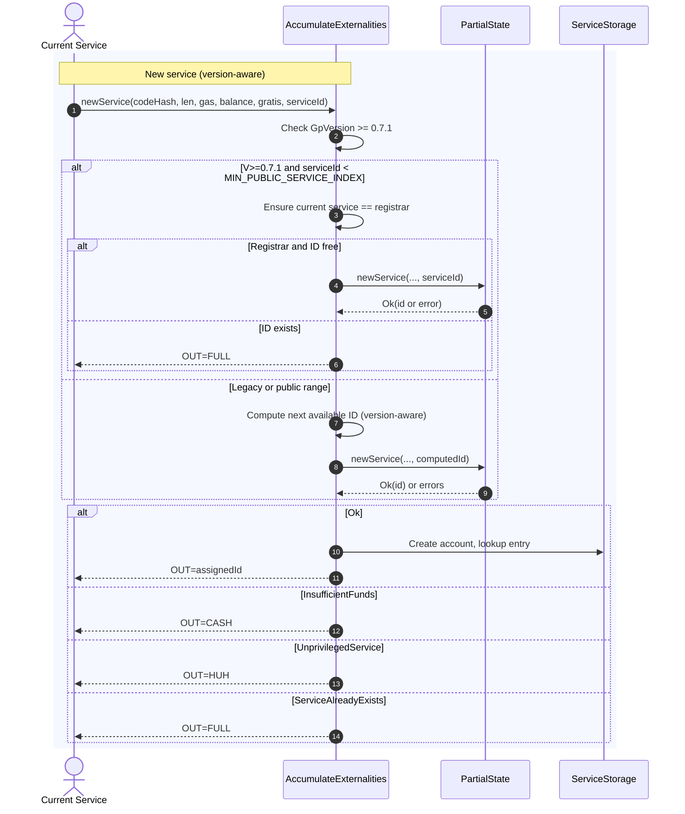

# Small service IDs

## Pull Request by @DrEverr

Changes based on [GP PR#473](https://github.com/gavofyork/graypaper/pull/473)

- added `registrar` to privileges
- added `MIN_PUBLIC_SERVICE_ID` to constans
- updated `bless` and `new` host calls
- updated `check`, `bumpServiceId` in accumulate
- updated and added tests
- rename `authManager` and `validatorManager` in Privileges to `assigners` and `delegator` to align more with GP


## Comment by @coderabbitai[bot]

<!-- This is an auto-generated comment: summarize by coderabbit.ai -->
<!-- This is an auto-generated comment: skip review by coderabbit.ai -->

> [!IMPORTANT]
> ## Review skipped
> 
> Auto incremental reviews are disabled on this repository.
> 
> Please check the settings in the CodeRabbit UI or the `.coderabbit.yaml` file in this repository. To trigger a single review, invoke the `@coderabbitai review` command.
> 
> You can disable this status message by setting the `reviews.review_status` to `false` in the CodeRabbit configuration file.

<!-- end of auto-generated comment: skip review by coderabbit.ai -->

<!-- walkthrough_start -->

<details>
<summary>📝 Walkthrough</summary>

<!-- This is an auto-generated comment: release notes by coderabbit.ai -->

## Summary by CodeRabbit

- New Features
  - Introduces a registrar role alongside delegator and assigners; required on GP ≥ 0.7.1.
  - Request a specific service ID during creation; conflicts now return FULL, and successful creations expose the assigned ID.
  - Version-aware service ID generation honoring a new minimum public index for GP ≥ 0.7.1.
  - Extended host-call registers/tracing for GP ≥ 0.7.1.

- Refactor
  - Renamed privileged roles (auth/validators → assigners/delegator) and added registrar across state, transitions, and host calls.

- Documentation
  - Clarified HostCallResult messages.
  - State JSON gains an optional registrar field.

<!-- end of auto-generated comment: release notes by coderabbit.ai -->
## Walkthrough
Introduces registrar and delegator roles, renames authManager→assigners and validatorsManager→delegator, adds version-gated behavior (>=0.7.1) across state, host-calls, externalities, and tests. Adds explicit serviceId selection for service creation with registrar-only range, updates service-id generation, constants, codecs, JSON dump, and related logs/tests.

## Changes
| Cohort / File(s) | Summary of changes |
| --- | --- |
| **PrivilegedServices model and initialization**<br>`packages/jam/state/privileged-services.ts`, `packages/jam/state/in-memory-state.ts`, `packages/jam/state/test.utils.ts`, `packages/jam/transition/accumulate/accumulate.ts`, `packages/jam/transition/accumulate/accumulate-queue.test.ts`, `packages/jam/transition/accumulate/accumulate.test.ts` | Rename fields: authManager→assigners, validatorsManager→delegator; add registrar (version-gated; defaults to `tryAsServiceId(0)` pre-0.7.1). Update Codec, constructor/order, create API, initial state wiring, logs, and tests. |
| **Host calls: bless/assign/new**<br>`packages/jam/jam-host-calls/accumulate/bless.ts`, `packages/jam/jam-host-calls/accumulate/bless.test.ts`, `packages/jam/jam-host-calls/accumulate/assign.ts`, `packages/jam/jam-host-calls/accumulate/assign.test.ts`, `packages/jam/jam-host-calls/accumulate/new.ts`, `packages/jam/jam-host-calls/accumulate/new.test.ts` | Version-aware traced registers; introduce registrar register/handling; rename authManager→assigners; pass registrar/delegator to privileged updates; add serviceId register for New, propagate to `newService`, handle ServiceAlreadyExists→FULL; update tests accordingly. |
| **Externalities (state and mocks)**<br>`packages/jam/jam-host-calls/externalities/partial-state.ts`, `packages/jam/jam-host-calls/externalities/partial-state-mock.ts`, `packages/jam/transition/externalities/accumulate-externalities.ts`, `packages/jam/transition/externalities/accumulate-externalities.test.ts`, `packages/jam/jam-host-calls/externalities/state-update.ts` | Extend `newService(..., serviceId)`; add NewServiceError.ServiceAlreadyExists; update `updatePrivilegedServices(manager, assigners, delegator, registrar, ...)` and `updateAuthorizationQueue(..., assigners)`; implement registrar-gated explicit ID creation (<MIN_PUBLIC_SERVICE_INDEX); adjust copying of privileged services; update tests/mocks. |
| **Test runner and state JSON**<br>`bin/test-runner/w3f/accumulate.ts`, `packages/jam/state-json/dump.ts`, `packages/jam/state-json/dump.test.ts`, `packages/jam/state-json/dump.example.json` | Add Compatibility/GpVersion usage; extend privileges schema with optional registrar; enforce registrar presence for >=0.7.1; map JSON chi_r; default registrar to 0 when older; switch to selector API in test; example JSON includes chi_r. |
| **Service ID generation and constants**<br>`packages/jam/transition/accumulate/accumulate-utils.ts`, `packages/jam/transition/accumulate/accumulate-utils.test.ts`, `packages/jam/block/gp-constants.ts` | Add `MIN_PUBLIC_SERVICE_INDEX`; make `generateNextServiceId` version-aware and accept `(chainSpec, blake2b)`; update expectations in tests. |
| **Merkleization and expected hashes**<br>`packages/jam/state-merkleization/state-entries.test.ts` | Update expected hash for V0_7_1. |
| **Results documentation tweaks**<br>`packages/jam/jam-host-calls/results.ts` | Update comments for FULL and HUH messages only. |

## Sequence Diagram(s)


## Estimated code review effort
🎯 4 (Complex) | ⏱️ ~60–90 minutes

## Possibly related PRs
- FluffyLabs/typeberry#451 — Also reworks accumulate externalities and propagates serviceId plus PrivilegedServices renames.
- FluffyLabs/typeberry#594 — Modifies service-id generation logic; overlaps with version-aware `generateNextServiceId`.
- FluffyLabs/typeberry#520 — Refactors externalities APIs updated here (newService/updatePrivilegedServices), indicating close coupling.

## Suggested reviewers
- mateuszsikora
- skoszuta
- tomusdrw

## Poem
> I twitch my nose at version gates,
> Registrar knocks, the ledger waits—
> New IDs hop where carrots gleam,
> Assigners, delegators team.
> From burrowed bytes a service springs,
> Hashes hum and Merkle sings. 🥕
> Ship it swift on rabbit wings!

</details>

<!-- walkthrough_end -->

<!-- pre_merge_checks_walkthrough_start -->

## Pre-merge checks and finishing touches
<details>
<summary>❌ Failed checks (1 warning)</summary>

|     Check name     | Status     | Explanation                                                                           | Resolution                                                                     |
| :----------------: | :--------- | :------------------------------------------------------------------------------------ | :----------------------------------------------------------------------------- |
| Docstring Coverage | ⚠️ Warning | Docstring coverage is 16.67% which is insufficient. The required threshold is 80.00%. | You can run `@coderabbitai generate docstrings` to improve docstring coverage. |

</details>
<details>
<summary>✅ Passed checks (2 passed)</summary>

|     Check name    | Status   | Explanation                                                                                                                                                                                                                                                                                                                                                                                                        |
| :---------------: | :------- | :----------------------------------------------------------------------------------------------------------------------------------------------------------------------------------------------------------------------------------------------------------------------------------------------------------------------------------------------------------------------------------------------------------------- |
|    Title Check    | ✅ Passed | The title “Small service IDs” touches on the changes to service identifier handling such as the new MIN_PUBLIC_SERVICE_INDEX constant but does not capture the broader scope of the pull request, including the addition of the registrar privilege, renaming of authManager and validatorsManager, and extensive host-call and compatibility updates; however, it does reference a genuine aspect of the changes. |
| Description Check | ✅ Passed | The description clearly enumerates the key modifications—including adding registrar to privileges, introducing MIN_PUBLIC_SERVICE_ID, updating host calls and accumulate logic, renaming authManager/validatorManager, and adding tests—and aligns directly with the detailed changes in the pull request.                                                                                                         |

</details>

<!-- pre_merge_checks_walkthrough_end -->

<!-- tips_start -->

---


<sub>Comment `@coderabbitai help` to get the list of available commands and usage tips.</sub>

<!-- tips_end -->

<!-- internal state start -->


<!-- DwQgtGAEAqAWCWBnSTIEMB26CuAXA9mAOYCmGJATmriQCaQDG+Ats2bgFyQAOFk+AIwBWJBrngA3EsgEBPRvlqU0AgfFwA6NPEgQAfACgjoCEYDEZyAAUASpETZWaCrKPR1AGxJcAyszQeHvaUEvAMJJAAkgAiyJAGAHKOApRcAGwAnADskPEAqjYAMlywuLjciBwA9FVE6rDYAhpMzFUAYh7YAGZdsoUqiFW4stwkKRQuVdzYgVWZOfmIqZDRFACiUhO5Bj742BThkAJUGAywXP6IhIiw+BS4YEsUoeFg8PTx0M6kuEcnZxdtFh4j5cNRsJV+KNgQYbCRQiQAO6USEACgw+HIkA8SBotAAlNt+ikPGiMVicYg8YT4gBhCgkah0dCcSAAJgADGyAKxgACMHLAHLS0D53I4bLSHD5fIAWkZotIGBR4NxxJiOAYoLTYJhSDI0Et6JjIABxKzWGxmAAsWQAzJBUaVypUanVcA0mi1amgJPhencANa1KgjNCjChTGYeKq2u34rWQACCtCU9AABgy6lSqBR05ACDwVaEvPrEym05B0wBZSIJAD6VjyACFCpFafWfGsbAA1dtresxfOFpgYKmYXCIRN5bi0JkZgReRCIfOYDPkRH525UxgBUnT2fzqtnUSB1cYBeObg+EJhEiRWj5+BYNAMBiOGZMg9zvHoC/oVNmRoKkpygOEMDQNgMzQPBYGrTA0FIPM/wzCQAneag7ngiCkKfLArGLeBS2kAt8CrQ1EHgIhyAoFcUKrJRS0w5DC3Q6jIEReozSsIx9GMcAoDIY0uhwAhiDIZRfxaNgMFZXh+GEURxCkGR5CYJQqFUdQtB0PiTCgOBUFQTBRMIUgaKPaT2C4KhEXsRx/BcI41MUZQtM0bRdDAQx+NMAw1AwIZpAeChsAwGiqkRO0uiqV932YT8aA0SdNQAInSgwLGTSJxIs38HCcJz/UYXUMDLctAPoDcUGYbg7l+XAXCTRAb2eO8H0gLoKBYSAAAFhlGcZJkXfAGEDejqrwIj1HgEjaRYbhqHgNQcWGejTW4HsUXgE0up6/qRjGShJim0kNETNYAA8aAvZloGC0EmSLSQiJIfVSJQU5OiUP8oXVCCgizXFKE62aPFoABuSBsEPX8ACkfAAeQSewT38D7FtoiIgapShzqgCtmTQSBQtk+A2AUWqlpW9Q1NgU9PpgB6wSSggkzfD8PCZR6aALXUGtgbrEWQeARM2SiTT0ABeSAOQ0LIND5eicZoPhUGYJBKLK/HIDhLpXwIBl6AIl7iNoVqXhI0cc2wMQdowGySG4LnwnoGCPWwxCQc4j10GXKiaMQAAaSA0JxH87kQT2kI4rjGLe5iQ7XT7GsUW3mRV3NHSUfWZnEMqPsa2Rmot9raFRDlCVFyAMV+Xh8FCNN8R1mcfyAw6qgYLnl3sAPwQZZBCwZLovDEGukRJt7gb4LowfoZ9npLN6SOTj0ImqzPnEgUraBxMqobQWghAhX8GS539BBEMebnDFe3zuWhnyIDxZHOzLLCTDxVaWzFB7ItfIBKC7s4H+Y5+AiRIJdOq9xmR3B4I0HEDBIDsBmtIXiURar1QAmmLg6Yi4l1vOEB8+Y9rMCrAdQax1ZBVBGmNdMiZIiYPuNguguD5pU3EDTYY6YQ7pg2ltWi9sSHdTIemChR0JjUNOiuRMVgEFhGQWTNalFqL9wiGcPUrC+YRHTPdKkPMIgmyXvqYch0a74Dss+Lu2AlDIBMvgNU9sAhVhVpQAA/L4Qh95HyyPkUglByi+64H2Oo0qpBaC4L0bgAxGhSFwyuBgfMiA0bExhm3eghZMZLCrLwU2y9EAaFcXmXxi4FEBPkCoiCwSGQlU0REqsUSYlsw5glc+JADH5gxHZCMXQ7jMDsSTMK4gKYtEWpw6aa0TxjU+n6DwoQC58M2ttTEGgewcnrFkesfJzwZlycY6QhSp642KVAORpT/FKIqUEkJtSypaPTEY164TS7hAKcqRkNA8J+gYKA6GsM6AGFyFAdM7s4IIVwpAQASYTkX9tRFE9CgVVjDhhQ2UdwWUHzNC9M8ciDMQRbocedlZ4kHBi4o5jVnAeMgC87x+YfawEASQXOX8qz4Jal4h8Fd8R0vplgMKOdnwAvSqlXiflFpjS9oMIQkEaEeFGsGIg3AwDWzBLJApKUDDCvftlXKklmQFUcvIYqGi7lTgqpWYm1VIHQKkr/VVvxawNibK2dsnZux9lpAOOs0Q1gAA1Y6+zigtTAsgn6ANGo4dgoCNAwHpgoMc9rJ68GkOwQecaNYYHJo4eB5zghtUOM+JQl1HRh2wBENkkAABUlbIB8jSISZOqBbHKmWkTNNEQPQD1uKSkkFiOIIDOHmy2yB/BGowC/I46iGRHjkNo3W5LcwxsiL8Iysluq0HTm7OVZVKI/UgbiMNKqJx2P/LQfAJFa6QGYIoUW8h91UjDXKuoSC4H4DXnwI9aq37mA/l/SS9s/5zqAVzKg/1kDFWtfVWBfBpi5oCbNM1BNKrIKgVB+gn7WSOsbC2NsHYuy9n7IOBIPr/UL1nl4Hgr5AySqqNK1otCFVKow+qqciKfDXIZFwSDzCVWQCw863DbqCOeqIyRyAMsK3VtrWkCGRg1gPv8Lan6DIER2SZb0+4XBqx0HgI4TVGUtRiqozRujVQfwqENCQMAHhmC0AEFUccwFkrBWSpUfTIqspJhyuZPV9ADXOCNSJE15UwJOxdiRPZTz9VeOQMS8GIssAAMcxENJTIuCgujiDZOyKI60Uy3wZw2MSDXqkG7f8DJnavmZPSv2lSUQhxxYnZWC7nA6wrAM8W9tiBPQ05PbMFKKCO361nVASwGr/yauy/N3jUTWiriJdhYzloTNfkgU007VaI3WAAR2wAEVE/DlkYFWeszZfIq6D1CiQEOb76YUE4tk/WgQDTTMLGymlnLK460iGutOrzCWhyO9DcQq0EPQ0QF7Lg5MbXIEW9TFb60lmCN2iIvqA0JEnRB4Bhw3AbVztHI/f6zjN58CWKPf6bWj4n0HsFFDowxCgLsffCgj8yoTqHky8nc7qpxaqpBFe/4CczUxMTlrfAUi6lCHcb92rP7fzA4XONwGQEK4g6hmBxoYN+MUeIcQaDEzaY9IoXuqjqkpf+fUx5ZsaVvI2xEBewFfgQi9o6cV1H9S0ZleZgQlnrO2fs8l9VLnJyEi6eDkivO7GwsDg1klCdDYhxJ59XGh9wGiTBThSgIccvMTRZnigIcatJ6F0ToImJDvI+O7GiIkCDa3NICgBLc7viRtkgpK+dcKJATIlb5e5sYvNDt5qRFcIStaIy+igvod0K5bz17CggKCWE3qRRAO9XGVMQT313EWdUQ1bh+M1aq3EDrY+ZQLbaxdv7YrxLY7ayNlbMJG4gsk2Pvlzm5ALg72OXl0rgmAw8mwylkrkk8qmyCPQ9UXAAAElRLAO5qKmAEYG7iZjKnRmANuA8D8s9rFC0olCQLFNHs5lSK5mlBlJ5t5hJKBvqg5AFmnsFvrqFhBFBHOpjPzqrJ1KjhPvnh9KvnCrRIzMmpjCQHCEQIgEmBeNptek5MnIfMfLjBknGkwBMNIHVBeIepiITk4kEB6NQBxCqMBB9EmHkNAFAfWNWEmAkEmKaN2PWDYGsKaDGnAOoiAWHoiPoSREYSYWYRYVYTYXYaaP2mQLVmvvwagJehgNGI4cFMgKlr+JkhRMEXwQlinsJOnvlo6FYt9GGhyBNNGLuEsIgM3JAPNL9kECPH2gyP4M+JCNXJeogIGKqNwGGqCigj8v9JALtiQGWg1tQMTKgIIYVmVvQGwFIfIItO9IVsELgFDLdpQA9hECMXcPIJUUCMgOSGANOnOIuBEIaJOhpiQDGgkGRLMXwE+govQQUkYFcZ5n+qBgBorhEMrncb/GntxhfFrnBkoghkYOSCQHJgpsAcpvCLNGphAZpnxjpnplqoZogQYMgR7qZmgRgcqnuIMHFJzEyAQZUiQfAeQbqlQX5jQUVEFmEvruBPzsgHKlgdPiqCoBRlwfPjwdHiiPRLESRElo0EsJ0W3lgdoWRGyUmLBHcPAAAF6gIACKZaZaGMCRAC1UvBgc0+nQ9uCajIqRDJSEhxZE9BH0o4qcZRcqdkcCx0cCO8e8RAUMACmIE6ggTwaE2x4BXQSkjezeFARArevwOOzss0GS/J/ygpRuKoYp/0kpXRBxVxsutxjODxjKwCzxYCauNq0GOaiCOuqCiGP6/xQBSmRWYB6mkBEJj8UJBmEAsJ8J0gnurQSJ+AVIKJ2B6JrSmJ2xy4RBmgGqWqeJPmBJ9khUgW9eDBUQv2G6/2nWmIYAaAiIkxEuvoO0asWAzYS4NOIE6WqYHWQOuKvMB2SOt+J2D+52H0iAPsg6j8dsIuLgGxJKR4ixxJXQY2yAqI0Q7Y0AkQyMSYNgAAmp2NAG+dAFUI+bSM+a+R+fWLSIjHkAkNAA2v+COBocLgDBOpkTYjsS+KmHBaLsNlvLzgIYRNbjFjriqCRIiLytvjmFvKgDlo4QgHYj0EpMgHqd1AaX2jIcuJQArj7kaPwFgKMvDkfpTrQGsRPEnmaU/FDkOenMgP4ZED4NADYG+bYfYfRJxAPCRQNinGREUsgBuiqAXAMfGdnEyjBF/GGqxEqdKbUW+kWA3O8HQPiCHGQHScZdEbqQ3CDCTheW0vQGMrAJcUhvxZTEtlwrIOOZOTUo7tvCShGFwAKuQCLLgFYDWbgByFkErEPGFAWE5SXloROuxbAolnGvfmdnzF2vgODC3P8kuZOB9MPFztVNOVLgVsqDWcgKOWOMPgSj9kcIuU/MgA4G+NIMgF5SHJFrhdNmsX2ohbYugCpVnOwE5KiN/tNpytaGyPiISL1gVVsgANRJz/hPakhHBUY8E8DhbdoaSOgLWWyfarWdSvrgwgwtWXEj5OwfLtr2D86A6V5tpPAK4LytLiDOwdq04/IFHZxhBE5ORhSbF0nXaAIwyIJMjBz0TuyEANl4Goz2Uqg1mEgwWbBHC3Z/CYAniPVL6rlTXVRhW9bPg5bTVbw6ErrNXrnzh2Vjj7BhoADqUBiMLpDI1S5AQx5ii8UWfmeFkxqNHlgRWASeq6FFFUchlVYV5mRYTsKu9sPB98rAigT0ACxepJ9ELVgCosTpDIpwByEZiYRx5AWZ5MgJuZIJjpBZMBRAcB0JpZSBxmCJqBkE6BCVdZpIOB8UeBsq/VOJHZH8FBeU1BvZdBpJiGyYpNF1ZcNUeOpCaOh0Q01CDG9Ez4qcw5c0wah+tMiOAit+JUp4gGZpEQ5oH1Jdj8NFxtryOsC5wdFKrsIh08Y1dkmVIugQ8gE1AuKGFKKlIMqIfIK1Et3E1dqt0skAG1fIMx768x4er1wpdQAMUxjoAAHEHBkEHAKLvedjrHCIiEGJSaNM4mhLSQ6UweyepZzs6RvCVevBSVwDnobLoHoBvvHncAfKTUnuiBPHAjnIZb8DkaEMTAnUQgSEjVTiBPYHsAcO0mCMwsnBEcwOMIjF0MusVsgJsYBkGkMjdXwFXS1WVW3COsVksZPKnotJmkgk+h9H3Z/RuXAsnFLaqansVK/dLuasgMJQXL1knsnFcPsOEI9PcFUKg+g5gzQP0gdRxSaMQ0Dg7umkCChqIHgBEOUYiJTnLXYkKUGSyZsZRrQ9iPgEQAw19EhTTQVqenHswxQKQwjXOmyb3s8nhbyTKT3I1m/aw2LsnjQBw2LDPsxPRIGCQE7KZOzAHW0msGugho4wYYjAANIhxQF5BQE7X0Ac1c1PqAaMPeMsPlZ+MLyVaHCcPBOGwy43Hy73FvZK6iAgbRmJlob8AfGpnwYDlHH9mAZJYcYkTNMa6tMpllJfGm0AEAk5mgF235ngnaZFnMDwEwlu0Soe1Vle3Im8lom4FtISNIitkh1kFh34lHj+bEndPoLL5DqJ18PmOFgbN7hD20SiU53pzUruqEYxDyWmghzPgzToQin24rpYC6XCFvRiESEUMuCZP2CGwdpxr1yNzRaLXzyyS339Yog6xXQ3SeUVYq27RhSnmJZkRxROy/D2KOLd1XOQP6XMr5y3NkRsgAB6dobI/IUF9AZ68U7AKAlVAcdwzIdVs549kC4QOmBcTLdajMzupA32Ylhw3FBda0G5YavWjuzV8AfRcVCVSVKV2psFpeE6pM6VsDSg0IrO5jCj25U9MscsCsfImL10Qkc6qUCQSIqU28CVu4gQxr8tZEr9EQgrcCNWJk1qiCngFSceYgSLlsKAtAiea4PU7w0L96dLjwXi8aI8YNbmiKbNxFZOSkYaSbn01iP0AC7wjMAC1qSkzIG4NKtIe4zIs18gvj6LfAA8ec50ObebkbdLsbRweAVLNel0uIiNVbY8bQeQhQhQk8DgLKycyadpKpHezI5bC8uTnbJNGSTlvW+bdsBcxMiA9OosCi5bycAjCbZC5bXliNG5ArvdWrVIOrCTQ7B6Bcarnjr11UdpidrBbA7BmSuLDIIh4LtAkhlDMhMDvwY7p80gecTOSh5rE6qIE1zRKFmhlLTLLLBKSsQDecfbyjmj8AtEDUwUgAmAQCWIh1sNv0BNvNyZnjPZnMjqS20TwzOYaQkLMu1GYrMVmInrM+2bP+0Yk0C7PaPtmHM6pdknNEl9kXHoI/YvMjlHbBWTEt0qtwIaVQ4iQ37Wsz2nZbIhxqcFx90noD1UCPOOij34jz13bzGGdUAMBhorHVEBoMoaWQBb07170ygOvYvICutqaXTqPtFeVVVqm/SHzodr3fvUsp1FK1oVqojJpS4QgTphQQg2U6xWBd6fsTwxfeIfTZf3AaseAxK1teKogaBVeEhaVhr5eMAbaq2oiRdtpzqzxr0t4yS4B0dQCFBmO5d2T1fvK/IodvtxqRdoVBD5cdSlrhm+UDUCeNcmgml8A3OENk2scTBwLA0RCog0qfybGyBXQjtVx5URABc0prBbek4kCsgmgeioArchx3lzpgXQAWeFgTtTs6xJPhMVAoavvmMrdXrhhNE7qOg/YOA9BhCzSyRtD8rIDeTFFJg+AZOQB5AYDDV940rv2QBpNQGndghiA6zwTZ2rGMD7DG2/BaPre9WvL3kvdvcffEvMm0APjsvGMKKhcmjXnLHhf6xEQhIy4G63e3B+Z9N/LpJcBFfiABBldIg0qVfVcVtxrkYRChdKEDyqHmsxkBces7i8mGdkSMMmQTel6UZUB/sgzTe0BvyAHW2TMqbTNgnsfzOLOu1wnu28ee3MDe21mCeQKqwAzplTDOCy8eCPAsxWbXpjQHMeZHNSf5QyfR2aKx2txHjlfTZXqi/G6VJqIWMls7EA429cB5BpDWgW9sFZ6skW48sJZB/OIeOZIQgMoPd2KoXm+zdqWEpUeBB0DPv0AuM4XY94V/ti8m5VI3KFgm9oeTeV9W9tueLIuQAAA+Nc0Y0LbJ88vLsklAa90wNwBf302M2FeSbjo1A/kvTIAZtwQZEpUpCxOf4vpuU/t919aRk+S/l19Aa/ER3rrEzJJ5tSh/yr91+gQTfrX3UD189+ziA/q335LZIFSLJaogE3VKwR8sVTX9DUxeJ1NHiDTPFgmQgTq53iwzC5Lrm+Ii8jcz/SfjUi364JM+lsVEMxygKGhzgxRVyCwJuAhxmOhQMgEQA9Cl9y+IcXFJCBpSmhDQIcH3FzBNpf87w4gm9ncRaiGxIc6PcvtyihRVgGBd4JgRwNYFcB5oSgTgbAG4GuReBZUAQaoOtDCDDQsg8IPIMkEBBCa3gYAdNnsGQAiAig0EHcBUFl8rBg7B8IILmz0IoAhucfnnzNxX88QuCIfmfzoA25UQzAWwQV1/4b90A0vSgPNAZDAA38egbPEkI6gpDwB7grgAAG038IcMQYaAAC6JQqoeoKxQxD9k/eUagkPyE/8wBHgJOOkIoCZCSA2Qn/LkNDhtDQBf/ToSTGGGFCxhRAUoeUJcGWx5BNQuocEIhJUCJ++fOgVWAFL6NRS9/MMjoIZA/Yi0+g/locMgRJxYIoZMtFwDaDwAgu5sUUiQCTATA0AsgYAAuTQBhM2QAgIwSHE8Kc0bAkQWUEmEAoNhxSeQNYOCM7CAi1ggwjUssDfwjDow9QzYf6W2HBl7YlwkgPsPvC3RLoxwg4biPOEehMR1w24XEIeFPDQwbwrmJ8O+GsDfhxhf4YCOBEvlQR4IyET4GhGwjABogkAZMO5RW1FMTHEAk71Y4u8tMHHd3tx3dze81mvve5tgUD4wDQcFZTGOH0j5Mg4+sucOr5h7KGoU+pqC5shktSbduofAC+hqzbz7cPAh3Y7rA0LAXcvEV3M0b5yEjMgZeJXeXpR3TasQ+qaoCLh3y0L+D6kvg+frdzxiJhySzBX9uGLnLWAw+noqPhoC2GBkdhIZB/hwR6hwjBscwxOpMKZJ1YgBCIyYYfSRBBh3RCYuXkmMaFC0bcaws3I7FKbMhphkAMoT/gqFeIFhtQ1zuMNzHUt8xycEUjMPbF9iSAXYqoXZRop2wpAE6CbvuwBwnAG8w3N+jGPYIyEAcIg8ctsxCb+BuAheBABRkqJWUxu6vJ3nsGQCbixavyJgH30JaX9nwe8ZwqwFTRhcR4zpOUhPFXEslUQNjegCKQ57a0KGYcNPEQEwHJgoyCuXAbGUaaq4iBSZTXKQLTJ65Y6oQ3PhLw2HpgtB4QHQYYPpEKAlAZg/gcYPcESD0AgQCxE4OEGeDlBpAZ7j/nUFkZXoOSL3lKh95+9MCqJKoEqIoDB9kJofYrgEA1Gsw6IYeEzgGKi6wCQEC/KsCX0sHphMWqDSIfckdHTZnRdwPCKDAozphyyrEuUexN9qDBuJvEhDPxPVHJZXMnScapY0momi7IIxcYFWGtG2jh2sDCTPJMoFhD0JFuaIaiNTHojMQmI7EacMuhEjYAmIhiVgDV7MSeOukysvpID6OseJ6EPiWqJK5CSDik4SyXZF1ADUpJsYmuO9XoL0AU6IKdAZ/1HEFCOhw4MiCCh5ETCqpJPJ/vWJuQYSaxI1YdAkKTjZ5hBEUzSToh0mVk4pCov2kZOSkmTUpgk8yZlPMR2QwQYTZAOmE6noBupJMEOP+PzAVYXYYadMEQDpRcRqoX4/gpmHqmjCdkVYIca2NmGVDEAiw9yQxwd7CigSeZcUYWV0yccSy0olAnpOGmGTEpxkissljABsktRnZSgtJyjrGoY6RgDqkwG4CyA2gIiQznGlcZxCB8y49RA8zDwZco8hY5IqgLTzZjJBFSZNIfBVYiINAWPc/sOmaylNjK43MqdwSwrBseRSpFFHez9hJMukGAdjAC0oqoALi/aMIAymzrKjQYJKeeHRWcAEVjQuNIikEQZAqpQoe7cxijOaHUyU6xMZLjtAhAwsnowMwUTbSmZiiNMrvN6VKLLIsTBp1Zf3pxPbZfwWMpBePpJzBlJ8IZJJVPugnT5xFj6n0R8eGi5ayRrxLALrsgHpQEc6cLTKAglXraBA4Qs7X4JfCUhtUoAX3YoJmLISpQvBVABvF0EiLutCwmcmiZozyIadpA8DQ4AEEO5kSqS84DQCKkRT48uAKdVKE4R5bFYXSlctUhUhKow8SBPycKBZRSCEMiAb6G6HXI+gty406gducZBtFdy4GYbPENwMwCXoh5GmEeWUCCJwIrSEYEbglmpoboO0ZESmREC8Azi655tbUjHRjIGw9sQQMJrIERqzdEar6RSNfEai2wzcUMDEJOklyzlG+MdO3hM0eksdQSJsiUW7y44WyYpg0wGUIASRmYrwGgWvLVC8AaB4FGoXEgnxdmR19RkMj2eaiJgA5UGlABRFhTODwB6wfAGrF3xyLVFrK+OBAO3mdLNdt0ohBhRQvrDMBuBCAesGgB4WUKJA0LThUQCKKtyzeqtUHoyFCKJYfZ1lMmNSRrlgYk4txOmaEh0A2wxANyWdNnXXS2xD0vC6hfUD2C/BgsYaFNiqznjgZxcJAP+dw3ulCj0MIo4EsbILJzMzZUC5ZjKNilwKEFG6WqPs3E5OyvMxzV2XgvdmGjIxYWKrG7HjQSSggUycaBCDDQH5lsvFNbHbgoAX4r8HgLcsXXti7kzs2NMiEoFVgZo4WQ7enKfHwAWUcpDKYNgDiTBWBIgXrIIKksCoaBd2uASIF0FPxMgslO2O+ZRXXgTwPGCLaygMj2o+5pkXfdcQ9RB57ir0x48xi1UeBHtZ4SCLparWzrEte4bODGYEGGXBBycGcGpb8DqWTwqiYCbikbHQC4oUBJMM5T8P7a/BRJ4GAQGCEFT0AwGc6LpT0r6WbZBljfTELPHdJ6VQMd2PmKbwNoKzfgAgGpV4BMjHBCasAMCXLn/Q4D/49TOMk0zgktM4EsGdpqMwzIOLDZoosBW4slGeLPeMC0zL4sxCIKAlQS7UaEtwW0F8FkS+bi/mLhTZv+SdLBCnQASZ1r0G6ekv+F0V/Y86HCNJYXWTg6cTQp0dMnzOQD2Vmyk9McjlXoDKt92RTDCmrCUBkwNlvyM4gwFLFdQKS1gYflTLvADVtcN8UYI2PCx6MPYk+HsUgNojZ4KmkcdIjVgKZT5G0crfug4nN5/1OFFAIol7JIhnpEQCaadGQmlY7FmciHWQD82slhpdxYPcxkngaVTLDqJleru8FdEXhkA8STEAYmiBXgSoOgaftZOQp/QgxSeLCkwMMUc9ZC1OSAAjGRh5oSuaY+2GZhTS0kcQ/koltvDXAUYPxRKOeLK0U4rxBkZMNgFUFfqq13SzgepHLKwCKNK8Lpaera0Vghw26pFPgAlB3BDzxlaYGznMSQB1rgeqATtBYiwC1d+G0YctVeARksBS1XFO1ErIpzfgnGZbDAGAF57xpNFIXagPAJ4AOI0aJ8tWTap7HVQH595d1YjT9WJ4xcra6xp1D3DTLxozayhXwDcTP4IGM2P/G1hxDURYsz6qPhWtqhvrmAH6z6NMF+BAIb0Oq+gD9jA4uADEDXD5KrSgnVRVZdY+1chXoBCUx1T8NFRBNqZYq8BOK2CRHMGYErtcHTWOmclTLQ4sELXepERo6jNzxE6dWVPKhFSnJtc6m5BpVGOHSrAqIceVZFNRypQ9NVCKoNIiM3WBtc6OBzCkn7JcAP1L62qFWrFmkpRJta8DBSzXok4SkqZdzcknpjox6CTcyjUyGo3cBaN9GztSjGi3FZiYvWChcW2P50VDFXADBcdmDVaFUQqUSRpQFSgJhjNuaDNQYs0TS8rVqMi/ujPQBukPSkABDUpNoCL4oAKdAAN4g988oU/LJ6vDi55RtkTbcTQDrEABfXrR9EG3+BhtiRGPEwyawk4iR+AKJsJ3aR4V5tNW1MqTGGQBtbFM5bbqSSGw74t4DIXbER2KzctElKcPRa7EZi5zAgvm5LSIno0HYLQO6+WIrGq2ubc0x28mAsVB71a7kXAddcBo/nKzByHG2QAYlQ16qXSdUaYOLV2IULmghiyAARu5UEJkWXKA2Y7xcUUrwSjtZ2h9OgXeLYFUfQDZQEDBeBe1DKwGbNXiaO4QZ2CiOoSTdnnNf1BhStlAmrYiazlncfOjKrWgXLesNmwpVshV6A0qQ5HalFHwhIUAmdJAFnVgGg6M4jlXfXrCUNl2z0qh/ZYqXZo5CXRaAAobkAIAyBMoBAb4NIAwGtDchuQaQRkAwDtBpAnSAoTkAwAyB2gVAHIPkPrGtAMA0gbINkHyGtC0AsgXQLIBvTigMAsg1oVPXOFT0b1aAG9fOWRFSgW6xgGQNAGHrQB8g7QDAOtKXs5ACAOQaYMYHyFj0x6sg3IOcAKGtBdA+QAgOtF0GyA/JO9JAUelboEDu7XdLLO0CHoYC0BUoWpfgO+lMbPohm9FEqp1ENLdNLStORWtaVfgRlqmGKsBFBKeK4r5NJAwlSM3IGdNMQfxUlaTuengLXpxZEVEsxpW066VUfKoM+AZ2jF0pXO52Tzr1HsqIl5UDquxshZI6kxxWNUCmpYJNaYN/2X5uHy10zSl6BtOutyywrX0Ck86JsW7AZmMlssXqvLK6uZm4zY8m+O4NC022CyKMYTJ2OmtdUyE8A226bXttGrQxTgpJW3rGlnmqxXqQmtPAAgE3uMQVVEfYL8jPVExPSqu5cfbCThTje2i+iPjTwDV/Mh1vyYqBGGVT8tBaZsR5UuEkEDtL0JxXWbzEjxDNA2Ni2QBoQ9bdJoDg7OxDUiUriHuN0aCMiEKanhCWp3ky1bEJgMHJWtv1NOFpI0BTBoDabC/vAvzCog3iNldOWGPYJjYqwS2yfCNqSOszZ8k25GjtsbIzb9t1UhI0NvnxJweRJBr+lPgoMZGmDc2+hFfpAVGzydps+/QgS8VfSHMr+6DaEeHTf6QlifNlWczk5RL0DzWB+CyRMMLwBDF/AwaIBiPZi9a+BufDHAAG4z6IKG6Bn5T/oNLVlt7cHCkol2BUi6R2IoknmxkoBqI/LHsAEDLRs16gioWlvNVfw/4uUhIGHSVTOo6EsAEgXdXyBuwL0r1ZNPpM4jfwxpyj0TbmHhWc5gICW7BitmYgEADtek5E4WNzgAYs5SF2sWRNAZtyD4z8iBklmqAGQTGGAcIBDsADGPDoP6ycRWZ/OQAknYNDSg6XlPYJDGcxaADQMtoKPoANAyx5k2Ua0BFH2TQJ3bXWJ/HRLHOJ4whmwCPUpHCZqRibZKYYOZG8CNuHruwNjWfyCV9JkGJSCdy19fGYARk93knhvix4B07XJHkBArbljZR3k/yayPMHh0heLiFv0pghz1ugAceAzCIcN0z2A9O2FvTSYaFm6dlAFSM05jAWeHJP1IImlkQHWNEAjRdcg5z4tVPRHDPJhml9kCgPrEOCOmOchpgWCMrshnorl6VCgLI2yxHZmQBQQoIjTYiZoC4NWCdQFuFrLbxADAHynHXiX8r7g9fF7Vom01xt2BlmlbNZqtaYgfmJxhkGceVKXGPQ1x4BhAPSQdnqeqOBzZIgM2vZjetagnbyrLhQwjxwEtQ2eJ1mgpF1sxhs03n1h+g+AxUJDf2tIORgScEm7AXvuk3QSCB4GPFQpraan70y6CWkN3EhDUnXkC2nmGQrnjHCgEi+RFM2CZT8szT8+LgMx1NXYAWWPJxGItE6L9DkWegVELZQ/7554LrkBgFYAyH8scJogZMchcNCoW0A6FnIdhZwtcMCDeF/CWRaQtsgULaFstBhe/5YWcL1phUzFkdiHxN9lIl4aRdNVcky0JtM4xQDMGogAyjB4E0lHxOrUILS+LoKrFgtIR8LQCci2xcoscW+htF3i3VOYuEXiLDIMS7pfYvUXOLRlnC36u0ssWKLiAKizRYGHYWUd12nMe0pWwaAMlZ+AZZfjvl5Kjscu/cs/gQtWX9LNlwy+5cJBQ4xzJACcxcauMGU84txnlW/geNbb5TbSG3IJbPTjpi4zw2QJZYktkBwg0l2S/JdyuajlLCYNjCzAURj9FA8Fu3KpagBQX9iXARzOcTtyohEjK2qUwxbmPV8+LeV/bWBdECEmH4xJ9EzFj0ANXcgaljS0Yb6tn5muU1gk6IFmsAXpAi1hbSURA13AOrkALqzBdh3fq1TlvWMfeU2Kb78jWliqX2futFXcLcF6wOZdiuYXUNQlt6yNfyxtDfrhV2cXKYqMCWqGIN+QDVaYO1ClriKJMOpeWAUmxA11qvvwSFN/WJ0rJp67MNesToHLz14Gw9ZJxA3IbD1pDd0N6FcWy4gw/G82zBuKXbTNqgqw9ZhtM24b6CVTWEDAAZnjKZiAY2Cd+XvVese1xGjCdzMpxRZaBi1avHphEdWmZ1SXKEjqQyGnS8OgBMmfxPcC7czUhkMIq/WqnScfTI5baRCDQ1EJkZxA5BhBqmnHr1fC02LkKPEGptTNwUz8rFsaBlL9EABJrxUKwUC4KNw2FUHpBYmzDQCxjk4qenO9b97iho4/oGkv7MSnO6RJ0Z1HdlTmsnKGVEqwNeGmhdY58IxtPPpYcDMcPA+NtRTpFdzdAb+RPBMNIbij9jcg34002X9oAawaSl+WBEDgbAiMRGO92zM1UJ4s9UdYf1m46x27nd6St3cAS9EAIctLRAvAPbrKFEyWfCvICYFWckZp44KE9HpjFow8prISOBjeNA4blSAE0KiCOPEwu6a9QsF0snS4BkQQRJ+2RH3umUSImqzimaGHN359OB9EnTUfJX21ZmVK6nU0dWZDATglEf6EJxtNwO8CYATomWkCVuZQ6P+3UZnYNGAGzu6AJg0g4zGO5t7ed2sYIYwCgqRDoGlir6QR0gGYkE0hJZCaSy6hRgfB+FjYfy7vKO8MaHwCvd5KQGAE9d0u1ln/AA3CDlAIrGPn5qbSYlbq3k5yd1VeWjlDgLbvyjq5w6IhycHGyDCwpC2ks/OPQ5LZ5xWKyJ/7eFtritsZd6As6T234cSxOUZCGAFyECRfhhp7u24CIAhrfjah2DjW7wxida2dduWCGhbaPhcor5hHU+MR/ngW3L50s8juxhtrFwLbkrEeOBNo7baZaF4Py3s8TuuJYDd9PTbFTBPuIDNj9Sm4leglQnUD1hnh2x7rdGPzWWDSXCx6mYXjLnJgyWJa51egucZTzuWpCsMVlMuqVt0Ttk+NZBOjVYnSNnMSMY3MZPnbIRZDYk63xlHGbApmLIA6jugKQH9R96Q/o96J2ZUFKMcHBQQc7MrxNAIGVjlQeOyWV3R3neEv50GQ40YVUSUwkqo+Wj8exrdSnQ6dSIscjMCRfdxKV/cgrAQCe3Gmg7Na+VWBd8OfG2VYBujrra6AiLCphE+0t9gIFp37MBVfL/l/pdkuCtG7/7F2F/N0R5ZIGeQGQCPdyFtCl6L192H4+oCpfcgaXfIDehkGtB2g7QRygeAnJEgAIwqYJmImwbqQPnCnMZA/XJqiMITkzym9BFdDxyaa2EOxlbBpJFUzAdE/zpzVjmWFKuNN5mqsDZo1cBHtX6OfTdIiqP29HFzF2o7s4gUeLwHT+5oyc5gd9rLn+BT19c6IgOysFGDjO8nw5UhY2zNbCeKZpSh8Y6w2GF1HhneYiZvUfqGI4qg0MJpj09EL57TCHP5KUcPUVOwLubE4KUX0SEAbnNODtF3DoVYln6LJaBjKWh0yEBomfC8PJjqIHUECBbcMAOei4D4SQC+GOh3htIpU5GpRYN8ggifVWiaucq1QNGSy/mv6FvK3c5GuVCei1WTlRBtOFofWqgGnqz0Q4GXOd+JnZDMsK0IQ6NwJldT4YPUXqYjEm6gBMsN69EBd/EZlj8YcMl7+Nze5IwbsoAiMb40sH3fZIRVR7zDqe+PcZAn3PQF98e43qljc7mtg87FjJHDEAj+AKoM+6Xd1m40qyicpMTheJQClBbhQkViNoVWIgFZhXZ1AJbtErIbeQe++LjTVR9aFZiV/GSKcyaSnLxMp8mXleVOPJaEl/rQM8M7Si3gfN/BpO0mWzTMbrs556/OdMgfXZ0aafEFyC0bcEbxKj+W+XWifUX9xyAINpt7M1U4cMwzmDsQBypfgs2rgMW7fw/ZGNIcfEG0PzAqeYA+AdT8QM0+Et3BOnkt0Tv0/BijP3UEzwWDM8WfIAVnyADZ5/x2e8APCjt/Tn0G6hm39OSQTSL7cCAuAg79Lw56c9bO7XwDtjtAVgLmyIHsoqB5gHdcMq5Pnr25/666M4LHn/+55/OmPrq73RTTjo4E/a1dcgXTB250mnCzvWY4RBpZ6hrHzSnK7kp/8JFwLA+zjH4szSis8KYia/GWHiIBDgpi4cWUBa75ecYOScH8tqfFgnapYcRBio/Bjr7BrgM9rh14eFFj6xPRbpuDc6aF04vIfCG9KIGm5PShMX146ulPPYGoQLgmrWP0ZfffgLY+vFiBPHip2fpU1BfWKzbI17VNxkaSm+NU+p2fgk9HPWgMn2B9V76+c7ppQp2maKa1nnjyIkTkhHPCB0EQHEiPy5eE9wTZi0fDzQsA8ku8N10Z2PqT8c+geyemD8n1mMHhkSnIEf9wPnlI9wRjOIUC8dH1WEx9MgeftKvnxV4F9M2hfGUkX8sLp8Rg1oKrhiEt+Qhy+2fGPzn74btzK/n9qv05/j8F81eifovy1fT4l8sJ6kmYMXKz//5m//HaMy34zEk8q/cf/Pu3xr4d/a+8vzHe14V7v37PGjLryB3j49f2/CfaDiTvV9/1YPg3A5DqgAk9c/YiuDbRioiH3Ev3FClPblvV0UxE18cFf2SOkWTiZu1oqAXdRyGIdR+w8uDRE9dC0N94GzMR6DXWN2J+qMi7DVIjL8oBFFEwrc2+/RAcACByrbeULp36ZQSOTa62t+r1jPQIIrMTAAhr6HwAYQTaqG0nystmPpEwzYGycs20Fx3AteAd8xk+hjhsBlwXsSF4msUuq1cY3AJAxOp7Ab+4EWbmhZAJeOXUc9Zf5FW1FvW80dBL0Cf3DVGYT22n9FCBaA0YnFZQjEB//DF3zNSFUrBiNksSNQplzfRADcQOTI3zdVMNQIGw1FcJAE6UkxQfwHwFHYjxId2pG1UxMnoDxhe4R/FAXC5ymCu29VJ8HWD64iAeY0D5utV8TX9DgTkzI0azcxjW8AcLCgTUdYRGE2A9wYhzLdCWABU0R7AI8nphXqFujCYcWbwyQl5AFOjgCPoEfzDlcHVv3sAj2QSR25R1C8HNJU1EtjADeYNkirNptSdzMYwgZu3FoX/CHFXpQJbfQKdIfcH1k1Snd83KdPiOHy5txfNaGNp+ce73DNebV8H5sHVJFHP9J8fMCR5sUI3w0l0cBXyICIjKxwQCiAow3NwyGZrHFopDTEDEUqKfshdIzbZ4BXZcHS5y8D59OWVCpkAoEkPhYsVHHfBlCWSHociAkgJH9mKSpCgCSjUoN98WtO3BP8tpHSkQ8JvfgO4JFAyP2cUb9B2mK9qVHH3K9bfPtVGkVRLZiZswAQ4KVVHfO51BlM/INwAMByS5lslYjEGELAPRKsU1EsJA5X2pG0XllQUHtQOX+guAd4OxMa3UzkD5zOUMSCc28ealecnKRaB7g2UXwVRBJMGtD5AsgVaktJ6ggWTz99CG/3oAcQMJnZx4WRbh40TQKQScEWjJ6CndesL9gHwolDM1hZDApoVODLkBwN3hC2ex1gZ52Vp0iBs2AlDhBc7MwN9UyA+gxGdGSEbySI8HbqB7hoNWw3Bw3/BbTFtLrT+VVogtQvhxlRvAAP9VFHQ9X6duAwJntt/VSJ2hY4AtWwLYC4W4GsMjAg2HuJRafRiJh/wKkH5ZbeIj2YC+8dyiPArbXg0acZg6mV8Y/Ap/h5CoANqRH4WDStxVs7kM3R6gEhYZwzw2TY0NdtdtYpUdAFnVbXXxHbPVRysmDOjkRRMhe/yB9zGdwI+hzQl0OtV/sNe2MgWKDXCc1IBdkMnAVFAODDQaseb0C0LVZrgSdbzTy0PUlTFMAXtsDPyV+RkHCoL/Vb6HM0nhr6YqSsV13FMVv4tdTET1t14PtGvsWZXULQERQpCGACnKaqgY88zIM3E0FtEdwe8PoA9yQ0/YKAyMD4jeQ3NJ08YUlu8Bw3+XO0HGRMGUDlAIoV9tr5CVVzoNuQLkHpDpWnnTYagl8H/ANYDwSeglgFQKCA2jeQ36c5bTXT4AE1GI2eMgzEiCjD88WKEidjzPgMYt58RMOqgBjVsNxkbzEoyqAScBtEaoe4NAFkMmOB5hgcBcN2ArCwMN+B31Qg582lcIgo/Rh9og78348anCIQ2FgEHuFqsaALFmVF0yEOBat1wBXi8QNJKKV2Ck/BlTOC+Jb13kiOdVjAJRzrPp0wkJI6bFItnlHgT4EPQXwSTgmDasGfA3BTEGgBoHI2mMiMANwWAjxAJQW8FSAAUQRsZnegU0jGBZgTwldI8wVgADIvByZsrI0yIwBzIir0siTI0iVsikALOS9gk4OtwBhC/ZgAFFXDVYVDDuteLS08TQdMCDCSw6QCkimJGSJD8Dgv6TGkKyRSKKijg1zAW01I5wUyj/kMW2QiPrWYWGtMgoa3WcbTJyJWtlgGqLbg6o5MIbsNQjsIGwMwpm0SjgdIlV1wTAueFHD+cFo2/UbkOLQLAzEBUMYkKMfKLV9YHJSJKj8HDaJYxHQZOATVCiBbRuFxZbpkdUqsDIIwjRrZCBqxcg283TAdzYUx0QWfHsRR8lnO6OwQyUPVR18uQ2UKXEY6USmUMtdQYH/C3zYsJhcrvGsJUiU5ERFwRFfGgAGt9Q5I1Gdmo8Z1aj+LUai4AquGNFm12ogyDc9Cg70NYD0ZeGN6i2wkowGjcwIaI2d0YyAExjwvAUR2DefYPzWjCosdxD5So1mOQk07VlUa9ejbOygAFObs3oA33WNyExr3UTCTcI3Vkg4oWXDnCbFQYO4XX5xTBRAw8d+QdjeB0MAIHhdddbz1wBi3JMDQgiIaGgREsZEGmJgcPEKgWJjcZOBVjnuHQLDQUgJ+3CYsAYWMEwr3D5lvdfUMAC/t8PBFxeJUQKkKRAQYTdVvxCieiCYgGAQLEXdJwPimjYf2dUz4BCwd4KV4NADnisQ7gaBEsgluLACvMAcfBjbwasUNl7lTzFRUxBZAriBvs7/f2zzDTGfAEDAYYbeFxBKGaeWYBlVRRGhoQtA1mbZo8VDjpxF5KIGiAjqDcAnR0ZYWiz4YdcIHuBVGW+zsNH+TQEIVYlOk19hesaUKG4s48emDjtlZAH+07WHF0AlOieQmDEXSXtDsgXYj92Ewv3JN2giKeQYM9J02W9TjQyjTeVqhxsJw15h6zerjkDbtMtAPiYgHhVPB1OD9BBVEESqj2jYYVwI/8H4J+BfhGXRej2oDqNcznQV6Z8Eb414rRllZflVVDnAWcHvnTZBqAb1kcHxL5X8FyHbUjXi5AjcCiZAfBOTfkyWf8A3A+uWuJhgsGbhRr55zX2zr9b4rPlJD1/ZJQLgt+WkA4TKEoZBjRP4K4HnsT4ICEY9A+FST5U2SV8S5whVK8GZAYgS/hGtZ7MEGX0+0bMwkC8BaAOXC08OAKOUntMPBuUrYDhMHY7lVYiY0hQ/8FyY/IyBLZwt9KAH3Cpw68N2FpSQsCPClwsfwJlDQn2zIhisFl2JgpCZwlOAfjehj3xjFAditJSUQABwCfuUvQ2SQAFwCDiAcTRFcenYSb4ixIxdaE9PH1D1uX235ZL+LKLBj/sGtSUIM43mDGCtQ1Sma5oKN+zHV14aMBUAVsACWPlINNpFBifDUOXLjSYpu2axUdVEC29e2JPELA6FESEvQxDYqVuozqB6iVMj6csWscrwNFzIgvSLBHNi8PFAKasTQGrFPi43c+PFj/Uck0rjD2B/3AQo41DV5pmiZ6x7F6zFWK9jLMDWI8AtYn9SQwew4IDAinTF8WTgKzQDE3Cx4ABEdN9aYeB0T7yXdQrRfQo8GvZsaQWD2AnaX71fC6kO12vYGIkILB9mIiH0P1ZXIZl48YgriLnDUozQTcjtBDyK4FmLQiQ9BDI/yLCiX5IKIsjKAAKPCjqJByJIBepPiIWkBIkgCEikpI4IiNVo/YLkiyotmK2ihUzmJDwNBDSO9EtI0lOIkvIoiSpTdtRlNpTgoscFCjrIplKWh7I7ORhobeblEalkorySl4URbqKID6otcKvCDGD1WWDMI81ImcaAZES6imQHqOjDrw1MKN9yY5wEpi2o9ySSjPJQT0HCohY1Ov40RdxKxElCHESLRQpTEURisIzFCDSaAG/jcT0xPYXDTgpKNIf5FnJIj1TEweHnSisAFKIwl1A9ohhNaoLK11S409MCLTVaEtOvB7jXVKc9zoLjh8h9IRRBXCzIBry+TZIGyAnI/9JyFnRmOTSDUAPIXSG8gDAFtOkh1AesHeBEAKhTJ06AesHHBmEPiDHSBIDzgYB29DejZcMgevRIB5gNvS90N6Uem707QDemtAN6NID5ASALIBSBaADMyyA+3LyGbTV0idNwAp0/ilnTVMedKdY9IVdOTQuFSgFIB6wRJRnTF034GXT+tRfFSgkAWwAXJ5UOgHYQuueKnkJUoJuQCAAPSDJuA9gcGFgyxoWwBQyKA9DNyAoMly02AVQQCAwB8Mp7EIzIAVKEfhaAGwDCgYzBgFBBtKUQh1BTwfDI/lrsSDLoyGMoKM8ASAdjLGhOMq7CDgeM94D4zFQZJBVBQtITMDARM7okgy94AwO5CHAaQBYz8M9KDEyiM7uFwA5MuOTg58MkoVUsIM5a2WtUoRJQSB+cTTPcBcACjDkzUobTLMyaMxzAhAFM7jOcyaM0NgQh/oGzNecBMyAFiS/AKiPTYYgRABSSCAW2F0Dv7RFNNQDyO+INVxAYlFW4xNAuF6oGUXYnrM9k0WPdixMDDBeVw0C9AsofkNUCn440Y4HwBD4a3lhkzvQV3MdvWL+OChnArIlFNgXbOLqyisVHRPlUNJgjccRIaY3LsUUFYPGd/wJUVOcpAfXg4lvWY5IHNvndwKhhzQ+EGr4WXM9BIgQU+uiL5zIbAEFQ/YKpTYcww/UDrknMszNSgB4EqimhMQTTKOtrKTJ3a41FELzsyj5XuN7lsbFBHccdiWKP2yMNE+R9s40FygoBdQGYDTx6uGICTMmtXm0mi1uMRLppKXEJMYBEVCgENY76MQFepckfURFk28c70UJAFRzNUsiMkVRIBNMkKhkDcczzNOydrd7zBVCc1DNJAPM5zNSgkEgGDkyrMtgE0zdcLwHrllrWbWOz9PPHJozLM6zK4BUoKTJbRQtYonphhMnnKIzXMxAHcypcrzKgRpBUBD8y8BaTNVAaPBHInQyASNCoJXqB+Tndj2NogAxAAFAJRucxjnEs1PxgA5YhRGnfD9FAuGyy3YhN2iB93MBLNDPWTZiRomDOfR8Cpo4MyG9KAdCKGyKAdI2m9UKN9miJjcmQmkDNKe7TEAJ0OQNKVtALwHQw3w3Bwx1AYEgH3jNAUnPpyzszoF8yhc3PJOyCconOcASc+XPJzRwChwZBKMtDLpyTsxnICBmcwXJozm0GTN8zVLbnJMy+cizIlzAwFnOpyaMpjJzBtjFQNIBi88zJly682nMrzvMqpHthNMkfMah1CcfPtxkAOtA0A0gLIAABSQWUHRV0KHg2VYeTQGrxJ4O7VuVO0aQFOoXSDejlgOQDkB3yjs3vPzyLsijKFz3yPYF3BJaNKjEQB0lQCHTPIbo39lR8ndFyNocbqAmzOWUApDN/st/0nz8c1yDLyeJJ+AQKaMpvI8AW81nKFzoClfJ3ROc3IHm1cgCcSUzDQOKhsARcjvMXyhc23RPS0ADehIAOQNlzZASAa0CvS60AQC6A2XO0H70h9a0A5A0AbIDPSsgNkGtBS9DIFd0Q9O/M4LUwQ9OFAxgLIAyBndTl1EK2QXPNShdM2wFsyOcoXK6ABAMPQ5AuCroH4Lk9LPS5c2QOzAj0O9U9N3SN6cPUj1y+SLjSA7QDIDZAuXYPW3yxCu/PXSm9cvQ5BrQbIDSAh9EVHm0V0iACVp/0t0hIAgM/vJnTv07yCAA== -->

<!-- internal state end -->


## Comment by @github-actions[bot]


<details>
<summary>View all</summary>

| File | Benchmark | Ops |  |
|------|-----------|-----|--|
| [codec/bigint.decode.ts[0]](../blob/d220d94df87dbcf2a7649d9378d4ab64bce91d69//_work/typeberry-runner-5/typeberry/typeberry/benchmarks/codec/bigint.decode.ts) | decode custom | 165865154.9 ±3.46% | fastest ✅ |
| [codec/bigint.decode.ts[1]](../blob/d220d94df87dbcf2a7649d9378d4ab64bce91d69//_work/typeberry-runner-5/typeberry/typeberry/benchmarks/codec/bigint.decode.ts) | decode bigint | 100750748.47 ±2.83% | 39.26% slower |
| [codec/decoding.ts[0]](../blob/d220d94df87dbcf2a7649d9378d4ab64bce91d69//_work/typeberry-runner-5/typeberry/typeberry/benchmarks/codec/decoding.ts) | manual decode | 21120371.42 ±1.21% | 86.62% slower |
| [codec/decoding.ts[1]](../blob/d220d94df87dbcf2a7649d9378d4ab64bce91d69//_work/typeberry-runner-5/typeberry/typeberry/benchmarks/codec/decoding.ts) | int32array decode | 156437078.91 ±3.63% | 0.93% slower |
| [codec/decoding.ts[2]](../blob/d220d94df87dbcf2a7649d9378d4ab64bce91d69//_work/typeberry-runner-5/typeberry/typeberry/benchmarks/codec/decoding.ts) | dataview decode | 157898969.95 ±3.57% | fastest ✅ |
| [codec/encoding.ts[0]](../blob/d220d94df87dbcf2a7649d9378d4ab64bce91d69//_work/typeberry-runner-5/typeberry/typeberry/benchmarks/codec/encoding.ts) | manual encode | 3206759.95 ±0.92% | 21.05% slower |
| [codec/encoding.ts[1]](../blob/d220d94df87dbcf2a7649d9378d4ab64bce91d69//_work/typeberry-runner-5/typeberry/typeberry/benchmarks/codec/encoding.ts) | int32array encode | 3962531.97 ±1.25% | 2.44% slower |
| [codec/encoding.ts[2]](../blob/d220d94df87dbcf2a7649d9378d4ab64bce91d69//_work/typeberry-runner-5/typeberry/typeberry/benchmarks/codec/encoding.ts) | dataview encode | 4061563.89 ±0.42% | fastest ✅ |
| [collections/map-set.ts[0]](../blob/d220d94df87dbcf2a7649d9378d4ab64bce91d69//_work/typeberry-runner-5/typeberry/typeberry/benchmarks/collections/map-set.ts) | 2 gets + conditional set | 119115.17 ±0.33% | fastest ✅ |
| [collections/map-set.ts[1]](../blob/d220d94df87dbcf2a7649d9378d4ab64bce91d69//_work/typeberry-runner-5/typeberry/typeberry/benchmarks/collections/map-set.ts) | 1 get 1 set | 59505.37 ±0.46% | 50.04% slower |
| [hash/index.ts[0]](../blob/d220d94df87dbcf2a7649d9378d4ab64bce91d69//_work/typeberry-runner-5/typeberry/typeberry/benchmarks/hash/index.ts) | hash with numeric representation | 192.96 ±0.22% | 24.89% slower |
| [hash/index.ts[1]](../blob/d220d94df87dbcf2a7649d9378d4ab64bce91d69//_work/typeberry-runner-5/typeberry/typeberry/benchmarks/hash/index.ts) | hash with string representation | 117.99 ±0.7% | 54.08% slower |
| [hash/index.ts[2]](../blob/d220d94df87dbcf2a7649d9378d4ab64bce91d69//_work/typeberry-runner-5/typeberry/typeberry/benchmarks/hash/index.ts) | hash with symbol representation | 179.34 ±0.61% | 30.2% slower |
| [hash/index.ts[3]](../blob/d220d94df87dbcf2a7649d9378d4ab64bce91d69//_work/typeberry-runner-5/typeberry/typeberry/benchmarks/hash/index.ts) | hash with uint8 representation | 160.18 ±0.49% | 37.65% slower |
| [hash/index.ts[4]](../blob/d220d94df87dbcf2a7649d9378d4ab64bce91d69//_work/typeberry-runner-5/typeberry/typeberry/benchmarks/hash/index.ts) | hash with packed representation | 256.92 ±0.54% | fastest ✅ |
| [hash/index.ts[5]](../blob/d220d94df87dbcf2a7649d9378d4ab64bce91d69//_work/typeberry-runner-5/typeberry/typeberry/benchmarks/hash/index.ts) | hash with bigint representation | 190.63 ±0.47% | 25.8% slower |
| [hash/index.ts[6]](../blob/d220d94df87dbcf2a7649d9378d4ab64bce91d69//_work/typeberry-runner-5/typeberry/typeberry/benchmarks/hash/index.ts) | hash with uint32 representation | 196.88 ±2.27% | 23.37% slower |
| [bytes/hex-from.ts[0]](../blob/d220d94df87dbcf2a7649d9378d4ab64bce91d69//_work/typeberry-runner-5/typeberry/typeberry/benchmarks/bytes/hex-from.ts) | parse hex using `Number` with NaN checking | 138184.59 ±0.35% | 84.48% slower |
| [bytes/hex-from.ts[1]](../blob/d220d94df87dbcf2a7649d9378d4ab64bce91d69//_work/typeberry-runner-5/typeberry/typeberry/benchmarks/bytes/hex-from.ts) | parse hex from char codes | 890407.87 ±0.27% | fastest ✅ |
| [bytes/hex-from.ts[2]](../blob/d220d94df87dbcf2a7649d9378d4ab64bce91d69//_work/typeberry-runner-5/typeberry/typeberry/benchmarks/bytes/hex-from.ts) | parse hex from string nibbles | 546000.82 ±0.45% | 38.68% slower |
| [bytes/hex-to.ts[0]](../blob/d220d94df87dbcf2a7649d9378d4ab64bce91d69//_work/typeberry-runner-5/typeberry/typeberry/benchmarks/bytes/hex-to.ts) | number toString + padding | 320532.1 ±0.42% | fastest ✅ |
| [bytes/hex-to.ts[1]](../blob/d220d94df87dbcf2a7649d9378d4ab64bce91d69//_work/typeberry-runner-5/typeberry/typeberry/benchmarks/bytes/hex-to.ts) | manual | 15734.73 ±0.5% | 95.09% slower |
| [codec/bigint.compare.ts[0]](../blob/d220d94df87dbcf2a7649d9378d4ab64bce91d69//_work/typeberry-runner-5/typeberry/typeberry/benchmarks/codec/bigint.compare.ts) | compare custom | 250752917.14 ±6.59% | fastest ✅ |
| [codec/bigint.compare.ts[1]](../blob/d220d94df87dbcf2a7649d9378d4ab64bce91d69//_work/typeberry-runner-5/typeberry/typeberry/benchmarks/codec/bigint.compare.ts) | compare bigint | 249148561.5 ±6.44% | 0.64% slower |
| [math/count-bits-u64.ts[0]](../blob/d220d94df87dbcf2a7649d9378d4ab64bce91d69//_work/typeberry-runner-5/typeberry/typeberry/benchmarks/math/count-bits-u64.ts) | standard method | 10536901.44 ±0.78% | 88.39% slower |
| [math/count-bits-u64.ts[1]](../blob/d220d94df87dbcf2a7649d9378d4ab64bce91d69//_work/typeberry-runner-5/typeberry/typeberry/benchmarks/math/count-bits-u64.ts) | magic | 90788429.84 ±1.54% | fastest ✅ |
| [math/mul_overflow.ts[0]](../blob/d220d94df87dbcf2a7649d9378d4ab64bce91d69//_work/typeberry-runner-5/typeberry/typeberry/benchmarks/math/mul_overflow.ts) | multiply and bring back to u32 | 251888765.15 ±6.94% | 2.35% slower |
| [math/mul_overflow.ts[1]](../blob/d220d94df87dbcf2a7649d9378d4ab64bce91d69//_work/typeberry-runner-5/typeberry/typeberry/benchmarks/math/mul_overflow.ts) | multiply and take modulus | 257946192.47 ±6.44% | fastest ✅ |
| [math/switch.ts[0]](../blob/d220d94df87dbcf2a7649d9378d4ab64bce91d69//_work/typeberry-runner-5/typeberry/typeberry/benchmarks/math/switch.ts) | switch | 251184625.3 ±7.09% | 0.99% slower |
| [math/switch.ts[1]](../blob/d220d94df87dbcf2a7649d9378d4ab64bce91d69//_work/typeberry-runner-5/typeberry/typeberry/benchmarks/math/switch.ts) | if | 253692300.34 ±6.63% | fastest ✅ |
| [math/add_one_overflow.ts[0]](../blob/d220d94df87dbcf2a7649d9378d4ab64bce91d69//_work/typeberry-runner-5/typeberry/typeberry/benchmarks/math/add_one_overflow.ts) | add and take modulus | 239915425.1 ±7.98% | 4.11% slower |
| [math/add_one_overflow.ts[1]](../blob/d220d94df87dbcf2a7649d9378d4ab64bce91d69//_work/typeberry-runner-5/typeberry/typeberry/benchmarks/math/add_one_overflow.ts) | condition before calculation | 250208455.73 ±7.57% | fastest ✅ |
| [math/count-bits-u32.ts[0]](../blob/d220d94df87dbcf2a7649d9378d4ab64bce91d69//_work/typeberry-runner-5/typeberry/typeberry/benchmarks/math/count-bits-u32.ts) | standard method | 77398094.06 ±3.74% | 68.09% slower |
| [math/count-bits-u32.ts[1]](../blob/d220d94df87dbcf2a7649d9378d4ab64bce91d69//_work/typeberry-runner-5/typeberry/typeberry/benchmarks/math/count-bits-u32.ts) | magic | 242562179.8 ±8.49% | fastest ✅ |
| [logger/index.ts[0]](../blob/d220d94df87dbcf2a7649d9378d4ab64bce91d69//_work/typeberry-runner-5/typeberry/typeberry/benchmarks/logger/index.ts) | console.log with string concat | 7979584.52 ±39.32% | fastest ✅ |
| [logger/index.ts[1]](../blob/d220d94df87dbcf2a7649d9378d4ab64bce91d69//_work/typeberry-runner-5/typeberry/typeberry/benchmarks/logger/index.ts) | console.log with args | 1331842.11 ±83.41% | 83.31% slower |
| [codec/view_vs_collection.ts[0]](../blob/d220d94df87dbcf2a7649d9378d4ab64bce91d69//_work/typeberry-runner-5/typeberry/typeberry/benchmarks/codec/view_vs_collection.ts) | Get first element from Decoded | 24932.08 ±1.27% | 52.65% slower |
| [codec/view_vs_collection.ts[1]](../blob/d220d94df87dbcf2a7649d9378d4ab64bce91d69//_work/typeberry-runner-5/typeberry/typeberry/benchmarks/codec/view_vs_collection.ts) | Get first element from View | 52656.09 ±1.25% | fastest ✅ |
| [codec/view_vs_collection.ts[2]](../blob/d220d94df87dbcf2a7649d9378d4ab64bce91d69//_work/typeberry-runner-5/typeberry/typeberry/benchmarks/codec/view_vs_collection.ts) | Get 50th element from Decoded | 22011.74 ±1.65% | 58.2% slower |
| [codec/view_vs_collection.ts[3]](../blob/d220d94df87dbcf2a7649d9378d4ab64bce91d69//_work/typeberry-runner-5/typeberry/typeberry/benchmarks/codec/view_vs_collection.ts) | Get 50th element from View | 24834.88 ±1.51% | 52.84% slower |
| [codec/view_vs_collection.ts[4]](../blob/d220d94df87dbcf2a7649d9378d4ab64bce91d69//_work/typeberry-runner-5/typeberry/typeberry/benchmarks/codec/view_vs_collection.ts) | Get last element from Decoded | 24515.7 ±2.38% | 53.44% slower |
| [codec/view_vs_collection.ts[5]](../blob/d220d94df87dbcf2a7649d9378d4ab64bce91d69//_work/typeberry-runner-5/typeberry/typeberry/benchmarks/codec/view_vs_collection.ts) | Get last element from View | 15435.19 ±2.52% | 70.69% slower |
| [codec/view_vs_object.ts[0]](../blob/d220d94df87dbcf2a7649d9378d4ab64bce91d69//_work/typeberry-runner-5/typeberry/typeberry/benchmarks/codec/view_vs_object.ts) | Get the first field from Decoded | 369154.64 ±1.56% | fastest ✅ |
| [codec/view_vs_object.ts[1]](../blob/d220d94df87dbcf2a7649d9378d4ab64bce91d69//_work/typeberry-runner-5/typeberry/typeberry/benchmarks/codec/view_vs_object.ts) | Get the first field from View | 67842.17 ±1.92% | 81.62% slower |
| [codec/view_vs_object.ts[2]](../blob/d220d94df87dbcf2a7649d9378d4ab64bce91d69//_work/typeberry-runner-5/typeberry/typeberry/benchmarks/codec/view_vs_object.ts) | Get the first field as view from View | 71969.02 ±1.47% | 80.5% slower |
| [codec/view_vs_object.ts[3]](../blob/d220d94df87dbcf2a7649d9378d4ab64bce91d69//_work/typeberry-runner-5/typeberry/typeberry/benchmarks/codec/view_vs_object.ts) | Get two fields from Decoded | 357375.81 ±1.48% | 3.19% slower |
| [codec/view_vs_object.ts[4]](../blob/d220d94df87dbcf2a7649d9378d4ab64bce91d69//_work/typeberry-runner-5/typeberry/typeberry/benchmarks/codec/view_vs_object.ts) | Get two fields from View | 58412.72 ±1.32% | 84.18% slower |
| [codec/view_vs_object.ts[5]](../blob/d220d94df87dbcf2a7649d9378d4ab64bce91d69//_work/typeberry-runner-5/typeberry/typeberry/benchmarks/codec/view_vs_object.ts) | Get two fields from materialized from View | 123595.54 ±1.36% | 66.52% slower |
| [codec/view_vs_object.ts[6]](../blob/d220d94df87dbcf2a7649d9378d4ab64bce91d69//_work/typeberry-runner-5/typeberry/typeberry/benchmarks/codec/view_vs_object.ts) | Get two fields as views from View | 59167.31 ±1.49% | 83.97% slower |
| [codec/view_vs_object.ts[7]](../blob/d220d94df87dbcf2a7649d9378d4ab64bce91d69//_work/typeberry-runner-5/typeberry/typeberry/benchmarks/codec/view_vs_object.ts) | Get only third field from Decoded | 344052.39 ±1.15% | 6.8% slower |
| [codec/view_vs_object.ts[8]](../blob/d220d94df87dbcf2a7649d9378d4ab64bce91d69//_work/typeberry-runner-5/typeberry/typeberry/benchmarks/codec/view_vs_object.ts) | Get only third field from View | 75651.04 ±1.19% | 79.51% slower |
| [codec/view_vs_object.ts[9]](../blob/d220d94df87dbcf2a7649d9378d4ab64bce91d69//_work/typeberry-runner-5/typeberry/typeberry/benchmarks/codec/view_vs_object.ts) | Get only third field as view from View | 72878 ±1.53% | 80.26% slower |
| [bytes/compare.ts[0]](../blob/d220d94df87dbcf2a7649d9378d4ab64bce91d69//_work/typeberry-runner-5/typeberry/typeberry/benchmarks/bytes/compare.ts) | Comparing Uint32 bytes | 13308.82 ±4.52% | 9.98% slower |
| [bytes/compare.ts[1]](../blob/d220d94df87dbcf2a7649d9378d4ab64bce91d69//_work/typeberry-runner-5/typeberry/typeberry/benchmarks/bytes/compare.ts) | Comparing raw bytes | 14784.97 ±4.2% | fastest ✅ |
| [collections/map_vs_sorted.ts[0]](../blob/d220d94df87dbcf2a7649d9378d4ab64bce91d69//_work/typeberry-runner-5/typeberry/typeberry/benchmarks/collections/map_vs_sorted.ts) | Map | 296061.93 ±0.53% | fastest ✅ |
| [collections/map_vs_sorted.ts[1]](../blob/d220d94df87dbcf2a7649d9378d4ab64bce91d69//_work/typeberry-runner-5/typeberry/typeberry/benchmarks/collections/map_vs_sorted.ts) | Map-array | 100704.3 ±0.35% | 65.99% slower |
| [collections/map_vs_sorted.ts[2]](../blob/d220d94df87dbcf2a7649d9378d4ab64bce91d69//_work/typeberry-runner-5/typeberry/typeberry/benchmarks/collections/map_vs_sorted.ts) | Array | 65869.33 ±3.95% | 77.75% slower |
| [collections/map_vs_sorted.ts[3]](../blob/d220d94df87dbcf2a7649d9378d4ab64bce91d69//_work/typeberry-runner-5/typeberry/typeberry/benchmarks/collections/map_vs_sorted.ts) | SortedArray | 189363.36 ±1.41% | 36.04% slower |
| [hash/blake2b.ts[0]](../blob/d220d94df87dbcf2a7649d9378d4ab64bce91d69//_work/typeberry-runner-5/typeberry/typeberry/benchmarks/hash/blake2b.ts) | our hasher | 2.09 ±9.83% | fastest ✅ |
| [hash/blake2b.ts[1]](../blob/d220d94df87dbcf2a7649d9378d4ab64bce91d69//_work/typeberry-runner-5/typeberry/typeberry/benchmarks/hash/blake2b.ts) | blake2b js | 0.05 ±1.54% | 97.61% slower |
| [crypto/ed25519.ts[0]](../blob/d220d94df87dbcf2a7649d9378d4ab64bce91d69//_work/typeberry-runner-5/typeberry/typeberry/benchmarks/crypto/ed25519.ts) | native crypto | 5.71 ±17.5% | 81.39% slower |
| [crypto/ed25519.ts[1]](../blob/d220d94df87dbcf2a7649d9378d4ab64bce91d69//_work/typeberry-runner-5/typeberry/typeberry/benchmarks/crypto/ed25519.ts) | wasm lib | 10.87 ±0.02% | 64.57% slower |
| [crypto/ed25519.ts[2]](../blob/d220d94df87dbcf2a7649d9378d4ab64bce91d69//_work/typeberry-runner-5/typeberry/typeberry/benchmarks/crypto/ed25519.ts) | wasm lib batch | 30.68 ±0.44% | fastest ✅ |
</details>


### Benchmarks summary: 63/63 OK ✅

<!-- thollander/actions-comment-pull-request "benchmarks" -->


## Comment by @coderabbitai[bot]

_⚠️ Potential issue_ | _🟠 Major_

**Avoid bare `Number(...)` on U64 without justification**

The guidelines for `*.ts` files require explaining why a bigint→number cast is safe. Here we’re doing `Number(registers.get(RESULT_REG))` with no rationale. Either add a brief comment (e.g. “// safe: service IDs ≤ 2³² – 1”) or compare against `tryAsU64`/`tryAsServiceId` directly without casting.

<!-- fingerprinting:phantom:medusa:sabertoothed -->

<!-- This is an auto-generated comment by CodeRabbit -->


## Comment by @tomusdrw

```suggestion
    if (Compatibility.isGreaterOrEqual(GpVersion.V0_7_1) && privileges.register === undefined) {
      throw new Error("Privileges from version 0.7.1 must have `register` field!");
    }
```

I'm surprised we don't have formatter rule for this.


## Comment by @tomusdrw

```suggestion
    const registrar = Compatibility.isGreaterOrEqual(GpVersion.V0_7_1) ? getServiceId(regs.get(10)) : tryAsServiceId(2**32 - 1);
```
I'd suggest using some large value instead of `0` to easier detect bugs (if they happen).


## Comment by @tomusdrw

since `0` might be a regular service, I'd rather suggest using some large value for the placeholder:
```suggestion
        registrar: privileges.register ?? tryAsServiceId(2**32 - 1),
```


## Comment by @tomusdrw

Is this stuff related to the new registrar? I'm a bit confused what exactly is the meaning of this and what's the comment about.

```suggestion
  // If value exceeds 2 ** 16 or the service is not registrar, it's ignored.
  wantedServiceId: U64 = tryAsU64(2 ** 32 - 1),
```

This kind of wording makes it clearer for me, but I'm not sure if that's correct.


## Comment by @tomusdrw

```suggestion
  return Result.error(UpdatePrivilegesError.InvalidServiceId, 'Register manager is not valid service id.');
```


## Comment by @tomusdrw

```suggestion
      return Result.error(UpdatePrivilegesError.InvalidServiceId, "Either manager or delegator is not valid service id.");
```


## Comment by @tomusdrw

```suggestion
    wantedServiceId: U64,
```
or `requestedServiceId: U64`


## Comment by @tomusdrw

```suggestion
  /** Registrar attempting to create a service with already existing ID. */
  RegistrarServiceIdAlreadyTaken = 2,
```

Note it's very different from creating duplicated services, which fails the entire accumulation and we can hit the second case even with registrar.


## Comment by @tomusdrw

```suggestion
    requestedServiceId: U64,
```
or `wantedServiceId`.

Would be good to update the docs as well.


## Comment by @tomusdrw

```suggestion
    // `i`: requested service id. Ignored if current service is not registrar or value is bigger than `S`.
    const requestedServiceId = regs.get(12);
```


## Comment by @tomusdrw

```suggestion
          registrar: chi.chi_r ?? tryAsServiceId(2**32 - 1),
```


## Comment by @tomusdrw

```suggestion
      : ignoreValueWithDefault(tryAsServiceId(2**32)),
```


## Comment by @tomusdrw

```suggestion
      } else {
         // in case the service is not a registrar or the requested serviceId is out of range, 
         // we completely ignore the `requestedServiceId` and assign a random one
      }
```


## Comment by @DrEverr

added this rule in #698 


## Comment by @DrEverr

Yes, you are correct!
