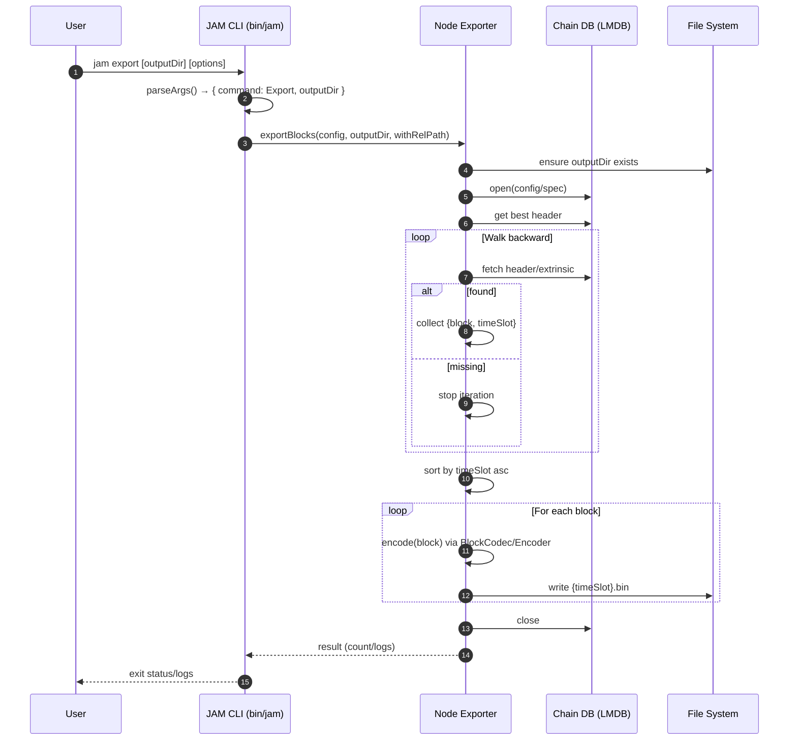

# Block export

## Pull Request by @skoszuta

Resolves #695 
Related to #696 

This allows exporting blocks to .bin files. They can be successfully imported by another instance.

@tomusdrw I have a git stash with exporting to .json almost finished but i noticed it's nowhere in the requirements that .json export is required. I can add that functionality if need be.


## Comment by @coderabbitai[bot]

<!-- This is an auto-generated comment: summarize by coderabbit.ai -->
<!-- This is an auto-generated comment: skip review by coderabbit.ai -->

> [!IMPORTANT]
> ## Review skipped
> 
> Auto incremental reviews are disabled on this repository.
> 
> Please check the settings in the CodeRabbit UI or the `.coderabbit.yaml` file in this repository. To trigger a single review, invoke the `@coderabbitai review` command.
> 
> You can disable this status message by setting the `reviews.review_status` to `false` in the CodeRabbit configuration file.

<!-- end of auto-generated comment: skip review by coderabbit.ai -->

<!-- walkthrough_start -->

<details>
<summary>📝 Walkthrough</summary>

<!-- This is an auto-generated comment: release notes by coderabbit.ai -->

## Summary by CodeRabbit

- New Features
  - Added a new CLI command to export blocks to .bin files.
  - Supports custom output directory; defaults to an “export” folder.
  - Provides progress logs during export and clearer database path logging.

- Tests
  - Added tests for export command argument parsing (with and without output directory).

- Chores
  - Updated ignore rules to exclude the export directory from version control.

<!-- end of auto-generated comment: release notes by coderabbit.ai -->
## Walkthrough
Adds a new CLI command to export blocks to .bin files, including argument parsing, command dispatch, and a node-level export implementation. Extends public API to re-export the new export module. Adjusts a log message to use absolute DB path and ignores an export directory in git. Adds tests for export args.

## Changes
| Cohort / File(s) | Summary |
|---|---|
| **CLI: Export command & dispatch**<br>`bin/jam/args.ts`, `bin/jam/index.ts`, `bin/jam/args.test.ts` | Introduces Command.Export with outputDir option (default "export"), updates help, parses args, and dispatches to exportBlocks in startNode. Adds tests covering export arg parsing with/without outputDir. |
| **Node export feature**<br>`packages/jam/node/export.ts`, `packages/jam/node/index.ts` | Adds exportBlocks: opens DB, walks blocks from best header backward, collects, sorts by timeSlot, encodes to .bin via BlockCodec/Encoder, writes files named by zero-padded timeSlot; re-exported via index. |
| **Logging path resolution**<br>`packages/jam/node/common.ts` | Uses path.resolve(dbPath) in DB open log message. |
| **Repo housekeeping**<br>`.gitignore` | Ignores /export directory. |

## Sequence Diagram(s)


## Estimated code review effort
🎯 3 (Moderate) | ⏱️ ~25 minutes

## Possibly related PRs
- FluffyLabs/typeberry#627 — Also modifies JAM CLI args parsing and its tests, likely adjacent to introducing or adjusting command variants.

## Suggested reviewers
- tomusdrw
- mateuszsikora
- DrEverr

## Poem
> A bunny taps the CLI at night,  
> “Export,” it squeaks—blocks take flight!  
> TimeSlots lined in tidy bins,  
> Hops through headers, hashes, spins.  
> From LMDB to files so neat—  
> Thump-thump logs, a rhythmic beat.  
> Carrots saved; the chain’s complete. 🍃🐇

</details>

<!-- walkthrough_end -->

<!-- pre_merge_checks_walkthrough_start -->

## Pre-merge checks and finishing touches
<details>
<summary>❌ Failed checks (2 warnings)</summary>

|         Check name         | Status     | Explanation                                                                                                                                                                  | Resolution                                                                                                                                                                                    |
| :------------------------: | :--------- | :--------------------------------------------------------------------------------------------------------------------------------------------------------------------------- | :-------------------------------------------------------------------------------------------------------------------------------------------------------------------------------------------- |
| Out of Scope Changes Check | ⚠️ Warning | The pull request includes unrelated modifications to .gitignore and a log message change in common.ts, which are not part of the block export feature defined in issue #695. | Unrelated changes like the .gitignore update and logging adjustment should be removed or split into a separate pull request to keep the block export change focused on its primary objective. |
|     Docstring Coverage     | ⚠️ Warning | Docstring coverage is 0.00% which is insufficient. The required threshold is 80.00%.                                                                                         | You can run `@coderabbitai generate docstrings` to improve docstring coverage.                                                                                                                |

</details>
<details>
<summary>✅ Passed checks (3 passed)</summary>

|      Check name     | Status   | Explanation                                                                                                                                                                                                                                                      |
| :-----------------: | :------- | :--------------------------------------------------------------------------------------------------------------------------------------------------------------------------------------------------------------------------------------------------------------- |
|     Title Check     | ✅ Passed | The title “Block export” clearly and concisely summarizes the primary change of adding block exporting functionality, directly reflecting the main objective of this pull request without extra noise or ambiguity.                                              |
| Linked Issues Check | ✅ Passed | The implementation fulfills the objectives of issue #695 by introducing an Export command, generating one .bin file per block using the existing BlockCodec and Encoder, and integrating it into the CLI so that exported blocks are importable on another node. |
|  Description Check  | ✅ Passed | The description directly relates to the changes by explaining that the pull request implements export of blocks to .bin files and references the relevant issue, accurately reflecting the content of the changeset.                                             |

</details>

<!-- pre_merge_checks_walkthrough_end -->

<!-- tips_start -->

---


<sub>Comment `@coderabbitai help` to get the list of available commands and usage tips.</sub>

<!-- tips_end -->

<!-- internal state start -->


<!-- DwQgtGAEAqAWCWBnSTIEMB26CuAXA9mAOYCmGJATmriQCaQDG+Ats2bgFyQAOFk+AIwBWJBrngA3EsgEBPRvlqU0AgfFwA6NPEgQAfACgjoCEYDEZyAAUASpETZWaCrKPR1AGxJcAQh/wMANaQJAAe3PgUuJCQBgByjgKUXABsAJxpMQYAqjYAMlywuLjciBwA9OVE6rDYAhpMzOUAYh7YAGbtsnkqiOW4stwkSRQu5dzYHh7l6Zmx2YjJ9oH4iABeeGhZAMr42BQMJJACVBgMsFyIgWAC/kFgYRFRkIBJhDDOpNEnmOdczNpYWLbXDUbBlfhDQEGGwkCTwEgAd0o4IAFBh8OQAJRZHpJDyo9FYrIAYQoJGodHQnEgACYAAw0gCsYAAjHSwHSABzQNkcOkAFj5AHYAFpGAAi0gYFHg3HEGK4cCOthQzG4XjYGFwyEekXEGCIxzugWQBEgGjUWHa8C8ptg1EYmGORwcDEOiEQ7UmHnk8DVespcnQ6NwsEoKAwiBBZxIGkgAElomTEPgPFJkEgHEczOlGcH6KgyR4KfQzTm0ik40qcKHIpAQ9J0PXyRQfZBrRgkGH6NVolG0IhYO267qovADZAzQApbYAeTixzw6CuyARYdD4Zn85C4T1KGQZIAjth4GTaBpzJZZ8JROJ0+2KCxIB5x4FKZnsNIjPGPZ/IOXGV8Y0dyeXADCgKxHzhJRJzDdA1BfAZJ3wEC91uAITQfJ8N0gWhqBUAdY3AyBiX2MktUdbgVBtdRZC4DE2z9UD+Hac1LX4PgtwXdCggzZAHG4UC6AvKAAFFd2eQc9g8eheEUbBDjY8cjQw5AURIGpwwxI4eOCIY+GtLwOKbJgzgpDAS2HChmExETIAAQQwWRQ3HQ1Rxoeh2kfZgm3RGDmDBL4jiYvUVCMjFg3wDc+D8oiDAsEiWE1bV7Ecf4XCMKACACxBaAoBFUqIUgo34wJZW4VzIC41DniSBg0DBI4cOq9pIn+aJUBDSApBcexozwihaHgNZKUwUs4LCJB9UNAADUyetwGbkNTR0sCSSBGoLVjyDoYTiMgkh2koMhFMeZNFk8kcJOmkJNL4clzhUoJkJQFL8ARK0bSOOs0CmJ7MNM+qaAsjyIzNLZEFcozDKOVr7oHeE+FwU5PUoOy4iiylQwdLZAfMksHmuiF5SwBFpPoI8TzJBRRmkCIMCGicBOYiKcJCyT4CUC9wLAQwDBMKAyHofBWIaghiDIZRQcaZKuF4fgbzESRGyDJglCoVR1C0HR9H58AoDgVBUCdMXCFIcgqGlpL2C4KgCocJxetVxRlE1zRtF0XmjD10wDA0Xt4CIdEyQ4AwACII/iyx7PjCWLcsh30vkEXGHtA0vwMezaCUegnXKdyQi1XqzRw/31ED4OSAAGkgf4yonHCC6GskxEiX0g8iYTIAx1PMGKl6kntOE6zrUzkZW9p/AKpJZAxAsO+pihJmkABufgMDbLZmHHH7s/L1mUIrzvnym7nLwcjwaEt+AMVNFCcKUBhi2v2+WJq0G6wmW54AYQvxHEDOGNyBGFElGP0lk1ZHDJHCREIROh6i4Hkd64dI48zAEYS05QhBoCaB8RAGgaBRgIWUFBYco4OVjubKWlJE7OGTqxc4fcM5QCzjnSc0gUo9XgF0SqBcZZjR4M4SGBpQ4xCgAAdRqDwKCnNKRFmoMrfgeAJjRGbreNuNcByLDHBOfhDN9yQHEsxARewSh4HFKeAxGgNDlBsaYlRYBm4XjEZASRtYlz2KXGo1uLhNEekoDdPRBZkBGL3CY5R5jLGoGsbYmx7k7JKkWOgPeJNkBoFoEIQKIFbyjQoEQRw7B7D2iGMgOGsEjihOeEEte6Je7pzvjuKalUgmCIoMIw0/hqi/xHtFBQTgGb4O9uQ+yl8pY30jC9B+ohn4KNfindylJP51BfL/dg5cM6EhICAsB7VKSQMgNA+EBVDpw2pAAWToPARwpDMq+0wdg3BeT8HalDhHMhCUY5x2ofQWhvUU6MPqZlBy2c0nNgKpU6ILSS5wWJHkeMXBxzj1oApRsxIkpjQ0BCyAABeSAYd3JhwjOUxK/T6BkEcPmDa3A8KEMgGGDw3B2GhGiGaWgAQCkUSdIAHAIsW6QaRaZSMN8GAFwCYm4y7LiWBrQZAX8VkOTyRylKAwhgvXHE/bAMEcLkHBUTCQzh4CYGpGi0l9knnAGNf8BmmLro122PaM8s45TjOQAAMkgAAbyUWY3AFiKCXGRpVAAvnoCVzKhZpIVclVp7SXrMz3DhLFQS5ZCJIKaogyB0QFTTrQW0JLLXnl5fIKibTKqDmcIsp1t8a5knSZVJ0+BK0WQ8F6lRvrIAoiUO0Bql9KpmnxddMOmIa56pfDSyqtSwjIy2HgzR+iyS4H2J2Ccnqk15oxRCzRTyuCeusRoGlaAa6eJ9ZYwNkBA12TOQCEE45kCmUhlGE68gERSMmmAic8Z/TPGzS+CcQZt6jEiJVdQ/FkYKQXdTMpWKURqraIzQ0nbu03SPW2gRYJKrPtDDCDwVhqCwFskMj5oyX4TOhUcR+MzUlvwWcLPgsqf5/3WYgIFZzFDcPhLQLgFqBHkp8spe5ODyh4OIQYFxPhDqd04+iq1WKhr0C6q+sCLj7LtCvlwVhdAuAzSxbi/toEw4zWIixoa1oNPyvyclU0gxgprXHFggTQntQid0JAMTcNvCxBiC43dkAAA+a6GZpsQOaqT54P2gVtfaugjrKNus9UK/1MoDQAG0AC6a9g1OZYSp5ITmvPWN8/52ggXguko0GFvUEXy20Gi86yAsX2xfXBFGRLRBUvpcMJ55zfmuMBbNT1gtNrIB2qqzV1+9XkOngS65drhnWMmY49G1NTz2zYDOCTIl/HHnpuE6J8TIdu4oXqkksp/XrWgUyw5bLfrgVsKO0cU7WLsacFy85nDbTGxlrPGK2+L2oAwnScgCbBlvLoCeRoAA+sZBDkwlUoQw7ALDOHQwol03qQdv2HL+KiBmlCzBj54IxzCcDEyV0hck6VjdoP03bvNNY/dh6InHuu/DxHuGURA+xKewN2zxC7PoPsw5sCTkIMgBcoa1y3m3PQQYTb5RxxKFCMQ15kcPmUMlpbGhaU6FvwBcVIF6myXXT8KpSZcF2bRBfFGLCPkAACyrhiUDGLFOy8YsD9iiBjJQNdEWPmRYcXOYLjinEeidkLZ342Hd+s29yxveIogeZ7kgaKMDWiIJu7bQmgc1xZyQbDuHsQCPnYu16B5pAw9DU099n7ohUVDAckg/wb1rzJPk5+9YXbtinhtM4adSC50hjBLyT4yBhV7XBbVhiiYtNr7AM+wyiOzJI/fOC5HnCL8B6xajxk6OrK1IxoFQCtkGFAbziBHfBfHPgVELgYurnMBuWgowVEghoGKnZposVygywxErm5quvka4/Ja5/IMK97MI3bvjV7W54qxQcAz5hx2TEhgH0CdK1zSCICv5NQoSNSCKhgaDJiphSAdoCBI54YRgPrpJvx2y4QkG4aQBrhkAQhkBj5kb4QCCETowoRRRhh8CDxoDDx8CjwYjjzNqTzvR1LFRz6EZXzr6m5kbTJr6UbzLXSLK0bLL0ZrIAJMbESH487gJWwwQX5wKnI36XIS6oIQDS7P6BCYF9APLlCf7xIvJ/7Rxq7xygy/L0ISEZyu5IooqgoT5b4DiyBnArZrbjLvyx6YTKTWG2Hv4OEuz5zXTEJVhwRejhEKhAqu7ly/TDSNhbBIJFThjcaRj7CNg4RHq4SnjqK9QKaDJQCkjki0pbB+BoBvg0gCB0oDg8GUoNpkB2hHB5BnLig+A3BoBBB7L2jKT7rsFJJoa6JTFu5DC/zqzKyeQg6xSd78E/T6JyTQR7IYip4u4yG0o4S6SMKCog5nEcJ0rkjqzHDjGBAIjOC0A1xMBTC3iVR8r0E8FHBhjpLFH6KTqJaQy/zlrt4YBgAYDehvG3ygZKwThREKwiBiClIg7/H3HcbMogk/yzoUyiCRBwblKWJaIBAGqgy84kDbD+CaDES7DY4KAfFiCBjGgyDyCUnUlRTLiHAMyuQSpnAuw6jjFDi6QbQxpRFoqPyUqiQCn3GzGLJYA4QXFLGiA1wbikwyi0oPRDgDhNgCqfRGQWRsD0BBg4QjSPhgBUTZxYx+hUk0lyEtpeLVE+KyB2SFEyqPhEDnRWQhDCnvwskYSIH+CLADG4RsGESUqdK3osDqgkDrbw7EoEAgjNpMCrbRDKFCQmmsncyiQAZ8DfpAbIDbydj/DNrIotaMleBKwKgoCsQYlaT3TYk3r0bgnbweiuTe4nERFRgNr4KQC+o1HyDShNERGoDfrvisQVGM64FDhsqNjyahCnwwBpGrbVlYBFjwiA5YCTqUBNobTiCISbk+kjHoBujoFvGLH2DLE1wnSsYGh4nPj4BFR8lDKGZxmwCKDJI5yaYx6snx44KJ7J6p5cBTg4JAWBwM7eq+pTb3n0E1Cs6hhcAojcAwVEDYjYp6B9QtaYhLTKRPxaLlAwyQAzSxFv72GOHJHagGaP7H47Jn6GGwhHLGEi637mFkI0WkXSDxGf7y5hC/6S7/5UKAGpSOxeG67gHVi8WhANaGniFkiEygQ6g9TOQIAThD4+RbAT547IpGQIFJGgQaBCCICErKTpJDTrZmgKa8LXSIA3mdCfFSBtg7m8kNxwQ74ORWDxipQUBdqKTw6mLoBEbWWV5uQ2XGR8ECHQHcHhjaXLyDLezSFjKvyka4QKHEYb7+k0Y8DqG77/yblApYpmWmbyUFxR7vxolPixVGQzRxLJFGW4VYAkWPFxHkWJFSXEJLTIWHJ7CIBtibL4a0Wn4GFQKMVC5X7UhIIIgP66w+yCz6IpymwAFn6sA2wHJoD2zAHyDOzqwqBqDuw6xewCx9Lby4Dg6cyIDg4X50Dg7u7RAzVHWMgsgpA0iiBpD1Q0gMAsgkBpB0iMhchpACD8iMich/VMhpDtDZwADMaAQoaAjIDAnIAg9A91+sx16gZ10ql1o1SItA4OQsnshgR1vAJA4ObAeSJN5wogJoN1IIzwM17qTmYcSAtgURdAFq7AVgqwHkYcXAXa+I1cjNUkkwtAURtgPN7Yv0iwVcjNSAs4PUMo1pGA4tfNUtjNsmNgq24oAQwILWiASBVN4toGAtMQYc6tq27guAXg+tQQhtS8xteKZtGAkoiA0osoJM1tgQttn40tJtP6b4tAP4WYiAOt4tYcAAOhgBHWHbgNHbHTHfHcAH7ddR+CQHoFHfHXHXHRYJYABEBBhO/FHZHRncXdHQlBbV4IXUie5IXQlM7a7Y2oXYmEUuTM6DwKsJDLcFge/P9BVT5A/OGYsBoIXaRLTFqG2EiKtOvIxFATNJaEtHWDNFxEtHynGOIi6B+cLYFSmK3WFF3QXLPeOMvayTeXdOvDpMBPpDJd9HwKZbXMfHjMDJZHDMwEPZHRgOIvaDQD1AYlvupb5B3uoM3ZvZLShOtBEO2Z3aqlARFJgNFTFC7K/ZnSXbgMAOUEnbjSnXoGHD7XisWFGB7TCA4JfMZVwEli9gzZ1ibZTUEHEDgiQKHeXfdmGDbTg51mHP2AuiQ5OHbaw55rpsWCDOMgw3BP/EZFylXddKKk/C2JvPooDEgLnvIL8nkaGbwOAr1OJW/GZV8cBO5JVOkWubkQMDXN4pbfIGSJPJ8a5UcI3lgIICiXeN9JOQgDKt6PXseDcf5UuMCZpfgAo8ZDgmoPkrRBoNgy9ibQQW0CTKHWE5Q3itpfQ1wGHM8RQEukQLE5Q2HC3IcYHGUcrZLfbWw4BtUE2h7bQ2wKHaI/Qy9oGrwxQ5k9Q4EOU4k3inkK+JSIHZ+MgB7Rk2wxw2CF7YU3w48AI4vsI8FGqBqOwIvith4IZPiMSvYw5Y2CnCnf+LmMcL6EXPJAwHWlgImiFjXEJQohONpEpAaUcJfaKfMYaI3IuW+oaBKS7GCfojKZAhQA+YiiQF6Sc4aIA4isvvdnCvYMvg6Fvt8eCebrvevJFL0s7r03w5E3gEI0kwiybQk6HSk2k2i3itkynrk2SPk/zbwybcU+OL9GU3Q6Heg509IPZP4h6MlGQp1rU+Q+E3io0806HbOB4qxNsEwCqkgUwt08w57SS3iv01wyrUMybSM5gGM0k9WBMH9JTDcTBhqo2KtvIqDNpWxkDLVmaGXOIAvEcAIlsKgWwB6Jgd4USt/hgMQtnggI9OCV1MWumc4+ffnQXEdKCNTJ2uOO+FgGswBKE+K1k9IKmMixiKHdkBgNq5McKyfG+MSka0fNTNgNShSJGU+SU4aOkpklGFGkLTJK3WSHjlIFlYgOqP81qChBDCQMWlm8q82qq1bmaG+A28SqKXwmAcOAwJtDC8BtIuo8nIrI46G+y2HBi0k1i65Di+G6ZKnnk7zQU2G2S6U6K1y0k6YrOO0Py30UK/UvSyGYgEyzU3U5O5y1S0k3XTKI2iRKK/O5K4M2G3K4I9G4qyvlKHe+tqY22PGw0kqWAWySBMWOOGPg6DhM2+410x1JMw3uwDqETCnN8Ya+xEKpShY8dDGKGUWLCIavuFmJom6PsBSP+4dFWTdEqcIYUinEB8K3GRO3E+GymFEyi3ivO9O3irOwaPO3i0u4Syu8S5O+uxS5u9ew7d+27UI+e2y8x1exUzewEM1pVGij1JgU+yCJw0S6rcx2+wq3ilrQwCp7ovgOp6QAYnSBoHSHSAAKQ/E/xDhGylGdA/zwhaipEjXHjVHjTJgfkluoCchWc2e2dMeZNIvRNJMACaewk9S8jVNu7zu16gHsxzNAuEynAaBoiAS0ZoTEUEZGmXFZTA5nsYnHLsmLzg2La7MoJTYnVNW7DtRXrkxlNTTmKWODYceDuAtgt70nH7eKKQnINIQoQ3nI/IKQCNaQogDAAgdIaQIN7BNnnIMN7BbIdIboaAaQjIj1KQQotAkN/IAgnI437QboKQKQdItAnIDA13NINIaAaAkNGTXXA4PXNgjDod/IR3ww7QLINIh3JAkNAgjIKQXa93SgLIwNDInIbIhwjItAhwnIJAQoJAKQLILI/InI7QjIQow3aAw3H1Ag7Q/ItAdIz1b1aQZC3Os10iJNZNpA4OjTF1+N+gQAA= -->

<!-- internal state end -->


## Comment by @tomusdrw

@skoszuta I'd skip JSON export, because I think the format isn't very standardized. We have `convert` tool if it's really necessary to support that.

I'd rather see exporting either each block to it's own file or all blocks concatenated (so that we have just one file to move around), but I guess that thing would need support on the `import` side as well.


## Comment by @skoszuta

> @skoszuta I'd skip JSON export, because I think the format isn't very standardized. We have `convert` tool if it's really necessary to support that.
> 
> I'd rather see exporting either each block to it's own file or all blocks concatenated (so that we have just one file to move around), but I guess that thing would need support on the `import` side as well.

I propose that we merge it as is for now, since i will be switching focus to owned privileges. The option of concatenating blocks can be added later.


## Comment by @github-actions[bot]


<details>
<summary>View all</summary>

| File | Benchmark | Ops |  |
|------|-----------|-----|--|
| [codec/bigint.decode.ts[0]](../blob/8a098cd555df29d5b38a114c83213995be7058b3//_work/typeberry-runner-3/typeberry/typeberry/benchmarks/codec/bigint.decode.ts) | decode custom | 178473508.39 ±2.34% | fastest ✅ |
| [codec/bigint.decode.ts[1]](../blob/8a098cd555df29d5b38a114c83213995be7058b3//_work/typeberry-runner-3/typeberry/typeberry/benchmarks/codec/bigint.decode.ts) | decode bigint | 108181026.6 ±2.62% | 39.39% slower |
| [codec/encoding.ts[0]](../blob/8a098cd555df29d5b38a114c83213995be7058b3//_work/typeberry-runner-3/typeberry/typeberry/benchmarks/codec/encoding.ts) | manual encode | 3444955.55 ±0.13% | 18.86% slower |
| [codec/encoding.ts[1]](../blob/8a098cd555df29d5b38a114c83213995be7058b3//_work/typeberry-runner-3/typeberry/typeberry/benchmarks/codec/encoding.ts) | int32array encode | 4228122.81 ±0.26% | 0.41% slower |
| [codec/encoding.ts[2]](../blob/8a098cd555df29d5b38a114c83213995be7058b3//_work/typeberry-runner-3/typeberry/typeberry/benchmarks/codec/encoding.ts) | dataview encode | 4245456.57 ±0.23% | fastest ✅ |
| [codec/decoding.ts[0]](../blob/8a098cd555df29d5b38a114c83213995be7058b3//_work/typeberry-runner-3/typeberry/typeberry/benchmarks/codec/decoding.ts) | manual decode | 23621542 ±0.45% | 86.04% slower |
| [codec/decoding.ts[1]](../blob/8a098cd555df29d5b38a114c83213995be7058b3//_work/typeberry-runner-3/typeberry/typeberry/benchmarks/codec/decoding.ts) | int32array decode | 169248825.42 ±3.02% | fastest ✅ |
| [codec/decoding.ts[2]](../blob/8a098cd555df29d5b38a114c83213995be7058b3//_work/typeberry-runner-3/typeberry/typeberry/benchmarks/codec/decoding.ts) | dataview decode | 167699759.21 ±2.98% | 0.92% slower |
| [collections/map-set.ts[0]](../blob/8a098cd555df29d5b38a114c83213995be7058b3//_work/typeberry-runner-3/typeberry/typeberry/benchmarks/collections/map-set.ts) | 2 gets + conditional set | 121318.61 ±0.11% | fastest ✅ |
| [collections/map-set.ts[1]](../blob/8a098cd555df29d5b38a114c83213995be7058b3//_work/typeberry-runner-3/typeberry/typeberry/benchmarks/collections/map-set.ts) | 1 get 1 set | 61778.96 ±0.03% | 49.08% slower |
| [bytes/hex-to.ts[0]](../blob/8a098cd555df29d5b38a114c83213995be7058b3//_work/typeberry-runner-3/typeberry/typeberry/benchmarks/bytes/hex-to.ts) | number toString + padding | 332132.53 ±0.07% | fastest ✅ |
| [bytes/hex-to.ts[1]](../blob/8a098cd555df29d5b38a114c83213995be7058b3//_work/typeberry-runner-3/typeberry/typeberry/benchmarks/bytes/hex-to.ts) | manual | 16614.42 ±0.2% | 95% slower |
| [codec/bigint.compare.ts[0]](../blob/8a098cd555df29d5b38a114c83213995be7058b3//_work/typeberry-runner-3/typeberry/typeberry/benchmarks/codec/bigint.compare.ts) | compare custom | 263744534.29 ±5.89% | fastest ✅ |
| [codec/bigint.compare.ts[1]](../blob/8a098cd555df29d5b38a114c83213995be7058b3//_work/typeberry-runner-3/typeberry/typeberry/benchmarks/codec/bigint.compare.ts) | compare bigint | 245572455.93 ±6.7% | 6.89% slower |
| [math/count-bits-u32.ts[0]](../blob/8a098cd555df29d5b38a114c83213995be7058b3//_work/typeberry-runner-3/typeberry/typeberry/benchmarks/math/count-bits-u32.ts) | standard method | 81892687.11 ±1.82% | 65.12% slower |
| [math/count-bits-u32.ts[1]](../blob/8a098cd555df29d5b38a114c83213995be7058b3//_work/typeberry-runner-3/typeberry/typeberry/benchmarks/math/count-bits-u32.ts) | magic | 234807254.28 ±7.52% | fastest ✅ |
| [math/count-bits-u64.ts[0]](../blob/8a098cd555df29d5b38a114c83213995be7058b3//_work/typeberry-runner-3/typeberry/typeberry/benchmarks/math/count-bits-u64.ts) | standard method | 8545874.03 ±0.21% | 90.91% slower |
| [math/count-bits-u64.ts[1]](../blob/8a098cd555df29d5b38a114c83213995be7058b3//_work/typeberry-runner-3/typeberry/typeberry/benchmarks/math/count-bits-u64.ts) | magic | 94023205.11 ±1.44% | fastest ✅ |
| [math/mul_overflow.ts[0]](../blob/8a098cd555df29d5b38a114c83213995be7058b3//_work/typeberry-runner-3/typeberry/typeberry/benchmarks/math/mul_overflow.ts) | multiply and bring back to u32 | 250705137.09 ±6.33% | 4.07% slower |
| [math/mul_overflow.ts[1]](../blob/8a098cd555df29d5b38a114c83213995be7058b3//_work/typeberry-runner-3/typeberry/typeberry/benchmarks/math/mul_overflow.ts) | multiply and take modulus | 261331553.19 ±6.37% | fastest ✅ |
| [math/switch.ts[0]](../blob/8a098cd555df29d5b38a114c83213995be7058b3//_work/typeberry-runner-3/typeberry/typeberry/benchmarks/math/switch.ts) | switch | 255688632.14 ±6.16% | fastest ✅ |
| [math/switch.ts[1]](../blob/8a098cd555df29d5b38a114c83213995be7058b3//_work/typeberry-runner-3/typeberry/typeberry/benchmarks/math/switch.ts) | if | 247453033.58 ±7.08% | 3.22% slower |
| [hash/index.ts[0]](../blob/8a098cd555df29d5b38a114c83213995be7058b3//_work/typeberry-runner-3/typeberry/typeberry/benchmarks/hash/index.ts) | hash with numeric representation | 193.72 ±0.13% | 27.35% slower |
| [hash/index.ts[1]](../blob/8a098cd555df29d5b38a114c83213995be7058b3//_work/typeberry-runner-3/typeberry/typeberry/benchmarks/hash/index.ts) | hash with string representation | 121.51 ±0.24% | 54.43% slower |
| [hash/index.ts[2]](../blob/8a098cd555df29d5b38a114c83213995be7058b3//_work/typeberry-runner-3/typeberry/typeberry/benchmarks/hash/index.ts) | hash with symbol representation | 185.31 ±0.04% | 30.5% slower |
| [hash/index.ts[3]](../blob/8a098cd555df29d5b38a114c83213995be7058b3//_work/typeberry-runner-3/typeberry/typeberry/benchmarks/hash/index.ts) | hash with uint8 representation | 165.12 ±0.07% | 38.08% slower |
| [hash/index.ts[4]](../blob/8a098cd555df29d5b38a114c83213995be7058b3//_work/typeberry-runner-3/typeberry/typeberry/benchmarks/hash/index.ts) | hash with packed representation | 266.65 ±0.03% | fastest ✅ |
| [hash/index.ts[5]](../blob/8a098cd555df29d5b38a114c83213995be7058b3//_work/typeberry-runner-3/typeberry/typeberry/benchmarks/hash/index.ts) | hash with bigint representation | 194.55 ±0.03% | 27.04% slower |
| [hash/index.ts[6]](../blob/8a098cd555df29d5b38a114c83213995be7058b3//_work/typeberry-runner-3/typeberry/typeberry/benchmarks/hash/index.ts) | hash with uint32 representation | 205.66 ±0.08% | 22.87% slower |
| [math/add_one_overflow.ts[0]](../blob/8a098cd555df29d5b38a114c83213995be7058b3//_work/typeberry-runner-3/typeberry/typeberry/benchmarks/math/add_one_overflow.ts) | add and take modulus | 237161120.11 ±6.23% | 11.34% slower |
| [math/add_one_overflow.ts[1]](../blob/8a098cd555df29d5b38a114c83213995be7058b3//_work/typeberry-runner-3/typeberry/typeberry/benchmarks/math/add_one_overflow.ts) | condition before calculation | 267505854.01 ±5.78% | fastest ✅ |
| [bytes/hex-from.ts[0]](../blob/8a098cd555df29d5b38a114c83213995be7058b3//_work/typeberry-runner-3/typeberry/typeberry/benchmarks/bytes/hex-from.ts) | parse hex using `Number` with NaN checking | 137639.53 ±0.05% | 84.84% slower |
| [bytes/hex-from.ts[1]](../blob/8a098cd555df29d5b38a114c83213995be7058b3//_work/typeberry-runner-3/typeberry/typeberry/benchmarks/bytes/hex-from.ts) | parse hex from char codes | 907924.31 ±0.23% | fastest ✅ |
| [bytes/hex-from.ts[2]](../blob/8a098cd555df29d5b38a114c83213995be7058b3//_work/typeberry-runner-3/typeberry/typeberry/benchmarks/bytes/hex-from.ts) | parse hex from string nibbles | 566818.81 ±0.2% | 37.57% slower |
| [logger/index.ts[0]](../blob/8a098cd555df29d5b38a114c83213995be7058b3//_work/typeberry-runner-3/typeberry/typeberry/benchmarks/logger/index.ts) | console.log with string concat | 7021346.81 ±61.69% | fastest ✅ |
| [logger/index.ts[1]](../blob/8a098cd555df29d5b38a114c83213995be7058b3//_work/typeberry-runner-3/typeberry/typeberry/benchmarks/logger/index.ts) | console.log with args | 1102543.61 ±93.16% | 84.3% slower |
| [codec/view_vs_collection.ts[0]](../blob/8a098cd555df29d5b38a114c83213995be7058b3//_work/typeberry-runner-3/typeberry/typeberry/benchmarks/codec/view_vs_collection.ts) | Get first element from Decoded | 31906.69 ±0.2% | 54.01% slower |
| [codec/view_vs_collection.ts[1]](../blob/8a098cd555df29d5b38a114c83213995be7058b3//_work/typeberry-runner-3/typeberry/typeberry/benchmarks/codec/view_vs_collection.ts) | Get first element from View | 69377.35 ±0.06% | fastest ✅ |
| [codec/view_vs_collection.ts[2]](../blob/8a098cd555df29d5b38a114c83213995be7058b3//_work/typeberry-runner-3/typeberry/typeberry/benchmarks/codec/view_vs_collection.ts) | Get 50th element from Decoded | 32105.66 ±0.25% | 53.72% slower |
| [codec/view_vs_collection.ts[3]](../blob/8a098cd555df29d5b38a114c83213995be7058b3//_work/typeberry-runner-3/typeberry/typeberry/benchmarks/codec/view_vs_collection.ts) | Get 50th element from View | 35919.21 ±0.17% | 48.23% slower |
| [codec/view_vs_collection.ts[4]](../blob/8a098cd555df29d5b38a114c83213995be7058b3//_work/typeberry-runner-3/typeberry/typeberry/benchmarks/codec/view_vs_collection.ts) | Get last element from Decoded | 32070.73 ±0.26% | 53.77% slower |
| [codec/view_vs_collection.ts[5]](../blob/8a098cd555df29d5b38a114c83213995be7058b3//_work/typeberry-runner-3/typeberry/typeberry/benchmarks/codec/view_vs_collection.ts) | Get last element from View | 24545.23 ±0.22% | 64.62% slower |
| [codec/view_vs_object.ts[0]](../blob/8a098cd555df29d5b38a114c83213995be7058b3//_work/typeberry-runner-3/typeberry/typeberry/benchmarks/codec/view_vs_object.ts) | Get the first field from Decoded | 520429.53 ±0.29% | fastest ✅ |
| [codec/view_vs_object.ts[1]](../blob/8a098cd555df29d5b38a114c83213995be7058b3//_work/typeberry-runner-3/typeberry/typeberry/benchmarks/codec/view_vs_object.ts) | Get the first field from View | 102555.44 ±0.19% | 80.29% slower |
| [codec/view_vs_object.ts[2]](../blob/8a098cd555df29d5b38a114c83213995be7058b3//_work/typeberry-runner-3/typeberry/typeberry/benchmarks/codec/view_vs_object.ts) | Get the first field as view from View | 103236.09 ±0.16% | 80.16% slower |
| [codec/view_vs_object.ts[3]](../blob/8a098cd555df29d5b38a114c83213995be7058b3//_work/typeberry-runner-3/typeberry/typeberry/benchmarks/codec/view_vs_object.ts) | Get two fields from Decoded | 514590.77 ±0.29% | 1.12% slower |
| [codec/view_vs_object.ts[4]](../blob/8a098cd555df29d5b38a114c83213995be7058b3//_work/typeberry-runner-3/typeberry/typeberry/benchmarks/codec/view_vs_object.ts) | Get two fields from View | 82440.3 ±0.13% | 84.16% slower |
| [codec/view_vs_object.ts[5]](../blob/8a098cd555df29d5b38a114c83213995be7058b3//_work/typeberry-runner-3/typeberry/typeberry/benchmarks/codec/view_vs_object.ts) | Get two fields from materialized from View | 172619.06 ±0.23% | 66.83% slower |
| [codec/view_vs_object.ts[6]](../blob/8a098cd555df29d5b38a114c83213995be7058b3//_work/typeberry-runner-3/typeberry/typeberry/benchmarks/codec/view_vs_object.ts) | Get two fields as views from View | 82116.86 ±0.18% | 84.22% slower |
| [codec/view_vs_object.ts[7]](../blob/8a098cd555df29d5b38a114c83213995be7058b3//_work/typeberry-runner-3/typeberry/typeberry/benchmarks/codec/view_vs_object.ts) | Get only third field from Decoded | 515153.58 ±0.3% | 1.01% slower |
| [codec/view_vs_object.ts[8]](../blob/8a098cd555df29d5b38a114c83213995be7058b3//_work/typeberry-runner-3/typeberry/typeberry/benchmarks/codec/view_vs_object.ts) | Get only third field from View | 101953.48 ±0.12% | 80.41% slower |
| [codec/view_vs_object.ts[9]](../blob/8a098cd555df29d5b38a114c83213995be7058b3//_work/typeberry-runner-3/typeberry/typeberry/benchmarks/codec/view_vs_object.ts) | Get only third field as view from View | 101606.5 ±0.12% | 80.48% slower |
| [bytes/compare.ts[0]](../blob/8a098cd555df29d5b38a114c83213995be7058b3//_work/typeberry-runner-3/typeberry/typeberry/benchmarks/bytes/compare.ts) | Comparing Uint32 bytes | 21096.34 ±0.17% | 3.77% slower |
| [bytes/compare.ts[1]](../blob/8a098cd555df29d5b38a114c83213995be7058b3//_work/typeberry-runner-3/typeberry/typeberry/benchmarks/bytes/compare.ts) | Comparing raw bytes | 21922.74 ±0.14% | fastest ✅ |
| [collections/map_vs_sorted.ts[0]](../blob/8a098cd555df29d5b38a114c83213995be7058b3//_work/typeberry-runner-3/typeberry/typeberry/benchmarks/collections/map_vs_sorted.ts) | Map | 311901.22 ±0.07% | fastest ✅ |
| [collections/map_vs_sorted.ts[1]](../blob/8a098cd555df29d5b38a114c83213995be7058b3//_work/typeberry-runner-3/typeberry/typeberry/benchmarks/collections/map_vs_sorted.ts) | Map-array | 103698.57 ±0.04% | 66.75% slower |
| [collections/map_vs_sorted.ts[2]](../blob/8a098cd555df29d5b38a114c83213995be7058b3//_work/typeberry-runner-3/typeberry/typeberry/benchmarks/collections/map_vs_sorted.ts) | Array | 69842.94 ±0.16% | 77.61% slower |
| [collections/map_vs_sorted.ts[3]](../blob/8a098cd555df29d5b38a114c83213995be7058b3//_work/typeberry-runner-3/typeberry/typeberry/benchmarks/collections/map_vs_sorted.ts) | SortedArray | 197852.02 ±0.17% | 36.57% slower |
| [hash/blake2b.ts[0]](../blob/8a098cd555df29d5b38a114c83213995be7058b3//_work/typeberry-runner-3/typeberry/typeberry/benchmarks/hash/blake2b.ts) | our hasher | 2.23 ±0.29% | fastest ✅ |
| [hash/blake2b.ts[1]](../blob/8a098cd555df29d5b38a114c83213995be7058b3//_work/typeberry-runner-3/typeberry/typeberry/benchmarks/hash/blake2b.ts) | blake2b js | 0.05 ±0.31% | 97.76% slower |
| [crypto/ed25519.ts[0]](../blob/8a098cd555df29d5b38a114c83213995be7058b3//_work/typeberry-runner-3/typeberry/typeberry/benchmarks/crypto/ed25519.ts) | native crypto | 5.61 ±17.68% | 81.55% slower |
| [crypto/ed25519.ts[1]](../blob/8a098cd555df29d5b38a114c83213995be7058b3//_work/typeberry-runner-3/typeberry/typeberry/benchmarks/crypto/ed25519.ts) | wasm lib | 10.89 ±0.02% | 64.19% slower |
| [crypto/ed25519.ts[2]](../blob/8a098cd555df29d5b38a114c83213995be7058b3//_work/typeberry-runner-3/typeberry/typeberry/benchmarks/crypto/ed25519.ts) | wasm lib batch | 30.41 ±0.59% | fastest ✅ |
</details>


### Benchmarks summary: 63/63 OK ✅

<!-- thollander/actions-comment-pull-request "benchmarks" -->


## Comment by @DrEverr

this won't work in the browser environment. AFAIK we are somewhat going into that direction to run TB in browser.


## Comment by @DrEverr

```suggestion
      const filename = `${timeSlot.toString().padStart(8, "0")}.bin`;
      const filepath = path.join(outputDir, filename);
      const encodedBlock = Encoder.encodeObject(BlockCodec.Codec, block, chainSpec);
      fs.writeFileSync(filepath, encodedBlock.raw);
      logger.log`✅ Exported block: ${filename}`;

      currentHash = header.parentHeaderHash.materialize();
    } else {
      break;
    }
  }
```


## Comment by @skoszuta

were not fighting for every millisecond here and i think exporting them in order makes sense from user perspective for the following reasons:
- we can show progress and how many blocks are left
- if the export is stopped at some point (either via error or manually by the user) the blocks produced can be imported up to the point where the stop happened. if we export starting from best block then if stopped early the produced .bin files will be useless.


## Comment by @skoszuta

ah, maybe that's why path.resolve wasn't there in the first place. @tomusdrw?


## Comment by @DrEverr

ok, that makes sense. following your train of thought, it would be good to add an optional flag [block header hash] from which we can start/continue exporting the block.


## Comment by @DrEverr

and if it doesn't find one we can just start exporting from genesis.


## Comment by @skoszuta

sure, feel free to create an issue. im not planning to expand the scope of this PR


## Comment by @tomusdrw

IMHO there shouldn't be a default, we should rather bail.
If you however decide to keep the default it should be reflected in help via:
```
[output-directory]
```


## Comment by @tomusdrw

Yeah, we should just leave it as-is.


## Comment by @tomusdrw

I agree we shouldn't be reading all of the blocks to memory (in future it might be gigabytes of data). Also for large database the "progress" argument is moot, since just reading the data will most likely be taking most of the time, so the user will see that the app has just "hanged" instead of any progress.

Even though we are not reading them all at once we can still show some progress estimate.
1. Read the best block timeslot
2. Read the genesis block timeslot
3. Subtract the two to roughly estimate how many blocks should be there.
Might be off, since not every slot needs to be taken, but should be good enough progress indication.


Alternatively, if you want to keep in-order export, we should do the following:
1. Read the best block.
2. Traverse all the way to genesis, recording the block hashes (we might consider showing some progress indication here as well, for instance printing "Collecting blocks ${currentCount}..." every 1k blocks or sth).
3. Now start exporting blocks in order from genesis from the hashes array.

That way we can even show exact progress and that would be my preferred way of implementing that.


## Comment by @tomusdrw

Export to single file could be added here, by detecting:
1. If the destination exists and is directory = export separate files.
2. If the destination does not exist (or is a file) = open the file (reset content) and append blocks there.

That said, it's absolutely fine to do as follow up. @coderabbitai please create an issue for this.


## Comment by @coderabbitai[bot]

<details>
<summary>🧩 Analysis chain</summary>

🏁 Script executed:
```
#!/bin/bash
# Create a GitHub issue for the single-file export feature

gh issue create \
  --title "Support exporting blocks to a single concatenated file" \
  --body "## Description

Currently, the block export functionality (introduced in #699) exports each block to a separate .bin file in the output directory.

This issue tracks adding support for exporting all blocks to a single concatenated file, which would make it easier to transfer blocks between nodes.

## Proposed behavior

The export command should detect the output destination type:

1. **If the destination exists and is a directory**: Export separate files (current behavior)
2. **If the destination does not exist or is a file**: Create/overwrite the file and append blocks to it

## Implementation notes

- This would require corresponding support on the import side to read concatenated blocks from a single file
- The detection logic should be added in \`packages/jam/node/export.ts\`

## References

- PR: https://github.com/FluffyLabs/typeberry/pull/699
- Comment: https://github.com/FluffyLabs/typeberry/pull/699#discussion_r2414274956
- Requested by: @tomusdrw" \
  --assignee tomusdrw
```

Length of output: 50

---


</details>

@tomusdrw, I've created issue #703 to track the single-file concatenated export feature. The issue includes the detection logic you described and notes that corresponding import support would also be needed.

```
    /)/)
   (^.^)
   ( >📝 Issue created!
```

<!-- This is an auto-generated reply by CodeRabbit -->


## Comment by @skoszuta

reverted


## Comment by @skoszuta

done


## Comment by @skoszuta

removed


## Comment by @tomusdrw

```suggestion
  while (currentHash.isEqualTo(Bytes.zero(HASH_SIZE)) !== true) {
```


## Comment by @skoszuta

fixed 👍 
