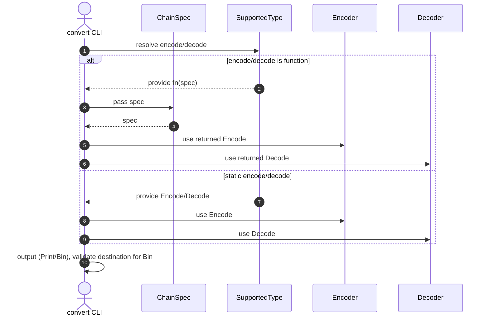
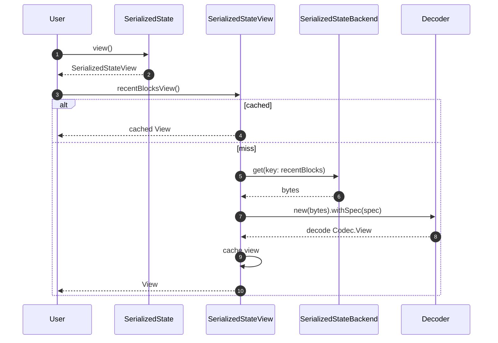
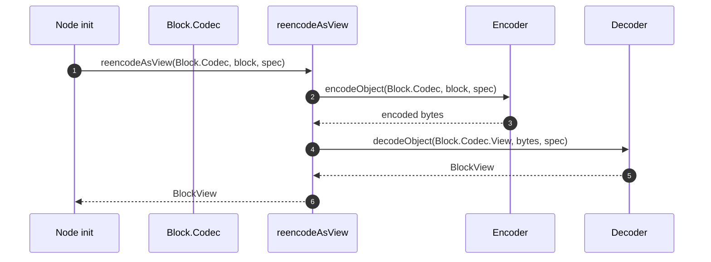

# Non-decoding state view

## Pull Request by @tomusdrw

and some other performance fixes.

Closes  #653

This PR introduces a non-decoding way to inspect the state. It's integrated via `view()` method on the state object (both `InMemoryState` and `SerializedState`). However accessing views with `InMemoryState` is not really expected to be faster, because we need to re-encode the objects.

Using views is much more cumbersome and requires a very specific usage pattern to actually be faster in benchmarks, so it does not mean we have to re-write the entire state transition to use views. Rather I think we should be introducing them carefully when it's actually beneficial as shown by profiler.

The usage is shown only in one place currently - `reports` transition, when we avoid accessing the entire `authPools` object.

Some additional performance improvements smuggled in this PR:
- [x] Introduce cache for decoded objects in state
- [x] fix sequence views dependent on context (they were incorrect due to codec being dependent on context, see also #306)
- [x] clean up too much data being passed to safrole seal
- [x] optimize extrinsic hash calculation (less allocation)
- [x] clean up recent blocks compatibility stuff


<details>
<summary>Performance stats for this PR </summary>

<h2 class="text-xl font-bold text-text-100 mt-1 -mb-0.5">fallback</h2>

Metric | PR (μs) | main (μs) | Difference (μs) | % Change
-- | -- | -- | -- | --
min | 15,504.6 | 18,574.1 | -3,069.5 | -16.5%
max | 39,314.0 | 34,505.1 | +4,808.9 | +13.9%
mean | 17,065.0 | 20,519.9 | -3,454.9 | -16.8%
median | 16,815.8 | 20,672.3 | -3,856.5 | -18.7%
stdDev | 1,522.0 | 1,354.7 | +167.3 | +12.4%
p90 | 18,631.1 | 21,827.9 | -3,196.8 | -14.6%
p99 | 20,920.0 | 24,961.5 | -4,041.5 | -16.2%

<h2 class="text-xl font-bold text-text-100 mt-1 -mb-0.5">safrole</h2>

Metric | PR (μs) | main (μs) | Difference (μs) | % Change
-- | -- | -- | -- | --
min | 15,484.8 | 18,552.3 | -3,067.5 | -16.5%
max | 62,988.7 | 89,843.4 | -26,854.7 | -29.9%
mean | 31,097.4 | 44,453.5 | -13,356.1 | -30.0%
median | 29,773.5 | 42,179.3 | -12,405.8 | -29.4%
stdDev | 14,142.3 | 23,803.1 | -9,660.8 | -40.6%
p90 | 53,858.4 | 83,655.7 | -29,797.3 | -35.6%
p99 | 55,904.3 | 85,985.2 | -30,080.9 | -35.0%

<h2 class="text-xl font-bold text-text-100 mt-1 -mb-0.5">storage</h2>

Metric | PR (μs) | main (μs) | Difference (μs) | % Change
-- | -- | -- | -- | --
min | 16,148.8 | 16,216.6 | -67.8 | -0.4%
max | 321,272.4 | 339,053.7 | -17,781.3 | -5.2%
mean | 85,305.1 | 89,160.7 | -3,855.6 | -4.3%
median | 52,160.8 | 54,508.9 | -2,348.1 | -4.3%
stdDev | 74,996.8 | 77,439.0 | -2,442.2 | -3.2%
p90 | 203,431.5 | 204,565.2 | -1,133.7 | -0.6%
p99 | 298,292.6 | 307,485.6 | -9,193.0 | -3.0%

<h2 class="text-xl font-bold text-text-100 mt-1 -mb-0.5">storage_light</h2>

Metric | PR (μs) | main (μs) | Difference (μs) | % Change
-- | -- | -- | -- | --
min | 15,948.9 | 16,113.5 | -164.6 | -1.0%
max | 121,333.8 | 182,211.6 | -60,877.8 | -33.4%
mean | 39,762.3 | 40,474.9 | -712.6 | -1.8%
median | 32,750.9 | 33,538.5 | -787.6 | -2.3%
stdDev | 25,927.8 | 26,283.8 | -356.0 | -1.4%
p90 | 80,161.7 | 82,011.9 | -1,850.2 | -2.3%
p99 | 107,618.6 | 110,393.1 | -2,774.5 | -2.5%


</details>


## Comment by @coderabbitai[bot]

<!-- This is an auto-generated comment: summarize by coderabbit.ai -->
<!-- This is an auto-generated comment: skip review by coderabbit.ai -->

> [!IMPORTANT]
> ## Review skipped
> 
> Auto incremental reviews are disabled on this repository.
> 
> Please check the settings in the CodeRabbit UI or the `.coderabbit.yaml` file in this repository. To trigger a single review, invoke the `@coderabbitai review` command.
> 
> You can disable this status message by setting the `reviews.review_status` to `false` in the CodeRabbit configuration file.

<!-- end of auto-generated comment: skip review by coderabbit.ai -->

<!-- walkthrough_start -->

<details>
<summary>📝 Walkthrough</summary>

<!-- This is an auto-generated comment: release notes by coderabbit.ai -->

## Summary by CodeRabbit

- New Features
  - Added StateView with on-demand, cached views; InMemoryState and SerializedState now expose view().
  - Introduced codecs/types for authorization pools/queues, accumulation queue, and recently accumulated; expanded public exports.
  - Added reencodeAsView helper for easy object-to-view round trips.
  - Enhanced recent blocks with MAX_RECENT_HISTORY and an empty() constructor.

- Refactor
  - Replaced RecentBlocksHistory with RecentBlocks across the API.
  - Unified spec-dependent encoding/decoding and parameterized state codec.

- Improvements
  - JSON dump now validates auth pool/queue sizes.

- Tests
  - Added/updated tests for views, accumulation queue, safrole, and reports.

- Chores
  - Consolidated imports and moved constants into the state module.

<!-- end of auto-generated comment: release notes by coderabbit.ai -->
## Walkthrough
Adds dynamic encoders/decoders to convert tool; introduces CodecWithView and propagates View-aware descriptors; refactors state to expose non-decoding StateView with new per-core/per-epoch codecs; parameterizes state-merkleization codec by spec; updates safrole verification signatures; replaces RecentBlocksHistory with RecentBlocks; moves auth constants/queues into state; adds reencodeAsView helper; updates imports/tests accordingly.

## Changes
| Cohort / File(s) | Summary |
| --- | --- |
| **Convert tool: dynamic encode/decode**<br>`bin/convert/main.ts`, `bin/convert/types.ts` | Support function-valued encode/decode selected by spec; validate Bin destination; unify handling across print/bin paths; update SupportedType to allow `(spec) => Encode/Decode`. |
| **Core codec: Descriptor/View and select logic**<br>`packages/core/codec/descriptor.ts`, `packages/core/codec/descriptors.ts`, `packages/core/codec/view.ts` | Add CodecWithView and implement on Descriptor; enhance select to resolve unique Views conditionally; add ObjectView hook [TEST_COMPARE_USING] to materialize for comparisons. |
| **Block utils and node usage**<br>`packages/jam/block/index.ts`, `packages/jam/block/utils.ts`, `packages/jam/node/common.ts` | Export utils; add reencodeAsView test/helper; switch node initialization to use reencodeAsView instead of local conversion helper. |
| **Safrole verification and tests**<br>`packages/jam/safrole/safrole-seal.ts`, `packages/jam/safrole/safrole-seal.test.ts`, `packages/jam/safrole/safrole-seal-067.test.ts`, `packages/jam/safrole/safrole.ts`, `packages/jam/safrole/safrole.test.ts` | Change verifySealWithTicket/verifySealWithKeys signatures to use validatorData/authorKey; adjust internal logic and ticket access; tests updated to use reencodeAsView and spec var; update fixed entropy literals. |
| **State: new view interface and types**<br>`packages/jam/state/state-view.ts`, `packages/jam/state/in-memory-state-view.ts`, `packages/jam/state/in-memory-state.ts`, `packages/jam/state/index.ts` | Introduce WithStateView and StateView; implement InMemoryStateView; update InMemoryState to carry ChainSpec, expose view(), and new/copyFrom signatures; re-export new modules. |
| **State: auth and queues**<br>`packages/jam/state/auth.ts`, `packages/jam/jam-host-calls/accumulate/assign.ts`, `packages/jam/jam-host-calls/externalities/partial-state*.ts`, `packages/jam/transition/authorization*.ts`, `packages/jam/jam-host-calls/accumulate/assign.test.ts`, `packages/jam/transition/externalities/accumulate-externalities*.ts`, `packages/jam/transition/authorization.test.ts` | Move AUTHORIZATION_QUEUE_SIZE/MAX_AUTH_POOL_SIZE to state; add AuthorizationPool/AuthorizationQueue and per-core codecs; update method signatures to use AuthorizationQueue; adjust imports and queue decoding to opaque hashes. |
| **State: recent blocks and history**<br>`packages/jam/state/recent-blocks.ts`, `packages/jam/state-json/recent-history.ts`, `packages/jam/transition/recent-history*.ts`, `packages/jam/test-runner/w3f/*recent*.ts` | Replace RecentBlocksHistory with RecentBlocks across API/types; add MAX_RECENT_HISTORY and RecentBlocks.empty(); update transitions/tests/dump to construct/use RecentBlocks directly. |
| **State: accumulation and recently-accumulated**<br>`packages/jam/state/accumulation-queue.ts`, `packages/jam/state/recently-accumulated.ts`, `packages/jam/state/assurances.ts`, `packages/jam/state/validator-data.ts`, `packages/jam/state/safrole-data.ts`, `packages/jam/state/statistics.ts` | Add AccumulationQueue/RecentlyAccumulated types and codecs (with Views); add availabilityAssignments codec/View; expose ValidatorDataView/validatorsDataCodec, SafroleDataView, StatisticsDataView. |
| **State merkleization: codecs, view backend, serialization**<br>`packages/jam/state-merkleization/in-memory-state-codec.ts`, `packages/jam/state-merkleization/serialize.ts`, `packages/jam/state-merkleization/serialized-state.ts`, `packages/jam/state-merkleization/serialized-state-view.ts` | Make inMemoryStateCodec a spec-parameterized factory; extend StateCodec to carry view type V; add SerializedStateView with cached view retrieval; SerializedState now implements WithStateView and caches data/views. |
| **State JSON and dump**<br>`packages/jam/state-json/dump.ts`, `packages/jam/state-json/recent-history.ts`, `packages/jam/state-json/not-yet-accumulated.ts` | Switch to InMemoryState.new(spec,...); validate authPools/queues against constants from state; use RecentBlocks directly; update import paths. |
| **Transitions: reports and chain**<br>`packages/jam/transition/reports/*.ts`, `packages/jam/transition/chain-stf.ts`, `packages/jam/transition/hasher.ts` | ReportsState now requires WithStateView for authPoolsView; verify-post-signature takes authPoolsView and materializes; OnChain state type becomes State & WithStateView; hasher batches guarantees with count prefix using tryAsU32/hashBlobs. |
| **Database and usage adjustments**<br>`packages/jam/database/states.ts`, `packages/jam/database-lmdb/states.test.ts`, `packages/jam/state-merkleization/serialized-state.test.ts` | Pass spec into inMemoryStateCodec factory for encode/decode; update tests to pass spec to InMemoryState.copyFrom. |
| **Tests and minor import cleanups**<br>`packages/jam/state/*.test.ts`, `packages/jam/transition/*test*.ts`, `bin/test-runner/w3f/accumulate.ts`, `packages/jam/transition/accumulate/*.ts` | Add new tests for accumulation queue and in-memory state view; consolidate imports; adjust types/usages per new APIs; minor await/variable tweaks. |
| **Removed constants from block**<br>`packages/jam/block/gp-constants.ts` | Remove AUTHORIZATION_QUEUE_SIZE and MAX_AUTH_POOL_SIZE exports (moved to state). |

## Sequence Diagram(s)






## Estimated code review effort
🎯 4 (Complex) | ⏱️ ~75 minutes

## Possibly related PRs
- FluffyLabs/typeberry#351 — Both refactor state serialization/merkleization and add SerializedState/codec factories; overlaps with spec-parameterized codecs and state view accessors.
- FluffyLabs/typeberry#593 — Touches core codec/descriptor area; related to adding CodecWithView and select() changes.
- FluffyLabs/typeberry#668 — Modifies bin/convert to change encoder/decoder handling; aligns with dynamic encode/decode functions added here.

## Suggested reviewers
- skoszuta
- mateuszsikora
- DrEverr

## Poem
> A bunny with specs on its nose,  
> Hops through codecs, where View softly grows.  
> It bundles the bytes, with queues in a row,  
> Recent blocks gleam with a merkle-y glow.  
> “Reencode!” it squeaks, ears all askew—  
> Then signs the seal: “This state is new.” 🐇✨

</details>

<!-- walkthrough_end -->

<!-- pre_merge_checks_walkthrough_start -->

## Pre-merge checks and finishing touches
<details>
<summary>❌ Failed checks (1 warning)</summary>

|     Check name     | Status     | Explanation                                                                           | Resolution                                                                     |
| :----------------: | :--------- | :------------------------------------------------------------------------------------ | :----------------------------------------------------------------------------- |
| Docstring Coverage | ⚠️ Warning | Docstring coverage is 23.08% which is insufficient. The required threshold is 80.00%. | You can run `@coderabbitai generate docstrings` to improve docstring coverage. |

</details>
<details>
<summary>✅ Passed checks (2 passed)</summary>

|     Check name    | Status   | Explanation                                                                                                                                                                                                                                                                                                                                                                                                                                                                                                                                                                       |
| :---------------: | :------- | :-------------------------------------------------------------------------------------------------------------------------------------------------------------------------------------------------------------------------------------------------------------------------------------------------------------------------------------------------------------------------------------------------------------------------------------------------------------------------------------------------------------------------------------------------------------------------------- |
|    Title Check    | ✅ Passed | The title “Non-decoding state view” clearly and concisely summarizes the primary feature introduced in the changeset, namely the addition of a view method for non-decoding state inspection, and directly reflects the developer’s main change.                                                                                                                                                                                                                                                                                                                                  |
| Description Check | ✅ Passed | The pull request description clearly outlines the introduction of a non-decoding `view()` method on state objects along with specific performance improvements such as caching decoded objects, codec context fixes, and optimized hash calculation, which directly correspond to the extensive changes in state view classes, methods, and caching logic throughout the diff. It references benchmark results and the related issue, demonstrating alignment with the goals and code modifications. Thus, the description is on-topic and sufficiently related to the changeset. |

</details>

<!-- pre_merge_checks_walkthrough_end -->

<!-- tips_start -->

---


<sub>Comment `@coderabbitai help` to get the list of available commands and usage tips.</sub>

<!-- tips_end -->

<!-- internal state start -->


<!-- DwQgtGAEAqAWCWBnSTIEMB26CuAXA9mAOYCmGJATmriQCaQDG+Ats2bgFyQAOFk+AIwBWJBrngA3EsgEBPRvlqU0AgfFwA6NPEgQAfACgjoCEYDEZyAAUASpETZWaCrKPR1AGxJcAcvgxgSky08BhE9rjUJJAS8CQA7pAAFLaQZgDsAAyZAJSQcpAEzNiItBSJgCgE/NxkADSMFCRR9ABMmS0ArGAAjJlgmQAc0L0cACwDYwCcAFoakADK+NgUDNECVBgMsFy4tGCIkTRgsQmQgEmEkMzaGHMAqjYAMlywuLjciBwA9J9E6rDYAg0TGYnwAYh5sAAzSGyB4qRCfXCyGoCSguT7cbAeDyfLKZDRuBDIVKhXAURTYVbINCQDD+QKiRShcJsLaYJDMQr4FAYRA1MQRKIxeA0mkneJJPJsXCwRT8LAHIWCERiZBJeDMbheNgYGj0SH4PgASQwAFkSMxDbJ5odoph6PNKCKPPAAF50G1RHJzOB2vCyvh0mjIGXUSAlZnChLIeJ/SAm82WlyemiXNDyIP5aKQtAHShZhhoErRZWiXDIYoHLOQRpgMjBOgAbij8WQjQAjth4I10PZ+fBIfAGOHEGhSDxqDQKFgCJBZHEPPRUZtYFcKABrFCa8lSHXl9AYeiIWVYpd22j4bh6+wkLxiSS3+TxWCUaK8fCDrxn8iD/dobg1M4cwAMLLI0uojmO0SoEolq8mSzQ8oUL41iQ3CGvuCG8uo8D+Fy6ASPg8D0GgDBUogkYytE7Ddn6MpWPg+AeMgpZiASBgAIK0CE4j+GgHg8JQBoUFcmzRPEhqbqEDAQkotAcAYUCFls2aGpAQSKHQ/DCGWyChIKNC1IpkCDgAHiZamICQnb1tE4ohrAYZKDUh5aXhTC6iQpm4MkDYMAyLlKLqORGVAjS0JSWm0NQNLcLmVn0LOo6QuSXg3vxoXVOIzBulpXlkqEFHDo5x6MPxDBYtQuFYEkkIJPm/EePgha8byIXGTJTQYNg3D8JCqGrBBAhNQw67IMCcXiGoLpIgoSjsVYQmGqJqwGUg4gMONLBxRQkapBIFbXBZfBWVIVACcuWxrmNyQ5tiAikeu9TJalJDPQQVCkO9hpQQA+i6RAvHkzjQZsslafpVHWHYSiRPAzHsfoxjgFAZD0B+OAEMQZDKNewJ7lwvDaSq4hSDI8gNlQqjqFoOhIyYUBwKgqCYJjhCkOQVB4ywBM1mgiQOE4Lj5BTmlU2omjaLoYCGMjpgGGoGCfB5Z24J8VyhBo5YKQARHrBgWJAHFGtjnOIYLa7yBjbJhNIRhQCa1i7RBSxvHgz09ehFA+cJ6myBgaA5cO9ZMmEXADoUyIkBoIdKCg1ImdgmytfUseRqgNQUMJbD0LGMqRzUMebJpSR8qIeSosJ1HFyEYTNvgVHlEgb0F9HsfQcgxb0CEjRiB4sgEg7WAAEL6a7mK4PUaDcVpEj8cRVV4aGPlKAcoSL1glY+aiPA7sRTaQGnYQTvnFE5R4zj95AjmHl4IZR0XDboMgkJJ/eeEHTE/HYC3E14JG7d6CxBpEiQu7dS78jyM+MgvZX7J2qvHXe+BYhyXqA3F8TcrLChAQ/duU9DzqUcNwABNc6AaCoPEQe8YsBNWnhxQ8VhyTkQACIxVBPDaIGla7hBSiwfI69hbRUiLSfAAtPYYWQFwtYJBIw0jge/DA4d+pSMQXIt+Kd1KMiUBA8uiCu74UEHDGcKFSK4GwPxTRT95GtXro3WMVl6hQ0NPAX4AcBIqNQF3H0RJLjdnJBQBy1FTLrUjE1X4w5fboPzNnag1ICGDQQi6d0yAb60BdMfDG1jqoWKkQEqhppQhqUaAcCglIzHO3CGQBwxSFDYTzBBVJ6TwiZPUdVY4iBjjf2rpTBEuTqQMHJIgGQAj5D2kgAAKXmAAeR8CfWA8R0yICngDDAkZUSOViGpaBWB3zkUjEU28+Bp6RiEWgdi5hLAcQ8FODeIZuRQyCBfLm1UWL9S8l7a8alMTDSHIfXUOE7YGDpOQIwABRNeVxuZx0aOKQ+0IMJcHNCERwBg9Y63tvLRWyt/Cq0RFHRAWsPiov1obY2ptcZaQts4K2/UbakEQPbSAoLvJo2Qm+AELphygOiPMcR3s6DQCjiLdA2JREkKfmMlRs4d7vhQVpXMh8/gNXUrRAUoLSGfGYVo6I3L+B8AVWo+BS9HI+V7jIsmvZgKOVCPMfkB56CNHKbyNlCgKDFPQoeSM6qGyau1d4lm3FkAOAAhhY6fsA5BxvHeVq+RcxuWMdEK11xbWiHQKapO2UW55xPD5fiU4AHBLXsfEoUFIDbN7IqDaTKNVaqfqgYNWo4i0ERpAPwjAb70vwqU/5bAswbNwvqnspJyQRVWEueQMoYIDn6knO+CcPKC3zLwEgmyShX0aC6eNsDWl4UmrAMNR8iCfC4cyZsXkQnHx7mWatPra2aUguORoGtnVzxdCRAhSc0DQjLGQowFyjbXNxi8/CDzRBPNuX1Q+pkPluT4N8zlfzxDiEBVAc0Mo5QUSIAHcp0QepCLoFwAABu3QjSFiPQdDbq3lIb+W0EFTUUj+lCNYpVpQNW3KCXllIxcXhnJiOkIAPxcG9ZpYAmBZB6FI7OfjDYhM3tE+JvQkAAA+yQdEMC4Emm1kDIAAF4lMiaUGJjAEmciEeMmh2UR4XHYeWLh7g+H5KQEI1IxjWByMfNbgsPlep6MkDc85ljOK2N4pqJxxA3GTLkj41IuTd6jOKak9yFz2q4vauMxJlTamy4acgFpjAKaGB5H05AeLJAMt6DM2CiFiEn4wriIkEg8LvaIroPAFFaKMVgCMFi4MuAwDds5p8eIABmSEnxSIVWKBfGghLdYksuSbDmFKjyOEtpBulKG8v+EQExBewYXV+FwAATRILgDiZFHCVT1DYNCoaNSedJPclCFEwhpWm+IMA6ToKalDbxyAOsAAC3LURutkJ8StJAdb1CfcgyiL20LOCFEd0753LvTeaLdx7v3vaQG+/a1CholAVJdflKgYgtJsGYKDglrbuTdszXj/A4S9U8A5b8jiVgjT2Bs9QOz1IeybdoM2SdelkCYg3aMrAD3Q2GiIOyV0G9kJhmXVZCgFr1loE2RQc5BtLmAeeTtkDKFHlI9aq8qDMH0ZwfZ8Hf5yGGXGT8CCgw4Lsq1fvfV04TXhKcEgEi9rzBiXosUpi0IiJpD9cG5QYbY3Phmt1GAIkH0B7a2D3ro2S2cZc0pWt6lG2O1baxxfMdW4rdeduwk4eI0xoAAl1pWjLXGSv7Bq/NRuv9oHIO0Tg8hzrKhtwHOIXg0OCHtp7CORqEhaAkeUxrAph2tZZ20AAHJ75T/+y33UbfRqIHrwcRvs4t+4B32NKht3LRSBIgs9QUW+FQywhRGNhZsTykgMf/fKekLds/1aGfBx6g6VZFEB/YthyQ6QSg+0tcB18IaQr0BQX8BJHVlhVlj4xQulddSUDcINZxQMZIzdgMMZ3kMJYM2cfk7ckM4hHcHYccfIhdw5aCvMABvd/UQVvGvPfBvYWAAXzv05C7yjlB3RD72bAuBl1x11RYOP1P2QF4M72B0EJ7zHyiHRSgCsFt0uAtFBy83oKzEiBAC4GkI4N/xcFEL0LQAMNYKrw4MbGq3dyhWiC90a2az9wDw631lD26wVnDz6wGyTiG1G3G0aA+XC3m3RVJSzzNmvCpWFmtkL0d19HbUwEfTQhL2kBdRHy5SFX0V9gT23g4L4KsPYPb04IP2FiPzYO3wKMhhQn/1wDn1QlV3YA3n9U7iH1TC/TqlVHyHQRdXEJ9mi0gAUJRCUMhwJyhiYDdWkA9W4UYAviGSQUzlmlN0NwwGWRs3h1BjACp0bzGNAUjGzRdXIESCMJKNbjmDbU121wsU2wF1BjJApDHXrgwCvgfyjgh15xwz0XaLoHwXoBLRSOfUCXsEDmjj/QzyuRuXN2N04TAwIKNyIIo1o1Z0yMQwBWoOsA0P6J5ywz5x7Dw2aC4HkO7zB2UJoB1jL1DXx1uIr0qJP2MK4InXuSFVON32MnUPILmPikWLY3kEw1s3xJ+Kc30nwIWLqLnxhzpN+mGhKMsNZLGmbCSAWWQHlNKJTxyDsI1A92hRXQazhV91a2RSD0608KMDilGiggREmJIGxSCGPWkAGXgCvENDm3TwiPJRz1WyFhpSSNtgxJNAeNHXlVpFOFRN1WAk0gYAAHU/gAA1BrYAaAeoWMpTZeKDGgQ8ZACMoIRMpTQ41maeHibJASeMhITTSM4AFMnk72AeYyZlDMuSF1LVRAR050igRM5MvTGAJTUUu5MvbUdgI404bM0QGMmUUs+IDsyAKs0kISUiUGdAbiHCJebkEchgXMgneYdcJ0qhRI5s1sj6LkhYukRIQsN1Kgl1QsOKaadQJky3fALBAsoZZqEUa8QBdSGKFsZCckbAQGFATCKOdYrDA4uMKGY47bIIMc2ACc9AAQEpUxaqTA/XKE4DXAk3OE1Yi3Yg5Er5DQmiB3RlHwb3JEv3cMyMqCicqcqs3TCC0QDcgAMkgBYInPLJzKrO4NsKgEH0c3vJayPOQH3N2jbKoq7OgCUwewHN1CzIrLEvqC3KdPqDXIooTKTOnPEp2TSMgyhmXVXT0k1Ekv3HwOLGSDXNzLku3O4G9E1MhS0jq11O9xcMNMD3T1NIMHNPXEtOxUaFtNEHtJbKEo+lCLdMWw9PNjz1iNpXiMJGiCsmjUTiNWlx2Uek8utJ8oYD8oPMNHCzLQVUaBzDEENC0n+xpA8gYGblQidUg0EqdI+g0GzRgtnBpBlNGjAAECZAhn0otGaNam8WiHArCV+WHUeOkAUjrNfXMRjQxkdA8H6gKFCEIm3OPi2EYjVySG6mxGBgITKPTh8n0hpBGhuJ20iF1HPzOxQMjGqrbLqrjL1MOKhlHF7WtInCoGlEoCWXyDwBdUHDcWnL1OcCIEcEHNQBPNqSLL4g8AUkgF0HjH6mmv6hKl7CTngBsl+tOCSBKluFWRsgnKSDhryFQDJB/hCn/LLSoHeBdRguAV7HIDzCPFvGvUQJHEjDho0AnI0AjTtAIRZrZoondHr11D+PsE9n7lkXioUXwnfCDIpr1OKsgF+CkCwA8hoG8gJChqgCmTsWbnqFv2LGQG5r1PgNwH7l3JQnbntJ9UQAsqgO11QiBPUl2gVuFWWofMoCSDEFMm9DwUgA0CkUFp9u1R11IFwAjM8m8klA0EtqdNQhy1JkfBNuiE2x5EDMimpCXNakOt1FShMiakSDGRpHArhq+2agsTnl2hUC8Cnm/XvGPllESChhgtQGKSYivzDRCG/XAjoP8GVp8j3QJSMCmTOkanqCyXButpgOcCWAIVoH9kDl+RgqbohBjVQDIBvjHVTgDh+WPiTDfF7nKpgvfDinlxjXLRpCRpRpgvPQOHerGSaPVwLQvXCCuJgPLVvwvHSKDCQoAxQqNzQthPwMwsg2ws+Rt05PwqoMZXmE+Ls3DBXGSKKtwtAZIqI1irLAC0I3cpSsKrSoyoCqysJVIyfWuGQA81DQXR8hQYFBopEporEqSCYtpFBOelyn5p8m4K4BYI5q4BKVPR5z5tJC4Egb4Ygm4MANlBdooC4DdtwFMi4CTnXBPKwFU3Wo8GKyU0uo+ior0HqByC4HUcNE0b00k2SAkq6t1CVzzVfFoHqAEE+v5LxMcItCIZdQepICstdxqwcNQlhR9wRUgHr0BhcogC8IwfpS8ptL8k+HFFdM63dOW09KFu9ILzgYxK4kbPztOBAOpyYjAHXBIFkEpzOys0gAAG1oBQV5hoBfpgIplTQrAOIbBQVfpbh5gjQfAABxAAXUlHwimR0jEAapNU0S8CPvSNnBsrLqSRIElHXvLsjAmmcCQHpAegSnDHEBmgvNwN2iIFID4Fflf3GedDdCVyprgOkE+K0jEfXCoSNFoK0jKYqaqZqbqYaaaZafacKOGJICEPB3/mYinl/L3E2KgwfspNx3+0+e+c+DkAO1nGknBmQnrVkCyYEl9jAtOGlCKdnKIFWM/shKAx/uez/vA2hMRPLwQYQzAa20szlELII2c2KYAB1CN7nKnqnan6nGnmnWm2mmWumzMkJeznNemSYJy0GQnpAwnsGomuNrLtSHHvHHL/c2t3CQ8gmzTkrQmhBA4oWa8fhuAwAyHMByxomFtM9QrojwqfTbijAL9kEtJcAJIyCENDWpLxiXxuwvN5440iUoAOJbhoBa8pkbAjRpgOJoAjQZlfoABFW4UFWN36Fp6YUFZIMZdQdfO0F0XMfGyRemvUfJDiAADV+j9YDd+isCmSmQeATZDeTaSFTYAqny9cQGzaGbO1/TbXApHrcVvNZ2CLSL3DuMXLkmbDytfDEj7KoiwRdb/B7DpCZ1tj4CUG+ohgTRMg4XYjdy1M8acP1N8bcONI8LVbco1Yla1ZBGavXE+FCCUFMhNfCJCribCsSbiOScZVSYTnAtRKAdQjrCQYB2/YACpCiV8NBPhfmCUhBEAV8KT9JxWEQz2dX28r3XJb3yxU4WVPVj4oZLQIovA18nWOcud8I4XsA45fn0TdcoBmVPNaWnMSHccgPO9QPwONBIOdYxWT34PtWL3kOb38HZXt37LnCDSlWjTAn5Y4PPgEOeOWO08YmH3s8n31sX2/S33A1qbTg+tr5bxM4xaY1Gh24OJEAG6kqLTNXuPdXZPadEiu3Cg0Bcn51IzNF/KarDR8FiZr0MZdVVK86sBLx06BI2RtNRB16GxgTWIfJDjDNKBH5NJhWyx6gwlgT3zTlBapE9Jt5Hombj4ysdcpF4uBR3JIzWaGtJSnVRbxqSx+pdVYy5gjRdq4kgxEIDUREAhJaykEEtOXwPBM45hqOJEvqd0sBcqSBDPjOVLky9A3bIzdGHTcH2zVKUy0E+m/dVKguCt+Q5N8tCsdHpzcXsDoTf7LFiXCC3kSLSCv37dwGndiLy9bO7GvjaOkJJPpPLO1mgq1beKfYhvUIxvKLFupu/JZuXPhKAfluSYuA1vrUNvRAtvoeduuBYyBPbLPchPd2+L93xPgnOOpPtXTllmSAvtmBaABAyTpAtZI872ITIiVsEnlPIrX3jJEi+tkAQbGaEwLQrQ58gRLxZBQRBj8zhuZ59RuwqwdpQSpxkgct8bN4sRxAtRogDrzdWjfTO0oZ/rAaXYKBidCjS5bR6grhLL8J1N3oogDf/xiaxkCSYXTboMf1u5RvuBQVOxDrNQFndtnVJsidmRjaYAUJBA1c55hpqIq6GvlcfIoZbPgbREeQFqtJBfLdOVb8ct0AKAAa9xll80sOUJQgJ5O4VnZxe4jrSlCu+B5mewximBiF0j9JTplABItPCwrI+73H7CUedSFWRPMeTSj2Xu8eYoCeyegr5OzXH2LXn2GfVODBoBHXGan936Y+yGS+I+c+zROfkxbQ1ym984Jjoe+xU1K5Cq/lghmRzbQ4iBRqoBCo2MGi2fGpkBoudd24CvcB1Q1+kxrRN/IykhRcI7IFTfDICLAlNLx5B5hp4kGR/rFyUAv83+iYLnl/yCAACW4v/aXlQiDq39F+9/UrAHX9oNgYBoQOARvyiBrkf+RIP/uXFC6aRaAEpIAeQKKygCaA4AjGLl1wFxcVusA9fp/2IGRlKBckGgSgMgTsQ20NJWcF+3O4O9/6tyECF3SzqQgc6BONEGpEaSRhCG+kH3GWAfBXx94/yF/M/H3iFFZUxEIFn5AYGYBVod1F7Han0htV84ZtFRL3Uo504Xcm7GyvQDsqd892yrA9qqwk448EOZ7JPA+X6yIEEQk2K7DNhtLxQbMFPA4FT1iaKdx+9PVXkXlSLzlgS2JDGCW0DbBtQ24bSNjGzjaNNE2ybYkooVJI8ciA+radhB0QAUkE+2JUoSMVJJ945gjoUSFWnUFiAdgL2JYCsCq5Gx/W2QkNmGwjY+Bo2sbeNsUOSHvV0IGZcQI1FGQG5IwtdF1JV0QTPojEpBa3r8Q+or9cMo4ccGMisjtChwekVdlp1UGrsXGLaNtFEj4BP0fogXeItpED4rsXUbdSECLkjxM4WcedIZGxmAyXCk6piPQXHH+xQxsSe6RckIBKC4A9w+3b+s6iO4rEIMpLEgtbgI4UF0SjKG5p5ihGJ1fYqJadlwEvzRAshQbYYXkLGEFDJhNbQogISaHogKhVQo6kaxqEUlZwDIr5qMVtAwcsAn4N8H4O1YBDZQBwA1vfwmzo5rskQoZNEL6yEpkebg1Hh4Ix5eCse6rMzqe2FGBxAhYokIZKKmzSiJssorDHEIU5RFc8E/aYYylNB2tEoKEIkayIgjkichIw/IRMKKF0j/sOHLENEAhZKFmRBrJ0ca0g74R/RzQ/XqryBbYldsywVaF7214+9ayXFIUg+n6EujKRow8YYUOrZJskIeBMWN0Loj7obIP8ERIkFXhOh54ySZ+AeGqBoAUaVkGyGJGwRzRRAGgaFtICSC14OI8wWvLmNBTehcwUyOKDZG6aH9BcxfDrtn2zDwBTIdAfYLlFT5UBayf6LAoiInboVJBJLM7mSxAYUsruW2DkgeKQzyAURz+QvE5gzG5CsxNIz0XmNJH6hBiPotKOGKZG6tKhQY+CGyNY59kXxfokksIVtCKi2xXjPUj41VFice+vgzUVxxBAiigh4o7EAiHyiUBu2DuDEM4HmEeB9gtobYu3jNGj8EhlopIda2MjF40hLqIsDKCjY/wyx4vV6nwF1T6QrAWE50HPltGjQNA2wjiP6GcSK5WotEkgGWP+zsJ5x1A3KBxDdTphgA1eeziQBaACBa8uYWAPUGvFujqRHogcamW5C8T0Mu0ASdVCEk/xTqWoSierxNGcxxcSORiQwzYChZswgxKIVhjeoCNKAsQVYEaHoBKMsQDfbkM5M5huS76nk7ybSF8lUIrkNmNsBmg1D7DS0CY7hP3EJglAXwyAYptaRNA3t/mNEuiS3ACmUAOmDApoOjH6jpTCqmUryNlNgDGS8plkt6h00FrbDgSnRe3mzlKh7pTqpInNoFHrBWwsA6kqkdmNpF5ixkYkj0JJOknyB+iiAZsIWWQB6SAwRzQSblJhKYivM00j5oBN7y2hrmjBGknlTipotEgC0/iRvBqnnFwSqGQphhigaClHMRGHiXxIMlnTcp03RoBVJkbbZ3pKHKqTVK4BjSJJ7oKSSuNkkXxcmik5SceDUmDCKRN490TmOKFaNn4/JVyQsHclDgSAXkrLMo1UasEHA1yYAFMgADS9QbilEEYSSAOE9KUFG6kNBGMLghGR6fpKWlGTXpGUlDuWW+lZTMY1U3KVwBOnPTlpwk2qSjIkZozgpmM0KTjMMZ4y5ehMkmZADJk0AKZsQYZtIBpn+JJM7EPFgA2REYVURu49ESiTwqHiMS1LazLiS+LbC6OTMxaYZP8A1S3pmMjmV9OdnczqJvM4Wf9LnHjSgZk00GfJIhkqToZAbWGRpKGn3jQUSM/KQEiCkeTJZ2M3yWZnDiK15ixDVid7HYm2hOJ64DjrBNx7wSdRoo4IRKNQnTh54GEnaNhNwlRB8JXErjOcGcy2zTpQsn+E7I+mcy3ZlUnmX9KNhPSWZDs3KVPDqlizHQEsrGT5I2qEYN2HjdvvK3AmKtu+h7GCR5XM6FzmAuokuchM+Blz0JVBTCZnP4g1zZscnU1mSjH4kT88KnelIyltYt1USGQ/qANNvFaSpho0n2YDJIDAz0wgtWHC3TkngylJKk0FrgBHbL5QgWkKMr9GgAE4RxDYn+JDP3QAkwSvrYXn3OZn2yMA500QViVoIvxBib47aVECoRJpbY/xH4gLIHlYKVpGLG6ZbOgYsS2J/EOfJDWhoezsFQqIXIUQBmCMv5/sgBQpKAVQyBhoc10YNLvHaT8IlCzBTVNVrQ0GJbbPgOBFBKFEY5HwcWfHInlhTX8jVEeXHIxlaLlGA+VMQosl4c10AZEb3m9nkB1sR5yAC4DHKgR/BXYIqLPuEGQLTgvMqIWQP4HtEJ1LxPICeK3Bb7/odZOBQlsd3hLOo0ROFfcb8kpZmzrpFsgUvZnunOYl24YChf3JkWvSNAeS/liKTTnIcpw+VBOl3WuCRhCMGc7CXPjzmrytR68zeUhOYg7yWU5c9ZhKyrnOhj50cBuZAAMCfdh4TWQqkRnYV8zIAPCiaSDIEVBzhFz8+GcNKjnDzRZ6iseZoqlm+TSM/Sz7hxEhBThRl/oXudIpenCzllNmSgPopCmJzsQ5mGgp5nPHAZrZZGPvo0uLnNKUJbSveZ0qYU4TIc+DVhVADvlaQH5tBIjJIQmUfzeF38+QNwVIz/ZCMhC7FNiA0E7ZSMYyQjOCpmVCLVJkAOBTZEQWQBYVhRBFVtM+AlRYAaKghBiqFQsF5lmkhGXSKJXwrEVgY6ob+PMw7K0FIKj5GCppXoK7ZJyssUysGIkqyhQEqIOZlb5bs55YEhyl3zVHQTse+c/wUXMQn6jd5Fc/eZDjADbDCJ584iV6VIlRVp+JuadJcDtbpDGCmQmGWIpfkMq8xjQ7keUI/EsjvxUlX8XyKO5cjIWfeEBfkBry/zOeFqSPstHzBWRxeqYfohcXpwxTe0A1YcDSRBhJ0R0kUYXPKFeI9C4x/Qt4lPmxIswDcv6NcchXxZIiIlDyhEobNiVrSElRgZ3CQBAnuCF5InB4KInVHHtlV2rOkEoGxSsB/AeqmnvExiJWtjVgK1IaXkNr+r28YALGLClYwBIEE8a7fvulOYhAWoWkAzqQiM771qAsAOYMtgoiIBT85YkcOkQ3UNgt1DWJIKfg0Brl6g+6pAKfmeg6ZCojAkqZOtGgXqEgSQe9YeoDX78ispktIiRFfzNQKoUxcdpBgvafqJQFoK8LIFPxJA8lGgYmiAMOJnrNI0Gq9TXhvU8DD4moJEAhqQ0obn1q7MwZHmFjX9M5eEJqJeE6l2iXUB1ASN1105QbxupwWzkkB0q4Q108gfRLODnX5Ezis4eyFZVQUwjaaICvsiRx1J/cZaBC0lRewJx/ytIj/P1eC1JUmCkgjqCpTlwDqia6cyQ/CBqoEiKC+AygjJGXxkFMRs6Mfbxb4uvi2aCiSa98r7DKJQQERJazcUSyiVYVxBxs0BqbMIr+B61Uq1waBJ3YQTXCCq5eUqvqVwSIcX6V6Alt4ReB9gTQHCZkAABs6QGIZoFPn3siJFow1VfMn43zjIqTDqp5gxjoalA0GzaWKvByKaxkym+gBtIxiP9fUlMerYyPBx+RAN85egKJHMQmaa4p/E9MfChFobRum6tjRKFrzFSYut67TtPEoBPrdEs4QxEdBfAraKAbNYyAGRTWl59qxdASCn1Loihg+yM85U+PvyhBZA23O1FbxWYp9QgAK37jNpxrbbiceQRAgMuhrzBEtTEEgI6HnhhAiZeTRAKwkiAR10tctBIQgk41RDj4L2+CMVK0p3aHt5cP7VAAB0pbgdsOs6AOCHBK4L2DkFXPViWCIAr4cUf4YlAx3w9+Q5Esdfa0dagawItkC3GQ2P5UDOtYsVqnGnoCLrDiOWfnSs3/DvhSIy6ghDVq/mza0xxinijSEcja8gxjZMDR3XVQPFuA8gNYZDEdZmSqQhRTIKZAGAjYOgpEAYIpKQ34RjdtAFoLQBGyjBMtHQDoF80LBIaLMhSXZjnTHzL9oG08cTXCPYAhgm0q08Cin2QXm9SQOm5pIPR0XfDjhRrU4WWgQBpREAecLYJGH+wdbcuZaSSHIJj5HcZd0G0XfH3z050PNusstfrJ3FfcLuJsygltjrUNrlRTazwVBJi0ai4tBc5LUlpehA60t/EXLf2vNaXyIq1opnQbqiiqofIh6M/rMXzJflawh6dAABHJCS6uAT3R+e9vPVy71NDWxDqNCU1BqVNpCCgLzp17IK5gFE0vA625Bs7wNhu9rWfqgEkAX+kAT4NgMpisDoBK3JdTvow2zbuxC2nXEtq+2rbCg9O5NDphOb/qv4ZdYPvUFyZoQl8/aNSNZC7Cvp2AcwApHSD4Dnby6DjCNJRG5Ap8bGPkOdg8POjJDK94S94TXtO516MRl3RvRiWEHPCcF5BVpeXnwp8lbp5PFvR3zb2QTnKiqrvZ5QQ796vAvegfVZCH35bqeo+4rePrImjrHxmIhyZJp2BCpFou2+eEIjUhjIau+h6gIaA+mp8+q3IJqAuxAVFV5NB+i9lQkJ0wgQdHgKCu4FGhnYcSKS5IU5nBFDhcmaHSA2wHmBNRJ4iGckNrvqCvp9sWVaIyYY+gfT6g4B3bXqVwIBGzs71TNKEYbjr0tdsgeI2+lMMUAodaAZIyAYnLNhdaX8Iox9FKMdj7Qb1bDFsDDQey1IuTKXA7wdrpE4osgWhDds5AP4MjuaTupqDwArs+OxkZw9aHS1QVwdsgINPwd8NElBiHRrI7FJyPhH2AkRgozUdiMBJCj+xpI8tuJwNVuQaxxxBsbCN5GdjVUw0PMfKM7bKjCgMYwdjkNNJ5jhRNY1oFf7XsvIm1JUW7xqT5knp8xho65ACTNHYAZ6WmXwDYBDJS0TyhKUmKcNOgXDsxv4B4cCME5pjrhuYxDqTpoSLEi6p5bOGMptGKA8xhEDEYMMlHPyhtLQajqYH9Q/jwSY+E9l7A0nijAuFcTiYSNmGUO1zTyO0sgOeGfI5m8INbMJjph+jx66oxtECMCYfjNAfDf/rkSNQHoo0SUgbsjBcbKdKqXuBH2GM8gb2zIVE7tHRP8R8TCxn4b8lJPchicD4HmYaGHiNHIT1ALYJ8eKqgm8m4J4nIgChME5y+doeXC+vSgfG8mVR1yMuzpqg6iAnxu/tUZNA0nYy/JnXMZFBAamsuzh4nTGihH2mJwCxCk66YhMBmPTsAT41zAwTK5humibo0uBrwCyvTTkngA+QojDReN0ZiBUAjTM8n0wh8Ayvki93wGLtaUZRTlDQIEJJs0gaya8DQnTCLFgyZALidh3NbbwiEWhbQD7IHTr0R0505SbyaRM0zpR+Xf+iMBhLDu1e7cYwaAb16AtrBnEaCtYLqGwy+KQotiRdAHBsdXmXQ6mdqNqRO82JFgtbu4J8iJwHakEFIZtJQXB9HgBUZ92MP/mKA5hwC4wWAt5LCVYFl5TIekMwX3jCoizEku8P2MFzSQW87QAxAN70SGpT7iuatOYnhjXDJY1wt4x/aoadFtwwxbFM/9hj6xkI9cYiO89DjtJ96lycSM/STjlACcjRahpcg2LMQNEzMfosygsTZ2Hi2Kb4vA6BL2xoS3sdpOlHHjpxhrDJahpJAxLhoE86gC85Co/z+x0ozJagAcXrT6ih7tAxYvRZ5LTlv4FSaSAXHgjWl3I4JaiN6XuTwl4o8cZSPSX5LBATy4pbxPeWIdvliHZcf4uBWdLwVikw8ckupGEgJllNj6amkW5ELdlmKBqWMhDK0D50Y9J+WnMLEaSnGjQpzm5zIKHLrBKfa1pQ7pxdQ3IcywEn/0TrkFkGXqyebrYFXqTx50q2GgeilnAzHRiqrtBXRD7vzql8U/aCaQnqQ9Gln42/xvYy8wBb6idayYsXkRRTgRxAMU1ZMNSCcvR2U/KeGNKnJwsGnyAJgEyQB8Q35x2HdA8CanNwe6eoOSaekln/TUJz446Zbren9JYJ6a8DfLMGmywV8X2LGRsCggFLFp3M4hW/O2WhECCFSLvkyU8VZwjSXDF2fID0AyLGgIgBoGejpbmQnxq4PIB3hJwl23ZgE/hGDNqnAbbpss7gE9O+nBD88uVe3tEOd7213eyQ4DtwsS3ellPBQ/EKK108StE+0dVPskQz7TrmR00M4FyaWb4Iy/BBFTQVMa2tblATDYbfLBOL846TRrKQiAR6kIwx8YvUAZWuIBNbG4Rbbhuduu3tbQIRoFECSAsEzbshYmuIBMyY6ANz5i1S6iYj0BmN0SH7oHa9sm25d9bfPqWj2o+QvAuYCPo60b7es5g77AA7Vrl0NDBi91FRaiRdDrB88kqSI8CV0Ogp0IWwI9SXfvwoQtOAouYAPXr4eBHEbd3i4naUVoRik3VBBJDEjxBoEAey/BXwlOYNh0Yf+2FI1SwDvIk+pqQnu+XFCZ8nQM42pCUg667od1YaKGJ7eNt8Ax7VYXPngBCUGwv6nm1aeWuiWVrgG1awLQYGb2ha5Wsq4TkLZVZdZxDa8nC9Balsj6L5yh4dYzw4g843sawC+BgE3D45lSttejROJ1QoR8caZEIbQOmPO31LZ170AZq7YWI1IStVKGAAL2nl4izxBG8tEnBmnwS64u+3rOvMVqmD/mk8diOMhrVgtZVlwZ/Yi2KsW18QNtdhe1WQd/Ax6IhCA4NUK2VDI6tq2kWQAc8P+3PAZE0BoCIb8l/+pR/AOIXHETe9DEC5byWE73USTVtMW6zKW6397/I+QV51X7bFOBBkFBfI8omqkTCT4ZvHSRkL5iTcRCSlOPiX7WPRGyRIFkuyLDXIpry+fCKqRjj4bZA3TZE9YvySR26VEcgcQTlNCFti2gwsthWyrZTD99PWw/Ze0/FsrQx0qH7Hd3sNFPIcgtaSIaC9hRBAknIDk2JYXXM5fkvsD2QxCYhxISIhy3KW2GmIaCpAxtcrepzGXCzlzCRzroMzIDCRDdciD+bw2ogu8/JIioYXDPpWLLe75IWMBkk3gchyzVCcHWhCGe/B4KFAAbOuevBtO8IYyUzZoQRPjhF10esQPUAsGWOwaP1DsF2CfSDk14r+eZ4aFLzlpM9v0M+53BJu/oUx+GcLnHtO0BOpx4tRqisn/17ntHRA2bHo6I1GwiO1SUpQTieWDhbwg28XcyDVDRxKbkpawmcTCdy8SDRRKoiUVidwbJQbjUJQd1QpXmTuLD8i2w/iWv2rp6GZJSRalPmP3LfCTF1wNmyqO/buL2cNK+556Ocs9QdC3MG4Iy93hRCXe4TQURUJjx8Skiuaqvz8ybVmYhZZHJNd2G+ELKl1V+MVDuryn3IRFWMXVCMF8Rl4/TYa+DjGvHxiKLJ1kNyeVt0n6hwp06vfFIdSnwYmoWGNJVuvIRh9oXN66ouzRR24EMdIYS8cMkyi8gPtgNv/2qkfH7KcgmQ9IiRg9i2RA4dECSCohhE9LiJyDRidPX4nOQNxrw8E4qiotHenwbFokPatRHHvT4EGDAD5N+sYQjHHm1lvmjaeQ6pJlP1IWkBWtjBWMX0LDQo4zsF2Q0RENoBY4/sgxb1TyKiDDuG4o7s7GAAnfSjm0bHfCIe4jHHvL3M2NpKWOjhscRcKEYpD5Dsclg/9gT8WpcKhdC5aDl5+g8w8fusPyWgrh807mC382v76Pbt8Ld7f/2GlZPMAGI6Vh5Ek8jJKR/LbnfXyUh7V0muS6WrIvj6cYCdXK9aiEwKdPGl1Ib104eLSbTL+kiUXcc+21HUzGJ1R6mYsFSdU8KUU+/8AtrwgmrnIM2BBqv0Z966M6tOBVLZuWXPH/2++rGgCft3G8ET4Sv01Kz7W7xGMcsFKVcAWtLHmQu48KJQxXX4+D8+tAJwB7YR9rD9wp93zuP+eLAcZB7wqooEvMm+Jz3XkZLRPfPfdMTfZ/oCTIZkaYACJRCjhFjIAGHjQBFwi/EJj4uROkip9Z6F7/qmRkz9USZNvq3HOHmDwuaO7Hh/w/Q9z/4CLfo1/PYyVgBQArh5N7NUMBAIDEoBfYV0t4Tz54u5TAfuXoH3l+B/5eQesRBFQiyK+ItWyhSRGPIqZ8ZKufmA5XjAHUv7eQW8JGH+PHSWw+5v8GjckGkx+Iaqk3M+1yDIRny+5vp5+2ld0sfFcnfAv7jghifoGN9FGCn5gYnwlFU1PbQS3gB4O/EdYfk8VofBga40K6pBr4r9Nxzvwg3faXznxkgFihhhefAYABLwx7mYBLpMB355UKJW+1y1vf3nDw3Lrah9gSVkDyIlCFSmL8w372Lx73i+/vGo7b2eUqKEOC2RDv91yiI7wlsANwXgKhchwccf8elqu9sdO8K2zvLW87srUPGTpHaTIpiXYpPlUhn33+OjmgFvzTIg1pzV4BOGHeeoS8Go0u2T57zbEMAb1acoqcya+6i0zIc8k38BDN8vqyNvVQkyKYaKCtl6GHRsrCzBikc7Qa0BNb7dTCbnw+ur5fsCSVfj5PnSCOVEeH5D52gXhaEOzwgXBkvIvYQIZ8+mBFsQ/eqAEQQ6MatEdZalaYndiDPFNZuz3OnXo1V1+MTco9AduLszl8uAW0iRMQY9mV9YuSAW/Vy4LmeGJOiA/cSul0UT8Oa66KEEwczDdXzDrwT2rSAUEQJvUW09CNTWpB1+IOnuSUHzEOUSAU+DJWkJqz14JZ9efNgDPzUN7RIjfhXRTbv6ksJLOYCBnAufGuS++oftVXP9cDz8wV8+diLgQX31r6V/apkRcCIxv2LnXv9lHBAVTQaKPrTt94oYAHD8ogKbngDABdVy08tlP7SIp4gYAONdQA9vxldO/Jzhop1MTTAZ1dEErGgC05OhkFYGiVCUzJqEQgTwD6GIv399OPJIFORWKUQErwicOANwC58SrHoYmPOgIf8dpFV35B6gU5HE9CVQlTVdvaDC01dJVVBUbJsSLh1zRl7cQUot7zHtk2xduQjGxJwVHXzkID3RFQ8hBwIgB1hGwUjGUDvAPHHWgLmV8DDQJoLwAzIZzSDEyIGQMD1qRu6axk+pb8aPhUCmDdQIQwmrBnzb4mfAW2/s+KfxlgBhHLHzQ83/D/w3gIcKsUmZcPMXytFVDahGl90iGkBJ97NOJl+Qd/acnwhH/GSk7IaGJTBq95JDLgyINCEwW5QZmTenCBM4Y4D1I1hfYjCAFdJpxFQBIVEmKCggL7ik1vfOOBKpDQd1F8VIwReyFQFUeumr9FFbUxLxdTWj2ko+g5BRjA4wHLCJ1hwcUH51PDUIM2g3tbp0YhmILgBBpeguijnximHWAODenHWCutbsJ1D8xgAOfAnILgq4OYgJyG4L0BDAT7kmcf4dRROCIA9cnODLggZymcbg+oDuCUCB4KeCGsF4JBDfg94I6ZPg782m8OCY4Jj5Tg9clVJwQwLwnIvg6Gigs0QxIAxDHgqWwMsFgUkJihcQ78xCA+QcY0QBOA7Xj+D0QgEOABmEJAAnhpABkK3M8QqAFXhzmWgCxtuTQkIWAWQoEL5DLZOgEFC6jGKDBDWCe4KjhHg20GeCdYcUOwxJQia0iAEQpEM+51ddgClCsqYUOJCgQ3UN1B9Quk0iBZQiEOnAoQpUJhCdYE0NwAzQ0oy1CeQ3eF1JKdM0KZCiQ0UNtALgvUxKAnQmUNuDDfG0KiBlQ/0OM4NQtABdDvzLXG0AL4G8iRAjOfkl5h/g7gRzIgQuMPhgVAeGFvJkwmzD3BLQkMIVDoQhIBeC54bMMTDZAfMKww9wGMM+4i/NeD2Dj1I0MOAQkTaDJCUwdsMh1KQhrFdDH3QVSsC0w1XwrJMwwT0HCiw+UJqBFQsMLtCBw1uRIB6w6GjyJ+4Ld3CFb/YcPwCMw30J1gVw6sPHC9QScMhCSw20LLDdwuklXCDwyUIawPgwwGVsFHG8Dj1aKYcBMY9wCDEOJJiUYMw5wgcChMFqhZICpcqbHmR6dmIJbR+DpAMCIPDWZYWSW09wtcMnc6AJbRicltXHVeh6jJbU9DSjMCIrCEw3MKTDLJAdiW02Q2kODAuQglBQi2wpsJ7DodJbTOwTfPIFRcbMdFxQhwKWMmnUo4UVxwwgvOUKcZCHEzW8hycC8WSZ01UZFZ5RuT31INN/PczaCiAD5zjA34AJTJwEKJeEy99wMiwEjTELhg0ASXRcA5cISLl0P88Cfr1809xF+2g8cdK70m9nMYkLEpIsQjBsjSg7smf94tV/0oB3/GRE/81cQ5ndB+OKjj81p2fG1v9vzQjFeCIsIjFbCogWEPohDg2oURC7IiKJoAoo2ABAjYo7EKnDysUsPiAkolKJdDblJlH8jgxQKL1AuAYKPAiwo6yJ9DIo4EJylQQuKMbl7IyqMSjqoz2V+Cjw60JPDZws8LKjcousgKjJ/IqLpZgolEJKJCMcKMaiSAC4OGjd8D4PiiWQrEOy8SiXELyj+uZEgCjxXYKKgtRoiqPTCzgikMiB6ZbaJHCMwvaLKNyQvHWdC+w5aL6jHXHyHWjPuFzHZC6QsiK2iGonaMBCdwmkI5D6QxkEZCZo+qOJDiIr6LIjJMXqPLw1oqyOCjVQ5oE9CXohKImiVQs5glCBQqML+iGZOGIuCoYvUEDCLQ4MPSiZwmgGVDMY9UKQsLohIFvCrosGMKi7o6GkIwHQmGLGi3o/GPhi6YlGLqi0Y8aIuCWYkmKDC0o48OnDMozmPZ1TQqMJ6i/IymP6jqYqAHQZFg+mMOitws4J3CIw7GLQBUYuWNMogQpWNZjeY9qP5jTwrKJ1hNY7mM1CbwxEJBixYo2XBi0lUqJwicwmaGrCCI9gFhiOYy4JtiqwmsIwBCwtmLVjRwncKzDcIu2PdjPY7WIwBQwgmLnDXYvCPtiUwvUJNjPgimItiqYiGPujGwjaHKjXoo6IViqolONOFVY9OPlj3oqqCojOwyiNTjSY+IDNj8o8WJuiBopzFKioIweWFknYxmLHD1PBcNzj0Yy4PrjqFYWTaiQ4jqLDiuoruJqlRYyuITiJYpOJpi4Iq8NoAm4jOILimoqeNbi6AduOdjF49cMPDcYvmIyi9YyaIvD9wpeIFDY4kGI/tO3YQ0Q82fXvhiDXI7nw8iEgryOrEFxbVWlYiUEfn1U8PcXwI9HcA7WGoP2UMhqCzfMeW8iPQPWMTJ0yNGD1okg2vznxXTTw0PBUyQZlfDg9EUM6jc6Kc26IWublH1BSIFbX4AzoXsB+tWUWcAvhXQeGFL974yZiDNJdaIA+wnSNPXHx7IOYC9M1HfnEv5tsKxwKp9UMiDQhtYPLBICGAaxkeg0YKeEuA8AQg2sCqwarT3jjrGcy0g1lAxSsZbPQSCucHfFsXFBgIKhJIUj+IP0dQFrKQEooOIWoGHg9AN7StRRAG6DUSqEg9AT9xgvUgKAOjMBSdRxoKhNttTgctCaITqb8ymRFaSxJyghkYejojUpPmESBOxae05ACEghDsTIzb8lEQ9IfqF8TXscIEOJV4A8idN4TatzkUoAYCAD8sgr/TFhzPFCBCSp4V4CoTgSHXyVp8oMQO1Q+yYYM2BHUaIEpoRQDIj3hGyJbWUhUpQNUcTVhBrAyS6cGgE31CIYiAEocBfLj/1CRJaBEgyNVCFzAdsZZUcATkT8k/CywGmm4ifXL8lqtdsPqzItJdDa3ms4gPRNuo4wbIP7BBwYcA6M0qRROSSAqJ0w5odGWMIjiA4h2NNDL1Xbg4h7kvMMeTywCcmpDEYtUORijY6MOeS3JZsVWBKKZWOTIRYvsO/MuYkq2Niv1XbkdBgUxcITIwU6cghSEgV0MNiYUgFLhSgUn+DEhQUqMPBT/kqkO+D/QHKMBS0ZRFP0TslDeBAi5KDA1shqUjBUoBEFbULYU4Q6QBxp4UhlPxSEyY5QXD6UqlL5TslFlJUk2UsKBxCKU1Ui+SGwkuNOEuUgRjlSOw3sISBYwoeNykFUo2HVThZGVOXC94+CKvdNU4/EvCD43VKgAoLMuMlABGE6K+SoAdAXRlPJDAANAcaYiEuVJZblIlkt3SelwATQZ1L1JJ5DwG/M7g3RPSJA+DGQ/J63Oblc58DRpPITcoGHQllSjdUFoBWbNNhFgDscEQKTBEw8B6SjQWalkADseJOZAyuFAlZ5wpD6xZN6ATMH0gIXOkjkSQpa+gAhwE/8h6SysPp068kRFCHrSv5SxQzRfU/ABgp7bcIG0pmkrSDXJPgGCjGQHQ/9QilsAYJEzZyiIVHmN6EWgCUobqBIA7IqyPjW5AmAHqDSgaQOa0OI00rfl9hYUcbUpta1bkFb8BuOzQIQJiM3yMNV+GSB98yfRtkzZqQbeAbgigZIF1Rl0w8DXTxyYywsNk1YambQzzAZQvNevIyOP8YlZ+xYMOHBQOBV/47knsjIE90GoEQEmBRoCtzcWSASMMqIBgTcmOBOcie9a+PcjefONPQzBfZ+I5VoaEOj3sOE8b2gYAPNaUOId/dRUIwcsYgOgNRAQjHqBmMbNKcxoAPjOcxa0hJG7SvJVZQdTJZYpg6YRMwjAsSVILgEQU2QhRGpQmYrKzkYFGEGM+5Vkzc1To5IVhXui/Y22PeTo4p5JxSjYN5PwjzMz5IaxaM+6KJi/krFM1SEUvFJBTkUwlNRTiUy6PkspY6FP0sVUiUG5ShUjdJRTlYpaL8znMTFMCzYU4LNxTGUzzP+SiUlzN8zZLGmNCjXMnlI8yN0/lOqg6UylPcykU3LJFSKAVlJ0zZLKWO6iKUtzMSySsjBUHDBUorKZS7ZUVOPA44qLMIwposaCNTJUhIAcyaY7OM2hXMpVOojsU+IAGyqs7VJ/hNUg1KE9u4mbPszOsteIQjD4yzONT949eOvD+szrItSgsq1LOi0IoLNoypY+1PHknUgdMvVXUjRXkSPU+OS9S+0i7JgoA00jFRIg/WjnGdGyXgEkAhQWOzhMklN7S6yzsENP0T6gIxOU8OjRSic42GSAD/TV08inXTJyAxMgAjEypJB5qPCIAqRduYeAsDvsueBoANSRDPoA8coUF1Qm2ZIGBRf2K3G0Df0vJhXSAM6Cgm41KLshYIOjRVKiB5jZsDXJ2A6MkRzNGZsFhU4Pfh3lUe3P+1FtlvWILcj4g1qESCJmWvx6Vh9EXzfjUgo1UZ5meb4RBoadZvkgNQ7PhNrFI+UXlzQ0+TXgj5uQJAOjgq+PnmixgnMIGMFGoQokty5vPXjN4IvBiJ3TeeJ3JDt7tPhKQFzeSyhV4LGPq0j4huQAEwCM4SCVr/cxxqIdUb4ShFyDERD2EhaWmSZtQkDp2HB0DO3gpwHUaQDl5r6CiDBFBiKpGWBjBS8FD0xiSFBUgzhHCGYVx8L9El4JiRqAP9S1I/wAZYMu83YcL/IXLR5ItJygviV5CXLIzpc6qFly8MhXKVyB1JTkVt0gwBIfj8M1MEk9OqAdkgAoKTKKQhCyZchnBuQBojGR1UQGipgvAbnk+ykMzkiD9xQA7NXyNtAQCMRqaekHPSvyKnz+V9tTOlAznfH6jaSRqCNLQB1ElSBxMGsb/JQhuxFSVUz06FwDdyyoH/KkQjwcfG2MLyMZAYTjIKMhfAsAa3iBZwk221PofiQjKESeifOHfzB2Ye00BjIHRL2TqEoi0jziXQYmIL2vCHLyYocvoJEZnOFJP8AwCqgqkBfLNHKYKMAVm129bwC8jwhWCt/SvBiyVuk/J3E1YF2cxUdkziSkABJKoQBCkcQC45TbXLaTmQIz0N8nElSG7hPyCOHcTQFfgE1osEdLkKI0CwAhKT/yDpNLSW0z3TwNbTYcDs8DgPcG/xgckgoULhC/jUsTICmo1+CswKuA7S6HRy2eSGgTj3bS9vXsBnzJmOfOKzEgIdNJxrE5HVEDY0WBIUS8iG8Allr6O9JYjTgRTJfAZ5EIPC1u8xVkiDogiCzJ4DRdeOfdcpRXJfiz5CfMSEp841QLsrbQoG+EBRI+xMQu4yABfc9OYslvInfLTg2k+sWRCnotESMHI4HcZZH8BEk0CnaLW46CJ/gt+FO1Ro66B+HjAV4MvxppewLTgcB1AaIB1g5spXBfc6hQ5OaKqwHWGPAlgRcEsR70Ft2OtyivCC6LxQDkRNRWEk0GrzJmBOBT5/DXXJ4yTfYyCyTgiusXfJ3QckDyhG7JBQSSUcgtPJ5gS/AHUwY4MEoeAyAIgBlB9NNtJwL90dXmmz84jzgFBFimCkzTukKgXTT0iKmhYERkkmFOo6wUhGBJPChLxa5YUGIsds9tX1n+FvYMnTWK57NmkARumDA34hwuLZnXgRtOe2JLuI5MLYx2SwuzIRuSvIF5LmIKOwFKfqd8hCShBK9Pz9ucRNSHRn8oMmbQ/eGPKrAxLdIjvyF0GwM2BOjGsEno9gAqF6gV9Lp2Xs4nW4sncEEB4u6T6HYtSr0W8g2Qg84lYb2u4oANtHIsAgqDx7ZI824lyLpVUIPg8e80TiQ8xcjnwfcu4sABfcUgwdQ/jStLbG/igycXGB8hUfYoXDaxeuzBLT8YAF9sLwF4nkAN3NHAPi93b2Fky9ACKXU5HRPoPnC5i7EpiK/IAsuahYAI9UX0Sy/wCvhnAXkwxgKy3MroBqyzQDXJ6ynDNfMp8XMpbLJ0oZJc5UQWgGHhZAYAG5QMYZsobj5i4rlxCqEajntA9KEInwh1gLq2sBKABu07LH1bAUXK6AFcsDVp4PsurDJpeoPWtpIt8ynSnOZm1WRleIwGKZIgC/kgAOmTlw3F77Bgz5dT/b0vP9fSmACFRyLIjFnKty/zEx8SiyHDKLHS+kCTKG5BmQ7Km7GvGLLipR8t6TUcEct3c7sGsrii/iwqLgrnMTcoWz84kjMkNbQNCuuwKi4WW28GZdsvPLCymvC00CKssuhVpuIIBh0qU5wERKMAJIGHLp4scpw0ggNtyqxGYWCvEF4KrEtFZkKsWwHcmK2isTLKirCucxqqJcpXK1yqOA3KsSicsiyT4mVWFyf7bwVjKr4zSqGRlgMjWH4aipQxkdwHKfgUCsyxBhCJ+k+MNMybMgsOD0t+abnYTbnRpM4qKACMkaBBK9sX85iyJIFeS/Kt2I+SZK8uDbcCcRKsrDI4wOOD0YKH/kmD307LnCB9K28tXL1y/qBMzkq2zMQAzKvsP016yZtI2lDiEquXL5AcN0hYTBPOnU4IqqKsqd93GeyZxdBf8XYg7OACqLVb7d0ugzW8p+3bygyi/yNguVPCj/YQo6zKjjAqqSif81KgfPsrqkJyt8iFqr7KWqeVZzEyr/YszPWq7M/rK2rvvHascrx2fjgsqIyqytZ8bK9nzsqH3f0GTLJ82R0Z4MylOg05EgVorTIvynJKaCnqCkyoVWzazTGQui/MmfIyqRCA4wgzSMlpx6ufoIUhUMQNxydy2ENzfkCENNLJz30iKXNctnNJzxrWtBtgzYRQUUppTWoECNrEaQImQUYoVSaUgxpFNrP3RF9K4GCRigTkC8AwgHflD1ZwTJyLYg3HGvyca2WdIay8ylrkmU/ZQcqflSsglUOJ+a5Ev3RUnCRWKEqEUKO5zewMGqP4TBX2Dyz/AempiKD0hRkXF3QZcX7MMYS8HgUyRJWuAUQk5IB7E+xAcWJo2qJm1n95AEWuydS2cWoHFtajlJqqZuPWta8nqQ2rUhjauioZq12cSUtq7QVmttrRxMsXZqysp2qhK1QV2v7FihC233RVa/OA1rX5SWuio12NKFjAakSdlhJvqDfL7J/w/ohtdOQaN0n93qaozTqCVf7DyoIFL8U8Dka37GUKUa1sR6qj+P7PbTL6Yfz/CyPLKl8hIyJmtEQCsKZR/ljfOWr4UVxQAmK4Qk7sV7Ec6mtiHFEAPFR/hgAdurFT2XOrln1FQH5GPBQ0xxh0FYKeCgUQX4Qw2G5aahBHQhoa/Gv3BPwdaxfdtaQYLmZi+a4D/ACEfWp7A59O/KoMm8rzUiVpqr0rMiEM0eNWijqf3Cxr/avJ3ScaKKZFuhBiBuvoApkQnIQbrwXVF9qxatBqmEaKcquQbRa7GtIaa2UGLHiqwIuvtVk2GiijYsGvhBwbIAKNnwaVowhpzKSa8OU1q6RchuMqn5fhvEVi6pNjobkSXVGjr6amijnr4gBevlqZJY+uEVCMDiB8hLQKsAAASJggobiG6htxqa2WFTvCCG3TxnKX6xCq7IV66FSPrHauZTEa7VRZVMaeGlHnghgImKK34oAyMl0Nequxulr8sw4Kay6spHPsbYAT4I0dkNKRu5h3GsqK8bjfXxsKp/GgVQFTCskJuSb+JDmoiaiNLvK7de816sviUKpitCB+fK0Gozuk+UXHzXK/DzTLHcDAJOKfYDhHAt1K7HxoAv/TgXKaEgKoqHY4kQQPACUEhpqFodis+sk0RzfUz8h20sYqoJKk5dgTg8gu3Cfg/soqp1zvcn4sFoczUZkGYoYd8mCJh7Mxlr0aEhXiccWwQ6B5sMSsfxGDpiMYOR1x8U5D6LvhUIDeLcoBOC2LIxTbUKgK0aTK8lBaeKHFLD4NZx7ZSIJcxETrkWhLshwJUbTT8U2Dop/qeZKGpaUX3a+lWqrtWsOD0wrQ8lS5Ui+OR5ADQeoAjCQrDFpigaXQcn48BodgH7Lp4z/OegpbKloJwhs5thGbpNHJIBpnAe0TDAZQPZ1iTnGL5ta0KwGQrNNdSjwNkF5BA0FFRWwLgBsZ4YKAqFA4CvUiUwBCrFvkTIAJTEzhs4T5oWsLcJQDQhneYbXbQzEmQDOx4gabRbAqS4UtOQ6W25pihIG0CrA8TIo2TP8a1GD2cFGffIryboyvvL7cbq49xKbv/WQE6bKEKptAc3KiX3TKtS/6qaLzcmCkFY0yRBNdYoYVfNnIs4eckZatoUKvj5jinXzzpkE2bHZJR0j4q7BUwDGFhR1ktSH0zg/A5gfixmyAjGIqdDGWXNGkpkr+p4kS5r5Brm8IAmb9g1apyqLM+LKsykq7Ko+TZtb5Ie5iY1LMszas3lLCyvMiLMhSdQoWMdC0U3tonacsycnCzF2jFJljF28/Oyyoiysmnb122MLJSYorLNCzQmgJpNqgmtJsnaz21rPTr2s/sODqT25rOFTz2uiuCbr2jJt38728JtdDusoA125pUhrG/N6WkbMLjS4oLLVTZixCtmyVKoDs+4Vsw1KlT9U6eLNSQSc6P2z4Um1L1IQqhjP3BUIoHRPN/sadLGIdInDJQcK/ZkFaszszRSeyrspzAkyU0t1IezdQftOeztFASF4rOk5RhQB+oTMANAmbNBAMLCS1eEVbVoUIANB8G/Dq8Ay4kP2sdEEWNrCqaQKTpIB6jHj2Wb1gk5LXZSXUJKcchTZ9JE6aQajoMVaO0MkPs0ybFnnI9mK+CJs+W2UWR1pM6+wYdJqrcWMiT/UyPgz5qmAKLNheLgEja9SfSFaK4ytpp9aOmp+IqaGUO5QMpVlPWPZIagqepOh+DLgD/cPoN2j4TuM4Ln4SnHdnIJzYuk/KSV206/yJRvgrto+TZskruqrUOpzJnbx2ndoJTks7zLHby4qFPnbqupdtq6ksrFJSzYs8bI3b3QgMK3aQs59qnb6u1rofboo3pyfb0m2Rsvbl23dtUaf2w9pqj4QmrPa76slJpbL32lds/bcob9vFSyW5l13xes6Hx6y4O/ENGzQO8QCLiIO74Ng7LMhCrorUOhDp3cju8ls2zVs1Dr2y4s8/Kw7VUz7iM7HUv1K/VrshjruyMZZjp9STOxIADTcms+PybiilptKKQugXz+VA26RxqalbFx1LwJKIcGT48JcUCGKlRUKoQRyHf/RXsceugmh59gR7QWQK+AJwD8EELNuLauE58gkYPrHgPHwF8hXiXyV8vWLXy06Tri3za8ghF3yufQg0PzOVL7PJAaALPNk6OE1LrWb7APIHzcyqCbUWDd4H7NTBkuw0FLg8ga/x6SKtFxKXbee2cGIJHyJfSHtpAEez7Ug05nWlaq0JT1xdhdNsOHA9HdbkKwkBMAuS7TBe6pt6iPJgIUBtdJ3LuF6gR3rWDnegPqtyWAeXoy7BOjBBD78lKeCXIlqPXOK9+DHpJ09gNboI0JtVDdEQhSOvsk/Zw6rBlcDeDYJXytxuv5h7lBnYloO7VPB0pYrEKmvqNo3uq9xYKmsOKnAoLwDPw4x0+1MRbdImsApUSp/cFqtto+mHky6iNXNLDajtAhArrgyN3rtRSOsNETafqYygKAz8txjUI1SorzNz2eqIDe1zc/slMZ9wHnpQSek+jL1dDySPM1ype+3kkYF+0QHS7x+56F869+mgHYRtOqyk+4uwl3q/UH+3LDDskBV/voC58D/sXBm2RogfClPSHGAGhAqIDAGtzL/v+1w+x3Oiwx+wrCf73e/QowRsuluDDSqQUo0RR/wR4J5b6UiWU10NWvgOV70iVAaj7g+0TukB7LKfsddVoU/Jqzee2jh6TVkpfqRqpTKLNCiuARJsaBtuzBRAi8Q0lKW6P8oQfKxo6mqXEG9U47vUVVSfgaxL+ZLEqiynu2/w2ySKmHpZ8/cIorENxcr1uC7BTVHvfi0guRwN6f2IBkfq4TCkDvhN9BMqTLIOKqV/Em+/uAvdp4twYtba5KJlDEvauDHeqTBvjmNYDNJQEcDCCMvg4NuQceoLQQieuARc1pAl3nJLcRo0ShuQJlrZQsEcCn/FHOt0roMpqz0sG9IKx1vfsO3SyoKKRcmMreqim49yw9SdL6rqKfqjyoOqtIcCn5cAo32oaZgIUFB8BKmWvCNAKmINmOx/9NYQGBJyvKD81Ca6msobfobod6H+hwYegBhhrsn0asneYb6HfoAYaGGbAY7AmGq027iNldUQDtOAaKFqsMqKG5CJ3K+w/YZDIBYcPqD9m3OJwOyYnXQfCDz4gpv7zjBm0j3DPBg+MaGx9dyrK1Giu4ZgqageYAPJzVXDjtAe6IIZ+G94v4a2zm0TCEGYQahOFRJzW3Dv90P6raD6CUvBJApaD4vPQ3Bmmy0jq5p+kaly6EMY4eQ6iRmihwquyvCpuZigSIGD5EFR0FwBgAKMkkhWJTUXKygfTkhMFNBvUC35JWiJw/CfGrisvK/1FfVZhmR0RLZGVJDka5GeRk9lZTY64hL9aC6/dCbEisyDDtqUaZ2oxhs6gcTkjcC4LHnUjcOtyNaYEe6h3bFE9kbOwBR6kZZJaRpEZgozhqNIMqyqkRv27m+kitqr0U9iESITBQ3gNaHWY1qU7Vuycm5GNwXkfqV1R3Zst79mhnqnMsAeUdZGvAR0c5HYx9cHjGoIdUeAQMarkCS6LR3agwAI8rwyXtra3jQhLoVbSLQGPaYyF4xSx0Kt7Bsx1RWG5WamIuzGGxqPqbG37GNR7RFeNPKzAfFO9PeITBL8trrVEYXmtamHVzrbzmDVN2gr6m3VGoqofV7pIqGKjSrqGER+cLIR//KGkgZ6FRoG0Mp8bQcpb6RqUdwr28OANYAFRrMaVGzsFUbjG1RsVL0BbCG7lPIqKpSucxhRxCMjIdx1pvhGCRv1oPHkRiLCho/tE8ZSVWxqsAAn4coIB5z7xlkcINsx18bzH3x9rM27d23MfzHSAcrK/G/SzTkUqrcIjEvHTU+zOuqX/Jit+GIJ7b22UFgRLtpIwJkio9Hryx0m9GjKmoEkS2J6eMDHy45sAuQ3hhDzh7DBoLqAc8dQICtazBlXPqLGeInMBKphgqpmHlOmTuBqvR9InUmrWwSeWbzh5MUVlUxAYoyHBg6IAMnutCN160nODfxoxE88CmmGFUK/VdKJqgoZc6YMmauXGNA+ar8wRUGYdo4sAzzCowfuxIE9Gby1qp4mSAKahOjUqk31xDzAmiZcimKmCzuaZWR6tdbYe91s+HPW2iePd8B3pWqKCtZXJTKLBxSdaH6ACyaO5rPKsHaqlCPrSfzMgkiFBH+XacqsDu08HtY7SuTRBjNaxAycimpqaTI6mLs2KZK50UvFofIN8+VD2V8weNsGne0ljouz+KecZ5cPJ2Bo87Vxw4ekbovayLmnd0hacB6JsxKdIzkp6TMYm/tejgj4hUdqfmmIeg6a7I+pihuum9p26fwARp+KclVyhp6sqHrK+Hu2q8pvHvC6wiRQyDb0esiT+rFnUEe5QDWGApfDhTQl19hKcu/LGJ1k/Owmc0wN2yV8SlFIdP6B41dq7JMo8oKnM1pC/KFRNJ2Zt7AJoRoCQKKIKQBvAv3fqC2CS2/7JFdbBqtqDQkXX7HIBXWOtmRaApAdnRa1ITFohrMFeFoRBEWpvrS8ABbsLU87irAHFm/RwkaRHr4Rkmpa8dT/LyAtQSAhpAg/QvmcL2vBgZxbuQAoCNBmEOPwEgqcGnGAyoZwiqZn3qJj3/qpiVtu/CvyRNtKUWIE6B3brOFCFaKWMiXEfAvMacehIuHGsFjURx8JEt58avBUfD6+VCB3cvyJGv41toF2hdRV8rEcaBlpj0tr1ihuBp8nJgnzucwcZ3dtjJ8ZvWKMYmMSSbQ8aMpnjznDMuWNUry5uEcrnwu0jEj9RWnOl1MNCC2dclrY/toeTbMsrt7nzq1FqkpKjE7PSUfk6GIG6Esj9rXafM9FPMDgogLOKNLUwbvSbZ5xrs/Gx56WL67Iwueba7T2vdpG712heeMyj2ibpW6D56bqYhcJlrMybduzedKjH2i+aG6b2luQ26r2rbvm7Pgk+cni+s3tpOH4gH+aliQO9gbA7ThMuKAWaK27t7b7u4eIaxIFoHP4mqJ9bLdH3u+Ba3nPu8bO+70OuLIQX/u52QOnk0t1K8lQe1YCGm7pgNIXmLI08fPBa5wjHwXOpoHvo6eW0hZ7Tnpxhah72OhKaYxMoj6ZdbG1PQfEmRbCuZR7Cp4GbR7UyjHpv1KUdr2oMV+ixF1RwfCDWjzs2nVCFRDiY4gN4j+DTvyDbcMtxV7h0/FDe1yAbyGVjfDQoh0nIgC4JMWF2/5JuD8IX8zTND5rFLrLFu5KJijzF/7GkHgABRqUbV6lRrCb+MjRvNUqwJDUIxPghxcoA/Gq+Y8BXFiQZaiaBgJS8WolpJpsb/ZebpDlNnARokao5HSTPLIqpJtkHcpOJYUHiiPG0ldOQU7y/wKiRQZ6TaK86QqX8li8tvHRofCofKyyois3cpKsitwBayqRSxKekxCc8XBiBkaLKMx9CefGcx1Ub5GPxgLyQWkR24c/ZcFI8o/LHZmYg7nOSDjDe1YFoeX5U35i9uvm9lwWXfn5oyiYWWmddQzr5qDZyF7hmgYpSJMG+N8wJLiZ20De0gVegEkqqynpbUlAl5fOmWEx4BSUXDdFRZakZejEbArnULh0SBqB8dFBHWphlvGdA9ddRudj8zlH0XIwLuaDz/JNFw0XTgeEAQgH6gCIpsgI5Xv/rakttkKA908JiYho0BBBK8wsf/XWAjkYnElIOaYnOzKwsNxkNh7YUSajKl5ZDyMHcptpvpaARsBxDb/SCkaamllzZdUmFULsKu64smZvL8FUB6d9H5V8Dpojrhsads80FNFnIh88Cyd0CIlEwXFYA8tGcuSaqJ0wmCN8NSHVXwFz8mzQXFIAgdtQ5sehdIDNWIePhF1Yhys0UWeQUQccOInULVPpjKcEWsp36e+GI8WISs4gZuW3knmhyX0x6tIc3I48hQQ4hTWRAkLgMdZA4mmdXh072cb95AIP23Tve4ft07J9IDVl7JqWaiicUi0nVUUQyCTSqWAfB3s0d4gMmiS9wgbj2ySB+2AjhsBQbtZYC+PVEJKYkNQqRln0KjABE8uAQx0lJL8aMWFMc4V8miBm14WAvh8mdMyl9DtafUNNzHDGCLda+cfCsgzEXqGDn/vYWHbXxdSgFZtb6FulorNPNOYzZJi/PJgcWXaJsDLhwMx02wzXURQtdtnK12j5GsPzWeWH5FDhTZdViJWvS2S1NP3BE3fOBUXWirhT78r4XivUMR0necGqLEZupujDy0NFTYzJ+gEYbFlYt2rVjXY9b0inOtye80YG7OfWmjxI6rw3859RscbLXAcThVnxewd2LQOVkw9VkgCMK0FbmR70M7XVHDbmQJPGPirktKFCH/Ew80jZCJ8G1ZK/XC8EkTILLInilc06etR2qhgolNdbXkNOyIzWv1VV2zWNXApXcwK5+USs48oxTaI5v18wj9G0vTHLKQ7Mb8x9cr4fl25QIcBXwlckllszv0vsdMHzBz1v1svWm0hs3bw6ZvtYnVNx2voJQlPYdZKIuAYpjHXIACdYb6p15nBnWc14CdKLLN97geqQ1gRfeGhFgVYrnerGSeh05JkqdVyWhqwe30Iqs0IbWchzjeSA7XdvHqqPfBzyCQQWFu05AjAmydMn9O8ya0nWqoU0anCgR1mlWKWEiiK7oaSBwcmbLRdqVXmPFVZG2Lh30eVi3pm4e/N5t04ACjerMbKW0QakiFxHRARxaQskgTbbXJ9Ndg2EiTeuIvCAzFwVjUhj03DS8hVgK8BgZicEWkvQ0INGHrALyAsy95e1fDC39+gjOcKGs5iCpzmNp5YpqBApyjEW295+6bW2fR3if6grtrVaEmct1CvK3UpiLG/HdXI1gR3ccLnQO2sIggISapLNM0u2ow2KfE8cdpirx3ZJgnfSmitsSfDWJJmIMfwN85ioiE+d2uUwqZbMRbjXqthSZaHcRKkggVCcbXm3sAKz5aRGxy9YXo1s0FRd62hieN3HwNtS7HuFhlHsBVkqZD0Ac6bc1xHzWHGJ91pmicSn36hzc+oAV3VsscvqADdtWWoFjd8YhcAjOaQejUQ54cbdW+ADPKtwP1vF3VLKHESJAVFxHUgHK4GeERcnIMwyPcmaN6Hbo26m2Dz1xeVgR1bUudkop52Zcg8YF2jgTCpF2Z3MXYTXCPB8IhEV3XoVWghyhuGIrulzzEdUfVJipHcx3REdWzeNzkUs8VCE3f2QOl7Dha38zAvgyHGCbSg0J7dq9yV3HVz6kDydqRYxoXWcK/QM07hWwumEIdhPaKGk9lcab1U9wrdb0w1/ldsrs9jYCfxh8vPYPGqi2NeL3vqoEe32TsLpa+XHsdL0SAOGkDY0IHoKYgEg73cVXJJzfN9QhFhTH6n/E5kX+tXUqodkzD5MidzfEEVeGkhWEWeFNmbbeQPfIgH1kl1G68meNu2+En4TnoG5x9ndyV3X97yrw2P0bXMM7s8X5F1QCg/SC1aneNZzDQRymgTzWvMQaxBXWSnqnAyLAfIZA9Idm8033vJ6CtWTv2AKecw8DzHB6WAsIA/e8rJsnj4W8i9nb5XotUre53j93nbP2rw0VeDbP4x83LxdUUQ5uwelyyab2hQOtmF58G95b9Ua9u/crLFdgw9qn73Nppb3z3BidDFUNu0XwbHYIOnu658HT1/rxtxjRHMxEzNCp0G4VYbIEUe2KWCOVA7PKI9BrOxyQAI6HaSCOwjdFwiPkjlRZo1eoUnw3zjGSAGAB7AZI6gAkjhuDKtuVziAMjm8ng/Ar3OrfYxJgUELV33mfYrc53hF5Q8wAT98R3ig7qqkAv3gqUXxL2b9jEmkXDobqAsQ7BbVHNKmbadSEo1TTRFAPrwRttOA/szfQcqNgKkDq0eCzpIWOJQTo9WP1ZASMKghwMCP3qU6kgD8xbFXavHZiNXRBfU0dIgkhapi/OFU1JUEYuPhmqnAQant13+LrpvhJZuQUdgSPG7bwjZ8CHBOasmhDAPdxAGkHWAolpWaw7VNPz57WK9MvBpRHkDeKiXVMUhxWZyqoHbbMpCEOa0oFnj3KPfLys5Qr2FdwM8Uh/7GM0oR30Vm3PKyUrq1YWKObsPI3LiR231OKjC13h9o8pZOiFHNs+4gVVO3HBn9SmE+BkDcmlz1eT85KSBVNbEha1mwXPVyYrwfTVux8qQKkGb3kMsDoNjKPrEBPoTyID2tX1LSghOoT3F1PSFmfU2Rm2Dl5HrLA9INFkWFFh5u/LnQJxwK68JAlcWpwgX5qo1m8ncwFBpIn45059fbPPbhS9Q3oGgyPDG3Gq49io/X2od6o/4P0y8k6TbVoOze5UBuKU8U1JPMyYZO5dTjUWCr4atME39NSXdxxkh1M+U21pDaSlOxibM6G2vMBonzOd5ws5COcG2aTRmptig9JmIlIA+qncAfTQeB4AKu2FgzHQazs3ZTxgilPx/dPztEPnVPWG2utFjMJ8h/GMAQAWjN7K0I3qKTaCQpwN/Kc5K7KgGFgk1fRBqJUAAUWCDwy0NaaOD9moYR6c90/csabgSpqL2+j6/fFXGUdXJqmmm3Pxioq9/oQMbUGoxrzF1dtrdGg9WB12OoQxPsi72OiKc357waATaPKyQe2OkH8kmKhUUYL6hM42YDnbD2w4XUZvBFHWVd2BXurCtB94sL6EaXUXFGfZdXfd+NVThQ+TQQXwQndkw9cd1GQE+pMwAPnckxEiBtj3yjqBofs7WqtWT3GUOo/T2qhj1pQ94te846PHzjQ9Bm5HcGZyT/D8nLKi2bSxJQEdpdS5n8qg3WfAEui3TmtI5g8t0vQ1bVA7Qp4jv5TKiypLmS8gOmVGZwzjtXQS511L8jqhgMjol21yfA7CHmhYcx3hfghuCxCoMU9JppLKgWLotlp/Dgg2D5Jy+aRY3/100dmGSGoC9BRBaTk5dzkLz3ZSWewYrxUUQLzXeMOF0PC7APwgaaX01EiLoqBXQYF9YY1GIXqE8RUxMkywQPLk7Sr6pnX/e3P+1lfisvtL4OrX3qNjfYTOO867n9K1A1EhDLnhWGHt4wysLXkPF5RQ8P27zlQ5lz1uXCUhAFLyRfSDlLr4/WlhTEn0mpV2LxPyx+KLLsvJ4umYMl5H0spTWW22taQPpeSJQp5Rx8RikLmTOI7ympIxMgFmY0CeC5+owuvbf/B/Ki8in2Keli/cVXV+NSd9P3Lq9kuaEUcZYyFIuBh1KMDvqlOA3r/ztw3kSfiGfX9BT1cMWwsdDgbIgWVwPyoK3LXardva3FQwB8sAa+gahr+1pKGhXNhNw7LINTdv9PrJpuws4b5WEp6DgDa6CNBWY6+h5vzVEl7KOlmAdUXG5MW74qr4SW4aJXrv4EyjtD0NHIKrIzm7Shubla+Hy1r/m8JRE++gAxvNOSDdtxNDaaW/NdAvlW7TEAHw6luDAvhC/2+TqHEblLbqfBYJrb225oEjbxIHtv+CTC5DwGjsII52DBlo6P22j3neM10SfPfXtPlTVXJ5nzy/dfOmhgY9vlbev1WIv0xBK7JqvRQYmw3IL2N2K9x8YasFbMmNqgEgiNgDfS952HZlsNHvR2+KdwLsp1qECcQDdrv6Rf25V4WYNnElxw9z1zgZ33GKiRYy7/DjELOaf4mrcBWVHmfRB/DQQOcr4aBFyuUIXXSGddsDwDvXRjYhAJPYpWa74dvpl6ojXUPHm8juMJA8d/ZdzuO+cqip2osBH3zi5fo1t9Cu/SdG9gMXtcm7ikjGQlTnyFNBWmMtluBh4B4CNBgIBNlBQbAWMkAfGmVpmYRQUAtluGH7rO8EaHVQwMKuf9nG7T88bh7arOo5lRZcYVPFPTsDl9pGqTUcGum6Eu3Oxm5h3AUMof4W99688WvbziXJ5vyVGLiq23zrQ4rXzJB0TV6mgllo2AaAV9YEAq1hBEX1npsAGXRrfBRIegzm+VC7jyRzILmbzEXh9G4Q6jNDrMHwR7zJwDjhgDZoeHo1iUeNADfo0BtR1sSyubbkbBaBBaduCqCFUZ6ei4dS4eC7BwBuWgUfdH6QDbw4KYVBR9JzbPNHRIwHR88hq4AqFGZ/JbOjDAo9n0mCIMIRBXIR+YO9Wcf/HiOjCNX9WgHDoKEQWj8e+HjjyChsJAlGlLon+IFN5M5ZL0GIypDNFse8nhy/YfDddDd0olE4gDie+HydQEeqPIR+OKEksczoA5O0QW3WnHpHH8ff1APjnW4cHe2vZKZCKGCumoJp8jPqNNPM0TXjdIhIBJTCEvJU3HliFXYmAZFRl70npR5WfOrjGHJVRacNTNx/Z5Lq0gtnkgDcf8kQBqcZl98lReMJ4CDDIstjbgFThTougArhPqJqW5bgU1QsPgfwmPjBtG66+BUkVn79XqftniZ4gGqzGaZvgG1mUgEeN7RpIihNQCcsqfNmvqtxwMYJF+4At+O6ghPbgMx8MOlCbqGpw3qLexJwHkGKFEfD7X2DOeKOrx9QgfHh214LJkvCF1HbIOl54Q1IM57yHXJ7g7jPeD4a7mrRrnfeofGjjnZvPCm5a/DuZcvHy28E73o+KnWH2ptTuiPULc7XIMIt0OJV1hm1rHIwItwZMppYbm+iEkdjwWBjk4vwH9zruOH43RYNNvoBtX1NfUdB1v2yYIkNMTwJw2eMj3k9al+Lbde8gA146Dp/V/GquzhBpr7IdTzIorE1bItwS9nc2bD/bDT24/6g/lP9q0Aaq+dvDpEVkLz9VBrXWdJEFomH1zcDBZZYkRmwbV8QQ52awxruePdAt7A1X/MD2pjX9gHY9LpTEk5IlN5JgP7Jz6p2kPazmPne3wYb17KW/PXNwcSnGU/H4EhUGQhoEuh0FB6HNh7YeWHdh7ENqXvzRdwXIP8RkhYVqyNN0C8nrod9i3dn/qAdebey/CIdj327xw89NqBA7XKAcTeiKsEZ1/UdcXAN4kufprPalfsIGV429gtza9KmWhrpX4hoAbW7wgQaAF6GdFBhtf8PIcbx2qvA1MUZwyoYItzWEYip9/Eg4wetbzou4zTzf4PruJNETh/bZowf61qmm2EZCfB2Mg4b/d9oEU3wLy0BsP5nGMZcvKTd6viFVN9zBQIcDVf4hxBj6IBPesjxdRzQG+NtEM0a4BsA4GdK+9nBS45vbWdi7YM3Bkug99Y88bKmjQ+mPvD4LeR3lPEdfXGOYFRuLDi98UGzPZ+/sPnbxuge8SHiFeEu4Mmo6C1nWuQ5ofxXuh8leGHkD8w8elhEAie2Sv95q3E1qwbv04VjlfRfP6nt6MO+k1RcnSCEb28DetIMcsQAGiVqbeWHvKiTPm5SpfueWrAAIyZj4+jQCUwHAOCidH2TtJlBHE2g65af84b2+ABMv1pcyj6gZqPJSyYz4JfLZEZnuqTUvuXSpoxiKJifzUbAcFkAGIA4Fgn7GUxN3wTL8dTVtYj6rjCO+rivtWDLbVR5bpxQN7T8AfxuZ+pB2vhpJARpv4hQMfMswIpvpfmvS56tFLAb/qJ+DEb7r7b1oFhhuqfRmnW4f07b9mx8Fija4OoM/l6qPyH0S4u8aOfOYyvcZxxCFRvb9u+QeocKka7Op8Sa+RuKJjz9qUjphDh5uvP8sHW8QifjkGU9dqwKZbiGer5ij2OHbemmxZQjFUxzwxQYpIif+pdylSfgHEQmKSTeZ4AIQYhiUxFbmUEyiqvrL9q+AcPb8a+H5tncc+FD0XPoeAHBH48+o1zQBjWFX6+7FW2Hu5VIZnhIailotjnVcD1jfNMWbBZTmc5bpgTtKFz0PyvoMuE5gNpjBfpAOrShEQaaowV+bji3yG1RjjVBUQ2XsSCoQDf3p74fEAOrRCuCzH8lTAOWpYD/IFf32BsF90HMFyZj9Q6j6CHBJnnHtqrYREebsJSGoRmEgOL4aIwfPd89e7X1sTU/F9TD+fLIB0y7N23Qmp4de1O+t/1QcRxteiJL+uzFmleP61w6sjuIt0fXY6wCBugwntAU3d2vpjLuk8+ygsN89XmH99j2v+xdnBvFmJejlGLne11QqfJj3lR/QUWad8FOpXBYy7hexFWdMDfiHYB/rCEpMfULxfRAbqEkjwvTpf3HGxYlgXqHsKg9KSjUKz3gSGtg2MI6BKbWi89eL9RmpIG1e7d2vfv2bDj5FZtqBxwq1e93rNuBBFYOY1gvoS9TPpZ9bWmQ8RLrZ8MzD9w1bmkp6Fq39ZvqXA/zscFHAKDhZMmtoABnwkAOr38qoqFEbgnZFPDu18kAVmoUASS8KAOgD/1JgNIEIIMcrjINHzmIM4fFJ80oOgxWjl+9h8oj8EQHlt4YOFhZDped5rpJdsptJce9EL8QiJExFLD3V8oMNoejq/EJfpodlXjB4rDiRUldnBskFKmITPt/sbSI4dx3F4Mb3EdxQNjewvuADh/bj3sa6IXoXsEPdrNOZ9V7hr9nFNPtjHGVd9wLEdddpVZ2IKUdKNny9BrvGdPvlACD/rCNcCkksA9kbIPOuWU3/tYcHdj0tlvqEClAREDgfgfpUKloC29le5eNhcB67r6oAulzdWAe0d3PqIDpjBIDvIFIDnzm+997h+9XPtK92AcL9cgeUl8gfIYXzoq9k7rfd7wgW5Jvpp81SAD5aKrdh8ZK/xusnnU/Rtep2gTnlrkFQhIGPpQg1su5jqjCsAcEBYvMBO9IxOW9QLP/odYK7dogCwQZgUKB5ga4dYgEy8EkK1QOCIShZNuW9+iPpp6Mjylm+sIlMiNwZ0RDvJ7cH61c+njBC8PwAddqG8VhKsDI1DIAfyIDByxj+ko4Ej4yyqzYoYKiAmsDcDGIBvcCPq/Ud1GADFxp5MBXD6Ukzp5hYAbf5YOJkDedhwCxARaY/WlUCzEDUDh6B5YoaFMDdUC8CW4HMDYgR949xtsCGhm+4/tDFZcQSPs+VASDJAuoCnbut4yQbsCKQTz8xXnz9qhi59Bfm59kfhIhUQX19RHohI9eiw96gVL94wHgpN9GgoL8hEoOGkjUGQWTx+8GD9hwNf4uANMZTvkN8cMBd9rJC9RFFB41enOYtdUP9hMwv39CpBUQ8YgLFsfufMyYoiEqECJ5fkLcQ1CkR5DrJ1Z2TKRdQojMcg6O3IUOD9oh6CBltSnWJE2kushQG/UBICcxSsiBElTBW1JmN0wXrCUwrrFbwmrkvcZnCuR0oCsBOan8AaiGGAowbX54Wke9ewBOownkzh8AOuAeoC2hcDABZ5BKf8B2CSIrnh80cHo85e6LsJ/9EiZWvifBdzq0ZSskC9SoHc4bgBwdXvvHtPAQK9vAYmd/SIwRhDgm1N4C1tUgbyIl1OkDNbkiDv3jkDxAehAxRMKCIukqwxvPCDior18YQOqDzvi+A8bIiCw7mwDfvBUDlwUKC0+uWBXNjZJdQboQBBqotsojj9CpA4p2vlm5zQTvFLQW8FY4kUCPhuJxZYAzA/kG+pqJOzBpHPjB2AEZ5+YMG05/GLAVABLBaYNLBDAABD8YOoBfoIMla0uKA6AL9BFQLjgkYAYAAIbQBVgAMAXdN0BugB0BMgCTxMgCQARsJMBFJJCABgOkAzHmgBMtAwAWgCQBJgGgABgJkABAJkBIQKMAmgOkBJgAhC5YEpAeYChC0IU4RMIayh6YCjA3Qr9AufKQBfoLjYxoFhDIgDhCZYEYAmCH9pFgfvUzoLtAZ4BgAdYESQ+Sm9AtIUgBbAKfhAJqwB2AKd9l4kZDmICZCoaGcUTwIuBT8LYBDIbL57IUZBHISEBd3EnBmEM1AbQBUgaqgeD1wO5DCaA5CAcD5CbAEnB3AEbRO/CFCwoaUgIoSqFiINFCMAOoxqoBd9EoT/AvIQDh0kLkxaAEaAHKtIBAoe5C9YLlCdYPMRg6CFCOgbnl3IcUx5LJpD0so5ClIT4BQSGVDYoWlAsoblD0smcVDgCUBsoRFDeoSvZMABvAOoX3Y4oZABAADgEzuDcC5/GOa4oEAAuARzEJoAUAfsqIHMqixUPkjhUZ5pNJLUjCwOqAkWOX6pqEja3EM7D1ADmgZqWhbZHDcpfkIPwIzW/IvHcIBjEQqD8gDRCSoaTx5udvq6QegyjOS8CUAWTYZ+TbAaAaHDyWRyEL0f+D+AMqG3bP0ioQTsC0QdIZoHTwDRwUGHNQgHA4cKHBcAHWA09VAimBHqGyWYn7+AEwJ2YdyF3QBxBgwgHDOIVxD8QC75tQtgBlQpDBeAdFDpZERiNQimH2hEKF0wzGEA4fyGbQAqDHwCMiD0UgCow5qF9QvnC1COyHkwtGE6wEaHYYaqBlQ3mHcMUjxCwjuCQAFoAjYDQCDAAACkoVxaME/gcA0IBx62BkFavzgRh35GkAsoEuKqAE4hmsMyAWsJBh+MPBh0gCYgkMIMhWMOOwSwDKgWAG7QzmEBwlMFgh6gClgF8nUgzUCVhRACgmTJ1lQnCFDh/MPbadrE+gKMMdh6MM0gZUJxhzIBFhvUKphgpVph7UKxhF4D5hQUOZhsllZh6WSahosNahucJ5hUaSEKeEG6h7MMrQA0J2ASUKThMsOgwsDjGhWMJb8vkjhhvwTWK6ORxsmdjWhVsDwA32HSE0/WrWN+QCAd+QUyzyVIwQflZe4+Ai41ICre/+h0Ww4FVaNDhbED2B3Ax/SDQlIGXUGhQQAv22FKS8PXqfQQxBcdWkAgtDiqOUHQyXYP3QL+Aqg82TnOIJ26uV8EWSTs0RhRHwzINM38UwkUPWQoFnUacivhmhBZmgtBUKXq1HGXv1/IOaHeE06BGaIbyzAK4Gug0dFzyFjljmiEBkKOUM0QcEHgow/nngw80i40xWiARACOQcpR1+FFw2CUgj94JQF7ssJH7heECssAQAIAxCDsKW1ChAJyTiAuoBk8ccyO4Z0M0AGcIJhEMNag0MP8k/7gwMZsKmC6FAYRw3B12UQBk8cgh+h91Cr4Y90JMLsCm+f8L9IDsPZhGMNThzgFxhgiKdhxgRcQJMMlhQ0IJhWcLcQOcPphecOrhIiPks3BD+0DUi0hVUNsAnUO5hOsBzAtAHSAbEOd0TQBGwTEKy00UHSA3iNGALQAYAHQBYhHQBGwmWiawLQHSAkIBaAowHSAmWgGAtAAGADAEyAKgAYAkIEy0AgByRvENSRdEMmAmQDIhowEhAkwBFhlUKzstgAyhUMKxhAwEmAtAEy0tAEhAmQG6AASJGw6QG6AogBd0nQCYhDAFGA5ulKR3QBohDELaR5ulGAWSO6ALQE6ACSJIA7SNGADAEmAnENGATSLt0OYEhAoyJGw6KEcReEJkhy6DkhlAAUhSkMQAv0CkhMsCAAA= -->

<!-- internal state end -->


## Comment by @github-actions[bot]


<details>
<summary>View all</summary>

| File | Benchmark | Ops |  |
|------|-----------|-----|--|
| [codec/bigint.decode.ts[0]](../blob/fd14ae79d8456a73e10f0c1e6d9c2be5a381bed5//_work/typeberry-runner-3/typeberry/typeberry/benchmarks/codec/bigint.decode.ts) | decode custom | 173086226.33 ±3% | fastest ✅ |
| [codec/bigint.decode.ts[1]](../blob/fd14ae79d8456a73e10f0c1e6d9c2be5a381bed5//_work/typeberry-runner-3/typeberry/typeberry/benchmarks/codec/bigint.decode.ts) | decode bigint | 98057103.99 ±2.56% | 43.35% slower |
| [codec/decoding.ts[0]](../blob/fd14ae79d8456a73e10f0c1e6d9c2be5a381bed5//_work/typeberry-runner-3/typeberry/typeberry/benchmarks/codec/decoding.ts) | manual decode | 23162563.61 ±0.54% | 86.25% slower |
| [codec/decoding.ts[1]](../blob/fd14ae79d8456a73e10f0c1e6d9c2be5a381bed5//_work/typeberry-runner-3/typeberry/typeberry/benchmarks/codec/decoding.ts) | int32array decode | 163609600.93 ±3.32% | 2.89% slower |
| [codec/decoding.ts[2]](../blob/fd14ae79d8456a73e10f0c1e6d9c2be5a381bed5//_work/typeberry-runner-3/typeberry/typeberry/benchmarks/codec/decoding.ts) | dataview decode | 168470875.64 ±2.94% | fastest ✅ |
| [codec/encoding.ts[0]](../blob/fd14ae79d8456a73e10f0c1e6d9c2be5a381bed5//_work/typeberry-runner-3/typeberry/typeberry/benchmarks/codec/encoding.ts) | manual encode | 3407100.71 ±0.21% | 17.82% slower |
| [codec/encoding.ts[1]](../blob/fd14ae79d8456a73e10f0c1e6d9c2be5a381bed5//_work/typeberry-runner-3/typeberry/typeberry/benchmarks/codec/encoding.ts) | int32array encode | 4140767.53 ±0.2% | 0.12% slower |
| [codec/encoding.ts[2]](../blob/fd14ae79d8456a73e10f0c1e6d9c2be5a381bed5//_work/typeberry-runner-3/typeberry/typeberry/benchmarks/codec/encoding.ts) | dataview encode | 4145833.21 ±0.19% | fastest ✅ |
| [collections/map-set.ts[0]](../blob/fd14ae79d8456a73e10f0c1e6d9c2be5a381bed5//_work/typeberry-runner-3/typeberry/typeberry/benchmarks/collections/map-set.ts) | 2 gets + conditional set | 119338.49 ±0.07% | fastest ✅ |
| [collections/map-set.ts[1]](../blob/fd14ae79d8456a73e10f0c1e6d9c2be5a381bed5//_work/typeberry-runner-3/typeberry/typeberry/benchmarks/collections/map-set.ts) | 1 get 1 set | 61781.74 ±0% | 48.23% slower |
| [hash/index.ts[0]](../blob/fd14ae79d8456a73e10f0c1e6d9c2be5a381bed5//_work/typeberry-runner-3/typeberry/typeberry/benchmarks/hash/index.ts) | hash with numeric representation | 192.52 ±0.18% | 27.81% slower |
| [hash/index.ts[1]](../blob/fd14ae79d8456a73e10f0c1e6d9c2be5a381bed5//_work/typeberry-runner-3/typeberry/typeberry/benchmarks/hash/index.ts) | hash with string representation | 110.34 ±0.14% | 58.63% slower |
| [hash/index.ts[2]](../blob/fd14ae79d8456a73e10f0c1e6d9c2be5a381bed5//_work/typeberry-runner-3/typeberry/typeberry/benchmarks/hash/index.ts) | hash with symbol representation | 184.37 ±0.08% | 30.87% slower |
| [hash/index.ts[3]](../blob/fd14ae79d8456a73e10f0c1e6d9c2be5a381bed5//_work/typeberry-runner-3/typeberry/typeberry/benchmarks/hash/index.ts) | hash with uint8 representation | 165.15 ±0.03% | 38.08% slower |
| [hash/index.ts[4]](../blob/fd14ae79d8456a73e10f0c1e6d9c2be5a381bed5//_work/typeberry-runner-3/typeberry/typeberry/benchmarks/hash/index.ts) | hash with packed representation | 266.7 ±0.03% | fastest ✅ |
| [hash/index.ts[5]](../blob/fd14ae79d8456a73e10f0c1e6d9c2be5a381bed5//_work/typeberry-runner-3/typeberry/typeberry/benchmarks/hash/index.ts) | hash with bigint representation | 195.38 ±0.07% | 26.74% slower |
| [hash/index.ts[6]](../blob/fd14ae79d8456a73e10f0c1e6d9c2be5a381bed5//_work/typeberry-runner-3/typeberry/typeberry/benchmarks/hash/index.ts) | hash with uint32 representation | 205.96 ±0.04% | 22.77% slower |
| [bytes/hex-from.ts[0]](../blob/fd14ae79d8456a73e10f0c1e6d9c2be5a381bed5//_work/typeberry-runner-3/typeberry/typeberry/benchmarks/bytes/hex-from.ts) | parse hex using `Number` with NaN checking | 132580.97 ±0.07% | 85.41% slower |
| [bytes/hex-from.ts[1]](../blob/fd14ae79d8456a73e10f0c1e6d9c2be5a381bed5//_work/typeberry-runner-3/typeberry/typeberry/benchmarks/bytes/hex-from.ts) | parse hex from char codes | 908749.04 ±0.14% | fastest ✅ |
| [bytes/hex-from.ts[2]](../blob/fd14ae79d8456a73e10f0c1e6d9c2be5a381bed5//_work/typeberry-runner-3/typeberry/typeberry/benchmarks/bytes/hex-from.ts) | parse hex from string nibbles | 566147.8 ±0.2% | 37.7% slower |
| [bytes/hex-to.ts[0]](../blob/fd14ae79d8456a73e10f0c1e6d9c2be5a381bed5//_work/typeberry-runner-3/typeberry/typeberry/benchmarks/bytes/hex-to.ts) | number toString + padding | 327831.69 ±1.13% | fastest ✅ |
| [bytes/hex-to.ts[1]](../blob/fd14ae79d8456a73e10f0c1e6d9c2be5a381bed5//_work/typeberry-runner-3/typeberry/typeberry/benchmarks/bytes/hex-to.ts) | manual | 16658.2 ±0.15% | 94.92% slower |
| [codec/bigint.compare.ts[0]](../blob/fd14ae79d8456a73e10f0c1e6d9c2be5a381bed5//_work/typeberry-runner-3/typeberry/typeberry/benchmarks/codec/bigint.compare.ts) | compare custom | 260709325.39 ±6.93% | 0.83% slower |
| [codec/bigint.compare.ts[1]](../blob/fd14ae79d8456a73e10f0c1e6d9c2be5a381bed5//_work/typeberry-runner-3/typeberry/typeberry/benchmarks/codec/bigint.compare.ts) | compare bigint | 262881135.93 ±6.81% | fastest ✅ |
| [math/add_one_overflow.ts[0]](../blob/fd14ae79d8456a73e10f0c1e6d9c2be5a381bed5//_work/typeberry-runner-3/typeberry/typeberry/benchmarks/math/add_one_overflow.ts) | add and take modulus | 259779460.67 ±6.54% | fastest ✅ |
| [math/add_one_overflow.ts[1]](../blob/fd14ae79d8456a73e10f0c1e6d9c2be5a381bed5//_work/typeberry-runner-3/typeberry/typeberry/benchmarks/math/add_one_overflow.ts) | condition before calculation | 252616029.54 ±7.81% | 2.76% slower |
| [math/count-bits-u32.ts[0]](../blob/fd14ae79d8456a73e10f0c1e6d9c2be5a381bed5//_work/typeberry-runner-3/typeberry/typeberry/benchmarks/math/count-bits-u32.ts) | standard method | 79860052.61 ±1.35% | 67.76% slower |
| [math/count-bits-u32.ts[1]](../blob/fd14ae79d8456a73e10f0c1e6d9c2be5a381bed5//_work/typeberry-runner-3/typeberry/typeberry/benchmarks/math/count-bits-u32.ts) | magic | 247741932.59 ±5.68% | fastest ✅ |
| [math/count-bits-u64.ts[0]](../blob/fd14ae79d8456a73e10f0c1e6d9c2be5a381bed5//_work/typeberry-runner-3/typeberry/typeberry/benchmarks/math/count-bits-u64.ts) | standard method | 1457900.94 ±0.27% | 87.99% slower |
| [math/count-bits-u64.ts[1]](../blob/fd14ae79d8456a73e10f0c1e6d9c2be5a381bed5//_work/typeberry-runner-3/typeberry/typeberry/benchmarks/math/count-bits-u64.ts) | magic | 12134217.02 ±0.29% | fastest ✅ |
| [math/mul_overflow.ts[0]](../blob/fd14ae79d8456a73e10f0c1e6d9c2be5a381bed5//_work/typeberry-runner-3/typeberry/typeberry/benchmarks/math/mul_overflow.ts) | multiply and bring back to u32 | 235905477.77 ±8.25% | 13.4% slower |
| [math/mul_overflow.ts[1]](../blob/fd14ae79d8456a73e10f0c1e6d9c2be5a381bed5//_work/typeberry-runner-3/typeberry/typeberry/benchmarks/math/mul_overflow.ts) | multiply and take modulus | 272410624.28 ±4.91% | fastest ✅ |
| [math/switch.ts[0]](../blob/fd14ae79d8456a73e10f0c1e6d9c2be5a381bed5//_work/typeberry-runner-3/typeberry/typeberry/benchmarks/math/switch.ts) | switch | 273807593.11 ±5.2% | fastest ✅ |
| [math/switch.ts[1]](../blob/fd14ae79d8456a73e10f0c1e6d9c2be5a381bed5//_work/typeberry-runner-3/typeberry/typeberry/benchmarks/math/switch.ts) | if | 261067867.33 ±7.09% | 4.65% slower |
| [logger/index.ts[0]](../blob/fd14ae79d8456a73e10f0c1e6d9c2be5a381bed5//_work/typeberry-runner-3/typeberry/typeberry/benchmarks/logger/index.ts) | console.log with string concat | 7367109.19 ±56.31% | fastest ✅ |
| [logger/index.ts[1]](../blob/fd14ae79d8456a73e10f0c1e6d9c2be5a381bed5//_work/typeberry-runner-3/typeberry/typeberry/benchmarks/logger/index.ts) | console.log with args | 1058115.33 ±100.53% | 85.64% slower |
| [codec/view_vs_collection.ts[0]](../blob/fd14ae79d8456a73e10f0c1e6d9c2be5a381bed5//_work/typeberry-runner-3/typeberry/typeberry/benchmarks/codec/view_vs_collection.ts) | Get first element from Decoded | 32441.07 ±0.16% | 54.73% slower |
| [codec/view_vs_collection.ts[1]](../blob/fd14ae79d8456a73e10f0c1e6d9c2be5a381bed5//_work/typeberry-runner-3/typeberry/typeberry/benchmarks/codec/view_vs_collection.ts) | Get first element from View | 71656.42 ±0.24% | fastest ✅ |
| [codec/view_vs_collection.ts[2]](../blob/fd14ae79d8456a73e10f0c1e6d9c2be5a381bed5//_work/typeberry-runner-3/typeberry/typeberry/benchmarks/codec/view_vs_collection.ts) | Get 50th element from Decoded | 32487.25 ±0.23% | 54.66% slower |
| [codec/view_vs_collection.ts[3]](../blob/fd14ae79d8456a73e10f0c1e6d9c2be5a381bed5//_work/typeberry-runner-3/typeberry/typeberry/benchmarks/codec/view_vs_collection.ts) | Get 50th element from View | 36333.83 ±0.12% | 49.29% slower |
| [codec/view_vs_collection.ts[4]](../blob/fd14ae79d8456a73e10f0c1e6d9c2be5a381bed5//_work/typeberry-runner-3/typeberry/typeberry/benchmarks/codec/view_vs_collection.ts) | Get last element from Decoded | 32386.58 ±0.26% | 54.8% slower |
| [codec/view_vs_collection.ts[5]](../blob/fd14ae79d8456a73e10f0c1e6d9c2be5a381bed5//_work/typeberry-runner-3/typeberry/typeberry/benchmarks/codec/view_vs_collection.ts) | Get last element from View | 24783.02 ±0.27% | 65.41% slower |
| [codec/view_vs_object.ts[0]](../blob/fd14ae79d8456a73e10f0c1e6d9c2be5a381bed5//_work/typeberry-runner-3/typeberry/typeberry/benchmarks/codec/view_vs_object.ts) | Get the first field from Decoded | 444535.9 ±0.38% | fastest ✅ |
| [codec/view_vs_object.ts[1]](../blob/fd14ae79d8456a73e10f0c1e6d9c2be5a381bed5//_work/typeberry-runner-3/typeberry/typeberry/benchmarks/codec/view_vs_object.ts) | Get the first field from View | 99242.96 ±0.13% | 77.67% slower |
| [codec/view_vs_object.ts[2]](../blob/fd14ae79d8456a73e10f0c1e6d9c2be5a381bed5//_work/typeberry-runner-3/typeberry/typeberry/benchmarks/codec/view_vs_object.ts) | Get the first field as view from View | 99461.62 ±0.18% | 77.63% slower |
| [codec/view_vs_object.ts[3]](../blob/fd14ae79d8456a73e10f0c1e6d9c2be5a381bed5//_work/typeberry-runner-3/typeberry/typeberry/benchmarks/codec/view_vs_object.ts) | Get two fields from Decoded | 432321.4 ±0.4% | 2.75% slower |
| [codec/view_vs_object.ts[4]](../blob/fd14ae79d8456a73e10f0c1e6d9c2be5a381bed5//_work/typeberry-runner-3/typeberry/typeberry/benchmarks/codec/view_vs_object.ts) | Get two fields from View | 79431.69 ±0.1% | 82.13% slower |
| [codec/view_vs_object.ts[5]](../blob/fd14ae79d8456a73e10f0c1e6d9c2be5a381bed5//_work/typeberry-runner-3/typeberry/typeberry/benchmarks/codec/view_vs_object.ts) | Get two fields from materialized from View | 165922.26 ±0.23% | 62.68% slower |
| [codec/view_vs_object.ts[6]](../blob/fd14ae79d8456a73e10f0c1e6d9c2be5a381bed5//_work/typeberry-runner-3/typeberry/typeberry/benchmarks/codec/view_vs_object.ts) | Get two fields as views from View | 79210.26 ±0.18% | 82.18% slower |
| [codec/view_vs_object.ts[7]](../blob/fd14ae79d8456a73e10f0c1e6d9c2be5a381bed5//_work/typeberry-runner-3/typeberry/typeberry/benchmarks/codec/view_vs_object.ts) | Get only third field from Decoded | 435181.35 ±0.39% | 2.1% slower |
| [codec/view_vs_object.ts[8]](../blob/fd14ae79d8456a73e10f0c1e6d9c2be5a381bed5//_work/typeberry-runner-3/typeberry/typeberry/benchmarks/codec/view_vs_object.ts) | Get only third field from View | 98086.93 ±0.25% | 77.93% slower |
| [codec/view_vs_object.ts[9]](../blob/fd14ae79d8456a73e10f0c1e6d9c2be5a381bed5//_work/typeberry-runner-3/typeberry/typeberry/benchmarks/codec/view_vs_object.ts) | Get only third field as view from View | 97913.84 ±0.12% | 77.97% slower |
| [bytes/compare.ts[0]](../blob/fd14ae79d8456a73e10f0c1e6d9c2be5a381bed5//_work/typeberry-runner-3/typeberry/typeberry/benchmarks/bytes/compare.ts) | Comparing Uint32 bytes | 20020.92 ±0.33% | 4.83% slower |
| [bytes/compare.ts[1]](../blob/fd14ae79d8456a73e10f0c1e6d9c2be5a381bed5//_work/typeberry-runner-3/typeberry/typeberry/benchmarks/bytes/compare.ts) | Comparing raw bytes | 21037.63 ±0.28% | fastest ✅ |
| [collections/map_vs_sorted.ts[0]](../blob/fd14ae79d8456a73e10f0c1e6d9c2be5a381bed5//_work/typeberry-runner-3/typeberry/typeberry/benchmarks/collections/map_vs_sorted.ts) | Map | 266032.64 ±0.29% | fastest ✅ |
| [collections/map_vs_sorted.ts[1]](../blob/fd14ae79d8456a73e10f0c1e6d9c2be5a381bed5//_work/typeberry-runner-3/typeberry/typeberry/benchmarks/collections/map_vs_sorted.ts) | Map-array | 103589.01 ±0.09% | 61.06% slower |
| [collections/map_vs_sorted.ts[2]](../blob/fd14ae79d8456a73e10f0c1e6d9c2be5a381bed5//_work/typeberry-runner-3/typeberry/typeberry/benchmarks/collections/map_vs_sorted.ts) | Array | 57747.09 ±0.27% | 78.29% slower |
| [collections/map_vs_sorted.ts[3]](../blob/fd14ae79d8456a73e10f0c1e6d9c2be5a381bed5//_work/typeberry-runner-3/typeberry/typeberry/benchmarks/collections/map_vs_sorted.ts) | SortedArray | 177690.42 ±0.28% | 33.21% slower |
| [hash/blake2b.ts[0]](../blob/fd14ae79d8456a73e10f0c1e6d9c2be5a381bed5//_work/typeberry-runner-3/typeberry/typeberry/benchmarks/hash/blake2b.ts) | our hasher | 2.05 ±16.46% | fastest ✅ |
| [hash/blake2b.ts[1]](../blob/fd14ae79d8456a73e10f0c1e6d9c2be5a381bed5//_work/typeberry-runner-3/typeberry/typeberry/benchmarks/hash/blake2b.ts) | blake2b js | 0.05 ±0.48% | 97.56% slower |
| [crypto/ed25519.ts[0]](../blob/fd14ae79d8456a73e10f0c1e6d9c2be5a381bed5//_work/typeberry-runner-3/typeberry/typeberry/benchmarks/crypto/ed25519.ts) | native crypto | 8.24 ±0.61% | 73.14% slower |
| [crypto/ed25519.ts[1]](../blob/fd14ae79d8456a73e10f0c1e6d9c2be5a381bed5//_work/typeberry-runner-3/typeberry/typeberry/benchmarks/crypto/ed25519.ts) | wasm lib | 10.89 ±0.02% | 64.5% slower |
| [crypto/ed25519.ts[2]](../blob/fd14ae79d8456a73e10f0c1e6d9c2be5a381bed5//_work/typeberry-runner-3/typeberry/typeberry/benchmarks/crypto/ed25519.ts) | wasm lib batch | 30.68 ±0.49% | fastest ✅ |
</details>


### Benchmarks summary: 63/63 OK ✅

<!-- thollander/actions-comment-pull-request "benchmarks" -->


## Comment by @coderabbitai[bot]

_⚠️ Potential issue_ | _🟡 Minor_

**Remove debug console.log statement.**

Even though this is a test helper function, the `console.log` statement on Line 12 should be removed before merging.

Apply this diff:

```diff
 export function reencodeAsView<T, V>(codec: Descriptor<T, V>, object: T, chainSpec?: ChainSpec): V {
   const encoded = Encoder.encodeObject(codec, object, chainSpec);
-  console.log("encoded", encoded, object, codec, chainSpec);
   return Decoder.decodeObject(codec.View, encoded, chainSpec);
 }
```

<!-- suggestion_start -->

<details>
<summary>📝 Committable suggestion</summary>

> ‼️ **IMPORTANT**
> Carefully review the code before committing. Ensure that it accurately replaces the highlighted code, contains no missing lines, and has no issues with indentation. Thoroughly test & benchmark the code to ensure it meets the requirements.

```suggestion
export function reencodeAsView<T, V>(
  codec: Descriptor<T, V>,
  object: T,
  chainSpec?: ChainSpec
): V {
  const encoded = Encoder.encodeObject(codec, object, chainSpec);
  return Decoder.decodeObject(codec.View, encoded, chainSpec);
}
```

</details>

<!-- suggestion_end -->

<details>
<summary>🤖 Prompt for AI Agents</summary>

```
In packages/jam/block/utils.ts around lines 10 to 14, remove the debug
console.log on line 12; simply delete the console.log("encoded", encoded,
object, codec, chainSpec) so the function returns the decoded view without
printing debug output, keeping the rest of the function intact.
```

</details>

<!-- This is an auto-generated comment by CodeRabbit -->


## Comment by @coderabbitai[bot]

_⚠️ Potential issue_ | _🟡 Minor_

**Heads-up: reencodeAsView currently logs encoded payloads**

reencodeAsView (packages/jam/block/utils.ts) logs inputs to console, which will spam logs during DB initialization and slightly degrade performance. Please remove or guard the logging before merging.


Also applies to: 92-93, 101-102

<details>
<summary>🤖 Prompt for AI Agents</summary>

```
In packages/jam/node/common.ts lines 1-9 and in the referenced
packages/jam/block/utils.ts around lines 92-93 and 101-102, reencodeAsView
currently emits console logs of encoded payloads; remove those console.log calls
or wrap them behind a conditional debug flag (e.g., only log if
process.env.DEBUG_REENCODE === '1' or a passed-in verbose/debug option),
ensuring normal DB initialization runs without spamming logs and only detailed
payloads are printed when explicitly enabled.
```

</details>

<!-- fingerprinting:phantom:medusa:chinchilla -->

<!-- This is an auto-generated comment by CodeRabbit -->


## Comment by @coderabbitai[bot]

_⚠️ Potential issue_ | _🟡 Minor_

**Debug log in `reencodeAsView` will pollute test output.**

The usage of `reencodeAsView` correctly follows the new pattern for creating ticket marker views. However, the implementation of `reencodeAsView` in `packages/jam/block/utils.ts` contains a `console.log` statement:

```typescript
console.log("encoded", encoded, object, codec, chainSpec);
```

This debug log will pollute the test output every time these tests run.


Please remove the `console.log` statement from the `reencodeAsView` function in `packages/jam/block/utils.ts`:

```diff
 export function reencodeAsView<T, V>(codec: Descriptor<T, V>, object: T, chainSpec?: ChainSpec): V {
   const encoded = Encoder.encodeObject(codec, object, chainSpec);
-  console.log("encoded", encoded, object, codec, chainSpec);
   return Decoder.decodeObject(codec.View, encoded, chainSpec);
 }
```


Also applies to: 877-877

<details>
<summary>🤖 Prompt for AI Agents</summary>

```
In packages/jam/block/utils.ts around lines 487 and 877, remove the stray debug
console.log("encoded", encoded, object, codec, chainSpec) calls inside
reencodeAsView so tests are not polluted; replace them with no-op (delete the
line) or, if logging is required, use the project's proper logging facility at
debug level, ensuring no direct console.log remains.
```

</details>

<!-- This is an auto-generated comment by CodeRabbit -->


## Comment by @coderabbitai[bot]

_⚠️ Potential issue_ | _🟡 Minor_

**Fix incorrect description string.**

The description says "currentValidatorsView" but this method returns the previous validators view.


Apply this diff:

```diff
-    return this.retrieveView(serialize.previousValidators, "currentValidatorsView");
+    return this.retrieveView(serialize.previousValidators, "previousValidatorsView");
```

<!-- suggestion_start -->

<details>
<summary>📝 Committable suggestion</summary>

> ‼️ **IMPORTANT**
> Carefully review the code before committing. Ensure that it accurately replaces the highlighted code, contains no missing lines, and has no issues with indentation. Thoroughly test & benchmark the code to ensure it meets the requirements.

```suggestion
    return this.retrieveView(serialize.previousValidators, "previousValidatorsView");
```

</details>

<!-- suggestion_end -->

<details>
<summary>🤖 Prompt for AI Agents</summary>

```
In packages/jam/state-merkleization/serialized-state-view.ts around line 66, the
description string passed to retrieveView is incorrect
("currentValidatorsView"); update it to accurately reflect the returned view by
replacing the string with "previousValidatorsView" so the logging/metadata
matches the method's return value.
```

</details>

<!-- This is an auto-generated comment by CodeRabbit -->


## Comment by @coderabbitai[bot]

_⚠️ Potential issue_ | _🔴 Critical_

**Fix circular dependency with serialized-state-view.ts (pipeline failing)**

Madge reports a cycle involving serialized-state-view.ts. Root cause: this file imports SerializedStateView, while serialized-state-view.ts depends on SerializedStateBackend from here (directly or via type import). Break the cycle by extracting SerializedStateBackend into its own module and updating imports.

Apply the following changes:

1) Create a dedicated backend type (new file):
```diff
+// packages/jam/state-merkleization/serialized-state-backend.ts
+import type { BytesBlob } from "@typeberry/bytes";
+import type { StateKey } from "./keys.js";
+
+/** Abstraction over some backend containing serialized state entries. */
+export interface SerializedStateBackend {
+  /** Retrieve given state key. */
+  get(key: StateKey): BytesBlob | null;
+}
```

2) Update serialized-state.ts to use the extracted interface:
```diff
-import type { StateKey } from "./keys.js";
+import type { StateKey } from "./keys.js";
+import type { SerializedStateBackend } from "./serialized-state-backend.js";
@@
-export interface SerializedStateBackend {
-  /** Retrieve given state key. */
-  get(key: StateKey): BytesBlob | null;
-}
+// (moved to serialized-state-backend.ts)
```

3) Update serialized-state-view.ts to import the interface from the new module:
```diff
-// in packages/jam/state-merkleization/serialized-state-view.ts
-import type { SerializedStateBackend } from "./serialized-state.js";
+import type { SerializedStateBackend } from "./serialized-state-backend.js";
```

This removes the cycle and should fix the pipeline failure.


Based on pipeline_failures


Also applies to: 77-80

<!-- fingerprinting:phantom:medusa:chinchilla -->

<!-- This is an auto-generated comment by CodeRabbit -->


## Comment by @coderabbitai[bot]

_⚠️ Potential issue_ | _🟡 Minor_

**Fix grammar in comment.**

The comment has a subject-verb agreement error.


Apply this diff:

```diff
-/** A pool with authorization hashes that is filled from the queue.. */
+/** A pool of authorization hashes that is filled from the queue. */
```

<!-- suggestion_start -->

<details>
<summary>📝 Committable suggestion</summary>

> ‼️ **IMPORTANT**
> Carefully review the code before committing. Ensure that it accurately replaces the highlighted code, contains no missing lines, and has no issues with indentation. Thoroughly test & benchmark the code to ensure it meets the requirements.

```suggestion
/** A pool of authorization hashes that is filled from the queue. */
```

</details>

<!-- suggestion_end -->

<details>
<summary>🤖 Prompt for AI Agents</summary>

```
In packages/jam/state/auth.ts around line 17, the comment "A pool with
authorization hashes that is filled from the queue.." has a subject-verb
agreement issue and an extra period; update it to a grammatically correct,
concise comment such as "A pool of authorization hashes filled from the queue."
(or "A pool of authorization hashes that is filled from the queue.") and remove
the stray extra dot.
```

</details>

<!-- This is an auto-generated comment by CodeRabbit -->


## Comment by @coderabbitai[bot]

_⚠️ Potential issue_ | _🔴 Critical_

**Fix convert ‘from’ mapping: SequenceView must be materialized to an array.**

HashSet.from expects an array; passing SequenceView directly will not type‑check.

Apply:

```diff
-  codec.sequenceVarLen(codec.bytes(HASH_SIZE).asOpaque<WorkPackageHash>()).convert(
-    (x) => Array.from(x),
-    (x) => HashSet.from(x),
-  ),
+  codec.sequenceVarLen(codec.bytes(HASH_SIZE).asOpaque<WorkPackageHash>()).convert(
+    (x) => Array.from(x),
+    (x) => HashSet.from(Array.from(x)),
+  ),
```

<!-- suggestion_start -->

<details>
<summary>📝 Committable suggestion</summary>

> ‼️ **IMPORTANT**
> Carefully review the code before committing. Ensure that it accurately replaces the highlighted code, contains no missing lines, and has no issues with indentation. Thoroughly test & benchmark the code to ensure it meets the requirements.

```suggestion
export const recentlyAccumulatedCodec = codecPerEpochBlock<
  ImmutableHashSet<WorkPackageHash>,
  SequenceView<WorkPackageHash>
>(
  codec.sequenceVarLen(codec.bytes(HASH_SIZE).asOpaque<WorkPackageHash>()).convert(
    (x) => Array.from(x),
    (x) => HashSet.from(Array.from(x)),
  ),
);
```

</details>

<!-- suggestion_end -->

<details>
<summary>🤖 Prompt for AI Agents</summary>

```
In packages/jam/state/recently-accumulated.ts around lines 9 to 17, the convert
'from' mapping passes a SequenceView directly to HashSet.from which expects an
array; materialize the SequenceView to an array before calling HashSet.from
(e.g. use Array.from(x) or [...x]) so the second converter becomes something
like (x) => HashSet.from(Array.from(x)).
```

</details>

<!-- fingerprinting:phantom:medusa:chinchilla -->

<!-- This is an auto-generated comment by CodeRabbit -->


## Comment by @coderabbitai[bot]

_⚠️ Potential issue_ | _🟡 Minor_

**Fix grammar in comment.**

The comment should read "it's only beneficial for large collections" instead of "for it's only beneficial for large collections".


Apply this diff:

```diff
-  * for it's only beneficial for large collections to be read via views.
+  * since it's only beneficial for large collections to be read via views.
```

<details>
<summary>🤖 Prompt for AI Agents</summary>

```
In packages/jam/state/state-view.ts around line 24, the comment text has
incorrect phrasing "for it's only beneficial for large collections to be read
via views."; update the comment to read "it's only beneficial for large
collections to be read via views." — edit the comment line to remove the leading
"for" so the sentence starts with "it's" and keep the rest of the wording
unchanged.
```

</details>

<!-- This is an auto-generated comment by CodeRabbit -->


## Comment by @coderabbitai[bot]

_🛠️ Refactor suggestion_ | _🟠 Major_

**Avoid `as` casts; use constructor helpers per guidelines**

Replace `arr as BlocksState` with a proper KnownSizeArray constructor (e.g., asKnownSize) to comply with “no `as` conversions” guideline.

```diff
-import { BlockState, type BlocksState, MAX_RECENT_HISTORY, RecentBlocks } from "@typeberry/state";
+import { BlockState, type BlocksState, MAX_RECENT_HISTORY, RecentBlocks } from "@typeberry/state";
+import { asKnownSize } from "@typeberry/utils";
@@
-  return {
-    recentBlocks: RecentBlocks.create({
-      blocks: arr as BlocksState,
+  return {
+    recentBlocks: RecentBlocks.create({
+      blocks: asKnownSize(arr),
       accumulationLog: accumulationLog ?? {
         peaks: [],
       },
     }),
   };
```

As per coding guidelines

<!-- suggestion_start -->

<details>
<summary>📝 Committable suggestion</summary>

> ‼️ **IMPORTANT**
> Carefully review the code before committing. Ensure that it accurately replaces the highlighted code, contains no missing lines, and has no issues with indentation. Thoroughly test & benchmark the code to ensure it meets the requirements.

```suggestion
// At the top of the file, add the new import
import { BlockState, type BlocksState, MAX_RECENT_HISTORY, RecentBlocks } from "@typeberry/state";
import { asKnownSize } from "@typeberry/utils";

  // …later in the test, replace the cast with the helper
  return {
    recentBlocks: RecentBlocks.create({
      blocks: asKnownSize(arr),
      accumulationLog: accumulationLog ?? {
        peaks: [],
      },
    }),
  };
```

</details>

<!-- suggestion_end -->

<details>
<summary>🤖 Prompt for AI Agents</summary>

```
In packages/jam/transition/recent-history.test.ts around lines 29 to 35, the
test currently uses a TypeScript cast `arr as BlocksState`; replace this cast by
constructing a KnownSizeArray using the project's helper (e.g., asKnownSize(arr,
expectedLength) or the appropriate factory for BlocksState) so the value is
strongly typed without `as`. Ensure you import the helper if needed and pass the
correct size/length param so RecentBlocks.create receives a properly typed
BlocksState instance.
```

</details>

<!-- fingerprinting:phantom:medusa:chinchilla -->

<!-- This is an auto-generated comment by CodeRabbit -->


## Comment by @skoszuta

shouldn't usage of view depend on whether the state in in-memory or serialized? in case of in-memory it would be detrimental to use the view if i understand correctly.


## Comment by @tomusdrw

Indeed, I mention that in the PR description. `InMemoryState` is only used in tests though, so there is no risk of performance issues here. If it starts becoming misused we can even remove `WithStateView` interface from `InMemoryState`, so that it can be used anywhere, where views are required.


## Comment by @mateuszsikora

```suggestion
      const encoder = typeof type.encode === "function" ? type.encode(spec): type.encode;
      const encoded = Encoder.encodeObject(encoder, data, spec);
      }
```


## Comment by @mateuszsikora

maybe it would be worth to add a coderabbit rule that checks if we don't use such functions (the ones that have similar warnings in docs comments) in production code?


## Comment by @mateuszsikora

why did you add "_" prefix here?


## Comment by @tomusdrw

Hmm, I think it will be really hard to figure out what "production code" really is. But if we allow false positives, we could just say that any non-test usage should be carefully reviewed, wdyt?


## Comment by @tomusdrw

To avoid conflict with a method called `recentServiceIds` in the interface. I'm very open for a better name (will accept anything :)). 


## Comment by @tomusdrw

Ah, actually it was leftover from `serialized-state`, there is no such method in view. Renamed!


## Comment by @mateuszsikora

yup or we can require to mark in the comment that it is safe because it is non-production code like we require in case of casting `U64` to `U32` 


## Comment by @mateuszsikora

```suggestion
    const decoder = typeof decodeType.decode === "function" ? decodeType.decode(spec) : decodeType.decode;
    data = Decoder.decodeObject(decoder, input.data, spec);
    }
```
