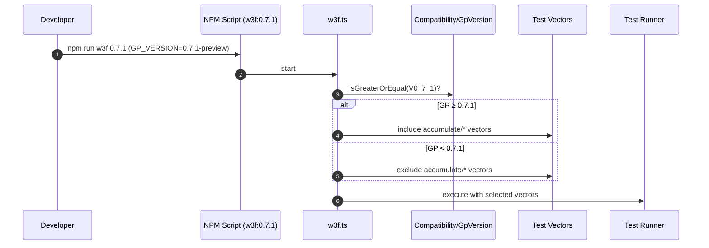
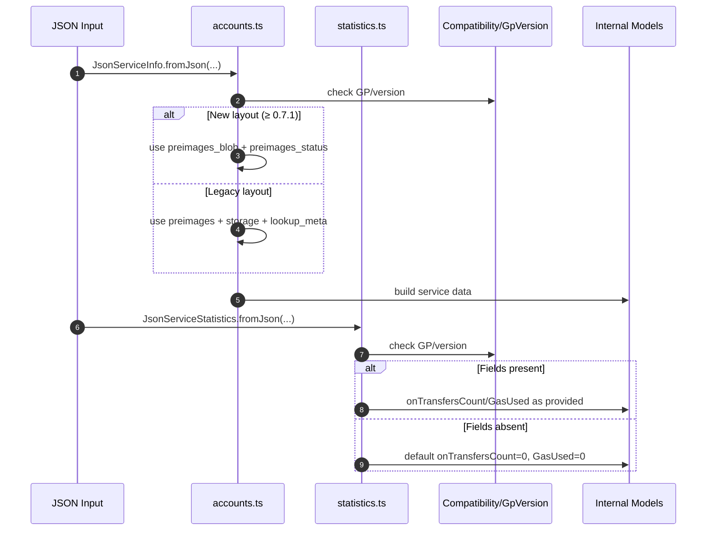

# Load 071 STF tests

## Pull Request by @mateuszsikora

This PR updates our test runner to load v0.7.1 test vectors. Some accumulation tests are ignored. They will be fixed in the next PR.

## Comment by @coderabbitai[bot]

<!-- This is an auto-generated comment: summarize by coderabbit.ai -->
<!-- This is an auto-generated comment: skip review by coderabbit.ai -->

> [!IMPORTANT]
> ## Review skipped
> 
> Auto incremental reviews are disabled on this repository.
> 
> Please check the settings in the CodeRabbit UI or the `.coderabbit.yaml` file in this repository. To trigger a single review, invoke the `@coderabbitai review` command.
> 
> You can disable this status message by setting the `reviews.review_status` to `false` in the CodeRabbit configuration file.

<!-- end of auto-generated comment: skip review by coderabbit.ai -->

<!-- walkthrough_start -->

📝 Walkthrough

<!-- This is an auto-generated comment: release notes by coderabbit.ai -->

## Summary by CodeRabbit

- New Features
  - Added compatibility for GP 0.7.1, enabling version-aware parsing of service account data.
  - Enhanced handling of preimage data and status, supporting new and legacy layouts.
  - Statistics now gracefully default on transfer-related metrics when absent.

- Bug Fixes
  - Improved robustness when processing varying JSON schemas across versions.

- Tests
  - Added a script to run test suites targeting GP 0.7.1.
  - Expanded test vectors to cover new version-specific scenarios.

<!-- end of auto-generated comment: release notes by coderabbit.ai -->
## Walkthrough
Adds a GP v0.7.1 test script and introduces GP version–gated behavior. The test runner conditionally includes accumulate vectors when GP ≥ 0.7.1. State JSON parsing gains version fields and conditional layouts for accounts and statistics, handling alternate preimage and on_transfers shapes with fallbacks and defaults.

## Changes
| Cohort / File(s) | Summary of Changes |
| --- | --- |
| **Test runner: GP version-gated vectors** `bin/test-runner/package.json` , `bin/test-runner/w3f.ts` | Adds script `w3f:0.7.1` mapping to `GP_VERSION=0.7.1-preview tsx ./w3f.ts`. In `w3f.ts`, imports `Compatibility`/`GpVersion` and conditionally includes accumulate-related JSON vectors when GP ≥ 0.7.1; otherwise excluded. |
| **State JSON: versioned schema handling** `packages/jam/state-json/accounts.ts`, `packages/jam/state-json/statistics.ts` | Introduces GP-aware parsing. Accounts: adds `version` to `JsonServiceInfo`; supports alternate fields (`preimages`/`storage`/`lookup_meta` vs `preimages_blob`/`preimages_status`) with fallbacks and new deserializer. Statistics: makes `on_transfers_*` optional; conditionally reads them and defaults to 0 when absent. |

## Sequence Diagram(s)

## Estimated code review effort
🎯 4 (Complex) | ⏱️ ~45 minutes

## Possibly related PRs
- FluffyLabs/typeberry#692 — Introduces GP v0.7.1 awareness across modules; closely aligned with this PR’s version-gated parsing and scripts.
- FluffyLabs/typeberry#477 — Modifies `bin/test-runner/w3f.ts` around vector inclusion; overlaps with new GP-gated accumulate vectors.
- FluffyLabs/typeberry#470 — Adds/updates Compatibility utilities used here for GP gating.

## Suggested reviewers
- skoszuta
- DrEverr

## Poem
> I thump the ground—version hops I hear,  
> GP’s moon is 0.7.1, so clear!  
> Vectors bloom, some only when it’s time,  
> Preimages shuffle in schema rhyme.  
> Stats tiptoe with defaults true—  
> A rabbit nods: “Tests, hop through!” 🐇✨

<!-- walkthrough_end -->

<!-- pre_merge_checks_walkthrough_start -->

## Pre-merge checks and finishing touches

✅ Passed checks (3 passed)

|     Check name     | Status   | Explanation                                                                                                                                                                                                                                            |
| :----------------: | :------- | :----------------------------------------------------------------------------------------------------------------------------------------------------------------------------------------------------------------------------------------------------- |
|     Title Check    | ✅ Passed | The pull request title concisely and accurately summarizes the primary change by indicating that it loads the v0.7.1 STF tests, which aligns with the main modifications in the test runner configuration and script files without unnecessary detail. |
|  Description Check | ✅ Passed | The description directly relates to the changeset by noting the update to the test runner for v0.7.1 test vectors and the temporary ignoring of accumulation tests, which corresponds to the changes in test loading logic and vector filtration.      |
| Docstring Coverage | ✅ Passed | No functions found in the changes. Docstring coverage check skipped.                                                                                                                                                                                   |

<!-- pre_merge_checks_walkthrough_end -->

<!-- tips_start -->

---

Comment `@coderabbitai help` to get the list of available commands and usage tips.

<!-- tips_end -->

<!-- internal state start -->

<!-- DwQgtGAEAqAWCWBnSTIEMB26CuAXA9mAOYCmGJATmriQCaQDG+Ats2bgFyQAOFk+AIwBWJBrngA3EsgEBPRvlqU0AgfFwA6NPEgQAfACgjoCEYDEZyAAUASpETZWaCrI5Ho6gDYkuAGXxo9AAMAOwAjJAAytAAYpA0iLjIkAYAco4ClFwhQREpAKo2vlywuLjciBwA9FVE6rDYAhpMzFUxntgAZp2yviqIVbiy3CSZFC5V3NienlU5eQb5iFmQzNQk2IgAXojwANb4VJApkfjYFAwkkAJUGAywXMyIYJ4BtGChYWCJnWAJSccDNBnKRcNdbvdHtosCdcNRNlx8CMYQYbCQJPASAB3SiVewHbZ4NAAGkgABEKABRKTjQF9TKePEACgw+HIAEpAQBhCgkdb0ahcABMQSFAFYwGEgh8ABzQMJCjhBACcHAAzCEAFpGMnSBgUeDccRsrhwVC2SDYbi0dbIXCwK7/SAUbAYch8AiQV6BSASIIaEIaCJOqRiQ6IDRRFhXNAMBiOabUeBs+LSAHOK7wIis3m0ADc8Qd8ix8Bm1yunXgAA86CgsGh7I1lgBHbDsaw2DRGfTGcBQMj0fCdHAEYhkZQ0egtNgYTg8PiCERiSTSa7yJhKKiqdRaHQ9kxQM3IVCYEeEUju/kKVjsLhULGNpwuNcKTcqNSabS6MCGXumAxqBggxpmALpupQkyxnsaCkBoQiICaBgAEQoQYFiQAAggAkmOl6To+azPkOjCwJgpCIN2mG0LQyANuQD5Oog+qGmCSFYmqnRKgGQZIfE+DXPAQH/KBrrupBDDQbB8FsqSazcNwglEHxkAAOJWAA+gAapSNiRFhADyqQALz+oGXy8OimIMYgVaQBoVTsZ0GhJJGqT8fg9qUCRZGrp6SjIkodyYsghyQCQVZIOIGBKUxBpGhGkBcmyuAUPgniQJ0rwPq69w+fm/AYJ48inoEtDqMmGBoOlsUsWFs7PqggkpYo2CXLQXZGGhlgYZ4NBUMaGB2vxnmQEoDCeM4SZsiFw7hdwhz4aFUwCJ48AMHV4jiNIlGRMxRroNRdBcAABo5XFmcddYZaWVzHYBwGJCJ4EUOJkkkHBCEYJdTKupukBITV8VIeypISFVbbedFtadKlzDoAIyyzspx1qVpOl6YZJnceZvIYti8Q2XZDkcc5iDHR1lKJPAaz4RuVy41ZYXdAtXAALJ0PAjjIahBgQGARj3cJYFiY5pNuChSFdZhOEXhOtYOE+8jEblUMUbzVE0egWDU/NFBgp0oVJcw3BJmoq1DFr9Aqdwmm4hVGWw/9AACQwjGMEx4KWiBIV2UCUlWNAYJrI0hqIBB8KtiTKUwQflWyVVFXW43YEo6BeiCVzLGCxGxvGzCJjQoEkBN+EAFKRIZ13eMgWIOlgRsm+IZvqLIGhICpvLrBQ+lUq2VVMtbtsULsbIaJpQTqSE6lhJyqApW2BYeQ6FAlssScdEoyCsuQkZHgoscDVV9gWT6aDYEQM4AiN4WRYpKDZocdAPWCobh8gkdgr9XkjWsgl1hI+AGBTQwKSKqfU74jRjs1dKmV8AMX4jcTA9wCqqSsL6O2KYDZ8FrmtWA6CwzD2UmBDq5huq9QnBVIahYrhjQmv1Sh/BZpVl1otPgy1VrrXYOVbaaQ2QkCMJTcQNNax02dJZfGJBmZ6y4AACSzLAbmkteb/hNhJGC0gqhCDQK0RI6wwDSSArnM4s4IxJHFqhdC2FcJy3oArQiSthwq3IpRDC1FkAOHkgtDKoUaQj3IPQculdEgujEOcVcf8RrLAoBiS46A4zGIBLomgbhjhQFLp9SIlAYkkCwhgA2kBWQPhNsPVcmBbHh1KQU/Gvj7aVmLvQJkNSTQFIyJQTkZSwrMPwMsY8YI0C0VWCQZgYwuypMgLk5qtBWqVPovOEg1N1H2DhLgTYo1pCUHgFVeAWwvJMgsgs0gkRlmbBiLDdJbJ2lBzTkwcY0h5qx2ivEYYMZVr9MgEyc5GArC8gOSQI58JECck9B4lhSyAXxCoBJO+WC5m/IjAYMZnzMnRLWu9GGLBPlenwHUdaqAiBXjkIlFgjd4DNwtiWe0qkbYYJAfYCl9w742jhPYUiIxlKCWTqneZnk2E/LWORKoiRDjqKqK8fAewrTqTYMypafL1GIHUitQQkw5XkXUkk1ZdTPCa38gOO+KYmkYFGboSAAB1Ou85AHSF2I8plJJqFYvFVaSACAhXPhgkQXk+KBpbzgfvXYf07UaDFRK7gUqSAyr4EG/Z/LpDquOcgJknQE4CCgpc+gMb5VrINFIeg6K4bRtVauUKhb5mxoVUqgQ7zk0zFTRJdkxq/YBwHMgJFWTUWjWoA2RArLHT8Q5RvK4sz2FrWuvU5Ama1WVstrC8t8bwWel5JlMODrDW1jtenWQZxNDq39oHTWOsFpUIHSnHwCKTUpVkBhRA+Q1RCgdiwSALtnnu1kFUDArTCF/1KnHLAnpL3XvyAANgACwztdlcW9QpBjPMgMBkDjaiXG1NqWFuM7B40ofXDZ9btKAe3EIyZSZAVDeHQcPCqYAY5lUPulV4OLfbjPqi1S4W98aBNSDwZwNqlIOk8CMQhHSIPIBhU1SglVqoJohVBRSpIKWwG3Z0lhECHRwxHeNeQmQt1XM8vAPgmxMxYDU08kY8KoD5GtLaHgjQOFrPGpNH1RDJHeDEFUh8a682Ym1bRK5G6e1oBM1dNtKLYkdKC9k3JBsOroVIZhch9DprKRGrQ+zDDiJzQWrWJa1nR1cK2mrKA3ykSUAtqVI6kBjqGpAFwD9wzKCXT/nZxAyBjphdRRF/A9WsDHVUW9AYWidHLJIPoz6VQjGuhckkY66tCv8ZK4dWgJ1KvVc/Z1xgE0mv2CYGymFLWMntsuO176RmtW0HZNN1Ks3irzZOpOuNlaAD8XBPnfLLeorCNBmAAG0AC6q3GvNda5cS6G6IPvLU2dgrF3itXaUAt8rt2FUasQI9yA/gnXcDkW62Q72hk/b++tgHe3gskGB124zVw9nZYYGdgwgiFm00UPTcRD5JFYLnHIogCiJbdhUVBeVmjtGCsG8NtkQukxUwYKYyoiipZWNlv1eWjh7GMMhs49WEzUpTJY/vajFUj4nr8VinF3iFwYHUilTAiBOi4jHV5wLRPsn/PEBLmQ/TMtYAw+RmS6Buhh2U1cdjm2VMNiGeofChL82fIY0lDANIARsnN7cK3uJ1JMHGzOhPFvBrW+HupfFCr9N5sdryVsunayeiRDR23msUwjUB385Zt9Jfk4Y64oQmwARyQUo8z0yLHeN5d80TuNBlIgsTkoZN0wAS1zIAVRPluc/Cc85rDM8NEZgiZJ5DTohowFWgEnxfSV09ybTjWzwda9jKSCKAq5bJ98L9xCpfpSxawn4bGfi/V+G3q1cSv5043qYKwU0oJRpzgIED9DgaZ7ZPQyAHBeQ98D9cQj8kYOk79EDh4n8b1lgBRPAsQ0BZBkBSIpA1lKx/FfRwZVwZ9DNNdWo74+9UUncm9TMNZWMHxD09ZE0G4UNzZZBSRPc/EgV+JaAc1HQHQyM/FKM2Rdd45aNsVR0Ol2Cr4XBAM70TcSCz5epFISFZc4tgEqEktRA6E9CVd0s9ZMs2EqcNpuF8tEoCdIB69GCXcuATtbMjCBpVc6Bz0oB81EQzcs9k9c809Zwqs4M708wvC+JfD59s8U8gjcAUcoNwj1YuQ7CHCB9xBJdnDl9XCUsUwnFPCxkfC59/DF889+l1JC8Qj6DLhMDwixkCAoiSiU988KjsCUdqiSBajKI3J+AeUrMVpR1dhsx4ReRkB8j8pIlG91pI9PojdR1eRf5BpSQBA8ACk/UqNf0E55AT1N4HVM90Cl9x0ro68K4OMmJg9rg3dBwsBDUKYqZhEpxGcxE8YWcpE5x2YyouZudlFfwDw6pBxhwz5Rx5crxpxbxnQ0AHw7FnANN1xGctwPxdxvxDA/jpx1B1J4AaJ1IGZsQ6B509ZkS/woAgggMZRaABAQgQhlRwgZQ1QBAxQ0Agg1QbQgMggQNugxRk1OhOSGABAwgQNlQwggMxRlQxRCSDBUSWBmB0TMSFUcScRaB1IBxCS/iLJw0KBSBU8HQJJEc4QCSewDAABvc9JCJAWwAAIVeAkjoCNkvisG6UnCQmcKqmWGJBNJ7TOG1UtMAT2FsCdIyhdJIDdOOFNMQH0hpANEOgwH9JrVdJNLKloBsFdDJEASOQNGikQC5G1L2H9PniDPjMxKTIwA8FwG8CzNEBzK4DzODP+gTKLN1EBgGnLIklzJdHzJDNWgwD2DoCwiazbEQDTP9JQhrKQnW1wGbL2DRAcF6m9i4E+3PWOGNOOGXP+nuArNSG0RICHJLNIwnKQhrJXIBgTVbLbAPOXKQjmgmkqgGm3LEKmDLBL37LBE2lIxjgYCQGLmKiuVznOHWETmhINB2TtDvINGV3yJfEEjKiASiiUntGoBQDBG9GDjEL9GxiiFiFTESEQFkwQGQS2WzBrnqAdUWNWEUHgErGgoYQiTEKdGFi8hjkrCIF/PcI6UbKrkoPqAU1ElEGtRhLWThFLA0H3IXPPNGLSk9jZCHJ6PyNongPIDoDoALBDi8EzDGO8GcFJEQBGHfIopv1sS6AosxFnHHz1DinEGIOIh/mhA8KErPJDOYEZyHLwIoAwEUmEpXJDN5AYqzDCRjMDLsv+kOCzEEiqgnI3LYCHJfK3JEoAF8zylyPKkI1yJJwqtyuAkIGy9p3C9yAqjyAUTz2zErLzMBgFbyaFTKWJ7YyovLSz5BeQS5fJhoxCZKI0XxWQYKHUrQmU+0HVaLuK+AYVUKzJMKX4w5wxwMaKhldY+Kswcx9VAS4wEwS5oC0xsLIAcFkEblRj7lg4mqrgZLji0wsVAg746N5CrlX5QpKxep4sjV3LEqxKOgbz0qejYx3DUBHyy8JixDN4sr7ZAgSA+4aBE4mBfEHUmIisVdIFSJVZbKRL7LHL0rnLXLop7rDyvK2RGLfLnTGRCrDygq6hxMwrNyhzfqzKKpJYVy4qRKErDzkq9hUqhyUzJcUo74koaR1E0bzykcCrcrirryKaXr+JOgcoHMDZfpjjmqYbyJIxmbgk75QblBSASIKz8RDQRh2ouaEalAnLnAUaiAtbAqDRCbQrszGb0raBAF5aMzKblyYrz1vsRyxzbBMrybJL0qZQQgBShQ1QGAQghRqSxQQhk0ZROgghU0QM0A1QwgxQBSQgSBo7o6BBlQZQZQE6U6+QxQRQSAQMZQgNRSwgSARSgg0AhQgMNQvb7rRz+lcBbAdy0r/oSAZRU1lQ70SAQhaAhQ0BAg0AxQghOhaBlRlQQM70GA1QS6whmTaAwgB7m6wh56SBy6hQy6BBRRWSQMQgZQhQQgGBZ7OggMgMhRJZ7aJS+w5l1TNT6aFVlT9AgA== -->

<!-- internal state end -->

## Comment by @github-actions[bot]

View all

| File | Benchmark | Ops |  |
|------|-----------|-----|--|
| [bytes/hex-to.ts[0]](../blob/1f8b7b0340f1554c6737f357df43ec4b6b6501db//_work/typeberry-1/typeberry/typeberry/benchmarks/bytes/hex-to.ts) | number toString + padding | 316888.43 ±0.81% | fastest ✅ |
| [bytes/hex-to.ts[1]](../blob/1f8b7b0340f1554c6737f357df43ec4b6b6501db//_work/typeberry-1/typeberry/typeberry/benchmarks/bytes/hex-to.ts) | manual | 16276.66 ±0.35% | 94.86% slower |
| [bytes/hex-from.ts[0]](../blob/1f8b7b0340f1554c6737f357df43ec4b6b6501db//_work/typeberry-1/typeberry/typeberry/benchmarks/bytes/hex-from.ts) | parse hex using `Number` with NaN checking | 131971.6 ±2.96% | 84.89% slower |
| [bytes/hex-from.ts[1]](../blob/1f8b7b0340f1554c6737f357df43ec4b6b6501db//_work/typeberry-1/typeberry/typeberry/benchmarks/bytes/hex-from.ts) | parse hex from char codes | 873177.65 ±0.38% | fastest ✅ |
| [bytes/hex-from.ts[2]](../blob/1f8b7b0340f1554c6737f357df43ec4b6b6501db//_work/typeberry-1/typeberry/typeberry/benchmarks/bytes/hex-from.ts) | parse hex from string nibbles | 543972.54 ±0.59% | 37.7% slower |
| [codec/decoding.ts[0]](../blob/1f8b7b0340f1554c6737f357df43ec4b6b6501db//_work/typeberry-1/typeberry/typeberry/benchmarks/codec/decoding.ts) | manual decode | 22500301.68 ±0.64% | 86.18% slower |
| [codec/decoding.ts[1]](../blob/1f8b7b0340f1554c6737f357df43ec4b6b6501db//_work/typeberry-1/typeberry/typeberry/benchmarks/codec/decoding.ts) | int32array decode | 162451439.87 ±2.71% | 0.21% slower |
| [codec/decoding.ts[2]](../blob/1f8b7b0340f1554c6737f357df43ec4b6b6501db//_work/typeberry-1/typeberry/typeberry/benchmarks/codec/decoding.ts) | dataview decode | 162790197.11 ±3.16% | fastest ✅ |
| [codec/encoding.ts[0]](../blob/1f8b7b0340f1554c6737f357df43ec4b6b6501db//_work/typeberry-1/typeberry/typeberry/benchmarks/codec/encoding.ts) | manual encode | 2978807.49 ±0.82% | 18.31% slower |
| [codec/encoding.ts[1]](../blob/1f8b7b0340f1554c6737f357df43ec4b6b6501db//_work/typeberry-1/typeberry/typeberry/benchmarks/codec/encoding.ts) | int32array encode | 3644929.67 ±0.47% | 0.04% slower |
| [codec/encoding.ts[2]](../blob/1f8b7b0340f1554c6737f357df43ec4b6b6501db//_work/typeberry-1/typeberry/typeberry/benchmarks/codec/encoding.ts) | dataview encode | 3646461.24 ±0.42% | fastest ✅ |
| [math/mul_overflow.ts[0]](../blob/1f8b7b0340f1554c6737f357df43ec4b6b6501db//_work/typeberry-1/typeberry/typeberry/benchmarks/math/mul_overflow.ts) | multiply and bring back to u32 | 245893058.88 ±6.15% | 1.8% slower |
| [math/mul_overflow.ts[1]](../blob/1f8b7b0340f1554c6737f357df43ec4b6b6501db//_work/typeberry-1/typeberry/typeberry/benchmarks/math/mul_overflow.ts) | multiply and take modulus | 250389330.91 ±6.47% | fastest ✅ |
| [hash/index.ts[0]](../blob/1f8b7b0340f1554c6737f357df43ec4b6b6501db//_work/typeberry-1/typeberry/typeberry/benchmarks/hash/index.ts) | hash with numeric representation | 180.48 ±0.7% | 27.85% slower |
| [hash/index.ts[1]](../blob/1f8b7b0340f1554c6737f357df43ec4b6b6501db//_work/typeberry-1/typeberry/typeberry/benchmarks/hash/index.ts) | hash with string representation | 101.14 ±1.11% | 59.57% slower |
| [hash/index.ts[2]](../blob/1f8b7b0340f1554c6737f357df43ec4b6b6501db//_work/typeberry-1/typeberry/typeberry/benchmarks/hash/index.ts) | hash with symbol representation | 164.03 ±1.14% | 34.43% slower |
| [hash/index.ts[3]](../blob/1f8b7b0340f1554c6737f357df43ec4b6b6501db//_work/typeberry-1/typeberry/typeberry/benchmarks/hash/index.ts) | hash with uint8 representation | 157.91 ±0.56% | 36.88% slower |
| [hash/index.ts[4]](../blob/1f8b7b0340f1554c6737f357df43ec4b6b6501db//_work/typeberry-1/typeberry/typeberry/benchmarks/hash/index.ts) | hash with packed representation | 250.16 ±1.07% | fastest ✅ |
| [hash/index.ts[5]](../blob/1f8b7b0340f1554c6737f357df43ec4b6b6501db//_work/typeberry-1/typeberry/typeberry/benchmarks/hash/index.ts) | hash with bigint representation | 186.05 ±0.53% | 25.63% slower |
| [hash/index.ts[6]](../blob/1f8b7b0340f1554c6737f357df43ec4b6b6501db//_work/typeberry-1/typeberry/typeberry/benchmarks/hash/index.ts) | hash with uint32 representation | 196.96 ±0.77% | 21.27% slower |
| [codec/bigint.decode.ts[0]](../blob/1f8b7b0340f1554c6737f357df43ec4b6b6501db//_work/typeberry-1/typeberry/typeberry/benchmarks/codec/bigint.decode.ts) | decode custom | 168296640.64 ±2.96% | fastest ✅ |
| [codec/bigint.decode.ts[1]](../blob/1f8b7b0340f1554c6737f357df43ec4b6b6501db//_work/typeberry-1/typeberry/typeberry/benchmarks/codec/bigint.decode.ts) | decode bigint | 103765278.78 ±2.08% | 38.34% slower |
| [codec/bigint.compare.ts[0]](../blob/1f8b7b0340f1554c6737f357df43ec4b6b6501db//_work/typeberry-1/typeberry/typeberry/benchmarks/codec/bigint.compare.ts) | compare custom | 225016852.38 ±7.79% | 15.51% slower |
| [codec/bigint.compare.ts[1]](../blob/1f8b7b0340f1554c6737f357df43ec4b6b6501db//_work/typeberry-1/typeberry/typeberry/benchmarks/codec/bigint.compare.ts) | compare bigint | 266327727.06 ±6.77% | fastest ✅ |
| [collections/map-set.ts[0]](../blob/1f8b7b0340f1554c6737f357df43ec4b6b6501db//_work/typeberry-1/typeberry/typeberry/benchmarks/collections/map-set.ts) | 2 gets + conditional set | 119246.57 ±0.38% | fastest ✅ |
| [collections/map-set.ts[1]](../blob/1f8b7b0340f1554c6737f357df43ec4b6b6501db//_work/typeberry-1/typeberry/typeberry/benchmarks/collections/map-set.ts) | 1 get 1 set | 60373.17 ±0.26% | 49.37% slower |
| [math/switch.ts[0]](../blob/1f8b7b0340f1554c6737f357df43ec4b6b6501db//_work/typeberry-1/typeberry/typeberry/benchmarks/math/switch.ts) | switch | 250061115.42 ±7.46% | 5.15% slower |
| [math/switch.ts[1]](../blob/1f8b7b0340f1554c6737f357df43ec4b6b6501db//_work/typeberry-1/typeberry/typeberry/benchmarks/math/switch.ts) | if | 263640622.71 ±5.44% | fastest ✅ |
| [math/add_one_overflow.ts[0]](../blob/1f8b7b0340f1554c6737f357df43ec4b6b6501db//_work/typeberry-1/typeberry/typeberry/benchmarks/math/add_one_overflow.ts) | add and take modulus | 252769834.38 ±6.41% | 4.64% slower |
| [math/add_one_overflow.ts[1]](../blob/1f8b7b0340f1554c6737f357df43ec4b6b6501db//_work/typeberry-1/typeberry/typeberry/benchmarks/math/add_one_overflow.ts) | condition before calculation | 265076914.82 ±5.42% | fastest ✅ |
| [math/count-bits-u32.ts[0]](../blob/1f8b7b0340f1554c6737f357df43ec4b6b6501db//_work/typeberry-1/typeberry/typeberry/benchmarks/math/count-bits-u32.ts) | standard method | 82733600.39 ±1.7% | 66.33% slower |
| [math/count-bits-u32.ts[1]](../blob/1f8b7b0340f1554c6737f357df43ec4b6b6501db//_work/typeberry-1/typeberry/typeberry/benchmarks/math/count-bits-u32.ts) | magic | 245755374.1 ±5.12% | fastest ✅ |
| [math/count-bits-u64.ts[0]](../blob/1f8b7b0340f1554c6737f357df43ec4b6b6501db//_work/typeberry-1/typeberry/typeberry/benchmarks/math/count-bits-u64.ts) | standard method | 1297542.22 ±0.36% | 87.94% slower |
| [math/count-bits-u64.ts[1]](../blob/1f8b7b0340f1554c6737f357df43ec4b6b6501db//_work/typeberry-1/typeberry/typeberry/benchmarks/math/count-bits-u64.ts) | magic | 10762816.72 ±0.92% | fastest ✅ |
| [logger/index.ts[0]](../blob/1f8b7b0340f1554c6737f357df43ec4b6b6501db//_work/typeberry-1/typeberry/typeberry/benchmarks/logger/index.ts) | console.log with string concat | 6290335.39 ±59.41% | fastest ✅ |
| [logger/index.ts[1]](../blob/1f8b7b0340f1554c6737f357df43ec4b6b6501db//_work/typeberry-1/typeberry/typeberry/benchmarks/logger/index.ts) | console.log with args | 690285.71 ±110.88% | 89.03% slower |
| [codec/view_vs_object.ts[0]](../blob/1f8b7b0340f1554c6737f357df43ec4b6b6501db//_work/typeberry-1/typeberry/typeberry/benchmarks/codec/view_vs_object.ts) | Get the first field from Decoded | 373968.78 ±1.91% | 1.91% slower |
| [codec/view_vs_object.ts[1]](../blob/1f8b7b0340f1554c6737f357df43ec4b6b6501db//_work/typeberry-1/typeberry/typeberry/benchmarks/codec/view_vs_object.ts) | Get the first field from View | 82155.78 ±1.02% | 78.45% slower |
| [codec/view_vs_object.ts[2]](../blob/1f8b7b0340f1554c6737f357df43ec4b6b6501db//_work/typeberry-1/typeberry/typeberry/benchmarks/codec/view_vs_object.ts) | Get the first field as view from View | 74874.24 ±1.98% | 80.36% slower |
| [codec/view_vs_object.ts[3]](../blob/1f8b7b0340f1554c6737f357df43ec4b6b6501db//_work/typeberry-1/typeberry/typeberry/benchmarks/codec/view_vs_object.ts) | Get two fields from Decoded | 381236.23 ±1.07% | fastest ✅ |
| [codec/view_vs_object.ts[4]](../blob/1f8b7b0340f1554c6737f357df43ec4b6b6501db//_work/typeberry-1/typeberry/typeberry/benchmarks/codec/view_vs_object.ts) | Get two fields from View | 64233.83 ±0.86% | 83.15% slower |
| [codec/view_vs_object.ts[5]](../blob/1f8b7b0340f1554c6737f357df43ec4b6b6501db//_work/typeberry-1/typeberry/typeberry/benchmarks/codec/view_vs_object.ts) | Get two fields from materialized from View | 131987.6 ±1.06% | 65.38% slower |
| [codec/view_vs_object.ts[6]](../blob/1f8b7b0340f1554c6737f357df43ec4b6b6501db//_work/typeberry-1/typeberry/typeberry/benchmarks/codec/view_vs_object.ts) | Get two fields as views from View | 63292.03 ±1.1% | 83.4% slower |
| [codec/view_vs_object.ts[7]](../blob/1f8b7b0340f1554c6737f357df43ec4b6b6501db//_work/typeberry-1/typeberry/typeberry/benchmarks/codec/view_vs_object.ts) | Get only third field from Decoded | 337222.77 ±1.22% | 11.54% slower |
| [codec/view_vs_object.ts[8]](../blob/1f8b7b0340f1554c6737f357df43ec4b6b6501db//_work/typeberry-1/typeberry/typeberry/benchmarks/codec/view_vs_object.ts) | Get only third field from View | 77399.81 ±1.96% | 79.7% slower |
| [codec/view_vs_object.ts[9]](../blob/1f8b7b0340f1554c6737f357df43ec4b6b6501db//_work/typeberry-1/typeberry/typeberry/benchmarks/codec/view_vs_object.ts) | Get only third field as view from View | 79885.94 ±0.82% | 79.05% slower |
| [codec/view_vs_collection.ts[0]](../blob/1f8b7b0340f1554c6737f357df43ec4b6b6501db//_work/typeberry-1/typeberry/typeberry/benchmarks/codec/view_vs_collection.ts) | Get first element from Decoded | 23705.28 ±1.08% | 57.26% slower |
| [codec/view_vs_collection.ts[1]](../blob/1f8b7b0340f1554c6737f357df43ec4b6b6501db//_work/typeberry-1/typeberry/typeberry/benchmarks/codec/view_vs_collection.ts) | Get first element from View | 55460.07 ±2.8% | fastest ✅ |
| [codec/view_vs_collection.ts[2]](../blob/1f8b7b0340f1554c6737f357df43ec4b6b6501db//_work/typeberry-1/typeberry/typeberry/benchmarks/codec/view_vs_collection.ts) | Get 50th element from Decoded | 25156.22 ±4.02% | 54.64% slower |
| [codec/view_vs_collection.ts[3]](../blob/1f8b7b0340f1554c6737f357df43ec4b6b6501db//_work/typeberry-1/typeberry/typeberry/benchmarks/codec/view_vs_collection.ts) | Get 50th element from View | 26708.29 ±1.87% | 51.84% slower |
| [codec/view_vs_collection.ts[4]](../blob/1f8b7b0340f1554c6737f357df43ec4b6b6501db//_work/typeberry-1/typeberry/typeberry/benchmarks/codec/view_vs_collection.ts) | Get last element from Decoded | 25977.79 ±1.38% | 53.16% slower |
| [codec/view_vs_collection.ts[5]](../blob/1f8b7b0340f1554c6737f357df43ec4b6b6501db//_work/typeberry-1/typeberry/typeberry/benchmarks/codec/view_vs_collection.ts) | Get last element from View | 19927.24 ±2.44% | 64.07% slower |
| [bytes/compare.ts[0]](../blob/1f8b7b0340f1554c6737f357df43ec4b6b6501db//_work/typeberry-1/typeberry/typeberry/benchmarks/bytes/compare.ts) | Comparing Uint32 bytes | 19975.5 ±1.25% | 3.61% slower |
| [bytes/compare.ts[1]](../blob/1f8b7b0340f1554c6737f357df43ec4b6b6501db//_work/typeberry-1/typeberry/typeberry/benchmarks/bytes/compare.ts) | Comparing raw bytes | 20723.28 ±1.06% | fastest ✅ |
| [collections/map_vs_sorted.ts[0]](../blob/1f8b7b0340f1554c6737f357df43ec4b6b6501db//_work/typeberry-1/typeberry/typeberry/benchmarks/collections/map_vs_sorted.ts) | Map | 298456.11 ±0.33% | fastest ✅ |
| [collections/map_vs_sorted.ts[1]](../blob/1f8b7b0340f1554c6737f357df43ec4b6b6501db//_work/typeberry-1/typeberry/typeberry/benchmarks/collections/map_vs_sorted.ts) | Map-array | 100202.14 ±0.48% | 66.43% slower |
| [collections/map_vs_sorted.ts[2]](../blob/1f8b7b0340f1554c6737f357df43ec4b6b6501db//_work/typeberry-1/typeberry/typeberry/benchmarks/collections/map_vs_sorted.ts) | Array | 19970.08 ±111.28% | 93.31% slower |
| [collections/map_vs_sorted.ts[3]](../blob/1f8b7b0340f1554c6737f357df43ec4b6b6501db//_work/typeberry-1/typeberry/typeberry/benchmarks/collections/map_vs_sorted.ts) | SortedArray | 195197.13 ±0.67% | 34.6% slower |
| [hash/blake2b.ts[0]](../blob/1f8b7b0340f1554c6737f357df43ec4b6b6501db//_work/typeberry-1/typeberry/typeberry/benchmarks/hash/blake2b.ts) | our hasher | 2.11 ±0.4% | fastest ✅ |
| [hash/blake2b.ts[1]](../blob/1f8b7b0340f1554c6737f357df43ec4b6b6501db//_work/typeberry-1/typeberry/typeberry/benchmarks/hash/blake2b.ts) | blake2b js | 0.04 ±4.2% | 98.1% slower |
| [crypto/ed25519.ts[0]](../blob/1f8b7b0340f1554c6737f357df43ec4b6b6501db//_work/typeberry-1/typeberry/typeberry/benchmarks/crypto/ed25519.ts) | native crypto | 5.49 ±18.32% | 82.07% slower |
| [crypto/ed25519.ts[1]](../blob/1f8b7b0340f1554c6737f357df43ec4b6b6501db//_work/typeberry-1/typeberry/typeberry/benchmarks/crypto/ed25519.ts) | wasm lib | 10.88 ±0.02% | 64.47% slower |
| [crypto/ed25519.ts[2]](../blob/1f8b7b0340f1554c6737f357df43ec4b6b6501db//_work/typeberry-1/typeberry/typeberry/benchmarks/crypto/ed25519.ts) | wasm lib batch | 30.62 ±0.52% | fastest ✅ |

### Benchmarks summary: 63/63 OK ✅

<!-- thollander/actions-comment-pull-request "benchmarks" -->

## Comment by @DrEverr

Why this tests are not passing? Could you add a list (a sum-up) of what we should implement to make them pass (very general one, without going into much details)?

## Comment by @mateuszsikora

done
