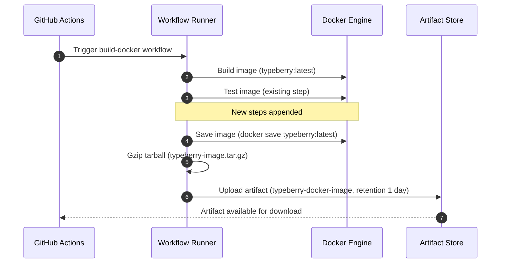

# Save PR docker image as artifact

## Pull Request by @tomusdrw

my plan is to use it for benchmarking in typeberry-testing repo

## Comment by @coderabbitai[bot]

<!-- This is an auto-generated comment: summarize by coderabbit.ai -->
<!-- walkthrough_start -->

📝 Walkthrough

<!-- This is an auto-generated comment: release notes by coderabbit.ai -->

## Summary by CodeRabbit

* **Chores**
  * CI workflow now produces a compressed Docker image artifact for each build and uploads it for short-term download.
  * Improves traceability and reproducibility of builds across environments.
  * Eases testing and rollback by providing the exact image generated in the pipeline.
  * Speeds local setup by allowing direct import of the prebuilt image.
  * No changes to application features or user-facing behavior.

<!-- end of auto-generated comment: release notes by coderabbit.ai -->
## Walkthrough
Appends two steps to the Docker build workflow: saving the built image as a gzipped tarball and uploading it as a short-retention artifact. Existing build and test steps remain unchanged.

## Changes
| Cohort / File(s) | Summary |
|---|---|
| **CI workflow: save and upload Docker image** `\.github/workflows/build-docker.yml` | Added steps after testing: (1) docker save of typeberry:latest piped to gzip into typeberry-image.tar.gz, (2) upload artifact via actions/upload-artifact@v4 named typeberry-docker-image with 1-day retention. No prior steps modified. |

## Sequence Diagram(s)

## Estimated code review effort
🎯 2 (Simple) | ⏱️ ~10 minutes

## Poem
> I hop through builds where containers bloom,  
> A tarball twirls—pssh—like a comet’s plume.  
> Saved with a zip, then skyward I fling,  
> An artifact snack for the morning’s ping.  
> Thump-thump! says my paw—CI’s just right,  
> One-day carrots cached, then out of sight. 🥕🚀

<!-- walkthrough_end -->

<!-- pre_merge_checks_walkthrough_start -->

## Pre-merge checks and finishing touches

✅ Passed checks (3 passed)

|     Check name     | Status   | Explanation                                                                                                                                                                                                                                                                                             |
| :----------------: | :------- | :------------------------------------------------------------------------------------------------------------------------------------------------------------------------------------------------------------------------------------------------------------------------------------------------------ |
|     Title Check    | ✅ Passed | The title succinctly and accurately summarizes the main change by indicating that the Docker image will be saved as an artifact. It directly corresponds to the added workflow steps for exporting and uploading the image. This clarity ensures that reviewers can immediately grasp the PR’s purpose. |
|  Description Check | ✅ Passed | The description states that the saved Docker image will be used for benchmarking in the typeberry-testing repo, which clearly relates to the artifact creation steps. It provides meaningful context without deviating from the changeset. Therefore, it is an adequate description of the PR’s intent. |
| Docstring Coverage | ✅ Passed | No functions found in the changes. Docstring coverage check skipped.                                                                                                                                                                                                                                    |

<!-- pre_merge_checks_walkthrough_end -->

<!-- finishing_touch_checkbox_start -->

✨ Finishing touches

🧪 Generate unit tests (beta)

- [ ] <!-- {"checkboxId": "f47ac10b-58cc-4372-a567-0e02b2c3d479", "radioGroupId": "utg-output-choice-group-unknown_comment_id"} -->   Create PR with unit tests
- [ ] <!-- {"checkboxId": "07f1e7d6-8a8e-4e23-9900-8731c2c87f58", "radioGroupId": "utg-output-choice-group-unknown_comment_id"} -->   Post copyable unit tests in a comment
- [ ] <!-- {"checkboxId": "6ba7b810-9dad-11d1-80b4-00c04fd430c8", "radioGroupId": "utg-output-choice-group-unknown_comment_id"} -->   Commit unit tests in branch `td-docker-save`

<!-- finishing_touch_checkbox_end -->

<!-- tips_start -->

---

Comment `@coderabbitai help` to get the list of available commands and usage tips.

<!-- tips_end -->

<!-- internal state start -->

<!-- DwQgtGAEAqAWCWBnSTIEMB26CuAXA9mAOYCmGJATmriQCaQDG+Ats2bgFyQAOFk+AIwBWJBrngA3EsgEBPRvlqU0AgfFwA6NPEgQAfACgjoCEYDEZyAAUASpETZWaCrKPR1AGxJcAyminWdrT4DADWlCjMaKToyM7iAGZoYpCQBgByjgKUXADsAAwALKkGAKo2ADJcsLi43IgcAPSNROqw2AIaTMyNAGIe2AkJshUqiI24stwk2RQujdzYHh6NBcVppYg5kATM2Ii0FADuJT742BQMJJACVBgMsFy4tGDBYZRgiP7XadDOpLgbncHlwovAsGkfLhqPsuPhphCDDYSBJ4CQjpQGpAABQYfDkSAeJA0WgAShKo2yHixuPx1yJiBJ5LSAGEKCRqHR0JxIAAmfK8gCsYAAjPkwPkABzQEWCjgAZgAbBxCoKAFpGAAi0gYFHg3HE+K4ACJmPJuB5MChkARIPtrupIAl8HxsvdYFEKKFwUQUFhJtNZi4wDRGT7IOzuPhjUZ9MZwFAyPR8AkcARiGRlCSFKx2FxePxhKJxFIZPImEoqKp1FodHGTFA4KhUFa0HhCKRyFRs902BgeVQTg4nC4buXFMpq5ptLowIZ46YDBpWrh2gJGkcXaEEh58EdxgJsPAPC83uEKBpZMwPBwDMb7wYLJAAIIASQzXc59GHnvkKcYsCYKQiBGM+tC0Dam6QOQQ40PUOz4DssDXJqITnmAh7HrQ4abl6O57reUB+AEqHvHw8BRKQXAUNgGDIGeERfAEAYzJQLgcJaoaAgAPpARAAF76pAeg7FMrFzLIYAUdEJAaNCF4CQhPAUIo2BXOgfGCdw0z0PJAhoMs/Cpqu1yYR4gLSaQGgGFApQWvgaD0KR56RDJ6AUIkyQ8vacRiPA+LjNg9mOWA8TwEkYgAAISMUtpBbujmiYGbGSZZsnycu/GxOgWBhRFgIYGgbC6WJQaSQxFBSZR1xHG0EYkDQ/b+RgrxoLIyBbICtoitZBhwNI1yMiQ8HONcaDaUmXJoAkNB8CZkAkAAHsS4bQNIgLOREaX2HBAA0fq4CptBqeGeVeYw7LUM1OX0PFDn0LVq7nICBmzeGvD+XwQ31L15iWM+5lZs1NqIfNSgMJa3bA0ZC2LVGHlci6PAdESDALU14jSLGkDpHSRgAKJhlEPYTvVqLogtQwujyACydDwI4d4PjZc4LomGDJqmbbpp2WZcr2eYRmgQ6OL+Y4KJWKhqNOdasw2ObMOoAD68AQUr7LkxitBK4y8SzvO8toLyJAJEo+T5CQhQMLQCSFCovICAwkrZGKIqSmguQ2yKhSFAkvK5LkACckr5PrbMK8rquIOrKJolrStJmH8u8CQStsBQpBKw8oihNHuseWHBgAN4GKkxpILYABCu7vLQLIsH2uBWPgQ20MaXBJNSJC7aXkDGogsDnCe1dobY7dOgZWw92XSAAPJSHMqtKBg4+d1PvfGthtA2LRpFQnqGBEIgLLIWE4+Hdg3cb1vO8YO4uBeCfOfnzRV9lzfu86nqBrNU/Z9PK/aefciQYHCLQV8iAHDSH3uPe8QDjSWkZH/UIyIHDmUQOPAA2r3VIJdUj4L7tnMI6QiokFgffLwkBkHGiAQQ/u0JcD7BfpfWh+DjRLQtJgK6+JyHIR2J4QaakGDgjEB4eQmB6DJAYBcTkYj7Ci2cPAfi0gkLXDBFgB4QFTLyHBNhBgV1D5IWoKoyAm1yLVUgLVQy2R7DfEkXEXKHlwpeQ0JAV8gJsLslEeOOY0gowcxBiYxySgHpbnwrBYayBnR8A4dTU6HM7TBWwoY+aaVXFNmQBDRRkx0YOHZDaQCgINZx0xIwK0FFirwFkfIIgVBEDcBMbYQAmATIEWBQKMWwNA0JwWw/J+ABiGhXiaXGZMkDXXZAARyPOyb8IjrjzXEA/B0mSvDOH2kwe4SBu43UgJ44sciDLwCIOQB6dV5rNMyYBQ+0gumsLLswCcsCjjOAwD6bpBCy5ePxAkI5FwyEd0nm/D5xoXRHPBAZZBJC2CwMWV4GMBCAC+rC8HAqIaEKF/y+7akQLqfUgyqGn1CO84FutGEYIASwnpZcOGWkKoM3h1wlA4u/vi0lKjVzGPmkxLkZjXIxCsR4G41x7T0GiUK90npvSGPBCYliZUQzrXDJGfA+0jgIAeIwVZFA5Hsk4uy0GfCzopF1ByVlcFECuPccpfAqImWQDYJgH0CQlgKH7EtQEj1B54F2bHAxvoEgqWYCYzR1zOrpOQuyaJ2zHQtlykoKZnIfXMrxddf85ybAtIOuwW5VK+59IGc1WBIzimIGuuQOgXJsj6PtCYpluKf74mtPVLwEhMAvQSTS7QdETFEAcoKtNfCQ3ARzR8vuDylBPJeW8u5ebRDfN+eyVegKZ0gr1K0QqHhIWkNgXWllhaelIp6SiuhaKMWwNIoyA+vp64LxksSuhpKmEUqBXQztdLC3DMQs6+4gyonnASTK+aQ6bmmJCJe8MTBb0xDRfYb0E1aAjuBeOzFxpnkUFeYfe9bDQXrohYSs9Jo3jgcPhgg9vcAC68DEFNxsNi+t9LCN+2dgweUVwRRDF5IUOgDAg6CnNgwQoip3bB0VLyQO+RBSSlyAIEUvJJS0AEJxgQgo0D5FoJKBggpA6FFkyKa2vIRS0AKMShBaBGS2AoSh7TuQRQzF5LyBI8oSC5HlAkITuQGC8loPKVQtnciFFyIKWgenBS5HkwwZTfHLa5BIIKJ2hQBCB0FAkAQuR/b5HlLQCLAWYwIvDinNOlBM5oujonfQQA -->

<!-- internal state end -->

## Comment by @github-actions[bot]

View all

| File | Benchmark | Ops |  |
|------|-----------|-----|--|
| [bytes/hex-from.ts[0]](../blob/c932efc953fa6a73c6c7da592b08258555755b70//_work/typeberry-1/typeberry/typeberry/benchmarks/bytes/hex-from.ts) | parse hex using `Number` with NaN checking | 130128.27 ±2.96% | 84.49% slower |
| [bytes/hex-from.ts[1]](../blob/c932efc953fa6a73c6c7da592b08258555755b70//_work/typeberry-1/typeberry/typeberry/benchmarks/bytes/hex-from.ts) | parse hex from char codes | 839146.18 ±0.43% | fastest ✅ |
| [bytes/hex-from.ts[2]](../blob/c932efc953fa6a73c6c7da592b08258555755b70//_work/typeberry-1/typeberry/typeberry/benchmarks/bytes/hex-from.ts) | parse hex from string nibbles | 552939.21 ±0.39% | 34.11% slower |
| [bytes/hex-to.ts[0]](../blob/c932efc953fa6a73c6c7da592b08258555755b70//_work/typeberry-1/typeberry/typeberry/benchmarks/bytes/hex-to.ts) | number toString + padding | 321321.1 ±0.35% | fastest ✅ |
| [bytes/hex-to.ts[1]](../blob/c932efc953fa6a73c6c7da592b08258555755b70//_work/typeberry-1/typeberry/typeberry/benchmarks/bytes/hex-to.ts) | manual | 15698.05 ±0.47% | 95.11% slower |
| [collections/map-set.ts[0]](../blob/c932efc953fa6a73c6c7da592b08258555755b70//_work/typeberry-1/typeberry/typeberry/benchmarks/collections/map-set.ts) | 2 gets + conditional set | 70879.71 ±0.35% | fastest ✅ |
| [collections/map-set.ts[1]](../blob/c932efc953fa6a73c6c7da592b08258555755b70//_work/typeberry-1/typeberry/typeberry/benchmarks/collections/map-set.ts) | 1 get 1 set | 41664.27 ±0.38% | 41.22% slower |
| [codec/bigint.decode.ts[0]](../blob/c932efc953fa6a73c6c7da592b08258555755b70//_work/typeberry-1/typeberry/typeberry/benchmarks/codec/bigint.decode.ts) | decode custom | 173316610.5 ±2.09% | fastest ✅ |
| [codec/bigint.decode.ts[1]](../blob/c932efc953fa6a73c6c7da592b08258555755b70//_work/typeberry-1/typeberry/typeberry/benchmarks/codec/bigint.decode.ts) | decode bigint | 103431580.26 ±2.57% | 40.32% slower |
| [codec/bigint.compare.ts[0]](../blob/c932efc953fa6a73c6c7da592b08258555755b70//_work/typeberry-1/typeberry/typeberry/benchmarks/codec/bigint.compare.ts) | compare custom | 262466076.73 ±5.59% | fastest ✅ |
| [codec/bigint.compare.ts[1]](../blob/c932efc953fa6a73c6c7da592b08258555755b70//_work/typeberry-1/typeberry/typeberry/benchmarks/codec/bigint.compare.ts) | compare bigint | 261961947.26 ±4.81% | 0.19% slower |
| [hash/index.ts[0]](../blob/c932efc953fa6a73c6c7da592b08258555755b70//_work/typeberry-1/typeberry/typeberry/benchmarks/hash/index.ts) | hash with numeric representation | 183.36 ±0.97% | 26.95% slower |
| [hash/index.ts[1]](../blob/c932efc953fa6a73c6c7da592b08258555755b70//_work/typeberry-1/typeberry/typeberry/benchmarks/hash/index.ts) | hash with string representation | 114.9 ±0.67% | 54.23% slower |
| [hash/index.ts[2]](../blob/c932efc953fa6a73c6c7da592b08258555755b70//_work/typeberry-1/typeberry/typeberry/benchmarks/hash/index.ts) | hash with symbol representation | 173.63 ±0.57% | 30.83% slower |
| [hash/index.ts[3]](../blob/c932efc953fa6a73c6c7da592b08258555755b70//_work/typeberry-1/typeberry/typeberry/benchmarks/hash/index.ts) | hash with uint8 representation | 150.06 ±1.48% | 40.22% slower |
| [hash/index.ts[4]](../blob/c932efc953fa6a73c6c7da592b08258555755b70//_work/typeberry-1/typeberry/typeberry/benchmarks/hash/index.ts) | hash with packed representation | 251.02 ±1.11% | fastest ✅ |
| [hash/index.ts[5]](../blob/c932efc953fa6a73c6c7da592b08258555755b70//_work/typeberry-1/typeberry/typeberry/benchmarks/hash/index.ts) | hash with bigint representation | 152.62 ±2.22% | 39.2% slower |
| [hash/index.ts[6]](../blob/c932efc953fa6a73c6c7da592b08258555755b70//_work/typeberry-1/typeberry/typeberry/benchmarks/hash/index.ts) | hash with uint32 representation | 184.5 ±1.32% | 26.5% slower |
| [math/mul_overflow.ts[0]](../blob/c932efc953fa6a73c6c7da592b08258555755b70//_work/typeberry-1/typeberry/typeberry/benchmarks/math/mul_overflow.ts) | multiply and bring back to u32 | 228891861.05 ±6.09% | fastest ✅ |
| [math/mul_overflow.ts[1]](../blob/c932efc953fa6a73c6c7da592b08258555755b70//_work/typeberry-1/typeberry/typeberry/benchmarks/math/mul_overflow.ts) | multiply and take modulus | 216107085.69 ±7.66% | 5.59% slower |
| [math/count-bits-u32.ts[0]](../blob/c932efc953fa6a73c6c7da592b08258555755b70//_work/typeberry-1/typeberry/typeberry/benchmarks/math/count-bits-u32.ts) | standard method | 76408676.64 ±1.57% | 64.5% slower |
| [math/count-bits-u32.ts[1]](../blob/c932efc953fa6a73c6c7da592b08258555755b70//_work/typeberry-1/typeberry/typeberry/benchmarks/math/count-bits-u32.ts) | magic | 215234390.84 ±6.05% | fastest ✅ |
| [math/count-bits-u64.ts[0]](../blob/c932efc953fa6a73c6c7da592b08258555755b70//_work/typeberry-1/typeberry/typeberry/benchmarks/math/count-bits-u64.ts) | standard method | 4793212.45 ±2.73% | 94.25% slower |
| [math/count-bits-u64.ts[1]](../blob/c932efc953fa6a73c6c7da592b08258555755b70//_work/typeberry-1/typeberry/typeberry/benchmarks/math/count-bits-u64.ts) | magic | 83418284.67 ±1.64% | fastest ✅ |
| [math/add_one_overflow.ts[0]](../blob/c932efc953fa6a73c6c7da592b08258555755b70//_work/typeberry-1/typeberry/typeberry/benchmarks/math/add_one_overflow.ts) | add and take modulus | 218657068.75 ±6.33% | 6.1% slower |
| [math/add_one_overflow.ts[1]](../blob/c932efc953fa6a73c6c7da592b08258555755b70//_work/typeberry-1/typeberry/typeberry/benchmarks/math/add_one_overflow.ts) | condition before calculation | 232857120.64 ±4.99% | fastest ✅ |
| [math/switch.ts[0]](../blob/c932efc953fa6a73c6c7da592b08258555755b70//_work/typeberry-1/typeberry/typeberry/benchmarks/math/switch.ts) | switch | 232084361.6 ±6.66% | fastest ✅ |
| [math/switch.ts[1]](../blob/c932efc953fa6a73c6c7da592b08258555755b70//_work/typeberry-1/typeberry/typeberry/benchmarks/math/switch.ts) | if | 222287441.26 ±5.55% | 4.22% slower |
| [codec/decoding.ts[0]](../blob/c932efc953fa6a73c6c7da592b08258555755b70//_work/typeberry-1/typeberry/typeberry/benchmarks/codec/decoding.ts) | manual decode | 19521533.1 ±1.76% | 86.44% slower |
| [codec/decoding.ts[1]](../blob/c932efc953fa6a73c6c7da592b08258555755b70//_work/typeberry-1/typeberry/typeberry/benchmarks/codec/decoding.ts) | int32array decode | 143953554.73 ±3.32% | fastest ✅ |
| [codec/decoding.ts[2]](../blob/c932efc953fa6a73c6c7da592b08258555755b70//_work/typeberry-1/typeberry/typeberry/benchmarks/codec/decoding.ts) | dataview decode | 140120319.34 ±3.53% | 2.66% slower |
| [codec/encoding.ts[0]](../blob/c932efc953fa6a73c6c7da592b08258555755b70//_work/typeberry-1/typeberry/typeberry/benchmarks/codec/encoding.ts) | manual encode | 2383351.33 ±1.29% | 29.46% slower |
| [codec/encoding.ts[1]](../blob/c932efc953fa6a73c6c7da592b08258555755b70//_work/typeberry-1/typeberry/typeberry/benchmarks/codec/encoding.ts) | int32array encode | 2974758.74 ±1.65% | 11.96% slower |
| [codec/encoding.ts[2]](../blob/c932efc953fa6a73c6c7da592b08258555755b70//_work/typeberry-1/typeberry/typeberry/benchmarks/codec/encoding.ts) | dataview encode | 3378870.47 ±1.36% | fastest ✅ |
| [logger/index.ts[0]](../blob/c932efc953fa6a73c6c7da592b08258555755b70//_work/typeberry-1/typeberry/typeberry/benchmarks/logger/index.ts) | console.log with string concat | 6399474.92 ±58.68% | fastest ✅ |
| [logger/index.ts[1]](../blob/c932efc953fa6a73c6c7da592b08258555755b70//_work/typeberry-1/typeberry/typeberry/benchmarks/logger/index.ts) | console.log with args | 1751181.03 ±86.27% | 72.64% slower |
| [codec/view_vs_collection.ts[0]](../blob/c932efc953fa6a73c6c7da592b08258555755b70//_work/typeberry-1/typeberry/typeberry/benchmarks/codec/view_vs_collection.ts) | Get first element from Decoded | 21529.1 ±1.16% | 63.29% slower |
| [codec/view_vs_collection.ts[1]](../blob/c932efc953fa6a73c6c7da592b08258555755b70//_work/typeberry-1/typeberry/typeberry/benchmarks/codec/view_vs_collection.ts) | Get first element from View | 58646.35 ±3.48% | fastest ✅ |
| [codec/view_vs_collection.ts[2]](../blob/c932efc953fa6a73c6c7da592b08258555755b70//_work/typeberry-1/typeberry/typeberry/benchmarks/codec/view_vs_collection.ts) | Get 50th element from Decoded | 30140.96 ±1.33% | 48.61% slower |
| [codec/view_vs_collection.ts[3]](../blob/c932efc953fa6a73c6c7da592b08258555755b70//_work/typeberry-1/typeberry/typeberry/benchmarks/codec/view_vs_collection.ts) | Get 50th element from View | 29207.11 ±3.18% | 50.2% slower |
| [codec/view_vs_collection.ts[4]](../blob/c932efc953fa6a73c6c7da592b08258555755b70//_work/typeberry-1/typeberry/typeberry/benchmarks/codec/view_vs_collection.ts) | Get last element from Decoded | 27743.43 ±4.22% | 52.69% slower |
| [codec/view_vs_collection.ts[5]](../blob/c932efc953fa6a73c6c7da592b08258555755b70//_work/typeberry-1/typeberry/typeberry/benchmarks/codec/view_vs_collection.ts) | Get last element from View | 22018.18 ±2.65% | 62.46% slower |
| [codec/view_vs_object.ts[0]](../blob/c932efc953fa6a73c6c7da592b08258555755b70//_work/typeberry-1/typeberry/typeberry/benchmarks/codec/view_vs_object.ts) | Get the first field from Decoded | 447478.65 ±5.27% | 10.02% slower |
| [codec/view_vs_object.ts[1]](../blob/c932efc953fa6a73c6c7da592b08258555755b70//_work/typeberry-1/typeberry/typeberry/benchmarks/codec/view_vs_object.ts) | Get the first field from View | 93378.92 ±1.68% | 81.22% slower |
| [codec/view_vs_object.ts[2]](../blob/c932efc953fa6a73c6c7da592b08258555755b70//_work/typeberry-1/typeberry/typeberry/benchmarks/codec/view_vs_object.ts) | Get the first field as view from View | 87973.48 ±2.66% | 82.31% slower |
| [codec/view_vs_object.ts[3]](../blob/c932efc953fa6a73c6c7da592b08258555755b70//_work/typeberry-1/typeberry/typeberry/benchmarks/codec/view_vs_object.ts) | Get two fields from Decoded | 478607.76 ±1.64% | 3.76% slower |
| [codec/view_vs_object.ts[4]](../blob/c932efc953fa6a73c6c7da592b08258555755b70//_work/typeberry-1/typeberry/typeberry/benchmarks/codec/view_vs_object.ts) | Get two fields from View | 75902.92 ±1.47% | 84.74% slower |
| [codec/view_vs_object.ts[5]](../blob/c932efc953fa6a73c6c7da592b08258555755b70//_work/typeberry-1/typeberry/typeberry/benchmarks/codec/view_vs_object.ts) | Get two fields from materialized from View | 167683.84 ±1% | 66.28% slower |
| [codec/view_vs_object.ts[6]](../blob/c932efc953fa6a73c6c7da592b08258555755b70//_work/typeberry-1/typeberry/typeberry/benchmarks/codec/view_vs_object.ts) | Get two fields as views from View | 72176.99 ±1.84% | 85.49% slower |
| [codec/view_vs_object.ts[7]](../blob/c932efc953fa6a73c6c7da592b08258555755b70//_work/typeberry-1/typeberry/typeberry/benchmarks/codec/view_vs_object.ts) | Get only third field from Decoded | 497303.48 ±1.12% | fastest ✅ |
| [codec/view_vs_object.ts[8]](../blob/c932efc953fa6a73c6c7da592b08258555755b70//_work/typeberry-1/typeberry/typeberry/benchmarks/codec/view_vs_object.ts) | Get only third field from View | 88623.63 ±1.97% | 82.18% slower |
| [codec/view_vs_object.ts[9]](../blob/c932efc953fa6a73c6c7da592b08258555755b70//_work/typeberry-1/typeberry/typeberry/benchmarks/codec/view_vs_object.ts) | Get only third field as view from View | 94331.77 ±1.63% | 81.03% slower |
| [bytes/compare.ts[0]](../blob/c932efc953fa6a73c6c7da592b08258555755b70//_work/typeberry-1/typeberry/typeberry/benchmarks/bytes/compare.ts) | Comparing Uint32 bytes | 18279.71 ±0.8% | 3.47% slower |
| [bytes/compare.ts[1]](../blob/c932efc953fa6a73c6c7da592b08258555755b70//_work/typeberry-1/typeberry/typeberry/benchmarks/bytes/compare.ts) | Comparing raw bytes | 18937.76 ±0.97% | fastest ✅ |
| [collections/map_vs_sorted.ts[0]](../blob/c932efc953fa6a73c6c7da592b08258555755b70//_work/typeberry-1/typeberry/typeberry/benchmarks/collections/map_vs_sorted.ts) | Map | 291873.64 ±0.42% | fastest ✅ |
| [collections/map_vs_sorted.ts[1]](../blob/c932efc953fa6a73c6c7da592b08258555755b70//_work/typeberry-1/typeberry/typeberry/benchmarks/collections/map_vs_sorted.ts) | Map-array | 97817.74 ±0.66% | 66.49% slower |
| [collections/map_vs_sorted.ts[2]](../blob/c932efc953fa6a73c6c7da592b08258555755b70//_work/typeberry-1/typeberry/typeberry/benchmarks/collections/map_vs_sorted.ts) | Array | 36049.55 ±4.58% | 87.65% slower |
| [collections/map_vs_sorted.ts[3]](../blob/c932efc953fa6a73c6c7da592b08258555755b70//_work/typeberry-1/typeberry/typeberry/benchmarks/collections/map_vs_sorted.ts) | SortedArray | 187781.04 ±0.54% | 35.66% slower |
| [hash/blake2b.ts[0]](../blob/c932efc953fa6a73c6c7da592b08258555755b70//_work/typeberry-1/typeberry/typeberry/benchmarks/hash/blake2b.ts) | our hasher | 1.94 ±7.13% | fastest ✅ |
| [hash/blake2b.ts[1]](../blob/c932efc953fa6a73c6c7da592b08258555755b70//_work/typeberry-1/typeberry/typeberry/benchmarks/hash/blake2b.ts) | blake2b js | 0.04 ±4.86% | 97.94% slower |
| [crypto/ed25519.ts[0]](../blob/c932efc953fa6a73c6c7da592b08258555755b70//_work/typeberry-1/typeberry/typeberry/benchmarks/crypto/ed25519.ts) | native crypto | 5.29 ±18.12% | 82.16% slower |
| [crypto/ed25519.ts[1]](../blob/c932efc953fa6a73c6c7da592b08258555755b70//_work/typeberry-1/typeberry/typeberry/benchmarks/crypto/ed25519.ts) | wasm lib | 10.59 ±0.58% | 64.28% slower |
| [crypto/ed25519.ts[2]](../blob/c932efc953fa6a73c6c7da592b08258555755b70//_work/typeberry-1/typeberry/typeberry/benchmarks/crypto/ed25519.ts) | wasm lib batch | 29.65 ±0.65% | fastest ✅ |

### Benchmarks summary: 63/63 OK ✅

<!-- thollander/actions-comment-pull-request "benchmarks" -->
