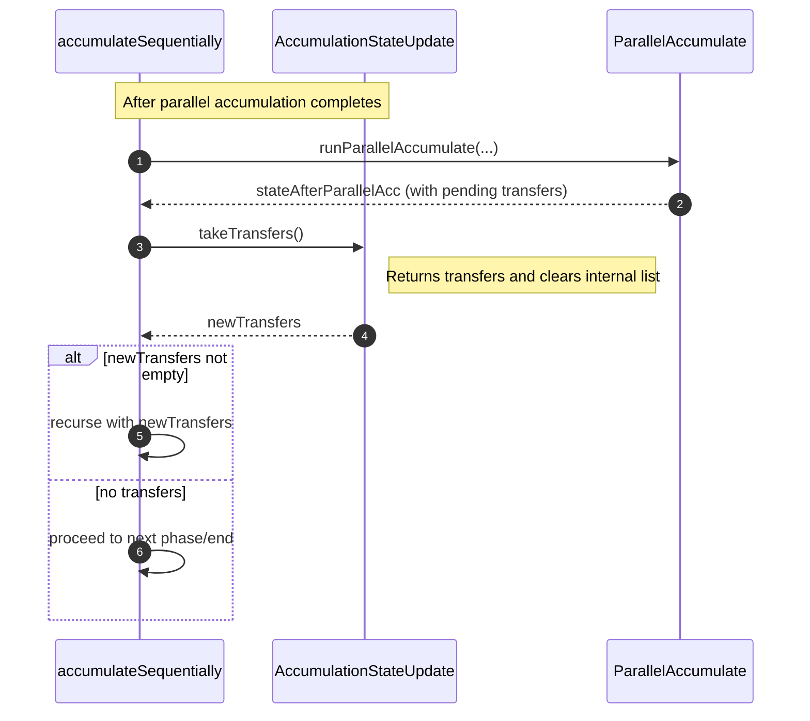

# Fix infinite loop in accumulate

## Pull Request by @mateuszsikora

I didn't remove processed transfers so it was an infinite loop 

## Comment by @coderabbitai[bot]

<!-- This is an auto-generated comment: summarize by coderabbit.ai -->
<!-- This is an auto-generated comment: skip review by coderabbit.ai -->

> [!IMPORTANT]
> ## Review skipped
> 
> Auto incremental reviews are disabled on this repository.
> 
> Please check the settings in the CodeRabbit UI or the `.coderabbit.yaml` file in this repository. To trigger a single review, invoke the `@coderabbitai review` command.
> 
> You can disable this status message by setting the `reviews.review_status` to `false` in the CodeRabbit configuration file.

<!-- end of auto-generated comment: skip review by coderabbit.ai -->

<!-- walkthrough_start -->

📝 Walkthrough

<!-- This is an auto-generated comment: release notes by coderabbit.ai -->

## Summary by CodeRabbit

- Refactor
  - Streamlined transfer handling during accumulation to ensure cleaner state progression and reduce potential carry-over between steps.

- Tests
  - Removed version-dependent test exclusions, providing consistent and predictable test coverage across environments.

- Developer API
  - Added a method to retrieve and clear pending transfers in one step, enabling more controlled processing flows.

<!-- end of auto-generated comment: release notes by coderabbit.ai -->
## Walkthrough
Removes GpVersion-based conditional in the test runner. Alters AccumulationStateUpdate to make transfers mutable and adds takeTransfers() to return-and-clear transfers. Updates accumulateSequentially to consume transfers via takeTransfers(), modifying how transfers propagate between sequential steps.

## Changes
| Cohort / File(s) | Summary |
| --- | --- |
| **Test runner gating removal** `bin/test-runner/w3f.ts` | Removed import of Compatibility and GpVersion; eliminated version-based conditional that previously altered ignored vectors. |
| **Accumulation state mutation + API** `packages/jam/jam-host-calls/externalities/state-update.ts` | transfers field changed from readonly to mutable; added takeTransfers() to return current transfers and clear the list. |
| **Accumulate flow consumption change** `packages/jam/transition/accumulate/accumulate.ts` | accumulateSequentially now calls stateAfterParallelAcc.takeTransfers() instead of reading .transfers directly. |

## Sequence Diagram(s)

## Estimated code review effort
🎯 3 (Moderate) | ⏱️ ~20 minutes

## Possibly related PRs
- FluffyLabs/typeberry#548 — Also changes AccumulationStateUpdate and transfer handling semantics, closely tied to takeTransfers() introduction.
- FluffyLabs/typeberry#520 — Refactors externalities/state update flow; directly related to how AccumulationStateUpdate is consumed in accumulate.ts.
- FluffyLabs/typeberry#601 — Touches accumulate.ts; overlaps in the same function area affecting control flow.

## Suggested reviewers
- tomusdrw
- skoszuta
- DrEverr

## Poem
> I twitch my whiskers at the queue,  
> Transfers hop, then vanish—cleared anew.  
> No version gates to fence my run,  
> I nibble state, one hop, then done.  
> takeTransfers, leap! the path is clean—  
> A tidy warren in the machine. 🐇✨

<!-- walkthrough_end -->

<!-- pre_merge_checks_walkthrough_start -->

## Pre-merge checks and finishing touches

✅ Passed checks (3 passed)

|     Check name     | Status   | Explanation                                                                                                                                                                                                                                                               |
| :----------------: | :------- | :------------------------------------------------------------------------------------------------------------------------------------------------------------------------------------------------------------------------------------------------------------------------ |
|     Title Check    | ✅ Passed | The pull request title clearly and concisely summarizes the primary change of resolving an infinite loop in the accumulate function by removing processed transfers, which aligns with the modifications in both the accumulate logic and its supporting state mutations. |
|  Description Check | ✅ Passed | The pull request description directly describes the underlying issue of not removing processed transfers leading to an infinite loop, which accurately reflects the implemented fix in the changeset.                                                                     |
| Docstring Coverage | ✅ Passed | No functions found in the changes. Docstring coverage check skipped.                                                                                                                                                                                                      |

<!-- pre_merge_checks_walkthrough_end -->

<!-- tips_start -->

---

Comment `@coderabbitai help` to get the list of available commands and usage tips.

<!-- tips_end -->

<!-- internal state start -->

<!-- DwQgtGAEAqAWCWBnSTIEMB26CuAXA9mAOYCmGJATmriQCaQDG+Ats2bgFyQAOFk+AIwBWJBrngA3EsgEBPRvlqU0AgfFwA6NPEgQAfACgjoCEYDEZyAAUASpETZWaCrKPR1AGxJcAYvAAeKBgAZvAY6iSQHvj43EHoDAyO2B7UkQAUtpBmAOwADABsAJSQkAYAqjYAMlywuLjciBwA9M1E6rDYAhpMzM0+HtjBwbJVKojNuLLcJAKULs3cKR7N+QWlBgCCeLD4FFzMadiIAF6I8ADWe2gbAMr42BQMkQJUGAywB4hgof5gYaFwjQwNFYv8MGA0IlkqkaJBAEmEMGcpFwkFemA+B20WDKt1w1GOXFiZA2AGEKCQ0vRqFwAEx5WkAVjAAEY8mA8gBOaAsgocRkAFg4eQFAC0NjYSBJ4CQAO6UJqQAjMY60CiygA09iupzwaC1ABEKABRKQUPhlMZzDyK9IYfDkKJIGi0IpGA3SBgUeDccQO+yOQ4uLhwSIfTCkdC0NXSRDSdBYAFhCJRGJxMJK2CRKFJFWwyLBbDvP1YBhoY50NHye2oinMfDSjBEHgUfDPRBx+i4N6IYIKjQwLPWOy/eO4IdIBwveRkBzepsttuxyvdzC9hXoCmQOsNyuIfCZyKguJlrA0CjMMJpDRGfTGcBQMj0fDBHAEYhkZQuhSsdhcXj8MIojiFIMjyEwShUKo6haDod4mFAcCoKgmBvoQpDkFQ369GwGCcNuaCygGTguFWCiQSoaiaNouhgIY96mAYagYJM0i4GAFBFphzSygAzMEGi4E0BgAERiQYFiQJsACSH6YVSxFBvIL6MLAEbSLekCSvWUhdhOzDcHsqIqaSLDcNQ8BqB46jyJg9AAOLcAAagq8D+sErbMJAAACUwzHM5qyM0eDwDaN5QNpu56WGDq0OobkYGgHhotEDAXJm1AKBgcUlklHi2dGyC4LKB40IgqJSGIewyGgnb8FgpkGRZVk2RoSD2RSaQUAA8iaACO2BJekjkuRQ5wOhoTl5AA+jk00skUADch5KiVkCVQQY2bpE9pEUlspoLIyAsOo34eSwK3wEQ9oUvQ1nlVqJDWZeiXiAu46RGa40QgItWVrQsiJZeDBoiQanSnsN5GBJlibB454WQ6RWlUOSgMKkWEJcdr4kP4hkUN+ew8F01kg+w8UaQYAByDokEYAAGjNGMa5XwIc2GKJEFLSnKkAkMMRlcAAsnQ8COKJ4kGBAYBGOZaVoKQExCGgfTK8wYC7OVYBlh4NrNLj56JdZ4jSM05VpGA2DcLQ15CRwEsiTDUmyRhX57oGzjKa+4ZNpTiFDquGDrltoRPc+WCbNCeaIxgeJpOU1tpJAB3ID7pD0OdXk3J1tAOvlm5UPIBDoJAKr4gIXgF4dWo7o2zZs2XKihTZkBEINbw0NI4VSZA5BEWw46KEqaAXCQ0A9n2Y3pCUKdRkoXYHpHuYpDHcc0AnNs0FqsoIB824kLgjxBytSTmuwSoTxudmMF4zhFROeGUEbTrlVD5iw/DX5Y0qKORGjGMx2xnzPGRlKxEyWBXeAZM8IU0QJpKwrYZgE3kOca6BItxW03nQLg9MIGk33mgXOGB86B2DoqKwT4whEHHmuSeABtAAuvTBEkBcEkygRfWhCouAUOylQmhQd6FMPiOjWqyB6ZLxhKvfE69E40GYRmXBUILgK1NmrZoasNb4C1jrPWBsn5JVgWbGRJBLZyJIIJRA9MpaQBFoPak0ZsGsPxKPARZDp48MoU2NxQiFGllSB2Vhkjo4ljXiQDeaQ/GsLlioxWGiVbxPVprdiuiJj6IoEbIx5tgSYNtlY5mrN2aVgglzKUMoiL82CILWxotxZiUdlLRiMTVFKwSaQ+KDpmg5ikTQLpUcV40EsfbepTsZJyTdvQBwJEvaqXUnAgw0ksDdJCSQW4JABrkzyrILUH1yI7XwERQQ+IwjID7j4jc0objZJIJsYI54rDODyk9JegkR5j0vlPEoJyaCEP4K+OKFIxD5xzlQ+wJjbn3MebrZ5iRBIfMQAOJCqc1K+2QLsIiuzyD+FrKIR45wpBBAkG2GO+9niSHjNfXgS4OxjnhVqNAwxgKgtzrKIO3ZKReSYHhVsyVgjRD2tlMFScqVEApB2BKycOgPFRElc8oLdlzlbEWOKC5ojtBBvgD66okAWOhqMz+mMkY/xWv/R5JYgG43xoTPgeCOHkxNvMqANNyAFPEEU+gJT948wqQLAmwtanMAdreOiDFHyCpUuWd8rssLFJYLhfCVAiJTKUmREpUEqKwVooYBCP5Ly4GmvAWgiBprc3KXQaa5sCZZtDZAFknIRRoBZCyYItIBScmCDkWgAAOTkBQ0CcloAKRkwQCgCFoCyLtaBGQFCZOOgQDA+0smrQYHNOF1AFqLSWspcpy1PmrTm3gJBppsAoKQaaHxRAXGLZW1Ed4DAAG8DClBEkgWwAAhVKo9aCNXjVYbRLoRJcGCElOMGon2QBEogXYKRaAfrbBcWwgHIDAZtCQMDz6kDdTNN6RxGAkModA+BkScVaA2CLAaNseJ5xEEQKSLMaUkPdmwGhojJGyMYHcLgLwdHL2Mc4ix59bHyOem9L6BKPGGNcCYwJiD1kMBfukh2ZjiAqNIbEuh2TtVcASYuJKBw8NEBIboeB0oj7SjmYgxetKVMVYkDU5xyuOmRIaYs5BmRxw+PMZc+ZkSlrUivQSvZocSxdb7w2eVJUngwy3woPna+XKGA6vzsm5w8AThjmC96FNadIgqTFfgDwdcExBEBCmY88RdnLIGQWIsYgJVyH3jpUFVL2x1VIZPRA29d6wHQNZa6yBZQdBWvWOKoQyzmviAITVPXKv9PzKmdVCZ6DqGQA4bgVrQXXNLnqc1GhnMmZ8/lwYJY1P7Ys8+kbdmuAiQOhkqhZ3zsiUBQ6UIbcKT4ZAzJ1zewrpXg8DpmzbA1PiC43Zg7ABfbzZnHtWYuIDq7EGPSIC9D6EskAnPeefdkjzUn+OY4g35zAMcguRBC8lCk4XURKGR6JtHALgL52pyjuY99IjKsoPlUFk5mN/N7pqxrDZmutlayueFURKQqubMXVCSYgRHjTF1qBPXukxuBfzLwYhWcoAMl4eNlZfgVaHDluMmgHuuaOyFB0p38ciUu2p274Qmxm8O6IF7V1HgI4I19nzP32hGwB7ZtTTPaeBYh1Dg7z7Yfw7UxRhg5VqPo93FQUgzusfucM7jrzEeCd4388T67NNkO1Ym1U5VhuwwosVgOWP8fQVMDNKo1Sl7tQ+hmLQPbNu7fXYd/dm3vu/sB6B9d3OcfuxUMMxD8DDCNMiQCbgWwSOUdiat9d3iXbeKFGHZyAUwQGB5C7cEAQwQRSFByIyHIwReKclpAwYdtJeICByPf4ILI995GGJyNAaAH+f+CNvhgAo6+lIjIDawQD2s+WmtgDmCOIkTILItAwQgBnInIDAh+h+OQJADIswABM6BQA66BBQjItAyBXaeQvIBQT+aAmBvafYtI3+tAAgXaAgO+jIogvEAoBQjs4ONah6x6lAZ6sOxae6+gQAA=== -->

<!-- internal state end -->

## Comment by @github-actions[bot]

View all

| File | Benchmark | Ops |  |
|------|-----------|-----|--|
| [codec/bigint.decode.ts[0]](../blob/8466aca502f07f2f3d711c206315f61831911259//_work/typeberry-runner-5/typeberry/typeberry/benchmarks/codec/bigint.decode.ts) | decode custom | 164832402.4 ±2.75% | fastest ✅ |
| [codec/bigint.decode.ts[1]](../blob/8466aca502f07f2f3d711c206315f61831911259//_work/typeberry-runner-5/typeberry/typeberry/benchmarks/codec/bigint.decode.ts) | decode bigint | 95936302.14 ±2.53% | 41.8% slower |
| [codec/encoding.ts[0]](../blob/8466aca502f07f2f3d711c206315f61831911259//_work/typeberry-runner-5/typeberry/typeberry/benchmarks/codec/encoding.ts) | manual encode | 3173040.6 ±0.46% | 19.58% slower |
| [codec/encoding.ts[1]](../blob/8466aca502f07f2f3d711c206315f61831911259//_work/typeberry-runner-5/typeberry/typeberry/benchmarks/codec/encoding.ts) | int32array encode | 3941322.77 ±0.64% | 0.11% slower |
| [codec/encoding.ts[2]](../blob/8466aca502f07f2f3d711c206315f61831911259//_work/typeberry-runner-5/typeberry/typeberry/benchmarks/codec/encoding.ts) | dataview encode | 3945577.76 ±0.42% | fastest ✅ |
| [codec/decoding.ts[0]](../blob/8466aca502f07f2f3d711c206315f61831911259//_work/typeberry-runner-5/typeberry/typeberry/benchmarks/codec/decoding.ts) | manual decode | 21405695.74 ±0.91% | 87.03% slower |
| [codec/decoding.ts[1]](../blob/8466aca502f07f2f3d711c206315f61831911259//_work/typeberry-runner-5/typeberry/typeberry/benchmarks/codec/decoding.ts) | int32array decode | 158950806.52 ±3.32% | 3.71% slower |
| [codec/decoding.ts[2]](../blob/8466aca502f07f2f3d711c206315f61831911259//_work/typeberry-runner-5/typeberry/typeberry/benchmarks/codec/decoding.ts) | dataview decode | 165076075.29 ±3.46% | fastest ✅ |
| [collections/map-set.ts[0]](../blob/8466aca502f07f2f3d711c206315f61831911259//_work/typeberry-runner-5/typeberry/typeberry/benchmarks/collections/map-set.ts) | 2 gets + conditional set | 119191.48 ±0.28% | fastest ✅ |
| [collections/map-set.ts[1]](../blob/8466aca502f07f2f3d711c206315f61831911259//_work/typeberry-runner-5/typeberry/typeberry/benchmarks/collections/map-set.ts) | 1 get 1 set | 59099.87 ±0.38% | 50.42% slower |
| [bytes/hex-from.ts[0]](../blob/8466aca502f07f2f3d711c206315f61831911259//_work/typeberry-runner-5/typeberry/typeberry/benchmarks/bytes/hex-from.ts) | parse hex using `Number` with NaN checking | 134008.91 ±0.42% | 84.79% slower |
| [bytes/hex-from.ts[1]](../blob/8466aca502f07f2f3d711c206315f61831911259//_work/typeberry-runner-5/typeberry/typeberry/benchmarks/bytes/hex-from.ts) | parse hex from char codes | 881306.89 ±0.38% | fastest ✅ |
| [bytes/hex-from.ts[2]](../blob/8466aca502f07f2f3d711c206315f61831911259//_work/typeberry-runner-5/typeberry/typeberry/benchmarks/bytes/hex-from.ts) | parse hex from string nibbles | 545729.41 ±0.41% | 38.08% slower |
| [bytes/hex-to.ts[0]](../blob/8466aca502f07f2f3d711c206315f61831911259//_work/typeberry-runner-5/typeberry/typeberry/benchmarks/bytes/hex-to.ts) | number toString + padding | 318542.95 ±0.84% | fastest ✅ |
| [bytes/hex-to.ts[1]](../blob/8466aca502f07f2f3d711c206315f61831911259//_work/typeberry-runner-5/typeberry/typeberry/benchmarks/bytes/hex-to.ts) | manual | 16290.88 ±0.44% | 94.89% slower |
| [codec/bigint.compare.ts[0]](../blob/8466aca502f07f2f3d711c206315f61831911259//_work/typeberry-runner-5/typeberry/typeberry/benchmarks/codec/bigint.compare.ts) | compare custom | 257880533.41 ±6% | 2.49% slower |
| [codec/bigint.compare.ts[1]](../blob/8466aca502f07f2f3d711c206315f61831911259//_work/typeberry-runner-5/typeberry/typeberry/benchmarks/codec/bigint.compare.ts) | compare bigint | 264470695.12 ±5.37% | fastest ✅ |
| [math/add_one_overflow.ts[0]](../blob/8466aca502f07f2f3d711c206315f61831911259//_work/typeberry-runner-5/typeberry/typeberry/benchmarks/math/add_one_overflow.ts) | add and take modulus | 241701140.45 ±7.49% | 8.04% slower |
| [math/add_one_overflow.ts[1]](../blob/8466aca502f07f2f3d711c206315f61831911259//_work/typeberry-runner-5/typeberry/typeberry/benchmarks/math/add_one_overflow.ts) | condition before calculation | 262822387.96 ±5.57% | fastest ✅ |
| [math/count-bits-u32.ts[0]](../blob/8466aca502f07f2f3d711c206315f61831911259//_work/typeberry-runner-5/typeberry/typeberry/benchmarks/math/count-bits-u32.ts) | standard method | 80119734.57 ±1.78% | 67.4% slower |
| [math/count-bits-u32.ts[1]](../blob/8466aca502f07f2f3d711c206315f61831911259//_work/typeberry-runner-5/typeberry/typeberry/benchmarks/math/count-bits-u32.ts) | magic | 245734649.12 ±5.68% | fastest ✅ |
| [hash/index.ts[0]](../blob/8466aca502f07f2f3d711c206315f61831911259//_work/typeberry-runner-5/typeberry/typeberry/benchmarks/hash/index.ts) | hash with numeric representation | 188.93 ±0.4% | 26.78% slower |
| [hash/index.ts[1]](../blob/8466aca502f07f2f3d711c206315f61831911259//_work/typeberry-runner-5/typeberry/typeberry/benchmarks/hash/index.ts) | hash with string representation | 118.31 ±0.43% | 54.15% slower |
| [hash/index.ts[2]](../blob/8466aca502f07f2f3d711c206315f61831911259//_work/typeberry-runner-5/typeberry/typeberry/benchmarks/hash/index.ts) | hash with symbol representation | 182.33 ±0.41% | 29.34% slower |
| [hash/index.ts[3]](../blob/8466aca502f07f2f3d711c206315f61831911259//_work/typeberry-runner-5/typeberry/typeberry/benchmarks/hash/index.ts) | hash with uint8 representation | 161.09 ±0.45% | 37.57% slower |
| [hash/index.ts[4]](../blob/8466aca502f07f2f3d711c206315f61831911259//_work/typeberry-runner-5/typeberry/typeberry/benchmarks/hash/index.ts) | hash with packed representation | 258.03 ±0.43% | fastest ✅ |
| [hash/index.ts[5]](../blob/8466aca502f07f2f3d711c206315f61831911259//_work/typeberry-runner-5/typeberry/typeberry/benchmarks/hash/index.ts) | hash with bigint representation | 188.47 ±0.37% | 26.96% slower |
| [hash/index.ts[6]](../blob/8466aca502f07f2f3d711c206315f61831911259//_work/typeberry-runner-5/typeberry/typeberry/benchmarks/hash/index.ts) | hash with uint32 representation | 197.83 ±0.35% | 23.33% slower |
| [math/count-bits-u64.ts[0]](../blob/8466aca502f07f2f3d711c206315f61831911259//_work/typeberry-runner-5/typeberry/typeberry/benchmarks/math/count-bits-u64.ts) | standard method | 1470277.01 ±0.47% | 85.85% slower |
| [math/count-bits-u64.ts[1]](../blob/8466aca502f07f2f3d711c206315f61831911259//_work/typeberry-runner-5/typeberry/typeberry/benchmarks/math/count-bits-u64.ts) | magic | 10392648.06 ±0.49% | fastest ✅ |
| [math/mul_overflow.ts[0]](../blob/8466aca502f07f2f3d711c206315f61831911259//_work/typeberry-runner-5/typeberry/typeberry/benchmarks/math/mul_overflow.ts) | multiply and bring back to u32 | 242271167.1 ±6.83% | 5.53% slower |
| [math/mul_overflow.ts[1]](../blob/8466aca502f07f2f3d711c206315f61831911259//_work/typeberry-runner-5/typeberry/typeberry/benchmarks/math/mul_overflow.ts) | multiply and take modulus | 256459359.37 ±5.95% | fastest ✅ |
| [math/switch.ts[0]](../blob/8466aca502f07f2f3d711c206315f61831911259//_work/typeberry-runner-5/typeberry/typeberry/benchmarks/math/switch.ts) | switch | 244548783.54 ±5.87% | fastest ✅ |
| [math/switch.ts[1]](../blob/8466aca502f07f2f3d711c206315f61831911259//_work/typeberry-runner-5/typeberry/typeberry/benchmarks/math/switch.ts) | if | 236133266.85 ±6.3% | 3.44% slower |
| [logger/index.ts[0]](../blob/8466aca502f07f2f3d711c206315f61831911259//_work/typeberry-runner-5/typeberry/typeberry/benchmarks/logger/index.ts) | console.log with string concat | 6913102.24 ±43.37% | fastest ✅ |
| [logger/index.ts[1]](../blob/8466aca502f07f2f3d711c206315f61831911259//_work/typeberry-runner-5/typeberry/typeberry/benchmarks/logger/index.ts) | console.log with args | 1592459.59 ±79.79% | 76.96% slower |
| [codec/view_vs_collection.ts[0]](../blob/8466aca502f07f2f3d711c206315f61831911259//_work/typeberry-runner-5/typeberry/typeberry/benchmarks/codec/view_vs_collection.ts) | Get first element from Decoded | 20282.79 ±1.26% | 53.39% slower |
| [codec/view_vs_collection.ts[1]](../blob/8466aca502f07f2f3d711c206315f61831911259//_work/typeberry-runner-5/typeberry/typeberry/benchmarks/codec/view_vs_collection.ts) | Get first element from View | 43512.78 ±1.16% | fastest ✅ |
| [codec/view_vs_collection.ts[2]](../blob/8466aca502f07f2f3d711c206315f61831911259//_work/typeberry-runner-5/typeberry/typeberry/benchmarks/codec/view_vs_collection.ts) | Get 50th element from Decoded | 19964.32 ±1.75% | 54.12% slower |
| [codec/view_vs_collection.ts[3]](../blob/8466aca502f07f2f3d711c206315f61831911259//_work/typeberry-runner-5/typeberry/typeberry/benchmarks/codec/view_vs_collection.ts) | Get 50th element from View | 21406.43 ±1.55% | 50.8% slower |
| [codec/view_vs_collection.ts[4]](../blob/8466aca502f07f2f3d711c206315f61831911259//_work/typeberry-runner-5/typeberry/typeberry/benchmarks/codec/view_vs_collection.ts) | Get last element from Decoded | 19859.26 ±1.62% | 54.36% slower |
| [codec/view_vs_collection.ts[5]](../blob/8466aca502f07f2f3d711c206315f61831911259//_work/typeberry-runner-5/typeberry/typeberry/benchmarks/codec/view_vs_collection.ts) | Get last element from View | 14555.43 ±1.65% | 66.55% slower |
| [codec/view_vs_object.ts[0]](../blob/8466aca502f07f2f3d711c206315f61831911259//_work/typeberry-runner-5/typeberry/typeberry/benchmarks/codec/view_vs_object.ts) | Get the first field from Decoded | 258264.84 ±59.17% | 30.33% slower |
| [codec/view_vs_object.ts[1]](../blob/8466aca502f07f2f3d711c206315f61831911259//_work/typeberry-runner-5/typeberry/typeberry/benchmarks/codec/view_vs_object.ts) | Get the first field from View | 7637.04 ±59.39% | 97.94% slower |
| [codec/view_vs_object.ts[2]](../blob/8466aca502f07f2f3d711c206315f61831911259//_work/typeberry-runner-5/typeberry/typeberry/benchmarks/codec/view_vs_object.ts) | Get the first field as view from View | 69178.78 ±1.39% | 81.34% slower |
| [codec/view_vs_object.ts[3]](../blob/8466aca502f07f2f3d711c206315f61831911259//_work/typeberry-runner-5/typeberry/typeberry/benchmarks/codec/view_vs_object.ts) | Get two fields from Decoded | 342621.63 ±1.55% | 7.57% slower |
| [codec/view_vs_object.ts[4]](../blob/8466aca502f07f2f3d711c206315f61831911259//_work/typeberry-runner-5/typeberry/typeberry/benchmarks/codec/view_vs_object.ts) | Get two fields from View | 57812.07 ±1.35% | 84.4% slower |
| [codec/view_vs_object.ts[5]](../blob/8466aca502f07f2f3d711c206315f61831911259//_work/typeberry-runner-5/typeberry/typeberry/benchmarks/codec/view_vs_object.ts) | Get two fields from materialized from View | 119263.34 ±1.97% | 67.83% slower |
| [codec/view_vs_object.ts[6]](../blob/8466aca502f07f2f3d711c206315f61831911259//_work/typeberry-runner-5/typeberry/typeberry/benchmarks/codec/view_vs_object.ts) | Get two fields as views from View | 63287.06 ±1.29% | 82.93% slower |
| [codec/view_vs_object.ts[7]](../blob/8466aca502f07f2f3d711c206315f61831911259//_work/typeberry-runner-5/typeberry/typeberry/benchmarks/codec/view_vs_object.ts) | Get only third field from Decoded | 370686.41 ±1.74% | fastest ✅ |
| [codec/view_vs_object.ts[8]](../blob/8466aca502f07f2f3d711c206315f61831911259//_work/typeberry-runner-5/typeberry/typeberry/benchmarks/codec/view_vs_object.ts) | Get only third field from View | 82037.6 ±1.19% | 77.87% slower |
| [codec/view_vs_object.ts[9]](../blob/8466aca502f07f2f3d711c206315f61831911259//_work/typeberry-runner-5/typeberry/typeberry/benchmarks/codec/view_vs_object.ts) | Get only third field as view from View | 79677.64 ±1.15% | 78.51% slower |
| [bytes/compare.ts[0]](../blob/8466aca502f07f2f3d711c206315f61831911259//_work/typeberry-runner-5/typeberry/typeberry/benchmarks/bytes/compare.ts) | Comparing Uint32 bytes | 16362.47 ±2.55% | 18.94% slower |
| [bytes/compare.ts[1]](../blob/8466aca502f07f2f3d711c206315f61831911259//_work/typeberry-runner-5/typeberry/typeberry/benchmarks/bytes/compare.ts) | Comparing raw bytes | 20184.84 ±3.01% | fastest ✅ |
| [collections/map_vs_sorted.ts[0]](../blob/8466aca502f07f2f3d711c206315f61831911259//_work/typeberry-runner-5/typeberry/typeberry/benchmarks/collections/map_vs_sorted.ts) | Map | 285459.24 ±0.39% | fastest ✅ |
| [collections/map_vs_sorted.ts[1]](../blob/8466aca502f07f2f3d711c206315f61831911259//_work/typeberry-runner-5/typeberry/typeberry/benchmarks/collections/map_vs_sorted.ts) | Map-array | 99654.27 ±0.37% | 65.09% slower |
| [collections/map_vs_sorted.ts[2]](../blob/8466aca502f07f2f3d711c206315f61831911259//_work/typeberry-runner-5/typeberry/typeberry/benchmarks/collections/map_vs_sorted.ts) | Array | 49756.48 ±11.84% | 82.57% slower |
| [collections/map_vs_sorted.ts[3]](../blob/8466aca502f07f2f3d711c206315f61831911259//_work/typeberry-runner-5/typeberry/typeberry/benchmarks/collections/map_vs_sorted.ts) | SortedArray | 195816.77 ±0.29% | 31.4% slower |
| [hash/blake2b.ts[0]](../blob/8466aca502f07f2f3d711c206315f61831911259//_work/typeberry-runner-5/typeberry/typeberry/benchmarks/hash/blake2b.ts) | our hasher | 2.09 ±10.07% | fastest ✅ |
| [hash/blake2b.ts[1]](../blob/8466aca502f07f2f3d711c206315f61831911259//_work/typeberry-runner-5/typeberry/typeberry/benchmarks/hash/blake2b.ts) | blake2b js | 0.05 ±1.04% | 97.61% slower |
| [crypto/ed25519.ts[0]](../blob/8466aca502f07f2f3d711c206315f61831911259//_work/typeberry-runner-5/typeberry/typeberry/benchmarks/crypto/ed25519.ts) | native crypto | 5.71 ±16.86% | 81.41% slower |
| [crypto/ed25519.ts[1]](../blob/8466aca502f07f2f3d711c206315f61831911259//_work/typeberry-runner-5/typeberry/typeberry/benchmarks/crypto/ed25519.ts) | wasm lib | 10.88 ±0.03% | 64.57% slower |
| [crypto/ed25519.ts[2]](../blob/8466aca502f07f2f3d711c206315f61831911259//_work/typeberry-runner-5/typeberry/typeberry/benchmarks/crypto/ed25519.ts) | wasm lib batch | 30.71 ±0.49% | fastest ✅ |

### Benchmarks summary: 63/63 OK ✅

<!-- thollander/actions-comment-pull-request "benchmarks" -->
