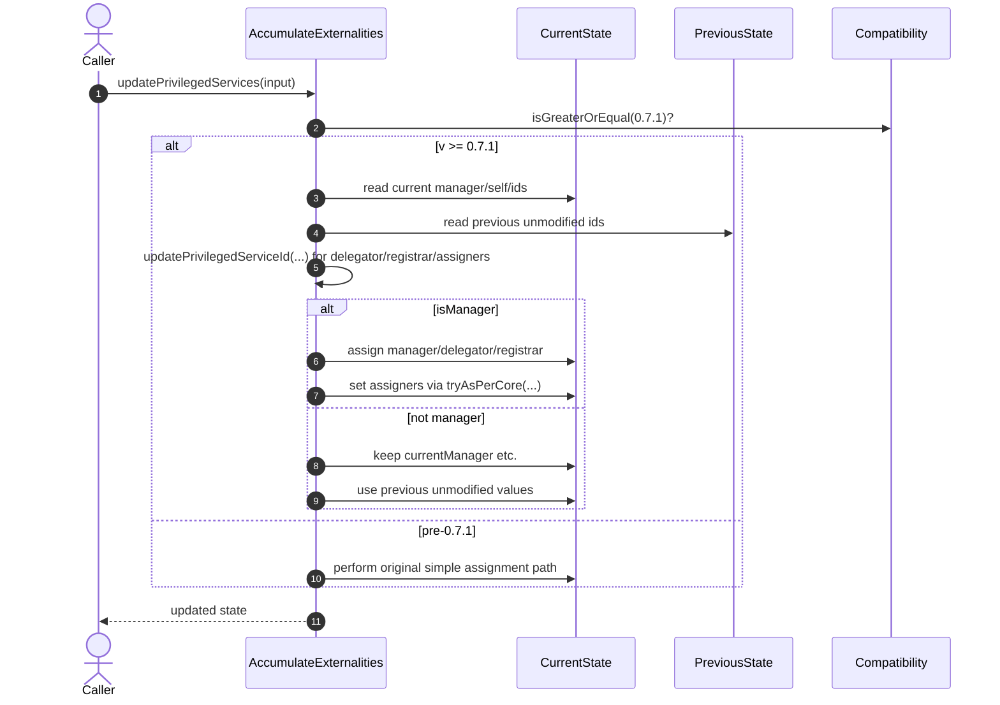

# Owned privileges

## Pull Request by @mateuszsikora

### Changes:
- `updatePrivilegedServices` cannot return `UpdatePrivilegesError.UnprivilegedService` anymore
- delegator, registrar and assigners can update themselves 
- manager has higher priority and can override privileged services 


## Comment by @coderabbitai[bot]

<!-- This is an auto-generated comment: summarize by coderabbit.ai -->
<!-- This is an auto-generated comment: skip review by coderabbit.ai -->

> [!IMPORTANT]
> ## Review skipped
> 
> Auto incremental reviews are disabled on this repository.
> 
> Please check the settings in the CodeRabbit UI or the `.coderabbit.yaml` file in this repository. To trigger a single review, invoke the `@coderabbitai review` command.
> 
> You can disable this status message by setting the `reviews.review_status` to `false` in the CodeRabbit configuration file.

<!-- end of auto-generated comment: skip review by coderabbit.ai -->

<!-- walkthrough_start -->

<details>
<summary>📝 Walkthrough</summary>

<!-- This is an auto-generated comment: release notes by coderabbit.ai -->

## Summary by CodeRabbit

- New Features
  - Version-aware handling (from 0.7.1+) for updating privileged roles, with smarter logic for manager, delegator, registrar, and assigners.
  - Per-core assigners are applied automatically on newer versions.
- Bug Fixes
  - Improved validation and updates of privileged roles, including cases with unprivileged current services or invalid IDs.
- Tests
  - Added version-gated test variants to verify behavior before and after 0.7.1 across privileged role and ID validation scenarios.

<!-- end of auto-generated comment: release notes by coderabbit.ai -->
## Walkthrough
Adds version-gated test cases around 0.7.1 and refactors privileged-services update logic in accumulate-externalities to branch on pre-0.7.1 vs 0.7.1+ behavior, introducing helper functions, per-core assigner adaptation, and conditional updates based on manager/self checks.

## Changes
| Cohort / File(s) | Summary |
| --- | --- |
| **Core logic: privileged services update**<br>`packages/jam/transition/externalities/accumulate-externalities.ts` | Refactors updatePrivilegedServices with version-gated paths (pre-0.7.1 vs 0.7.1+), adds updatePrivilegedServiceId helper, introduces isManager/isSelf guards, conditionally computes delegator/registrar/assigners, applies tryAsPerCore for assigners, and preserves previous state when not manager. |
| **Tests: version-gated execution**<br>`packages/jam/transition/externalities/accumulate-externalities.test.ts` | Replaces plain it with itPre071/itPost071 variants to gate tests around GpVersion.V0_7_1; adjusts tests for unprivileged service and invalid validator/registrar IDs to run in appropriate version contexts. |

## Sequence Diagram(s)


## Estimated code review effort
🎯 4 (Complex) | ⏱️ ~60 minutes

## Possibly related PRs
- FluffyLabs/typeberry#697 — Introduces similar renaming and version-gated privileged-service update logic, including registrar/serviceId handling.
- FluffyLabs/typeberry#548 — Adjusts privilegedServices/authQueues updates with tryAsPerCore and conditional assignment during accumulation.
- FluffyLabs/typeberry#660 — Adds corrective logic for manager-related updates across the 0.7.0 → 0.7.1 transition, aligning with version gating.

## Suggested reviewers
- tomusdrw
- skoszuta
- DrEverr

## Poem
> On versioned winds I hop and glide,  
> 0.7.1 marks the tide.  
> Manager checks and IDs align,  
> assigners per-core, neat by design.  
> Tests now split before/after light—  
> I thump my paw: the flow is right. 🐇✨

</details>

<!-- walkthrough_end -->

<!-- pre_merge_checks_walkthrough_start -->

## Pre-merge checks and finishing touches
<details>
<summary>✅ Passed checks (3 passed)</summary>

|     Check name     | Status   | Explanation                                                                                                                                                                                                                                                                                                                                                                                                                                                                                                                        |
| :----------------: | :------- | :--------------------------------------------------------------------------------------------------------------------------------------------------------------------------------------------------------------------------------------------------------------------------------------------------------------------------------------------------------------------------------------------------------------------------------------------------------------------------------------------------------------------------------- |
|     Title Check    | ✅ Passed | The title “Owned privileges” uses the correct domain term and is thematically related to the changeset’s focus on privilege updates, so it is partially accurate. However, it lacks specificity about the key changes such as enabling self-updates for delegator, registrar, and assigners or the manager’s override priority. This brevity makes the title overly broad for a teammate scanning history to grasp the primary modification. Despite this, it is not misleading or off-topic and thus passes as partially related. |
|  Description Check | ✅ Passed | The description enumerates the key behavior changes to updatePrivilegedServices, including the removal of the UnprivilegedService error, self-update capabilities for delegator, registrar, and assigners, and manager override priority. This aligns directly with the raw summary’s details on privilege assignment logic. The description accurately reflects the principal modifications in the changeset.                                                                                                                     |
| Docstring Coverage | ✅ Passed | No functions found in the changes. Docstring coverage check skipped.                                                                                                                                                                                                                                                                                                                                                                                                                                                               |

</details>

<!-- pre_merge_checks_walkthrough_end -->

<!-- tips_start -->

---


<sub>Comment `@coderabbitai help` to get the list of available commands and usage tips.</sub>

<!-- tips_end -->

<!-- internal state start -->


<!-- DwQgtGAEAqAWCWBnSTIEMB26CuAXA9mAOYCmGJATmriQCaQDG+Ats2bgFyQAOFk+AIwBWJBrngA3EsgEBPRvlqU0AgfFwA6NPEgQAfACgjoCEYDEZyAAUASpETZWaCrI5Ho6gDYkuAeQDu5PS8kvDepIjuCMjc2J6ekBQkAI7Y0riQABQYjgKUkADsAAwFAJSQAGYULJDYiPnM1CR1AF6I8ADW+FRZAlQYDLCQzIhg+IF0YCESYSQRkIBJhMPaGOW8+Nz49ciDmPMEPBSh4SRg2Ny0TZB5sGgz3RowsCSQSogMR9zi+FiIuE2INwGKAAA3OlxoViOMxOtAAypQZgxpCDGJhIBh8JBPD9SHwkrhsBQsCCAKoXJpQ45zaQAUQo1QoGlJGGms1I8MR8GRII0wMgABESOFqN0ADSJOZIXBUCgSzD0NCIdpEcgUZDOF5oeLjOiQA7gq64Z4jYVSRB8qAAQWWGDQeMS+G8kFuyAQRGefBC3XU8gVaKw+CkDPgSkO1I59i5yItURethQyA2ZAlHxITUVGQATEUswBWMAARiKRaK0ELAE4OAAWABsHDzAA4AFryjD0TzS5BJGYkfyUZAEZh1WgUfwSxBdRAtPBoNv0AUUWnBpmQUk2AAyXFguFw3EBAHoD0R1LBsAINExmAeAGKebAVCqyDcqRAH3CybgkPIM2QH2LxAexQFHywJgIYBgmFAZD0PgFQ4AQxBkMoND0FebAYJwhz8MIojiOa1zyEwShUKo6haDo+iQeAUBwKgqDomgeCEKQaoZgorDsFwVD+PYjiNC4hEKCRKhqJo2i6OBRjUaYBjcGgDAdPa0gHkIaDXjKmDtN8GAHiQAAeNDEtq6jwCpCkMI4cRNGABlGXanbiNIGg0H8LmAgYABE3kGBYkBWgAkkhbGoXxTiCXBjC3BgERGFAAWYdUtDYMi9DBu0PzEOxrkZBIzjwJguAyPISTcJ4CnwDF6D2JVRDOuotSIMpkD+Ke1XyfAfAANrqFCJAlIWEq9VsuADQAuvKOqtVVOWDliFDYFgTDtqZPzap48gCEqeo/JAADi3AAGoDvAPwaIdRQAPoFJdhaPAiwbavq6SDrcGS8CQ9x1BtjV6mVKwoBkmK8XULy9UkA38HwxovOQvFXmoQSVN0zD6liBmiHgLw/D9eQVN02N8GgFRGfqzyQEUGggYWZNJIgsBOrQ91fgw8AVNy62yBKs3oMqlDiFVNx3KdfD+M8WAw4wRJJJhUYUEiYPIItbKwug7YteLZMvHlnYQt0B5JCefyypAAUChqSQoBgOuhugluGqFBwLVgi0kVrhynJD3Q8CNYCQ3lRyFRaTyoLsMXSAoiVOpUOK8XIVsyooKW1a82BPRjlk6Tw1CwMg+N8Fe8niGojmyGASTlaFfSYIMEetca+B4OgnhGSnruUBtKc4ieDDXCQsg/PQOWQEQ1C1aB0l+VaLcoadGBze7SgMOVVA6Um8EGZsFChd7sQCJ2vfsKZ0hxRiPwkEYtJ/PAjShcRLw9mZvEkI+3RYQAsnQ8COF5PlgWARh5KKWUm+NSGl+jaTnnpQylAHLHzfBZKyldTh2VgSZJyFoipuG8p5XylhArBRQnqBw4V5CRTDrFfkCVE7JRjNVOG4Y8o0BdMKL8fAHYkCpDCGknJ5bchIAFIeWIlBGWYJVF4YtuRDBVjwuWCsUD0Hpo3Tw9A8i1ApFXbasEsCNDtA6I4Hoipq3oGLEgMNobk0sgydgcj+GJndv8CgpAMjqHqJ4ColpIA2D7N0DoSsNGcOhOyOgCI+F0INPUaqzACYj36NZPgdkqBiDnvweCViZbvSCarP4VxMi6OUnKV4wo5iikKYbaUsp5TKngKqAc5R/Qw06rUDA0TaBszMmhRumFKDyW3nnaoqNJYfS+sgHJNBHhWloLQDU1x+iDGRl6JIfsqYaBphIZAlNqYAGo+63HuEyfkkzpmJnfpgApxjEwIncSPNOFBjkHELljDEfYhQigIIUuG3ijaaUKf6OGVpqm1PVJAGYaB1EQkCRGEJ0YBFM35N4/6dC2lJDEIw4Jij/jMKVCqFpNj65DGWm0nST1u7cjcJAXQps0nSxsfUMJit3b5LxKmFgsRmEMJ1mkDU6tsU1J0Wc5lRS3niklN8ypFzeVApkFo/gLsAmdOYGysePxEAAG5+DmNapEjoJASDcEgAZaUKd0nsFOXo/I/oK7sXZsKY5/pQbu0Wq09pepOUR3zhqz0sYKXWm4GVMyg4XAAqsJQAAwjE0xvwzECyILzHFA4Fkgs2asrZfIfVrgCRqZiVoGCWWHMg0JCslYDGipGAyyIvho2bnylqbUGHGxSoSJInijkzOiZbQu3h9KRyJXPJ6RchgeoAOqa3DYqseJdfQaCQHtJITQKC+CXKkbUmQDrHXVHPc6V0bqFnKAcG2EKLkcLRdkmFiAJT4teEagYGRq4lvdbvJI/4RogpOrtIW+zPEAGldX7l2cLb2HrGb5HSnPYqlR1opy2opKtksfQngcjVRVzpJW4tlgOjWZAz4uIluTOGIG31YH6KQTxAVFVv25egKZq1EPPE8Gw/UQbEAhooOGy2VQaiS0qvZJ6YyXitLiC8A4aBLiVrYWAJgltUMDgngYfyM9V5gdg+TJeK9lXz1SQa/SW8d5enPAfA1mF4GnwAHLn0vtfW+ep76Sl7M/V+28uAAAkamwF/rgsCEEoKGdgvBJiiFWJEIVRhLCPEwoCU2kRRQygyLiUolJbz6F1CXVDIgS6j8+x0Eujk7ekkvM0UKBUWsaBqx5jK7WBgFQChZgKI2RsBRCwVCKNWashZCxNloBWAAzCQPMRQSAVgqPmLrtYaZURklAJLuAUvTPS59J+WWYJ5Ymx7S6bAnEkEurXRSaWcsZHGwAbzk5ATySBbAACEcSKToGOkLVgRp0E8lwCo2p6himO55JRcRaCXfwIpWwT2IOeDex9pAvgVyhiUBgQHL3gckHexSzybTaA2EWgKP7cIZS1UQKG54ilAcyjSAjk7yPUcYA8LgbwuPRAdAJwteHH3Sdo+kB8eAXw57U/x1wQnDPEedgwDq2gAVlRcsxxQQH3lieeXKn8TnHRvEOBbogQHXVjsUqOxSzXJ3tsdBM+pEgEuKfOjl55YnWvPuYrqHTonavNeeU3uVO0OlDfk3EJTl4gAcAgCEjGRERAC4BL9V6LxJMooyLQFgANREXNQDDW+HN4glWFNlLEksKHSDMYATAI85/bqLKk9NJwUAgnFiBqqBeniE5ugXNRImiPCc7qYMQ0MjlR2/YFm7TWYfnQAIRuGRJY6qIqWiODh5lKkMyofnsa3EVDOJmxNShhVlKlMbZw84418oTd7SWTLKBZ/4BDsM3ojgfkeHRGQj8u+NB1UH/UXhsbBlxtUETiawU0HUlZ+wDBMAYBTtEd58gDgiAqBEB9UhkjgIthhFAO91NHghQQD1AhNogm97FMQMgxFEBvARMU5vY4IZ8CBuBuQLljRc95I+YNQYhnAK8E9JRkEmZTdbdEc6YnQ8A54Jdw155Qx8hH52gZpXc78q0QDRA2Z5AyAJ8U5p9Z8IVs8+AF8Sl3kJRykV9fkeVAU1RuV6BuMkpk4qod8+AgxKAjgwwPUgD0xSZl58oT96CtdEdWkDcuBPJ/BnAf8YorDrDPIUUfh2YiAiQ7CgcQdrCTt4NKptQ5c9c2AJc3dvBcEtcABfM3SADXNwnXMI3wzyOA1ndnXaE3eIxHMZK3bnenHIk7B3M5Z3ewuAF4N4DIrOMgRwIhG/Aff9fZKKPYCOA0AJLhdFQtfhc9K2ZebANpXgh+EgaJHWTTSWFkX3aFelA1BkEVCQ49L/eSSdDBefYpUeeQ0VCpVfCVVQgcNfXQ/fAwzg8MH0E/EODUTsVUZAZFPCH6S9SWMLEhCLPfERbQYHPPKY9fVUELbEfAHuU/FTFnT4LORBVeYURPCobwMQG/EIAYNnJ6Z1dmL/NeK2d2NPeoTQVw83Jg+8Mok7bEu3WwiXRw4kWqQkxg0QTwmpHwmHV7XnNwoIhyUI/XCXKokE1g23OI23RI83ZI1k+w9HBgY2FOcNR6UgCkk7PI5XAom3AI+3bTR3dTCXMzSoRaZJFVZGV2NE1PIfYOIUkUqqJgcU4PPHDoewDoNnL8OgoozyYk+w0k5wogSUzyJkkIs0lItkv7Q0ogZXLk47CaD7GXXAWwdIjkn4CXasRsasAoUrWgRsAQXNBgIoWsCsIoLrasLrRM2sWgWsEgQsBrb8BgFrPMGM2sLrOrIoCoJQAQPrUSLMBgPMWgLrAoLrPMCoCsFrasCoVw6XJUEMmwI3VIrMb8UQPMYrETCoQsBskgNsgQAoWsasrrCsJs2gfMRMhgLMasec2skgRsWsasBgAoAQLMHM9MR8EgU8rrFQU8srWgasXBGI4wArD6NbSgUgLbM0tLJbfQIAA= -->

<!-- internal state end -->


## Comment by @github-actions[bot]


<details>
<summary>View all</summary>

| File | Benchmark | Ops |  |
|------|-----------|-----|--|
| [bytes/hex-from.ts[0]](../blob/1bbacb6707618164865160536ad678fcff437c3c//_work/typeberry-runner-2/typeberry/typeberry/benchmarks/bytes/hex-from.ts) | parse hex using `Number` with NaN checking | 119181.18 ±2% | 85.33% slower |
| [bytes/hex-from.ts[1]](../blob/1bbacb6707618164865160536ad678fcff437c3c//_work/typeberry-runner-2/typeberry/typeberry/benchmarks/bytes/hex-from.ts) | parse hex from char codes | 812332.53 ±1% | fastest ✅ |
| [bytes/hex-from.ts[2]](../blob/1bbacb6707618164865160536ad678fcff437c3c//_work/typeberry-runner-2/typeberry/typeberry/benchmarks/bytes/hex-from.ts) | parse hex from string nibbles | 487201.46 ±1.52% | 40.02% slower |
| [math/count-bits-u64.ts[0]](../blob/1bbacb6707618164865160536ad678fcff437c3c//_work/typeberry-runner-2/typeberry/typeberry/benchmarks/math/count-bits-u64.ts) | standard method | 1156416.07 ±1.42% | 89.57% slower |
| [math/count-bits-u64.ts[1]](../blob/1bbacb6707618164865160536ad678fcff437c3c//_work/typeberry-runner-2/typeberry/typeberry/benchmarks/math/count-bits-u64.ts) | magic | 11090889.42 ±0.46% | fastest ✅ |
| [math/add_one_overflow.ts[0]](../blob/1bbacb6707618164865160536ad678fcff437c3c//_work/typeberry-runner-2/typeberry/typeberry/benchmarks/math/add_one_overflow.ts) | add and take modulus | 243429580.98 ±5.93% | fastest ✅ |
| [math/add_one_overflow.ts[1]](../blob/1bbacb6707618164865160536ad678fcff437c3c//_work/typeberry-runner-2/typeberry/typeberry/benchmarks/math/add_one_overflow.ts) | condition before calculation | 236087728.14 ±7.06% | 3.02% slower |
| [math/count-bits-u32.ts[0]](../blob/1bbacb6707618164865160536ad678fcff437c3c//_work/typeberry-runner-2/typeberry/typeberry/benchmarks/math/count-bits-u32.ts) | standard method | 75537639.4 ±1.6% | 69.34% slower |
| [math/count-bits-u32.ts[1]](../blob/1bbacb6707618164865160536ad678fcff437c3c//_work/typeberry-runner-2/typeberry/typeberry/benchmarks/math/count-bits-u32.ts) | magic | 246385813.78 ±6.54% | fastest ✅ |
| [math/mul_overflow.ts[0]](../blob/1bbacb6707618164865160536ad678fcff437c3c//_work/typeberry-runner-2/typeberry/typeberry/benchmarks/math/mul_overflow.ts) | multiply and bring back to u32 | 249441814.66 ±6.33% | 0.83% slower |
| [math/mul_overflow.ts[1]](../blob/1bbacb6707618164865160536ad678fcff437c3c//_work/typeberry-runner-2/typeberry/typeberry/benchmarks/math/mul_overflow.ts) | multiply and take modulus | 251534421.15 ±6.02% | fastest ✅ |
| [hash/index.ts[0]](../blob/1bbacb6707618164865160536ad678fcff437c3c//_work/typeberry-runner-2/typeberry/typeberry/benchmarks/hash/index.ts) | hash with numeric representation | 189.63 ±0.69% | 25% slower |
| [hash/index.ts[1]](../blob/1bbacb6707618164865160536ad678fcff437c3c//_work/typeberry-runner-2/typeberry/typeberry/benchmarks/hash/index.ts) | hash with string representation | 114.32 ±0.45% | 54.78% slower |
| [hash/index.ts[2]](../blob/1bbacb6707618164865160536ad678fcff437c3c//_work/typeberry-runner-2/typeberry/typeberry/benchmarks/hash/index.ts) | hash with symbol representation | 177 ±0.55% | 29.99% slower |
| [hash/index.ts[3]](../blob/1bbacb6707618164865160536ad678fcff437c3c//_work/typeberry-runner-2/typeberry/typeberry/benchmarks/hash/index.ts) | hash with uint8 representation | 154.33 ±0.43% | 38.96% slower |
| [hash/index.ts[4]](../blob/1bbacb6707618164865160536ad678fcff437c3c//_work/typeberry-runner-2/typeberry/typeberry/benchmarks/hash/index.ts) | hash with packed representation | 252.83 ±0.27% | fastest ✅ |
| [hash/index.ts[5]](../blob/1bbacb6707618164865160536ad678fcff437c3c//_work/typeberry-runner-2/typeberry/typeberry/benchmarks/hash/index.ts) | hash with bigint representation | 175.94 ±0.3% | 30.41% slower |
| [hash/index.ts[6]](../blob/1bbacb6707618164865160536ad678fcff437c3c//_work/typeberry-runner-2/typeberry/typeberry/benchmarks/hash/index.ts) | hash with uint32 representation | 194.7 ±0.31% | 22.99% slower |
| [codec/bigint.compare.ts[0]](../blob/1bbacb6707618164865160536ad678fcff437c3c//_work/typeberry-runner-2/typeberry/typeberry/benchmarks/codec/bigint.compare.ts) | compare custom | 251369392.99 ±6.57% | 4.46% slower |
| [codec/bigint.compare.ts[1]](../blob/1bbacb6707618164865160536ad678fcff437c3c//_work/typeberry-runner-2/typeberry/typeberry/benchmarks/codec/bigint.compare.ts) | compare bigint | 263115755.18 ±5.23% | fastest ✅ |
| [codec/bigint.decode.ts[0]](../blob/1bbacb6707618164865160536ad678fcff437c3c//_work/typeberry-runner-2/typeberry/typeberry/benchmarks/codec/bigint.decode.ts) | decode custom | 201856960.16 ±5.27% | fastest ✅ |
| [codec/bigint.decode.ts[1]](../blob/1bbacb6707618164865160536ad678fcff437c3c//_work/typeberry-runner-2/typeberry/typeberry/benchmarks/codec/bigint.decode.ts) | decode bigint | 106251845.79 ±2.62% | 47.36% slower |
| [collections/map-set.ts[0]](../blob/1bbacb6707618164865160536ad678fcff437c3c//_work/typeberry-runner-2/typeberry/typeberry/benchmarks/collections/map-set.ts) | 2 gets + conditional set | 110218.58 ±0.16% | fastest ✅ |
| [collections/map-set.ts[1]](../blob/1bbacb6707618164865160536ad678fcff437c3c//_work/typeberry-runner-2/typeberry/typeberry/benchmarks/collections/map-set.ts) | 1 get 1 set | 61404.35 ±0.27% | 44.29% slower |
| [bytes/hex-to.ts[0]](../blob/1bbacb6707618164865160536ad678fcff437c3c//_work/typeberry-runner-2/typeberry/typeberry/benchmarks/bytes/hex-to.ts) | number toString + padding | 321245.79 ±0.12% | fastest ✅ |
| [bytes/hex-to.ts[1]](../blob/1bbacb6707618164865160536ad678fcff437c3c//_work/typeberry-runner-2/typeberry/typeberry/benchmarks/bytes/hex-to.ts) | manual | 16599.85 ±0.19% | 94.83% slower |
| [math/switch.ts[0]](../blob/1bbacb6707618164865160536ad678fcff437c3c//_work/typeberry-runner-2/typeberry/typeberry/benchmarks/math/switch.ts) | switch | 261789790.34 ±5.44% | fastest ✅ |
| [math/switch.ts[1]](../blob/1bbacb6707618164865160536ad678fcff437c3c//_work/typeberry-runner-2/typeberry/typeberry/benchmarks/math/switch.ts) | if | 252163043.85 ±5.75% | 3.68% slower |
| [logger/index.ts[0]](../blob/1bbacb6707618164865160536ad678fcff437c3c//_work/typeberry-runner-2/typeberry/typeberry/benchmarks/logger/index.ts) | console.log with string concat | 8541352.42 ±48.04% | fastest ✅ |
| [logger/index.ts[1]](../blob/1bbacb6707618164865160536ad678fcff437c3c//_work/typeberry-runner-2/typeberry/typeberry/benchmarks/logger/index.ts) | console.log with args | 1159469.08 ±88.4% | 86.43% slower |
| [codec/encoding.ts[0]](../blob/1bbacb6707618164865160536ad678fcff437c3c//_work/typeberry-runner-2/typeberry/typeberry/benchmarks/codec/encoding.ts) | manual encode | 2535434.98 ±4.68% | 22.03% slower |
| [codec/encoding.ts[1]](../blob/1bbacb6707618164865160536ad678fcff437c3c//_work/typeberry-runner-2/typeberry/typeberry/benchmarks/codec/encoding.ts) | int32array encode | 3251682.85 ±0.28% | fastest ✅ |
| [codec/encoding.ts[2]](../blob/1bbacb6707618164865160536ad678fcff437c3c//_work/typeberry-runner-2/typeberry/typeberry/benchmarks/codec/encoding.ts) | dataview encode | 3249680.98 ±0.28% | 0.06% slower |
| [codec/decoding.ts[0]](../blob/1bbacb6707618164865160536ad678fcff437c3c//_work/typeberry-runner-2/typeberry/typeberry/benchmarks/codec/decoding.ts) | manual decode | 17061274.82 ±0.45% | 91.62% slower |
| [codec/decoding.ts[1]](../blob/1bbacb6707618164865160536ad678fcff437c3c//_work/typeberry-runner-2/typeberry/typeberry/benchmarks/codec/decoding.ts) | int32array decode | 195886699.28 ±4.86% | 3.83% slower |
| [codec/decoding.ts[2]](../blob/1bbacb6707618164865160536ad678fcff437c3c//_work/typeberry-runner-2/typeberry/typeberry/benchmarks/codec/decoding.ts) | dataview decode | 203685017.49 ±4.06% | fastest ✅ |
| [codec/view_vs_collection.ts[0]](../blob/1bbacb6707618164865160536ad678fcff437c3c//_work/typeberry-runner-2/typeberry/typeberry/benchmarks/codec/view_vs_collection.ts) | Get first element from Decoded | 32397.74 ±0.18% | 52.28% slower |
| [codec/view_vs_collection.ts[1]](../blob/1bbacb6707618164865160536ad678fcff437c3c//_work/typeberry-runner-2/typeberry/typeberry/benchmarks/codec/view_vs_collection.ts) | Get first element from View | 67892.94 ±0.16% | fastest ✅ |
| [codec/view_vs_collection.ts[2]](../blob/1bbacb6707618164865160536ad678fcff437c3c//_work/typeberry-runner-2/typeberry/typeberry/benchmarks/codec/view_vs_collection.ts) | Get 50th element from Decoded | 32121.68 ±0.29% | 52.69% slower |
| [codec/view_vs_collection.ts[3]](../blob/1bbacb6707618164865160536ad678fcff437c3c//_work/typeberry-runner-2/typeberry/typeberry/benchmarks/codec/view_vs_collection.ts) | Get 50th element from View | 35792.59 ±0.22% | 47.28% slower |
| [codec/view_vs_collection.ts[4]](../blob/1bbacb6707618164865160536ad678fcff437c3c//_work/typeberry-runner-2/typeberry/typeberry/benchmarks/codec/view_vs_collection.ts) | Get last element from Decoded | 32203 ±0.28% | 52.57% slower |
| [codec/view_vs_collection.ts[5]](../blob/1bbacb6707618164865160536ad678fcff437c3c//_work/typeberry-runner-2/typeberry/typeberry/benchmarks/codec/view_vs_collection.ts) | Get last element from View | 24394.38 ±0.3% | 64.07% slower |
| [codec/view_vs_object.ts[0]](../blob/1bbacb6707618164865160536ad678fcff437c3c//_work/typeberry-runner-2/typeberry/typeberry/benchmarks/codec/view_vs_object.ts) | Get the first field from Decoded | 514901.19 ±0.25% | 0.11% slower |
| [codec/view_vs_object.ts[1]](../blob/1bbacb6707618164865160536ad678fcff437c3c//_work/typeberry-runner-2/typeberry/typeberry/benchmarks/codec/view_vs_object.ts) | Get the first field from View | 102362.62 ±0.13% | 80.14% slower |
| [codec/view_vs_object.ts[2]](../blob/1bbacb6707618164865160536ad678fcff437c3c//_work/typeberry-runner-2/typeberry/typeberry/benchmarks/codec/view_vs_object.ts) | Get the first field as view from View | 101911.75 ±0.16% | 80.23% slower |
| [codec/view_vs_object.ts[3]](../blob/1bbacb6707618164865160536ad678fcff437c3c//_work/typeberry-runner-2/typeberry/typeberry/benchmarks/codec/view_vs_object.ts) | Get two fields from Decoded | 513180 ±0.27% | 0.44% slower |
| [codec/view_vs_object.ts[4]](../blob/1bbacb6707618164865160536ad678fcff437c3c//_work/typeberry-runner-2/typeberry/typeberry/benchmarks/codec/view_vs_object.ts) | Get two fields from View | 80376.14 ±0.13% | 84.41% slower |
| [codec/view_vs_object.ts[5]](../blob/1bbacb6707618164865160536ad678fcff437c3c//_work/typeberry-runner-2/typeberry/typeberry/benchmarks/codec/view_vs_object.ts) | Get two fields from materialized from View | 170741.82 ±0.21% | 66.87% slower |
| [codec/view_vs_object.ts[6]](../blob/1bbacb6707618164865160536ad678fcff437c3c//_work/typeberry-runner-2/typeberry/typeberry/benchmarks/codec/view_vs_object.ts) | Get two fields as views from View | 80654.38 ±0.11% | 84.35% slower |
| [codec/view_vs_object.ts[7]](../blob/1bbacb6707618164865160536ad678fcff437c3c//_work/typeberry-runner-2/typeberry/typeberry/benchmarks/codec/view_vs_object.ts) | Get only third field from Decoded | 515443.42 ±0.32% | fastest ✅ |
| [codec/view_vs_object.ts[8]](../blob/1bbacb6707618164865160536ad678fcff437c3c//_work/typeberry-runner-2/typeberry/typeberry/benchmarks/codec/view_vs_object.ts) | Get only third field from View | 100518.52 ±0.19% | 80.5% slower |
| [codec/view_vs_object.ts[9]](../blob/1bbacb6707618164865160536ad678fcff437c3c//_work/typeberry-runner-2/typeberry/typeberry/benchmarks/codec/view_vs_object.ts) | Get only third field as view from View | 100600.77 ±0.21% | 80.48% slower |
| [collections/map_vs_sorted.ts[0]](../blob/1bbacb6707618164865160536ad678fcff437c3c//_work/typeberry-runner-2/typeberry/typeberry/benchmarks/collections/map_vs_sorted.ts) | Map | 314294.15 ±0.3% | fastest ✅ |
| [collections/map_vs_sorted.ts[1]](../blob/1bbacb6707618164865160536ad678fcff437c3c//_work/typeberry-runner-2/typeberry/typeberry/benchmarks/collections/map_vs_sorted.ts) | Map-array | 103553 ±0.02% | 67.05% slower |
| [collections/map_vs_sorted.ts[2]](../blob/1bbacb6707618164865160536ad678fcff437c3c//_work/typeberry-runner-2/typeberry/typeberry/benchmarks/collections/map_vs_sorted.ts) | Array | 66711.34 ±0.19% | 78.77% slower |
| [collections/map_vs_sorted.ts[3]](../blob/1bbacb6707618164865160536ad678fcff437c3c//_work/typeberry-runner-2/typeberry/typeberry/benchmarks/collections/map_vs_sorted.ts) | SortedArray | 198758.86 ±0.17% | 36.76% slower |
| [bytes/compare.ts[0]](../blob/1bbacb6707618164865160536ad678fcff437c3c//_work/typeberry-runner-2/typeberry/typeberry/benchmarks/bytes/compare.ts) | Comparing Uint32 bytes | 21115.9 ±0.11% | 4.41% slower |
| [bytes/compare.ts[1]](../blob/1bbacb6707618164865160536ad678fcff437c3c//_work/typeberry-runner-2/typeberry/typeberry/benchmarks/bytes/compare.ts) | Comparing raw bytes | 22089.21 ±0.08% | fastest ✅ |
| [hash/blake2b.ts[0]](../blob/1bbacb6707618164865160536ad678fcff437c3c//_work/typeberry-runner-2/typeberry/typeberry/benchmarks/hash/blake2b.ts) | our hasher | 2.05 ±17.25% | fastest ✅ |
| [hash/blake2b.ts[1]](../blob/1bbacb6707618164865160536ad678fcff437c3c//_work/typeberry-runner-2/typeberry/typeberry/benchmarks/hash/blake2b.ts) | blake2b js | 0.05 ±0.89% | 97.56% slower |
| [crypto/ed25519.ts[0]](../blob/1bbacb6707618164865160536ad678fcff437c3c//_work/typeberry-runner-2/typeberry/typeberry/benchmarks/crypto/ed25519.ts) | native crypto | 5.22 ±20.02% | 83% slower |
| [crypto/ed25519.ts[1]](../blob/1bbacb6707618164865160536ad678fcff437c3c//_work/typeberry-runner-2/typeberry/typeberry/benchmarks/crypto/ed25519.ts) | wasm lib | 10.87 ±0.03% | 64.6% slower |
| [crypto/ed25519.ts[2]](../blob/1bbacb6707618164865160536ad678fcff437c3c//_work/typeberry-runner-2/typeberry/typeberry/benchmarks/crypto/ed25519.ts) | wasm lib batch | 30.71 ±0.48% | fastest ✅ |
</details>


### Benchmarks summary: 63/63 OK ✅

<!-- thollander/actions-comment-pull-request "benchmarks" -->


## Comment by @coderabbitai[bot]

_⚠️ Potential issue_ | _🔴 Critical_

**Non‑manager can change autoAccumulateServices (privilege escalation).**

In the >=0.7.1 path, autoAccumulateServices is set from the caller input regardless of privileges. This lets any service modify auto‑accumulate list. Gate it behind manager; keep existing value otherwise.


Apply this diff:

```diff
-      this.updatedState.stateUpdate.privilegedServices = PrivilegedServices.create({
-        manager: currentManager === this.currentServiceId ? manager : currentManager,
-        assigners: tryAsPerCore(newAssigners, this.chainSpec),
-        delegator: newDelegator,
-        registrar: newRegistrar,
-        autoAccumulateServices: autoAccumulate.map(([service, gasLimit]) =>
-          AutoAccumulate.create({ service, gasLimit }),
-        ),
-      });
+      const updatedAutoAccumulateServices = isManager
+        ? autoAccumulate.map(([service, gasLimit]) => AutoAccumulate.create({ service, gasLimit }))
+        : this.updatedState.getPrivilegedServices().autoAccumulateServices;
+
+      this.updatedState.stateUpdate.privilegedServices = PrivilegedServices.create({
+        manager: currentManager === this.currentServiceId ? manager : currentManager,
+        assigners: tryAsPerCore(newAssigners, this.chainSpec),
+        delegator: newDelegator,
+        registrar: newRegistrar,
+        autoAccumulateServices: updatedAutoAccumulateServices,
+      });
```

<!-- suggestion_start -->

<details>
<summary>📝 Committable suggestion</summary>

> ‼️ **IMPORTANT**
> Carefully review the code before committing. Ensure that it accurately replaces the highlighted code, contains no missing lines, and has no issues with indentation. Thoroughly test & benchmark the code to ensure it meets the requirements.

```suggestion
      const updatedAutoAccumulateServices = isManager
        ? autoAccumulate.map(([service, gasLimit]) => AutoAccumulate.create({ service, gasLimit }))
        : this.updatedState.getPrivilegedServices().autoAccumulateServices;

      this.updatedState.stateUpdate.privilegedServices = PrivilegedServices.create({
        manager: currentManager === this.currentServiceId ? manager : currentManager,
        assigners: tryAsPerCore(newAssigners, this.chainSpec),
        delegator: newDelegator,
        registrar: newRegistrar,
        autoAccumulateServices: updatedAutoAccumulateServices,
      });
```

</details>

<!-- suggestion_end -->

<!-- fingerprinting:phantom:medusa:chinchilla -->

<!-- This is an auto-generated reply by CodeRabbit -->


## Comment by @tomusdrw

Great catch, fixed!


## Comment by @coderabbitai[bot]

@tomusdrw, thank you for addressing this security issue! I appreciate you taking the time to fix the privilege escalation vulnerability. The protection ensures that only the manager service can modify the auto-accumulate list, which maintains proper access control. 🎉

---

(ﾉ^ヮ^)ﾉ*:・ﾟ✧

<!-- This is an auto-generated reply by CodeRabbit -->
