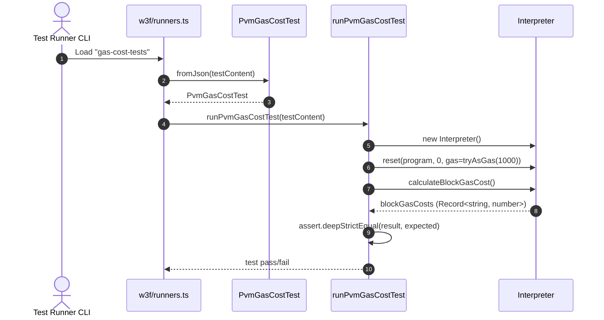

# Block gas cost

## Pull Request by @mateuszsikora

I added logic to load pvm gas cost tests and simple method to calculate gas cost of all basic blocks 

## Comment by @coderabbitai[bot]

<!-- This is an auto-generated comment: summarize by coderabbit.ai -->
<!-- This is an auto-generated comment: skip review by coderabbit.ai -->

> [!IMPORTANT]
> ## Review skipped
> 
> Auto incremental reviews are disabled on this repository.
> 
> Please check the settings in the CodeRabbit UI or the `.coderabbit.yaml` file in this repository. To trigger a single review, invoke the `@coderabbitai review` command.
> 
> You can disable this status message by setting the `reviews.review_status` to `false` in the CodeRabbit configuration file.

<!-- end of auto-generated comment: skip review by coderabbit.ai -->

<!-- walkthrough_start -->

📝 Walkthrough

<!-- This is an auto-generated comment: release notes by coderabbit.ai -->

## Summary by CodeRabbit

- New Features
  - Added per-block gas cost calculation, enabling clearer insight into gas usage across execution blocks.

- Tests
  - Introduced a new gas cost test suite that validates computed block gas costs against expected values.
  - Integrated the gas cost tests into the existing test runner to support automated verification.

<!-- end of auto-generated comment: release notes by coderabbit.ai -->
## Walkthrough
Adds a new PVM gas-cost test type and runner, introduces a helper to parse/validate test inputs, integrates the runner into the W3F test harness, and implements Interpreter.calculateBlockGasCost to compute per-basic-block gas totals used by the new tests.

## Changes
| Cohort / File(s) | Summary |
|---|---|
| **W3F test helper: PVM gas cost** `bin/test-runner/w3f/pvm-gas-cost.ts` | New module defining PvmGasCostTest (with static fromJson) and runPvmGasCostTest. Validates input shape, initializes Interpreter, resets PVM with program and gas, computes block gas costs, and asserts expected vs. actual. Includes helper validators. |
| **W3F runners integration** `bin/test-runner/w3f/runners.ts` | Imports PvmGasCostTest and runPvmGasCostTest; registers "gas-cost-tests" runner using PvmGasCostTest.fromJson and runPvmGasCostTest. |
| **Interpreter gas-cost computation** `packages/core/pvm-interpreter/interpreter.ts` | Adds calculateBlockGasCost(): iterates code using mask, detects basic block boundaries, sums instruction gas via instructionGasMap, returns Record<string, number> keyed by block index. |

## Sequence Diagram(s)

## Estimated code review effort
🎯 3 (Moderate) | ⏱️ ~25 minutes

## Suggested reviewers
- tomusdrw
- skoszuta
- DrEverr

## Poem
> I hop through blocks, count gas with care,  
> Nibbled bytes become costs to compare.  
> New runner drums a steady beat—  
> Interpreter maps each tiny feat.  
> Thump-thump! Tests pass, I twitch my nose,  
> Carrots for code where accuracy grows. 🥕

<!-- walkthrough_end -->

<!-- pre_merge_checks_walkthrough_start -->

## Pre-merge checks and finishing touches

❌ Failed checks (1 warning, 1 inconclusive)

|     Check name     | Status         | Explanation                                                                                                                                                                    | Resolution                                                                                                                                         |
| :----------------: | :------------- | :----------------------------------------------------------------------------------------------------------------------------------------------------------------------------- | :------------------------------------------------------------------------------------------------------------------------------------------------- |
| Docstring Coverage | ⚠️ Warning     | Docstring coverage is 0.00% which is insufficient. The required threshold is 80.00%.                                                                                           | You can run `@coderabbitai generate docstrings` to improve docstring coverage.                                                                     |
|     Title Check    | ❓ Inconclusive | The title “Block gas cost” is concise but too generic and does not clearly convey whether a new method or tests were added, lacking a verb or context to summarize the change. | Consider revising the title to more specifically describe the change, for example “Add calculateBlockGasCost method and PVM block gas cost tests”. |

✅ Passed checks (1 passed)

|     Check name    | Status   | Explanation                                                                                                                                                                                           |
| :---------------: | :------- | :---------------------------------------------------------------------------------------------------------------------------------------------------------------------------------------------------- |
| Description Check | ✅ Passed | The description succinctly states that logic was added to load PVM gas cost tests and a method was implemented to calculate gas costs for basic blocks, which directly matches the changes in the PR. |

<!-- pre_merge_checks_walkthrough_end -->

<!-- tips_start -->

---

Comment `@coderabbitai help` to get the list of available commands and usage tips.

<!-- tips_end -->

<!-- internal state start -->

<!-- DwQgtGAEAqAWCWBnSTIEMB26CuAXA9mAOYCmGJATmriQCaQDG+Ats2bgFyQAOFk+AIwBWJBrngA3EsgEBPRvlqU0AgfFwA6NPEgQAfACgjoCEYDEZyAAUASpETZWaCrKPR1AGxJcAQh/wMANaQRGjITIi4kJAGAHKOApRcAOwADAAc0QYAqjYAMlywuLjciBwA9OVE6rDYAhpMzOUAYh7YAGbtsnkqiOW4stwkiRQu5dzYHh7laZkx2YhJkMzUJNiIAF6I8IH4VFkAyvjYFAwkkAJUGAywXMyIYAL+QcRhYBFRMdDOpFGXmDc7tosDEDrhqOsuPghiCDDYSBJ4CQAO6UMqQAjMda0CjIgA09l2mzwaAJABEKABRKSjLI9RIedEACgw+HIPAo+ERSloAEosgBhCgkVb0ahcABMqQlAFYwABGVIK1LQCUSjipVIcAAsMoAWkYydIGBR4NxxGyOAYAJLoWg8yD+aoMDH4R34ND0bgSZghMIKSIY6S4ZCYejbZjcLzLEi4WCKV2MNAeBiTVZ+8L4QP4droKYXMLwF1PAKBRAaIz6YzgKBkeg5nAEYhkZQ0eiNNgYTgc/jCUTiKQyeRMJRUVTqLQ6KsmKBwVCoTCNwikchUNsKVjsLhUZH2RwrFwXYeKZTjzTaXRgQzV0wGNQYfrBsAUbAYVflZEAZna4x9rweHwaCGVoAERgQYFiQAAgtazarqKe5OIeDY3JgpCIEY1pdpytDYGcoaQOQu40IGsAkB4Qx8MwiiTOc1AXPAD4kbgz6vu+X4/t6zD/u8WaaCGGKwPRSjtIx0hWlAUE8HUHhFowHhhMgVg+gA4mEAp8dAwaQMiNRWtEUCRNQcntJyzAAFKIJakDNGZllssAynMGpiAaZEWmRHokBKOC8CyRgRD6dEugcvgRBUMwXCmSw9kYBo2CMbg6RQaMaCuMFIUlkEAD6oSINlHzokIVlxdFzBQRgshMhoNX8rpcaQBIybwLQxlspA6yMUQKCIH4pZubgADyfZiAYBnWDJJlIh4tBlGNwVQLwYURVw2SJclqXpQtFzPIEuVhAVfHovCTAULQwCRKaAUEhgCSUIYknSU8JmvmI8DtS+GBOS5A0ebgTLMRpXZbtYqnqZpwb8nG4rzVAWFGV28CrMgWE0BQvCxpQsOQAKyaMjwPoaMKixRPVsBBpEQM0F2GhLeFaDMASqQErgLhQYgLlMoqmq8tjuNTMgXENMmqYKTQfVBD9fFMrz43s4sFACUoJDcGCppiJSACO2DJhcsaomQgnnMTkxRGGFO4FT7AaFle15YdkQYQYUHYAAHn5SOHmRFFohJPVWApjHDSIYhMk1bQkPyV4XPg+BeJgBhQEgEuBANwf9mHybYJHuheeH2c9ZAJ17Odl1dTdd0UHoBLhy1xkBXmHiQIEJCyKGwr2KzXWhhgYr5vn0joB3t3MCMTtU5yTftP4yJ+0aCtI7JGyD8xCjA12jVI5AZWxYnkAAGrNa1JE7aWGYBlEl14bgJwkHvlKu6IeCD4llAY2j28z4mjQTDQp+S+DR2e9D6yWPoPH+z92xHXQKERigYlrcjoJAEgrshhiDahgJ25hLBQQ8GjDByACBG28qIBSa53qYP4LmFB3A9jrj2E9WSLp2DqCRE7KAVhJougYApRAoZ7R0C4AAA2+oA3Af0hEoCwEI+8j5IisTfJQD835fzcTyrxSIQFEBCOxmCYyLo2CjyWEIneJUuC2RiiVRyYNXIQ08pIsm29pqzXmuNIRdMVrbzsiVeK60UpUFkDojKUAZG7X2vlQqXBipsg0GVCqVUaoaF5JIzOoCEJyEgEI5Ou004jVwEI2WIVOHPRdKJcis1hEeIZqtPxm0hEElCaWcJDtgJF1ECXC6XdrqEUrnoHRe9ilMO3q9C0WBPQ8mEZ9URtj3LBgBsGK2XYuDTN+pDSRjFMmyOYgo9iKiuI8UAiGIJIV2ayGuMM64ozBL0UYqw5qy9kBCNRm/YUaN6mQGJrGZAjihGAzZNTTQVTmDvIgSfRpACZlHM3mgTJDARZpnFrtKWkR3nm0UpQASJBtbNQGDpGomS/nr00LbZphVJGdQbkI9FisNDK1Vl3DW2KPD9MpJEeAKx1wjmNgiJEu4SCdDoVwAAsnQeAjgDBgRApWW8WynyfV2T+eVaItGgXApBGCcFWxIIcEheQKEhIBWkJWaCAixSERRKDZyYi/oWz3OobwKBIx0KoZa5F4jtLmymTY1Zmi97wmqJESgSCYVEVtUqvgGAGZIJAuoj4YBmKIBAh1bYDcVl2M0KY9qnrXxptmYGDZcZzgcXKOG8sAkmAYFEkQE4GCCTMHgKMPYXVkHuzZQ3Ve4aeDUDRpgjQMAED8NoKwrN3AhjOGQBsgQ+AGqFsdbQxW9h+wUPQL3Yhpah4BIJK/em4h21kQzBoqICapFENnavISFByB8IrEYCCOC8GtgoYQt0s6lA8OcAQl1NC6FIIYRMEpyDEbiCNXvWIbI74GFZeIDlSCuUfJ5Ra/l7RBWQBFUO8VkrpVgCMNwNAQQ0DoXKKdEgqiwCv3Rq8pR5H36UBVRKtVODYIri1eGfczg9W5lQoa9hJqHQhotWwOMCY4UpgRSQFObqZZcGLmdTpV0iAVyMVXRMzyKOYz4NDKIoLB6UUeLtc+hUjwoHwbu7qXKCSIECGabgzbWQYDI5g1m18n3QuISsSzFnwSK2bfx3ctsdJkTGQWbYxZ9NTtfK1Q8qAfL9joASPDqYsRi2bXlC+yAypSKvm9NkLkhVoG4PF1dryTgYB88sfLLr/OMSHfhRMhaG2unBE3VLhU+1gf4IWvgiQhKIj2LrLj6FEwoKQKZmMQnZo3qg+yhCcHhSIkQwKxWwrRUYfAonK8N5ayrobGgPAy4WxrlgywTs3YdyIQPPIDJXKxxqHPFODbM4Nz1twNlFq+U5u8roNlIyC6qwGEe56DIAA2T8iogcMAYAIbUdBUi0BlNqZItAgfalB2gAAnDKdI6Q0ftDQKkNH4PaBo5dH9x7HZ1CvdmtlD7KIvt1kvIYR7GNspsAoKQAqZEgj5R+1EP7ABveaIEkC2BTnQDSm4uxWD4nQECUVkyLDxILxA8ZJi0BTrYWX295ckEV9EIXiBBo0lNAIjAmvceMh14LodtAbCvjJAENW3cBSc8CJrpzlu9fW9txgdwuAvDO9EK7rg7vdeQBAl7u3xpTTmgoQHoIbuXwe7D/5FutBrR8OzogNWmuwKh5Arwy2Lv4QODwYmrgABtVxkABcZT1zcQPsQo05999GOPrvQ8ZRAkZG+ZetcW478FECNCFKRtGc3/d4g/fnEADgEKcDN8UALgEhcK0MCQOcAQeBXRumY+rFd9BaD4EHqyLT8cKAeGPBgKQ8hkRkU6+gc1u5BPxnrBp4M3yg12h5ASBSQQys0gEPwHwBWjQK7Eem6DqgePAMvMQgNiQBoCBAPnrsTHHHgBQjnkDNsKOPBoiCmt1Gep4OcEQtRB3IgGgvAKJCJufiQogCaPAIkDAQaqQASMhnwCggzFGDPlBPaEmKJmLOJkimImNs/nvtYPvEKv/MEC1nxBbIgAvvAYgWHtREoDnsiM4KVgFAgVXkge0pWvANWsKAntnAoSBE2tUJGh4G3o3mwDnpPl4FKhlAAL4D41614gT15BBWEkA57zy0Ex7tRt6aG15h7d7rCGFJ6d7D6YAYLj7nBKA0HR5XIOAQ6MRiBUHd4rxCRRBOhySqGDpIJEL+CeiiHiFSGBjHpopCEJi5FzpeAnb5FugiaizpilECQsHBZyS2yIAEg35FjkxDrCipHyAcr16EL7qwETpYCzq2DyFaFh7IFtBj5cC56zEgRKFeFLGqGXpdSBGuEDFshVq3xm7a7GGmGMTJiWFN5LFxG+Fj5V5OFV4uGd7uGBCeHeEBBlwNwaQ0gEZeHGEhG97m4K4rGRGj5oFLH24MAfFmZcjKCkCFypAaCagACkAWvRhccCHQFBSINM/a3K2sDa+RsAxM8YM0hc6QCJyJMxQRIE8xqBbIOeAAmscEmFgJ9JkgAALXYqC3YXg77pgH6QldJEDaKJjsoIKxHvFCkKDfGkBUmuFrEqFqHbEnGmhmHnEu6vFXGSnyaJp3HzQAC6eeBetgPhCRYJYe2o7QaOJA+OAgBOqQCWJA2o6QDAn4wwaOtA6QnQ+OMon46Qnp7QDpJA8oQO3MtAn4Mo8oAiQOqQIoWOEo6QKODAaOUon4AgOx+eYQuAtgLe6xYe/p6Qn4EoogZw7QogtAAg6OcK8owwDAmoDA8oXpyQDZBOn4qQQOxZAgqQ2o2oQOaA8oDA4OiQaOn4aOqQ7QUoJA6QAgMZgZUqDhm2HIJALOlA7Ozx+U9O+gQAA= -->

<!-- internal state end -->

## Comment by @github-actions[bot]

View all

| File | Benchmark | Ops |  |
|------|-----------|-----|--|
| [codec/bigint.compare.ts[0]](../blob/7a1d8f430274e547e8dbf2bfaf7fe8df118eff5e//_work/typeberry-runner-3/typeberry/typeberry/benchmarks/codec/bigint.compare.ts) | compare custom | 255742503.79 ±6.5% | 1.15% slower |
| [codec/bigint.compare.ts[1]](../blob/7a1d8f430274e547e8dbf2bfaf7fe8df118eff5e//_work/typeberry-runner-3/typeberry/typeberry/benchmarks/codec/bigint.compare.ts) | compare bigint | 258720927.71 ±5.49% | fastest ✅ |
| [codec/bigint.decode.ts[0]](../blob/7a1d8f430274e547e8dbf2bfaf7fe8df118eff5e//_work/typeberry-runner-3/typeberry/typeberry/benchmarks/codec/bigint.decode.ts) | decode custom | 173720459.33 ±2.64% | fastest ✅ |
| [codec/bigint.decode.ts[1]](../blob/7a1d8f430274e547e8dbf2bfaf7fe8df118eff5e//_work/typeberry-runner-3/typeberry/typeberry/benchmarks/codec/bigint.decode.ts) | decode bigint | 98219612.38 ±3.08% | 43.46% slower |
| [collections/map-set.ts[0]](../blob/7a1d8f430274e547e8dbf2bfaf7fe8df118eff5e//_work/typeberry-runner-3/typeberry/typeberry/benchmarks/collections/map-set.ts) | 2 gets + conditional set | 116728.04 ±0.6% | fastest ✅ |
| [collections/map-set.ts[1]](../blob/7a1d8f430274e547e8dbf2bfaf7fe8df118eff5e//_work/typeberry-runner-3/typeberry/typeberry/benchmarks/collections/map-set.ts) | 1 get 1 set | 59942.07 ±0.27% | 48.65% slower |
| [hash/index.ts[0]](../blob/7a1d8f430274e547e8dbf2bfaf7fe8df118eff5e//_work/typeberry-runner-3/typeberry/typeberry/benchmarks/hash/index.ts) | hash with numeric representation | 184.45 ±0.39% | 18.05% slower |
| [hash/index.ts[1]](../blob/7a1d8f430274e547e8dbf2bfaf7fe8df118eff5e//_work/typeberry-runner-3/typeberry/typeberry/benchmarks/hash/index.ts) | hash with string representation | 101.91 ±1.46% | 54.72% slower |
| [hash/index.ts[2]](../blob/7a1d8f430274e547e8dbf2bfaf7fe8df118eff5e//_work/typeberry-runner-3/typeberry/typeberry/benchmarks/hash/index.ts) | hash with symbol representation | 155.35 ±3.92% | 30.98% slower |
| [hash/index.ts[3]](../blob/7a1d8f430274e547e8dbf2bfaf7fe8df118eff5e//_work/typeberry-runner-3/typeberry/typeberry/benchmarks/hash/index.ts) | hash with uint8 representation | 151.2 ±1.48% | 32.82% slower |
| [hash/index.ts[4]](../blob/7a1d8f430274e547e8dbf2bfaf7fe8df118eff5e//_work/typeberry-runner-3/typeberry/typeberry/benchmarks/hash/index.ts) | hash with packed representation | 225.07 ±2.14% | fastest ✅ |
| [hash/index.ts[5]](../blob/7a1d8f430274e547e8dbf2bfaf7fe8df118eff5e//_work/typeberry-runner-3/typeberry/typeberry/benchmarks/hash/index.ts) | hash with bigint representation | 185.19 ±0.74% | 17.72% slower |
| [hash/index.ts[6]](../blob/7a1d8f430274e547e8dbf2bfaf7fe8df118eff5e//_work/typeberry-runner-3/typeberry/typeberry/benchmarks/hash/index.ts) | hash with uint32 representation | 182.47 ±1.46% | 18.93% slower |
| [bytes/hex-from.ts[0]](../blob/7a1d8f430274e547e8dbf2bfaf7fe8df118eff5e//_work/typeberry-runner-3/typeberry/typeberry/benchmarks/bytes/hex-from.ts) | parse hex using `Number` with NaN checking | 118853.22 ±1.76% | 84.7% slower |
| [bytes/hex-from.ts[1]](../blob/7a1d8f430274e547e8dbf2bfaf7fe8df118eff5e//_work/typeberry-runner-3/typeberry/typeberry/benchmarks/bytes/hex-from.ts) | parse hex from char codes | 776775.84 ±1.59% | fastest ✅ |
| [bytes/hex-from.ts[2]](../blob/7a1d8f430274e547e8dbf2bfaf7fe8df118eff5e//_work/typeberry-runner-3/typeberry/typeberry/benchmarks/bytes/hex-from.ts) | parse hex from string nibbles | 529577.41 ±0.68% | 31.82% slower |
| [bytes/hex-to.ts[0]](../blob/7a1d8f430274e547e8dbf2bfaf7fe8df118eff5e//_work/typeberry-runner-3/typeberry/typeberry/benchmarks/bytes/hex-to.ts) | number toString + padding | 282590.22 ±1.37% | fastest ✅ |
| [bytes/hex-to.ts[1]](../blob/7a1d8f430274e547e8dbf2bfaf7fe8df118eff5e//_work/typeberry-runner-3/typeberry/typeberry/benchmarks/bytes/hex-to.ts) | manual | 14558.51 ±1.21% | 94.85% slower |
| [codec/decoding.ts[0]](../blob/7a1d8f430274e547e8dbf2bfaf7fe8df118eff5e//_work/typeberry-runner-3/typeberry/typeberry/benchmarks/codec/decoding.ts) | manual decode | 20821207.72 ±1.96% | 85.69% slower |
| [codec/decoding.ts[1]](../blob/7a1d8f430274e547e8dbf2bfaf7fe8df118eff5e//_work/typeberry-runner-3/typeberry/typeberry/benchmarks/codec/decoding.ts) | int32array decode | 145500394.69 ±3.83% | fastest ✅ |
| [codec/decoding.ts[2]](../blob/7a1d8f430274e547e8dbf2bfaf7fe8df118eff5e//_work/typeberry-runner-3/typeberry/typeberry/benchmarks/codec/decoding.ts) | dataview decode | 142532466.58 ±2.97% | 2.04% slower |
| [codec/encoding.ts[0]](../blob/7a1d8f430274e547e8dbf2bfaf7fe8df118eff5e//_work/typeberry-runner-3/typeberry/typeberry/benchmarks/codec/encoding.ts) | manual encode | 3052799.86 ±1.32% | 14.27% slower |
| [codec/encoding.ts[1]](../blob/7a1d8f430274e547e8dbf2bfaf7fe8df118eff5e//_work/typeberry-runner-3/typeberry/typeberry/benchmarks/codec/encoding.ts) | int32array encode | 3561016.97 ±1.88% | fastest ✅ |
| [codec/encoding.ts[2]](../blob/7a1d8f430274e547e8dbf2bfaf7fe8df118eff5e//_work/typeberry-runner-3/typeberry/typeberry/benchmarks/codec/encoding.ts) | dataview encode | 3499301 ±1.55% | 1.73% slower |
| [math/add_one_overflow.ts[0]](../blob/7a1d8f430274e547e8dbf2bfaf7fe8df118eff5e//_work/typeberry-runner-3/typeberry/typeberry/benchmarks/math/add_one_overflow.ts) | add and take modulus | 226017179.68 ±5.98% | fastest ✅ |
| [math/add_one_overflow.ts[1]](../blob/7a1d8f430274e547e8dbf2bfaf7fe8df118eff5e//_work/typeberry-runner-3/typeberry/typeberry/benchmarks/math/add_one_overflow.ts) | condition before calculation | 224624728.31 ±8.74% | 0.62% slower |
| [math/count-bits-u32.ts[0]](../blob/7a1d8f430274e547e8dbf2bfaf7fe8df118eff5e//_work/typeberry-runner-3/typeberry/typeberry/benchmarks/math/count-bits-u32.ts) | standard method | 72998014.15 ±1.74% | 66.52% slower |
| [math/count-bits-u32.ts[1]](../blob/7a1d8f430274e547e8dbf2bfaf7fe8df118eff5e//_work/typeberry-runner-3/typeberry/typeberry/benchmarks/math/count-bits-u32.ts) | magic | 218037599.91 ±5.57% | fastest ✅ |
| [math/count-bits-u64.ts[0]](../blob/7a1d8f430274e547e8dbf2bfaf7fe8df118eff5e//_work/typeberry-runner-3/typeberry/typeberry/benchmarks/math/count-bits-u64.ts) | standard method | 1230701.57 ±0.64% | 87.54% slower |
| [math/count-bits-u64.ts[1]](../blob/7a1d8f430274e547e8dbf2bfaf7fe8df118eff5e//_work/typeberry-runner-3/typeberry/typeberry/benchmarks/math/count-bits-u64.ts) | magic | 9879684.92 ±0.69% | fastest ✅ |
| [math/mul_overflow.ts[0]](../blob/7a1d8f430274e547e8dbf2bfaf7fe8df118eff5e//_work/typeberry-runner-3/typeberry/typeberry/benchmarks/math/mul_overflow.ts) | multiply and bring back to u32 | 256436176.94 ±5.22% | fastest ✅ |
| [math/mul_overflow.ts[1]](../blob/7a1d8f430274e547e8dbf2bfaf7fe8df118eff5e//_work/typeberry-runner-3/typeberry/typeberry/benchmarks/math/mul_overflow.ts) | multiply and take modulus | 249702425 ±6.39% | 2.63% slower |
| [math/switch.ts[0]](../blob/7a1d8f430274e547e8dbf2bfaf7fe8df118eff5e//_work/typeberry-runner-3/typeberry/typeberry/benchmarks/math/switch.ts) | switch | 247584580.61 ±6.04% | 0.89% slower |
| [math/switch.ts[1]](../blob/7a1d8f430274e547e8dbf2bfaf7fe8df118eff5e//_work/typeberry-runner-3/typeberry/typeberry/benchmarks/math/switch.ts) | if | 249813841.97 ±5.79% | fastest ✅ |
| [logger/index.ts[0]](../blob/7a1d8f430274e547e8dbf2bfaf7fe8df118eff5e//_work/typeberry-runner-3/typeberry/typeberry/benchmarks/logger/index.ts) | console.log with string concat | 6152663.69 ±52.73% | fastest ✅ |
| [logger/index.ts[1]](../blob/7a1d8f430274e547e8dbf2bfaf7fe8df118eff5e//_work/typeberry-runner-3/typeberry/typeberry/benchmarks/logger/index.ts) | console.log with args | 1447249.21 ±95.38% | 76.48% slower |
| [codec/view_vs_collection.ts[0]](../blob/7a1d8f430274e547e8dbf2bfaf7fe8df118eff5e//_work/typeberry-runner-3/typeberry/typeberry/benchmarks/codec/view_vs_collection.ts) | Get first element from Decoded | 21294.96 ±1.37% | 53.75% slower |
| [codec/view_vs_collection.ts[1]](../blob/7a1d8f430274e547e8dbf2bfaf7fe8df118eff5e//_work/typeberry-runner-3/typeberry/typeberry/benchmarks/codec/view_vs_collection.ts) | Get first element from View | 46038.63 ±1.77% | fastest ✅ |
| [codec/view_vs_collection.ts[2]](../blob/7a1d8f430274e547e8dbf2bfaf7fe8df118eff5e//_work/typeberry-runner-3/typeberry/typeberry/benchmarks/codec/view_vs_collection.ts) | Get 50th element from Decoded | 20821.75 ±1.53% | 54.77% slower |
| [codec/view_vs_collection.ts[3]](../blob/7a1d8f430274e547e8dbf2bfaf7fe8df118eff5e//_work/typeberry-runner-3/typeberry/typeberry/benchmarks/codec/view_vs_collection.ts) | Get 50th element from View | 23962.35 ±2.62% | 47.95% slower |
| [codec/view_vs_collection.ts[4]](../blob/7a1d8f430274e547e8dbf2bfaf7fe8df118eff5e//_work/typeberry-runner-3/typeberry/typeberry/benchmarks/codec/view_vs_collection.ts) | Get last element from Decoded | 21199.5 ±2.75% | 53.95% slower |
| [codec/view_vs_collection.ts[5]](../blob/7a1d8f430274e547e8dbf2bfaf7fe8df118eff5e//_work/typeberry-runner-3/typeberry/typeberry/benchmarks/codec/view_vs_collection.ts) | Get last element from View | 13904.07 ±2.3% | 69.8% slower |
| [codec/view_vs_object.ts[0]](../blob/7a1d8f430274e547e8dbf2bfaf7fe8df118eff5e//_work/typeberry-runner-3/typeberry/typeberry/benchmarks/codec/view_vs_object.ts) | Get the first field from Decoded | 370301.73 ±1.73% | 7.37% slower |
| [codec/view_vs_object.ts[1]](../blob/7a1d8f430274e547e8dbf2bfaf7fe8df118eff5e//_work/typeberry-runner-3/typeberry/typeberry/benchmarks/codec/view_vs_object.ts) | Get the first field from View | 79464.49 ±1.25% | 80.12% slower |
| [codec/view_vs_object.ts[2]](../blob/7a1d8f430274e547e8dbf2bfaf7fe8df118eff5e//_work/typeberry-runner-3/typeberry/typeberry/benchmarks/codec/view_vs_object.ts) | Get the first field as view from View | 84688.93 ±1.19% | 78.82% slower |
| [codec/view_vs_object.ts[3]](../blob/7a1d8f430274e547e8dbf2bfaf7fe8df118eff5e//_work/typeberry-runner-3/typeberry/typeberry/benchmarks/codec/view_vs_object.ts) | Get two fields from Decoded | 399783.5 ±1.5% | fastest ✅ |
| [codec/view_vs_object.ts[4]](../blob/7a1d8f430274e547e8dbf2bfaf7fe8df118eff5e//_work/typeberry-runner-3/typeberry/typeberry/benchmarks/codec/view_vs_object.ts) | Get two fields from View | 64804.03 ±1.08% | 83.79% slower |
| [codec/view_vs_object.ts[5]](../blob/7a1d8f430274e547e8dbf2bfaf7fe8df118eff5e//_work/typeberry-runner-3/typeberry/typeberry/benchmarks/codec/view_vs_object.ts) | Get two fields from materialized from View | 143214.51 ±1.12% | 64.18% slower |
| [codec/view_vs_object.ts[6]](../blob/7a1d8f430274e547e8dbf2bfaf7fe8df118eff5e//_work/typeberry-runner-3/typeberry/typeberry/benchmarks/codec/view_vs_object.ts) | Get two fields as views from View | 64281.44 ±1.01% | 83.92% slower |
| [codec/view_vs_object.ts[7]](../blob/7a1d8f430274e547e8dbf2bfaf7fe8df118eff5e//_work/typeberry-runner-3/typeberry/typeberry/benchmarks/codec/view_vs_object.ts) | Get only third field from Decoded | 381273.88 ±1.24% | 4.63% slower |
| [codec/view_vs_object.ts[8]](../blob/7a1d8f430274e547e8dbf2bfaf7fe8df118eff5e//_work/typeberry-runner-3/typeberry/typeberry/benchmarks/codec/view_vs_object.ts) | Get only third field from View | 84398.17 ±1.2% | 78.89% slower |
| [codec/view_vs_object.ts[9]](../blob/7a1d8f430274e547e8dbf2bfaf7fe8df118eff5e//_work/typeberry-runner-3/typeberry/typeberry/benchmarks/codec/view_vs_object.ts) | Get only third field as view from View | 78936.61 ±1.02% | 80.26% slower |
| [bytes/compare.ts[0]](../blob/7a1d8f430274e547e8dbf2bfaf7fe8df118eff5e//_work/typeberry-runner-3/typeberry/typeberry/benchmarks/bytes/compare.ts) | Comparing Uint32 bytes | 15613.87 ±2.64% | 24.54% slower |
| [bytes/compare.ts[1]](../blob/7a1d8f430274e547e8dbf2bfaf7fe8df118eff5e//_work/typeberry-runner-3/typeberry/typeberry/benchmarks/bytes/compare.ts) | Comparing raw bytes | 20690.6 ±2.31% | fastest ✅ |
| [collections/map_vs_sorted.ts[0]](../blob/7a1d8f430274e547e8dbf2bfaf7fe8df118eff5e//_work/typeberry-runner-3/typeberry/typeberry/benchmarks/collections/map_vs_sorted.ts) | Map | 304347.4 ±0.19% | fastest ✅ |
| [collections/map_vs_sorted.ts[1]](../blob/7a1d8f430274e547e8dbf2bfaf7fe8df118eff5e//_work/typeberry-runner-3/typeberry/typeberry/benchmarks/collections/map_vs_sorted.ts) | Map-array | 102900.42 ±0.22% | 66.19% slower |
| [collections/map_vs_sorted.ts[2]](../blob/7a1d8f430274e547e8dbf2bfaf7fe8df118eff5e//_work/typeberry-runner-3/typeberry/typeberry/benchmarks/collections/map_vs_sorted.ts) | Array | 59845.59 ±2.47% | 80.34% slower |
| [collections/map_vs_sorted.ts[3]](../blob/7a1d8f430274e547e8dbf2bfaf7fe8df118eff5e//_work/typeberry-runner-3/typeberry/typeberry/benchmarks/collections/map_vs_sorted.ts) | SortedArray | 198002.4 ±0.28% | 34.94% slower |
| [hash/blake2b.ts[0]](../blob/7a1d8f430274e547e8dbf2bfaf7fe8df118eff5e//_work/typeberry-runner-3/typeberry/typeberry/benchmarks/hash/blake2b.ts) | our hasher | 2.09 ±7.66% | fastest ✅ |
| [hash/blake2b.ts[1]](../blob/7a1d8f430274e547e8dbf2bfaf7fe8df118eff5e//_work/typeberry-runner-3/typeberry/typeberry/benchmarks/hash/blake2b.ts) | blake2b js | 0.05 ±2.3% | 97.61% slower |
| [crypto/ed25519.ts[0]](../blob/7a1d8f430274e547e8dbf2bfaf7fe8df118eff5e//_work/typeberry-runner-3/typeberry/typeberry/benchmarks/crypto/ed25519.ts) | native crypto | 6.1 ±15.83% | 80.1% slower |
| [crypto/ed25519.ts[1]](../blob/7a1d8f430274e547e8dbf2bfaf7fe8df118eff5e//_work/typeberry-runner-3/typeberry/typeberry/benchmarks/crypto/ed25519.ts) | wasm lib | 10.88 ±0.03% | 64.51% slower |
| [crypto/ed25519.ts[2]](../blob/7a1d8f430274e547e8dbf2bfaf7fe8df118eff5e//_work/typeberry-runner-3/typeberry/typeberry/benchmarks/crypto/ed25519.ts) | wasm lib batch | 30.66 ±0.47% | fastest ✅ |

### Benchmarks summary: 63/63 OK ✅

<!-- thollander/actions-comment-pull-request "benchmarks" -->

## Comment by @tomusdrw

I think we have `json.map` for this?

## Comment by @mateuszsikora

fixed
