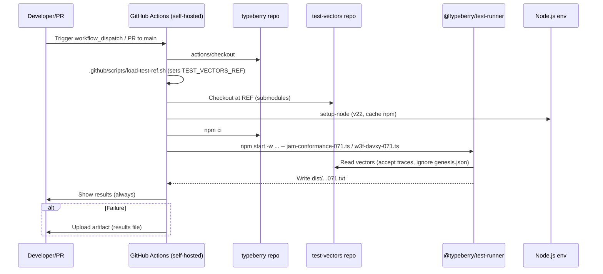

# Update to 0.7.1

## Pull Request by @tomusdrw

- [x] Update test vectors
- [x] Run `stf`, `traces` and `codec` from davxy (0.7.1)
- [x] Fix `ServiceStatistics` 0.7.1-compatibility
- [x] Fix reading `WorkPackage` codec tests from JSON.   
- [x] Make 0.7.1 the default 
- [x] Handle updating balance when there are incoming transfers (previously handled by deferred transfers) 


## Comment by @coderabbitai[bot]

<!-- This is an auto-generated comment: summarize by coderabbit.ai -->
<!-- This is an auto-generated comment: skip review by coderabbit.ai -->

> [!IMPORTANT]
> ## Review skipped
> 
> Auto incremental reviews are disabled on this repository.
> 
> Please check the settings in the CodeRabbit UI or the `.coderabbit.yaml` file in this repository. To trigger a single review, invoke the `@coderabbitai review` command.
> 
> You can disable this status message by setting the `reviews.review_status` to `false` in the CodeRabbit configuration file.

<!-- end of auto-generated comment: skip review by coderabbit.ai -->

<!-- walkthrough_start -->

<details>
<summary>📝 Walkthrough</summary>

<!-- This is an auto-generated comment: release notes by coderabbit.ai -->

## Summary by CodeRabbit

* New Features
  * Default protocol version updated to 0.7.1 for improved compatibility.
* Tests
  * Added 0.7.1 test runners for W3F davxy and JAM conformance.
* Chores
  * Introduced GitHub Actions workflows to run 0.7.1 conformance tests on PRs and manual triggers.
  * Updated test vectors reference used by CI.

<!-- end of auto-generated comment: release notes by coderabbit.ai -->
## Walkthrough
Adds v0.7.1 test-runner support and CI workflows: updates default GP version to 0.7.1, sets a new test-vectors ref SHA, introduces two GitHub Action workflows for JAM conformance and W3F davxy 0.7.1, adds corresponding TypeScript runner entry points, and updates bin/test-runner package scripts.

## Changes
| Cohort / File(s) | Summary |
| --- | --- |
| **CI workflows (v0.7.1)**<br>`.github/workflows/vectors-jam-conformance-071.yml`, `.github/workflows/vectors-w3f-davxy-071.yml` | New self-hosted GitHub Actions workflows for JAM conformance and W3F davxy 0.7.1; set TEST_VECTORS_REF and GP_VERSION=0.7.1; checkout test vectors, run npm workspace @typeberry/test-runner with respective TS entry points; show results; upload artifacts on failure. |
| **Test runner entry points (v0.7.1)**<br>`bin/test-runner/jam-conformance-071.ts`, `bin/test-runner/w3f-davxy-071.ts` | New TS scripts invoking shared main() with respective runners; target versioned vector dirs; accept traces, ignore genesis.json; log results; exit -1 on error. |
| **Test runner scripts config**<br>`bin/test-runner/package.json` | Adds/updates scripts for 0.7.1 (w3f-davxy and jam-conformance); switches 0.7.1 from preview to released; retains prior versions. |
| **Compatibility defaults**<br>`packages/core/utils/compatibility.ts` | Updates GpVersion.V0_7_1 to "0.7.1"; adds exported DEFAULT_VERSION = V0_7_1; CURRENT_VERSION now derives from DEFAULT_VERSION. |
| **Test vectors ref**<br>`.github/scripts/load-test-ref.sh` | Updates REF (TEST_VECTORS_REF) SHA to 6100c8e5c347f394c423ed83777d91713cb73fdc; echo unchanged. |

## Sequence Diagram(s)


## Estimated code review effort
🎯 3 (Moderate) | ⏱️ ~25 minutes

## Possibly related PRs
- FluffyLabs/typeberry#701 — Adds/adjusts v0.7.1 test-runner support and GP version handling, overlapping with these runner scripts and workflows.
- FluffyLabs/typeberry#673 — Automates updates to the same TEST_VECTORS_REF used by load-test-ref.sh, directly related to this REF change.
- FluffyLabs/typeberry#568 — Modifies compatibility defaults (DEFAULT_VERSION/CURRENT_VERSION) in the same utils file changed here.

## Suggested reviewers
- skoszuta
- mateuszsikora

## Poem
> A nibble of nodes, a whisker of flow,  
> I hop through vectors where conformance will show.  
> 0.7.1 on the meadow so green,  
> Runners now ready, concise and clean.  
> With logs in my pouch and artifacts tight—  
> Carrot-shaped checks all pass tonight! 🥕✨

</details>

<!-- walkthrough_end -->

<!-- pre_merge_checks_walkthrough_start -->

## Pre-merge checks and finishing touches
<details>
<summary>❌ Failed checks (1 inconclusive)</summary>

|     Check name    | Status         | Explanation                                                                                                                                        | Resolution                                                                                                                                                 |
| :---------------: | :------------- | :------------------------------------------------------------------------------------------------------------------------------------------------- | :--------------------------------------------------------------------------------------------------------------------------------------------------------- |
| Description Check | ❓ Inconclusive | The pull request description is missing any substantive detail and does not convey information about the changeset, making it too vague to assess. | Please add a brief description summarizing the purpose and scope of the changes, such as noting the version bump and key updates to workflows and scripts. |

</details>
<details>
<summary>✅ Passed checks (2 passed)</summary>

|     Check name     | Status   | Explanation                                                                                                                                                                                    |
| :----------------: | :------- | :--------------------------------------------------------------------------------------------------------------------------------------------------------------------------------------------- |
|     Title Check    | ✅ Passed | The title “Update to 0.7.1” clearly and concisely summarizes the primary purpose of the changeset, which is to bump the project and related workflows, scripts, and defaults to version 0.7.1. |
| Docstring Coverage | ✅ Passed | No functions found in the changes. Docstring coverage check skipped.                                                                                                                           |

</details>

<!-- pre_merge_checks_walkthrough_end -->

<!-- tips_start -->

---


<sub>Comment `@coderabbitai help` to get the list of available commands and usage tips.</sub>

<!-- tips_end -->

<!-- internal state start -->


<!-- DwQgtGAEAqAWCWBnSTIEMB26CuAXA9mAOYCmGJATmriQCaQDG+Ats2bgFyQAOFk+AIwBWJBrngA3EsgEBPRvlqU0AgfFwA6NPEgQAfACgjoCEejqANiS4BVbrWolIBSAAYNAdg0BGAwDlsZgFKLg9XAE4DGwAlABkuWFxcbkQOAHo0onVYbAENJmY0gDELbAAzMtlYlUQ03FluEmCKClk07mwLCzSwyJtEEOcWbERaCgB3AwBlfGwKBicBKgwGWC5cWjBXD19oNApSXEglzFWuZm0MadxqEa58Rqvokgl4EnHKVMgDauCLL4MAGEKCRHPRqFwAEyuSEAVjA3lcCO80ERHFcsI4kPCAC0jPpjOAoGR6PgyjgCMQyMoaPQCmwMJweHxBCIxJJpMd5EwlFRVOotDoCSYoHBUKhMBTCKRyFRaQpWOwuFRxpBEIELq0uQpeSo1JptLowIZCaYDBosrgcgI0ogGBR4NxcLULPg0JsaIhcGAQWUNIg1gYAEQhgwAYjDkAAggBJKmysFqjX7eRkxiwTCkRD4yB2Bzyq1OaIAUSKkAk+3gKis5bQpSc8CwhcgrvdYE9R19lDICzV9sdRzKFBYkFoDEh3hIAGZaAAWEhhABsAgAHGgGB5FztIR4GAxF65vCuMSQykpaKpFyRYUNIIvEa4GCvrwwp7OPGUp+FZwxZ5Cp3QK5Th4IG0OE3g7FODACB4U5ngwGgwAgyCrJmnLNtAxZTNAAD6ABqxaAtAADy0RTDhJZlmQrzDhgDJHBWDrVk4Ix0KO+DjBgXogmgzAANzOLATiiLA+AKhcGD0CCFyNsgzaILxJAADSQBgHGQF2IIrI2RCCU45CqpRGhGEYEbRhYNByvA+BcbezZKAwFj7NQ1m2WmJAAB7cPgFDyj5PC5BY8AMJA7DqG82YGFAfhiZ53m+Wx/kdAIQUhWF9SjqITlWTZyAfCCkDMIo8BlG8tDGQYxZevAFzyjyTggq87yhRUPlMgAsnQ8CBMGoZRWaFrZLkaTjD5ADWZSuuMtRSGIPmIGAQi8WATAYGUPkSQsWw7BosjMBYHC9UG4aRrG8Y0mx6qsCm/DkqhGBZkYMaMsOtDYAsyBoKpzUAOLqAAErk0bsrlkCjRQE1Tapin0EGBFEaRUy6Aoa0bacJBbJ4PhBpA618KtDBzFpDCyGAEloKQtAqQMFhlGAolemxFDYFxiHQA6RCkBQyA2WD42TRxOG0Eg3DUKs6CSZAAAK0RyWJMkYIhUwkM6oUYDRNn0bWTEpZymHYfhhEkWRFGlhL9A/VLhtkTGxF+JAAAU7heN4ACUiEACKno2nJfYgOk1kIgiQEGzMYDj4zZOgaokLT9P4IzUks7K5vR7VDoebj/kxUoGhCMgkKQhoHlKzQKQoCspRKOmohjTp/B4Dqyktm6wsPc40idqeiAqastf17MRwAFJRu1HdeuWogENzuPDswuOlBUshOQItQdmAs3Tz3MdJPX2DcJAOckHneVRww64IA9Klhxg9cYNw88MPAKmeaIeB3w/ao3L5Wd8EtzArRsnjTaGNtjeA0KrSOVo9KQAAAL1EaM0VodRO4+mTpQPmENECiwWCpYW2CnKyHriCdUFlkBDhHPg3AaR/6ANRhQEB21wG4A8kcB2dZxhoFkIgV2KlMD0H3q2NuulmwkM6KrfY4gyjriODZCwqYsDSPgKUAqaBkC0NWsA9GTCfTSHEYgRCMUFTcCsJnVawtxA2TrDIEgsgbL0C9Pw/Y9ASqMCcqxch/kxEWVHCLQhqdJElRkZAQRrcKqmVOhZGkrk5YwIctlFyoN3JeTaolPgyVUpq3EOIaQRgYrkCMFVcQtU2L1Q0i8N4qpTx4w6l1HqIZjr9TAEYQaVphrg0hhxGaU95pgHGHBMADgJAeVJmA3a+1DoNJOtGOMMoLoOOTFqNM91HoGGergV671fbfVVH9XAgMBDA0sbZDpAtVSlRrHjDSyd67w2NkjDsn0iCXAngAdSnGWIZIzMYuzZkJTBnTxiHVFBzLmPMsCnKmkLEWYtYCpxlrEhWKkoFwq+gTImPZ5BEGHPvYyUBlaq2ovAWiWtGJVl1sgfWuE7mI1NmWfhkBLbWymLbe2TssZuzxZAaILNwXRxpnTBm8ob4YJRWnagGdf6H0UMffOkBC7Fy5VMMuyBGyOWwEoLgfcGBjUHipIR7ZUG+j7A6J0vchI6sHuPb0m95rlO8ugI48lGhP1KkzU8Fd1XCKTAIIqb0rDbwGEcfe0rc5yrFffR+F9m6yRuF0TKjwlDaU5K8L6kbGDP2uU2f5HYkzqH0p/RxP8+lwIQU0SgyD14ir4BAMGAyvmjJ2s6PBfiuHlNIarCh88qEjXrWgYZjbmGsL4ZLUJ7oYHeM7copwaiJboF8kEsQ/AMDyOXbjbQKjj5GAANo3CIAAXRMmZKMUScq2RcPZLKzljk83JHFVJpJ0mBWClk8KuSorSoKSdQp1USl0hleUpqVTWq+S4J1YW9S+oQGaQYNQGAUFejQRgWUNDlqaLRisUBTbUhHWmWdOZcpLqLNTHdDMD131QCjLQWgn0dkwAaCQKY/YnTWqzSnO0pqjhwYQ96atqGAHoYYdosZqsrTUBQMweKqtXScwwQyhWs8RxopYEVLAfrOgzsljVKTyBq0GMgDGI4r9CaekKpcMGUdmy8HwK8c8bHPgBIOBIFS39Dj1z9i6kqL6Nnrk5MLEEc0tQMvgEQNSDp25zP9gY/ONlELESwOqPc0ht4ybkv8ydAleYVp8vq/ARA0vCRaP5Blnl1Cn2gWUhEiFnpet9ogWQKxYC0VmMgMjtAgrtzFYWeD59cDixcOTUgDdkiNwZUozdhUZUGJMnh09iTz1iUvY5a9MTbqhRSQlR9AUUovvShFHMakv1FJqomMpjVKktRqWBupzBcNNKMNxqt6CKDtHXGNCmsrEA2UmaGY9szqSEYWddJZpG0KRSgHmRMOD3ukBPrzDjA4vgghMb5+g/Syjog5VkrUXaQn+3bkGJlBEbZ2wALzOx8GAXgFT3g4xcITq2xOWVk4p94HGDL3R2YMm4LHZLMCdv8ujwZ/aRmpw0UAjDuCeClFo9z8X9CQGY5diagciEqN2fl1ozDSufBi+Wg2lGWvezsC1N5RszoBLU4GBQKQ9BSvVXbu4RcngVIU9cNjiKhixIrPQmJfAhY+AI6dDzPgShE09k9z+4pp2APneatUtq12IO3amfd2DjYeNIZQ0LhtTCIE4amX986gOkzA5I+mMHRh1ey+atABjTHOOserSrlj4nHtGue72umueRP6bgE4IPRxtNtWQDJrmqcFO4+U6wXm6mawMr04p+eX13lFDANg0QXmQpz+bt19bb9TMKa6/86ztmmbPc+pLek/CwAdZnQcQI7Bt6uZVvXZsubbWh+JT0rUQZ16f9qBzxF1kBwjASDGqyOE0RCzmHQnSxZgs2gXXAWCdDoC4G3T/yoA+iDH3VThCzC1QMgHQMiyQDh3Dn3T+ScGs2YCQAaj0R8VQDHzYlTRblkwoEyywGywoBc3+U4JQFHzy0plTis2HA+mQFK0gTPgAyqxm1m0snm1iSWwSRvTW3vU234CfR2zSkZDfXB0/RICjxOzqljxp2Ayu0gHA26hTygzNGhw+1qCYBBDSHfn+DSAKFFnEDUCCnqHzx+2OiLwI0TCuk1HLx910OLAwECEKhICCAwR9y4B+m4Dwk+Fcg0DwlcBwg8Bwm8FrHrBCXsETFxyDFZypzj3GDpzEiKI5RxkbB4DezsNcJ8hICcPEBcLcJck8PUFkHzy5SlmfTSg2yOE5wII9lLCjBsFiGpWLBJ3tlUPlFnWUy4huEZB3lvASKSO5hSLSIyKyIrlqJ1XqIcKaOcPsJYHcPgA6O8OdC5S9mkXEUng2N5mCAzFeH8n3nzAIMBBiBLD8EmOmNUnUiUFuLIVvBGKKDGImOZVZWRQQHFlQC2MyO8D4QqCnnriJRJSfzBiEgKiJymOZ3tlQDUiOCDQqmOz/SbkAwuwT1A3MJuzuwJAMBFDVlJHJDQDwGlABxj0VEZGVDQFVCCJujkCbj5H1EFCNEMEZPpHUBwngBoxwlKLoBwiLSOHpMZO8FhAYFcCnC1PAlghXEXGo1hFcAEDAhIG8GglcFcDKBXEhBIBIEXHCCnAnAXEXC+hVKJHEilJlMQDlJMIVJJDFIZPdOpxwjYAOBIBwm1TGm9KVIDIMAAG8DBIAQ4kAZYAAhV0HVOgQEFTdgKWBOWkIMLgaRf4ZSRMkOAMWYCwWgdM/AHVGWQs9dEspSMsoMJAYiKQFoGUpNBs4sgYZspMoMYWWgHlDAD2Ws5VcLfLQEC1MaBsjZbAUsgcockc8wXAKwac2uOc5mRckOZclmL2QfVyDcnVLchc/skODrMaOgGMRAdUaQCchskMc8oMJyL0Y8saZ4DtRABs7dMspMhMpMwCkOSMvwRSR81cmsd8oMc8oCoMRxXAEYU8nc2CuKJyDAebcCnNSwJwQAHAJIcaBbxWdABcAjcVBAoFXQZQJhoNXX5IdAAC9YDKCHRgiAoKBvIBg1tmxQiVZoTgo4VUAXABBAgD5hD8A2RBjJYQQnJ5RIUulqZmNm1U5ATWTgSXAOz/ZeZWcNBoK/zALQ5pB8BShjlHydKgKBy/USBHzOEKBb4HpTKzL9KoCiAYCezrFkK9KfIQtGw6x3zQK2BHzskrBjogKABfGCyAAChykCsCrgIMA8hS1ySAKC8Kgc+CxCostylKkOVCzADC2K/vAKeNEEAARwXIniUEPN5lQGoNvPcwwHkHVFXiWPECkEyhuGUSUvwE5EJJRikHkEbC0WOXQAECtS4rIyzB4rMzrnbnUCGDEgrGcqcBcDUQGFvO0qyv0q+yMtckfKlisDURnWo2jiWDeHJAqoSvh0WXgDorfxPzmHYs0wcSYEaE4v+VCOpnelRWQEJNuqcHUsSqEsk1TivPkDeMcFiVkumlTkHwMXstgosqsv2FsqIDhr0oCyAWgJBCQo2s8qyHQosF8pit3OkAuvDl0rCt0sitguiv8tirHIYG4nrmzI7I+1RtSpuAQu/PWG3I2pyvQuMtiqMTKBZhBlsnWhZhcWzScFCM9lrMZvbiYBZqG0jLVDrm4EaHKjZpDgRtiusuRq1qDFxu8oJpnL8sstitoDlo2R0m/PJrLP3WfNfNwBlggvNpDlnFoBAlhCvEfDQBXDCDhB/FnD1KtJXDKFhC1LKFUCnAEEhDHGAh2HPgEFcAPAYHCBXDVNnFXFPA8EhAYEnFhG8CzuOhCtNCgGDNDNIAjJnO9P9P0CAA= -->

<!-- internal state end -->


## Comment by @tomusdrw

@fluffylabs-bot benchmark


## Comment by @fluffylabs-bot[bot]

✅ **Benchmark workflow triggered successfully!** 🎉
**Requested by**: @tomusdrw
**PR number**: #709
**Target repository**: FluffyLabs/typeberry-testing

🔗 Check the [Actions tab](https://github.com/FluffyLabs/typeberry-testing/actions/workflows/pr-benchmark.yml) for workflow progress.


## Comment by @fluffylabs-bot[bot]

<!-- typeberry-benchmark-report -->
## Picofuzz Benchmark Results

### fallback

| Metric | Baseline | Current | Difference |
|--------|----------|---------|------------|
| min | 34.32ms | 32.88ms | ≈ -1.44ms (-4.19%) |
| mean | 81.76ms | 76.32ms | ≈ -5.44ms (-6.65%) |
| p90 | 120.85ms | 55.16ms | 🟢 -65.69ms (-54.36%) |
| p99 | 524.35ms | 464.86ms | 🟢 -59.49ms (-11.35%) |

### safrole

| Metric | Baseline | Current | Difference |
|--------|----------|---------|------------|
| min | 36.49ms | 35.98ms | ≈ -0.51ms (-1.41%) |
| mean | 127.92ms | 126.46ms | ≈ -1.47ms (-1.15%) |
| p90 | 206.71ms | 198.74ms | ≈ -7.97ms (-3.86%) |
| p99 | 435.03ms | 432.48ms | ≈ -2.55ms (-0.59%) |

### storage

| Metric | Baseline | Current | Difference |
|--------|----------|---------|------------|
| min | 37.56ms | 37.69ms | ≈ +0.13ms (+0.35%) |
| mean | 313.44ms | 307.96ms | ≈ -5.48ms (-1.75%) |
| p90 | 707.12ms | 693.23ms | ≈ -13.89ms (-1.96%) |
| p99 | 1100.75ms | 1094.87ms | ≈ -5.88ms (-0.53%) |

### storage_light

| Metric | Baseline | Current | Difference |
|--------|----------|---------|------------|
| min | 40.17ms | 39.44ms | ≈ -0.73ms (-1.83%) |
| mean | 164.21ms | 160.76ms | ≈ -3.45ms (-2.10%) |
| p90 | 349.81ms | 351.81ms | ≈ +2.00ms (+0.57%) |
| p99 | 719.34ms | 629.66ms | 🟢 -89.68ms (-12.47%) |


---
🤖 Automated benchmark


## Comment by @github-actions[bot]


<details>
<summary>View all</summary>

| File | Benchmark | Ops |  |
|------|-----------|-----|--|
| [codec/bigint.decode.ts[0]](../blob/d55ef50ecde454833884135c77277c0d06d2cbc5//_work/typeberry-runner-5/typeberry/typeberry/benchmarks/codec/bigint.decode.ts) | decode custom | 172615758.55 ±2.75% | fastest ✅ |
| [codec/bigint.decode.ts[1]](../blob/d55ef50ecde454833884135c77277c0d06d2cbc5//_work/typeberry-runner-5/typeberry/typeberry/benchmarks/codec/bigint.decode.ts) | decode bigint | 105883410.68 ±2.49% | 38.66% slower |
| [collections/map-set.ts[0]](../blob/d55ef50ecde454833884135c77277c0d06d2cbc5//_work/typeberry-runner-5/typeberry/typeberry/benchmarks/collections/map-set.ts) | 2 gets + conditional set | 70002.06 ±0.52% | fastest ✅ |
| [collections/map-set.ts[1]](../blob/d55ef50ecde454833884135c77277c0d06d2cbc5//_work/typeberry-runner-5/typeberry/typeberry/benchmarks/collections/map-set.ts) | 1 get 1 set | 42192.52 ±0.3% | 39.73% slower |
| [codec/decoding.ts[0]](../blob/d55ef50ecde454833884135c77277c0d06d2cbc5//_work/typeberry-runner-5/typeberry/typeberry/benchmarks/codec/decoding.ts) | manual decode | 23085279.6 ±0.73% | 88.34% slower |
| [codec/decoding.ts[1]](../blob/d55ef50ecde454833884135c77277c0d06d2cbc5//_work/typeberry-runner-5/typeberry/typeberry/benchmarks/codec/decoding.ts) | int32array decode | 197992738.91 ±4.59% | fastest ✅ |
| [codec/decoding.ts[2]](../blob/d55ef50ecde454833884135c77277c0d06d2cbc5//_work/typeberry-runner-5/typeberry/typeberry/benchmarks/codec/decoding.ts) | dataview decode | 193512946.5 ±3.85% | 2.26% slower |
| [codec/encoding.ts[0]](../blob/d55ef50ecde454833884135c77277c0d06d2cbc5//_work/typeberry-runner-5/typeberry/typeberry/benchmarks/codec/encoding.ts) | manual encode | 3291265.12 ±0.43% | 17.98% slower |
| [codec/encoding.ts[1]](../blob/d55ef50ecde454833884135c77277c0d06d2cbc5//_work/typeberry-runner-5/typeberry/typeberry/benchmarks/codec/encoding.ts) | int32array encode | 3878203.02 ±0.53% | 3.35% slower |
| [codec/encoding.ts[2]](../blob/d55ef50ecde454833884135c77277c0d06d2cbc5//_work/typeberry-runner-5/typeberry/typeberry/benchmarks/codec/encoding.ts) | dataview encode | 4012780.88 ±0.5% | fastest ✅ |
| [hash/index.ts[0]](../blob/d55ef50ecde454833884135c77277c0d06d2cbc5//_work/typeberry-runner-5/typeberry/typeberry/benchmarks/hash/index.ts) | hash with numeric representation | 188.5 ±0.32% | 28.06% slower |
| [hash/index.ts[1]](../blob/d55ef50ecde454833884135c77277c0d06d2cbc5//_work/typeberry-runner-5/typeberry/typeberry/benchmarks/hash/index.ts) | hash with string representation | 111.98 ±0.57% | 57.26% slower |
| [hash/index.ts[2]](../blob/d55ef50ecde454833884135c77277c0d06d2cbc5//_work/typeberry-runner-5/typeberry/typeberry/benchmarks/hash/index.ts) | hash with symbol representation | 172.15 ±0.47% | 34.3% slower |
| [hash/index.ts[3]](../blob/d55ef50ecde454833884135c77277c0d06d2cbc5//_work/typeberry-runner-5/typeberry/typeberry/benchmarks/hash/index.ts) | hash with uint8 representation | 160.05 ±0.33% | 38.92% slower |
| [hash/index.ts[4]](../blob/d55ef50ecde454833884135c77277c0d06d2cbc5//_work/typeberry-runner-5/typeberry/typeberry/benchmarks/hash/index.ts) | hash with packed representation | 262.03 ±0.33% | fastest ✅ |
| [hash/index.ts[5]](../blob/d55ef50ecde454833884135c77277c0d06d2cbc5//_work/typeberry-runner-5/typeberry/typeberry/benchmarks/hash/index.ts) | hash with bigint representation | 179.34 ±0.43% | 31.56% slower |
| [hash/index.ts[6]](../blob/d55ef50ecde454833884135c77277c0d06d2cbc5//_work/typeberry-runner-5/typeberry/typeberry/benchmarks/hash/index.ts) | hash with uint32 representation | 197.31 ±0.64% | 24.7% slower |
| [bytes/hex-from.ts[0]](../blob/d55ef50ecde454833884135c77277c0d06d2cbc5//_work/typeberry-runner-5/typeberry/typeberry/benchmarks/bytes/hex-from.ts) | parse hex using `Number` with NaN checking | 139349.71 ±0.45% | 83.97% slower |
| [bytes/hex-from.ts[1]](../blob/d55ef50ecde454833884135c77277c0d06d2cbc5//_work/typeberry-runner-5/typeberry/typeberry/benchmarks/bytes/hex-from.ts) | parse hex from char codes | 869326.26 ±0.81% | fastest ✅ |
| [bytes/hex-from.ts[2]](../blob/d55ef50ecde454833884135c77277c0d06d2cbc5//_work/typeberry-runner-5/typeberry/typeberry/benchmarks/bytes/hex-from.ts) | parse hex from string nibbles | 561835.24 ±0.21% | 35.37% slower |
| [bytes/hex-to.ts[0]](../blob/d55ef50ecde454833884135c77277c0d06d2cbc5//_work/typeberry-runner-5/typeberry/typeberry/benchmarks/bytes/hex-to.ts) | number toString + padding | 325220.5 ±0.18% | fastest ✅ |
| [bytes/hex-to.ts[1]](../blob/d55ef50ecde454833884135c77277c0d06d2cbc5//_work/typeberry-runner-5/typeberry/typeberry/benchmarks/bytes/hex-to.ts) | manual | 16193.36 ±0.53% | 95.02% slower |
| [codec/bigint.compare.ts[0]](../blob/d55ef50ecde454833884135c77277c0d06d2cbc5//_work/typeberry-runner-5/typeberry/typeberry/benchmarks/codec/bigint.compare.ts) | compare custom | 267034983.35 ±5.49% | fastest ✅ |
| [codec/bigint.compare.ts[1]](../blob/d55ef50ecde454833884135c77277c0d06d2cbc5//_work/typeberry-runner-5/typeberry/typeberry/benchmarks/codec/bigint.compare.ts) | compare bigint | 249098162.48 ±5.47% | 6.72% slower |
| [math/add_one_overflow.ts[0]](../blob/d55ef50ecde454833884135c77277c0d06d2cbc5//_work/typeberry-runner-5/typeberry/typeberry/benchmarks/math/add_one_overflow.ts) | add and take modulus | 256055286.53 ±5.09% | 2.35% slower |
| [math/add_one_overflow.ts[1]](../blob/d55ef50ecde454833884135c77277c0d06d2cbc5//_work/typeberry-runner-5/typeberry/typeberry/benchmarks/math/add_one_overflow.ts) | condition before calculation | 262230062.7 ±5.68% | fastest ✅ |
| [math/count-bits-u32.ts[0]](../blob/d55ef50ecde454833884135c77277c0d06d2cbc5//_work/typeberry-runner-5/typeberry/typeberry/benchmarks/math/count-bits-u32.ts) | standard method | 78804733.38 ±1.58% | 68.31% slower |
| [math/count-bits-u32.ts[1]](../blob/d55ef50ecde454833884135c77277c0d06d2cbc5//_work/typeberry-runner-5/typeberry/typeberry/benchmarks/math/count-bits-u32.ts) | magic | 248678777.52 ±5.69% | fastest ✅ |
| [math/count-bits-u64.ts[0]](../blob/d55ef50ecde454833884135c77277c0d06d2cbc5//_work/typeberry-runner-5/typeberry/typeberry/benchmarks/math/count-bits-u64.ts) | standard method | 8243063.77 ±0.57% | 90.76% slower |
| [math/count-bits-u64.ts[1]](../blob/d55ef50ecde454833884135c77277c0d06d2cbc5//_work/typeberry-runner-5/typeberry/typeberry/benchmarks/math/count-bits-u64.ts) | magic | 89187587.07 ±1.15% | fastest ✅ |
| [math/mul_overflow.ts[0]](../blob/d55ef50ecde454833884135c77277c0d06d2cbc5//_work/typeberry-runner-5/typeberry/typeberry/benchmarks/math/mul_overflow.ts) | multiply and bring back to u32 | 260103477.02 ±6.87% | fastest ✅ |
| [math/mul_overflow.ts[1]](../blob/d55ef50ecde454833884135c77277c0d06d2cbc5//_work/typeberry-runner-5/typeberry/typeberry/benchmarks/math/mul_overflow.ts) | multiply and take modulus | 258652993.28 ±6.19% | 0.56% slower |
| [math/switch.ts[0]](../blob/d55ef50ecde454833884135c77277c0d06d2cbc5//_work/typeberry-runner-5/typeberry/typeberry/benchmarks/math/switch.ts) | switch | 274326887.41 ±4.46% | fastest ✅ |
| [math/switch.ts[1]](../blob/d55ef50ecde454833884135c77277c0d06d2cbc5//_work/typeberry-runner-5/typeberry/typeberry/benchmarks/math/switch.ts) | if | 265807428.45 ±4.85% | 3.11% slower |
| [logger/index.ts[0]](../blob/d55ef50ecde454833884135c77277c0d06d2cbc5//_work/typeberry-runner-5/typeberry/typeberry/benchmarks/logger/index.ts) | console.log with string concat | 8646444.13 ±45.18% | fastest ✅ |
| [logger/index.ts[1]](../blob/d55ef50ecde454833884135c77277c0d06d2cbc5//_work/typeberry-runner-5/typeberry/typeberry/benchmarks/logger/index.ts) | console.log with args | 614069.13 ±124.1% | 92.9% slower |
| [codec/view_vs_collection.ts[0]](../blob/d55ef50ecde454833884135c77277c0d06d2cbc5//_work/typeberry-runner-5/typeberry/typeberry/benchmarks/codec/view_vs_collection.ts) | Get first element from Decoded | 33992.28 ±0.22% | 53.52% slower |
| [codec/view_vs_collection.ts[1]](../blob/d55ef50ecde454833884135c77277c0d06d2cbc5//_work/typeberry-runner-5/typeberry/typeberry/benchmarks/codec/view_vs_collection.ts) | Get first element from View | 73128.69 ±0.21% | fastest ✅ |
| [codec/view_vs_collection.ts[2]](../blob/d55ef50ecde454833884135c77277c0d06d2cbc5//_work/typeberry-runner-5/typeberry/typeberry/benchmarks/codec/view_vs_collection.ts) | Get 50th element from Decoded | 33934.64 ±0.15% | 53.6% slower |
| [codec/view_vs_collection.ts[3]](../blob/d55ef50ecde454833884135c77277c0d06d2cbc5//_work/typeberry-runner-5/typeberry/typeberry/benchmarks/codec/view_vs_collection.ts) | Get 50th element from View | 37814.34 ±0.24% | 48.29% slower |
| [codec/view_vs_collection.ts[4]](../blob/d55ef50ecde454833884135c77277c0d06d2cbc5//_work/typeberry-runner-5/typeberry/typeberry/benchmarks/codec/view_vs_collection.ts) | Get last element from Decoded | 33866.38 ±0.2% | 53.69% slower |
| [codec/view_vs_collection.ts[5]](../blob/d55ef50ecde454833884135c77277c0d06d2cbc5//_work/typeberry-runner-5/typeberry/typeberry/benchmarks/codec/view_vs_collection.ts) | Get last element from View | 25825.43 ±0.1% | 64.68% slower |
| [codec/view_vs_object.ts[0]](../blob/d55ef50ecde454833884135c77277c0d06d2cbc5//_work/typeberry-runner-5/typeberry/typeberry/benchmarks/codec/view_vs_object.ts) | Get the first field from Decoded | 536865.33 ±0.23% | fastest ✅ |
| [codec/view_vs_object.ts[1]](../blob/d55ef50ecde454833884135c77277c0d06d2cbc5//_work/typeberry-runner-5/typeberry/typeberry/benchmarks/codec/view_vs_object.ts) | Get the first field from View | 107665.63 ±0.2% | 79.95% slower |
| [codec/view_vs_object.ts[2]](../blob/d55ef50ecde454833884135c77277c0d06d2cbc5//_work/typeberry-runner-5/typeberry/typeberry/benchmarks/codec/view_vs_object.ts) | Get the first field as view from View | 107396.28 ±0.19% | 80% slower |
| [codec/view_vs_object.ts[3]](../blob/d55ef50ecde454833884135c77277c0d06d2cbc5//_work/typeberry-runner-5/typeberry/typeberry/benchmarks/codec/view_vs_object.ts) | Get two fields from Decoded | 533245.06 ±0.26% | 0.67% slower |
| [codec/view_vs_object.ts[4]](../blob/d55ef50ecde454833884135c77277c0d06d2cbc5//_work/typeberry-runner-5/typeberry/typeberry/benchmarks/codec/view_vs_object.ts) | Get two fields from View | 85505.35 ±0.21% | 84.07% slower |
| [codec/view_vs_object.ts[5]](../blob/d55ef50ecde454833884135c77277c0d06d2cbc5//_work/typeberry-runner-5/typeberry/typeberry/benchmarks/codec/view_vs_object.ts) | Get two fields from materialized from View | 178912.62 ±0.23% | 66.67% slower |
| [codec/view_vs_object.ts[6]](../blob/d55ef50ecde454833884135c77277c0d06d2cbc5//_work/typeberry-runner-5/typeberry/typeberry/benchmarks/codec/view_vs_object.ts) | Get two fields as views from View | 85468.52 ±0.19% | 84.08% slower |
| [codec/view_vs_object.ts[7]](../blob/d55ef50ecde454833884135c77277c0d06d2cbc5//_work/typeberry-runner-5/typeberry/typeberry/benchmarks/codec/view_vs_object.ts) | Get only third field from Decoded | 534137.71 ±0.25% | 0.51% slower |
| [codec/view_vs_object.ts[8]](../blob/d55ef50ecde454833884135c77277c0d06d2cbc5//_work/typeberry-runner-5/typeberry/typeberry/benchmarks/codec/view_vs_object.ts) | Get only third field from View | 106365.9 ±0.21% | 80.19% slower |
| [codec/view_vs_object.ts[9]](../blob/d55ef50ecde454833884135c77277c0d06d2cbc5//_work/typeberry-runner-5/typeberry/typeberry/benchmarks/codec/view_vs_object.ts) | Get only third field as view from View | 106065.29 ±0.23% | 80.24% slower |
| [bytes/compare.ts[0]](../blob/d55ef50ecde454833884135c77277c0d06d2cbc5//_work/typeberry-runner-5/typeberry/typeberry/benchmarks/bytes/compare.ts) | Comparing Uint32 bytes | 20012.76 ±1.36% | fastest ✅ |
| [bytes/compare.ts[1]](../blob/d55ef50ecde454833884135c77277c0d06d2cbc5//_work/typeberry-runner-5/typeberry/typeberry/benchmarks/bytes/compare.ts) | Comparing raw bytes | 19543.23 ±0.22% | 2.35% slower |
| [collections/map_vs_sorted.ts[0]](../blob/d55ef50ecde454833884135c77277c0d06d2cbc5//_work/typeberry-runner-5/typeberry/typeberry/benchmarks/collections/map_vs_sorted.ts) | Map | 328116.58 ±0.23% | fastest ✅ |
| [collections/map_vs_sorted.ts[1]](../blob/d55ef50ecde454833884135c77277c0d06d2cbc5//_work/typeberry-runner-5/typeberry/typeberry/benchmarks/collections/map_vs_sorted.ts) | Map-array | 103729.5 ±0.03% | 68.39% slower |
| [collections/map_vs_sorted.ts[2]](../blob/d55ef50ecde454833884135c77277c0d06d2cbc5//_work/typeberry-runner-5/typeberry/typeberry/benchmarks/collections/map_vs_sorted.ts) | Array | 74593.53 ±0.86% | 77.27% slower |
| [collections/map_vs_sorted.ts[3]](../blob/d55ef50ecde454833884135c77277c0d06d2cbc5//_work/typeberry-runner-5/typeberry/typeberry/benchmarks/collections/map_vs_sorted.ts) | SortedArray | 197117.56 ±0.33% | 39.92% slower |
| [hash/blake2b.ts[0]](../blob/d55ef50ecde454833884135c77277c0d06d2cbc5//_work/typeberry-runner-5/typeberry/typeberry/benchmarks/hash/blake2b.ts) | our hasher | 2.09 ±13.8% | fastest ✅ |
| [hash/blake2b.ts[1]](../blob/d55ef50ecde454833884135c77277c0d06d2cbc5//_work/typeberry-runner-5/typeberry/typeberry/benchmarks/hash/blake2b.ts) | blake2b js | 0.05 ±0.54% | 97.61% slower |
| [crypto/ed25519.ts[0]](../blob/d55ef50ecde454833884135c77277c0d06d2cbc5//_work/typeberry-runner-5/typeberry/typeberry/benchmarks/crypto/ed25519.ts) | native crypto | 5.83 ±17.7% | 81% slower |
| [crypto/ed25519.ts[1]](../blob/d55ef50ecde454833884135c77277c0d06d2cbc5//_work/typeberry-runner-5/typeberry/typeberry/benchmarks/crypto/ed25519.ts) | wasm lib | 10.89 ±0.03% | 64.5% slower |
| [crypto/ed25519.ts[2]](../blob/d55ef50ecde454833884135c77277c0d06d2cbc5//_work/typeberry-runner-5/typeberry/typeberry/benchmarks/crypto/ed25519.ts) | wasm lib batch | 30.68 ±0.44% | fastest ✅ |
</details>


### Benchmarks summary: 63/63 OK ✅

<!-- thollander/actions-comment-pull-request "benchmarks" -->


## Comment by @tomusdrw

@coderabbitai Please create an issue to refactor workflow files for test vectors.

Instead of having separate workflow file for each test-vector suite and version we should rather have a single workflow file with matrix strategy that lists all combinations of `<suite-name-with-version>, <gp_version>` to set (i.e. we need to have both the filename and `GP_VERSION` env variable).


## Comment by @coderabbitai[bot]

<details>
<summary>🧩 Analysis chain</summary>

🏁 Script executed:
```
#!/bin/bash
# Find all workflow files related to test vectors
fd -e yml -e yaml . .github/workflows/ | xargs grep -l "VECTORS\|test-vector" || true
# List all workflow files to understand the pattern
ls -1 .github/workflows/vectors*.yml 2>/dev/null || echo "No vectors*.yml files found"
# Check the content of the current file to understand the structure
cat .github/workflows/vectors-jam-conformance-071.yml 2>/dev/null || echo "File not accessible"
```

Length of output: 2428

---

🏁 Script executed:
```
#!/bin/bash
# Create GitHub issue for refactoring test vector workflows
gh issue create \
  --title "Refactor workflow files for test vectors into single matrix-based workflow" \
  --body "## Description

Currently, we have separate workflow files for each test-vector suite and version combination. This leads to duplication and maintenance overhead.

## Current Structure

The following workflow files exist:
- \`.github/workflows/vectors-jam-conformance-067.yml\`
- \`.github/workflows/vectors-jam-conformance-070.yml\`
- \`.github/workflows/vectors-jam-conformance-071.yml\`
- \`.github/workflows/vectors-jamduna-067.yml\`
- \`.github/workflows/vectors-javajam.yml\`
- \`.github/workflows/vectors-w3f-davxy-067.yml\`
- \`.github/workflows/vectors-w3f-davxy-070.yml\`
- \`.github/workflows/vectors-w3f-davxy-071.yml\`
- \`.github/workflows/vectors-w3f.yml\`

## Proposed Solution

Create a single workflow file with a matrix strategy that lists all combinations of:
- \`<suite-name-with-version>\` (e.g., jam-conformance-071, w3f-davxy-067)
- \`<gp_version>\` (e.g., 0.7.1, 0.7.0, 0.6.7)

This will allow us to:
- Maintain a single workflow file instead of multiple duplicates
- Easily add new suite/version combinations
- Reduce code duplication and maintenance burden

## Context

**Related PR:** https://github.com/FluffyLabs/typeberry/pull/709
**Comment:** https://github.com/FluffyLabs/typeberry/pull/709#discussion_r2422705155
**Requested by:** @tomusdrw" \
  --assignee tomusdrw
```

Length of output: 50

---


</details>

@tomusdrw, I've created issue [#710](https://github.com/FluffyLabs/typeberry/issues/710) to track the refactoring of test vector workflow files into a single matrix-based workflow. The issue includes:

- Overview of the current structure with all 9+ separate workflow files
- Proposed solution to consolidate them using a matrix strategy with suite-name-with-version and gp_version combinations
- Links back to this PR and comment for context

The issue has been assigned to you.

<!-- This is an auto-generated reply by CodeRabbit -->


## Comment by @coderabbitai[bot]

_⚠️ Potential issue_ | _🔴 Critical_

**Fix the script path.**

The w3f-davxy:0.7.1 script points to `w3f-davxy-070.ts` but should point to the new `w3f-davxy-071.ts` file that's being added in this PR. This mismatch will cause the script to run the wrong test vectors.


Apply this diff to fix the script path:

```diff
-    "w3f-davxy:0.7.1": "GP_VERSION=0.7.1 tsx ./w3f-davxy-070.ts",
+    "w3f-davxy:0.7.1": "GP_VERSION=0.7.1 tsx ./w3f-davxy-071.ts",
```

<!-- suggestion_start -->

<details>
<summary>📝 Committable suggestion</summary>

> ‼️ **IMPORTANT**
> Carefully review the code before committing. Ensure that it accurately replaces the highlighted code, contains no missing lines, and has no issues with indentation. Thoroughly test & benchmark the code to ensure it meets the requirements.

```suggestion
    "w3f-davxy:0.7.1": "GP_VERSION=0.7.1 tsx ./w3f-davxy-071.ts",
```

</details>

<!-- suggestion_end -->

<details>
<summary>🤖 Prompt for AI Agents</summary>

```
In bin/test-runner/package.json around line 38 the "w3f-davxy:0.7.1" script
references the old file w3f-davxy-070.ts; update the script command to point to
the newly added file w3f-davxy-071.ts (keeping the same env var GP_VERSION=0.7.1
and tsx invocation) so the script runs the correct test vectors.
```

</details>

<!-- This is an auto-generated comment by CodeRabbit -->
