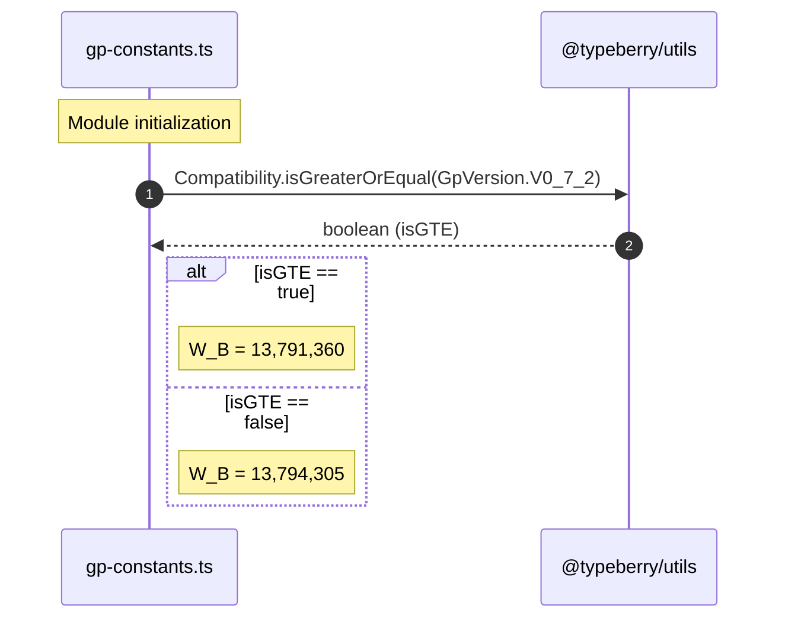

# Update W_B value

## Pull Request by @mateuszsikora

`W_B` is used in fetch constants

## Comment by @coderabbitai[bot]

<!-- This is an auto-generated comment: summarize by coderabbit.ai -->
<!-- This is an auto-generated comment: skip review by coderabbit.ai -->

> [!IMPORTANT]
> ## Review skipped
> 
> Auto incremental reviews are disabled on this repository.
> 
> Please check the settings in the CodeRabbit UI or the `.coderabbit.yaml` file in this repository. To trigger a single review, invoke the `@coderabbitai review` command.
> 
> You can disable this status message by setting the `reviews.review_status` to `false` in the CodeRabbit configuration file.

<!-- end of auto-generated comment: skip review by coderabbit.ai -->

<!-- walkthrough_start -->

📝 Walkthrough

<!-- This is an auto-generated comment: release notes by coderabbit.ai -->

## Summary by CodeRabbit

* **Bug Fixes**
  * Adjusts a version-aware constant to ensure accurate calculations on newer app versions (>= 0.7.2) while maintaining identical behavior on older versions.
  * Improves reliability by aligning internal thresholds with the correct specification for recent releases, preventing minor discrepancies users could encounter in certain operations.
  * No user-facing settings or workflows are altered; results should be more consistent across supported versions.

<!-- end of auto-generated comment: release notes by coderabbit.ai -->
## Walkthrough
The change updates gp-constants.ts to import Compatibility and GpVersion, and modifies the exported W_B constant to a conditional value that depends on whether the current GpVersion is greater than or equal to V0_7_2. Documentation for W_B is adjusted to reflect the conditional behavior.

## Changes
| Cohort / File(s) | Summary |
|---|---|
| **Version-gated constant update** `packages/jam/block/gp-constants.ts` | Added imports from `@typeberry/utils`. Changed `W_B` from a fixed number to a conditional value using `Compatibility.isGreaterOrEqual(GpVersion.V0_7_2) ? 13_791_360 : 13_794_305`. Updated inline documentation accordingly. |

## Sequence Diagram(s)

## Estimated code review effort
🎯 2 (Simple) | ⏱️ ~10 minutes

## Poem
> I nudge my nose at versions’ gate,  
> Two paths of bytes decide our fate;  
> A hop to newer, trim the weight,  
> Or pause with older, just as great—  
> Carrots count, and so do states;  
> W\_B set—compile awaits! 🥕

<!-- walkthrough_end -->

<!-- pre_merge_checks_walkthrough_start -->

## Pre-merge checks and finishing touches

❌ Failed checks (1 inconclusive)

|     Check name    | Status         | Explanation                                                                                                                                                                                                                | Resolution                                                                                                                                                                      |
| :---------------: | :------------- | :------------------------------------------------------------------------------------------------------------------------------------------------------------------------------------------------------------------------- | :------------------------------------------------------------------------------------------------------------------------------------------------------------------------------ |
| Description Check | ❓ Inconclusive | The description only states that W_B is used in fetch constants without mentioning the actual update to its value or the version-based logic introduced in this PR, making it vague and generic relative to the changeset. | Please expand the description to explain that the PR updates the W_B constant to use a version-based conditional value rather than simply stating its usage in fetch constants. |

✅ Passed checks (2 passed)

|     Check name     | Status   | Explanation                                                                                                                                                                                   |
| :----------------: | :------- | :-------------------------------------------------------------------------------------------------------------------------------------------------------------------------------------------- |
|     Title Check    | ✅ Passed | The title “Update W_B value” clearly summarizes the primary change of the pull request, namely modifying the W_B constant. It is concise, specific, and aligns with the main code alteration. |
| Docstring Coverage | ✅ Passed | No functions found in the changes. Docstring coverage check skipped.                                                                                                                          |

<!-- pre_merge_checks_walkthrough_end -->

<!-- tips_start -->

---

Comment `@coderabbitai help` to get the list of available commands and usage tips.

<!-- tips_end -->

<!-- internal state start -->

<!-- DwQgtGAEAqAWCWBnSTIEMB26CuAXA9mAOYCmGJATmriQCaQDG+Ats2bgFyQAOFk+AIwBWJBrngA3EsgEBPRvlqU0AgfFwA6NPEgQAfACgjoCEYDEZyAAUASpETZWaCrI5Ho6gDYkuAVW601CSQAOoA+gBCkBJontjBkAYAco4ClFwA7ACMAByQib42ADJcsLi43IgcAPTVROqw2AIaTMzVAGJxAGZdskUqiNW4stwkaRQu1dzYnp7V2XkFiOmQzEHYiABeiPAA1vhU+QYAyvjYFAzBAlQYDLBczIhg2AFBYADuYQJgTBiIuEdoM5SADrpg7g9tFhEsdcNQNlx8KNoQYbCQJPASO9KFVIARmBtaBR3gAaez7LZ4NBkgAiFAAolIJkd+mlPLiABQYfDkACURwAwhQSEF6NQuAAmAAMEoArGAslKFQBmaBZAAsHFlso4ypyAC0jDTpAwKPBuOIeW4AAbhCLWlDIDZ0FBYLokXB3BR/OEYXCIIz6YzgKBkej4Lo4AjEMjKGj0VpsP1cXj8YSicRSGTyJhKKiqdRaHRBkxQOCoVCYKOEUjkKjxhSsdhcKjveyONYuSByBR5lRqTTaXRgQzB0wGbhoBi7NCkQZCNBtASefDTurcH48/6Yf0af1uABER4MFkgAEEAJIxuui9tOLsRxiwTBzwOQC9+iiKbCXZBoSDkG28DMNwBwAo+AosJO4hqJ46jyJg9AAOLcAAaji8A8pAXRfswkAHgAAsMozjJMeDwOyB4aAYUD+IENDILgsDBHa3rbn6eL4N2wS/LQ6iYRgsRcPAkYoehFA7FhqBEMKQR8AckAkAAjtgsScZAqFSmEGRhBKZKsWkrTSJAWTKiSGQAJxZCSyoAGxSgA3PwTGUO8SDBOokDCms8B/CZZmWeqNlSrKGgwMx6AMK0k4YLIvlEJAtCro47DUAJ2EKaxqAvPRLpTkwFB8RgRCeLI1EnpY5iWGeng0PWAmMVxLmJaInjOGlW78JGJAAB6gRQDYKdMy7wAwil+vx0hvgAsooImYrQXC/P8oSRK62EUcERAbstvq7v62G4egG09S6MRxMEHKmdpFnqmEyohfyBDHbx/E8mpvW8NIklYAIaDLOGWCQSBaWwfBGhIEhsl1QA8gyKmxByYkYTyGiadpun8gA/P5N1ZPd9mQFw12BfdIVGPS/zAbeubBMKGJYopPRgVw010PAjgGEeB6BiOY6hhg4aRmgeA1rG9YuomzZeWgbYOPe8g9rT+YDkWw6GKWjbMOoYTwLQiBhPTmLYrQYTbgN6v89hsq0LQEoMLKUo5FFtAZLZsoZGkAgZF0aDqhKFlSl0GQZDksokCQockFkWTSpbBia4mOt6wbRtYnQYRhpbmtfWEbAUKQYR3KIuwG+bAJBgYADeBj5AeSC2BEK7TnQwNJrgVj4P8dAHlwvvsiQJK1/hiCwGcni0E3q67LYvfYbEyxD3XSAw0yZq22Qc/94vw8HnxtA2NgGA0qusJmsViACsx05z7gFDxEv+H74fGAeLg3hXyXt/34Pu/P0fxpECmnNJaDAn8b5cDvg/XecEMC7DoBeRADhpBnznkeR+B42r/HAbsNEDhaqIDngAbWHvkGu+QKH4WLtOJIi4SBoLft4SAOCDyP0oQebcuANjf2gZQuun02qCVAQwiK4h37BEADgEdEgirSiOdeIgBcAkYN4ZwpU7ydngJsYyzVeDUy7HcF8wRHw6JmJ4Lyyl4j/DJIJNgajmBzV6PFPEEVWK7R3GFC8AJUC/AYO5MkiBRi+K6KNMkiF0BwSIH5NyTFnHBB8lgWm4S6odQwBoVhpCKEHmFIgfAcRhFcAPEkLiBjirGXIHQPKjFRFeA8sgBgKi+BhPyucIIajhRdG8GIKpcSoRPkMWkthmT7FKDQe8ZwGB4rpL4fhYUvxglEHOPQvuC9f7TIPAceA9RBKeBwbQtgaCxHeB5pQgAvoM8hfCDzUN2HspZ+FAHAItOlFhgy66cO4csgerz8ICMwCkkRwQlBALNE8rCPI1GcO0c+AEWUnQA3Wu6T0sA2J7WQNEseeBVjsAEk45qU4uFqRyjI566hkDyKMXwZqTIfpgD+vClc9Qxq+Tvt+S49BfLONQLYMkaxdhOM8jEBZwQwm1koKNcxbVMzBGes1Epc4PQDIyXXbJuTyI8jQVYFRyxFJ9TCc1IFjzQHqV+Rypi1BYnWDsEShiFrXFbj2upZ0x1qUCVpf9SWPI+KgLUuSmWLlKXPiwDsECEK4TiGKigA6GxZweTdB6L0bi/SIEVWs4ZdyDxjIoBM4qUzLmzJ5PMxZPDVmXI2Vs2Iuy6FoINSC4RGSzkZIuew65ty0EnwYP8c+CVIJMhjbm9h7zCGQJ/t8g8vyhECTQUU7CR8xANQykfdlWBZWBrnGFdtnanFMF7aQJ8JdyTmlGLQFNly02jPGZM0dZbfIVuvjcqtBSkodrvvFQh9bh4AF0MFYI7jYB5tbJ0FIEHZKUUoRQkClOqZUAgLICByLZEgsplQSkjrQCyypHZoGVBZWgso5RZDgwwLo9sGB2SUBZKcsoY4MAEERnISgg6gfod+/6v7GHpsDhh4jWQGBoE9jkSOPGbYkADp7LIFkug5AlLhgQ/t1QMHVGgcOtkMiynVMRqUtGaNSlsl0WyftTLqgExhhgPMTlW1zvnQu1yDZZ30EAA= -->

<!-- internal state end -->

## Comment by @github-actions[bot]

View all

| File | Benchmark | Ops |  |
|------|-----------|-----|--|
| [bytes/hex-from.ts[0]](../blob/0cf0f29f2e12f4143cd9a96bb0a581cbf32ee340//_work/typeberry-1/typeberry/typeberry/benchmarks/bytes/hex-from.ts) | parse hex using `Number` with NaN checking | 141953.51 ±0.29% | 83.55% slower |
| [bytes/hex-from.ts[1]](../blob/0cf0f29f2e12f4143cd9a96bb0a581cbf32ee340//_work/typeberry-1/typeberry/typeberry/benchmarks/bytes/hex-from.ts) | parse hex from char codes | 862710.96 ±0.41% | fastest ✅ |
| [bytes/hex-from.ts[2]](../blob/0cf0f29f2e12f4143cd9a96bb0a581cbf32ee340//_work/typeberry-1/typeberry/typeberry/benchmarks/bytes/hex-from.ts) | parse hex from string nibbles | 545462.12 ±0.33% | 36.77% slower |
| [bytes/hex-to.ts[0]](../blob/0cf0f29f2e12f4143cd9a96bb0a581cbf32ee340//_work/typeberry-1/typeberry/typeberry/benchmarks/bytes/hex-to.ts) | number toString + padding | 309897.25 ±0.37% | fastest ✅ |
| [bytes/hex-to.ts[1]](../blob/0cf0f29f2e12f4143cd9a96bb0a581cbf32ee340//_work/typeberry-1/typeberry/typeberry/benchmarks/bytes/hex-to.ts) | manual | 15153.37 ±0.3% | 95.11% slower |
| [codec/bigint.compare.ts[0]](../blob/0cf0f29f2e12f4143cd9a96bb0a581cbf32ee340//_work/typeberry-1/typeberry/typeberry/benchmarks/codec/bigint.compare.ts) | compare custom | 262643244.44 ±5.18% | 0.37% slower |
| [codec/bigint.compare.ts[1]](../blob/0cf0f29f2e12f4143cd9a96bb0a581cbf32ee340//_work/typeberry-1/typeberry/typeberry/benchmarks/codec/bigint.compare.ts) | compare bigint | 263618794.79 ±5.28% | fastest ✅ |
| [codec/bigint.decode.ts[0]](../blob/0cf0f29f2e12f4143cd9a96bb0a581cbf32ee340//_work/typeberry-1/typeberry/typeberry/benchmarks/codec/bigint.decode.ts) | decode custom | 172701606.19 ±2.08% | fastest ✅ |
| [codec/bigint.decode.ts[1]](../blob/0cf0f29f2e12f4143cd9a96bb0a581cbf32ee340//_work/typeberry-1/typeberry/typeberry/benchmarks/codec/bigint.decode.ts) | decode bigint | 105956611.98 ±2.16% | 38.65% slower |
| [collections/map-set.ts[0]](../blob/0cf0f29f2e12f4143cd9a96bb0a581cbf32ee340//_work/typeberry-1/typeberry/typeberry/benchmarks/collections/map-set.ts) | 2 gets + conditional set | 117470.46 ±0.35% | fastest ✅ |
| [collections/map-set.ts[1]](../blob/0cf0f29f2e12f4143cd9a96bb0a581cbf32ee340//_work/typeberry-1/typeberry/typeberry/benchmarks/collections/map-set.ts) | 1 get 1 set | 60586.8 ±0.15% | 48.42% slower |
| [math/add_one_overflow.ts[0]](../blob/0cf0f29f2e12f4143cd9a96bb0a581cbf32ee340//_work/typeberry-1/typeberry/typeberry/benchmarks/math/add_one_overflow.ts) | add and take modulus | 251022163.17 ±6.27% | 1.61% slower |
| [math/add_one_overflow.ts[1]](../blob/0cf0f29f2e12f4143cd9a96bb0a581cbf32ee340//_work/typeberry-1/typeberry/typeberry/benchmarks/math/add_one_overflow.ts) | condition before calculation | 255138997.36 ±6.17% | fastest ✅ |
| [math/count-bits-u32.ts[0]](../blob/0cf0f29f2e12f4143cd9a96bb0a581cbf32ee340//_work/typeberry-1/typeberry/typeberry/benchmarks/math/count-bits-u32.ts) | standard method | 77180287.55 ±1.44% | 68.39% slower |
| [math/count-bits-u32.ts[1]](../blob/0cf0f29f2e12f4143cd9a96bb0a581cbf32ee340//_work/typeberry-1/typeberry/typeberry/benchmarks/math/count-bits-u32.ts) | magic | 244178258.53 ±5.19% | fastest ✅ |
| [hash/index.ts[0]](../blob/0cf0f29f2e12f4143cd9a96bb0a581cbf32ee340//_work/typeberry-1/typeberry/typeberry/benchmarks/hash/index.ts) | hash with numeric representation | 192.35 ±0.24% | 26.66% slower |
| [hash/index.ts[1]](../blob/0cf0f29f2e12f4143cd9a96bb0a581cbf32ee340//_work/typeberry-1/typeberry/typeberry/benchmarks/hash/index.ts) | hash with string representation | 119.35 ±0.29% | 54.5% slower |
| [hash/index.ts[2]](../blob/0cf0f29f2e12f4143cd9a96bb0a581cbf32ee340//_work/typeberry-1/typeberry/typeberry/benchmarks/hash/index.ts) | hash with symbol representation | 180.77 ±0.31% | 31.08% slower |
| [hash/index.ts[3]](../blob/0cf0f29f2e12f4143cd9a96bb0a581cbf32ee340//_work/typeberry-1/typeberry/typeberry/benchmarks/hash/index.ts) | hash with uint8 representation | 161.66 ±0.27% | 38.36% slower |
| [hash/index.ts[4]](../blob/0cf0f29f2e12f4143cd9a96bb0a581cbf32ee340//_work/typeberry-1/typeberry/typeberry/benchmarks/hash/index.ts) | hash with packed representation | 262.28 ±0.36% | fastest ✅ |
| [hash/index.ts[5]](../blob/0cf0f29f2e12f4143cd9a96bb0a581cbf32ee340//_work/typeberry-1/typeberry/typeberry/benchmarks/hash/index.ts) | hash with bigint representation | 189.95 ±0.5% | 27.58% slower |
| [hash/index.ts[6]](../blob/0cf0f29f2e12f4143cd9a96bb0a581cbf32ee340//_work/typeberry-1/typeberry/typeberry/benchmarks/hash/index.ts) | hash with uint32 representation | 197.95 ±0.43% | 24.53% slower |
| [codec/decoding.ts[0]](../blob/0cf0f29f2e12f4143cd9a96bb0a581cbf32ee340//_work/typeberry-1/typeberry/typeberry/benchmarks/codec/decoding.ts) | manual decode | 22344437.4 ±0.73% | 86.55% slower |
| [codec/decoding.ts[1]](../blob/0cf0f29f2e12f4143cd9a96bb0a581cbf32ee340//_work/typeberry-1/typeberry/typeberry/benchmarks/codec/decoding.ts) | int32array decode | 166068850.9 ±2.46% | fastest ✅ |
| [codec/decoding.ts[2]](../blob/0cf0f29f2e12f4143cd9a96bb0a581cbf32ee340//_work/typeberry-1/typeberry/typeberry/benchmarks/codec/decoding.ts) | dataview decode | 159908522.03 ±2.87% | 3.71% slower |
| [codec/encoding.ts[0]](../blob/0cf0f29f2e12f4143cd9a96bb0a581cbf32ee340//_work/typeberry-1/typeberry/typeberry/benchmarks/codec/encoding.ts) | manual encode | 2889934.67 ±0.66% | 20.14% slower |
| [codec/encoding.ts[1]](../blob/0cf0f29f2e12f4143cd9a96bb0a581cbf32ee340//_work/typeberry-1/typeberry/typeberry/benchmarks/codec/encoding.ts) | int32array encode | 3468748.59 ±1.19% | 4.15% slower |
| [codec/encoding.ts[2]](../blob/0cf0f29f2e12f4143cd9a96bb0a581cbf32ee340//_work/typeberry-1/typeberry/typeberry/benchmarks/codec/encoding.ts) | dataview encode | 3618842.85 ±0.66% | fastest ✅ |
| [logger/index.ts[0]](../blob/0cf0f29f2e12f4143cd9a96bb0a581cbf32ee340//_work/typeberry-1/typeberry/typeberry/benchmarks/logger/index.ts) | console.log with string concat | 6360944.37 ±54.73% | fastest ✅ |
| [logger/index.ts[1]](../blob/0cf0f29f2e12f4143cd9a96bb0a581cbf32ee340//_work/typeberry-1/typeberry/typeberry/benchmarks/logger/index.ts) | console.log with args | 1467716.6 ±100.08% | 76.93% slower |
| [math/count-bits-u64.ts[0]](../blob/0cf0f29f2e12f4143cd9a96bb0a581cbf32ee340//_work/typeberry-1/typeberry/typeberry/benchmarks/math/count-bits-u64.ts) | standard method | 3017943.64 ±5.85% | 96.4% slower |
| [math/count-bits-u64.ts[1]](../blob/0cf0f29f2e12f4143cd9a96bb0a581cbf32ee340//_work/typeberry-1/typeberry/typeberry/benchmarks/math/count-bits-u64.ts) | magic | 83787767.28 ±0.76% | fastest ✅ |
| [math/mul_overflow.ts[0]](../blob/0cf0f29f2e12f4143cd9a96bb0a581cbf32ee340//_work/typeberry-1/typeberry/typeberry/benchmarks/math/mul_overflow.ts) | multiply and bring back to u32 | 248134236.61 ±5.73% | 2.28% slower |
| [math/mul_overflow.ts[1]](../blob/0cf0f29f2e12f4143cd9a96bb0a581cbf32ee340//_work/typeberry-1/typeberry/typeberry/benchmarks/math/mul_overflow.ts) | multiply and take modulus | 253919096.77 ±5.42% | fastest ✅ |
| [math/switch.ts[0]](../blob/0cf0f29f2e12f4143cd9a96bb0a581cbf32ee340//_work/typeberry-1/typeberry/typeberry/benchmarks/math/switch.ts) | switch | 262186310.3 ±4.09% | fastest ✅ |
| [math/switch.ts[1]](../blob/0cf0f29f2e12f4143cd9a96bb0a581cbf32ee340//_work/typeberry-1/typeberry/typeberry/benchmarks/math/switch.ts) | if | 254712651.21 ±4.97% | 2.85% slower |
| [codec/view_vs_collection.ts[0]](../blob/0cf0f29f2e12f4143cd9a96bb0a581cbf32ee340//_work/typeberry-1/typeberry/typeberry/benchmarks/codec/view_vs_collection.ts) | Get first element from Decoded | 24504.89 ±0.99% | 55.48% slower |
| [codec/view_vs_collection.ts[1]](../blob/0cf0f29f2e12f4143cd9a96bb0a581cbf32ee340//_work/typeberry-1/typeberry/typeberry/benchmarks/codec/view_vs_collection.ts) | Get first element from View | 55044.15 ±0.85% | fastest ✅ |
| [codec/view_vs_collection.ts[2]](../blob/0cf0f29f2e12f4143cd9a96bb0a581cbf32ee340//_work/typeberry-1/typeberry/typeberry/benchmarks/codec/view_vs_collection.ts) | Get 50th element from Decoded | 24685.68 ±1.11% | 55.15% slower |
| [codec/view_vs_collection.ts[3]](../blob/0cf0f29f2e12f4143cd9a96bb0a581cbf32ee340//_work/typeberry-1/typeberry/typeberry/benchmarks/codec/view_vs_collection.ts) | Get 50th element from View | 27204.31 ±1.15% | 50.58% slower |
| [codec/view_vs_collection.ts[4]](../blob/0cf0f29f2e12f4143cd9a96bb0a581cbf32ee340//_work/typeberry-1/typeberry/typeberry/benchmarks/codec/view_vs_collection.ts) | Get last element from Decoded | 24728.6 ±1.15% | 55.07% slower |
| [codec/view_vs_collection.ts[5]](../blob/0cf0f29f2e12f4143cd9a96bb0a581cbf32ee340//_work/typeberry-1/typeberry/typeberry/benchmarks/codec/view_vs_collection.ts) | Get last element from View | 18331.14 ±1.02% | 66.7% slower |
| [codec/view_vs_object.ts[0]](../blob/0cf0f29f2e12f4143cd9a96bb0a581cbf32ee340//_work/typeberry-1/typeberry/typeberry/benchmarks/codec/view_vs_object.ts) | Get the first field from Decoded | 162491.95 ±116.86% | 57.59% slower |
| [codec/view_vs_object.ts[1]](../blob/0cf0f29f2e12f4143cd9a96bb0a581cbf32ee340//_work/typeberry-1/typeberry/typeberry/benchmarks/codec/view_vs_object.ts) | Get the first field from View | 55922.29 ±6.05% | 85.4% slower |
| [codec/view_vs_object.ts[2]](../blob/0cf0f29f2e12f4143cd9a96bb0a581cbf32ee340//_work/typeberry-1/typeberry/typeberry/benchmarks/codec/view_vs_object.ts) | Get the first field as view from View | 68276.7 ±1.11% | 82.18% slower |
| [codec/view_vs_object.ts[3]](../blob/0cf0f29f2e12f4143cd9a96bb0a581cbf32ee340//_work/typeberry-1/typeberry/typeberry/benchmarks/codec/view_vs_object.ts) | Get two fields from Decoded | 379915.8 ±2.35% | 0.84% slower |
| [codec/view_vs_object.ts[4]](../blob/0cf0f29f2e12f4143cd9a96bb0a581cbf32ee340//_work/typeberry-1/typeberry/typeberry/benchmarks/codec/view_vs_object.ts) | Get two fields from View | 61804.67 ±1.03% | 83.87% slower |
| [codec/view_vs_object.ts[5]](../blob/0cf0f29f2e12f4143cd9a96bb0a581cbf32ee340//_work/typeberry-1/typeberry/typeberry/benchmarks/codec/view_vs_object.ts) | Get two fields from materialized from View | 133934.24 ±0.82% | 65.04% slower |
| [codec/view_vs_object.ts[6]](../blob/0cf0f29f2e12f4143cd9a96bb0a581cbf32ee340//_work/typeberry-1/typeberry/typeberry/benchmarks/codec/view_vs_object.ts) | Get two fields as views from View | 61540.25 ±0.87% | 83.94% slower |
| [codec/view_vs_object.ts[7]](../blob/0cf0f29f2e12f4143cd9a96bb0a581cbf32ee340//_work/typeberry-1/typeberry/typeberry/benchmarks/codec/view_vs_object.ts) | Get only third field from Decoded | 383149.28 ±0.76% | fastest ✅ |
| [codec/view_vs_object.ts[8]](../blob/0cf0f29f2e12f4143cd9a96bb0a581cbf32ee340//_work/typeberry-1/typeberry/typeberry/benchmarks/codec/view_vs_object.ts) | Get only third field from View | 78621.5 ±0.64% | 79.48% slower |
| [codec/view_vs_object.ts[9]](../blob/0cf0f29f2e12f4143cd9a96bb0a581cbf32ee340//_work/typeberry-1/typeberry/typeberry/benchmarks/codec/view_vs_object.ts) | Get only third field as view from View | 78000.49 ±0.96% | 79.64% slower |
| [bytes/compare.ts[0]](../blob/0cf0f29f2e12f4143cd9a96bb0a581cbf32ee340//_work/typeberry-1/typeberry/typeberry/benchmarks/bytes/compare.ts) | Comparing Uint32 bytes | 16730.04 ±3.1% | 19.2% slower |
| [bytes/compare.ts[1]](../blob/0cf0f29f2e12f4143cd9a96bb0a581cbf32ee340//_work/typeberry-1/typeberry/typeberry/benchmarks/bytes/compare.ts) | Comparing raw bytes | 20706.51 ±1.99% | fastest ✅ |
| [collections/map_vs_sorted.ts[0]](../blob/0cf0f29f2e12f4143cd9a96bb0a581cbf32ee340//_work/typeberry-1/typeberry/typeberry/benchmarks/collections/map_vs_sorted.ts) | Map | 300428.34 ±0.41% | fastest ✅ |
| [collections/map_vs_sorted.ts[1]](../blob/0cf0f29f2e12f4143cd9a96bb0a581cbf32ee340//_work/typeberry-1/typeberry/typeberry/benchmarks/collections/map_vs_sorted.ts) | Map-array | 99865.07 ±0.39% | 66.76% slower |
| [collections/map_vs_sorted.ts[2]](../blob/0cf0f29f2e12f4143cd9a96bb0a581cbf32ee340//_work/typeberry-1/typeberry/typeberry/benchmarks/collections/map_vs_sorted.ts) | Array | 65736.31 ±0.87% | 78.12% slower |
| [collections/map_vs_sorted.ts[3]](../blob/0cf0f29f2e12f4143cd9a96bb0a581cbf32ee340//_work/typeberry-1/typeberry/typeberry/benchmarks/collections/map_vs_sorted.ts) | SortedArray | 193936.59 ±0.61% | 35.45% slower |
| [hash/blake2b.ts[0]](../blob/0cf0f29f2e12f4143cd9a96bb0a581cbf32ee340//_work/typeberry-1/typeberry/typeberry/benchmarks/hash/blake2b.ts) | our hasher | 2.23 ±0.35% | fastest ✅ |
| [hash/blake2b.ts[1]](../blob/0cf0f29f2e12f4143cd9a96bb0a581cbf32ee340//_work/typeberry-1/typeberry/typeberry/benchmarks/hash/blake2b.ts) | blake2b js | 0.05 ±0.32% | 97.76% slower |
| [crypto/ed25519.ts[0]](../blob/0cf0f29f2e12f4143cd9a96bb0a581cbf32ee340//_work/typeberry-1/typeberry/typeberry/benchmarks/crypto/ed25519.ts) | native crypto | 5.55 ±17.5% | 81.9% slower |
| [crypto/ed25519.ts[1]](../blob/0cf0f29f2e12f4143cd9a96bb0a581cbf32ee340//_work/typeberry-1/typeberry/typeberry/benchmarks/crypto/ed25519.ts) | wasm lib | 10.88 ±0.03% | 64.51% slower |
| [crypto/ed25519.ts[2]](../blob/0cf0f29f2e12f4143cd9a96bb0a581cbf32ee340//_work/typeberry-1/typeberry/typeberry/benchmarks/crypto/ed25519.ts) | wasm lib batch | 30.66 ±0.5% | fastest ✅ |

### Benchmarks summary: 63/63 OK ✅

<!-- thollander/actions-comment-pull-request "benchmarks" -->

## Comment by @tomusdrw

Can you update the link?

## Comment by @mateuszsikora

done
